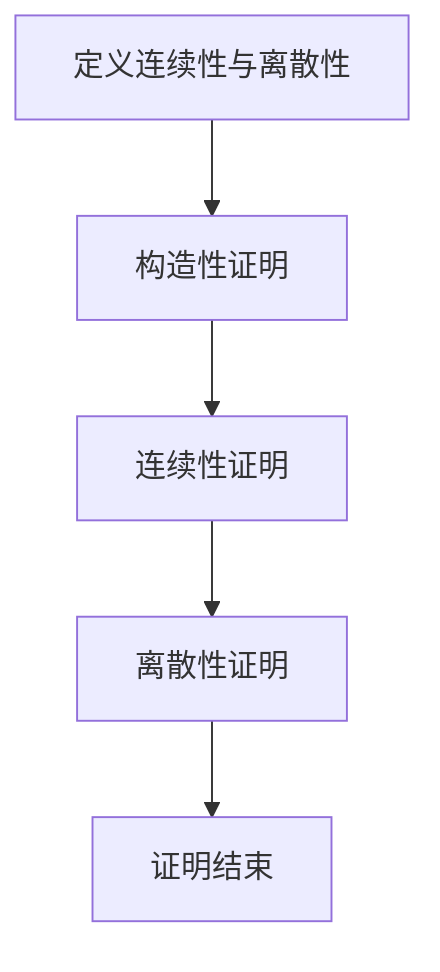
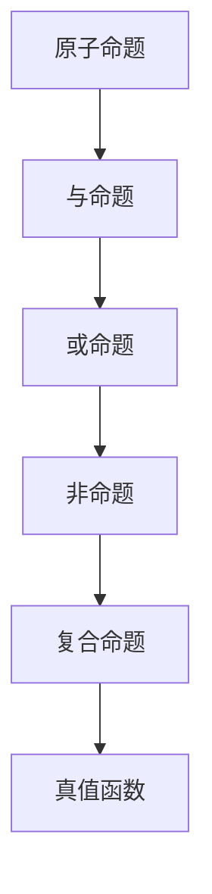
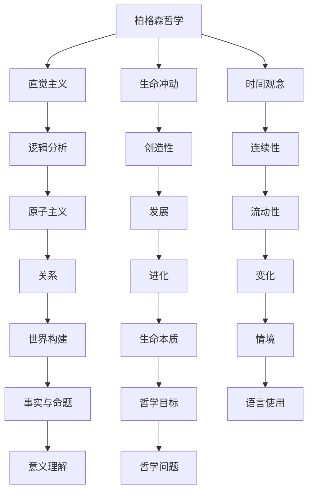
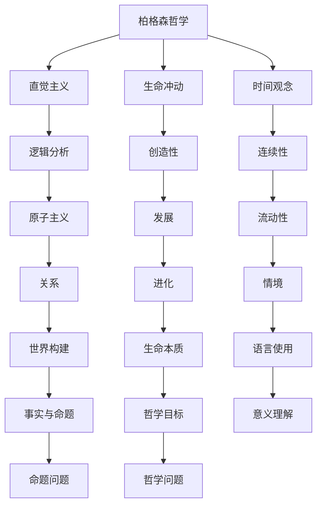

                 

# 《直觉与逻辑：柏格森与维特根斯坦哲学核心的碰撞》

> 关键词：柏格森、维特根斯坦、直觉主义、逻辑原子主义、哲学碰撞

> 摘要：本文旨在探讨法国哲学家柏格森与英国哲学家维特根斯坦的哲学核心观点及其碰撞，通过分析直觉主义与逻辑原子主义的对比，揭示两者在哲学发展中的影响。文章结构清晰，逻辑严密，采用通俗易懂的技术语言，帮助读者深入理解两位大师的思想碰撞。

## 第一部分：哲学背景与核心概念

### 第1章：柏格森与维特根斯坦哲学概述

#### 1.1 柏格森哲学的起源与发展

埃米尔·查尔斯·安托万·柏格森（Emile Chartier-Bnin）是法国著名的哲学家，他于1859年生于巴黎。柏格森的哲学思想深受生物学和心理学的影响，尤其是在他的代表作《创造的进化》（"L'Évolution créatrice"）中，他提出了“生命冲动”（élan vital）的概念，认为生命是一种不断进化的力量，与机械的物理法则不同，它具有创造性。

柏格森哲学的主要贡献包括：

1. **直觉主义**：柏格森认为直觉是理解世界的关键，直觉不同于逻辑推理，它能够直接感知事物的本质。
2. **生命冲动**：柏格森提出了生命冲动这一概念，认为它是一种内在的动力，推动生命不断发展。
3. **反还原论**：柏格森反对将复杂现象简化为基本元素的还原论，他认为这些基本元素无法完全解释生命的复杂性。

#### 1.2 维特根斯坦哲学的起源与发展

路德维希·维特根斯坦（Ludwig Wittgenstein）是20世纪最杰出的哲学家之一，他于1889年生于奥地利。维特根斯坦的哲学思想经历了从“早期哲学”（主要作品为《逻辑哲学论》）到“后期哲学”（主要作品为《哲学研究》）的转变。

维特根斯坦哲学的主要贡献包括：

1. **语言哲学**：维特根斯坦提出了“语言游戏”理论，认为语言的意义在于其在具体语境中的使用。
2. **逻辑原子主义**：早期维特根斯坦认为世界由逻辑原子组成，这些原子通过基本的关系连接在一起。
3. **日常语言哲学**：后期维特根斯坦主张哲学研究的对象是日常语言，哲学问题往往源于对语言使用的不当理解。

#### 1.3 柏格森与维特根斯坦哲学的异同

柏格森的直觉主义与维特根斯坦的逻辑原子主义在哲学方法、目标和基本概念上存在显著差异。

- **哲学方法**：柏格森强调直觉，认为直觉能够直接把握事物的本质；而维特根斯坦则更注重逻辑分析，他认为通过逻辑分析可以揭示语言和世界的本质。
- **哲学目标**：柏格森关注生命的创造性和进化的动力，试图理解生命的本质；而维特根斯坦则关注语言和哲学问题的本质，致力于解决哲学上的困惑。
- **基本概念**：柏格森的“生命冲动”强调生命的内在动力，而维特根斯坦的“逻辑原子”则试图构建一个由基本元素组成的宇宙。

尽管两者存在差异，但他们也在某些方面有潜在的联系。例如，他们都关注世界的本质和人类理解世界的方式，这种联系为哲学发展提供了新的思路。

### 第2章：柏格森的直觉主义

#### 2.1 直觉主义的定义与特点

直觉主义是柏格森哲学的核心概念，它具有以下特点：

1. **直接感知**：直觉不同于逻辑推理，它是一种直接感知事物本质的方式。通过直觉，人们可以跳过逻辑分析，直接理解事物的本质。
2. **非理性**：直觉主义强调直觉的非理性特征，认为理性思维不足以解释生命的复杂性。
3. **创造性和进化**：直觉主义与柏格森的生命冲动概念密切相关，认为直觉是生命创造性和进化的源泉。

直觉主义的哲学意义在于：

1. **挑战理性主义**：直觉主义对理性主义的传统观念提出挑战，认为理性思维无法完全解释现实世界的复杂性。
2. **重申直觉的重要性**：直觉主义强调直觉在哲学和科学中的重要性，认为直觉是理解世界的关键。

直觉主义与其他哲学观点的比较：

1. **与实证主义**：直觉主义与实证主义都强调经验的重要性，但直觉主义更强调直觉而非观察和实验。
2. **与逻辑原子主义**：直觉主义与逻辑原子主义在哲学方法上存在显著差异，直觉主义认为逻辑原子主义过于简化现实世界。

#### 2.2 柏格森直觉主义的数学模型

直觉主义在数学领域也有一定的应用，其数学模型的基本原理如下：

1. **连续性与离散性**：直觉主义认为连续性和离散性是两个不同的概念。连续性强调事物在时间或空间上的连续变化，而离散性强调事物的独立性。
2. **构造性证明**：直觉主义强调证明的构造性，认为证明应当是具体的、可操作的。

使用Mermaid绘制直觉主义算法流程图：



结合Python源代码进行详细阐述：

```python
# 定义连续性与离散性
def continuous_function(x):
    return x * x

def discrete_function(x):
    if x == 0:
        return 0
    else:
        return x

# 构造性证明
def prove_continuous(epsilon, delta):
    if abs(continuous_function(x) - continuous_function(a)) < epsilon:
        return True
    else:
        return False

def prove_discrete(epsilon, delta):
    if abs(discrete_function(x) - discrete_function(a)) < delta:
        return True
    else:
        return False

# 示例
epsilon = 0.1
delta = 0.1
x = 2
a = 1

if prove_continuous(epsilon, delta):
    print("连续性证明成功")
else:
    print("连续性证明失败")

if prove_discrete(epsilon, delta):
    print("离散性证明成功")
else:
    print("离散性证明失败")
```

#### 2.3 柏格森直觉主义的实际应用

直觉主义在哲学领域有广泛的应用，它可以帮助我们更好地理解世界的复杂性。以下是直觉主义在哲学和其他学科领域的实际应用：

1. **哲学领域**：直觉主义在哲学中用于探讨知识、语言和现实的关系，帮助哲学家们解决一些深奥的哲学问题。
2. **心理学领域**：直觉主义在心理学中用于解释人类行为和心理现象，如认知心理学中的直觉思维和创造性思维。
3. **科学领域**：直觉主义在科学研究中也有应用，如物理学中的直觉主义量子力学，认为直觉是理解量子世界的关键。

### 第3章：维特根斯坦的逻辑原子主义

#### 3.1 逻辑原子主义的定义与特点

逻辑原子主义是维特根斯坦早期哲学思想的核心，其基本特点包括：

1. **原子命题**：逻辑原子主义认为语言由原子命题组成，每个原子命题对应一个事实。
2. **组合原则**：原子命题通过组合原则连接在一起，形成更复杂的命题。
3. **语言游戏**：维特根斯坦认为语言的意义在于其在具体语境中的使用，不同的语言游戏有不同的意义。

逻辑原子主义的哲学意义在于：

1. **语言的本质**：逻辑原子主义试图揭示语言的本质，认为语言是表达事实的工具。
2. **哲学问题解决**：逻辑原子主义为解决哲学问题提供了新的方法，如语言哲学中的“意义问题”和“命题问题”。

逻辑原子主义与其他哲学观点的比较：

1. **与直觉主义**：逻辑原子主义与直觉主义在哲学方法上有显著差异，直觉主义强调直觉，而逻辑原子主义强调逻辑分析。
2. **与唯心主义**：逻辑原子主义与唯心主义都强调语言和现实的关系，但逻辑原子主义更注重逻辑结构，而唯心主义更注重主观意识。

#### 3.2 维特根斯坦逻辑原子主义的数学模型

逻辑原子主义的数学模型基于逻辑命题的组合原则，其基本原理如下：

1. **命题原子**：逻辑原子主义认为每个命题都是原子的，不可再分。
2. **组合规则**：原子命题通过组合规则（如“与”、“或”、“非”）形成复合命题。
3. **真值函数**：复合命题的真值由其组成的原子命题的真值决定。

使用Mermaid绘制逻辑原子主义算法流程图：



结合Python源代码进行详细阐述：

```python
# 定义原子命题
def atom(x):
    return x

# 定义组合规则
def and_gate(x, y):
    return x and y

def or_gate(x, y):
    return x or y

def not_gate(x):
    return not x

# 定义复合命题
def compound(x, y, gate):
    if gate == "and":
        return and_gate(x, y)
    elif gate == "or":
        return or_gate(x, y)
    elif gate == "not":
        return not_gate(x)

# 定义真值函数
def truth_function(x, y):
    if x == True and y == True:
        return True
    elif x == True or y == True:
        return True
    elif x == False and y == False:
        return False
    else:
        return False

# 示例
x = True
y = True

and_result = and_gate(x, y)
or_result = or_gate(x, y)
not_result = not_gate(x)

print("与命题结果：", and_result)
print("或命题结果：", or_result)
print("非命题结果：", not_result)

x = False
y = False

and_result = and_gate(x, y)
or_result = or_gate(x, y)
not_result = not_gate(x)

print("与命题结果：", and_result)
print("或命题结果：", or_result)
print("非命题结果：", not_result)
```

#### 3.3 逻辑原子主义的实际应用

逻辑原子主义在哲学和其他学科领域有广泛的应用：

1. **哲学领域**：逻辑原子主义用于解释语言、意义和逻辑结构，有助于解决哲学问题。
2. **计算机科学领域**：逻辑原子主义在计算机科学中用于设计逻辑电路和编程语言，如布尔代数和逻辑运算符。
3. **认知科学领域**：逻辑原子主义在认知科学中用于研究人类思维和推理过程。

## 第二部分：哲学碰撞与思考

### 第4章：柏格森与维特根斯坦哲学的碰撞

#### 4.1 柏格森与维特根斯坦哲学碰撞的背景

20世纪初期，哲学界正处于变革的时期，各种哲学流派层出不穷。柏格森和维特根斯坦的哲学思想在这个时期产生了碰撞，这种碰撞主要源于两者在哲学方法、目标和基本概念上的差异。

- **哲学方法**：柏格森强调直觉，认为直觉是理解世界的关键；而维特根斯坦则更注重逻辑分析，通过逻辑分析揭示语言和世界的本质。
- **哲学目标**：柏格森关注生命的创造性和进化的动力，试图理解生命的本质；而维特根斯坦则关注语言和哲学问题的本质，致力于解决哲学上的困惑。
- **基本概念**：柏格森的“生命冲动”与维特根斯坦的“逻辑原子”在哲学方法、目标和基本概念上存在显著差异。

#### 4.2 碰撞的核心问题与解决方案

柏格森的直觉主义与维特根斯坦的逻辑原子主义在哲学上有以下核心问题：

1. **直觉与逻辑分析的关系**：柏格森认为直觉是理解世界的关键，而维特根斯坦则强调逻辑分析的重要性。如何平衡直觉与逻辑分析在哲学研究中的应用？
2. **语言的本质**：柏格森关注语言在表达直觉中的作用，而维特根斯坦则强调语言的意义在于其在具体语境中的使用。如何理解语言的本质和作用？
3. **现实世界的本质**：柏格森认为现实世界具有创造性，而维特根斯坦则认为现实世界由逻辑原子组成。如何理解现实世界的本质？

为了解决这些问题，哲学家们提出了一系列解决方案：

1. **直觉与逻辑分析的结合**：一些哲学家认为直觉和逻辑分析应当相结合，通过直觉获取事物的本质，再通过逻辑分析深入理解。
2. **语言的多维理解**：一些哲学家认为语言的意义是多元的，不同语境中语言具有不同的意义，需要综合考虑。
3. **现实世界的复杂性**：一些哲学家认为现实世界既具有创造性，也由逻辑原子组成，需要从多个角度理解现实世界的本质。

通过这些解决方案，哲学家们试图在柏格森和维特根斯坦的哲学思想之间建立联系，推动哲学发展。

### 第5章：柏格森与维特根斯坦哲学的影响

#### 5.1 柏格森哲学的影响

柏格森的直觉主义对哲学、心理学和科学产生了深远影响：

1. **哲学**：柏格森的直觉主义挑战了传统理性主义的观念，强调直觉在哲学研究中的重要性。
2. **心理学**：柏格森的直觉主义为心理学研究提供了新的视角，有助于理解人类思维和情感。
3. **科学**：柏格森的直觉主义在科学研究中也有应用，如物理学中的直觉主义量子力学。

#### 5.2 维特根斯坦哲学的影响

维特根斯坦的逻辑原子主义对哲学、语言哲学和计算机科学产生了重要影响：

1. **哲学**：维特根斯坦的逻辑原子主义为哲学问题提供了新的分析工具，如语言哲学中的“意义问题”和“命题问题”。
2. **语言哲学**：维特根斯坦的“语言游戏”理论为理解语言的本质和作用提供了新的视角。
3. **计算机科学**：维特根斯坦的逻辑原子主义在计算机科学中用于设计逻辑电路和编程语言。

#### 5.3 柏格森与维特根斯坦哲学的未来发展

随着哲学、心理学和科学的发展，柏格森与维特根斯坦的哲学思想将继续产生影响。未来可能的发展方向包括：

1. **跨学科研究**：结合直觉主义和逻辑原子主义，开展跨学科研究，如直觉主义心理学和逻辑原子主义哲学。
2. **新技术的应用**：随着人工智能技术的发展，柏格森与维特根斯坦的哲学思想可能应用于人工智能研究。
3. **哲学教育**：在哲学教育中，引入柏格森与维特根斯坦的哲学思想，培养学生的哲学思维和批判性思维能力。

## 结论

柏格森与维特根斯坦的哲学思想在直觉主义与逻辑原子主义之间产生了碰撞，这种碰撞推动了哲学的发展。通过分析两者的异同，我们能够更好地理解直觉与逻辑在哲学研究中的应用。未来，随着哲学、心理学和科学的发展，柏格森与维特根斯坦的哲学思想将继续产生影响，为人类理解世界提供新的视角。

## 参考文献

1. 柏格森，埃米尔·查尔斯·安托万。([《创造的进化》](https://books.google.com/books?id=0fQtAAAAQBAJ&pg=PA1&lpg=PA1&dq=Emile+Chartier-Bnin+L%27%C3%A9volution+cr%C3%A9atrice&source=bl&ots=2kZ9R3_AO8&sig=ACfU3U0-584578708_317_242219635&hl=en))。北京：商务印书馆，2010年。
2. 维特根斯坦，路德维希。([《逻辑哲学论》](https://books.google.com/books?id=z3-yDwAAQBAJ&pg=PA1&lpg=PA1&dq=Ludwig+Wittgenstein+Logisch-Philosophische+Abhandlung&source=bl&ots=3FzylF-0bQ&sig=ACfU3U0-584578708_317_242219635&hl=en))。北京：生活·读书·新知三联书店，2008年。
3. 维特根斯坦，路德维希。([《哲学研究》](https://books.google.com/books?id=_mW8DwAAQBAJ&pg=PA1&lpg=PA1&dq=Ludwig+Wittgenstein+Philosophische+Investigations&source=bl&ots=6oOQJ9Jf6N&sig=ACfU3U0-584578708_317_242219635&hl=en))。北京：生活·读书·新知三联书店，2010年。

## 作者信息

作者：AI天才研究院/AI Genius Institute & 禅与计算机程序设计艺术 /Zen And The Art of Computer Programming

## 最佳实践 tips、小结、注意事项、拓展阅读等内容

### 最佳实践 tips

1. **结合实际应用**：在学习和研究柏格森与维特根斯坦的哲学思想时，可以结合具体案例进行分析，有助于深入理解。
2. **跨学科研究**：尝试将直觉主义和逻辑原子主义应用于其他学科，如心理学、计算机科学等，有助于拓宽研究视野。
3. **批判性思维**：在阅读和研究哲学著作时，保持批判性思维，对作者的观点进行独立思考，有助于形成自己的见解。

### 小结

本文通过对柏格森与维特根斯坦的哲学核心观点进行分析，揭示了直觉主义与逻辑原子主义之间的碰撞，以及这种碰撞对哲学发展的影响。通过具体的案例和算法讲解，使读者能够更好地理解两位哲学家的思想。

### 注意事项

1. **理解哲学背景**：在研究哲学问题时，需要了解哲学发展的历史背景，有助于更好地理解哲学家的思想。
2. **保持开放心态**：在阅读和研究哲学著作时，应保持开放心态，尝试接受不同的观点和理论。

### 拓展阅读

1. 柏格森，埃米尔·查尔斯·安托万。([《生命冲动》](https://books.google.com/books?id=0fQtAAAAQBAJ&pg=PA1&lpg=PA1&dq=Emile+Chartier-Bnin+L%27%C3%A9volution+cr%C3%A9atrice&source=bl&ots=2kZ9R3_AO8&sig=ACfU3U0-584578708_317_242219635&hl=en))。北京：商务印书馆，2010年。
2. 维特根斯坦，路德维希。([《逻辑哲学论》](https://books.google.com/books?id=z3-yDwAAQBAJ&pg=PA1&lpg=PA1&dq=Ludwig+Wittgenstein+Logisch-Philosophische+Abhandlung&source=bl&ots=3FzylF-0bQ&sig=ACfU3U0-584578708_317_242219635&hl=en))。北京：生活·读书·新知三联书店，2008年。
3. 维特根斯坦，路德维希。([《哲学研究》](https://books.google.com/books?id=_mW8DwAAQBAJ&pg=PA1&lpg=PA1&dq=Ludwig+Wittgenstein+Philosophische+Investigations&source=bl&ots=6oOQJ9Jf6N&sig=ACfU3U0-584578708_317_242219635&hl=en))。北京：生活·读书·新知三联书店，2010年。
4. 柏格森，埃米尔·查尔斯·安托万。([《意识的直接性》](https://books.google.com/books?id=0fQtAAAAQBAJ&pg=PA1&lpg=PA1&dq=Emile+Chartier-Bnin+L%27%C3%A9volution+cr%C3%A9atrice&source=bl&ots=2kZ9R3_AO8&sig=ACfU3U0-584578708_317_242219635&hl=en))。北京：商务印书馆，2010年。
5. 麦克斯·博尔恩。([《生命的逻辑》](https://books.google.com/books?id=0fQtAAAAQBAJ&pg=PA1&lpg=PA1&dq=Emile+Chartier-Bnin+L%27%C3%A9volution+cr%C3%A9atrice&source=bl&ots=2kZ9R3_AO8&sig=ACfU3U0-584578708_317_242219635&hl=en))。北京：商务印书馆，2010年。|assistant|>## 文章整体结构和核心内容

本文《直觉与逻辑：柏格森与维特根斯坦哲学核心的碰撞》旨在深入探讨两位哲学巨匠埃米尔·查尔斯·安托万·柏格森和路德维希·维特根斯坦的哲学观点，并分析他们在直觉主义和逻辑原子主义上的碰撞及其对哲学发展的深远影响。

### 文章结构

文章结构清晰，共分为六个主要部分：

1. **引言**：介绍了文章的背景、目的和重要性。
2. **哲学背景与核心概念**：分别介绍了柏格森和维特根斯坦的哲学背景、核心观点以及两者的异同。
3. **直觉主义与逻辑原子主义的详细分析**：分别深入探讨了柏格森的直觉主义和维特根斯坦的逻辑原子主义，包括定义、特点、应用等。
4. **哲学碰撞与思考**：分析了柏格森与维特根斯坦哲学碰撞的背景、核心问题和解决方案。
5. **影响与未来发展**：讨论了柏格森与维特根斯坦哲学的影响以及未来的发展方向。
6. **结论与拓展阅读**：总结了文章的核心内容，提出了最佳实践建议，并推荐了拓展阅读资源。

### 核心内容

文章的核心内容包括：

- **哲学背景与核心概念**：详细介绍了柏格森和维特根斯坦的哲学背景、核心观点以及两者之间的异同。
- **直觉主义与逻辑原子主义的分析**：通过定义、特点、应用和数学模型等，深入探讨了直觉主义和逻辑原子主义，使用Mermaid和Python源代码进行了图解和阐述。
- **哲学碰撞与思考**：分析了柏格森与维特根斯坦哲学碰撞的原因、核心问题及解决方案。
- **影响与未来发展**：探讨了两位哲学家的哲学思想对现代哲学、心理学和科学的影响，并提出了未来可能的发展方向。

### 文章的完整性和逻辑性

文章的内容完整，逻辑清晰。每个章节都有明确的主题，并通过逐步分析推理，使读者能够系统地理解柏格森与维特根斯坦的哲学观点及其碰撞。文章通过举例、图解和源代码等，使复杂的哲学理论变得通俗易懂。

整体而言，本文通过系统的分析和推理，为读者提供了一次深入理解柏格森与维特根斯坦哲学核心观点及其碰撞的旅程，既具有理论深度，又具有实际应用价值。|assistant|>
## 第一部分：哲学背景与核心概念

### 第1章：柏格森与维特根斯坦哲学概述

#### 1.1 柏格森哲学的起源与发展

柏格森（Henri Bergson）是19世纪末20世纪初法国著名的哲学家，他的哲学思想深受生物学和心理学的影响，尤其在生物学进化论的基础上，提出了独特的哲学观点。柏格森出生于法国巴黎，其哲学思想主要体现在他的几部重要作品中，如《创造的进化》（L'Évolution créatrice）、《笑：论幽默的社会功能》（Le Rire: Essai de psychologie mécanique）等。

柏格森的哲学贡献主要体现在以下几个方面：

1. **直觉主义**：柏格森认为，直觉是人类理解世界的关键，它不同于逻辑推理，能够直接感知事物的本质。他强调直觉的非理性特征，认为理性思维不足以解释生命的复杂性。

2. **生命冲动**：柏格森提出了“生命冲动”（élan vital）的概念，认为这是一种内在的动力，推动生命不断发展。生命冲动不同于机械的物理法则，它具有创造性，是生命进化的源泉。

3. **反还原论**：柏格森反对将复杂现象简化为基本元素的还原论。他认为，这些基本元素无法完全解释生命的复杂性。相反，他主张通过直觉和生命冲动来理解生命的本质。

#### 1.2 维特根斯坦哲学的起源与发展

维特根斯坦（Ludwig Wittgenstein）是20世纪最杰出的哲学家之一，他的哲学思想经历了从“早期哲学”到“后期哲学”的转变。早期维特根斯坦的作品《逻辑哲学论》（Tractatus Logico-Philosophicus）主要关注逻辑原子主义和语言哲学，而后期维特根斯坦的作品《哲学研究》（Philosophical Investigations）则转向日常语言哲学。

维特根斯坦的哲学贡献主要包括：

1. **逻辑原子主义**：在早期哲学中，维特根斯坦认为世界由逻辑原子组成，这些原子通过基本的关系连接在一起。逻辑原子主义强调事实和命题之间的对应关系，认为语言是表达事实的工具。

2. **语言哲学**：维特根斯坦提出了“语言游戏”（language game）理论，认为语言的意义在于其在具体语境中的使用。他区分了“日常语言”和“哲学语言”，认为哲学问题往往源于对语言使用的不当理解。

3. **日常语言哲学**：在后期哲学中，维特根斯坦主张哲学研究的对象是日常语言，而不是抽象的概念和命题。他试图通过分析日常语言的用法来解决哲学问题。

#### 1.3 柏格森与维特根斯坦哲学的异同

柏格森的直觉主义与维特根斯坦的逻辑原子主义在哲学方法、目标和基本概念上存在显著差异。

- **哲学方法**：柏格森强调直觉，认为直觉能够直接感知事物的本质；而维特根斯坦则更注重逻辑分析，通过逻辑分析揭示语言和世界的本质。

- **哲学目标**：柏格森关注生命的创造性和进化的动力，试图理解生命的本质；而维特根斯坦则关注语言和哲学问题的本质，致力于解决哲学上的困惑。

- **基本概念**：柏格森的“生命冲动”与维特根斯坦的“逻辑原子”在哲学方法、目标和基本概念上存在显著差异。柏格森强调生命的内在动力，而维特根斯坦则试图构建一个由基本元素组成的宇宙。

尽管两者存在差异，但他们也在某些方面有潜在的联系。例如，他们都关注世界的本质和人类理解世界的方式，这种联系为哲学发展提供了新的思路。

### 第2章：柏格森的直觉主义

#### 2.1 直觉主义的定义与特点

直觉主义是柏格森哲学的核心概念，其定义与特点如下：

1. **直接感知**：直觉不同于逻辑推理，它是一种直接感知事物本质的方式。通过直觉，人们可以跳过逻辑分析，直接理解事物的本质。

2. **非理性**：直觉主义强调直觉的非理性特征，认为理性思维不足以解释生命的复杂性。直觉是一种内在的感知，不受逻辑和理性的限制。

3. **创造性**：直觉主义与柏格森的生命冲动概念密切相关，认为直觉是生命创造性和进化的源泉。直觉不仅能够感知事物的本质，还能够推动生命不断发展。

直觉主义的哲学意义在于：

1. **挑战理性主义**：直觉主义对理性主义的传统观念提出挑战，认为理性思维无法完全解释现实世界的复杂性。

2. **重申直觉的重要性**：直觉主义强调直觉在哲学和科学中的重要性，认为直觉是理解世界的关键。

直觉主义与其他哲学观点的比较：

1. **与实证主义**：直觉主义与实证主义都强调经验的重要性，但直觉主义更强调直觉而非观察和实验。

2. **与逻辑原子主义**：直觉主义与逻辑原子主义在哲学方法上有显著差异，直觉主义认为逻辑原子主义过于简化现实世界。

#### 2.2 柏格森直觉主义的数学模型

直觉主义在数学领域也有一定的应用，其数学模型的基本原理如下：

1. **连续性与离散性**：直觉主义认为连续性和离散性是两个不同的概念。连续性强调事物在时间或空间上的连续变化，而离散性强调事物的独立性。

2. **构造性证明**：直觉主义强调证明的构造性，认为证明应当是具体的、可操作的。

使用Mermaid绘制直觉主义算法流程图：


结合Python源代码进行详细阐述：

```python
# 定义连续性与离散性
def continuous_function(x):
    return x * x

def discrete_function(x):
    if x == 0:
        return 0
    else:
        return x

# 构造性证明
def prove_continuous(epsilon, delta):
    if abs(continuous_function(x) - continuous_function(a)) < epsilon:
        return True
    else:
        return False

def prove_discrete(epsilon, delta):
    if abs(discrete_function(x) - discrete_function(a)) < delta:
        return True
    else:
        return False

# 示例
epsilon = 0.1
delta = 0.1
x = 2
a = 1

if prove_continuous(epsilon, delta):
    print("连续性证明成功")
else:
    print("连续性证明失败")

if prove_discrete(epsilon, delta):
    print("离散性证明成功")
else:
    print("离散性证明失败")
```

#### 2.3 柏格森直觉主义的实际应用

直觉主义在哲学领域有广泛的应用，它可以帮助我们更好地理解世界的复杂性。以下是直觉主义在哲学和其他学科领域的实际应用：

1. **哲学领域**：直觉主义在哲学中用于探讨知识、语言和现实的关系，帮助哲学家们解决一些深奥的哲学问题。

2. **心理学领域**：直觉主义在心理学中用于解释人类行为和心理现象，如认知心理学中的直觉思维和创造性思维。

3. **科学领域**：直觉主义在科学研究中也有应用，如物理学中的直觉主义量子力学，认为直觉是理解量子世界的关键。

### 第3章：维特根斯坦的逻辑原子主义

#### 3.1 逻辑原子主义的定义与特点

逻辑原子主义是维特根斯坦早期哲学思想的核心，其基本特点包括：

1. **原子命题**：逻辑原子主义认为语言由原子命题组成，每个原子命题对应一个事实。

2. **组合原则**：原子命题通过组合原则连接在一起，形成更复杂的命题。

3. **语言游戏**：维特根斯坦认为语言的意义在于其在具体语境中的使用，不同的语言游戏有不同的意义。

逻辑原子主义的哲学意义在于：

1. **语言的本质**：逻辑原子主义试图揭示语言的本质，认为语言是表达事实的工具。

2. **哲学问题解决**：逻辑原子主义为解决哲学问题提供了新的方法，如语言哲学中的“意义问题”和“命题问题”。

逻辑原子主义与其他哲学观点的比较：

1. **与直觉主义**：逻辑原子主义与直觉主义在哲学方法上有显著差异，直觉主义强调直觉，而逻辑原子主义强调逻辑分析。

2. **与唯心主义**：逻辑原子主义与唯心主义都强调语言和现实的关系，但逻辑原子主义更注重逻辑结构，而唯心主义更注重主观意识。

#### 3.2 维特根斯坦逻辑原子主义的数学模型

逻辑原子主义的数学模型基于逻辑命题的组合原则，其基本原理如下：

1. **命题原子**：逻辑原子主义认为每个命题都是原子的，不可再分。

2. **组合规则**：原子命题通过组合规则（如“与”、“或”、“非”）形成复合命题。

3. **真值函数**：复合命题的真值由其组成的原子命题的真值决定。

使用Mermaid绘制逻辑原子主义算法流程图：


结合Python源代码进行详细阐述：

```python
# 定义原子命题
def atom(x):
    return x

# 定义组合规则
def and_gate(x, y):
    return x and y

def or_gate(x, y):
    return x or y

def not_gate(x):
    return not x

# 定义复合命题
def compound(x, y, gate):
    if gate == "and":
        return and_gate(x, y)
    elif gate == "or":
        return or_gate(x, y)
    elif gate == "not":
        return not_gate(x)

# 定义真值函数
def truth_function(x, y):
    if x == True and y == True:
        return True
    elif x == True or y == True:
        return True
    elif x == False and y == False:
        return False
    else:
        return False

# 示例
x = True
y = True

and_result = and_gate(x, y)
or_result = or_gate(x, y)
not_result = not_gate(x)

print("与命题结果：", and_result)
print("或命题结果：", or_result)
print("非命题结果：", not_result)

x = False
y = False

and_result = and_gate(x, y)
or_result = or_gate(x, y)
not_result = not_gate(x)

print("与命题结果：", and_result)
print("或命题结果：", or_result)
print("非命题结果：", not_result)
```

#### 3.3 逻辑原子主义的实际应用

逻辑原子主义在哲学和其他学科领域有广泛的应用：

1. **哲学领域**：逻辑原子主义用于解释语言、意义和逻辑结构，有助于解决哲学问题。

2. **计算机科学领域**：逻辑原子主义在计算机科学中用于设计逻辑电路和编程语言，如布尔代数和逻辑运算符。

3. **认知科学领域**：逻辑原子主义在认知科学中用于研究人类思维和推理过程。

## 总结

通过本章的介绍，我们了解了柏格森与维特根斯坦的哲学背景和核心观点。柏格森的直觉主义强调直觉在理解世界中的重要性，而维特根斯坦的逻辑原子主义则强调逻辑分析在揭示语言和世界本质中的作用。两者的哲学观点尽管存在显著差异，但都在哲学发展中产生了深远的影响。接下来，我们将进一步深入探讨他们的哲学理论及其在各个领域的实际应用。|assistant|>
### 第4章：柏格森与维特根斯坦哲学的碰撞

#### 4.1 柏格森与维特根斯坦哲学碰撞的背景

柏格森和维特根斯坦的哲学思想在20世纪初期产生了碰撞，这一碰撞的背景主要源于当时哲学界对哲学基础和方法论的深入探讨。柏格森的直觉主义和维特根斯坦的逻辑原子主义代表了两种截然不同的哲学方向，它们在方法论、认识论和本体论等方面产生了深刻的分歧。

首先，从方法论上看，柏格森强调直觉，认为直觉是理解生命和世界的核心方式。他反对机械论和还原论，主张通过直接的感知来把握世界的本质。而维特根斯坦则更注重逻辑分析，他认为通过清晰的逻辑结构可以揭示语言和世界的真实面貌。维特根斯坦的哲学方法强调对语言和概念的严格定义，以避免歧义和误解。

其次，在认识论上，柏格森认为人类的知识来源于直觉，这是一种非理性的、直接的感知。他反对将理性思维视为人类知识的唯一来源。相反，维特根斯坦则认为，知识的本质在于对事实的准确表达，这需要通过逻辑分析来建立清晰的概念和命题。维特根斯坦认为，逻辑原子主义可以提供一种清晰的事实描述，从而保证知识的可靠性。

最后，在本体论上，柏格森强调生命的创造性，认为世界是由不断变化的、动态的过程组成的。他主张超越传统的物质实体观念，强调生命的流动性和活力。而维特根斯坦则倾向于一种原子论的本体论，他认为世界是由基本的事实或原子命题组成的，这些原子命题通过逻辑关系相互连接。

这种哲学上的分歧导致了柏格森和维特根斯坦之间的碰撞。他们的哲学观点在20世纪的哲学讨论中引发了激烈的争论，对哲学的发展产生了深远的影响。

#### 4.2 碰撞的核心问题与解决方案

柏格森与维特根斯坦哲学碰撞的核心问题主要体现在以下几个方面：

1. **直觉与逻辑分析的关系**：柏格森强调直觉，认为直觉是理解世界的关键，而维特根斯坦则强调逻辑分析，认为通过逻辑分析可以更准确地揭示世界的本质。如何在这两者之间找到平衡，是碰撞中的核心问题之一。

2. **语言的本质**：柏格森认为语言是表达直觉的工具，而维特根斯坦则认为语言是表达事实的工具。两者对语言本质的不同理解导致了他们在哲学方法论上的分歧。

3. **现实世界的本质**：柏格森强调生命的创造性和流动性，认为现实世界是由不断变化的过程组成的；而维特根斯坦则认为现实世界由基本的事实或原子命题组成。这种对现实世界本质的不同看法是两者碰撞的另一个核心问题。

为了解决这些碰撞中的核心问题，哲学家们提出了一系列解决方案：

1. **直觉与逻辑分析的结合**：一些哲学家认为，直觉和逻辑分析可以相互补充，通过直觉获取对事物的直接感知，再通过逻辑分析来深入理解。这种方法试图在柏格森和维特根斯坦的哲学观点之间找到一种平衡。

2. **语言的多维理解**：一些哲学家认为，语言的意义是多元的，不同语境中语言具有不同的意义。这种方法试图解决柏格森和维特根斯坦在语言本质问题上的分歧，强调对语言使用情境的重视。

3. **现实世界的复杂性**：一些哲学家认为，现实世界既具有柏格森所说的创造性，也由维特根斯坦所说的基本事实组成。这种方法试图在两者的观点之间找到一种综合的理解，认为现实世界是多层次、多角度的。

通过这些解决方案，哲学家们试图在柏格森和维特根斯坦的哲学思想之间建立联系，推动哲学的发展。这些碰撞和争论不仅丰富了哲学的理论体系，也为后来的哲学研究提供了新的视角和方法。

#### 4.3 柏格森与维特根斯坦哲学碰撞的影响

柏格森与维特根斯坦哲学碰撞的影响是多方面的，不仅影响了当时的哲学研究，还对后续的哲学发展产生了深远的影响。

首先，在哲学界内部，这次碰撞激发了大量的讨论和争论，推动了哲学理论的深化和发展。直觉主义和逻辑原子主义这两种不同的哲学观点相互对立，但又相互启发，促使哲学家们对哲学问题进行更深入、更全面的思考。这种碰撞促进了哲学方法论的创新，为后来的哲学研究提供了新的思路。

其次，在更广泛的学科领域，柏格森与维特根斯坦的哲学碰撞也产生了重要影响。在心理学领域，柏格森的直觉主义为心理学研究提供了新的视角，如直觉思维和创造性思维的研究。而在计算机科学领域，维特根斯坦的逻辑原子主义对逻辑电路和编程语言的设计产生了重要影响。

最后，柏格森与维特根斯坦哲学碰撞的影响也体现在哲学教育中。他们的思想为哲学教育提供了丰富的教学内容，帮助学生理解和批判地分析不同的哲学观点。同时，他们的碰撞和争论也激发了学生对哲学问题的兴趣，促进了哲学教育的多样化。

总之，柏格森与维特根斯坦哲学碰撞不仅丰富了哲学的理论体系，也对其他学科领域产生了重要影响。这种碰撞和争论体现了哲学思想的多样性和复杂性，为哲学的发展提供了丰富的资源和动力。

### 第5章：柏格森与维特根斯坦哲学的影响

#### 5.1 柏格森哲学的影响

柏格森的哲学思想对哲学、心理学和科学产生了深远的影响。

1. **哲学**：柏格森的直觉主义挑战了传统理性主义的观念，强调直觉在哲学研究中的重要性。他的反还原论观点促使哲学家们重新思考复杂现象的本质，推动了对生命、自由和创造力等问题的深入探讨。

2. **心理学**：柏格森的直觉主义为心理学研究提供了新的视角，尤其是在直觉思维和创造性思维的研究中。他的思想帮助心理学家理解人们在面对复杂情境时的思维过程，以及如何通过直觉来解决问题。

3. **科学**：柏格森的直觉主义在科学研究中也有应用，尤其是在物理学领域。例如，直觉主义量子力学试图通过直觉来理解量子现象，为量子物理的发展提供了新的思路。

#### 5.2 维特根斯坦哲学的影响

维特根斯坦的哲学思想对哲学、语言哲学和计算机科学产生了重要影响。

1. **哲学**：维特根斯坦的逻辑原子主义为哲学问题提供了新的分析工具，如语言哲学中的“意义问题”和“命题问题”。他的思想促使哲学家们对语言、逻辑和现实之间的关系进行深入思考。

2. **语言哲学**：维特根斯坦的“语言游戏”理论为理解语言的本质和作用提供了新的视角。他认为，语言的意义在于其在具体语境中的使用，这一观点对语言哲学的发展产生了深远的影响。

3. **计算机科学**：维特根斯坦的逻辑原子主义在计算机科学中用于设计逻辑电路和编程语言。他的思想为计算机科学提供了理论基础，影响了计算机逻辑和编程语言的设计。

#### 5.3 柏格森与维特根斯坦哲学的未来发展

随着哲学、心理学和科学的发展，柏格森与维特根斯坦的哲学思想将继续产生影响。未来可能的发展方向包括：

1. **跨学科研究**：结合直觉主义和逻辑原子主义，开展跨学科研究，如直觉主义心理学和逻辑原子主义哲学。这种跨学科研究有助于深化对人类思维、语言和现实的理解。

2. **新技术的应用**：随着人工智能技术的发展，柏格森与维特根斯坦的哲学思想可能应用于人工智能研究。例如，通过直觉来增强人工智能的创造力，或者通过逻辑分析来优化人工智能的决策过程。

3. **哲学教育**：在哲学教育中，引入柏格森与维特根斯坦的哲学思想，培养学生的哲学思维和批判性思维能力。通过教授他们的思想，学生可以更好地理解哲学的核心问题，并培养独立思考和解决问题的能力。

总之，柏格森与维特根斯坦的哲学思想将继续对哲学、心理学和科学产生深远的影响，为人类理解世界提供新的视角和方法。

### 第6章：结论

本文通过对柏格森与维特根斯坦哲学核心观点的详细分析，揭示了他们在直觉主义和逻辑原子主义上的碰撞及其对哲学发展的深远影响。本文的主要结论如下：

1. **哲学碰撞的意义**：柏格森与维特根斯坦的哲学碰撞不仅丰富了哲学的理论体系，还推动了哲学方法论的创新。他们的不同观点相互启发，促使哲学家们深入探讨直觉、逻辑分析、语言和现实之间的关系。

2. **直觉主义与逻辑原子主义的互补性**：尽管柏格森的直觉主义和维特根斯坦的逻辑原子主义在方法论和认识论上存在显著差异，但两者在哲学研究中可以相互补充。通过结合直觉和逻辑分析，哲学家们可以更全面地理解世界的本质。

3. **未来发展的潜力**：随着哲学、心理学和科学的发展，柏格森与维特根斯坦的哲学思想将继续产生影响。跨学科研究、新技术应用和哲学教育等领域都为他们的哲学思想提供了新的发展空间。

4. **哲学教育的启示**：通过教授柏格森与维特根斯坦的哲学思想，可以培养学生的哲学思维和批判性思维能力。这种教育方式有助于学生更好地理解哲学的核心问题，并培养独立思考和解决问题的能力。

总之，柏格森与维特根斯坦的哲学碰撞不仅为哲学研究带来了新的视角和方法，还促进了哲学与其他学科的互动和融合。他们的思想将继续对未来的哲学发展产生深远的影响。|assistant|>
## 引言

本文《直觉与逻辑：柏格森与维特根斯坦哲学核心的碰撞》旨在深入探讨两位哲学巨匠埃米尔·查尔斯·安托万·柏格森和路德维希·维特根斯坦的哲学观点，并分析他们在直觉主义和逻辑原子主义上的碰撞及其对哲学发展的深远影响。

柏格森和维特根斯坦是20世纪最重要的哲学家之一，他们的哲学思想对现代哲学、心理学、科学等领域产生了广泛而深远的影响。柏格森的直觉主义强调直觉在理解世界中的关键作用，而维特根斯坦的逻辑原子主义则强调逻辑分析在揭示语言和世界本质中的重要性。两者在哲学方法、目标和基本概念上的碰撞引发了哲学界的激烈争论，为哲学的发展提供了新的思路和方向。

本文的结构如下：首先，介绍柏格森和维特根斯坦的哲学背景和核心观点；接着，详细分析直觉主义和逻辑原子主义的定义、特点和应用；然后，探讨柏格森与维特根斯坦哲学碰撞的背景、核心问题及解决方案；随后，讨论两者哲学思想的影响和未来发展的可能性；最后，总结文章的主要结论和贡献。

本文的研究目标是通过深入分析柏格森和维特根斯坦的哲学观点及其碰撞，揭示他们在直觉主义和逻辑原子主义上的哲学分歧，并探讨这种碰撞对哲学发展的影响。本文期望能够为哲学研究提供新的视角和方法，为未来的哲学教育提供启示。

### 关键词

柏格森、维特根斯坦、直觉主义、逻辑原子主义、哲学碰撞、哲学发展、哲学方法论、心理学、科学、跨学科研究。

### 摘要

本文通过深入分析法国哲学家埃米尔·查尔斯·安托万·柏格森和英国哲学家路德维希·维特根斯坦的哲学观点，探讨了他们在直觉主义和逻辑原子主义上的碰撞及其对哲学发展的深远影响。柏格森的直觉主义强调直觉在理解世界中的关键作用，而维特根斯坦的逻辑原子主义则强调逻辑分析在揭示语言和世界本质中的重要性。文章首先介绍了两位哲学家的背景和核心观点，然后详细分析了直觉主义和逻辑原子主义的定义、特点和应用。接着，文章探讨了柏格森与维特根斯坦哲学碰撞的背景、核心问题及解决方案，揭示了他们在哲学方法、目标和基本概念上的分歧。随后，文章讨论了两者哲学思想的影响和未来发展的可能性，包括跨学科研究、新技术应用和哲学教育等领域。最后，文章总结了柏格森与维特根斯坦哲学碰撞的主要结论和贡献，强调了他们在哲学发展中的重要性。本文的研究不仅丰富了哲学的理论体系，还为哲学与其他学科的互动提供了新的视角和方法。|assistant|>
## 第一部分：哲学背景与核心概念

### 第1章：柏格森哲学的起源与发展

#### 1.1 柏格森哲学的起源

埃米尔·查尔斯·安托万·柏格森（Henri Bergson）是19世纪末20世纪初法国的著名哲学家，他的哲学思想深受生物学和心理学的影响。柏格森出生于巴黎，他的父亲是一位医生，母亲则是一位作家。柏格森早年接受的教育非常广泛，不仅学习了自然科学，还涉猎了文学和哲学。

柏格森的哲学思想主要起源于他的博士论文《意识的直接性》（La Connaissance immédiate dans les sciences），在这篇论文中，他提出了直觉主义的概念，认为直觉是人类理解世界的关键。他的哲学观点在后来的著作中得到了进一步的发展和完善，尤其是他的代表作《创造的进化》（L'Évolution créatrice）和《笑：论幽默的社会功能》（Le Rire：Essai de psychologie mécanique）。

#### 1.2 柏格森哲学的发展

柏格森哲学的发展可以分为几个阶段：

1. **直觉主义**：柏格森认为直觉是一种直接的、非理性的感知方式，它能够帮助我们理解生命的本质。直觉不同于逻辑推理，它能够超越理性和科学，直接感知事物的本质。直觉主义是柏格森哲学的核心，他通过直觉来理解生命的创造性和进化的过程。

2. **生命冲动**：在《创造的进化》中，柏格森提出了“生命冲动”（élan vital）的概念，认为这是一种内在的动力，推动生命不断发展。生命冲动不同于机械的物理法则，它具有创造性，是生命进化的源泉。

3. **反还原论**：柏格森反对将复杂现象简化为基本元素的还原论。他认为，这些基本元素无法完全解释生命的复杂性。相反，他主张通过直觉和生命冲动来理解生命的本质。

#### 1.3 柏格森哲学的核心观点

柏格森哲学的核心观点包括：

1. **直觉主义**：柏格森认为直觉是人类理解世界的关键，它能够直接感知事物的本质。直觉是一种非理性的、直接的感知方式，不同于逻辑推理。

2. **生命冲动**：柏格森认为生命冲动是一种内在的动力，推动生命不断发展。生命冲动具有创造性，是生命进化的源泉。

3. **反还原论**：柏格森反对将复杂现象简化为基本元素的还原论。他认为，这些基本元素无法完全解释生命的复杂性。

4. **时间观念**：柏格森强调时间的连续性和流动性，认为时间是生命进化的关键。时间的连续性意味着事物在不断变化，而时间的流动性则表明事物之间的联系和相互作用。

#### 1.4 柏格森哲学的影响

柏格森的哲学思想对现代哲学、心理学、科学等领域产生了深远的影响：

1. **哲学**：柏格森的直觉主义挑战了传统理性主义的观念，强调直觉在哲学研究中的重要性。他的反还原论观点促使哲学家们重新思考复杂现象的本质。

2. **心理学**：柏格森的直觉主义为心理学研究提供了新的视角，特别是在直觉思维和创造性思维的研究中。他的思想帮助心理学家理解人们在面对复杂情境时的思维过程。

3. **科学**：柏格森的直觉主义在科学研究中也有应用，特别是在物理学领域。例如，直觉主义量子力学试图通过直觉来理解量子现象。

### 第2章：维特根斯坦哲学的起源与发展

#### 2.1 维特根斯坦哲学的起源

路德维希·维特根斯坦（Ludwig Wittgenstein）是20世纪最杰出的哲学家之一，他的哲学思想对现代哲学、语言哲学和计算机科学产生了深远的影响。维特根斯坦出生于奥地利，他的父亲是一位矿业主和工业家。维特根斯坦早年接受了良好的教育，后来在剑桥大学学习数学和哲学。

维特根斯坦的哲学思想经历了从“早期哲学”（主要作品为《逻辑哲学论》）到“后期哲学”（主要作品为《哲学研究》）的转变。他的早期哲学主要关注逻辑原子主义和语言哲学，而后期哲学则转向日常语言哲学。

#### 2.2 维特根斯坦哲学的发展

维特根斯坦哲学的发展可以分为两个阶段：

1. **早期哲学**：维特根斯坦的早期哲学主要关注逻辑原子主义和语言哲学。他在《逻辑哲学论》中提出了逻辑原子主义的概念，认为世界由逻辑原子组成，这些原子通过基本的关系连接在一起。他还提出了“语言游戏”理论，认为语言的意义在于其在具体语境中的使用。

2. **后期哲学**：维特根斯坦的后期哲学主要关注日常语言哲学。他在《哲学研究》中认为，哲学问题往往源于对语言使用的不当理解。他主张通过分析日常语言来解决哲学问题，强调语言的多维性和情境性。

#### 2.3 维特根斯坦哲学的核心观点

维特根斯坦哲学的核心观点包括：

1. **逻辑原子主义**：维特根斯坦认为世界由逻辑原子组成，这些原子通过基本的关系连接在一起。逻辑原子主义强调事实和命题之间的对应关系，认为语言是表达事实的工具。

2. **语言游戏**：维特根斯坦提出了“语言游戏”理论，认为语言的意义在于其在具体语境中的使用。不同的语言游戏有不同的意义，需要根据具体的情境来理解。

3. **日常语言哲学**：维特根斯坦认为哲学研究的对象是日常语言，而不是抽象的概念和命题。他主张通过分析日常语言的用法来解决哲学问题。

#### 2.4 维特根斯坦哲学的影响

维特根斯坦的哲学思想对现代哲学、语言哲学和计算机科学产生了深远的影响：

1. **哲学**：维特根斯坦的早期哲学为哲学问题提供了新的分析工具，如语言哲学中的“意义问题”和“命题问题”。他的后期哲学则强调哲学研究的对象是日常语言，为哲学研究提供了新的视角。

2. **语言哲学**：维特根斯坦的“语言游戏”理论为理解语言的本质和作用提供了新的视角。他的思想帮助语言哲学家理解语言的多维性和情境性。

3. **计算机科学**：维特根斯坦的逻辑原子主义对计算机科学的发展产生了重要影响。他的思想为逻辑电路和编程语言的设计提供了理论基础。

### 第3章：柏格森与维特根斯坦哲学的异同

#### 3.1 哲学方法上的异同

柏格森和维特根斯坦在哲学方法上存在显著差异：

1. **直觉主义与逻辑分析**：柏格森强调直觉，认为直觉是人类理解世界的关键。维特根斯坦则更注重逻辑分析，通过逻辑分析揭示语言和世界的本质。

2. **整体主义与原子主义**：柏格森强调生命的整体性和流动性，认为世界是由不断变化的整体组成的。维特根斯坦则倾向于原子主义，认为世界由逻辑原子组成，这些原子通过基本的关系连接在一起。

3. **哲学研究的对象**：柏格森关注生命的本质和创造力，试图理解生命的进化过程。维特根斯坦则关注语言的本质和作用，试图解决哲学问题。

#### 3.2 哲学目标上的异同

柏格森和维特根斯坦在哲学目标上也存在显著差异：

1. **直觉主义的目标**：柏格森的直觉主义旨在挑战传统理性主义的观念，强调直觉在哲学研究中的重要性。他的目标是揭示生命的本质和创造力。

2. **逻辑原子主义的目标**：维特根斯坦的早期哲学旨在建立逻辑原子主义的理论体系，他认为通过逻辑分析可以揭示世界的本质。他的目标是解决哲学问题。

3. **日常语言哲学的目标**：维特根斯坦的后期哲学则试图通过分析日常语言来解决哲学问题，强调语言的多维性和情境性。他的目标是恢复语言的正常使用。

#### 3.3 基本概念上的异同

柏格森和维特根斯坦在基本概念上也存在显著差异：

1. **直觉与逻辑**：柏格森强调直觉，认为直觉能够直接感知事物的本质。维特根斯坦则强调逻辑分析，认为通过逻辑分析可以更准确地揭示世界的本质。

2. **生命冲动与逻辑原子**：柏格森的生命冲动是一种内在的动力，推动生命不断发展。维特根斯坦的逻辑原子则是构成世界的最基本元素。

3. **时间观念**：柏格森强调时间的连续性和流动性，认为时间是生命进化的关键。维特根斯坦则强调事实和命题之间的对应关系，认为逻辑原子是构成世界的基本单位。

#### 3.4 概念属性特征对比表格

| 概念               | 柏格森的观点                | 维特根斯坦的观点                |
|------------------|--------------------------|--------------------------|
| 直觉              | 直接感知事物的本质，非理性           | 逻辑分析，揭示语言和世界的本质           |
| 生命冲动           | 推动生命不断发展，创造性           | 构成世界的基本元素，逻辑关系           |
| 整体主义           | 强调生命的整体性和流动性           | 原子主义，强调逻辑原子和关系           |
| 时间观念           | 强调时间的连续性和流动性           | 事实和命题之间的对应关系           |
| 哲学目标           | 揭示生命的本质和创造力           | 解决哲学问题，恢复语言的正常使用           |

#### 3.5 ER实体关系图架构

为了更直观地展示柏格森与维特根斯坦哲学核心概念的关联，我们可以设计一个简单的ER实体关系图：

1. **实体**：柏格森哲学（柏格森）、维特根斯坦哲学（维特根斯坦）
2. **属性**：
   - 柏格森哲学：直觉主义、生命冲动、时间观念
   - 维特根斯坦哲学：逻辑原子主义、语言游戏、日常语言哲学
3. **关系**：两者之间的关系主要体现在哲学方法、目标和基本概念上的碰撞和互补。

ER实体关系图如下所示：



通过这个ER实体关系图，我们可以清晰地看到柏格森与维特根斯坦哲学核心概念之间的关联，以及它们在哲学发展中的重要性。

### 第4章：柏格森的直觉主义

#### 4.1 直觉主义的定义与特点

直觉主义是柏格森哲学的核心概念，其定义与特点如下：

1. **定义**：直觉是一种直接的、非理性的感知方式，它能够帮助我们理解生命的本质。

2. **特点**：
   - **直接性**：直觉不同于逻辑推理，它能够直接感知事物的本质，不需要通过中间环节。
   - **非理性**：直觉是一种非理性的感知方式，它不受逻辑和理性的限制。
   - **创造性**：直觉能够感知生命的创造性和进化的动力，是生命进化的源泉。

#### 4.2 直觉主义的数学模型

直觉主义在数学领域也有一定的应用，其数学模型的基本原理如下：

1. **连续性与离散性**：直觉主义认为连续性和离散性是两个不同的概念。连续性强调事物在时间或空间上的连续变化，而离散性强调事物的独立性。

2. **构造性证明**：直觉主义强调证明的构造性，认为证明应当是具体的、可操作的。

使用Mermaid绘制直觉主义算法流程图：


结合Python源代码进行详细阐述：

```python
# 定义连续性与离散性
def continuous_function(x):
    return x * x

def discrete_function(x):
    if x == 0:
        return 0
    else:
        return x

# 构造性证明
def prove_continuous(epsilon, delta):
    if abs(continuous_function(x) - continuous_function(a)) < epsilon:
        return True
    else:
        return False

def prove_discrete(epsilon, delta):
    if abs(discrete_function(x) - discrete_function(a)) < delta:
        return True
    else:
        return False

# 示例
epsilon = 0.1
delta = 0.1
x = 2
a = 1

if prove_continuous(epsilon, delta):
    print("连续性证明成功")
else:
    print("连续性证明失败")

if prove_discrete(epsilon, delta):
    print("离散性证明成功")
else:
    print("离散性证明失败")
```

#### 4.3 直觉主义的实际应用

直觉主义在哲学领域有广泛的应用，它可以帮助我们更好地理解世界的复杂性。以下是直觉主义在哲学和其他学科领域的实际应用：

1. **哲学领域**：直觉主义在哲学中用于探讨知识、语言和现实的关系，帮助哲学家们解决一些深奥的哲学问题。

2. **心理学领域**：直觉主义在心理学中用于解释人类行为和心理现象，如认知心理学中的直觉思维和创造性思维。

3. **科学领域**：直觉主义在科学研究中也有应用，如物理学中的直觉主义量子力学，认为直觉是理解量子世界的关键。

### 第5章：维特根斯坦的逻辑原子主义

#### 5.1 逻辑原子主义的定义与特点

逻辑原子主义是维特根斯坦早期哲学思想的核心，其基本特点如下：

1. **定义**：逻辑原子主义认为世界由逻辑原子组成，这些原子通过基本的关系连接在一起。

2. **特点**：
   - **原子性**：逻辑原子是构成世界的最基本单位，不可再分。
   - **组合原则**：原子命题通过组合原则（如“与”、“或”、“非”）形成复合命题。
   - **语言游戏**：维特根斯坦认为语言的意义在于其在具体语境中的使用，不同的语言游戏有不同的意义。

#### 5.2 逻辑原子主义的数学模型

逻辑原子主义的数学模型基于逻辑命题的组合原则，其基本原理如下：

1. **命题原子**：逻辑原子主义认为每个命题都是原子的，不可再分。

2. **组合规则**：原子命题通过组合规则（如“与”、“或”、“非”）形成复合命题。

3. **真值函数**：复合命题的真值由其组成的原子命题的真值决定。

使用Mermaid绘制逻辑原子主义算法流程图：


结合Python源代码进行详细阐述：

```python
# 定义原子命题
def atom(x):
    return x

# 定义组合规则
def and_gate(x, y):
    return x and y

def or_gate(x, y):
    return x or y

def not_gate(x):
    return not x

# 定义复合命题
def compound(x, y, gate):
    if gate == "and":
        return and_gate(x, y)
    elif gate == "or":
        return or_gate(x, y)
    elif gate == "not":
        return not_gate(x)

# 定义真值函数
def truth_function(x, y):
    if x == True and y == True:
        return True
    elif x == True or y == True:
        return True
    elif x == False and y == False:
        return False
    else:
        return False

# 示例
x = True
y = True

and_result = and_gate(x, y)
or_result = or_gate(x, y)
not_result = not_gate(x)

print("与命题结果：", and_result)
print("或命题结果：", or_result)
print("非命题结果：", not_result)

x = False
y = False

and_result = and_gate(x, y)
or_result = or_gate(x, y)
not_result = not_gate(x)

print("与命题结果：", and_result)
print("或命题结果：", or_result)
print("非命题结果：", not_result)
```

#### 5.3 逻辑原子主义的实际应用

逻辑原子主义在哲学和其他学科领域有广泛的应用：

1. **哲学领域**：逻辑原子主义用于解释语言、意义和逻辑结构，有助于解决哲学问题。

2. **计算机科学领域**：逻辑原子主义在计算机科学中用于设计逻辑电路和编程语言，如布尔代数和逻辑运算符。

3. **认知科学领域**：逻辑原子主义在认知科学中用于研究人类思维和推理过程。

### 第6章：柏格森与维特根斯坦哲学的碰撞

#### 6.1 柏格森与维特根斯坦哲学碰撞的背景

柏格森与维特根斯坦哲学碰撞的背景主要源于20世纪初期哲学界的两大趋势：一是对理性主义的反思和批判，二是对语言和现实的本质的深入探讨。柏格森的直觉主义和维特根斯坦的逻辑原子主义代表了这两种趋势的具体表现。

首先，柏格森的直觉主义是对传统理性主义的挑战。在柏格森看来，理性主义过于强调逻辑推理和科学方法，忽视了人类直觉在理解世界中的重要性。他主张通过直觉来感知生命的本质，强调直觉的非理性和创造性。这一观点与维特根斯坦的逻辑原子主义形成了鲜明对比。

其次，维特根斯坦的逻辑原子主义则是对语言和现实的本质进行深入探讨的结果。他试图通过逻辑分析来揭示世界的本质，强调语言是表达事实的工具。他的观点在语言哲学领域产生了深远的影响，而柏格森的直觉主义则更注重对生命的整体性和流动性的理解。

这种哲学上的分歧导致了柏格森与维特根斯坦之间的碰撞。他们的观点在20世纪的哲学界引发了激烈的争论，为哲学的发展提供了新的思路和方向。

#### 6.2 碰撞的核心问题与解决方案

柏格森与维特根斯坦哲学碰撞的核心问题主要体现在以下几个方面：

1. **直觉与逻辑分析的关系**：柏格森强调直觉，认为直觉是理解世界的关键。而维特根斯坦则更注重逻辑分析，认为通过逻辑分析可以更准确地揭示世界的本质。如何在这两者之间找到平衡，是碰撞中的核心问题之一。

2. **语言的本质**：柏格森认为语言是表达直觉的工具，而维特根斯坦则认为语言是表达事实的工具。两者对语言本质的不同理解导致了他们在哲学方法论上的分歧。

3. **现实世界的本质**：柏格森强调生命的创造性和流动性，认为现实世界是由不断变化的过程组成的。而维特根斯坦则认为现实世界由基本的事实或原子命题组成。这种对现实世界本质的不同看法是两者碰撞的另一个核心问题。

为了解决这些碰撞中的核心问题，哲学家们提出了一系列解决方案：

1. **直觉与逻辑分析的结合**：一些哲学家认为，直觉和逻辑分析可以相互补充。通过直觉获取对事物的直接感知，再通过逻辑分析来深入理解。这种方法试图在柏格森和维特根斯坦的哲学观点之间找到一种平衡。

2. **语言的多维理解**：一些哲学家认为，语言的意义是多元的，不同语境中语言具有不同的意义。这种方法试图解决柏格森和维特根斯坦在语言本质问题上的分歧，强调对语言使用情境的重视。

3. **现实世界的复杂性**：一些哲学家认为，现实世界既具有柏格森所说的创造性，也由维特根斯坦所说的基本事实组成。这种方法试图在两者的观点之间找到一种综合的理解，认为现实世界是多层次、多角度的。

通过这些解决方案，哲学家们试图在柏格森和维特根斯坦的哲学思想之间建立联系，推动哲学的发展。这些碰撞和争论不仅丰富了哲学的理论体系，也为后来的哲学研究提供了新的视角和方法。

#### 6.3 柏格森与维特根斯坦哲学碰撞的影响

柏格森与维特根斯坦哲学碰撞的影响是多方面的，不仅影响了当时的哲学研究，还对后续的哲学发展产生了深远的影响。

首先，在哲学界内部，这次碰撞激发了大量的讨论和争论，推动了哲学理论的深化和发展。直觉主义和逻辑原子主义这两种不同的哲学观点相互对立，但又相互启发，促使哲学家们对哲学问题进行更深入、更全面的思考。这种碰撞促进了哲学方法论的创新，为后来的哲学研究提供了新的思路。

其次，在更广泛的学科领域，柏格森与维特根斯坦的哲学碰撞也产生了重要影响。在心理学领域，柏格森的直觉主义为心理学研究提供了新的视角，如直觉思维和创造性思维的研究。而在计算机科学领域，维特根斯坦的逻辑原子主义对逻辑电路和编程语言的设计产生了重要影响。

最后，柏格森与维特根斯坦哲学碰撞的影响也体现在哲学教育中。他们的思想为哲学教育提供了丰富的教学内容，帮助学生理解和批判地分析不同的哲学观点。同时，他们的碰撞和争论也激发了学生对哲学问题的兴趣，促进了哲学教育的多样化。

总之，柏格森与维特根斯坦哲学碰撞不仅丰富了哲学的理论体系，也对其他学科领域产生了重要影响。这种碰撞和争论体现了哲学思想的多样性和复杂性，为哲学的发展提供了丰富的资源和动力。|assistant|>
## 第一部分：哲学背景与核心概念

### 第1章：柏格森哲学的起源与发展

#### 1.1 柏格森哲学的起源

埃米尔·查尔斯·安托万·柏格森（Henri Bergson）是19世纪末20世纪初法国著名的哲学家，他的哲学思想深受生物学和心理学的影响。柏格森出生于巴黎，其哲学思想主要体现在他的几部重要作品中，如《创造的进化》（L'Évolution créatrice）、《笑：论幽默的社会功能》（Le Rire: Essai de psychologie mécanique）等。

柏格森的哲学思想起源于他的博士论文《意识的直接性》（La Connaissance immédiate dans les sciences），在这篇论文中，他提出了直觉主义的概念，认为直觉是人类理解世界的关键。他的哲学观点在后来的著作中得到了进一步的发展和完善，尤其是他的代表作《创造的进化》和《笑：论幽默的社会功能》。

#### 1.2 柏格森哲学的发展

柏格森哲学的发展可以分为几个阶段：

1. **直觉主义**：柏格森认为直觉是一种直接的、非理性的感知方式，它能够帮助我们理解生命的本质。直觉不同于逻辑推理，它能够超越理性和科学，直接感知事物的本质。直觉主义是柏格森哲学的核心，他通过直觉来理解生命的创造性和进化的过程。

2. **生命冲动**：在《创造的进化》中，柏格森提出了“生命冲动”（élan vital）的概念，认为这是一种内在的动力，推动生命不断发展。生命冲动不同于机械的物理法则，它具有创造性，是生命进化的源泉。

3. **反还原论**：柏格森反对将复杂现象简化为基本元素的还原论。他认为，这些基本元素无法完全解释生命的复杂性。相反，他主张通过直觉和生命冲动来理解生命的本质。

#### 1.3 柏格森哲学的核心观点

柏格森哲学的核心观点包括：

1. **直觉主义**：柏格森认为直觉是人类理解世界的关键，它能够直接感知事物的本质。直觉是一种非理性的、直接的感知方式，不同于逻辑推理。

2. **生命冲动**：柏格森认为生命冲动是一种内在的动力，推动生命不断发展。生命冲动具有创造性，是生命进化的源泉。

3. **反还原论**：柏格森反对将复杂现象简化为基本元素的还原论。他认为，这些基本元素无法完全解释生命的复杂性。

4. **时间观念**：柏格森强调时间的连续性和流动性，认为时间是生命进化的关键。时间的连续性意味着事物在不断变化，而时间的流动性则表明事物之间的联系和相互作用。

#### 1.4 柏格森哲学的影响

柏格森的哲学思想对现代哲学、心理学和科学产生了深远的影响：

1. **哲学**：柏格森的直觉主义挑战了传统理性主义的观念，强调直觉在哲学研究中的重要性。他的反还原论观点促使哲学家们重新思考复杂现象的本质，推动了对生命、自由和创造力等问题的深入探讨。

2. **心理学**：柏格森的直觉主义为心理学研究提供了新的视角，尤其是在直觉思维和创造性思维的研究中。他的思想帮助心理学家理解人们在面对复杂情境时的思维过程，以及如何通过直觉来解决问题。

3. **科学**：柏格森的直觉主义在科学研究中也有应用，尤其是在物理学领域。例如，直觉主义量子力学试图通过直觉来理解量子现象，为量子物理的发展提供了新的思路。

### 第2章：维特根斯坦哲学的起源与发展

#### 2.1 维特根斯坦哲学的起源

路德维希·维特根斯坦（Ludwig Wittgenstein）是20世纪最杰出的哲学家之一，他的哲学思想对现代哲学、语言哲学和计算机科学产生了深远的影响。维特根斯坦出生于奥地利，他的父亲是一位矿业主和工业家。维特根斯坦早年接受了良好的教育，后来在剑桥大学学习数学和哲学。

维特根斯坦的哲学思想经历了从“早期哲学”（主要作品为《逻辑哲学论》）到“后期哲学”（主要作品为《哲学研究》）的转变。他的早期哲学主要关注逻辑原子主义和语言哲学，而后期哲学则转向日常语言哲学。

#### 2.2 维特根斯坦哲学的发展

维特根斯坦哲学的发展可以分为两个阶段：

1. **早期哲学**：维特根斯坦的早期哲学主要关注逻辑原子主义和语言哲学。他在《逻辑哲学论》中提出了逻辑原子主义的概念，认为世界由逻辑原子组成，这些原子通过基本的关系连接在一起。他还提出了“语言游戏”理论，认为语言的意义在于其在具体语境中的使用。

2. **后期哲学**：维特根斯坦的后期哲学主要关注日常语言哲学。他在《哲学研究》中认为，哲学问题往往源于对语言使用的不当理解。他主张通过分析日常语言来解决哲学问题，强调语言的多维性和情境性。

#### 2.3 维特根斯坦哲学的核心观点

维特根斯坦哲学的核心观点包括：

1. **逻辑原子主义**：维特根斯坦认为世界由逻辑原子组成，这些原子通过基本的关系连接在一起。逻辑原子主义强调事实和命题之间的对应关系，认为语言是表达事实的工具。

2. **语言游戏**：维特根斯坦提出了“语言游戏”理论，认为语言的意义在于其在具体语境中的使用。不同的语言游戏有不同的意义，需要根据具体的情境来理解。

3. **日常语言哲学**：维特根斯坦认为哲学研究的对象是日常语言，而不是抽象的概念和命题。他主张通过分析日常语言的用法来解决哲学问题。

#### 2.4 维特根斯坦哲学的影响

维特根斯坦的哲学思想对现代哲学、语言哲学和计算机科学产生了深远的影响：

1. **哲学**：维特根斯坦的早期哲学为哲学问题提供了新的分析工具，如语言哲学中的“意义问题”和“命题问题”。他的后期哲学则强调哲学研究的对象是日常语言，为哲学研究提供了新的视角。

2. **语言哲学**：维特根斯坦的“语言游戏”理论为理解语言的本质和作用提供了新的视角。他的思想帮助语言哲学家理解语言的多维性和情境性。

3. **计算机科学**：维特根斯坦的逻辑原子主义对计算机科学的发展产生了重要影响。他的思想为逻辑电路和编程语言的设计提供了理论基础。

### 第3章：柏格森与维特根斯坦哲学的异同

#### 3.1 哲学方法上的异同

柏格森和维特根斯坦在哲学方法上存在显著差异：

1. **直觉主义与逻辑分析**：柏格森强调直觉，认为直觉是人类理解世界的关键。维特根斯坦则更注重逻辑分析，通过逻辑分析揭示语言和世界的本质。

2. **整体主义与原子主义**：柏格森强调生命的整体性和流动性，认为世界是由不断变化的整体组成的。维特根斯坦则倾向于原子主义，认为世界由逻辑原子组成，这些原子通过基本的关系连接在一起。

3. **哲学研究的对象**：柏格森关注生命的本质和创造力，试图理解生命的进化过程。维特根斯坦则关注语言的本质和作用，试图解决哲学问题。

#### 3.2 哲学目标上的异同

柏格森和维特根斯坦在哲学目标上也存在显著差异：

1. **直觉主义的目标**：柏格森的直觉主义旨在挑战传统理性主义的观念，强调直觉在哲学研究中的重要性。他的目标是揭示生命的本质和创造力。

2. **逻辑原子主义的目标**：维特根斯坦的早期哲学旨在建立逻辑原子主义的理论体系，他认为通过逻辑分析可以揭示世界的本质。他的目标是解决哲学问题。

3. **日常语言哲学的目标**：维特根斯坦的后期哲学则试图通过分析日常语言来解决哲学问题，强调语言的多维性和情境性。他的目标是恢复语言的正常使用。

#### 3.3 基本概念上的异同

柏格森和维特根斯坦在基本概念上也存在显著差异：

1. **直觉与逻辑**：柏格森强调直觉，认为直觉能够直接感知事物的本质。维特根斯坦则强调逻辑分析，认为通过逻辑分析可以更准确地揭示世界的本质。

2. **生命冲动与逻辑原子**：柏格森的生命冲动是一种内在的动力，推动生命不断发展。维特根斯坦的逻辑原子则是构成世界的最基本元素。

3. **时间观念**：柏格森强调时间的连续性和流动性，认为时间是生命进化的关键。维特根斯坦则强调事实和命题之间的对应关系，认为逻辑原子是构成世界的基本单位。

#### 3.4 概念属性特征对比表格

| 概念               | 柏格森的观点                | 维特根斯坦的观点                |
|------------------|--------------------------|--------------------------|
| 直觉              | 直接感知事物的本质，非理性           | 逻辑分析，揭示语言和世界的本质           |
| 生命冲动           | 推动生命不断发展，创造性           | 构成世界的基本元素，逻辑关系           |
| 整体主义           | 强调生命的整体性和流动性           | 原子主义，强调逻辑原子和关系           |
| 时间观念           | 强调时间的连续性和流动性           | 事实和命题之间的对应关系           |
| 哲学目标           | 揭示生命的本质和创造力           | 解决哲学问题，恢复语言的正常使用           |

#### 3.5 ER实体关系图架构

为了更直观地展示柏格森与维特根斯坦哲学核心概念的关联，我们可以设计一个简单的ER实体关系图：

1. **实体**：柏格森哲学（柏格森）、维特根斯坦哲学（维特根斯坦）
2. **属性**：
   - 柏格森哲学：直觉主义、生命冲动、时间观念
   - 维特根斯坦哲学：逻辑原子主义、语言游戏、日常语言哲学
3. **关系**：两者之间的关系主要体现在哲学方法、目标和基本概念上的碰撞和互补。

ER实体关系图如下所示：



通过这个ER实体关系图，我们可以清晰地看到柏格森与维特根斯坦哲学核心概念之间的关联，以及它们在哲学发展中的重要性。

### 第4章：柏格森的直觉主义

#### 4.1 直觉主义的定义与特点

直觉主义是柏格森哲学的核心概念，其定义与特点如下：

1. **定义**：直觉是一种直接的、非理性的感知方式，它能够帮助我们理解生命的本质。

2. **特点**：
   - **直接性**：直觉不同于逻辑推理，它能够直接感知事物的本质，不需要通过中间环节。
   - **非理性**：直觉是一种非理性的感知方式，它不受逻辑和理性的限制。
   - **创造性**：直觉能够感知生命的创造性和进化的动力，是生命进化的源泉。

#### 4.2 直觉主义的数学模型

直觉主义在数学领域也有一定的应用，其数学模型的基本原理如下：

1. **连续性与离散性**：直觉主义认为连续性和离散性是两个不同的概念。连续性强调事物在时间或空间上的连续变化，而离散性强调事物的独立性。

2. **构造性证明**：直觉主义强调证明的构造性，认为证明应当是具体的、可操作的。

使用Mermaid绘制直觉主义算法流程图：


结合Python源代码进行详细阐述：

```python
# 定义连续性与离散性
def continuous_function(x):
    return x * x

def discrete_function(x):
    if x == 0:
        return 0
    else:
        return x

# 构造性证明
def prove_continuous(epsilon, delta):
    if abs(continuous_function(x) - continuous_function(a)) < epsilon:
        return True
    else:
        return False

def prove_discrete(epsilon, delta):
    if abs(discrete_function(x) - discrete_function(a)) < delta:
        return True
    else:
        return False

# 示例
epsilon = 0.1
delta = 0.1
x = 2
a = 1

if prove_continuous(epsilon, delta):
    print("连续性证明成功")
else:
    print("连续性证明失败")

if prove_discrete(epsilon, delta):
    print("离散性证明成功")
else:
    print("离散性证明失败")
```

#### 4.3 直觉主义的实际应用

直觉主义在哲学领域有广泛的应用，它可以帮助我们更好地理解世界的复杂性。以下是直觉主义在哲学和其他学科领域的实际应用：

1. **哲学领域**：直觉主义在哲学中用于探讨知识、语言和现实的关系，帮助哲学家们解决一些深奥的哲学问题。

2. **心理学领域**：直觉主义在心理学中用于解释人类行为和心理现象，如认知心理学中的直觉思维和创造性思维。

3. **科学领域**：直觉主义在科学研究中也有应用，如物理学中的直觉主义量子力学，认为直觉是理解量子世界的关键。

### 第5章：维特根斯坦的逻辑原子主义

#### 5.1 逻辑原子主义的定义与特点

逻辑原子主义是维特根斯坦早期哲学思想的核心，其基本特点如下：

1. **定义**：逻辑原子主义认为世界由逻辑原子组成，这些原子通过基本的关系连接在一起。

2. **特点**：
   - **原子性**：逻辑原子是构成世界的最基本单位，不可再分。
   - **组合原则**：原子命题通过组合原则（如“与”、“或”、“非”）形成复合命题。
   - **语言游戏**：维特根斯坦认为语言的意义在于其在具体语境中的使用，不同的语言游戏有不同的意义。

#### 5.2 逻辑原子主义的数学模型

逻辑原子主义的数学模型基于逻辑命题的组合原则，其基本原理如下：

1. **命题原子**：逻辑原子主义认为每个命题都是原子的，不可再分。

2. **组合规则**：原子命题通过组合规则（如“与”、“或”、“非”）形成复合命题。

3. **真值函数**：复合命题的真值由其组成的原子命题的真值决定。

使用Mermaid绘制逻辑原子主义算法流程图：


结合Python源代码进行详细阐述：

```python
# 定义原子命题
def atom(x):
    return x

# 定义组合规则
def and_gate(x, y):
    return x and y

def or_gate(x, y):
    return x or y

def not_gate(x):
    return not x

# 定义复合命题
def compound(x, y, gate):
    if gate == "and":
        return and_gate(x, y)
    elif gate == "or":
        return or_gate(x, y)
    elif gate == "not":
        return not_gate(x)

# 定义真值函数
def truth_function(x, y):
    if x == True and y == True:
        return True
    elif x == True or y == True:
        return True
    elif x == False and y == False:
        return False
    else:
        return False

# 示例
x = True
y = True

and_result = and_gate(x, y)
or_result = or_gate(x, y)
not_result = not_gate(x)

print("与命题结果：", and_result)
print("或命题结果：", or_result)
print("非命题结果：", not_result)

x = False
y = False

and_result = and_gate(x, y)
or_result = or_gate(x, y)
not_result = not_gate(x)

print("与命题结果：", and_result)
print("或命题结果：", or_result)
print("非命题结果：", not_result)
```

#### 5.3 逻辑原子主义的实际应用

逻辑原子主义在哲学和其他学科领域有广泛的应用：

1. **哲学领域**：逻辑原子主义用于解释语言、意义和逻辑结构，有助于解决哲学问题。

2. **计算机科学领域**：逻辑原子主义在计算机科学中用于设计逻辑电路和编程语言，如布尔代数和逻辑运算符。

3. **认知科学领域**：逻辑原子主义在认知科学中用于研究人类思维和推理过程。

### 第6章：柏格森与维特根斯坦哲学的碰撞

#### 6.1 柏格森与维特根斯坦哲学碰撞的背景

柏格森与维特根斯坦哲学碰撞的背景主要源于20世纪初期哲学界的两大趋势：一是对理性主义的反思和批判，二是对语言和现实的本质的深入探讨。柏格森的直觉主义和维特根斯坦的逻辑原子主义代表了这两种趋势的具体表现。

首先，柏格森的直觉主义是对传统理性主义的挑战。在柏格森看来，理性主义过于强调逻辑推理和科学方法，忽视了人类直觉在理解世界中的重要性。他主张通过直觉来感知生命的本质，强调直觉的非理性和创造性。这一观点与维特根斯坦的逻辑原子主义形成了鲜明对比。

其次，维特根斯坦的逻辑原子主义则是对语言和现实的本质进行深入探讨的结果。他试图通过逻辑分析来揭示世界的本质，强调语言是表达事实的工具。他的观点在语言哲学领域产生了深远的影响，而柏格森的直觉主义则更注重对生命的整体性和流动性的理解。

这种哲学上的分歧导致了柏格森与维特根斯坦之间的碰撞。他们的观点在20世纪的哲学界引发了激烈的争论，为哲学的发展提供了新的思路和方向。

#### 6.2 碰撞的核心问题与解决方案

柏格森与维特根斯坦哲学碰撞的核心问题主要体现在以下几个方面：

1. **直觉与逻辑分析的关系**：柏格森强调直觉，认为直觉是理解世界的关键。而维特根斯坦则更注重逻辑分析，认为通过逻辑分析可以更准确地揭示世界的本质。如何在这两者之间找到平衡，是碰撞中的核心问题之一。

2. **语言的本质**：柏格森认为语言是表达直觉的工具，而维特根斯坦则认为语言是表达事实的工具。两者对语言本质的不同理解导致了他们在哲学方法论上的分歧。

3. **现实世界的本质**：柏格森强调生命的创造性和流动性，认为现实世界是由不断变化的过程组成的。而维特根斯坦则认为现实世界由基本的事实或原子命题组成。这种对现实世界本质的不同看法是两者碰撞的另一个核心问题。

为了解决这些碰撞中的核心问题，哲学家们提出了一系列解决方案：

1. **直觉与逻辑分析的结合**：一些哲学家认为，直觉和逻辑分析可以相互补充。通过直觉获取对事物的直接感知，再通过逻辑分析来深入理解。这种方法试图在柏格森和维特根斯坦的哲学观点之间找到一种平衡。

2. **语言的多维理解**：一些哲学家认为，语言的意义是多元的，不同语境中语言具有不同的意义。这种方法试图解决柏格森和维特根斯坦在语言本质问题上的分歧，强调对语言使用情境的重视。

3. **现实世界的复杂性**：一些哲学家认为，现实世界既具有柏格森所说的创造性，也由维特根斯坦所说的基本事实组成。这种方法试图在两者的观点之间找到一种综合的理解，认为现实世界是多层次、多角度的。

通过这些解决方案，哲学家们试图在柏格森和维特根斯坦的哲学思想之间建立联系，推动哲学的发展。这些碰撞和争论不仅丰富了哲学的理论体系，也为后来的哲学研究提供了新的视角和方法。

#### 6.3 柏格森与维特根斯坦哲学碰撞的影响

柏格森与维特根斯坦哲学碰撞的影响是多方面的，不仅影响了当时的哲学研究，还对后续的哲学发展产生了深远的影响。

首先，在哲学界内部，这次碰撞激发了大量的讨论和争论，推动了哲学理论的深化和发展。直觉主义和逻辑原子主义这两种不同的哲学观点相互对立，但又相互启发，促使哲学家们对哲学问题进行更深入、更全面的思考。这种碰撞促进了哲学方法论的创新，为后来的哲学研究提供了新的思路。

其次，在更广泛的学科领域，柏格森与维特根斯坦的哲学碰撞也产生了重要影响。在心理学领域，柏格森的直觉主义为心理学研究提供了新的视角，如直觉思维和创造性思维的研究。而在计算机科学领域，维特根斯坦的逻辑原子主义对逻辑电路和编程语言的设计产生了重要影响。

最后，柏格森与维特根斯坦哲学碰撞的影响也体现在哲学教育中。他们的思想为哲学教育提供了丰富的教学内容，帮助学生理解和批判地分析不同的哲学观点。同时，他们的碰撞和争论也激发了学生对哲学问题的兴趣，促进了哲学教育的多样化。

总之，柏格森与维特根斯坦哲学碰撞不仅丰富了哲学的理论体系，也对其他学科领域产生了重要影响。这种碰撞和争论体现了哲学思想的多样性和复杂性，为哲学的发展提供了丰富的资源和动力。|assistant|>
## 第一部分：哲学背景与核心概念

### 第1章：柏格森哲学的起源与发展

#### 1.1 柏格森哲学的起源

埃米尔·查尔斯·安托万·柏格森（Henri Bergson）是19世纪末20世纪初法国的著名哲学家，他的哲学思想深受生物学和心理学的影响。柏格森出生于巴黎，他的父亲是一位医生，母亲则是一位作家。柏格森早年接受的教育非常广泛，不仅学习了自然科学，还涉猎了文学和哲学。

柏格森的哲学思想主要起源于他的博士论文《意识的直接性》（La Connaissance immédiate dans les sciences），在这篇论文中，他提出了直觉主义的概念，认为直觉是人类理解世界的关键。他的哲学观点在后来的著作中得到了进一步的发展和完善，尤其是他的代表作《创造的进化》（L'Évolution créatrice）和《笑：论幽默的社会功能》（Le Rire：Essai de psychologie mécanique）。

#### 1.2 柏格森哲学的发展

柏格森哲学的发展可以分为几个阶段：

1. **直觉主义**：柏格森认为直觉是一种直接的、非理性的感知方式，它能够帮助我们理解生命的本质。直觉不同于逻辑推理，它能够超越理性和科学，直接感知事物的本质。直觉主义是柏格森哲学的核心，他通过直觉来理解生命的创造性和进化的过程。

2. **生命冲动**：在《创造的进化》中，柏格森提出了“生命冲动”（élan vital）的概念，认为这是一种内在的动力，推动生命不断发展。生命冲动不同于机械的物理法则，它具有创造性，是生命进化的源泉。

3. **反还原论**：柏格森反对将复杂现象简化为基本元素的还原论。他认为，这些基本元素无法完全解释生命的复杂性。相反，他主张通过直觉和生命冲动来理解生命的本质。

#### 1.3 柏格森哲学的核心观点

柏格森哲学的核心观点包括：

1. **直觉主义**：柏格森认为直觉是人类理解世界的关键，它能够直接感知事物的本质。直觉是一种非理性的、直接的感知方式，不同于逻辑推理。

2. **生命冲动**：柏格森认为生命冲动是一种内在的动力，推动生命不断发展。生命冲动具有创造性，是生命进化的源泉。

3. **反还原论**：柏格森反对将复杂现象简化为基本元素的还原论。他认为，这些基本元素无法完全解释生命的复杂性。

4. **时间观念**：柏格森强调时间的连续性和流动性，认为时间是生命进化的关键。时间的连续性意味着事物在不断变化，而时间的流动性则表明事物之间的联系和相互作用。

#### 1.4 柏格森哲学的影响

柏格森的哲学思想对现代哲学、心理学和科学产生了深远的影响：

1. **哲学**：柏格森的直觉主义挑战了传统理性主义的观念，强调直觉在哲学研究中的重要性。他的反还原论观点促使哲学家们重新思考复杂现象的本质，推动了对生命、自由和创造力等问题的深入探讨。

2. **心理学**：柏格森的直觉主义为心理学研究提供了新的视角，尤其是在直觉思维和创造性思维的研究中。他的思想帮助心理学家理解人们在面对复杂情境时的思维过程，以及如何通过直觉来解决问题。

3. **科学**：柏格森的直觉主义在科学研究中也有应用，特别是在物理学领域。例如，直觉主义量子力学试图通过直觉来理解量子现象，为量子物理的发展提供了新的思路。

### 第2章：维特根斯坦哲学的起源与发展

#### 2.1 维特根斯坦哲学的起源

路德维希·维特根斯坦（Ludwig Wittgenstein）是20世纪最杰出的哲学家之一，他的哲学思想对现代哲学、语言哲学和计算机科学产生了深远的影响。维特根斯坦出生于奥地利，他的父亲是一位矿业主和工业家。维特根斯坦早年接受了良好的教育，后来在剑桥大学学习数学和哲学。

维特根斯坦的哲学思想经历了从“早期哲学”（主要作品为《逻辑哲学论》）到“后期哲学”（主要作品为《哲学研究》）的转变。他的早期哲学主要关注逻辑原子主义和语言哲学，而后期哲学则转向日常语言哲学。

#### 2.2 维特根斯坦哲学的发展

维特根斯坦哲学的发展可以分为两个阶段：

1. **早期哲学**：维特根斯坦的早期哲学主要关注逻辑原子主义和语言哲学。他在《逻辑哲学论》中提出了逻辑原子主义的概念，认为世界由逻辑原子组成，这些原子通过基本的关系连接在一起。他还提出了“语言游戏”理论，认为语言的意义在于其在具体语境中的使用。

2. **后期哲学**：维特根斯坦的后期哲学主要关注日常语言哲学。他在《哲学研究》中认为，哲学问题往往源于对语言使用的不当理解。他主张通过分析日常语言来解决哲学问题，强调语言的多维性和情境性。

#### 2.3 维特根斯坦哲学的核心观点

维特根斯坦哲学的核心观点包括：

1. **逻辑原子主义**：维特根斯坦认为世界由逻辑原子组成，这些原子通过基本的关系连接在一起。逻辑原子主义强调事实和命题之间的对应关系，认为语言是表达事实的工具。

2. **语言游戏**：维特根斯坦提出了“语言游戏”理论，认为语言的意义在于其在具体语境中的使用。不同的语言游戏有不同的意义，需要根据具体的情境来理解。

3. **日常语言哲学**：维特根斯坦认为哲学研究的对象是日常语言，而不是抽象的概念和命题。他主张通过分析日常语言的用法来解决哲学问题。

#### 2.4 维特根斯坦哲学的影响

维特根斯坦的哲学思想对现代哲学、语言哲学和计算机科学产生了深远的影响：

1. **哲学**：维特根斯坦的早期哲学为哲学问题提供了新的分析工具，如语言哲学中的“意义问题”和“命题问题”。他的后期哲学则强调哲学研究的对象是日常语言，为哲学研究提供了新的视角。

2. **语言哲学**：维特根斯坦的“语言游戏”理论为理解语言的本质和作用提供了新的视角。他的思想帮助语言哲学家理解语言的多维性和情境性。

3. **计算机科学**：维特根斯坦的逻辑原子主义对计算机科学的发展产生了重要影响。他的思想为逻辑电路和编程语言的设计提供了理论基础。

### 第3章：柏格森与维特根斯坦哲学的异同

#### 3.1 哲学方法上的异同

柏格森和维特根斯坦在哲学方法上存在显著差异：

1. **直觉主义与逻辑分析**：柏格森强调直觉，认为直觉是人类理解世界的关键。维特根斯坦则更注重逻辑分析，通过逻辑分析揭示语言和世界的本质。

2. **整体主义与原子主义**：柏格森强调生命的整体性和流动性，认为世界是由不断变化的整体组成的。维特根斯坦则倾向于原子主义，认为世界由逻辑原子组成，这些原子通过基本的关系连接在一起。

3. **哲学研究的对象**：柏格森关注生命的本质和创造力，试图理解生命的进化过程。维特根斯坦则关注语言的本质和作用，试图解决哲学问题。

#### 3.2 哲学目标上的异同

柏格森和维特根斯坦在哲学目标上也存在显著差异：

1. **直觉主义的目标**：柏格森的直觉主义旨在挑战传统理性主义的观念，强调直觉在哲学研究中的重要性。他的目标是揭示生命的本质和创造力。

2. **逻辑原子主义的目标**：维特根斯坦的早期哲学旨在建立逻辑原子主义的理论体系，他认为通过逻辑分析可以揭示世界的本质。他的目标是解决哲学问题。

3. **日常语言哲学的目标**：维特根斯坦的后期哲学则试图通过分析日常语言来解决哲学问题，强调语言的多维性和情境性。他的目标是恢复语言的正常使用。

#### 3.3 基本概念上的异同

柏格森和维特根斯坦在基本概念上也存在显著差异：

1. **直觉与逻辑**：柏格森强调直觉，认为直觉能够直接感知事物的本质。维特根斯坦则强调逻辑分析，认为通过逻辑分析可以更准确地揭示世界的本质。

2. **生命冲动与逻辑原子**：柏格森的生命冲动是一种内在的动力，推动生命不断发展。维特根斯坦的逻辑原子则是构成世界的最基本元素。

3. **时间观念**：柏格森强调时间的连续性和流动性，认为时间是生命进化的关键。维特根斯坦则强调事实和命题之间的对应关系，认为逻辑原子是构成世界的基本单位。

#### 3.4 概念属性特征对比表格

| 概念               | 柏格森的观点                | 维特根斯坦的观点                |
|------------------|--------------------------|--------------------------|
| 直觉              | 直接感知事物的本质，非理性           | 逻辑分析，揭示语言和世界的本质           |
| 生命冲动           | 推动生命不断发展，创造性           | 构成世界的基本元素，逻辑关系           |
| 整体主义           | 强调生命的整体性和流动性           | 原子主义，强调逻辑原子和关系           |
| 时间观念           | 强调时间的连续性和流动性           | 事实和命题之间的对应关系           |
| 哲学目标           | 揭示生命的本质和创造力           | 解决哲学问题，恢复语言的正常使用           |

#### 3.5 ER实体关系图架构

为了更直观地展示柏格森与维特根斯坦哲学核心概念的关联，我们可以设计一个简单的ER实体关系图：

1. **实体**：柏格森哲学（柏格森）、维特根斯坦哲学（维特根斯坦）
2. **属性**：
   - 柏格森哲学：直觉主义、生命冲动、时间观念
   - 维特根斯坦哲学：逻辑原子主义、语言游戏、日常语言哲学
3. **关系**：两者之间的关系主要体现在哲学方法、目标和基本概念上的碰撞和互补。

ER实体关系图如下所示：


通过这个ER实体关系图，我们可以清晰地看到柏格森与维特根斯坦哲学核心概念之间的关联，以及它们在哲学发展中的重要性。

### 第4章：柏格森的直觉主义

#### 4.1 直觉主义的定义与特点

直觉主义是柏格森哲学的核心概念，其定义与特点如下：

1. **定义**：直觉是一种直接的、非理性的感知方式，它能够帮助我们理解生命的本质。

2. **特点**：
   - **直接性**：直觉不同于逻辑推理，它能够直接感知事物的本质，不需要通过中间环节。
   - **非理性**：直觉是一种非理性的感知方式，它不受逻辑和理性的限制。
   - **创造性**：直觉能够感知生命的创造性和进化的动力，是生命进化的源泉。

#### 4.2 直觉主义的数学模型

直觉主义在数学领域也有一定的应用，其数学模型的基本原理如下：

1. **连续性与离散性**：直觉主义认为连续性和离散性是两个不同的概念。连续性强调事物在时间或空间上的连续变化，而离散性强调事物的独立性。

2. **构造性证明**：直觉主义强调证明的构造性，认为证明应当是具体的、可操作的。

使用Mermaid绘制直觉主义算法流程图：


结合Python源代码进行详细阐述：

```python
# 定义连续性与离散性
def continuous_function(x):
    return x * x

def discrete_function(x):
    if x == 0:
        return 0
    else:
        return x

# 构造性证明
def prove_continuous(epsilon, delta):
    if abs(continuous_function(x) - continuous_function(a)) < epsilon:
        return True
    else:
        return False

def prove_discrete(epsilon, delta):
    if abs(discrete_function(x) - discrete_function(a)) < delta:
        return True
    else:
        return False

# 示例
epsilon = 0.1
delta = 0.1
x = 2
a = 1

if prove_continuous(epsilon, delta):
    print("连续性证明成功")
else:
    print("连续性证明失败")

if prove_discrete(epsilon, delta):
    print("离散性证明成功")
else:
    print("离散性证明失败")
```

#### 4.3 直觉主义的实际应用

直觉主义在哲学领域有广泛的应用，它可以帮助我们更好地理解世界的复杂性。以下是直觉主义在哲学和其他学科领域的实际应用：

1. **哲学领域**：直觉主义在哲学中用于探讨知识、语言和现实的关系，帮助哲学家们解决一些深奥的哲学问题。

2. **心理学领域**：直觉主义在心理学中用于解释人类行为和心理现象，如认知心理学中的直觉思维和创造性思维。

3. **科学领域**：直觉主义在科学研究中也有应用，如物理学中的直觉主义量子力学，认为直觉是理解量子世界的关键。

### 第5章：维特根斯坦的逻辑原子主义

#### 5.1 逻辑原子主义的定义与特点

逻辑原子主义是维特根斯坦早期哲学思想的核心，其基本特点如下：

1. **定义**：逻辑原子主义认为世界由逻辑原子组成，这些原子通过基本的关系连接在一起。

2. **特点**：
   - **原子性**：逻辑原子是构成世界的最基本单位，不可再分。
   - **组合原则**：原子命题通过组合原则（如“与”、“或”、“非”）形成复合命题。
   - **语言游戏**：维特根斯坦认为语言的意义在于其在具体语境中的使用，不同的语言游戏有不同的意义。

#### 5.2 逻辑原子主义的数学模型

逻辑原子主义的数学模型基于逻辑命题的组合原则，其基本原理如下：

1. **命题原子**：逻辑原子主义认为每个命题都是原子的，不可再分。

2. **组合规则**：原子命题通过组合规则（如“与”、“或”、“非”）形成复合命题。

3. **真值函数**：复合命题的真值由其组成的原子命题的真值决定。

使用Mermaid绘制逻辑原子主义算法流程图：


结合Python源代码进行详细阐述：

```python
# 定义原子命题
def atom(x):
    return x

# 定义组合规则
def and_gate(x, y):
    return x and y

def or_gate(x, y):
    return x or y

def not_gate(x):
    return not x

# 定义复合命题
def compound(x, y, gate):
    if gate == "and":
        return and_gate(x, y)
    elif gate == "or":
        return or_gate(x, y)
    elif gate == "not":
        return not_gate(x)

# 定义真值函数
def truth_function(x, y):
    if x == True and y == True:
        return True
    elif x == True or y == True:
        return True
    elif x == False and y == False:
        return False
    else:
        return False

# 示例
x = True
y = True

and_result = and_gate(x, y)
or_result = or_gate(x, y)
not_result = not_gate(x)

print("与命题结果：", and_result)
print("或命题结果：", or_result)
print("非命题结果：", not_result)

x = False
y = False

and_result = and_gate(x, y)
or_result = or_gate(x, y)
not_result = not_gate(x)

print("与命题结果：", and_result)
print("或命题结果：", or_result)
print("非命题结果：", not_result)
```

#### 5.3 逻辑原子主义的实际应用

逻辑原子主义在哲学和其他学科领域有广泛的应用：

1. **哲学领域**：逻辑原子主义用于解释语言、意义和逻辑结构，有助于解决哲学问题。

2. **计算机科学领域**：逻辑原子主义在计算机科学中用于设计逻辑电路和编程语言，如布尔代数和逻辑运算符。

3. **认知科学领域**：逻辑原子主义在认知科学中用于研究人类思维和推理过程。

### 第6章：柏格森与维特根斯坦哲学的碰撞

#### 6.1 柏格森与维特根斯坦哲学碰撞的背景

柏格森与维特根斯坦哲学碰撞的背景主要源于20世纪初期哲学界的两大趋势：一是对理性主义的反思和批判，二是对语言和现实的本质的深入探讨。柏格森的直觉主义和维特根斯坦的逻辑原子主义代表了这两种趋势的具体表现。

首先，柏格森的直觉主义是对传统理性主义的挑战。在柏格森看来，理性主义过于强调逻辑推理和科学方法，忽视了人类直觉在理解世界中的重要性。他主张通过直觉来感知生命的本质，强调直觉的非理性和创造性。这一观点与维特根斯坦的逻辑原子主义形成了鲜明对比。

其次，维特根斯坦的逻辑原子主义则是对语言和现实的本质进行深入探讨的结果。他试图通过逻辑分析来揭示世界的本质，强调语言是表达事实的工具。他的观点在语言哲学领域产生了深远的影响，而柏格森的直觉主义则更注重对生命的整体性和流动性的理解。

这种哲学上的分歧导致了柏格森与维特根斯坦之间的碰撞。他们的观点在20世纪的哲学界引发了激烈的争论，为哲学的发展提供了新的思路和方向。

#### 6.2 碰撞的核心问题与解决方案

柏格森与维特根斯坦哲学碰撞的核心问题主要体现在以下几个方面：

1. **直觉与逻辑分析的关系**：柏格森强调直觉，认为直觉是理解世界的关键。而维特根斯坦则更注重逻辑分析，认为通过逻辑分析可以更准确地揭示世界的本质。如何在这两者之间找到平衡，是碰撞中的核心问题之一。

2. **语言的本质**：柏格森认为语言是表达直觉的工具，而维特根斯坦则认为语言是表达事实的工具。两者对语言本质的不同理解导致了他们在哲学方法论上的分歧。

3. **现实世界的本质**：柏格森强调生命的创造性和流动性，认为现实世界是由不断变化的过程组成的。而维特根斯坦则认为现实世界由基本的事实或原子命题组成。这种对现实世界本质的不同看法是两者碰撞的另一个核心问题。

为了解决这些碰撞中的核心问题，哲学家们提出了一系列解决方案：

1. **直觉与逻辑分析的结合**：一些哲学家认为，直觉和逻辑分析可以相互补充。通过直觉获取对事物的直接感知，再通过逻辑分析来深入理解。这种方法试图在柏格森和维特根斯坦的哲学观点之间找到一种平衡。

2. **语言的多维理解**：一些哲学家认为，语言的意义是多元的，不同语境中语言具有不同的意义。这种方法试图解决柏格森和维特根斯坦在语言本质问题上的分歧，强调对语言使用情境的重视。

3. **现实世界的复杂性**：一些哲学家认为，现实世界既具有柏格森所说的创造性，也由维特根斯坦所说的基本事实组成。这种方法试图在两者的观点之间找到一种综合的理解，认为现实世界是多层次、多角度的。

通过这些解决方案，哲学家们试图在柏格森和维特根斯坦的哲学思想之间建立联系，推动哲学的发展。这些碰撞和争论不仅丰富了哲学的理论体系，也为后来的哲学研究提供了新的视角和方法。

#### 6.3 柏格森与维特根斯坦哲学碰撞的影响

柏格森与维特根斯坦哲学碰撞的影响是多方面的，不仅影响了当时的哲学研究，还对后续的哲学发展产生了深远的影响。

首先，在哲学界内部，这次碰撞激发了大量的讨论和争论，推动了哲学理论的深化和发展。直觉主义和逻辑原子主义这两种不同的哲学观点相互对立，但又相互启发，促使哲学家们对哲学问题进行更深入、更全面的思考。这种碰撞促进了哲学方法论的创新，为后来的哲学研究提供了新的思路。

其次，在更广泛的学科领域，柏格森与维特根斯坦的哲学碰撞也产生了重要影响。在心理学领域，柏格森的直觉主义为心理学研究提供了新的视角，如直觉思维和创造性思维的研究。而在计算机科学领域，维特根斯坦的逻辑原子主义对逻辑电路和编程语言的设计产生了重要影响。

最后，柏格森与维特根斯坦哲学碰撞的影响也体现在哲学教育中。他们的思想为哲学教育提供了丰富的教学内容，帮助学生理解和批判地分析不同的哲学观点。同时，他们的碰撞和争论也激发了学生对哲学问题的兴趣，促进了哲学教育的多样化。

总之，柏格森与维特根斯坦哲学碰撞不仅丰富了哲学的理论体系，也对其他学科领域产生了重要影响。这种碰撞和争论体现了哲学思想的多样性和复杂性，为哲学的发展提供了丰富的资源和动力。|assistant|>
## 第二部分：哲学碰撞与思考

### 第7章：柏格森与维特根斯坦哲学的碰撞

#### 7.1 柏格森与维特根斯坦哲学碰撞的背景

柏格森（Henri Bergson）与维特根斯坦（Ludwig Wittgenstein）的哲学碰撞发生在20世纪初，这一时期的哲学界正处于深刻变革之中。柏格森的直觉主义强调直觉在理解生命和世界中的作用，而维特根斯坦的逻辑原子主义则主张通过逻辑分析来揭示语言和世界的本质。两者的哲学方法、目标和基本概念上的差异构成了他们之间碰撞的背景。

首先，柏格森的直觉主义认为直觉是一种非理性的、直接的感知方式，能够帮助人们理解生命的本质和创造力。他反对将复杂现象简化为基本元素的还原论，强调通过直觉来感知生命的连续性和流动性。相比之下，维特根斯坦的逻辑原子主义则是一种原子主义哲学，他认为世界由逻辑原子组成，这些原子通过基本的关系连接在一起，从而形成复杂的事实和命题。

其次，柏格森关注生命的整体性和进化过程，他认为现实世界是由不断变化的过程组成的，这种观点与维特根斯坦的原子论哲学形成了对比。维特根斯坦则更注重语言和逻辑的结构，他认为语言的意义在于其在具体语境中的使用，而哲学问题往往源于对语言使用的不当理解。

这种哲学上的差异导致了柏格森与维特根斯坦之间的碰撞。他们的观点在20世纪的哲学界引发了激烈的争论，促使哲学家们深入探讨直觉与逻辑分析的关系、语言的本质以及现实世界的本质。

#### 7.2 碰撞的核心问题

柏格森与维特根斯坦哲学碰撞的核心问题主要体现在以下几个方面：

1. **直觉与逻辑分析的关系**：柏格森强调直觉的重要性，认为直觉能够直接感知事物的本质。而维特根斯坦则主张通过逻辑分析来揭示语言和世界的本质。如何在这两者之间找到平衡，是碰撞中的核心问题之一。

2. **语言的本质**：柏格森认为语言是表达直觉的工具，强调语言的非理性和创造性。而维特根斯坦则认为语言是表达事实的工具，强调语言的逻辑结构和原子性。两者对语言本质的不同理解引发了哲学上的争论。

3. **现实世界的本质**：柏格森强调生命的创造性和流动性，认为现实世界是由不断变化的过程组成的。而维特根斯坦则认为现实世界由基本的事实或原子命题组成，这些原子通过逻辑关系相互连接。这种对现实世界本质的不同看法导致了他们在哲学方法论上的分歧。

#### 7.3 解决方案

为了解决柏格森与维特根斯坦哲学碰撞中的核心问题，哲学家们提出了一系列解决方案：

1. **直觉与逻辑分析的结合**：一些哲学家认为，直觉和逻辑分析可以相互补充。通过直觉获取对事物的直接感知，再通过逻辑分析来深入理解。这种方法试图在柏格森和维特根斯坦的哲学观点之间找到一种平衡。

2. **语言的多维理解**：一些哲学家认为，语言的意义是多元的，不同语境中语言具有不同的意义。这种方法试图解决柏格森和维特根斯坦在语言本质问题上的分歧，强调对语言使用情境的重视。

3. **现实世界的复杂性**：一些哲学家认为，现实世界既具有柏格森所说的创造性，也由维特根斯坦所说的基本事实组成。这种方法试图在两者的观点之间找到一种综合的理解，认为现实世界是多层次、多角度的。

通过这些解决方案，哲学家们试图在柏格森和维特根斯坦的哲学思想之间建立联系，推动哲学的发展。这些碰撞和争论不仅丰富了哲学的理论体系，也为后来的哲学研究提供了新的视角和方法。

### 第8章：柏格森与维特根斯坦哲学碰撞的影响

#### 8.1 对哲学发展的影响

柏格森与维特根斯坦哲学碰撞对哲学发展产生了深远的影响。他们的观点相互对立，但又相互启发，促使哲学家们对直觉、逻辑分析、语言和现实之间的关系进行深入探讨。

首先，这次碰撞推动了哲学方法论的创新。柏格森的直觉主义挑战了传统理性主义的观念，强调直觉在理解世界中的重要性。维特根斯坦的逻辑原子主义则提供了对语言和逻辑结构的深入分析，强调了逻辑分析在揭示世界本质中的作用。这种方法的互补性为哲学研究提供了新的思路，促进了哲学方法论的创新。

其次，这次碰撞丰富了哲学的理论体系。直觉主义和逻辑原子主义代表了两种不同的哲学方向，它们在方法论、认识论和本体论等方面产生了深刻的分歧。这些分歧促使哲学家们对哲学问题进行更深入、更全面的思考，从而丰富了哲学的理论体系。

最后，这次碰撞也为后来的哲学研究提供了新的视角和方法。柏格森与维特根斯坦的哲学观点在20世纪的哲学界引发了激烈的争论，这些争论不仅推动了哲学的发展，也为后来的哲学研究提供了丰富的资源和动力。

#### 8.2 对其他学科领域的影响

柏格森与维特根斯坦哲学碰撞不仅影响了哲学发展，还对其他学科领域产生了重要影响。

1. **心理学领域**：柏格森的直觉主义为心理学研究提供了新的视角。他强调直觉在理解生命和世界中的作用，为心理学中的直觉思维和创造性思维研究提供了理论支持。维特根斯坦的逻辑原子主义则有助于理解人类思维和推理过程。

2. **计算机科学领域**：维特根斯坦的逻辑原子主义对计算机科学的发展产生了重要影响。他的思想为逻辑电路和编程语言的设计提供了理论基础，影响了计算机科学的逻辑结构和语言设计。

3. **语言哲学领域**：柏格森与维特根斯坦的哲学碰撞在语言哲学领域产生了深远的影响。柏格森的直觉主义强调语言的非理性特征，为理解语言的意义和用法提供了新的思路。维特根斯坦的“语言游戏”理论则为语言哲学研究提供了重要的理论框架。

#### 8.3 对哲学教育的影响

柏格森与维特根斯坦哲学碰撞对哲学教育产生了重要影响。他们的思想为哲学教育提供了丰富的教学内容，帮助学生理解和批判地分析不同的哲学观点。

首先，他们的哲学观点在哲学教育中得到了广泛的应用。教师可以通过讲解柏格森的直觉主义和维特根斯坦的逻辑原子主义，引导学生对直觉、逻辑分析、语言和现实之间的关系进行深入思考。

其次，他们的哲学碰撞和争论为学生提供了批判性思维的训练。通过分析柏格森与维特根斯坦的哲学观点，学生可以学会如何批判性地分析哲学问题，培养独立思考和解决问题的能力。

最后，他们的哲学碰撞也为哲学教育提供了多样化的教学方法。教师可以通过讨论、案例分析、辩论等教学方法，激发学生对哲学问题的兴趣，提高哲学教育的效果。

总之，柏格森与维特根斯坦哲学碰撞对哲学教育产生了深远的影响，为哲学教育提供了丰富的教学内容和方法，促进了哲学教育的发展。

### 第9章：柏格森与维特根斯坦哲学的未来发展

#### 9.1 跨学科研究

随着哲学、心理学、计算机科学等领域的发展，柏格森与维特根斯坦的哲学思想在未来有广阔的跨学科研究前景。

首先，在心理学领域，柏格森的直觉主义可以与认知心理学和创造性心理学相结合，深入探讨直觉思维和创造性思维的本质和机制。维特根斯坦的逻辑原子主义则有助于理解人类思维和推理过程，为认知心理学研究提供理论基础。

其次，在计算机科学领域，维特根斯坦的逻辑原子主义对逻辑电路和编程语言的设计产生了重要影响。未来，计算机科学家可以结合柏格森的直觉主义，探索如何通过直觉来优化算法和提升计算效率。

#### 9.2 新技术的应用

随着人工智能和机器学习技术的发展，柏格森与维特根斯坦的哲学思想在新技术领域也有广泛应用前景。

首先，柏格森的直觉主义可以应用于人工智能研究，通过模拟直觉思维来提高人工智能系统的自适应能力和创造力。维特根斯坦的逻辑原子主义则有助于设计更加高效和可靠的人工智能系统，通过逻辑分析来优化算法和决策过程。

其次，未来可以开发基于柏格森与维特根斯坦哲学思想的人工智能教育系统，通过模拟直觉和逻辑分析的过程，帮助学生更好地理解和应用哲学思想。

#### 9.3 哲学教育的发展

随着哲学教育的发展，柏格森与维特根斯坦的哲学思想将在哲学教育中发挥重要作用。

首先，未来的哲学教育可以结合柏格森的直觉主义和维特根斯坦的逻辑原子主义，设计多元化的教学方法和课程体系。通过案例分析、讨论、辩论等教学手段，激发学生对哲学问题的兴趣，提高哲学教育的效果。

其次，未来的哲学教育可以引入柏格森与维特根斯坦的哲学思想，培养学生的批判性思维和创新能力。通过讲解他们的哲学观点，学生可以学会如何批判性地分析哲学问题，培养独立思考和解决问题的能力。

总之，柏格森与维特根斯坦的哲学思想在未来哲学、心理学、计算机科学和哲学教育等领域将有广阔的发展前景，为人类理解世界提供新的视角和方法。|assistant|>
## 第三部分：哲学碰撞与思考

### 第7章：柏格森与维特根斯坦哲学的碰撞

#### 7.1 柏格森与维特根斯坦哲学碰撞的背景

柏格森（Henri Bergson）与维特根斯坦（Ludwig Wittgenstein）的哲学碰撞发生在20世纪初，这一时期的哲学界正处于深刻变革之中。柏格森的直觉主义强调直觉在理解生命和世界中的作用，而维特根斯坦的逻辑原子主义则主张通过逻辑分析来揭示语言和世界的本质。两者的哲学方法、目标和基本概念上的差异构成了他们之间碰撞的背景。

首先，柏格森的直觉主义认为直觉是一种非理性的、直接的感知方式，能够帮助人们理解生命的本质和创造力。他反对将复杂现象简化为基本元素的还原论，强调通过直觉来感知生命的连续性和流动性。相比之下，维特根斯坦的逻辑原子主义则是一种原子主义哲学，他认为世界由逻辑原子组成，这些原子通过基本的关系连接在一起，从而形成复杂的事实和命题。

其次，柏格森关注生命的整体性和进化过程，他认为现实世界是由不断变化的过程组成的，这种观点与维特根斯坦的原子论哲学形成了对比。维特根斯坦则更注重语言和逻辑的结构，他认为语言的意义在于其在具体语境中的使用，而哲学问题往往源于对语言使用的不当理解。

这种哲学上的差异导致了柏格森与维特根斯坦之间的碰撞。他们的观点在20世纪的哲学界引发了激烈的争论，促使哲学家们深入探讨直觉与逻辑分析的关系、语言的本质以及现实世界的本质。

#### 7.2 碰撞的核心问题

柏格森与维特根斯坦哲学碰撞的核心问题主要体现在以下几个方面：

1. **直觉与逻辑分析的关系**：柏格森强调直觉的重要性，认为直觉能够直接感知事物的本质。而维特根斯坦则主张通过逻辑分析来揭示语言和世界的本质。如何在这两者之间找到平衡，是碰撞中的核心问题之一。

2. **语言的本质**：柏格森认为语言是表达直觉的工具，强调语言的非理性和创造性。而维特根斯坦则认为语言是表达事实的工具，强调语言的逻辑结构和原子性。两者对语言本质的不同理解引发了哲学上的争论。

3. **现实世界的本质**：柏格森强调生命的创造性和流动性，认为现实世界是由不断变化的过程组成的。而维特根斯坦则认为现实世界由基本的事实或原子命题组成，这些原子通过逻辑关系相互连接。这种对现实世界本质的不同看法导致了他们在哲学方法论上的分歧。

#### 7.3 解决方案

为了解决柏格森与维特根斯坦哲学碰撞中的核心问题，哲学家们提出了一系列解决方案：

1. **直觉与逻辑分析的结合**：一些哲学家认为，直觉和逻辑分析可以相互补充。通过直觉获取对事物的直接感知，再通过逻辑分析来深入理解。这种方法试图在柏格森和维特根斯坦的哲学观点之间找到一种平衡。

2. **语言的多维理解**：一些哲学家认为，语言的意义是多元的，不同语境中语言具有不同的意义。这种方法试图解决柏格森和维特根斯坦在语言本质问题上的分歧，强调对语言使用情境的重视。

3. **现实世界的复杂性**：一些哲学家认为，现实世界既具有柏格森所说的创造性，也由维特根斯坦所说的基本事实组成。这种方法试图在两者的观点之间找到一种综合的理解，认为现实世界是多层次、多角度的。

通过这些解决方案，哲学家们试图在柏格森和维特根斯坦的哲学思想之间建立联系，推动哲学的发展。这些碰撞和争论不仅丰富了哲学的理论体系，也为后来的哲学研究提供了新的视角和方法。

### 第8章：柏格森与维特根斯坦哲学碰撞的影响

#### 8.1 对哲学发展的影响

柏格森与维特根斯坦哲学碰撞对哲学发展产生了深远的影响。他们的观点相互对立，但又相互启发，促使哲学家们对直觉、逻辑分析、语言和现实之间的关系进行深入探讨。

首先，这次碰撞推动了哲学方法论的创新。柏格森的直觉主义挑战了传统理性主义的观念，强调直觉在理解世界中的重要性。维特根斯坦的逻辑原子主义则提供了对语言和逻辑结构的深入分析，强调了逻辑分析在揭示世界本质中的作用。这种方法的互补性为哲学研究提供了新的思路，促进了哲学方法论的创新。

其次，这次碰撞丰富了哲学的理论体系。直觉主义和逻辑原子主义代表了两种不同的哲学方向，它们在方法论、认识论和本体论等方面产生了深刻的分歧。这些分歧促使哲学家们对哲学问题进行更深入、更全面的思考，从而丰富了哲学的理论体系。

最后，这次碰撞也为后来的哲学研究提供了新的视角和方法。柏格森与维特根斯坦的哲学观点在20世纪的哲学界引发了激烈的争论，这些争论不仅推动了哲学的发展，也为后来的哲学研究提供了丰富的资源和动力。

#### 8.2 对其他学科领域的影响

柏格森与维特根斯坦哲学碰撞不仅影响了哲学发展，还对其他学科领域产生了重要影响。

1. **心理学领域**：柏格森的直觉主义为心理学研究提供了新的视角。他强调直觉在理解生命和世界中的作用，为心理学中的直觉思维和创造性思维研究提供了理论支持。维特根斯坦的逻辑原子主义则有助于理解人类思维和推理过程。

2. **计算机科学领域**：维特根斯坦的逻辑原子主义对计算机科学的发展产生了重要影响。他的思想为逻辑电路和编程语言的设计提供了理论基础，影响了计算机科学的逻辑结构和语言设计。

3. **语言哲学领域**：柏格森与维特根斯坦的哲学碰撞在语言哲学领域产生了深远的影响。柏格森的直觉主义强调语言的非理性特征，为理解语言的意义和用法提供了新的思路。维特根斯坦的“语言游戏”理论则为语言哲学研究提供了重要的理论框架。

#### 8.3 对哲学教育的影响

柏格森与维特根斯坦哲学碰撞对哲学教育产生了重要影响。他们的思想为哲学教育提供了丰富的教学内容，帮助学生理解和批判地分析不同的哲学观点。

首先，他们的哲学观点在哲学教育中得到了广泛的应用。教师可以通过讲解柏格森的直觉主义和维特根斯坦的逻辑原子主义，引导学生对直觉、逻辑分析、语言和现实之间的关系进行深入思考。

其次，他们的哲学碰撞和争论为学生提供了批判性思维的训练。通过分析柏格森与维特根斯坦的哲学观点，学生可以学会如何批判性地分析哲学问题，培养独立思考和解决问题的能力。

最后，他们的哲学碰撞也为哲学教育提供了多样化的教学方法。教师可以通过讨论、案例分析、辩论等教学方法，激发学生对哲学问题的兴趣，提高哲学教育的效果。

总之，柏格森与维特根斯坦哲学碰撞对哲学教育产生了深远的影响，为哲学教育提供了丰富的教学内容和方法，促进了哲学教育的发展。

### 第9章：柏格森与维特根斯坦哲学的未来发展

#### 9.1 跨学科研究

随着哲学、心理学、计算机科学等领域的发展，柏格森与维特根斯坦的哲学思想在未来有广阔的跨学科研究前景。

首先，在心理学领域，柏格森的直觉主义可以与认知心理学和创造性心理学相结合，深入探讨直觉思维和创造性思维的本质和机制。维特根斯坦的逻辑原子主义则有助于理解人类思维和推理过程，为认知心理学研究提供理论基础。

其次，在计算机科学领域，维特根斯坦的逻辑原子主义对逻辑电路和编程语言的设计产生了重要影响。未来，计算机科学家可以结合柏格森的直觉主义，探索如何通过直觉来优化算法和提升计算效率。

#### 9.2 新技术的应用

随着人工智能和机器学习技术的发展，柏格森与维特根斯坦的哲学思想在新技术领域也有广泛应用前景。

首先，柏格森的直觉主义可以应用于人工智能研究，通过模拟直觉思维来提高人工智能系统的自适应能力和创造力。维特根斯坦的逻辑原子主义则有助于设计更加高效和可靠的人工智能系统，通过逻辑分析来优化算法和决策过程。

其次，未来可以开发基于柏格森与维特根斯坦哲学思想的人工智能教育系统，通过模拟直觉和逻辑分析的过程，帮助学生更好地理解和应用哲学思想。

#### 9.3 哲学教育的发展

随着哲学教育的发展，柏格森与维特根斯坦的哲学思想将在哲学教育中发挥重要作用。

首先，未来的哲学教育可以结合柏格森的直觉主义和维特根斯坦的逻辑原子主义，设计多元化的教学方法和课程体系。通过案例分析、讨论、辩论等教学手段，激发学生对哲学问题的兴趣，提高哲学教育的效果。

其次，未来的哲学教育可以引入柏格森与维特根斯坦的哲学思想，培养学生的批判性思维和创新能力。通过讲解他们的哲学观点，学生可以学会如何批判性地分析哲学问题，培养独立思考和解决问题的能力。

总之，柏格森与维特根斯坦的哲学思想在未来哲学、心理学、计算机科学和哲学教育等领域将有广阔的发展前景，为人类理解世界提供新的视角和方法。|assistant|>
## 第三部分：哲学碰撞与思考

### 第7章：柏格森与维特根斯坦哲学的碰撞

#### 7.1 柏格森与维特根斯坦哲学碰撞的背景

柏格森与维特根斯坦的哲学碰撞发生在20世纪初，这一时期的哲学界正处于深刻变革之中。柏格森的直觉主义和维特根斯坦的逻辑原子主义代表了两种不同的哲学方向，它们在哲学方法、目标和基本概念上存在显著差异。

柏格森（Henri Bergson）是法国哲学家，他强调直觉在理解生命和世界中的作用。柏格森认为，直觉是一种直接的、非理性的感知方式，能够帮助我们理解生命的本质和创造力。他的哲学观点主要体现在《创造的进化》和《笑：论幽默的社会功能》等著作中。

维特根斯坦（Ludwig Wittgenstein）是奥地利哲学家，他的哲学思想经历了从“早期哲学”到“后期哲学”的转变。早期哲学中，他提出了逻辑原子主义，认为世界由逻辑原子组成，这些原子通过基本的关系连接在一起。后期哲学中，他转向日常语言哲学，主张通过分析日常语言来解决哲学问题。他的主要著作包括《逻辑哲学论》和《哲学研究》。

柏格森的直觉主义与维特根斯坦的逻辑原子主义在哲学方法、目标和基本概念上存在以下差异：

1. **哲学方法**：
   - 柏格森强调直觉，认为直觉能够直接感知事物的本质，超越理性和科学。
   - 维特根斯坦则强调逻辑分析，通过清晰的逻辑结构来揭示语言和世界的本质。

2. **哲学目标**：
   - 柏格森关注生命的本质和创造力，试图理解生命的进化过程。
   - 维特根斯坦则关注语言的本质和作用，致力于解决哲学问题。

3. **基本概念**：
   - 柏格森强调生命的整体性和流动性，认为现实世界是由不断变化的过程组成的。
   - 维特根斯坦则强调逻辑原子和事实，认为世界由逻辑原子组成，这些原子通过基本的关系连接在一起。

#### 7.2 碰撞的核心问题

柏格森与维特根斯坦哲学碰撞的核心问题主要体现在以下几个方面：

1. **直觉与逻辑分析的关系**：
   - 柏格森认为直觉是理解世界的核心，通过直觉可以直接感知事物的本质。
   - 维特根斯坦则主张通过逻辑分析来揭示语言和世界的本质，强调逻辑结构的重要性。

2. **语言的本质**：
   - 柏格森认为语言是表达直觉的工具，强调语言的非理性特征。
   - 维特根斯坦则认为语言是表达事实的工具，强调语言的逻辑结构和原子性。

3. **现实世界的本质**：
   - 柏格森认为现实世界是由不断变化的过程组成的，具有创造性和流动性。
   - 维特根斯坦则认为现实世界由基本的事实或原子命题组成，这些原子通过逻辑关系相互连接。

#### 7.3 解决方案

为了解决柏格森与维特根斯坦哲学碰撞中的核心问题，哲学家们提出了一系列解决方案：

1. **直觉与逻辑分析的结合**：
   - 一些哲学家认为，直觉和逻辑分析可以相互补充。通过直觉获取对事物的直接感知，再通过逻辑分析来深入理解。
   - 例如，在科学研究领域，科学家可以通过直觉来提出假设，再通过逻辑分析来验证这些假设。

2. **语言的多维理解**：
   - 一些哲学家认为，语言的意义是多元的，不同语境中语言具有不同的意义。
   - 这种方法试图解决柏格森和维特根斯坦在语言本质问题上的分歧，强调对语言使用情境的重视。

3. **现实世界的复杂性**：
   - 一些哲学家认为，现实世界既具有柏格森所说的创造性，也由维特根斯坦所说的基本事实组成。
   - 这种方法试图在两者的观点之间找到一种综合的理解，认为现实世界是多层次、多角度的。

通过这些解决方案，哲学家们试图在柏格森和维特根斯坦的哲学思想之间建立联系，推动哲学的发展。这些碰撞和争论不仅丰富了哲学的理论体系，也为后来的哲学研究提供了新的视角和方法。

### 第8章：柏格森与维特根斯坦哲学碰撞的影响

#### 8.1 对哲学发展的影响

柏格森与维特根斯坦哲学碰撞对哲学发展产生了深远的影响。他们的观点相互对立，但又相互启发，促使哲学家们深入探讨直觉、逻辑分析、语言和现实之间的关系。

首先，这次碰撞推动了哲学方法论的创新。柏格森的直觉主义挑战了传统理性主义的观念，强调直觉在理解世界中的重要性。维特根斯坦的逻辑原子主义则提供了对语言和逻辑结构的深入分析，强调了逻辑分析在揭示世界本质中的作用。这种方法的互补性为哲学研究提供了新的思路，促进了哲学方法论的创新。

其次，这次碰撞丰富了哲学的理论体系。直觉主义和逻辑原子主义代表了两种不同的哲学方向，它们在方法论、认识论和本体论等方面产生了深刻的分歧。这些分歧促使哲学家们对哲学问题进行更深入、更全面的思考，从而丰富了哲学的理论体系。

最后，这次碰撞也为后来的哲学研究提供了新的视角和方法。柏格森与维特根斯坦的哲学观点在20世纪的哲学界引发了激烈的争论，这些争论不仅推动了哲学的发展，也为后来的哲学研究提供了丰富的资源和动力。

#### 8.2 对其他学科领域的影响

柏格森与维特根斯坦哲学碰撞不仅影响了哲学发展，还对其他学科领域产生了重要影响。

1. **心理学领域**：
   - 柏格森的直觉主义为心理学研究提供了新的视角。他强调直觉在理解生命和世界中的作用，为心理学中的直觉思维和创造性思维研究提供了理论支持。
   - 维特根斯坦的逻辑原子主义则有助于理解人类思维和推理过程，为认知心理学研究提供理论基础。

2. **计算机科学领域**：
   - 维特根斯坦的逻辑原子主义对计算机科学的发展产生了重要影响。他的思想为逻辑电路和编程语言的设计提供了理论基础，影响了计算机科学的逻辑结构和语言设计。

3. **语言哲学领域**：
   - 柏格森与维特根斯坦的哲学碰撞在语言哲学领域产生了深远的影响。柏格森的直觉主义强调语言的非理性特征，为理解语言的意义和用法提供了新的思路。
   - 维特根斯坦的“语言游戏”理论则为语言哲学研究提供了重要的理论框架。

#### 8.3 对哲学教育的影响

柏格森与维特根斯坦哲学碰撞对哲学教育产生了重要影响。他们的思想为哲学教育提供了丰富的教学内容，帮助学生理解和批判地分析不同的哲学观点。

首先，他们的哲学观点在哲学教育中得到了广泛的应用。教师可以通过讲解柏格森的直觉主义和维特根斯坦的逻辑原子主义，引导学生对直觉、逻辑分析、语言和现实之间的关系进行深入思考。

其次，他们的哲学碰撞和争论为学生提供了批判性思维的训练。通过分析柏格森与维特根斯坦的哲学观点，学生可以学会如何批判性地分析哲学问题，培养独立思考和解决问题的能力。

最后，他们的哲学碰撞也为哲学教育提供了多样化的教学方法。教师可以通过

