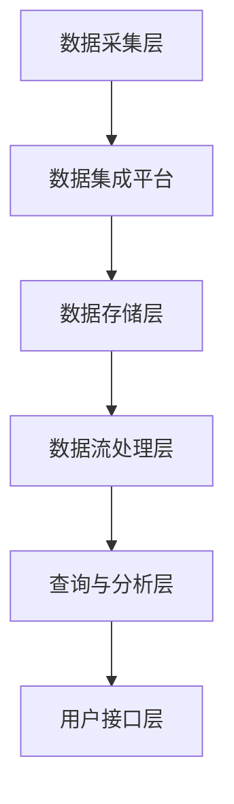
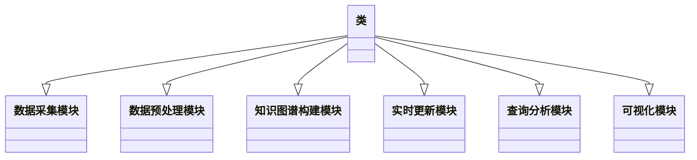

                 

### 第1章 引言

#### 1.1 知识图谱的背景

##### 1.1.1 知识图谱的定义与重要性

知识图谱（Knowledge Graph）是一种用于表达实体及其相互关系的数据模型。其核心在于将现实世界中的信息以结构化的形式进行组织，使得计算机能够理解和处理这些信息。知识图谱的构成主要包括三个部分：实体（Entity）、关系（Relationship）和属性（Attribute）。

实体可以视为知识图谱中的对象，如人、地点、组织等。关系则描述实体之间的关联，如“属于”、“位于”等。属性是对实体的补充信息，如人的年龄、地点的纬度等。

知识图谱的重要性在于它能够提供一种高效的数据组织方式，使得信息查询和处理变得更加便捷。与传统的关系数据库相比，知识图谱具有更强的灵活性和表达能力。例如，当需要查询“所有属于某个国家的人”时，关系数据库可能需要执行多个复杂的查询操作，而知识图谱则能够直接通过关系进行检索，大大提高查询效率。

##### 1.1.2 知识图谱的应用领域

知识图谱在许多领域都有广泛的应用，以下是几个典型领域：

1. **搜索引擎**：如Bing和Google等搜索引擎使用知识图谱来增强搜索结果的相关性和准确性。
2. **智能问答系统**：如Siri、Alexa等智能助手利用知识图谱来理解用户的查询，并提供准确的答案。
3. **推荐系统**：如Netflix、Amazon等使用知识图谱来挖掘用户和物品之间的隐含关系，从而提供个性化的推荐。
4. **金融风控**：金融机构通过知识图谱对客户和交易进行风险评估和监控。
5. **医疗健康**：知识图谱在疾病诊断、药物研发等方面具有重要作用。

##### 1.1.3 知识图谱的发展历程

知识图谱的概念最早可以追溯到20世纪80年代。当时，为了满足知识管理和推理的需要，研究人员开始探索如何将知识以结构化的形式进行表达。随着互联网的普及和大数据技术的发展，知识图谱的研究和应用逐渐得到重视。以下是知识图谱发展的几个重要阶段：

1. **早期探索**（20世纪80年代）：主要是对知识表示和推理方法的研究。
2. **Web知识图谱**（2000年代）：Google推出PageRank算法，标志着知识图谱开始与互联网相结合。
3. **大规模知识图谱**（2010年代）：如Facebook的Open Graph、Google的知识图谱等，这些知识图谱包含了大量实体和关系。
4. **行业应用**（至今）：知识图谱在各个行业得到广泛应用，成为数据处理和分析的重要工具。

#### 1.2 技术知识的体系化管理

##### 1.2.1 技术知识的特点与挑战

技术知识具有以下特点：

1. **复杂性**：技术知识涉及多个领域和层次，相互之间复杂交织。
2. **动态性**：技术知识不断更新和演变，新的研究成果和技术不断涌现。
3. **分散性**：技术知识分布在各种文档、论文、书籍和数据库中，难以集中管理和利用。

面对这些特点，技术知识管理面临以下挑战：

1. **获取和整合**：如何高效地获取和整合分散的技术知识。
2. **组织和表示**：如何将复杂的技术知识进行有效的组织和表示，以便于查询和使用。
3. **更新和维护**：如何保证技术知识的时效性和准确性，及时更新和修正。

##### 1.2.2 体系化管理的必要性

为了解决上述挑战，技术知识的体系化管理变得尤为重要。体系化管理能够：

1. **统一标准**：通过建立统一的知识表示和分类标准，使得不同来源的知识能够整合在一起。
2. **提高效率**：通过结构化的知识表示和自动化工具，提高知识获取、整合和检索的效率。
3. **增强协作**：通过知识共享和协作平台，促进团队成员之间的知识交流和合作。
4. **支持决策**：提供准确、全面的技术知识，支持决策制定和问题解决。

##### 1.3 本书结构安排

本书将分为七个章节，分别介绍知识图谱的构建基础、存储与查询、构建工具、行业应用、扩展与维护以及一个具体的案例研究。具体章节内容概述如下：

- **第2章 知识图谱构建基础**：介绍知识图谱构建的基本步骤和方法，包括实体识别与抽取、关系抽取与建模、属性抽取与填充。
- **第3章 知识图谱的存储与查询**：讨论知识图谱的存储技术和查询语言，包括图数据库、索引技术和查询优化策略。
- **第4章 知识图谱构建工具**：介绍常用的知识图谱构建工具，如OpenKG、Jena和Neo4j，包括其功能特性和使用方法。
- **第5章 知识图谱在行业中的应用**：分析知识图谱在金融、医疗、智能家居等领域的具体应用案例。
- **第6章 知识图谱的扩展与维护**：讨论知识图谱的扩展、维护方法和数据质量评估。
- **第7章 案例研究**：以一个金融机构的知识图谱构建为例，详细介绍项目背景、系统架构和实现过程。

通过这些章节的讲解，读者将能够系统地了解知识图谱的构建和管理方法，为实际应用提供理论指导和实践参考。

### 第2章 知识图谱构建基础

#### 2.1 实体识别与抽取

##### 2.1.1 实体识别

实体识别（Entity Recognition，简称ER）是知识图谱构建过程中的关键步骤之一。其目的是从非结构化文本中抽取出具有特定意义的实体，如人名、地名、组织名等。

##### 2.1.1.1 实体识别技术概述

实体识别技术可以分为以下几类：

1. **基于规则的方法**：通过编写一套规则，如正则表达式或语法规则，来识别文本中的实体。这种方法具有执行速度快、易于实现等优点，但规则编写复杂且难以覆盖所有情况。
2. **基于统计的方法**：使用机器学习算法，如条件随机场（CRF）和神经网络，从大量标注数据中学习实体识别模型。这种方法具有较好的泛化能力和适应能力，但需要大量的标注数据和计算资源。
3. **基于深度学习的方法**：利用深度神经网络，如卷积神经网络（CNN）和长短期记忆网络（LSTM），进行实体识别。这种方法能够自动学习文本的特征，具有强大的表达能力和适应性。

##### 2.1.1.2 实体识别方法

以下是几种常见的实体识别方法：

1. **基于词典的方法**：通过建立实体词典，将文本中出现的单词与词典中的实体进行匹配，从而识别出实体。这种方法简单高效，但无法处理词典未收录的新实体。
2. **基于规则的方法**：结合词典方法，通过编写一套规则，如匹配特定格式或上下文关系的实体。这种方法可以补充词典方法的不足，但规则编写复杂且难以覆盖所有情况。
3. **基于机器学习的方法**：使用条件随机场（CRF）或长短期记忆网络（LSTM）等算法，从标注数据中学习实体识别模型。这种方法能够自动学习文本的特征，适应不同的实体识别任务。

##### 2.1.2 实体抽取

实体抽取（Entity Extraction，简称EE）是从文本中直接抽取出实体的过程，其目的是获得文本中所有的实体及其相关信息。

##### 2.1.2.1 实体抽取技术概述

实体抽取技术可以分为以下几类：

1. **基于词典的方法**：通过建立实体词典，将文本中出现的实体直接抽取出来。这种方法简单高效，但无法处理词典未收录的新实体。
2. **基于规则的方法**：通过编写一套规则，如匹配特定格式或上下文关系的实体。这种方法可以补充词典方法的不足，但规则编写复杂且难以覆盖所有情况。
3. **基于机器学习的方法**：使用机器学习算法，如条件随机场（CRF）和长短期记忆网络（LSTM），从标注数据中学习实体抽取模型。这种方法能够自动学习文本的特征，适应不同的实体抽取任务。

##### 2.1.2.2 实体抽取方法

以下是几种常见的实体抽取方法：

1. **基于词典的方法**：通过建立实体词典，将文本中出现的实体直接抽取出来。这种方法简单高效，但无法处理词典未收录的新实体。
2. **基于规则的方法**：结合词典方法，通过编写一套规则，如匹配特定格式或上下文关系的实体。这种方法可以补充词典方法的不足，但规则编写复杂且难以覆盖所有情况。
3. **基于机器学习的方法**：使用条件随机场（CRF）或长短期记忆网络（LSTM）等算法，从标注数据中学习实体抽取模型。这种方法能够自动学习文本的特征，适应不同的实体抽取任务。

#### 2.2 关系抽取与建模

##### 2.2.1 关系抽取

关系抽取（Relationship Extraction，简称RE）是从文本中抽取实体之间的关系的过程。关系抽取是知识图谱构建的核心步骤之一，其目的是将文本中隐含的实体关系以结构化的形式表达出来。

##### 2.2.1.1 关系抽取技术概述

关系抽取技术可以分为以下几类：

1. **基于规则的方法**：通过编写一套规则，如匹配特定格式的文本，从而抽取实体关系。这种方法具有执行速度快、易于实现等优点，但规则编写复杂且难以覆盖所有情况。
2. **基于统计的方法**：使用统计模型，如条件随机场（CRF）和隐马尔可夫模型（HMM），从标注数据中学习关系抽取模型。这种方法具有较好的泛化能力和适应能力，但需要大量的标注数据和计算资源。
3. **基于深度学习的方法**：利用深度神经网络，如卷积神经网络（CNN）和长短期记忆网络（LSTM），进行关系抽取。这种方法能够自动学习文本的特征，具有强大的表达能力和适应性。

##### 2.2.1.2 关系抽取方法

以下是几种常见的关系抽取方法：

1. **基于词典的方法**：通过建立关系词典，将文本中出现的实体关系直接抽取出来。这种方法简单高效，但无法处理词典未收录的新关系。
2. **基于规则的方法**：结合词典方法，通过编写一套规则，如匹配特定格式或上下文关系的实体关系。这种方法可以补充词典方法的不足，但规则编写复杂且难以覆盖所有情况。
3. **基于机器学习的方法**：使用条件随机场（CRF）或长短期记忆网络（LSTM）等算法，从标注数据中学习关系抽取模型。这种方法能够自动学习文本的特征，适应不同的关系抽取任务。

##### 2.2.2 关系建模

关系建模是知识图谱构建的重要步骤，其目的是将抽取出的关系以结构化的形式组织起来，构建一个完整的知识图谱。

##### 2.2.2.1 关系建模方法

以下是几种常见的关系建模方法：

1. **基于图论的方法**：使用图论中的概念和算法，如图的邻接矩阵和路径搜索，来构建知识图谱。这种方法具有理论基础扎实、算法效率高等优点，但需要对图论有较深的理解。
2. **基于语义网络的方法**：使用语义网络的概念，如节点、边和语义角色，来构建知识图谱。这种方法能够直观地表达实体之间的关系，但需要对语义网络有较深的理解。
3. **基于框架的方法**：使用框架（Schema）来定义实体和关系，如OWL（Web Ontology Language）和RDF（Resource Description Framework）。这种方法具有良好的扩展性和灵活性，但需要编写复杂的框架描述。

##### 2.2.2.2 关系图构建

关系图的构建是关系建模的关键步骤，其目的是将实体和关系以图的形式组织起来，使得计算机能够理解和处理。

以下是关系图构建的基本步骤：

1. **实体识别**：从文本中抽取实体，并将其作为图中的节点。
2. **关系抽取**：从文本中抽取实体之间的关系，并将其作为图中的边。
3. **属性填充**：为实体和关系添加属性，如实体的名称、别名、类型等。
4. **图优化**：对关系图进行优化，如合并重复节点、消除冗余边等。

通过上述步骤，我们可以构建出一个结构清晰、信息丰富的知识图谱，为后续的查询和应用提供基础。

#### 2.3 属性抽取与填充

##### 2.3.1 属性抽取

属性抽取（Attribute Extraction，简称AE）是从文本中抽取实体的属性信息的过程。属性是知识图谱中实体的补充信息，如人的年龄、地点的纬度等。

##### 2.3.1.1 属性抽取技术概述

属性抽取技术可以分为以下几类：

1. **基于规则的方法**：通过编写一套规则，如匹配特定格式或上下文关系的属性。这种方法具有执行速度快、易于实现等优点，但规则编写复杂且难以覆盖所有情况。
2. **基于统计的方法**：使用统计模型，如条件随机场（CRF）和隐马尔可夫模型（HMM），从标注数据中学习属性抽取模型。这种方法具有较好的泛化能力和适应能力，但需要大量的标注数据和计算资源。
3. **基于深度学习的方法**：利用深度神经网络，如卷积神经网络（CNN）和长短期记忆网络（LSTM），进行属性抽取。这种方法能够自动学习文本的特征，具有强大的表达能力和适应性。

##### 2.3.1.2 属性抽取方法

以下是几种常见的属性抽取方法：

1. **基于词典的方法**：通过建立属性词典，将文本中出现的属性直接抽取出来。这种方法简单高效，但无法处理词典未收录的新属性。
2. **基于规则的方法**：结合词典方法，通过编写一套规则，如匹配特定格式或上下文关系的属性。这种方法可以补充词典方法的不足，但规则编写复杂且难以覆盖所有情况。
3. **基于机器学习的方法**：使用条件随机场（CRF）或长短期记忆网络（LSTM）等算法，从标注数据中学习属性抽取模型。这种方法能够自动学习文本的特征，适应不同的属性抽取任务。

##### 2.3.2 属性填充

属性填充（Attribute Filling，简称AF）是将抽取出的属性信息填充到实体中的过程。属性填充是知识图谱构建的重要步骤，其目的是使知识图谱更加完整和丰富。

##### 2.3.2.1 属性填充方法

以下是几种常见的属性填充方法：

1. **基于规则的方法**：通过编写一套规则，如匹配特定格式或上下文关系的属性值。这种方法具有执行速度快、易于实现等优点，但规则编写复杂且难以覆盖所有情况。
2. **基于模板的方法**：使用预定义的模板，将属性值填充到实体中。这种方法简单直观，但需要对模板进行大量的编写和调整。
3. **基于机器学习的方法**：使用机器学习算法，如决策树和神经网络，从标注数据中学习属性填充模型。这种方法能够自动学习文本的特征，具有强大的表达能力和适应性。

通过上述步骤，我们可以将抽取出的属性信息填充到实体中，使得知识图谱更加完整和丰富。属性填充不仅有助于提高知识图谱的准确性，还能为后续的查询和应用提供更多的信息。

### 第3章 知识图谱的存储与查询

#### 3.1 知识图谱的存储

知识图谱的存储是构建和管理知识图谱的重要环节，其目的是高效地存储和检索知识图谱中的数据。由于知识图谱具有高维度、多关系和强连接性的特点，传统的RDBMS（关系型数据库管理系统）在处理知识图谱时存在性能瓶颈。因此，图数据库成为知识图谱存储的常用选择。

##### 3.1.1 知识图谱数据库

知识图谱数据库（Knowledge Graph Database，简称KGB）是一种专门为知识图谱设计的数据存储系统。与传统的RDBMS不同，KGB采用图数据结构存储实体、关系和属性，能够高效地处理复杂的实体关系和属性信息。

以下是一些常见的图数据库：

1. **Neo4j**：Neo4j是一个高性能的图数据库，采用C++编写，支持Cypher查询语言。它具有快速数据存储和查询的特点，适用于大规模知识图谱的应用。
2. **Amazon Neptune**：Amazon Neptune是AWS提供的图数据库服务，支持多种图算法和图分析功能，适合构建大规模知识图谱系统。
3. **OrientDB**：OrientDB是一个多模型数据库，支持图数据结构，适合存储和查询复杂的实体关系。
4. **ArangoDB**：ArangoDB是一个分布式多模型数据库，支持图、文档和键值存储，适合构建灵活的知识图谱系统。

##### 3.1.1.1 图数据库概述

图数据库的主要特点如下：

1. **图数据结构**：图数据库采用图数据结构存储实体和关系，能够高效地处理复杂的实体关系。
2. **属性存储**：图数据库支持在节点和边中存储属性，使得知识图谱中的数据更加丰富。
3. **遍历和查询**：图数据库支持高效的图遍历和查询算法，如BFS（广度优先搜索）和DFS（深度优先搜索），能够快速检索知识图谱中的数据。
4. **分布式架构**：许多图数据库支持分布式架构，能够处理大规模数据和高并发查询。

##### 3.1.1.2 图数据库的优缺点

图数据库的优点如下：

1. **高效处理复杂关系**：图数据库采用图数据结构，能够高效地处理复杂的实体关系。
2. **快速查询**：图数据库支持高效的图遍历和查询算法，能够快速检索知识图谱中的数据。
3. **支持属性存储**：图数据库支持在节点和边中存储属性，使得知识图谱中的数据更加丰富。

图数据库的缺点如下：

1. **学习成本高**：由于图数据库采用了不同的数据结构和查询语言，用户需要学习和适应新的技术栈。
2. **索引和维护**：图数据库的索引和维护相对复杂，需要更多的技术支持和维护成本。

##### 3.1.2 知识图谱的索引

索引是提高知识图谱查询效率的重要手段。知识图谱中的索引技术主要包括以下几种：

1. **节点索引**：节点索引是基于节点属性（如ID、名称等）建立的索引，能够快速定位节点。
2. **关系索引**：关系索引是基于关系属性（如类型、权重等）建立的索引，能够快速查找关系。
3. **属性索引**：属性索引是基于节点或边的属性值建立的索引，能够加速属性查询。

常见的索引技术包括：

1. **B树索引**：B树索引是一种平衡树结构，适用于范围查询和高效插入、删除操作。
2. **哈希索引**：哈希索引通过哈希函数将键值映射到索引节点，适用于快速查找。
3. **位图索引**：位图索引通过位图表示数据，适用于多属性查询。

##### 3.1.2.1 索引技术概述

索引技术的主要特点如下：

1. **提高查询效率**：索引能够减少查询过程中需要扫描的数据量，提高查询速度。
2. **支持多条件查询**：索引能够支持多条件查询，提高查询的灵活性。
3. **增加存储空间和计算开销**：索引需要额外的存储空间和维护计算开销，但能够显著提高查询效率。

##### 3.1.2.2 索引方法

常见的索引方法包括：

1. **B树索引**：B树索引适用于范围查询和高效插入、删除操作，是一种常见的索引方法。
2. **哈希索引**：哈希索引通过哈希函数快速查找键值，适用于快速查找。
3. **位图索引**：位图索引通过位图表示数据，适用于多属性查询。

#### 3.2 知识图谱的查询

知识图谱的查询是知识图谱应用的重要环节，其目的是从知识图谱中获取所需的信息。知识图谱的查询语言包括SPARQL、图数据库的查询语言等。

##### 3.2.1 查询语言

1. **SPARQL**：SPARQL（Simple Protocol for Querying RDF）是一种用于查询RDF（Resource Description Framework）数据的查询语言。它具有强大的表达能力，支持复杂查询和联接操作。

以下是SPARQL查询的简单示例：

```sql
PREFIX foaf: <http://xmlns.com/foaf/0.1/>

SELECT ?name ?homepage
WHERE {
  ?person foaf:name ?name .
  ?person foaf:homepage ?homepage .
}
```

2. **图数据库查询语言**：不同图数据库具有不同的查询语言，如Neo4j的Cypher、ArangoDB的AQL等。这些查询语言具有图数据特有的操作和语法，能够高效地处理图数据的查询。

##### 3.2.1.1 SPARQL语言

SPARQL语言主要包括以下部分：

1. **前缀声明**：用于定义命名空间和前缀，便于查询中引用。
2. **查询模式**：定义查询的变量、节点和关系。
3. **WHERE子句**：定义查询的条件和逻辑。
4. **结果输出**：定义查询结果的输出格式。

##### 3.2.1.2 图数据库查询语言

图数据库查询语言主要包括以下部分：

1. **语法结构**：定义查询的基本语法和规则。
2. **图操作**：包括节点和边的创建、删除、查询等操作。
3. **关系操作**：包括关系类型的定义、查询和联接等操作。
4. **函数和表达式**：支持各种函数和表达式，用于查询和计算。

##### 3.2.2 查询优化

查询优化是提高知识图谱查询效率的重要手段。常见的查询优化策略包括：

1. **索引优化**：通过选择合适的索引技术，提高查询速度。
2. **查询重写**：通过改写查询语句，减少查询执行的时间。
3. **缓存机制**：通过缓存查询结果，减少重复查询的开销。

##### 3.2.2.1 查询优化策略

常见的查询优化策略包括：

1. **索引优化**：选择合适的索引技术，如B树索引、哈希索引等，以提高查询速度。
2. **查询重写**：通过改写查询语句，减少查询执行的时间，如使用索引列、避免子查询等。
3. **缓存机制**：通过缓存查询结果，减少重复查询的开销，如使用内存缓存、数据库缓存等。

通过以上存储和查询技术的介绍，我们可以构建和管理高效的知识图谱系统，为各种应用提供强大的数据支持和分析能力。

### 第4章 知识图谱构建工具

在知识图谱构建过程中，选择合适的工具是至关重要的。本章将介绍几种常用的知识图谱构建工具，包括OpenKG、Jena和Neo4j，并探讨它们的功能特性和使用方法。

#### 4.1 OpenKG

OpenKG是一个开源的知识图谱构建和管理平台，它支持从数据抽取、知识存储到知识查询等各个环节。OpenKG的目标是降低知识图谱构建的门槛，使得开发者能够快速构建和部署知识图谱系统。

##### 4.1.1 OpenKG概述

**功能与特性：**

1. **数据抽取**：OpenKG支持多种数据源的抽取，包括网络爬虫、数据库和文件等。它提供了丰富的抽取算法和插件，如命名实体识别、关系抽取和属性抽取等。
2. **知识存储**：OpenKG采用Neo4j作为底层存储，支持图数据结构，能够高效地存储和管理知识图谱。
3. **知识查询**：OpenKG支持SPARQL查询语言，提供了强大的查询功能，如路径查询、属性查询和复杂联接等。
4. **知识可视化**：OpenKG提供了可视化工具，帮助用户直观地查看和管理知识图谱。

**使用方法：**

1. **安装和配置**：首先，需要下载并安装OpenKG。安装完成后，通过命令行启动OpenKG服务。

    ```bash
    pip install openkg
    openkg server
    ```

2. **数据抽取**：使用OpenKG提供的抽取插件，从不同数据源中抽取实体、关系和属性。

    ```python
    from openkg import Dataset
    dataset = Dataset('example')
    dataset.import_from_csv('data.csv')
    ```

3. **知识存储**：将抽取出的实体、关系和属性存储到Neo4j数据库中。

    ```python
    from openkg import Entity, Relation, Attribute
    entity = Entity('person', name='John Doe')
    relation = Relation('lives_in', subject='John Doe', object='New York')
    attribute = Attribute('age', value=30)
    entity.save()
    relation.save()
    attribute.save()
    ```

4. **知识查询**：使用SPARQL查询语言，从知识图谱中获取所需信息。

    ```python
    from openkg import sparql
    query = """
    PREFIX ex: <http://example.org/>
    SELECT ?person ?age
    WHERE {
      ?person ex:age ?age
    }
    """
    results = sparql.query(query)
    for result in results:
        print(result)
    ```

##### 4.1.2 OpenKG的功能与特性

OpenKG具有以下功能和特性：

1. **支持多种数据源**：OpenKG支持从多种数据源中抽取知识，包括网络爬虫、数据库和文件等。
2. **灵活的知识存储**：OpenKG采用Neo4j作为底层存储，支持图数据结构，能够高效地存储和管理知识图谱。
3. **强大的查询功能**：OpenKG支持SPARQL查询语言，提供了丰富的查询功能，如路径查询、属性查询和复杂联接等。
4. **直观的可视化**：OpenKG提供了可视化工具，帮助用户直观地查看和管理知识图谱。

##### 4.1.3 OpenKG的使用方法

使用OpenKG构建知识图谱的基本步骤如下：

1. **安装和配置**：下载并安装OpenKG，启动OpenKG服务。
2. **数据抽取**：使用OpenKG提供的抽取插件，从不同数据源中抽取实体、关系和属性。
3. **知识存储**：将抽取出的实体、关系和属性存储到Neo4j数据库中。
4. **知识查询**：使用SPARQL查询语言，从知识图谱中获取所需信息。

#### 4.2 Jena

Jena是Apache基金会的一个开源项目，它提供了用于构建和管理知识图谱的工具集。Jena支持RDF（Resource Description Framework）数据的存储、推理和查询等功能，是构建知识图谱的常用工具之一。

##### 4.2.1 Jena概述

**功能与特性：**

1. **RDF数据存储**：Jena提供了TDB（Transactional Database）和RDF-4J内存数据库，用于存储RDF数据。TDB是一个高效的分布式图数据库，支持事务处理。
2. **推理引擎**：Jena包含一个推理引擎，支持基于OWL（Web Ontology Language）和RDF规则进行推理。
3. **SPARQL查询**：Jena支持SPARQL查询语言，提供了丰富的查询功能，如路径查询、属性查询和复杂联接等。
4. **集成开发环境**：Jena提供了集成开发环境（IDE），方便开发者进行知识图谱的构建和管理。

**使用方法：**

1. **安装和配置**：下载并安装Jena，将Jena的JAR包添加到项目的依赖中。
2. **RDF数据存储**：使用Jena的RDF存储库，将RDF数据存储到TDB或RDF-4J内存数据库中。

    ```java
    import org.apache.jena.tdb.TDBFactory;
    import org.apache.jena.rdf.model.Model;

    Model model = TDBFactory.createModel("data.tdb");
    // 存储RDF数据到TDB数据库
    ```

3. **推理引擎**：使用Jena的推理引擎，进行基于OWL和RDF规则的知识推理。

    ```java
    import org.apache.jena.reasoner.rules.RDFRuleReasoner;

    Model model = ...;
    RDFRuleReasoner reasoner = new RDFRuleReasoner();
    model.addReasoner(reasoner);
    // 进行推理
    ```

4. **SPARQL查询**：使用Jena的SPARQL查询功能，从知识图谱中获取所需信息。

    ```java
    import org.apache.jena.query.Query;
    import org.apache.jena.query.QueryExecution;
    import org.apache.jena.query.QueryFactory;

    String queryStr = "SELECT ?x WHERE { ?x a ?type }";
    Query query = QueryFactory.create(queryStr);

    QueryExecution exec = QueryExecutionFactory.create(query, model);
    ResultSet results = exec.execSelect();
    for (Solution sol : results) {
        Resource x = sol.getResource("x");
        // 处理查询结果
    }
    ```

##### 4.2.2 Jena的功能与特性

Jena具有以下功能和特性：

1. **RDF数据存储**：Jena支持多种RDF数据存储，包括TDB和RDF-4J内存数据库，能够高效地存储和管理知识图谱。
2. **推理引擎**：Jena提供了强大的推理引擎，支持基于OWL和RDF规则的知识推理。
3. **SPARQL查询**：Jena支持SPARQL查询语言，提供了丰富的查询功能，如路径查询、属性查询和复杂联接等。
4. **集成开发环境**：Jena提供了集成开发环境，方便开发者进行知识图谱的构建和管理。

##### 4.2.3 Jena的使用方法

使用Jena构建知识图谱的基本步骤如下：

1. **安装和配置**：下载并安装Jena，将Jena的JAR包添加到项目的依赖中。
2. **RDF数据存储**：使用Jena的RDF存储库，将RDF数据存储到TDB或RDF-4J内存数据库中。
3. **推理引擎**：使用Jena的推理引擎，进行基于OWL和RDF规则的知识推理。
4. **SPARQL查询**：使用Jena的SPARQL查询功能，从知识图谱中获取所需信息。

#### 4.3 Neo4j

Neo4j是一个高性能的图数据库，它采用图数据结构存储数据，能够高效地处理复杂的实体关系和属性信息。Neo4j支持多种编程语言（如Java、Python和JavaScript等）的API，使得开发者能够方便地构建和管理知识图谱。

##### 4.3.1 Neo4j概述

**功能与特性：**

1. **图数据结构**：Neo4j采用图数据结构存储数据，能够高效地处理复杂的实体关系。
2. **Cypher查询语言**：Neo4j提供了Cypher查询语言，支持图数据的查询、更新和删除等操作。
3. **分布式架构**：Neo4j支持分布式架构，能够处理大规模数据和并发查询。
4. **可视化工具**：Neo4j提供了可视化工具，帮助用户直观地查看和管理知识图谱。

**使用方法：**

1. **安装和配置**：下载并安装Neo4j，启动Neo4j服务。
2. **数据操作**：使用Cypher查询语言，对知识图谱进行操作，如创建节点、添加关系和查询数据等。

    ```python
    import neo4j

    driver = neo4j.GraphDatabase.driver("bolt://localhost:7687", auth=("neo4j", "password"))

    with driver.session() as session:
        # 创建节点
        session.run("CREATE (p:Person {name: 'John Doe', age: 30})")

        # 创建关系
        session.run("MATCH (p:Person), (c:City) WHERE p.name = 'John Doe' AND c.name = 'New York' CREATE (p)-[:LIVES_IN]->(c)")

        # 查询数据
        result = session.run("MATCH (p:Person)-[:LIVES_IN]->(c:City) RETURN p.name, c.name")
        for record in result:
            print(record)
    ```

##### 4.3.2 Neo4j的功能与特性

Neo4j具有以下功能和特性：

1. **图数据结构**：Neo4j采用图数据结构存储数据，能够高效地处理复杂的实体关系。
2. **Cypher查询语言**：Neo4j提供了Cypher查询语言，支持图数据的查询、更新和删除等操作。
3. **分布式架构**：Neo4j支持分布式架构，能够处理大规模数据和并发查询。
4. **可视化工具**：Neo4j提供了可视化工具，帮助用户直观地查看和管理知识图谱。

##### 4.3.3 Neo4j的使用方法

使用Neo4j构建知识图谱的基本步骤如下：

1. **安装和配置**：下载并安装Neo4j，启动Neo4j服务。
2. **数据操作**：使用Cypher查询语言，对知识图谱进行操作，如创建节点、添加关系和查询数据等。

通过以上对OpenKG、Jena和Neo4j的介绍，我们可以根据具体需求和场景选择合适的知识图谱构建工具，高效地构建和管理知识图谱。

### 第5章 知识图谱在行业中的应用

知识图谱技术在各个行业中的应用越来越广泛，下面我们将探讨知识图谱在金融、医疗和智能家居领域的应用，并结合实际案例进行分析。

#### 5.1 金融领域

知识图谱在金融领域具有广泛的应用，特别是在金融风控和智能推荐方面。

##### 5.1.1 知识图谱在金融风控中的应用

**应用场景**：

知识图谱可以将金融交易、客户信息、公司信息等多源数据整合到一个统一的知识体系中，通过对这些数据的分析，金融机构可以识别潜在的欺诈风险和信用风险。

**实际案例**：

1. **蚂蚁集团**：蚂蚁集团利用知识图谱技术对用户行为进行建模，通过分析用户在支付宝平台上的交易行为、社交关系等，识别潜在的风险用户。例如，当用户短时间内频繁进行大额交易时，系统会发出风险预警，并进行进一步的调查。

2. **招商银行**：招商银行通过知识图谱对客户信用进行评估，结合客户的财务状况、还款记录、信用历史等多维信息，提供更加准确的信用评分，从而降低贷款违约风险。

**分析**：

知识图谱在金融风控中的应用，可以有效整合多源数据，提供全面的风险评估。通过对实体（如客户、交易、公司等）及其关系的分析，可以识别出潜在的欺诈和信用风险。这不仅可以提高金融机构的风险管理能力，还能优化贷款审批流程，提高贷款审批的效率。

#### 5.2 医疗领域

知识图谱在医疗领域同样具有重要应用，特别是在医学研究、疾病诊断和药物研发方面。

##### 5.2.1 知识图谱在医学研究中的应用

**应用场景**：

知识图谱可以帮助研究人员快速检索和理解大量的医学研究数据，发现新的研究线索和关联。

**实际案例**：

1. **IBM Watson Health**：IBM Watson Health利用知识图谱技术整合医学文献、临床指南、药物信息等多源数据，为医生提供实时、准确的治疗建议。例如，当医生遇到一种罕见的疾病时，Watson Health可以快速检索相关的研究论文和病例，为医生提供参考信息。

2. **辉瑞制药**：辉瑞制药利用知识图谱技术进行药物研发，通过对药物作用机制、疾病症状、生物标记等多维信息的分析，发现新的药物靶点和治疗方案。

**分析**：

知识图谱在医学研究中的应用，可以极大地提高医学数据的检索和理解效率，帮助研究人员快速发现新的研究线索和关联。这不仅可以加速医学研究的进展，还能为临床医生提供更加准确和全面的治疗建议。

#### 5.3 智能家居领域

知识图谱在智能家居领域可以用于设备管理和智能推荐。

##### 5.3.1 知识图谱在智能家居中的应用

**应用场景**：

知识图谱可以将各种智能家居设备的信息整合在一起，提供智能化的设备管理和推荐服务。

**实际案例**：

1. **苹果HomeKit**：苹果的HomeKit利用知识图谱技术，将用户的智能家居设备信息进行整合，提供统一的设备管理界面。例如，当用户设置一个离家模式时，HomeKit可以自动调整所有的智能家居设备，如关闭灯光、调整空调温度等。

2. **谷歌家居**：谷歌的家居服务平台利用知识图谱技术，为用户提供个性化的智能家居推荐。例如，当用户在谷歌家居平台上搜索某种设备时，系统会根据用户的使用习惯和历史数据，推荐最适合用户的设备。

**分析**：

知识图谱在智能家居领域的应用，可以实现对各种设备的统一管理和个性化推荐，提高用户的使用体验。通过对用户行为和设备数据的分析，智能家居系统可以更好地理解用户的需求，提供更加智能化的服务。

总之，知识图谱技术在金融、医疗和智能家居等领域的应用，极大地提高了各行业的数据处理和分析能力，为用户提供更加准确和高效的服务。随着技术的不断发展和应用的深入，知识图谱将在更多行业中发挥重要作用。

### 第6章 知识图谱的扩展与维护

#### 6.1 知识图谱的扩展

知识图谱的扩展是指对现有的知识图谱进行补充和完善，以应对新出现的数据和需求。扩展是知识图谱维护的重要环节，它能够使知识图谱更加全面和准确。

##### 6.1.1 知识更新

知识更新是指定期对知识图谱中的信息进行更新，以保持其时效性和准确性。知识更新的策略和方法如下：

1. **定期更新**：定期从权威来源获取最新的数据，如新闻报道、学术论文、政府公告等，将这些数据定期导入知识图谱中。

2. **实时更新**：对于一些需要实时反映数据变化的应用场景，如金融交易数据、实时新闻等，可以使用实时数据流处理技术，如Apache Kafka和Apache Flink，将实时数据集成到知识图谱中。

3. **增量更新**：通过分析新旧数据的差异，只更新发生变化的部分，以提高知识更新的效率。

##### 6.1.1.1 知识更新策略

1. **基于时间的更新**：定期执行全量更新，如每月或每周更新一次，以保证知识图谱的基本准确性。
2. **基于事件的更新**：当出现新数据或事件时，立即更新知识图谱，如股票市场的实时数据。
3. **基于规则和机器学习的更新**：通过规则和机器学习算法，自动识别数据的变化和趋势，进行智能化更新。

##### 6.1.1.2 知识更新方法

1. **手动更新**：通过人工审核和补充数据，适用于小规模和精确度要求高的知识图谱。
2. **自动更新**：利用爬虫、API接口等自动获取数据，适用于大规模和实时性要求高的知识图谱。
3. **半自动更新**：结合手动和自动更新，人工审核自动获取的数据，适用于多种应用场景。

##### 6.1.2 知识融合

知识融合是指将来自不同来源、不同格式和不同粒度的知识进行整合，形成一个统一的知识图谱。知识融合是知识图谱扩展的重要方法，它能够提高知识图谱的完整性和一致性。

##### 6.1.2.1 知识融合方法

1. **数据映射**：将不同数据源中的实体和关系映射到统一的知识图谱中，如通过命名实体识别将文本中的实体映射到知识图谱中的实体。
2. **实体合并**：当多个数据源中的实体表示同一个实体时，进行实体合并，如将多个数据库中的客户信息合并为一个统一的客户实体。
3. **关系合并**：将不同数据源中的关系进行合并，如将社交媒体中的关注关系合并到知识图谱中的社交网络中。
4. **属性合并**：将不同数据源中的实体属性进行合并，如将多个数据源中的产品信息合并为一个完整的产品描述。

##### 6.1.2.2 知识融合案例分析

例如，在构建一个涵盖全球企业的知识图谱时，可以从多个数据源获取企业信息，如企业数据库、社交媒体和新闻报道等。通过数据映射，将不同数据源中的企业实体映射到知识图谱中；通过实体合并，将重复的企业实体进行合并，确保知识图谱的统一性；通过关系合并，将企业之间的合作关系、投资关系等整合到知识图谱中；通过属性合并，将不同数据源中的企业属性进行整合，形成一个全面的企业知识图谱。

#### 6.2 知识图谱的维护

知识图谱的维护是指对知识图谱进行定期的检查、修复和优化，以确保其正常运行和可靠性。

##### 6.2.1 数据质量评估

数据质量评估是知识图谱维护的重要环节，它能够识别和解决数据中的问题，确保数据的质量。

##### 6.2.1.1 数据质量评估指标

1. **准确性**：数据是否真实、可靠，如企业名称和地址是否正确。
2. **完整性**：数据是否完整，如是否有缺失的信息。
3. **一致性**：数据是否一致，如不同数据源中的实体是否表示同一个实体。
4. **及时性**：数据是否及时更新，如是否包含了最新的数据。

##### 6.2.1.2 数据质量评估方法

1. **人工检查**：通过人工审核数据，识别数据中的错误和不一致性。
2. **自动检测**：使用算法和工具，如数据质量检测工具，自动识别数据中的问题。
3. **数据审计**：定期进行数据审计，评估数据的质量和完整性。

##### 6.2.2 数据去噪与清洗

数据去噪与清洗是指对知识图谱中的数据进行清理和优化，去除噪声和错误，提高数据的质量。

##### 6.2.2.1 数据去噪方法

1. **过滤**：通过规则和算法，去除明显错误或不一致的数据。
2. **校正**：对错误的数据进行修正，如纠正实体名称和地址的错误。
3. **标准化**：将不同格式的数据转换为统一的格式，如将日期格式统一为YYYY-MM-DD。

##### 6.2.2.2 数据清洗方法

1. **数据预处理**：对数据进行预处理，如去除空值、填补缺失值、归一化等。
2. **数据转换**：将不同数据源的数据进行转换，如将文本数据转换为结构化数据。
3. **数据校验**：对数据的质量进行验证，如检查实体和关系的类型是否正确。

通过知识图谱的扩展与维护，我们可以确保知识图谱的时效性和准确性，提高其应用价值。同时，定期的数据质量评估和清洗，可以保证知识图谱的数据质量，为用户提供可靠的服务。

### 第7章 案例研究

#### 7.1 某金融机构知识图谱构建

##### 7.1.1 项目背景

在当今金融行业竞争激烈的环境下，某金融机构希望通过构建知识图谱，实现对客户和交易数据的深入分析，从而提升风险管理能力和客户服务质量。知识图谱的构建将涉及海量数据的高效存储、实时更新和复杂查询，这对于金融机构来说是一项具有挑战性的任务。

##### 7.1.1.1 金融机构面临的问题

1. **数据分散**：金融机构的数据分布在多个系统和数据库中，包括客户信息、交易记录、信用评分等，数据难以整合和统一管理。
2. **分析难度**：传统的数据分析和查询方法难以应对复杂的数据关系和动态变化，无法提供深入的业务洞察。
3. **风险控制**：金融机构需要对客户和交易进行风险评估和控制，但现有的方法无法全面反映客户的风险特征和行为模式。

##### 7.1.1.2 知识图谱解决方案

知识图谱的构建能够解决上述问题，通过将金融机构的各种数据进行结构化整合，实现对客户和交易数据的深度分析。具体解决方案如下：

1. **数据整合**：将客户信息、交易记录、信用评分等多源数据整合到一个统一的知识图谱中。
2. **关系建模**：构建客户、交易、产品等实体之间的关系，形成复杂但有序的知识网络。
3. **实时更新**：利用数据流处理技术，实现对数据的实时更新和同步，确保知识图谱的实时性和准确性。
4. **复杂查询**：通过知识图谱的查询语言，实现对复杂查询的高效处理，为业务决策提供支持。

##### 7.1.2 系统架构设计

系统架构设计是知识图谱构建的核心，它决定了知识图谱的性能和可扩展性。以下是该金融机构知识图谱的系统架构设计：

1. **数据采集层**：负责从各个系统中采集数据，包括客户信息、交易记录、信用评分等，通过数据集成平台进行数据清洗和预处理。
2. **数据存储层**：使用图数据库（如Neo4j）存储知识图谱数据，确保数据的高效存储和快速查询。
3. **数据处理层**：利用数据流处理技术（如Apache Kafka和Apache Flink）对实时数据进行处理，实现数据的实时更新和同步。
4. **查询与分析层**：提供强大的查询和分析功能，支持复杂查询和业务报表生成。
5. **用户接口层**：为业务用户和开发者提供友好的操作界面，支持数据可视化和查询操作。

以下是系统架构的Mermaid架构图：



##### 7.1.2.2 系统功能模块设计

系统功能模块设计是知识图谱实现的关键，以下是该金融机构知识图谱的主要功能模块：

1. **数据采集模块**：负责从各个系统中采集数据，包括客户信息、交易记录、信用评分等。
2. **数据预处理模块**：对采集到的数据进行清洗和预处理，如去重、格式转换、数据补全等。
3. **知识图谱构建模块**：将预处理后的数据构建成知识图谱，包括实体识别、关系抽取、属性填充等。
4. **实时更新模块**：利用数据流处理技术，对知识图谱进行实时更新和同步。
5. **查询分析模块**：提供强大的查询和分析功能，支持复杂查询和业务报表生成。
6. **可视化模块**：为用户提供数据可视化和查询操作界面。

以下是系统功能模块的Mermaid类图：



##### 7.1.3 知识图谱构建流程

知识图谱的构建是一个复杂的过程，需要多个步骤的协同工作。以下是该金融机构知识图谱的构建流程：

1. **需求分析**：与业务用户和开发者沟通，明确知识图谱的需求和目标。
2. **数据采集**：从各个系统中采集所需的数据，如客户信息、交易记录、信用评分等。
3. **数据预处理**：对采集到的数据进行清洗和预处理，包括去重、格式转换、数据补全等。
4. **实体识别**：使用命名实体识别技术，从文本数据中抽取实体，如人名、地名、组织名等。
5. **关系抽取**：使用关系抽取技术，从文本数据中抽取实体之间的关系，如客户与交易的关系、交易与账户的关系等。
6. **属性填充**：使用属性抽取技术，从文本数据中抽取实体的属性，如客户的年龄、地址等。
7. **知识融合**：将来自不同数据源的信息进行融合，确保知识图谱的一致性和完整性。
8. **知识存储**：将构建好的知识图谱存储到图数据库中，确保数据的高效存储和快速查询。
9. **实时更新**：利用数据流处理技术，对知识图谱进行实时更新和同步。
10. **查询与分析**：通过知识图谱查询语言，对知识图谱进行查询和分析，为业务决策提供支持。

以下是知识图谱构建流程的Mermaid流程图：


通过上述的详细案例研究，我们可以看到知识图谱在金融机构中的应用如何解决实际问题，并提高业务效率和决策质量。知识图谱的构建不仅需要对技术和业务有深入的理解，还需要合理的设计和高效的实施。随着技术的不断进步，知识图谱将在金融和其他行业中发挥越来越重要的作用。

