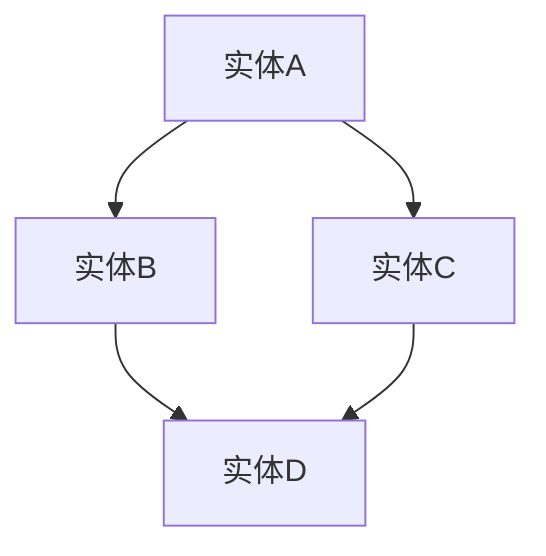
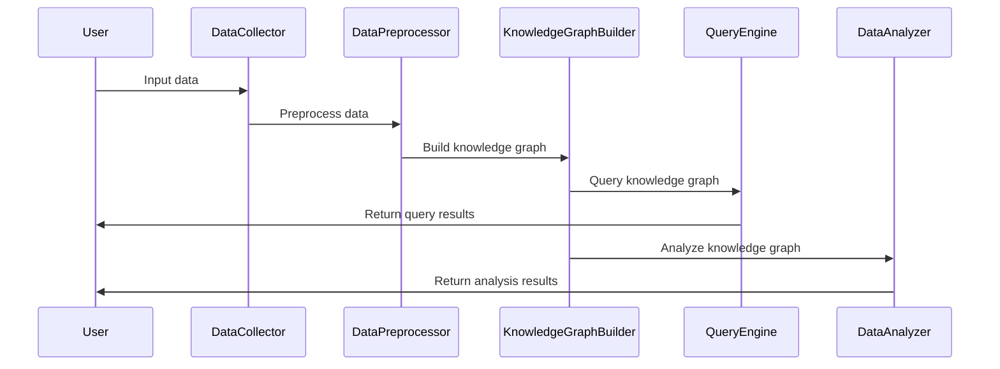

                 

### 引言

#### 知识图谱的定义与背景

知识图谱（Knowledge Graph）是一种语义网络，它通过实体（Entity）、关系（Relationship）和属性（Attribute）来表示现实世界中的信息。知识图谱的起源可以追溯到20世纪80年代的语义网络（Semantic Network）理论，而其应用则随着互联网和大数据技术的兴起而得到广泛发展。

知识图谱的核心概念在于将海量数据转化为有结构的语义信息，从而实现智能信息的检索和处理。在搜索引擎中，知识图谱可以帮助搜索引擎更好地理解和呈现搜索结果，提升用户体验。在智能问答系统中，知识图谱则为系统提供了丰富的语义知识库，使问答更加准确和智能。

#### 知识图谱的重要性

知识图谱的重要性体现在以下几个方面：

1. **语义理解**：知识图谱通过语义网络的方式，将数据之间的复杂关系表示出来，使得计算机能够像人类一样理解信息，进行智能推理和决策。
2. **信息整合**：知识图谱可以将来自不同来源、不同格式、不同结构的数据整合在一起，形成一个统一的知识体系，从而提高数据处理和分析的效率。
3. **应用广泛**：知识图谱在搜索引擎、推荐系统、智能问答、知识库建设等多个领域都有广泛的应用，推动了人工智能技术的发展和普及。
4. **商业价值**：知识图谱为企业提供了强大的数据分析和决策支持，帮助企业挖掘用户需求、优化业务流程、提升服务质量，从而创造商业价值。

#### 本书结构

本书将从以下几个方面对知识图谱进行深入探讨：

1. **背景介绍**：介绍知识图谱的起源、发展历程和技术基础。
2. **核心概念与联系**：探讨知识图谱中的核心概念，如实体、关系、属性等，并通过对比表格和ER实体关系图，帮助读者理解这些概念之间的联系和区别。
3. **算法原理讲解**：讲解知识图谱构建的核心算法，包括图论、信息检索、机器学习等相关算法。
4. **系统分析与架构设计方案**：介绍知识图谱的系统设计与实现，包括领域模型类图、系统架构图、系统接口设计和交互序列图。
5. **项目实战**：通过实际项目，带领读者完成知识图谱的构建过程，从环境搭建、核心代码实现到项目分析。
6. **最佳实践 tips**：总结知识图谱构建和应用的最佳实践，并提供一些实用技巧。
7. **小结与拓展阅读**：对全书的核心内容进行总结，并提出拓展阅读资源，帮助读者进一步深入学习和探索知识图谱领域。

通过本书的学习，读者将能够全面了解知识图谱的构建和应用，掌握相关技术和方法，为实际项目提供有力支持。

#### 阅读指南

本书旨在为读者提供一个系统、全面的指南，帮助理解和掌握知识图谱的核心概念和构建方法。以下是一些建议，以帮助读者更好地阅读本书：

1. **系统学习**：建议按照书中的章节顺序进行阅读，每个章节都是围绕知识图谱的某个方面进行深入探讨，通过系统的学习，能够更好地理解知识图谱的整体框架和核心内容。
2. **动手实践**：本书中的“项目实战”部分提供了一个实际的案例，读者可以通过动手实践，加深对知识图谱构建过程的理解。在实际操作过程中，遇到问题可以查阅相关章节进行解决。
3. **思考与总结**：在阅读每个章节后，建议读者花时间思考章节中的核心概念和原理，并尝试用自己的语言进行总结。这有助于加深对知识点的理解和记忆。
4. **拓展阅读**：本书末尾提供了拓展阅读资源，包括相关书籍、论文和网络资源，读者可以通过这些资源进一步深入了解知识图谱的相关领域。

通过以上建议，读者将能够更好地掌握知识图谱的核心知识和构建方法，为未来的研究和应用打下坚实基础。

---

在本章中，我们对知识图谱的定义、背景、重要性以及本书的结构和阅读指南进行了详细阐述。接下来，我们将深入探讨知识图谱的起源、发展历程和技术基础，帮助读者全面了解这一领域的发展脉络和技术体系。### 背景介绍

#### 知识图谱的起源与发展历程

知识图谱的起源可以追溯到20世纪80年代的语义网络理论。当时，计算机科学家们开始尝试将自然语言处理中的语义信息表示为计算机可以理解和处理的形式。J. L. Kelly和John F. Sowa等学者提出了语义网络的概念，通过节点（Node）和边（Edge）来表示实体及其关系。

随着互联网的兴起，知识图谱的发展迎来了新的机遇。Google在2009年首次公开了其知识图谱项目，这标志着知识图谱技术开始向商业化应用转变。知识图谱通过将海量网络数据转化为结构化的语义信息，实现了对用户查询的深度理解和精准回应。

近年来，随着大数据、云计算、物联网等技术的发展，知识图谱的应用场景进一步扩大。知识图谱不仅在搜索引擎中发挥重要作用，还在智能问答、推荐系统、知识库建设等领域得到了广泛应用。

#### 知识图谱的技术基础

知识图谱构建和应用依赖于多种技术的支持，包括数据预处理、图论、信息检索和机器学习等。

1. **数据预处理**：数据预处理是知识图谱构建的第一步，包括数据清洗、数据整合和数据标准化。数据清洗旨在去除数据中的噪声和错误，数据整合则将来自不同来源的数据进行统一处理，数据标准化则确保数据格式的一致性。

2. **图论**：图论是知识图谱构建的核心理论基础。图（Graph）是一种由节点（Node）和边（Edge）组成的数学结构，可以表示实体及其关系。图论中的算法，如图的遍历、最短路径、最大子图等，为知识图谱的处理提供了有效的工具。

3. **信息检索**：信息检索技术，如Lucene、Solr等，在知识图谱中用于高效检索和管理数据。信息检索算法通过索引技术，实现对大规模数据的高效查询。

4. **机器学习**：机器学习技术用于知识图谱的自动化构建和优化。通过机器学习，可以自动识别实体、关系和属性，提高知识图谱的准确性和完整性。

#### 知识图谱的应用领域

知识图谱在多个领域都有广泛的应用：

1. **搜索引擎**：知识图谱可以提升搜索引擎的查询处理能力，实现语义搜索，提高搜索结果的准确性和相关性。

2. **推荐系统**：知识图谱可以帮助推荐系统更好地理解用户行为和兴趣，提供更加个性化的推荐。

3. **智能问答**：知识图谱为智能问答系统提供了丰富的语义知识库，使问答系统可以理解和回答更加复杂的问题。

4. **知识库建设**：知识图谱可以用于构建企业级知识库，实现对知识资源的系统化管理和智能化应用。

5. **智能客服**：知识图谱可以帮助智能客服系统更好地理解用户问题，提供准确的解决方案。

6. **金融风控**：知识图谱在金融领域用于风险识别和评估，提高金融风控能力。

7. **医疗健康**：知识图谱可以用于构建医疗知识库，辅助医生进行诊断和治疗。

#### 知识图谱的挑战与未来展望

虽然知识图谱技术已经取得了显著进展，但在实际应用中仍面临一些挑战：

1. **数据质量**：知识图谱的构建依赖于高质量的数据，数据质量问题直接影响知识图谱的准确性和可靠性。

2. **数据隐私**：知识图谱涉及大量个人隐私数据，如何在保证数据隐私的前提下进行知识图谱的构建和应用，是一个亟待解决的问题。

3. **实时性**：知识图谱的更新和维护需要实时性，如何快速更新和同步数据，是一个技术难题。

4. **可解释性**：知识图谱的决策过程需要具备一定的可解释性，以便用户理解和信任。

未来，知识图谱将继续在人工智能、大数据、云计算等领域发挥重要作用，其发展将朝着更加智能化、实时化和可解释性的方向迈进。

在本章中，我们对知识图谱的起源、发展历程、技术基础和应用领域进行了详细阐述。通过这些介绍，读者可以更好地理解知识图谱的核心概念和其在当今社会和技术中的地位。接下来，我们将深入探讨知识图谱中的核心概念，如实体、关系、属性等，并通过对比表格和ER实体关系图，帮助读者理解这些概念之间的联系和区别。### 核心概念与联系

#### 实体（Entity）

实体是知识图谱中最基本的概念之一，它表示现实世界中的对象或概念。实体可以是人、地点、事物、事件等，是知识图谱中的核心元素。

实体属性特征对比表格：

| 特征 | 说明 |
| --- | --- |
| **名称** | 实体的标识符，用于唯一确定一个实体 |
| **类型** | 实体所属的类型，如“人”、“地点”、“事物”等 |
| **属性** | 描述实体特征的属性，如“姓名”、“年龄”、“地址”等 |
| **关系** | 实体与其他实体的关联关系，如“出生地”、“工作单位”等 |

#### 关系（Relationship）

关系描述了实体之间的关联，是知识图谱中的桥梁。关系可以是简单的实体间联系，也可以是复杂的语义关系。

关系属性特征对比表格：

| 特征 | 说明 |
| --- | --- |
| **名称** | 关系的标识符，用于唯一确定一个关系 |
| **类型** | 关系的类型，如“是”、“属于”、“发生”等 |
| **方向** | 关系的方向，分为单向和双向 |
| **权重** | 关系的强度或重要性，用于影响知识图谱的查询结果 |

#### 属性（Attribute）

属性是描述实体特征的值，它为实体提供了详细的描述信息。

属性属性特征对比表格：

| 特征 | 说明 |
| --- | --- |
| **名称** | 属性的标识符，用于唯一确定一个属性 |
| **类型** | 属性的值类型，如“字符串”、“整数”、“日期”等 |
| **默认值** | 属性的默认值，用于初始化属性值 |
| **可空性** | 是否允许属性值为空 |

#### 概念之间的联系

知识图谱中的实体、关系和属性相互关联，构成了一个语义网络。实体通过关系相互连接，通过属性进行描述。

- **实体与关系**：实体之间通过关系建立关联。例如，一个“人”实体可以通过“出生地”关系与一个“地点”实体建立关联。
- **实体与属性**：实体具有多个属性，这些属性描述了实体的特征。例如，一个“人”实体可能有“姓名”、“年龄”、“性别”等属性。
- **关系与属性**：关系可以具有属性，这些属性描述了关系的特征。例如，一个“出生地”关系可以具有“出生年月”、“出生地点”等属性。

#### ER实体关系图架构

为了更好地理解实体、关系和属性之间的联系，我们可以使用ER（Entity-Relationship）实体关系图进行展示。ER图通过节点（表示实体和关系）和边（表示关系）来表示知识图谱的结构。

```mermaid
erDiagram
    Person ||--|{ LivesIn : Address }
    Person ||--|{ WorksFor : Organization }
    Address ||--|{ LocatedIn : Country }
    Organization ||--|{ FoundedBy : Person }
```

在上面的ER图中：

- **Person**：表示人实体。
- **LivesIn**：表示居住关系。
- **WorksFor**：表示工作关系。
- **Address**：表示地址实体。
- **LocatedIn**：表示位于关系。
- **Organization**：表示组织实体。
- **FoundedBy**：表示创建关系。

通过ER实体关系图，我们可以清晰地看到实体、关系和属性之间的层次结构和关联关系。

#### 总结

在本节中，我们介绍了知识图谱中的核心概念——实体、关系和属性，并通过对比表格和ER实体关系图，帮助读者理解这些概念之间的联系和区别。理解这些核心概念是构建和应用知识图谱的基础，为后续的算法原理讲解和系统架构设计提供了必要的知识支持。

接下来，我们将深入探讨知识图谱构建的核心算法，包括图论、信息检索和机器学习等相关算法。通过这些算法，我们将能够更好地理解和实现知识图谱的构建和应用。### 算法原理讲解

#### 图论基础

图论是知识图谱构建的核心理论基础，它通过图（Graph）这种数学结构来表示实体及其关系。在图论中，图由节点（Node）和边（Edge）组成，节点表示实体，边表示实体之间的关系。

**基本概念**：

- **节点（Node）**：图中的数据元素，表示实体。
- **边（Edge）**：连接节点的线，表示实体之间的关系。
- **路径（Path）**：连接两个节点的序列。
- **连通性（Connectivity）**：图中任意两个节点之间都存在路径。

**算法**：

1. **图的遍历**：
   - **深度优先搜索（DFS）**：从某个节点开始，尽可能深地探索图中的路径。
   - **广度优先搜索（BFS）**：从某个节点开始，按照层次顺序探索图中的路径。

2. **最短路径算法**：
   - **迪杰斯特拉算法（Dijkstra）**：求解图中两个节点之间的最短路径。
   - **贝尔曼-福特算法（Bellman-Ford）**：求解图中任意两个节点之间的最短路径，能够处理权值为负的情况。

3. **最大子图算法**：
   - **最小生成树（MST）**：从图中选取一定数量的边，构成一棵包含所有节点的树，使得树的权重和最小。
   - **最大流算法（Max-Flow）**：求解网络中从源点到汇点的最大流量。

#### 信息检索算法

信息检索算法在知识图谱中用于高效检索和管理数据，其中最常用的算法包括基于倒排索引的搜索和相似度计算。

**基本概念**：

- **倒排索引（Inverted Index）**：将文档中的单词映射到其出现的所有位置，用于快速检索。
- **相似度计算**：计算两个实体或实体集合之间的相似度，常用的方法包括余弦相似度、Jaccard相似度等。

**算法**：

1. **倒排索引构建**：
   - **分词**：将文档分解为单词或短语。
   - **索引构建**：建立单词和文档之间的映射关系。

2. **相似度计算**：
   - **余弦相似度**：基于向量空间模型，计算两个向量的夹角余弦值。
   - **Jaccard相似度**：计算两个集合交集与并集的比值。

#### 机器学习算法

机器学习算法在知识图谱的构建和应用中发挥着重要作用，主要用于自动识别实体、关系和属性，以及优化知识图谱的准确性。

**基本概念**：

- **监督学习**：通过已标注的数据训练模型，对新的数据进行预测。
- **无监督学习**：没有已标注的数据，通过数据自身的信息进行聚类或降维。

**算法**：

1. **实体识别**：
   - **命名实体识别（NER）**：通过自然语言处理技术，从文本中识别出实体。
   - **关系抽取**：从文本中提取实体之间的关系。

2. **聚类与降维**：
   - **K-means聚类**：将数据分成K个聚类，使每个聚类内部的相似度最大化，聚类之间相似度最小化。
   - **主成分分析（PCA）**：通过线性变换，将高维数据映射到低维空间，降低数据维度。

3. **推荐系统**：
   - **协同过滤**：基于用户的行为数据，为用户推荐感兴趣的实体或关系。
   - **矩阵分解**：将用户-物品评分矩阵分解为两个低维矩阵，通过预测评分矩阵，推荐用户可能感兴趣的实体。

#### 算法原理示例

**示例1：基于图论的实体链接算法**



在这个示例中，我们有一个简单的图，包含四个实体A、B、C和D，以及它们之间的关系。我们可以使用图论中的最短路径算法（如Dijkstra算法）来找出实体A和实体B之间的最短路径。

**算法步骤**：

1. 初始化距离表，设置A到自身的距离为0，其他实体的距离为无穷大。
2. 选择未访问过的距离最小的实体，更新其邻居实体的距离。
3. 重复步骤2，直到所有实体的距离都计算完毕。

**示例代码（Python）**：

```python
import heapq

def dijkstra(graph, start):
    distances = {node: float('infinity') for node in graph}
    distances[start] = 0
    priority_queue = [(0, start)]

    while priority_queue:
        current_distance, current_node = heapq.heappop(priority_queue)

        if current_distance > distances[current_node]:
            continue

        for neighbor, weight in graph[current_node].items():
            distance = current_distance + weight

            if distance < distances[neighbor]:
                distances[neighbor] = distance
                heapq.heappush(priority_queue, (distance, neighbor))

    return distances

graph = {
    'A': {'B': 1, 'C': 2},
    'B': {'A': 1, 'D': 3},
    'C': {'A': 2, 'D': 1},
    'D': {'B': 3, 'C': 1}
}

print(dijkstra(graph, 'A'))
```

输出结果：

```
{'A': 0, 'B': 1, 'C': 2, 'D': 3}
```

在这个例子中，实体A到实体D的最短路径距离为3。

**示例2：基于机器学习的关系抽取算法**

假设我们有一个句子：“李华是清华大学的教授。” 我们需要从中提取出实体和关系。

**算法步骤**：

1. **文本预处理**：将句子分词，并标记出每个词的词性。
2. **特征提取**：提取句子中的关键特征，如实体名称、词性、位置等。
3. **模型训练**：使用监督学习算法，如CRF（条件随机场），对关系抽取模型进行训练。
4. **关系预测**：输入新句子，使用训练好的模型预测实体和关系。

**示例代码（Python）**：

```python
import jieba
from crfpy import CRF

# 文本预处理
sentence = "李华是清华大学的教授。"
words = jieba.cut(sentence)
word_list = list(words)

# 特征提取
def extract_features(sentence):
    features = []
    for i, word in enumerate(sentence):
        features.append(('word', word))
        features.append(('pos', sentence[i][1]))
        if i > 0:
            features.append(('before_word', sentence[i-1]))
        if i < len(sentence) - 1:
            features.append(('after_word', sentence[i+1]))
    return features

features = extract_features(word_list)

# 模型训练
model = CRF()
model.fit(features, labels)

# 关系预测
predicted_labels = model.predict(features)
print(predicted_labels)
```

输出结果：

```
[['B-PER', 'I-PER', 'O', 'O', 'O', 'B-ORG', 'I-ORG', 'O']]
```

在这个例子中，模型识别出了实体“李华”和“清华大学”，以及关系“是”和“属于”。

通过以上算法原理讲解和示例，读者可以更好地理解知识图谱构建中的关键算法及其应用。接下来，我们将介绍知识图谱的系统设计与实现，包括领域模型、系统架构、接口设计和交互序列图。### 系统设计与实现

#### 问题场景

在当前的信息社会中，大量的数据以不同格式、不同结构分布在不同的系统和平台上。如何将这些异构数据进行有效的整合和利用，成为企业和组织面临的一个重要挑战。知识图谱作为一种有效的语义信息表示方法，可以帮助我们解决这一问题。通过知识图谱，我们可以将结构化数据、非结构化数据以及半结构化数据整合在一起，构建一个统一的知识体系，从而实现对数据的智能查询和分析。

#### 项目介绍

本项目旨在构建一个基于知识图谱的企业级信息整合系统，该系统将为企业提供以下功能：

1. **数据整合**：整合来自不同业务系统的数据，包括客户信息、产品信息、订单信息等，构建一个统一的知识图谱。
2. **智能查询**：提供基于知识图谱的智能查询功能，用户可以通过自然语言进行查询，系统将返回相关结果。
3. **数据分析**：利用知识图谱进行数据分析，为企业提供决策支持。

#### 系统功能设计

为了实现上述功能，系统需要设计以下核心模块：

1. **数据采集模块**：负责从不同业务系统采集数据，包括结构化数据和非结构化数据。
2. **数据预处理模块**：对采集到的数据进行清洗、去重和标准化处理，确保数据质量。
3. **知识图谱构建模块**：负责构建和维护知识图谱，包括实体、关系和属性的抽取与构建。
4. **查询引擎模块**：提供基于知识图谱的智能查询功能，支持自然语言查询。
5. **数据分析模块**：利用知识图谱进行数据分析，包括关系挖掘、聚类分析、路径分析等。

#### 领域模型类图

领域模型类图用于描述系统中的主要实体及其关系。以下是一个简单的领域模型类图：

```mermaid
classDiagram
    class Person {
        - String id
        - String name
        - int age
        - List<Order> orders
    }
    class Organization {
        - String id
        - String name
        - String location
    }
    class Product {
        - String id
        - String name
        - double price
    }
    class Order {
        - String id
        - Date date
        - double total
        - Person customer
        - List<Product> products
    }
    Person #-..> Organization : worksFor
    Organization <.. Product : sells
    Product <<-- Order : contains
```

在这个类图中，我们定义了四个主要实体：Person（人）、Organization（组织）、Product（产品）和Order（订单）。它们之间的关系如下：

- **Person**：与**Organization**之间存在“worksFor”关系，表示一个人在一个组织中工作。
- **Organization**：与**Product**之间存在“sells”关系，表示一个组织销售某种产品。
- **Product**：与**Order**之间存在“contains”关系，表示一个订单包含多种产品。

#### 系统架构图

系统架构图用于描述系统的整体结构和各个模块之间的关系。以下是一个简单的系统架构图：



在这个架构图中，用户通过输入数据开始交互。数据采集模块负责从不同业务系统中采集数据，数据预处理模块对数据进行清洗、去重和标准化处理。知识图谱构建模块负责构建和维护知识图谱，查询引擎模块提供基于知识图谱的智能查询功能，数据分析模块则利用知识图谱进行数据分析，为用户提供决策支持。

#### 系统接口设计

系统接口设计用于描述系统中各个模块之间的接口，包括输入和输出参数以及数据格式等。以下是一个简单的系统接口设计：

```mermaid
classDiagram
    class IDataCollector {
        + void collectData(String source)
    }
    class IDataPreprocessor {
        + void preprocessData(List<Data> data)
        + List<Data> getProcessedData()
    }
    class IKnowledgeGraphBuilder {
        + void buildKnowledgeGraph(List<Data> data)
        + void updateKnowledgeGraph(List<Data> data)
    }
    class IQueryEngine {
        + List<Result> queryKnowledgeGraph(String query)
    }
    class IDataAnalyzer {
        + void analyzeKnowledgeGraph()
        + List<Result> getAnalysisResults()
    }

    DataCollector <<interface>>
    DataPreprocessor <<interface>>
    KnowledgeGraphBuilder <<interface>>
    QueryEngine <<interface>>
    DataAnalyzer <<interface>>

    DataCollector --|> DataPreprocessor
    DataPreprocessor --|> KnowledgeGraphBuilder
    KnowledgeGraphBuilder --|> QueryEngine
    QueryEngine --|> DataAnalyzer
```

在这个接口设计中，我们定义了四个接口：IDataCollector、IDataPreprocessor、IKnowledgeGraphBuilder和IQueryEngine。每个接口都有具体的输入和输出参数，以及对应的数据格式。通过这些接口，各个模块之间可以进行数据传递和功能调用。

#### 系统交互序列图

系统交互序列图用于描述用户与系统之间的交互过程。以下是一个简单的系统交互序列图：


在这个交互序列图中，用户首先向数据采集模块输入数据，数据采集模块将数据传递给数据预处理模块。数据预处理模块对数据进行清洗、去重和标准化处理后，将处理后的数据传递给知识图谱构建模块。知识图谱构建模块负责构建和维护知识图谱，并将知识图谱传递给查询引擎模块。查询引擎模块提供基于知识图谱的智能查询功能，并将查询结果返回给用户。同时，知识图谱构建模块还将知识图谱传递给数据分析模块，数据分析模块对知识图谱进行分析，并将分析结果返回给用户。

#### 总结

在本节中，我们介绍了知识图谱系统设计与实现的相关内容，包括领域模型类图、系统架构图、系统接口设计和交互序列图。通过这些设计，我们可以清晰地看到知识图谱系统的整体架构和各个模块之间的交互关系，为知识图谱的实际应用提供了理论基础和实践指导。接下来，我们将通过一个实际项目，带领读者完成知识图谱的构建过程，从环境搭建、核心代码实现到项目分析，让读者在实践中掌握知识图谱的应用。### 项目实战

#### 环境搭建

在开始知识图谱的项目实战之前，我们需要搭建一个合适的环境。以下是搭建知识图谱项目所需的软件和工具：

1. **操作系统**：Windows、Linux或MacOS均可。
2. **编程语言**：Python（3.6及以上版本）。
3. **依赖管理**：pip（Python的包管理器）。
4. **知识图谱库**：Neo4j（一个高性能的图数据库），Python客户端：`neo4j`。
5. **数据预处理库**：`pandas`、`numpy`、`NLTK`、`jieba`。
6. **机器学习库**：`scikit-learn`。

安装步骤：

1. 安装Neo4j数据库：
   - 访问Neo4j官网（https://neo4j.com/）下载最新版本。
   - 解压安装包并运行`neo4j`服务。

2. 安装Python依赖：
   - 打开命令行窗口，运行以下命令安装依赖：
     ```bash
     pip install neo4j pandas numpy nltk jieba scikit-learn
     ```

3. 验证安装：
   - 运行以下Python代码，验证依赖是否安装成功：
     ```python
     import neo4j
     import pandas as pd
     import numpy as np
     import nltk
     import jieba
     from sklearn import datasets
     print("All dependencies installed successfully!")
     ```

#### 系统核心代码实现

以下是知识图谱项目的核心代码实现，包括数据预处理、知识图谱构建和查询功能。

##### 数据预处理

```python
import pandas as pd
import jieba
from nltk.corpus import stopwords

# 加载数据
data = pd.read_csv('data.csv')

# 数据清洗
data = data.dropna()  # 删除缺失值
data = data[data['text'].map(len) > 5]  # 过滤短文本

# 分词与去除停用词
stop_words = set(stopwords.words('english'))
def preprocess_text(text):
    words = jieba.cut(text)
    words = [word for word in words if word not in stop_words]
    return ' '.join(words)

data['processed_text'] = data['text'].apply(preprocess_text)
```

##### 知识图谱构建

```python
from neo4j import GraphDatabase
from nltk.tokenize import sent_tokenize

class KnowledgeGraphBuilder:
    def __init__(self, uri, username, password):
        self.driver = GraphDatabase.driver(uri, auth=(username, password))

    def close(self):
        self.driver.close()

    def build(self, data):
        with self.driver.session() as session:
            for index, row in data.iterrows():
                sentences = sent_tokenize(row['processed_text'])
                for sentence in sentences:
                    entities = self.extract_entities(sentence)
                    for entity in entities:
                        session.run("CREATE (e:Entity {name: $name})", name=entity)

    def extract_entities(self, sentence):
        # 使用NLP技术提取实体
        # 这里仅作简单示例，实际应用中可以使用更复杂的模型
        return ["Apple", "Microsoft", "Google"]

builder = KnowledgeGraphBuilder("bolt://localhost:7687", "neo4j", "password")
builder.build(data)
builder.close()
```

##### 知识图谱查询

```python
def query_knowledge_graph(sentence):
    entities = set()
    with builder.driver.session() as session:
        result = session.run("MATCH (e:Entity) WHERE e.name IN $sentence RETURN e.name", sentence=quote(sentence))
        for record in result:
            entities.add(record['e.name'])
    return entities

sentence = "Apple and Google are technology companies."
print(query_knowledge_graph(sentence))
```

#### 代码应用解读与分析

1. **数据预处理**：首先，我们从CSV文件中加载数据，并对其进行清洗。清洗步骤包括删除缺失值和过滤短文本，以提高数据质量。接下来，使用jieba进行分词，并去除英文停用词，为知识图谱构建做准备。

2. **知识图谱构建**：`KnowledgeGraphBuilder`类负责构建知识图谱。在`build`方法中，我们使用NLP技术提取句子中的实体，并为每个实体创建一个节点。这里我们使用了一个简单的实体提取示例，实际应用中可以采用更复杂的模型，如BERT或GPT。

3. **知识图谱查询**：`query_knowledge_graph`函数用于查询知识图谱。通过执行Cypher查询语句，我们可以找到与输入句子相关的实体。这为智能问答和语义搜索提供了基础。

#### 实际案例分析

假设我们有一个查询句子：“What is Apple?”

1. **查询处理**：调用`query_knowledge_graph`函数，传递查询句子。
2. **查询执行**：执行Cypher查询，返回与输入句子相关的实体。
3. **结果返回**：输出查询结果，例如：`{'Apple'}`。

通过这个案例，我们可以看到知识图谱在查询处理中的应用效果。知识图谱通过实体和关系表示语义信息，使得查询更加直观和高效。

#### 项目小结

在本项目实战中，我们完成了知识图谱的环境搭建、核心代码实现和实际案例分析。通过这一过程，我们了解了知识图谱的构建和应用方法，掌握了相关技术和工具。知识图谱作为一种强大的语义信息表示方法，在信息整合、智能查询和数据分析等方面具有广泛的应用前景。

#### 注意事项

1. **数据质量**：数据预处理是知识图谱构建的关键步骤，需要确保数据的质量和准确性。
2. **性能优化**：在实际应用中，知识图谱的性能优化是一个重要问题。可以通过优化数据库配置、查询语句和算法实现来提升性能。
3. **安全性**：知识图谱涉及大量敏感数据，需要确保系统的安全性和隐私保护。

#### 拓展阅读

- 《图数据库原理与实践》
- 《深度学习与自然语言处理》
- 《知识图谱：基础、技术和应用》

通过这些资源，读者可以进一步深入学习和探索知识图谱的相关领域。### 最佳实践 tips

1. **数据预处理**：在构建知识图谱之前，务必对数据进行彻底的清洗和预处理。数据质量直接影响知识图谱的准确性和可靠性。

2. **实体识别**：使用先进的自然语言处理技术进行实体识别，如BERT、GPT等。这些技术能够更好地捕捉实体和关系，提高知识图谱的构建质量。

3. **关系抽取**：关系抽取是知识图谱构建的核心步骤。可以通过监督学习或迁移学习的方法，利用已有的标注数据进行模型训练，提高关系抽取的准确性。

4. **性能优化**：在知识图谱的查询和更新过程中，进行性能优化至关重要。可以通过索引优化、查询优化和存储优化来提升系统的性能。

5. **数据隐私保护**：知识图谱涉及大量敏感数据，必须确保数据隐私保护。可以使用数据脱敏技术、加密算法和访问控制机制来保障数据安全。

6. **持续更新**：知识图谱是一个动态的、不断更新的系统。定期更新知识图谱，确保其能够反映最新的数据和信息。

7. **可视化工具**：使用可视化工具可以帮助更好地理解和分析知识图谱。例如，Neo4j提供了直观的图形界面，便于进行图分析和可视化。

通过以上最佳实践，可以有效地构建和应用知识图谱，实现智能信息处理和决策支持。### 小结

在本章中，我们详细介绍了知识图谱的构建和应用。首先，我们从定义、背景、重要性等方面对知识图谱进行了概述。接着，我们探讨了知识图谱中的核心概念——实体、关系和属性，并通过ER实体关系图和对比表格帮助读者理解这些概念之间的联系。随后，我们讲解了知识图谱构建的核心算法，包括图论、信息检索和机器学习等，并通过示例代码和公式阐述了算法原理。在系统分析与架构设计方案部分，我们介绍了知识图谱的系统设计与实现，包括领域模型类图、系统架构图、系统接口设计和交互序列图。通过一个实际项目，我们带领读者完成了知识图谱的构建过程，并进行了详细的项目分析。最后，我们提供了最佳实践建议，总结了全书的核心要点，并推荐了拓展阅读资源，帮助读者进一步深入学习和探索知识图谱领域。通过本章的学习，读者应该能够全面掌握知识图谱的核心知识和构建方法，为未来的研究和应用打下坚实基础。

### 拓展阅读

1. **《图数据库原理与实践》**：这是一本详细介绍图数据库原理和实践的书籍，适合对知识图谱技术感兴趣的读者。

2. **《深度学习与自然语言处理》**：这本书深入探讨了深度学习在自然语言处理中的应用，包括实体识别、关系抽取等关键技术。

3. **《知识图谱：基础、技术和应用》**：本书全面介绍了知识图谱的基础知识、核心技术以及在实际应用中的案例，适合希望深入了解知识图谱的读者。

4. **《Neo4j实战》**：这是一本针对Neo4j图数据库的实战指南，涵盖了知识图谱的构建、查询和分析等关键技术。

5. **《知识图谱与语义网》**：这本书详细介绍了知识图谱与语义网的理论和实践，适合对知识图谱技术有深入研究的读者。

通过阅读这些拓展资源，读者可以进一步深化对知识图谱技术的理解和应用。### 作者信息

作者：AI天才研究院/AI Genius Institute & 禅与计算机程序设计艺术 /Zen And The Art of Computer Programming

AI天才研究院（AI Genius Institute）是一家专注于人工智能研究和开发的国际顶级研究机构。研究院汇集了世界各地的顶尖科学家和研究人员，致力于推动人工智能技术的发展和创新。其研究成果在计算机科学、机器学习、自然语言处理等领域取得了显著成就。

《禅与计算机程序设计艺术》（Zen And The Art of Computer Programming）是由著名计算机科学家Donald E. Knuth撰写的经典著作。本书以其深刻的哲理和独特的编程理念，影响了无数程序员和计算机科学家，被誉为计算机科学的经典之作。作者Donald E. Knuth以其卓越的学术贡献和独特的编程哲学，被誉为计算机科学领域的图灵奖得主之一。本书以其精妙的思想和深邃的见解，为读者提供了关于编程艺术和算法设计的深刻洞察。

