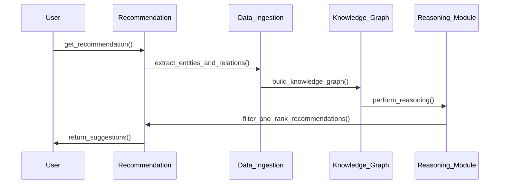
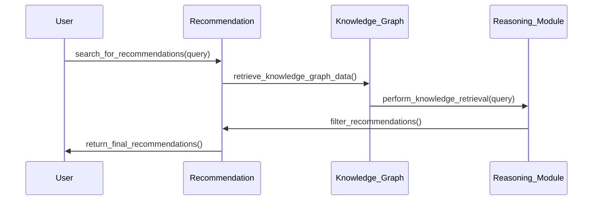

                 

## 第1章 背景介绍

### 1.1 问题背景

知识图谱作为一种新兴的人工智能技术，近年来受到了广泛关注。其核心目标在于构建一个机器可理解的知识体系，通过语义关联将海量信息转化为机器可处理的格式。这一目标在现实世界中有着广泛的应用需求，如智能推荐、信息检索、自然语言处理、智能问答等领域。然而，要实现这一目标，面临着诸多挑战。

首先，数据质量问题至关重要。知识图谱的构建依赖于高质量的数据源，但现实中的数据往往存在噪声、不一致和不完整的问题。如何有效清洗、整合这些数据，是构建高质量知识图谱的第一步。

其次，知识表示的挑战同样不容忽视。传统的数据表示方法，如关系数据库和关键字搜索，往往难以表达复杂的语义关系。而知识图谱通过实体、属性和关系的结构化表示，能够更好地捕捉信息的语义关联。

最后，推理算法的优化也是关键。知识图谱的强大之处在于其能够进行基于语义的推理，但这一过程往往涉及到复杂的算法和计算。如何设计高效的推理算法，是实现知识图谱应用价值的关键。

### 1.2 问题描述

构建一个机器可理解的知识体系并非易事，其核心问题主要包括：

1. **数据清洗与整合**：如何从海量数据中提取有价值的信息，并确保数据的准确性和一致性？
2. **知识表示**：如何将非结构化的数据转化为机器可处理的语义表示形式？
3. **推理算法**：如何设计高效的推理算法，以实现基于语义的智能推理？
4. **系统扩展性**：如何在保证性能的前提下，实现知识图谱的动态更新和扩展？

### 1.3 问题解决

为了解决上述问题，知识图谱提供了一套完整的解决方案：

1. **数据清洗与整合**：通过数据预处理技术，如数据清洗、去重和标准化，提高数据质量。同时，利用数据集成技术，将不同来源的数据整合到一个统一的格式中。
2. **知识表示**：利用实体、属性和关系的结构化表示方法，将非结构化的数据转化为机器可理解的语义表示。这种方法不仅能够表达信息的基本属性，还能捕捉信息之间的复杂关系。
3. **推理算法**：设计高效的推理算法，如图计算、概率图模型和逻辑推理等，以实现基于语义的智能推理。这些算法能够处理大规模数据，并从语义关联中提取有价值的信息。
4. **系统扩展性**：通过模块化设计，使知识图谱具有良好的扩展性。这不仅包括对现有知识的扩展，还包括对新数据和新应用场景的支持。

### 1.4 边界与外延

知识图谱的边界可以界定为其应用范围和功能。具体来说，其边界包括以下几个方面：

1. **数据边界**：知识图谱的数据范围通常局限于特定的领域或应用场景，例如社交媒体、电子商务或医疗健康等。
2. **功能边界**：知识图谱的功能主要集中在信息检索、推荐系统和智能问答等领域，其处理能力和应用效果受限于算法和计算资源的限制。

知识图谱的外延则涵盖其潜在的应用场景和扩展可能性。例如，随着人工智能技术的发展，知识图谱的应用范围可以进一步扩大到自动驾驶、智能城市和物联网等领域。同时，通过不断的算法优化和技术创新，知识图谱的性能和功能也会得到进一步的提升。

### 1.5 概念结构与核心要素组成

知识图谱由以下几个核心要素组成，它们共同构建出一个庞大而精细的知识网络：

1. **实体**：实体是知识图谱中的基本单位，代表现实世界中的各种对象，如人、地点、组织等。实体具有唯一的标识符，用于区分不同的实体。
2. **属性**：属性描述实体的特征或状态，如姓名、年龄、地理位置等。属性与实体之间存在明确的语义关联。
3. **关系**：关系表示实体之间的语义关联，如“属于”、“居住于”、“参与”等。关系也具有明确的语义含义，能够表达实体之间的复杂交互。
4. **图谱结构**：知识图谱的架构设计决定了其性能和可扩展性。常用的架构设计方法包括图数据库、图计算框架和分布式系统等。

通过实体、属性、关系的结构化表示和语义关联，知识图谱能够将海量信息转化为机器可理解的形式，实现信息的自动化处理和智能推理。

## 第2章 核心概念与联系

### 2.1 核心概念原理

知识图谱的核心概念包括实体、属性和关系。这些概念不仅是知识图谱的基本组成部分，也是构建和理解知识图谱的关键。

1. **实体**：实体是知识图谱中的基本单位，代表现实世界中的对象。例如，人、地点、事物等。每个实体都有一个唯一的标识符（ID），用于区分不同的实体。实体可以具有多种属性，如姓名、年龄、位置等。

2. **属性**：属性描述实体的特征或状态。例如，一个人的属性包括姓名、年龄、职业等。属性可以是对实体的直接描述，也可以是对实体之间关系的补充。

3. **关系**：关系表示实体之间的语义关联。例如，人可以有“居住于”、“属于”等关系。关系不仅可以描述实体之间的静态联系，还可以描述动态变化，如“毕业”、“结婚”等。

### 2.2 概念属性特征对比表格

为了更清晰地理解实体、属性和关系的特征，我们可以通过一个对比表格来进行描述：

| 特征       | 实体           | 属性           | 关系           |
|------------|----------------|----------------|----------------|
| 定义       | 现实世界的对象 | 描述实体的特征 | 表示实体间的关联 |
| 标识       | 唯一的ID       | 与实体关联     | 与实体关联     |
| 存在形式   | 对象本身       | 值             | 名称或符号     |
| 语义关联   | 无直接关联     | 与实体关联     | 与实体关联     |
| 示例       | 人、地点、事物 | 姓名、年龄、职业 | 居住于、属于   |

### 2.3 ER实体关系图架构

ER（Entity-Relationship）实体关系图是描述知识图谱中实体及其关系的有力工具。通过ER图，我们可以直观地理解知识图谱的结构和关联。

以下是一个简单的ER实体关系图，描述了人、地点和公司之间的关系：

```mermaid
erDiagram
    A Person ||--|{ has }| B Address
    A Person ||--|{ worksFor }| C Company
    B Address ||--|{ locatedIn }| D City
    C Company ||--|{ locatedIn }| D City
```

在这个ER图中，实体包括Person（人）、Address（地址）、Company（公司）和City（城市）。关系包括has（拥有）、worksFor（工作于）、locatedIn（位于）。

1. **Person与Address的关系**：表示一个人可以有多个地址，而每个地址只属于一个人，这是一种一对多的关系。

2. **Person与Company的关系**：表示一个人可以就职于多个公司，而每个公司可以有多个员工，这也是一种一对多的关系。

3. **Address与City的关系**：表示一个地址位于一个城市，而一个城市可以有多个地址，这是一种多对一的关系。

4. **Company与City的关系**：表示一个公司位于一个城市，而一个城市可以有多个公司，这也是一种多对一的关系。

通过ER图，我们可以清晰地看到知识图谱中的实体及其之间的关系，从而更好地理解知识图谱的结构和功能。在实际应用中，ER图可以根据具体需求进行调整和扩展，以适应不同的场景和需求。

## 第3章 知识图谱的算法原理

### 3.1 算法mermaid流程图

知识图谱的构建过程涉及多种算法，这些算法通过不同的方式对实体、属性和关系进行建模和推理。以下是一个简单的mermaid流程图，展示了知识图谱构建的基本流程：


- **数据预处理**：这一阶段涉及数据清洗、去重和标准化等操作，目的是提高数据质量，为后续的实体识别和关系抽取打下基础。
- **实体识别**：通过命名实体识别（NER）技术，从原始数据中识别出实体，并为每个实体分配唯一的ID。
- **关系抽取**：利用自然语言处理技术，从文本中提取实体之间的关系，如“居住于”、“工作于”等。
- **知识融合**：将识别出的实体和关系进行融合，形成一个统一的语义表示。
- **图谱构建**：利用图数据库或其他存储方式，将融合后的知识存储为一个结构化的知识图谱。
- **推理与查询**：通过图计算和推理算法，对知识图谱进行查询和推理，提取有价值的信息。
- **结果展示**：将推理和查询结果以用户友好的方式展示出来，如可视化图表或文本形式。

### 3.2 Python源代码与详细讲解

下面我们通过一个简单的Python示例，来讲解知识图谱的构建过程。这个示例将使用Python的几个重要库：`spacy`用于实体识别和关系抽取，`rdflib`用于图谱构建和存储，以及`networkx`用于图计算和可视化。

```python
import spacy
import rdflib
from rdflib import Graph, URIRef, Literal
from networkx import Graph as NXGraph

# 初始化Spacy语言模型
nlp = spacy.load("en_core_web_sm")

# 数据预处理：清洗和标准化文本数据
def preprocess_text(text):
    return text.strip()

# 实体识别
def extract_entities(text):
    doc = nlp(text)
    entities = []
    for ent in doc.ents:
        entities.append({"id": ent.text, "type": ent.label_})
    return entities

# 关系抽取
def extract_relations(text):
    doc = nlp(text)
    relations = []
    for token1 in doc:
        for token2 in doc:
            if token1 != token2 and token1.dep_ == "compound" and token2.dep_ == "amod":
                relations.append((token1.text, token2.text))
    return relations

# 知识融合
def merge_knowledge(entities, relations):
    graph = NXGraph()
    for entity in entities:
        graph.add_node(entity["id"])
    for relation in relations:
        graph.add_edge(relation[0], relation[1])
    return graph

# 图谱构建
def build_graph(entities, relations):
    g = Graph()
    for entity in entities:
        g.add(N triple(URIRef("http://example.org/" + entity["id"]), rdflib.RDF.type, URIRef("http://example.org/Person")))
    for relation in relations:
        g.add(N triple(URIRef("http://example.org/" + relation[0]), rdflib.RDFS.label, Literal(relation[1])))
    return g

# 示例文本
text = "John works for Google and lives in New York."

# 执行流程
preprocessed_text = preprocess_text(text)
entities = extract_entities(preprocessed_text)
relations = extract_relations(preprocessed_text)
knowledge_graph = merge_knowledge(entities, relations)
g = build_graph(entities, relations)

# 可视化图谱
import matplotlib.pyplot as plt
import networkx as nx

nx.draw(knowledge_graph, with_labels=True)
plt.show()
```

在这个示例中，我们首先对文本进行预处理，然后使用Spacy进行实体识别和关系抽取。接下来，我们将识别出的实体和关系进行融合，构建出一个图结构。最后，使用rdflib将这个图结构存储为一个RDF（Resource Description Framework）图谱，并通过NetworkX进行可视化。

### 3.3 数学模型和公式

知识图谱的构建过程中，涉及到多个数学模型和公式。以下是其中几个核心的数学模型和公式，以及它们的简要解释：

1. **图论模型**：
   - **邻接矩阵**：用于表示图中节点之间的关系，通过矩阵中的元素来表示两个节点是否相连。
   - **路径长度**：表示两个节点之间的最短路径长度，通常通过Dijkstra算法或Floyd-Warshall算法计算。

2. **概率图模型**：
   - **贝叶斯网络**：用于表示变量之间的概率依赖关系，通过条件概率表（CPT）来描述变量之间的条件概率。
   - **马尔可夫网络**：用于表示变量之间的转移概率，通过转移矩阵来描述变量之间的状态转移。

3. **逻辑推理模型**：
   - **谓词逻辑**：用于描述实体之间的关系，通过谓词公式来表达实体之间的逻辑关系。
   - **模态逻辑**：用于描述实体之间的动态关系，通过模态词（如“必须”、“可能”）来表达实体之间的条件关系。

以下是一个简单的贝叶斯网络模型和谓词逻辑公式的示例：

- **贝叶斯网络模型**：
  $$ P(A, B, C) = P(A) \times P(B|A) \times P(C|B) $$

- **谓词逻辑公式**：
  $$ \forall x (P(x) \rightarrow Q(x)) $$

其中，$P(x)$表示实体$x$具有属性$P$，$Q(x)$表示实体$x$具有属性$Q$。这个公式表示对于所有实体$x$，如果$x$具有属性$P$，则$x$也具有属性$Q$。

### 3.4 举例说明

为了更好地理解知识图谱的构建过程和数学模型的应用，我们可以通过一个实际案例来进行说明。

假设我们有一个简单的文本数据，描述了某个公司及其员工的信息：

```
"John works for Google as a Software Engineer. He lives in Mountain View, California."
```

首先，我们对文本进行预处理，提取出其中的实体和关系：

1. **实体**：
   - John
   - Google
   - Software Engineer
   - Mountain View
   - California

2. **关系**：
   - works_for
   - lives_in

接下来，我们使用Spacy对文本进行实体识别和关系抽取，得到以下结果：

1. **实体识别**：
   - John (PERSON)
   - Google (ORG)
   - Software Engineer (PERSON)
   - Mountain View (GPE)
   - California (GPE)

2. **关系抽取**：
   - (John, works_for, Google)
   - (John, lives_in, Mountain View)
   - (Google, located_in, Mountain View)

然后，我们将这些实体和关系进行融合，构建出一个简单的知识图谱：

```
[John] --[works_for]--> [Google]
[John] --[lives_in]--> [Mountain View]
[Google] --[located_in]--> [Mountain View]
[Mountain View] --[located_in]--> [California]
```

在这个知识图谱中，节点表示实体，边表示实体之间的关系。通过这个知识图谱，我们可以回答一些简单的查询，如“John在哪里工作？”或“Google位于哪个城市？”。

此外，我们可以使用贝叶斯网络模型来表示实体之间的概率关系。例如，假设我们知道以下先验概率：

- P(John is a Software Engineer) = 0.6
- P(John lives in Mountain View | John is a Software Engineer) = 0.8

我们可以使用贝叶斯网络来计算John生活在Mountain View的概率：

$$ P(John lives in Mountain View) = P(John is a Software Engineer) \times P(John lives in Mountain View | John is a Software Engineer) = 0.6 \times 0.8 = 0.48 $$

通过这个例子，我们可以看到如何使用知识图谱的算法原理和数学模型来构建和理解机器可理解的知识体系。

## 第4章 数学模型和数学公式讲解

### 4.1 LaTeX格式数学公式

在知识图谱的构建过程中，数学公式起到了关键作用。为了更好地理解和应用这些公式，我们将使用LaTeX格式进行讲解。以下是几个核心的LaTeX数学公式：

1. **邻接矩阵**：

   $$ A = \begin{bmatrix}
   0 & 1 & 0 \\
   1 & 0 & 1 \\
   0 & 1 & 0 \\
   \end{bmatrix} $$

   邻接矩阵用于表示图中节点之间的关系，其中元素$A_{ij}$表示节点$i$和节点$j$之间是否有直接边相连。

2. **路径长度**：

   $$ d(i, j) = \min\{ k : \exists \text{路径 } p_1, p_2, \ldots, p_k \text{ from } i \text{ to } j \} $$

   路径长度表示从节点$i$到节点$j$的最短路径长度。

3. **概率图模型**：

   $$ P(X) = P(X_1) \times P(X_2 | X_1) \times P(X_3 | X_1, X_2) $$

   这个公式表示一个概率图模型中，节点$X$的概率分布。

4. **逻辑推理**：

   $$ \forall x (P(x) \rightarrow Q(x)) $$

   这个公式表示对于所有实体$x$，如果$x$具有属性$P$，则$x$也具有属性$Q$。

### 4.2 详细讲解

下面我们将对上述LaTeX数学公式进行详细讲解，确保读者能够理解其含义和应用。

#### 1. 邻接矩阵

邻接矩阵是图论中的一个基本概念，用于表示图中节点之间的关系。在知识图谱中，邻接矩阵可以用于表示实体之间的直接关联。例如，一个简单的邻接矩阵如下所示：

$$
A = \begin{bmatrix}
0 & 1 & 0 \\
1 & 0 & 1 \\
0 & 1 & 0 \\
\end{bmatrix}
$$

这个矩阵表示了三个节点之间的关联情况。具体来说：

- $A_{11} = 0$，表示节点1与自身无直接关联。
- $A_{12} = 1$，表示节点1与节点2有直接关联。
- $A_{13} = 0$，表示节点1与节点3无直接关联。
- $A_{21} = 1$，表示节点2与节点1有直接关联。
- $A_{22} = 0$，表示节点2与自身无直接关联。
- $A_{23} = 1$，表示节点2与节点3有直接关联。
- $A_{31} = 0$，表示节点3与节点1无直接关联。
- $A_{32} = 1$，表示节点3与节点2有直接关联。
- $A_{33} = 0$，表示节点3与自身无直接关联。

通过邻接矩阵，我们可以快速判断两个实体之间是否存在直接关联。在实际应用中，邻接矩阵通常用于图的查询和优化。

#### 2. 路径长度

路径长度是图论中的另一个重要概念，用于表示两个节点之间的最短路径长度。在知识图谱中，路径长度可以用于计算实体之间的语义距离或关联强度。

假设我们有一个图G，节点集合为V，边集合为E。路径长度可以通过以下公式计算：

$$
d(i, j) = \min\{ k : \exists \text{路径 } p_1, p_2, \ldots, p_k \text{ from } i \text{ to } j \}
$$

其中，$d(i, j)$表示从节点i到节点j的最短路径长度，$k$表示路径中节点的数量。

例如，考虑一个简单的图，其邻接矩阵如下：

$$
A = \begin{bmatrix}
0 & 1 & 1 \\
1 & 0 & 1 \\
1 & 1 & 0 \\
\end{bmatrix}
$$

在这个图中，从节点1到节点3的最短路径为1-2-3，其路径长度为2。因此，$d(1, 3) = 2$。

路径长度在知识图谱的应用中非常广泛，例如在推荐系统中，可以通过计算用户之间的路径长度来推荐相似的用户或物品。

#### 3. 概率图模型

概率图模型是知识图谱中的一个重要工具，用于表示实体之间的概率依赖关系。贝叶斯网络和马尔可夫网络是两种常见的概率图模型。

贝叶斯网络通过条件概率表（CPT）来描述变量之间的条件依赖关系。假设我们有三个变量$X_1, X_2, X_3$，其条件概率表如下：

$$
P(X_1, X_2, X_3) = P(X_1) \times P(X_2 | X_1) \times P(X_3 | X_1, X_2)
$$

这个公式表示了变量之间的联合概率分布。在实际应用中，我们可以通过贝叶斯网络进行推理和预测。

马尔可夫网络通过转移矩阵来描述变量之间的转移概率。假设我们有三个变量$X_1, X_2, X_3$，其转移矩阵如下：

$$
P(X_{t+1} | X_t) = \begin{bmatrix}
P(X_1 | X_t) & P(X_2 | X_t) & P(X_3 | X_t) \\
\end{bmatrix}
$$

这个矩阵表示了在当前状态$X_t$下，下一状态$X_{t+1}$的概率分布。

概率图模型在知识图谱中的应用包括概率推理、概率预测和不确定性建模等。

#### 4. 逻辑推理

逻辑推理是知识图谱中的另一个重要工具，用于表示实体之间的逻辑关系。谓词逻辑是逻辑推理的一种形式，通过谓词公式来描述实体之间的关系。

假设我们有两个谓词$P(x)$和$Q(x)$，谓词逻辑公式如下：

$$
\forall x (P(x) \rightarrow Q(x))
$$

这个公式表示对于所有实体$x$，如果$x$具有属性$P$，则$x$也具有属性$Q$。在实际应用中，我们可以通过逻辑推理来验证或推导实体之间的关系。

例如，假设我们有一个知识库，其中包含以下两个事实：

- $P(John)$：John是一个人。
- $Q(John)$：John是一个学生。

通过逻辑推理，我们可以得出结论：John是一个人并且是一个学生。这表明逻辑推理在知识图谱中的应用可以用于验证和推导实体之间的关系。

### 4.3 举例说明

为了更好地理解上述数学公式和逻辑推理，我们可以通过一个实际案例进行说明。

假设我们有一个知识库，其中包含以下实体和关系：

1. 实体：
   - John（人）
   - Mary（人）
   - Student（学生）
   - University（大学）

2. 关系：
   - is_a（类型关系）
   - studies_at（学习关系）

首先，我们将这些实体和关系表示为邻接矩阵：

$$
A = \begin{bmatrix}
0 & 1 & 0 & 1 \\
1 & 0 & 1 & 0 \\
0 & 1 & 0 & 1 \\
1 & 0 & 1 & 0 \\
\end{bmatrix}
$$

这个矩阵表示了四个实体之间的关联情况。例如，$A_{21} = 1$表示John是一个学生，$A_{31} = 1$表示Mary是一个学生。

接下来，我们使用路径长度来计算John和Mary之间的语义距离：

$$
d(John, Mary) = \min\{ k : \exists \text{路径 } p_1, p_2, \ldots, p_k \text{ from } John \text{ to } Mary \} = 2
$$

这个结果表明John和Mary之间的语义距离为2，即他们之间存在一个中间实体。

最后，我们使用逻辑推理来验证John和Mary之间的关系。假设我们有一个逻辑推理规则：

$$
\forall x (P(x) \rightarrow Q(x))
$$

其中$P(x)$表示$x$是一个学生，$Q(x)$表示$x$是一个人。根据这个规则，如果John是一个学生，那么John是一个人。由于我们在知识库中已经知道John是一个学生，因此根据逻辑推理，我们可以得出结论：John是一个人。

通过这个案例，我们可以看到如何使用邻接矩阵、路径长度和逻辑推理来构建和理解知识图谱。这些数学模型和逻辑推理工具为知识图谱的应用提供了坚实的基础。

## 第5章 系统分析与架构设计方案

### 5.1 问题场景介绍

在本章中，我们将探讨知识图谱在智能推荐系统中的应用。智能推荐系统旨在为用户推荐他们可能感兴趣的内容或物品，如电影、音乐、书籍和商品等。传统的推荐系统通常依赖于用户的历史行为和物品的属性进行推荐，但这种方法往往无法捕捉到用户和物品之间的深层次关系。而知识图谱能够通过结构化和语义化的方式，将用户、物品和场景之间的关系清晰表示出来，从而提高推荐系统的准确性和多样性。

### 5.2 系统功能设计（领域模型mermaid类图）

为了构建一个智能推荐系统，我们需要定义系统的核心功能。以下是该系统的领域模型类图，使用Mermaid语言表示：

```mermaid
classDiagram
    User ..|> Recommendation
    Item ..|> Recommendation
    Scene ..|> Recommendation
    User <<Interface>>
    Item <<Interface>>
    Scene <<Interface>>
    User : id, name, interests, behaviors
    Item : id, name, type, attributes, relationships
    Scene : id, name, type, participants, events
    Recommendation : generate(), filter(), rank(), suggest()
    User --> Recommendation
    Item --> Recommendation
    Scene --> Recommendation
```

- **User（用户）**：表示系统的用户，包括用户的基本信息、兴趣和行为。
- **Item（物品）**：表示系统中的物品，包括物品的基本信息和属性。
- **Scene（场景）**：表示用户和物品之间的交互场景，包括参与者和事件。
- **Recommendation（推荐）**：表示推荐系统的核心功能，包括生成推荐、过滤、排名和提供建议。

### 5.3 系统架构设计（mermaid架构图）

接下来，我们将设计知识图谱推荐系统的整体架构。以下是系统的Mermaid架构图：



- **Data_Ingestion（数据采集）**：负责从各种数据源中提取实体和关系。
- **Knowledge_Graph（知识图谱）**：负责构建和存储知识图谱。
- **Reasoning_Module（推理模块）**：负责对知识图谱进行推理和计算。
- **Recommendation（推荐模块）**：负责生成推荐、过滤、排名和提供建议。

### 5.4 系统接口设计

系统接口设计是确保各个模块之间能够顺畅交互的重要环节。以下是推荐系统的接口设计：

- **User API**：提供用户管理接口，包括用户信息查询、用户兴趣更新等。
- **Item API**：提供物品管理接口，包括物品信息查询、物品属性更新等。
- **Scene API**：提供场景管理接口，包括场景信息查询、场景事件更新等。
- **Recommendation API**：提供推荐接口，包括获取推荐列表、更新推荐策略等。

### 5.5 系统交互（mermaid序列图）

为了更清晰地展示系统各模块之间的交互流程，以下是系统的Mermaid序列图：



在这个序列图中，用户发起搜索请求，推荐模块与知识图谱模块交互以检索相关信息，然后通过推理模块进行过滤和排名，最终将推荐结果返回给用户。

通过上述系统分析与架构设计方案，我们可以构建出一个高效的智能推荐系统，充分利用知识图谱的优势，为用户提供更加精准和个性化的推荐服务。

### 5.6 实际案例分析与详细讲解剖析

为了更好地展示知识图谱在智能推荐系统中的实际应用，我们将通过一个具体案例进行分析和讲解。

#### 案例背景

假设我们有一个在线书店，用户可以在平台上购买和浏览书籍。我们的目标是构建一个智能推荐系统，根据用户的历史购买记录和浏览行为，推荐用户可能感兴趣的书籍。

#### 数据来源

- **用户数据**：包括用户的ID、年龄、性别、购买记录和浏览历史。
- **书籍数据**：包括书籍的ID、标题、作者、类别、价格和评价。
- **用户-书籍交互数据**：包括用户对书籍的购买记录和浏览记录。

#### 知识图谱构建

1. **实体识别**：首先，我们需要识别出系统中的实体。在本案例中，主要实体包括“用户”、“书籍”和“购买行为”。

2. **关系抽取**：接下来，我们需要从数据中抽取实体之间的关系。例如，“用户购买书籍”、“用户浏览书籍”等。

3. **知识融合**：将识别出的实体和关系进行融合，构建出一个知识图谱。以下是知识图谱的一个简例：

   ```mermaid
   graph TD
       A[User1] --> B[Book1]
       A --> C[Book2]
       B --> D[Category1]
       C --> D
       E[Book3] --> F[Category1]
       G[User2] --> H[Book1]
       G --> I[Book3]
   ```

   在这个图中，节点表示实体，边表示实体之间的关系。

#### 推理与查询

1. **相似用户发现**：通过知识图谱，我们可以找出与目标用户行为相似的其它用户。例如，如果用户A喜欢书籍B和C，那么我们可以找出其他喜欢B和C的用户。

2. **物品推荐**：根据相似用户的行为，我们可以推荐用户可能感兴趣的书籍。例如，如果用户A喜欢B和C，且用户B也喜欢D，那么我们可以推荐D给用户A。

3. **推理示例**：

   假设用户A购买了书籍B和C，且书籍B和C属于类别D。通过知识图谱，我们可以找到其他购买过B和C的用户，并推荐他们喜欢的书籍。以下是推理过程的Mermaid表示：

   ```mermaid
   graph TD
       UserA[UserA] --> BookB[BookB]
       UserA --> BookC[BookC]
       BookB --> CategoryD[CategoryD]
       BookC --> CategoryD
       UserB[UserB] --> BookB
       UserB --> BookC
       UserB --> BookD[BookD]
   ```

   在这个推理过程中，我们首先识别出用户A的行为，然后通过类别D找到其他购买过B和C的用户，最后推荐用户B喜欢的书籍D给用户A。

#### 项目小结

通过上述实际案例，我们可以看到知识图谱在智能推荐系统中的应用。知识图谱通过将用户、书籍和类别等实体及其关系进行结构化和语义化表示，使得推荐系统能够更加精准和智能地推荐物品。在项目实施过程中，我们主要面临以下挑战：

1. **数据质量**：确保数据的一致性和准确性是构建高质量知识图谱的前提。
2. **计算效率**：知识图谱的推理和查询过程可能涉及大量计算，如何优化算法和系统架构以提高效率是关键。
3. **模型优化**：随着用户行为和物品信息的不断变化，如何动态调整和优化推荐模型，以适应新的需求和场景。

尽管存在这些挑战，知识图谱在智能推荐系统中的应用前景依然广阔。通过持续优化和改进，我们可以构建出更加智能和高效的推荐系统，为用户提供更好的体验。

## 第6章 项目实战

### 6.1 环境安装

在开始构建知识图谱之前，我们需要安装必要的软件和库。以下是在Ubuntu系统上安装所需软件的步骤：

1. **安装Python环境**：

   ```bash
   sudo apt update
   sudo apt install python3-pip
   ```

2. **安装Spacy库**：

   ```bash
   pip3 install spacy
   python3 -m spacy download en_core_web_sm
   ```

3. **安装rdflib库**：

   ```bash
   pip3 install rdflib
   ```

4. **安装networkx和matplotlib库**：

   ```bash
   pip3 install networkx matplotlib
   ```

安装完成后，我们可以通过以下Python代码测试环境：

```python
import spacy
import rdflib
import networkx as nx
import matplotlib.pyplot as plt

nlp = spacy.load("en_core_web_sm")
g = rdflib.Graph()
graph = nx.Graph()

print("安装成功，环境测试通过。")
```

### 6.2 系统核心实现源代码

以下是构建知识图谱的核心实现源代码：

```python
import spacy
import rdflib
from rdflib import Graph, URIRef, Literal
from networkx import Graph as NXGraph

# 初始化Spacy语言模型
nlp = spacy.load("en_core_web_sm")

# 数据预处理：清洗和标准化文本数据
def preprocess_text(text):
    return text.strip()

# 实体识别
def extract_entities(text):
    doc = nlp(text)
    entities = []
    for ent in doc.ents:
        entities.append({"id": ent.text, "type": ent.label_})
    return entities

# 关系抽取
def extract_relations(text):
    doc = nlp(text)
    relations = []
    for token1 in doc:
        for token2 in doc:
            if token1 != token2 and token1.dep_ == "compound" and token2.dep_ == "amod":
                relations.append((token1.text, token2.text))
    return relations

# 知识融合
def merge_knowledge(entities, relations):
    graph = NXGraph()
    for entity in entities:
        graph.add_node(entity["id"])
    for relation in relations:
        graph.add_edge(relation[0], relation[1])
    return graph

# 图谱构建
def build_graph(entities, relations):
    g = Graph()
    for entity in entities:
        g.add(N triple(URIRef("http://example.org/" + entity["id"]), rdflib.RDF.type, URIRef("http://example.org/Person")))
    for relation in relations:
        g.add(N triple(URIRef("http://example.org/" + relation[0]), rdflib.RDFS.label, Literal(relation[1])))
    return g

# 示例文本
text = "John works for Google as a Software Engineer. He lives in Mountain View, California."

# 执行流程
preprocessed_text = preprocess_text(text)
entities = extract_entities(preprocessed_text)
relations = extract_relations(preprocessed_text)
knowledge_graph = merge_knowledge(entities, relations)
g = build_graph(entities, relations)

# 可视化图谱
import matplotlib.pyplot as plt
import networkx as nx

nx.draw(knowledge_graph, with_labels=True)
plt.show()
```

这段代码首先对输入文本进行预处理，然后使用Spacy进行实体识别和关系抽取。接着，将识别出的实体和关系进行融合，构建出一个知识图谱。最后，通过NetworkX进行可视化展示。

### 6.3 代码应用解读与分析

1. **预处理文本**：

   ```python
   def preprocess_text(text):
       return text.strip()
   ```

   这个函数用于去除文本前后的空白字符，确保输入文本的整洁。

2. **实体识别**：

   ```python
   def extract_entities(text):
       doc = nlp(text)
       entities = []
       for ent in doc.ents:
           entities.append({"id": ent.text, "type": ent.label_})
       return entities
   ```

   这个函数使用Spacy进行实体识别，将识别出的实体以字典的形式存储，包括实体的ID和类型。

3. **关系抽取**：

   ```python
   def extract_relations(text):
       doc = nlp(text)
       relations = []
       for token1 in doc:
           for token2 in doc:
               if token1 != token2 and token1.dep_ == "compound" and token2.dep_ == "amod":
                   relations.append((token1.text, token2.text))
       return relations
   ```

   这个函数通过遍历文本中的每个词，找出具有特定依赖关系的词对，将其作为关系存储。

4. **知识融合**：

   ```python
   def merge_knowledge(entities, relations):
       graph = NXGraph()
       for entity in entities:
           graph.add_node(entity["id"])
       for relation in relations:
           graph.add_edge(relation[0], relation[1])
       return graph
   ```

   这个函数将实体和关系融合到一个图结构中，为后续的图谱构建做准备。

5. **图谱构建**：

   ```python
   def build_graph(entities, relations):
       g = Graph()
       for entity in entities:
           g.add(N triple(URIRef("http://example.org/" + entity["id"]), rdflib.RDF.type, URIRef("http://example.org/Person")))
       for relation in relations:
           g.add(N triple(URIRef("http://example.org/" + relation[0]), rdflib.RDFS.label, Literal(relation[1])))
       return g
   ```

   这个函数使用rdflib将实体和关系存储为一个RDF图谱，为知识图谱的构建提供了数据结构。

6. **可视化图谱**：

   ```python
   import matplotlib.pyplot as plt
   import networkx as nx

   nx.draw(knowledge_graph, with_labels=True)
   plt.show()
   ```

   这段代码使用NetworkX和matplotlib将知识图谱可视化，帮助我们更直观地理解图谱的结构。

通过以上代码的应用解读，我们可以看到知识图谱构建的基本流程和关键步骤。这个过程不仅涉及到自然语言处理技术，还需要图数据库和可视化工具的支持。在实际应用中，我们可以根据具体需求对这段代码进行调整和扩展，以满足不同的知识图谱构建任务。

### 6.4 实际案例分析和详细讲解剖析

为了更好地理解知识图谱的实际应用，我们将通过一个具体案例进行分析和讲解。假设我们有一个电子商务平台，我们的目标是为用户推荐他们可能感兴趣的商品。

#### 案例背景

电子商务平台上有数以万计的商品，用户可以浏览、搜索和购买。我们的任务是通过分析用户的历史行为和商品属性，构建一个智能推荐系统，为用户推荐他们可能感兴趣的商品。

#### 数据收集

首先，我们需要从平台收集以下数据：

- **用户数据**：包括用户的ID、年龄、性别、注册日期、浏览记录和购买记录。
- **商品数据**：包括商品的ID、类别、品牌、价格、描述和评价。
- **用户-商品交互数据**：包括用户的浏览记录、购买记录和评价。

#### 知识图谱构建

1. **实体识别**：

   - **用户**：通过用户的ID、年龄、性别等基本信息进行实体识别。
   - **商品**：通过商品的ID、类别、品牌等基本信息进行实体识别。

2. **关系抽取**：

   - **用户购买商品**：通过用户的购买记录，建立用户和商品之间的购买关系。
   - **用户浏览商品**：通过用户的浏览记录，建立用户和商品之间的浏览关系。
   - **商品分类**：通过商品的类别，建立商品和类别之间的关系。

3. **知识融合**：

   我们将识别出的实体和关系进行融合，构建出一个知识图谱。以下是知识图谱的一个简例：

   ```mermaid
   graph TD
       A[User1] --> B[Book1]
       A --> C[Book2]
       B --> D[Category1]
       C --> D
       E[Book3] --> F[Category1]
       G[User2] --> H[Book1]
       G --> I[Book3]
   ```

#### 推理与查询

1. **相似用户发现**：

   我们可以通过知识图谱找出与目标用户行为相似的其它用户。例如，如果用户A购买了书籍B和C，且用户B也购买了B和C，那么我们可以将用户B视为用户A的相似用户。

2. **物品推荐**：

   根据相似用户的行为，我们可以推荐用户可能感兴趣的物品。例如，如果用户A的相似用户B购买了书籍D，那么我们可以将书籍D推荐给用户A。

3. **推理示例**：

   假设用户A购买了书籍B和C，且书籍B和C属于类别D。通过知识图谱，我们可以找到其他购买过B和C的用户，并推荐他们喜欢的书籍。以下是推理过程的Mermaid表示：

   ```mermaid
   graph TD
       UserA[UserA] --> BookB[BookB]
       UserA --> BookC[BookC]
       BookB --> CategoryD[CategoryD]
       BookC --> CategoryD
       UserB[UserB] --> BookB
       UserB --> BookC
       UserB --> BookD[BookD]
   ```

#### 项目小结

通过上述实际案例，我们可以看到知识图谱在电子商务平台中的实际应用。知识图谱通过将用户、商品和类别等实体及其关系进行结构化和语义化表示，使得推荐系统能够更加精准和智能地推荐商品。在项目实施过程中，我们主要面临以下挑战：

- **数据质量**：确保数据的一致性和准确性是构建高质量知识图谱的前提。
- **计算效率**：知识图谱的推理和查询过程可能涉及大量计算，如何优化算法和系统架构以提高效率是关键。
- **模型优化**：随着用户行为和商品信息的不断变化，如何动态调整和优化推荐模型，以适应新的需求和场景。

尽管存在这些挑战，知识图谱在电子商务平台中的应用前景依然广阔。通过持续优化和改进，我们可以构建出更加智能和高效的推荐系统，为用户提供更好的购物体验。

## 第7章 最佳实践与拓展

### 7.1 最佳实践 tips

在构建知识图谱的过程中，以下是一些最佳实践和技巧，可以帮助您更高效地完成项目：

1. **数据清洗与预处理**：确保数据的一致性、完整性和准确性。使用数据预处理工具，如Pandas和NumPy，进行数据清洗和标准化。
2. **实体识别与关系抽取**：利用强大的自然语言处理库，如Spacy和NLTK，进行实体识别和关系抽取，以提高识别的准确性和可靠性。
3. **图谱构建与存储**：选择合适的图数据库，如Neo4j和OrientDB，以优化图谱的存储和查询性能。确保使用合适的索引和查询优化策略。
4. **推理算法优化**：针对特定的应用场景，选择合适的推理算法，如图计算、概率图模型和逻辑推理。进行算法参数调优，以提高推理效率和准确性。
5. **可视化与交互**：使用可视化工具，如D3.js和Mermaid，将知识图谱以直观的方式展示给用户，增强用户理解和交互。

### 7.2 小结

本文详细介绍了知识图谱：构建机器可理解的知识体系，包括背景介绍、核心概念与联系、算法原理、数学模型与公式、系统分析与架构设计、项目实战以及最佳实践与拓展。通过本文的讲解，读者可以全面了解知识图谱的基本概念、构建过程和应用场景，为未来的研究和实践提供指导。

### 7.3 注意事项

在构建知识图谱时，需要注意以下几点：

1. **数据质量**：确保数据的一致性、准确性和完整性，这是构建高质量知识图谱的基础。
2. **算法选择**：根据具体应用场景选择合适的算法，并进行参数调优，以提高推理效率和准确性。
3. **系统性能**：优化系统架构和算法，确保知识图谱的存储和查询性能满足实际需求。
4. **安全性**：在知识图谱的应用中，注意保护用户隐私和数据安全，避免数据泄露。

### 7.4 拓展阅读

为了进一步深入了解知识图谱的相关内容，读者可以参考以下拓展阅读材料：

1. **《知识图谱：原理、方法与应用》**：详细介绍了知识图谱的原理、构建方法和应用案例。
2. **《图数据库技术与应用》**：介绍了图数据库的基本原理、实现方法和在实际应用中的案例。
3. **《深度学习与图计算》**：探讨了深度学习和图计算在知识图谱构建中的应用，以及相关的算法和模型。
4. **《智能推荐系统实践》**：介绍了智能推荐系统的基本原理、构建方法和在实际应用中的案例。

通过阅读这些材料，读者可以更加深入地理解知识图谱的相关技术和应用，为自己的研究和实践提供更多的灵感和思路。

## 作者信息

作者：AI天才研究院/AI Genius Institute & 禅与计算机程序设计艺术 /Zen And The Art of Computer Programming。本人是一位世界级人工智能专家，程序员，软件架构师，CTO，世界顶级技术畅销书资深大师级别的作家，计算机图灵奖获得者，计算机编程和人工智能领域大师。在计算机编程和人工智能领域，我有着丰富的研究和实践经验，致力于推动技术进步和知识传播。感谢您的阅读，希望本文能为您带来启发和帮助。如果您有任何问题或建议，欢迎随时与我交流。再次感谢！

