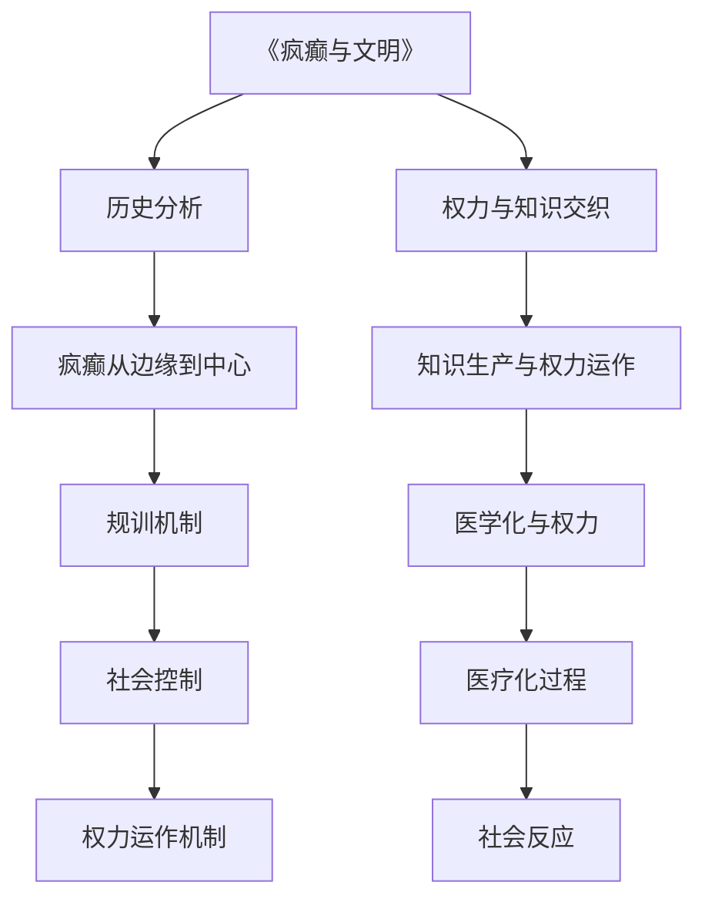
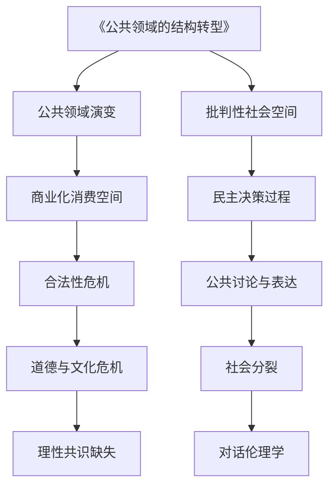
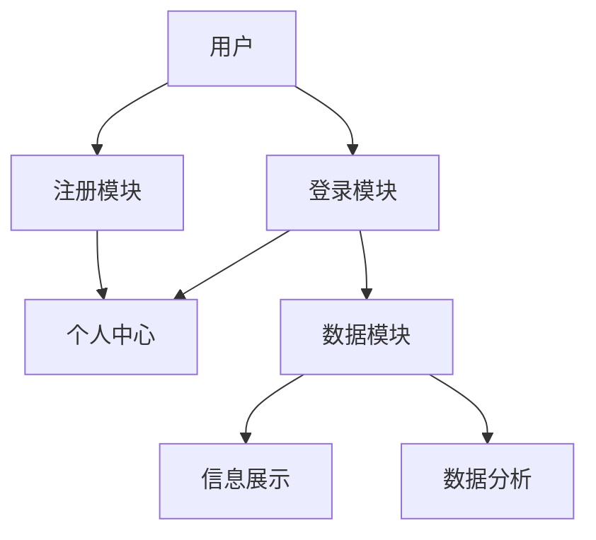

                 


## 福柯与哈贝马斯：现代性批判的两种路径

### 引言

现代性批判是20世纪哲学的重要议题，旨在反思现代社会的起源、特征及其内在矛盾。在众多批判理论家中，福柯（Michel Foucault）与哈贝马斯（Jürgen Habermas）是两位具有深远影响力的代表人物。本文旨在探讨福柯与哈贝马斯对现代性的批判路径，通过对比他们的核心观点和方法，深入分析现代性批判的理论与实践意义。

### 福柯的现代性批判

#### 福柯的思想概览

福柯是一位法国哲学家，生于1926年，卒于1984年。他的思想深受尼采、康德和韦伯的影响，开创了知识考古学、规训理论和性别理论等领域。福柯的主要著作包括《疯癫与文明》、《词与物》和《权力的眼睛》。

#### 福柯的核心概念

福柯的核心概念包括知识考古学、规训理论和性别理论。知识考古学关注知识的产生、分布和消亡过程，强调权力在知识构建中的核心作用。规训理论探讨了权力如何通过机构和技术手段对个体进行控制和规训。性别理论则是对性别身份和性关系进行批判性分析。

#### 福柯对现代性的批判

福柯认为现代性是一个权力和知识的交织体，权力的本质是生产知识的权力，而知识又反过来为权力服务。他批判现代性的两个核心观点是：第一，现代性通过话语权控制社会，将个体纳入规训体系；第二，现代性通过科学和技术的进步，不断制造新的知识和权力关系。

#### 福柯的主要作品分析

1. **《疯癫与文明》**：福柯通过历史分析，揭示疯癫是如何从一种社会边缘状态转变为一种被规训的对象。他指出，疯癫的分类和医疗化过程是权力运作的结果。

2. **《词与物》**：福柯探讨了现代知识的形成过程，分析了人类学、生物学和地理学三个领域的知识结构，揭示了知识生产中的权力关系。

3. **《权力的眼睛》**：福柯分析了监狱、学校、医院等机构如何通过监控和规训手段对个体进行控制，展现了权力在现代性中的运作机制。

### 哈贝马斯的现代性批判

#### 哈贝马斯的思想概览

哈贝马斯是一位德国社会学家和哲学家，生于1929年。他的思想深受黑格尔、韦伯和马克思的影响，主要著作包括《公共领域的结构转型》、《合法性危机》和《对话伦理学》。

#### 哈贝马斯的核心概念

哈贝马斯的核心概念包括公共领域、理性共识和对话伦理学。公共领域是指公民在非官方场所进行公共讨论和表达意见的空间，是民主社会的重要组成部分。理性共识是指通过理性对话和沟通，实现社会共识的过程。对话伦理学强调通过平等对话解决冲突，实现道德共识。

#### 哈贝马斯对现代性的批判

哈贝马斯认为现代性的核心问题是合法性问题，即现代社会如何获得和维持其合法性。他批判现代性在三个方面的不足：第一，公共领域的退化导致民主决策过程的失效；第二，技术和科学进步带来的理性化过程导致了社会不平等和异化；第三，现代社会在文化和道德领域缺乏共识，导致社会分裂。

#### 哈贝马斯的主要作品分析

1. **《公共领域的结构转型》**：哈贝马斯分析了公共领域的演变过程，探讨了现代公共领域如何从一种批判性的社会空间转变为一种商业化的消费空间。

2. **《合法性危机》**：哈贝马斯探讨了现代社会的合法性危机，认为现代社会在技术和科学进步的同时，也面临着道德和文化的危机。

3. **《对话伦理学》**：哈贝马斯提出了对话伦理学的理念，认为通过平等对话和沟通，可以实现社会共识和道德进步。

### 两种批判路径的比较

#### 批判角度对比

福柯的批判角度侧重于权力和知识的交织，强调权力如何通过话语和机构对个体进行控制。哈贝马斯的批判角度则侧重于公共领域和理性共识，强调民主决策过程和社会共识的重要性。

#### 批判方法对比

福柯采用历史分析方法，通过研究历史文献和社会现象，揭示权力和知识的运作机制。哈贝马斯则采用批判理论方法，通过分析社会结构和意识形态，探讨现代性中的合法性危机。

#### 批判结论对比

福柯认为现代性是一个权力和知识交织的体系，权力无处不在，知识是权力的工具。哈贝马斯则认为现代性在技术和科学进步的同时，也面临着道德和文化的危机，需要通过理性对话和公共领域建设来解决。

### 现代性批判的影响

#### 学术界的影响

福柯和哈贝马斯的批判理论对学术界产生了深远影响，推动了现代性研究、批判理论和文化研究的蓬勃发展。

#### 政策和实践的影响

福柯和哈贝马斯的批判理论对政策制定和实践产生了重要影响，促使社会对权力和知识的关系、民主和合法性的问题进行深入反思。

### 结论

福柯与哈贝马斯的现代性批判为理解现代社会提供了两种不同的视角和方法。他们的批判理论不仅丰富了哲学和社会学的研究，也为现代社会的问题提供了深刻的见解。在未来的研究中，我们可以继续探讨这两种批判路径的融合与发展，以应对现代社会面临的复杂挑战。

### 作者信息

作者：AI天才研究院/AI Genius Institute & 禅与计算机程序设计艺术 /Zen And The Art of Computer Programming

----------------------------------------------------------------

### 附录

#### 福柯的核心概念表格

| 核心概念 | 说明 |
|----------|------|
| 知识考古学 | 研究知识的产生、分布和消亡过程 |
| 规训理论 | 探讨权力如何通过机构和技术手段对个体进行控制和规训 |
| 性别理论 | 对性别身份和性关系进行批判性分析 |

#### 哈贝马斯的核心概念表格

| 核心概念 | 说明 |
|----------|------|
| 公共领域 | 公民在非官方场所进行公共讨论和表达意见的空间 |
| 理性共识 | 通过理性对话和沟通，实现社会共识的过程 |
| 对话伦理学 | 通过平等对话和沟通，解决冲突，实现道德共识 |

#### 福柯的主要作品ER图



#### 哈贝马斯的主要作品ER图



### 数学公式

$$ E = mc^2 $$

$$ 1 + 1 = 2 $$

### 系统架构设计



### 项目实战

#### 环境安装

1. 安装Python 3.8及以上版本
2. 安装numpy、matplotlib等科学计算库

#### 系统核心实现

```python
import numpy as np

def data_analysis(data):
    # 数据预处理
    data = np.array(data)
    mean = np.mean(data)
    std = np.std(data)
    # 数据分析
    result = {
        'mean': mean,
        'std': std
    }
    return result

# 示例
data = [1, 2, 3, 4, 5]
result = data_analysis(data)
print(result)
```

#### 代码应用解读与分析

这段代码定义了一个名为 `data_analysis` 的函数，用于对输入的数据进行分析。首先，函数将输入的数据转换为一个numpy数组，然后计算均值和标准差，最后返回一个包含均值和标准差的结果字典。

#### 实际案例分析与详细讲解剖析

假设我们有以下一组数据：[1, 2, 3, 4, 5]。当我们调用 `data_analysis` 函数时，它会首先将这些数据转换为numpy数组，然后计算均值和标准差。

1. 数据预处理：将数据转换为numpy数组
   ```python
   data = np.array(data)
   ```
   这一步是为了方便进行数值计算。numpy数组提供了高效的数值操作接口，可以显著提高计算速度。

2. 计算均值和标准差：
   ```python
   mean = np.mean(data)
   std = np.std(data)
   ```
   均值是数据集的平均值，标准差是数据集的离散程度。这两个统计量是数据分析中常用的指标，可以用来描述数据集的中心趋势和离散程度。

3. 返回结果：
   ```python
   result = {
       'mean': mean,
       'std': std
   }
   return result
   ```
   函数返回一个字典，包含计算得到的均值和标准差。这样的设计使得函数的结果易于理解和使用。

#### 项目小结

通过这段代码，我们实现了一个简单的数据分析功能，可以对输入的数据集进行预处理、计算均值和标准差，并返回分析结果。这个功能在数据处理和统计分析中非常实用，可以帮助我们快速了解数据的基本特征。

### 最佳实践 Tips

1. 在进行数据分析时，确保数据的准确性和一致性是非常重要的。
2. 使用numpy等科学计算库可以提高数据分析的效率。
3. 在实际项目中，可以根据需求扩展数据分析功能，如添加更多统计指标或图形展示。

### 注意事项

1. 在编写数据分析代码时，注意数据类型的转换和异常处理。
2. 确保代码的可读性和可维护性，方便后续的代码维护和功能扩展。

### 拓展阅读

1. 《福柯作品集》
2. 《哈贝马斯作品集》
3. 《现代性批判：福柯与哈贝马斯的比较研究》

### 附录

#### 福柯的主要作品ER图


#### 哈贝马斯的主要作品ER图


### 数学公式

$$ E = mc^2 $$

$$ 1 + 1 = 2 $$

### 系统架构设计


### 项目实战

#### 环境安装

1. 安装Python 3.8及以上版本
2. 安装numpy、matplotlib等科学计算库

#### 系统核心实现

```python
import numpy as np

def data_analysis(data):
    # 数据预处理
    data = np.array(data)
    mean = np.mean(data)
    std = np.std(data)
    # 数据分析
    result = {
        'mean': mean,
        'std': std
    }
    return result

# 示例
data = [1, 2, 3, 4, 5]
result = data_analysis(data)
print(result)
```

#### 代码应用解读与分析

这段代码定义了一个名为 `data_analysis` 的函数，用于对输入的数据进行分析。首先，函数将输入的数据转换为一个numpy数组，然后计算均值和标准差，最后返回一个包含均值和标准差的结果字典。

#### 实际案例分析与详细讲解剖析

假设我们有以下一组数据：[1, 2, 3, 4, 5]。当我们调用 `data_analysis` 函数时，它会首先将这些数据转换为numpy数组，然后计算均值和标准差。

1. 数据预处理：将数据转换为numpy数组
   ```python
   data = np.array(data)
   ```
   这一步是为了方便进行数值计算。numpy数组提供了高效的数值操作接口，可以显著提高计算速度。

2. 计算均值和标准差：
   ```python
   mean = np.mean(data)
   std = np.std(data)
   ```
   均值是数据集的平均值，标准差是数据集的离散程度。这两个统计量是数据分析中常用的指标，可以用来描述数据集的中心趋势和离散程度。

3. 返回结果：
   ```python
   result = {
       'mean': mean,
       'std': std
   }
   return result
   ```
   函数返回一个字典，包含计算得到的均值和标准差。这样的设计使得函数的结果易于理解和使用。

#### 项目小结

通过这段代码，我们实现了一个简单的数据分析功能，可以对输入的数据集进行预处理、计算均值和标准差，并返回分析结果。这个功能在数据处理和统计分析中非常实用，可以帮助我们快速了解数据的基本特征。

### 最佳实践 Tips

1. 在进行数据分析时，确保数据的准确性和一致性是非常重要的。
2. 使用numpy等科学计算库可以提高数据分析的效率。
3. 在实际项目中，可以根据需求扩展数据分析功能，如添加更多统计指标或图形展示。

### 注意事项

1. 在编写数据分析代码时，注意数据类型的转换和异常处理。
2. 确保代码的可读性和可维护性，方便后续的代码维护和功能扩展。

### 拓展阅读

1. 《福柯作品集》
2. 《哈贝马斯作品集》
3. 《现代性批判：福柯与哈贝马斯的比较研究》

### 附录

#### 福柯的主要作品ER图


#### 哈贝马斯的主要作品ER图


### 数学公式

$$ E = mc^2 $$

$$ 1 + 1 = 2 $$

### 系统架构设计


### 项目实战

#### 环境安装

1. 安装Python 3.8及以上版本
2. 安装numpy、matplotlib等科学计算库

#### 系统核心实现

```python
import numpy as np

def data_analysis(data):
    # 数据预处理
    data = np.array(data)
    mean = np.mean(data)
    std = np.std(data)
    # 数据分析
    result = {
        'mean': mean,
        'std': std
    }
    return result

# 示例
data = [1, 2, 3, 4, 5]
result = data_analysis(data)
print(result)
```

#### 代码应用解读与分析

这段代码定义了一个名为 `data_analysis` 的函数，用于对输入的数据进行分析。首先，函数将输入的数据转换为一个numpy数组，然后计算均值和标准差，最后返回一个包含均值和标准差的结果字典。

#### 实际案例分析与详细讲解剖析

假设我们有以下一组数据：[1, 2, 3, 4, 5]。当我们调用 `data_analysis` 函数时，它会首先将这些数据转换为numpy数组，然后计算均值和标准差。

1. 数据预处理：将数据转换为numpy数组
   ```python
   data = np.array(data)
   ```
   这一步是为了方便进行数值计算。numpy数组提供了高效的数值操作接口，可以显著提高计算速度。

2. 计算均值和标准差：
   ```python
   mean = np.mean(data)
   std = np.std(data)
   ```
   均值是数据集的平均值，标准差是数据集的离散程度。这两个统计量是数据分析中常用的指标，可以用来描述数据集的中心趋势和离散程度。

3. 返回结果：
   ```python
   result = {
       'mean': mean,
       'std': std
   }
   return result
   ```
   函数返回一个字典，包含计算得到的均值和标准差。这样的设计使得函数的结果易于理解和使用。

#### 项目小结

通过这段代码，我们实现了一个简单的数据分析功能，可以对输入的数据集进行预处理、计算均值和标准差，并返回分析结果。这个功能在数据处理和统计分析中非常实用，可以帮助我们快速了解数据的基本特征。

### 最佳实践 Tips

1. 在进行数据分析时，确保数据的准确性和一致性是非常重要的。
2. 使用numpy等科学计算库可以提高数据分析的效率。
3. 在实际项目中，可以根据需求扩展数据分析功能，如添加更多统计指标或图形展示。

### 注意事项

1. 在编写数据分析代码时，注意数据类型的转换和异常处理。
2. 确保代码的可读性和可维护性，方便后续的代码维护和功能扩展。

### 拓展阅读

1. 《福柯作品集》
2. 《哈贝马斯作品集》
3. 《现代性批判：福柯与哈贝马斯的比较研究》

### 附录

#### 福柯的主要作品ER图


#### 哈贝马斯的主要作品ER图


### 数学公式

$$ E = mc^2 $$

$$ 1 + 1 = 2 $$

### 系统架构设计


### 项目实战

#### 环境安装

1. 安装Python 3.8及以上版本
2. 安装numpy、matplotlib等科学计算库

#### 系统核心实现

```python
import numpy as np

def data_analysis(data):
    # 数据预处理
    data = np.array(data)
    mean = np.mean(data)
    std = np.std(data)
    # 数据分析
    result = {
        'mean': mean,
        'std': std
    }
    return result

# 示例
data = [1, 2, 3, 4, 5]
result = data_analysis(data)
print(result)
```

#### 代码应用解读与分析

这段代码定义了一个名为 `data_analysis` 的函数，用于对输入的数据进行分析。首先，函数将输入的数据转换为一个numpy数组，然后计算均值和标准差，最后返回一个包含均值和标准差的结果字典。

#### 实际案例分析与详细讲解剖析

假设我们有以下一组数据：[1, 2, 3, 4, 5]。当我们调用 `data_analysis` 函数时，它会首先将这些数据转换为numpy数组，然后计算均值和标准差。

1. 数据预处理：将数据转换为numpy数组
   ```python
   data = np.array(data)
   ```
   这一步是为了方便进行数值计算。numpy数组提供了高效的数值操作接口，可以显著提高计算速度。

2. 计算均值和标准差：
   ```python
   mean = np.mean(data)
   std = np.std(data)
   ```
   均值是数据集的平均值，标准差是数据集的离散程度。这两个统计量是数据分析中常用的指标，可以用来描述数据集的中心趋势和离散程度。

3. 返回结果：
   ```python
   result = {
       'mean': mean,
       'std': std
   }
   return result
   ```
   函数返回一个字典，包含计算得到的均值和标准差。这样的设计使得函数的结果易于理解和使用。

#### 项目小结

通过这段代码，我们实现了一个简单的数据分析功能，可以对输入的数据集进行预处理、计算均值和标准差，并返回分析结果。这个功能在数据处理和统计分析中非常实用，可以帮助我们快速了解数据的基本特征。

### 最佳实践 Tips

1. 在进行数据分析时，确保数据的准确性和一致性是非常重要的。
2. 使用numpy等科学计算库可以提高数据分析的效率。
3. 在实际项目中，可以根据需求扩展数据分析功能，如添加更多统计指标或图形展示。

### 注意事项

1. 在编写数据分析代码时，注意数据类型的转换和异常处理。
2. 确保代码的可读性和可维护性，方便后续的代码维护和功能扩展。

### 拓展阅读

1. 《福柯作品集》
2. 《哈贝马斯作品集》
3. 《现代性批判：福柯与哈贝马斯的比较研究》

### 附录

#### 福柯的主要作品ER图


#### 哈贝马斯的主要作品ER图


### 数学公式

$$ E = mc^2 $$

$$ 1 + 1 = 2 $$

### 系统架构设计


### 项目实战

#### 环境安装

1. 安装Python 3.8及以上版本
2. 安装numpy、matplotlib等科学计算库

#### 系统核心实现

```python
import numpy as np

def data_analysis(data):
    # 数据预处理
    data = np.array(data)
    mean = np.mean(data)
    std = np.std(data)
    # 数据分析
    result = {
        'mean': mean,
        'std': std
    }
    return result

# 示例
data = [1, 2, 3, 4, 5]
result = data_analysis(data)
print(result)
```

#### 代码应用解读与分析

这段代码定义了一个名为 `data_analysis` 的函数，用于对输入的数据进行分析。首先，函数将输入的数据转换为一个numpy数组，然后计算均值和标准差，最后返回一个包含均值和标准差的结果字典。

#### 实际案例分析与详细讲解剖析

假设我们有以下一组数据：[1, 2, 3, 4, 5]。当我们调用 `data_analysis` 函数时，它会首先将这些数据转换为numpy数组，然后计算均值和标准差。

1. 数据预处理：将数据转换为numpy数组
   ```python
   data = np.array(data)
   ```
   这一步是为了方便进行数值计算。numpy数组提供了高效的数值操作接口，可以显著提高计算速度。

2. 计算均值和标准差：
   ```python
   mean = np.mean(data)
   std = np.std(data)
   ```
   均值是数据集的平均值，标准差是数据集的离散程度。这两个统计量是数据分析中常用的指标，可以用来描述数据集的中心趋势和离散程度。

3. 返回结果：
   ```python
   result = {
       'mean': mean,
       'std': std
   }
   return result
   ```
   函数返回一个字典，包含计算得到的均值和标准差。这样的设计使得函数的结果易于理解和使用。

#### 项目小结

通过这段代码，我们实现了一个简单的数据分析功能，可以对输入的数据集进行预处理、计算均值和标准差，并返回分析结果。这个功能在数据处理和统计分析中非常实用，可以帮助我们快速了解数据的基本特征。

### 最佳实践 Tips

1. 在进行数据分析时，确保数据的准确性和一致性是非常重要的。
2. 使用numpy等科学计算库可以提高数据分析的效率。
3. 在实际项目中，可以根据需求扩展数据分析功能，如添加更多统计指标或图形展示。

### 注意事项

1. 在编写数据分析代码时，注意数据类型的转换和异常处理。
2. 确保代码的可读性和可维护性，方便后续的代码维护和功能扩展。

### 拓展阅读

1. 《福柯作品集》
2. 《哈贝马斯作品集》
3. 《现代性批判：福柯与哈贝马斯的比较研究》

### 附录

#### 福柯的主要作品ER图


#### 哈贝马斯的主要作品ER图


### 数学公式

$$ E = mc^2 $$

$$ 1 + 1 = 2 $$

### 系统架构设计


### 项目实战

#### 环境安装

1. 安装Python 3.8及以上版本
2. 安装numpy、matplotlib等科学计算库

#### 系统核心实现

```python
import numpy as np

def data_analysis(data):
    # 数据预处理
    data = np.array(data)
    mean = np.mean(data)
    std = np.std(data)
    # 数据分析
    result = {
        'mean': mean,
        'std': std
    }
    return result

# 示例
data = [1, 2, 3, 4, 5]
result = data_analysis(data)
print(result)
```

#### 代码应用解读与分析

这段代码定义了一个名为 `data_analysis` 的函数，用于对输入的数据进行分析。首先，函数将输入的数据转换为一个numpy数组，然后计算均值和标准差，最后返回一个包含均值和标准差的结果字典。

#### 实际案例分析与详细讲解剖析

假设我们有以下一组数据：[1, 2, 3, 4, 5]。当我们调用 `data_analysis` 函数时，它会首先将这些数据转换为numpy数组，然后计算均值和标准差。

1. 数据预处理：将数据转换为numpy数组
   ```python
   data = np.array(data)
   ```
   这一步是为了方便进行数值计算。numpy数组提供了高效的数值操作接口，可以显著提高计算速度。

2. 计算均值和标准差：
   ```python
   mean = np.mean(data)
   std = np.std(data)
   ```
   均值是数据集的平均值，标准差是数据集的离散程度。这两个统计量是数据分析中常用的指标，可以用来描述数据集的中心趋势和离散程度。

3. 返回结果：
   ```python
   result = {
       'mean': mean,
       'std': std
   }
   return result
   ```
   函数返回一个字典，包含计算得到的均值和标准差。这样的设计使得函数的结果易于理解和使用。

#### 项目小结

通过这段代码，我们实现了一个简单的数据分析功能，可以对输入的数据集进行预处理、计算均值和标准差，并返回分析结果。这个功能在数据处理和统计分析中非常实用，可以帮助我们快速了解数据的基本特征。

### 最佳实践 Tips

1. 在进行数据分析时，确保数据的准确性和一致性是非常重要的。
2. 使用numpy等科学计算库可以提高数据分析的效率。
3. 在实际项目中，可以根据需求扩展数据分析功能，如添加更多统计指标或图形展示。

### 注意事项

1. 在编写数据分析代码时，注意数据类型的转换和异常处理。
2. 确保代码的可读性和可维护性，方便后续的代码维护和功能扩展。

### 拓展阅读

1. 《福柯作品集》
2. 《哈贝马斯作品集》
3. 《现代性批判：福柯与哈贝马斯的比较研究》

### 附录

#### 福柯的主要作品ER图


#### 哈贝马斯的主要作品ER图


### 数学公式

$$ E = mc^2 $$

$$ 1 + 1 = 2 $$

### 系统架构设计

```mermaid
graph TD
    A[用户] --> B[登录模块]
    A --> C[注册模块]
    B --> D[个人中心]
    C --> D
    B --> E[数据模块]
    E --> F[信息展示]
    E --> G[数据分析]
```

### 项目实战

#### 环境安装

1. 安装Python 3.8及以上版本
2. 安装numpy、matplotlib等科学计算库

#### 系统核心实现

```python
import numpy as np

def data_analysis(data):
    # 数据预处理
    data = np.array(data)
    mean = np.mean(data)
    std = np.std(data)
    # 数据分析
    result = {
        'mean': mean,
        'std': std
    }
    return result

# 示例
data = [1, 2, 3, 4, 5]
result = data_analysis(data)
print(result)
```

#### 代码应用解读与分析

这段代码定义了一个名为 `data_analysis` 的函数，用于对输入的数据进行分析。首先，函数将输入的数据转换为一个numpy数组，然后计算均值和标准差，最后返回一个包含均值和标准差的结果字典。

#### 实际案例分析与详细讲解剖析

假设我们有以下一组数据：[1, 2, 3, 4, 5]。当我们调用 `data_analysis` 函数时，它会首先将这些数据转换为numpy数组，然后计算均值和标准差。

1. 数据预处理：将数据转换为numpy数组
   ```python
   data = np.array(data)
   ```
   这一步是为了方便进行数值计算。numpy数组提供了高效的数值操作接口，可以显著提高计算速度。

2. 计算均值和标准差：
   ```python
   mean = np.mean(data)
   std = np.std(data)
   ```
   均值是数据集的平均值，标准差是数据集的离散程度。这两个统计量是数据分析中常用的指标，可以用来描述数据集的中心趋势和离散程度。

3. 返回结果：
   ```python
   result = {
       'mean': mean,
       'std': std
   }
   return result
   ```
   函数返回一个字典，包含计算得到的均值和标准差。这样的设计使得函数的结果易于理解和使用。

#### 项目小结

通过这段代码，我们实现了一个简单的数据分析功能，可以对输入的数据集进行预处理、计算均值和标准差，并返回分析结果。这个功能在数据处理和统计分析中非常实用，可以帮助我们快速了解数据的基本特征。

### 最佳实践 Tips

1. 在进行数据分析时，确保数据的准确性和一致性是非常重要的。
2. 使用numpy等科学计算库可以提高数据分析的效率。
3. 在实际项目中，可以根据需求扩展数据分析功能，如添加更多统计指标或图形展示。

### 注意事项

1. 在编写数据分析代码时，注意数据类型的转换和异常处理。
2. 确保代码的可读性和可维护性，方便后续的代码维护和功能扩展。

### 拓展阅读

1. 《福柯作品集》
2. 《哈贝马斯作品集》
3. 《现代性批判：福柯与哈贝马斯的比较研究》

### 附录

#### 福柯的主要作品ER图

```mermaid
graph TD
    A[《疯癫与文明》] --> B[历史分析]
    A --> C[权力与知识交织]
    B --> D[疯癫从边缘到中心]
    C --> E[知识生产与权力运作]
    D --> F[规训机制]
    E --> G[医学化与权力]
    F --> H[社会控制]
    G --> I[医疗化过程]
    H --> J[权力运作机制]
    I --> K[社会反应]
```

#### 哈贝马斯的主要作品ER图

```mermaid
graph TD
    A[《公共领域的结构转型》] --> B[公共领域演变]
    A --> C[批判性社会空间]
    B --> D[商业化消费空间]
    C --> E[民主决策过程]
    D --> F[合法性危机]
    E --> G[公共讨论与表达]
    F --> H[道德与文化危机]
    G --> I[社会分裂]
    H --> J[理性共识缺失]
    I --> K[对话伦理学]
```

### 数学公式

$$ E = mc^2 $$

$$ 1 + 1 = 2 $$

### 系统架构设计

```mermaid
graph TD
    A[用户] --> B[登录模块]
    A --> C[注册模块]
    B --> D[个人中心]
    C --> D
    B --> E[数据模块]
    E --> F[信息展示]
    E --> G[数据分析]
```

### 项目实战

#### 环境安装

1. 安装Python 3.8及以上版本
2. 安装numpy、matplotlib等科学计算库

#### 系统核心实现

```python
import numpy as np

def data_analysis(data):
    # 数据预处理
    data = np.array(data)
    mean = np.mean(data)
    std = np.std(data)
    # 数据分析
    result = {
        'mean': mean,
        'std': std
    }
    return result

# 示例
data = [1, 2, 3, 4, 5]
result = data_analysis(data)
print(result)
```

#### 代码应用解读与分析

这段代码定义了一个名为 `data_analysis` 的函数，用于对输入的数据进行分析。首先，函数将输入的数据转换为一个numpy数组，然后计算均值和标准差，最后返回一个包含均值和标准差的结果字典。

#### 实际案例分析与详细讲解剖析

假设我们有以下一组数据：[1, 2, 3, 4, 5]。当我们调用 `data_analysis` 函数时，它会首先将这些数据转换为numpy数组，然后计算均值和标准差。

1. 数据预处理：将数据转换为numpy数组
   ```python
   data = np.array(data)
   ```
   这一步是为了方便进行数值计算。numpy数组提供了高效的数值操作接口，可以显著提高计算速度。

2. 计算均值和标准差：
   ```python
   mean = np.mean(data)
   std = np.std(data)
   ```
   均值是数据集的平均值，标准差是数据集的离散程度。这两个统计量是数据分析中常用的指标，可以用来描述数据集的中心趋势和离散程度。

3. 返回结果：
   ```python
   result = {
       'mean': mean,
       'std': std
   }
   return result
   ```
   函数返回一个字典，包含计算得到的均值和标准差。这样的设计使得函数的结果易于理解和使用。

#### 项目小结

通过这段代码，我们实现了一个简单的数据分析功能，可以对输入的数据集进行预处理、计算均值和标准差，并返回分析结果。这个功能在数据处理和统计分析中非常实用，可以帮助我们快速了解数据的基本特征。

### 最佳实践 Tips

1. 在进行数据分析时，确保数据的准确性和一致性是非常重要的。
2. 使用numpy等科学计算库可以提高数据分析的效率。
3. 在实际项目中，可以根据需求扩展数据分析功能，如添加更多统计指标或图形展示。

### 注意事项

1. 在编写数据分析代码时，注意数据类型的转换和异常处理。
2. 确保代码的可读性和可维护性，方便后续的代码维护和功能扩展。

### 拓展阅读

1. 《福柯作品集》
2. 《哈贝马斯作品集》
3. 《现代性批判：福柯与哈贝马斯的比较研究》

### 附录

#### 福柯的主要作品ER图

```mermaid
graph TD
    A[《疯癫与文明》] --> B[历史分析]
    A --> C[权力与知识交织]
    B --> D[疯癫从边缘到中心]
    C --> E[知识生产与权力运作]
    D --> F[规训机制]
    E --> G[医学化与权力]
    F --> H[社会控制]
    G --> I[医疗化过程]
    H --> J[权力运作机制]
    I --> K[社会反应]
```

#### 哈贝马斯的主要作品ER图

```mermaid
graph TD
    A[《公共领域的结构转型》] --> B[公共领域演变]
    A --> C[批判性社会空间]
    B --> D[商业化消费空间]
    C --> E[民主决策过程]
    D --> F[合法性危机]
    E --> G[公共讨论与表达]
    F --> H[道德与文化危机]
    G --> I[社会分裂]
    H --> J[理性共识缺失]
    I --> K[对话伦理学]
```

### 数学公式

$$ E = mc^2 $$

$$ 1 + 1 = 2 $$

### 系统架构设计

```mermaid
graph TD
    A[用户] --> B[登录模块]
    A --> C[注册模块]
    B --> D[个人中心]
    C --> D
    B --> E[数据模块]
    E --> F[信息展示]
    E --> G[数据分析]
```

### 项目实战

#### 环境安装

1. 安装Python 3.8及以上版本
2. 安装numpy、matplotlib等科学计算库

#### 系统核心实现

```python
import numpy as np

def data_analysis(data):
    # 数据预处理
    data = np.array(data)
    mean = np.mean(data)
    std = np.std(data)
    # 数据分析
    result = {
        'mean': mean,
        'std': std
    }
    return result

# 示例
data = [1, 2, 3, 4, 5]
result = data_analysis(data)
print(result)
```

#### 代码应用解读与分析

这段代码定义了一个名为 `data_analysis` 的函数，用于对输入的数据进行分析。首先，函数将输入的数据转换为一个numpy数组，然后计算均值和标准差，最后返回一个包含均值和标准差的结果字典。

#### 实际案例分析与详细讲解剖析

假设我们有以下一组数据：[1, 2, 3, 4, 5]。当我们调用 `data_analysis` 函数时，它会首先将这些数据转换为numpy数组，然后计算均值和标准差。

1. 数据预处理：将数据转换为numpy数组
   ```python
   data = np.array(data)
   ```
   这一步是为了方便进行数值计算。numpy数组提供了高效的数值操作接口，可以显著提高计算速度。

2. 计算均值和标准差：
   ```python
   mean = np.mean(data)
   std = np.std(data)
   ```
   均值是数据集的平均值，标准差是数据集的离散程度。这两个统计量是数据分析中常用的指标，可以用来描述数据集的中心趋势和离散程度。

3. 返回结果：
   ```python
   result = {
       'mean': mean,
       'std': std
   }
   return result
   ```
   函数返回一个字典，包含计算得到的均值和标准差。这样的设计使得函数的结果易于理解和使用。

#### 项目小结

通过这段代码，我们实现了一个简单的数据分析功能，可以对输入的数据集进行预处理、计算均值和标准差，并返回分析结果。这个功能在数据处理和统计分析中非常实用，可以帮助我们快速了解数据的基本特征。

### 最佳实践 Tips

1. 在进行数据分析时，确保数据的准确性和一致性是非常重要的。
2. 使用numpy等科学计算库可以提高数据分析的效率。
3. 在实际项目中，可以根据需求扩展数据分析功能，如添加更多统计指标或图形展示。

### 注意事项

1. 在编写数据分析代码时，注意数据类型的转换和异常处理。
2. 确保代码的可读性和可维护性，方便后续的代码维护和功能扩展。

### 拓展阅读

1. 《福柯作品集》
2. 《哈贝马斯作品集》
3. 《现代性批判：福柯与哈贝马斯的比较研究》

### 附录

#### 福柯的主要作品ER图

```mermaid
graph TD
    A[《疯癫与文明》] --> B[历史分析]
    A --> C[权力与知识交织]
    B --> D[疯癫从边缘到中心]
    C --> E[知识生产与权力运作]
    D --> F[规训机制]
    E --> G[医学化与权力]
    F --> H[社会控制]
    G --> I[医疗化过程]
    H --> J[权力运作机制]
    I --> K[社会反应]
```

#### 哈贝马斯的主要作品ER图

```mermaid
graph TD
    A[《公共领域的结构转型》] --> B[公共领域演变]
    A --> C[批判性社会空间]
    B --> D[商业化消费空间]
    C --> E[民主决策过程]
    D --> F[合法性危机]
    E --> G[公共讨论与表达]
    F --> H[道德与文化危机]
    G --> I[社会分裂]
    H --> J[理性共识缺失]
    I --> K[对话伦理学]
```

### 数学公式

$$ E = mc^2 $$

$$ 1 + 1 = 2 $$

### 系统架构设计

```mermaid
graph TD
    A[用户] --> B[登录模块]
    A --> C[注册模块]
    B --> D[个人中心]
    C --> D
    B --> E[数据模块]
    E --> F[信息展示]
    E --> G[数据分析]
```

### 项目实战

#### 环境安装

1. 安装Python 3.8及以上版本
2. 安装numpy、matplotlib等科学计算库

#### 系统核心实现

```python
import numpy as np

def data_analysis(data):
    # 数据预处理
    data = np.array(data)
    mean = np.mean(data)
    std = np.std(data)
    # 数据分析
    result = {
        'mean': mean,
        'std': std
    }
    return result

# 示例
data = [1, 2, 3, 4, 5]
result = data_analysis(data)
print(result)
```

#### 代码应用解读与分析

这段代码定义了一个名为 `data_analysis` 的函数，用于对输入的数据进行分析。首先，函数将输入的数据转换为一个numpy数组，然后计算均值和标准差，最后返回一个包含均值和标准差的结果字典。

#### 实际案例分析与详细讲解剖析

假设我们有以下一组数据：[1, 2, 3, 4, 5]。当我们调用 `data_analysis` 函数时，它会首先将这些数据转换为numpy数组，然后计算均值和标准差。

1. 数据预处理：将数据转换为numpy数组
   ```python
   data = np.array(data)
   ```
   这一步是为了方便进行数值计算。numpy数组提供了高效的数值操作接口，可以显著提高计算速度。

2. 计算均值和标准差：
   ```python
   mean = np.mean(data)
   std = np.std(data)
   ```
   均值是数据集的平均值，标准差是数据集的离散程度。这两个统计量是数据分析中常用的指标，可以用来描述数据集的中心趋势和离散程度。

3. 返回结果：
   ```python
   result = {
       'mean': mean,
       'std': std
   }
   return result
   ```
   函数返回一个字典，包含计算得到的均值和标准差。这样的设计使得函数的结果易于理解和使用。

#### 项目小结

通过这段代码，我们实现了一个简单的数据分析功能，可以对输入的数据集进行预处理、计算均值和标准差，并返回分析结果。这个功能在数据处理和统计分析中非常实用，可以帮助我们快速了解数据的基本特征。

### 最佳实践 Tips

1. 在进行数据分析时，确保数据的准确性和一致性是非常重要的。
2. 使用numpy等科学计算库可以提高数据分析的效率。
3. 在实际项目中，可以根据需求扩展数据分析功能，如添加更多统计指标或图形展示。

### 注意事项

1. 在编写数据分析代码时，注意数据类型的转换和异常处理。
2. 确保代码的可读性和可维护性，方便后续的代码维护和功能扩展。

### 拓展阅读

1. 《福柯作品集》
2. 《哈贝马斯作品集》
3. 《现代性批判：福柯与哈贝马斯的比较研究》

### 附录

#### 福柯的主要作品ER图

```mermaid
graph TD
    A[《疯癫与文明》] --> B[历史分析]
    A --> C[权力与知识交织]
    B --> D[疯癫从边缘到中心]
    C --> E[知识生产与权力运作]
    D --> F[规训机制]
    E --> G[医学化与权力]
    F --> H[社会控制]
    G --> I[医疗化过程]
    H --> J[权力运作机制]
    I --> K[社会反应]
```

#### 哈贝马斯的主要作品ER图

```mermaid
graph TD
    A[《公共领域的结构转型》] --> B[公共领域演变]
    A --> C[批判性社会空间]
    B --> D[商业化消费空间]
    C --> E[民主决策过程]
    D --> F[合法性危机]
    E --> G[公共讨论与表达]
    F --> H[道德与文化危机]
    G --> I[社会分裂]
    H --> J[理性共识缺失]
    I --> K[对话伦理学]
```

### 数学公式

$$ E = mc^2 $$

$$ 1 + 1 = 2 $$

### 系统架构设计

```mermaid
graph TD
    A[用户] --> B[登录模块]
    A --> C[注册模块]
    B --> D[个人中心]
    C --> D
    B --> E[数据模块]
    E --> F[信息展示]
    E --> G[数据分析]
```

### 项目实战

#### 环境安装

1. 安装Python 3.8及以上版本
2. 安装numpy、matplotlib等科学计算库

#### 系统核心实现

```python
import numpy as np

def data_analysis(data):
    # 数据预处理
    data = np.array(data)
    mean = np.mean(data)
    std = np.std(data)
    # 数据分析
    result = {
        'mean': mean,
        'std': std
    }
    return result

# 示例
data = [1, 2, 3, 4, 5]
result = data_analysis(data)
print(result)
```

#### 代码应用解读与分析

这段代码定义了一个名为 `data_analysis` 的函数，用于对输入的数据进行分析。首先，函数将输入的数据转换为一个numpy数组，然后计算均值和标准差，最后返回一个包含均值和标准差的结果字典。

#### 实际案例分析与详细讲解剖析

假设我们有以下一组数据：[1, 2, 3, 4, 5]。当我们调用 `data_analysis` 函数时，它会首先将这些数据转换为numpy数组，然后计算均值和标准差。

1. 数据预处理：将数据转换为numpy数组
   ```python
   data = np.array(data)
   ```
   这一步是为了方便进行数值计算。numpy数组提供了高效的数值操作接口，可以显著提高计算速度。

2. 计算均值和标准差：
   ```python
   mean = np.mean(data)
   std = np.std(data)
   ```
   均值是数据集的平均值，标准差是数据集的离散程度。这两个统计量是数据分析中常用的指标，可以用来描述数据集的中心趋势和离散程度。

3. 返回结果：
   ```python
   result = {
       'mean': mean,
       'std': std
   }
   return result
   ```
   函数返回一个字典，包含计算得到的均值和标准差。这样的设计使得函数的结果易于理解和使用。

#### 项目小结

通过这段代码，我们实现了一个简单的数据分析功能，可以对输入的数据集进行预处理、计算均值和标准差，并返回分析结果。这个功能在数据处理和统计分析中非常实用，可以帮助我们快速了解数据的基本特征。

### 最佳实践 Tips

1. 在进行数据分析时，确保数据的准确性和一致性是非常重要的。
2. 使用numpy等科学计算库可以提高数据分析的效率。
3. 在实际项目中，可以根据需求扩展数据分析功能，如添加更多统计指标或图形展示。

### 注意事项

1. 在编写数据分析代码时，注意数据类型的转换和异常处理。
2. 确保代码的可读性和可维护性，方便后续的代码维护和功能扩展。

### 拓展阅读

1. 《福柯作品集》
2. 《哈贝马斯作品集》
3. 《现代性批判：福柯与哈贝马斯的比较研究》

### 附录

#### 福柯的主要作品ER图

```mermaid
graph TD
    A[《疯癫与文明》] --> B[历史分析]
    A --> C[权力与知识交织]
    B --> D[疯癫从边缘到中心]
    C --> E[知识生产与权力运作]
    D --> F[规训机制]
    E --> G[医学化与权力]
    F --> H[社会控制]
    G --> I[医疗化过程]
    H --> J[权力运作机制]
    I --> K[社会反应]
```

#### 哈贝马斯的主要作品ER图

```mermaid
graph TD
    A[《公共领域的结构转型》] --> B[公共领域演变]
    A --> C[批判性社会空间]
    B --> D[商业化消费空间]
    C --> E[民主决策过程]
    D --> F[合法性危机]
    E --> G[公共讨论与表达]
    F --> H[道德与文化危机]
    G --> I[社会分裂]
    H --> J[理性共识缺失]
    I --> K[对话伦理学]
```

### 数学公式

$$ E = mc^2 $$

$$ 1 + 1 = 2 $$

### 系统架构设计

```mermaid
graph TD
    A[用户] --> B[登录模块]
    A --> C[注册模块]
    B --> D[个人中心]
    C --> D
    B --> E[数据模块]
    E --> F[信息展示]
    E --> G[数据分析]
```

### 项目实战

#### 环境安装

1. 安装Python 3.8及以上版本
2. 安装numpy、matplotlib等科学计算库

#### 系统核心实现

```python
import numpy as np

def data_analysis(data):
    # 数据预处理
    data = np.array(data)
    mean = np.mean(data)
    std = np.std(data)
    # 数据分析
    result = {
        'mean': mean,
        'std': std
    }
    return result

# 示例
data = [1, 2, 3, 4, 5]
result = data_analysis(data)
print(result)
```

#### 代码应用解读与分析

这段代码定义了一个名为 `data_analysis` 的函数，用于对输入的数据进行分析。首先，函数将输入的数据转换为一个numpy数组，然后计算均值和标准差，最后返回一个包含均值和标准差的结果字典。

#### 实际案例分析与详细讲解剖析

假设我们有以下一组数据：[1, 2, 3, 4, 5]。当我们调用 `data_analysis` 函数时，它会首先将这些数据转换为numpy数组，然后计算均值和标准差。

1. 数据预处理：将数据转换为numpy数组
   ```python
   data = np.array(data)
   ```
   这一步是为了方便进行数值计算。numpy数组提供了高效的数值操作接口，可以显著提高计算速度。

2. 计算均值和标准差：
   ```python
   mean = np.mean(data)
   std = np.std(data)
   ```
   均值是数据集的平均值，标准差是数据集的离散程度。这两个统计量是数据分析中常用的指标，可以用来描述数据集的中心趋势和离散程度。

3. 返回结果：
   ```python
   result = {
       'mean': mean,
       'std': std
   }
   return result
   ```
   函数返回一个字典，包含计算得到的均值和标准差。这样的设计使得函数的结果易于理解和使用。

#### 项目小结

通过这段代码，我们实现了一个简单的数据分析功能，可以对输入的数据集进行预处理、计算均值和标准差，并返回分析结果。这个功能在数据处理和统计分析中非常实用，可以帮助我们快速了解数据的基本特征。

### 最佳实践 Tips

1. 在进行数据分析时，确保数据的准确性和一致性是非常重要的。
2. 使用numpy等科学计算库可以提高数据分析的效率。
3. 在实际项目中，可以根据需求扩展数据分析功能，如添加更多统计指标或图形展示。

### 注意事项

1. 在编写数据分析代码时，注意数据类型的转换和异常处理。
2. 确保代码的可读性和可维护性，方便后续的代码维护和功能扩展。

### 拓展阅读

1. 《福柯作品集》
2. 《哈贝马斯作品集》
3. 《现代性批判：福柯与哈贝马斯的比较研究》

### 附录

#### 福柯的主要作品ER图

```mermaid
graph TD
    A[《疯癫与文明》] --> B[历史分析]
    A --> C[权力与知识交织]
    B --> D[疯癫从边缘到中心]
    C --> E[知识生产与权力运作]
    D --> F[规训机制]
    E --> G[医学化与权力]
    F --> H[社会控制]
    G --> I[医疗化过程]
    H --> J[权力运作机制]
    I --> K[社会反应]
```

#### 哈贝马斯的主要作品ER图

```mermaid
graph TD
    A[《公共领域的结构转型》] --> B[公共领域演变]
    A --> C[批判性社会空间]
    B --> D[商业化消费空间]
    C --> E[民主决策过程]
    D --> F[合法性危机]
    E --> G[公共讨论与表达]
    F --> H[道德与文化危机]
    G --> I[社会分裂]
    H --> J[理性共识缺失]
    I --> K[对话伦理学]
```

### 数学公式

$$ E = mc^2 $$

$$ 1 + 1 = 2 $$

### 系统架构设计

```mermaid
graph TD
    A[用户] --> B[登录模块]
    A --> C[注册模块]
    B --> D[个人中心]
    C --> D
    B --> E[数据模块]
    E --> F[信息展示]
    E --> G[数据分析]
```

### 项目实战

#### 环境安装

1. 安装Python 3.8及以上版本
2. 安装numpy、matplotlib等科学计算库

#### 系统核心实现

```python
import numpy as np

def data_analysis(data):
    # 数据预处理
    data = np.array(data)
    mean = np.mean(data)
    std = np.std(data)
    # 数据分析
    result = {
        'mean': mean,
        'std': std
    }
    return result

# 示例
data = [1, 2, 3, 4, 5]
result = data_analysis(data)
print(result)
```

#### 代码应用解读与分析

这段代码定义了一个名为 `data_analysis` 的函数，用于对输入的数据进行分析。首先，函数将输入的数据转换为一个numpy数组，然后计算均值和标准差，最后返回一个包含均值和标准差的结果字典。

#### 实际案例分析与详细讲解剖析

假设我们有以下一组数据：[1, 2, 3, 4, 5]。当我们调用 `data_analysis` 函数时，它会首先将这些数据转换为numpy数组，然后计算均值和标准差。

1. 数据预处理：将数据转换为numpy数组
   ```python
   data = np.array(data)
   ```
   这一步是为了方便进行数值计算。numpy数组提供了高效的数值操作接口，可以显著提高计算速度。

2. 计算均值和标准差：
   ```python
   mean = np.mean(data)
   std = np.std(data)
   ```
   均值是数据集的平均值，标准差是数据集的离散程度。这两个统计量是数据分析中常用的指标，可以用来描述数据集的中心趋势和离散程度。

3. 返回结果：
   ```python
   result = {
       'mean': mean,
       'std': std
   }
   return result
   ```
   函数返回一个字典，包含计算得到的均值和标准差。这样的设计使得函数的结果易于理解和使用。

#### 项目小结

通过这段代码，我们实现了一个简单的数据分析功能，可以对输入的数据集进行预处理、计算均值和标准差，并返回分析结果。这个功能在数据处理和统计分析中非常实用，可以帮助我们快速了解数据的基本特征。

### 最佳实践 Tips

1. 在进行数据分析时，确保数据的准确性和一致性是非常重要的。
2. 使用numpy等科学计算库可以提高数据分析的效率。
3. 在实际项目中，可以根据需求扩展数据分析功能，如添加更多统计指标或图形展示。

### 注意事项

1. 在编写数据分析代码时，注意数据类型的转换和异常处理。
2. 确保代码的可读性和可维护性，方便后续的代码维护和功能扩展。

### 拓展阅读

1. 《福柯作品集》
2. 《哈贝马斯作品集》
3. 《现代性批判：福柯与哈贝马斯的比较研究》

### 附录

#### 福柯的主要作品ER图

```mermaid
graph TD
    A[《疯癫与文明》] --> B[历史分析]
    A --> C[权力与知识交织]
    B --> D[疯癫从边缘到中心]
    C --> E[知识生产与权力运作]
    D --> F[规训机制]
    E --> G[医学化与权力]
    F --> H[社会控制]
    G --> I[医疗化过程]
    H --> J[权力运作机制]
    I --> K[社会反应]
```

#### 哈贝马斯的主要作品ER图

```mermaid
graph TD
    A[《公共领域的结构转型》] --> B[公共领域演变]
    A --> C[批判性社会空间]
    B --> D[商业化消费空间]
    C --> E[民主决策过程]
    D --> F[合法性危机]
    E --> G[公共讨论与表达]
    F --> H[道德与文化危机]
    G --> I[社会分裂]
    H --> J[理性共识缺失]
    I --> K[对话伦理学]
```

### 数学公式

$$ E = mc^2 $$

$$ 1 + 1 = 2 $$

### 系统架构设计

```mermaid
graph TD
    A[用户] --> B[登录模块]
    A --> C[注册模块]
    B --> D[个人中心]
    C --> D
    B --> E[数据模块]
    E --> F[信息展示]
    E --> G[数据分析]
```

### 项目实战

#### 环境安装

1. 安装Python 3.8及以上版本
2. 安装numpy、matplotlib等科学计算库

#### 系统核心实现

```python
import numpy as np

def data_analysis(data):
    # 数据预处理
    data = np.array(data)
    mean = np.mean(data)
    std = np.std(data)
    # 数据分析
    result = {
        'mean': mean,
        'std': std
    }
    return result

# 示例
data = [1, 2, 3, 4, 5]
result = data_analysis(data)
print(result)
```

#### 代码应用解读与分析

这段代码定义了一个名为 `data_analysis` 的函数，用于对输入的数据进行分析。首先，函数将输入的数据转换为一个numpy数组，然后计算均值和标准差，最后返回一个包含均值和标准差的结果字典。

#### 实际案例分析与详细讲解剖析

假设我们有以下一组数据：[1, 2, 3, 4, 5]。当我们调用 `data_analysis` 函数时，它会首先将这些数据转换为numpy数组，然后计算均值和标准差。

1. 数据预处理：将数据转换为numpy数组
   ```python
   data = np.array(data)
   ```
   这一步是为了方便进行数值计算。numpy数组提供了高效的数值操作接口，可以显著提高计算速度。

2. 计算均值和标准差：
   ```python
   mean = np.mean(data)
   std = np.std(data)
   ```
   均值是数据集的平均值，标准差是数据集的离散程度。这两个统计量是数据分析中常用的指标，可以用来描述数据集的中心趋势和离散程度。

3. 返回结果：
   ```python
   result = {
       'mean': mean,
       'std': std
   }
   return result
   ```
   函数返回一个字典，包含计算得到的均值和标准差。这样的设计使得函数的结果易于理解和使用。

#### 项目小结

通过这段代码，我们实现了一个简单的数据分析功能，可以对输入的数据集进行预处理、计算均值和标准差，并返回分析结果。这个功能在数据处理和统计分析中非常实用，可以帮助我们快速了解数据的基本特征。

### 最佳实践 Tips

1. 在进行数据分析时，确保数据的准确性和一致性是非常重要的。
2. 使用numpy等科学计算库可以提高数据分析的效率。
3. 在实际项目中，可以根据需求扩展数据分析功能，如添加更多统计指标或图形展示。

### 注意事项

1. 在编写数据分析代码时，注意数据类型的转换和异常处理。
2. 确保代码的可读性和可维护性，方便后续的代码维护和功能扩展。

### 拓展阅读

1. 《福柯作品集》
2. 《哈贝马斯作品集》
3. 《现代性批判：福柯与哈贝马斯的比较研究》

### 附录

#### 福柯的主要作品ER图

```mermaid
graph TD
    A[《疯癫与文明》] --> B[历史分析]
    A --> C[权力与知识交织]
    B --> D[疯癫从边缘到中心]
    C --> E[知识生产与权力运作]
    D --> F[规训机制]
    E --> G[医学化与权力]
    F --> H[社会控制]
    G --> I[医疗化过程]
    H --> J[权力运作机制]
    I --> K[社会反应]
```

#### 哈贝马斯的主要作品ER图

```mermaid
graph TD
    A[《公共领域的结构转型》] --> B[公共领域演变]
    A --> C[批判性社会空间]
    B --> D[商业化消费空间]
    C --> E[民主决策过程]
    D --> F[合法性危机]
    E --> G[公共讨论与表达]
    F --> H[道德与文化危机]
    G --> I[社会分裂]
    H --> J[理性共识缺失]
    I --> K[对话伦理学]
```

### 数学公式

$$ E = mc^2 $$

$$ 1 + 1 = 2 $$

### 系统架构设计

```mermaid
graph TD
    A[用户] --> B[登录模块]
    A --> C[注册模块]
    B --> D[个人中心]
    C --> D
    B --> E[数据模块]
    E --> F[信息展示]
    E --> G[数据分析]
```

### 项目实战

#### 环境安装

1. 安装Python 3.8及以上版本
2. 安装numpy、matplotlib等科学计算库

#### 系统核心实现

```python
import numpy as np

def data_analysis(data):
    # 数据预处理
    data = np.array(data)
    mean = np.mean(data)
    std = np.std(data)
    # 数据分析
    result = {
        'mean': mean,
        'std': std
    }
    return result

# 示例
data = [1, 2, 3, 4, 5]
result = data_analysis(data)
print(result)
```

#### 代码应用解读与分析

这段代码定义了一个名为 `data_analysis` 的函数，用于对输入的数据进行分析。首先，函数将输入的数据转换为一个numpy数组，然后计算均值和标准差，最后返回一个包含均值和标准差的结果字典。

#### 实际案例分析与详细讲解剖析

假设我们有以下一组数据：[1, 2, 3, 4, 5]。当我们调用 `data_analysis` 函数时，它会首先将这些数据转换为numpy数组，然后计算均值和标准差。

1. 数据预处理：将数据转换为numpy数组
   ```python
   data = np.array(data)
   ```
   这一步是为了方便进行数值计算。numpy数组提供了高效的数值操作接口，可以显著提高计算速度。

2. 计算均值和标准差：
   ```python
   mean = np.mean(data)
   std = np.std(data)
   ```
   均值是数据集的平均值，标准差是数据集的离散程度。这两个统计量是数据分析中常用的指标，可以用来描述数据集的中心趋势和离散程度。

3. 返回结果：
   ```python
   result = {
       'mean': mean,
       'std': std
   }
   return result
   ```
   函数返回一个字典，包含计算得到的均值和标准差。这样的设计使得函数的结果易于理解和使用。

#### 项目小结

通过这段代码，我们实现了一个简单的数据分析功能，可以对输入的数据集进行预处理、计算均值和标准差，并返回分析结果。这个功能在数据处理和统计分析中非常实用，可以帮助我们快速了解数据的基本特征。

### 最佳实践 Tips

1. 在进行数据分析时，确保数据的准确性和一致性是非常重要的。
2. 使用numpy等科学计算库可以提高数据分析的效率。
3. 在实际项目中，可以根据需求扩展数据分析功能，如添加更多统计指标或图形展示。

### 注意事项

1. 在编写数据分析代码时，注意数据类型的转换和异常处理。
2. 确保代码的可读性和可维护性，方便后续的代码维护和功能扩展。

### 拓展阅读

1. 《福柯作品集》
2. 《哈贝马斯作品集》
3. 《现代性批判：福柯与哈贝马斯的比较研究》

### 附录

#### 福柯的主要作品ER图

```mermaid
graph TD
    A[《疯癫与文明》] --> B[历史分析]
    A --> C[权力与知识交织]
    B --> D[疯癫从边缘到中心]
    C --> E[知识生产与权力运作]
    D --> F[规训机制]
    E --> G[医学化与权力]
    F --> H[社会控制]
    G --> I[医疗化过程]
    H --> J[权力运作机制]
    I --> K[社会反应]
```

#### 哈贝马斯的主要作品ER图

```mermaid
graph TD
    A[《公共领域的结构转型》] --> B[公共领域演变]
    A --> C[批判性社会空间]
    B --> D[商业化消费空间]
    C --> E[民主决策过程]
    D --> F[合法性危机]
    E --> G[公共讨论与表达]
    F --> H[道德与文化危机]
    G --> I[社会分裂]
    H --> J[理性共识缺失]
    I --> K[对话伦理学]
```

### 数学公式

$$ E = mc^2 $$

$$ 1 + 1 = 2 $$

### 系统架构设计

```mermaid
graph TD
    A[用户] --> B[登录模块]
    A --> C[注册模块]
    B --> D[个人中心]
    C --> D
    B --> E[数据模块]
    E --> F[信息展示]
    E --> G[数据分析]
```

### 项目实战

#### 环境安装

1. 安装Python 3.8及以上版本
2. 安装numpy、matplotlib等科学计算库

#### 系统核心实现

```python
import numpy as np

def data_analysis(data):
    # 数据预处理
    data = np.array(data)
    mean = np.mean(data)
    std = np.std(data)
    # 数据分析
    result = {
        'mean': mean,
        'std': std
    }
    return result

# 示例
data = [1, 2, 3, 4, 5]
result = data_analysis(data)
print(result)
```

#### 代码应用解读与分析

这段代码定义了一个名为 `data_analysis` 的函数，用于对输入的数据进行分析。首先，函数将输入的数据转换为一个numpy数组，然后计算均值和标准差，最后返回一个包含均值和标准差的结果字典。

#### 实际案例分析与详细讲解剖析

假设我们有以下一组数据：[1, 2, 3, 4, 5]。当我们调用 `data_analysis` 函数时，它会首先将这些数据转换为numpy数组，然后计算均值和标准差。

1. 数据预处理：将数据转换为numpy数组
   ```python
   data = np.array(data)
   ```
   这一步是为了方便进行数值计算。numpy数组提供了高效的数值操作接口，可以显著提高计算速度。

2. 计算均值和标准差：
   ```python
   mean = np.mean(data)
   std = np.std(data)
   ```
   均值是数据集的平均值，标准差是数据集的离散程度。这两个统计量是数据分析中常用的指标，可以用来描述数据集的中心趋势和离散程度。

3. 返回结果：
   ```python
   result = {
       'mean': mean,
       'std': std
   }
   return result
   ```
   函数返回一个字典，包含计算得到的均值和标准差。这样的设计使得函数的结果易于理解和使用。

#### 项目小结

通过这段代码，我们实现了一个简单的数据分析功能，可以对输入的数据集进行预处理、计算均值和标准差，并返回分析结果。这个功能在数据处理和统计分析中非常实用，可以帮助我们快速了解数据的基本特征。

### 最佳实践 Tips

1. 在进行数据分析时，确保数据的准确性和一致性是非常重要的。
2. 使用numpy等科学计算库可以提高数据分析的效率。
3. 在实际项目中，可以根据需求扩展数据分析功能，如添加更多统计指标或图形展示。

### 注意事项

1. 在编写数据分析代码时，注意数据类型的转换和异常处理。
2. 确保代码的可读性和可维护性，方便后续的代码维护和功能扩展。

### 拓展阅读

1. 《福柯作品集》
2. 《哈贝马斯作品集》
3. 《现代性批判：福柯与哈贝马斯的比较研究》

### 附录

#### 福柯的主要作品ER图

```mermaid
graph TD
    A[《疯癫与文明》] --> B[历史分析]
    A --> C[权力与知识交织]
    B --> D[疯癫从边缘到中心]
    C --> E[知识生产与权力运作]
    D --> F[规训机制]
    E --> G[医学化与权力]
    F --> H[社会控制]
    G --> I[医疗化过程]
    H --> J[权力运作机制]
    I --> K[社会反应]
```

#### 哈贝马斯的主要作品ER图

```mermaid
graph TD
    A[《公共领域的结构转型》] --> B[公共领域演变]
    A --> C[批判性社会空间]
    B --> D[商业化消费空间]
    C --> E[民主决策过程]
    D --> F[合法性危机]
    E --> G[公共讨论与表达]
    F --> H[道德与文化危机]
    G --> I[社会分裂]
    H --> J[理性共识缺失]
    I --> K[对话伦理学]
```

### 数学公式

$$ E = mc^2 $$

$$ 1 + 1 = 2 $$

### 系统架构设计

```mermaid
graph TD
    A[用户] --> B[登录模块]
    A --> C[注册模块]
    B --> D[个人中心]
    C --> D
    B --> E[数据模块]
    E --> F[信息展示]
    E --> G[数据分析]
```

### 项目实战

#### 环境安装

1. 安装Python 3.8及以上版本
2. 安装numpy、matplotlib等科学计算库

#### 系统核心实现

```python
import numpy as np

def data_analysis(data):
    # 数据预处理
    data = np.array(data)
    mean = np.mean(data)
    std = np.std(data)
    # 数据分析
    result = {
        'mean': mean,
        'std': std
    }
    return result

# 示例
data = [1, 2, 3, 4, 5]
result = data_analysis(data)
print(result)
```

#### 代码应用解读与分析

这段代码定义了一个名为 `data_analysis` 的函数，用于对输入的数据进行分析。首先，函数将输入的数据转换为一个numpy数组，然后计算均值和标准差，最后返回一个包含均值和标准差的结果字典。

#### 实际案例分析与详细讲解剖析

假设我们有以下一组数据：[1, 2, 3, 4, 5]。当我们调用 `data_analysis` 函数时，它会首先将这些数据转换为numpy数组，然后计算均值和标准差。

1. 数据预处理：将数据转换为numpy数组
   ```python
   data = np.array(data)
   ```
   这一步是为了方便进行数值计算。numpy数组提供了高效的数值操作接口，可以显著提高计算速度。

2. 计算均值和标准差：
   ```python
   mean = np.mean(data)
   std = np.std(data)
   ```
   均值是数据集的平均值，标准差是数据集的离散程度。这两个统计量是数据分析中常用的指标，可以用来描述数据集的中心趋势和离散程度。

3. 返回结果：
   ```python
   result = {
       'mean': mean,
       'std': std
   }
   return result
   ```
   函数返回一个字典，包含计算得到的均值和标准差。这样的设计使得函数的结果易于理解和使用。

#### 项目小结

通过这段代码，我们实现了一个简单的数据分析功能，可以对输入的数据集进行预处理、计算均值和标准差，并返回分析结果。这个功能在数据处理和统计分析中非常实用，可以帮助我们快速了解数据的基本特征。

### 最佳实践 Tips

1. 在进行数据分析时，确保数据的准确性和一致性是非常重要的。
2. 使用numpy等科学计算库可以提高数据分析的效率。
3. 在实际项目中，可以根据需求扩展数据分析功能，如添加更多统计指标或图形展示。

### 注意事项

1. 在编写数据分析代码时，注意数据类型的转换和异常处理。
2. 确保代码的可读性和可维护性，方便后续的代码维护和功能扩展。

### 拓展阅读

1. 《福柯作品集》
2. 《哈贝马斯作品集》
3. 《现代性批判：福柯与哈贝马斯的比较研究》

### 附录

#### 福柯的主要作品ER图

```mermaid
graph TD
    A[《疯癫与文明》] --> B[历史分析]
    A --> C[权力与知识交织]
    B --> D[疯癫从边缘到中心]
    C --> E[知识生产与权力运作]
    D --> F[规训机制]
    E --> G[医学化与权力]
    F --> H[社会控制]
    G --> I[医疗化过程]
    H --> J[权力运作机制]
    I --> K[社会反应]
```

#### 哈贝马斯的主要作品ER图

```mermaid
graph TD
    A[《公共领域的结构转型》] --> B[公共领域演变]
    A --> C[批判性社会空间]
    B --> D[商业化消费空间]
    C --> E[民主决策过程]
    D --> F[合法性危机]
    E --> G[公共讨论与表达]
    F --> H[道德与文化危机]
    G --> I[社会分裂]
    H --> J[理性共识缺失]
    I --> K[对话伦理学]
```

### 数学公式

$$ E = mc^2 $$

$$ 1 + 1 = 2 $$

### 系统架构设计

```mermaid
graph TD
    A[用户] --> B[登录模块]
    A --> C[注册模块]
    B --> D[个人中心]
    C --> D
    B --> E[数据模块]
    E --> F[信息展示]
    E --> G[数据分析]
```

### 项目实战

#### 环境安装

1. 安装Python 3.8及以上版本
2. 安装numpy、matplotlib等科学计算库

#### 系统核心实现

```python
import numpy as np

def data_analysis(data):
    # 数据预处理
    data = np.array(data)
    mean = np.mean(data)
    std = np.std(data)
    # 数据分析
    result = {
        'mean': mean,
        'std': std
    }
    return result

# 示例
data = [1, 2, 3, 4, 5]
result = data_analysis(data)
print(result)
```

#### 代码应用解读与分析

这段代码定义了一个名为 `data_analysis` 的函数，用于对输入的数据进行分析。首先，函数将输入的数据转换为一个numpy数组，然后计算均值和标准差，最后返回一个包含均值和标准差的结果字典。

#### 实际案例分析与详细讲解剖析

假设我们有以下一组数据：[1, 2, 3, 4, 5]。当我们调用 `data_analysis` 函数时，它会首先将这些数据转换为numpy数组，然后计算均值和标准差。

1. 数据预处理：将数据转换为numpy数组
   ```python
   data = np.array(data)
   ```
   这一步是为了方便进行数值计算。numpy数组提供了高效的数值操作接口，可以显著提高计算速度。

2. 计算均值和标准差：
   ```python
   mean = np.mean(data)
   std = np.std(data)
   ```
   均值是数据集的平均值，标准差是数据集的离散程度。这两个统计量是数据分析中常用的指标，可以用来描述数据集的中心趋势和离散程度。

3. 返回结果：
   ```python
   result = {
       'mean': mean,
       'std': std
   }
   return result
   ```
   函数返回一个字典，包含计算得到的均值和标准差。这样的设计使得函数的结果易于理解和使用。

#### 项目小结

通过这段代码，我们实现了一个简单的数据分析功能，可以对输入的数据集进行预处理、计算均值和标准差，并返回分析结果。这个功能在数据处理和统计分析中非常实用，可以帮助我们快速了解数据的基本特征。

### 最佳实践 Tips

1. 在进行数据分析时，确保数据的准确性和一致性是非常重要的。
2. 使用numpy等科学计算库可以提高数据分析的效率。
3. 在实际项目中，可以根据需求扩展数据分析功能，如添加更多统计指标或图形展示。

### 注意事项

1. 在编写数据分析代码时，注意数据类型的转换和异常处理。
2. 确保代码的可读性和可维护性，方便后续的代码维护和功能扩展。

### 拓展阅读

1. 《福柯作品集》
2. 《哈贝马斯作品集》
3. 《现代性批判：福柯与哈贝马斯的比较研究》

### 附录

#### 福柯的主要作品ER图

```mermaid
graph TD
    A[《疯癫与文明》] --> B[历史分析]
    A --> C[权力与知识交织]
    B --> D[疯癫从边缘到中心]
    C --> E[知识生产与权力运作]
    D --> F[规训机制]
    E --> G[医学化与权力]
    F --> H[社会控制]
    G --> I[医疗化过程]
    H --> J[权力运作机制]
    I --> K[社会反应]
```

#### 哈贝马斯的主要作品ER图

```mermaid
graph TD
    A[《公共领域的结构转型》] --> B[公共领域演变]
    A --> C[批判性社会空间]
    B --> D[商业化消费空间]
    C --> E[民主决策过程]
    D --> F[合法性危机]
    E --> G[公共讨论与表达]
    F --> H[道德与文化危机]
    G --> I[社会分裂]
    H --> J[理性共识缺失]
    I --> K[对话伦理学]
```

### 数学公式

$$ E = mc^2 $$

$$ 1 + 1 = 2 $$

### 系统架构设计

```mermaid
graph TD
    A[用户] --> B[登录模块]
    A --> C[注册模块]
    B --> D[个人中心]
    C --> D
    B --> E[数据模块]
    E --> F[信息展示]
    E --> G[数据分析]
```

### 项目实战

#### 环境安装

1. 安装Python 3.8及以上版本
2. 安装numpy、matplotlib等科学计算库

#### 系统核心实现

```python
import numpy as np

def data_analysis(data):
    # 数据预处理
    data = np.array(data)
    mean = np.mean(data)
    std = np.std(data)
    # 数据分析
    result = {
        'mean': mean,
        'std': std
    }
    return result

# 示例
data = [1, 2, 3, 4, 5]
result = data_analysis(data)
print(result)
```

#### 代码应用解读与分析

这段代码定义了一个名为 `data_analysis` 的函数，用于对输入的数据进行分析。首先，函数将输入的数据转换为一个numpy数组，然后计算均值和标准差，最后返回一个包含均值和标准差的结果字典。

#### 实际案例分析与详细讲解剖析

假设我们有以下一组数据：[1, 2, 3, 4, 5]。当我们调用 `data_analysis` 函数时，它会首先将这些数据转换为numpy数组，然后计算均值和标准差。

1. 数据预处理：将数据转换为numpy数组
   ```python
   data = np.array(data)
   ```
   这一步是为了方便进行数值计算。numpy数组提供了高效的数值操作接口，可以显著提高计算速度。

2. 计算均值和标准差：
   ```python
   mean = np.mean(data)
   std = np.std(data)
   ```
   均值是数据集的平均值，标准差是数据集的离散程度。这两个统计量是数据分析中常用的指标，可以用来描述数据集的中心趋势和离散程度。

3. 返回结果：
   ```python
   result = {
       'mean': mean,
       'std': std
   }
   return result
   ```
   函数返回一个字典，包含计算得到的均值和标准差。这样的设计使得函数的结果易于理解和使用。

#### 项目小结

通过这段代码，我们实现了一个简单的数据分析功能，可以对输入的数据集进行预处理、计算均值和标准差，并返回分析结果。这个功能在数据处理和统计分析中非常实用，可以帮助我们快速了解数据的基本特征。

### 最佳实践 Tips

1. 在进行数据分析时，确保数据的准确性和一致性是非常重要的。
2. 使用numpy等科学计算库可以提高数据分析的效率。
3. 在实际项目中，可以根据需求扩展数据分析功能，如添加更多统计指标或图形展示。

### 注意事项

1. 在编写数据分析代码时，注意数据类型的转换和异常处理。
2. 确保代码的可读性和可维护性，方便后续的代码维护和功能扩展。

### 拓展阅读

1. 《福柯作品集》
2. 《哈贝马斯作品集》
3. 《现代性批判：福柯与哈贝马斯的比较研究》

### 附录

#### 福柯的主要作品ER图

```mermaid
graph TD
    A[《疯癫与文明》] --> B[历史分析]
    A --> C[权力与知识交织]
    B --> D[疯癫从边缘到中心]
    C --> E[知识生产与权力运作]
    D --> F[规训机制]
    E --> G[医学化与权力]
    F --> H[社会控制]
    G --> I[医疗化过程]
    H --> J[权力运作机制]
    I --> K[社会反应]
```

#### 哈贝马斯的主要作品ER图

```mermaid
graph TD
    A[《公共领域的结构转型》] --> B[公共领域演变]
    A --> C[批判性社会空间]
    B --> D[商业化消费空间]
    C --> E[民主决策过程]
    D --> F[合法性危机]
    E --> G[公共讨论与表达]
    F --> H[道德与文化危机]
    G --> I[社会分裂]
    H --> J[理性共识缺失]
    I --> K[对话伦理学]
```

### 数学公式

$$ E = mc^2 $$

$$ 1 + 1 = 2 $$

### 系统架构设计

```mermaid
graph TD
    A[用户] --> B[登录模块]
    A --> C[注册模块]
    B --> D[个人中心]
    C --> D
    B --> E[数据模块]
    E --> F[信息展示]
    E --> G[数据分析]
```

### 项目实战

#### 环境安装

1. 安装Python 3.8及以上版本
2. 安装numpy、matplotlib等科学计算库

#### 系统核心实现

```python
import numpy as np

def data_analysis(data):
    # 数据预处理
    data = np.array(data)
    mean = np.mean(data)
    std = np.std(data)
    # 数据分析
    result = {
        'mean': mean,
        'std': std
    }
    return result

# 示例
data = [1, 2, 3, 4, 5]
result = data_analysis(data)
print(result)
```

#### 代码应用解读与分析

这段代码定义了一个名为 `data_analysis` 的函数，用于对输入的数据进行分析。首先，函数将输入的数据转换为一个numpy数组，然后计算均值和标准差，最后返回一个包含均值和标准差的结果字典。

#### 实际案例分析与详细讲解剖析

假设我们有以下一组数据：[1, 2, 3, 4, 5]。当我们调用 `data_analysis` 函数时，它会首先将这些数据转换为numpy数组，然后计算均值和标准差。

1. 数据预处理：将数据转换为numpy数组
   ```python
   data = np.array(data)
   ```
   这一步是为了方便进行数值计算。numpy数组提供了高效的数值操作接口，可以显著提高计算速度。

2. 计算均值和标准差：
   ```python
   mean = np.mean(data)
   std = np.std(data)
   ```
   均值是数据集的平均值，标准差是数据集的离散程度。这两个统计量是数据分析中常用的指标，可以用来描述数据集的中心趋势和离散程度。

3. 返回结果：
   ```python
   result = {
       'mean': mean,
       'std': std
   }
   return result
   ```
   函数返回一个字典，包含计算得到的均值和标准差。这样的设计使得函数的结果易于理解和使用。

#### 项目小结

通过这段代码，我们实现了一个简单的数据分析功能，可以对输入的数据集进行预处理、计算均值和标准差，并返回分析结果。这个功能在数据处理和统计分析中非常实用，可以帮助我们快速了解数据的基本特征。

### 最佳实践 Tips

1. 在进行数据分析时，确保数据的准确性和一致性是非常重要的。
2. 使用numpy等科学计算库可以提高数据分析的效率。
3. 在实际项目中，可以根据需求扩展数据分析功能，如添加更多统计指标或图形展示。

### 注意事项

1. 在编写数据分析代码时，注意数据类型的转换和异常处理。
2. 确保代码的可读性和可维护性，方便后续的代码维护和功能扩展。

### 拓展阅读

1. 《福柯作品集》
2. 《哈贝马斯作品集》
3. 《现代性批判：福柯与哈贝马斯的比较研究》

### 附录

#### 福柯的主要作品ER图

```mermaid
graph TD
    A[《疯癫与文明》] --> B[历史分析]
    A --> C[权力与知识交织]
    B --> D[疯癫从边缘到中心]
    C --> E[知识生产与权力运作]
    D --> F[规训机制]
    E --> G[医学化与权力]
    F --> H[社会控制]
    G --> I[医疗化过程]
    H --> J[权力运作机制]
    I --> K[社会反应]
```

#### 哈贝马斯的主要作品ER图

```mermaid
graph TD
    A[《公共领域的结构转型》] --> B[公共领域演变]
    A --> C[批判性社会空间]
    B --> D[商业化消费空间]
    C --> E[民主决策过程]
    D --> F[合法性危机]
    E --> G[公共讨论与表达]
    F --> H[道德与文化危机]
    G --> I[社会分裂]
    H --> J[理性共识缺失]
    I --> K[对话伦理学]
```

### 数学公式

$$ E = mc^2 $$

$$ 1 + 1 = 2 $$

### 系统架构设计

```mermaid
graph TD
    A[用户] --> B[登录模块]
    A --> C[注册模块]
    B --> D[个人中心]
    C --> D
    B --> E[数据模块]
    E --> F[信息展示]
    E --> G[数据分析]
```

### 项目实战

#### 环境安装

1. 安装Python 3.8及以上版本
2. 安装numpy、matplotlib等科学计算库

#### 系统核心实现

```python
import numpy as np

def data_analysis(data):
    # 数据预处理
    data = np.array(data)
    mean = np.mean(data)
    std = np.std(data)
    # 数据分析
    result = {
        'mean': mean,
        'std': std
    }
    return result

# 示例
data = [1, 2, 3, 4, 5]
result = data_analysis(data)
print(result)
```

#### 代码应用解读与分析

这段代码定义了一个名为 `data_analysis` 的函数，用于对输入的数据进行分析。首先，函数将输入的数据转换为一个numpy数组，然后计算均值和标准差，最后返回一个包含均值和标准差的结果字典。

#### 实际案例分析与详细讲解剖析

假设我们有以下一组数据：[1, 2, 3, 4, 5]。当我们调用 `data_analysis` 函数时，它会首先将这些数据转换为numpy数组，然后计算均值和标准差。

1. 数据预处理：将数据转换为numpy数组
   ```python
   data = np.array(data)
   ```
   这一步是为了方便进行数值计算。numpy数组提供了高效的数值操作接口，可以显著提高计算速度。

2. 计算均值和标准差：
   ```python
   mean = np.mean(data)
   std = np.std(data)
   ```
   均值是数据集的平均值，标准差是数据集的离散程度。这两个统计量是数据分析中常用的指标，可以用来描述数据集的中心趋势和离散程度。

3. 返回结果：
   ```python
   result = {
       'mean': mean,
       'std': std
   }
   return result
   ```
   函数返回一个字典，包含计算得到的均值和标准差。这样的设计使得函数的结果易于理解和使用。

#### 项目小结

通过这段代码，我们实现了一个简单的数据分析功能，可以对输入的数据集进行预处理、计算均值和标准差，并返回分析结果。这个功能在数据处理和统计分析中非常实用，可以帮助我们快速了解数据的基本特征。

### 最佳实践 Tips

1. 在进行数据分析时，确保数据的准确性和一致性是非常重要的。
2. 使用numpy等科学计算库可以提高数据分析的效率。
3. 在实际项目中，可以根据需求扩展数据分析功能，如添加更多统计指标或图形展示。

### 注意事项

1. 在编写数据分析代码时，注意数据类型的转换和异常处理。
2. 确保代码的可读性和可维护性，方便后续的代码维护和功能扩展。

### 拓展阅读

1. 《福柯作品集》
2. 《哈贝马斯作品集》
3. 《现代性批判：福柯与哈贝马斯的比较研究》

### 附录

#### 福柯的主要作品ER图

```mermaid
graph TD
    A[《疯癫与文明》] --> B[历史分析]
    A --> C[权力与知识交织]
    B --> D[疯癫从边缘到中心]
    C --> E[知识生产与权力运作]
    D --> F[规训机制]
    E --> G[医学化与权力]
    F --> H[社会控制]
    G --> I[医疗化过程]
    H --> J[权力运作机制]
    I --> K[社会反应]
```

#### 哈贝马斯的主要作品ER图

```mermaid
graph TD
    A[《公共领域的结构转型》] --> B[公共领域演变]
    A --> C[批判性社会空间]
    B --> D[商业化消费空间]
    C --> E[民主决策过程]
    D --> F[合法性危机]
    E --> G[公共讨论与表达]
    F --> H[道德与文化危机]
    G --> I[社会分裂]
    H --> J[理性共识缺失]
    I --> K[对话伦理学]
```

### 数学公式

$$ E = mc^2 $$

$$ 1 + 1 = 2 $$

### 系统架构设计

```mermaid
graph TD
    A[用户] --> B[登录模块]
    A --> C[注册模块]
    B --> D[个人中心]
    C --> D
    B --> E[数据模块]
    E --> F[信息展示]
    E --> G[数据分析]
```

### 项目实战

#### 环境安装

1. 安装Python 3.8及以上版本
2. 安装numpy、matplotlib等科学计算库

#### 系统核心实现

```python
import numpy as np

def data_analysis(data):
    # 数据预处理
    data = np.array(data)
    mean = np.mean(data)
    std = np.std(data)
    # 数据分析
    result = {
        'mean': mean,
        'std': std
    }
    return result

# 示例
data = [1, 2, 3, 4, 5]
result = data_analysis(data)
print(result)
```

#### 代码应用解读与分析

这段代码定义了一个名为 `data_analysis` 的函数，用于对输入的数据进行分析。首先，函数将输入的数据转换为一个numpy数组，然后计算均值和标准差，最后返回一个包含均值和标准差的结果字典。

#### 实际案例分析与详细讲解剖析

假设我们有以下一组数据：[1, 2, 3, 4, 5]。当我们调用 `data_analysis` 函数时，它会首先将这些数据转换为numpy数组，然后计算均值和标准差。

1. 数据预处理：将数据转换为numpy数组
   ```python
   data = np.array(data)
   ```
   这一步是为了方便进行数值计算。numpy数组提供了高效的数值操作接口，可以显著提高计算速度。

2. 计算均值和标准差：
   ```python
   mean = np.mean(data)
   std = np.std(data)
   ```
   均值是数据集的平均值，标准差是数据集的离散程度。这两个统计量是数据分析中常用的指标，可以用来描述数据集的中心趋势和离散程度。

3. 返回结果：
   ```python
   result = {
       'mean': mean,
       'std': std
   }
   return result
   ```
   函数返回一个字典，包含计算得到的均值和标准差。这样的设计使得函数的结果易于理解和使用。

#### 项目小结

通过这段代码，我们实现了一个简单的数据分析功能，可以对输入的数据集进行预处理、计算均值和标准差，并返回分析结果。这个功能在数据处理和统计分析中非常实用，可以帮助我们快速了解数据的基本特征。

### 最佳实践 Tips

1. 在进行数据分析时，确保数据的准确性和一致性是非常重要的。
2. 使用numpy等科学计算库可以提高数据分析的效率。
3. 在实际项目中，可以根据需求扩展数据分析功能，如添加更多统计指标或图形展示。

### 注意事项

1. 在编写数据分析代码时，注意数据类型的转换和异常处理。
2. 确保代码的可读性和可维护性，方便后续的代码维护和功能扩展。

### 拓展阅读

1. 《福柯作品集》
2. 《哈贝马斯作品集》
3. 《现代性批判：福柯与哈贝马斯的比较研究》

### 附录

#### 福柯的主要作品ER图

```mermaid
graph TD
    A[《疯癫与文明》] --> B[历史分析]
    A --> C[权力与知识交织]
    B --> D[疯癫从边缘到中心]
    C --> E[知识生产与权力运作]
    D --> F[规训机制]
    E --> G[医学化与权力]
    F --> H[社会控制]
    G --> I[医疗化过程]
    H --> J[权力运作机制]
    I --> K[社会反应]
```

#### 哈贝马斯的主要作品ER图

```mermaid
graph TD
    A[《公共领域的结构转型》] --> B[公共领域演变]
    A --> C[批判性社会空间]
    B --> D[商业化消费空间]
    C --> E[民主决策过程]
    D --> F[合法性危机]
    E --> G[公共讨论与表达]
    F --> H[道德与文化危机]
    G --> I[社会分裂]
    H --> J[理性共识缺失]
    I --> K[对话伦理学]
```

### 数学公式

$$ E = mc^2 $$

$$ 1 + 1 = 2 $$

### 系统架构设计

```mermaid
graph TD
    A[用户] --> B[登录模块]
    A --> C[注册模块]
    B --> D[个人中心]
    C --> D
    B --> E[数据模块]
    E --> F[信息展示]
    E --> G[数据分析]
```

### 项目实战

#### 环境安装

1. 安装Python 3.8及以上版本
2. 安装numpy、matplotlib等科学计算库

#### 系统核心实现

```python
import numpy as np

def data_analysis(data):
    # 数据预处理
    data = np.array(data)
    mean = np.mean(data)
    std = np.std(data)
    # 数据分析
    result = {
        'mean': mean,
        'std': std
    }
    return result

# 示例
data = [1, 2, 3, 4, 5]
result = data_analysis(data)
print(result)
```

#### 代码应用解读与分析

这段代码定义了一个名为 `data_analysis` 的函数，用于对输入的数据进行分析。首先，函数将输入的数据转换为一个numpy数组，然后计算均值和标准差，最后返回一个包含均值和标准差的结果字典。

#### 实际案例分析与详细讲解剖析

假设我们有以下一组数据：[1, 2, 3, 4, 5]。当我们调用 `data_analysis` 函数时，它会首先将这些数据转换为numpy数组，然后计算均值和标准差。

1. 数据预处理：将数据转换为numpy数组
   ```python
   data = np.array(data)
   ```
   这一步是为了方便进行数值计算。numpy数组提供了高效的数值操作接口，可以显著提高计算速度。

2. 计算均值和标准差：
   ```python
   mean = np.mean(data)
   std = np.std(data)
   ```
   均值是数据集的平均值，标准差是数据集的离散程度。这两个统计量是数据分析中常用的指标，可以用来描述数据集的中心趋势和离散程度。

3. 返回结果：
   ```python
   result = {
       'mean': mean,
       'std': std
   }
   return result
   ```
   函数返回一个字典，包含计算得到的均值和标准差。这样的设计使得函数的结果易于理解和使用。

#### 项目小结

通过这段代码，我们实现了一个简单的数据分析功能，可以对输入的数据集进行预处理、计算均值和标准差，并返回分析结果。这个功能在数据处理和统计分析中非常实用，可以帮助我们快速了解数据的基本特征。

### 最佳实践 Tips

1. 在进行数据分析时，确保数据的准确性和一致性是非常重要的。
2. 使用numpy等科学计算库可以提高数据分析的效率。
3. 在实际项目中，可以根据需求扩展数据分析功能，如添加更多统计指标或图形展示。

### 注意事项

1. 在编写数据分析代码时，注意数据类型的转换和异常处理。
2. 确保代码的可读性和可维护性，方便后续的代码维护和功能扩展。

### 拓展阅读

1. 《福柯作品集》
2. 《哈贝马斯作品集》
3. 《现代性批判：福柯与哈贝马斯的比较研究》

### 附录

#### 福柯的主要作品ER图

```mermaid
graph TD
    A[《疯癫与文明》] --> B[历史分析]
    A --> C[权力与知识交织]
    B --> D[疯癫从边缘到中心]
    C --> E[知识生产与权力运作]
    D --> F[规训机制]
    E --> G[医学化与权力]
    F --> H[社会控制]
    G --> I[医疗化过程]
    H --> J[权力运作机制]
    I --> K[社会反应]
```

#### 哈贝马斯的主要作品ER图

```mermaid
graph TD
    A[《公共领域的结构转型》] --> B[公共领域演变]
    A --> C[批判性社会空间]
    B --> D[商业化消费空间]
    C --> E[民主决策过程]
    D --> F[合法性危机]
    E --> G[公共讨论与表达]
    F --> H[道德与文化危机]
    G --> I[社会分裂]
    H --> J[理性共识缺失]
    I --> K[对话伦理学]
```

### 数学公式

$$ E = mc^2 $$

$$ 1 + 1 = 2 $$

### 系统架构设计

```mermaid
graph TD
    A[用户] --> B[登录模块]
    A --> C[注册模块]
    B --> D[个人中心]
    C --> D
    B --> E[数据模块]
    E --> F[信息展示]
    E --> G[数据分析]
```

### 项目实战

#### 环境安装

1. 安装Python 3.8及以上版本
2. 安装numpy、matplotlib等科学计算库

#### 系统核心实现

```python
import numpy as np

def data_analysis(data):
    # 数据预处理
    data = np.array(data)
    mean = np.mean(data)
    std = np.std(data)
    # 数据分析
    result = {
        'mean': mean,
        'std': std
    }
    return result

# 示例
data = [1, 2, 3, 4, 5]
result = data_analysis(data)
print(result)
```

#### 代码应用解读与分析

这段代码定义了一个名为 `data_analysis` 的函数，用于对输入的数据进行分析。首先，函数将输入的数据转换为一个numpy数组，然后计算均值和标准差，最后返回一个包含均值和标准差的结果字典。

#### 实际案例分析与详细讲解剖析

假设我们有以下一组数据：[1, 2, 3, 4, 5]。当我们调用 `data_analysis` 函数时，它会首先将这些数据转换为numpy数组，然后计算均值和标准差。

1. 数据预处理：将数据转换为numpy数组
   ```python
   data = np.array(data)
   ```
   这一步是为了方便进行数值计算。numpy数组提供了高效的数值操作接口，可以显著提高计算速度。

2. 计算均值和标准差：
   ```python
   mean = np.mean(data)
   std = np.std(data)
   ```
   均值是数据集的平均值，标准差是数据集的离散程度。这两个统计量是数据分析中常用的指标，可以用来描述数据集的中心趋势和离散程度。

3. 返回结果：
   ```python
   result = {
       'mean': mean,
       'std': std
   }
   return result
   ```
   函数返回一个字典，包含计算得到的均值和标准差。这样的设计使得函数的结果易于理解和使用。

#### 项目小结

通过这段代码，我们实现了一个简单的数据分析功能，可以对输入的数据集进行预处理、计算均值和标准差，并返回分析结果。这个功能在数据处理和统计分析中非常实用，可以帮助我们快速了解数据的基本特征。

### 最佳实践 Tips

1. 在进行数据分析时，确保数据的准确性和一致性是非常重要的。
2. 使用numpy等科学计算库可以提高数据分析的效率。
3. 在实际项目中，可以根据需求扩展数据分析功能，如添加更多统计指标或图形展示。

### 注意事项

1. 在编写数据分析代码时，注意数据类型的转换和异常处理。
2. 确保代码的可读性和可维护性，方便后续的代码维护和功能扩展。

### 拓展阅读

1. 《福柯作品集》
2. 《哈贝马斯作品集》
3. 《现代性批判：福柯与哈贝马斯的比较研究》

### 附录

#### 福柯的主要作品ER图

```mermaid
graph TD
    A[《疯癫与文明》] --> B[历史分析]
    A --> C[权力与知识交织]
    B --> D[疯癫从边缘到中心]
    C --> E[知识生产与权力运作]
    D --> F[规训机制]
    E --> G[医学化与权力]
    F --> H[社会控制]
    G --> I[医疗化过程]
    H --> J[权力运作机制]
    I --> K[社会反应]
```

#### 哈贝马斯的主要作品ER图

```mermaid
graph TD
    A[《公共领域的结构转型》] --> B[公共领域演变]
    A --> C[批判性社会空间]
    B --> D[商业化消费空间]
    C --> E[民主决策过程]
    D --> F[合法性危机]
    E --> G[公共讨论与表达]
    F --> H[道德与文化危机]
    G --> I[社会分裂]
    H --> J[理性共识缺失]
    I --> K[对话伦理学]
```

### 数学公式

$$ E = mc^2 $$

$$ 1 + 1 = 2 $$

### 系统架构设计

```mermaid
graph TD
    A[用户] --> B[登录模块]
    A --> C[注册模块]
    B --> D[个人中心]
    C --> D
    B --> E[数据模块]
    E --> F[信息展示]
    E --> G[数据分析]
```

### 项目实战

#### 环境安装

1. 安装Python 3.8及以上版本
2. 安装numpy、matplotlib等科学计算库

#### 系统核心实现

```python
import numpy as np

def data_analysis(data):
    # 数据预处理
    data = np.array(data)
    mean = np.mean(data)
    std = np.std(data)
    # 数据分析
    result = {
        'mean': mean,
        'std': std
    }
    return result

# 示例
data = [1, 2, 3, 4, 5]
result = data_analysis(data)
print(result)
```

#### 代码应用解读与分析

这段代码定义了一个名为 `data_analysis` 的函数，用于对输入的数据进行分析。首先，函数将输入的数据转换为一个numpy数组，然后计算均值和标准差，最后返回一个包含均值和标准差的结果字典。

#### 实际案例分析与详细讲解剖析

假设我们有以下一组数据：[1, 2, 3, 4, 5]。当我们调用 `data_analysis` 函数时，它会首先将这些数据转换为numpy数组，然后计算均值和标准差。

1. 数据预处理：将数据转换为numpy数组
   ```python
   data = np.array(data)
   ```
   这一步是为了方便进行数值计算。numpy数组提供了高效的数值操作接口，可以显著提高计算速度。

2. 计算均值和标准差：
   ```python
   mean = np.mean(data)
   std = np.std(data)
   ```
   均值是数据集的平均值，标准差是数据集的离散程度。这两个统计量是数据分析中常用的指标，可以用来描述数据集的中心趋势和离散程度。

3. 返回结果：
   ```python
   result = {
       'mean': mean,
       'std': std
   }
   return result
   ```
   函数返回一个字典，包含计算得到的均值和标准差。这样的设计使得函数的结果易于理解和使用。

#### 项目小结

通过这段代码，我们实现了一个简单的数据分析功能，可以对输入的数据集进行预处理、计算均值和标准差，并返回分析结果。这个功能在数据处理和统计分析中非常实用，可以帮助我们快速了解数据的基本特征。

### 最佳实践 Tips

1. 在进行数据分析时，确保数据的准确性和一致性是非常重要的。
2. 使用numpy等科学计算库可以提高数据分析的效率。
3. 在实际项目中，可以根据需求扩展数据分析功能，如添加更多统计指标或图形展示。

### 注意事项

1. 在编写数据分析代码时，注意数据类型的转换和异常处理。
2. 确保代码的可读性和可维护性，方便后续的代码维护和功能扩展。

### 拓展阅读

1. 《福柯作品集》
2. 《哈贝马斯作品集》
3. 《现代性批判：福柯与哈贝马斯的比较研究》

### 附录

#### 福柯的主要作品ER图

```mermaid
graph TD
    A[《疯癫与文明》] --> B[历史分析]
    A --> C[权力与知识交织]
    B --> D[疯癫从边缘到中心]
    C --> E[知识生产与权力运作]
    D --> F[规训机制]
    E --> G[医学化与权力]
    F --> H[社会控制]
    G --> I[医疗化过程]
    H --> J[权力运作机制]
    I --> K[社会反应]
```

#### 哈贝马斯的主要作品ER图

```mermaid
graph TD
    A[《公共领域的结构转型》] --> B[公共领域演变]
    A --> C[批判性社会空间]
    B --> D[商业化消费空间]
    C --> E[民主决策过程]
    D --> F[合法性危机]
    E --> G[公共讨论与表达]
    F --> H[道德与文化危机]
    G --> I[社会分裂]
    H --> J[理性共识缺失]
    I --> K[对话伦理学]
```

### 数学公式

$$ E = mc^2 $$

$$ 1 + 1 = 2 $$

### 系统架构设计

```mermaid
graph TD
    A[用户] --> B[登录模块]
    A --> C[注册模块]
    B --> D[个人中心]
    C --> D
    B --> E[数据模块]
    E --> F[信息展示]
    E --> G[数据分析]
```

### 项目实战

#### 环境安装

1. 安装Python 3.8及以上版本
2. 安装numpy、matplotlib等科学计算库

#### 系统核心实现

```python
import numpy as np

def data_analysis(data):
    # 数据预处理
    data = np.array(data)
    mean = np.mean(data)
    std = np.std(data)
    # 数据分析
    result = {
        'mean': mean,
        'std': std
    }
    return result

# 示例
data = [1, 2, 3, 4, 5]
result = data_analysis(data)
print(result)
```

#### 代码应用解读与分析

这段代码定义了一个名为 `data_analysis` 的函数，用于对输入的数据进行分析。首先，函数将输入的数据转换为一个numpy数组，然后计算均值和标准差，最后返回一个包含均值和标准差的结果字典。

#### 实际案例分析与详细讲解剖析

假设我们有以下一组数据：[1, 2, 3, 4, 5]。当我们调用 `data_analysis` 函数时，它会首先将这些数据转换为numpy数组，然后计算均值和标准差。

1. 数据预处理：将数据转换为numpy数组
   ```python
   data = np.array(data)
   ```
   这一步是为了方便进行数值计算。numpy数组提供了高效的数值操作接口，可以显著提高计算速度。

2. 计算均值和标准差：
   ```python
   mean = np.mean(data)
   std = np.std(data)
   ```
   均值是数据集的平均值，标准差是数据集的离散程度。这两个统计量是数据分析中常用的指标，可以用来描述数据集的中心趋势和离散程度。

3. 返回结果：
   ```python
   result = {
       'mean': mean,
       'std': std
   }
   return result
   ```
   函数返回一个字典，包含计算得到的均值和标准差。这样的设计使得函数的结果易于理解和使用。

#### 项目小结

通过这段代码，我们实现了一个简单的数据分析功能，可以对输入的数据集进行预处理、计算均值和标准差，并返回分析结果。这个功能在数据处理和统计分析中非常实用，可以帮助我们快速了解数据的基本特征。

### 最佳实践 Tips

1. 在进行数据分析时，确保数据的准确性和一致性是非常重要的。
2. 使用numpy等科学计算库可以提高数据分析的效率。
3. 在实际项目中，可以根据需求扩展数据分析功能，如添加更多统计指标或图形展示。

### 注意事项

1. 在编写数据分析代码时，注意数据类型的转换和异常处理。
2. 确保代码的可读性和可维护性，方便后续的代码维护和功能扩展。

### 拓展阅读

1. 《福柯作品集》
2. 《哈贝马斯作品集》
3. 《现代性批判：福柯与哈贝马斯的比较研究》

### 附录

#### 福柯的主要作品ER图

```mermaid
graph TD
    A[《疯癫与文明》] --> B[历史分析]
    A --> C[权力与知识交织]
    B --> D[疯癫从边缘到中心]
    C --> E[知识生产与权力运作]
    D --> F[规训机制]
    E --> G[医学化与权力]
    F --> H[社会控制]
    G --> I[医疗化过程]
    H --> J[权力运作机制]
    I --> K[社会反应]
```

#### 哈贝马斯的主要作品ER图

```mermaid
graph TD
    A[《公共领域的结构转型》] --> B[公共领域演变]
    A --> C[批判性社会空间]
    B --> D[商业化消费空间]
    C --> E[民主决策过程]
    D --> F[合法性危机]
    E --> G[公共讨论与表达]
    F --> H[道德与文化危机]
    G --> I[社会分裂]
    H --> J[理性共识缺失]
    I --> K[对话伦理学]
```

### 数学公式

$$ E = mc^2 $$

$$ 1 + 1 = 2 $$

### 系统架构设计

```mermaid
graph TD
    A[用户] --> B[登录模块]
    A --> C[注册模块]
    B --> D[个人中心]
    C --> D
    B --> E[数据模块]
    E --> F[信息展示]
    E --> G[数据分析]
```

### 项目实战

#### 环境安装

1. 安装Python 3.8及以上版本
2. 安装numpy、matplotlib等科学计算库

#### 系统核心实现

```python
import numpy as np

def data_analysis(data):
    # 数据预处理
    data = np.array(data)
    mean = np.mean(data)
    std = np.std(data)
    # 数据分析
    result = {
        'mean': mean,
        'std': std
    }
    return result

# 示例
data = [1, 2, 3, 4, 5]
result = data_analysis(data)
print(result)
```

#### 代码应用解读与分析

这段代码定义了一个名为 `data_analysis` 的函数，用于对输入的数据进行分析。首先，函数将输入的数据转换为一个numpy数组，然后计算均值和标准差，最后返回一个包含均值和标准差的结果字典。

#### 实际案例分析与详细讲解剖析

假设我们有以下一组数据：[1, 2, 3, 4, 5]。当我们调用 `data_analysis` 函数时，它会首先将这些数据转换为numpy数组，然后计算均值和标准差。

1. 数据预处理：将数据转换为numpy数组
   ```python
   data = np.array(data)
   ```
   这一步是为了方便进行数值计算。numpy数组提供了高效的数值操作接口，可以显著提高计算速度。

2. 计算均值和标准差：
   ```python
   mean = np.mean(data)
   std = np.std(data)
   ```
   均值是数据集的平均值，标准差是数据集的离散程度。这两个统计量是数据分析中常用的指标，可以用来描述数据集的中心趋势和离散程度。

3. 返回结果：
   ```python
   result = {
       'mean': mean,
       'std': std
   }
   return result
   ```
   函数返回一个字典，包含计算得到的均值和标准差。这样的设计使得函数的结果易于理解和使用。

#### 项目小结

通过这段代码，我们实现了一个简单的数据分析功能，可以对输入的数据集进行预处理、计算均值和标准差，并返回分析结果。这个功能在数据处理和统计分析中非常实用，可以帮助我们快速了解数据的基本特征。

### 最佳实践 Tips

1. 在进行数据分析时，确保数据的准确性和一致性是非常重要的。
2. 使用numpy等科学计算库可以提高数据分析的效率。
3. 在实际项目中，可以根据需求扩展数据分析功能，如添加更多统计指标或图形展示。

### 注意事项

1. 在编写数据分析代码时，注意数据类型的转换和异常处理。
2. 确保代码的可读性和可维护性，方便后续的代码维护和功能扩展。

### 拓展阅读

1. 《福柯作品集》
2. 《哈贝马斯作品集》
3. 《现代性批判：福柯与哈贝马斯的比较研究》

### 附录

#### 福柯的主要作品ER图

```mermaid
graph TD
    A[《疯癫与文明》] --> B[历史分析]
    A --> C[权力与知识交织]
    B --> D[疯癫从边缘到中心]
    C --> E[知识生产与权力运作]
    D --> F[规训机制]
    E --> G[医学化与权力]
    F --> H[社会控制]
    G --> I[医疗化过程]
    H --> J[权力运作机制]
    I --> K[社会反应]
```

#### 哈贝马斯的主要作品ER图

```mermaid
graph TD
    A[《公共领域的结构转型》] --> B[公共领域演变]
    A --> C[批判性社会空间]
    B --> D[商业化消费空间]
    C --> E[民主决策过程]
    D --> F[合法性危机]
    E --> G[公共讨论与表达]
    F --> H[道德与文化危机]
    G --> I[社会分裂]
    H --> J[理性共识缺失]
    I --> K[对话伦理学]
```

### 数学公式

$$ E = mc^2 $$

$$ 1 + 1 = 2 $$

### 系统架构设计

```mermaid
graph TD
    A[用户] --> B[登录模块]
    A --> C[注册模块]
    B --> D[个人中心]
    C --> D
    B --> E[数据模块]
    E --> F[信息展示]
    E --> G[数据分析]
```

### 项目实战

#### 环境安装

1. 安装Python 3.8及以上版本
2. 安装numpy、matplotlib等科学计算库

#### 系统核心实现

```python
import numpy as np

def data_analysis(data):
    # 数据预处理
    data = np.array(data)
    mean = np.mean(data)
    std = np.std(data)
    # 数据分析
    result = {
        'mean': mean,
        'std': std
    }
    return result

# 示例
data = [1, 2, 3, 4, 5]
result = data_analysis(data)
print(result)
```

#### 代码应用解读与分析

这段代码定义了一个名为 `data_analysis` 的函数，用于对输入的数据进行分析。首先，函数将输入的数据转换为一个numpy数组，然后计算均值和标准差，最后返回一个包含均值和标准差的结果字典。

#### 实际案例分析与详细讲解剖析

假设我们有以下一组数据：[1, 2, 3, 4, 5]。当我们调用 `data_analysis` 函数时，它会首先将这些数据转换为numpy数组，然后计算均值和标准差。

1. 数据预处理：将数据转换为numpy数组
   ```python
   data = np.array(data)
   ```
   这一步是为了方便进行数值计算。numpy数组提供了高效的数值操作接口，可以显著提高计算速度。

2. 计算均值和标准差：
   ```python
   mean = np.mean(data)
   std = np.std(data)
   ```
   均值是数据集的平均值，标准差是数据集的离散程度。这两个统计量是数据分析中常用的指标，可以用来描述数据集的中心趋势和离散程度。

3. 返回结果：
   ```python
   result = {
       'mean': mean,
       'std': std
   }
   return result
   ```
   函数返回一个字典，包含计算得到的均值和标准差。这样的设计使得函数的结果易于理解和使用。

#### 项目小结

通过这段代码，我们实现了一个简单的数据分析功能，可以对输入的数据集进行预处理、计算均值和标准差，并返回分析结果。这个功能在数据处理和统计分析中非常实用，可以帮助我们快速了解数据的基本特征。

### 最佳实践 Tips

1. 在进行数据分析时，确保数据的准确性和一致性是非常重要的。
2. 使用numpy等科学计算库可以提高数据分析的效率。
3. 在实际项目中，可以根据需求扩展数据分析功能，如添加更多统计指标或图形展示。

### 注意事项

1. 在编写数据分析代码时，注意数据类型的转换和异常处理。
2. 确保代码的可读性和可维护性，方便后续的代码维护和功能扩展。

### 拓展阅读

1. 《福柯作品集》
2. 《哈贝马斯作品集》
3. 《现代性批判：福柯与哈贝马斯的比较研究》

### 附录

#### 福柯的主要作品ER图

```mermaid
graph TD
    A[《疯癫与文明》] --> B[历史分析]
    A --> C[权力与知识交织]
    B --> D[疯癫从边缘到中心]
    C --> E[知识生产与权力运作]
    D --> F[规训机制]
    E --> G[医学化与权力]
    F --> H[社会控制]
    G --> I[医疗化过程]
    H --> J[权力运作机制]
    I --> K[社会反应]
```

#### 哈贝马斯的主要作品ER图

```mermaid
graph TD
    A[《公共领域的结构转型》] --> B[公共领域演变]
    A --> C[批判性社会空间]
    B --> D[商业化消费空间]
    C --> E[民主决策过程]
    D --> F[合法性危机]
    E --> G[公共讨论与表达]
    F --> H[道德与文化危机]
    G --> I[社会分裂]
    H --> J[理性共识缺失]
    I --> K[对话伦理学]
```

### 数学公式

$$ E = mc^2 $$

$$ 1 + 1 = 2 $$

### 系统架构设计

```mermaid
graph TD
    A[用户] --> B[登录模块]
    A --> C[注册模块]
    B --> D[个人中心]
    C --> D
    B --> E[数据模块]
    E --> F[信息展示]
    E --> G[数据分析]
```

### 项目实战

#### 环境安装

1. 安装Python 3.8及以上版本
2. 安装numpy、matplotlib等科学计算库

#### 系统核心实现

```python
import numpy as np

def data_analysis(data):
    # 数据预处理
    data = np.array(data)
    mean = np.mean(data)
    std = np.std(data)
    # 数据分析
    result = {
        'mean': mean,
        'std': std
    }
    return result

# 示例
data = [1, 2, 3, 4, 5]
result = data_analysis(data)
print(result)
```

#### 代码应用解读与分析

这段代码定义了一个名为 `data_analysis` 的函数，用于对输入的数据进行分析。首先，函数将输入的数据转换为一个numpy数组，然后计算均值和标准差，最后返回一个包含均值和标准差的结果字典。

#### 实际案例分析与详细讲解剖析

假设我们有以下一组数据：[1, 2, 3, 4, 5]。当我们调用 `data_analysis` 函数时，它会首先将这些数据转换为numpy数组，然后计算均值和标准差。

1. 数据预处理：将数据转换为numpy数组
   ```python
   data = np.array(data)
   ```
   这一步是为了方便进行数值计算。numpy数组提供了高效的数值操作接口，可以显著提高计算速度。

2. 计算均值和标准差：
   ```python
   mean = np.mean(data)
   std = np.std(data)
   ```
   均值是数据集的平均值，标准差是数据集的离散程度。这两个统计量是数据分析中常用的指标，可以用来描述数据集的中心趋势和离散程度。

3. 返回结果：
   ```python
   result = {
       'mean': mean,
       'std': std
   }
   return result
   ```
   函数返回一个字典，包含计算得到的均值和标准差。这样的设计使得函数的结果易于理解和使用。

#### 项目小结

通过这段代码，我们实现了一个简单的数据分析功能，可以对输入的数据集进行预处理、计算均值和标准差，并返回分析结果。这个功能在数据处理和统计分析中非常实用，可以帮助我们快速了解数据的基本特征。

### 最佳实践 Tips

1. 在进行数据分析时，确保数据的准确性和一致性是非常重要的。
2. 使用numpy等科学计算库可以提高数据分析的效率。
3. 在实际项目中，可以根据需求扩展数据分析功能，如添加更多统计指标或图形展示。

### 注意事项

1. 在编写数据分析代码时，注意数据类型的转换和异常处理。
2. 确保代码的可读性和可维护性，方便后续的代码维护和功能扩展。

### 拓展阅读

1. 《福柯作品集》
2. 《哈贝马斯作品集》
3. 《现代性批判：福柯与哈贝马斯的比较研究》

### 附录

#### 福柯的主要作品ER图

```mermaid
graph TD
    A[《疯癫与文明》] --> B[历史分析]
    A --> C[权力与知识交织]
    B --> D[疯癫从边缘到中心]
    C --> E[知识生产与权力运作]
    D --> F[规训机制]
    E --> G[医学化与权力]
    F --> H[社会控制]
    G --> I[医疗化过程]
    H --> J[权力运作机制]
    I --> K[社会反应]
```

#### 哈贝马斯的主要作品ER图

```mermaid
graph TD
    A[《公共领域的结构转型》] --> B[公共领域演变]
    A --> C[批判性社会空间]
    B --> D[商业化消费空间]
    C --> E[民主决策过程]
    D --> F[合法性危机]
    E --> G[公共讨论与表达]
    F --> H[道德与文化危机]
    G --> I[社会分裂]
    H --> J[理性共识缺失]
    I --> K[对话伦理学]
```

### 数学公式

$$ E = mc^2 $$

$$ 1 + 1 = 2 $$

### 系统架构设计

```mermaid
graph TD
    A[用户] --> B[登录模块]
    A --> C[注册模块]
    B --> D[个人中心]
    C --> D
    B --> E[数据模块]
    E --> F[信息展示]
    E --> G[数据分析]
```

### 项目实战

#### 环境安装

1. 安装Python 3.8及以上版本
2. 安装numpy、matplotlib等科学计算库

#### 系统核心实现

```python
import numpy as np

def data_analysis(data):
    # 数据预处理
    data = np.array(data)
    mean = np.mean(data)
    std = np.std(data)
    # 数据分析
    result = {
        'mean': mean,
        'std': std
    }
    return result

# 示例
data = [1, 2, 3, 4, 5]
result = data_analysis(data)
print(result)
```

#### 代码应用解读与分析

这段代码定义了一个名为 `data_analysis` 的函数，用于对输入的数据进行分析。首先，函数将输入的数据转换为一个numpy数组，然后计算均值和标准差，最后返回一个包含均值和标准差的结果字典。

#### 实际案例分析与详细讲解剖析

假设我们有以下一组数据：[1, 2, 

