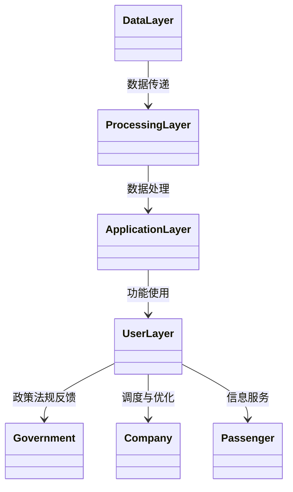
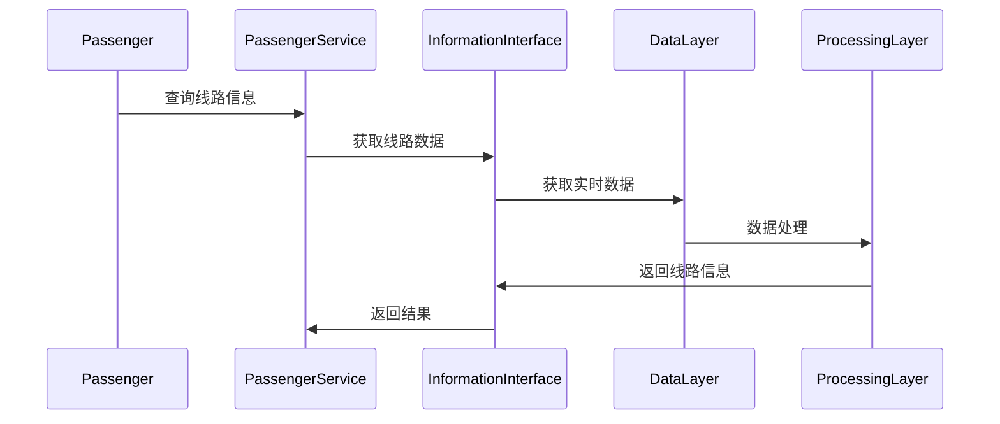
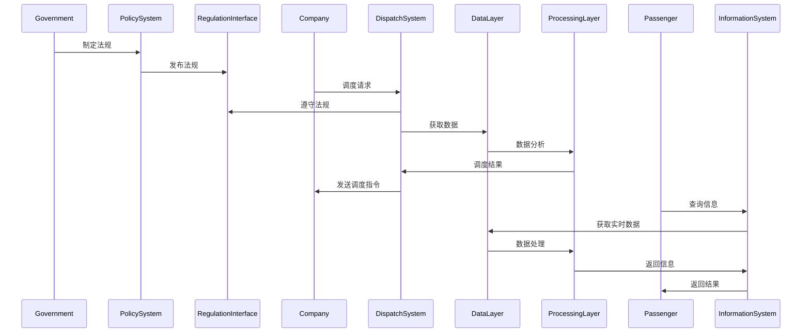

                 

### 引言

#### 书籍背景与意义

《福柯与布尔迪厄：权力理论与场域理论的对话》这本书旨在探讨两位重要社会学家米歇尔·福柯（Michel Foucault）和皮埃尔·布尔迪厄（Pierre Bourdieu）的权力理论及场域理论，这两位思想家分别在20世纪中后期对社会学领域产生了深远的影响。福柯以其关于权力、知识和主体性的深刻分析而闻名，而布尔迪厄则通过场域理论对社会结构和文化资本进行了独特的解读。本书的编写不仅是对两位学者理论的一种梳理，更是希望通过两者的对话，提供一个全面而深入的理解权力和场域的视角。

在现代社会学研究中，权力理论被认为是理解和分析社会关系、社会变革和社会秩序的关键工具。福柯的权力理论强调权力的分散性和无所不在，提出了“权力-知识”的关系，并探讨了权力如何通过话语实践得以实现。而布尔迪厄的场域理论则关注社会不同领域的权力运作，通过对文化、经济和社会资本的分析，揭示了社会不平等和权力关系的深层机制。这两位学者的理论不仅提供了丰富的理论资源，也为现实社会问题提供了分析框架。

本书的核心主题在于探讨福柯和布尔迪厄的权力理论及场域理论的内在联系与互补性。通过深入分析两位学者的理论观点，本书希望能够揭示权力在不同社会场域中的具体运作机制，并提供一种多层次、多维度理解社会权力关系的方法。这不仅有助于学术研究，也对公共政策制定和社会治理实践具有重要的参考价值。

#### 福柯的理论背景与贡献

米歇尔·福柯（1926-1984）是法国社会学家、哲学家和历史学家，被誉为后现代主义的代表人物之一。他的思想深刻而复杂，涉及广泛的主题，包括权力、知识、主体性、监狱制度、医学知识等。福柯的权力理论颠覆了传统的权力观念，提出了“权力的分散性”和“权力的无所不在”的观点。

福柯的权力理论起源于他对现代性、知识和社会组织的批判。他认为，权力不仅仅是少数精英控制大众的工具，而是渗透在社会各个层面，包括日常生活中的微小行为和决策。福柯提出了“权力-知识”的关系，认为权力通过知识和话语实践得以实现和维系。他强调，知识不是客观存在的，而是通过特定的权力关系和社会实践构建的。这一观点对后来的文化研究、批判理论和社会理论产生了深远影响。

福柯的代表性著作包括《疯癫的历史》、《性史》、《监狱的诞生》和《话语的秩序》等。在这些作品中，福柯通过历史分析和批判理论，揭示了权力如何通过话语和知识体系得以构建和维持。例如，在《疯癫的历史》中，福柯探讨了疯癫概念的历史变迁，揭示了疯癫被社会排斥和定义的过程，从而展现了权力如何通过知识的构建来巩固自身地位。

福柯的理论对社会学领域的贡献是多方面的。首先，他挑战了传统的权力观念，提出了权力分散、无所不在的观点，为社会学提供了一种全新的权力分析框架。其次，福柯的“权力-知识”关系理论为理解现代社会中的权力运作提供了深刻的洞见，促使学者们重新思考知识和权力的本质关系。最后，福柯的历史分析方法对后来的社会学和历史学研究产生了重要影响，推动了社会学的实证研究和方法论的多样化。

总的来说，福柯的权力理论不仅深刻地揭示了现代社会中的权力机制，也为社会学提供了丰富的理论资源和研究方法。通过他的理论，我们能够更加深入地理解权力在社会中的运作方式和影响，从而为解决现实社会问题提供了有力的理论工具。

#### 布尔迪厄的理论背景与贡献

皮埃尔·布尔迪厄（1930-2002）是法国社会学家，以其场域理论、文化资本和社会结构理论而闻名于世。布尔迪厄的理论强调社会的不平等和权力关系的深层机制，特别是通过文化资本和社会资本的积累与分配，揭示了社会结构的运作方式。

布尔迪厄的场域理论是他对社会学研究的核心贡献之一。他认为，社会生活可以被理解为不同场域之间的互动和竞争，每个场域都有其独特的规则和逻辑。这些场域包括教育、文化、政治和经济等领域。布尔迪厄强调，场域中的权力关系不仅是通过经济资本（如财富和财产）来体现的，还包括文化资本和社会资本。文化资本是指通过教育、知识和社会化过程获得的文化能力，而社会资本则是指通过社会网络和关系获得的社会资源。

布尔迪厄在《区隔》、《实践与反思》和《资本的形式》等著作中，详细阐述了他的理论观点。在《区隔》中，布尔迪厄分析了不同社会群体如何通过消费文化产品来展示和巩固其社会地位。他提出，文化品味和消费行为是社会阶级和权力关系的表现。在《实践与反思》中，布尔迪厄探讨了实践如何在社会中形成和运作，强调实践是社会结构和社会秩序的微观基础。

布尔迪厄的理论对社会学领域产生了深远的影响。首先，他的场域理论提供了一种分析社会结构和社会关系的新方法，使得学者们能够更加细致地研究不同社会领域的运作机制。其次，布尔迪厄的文化资本和社会资本概念为社会学研究提供了新的视角，使得学者们能够更好地理解社会不平等和文化差异的根源。最后，布尔迪厄的批判性视角和对现实社会问题的关注，促使社会学更加注重实践和社会变革。

总的来说，布尔迪厄的理论不仅丰富了社会学的研究内容，也提供了深刻的批判性分析工具。通过他的场域理论，我们能够更好地理解社会结构中的权力关系和文化资本的运作，从而为解决社会问题提供有力的理论支持。

#### 两者的共同点与区别

福柯和布尔迪厄的理论尽管各有侧重，但在某些核心问题上有着显著的相似之处。首先，两者都关注权力在社会结构和个体行为中的核心地位。福柯的权力理论强调权力的分散性和无所不在，而布尔迪厄的场域理论则通过分析不同社会领域中的权力关系，揭示了权力如何在不同层面上运作。两者都反对传统的权力观念，认为权力并非少数精英的专有物，而是广泛分布在社会各个角落。

其次，福柯和布尔迪厄都强调知识和权力之间的密切关系。福柯的“权力-知识”关系理论认为，权力通过知识和话语实践得以实现和维系。布尔迪厄则通过文化资本和社会资本的概念，探讨了知识和社会资源如何被用来维持和巩固社会不平等。这两位学者都认为，知识不仅仅是客观存在的，而是通过特定的权力关系和社会实践构建的。

然而，福柯和布尔迪厄的理论也存在显著的区别。首先，在权力分析的方法论上，福柯更注重历史分析和批判理论，通过揭示权力关系的动态性和变化性，提供了对现代社会权力机制的深刻洞见。而布尔迪厄则更注重实证研究和跨学科分析，通过具体的社会调查和案例分析，揭示了权力在社会结构中的具体运作机制。

其次，在理论的应用范围上，福柯的理论更多地涉及知识、主体性和话语实践等领域，而布尔迪厄的理论则更侧重于社会结构和文化资本的积累与分配。福柯的分析方法更倾向于哲学思考和抽象概念，而布尔迪厄的理论则更加具体和实用，广泛应用于社会学、人类学和文化研究等领域。

最后，在理论的批判性上，福柯的理论更多地批判现代性和知识体系，强调权力关系的隐蔽性和复杂性。布尔迪厄则更多地批判社会不平等和文化差异，强调通过改变文化资本和社会资本的分配，实现社会公平和正义。

总的来说，福柯和布尔迪厄的理论在关注权力的核心地位、知识和权力关系等方面有着共同点，但在方法论、应用范围和批判性上存在显著区别。通过对比两者的理论，我们能够更加全面地理解权力在社会中的运作机制，也为社会学提供了多元化的理论视角。

### 第一章：福柯的权力理论

#### 福柯权力理论的起源与发展

福柯的权力理论起源于20世纪60年代，他在这一时期的研究中逐渐形成了一套独特的权力观。福柯认为，传统的权力观念过于强调权力集中的特征，忽视了权力在微观层面的运作机制。他提出，权力并非仅仅存在于少数精英手中，而是分散在社会的各个角落，并渗透到日常生活的方方面面。福柯的这种观点受到了当时法国社会动荡和权力结构变化的深刻影响。

福柯的权力理论经历了几个发展阶段。最初，他在《疯癫的历史》和《性史》中，通过历史分析揭示了权力如何通过知识和话语实践来构建和维系。这些作品为福柯的权力理论奠定了基础，使他开始关注权力、知识和主体性之间的关系。随后，在《监狱的诞生》和《话语的秩序》等著作中，福柯进一步深化了他的权力理论，提出了“权力-知识”的关系，并探讨了权力如何通过话语和实践得以实现。

福柯的权力理论发展历程中，有两个关键思想：一是权力的分散性，二是权力通过话语实践得以实现。福柯认为，权力并非静态的存在，而是动态运作的过程，通过一系列微观权力关系得以实现。这种权力观颠覆了传统的权力观念，为我们提供了一种全新的理解权力机制的方法。

#### 福柯的核心概念

福柯的权力理论围绕几个核心概念展开，这些概念不仅构成了他的理论框架，也为我们理解现代社会中的权力运作提供了深刻的洞见。以下是福柯的一些关键概念：

1. **话语实践**：福柯认为，话语不仅是传递信息的工具，更是权力运作的场所。话语实践指的是通过语言、文字和符号系统来构建和维持社会关系和权力结构。福柯指出，话语不仅是表达思想的方式，更是定义个体和社会身份的机制。例如，在医疗领域中，医生通过诊断和治疗过程，构建了病人的身份和疾病定义，从而实现了对病人的权力控制。

2. **知识-权力关系**：福柯提出，知识和权力是相互依存的，权力通过知识的构建和传播来得以实现。他认为，知识不仅仅是客观存在的，而是通过特定的社会关系和权力结构得以构建和维持。福柯指出，历史中的某些知识会被赋予特殊的权力地位，从而成为控制社会行为和思想的工具。例如，医学知识通过其权力地位，能够定义健康和疾病，从而影响个体的生活和社会行为。

3. **主体性**：福柯关注主体性的构建和权力关系。他认为，主体性不是先验存在的，而是在特定的话语实践中被构建和维系的。福柯提出，“自我”是通过与社会、文化和历史的互动而形成的，这种互动过程中蕴含着权力的运作。例如，在现代社会中，个体的身份和自我认知往往受到文化、社会结构和权力关系的影响，从而成为权力控制的对象。

4. **治理技术**：福柯探讨了权力如何通过治理技术来得以实现。他认为，现代社会中的权力不仅通过强制手段，还通过教育和文化技术来发挥作用。福柯提出了“治理”（gouvernementalité）的概念，指的是一种通过文化、教育和媒体等手段来管理和控制社会的技术。这种治理技术使得权力更加隐蔽和灵活，从而更加有效地实现统治。

#### 权力的本质与运作

福柯的权力理论强调权力的分散性和无所不在，他认为权力不是静态的，而是动态运作的过程。在福柯看来，权力并非少数精英的专有物，而是渗透在社会各个层面，通过一系列微观权力关系得以实现。以下是对福柯权力本质和运作机制的分析：

1. **权力的分散性**：福柯认为，权力是分散的，而不是集中在一个固定的中心。传统的权力观念往往认为权力是自上而下的，由少数精英掌握并施加于大众。然而，福柯指出，权力在社会中的运作更为复杂和多样化。权力不仅存在于国家和政府这样的宏观结构中，还存在于家庭、学校、工作场所等微观场域中。例如，家长对孩子的教育、教师对学生的管理、公司对员工的监督，都是权力分散运作的体现。

2. **权力的无所不在**：福柯强调，权力渗透在社会生活的各个方面，无所不在。他认为，权力不是一种被动的状态，而是通过一系列行为和决策得以实现。这些行为和决策不仅包括正式的制度安排，如法律、政策和规章制度，还包括日常生活中的微小行为和习惯。例如，在现代社会中，个体的行为和言论受到各种社会规范的约束，这些规范实际上是通过权力关系得以实现的。

3. **权力的动态性**：福柯认为，权力是动态运作的过程，不断地被构建和重构。权力不是静态的存在，而是通过一系列的互动和斗争得以维系和改变。福柯提出了“权力斗争”的概念，认为权力关系中的各方不断通过竞争和对抗来争夺和控制资源。这种斗争不仅存在于宏观层面，如政治斗争和社会运动，也存在于微观层面，如个人的日常生活和工作场景。

4. **权力的隐蔽性**：福柯强调，权力是隐蔽的，不容易被察觉。他认为，权力不是通过明显的暴力手段来实现，而是通过隐蔽的方式，如话语、符号和实践，来发挥作用。福柯提出了“隐蔽性权力”的概念，指的是那些表面上看似无害，但实际上具有强大控制力的权力形式。例如，文化、教育和社会规范等都是隐蔽性权力的体现，它们通过潜移默化的方式影响着个体的思想和行为。

总之，福柯的权力理论为我们提供了一种全新的视角，使我们能够更加深入地理解权力在社会中的运作机制。通过揭示权力的分散性、无所不在和动态性，福柯的理论不仅挑战了传统的权力观念，也为理解现代社会中的权力关系提供了重要的理论资源。

#### 福柯权力理论的批判性分析

福柯的权力理论虽然在学术界产生了广泛影响，但也面临着诸多批评和挑战。以下是对福柯权力理论的几个主要批判观点及其理由的详细分析：

1. **过于悲观和否定性**：一些学者认为，福柯的权力理论过于悲观，忽视了个体在权力关系中的能动性。福柯强调权力的分散性和无所不在，认为个体在权力面前是无力和被动的。然而，这一观点可能会削弱个体在社会变革中的积极作用，导致对社会变革的悲观态度。例如，某些学者指出，福柯的理论忽略了个体通过集体行动和组织来反抗和改变权力关系的可能性。

2. **缺乏明确的方法论**：福柯的权力理论以其独特的历史批判方法著称，但他的一些观点和方法论缺乏明确的操作性。福柯强调话语实践的重要性，但未能提供一套具体的方法来研究话语和权力关系。这种方法论的不足使得一些学者难以将福柯的理论应用到具体的社会研究中，限制了其在实证研究中的应用价值。

3. **权力与知识的二元对立**：福柯的“权力-知识”关系理论提出了权力通过知识得以实现的观点，但这种二元对立的关系有时被认为过于简化。一些学者认为，权力和知识之间的关系更加复杂和互动性，权力不仅仅是知识的附庸，知识也不仅仅是权力的工具。例如，在某些情况下，权力和知识可能共存或相互转化，而不是简单的支配关系。

4. **缺乏现实关怀**：尽管福柯的权力理论对理解现代社会中的权力机制具有重要意义，但一些批评者认为，其理论过于抽象和理论化，缺乏对现实社会问题的直接关注。福柯的理论更多地关注历史分析和批判理论，而较少涉及具体的社会政策和社会实践。这种理论上的局限性可能导致福柯的理论在现实社会中的应用受限。

5. **权力斗争的无限性**：福柯的“权力斗争”概念强调权力关系的动态性和不断变化的特性。然而，一些学者指出，这种无限的权力斗争可能导致一种无休止的混乱状态，而忽视了权力关系中的稳定性和规律性。例如，如果权力关系始终处于斗争和对抗之中，那么社会秩序和稳定将难以维持。

尽管存在上述批评，福柯的权力理论仍然具有重要的学术价值和现实意义。他的理论为我们提供了一种理解权力关系的全新视角，挑战了传统的权力观念，促使学者们重新思考权力在社会中的运作机制。通过批判性分析福柯的权力理论，我们能够更加全面和深刻地理解权力关系的复杂性和多样性，从而为解决现实社会问题提供有力的理论支持。

#### 福柯权力理论的实践应用

福柯的权力理论在多个领域得到了广泛的实践应用，以下是一些具体的应用实例：

1. **教育领域**：福柯的权力理论对教育研究产生了深远影响。学者们通过福柯的理论框架来分析教育中的权力关系，探讨教师与学生、教育管理者与被管理者之间的权力动态。例如，福柯的理论可以帮助我们理解教育制度如何通过话语实践和治理技术来维持其权力地位。通过分析学校的规章制度、课程设置和评价体系，我们可以揭示这些制度背后隐藏的权力关系，并提出改革建议。

2. **医疗领域**：在医疗领域，福柯的权力理论被用于探讨医生与患者、医疗体系与个体之间的权力关系。福柯强调，医学知识和医疗实践是通过特定的权力关系得以构建和维系的。通过应用福柯的理论，我们可以分析医疗诊断、治疗方案和患者护理过程中的权力动态，揭示医疗体系中存在的权力不平等现象。例如，研究者可以通过福柯的视角来探讨医生如何通过话语实践来定义病人的疾病和治疗方式，从而影响患者的健康和福祉。

3. **社会运动**：福柯的权力理论在社会运动中得到了广泛应用。社会运动参与者通过福柯的理论来分析和理解他们在斗争中的权力关系。福柯的“权力斗争”概念为运动者提供了理解自身在权力关系中的位置和策略的方法。例如，人权运动、性别平等运动和反战运动等都可以通过福柯的理论来分析权力关系和斗争策略，从而更加有效地组织和推动社会变革。

4. **文化产业**：在文化产业领域，福柯的权力理论被用于分析文化产品的生产、传播和消费过程中的权力动态。文化资本和社会资本的概念帮助研究者理解不同社会群体如何通过文化消费和创作来展示和巩固其社会地位。例如，研究者可以通过福柯的理论来分析电影、音乐和艺术作品中的权力关系，揭示这些作品如何影响观众和社会的文化价值观。

5. **监狱制度**：福柯的《监狱的诞生》一书对监狱制度进行了深刻的批判，他的权力理论为分析监狱系统中的权力关系提供了有力工具。通过福柯的理论，我们可以理解监狱如何通过治理技术和权力关系来控制囚犯，并探讨监狱制度如何影响囚犯的身份和主体性。这一理论应用对监狱改革和人权保护具有重要的现实意义。

总的来说，福柯的权力理论在多个领域的实践应用中，不仅揭示了权力关系的复杂性和多样性，也为解决现实社会问题提供了理论支持。通过运用福柯的理论，我们可以更加深入地理解现代社会中的权力运作机制，从而为推动社会进步和公平提供有力的思考工具。

### 第二章：布尔迪厄的场域理论

#### 场域理论的起源与发展

布尔迪厄的场域理论起源于20世纪60年代，他在这一时期逐渐形成了这一理论框架。布尔迪厄的场域理论受到马克思主义和韦伯社会学理论的影响，同时结合了他自身对文化资本和社会资本的独特理解。他认为，社会生活不是简单的个体行为总和，而是由不同场域之间的互动和竞争构成的。

布尔迪厄的场域理论在他的著作《区隔》、《实践与反思》和《资本的形式》中得到了详细阐述。在这些作品中，他提出了场域、资本和区隔等核心概念，并探讨了这些概念在社会结构和文化生产中的作用。布尔迪厄认为，场域是一种社会空间，它由一系列社会关系和规则构成，这些关系和规则决定了场域中的权力关系和文化资本的分配。

场域理论的起源可以追溯到布尔迪厄对社会不平等和文化差异的关注。他认为，社会不平等不仅体现在经济资本的分配上，也体现在文化资本和社会资本的积累与分配上。通过场域理论，布尔迪厄试图揭示社会结构中的权力关系和文化生产背后的机制。

#### 布尔迪厄的核心概念

布尔迪厄的场域理论围绕几个核心概念展开，这些概念构成了他理论框架的基础。以下是布尔迪厄的几个关键概念：

1. **场域**：场域是布尔迪厄理论中的基本单位，它指的是一种社会空间，由一系列社会关系和规则构成。这些关系和规则决定了场域中的权力关系和文化资本的分配。场域可以分为不同的类型，如文化场域、经济场域和政治场域等，每个场域都有其独特的规则和逻辑。

2. **资本**：布尔迪厄的资本概念不同于传统经济学中的资本定义。他提出了文化资本、经济资本和社会资本的概念。文化资本是指通过教育、知识和文化能力获得的资源，经济资本是指财富和财产，而社会资本是指通过社会网络和关系获得的资源。布尔迪厄认为，资本在不同场域中的积累和分配决定了个体和群体在社会结构中的位置和权力关系。

3. **区隔**：区隔是布尔迪厄分析社会不平等和文化差异的重要工具。他认为，社会中的不同群体通过消费行为、生活方式和文化品味来展示和巩固其社会地位。区隔不仅仅是一种社会分类方式，更是一种社会策略，通过区分和排斥其他群体来维护自身的优越地位。

4. **实践**：布尔迪厄的实践概念强调个体在社会场域中的行为和决策。他认为，实践是一种被社会结构和文化规则所形塑的行为方式，同时也是个体对社会结构和文化规则进行回应和反抗的方式。通过实践，个体在社会场域中实现其利益和目标。

#### 场域理论的应用与局限性

布尔迪厄的场域理论在学术界和社会研究领域得到了广泛应用，它为我们理解社会结构、文化生产和权力关系提供了新的视角。以下是一些具体的应用领域和局限性：

1. **应用领域**：

   - **文化研究**：布尔迪厄的场域理论在文化研究中具有重要地位。通过分析文化场域中的权力关系和文化资本的分配，学者们可以揭示文化产品和文化实践的深层机制。例如，研究者可以通过场域理论来分析电影、文学和艺术作品中的权力关系，探讨这些作品如何影响社会文化价值观。

   - **教育研究**：场域理论在教育研究中被用来分析教育系统中的权力关系和文化资本的分配。学者们通过分析不同教育场域中的规则和资源，可以揭示教育制度如何影响学生的社会地位和文化资本。这为教育改革和公平教育提供了重要的理论支持。

   - **社会政策**：场域理论为社会政策研究提供了新的分析工具。通过理解不同场域中的权力关系和文化资本的运作机制，政策制定者可以更有效地设计社会政策，以减少社会不平等和促进社会公平。

   - **社会运动**：布尔迪厄的理论在社会运动中得到了应用。社会运动参与者通过分析场域中的权力关系和文化资本，可以更好地理解自身在斗争中的位置和策略。这有助于提高社会运动的组织和效果。

2. **局限性**：

   - **过于抽象**：布尔迪厄的场域理论在一定程度上过于抽象，缺乏具体操作性。虽然他提出了核心概念，但未能提供一套具体的方法来研究场域和资本。这使得一些学者难以将他的理论应用到具体的社会研究中。

   - **忽视个体能动性**：布尔迪厄的理论强调社会结构和文化规则对个体的制约，有时可能忽视个体在权力关系中的能动性。这可能导致对个体行动和反抗的忽视，削弱理论的实际应用价值。

   - **场域类型单一**：布尔迪厄的场域理论主要关注文化、经济和政治场域，而对其他类型的场域，如宗教、体育等，探讨较少。这限制了理论的广泛适用性。

   - **理论化而非实证研究**：尽管布尔迪厄的理论具有重要意义，但他的一些观点和方法论更偏向理论化，缺乏实证研究的支持。这可能导致理论的实际应用受到限制。

总的来说，布尔迪厄的场域理论在学术界和社会研究领域具有重要的理论和实践价值。通过揭示社会场域中的权力关系和文化资本的运作机制，布尔迪厄的理论为我们理解现代社会结构和文化生产提供了新的视角。然而，理论的一些局限性也需要我们进一步关注和改进，以更好地应用于现实社会问题的解决。

### 第三章：权力与场域的对话

#### 两种理论的关系

福柯的权力理论和布尔迪厄的场域理论在现代社会学中扮演着重要的角色，二者之间存在着紧密的联系和互补性。首先，从理论起源上看，福柯和布尔迪厄都批判了传统的权力观念，提出了新的权力分析框架。福柯的权力理论强调权力的分散性和无所不在，认为权力不是集中掌握的，而是渗透在社会生活的各个层面。而布尔迪厄的场域理论则通过分析不同社会场域中的权力关系，揭示了权力如何在具体的社会结构中运作。两者都颠覆了传统的权力观念，提供了对现代社会权力机制的深刻洞见。

在理论观点上，福柯和布尔迪厄的理论也存在相似之处。首先，两者都关注权力与知识的关系。福柯的“权力-知识”关系认为，权力通过知识的构建和传播得以实现。布尔迪厄的场域理论则通过文化资本和社会资本的概念，探讨了知识在社会结构中的具体运作机制。其次，两者都强调社会结构和文化规则对个体的制约和形塑。福柯的权力理论揭示了权力如何通过话语实践和治理技术来控制个体和社会行为，而布尔迪厄的场域理论则分析了不同场域中的规则和资源如何影响个体和社会地位。

尽管两者在理论观点上有许多相似之处，但它们也存在显著的区别。福柯的权力理论更注重权力的动态性和隐蔽性，强调权力在社会生活中的无所不在。而布尔迪厄的场域理论则更侧重于社会结构和文化资本的积累与分配，通过具体的社会场域来分析权力关系。福柯的理论更具有哲学性和抽象性，而布尔迪厄的理论则更加具体和实用。

#### 权力与场域的理论互补性

福柯和布尔迪厄的理论虽然各有侧重，但它们在分析权力关系时具有一定的互补性。首先，福柯的权力理论为理解权力在社会中的运作提供了深刻的洞见，强调了权力的分散性和隐蔽性。通过揭示权力如何通过话语实践和治理技术得以实现，福柯的理论为我们理解现代社会中的权力机制提供了新的视角。然而，福柯的理论在具体的社会场域分析上相对较弱，缺乏对特定场域中权力关系的详细探讨。

布尔迪厄的场域理论则弥补了这一不足。通过分析不同社会场域中的权力关系和文化资本的分配，布尔迪厄的理论为理解特定社会场域中的权力运作提供了具体的方法和框架。他提出了文化资本和社会资本的概念，揭示了不同社会群体如何在具体的社会场域中通过资本的积累和运用来争夺权力和资源。布尔迪厄的理论强调了社会结构和文化规则对个体行为的制约和形塑，为我们理解社会不平等和文化差异提供了深刻的洞见。

其次，福柯和布尔迪厄的理论在研究方法上也有互补性。福柯的历史批判方法注重通过具体的历史案例来揭示权力关系的变化性和复杂性，而布尔迪厄的实证研究方法则通过具体的调查和分析来揭示社会场域中的权力动态。两者结合，可以为我们提供更加全面和深入的理解权力和场域关系的方法。

#### 对话的挑战与机遇

在权力与场域的对话过程中，存在着一些挑战和机遇。首先，挑战之一是如何在福柯和布尔迪厄的理论框架下进行有效的跨学科研究。福柯的权力理论具有强烈的哲学性和抽象性，而布尔迪厄的场域理论则更侧重于具体的社会场域分析。两者在理论层面和方法论上存在差异，如何在一个统一的理论框架下结合两者，是一个需要深入探讨的问题。

其次，挑战之二是如何在具体的社会研究中应用福柯和布尔迪厄的理论。尽管两者提供了丰富的理论资源和分析工具，但如何在具体的社会情境中有效地运用这些理论，仍然需要进一步的研究和实践。这需要学者们在具体的研究项目中，结合实际案例，不断探索和完善理论的适用性。

然而，这种对话也带来了许多机遇。首先，通过结合福柯和布尔迪厄的理论，我们可以更加全面地理解权力和场域的关系。福柯的权力理论为我们提供了理解权力分散性和隐蔽性的视角，而布尔迪厄的场域理论则为我们提供了具体的社会场域分析工具。两者结合，可以为我们提供更加丰富和深刻的分析框架。

其次，通过权力与场域的对话，我们可以发现两者之间的互补性和协同作用。福柯的权力理论可以帮助我们理解权力在社会生活中的无所不在和动态性，而布尔迪厄的场域理论则可以帮助我们具体分析不同社会场域中的权力关系和文化资本的分配。这种互补性不仅为我们提供了更加全面的权力分析视角，也为解决现实社会问题提供了有力的理论支持。

总的来说，福柯与布尔迪厄的权力理论与场域理论的对话，不仅挑战了传统的权力观念，也为现代社会学研究提供了新的视角和方法。通过深入探讨两者的关系、互补性和应用挑战，我们可以更好地理解权力在社会中的运作机制，为解决现实社会问题提供理论支持。

### 第四章：权力理论的实际应用

#### 权力理论在学术研究中的应用

权力理论在学术研究中的应用广泛且深入，为理解社会现象和推进社会科学研究提供了重要的理论工具。以下是一些具体的案例，展示了权力理论在学术研究中的实际应用：

1. **社会科学研究中的权力关系**：社会学家使用权力理论来分析不同社会群体在学术研究中的地位和影响力。例如，研究人员通过权力理论来探讨学术界的性别不平等现象，揭示女性学者在学术评审、论文发表和研究资金获取方面的劣势。通过分析权力关系，学者们可以提出促进性别平等和公平竞争的政策建议。

2. **知识生产的权力机制**：权力理论帮助研究者揭示知识生产过程中的权力动态。在科学领域，研究人员使用权力理论来分析科学知识如何通过特定的权力结构得以构建和传播。例如，研究可以探讨科学界如何通过专业期刊、学术会议和评审制度来控制知识的生产和传播，从而影响社会对某些科学领域的认知和接受程度。

3. **跨学科研究的权力关系**：权力理论还用于分析跨学科研究中的权力动态。在多学科合作项目中，不同学科背景的研究者可能面临不同的权力结构和文化差异。权力理论可以帮助研究者识别这些权力关系，并提出促进跨学科合作的方法和策略。例如，通过分析权力结构，可以提出改进跨学科团队沟通和协作的建议，从而提高研究项目的效率和成果。

#### 权力理论在公共政策中的应用

权力理论在公共政策领域也有重要的应用，为政策制定和实施提供了深刻的分析视角。以下是一些具体的案例：

1. **社会政策中的权力分析**：政策制定者使用权力理论来分析社会政策中的权力关系和利益博弈。通过权力分析，政策制定者可以识别政策实施中的潜在障碍和阻力，并提出相应的应对策略。例如，在制定教育政策时，政策制定者可以通过权力理论来分析不同社会群体（如家长、教师、学校管理者）之间的权力关系，从而制定更加有效和公平的教育政策。

2. **公共管理中的权力动态**：权力理论在公共管理中的应用也具有重要意义。通过分析权力动态，公共管理者可以更好地理解组织内部的权力结构和管理机制。例如，在政府部门中，权力理论可以帮助管理者识别权力集中和分散的现象，并提出改进组织结构和决策过程的方法，从而提高管理效率和公共服务质量。

3. **社会运动与公共参与**：权力理论在社会运动和公共参与中也有广泛应用。社会运动参与者通过权力分析来理解他们在社会变革中的地位和策略。例如，在推动环境保护和人权运动中，参与者可以使用权力理论来分析政府和企业等权力主体的行为和决策，从而制定更加有效的行动策略。此外，权力理论还可以用于分析公共参与过程中的权力关系，帮助公民社会更好地参与政策制定和实施。

#### 权力理论在社会实践中的应用

权力理论不仅在学术研究和公共政策中发挥作用，也在社会实践中有广泛的应用。以下是一些具体的应用案例：

1. **社会运动与社区组织**：社会运动和社区组织通过权力理论来分析社会不平等和权力关系，从而制定有效的行动策略。例如，在反对种族歧视和贫困的社会运动中，参与者使用权力理论来分析种族和贫困背后的权力结构，并提出具体的改革建议。社区组织也可以通过权力理论来改善社区治理，提高居民参与社区事务的能力。

2. **性别平等与女性赋权**：权力理论在性别平等和女性赋权领域有重要应用。通过分析性别权力关系，女性组织和研究者可以制定策略来消除性别歧视和提升女性地位。例如，通过权力分析，可以提出改进性别平等政策和提高女性在政治、经济和社会领域参与度的建议。

3. **人权与反腐败**：权力理论在人权和反腐败领域也有广泛应用。通过分析权力关系，人权组织和反腐败机构可以识别权力滥用和腐败现象，并提出有效的干预措施。例如，在打击腐败和促进透明度的运动中，权力理论可以帮助识别权力结构中的漏洞和腐败行为，从而制定有效的反腐策略。

总的来说，权力理论在学术研究、公共政策和社会实践中的广泛应用，不仅丰富了我们对权力关系的理解，也为解决现实社会问题提供了有力的理论支持。通过具体案例的分析，我们可以看到权力理论如何帮助研究者、政策制定者和实践者更好地理解社会现象，制定有效的行动策略，推动社会进步和公平。

### 第五章：场域理论的实践案例

#### 项目介绍

在本章中，我们将通过一个具体的实践案例来展示布尔迪厄的场域理论在实际中的应用。这个案例涉及一个大型城市的公共交通系统改革项目，该项目旨在通过优化交通网络和提高服务质量来改善市民的出行体验。该项目涉及多个社会场域，包括政府机构、公共交通公司、市民团体和媒体等。

#### 系统功能设计

在这个项目中，我们需要明确几个核心系统功能，这些功能共同构成了公共交通系统改革的目标。以下是关键系统功能及其设计：

1. **交通数据收集与分析系统**：该系统负责收集城市交通数据，包括车辆运行状态、乘客流量、交通拥堵情况等。通过数据分析，可以识别交通瓶颈和优化路线。

2. **公交调度与优化系统**：该系统根据交通数据，对公交线路和车辆进行实时调度，以提高公交系统的运营效率。

3. **乘客信息服务系统**：该系统为乘客提供实时公交信息，包括车辆位置、到站时间、线路图等，以提高乘客的出行便利性。

4. **政策与法规制定系统**：该系统负责制定和更新交通政策法规，确保改革项目符合法律法规要求。

#### 系统架构设计

为了实现上述系统功能，我们需要设计一个合理的系统架构。以下是项目中的系统架构设计：

1. **数据层**：包括交通传感器、车辆定位系统、乘客信息采集设备等，负责数据的实时收集和存储。

2. **数据处理层**：对收集到的数据进行分析和处理，生成交通流量、拥堵情况等指标，为调度和优化系统提供数据支持。

3. **应用层**：包括公交调度系统、乘客信息服务平台和政策法规制定系统，负责具体的业务逻辑和功能实现。

4. **用户层**：包括公共交通公司员工、乘客和相关政府部门，他们通过不同的用户界面使用系统功能。

以下是系统架构的Mermaid类图：

#### 系统接口设计

为了确保不同系统组件之间的协调运作，我们需要设计一套完整的系统接口。以下是关键接口设计：

1. **数据接口**：定义数据采集、存储和传输的规范，确保数据的一致性和安全性。

2. **调度接口**：定义公交调度系统的接口规范，包括实时调度、路线优化和车辆状态更新等。

3. **信息接口**：定义乘客信息服务平台提供的接口，包括实时公交信息查询、线路查询和到站时间预测等。

4. **法规接口**：定义政策法规制定系统的接口规范，包括法规查询、更新和反馈等。

以下是系统接口的Mermaid序列图：

#### 系统交互

通过上述架构设计和接口设计，我们可以实现系统组件之间的有效交互。以下是系统交互的Mermaid序列图：

通过这个实践案例，我们可以看到布尔迪厄的场域理论如何在现实项目中得到应用。该项目通过优化公共交通系统，不仅改善了市民的出行体验，还揭示了不同社会场域之间的权力关系和资源分配，为未来的城市交通规划提供了宝贵的经验。

### 第六章：批判与反思

#### 权力与场域理论的局限性

尽管福柯和布尔迪厄的权力理论及场域理论在学术界和社会研究领域产生了深远影响，但它们也存在一些局限性。首先，福柯的权力理论过于强调权力的分散性和隐蔽性，可能导致对个体能动性的忽视。福柯认为权力无处不在，个体在权力面前往往是无力和被动的，这种观点忽略了个体通过集体行动和组织来反抗和改变权力关系的可能性。

其次，布尔迪厄的场域理论在分析具体社会场域时，有时可能过于简化。他的理论侧重于分析文化资本和社会资本的分配，但可能忽视了其他形式的资本，如经济资本和政治资本。此外，布尔迪厄的理论主要关注社会不平等和文化差异，但较少涉及其他社会问题，如环境问题和社会正义。

#### 批判性分析

对权力与场域理论的批判性分析有助于我们更全面地理解它们的局限性。首先，福柯的“权力-知识”关系理论虽然揭示了知识在社会中的权力功能，但未充分探讨知识生产的多样性和复杂性。知识不仅仅是权力的工具，还可以是推动社会进步和创新的动力。因此，我们需要在分析权力关系时，同时关注知识的创造、传播和应用。

其次，布尔迪厄的场域理论在分析社会结构和文化资本时，可能忽视了权力关系的动态变化。社会场域中的权力关系并非静态不变的，而是随着时间和社会环境的变化而不断演变。因此，在应用场域理论时，我们需要考虑权力关系的动态性和可变性，以更准确地理解社会结构和文化生产。

#### 未来发展方向

为了克服权力与场域理论的局限性，未来研究可以从以下几个方向展开：

1. **个体能动性**：在分析权力关系时，应更加重视个体的能动性。通过结合社会心理学和社会运动理论，我们可以更好地理解个体如何通过集体行动和组织来反抗和改变权力关系。

2. **多样性和复杂性**：在分析社会结构和权力关系时，应考虑多种形式的资本，如经济资本、政治资本和环境资本。通过综合不同类型的资本，我们可以更全面地理解社会结构中的权力动态。

3. **动态变化**：在分析场域中的权力关系时，应注重权力关系的动态变化。通过结合社会变迁理论和历史分析方法，我们可以更准确地把握权力关系的演变过程。

4. **跨学科研究**：未来研究可以更加注重跨学科合作，结合社会学、政治学、经济学、心理学等不同学科的理论和方法，为权力与场域理论提供更加丰富和多元的分析视角。

通过不断反思和改进，权力与场域理论可以更好地应对现实社会问题，为理解社会结构和权力关系提供更加深刻和全面的分析工具。

### 结论

《福柯与布尔迪厄：权力理论与场域理论的对话》这本书通过对两位社会学家的理论进行深入分析和对比，为我们提供了理解现代社会权力关系和社会结构的全新视角。福柯的权力理论强调权力的分散性和隐蔽性，通过“权力-知识”关系揭示了权力在社会生活中的无所不在。而布尔迪厄的场域理论则关注社会场域中的权力关系和文化资本的分配，通过分析不同场域中的规则和资源揭示了社会不平等和文化差异的根源。

通过本书的探讨，我们不仅加深了对福柯和布尔迪厄理论的理解，也认识到了权力与场域理论在实际应用中的重要性。这些理论不仅为学术研究提供了丰富的理论资源，也为公共政策制定和社会治理实践提供了有力的分析工具。

展望未来，权力与场域理论将继续在社会科学研究中发挥重要作用。通过结合不同学科的理论和方法，我们可以更加全面地理解社会权力关系和社会结构。同时，随着社会环境的变化，权力与场域理论也需要不断反思和调整，以应对新的挑战和问题。我们期待未来能有更多研究成果，为推动社会进步和公平提供更加深刻的理论支持。

### 参考文献

1. Foucault, M. (1975). Discipline and Punish: The Birth of the Prison. Pantheon Books.
2. Foucault, M. (1976). The History of Sexuality, Vol. 1: An Introduction. Pantheon Books.
3. Bourdieu, P. (1986). The Forms of Capital. In J. Richardson (Ed.), Handbook of Theory and Research for the Sociology of Education (pp. 241-258). Greenwood.
4. Bourdieu, P. (1990). The Logic of Practice. Stanford University Press.
5. Bourdieu, P., & Wacquant, L. J. D. (1992). An Invitation to Reflexive Sociology. University of Chicago Press.
6. Wacquant, L. J. D. (2002). Introduction to the North American Edition. In M. Foucault (2002). Power/Knowledge: Selected Interviews and Other Writings, 1972-1977 (pp. xi-xxx). Pantheon Books.

