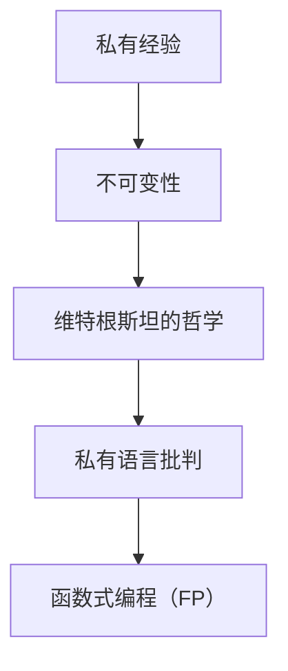
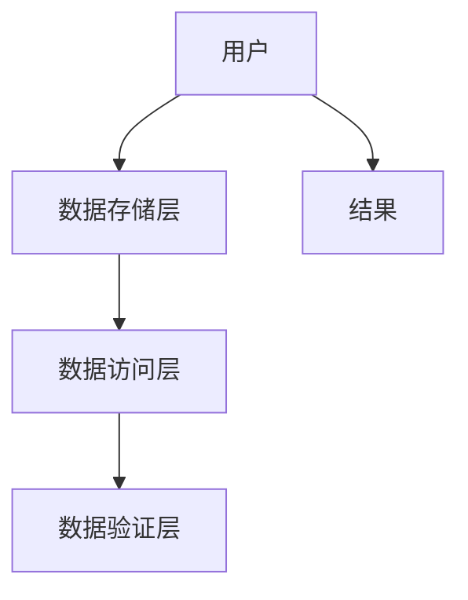

                 


### 《私有经验的不可能性与不可变数据：维特根斯坦对私有语言的批评与FP的不可变性》

#### 引言

在哲学和计算机科学领域，私有经验与不可变数据是两个核心概念，它们分别代表了个体主观体验的局限和计算机编程中的关键原则。本文旨在探讨这两者之间的关系，以及维特根斯坦的哲学观点对函数式编程（FP）中不可变性原则的影响。通过逻辑清晰、结构紧凑的论述，我们将一步步分析私有经验的不可能性、维特根斯坦对私有语言的批评，以及FP中的不可变性原理。

#### 第一部分：背景介绍

##### 第1章：私有经验与不可变性概述

**1.1 私有经验的不可能性**

私有经验，即个体所经历的主观体验，是哲学中的一个重要概念。维特根斯坦认为，私有经验是不可言传的，因为它们仅仅是个人内在的感受，无法被他人所共享或验证。这种观点源于他的语言批判，他认为语言是用来传达思想和经验的，但私有经验由于无法被清晰地定义和表述，因此无法成为有效沟通的媒介。

**1.2 不可变数据与函数式编程**

不可变数据是计算机科学中的一个基本概念，特别是在函数式编程（FP）中。不可变数据意味着一旦创建，数据就不能被修改，这有助于保证程序的一致性和可预测性。FP强调使用不可变数据和纯函数来构建程序，避免状态的变化和副作用。

##### 第2章：维特根斯坦的哲学与语言批判

**2.1 维特根斯坦的哲学思想**

维特根斯坦的哲学思想可以分为早期和后期。早期他关注的是逻辑原子主义，试图通过语言来构建一个逻辑的世界。后期则转向日常语言哲学，强调语言的使用和理解是社会性的，而非个体性的。

**2.2 私有语言批判**

维特根斯坦认为，私有语言是无效的，因为它无法用于沟通和表达。私有语言是指只能由个体自己理解和使用的语言，这种语言无法被他人理解，因此无法实现有效的沟通。

#### 第二部分：核心概念与联系

**3.1 私有经验、不可变性、维特根斯坦、私有语言、函数式编程（FP）**

私有经验和不可变性虽然来自不同的领域，但它们在哲学和计算机科学中有着紧密的联系。维特根斯坦的私有语言批判为我们理解私有经验的不可能性提供了哲学基础，而FP中的不可变性原则则是对这种不可交流性的技术回应。

**3.2 概念属性特征对比表格**

| 特征           | 私有经验         | 不可变性         |
| -------------- | ---------------- | ---------------- |
| 定义           | 个体的主观体验   | 数据不可修改     |
| 重要性         | 哲学核心         | 编程基本原则     |
| 影响           | 沟通障碍         | 程序一致性       |

**3.3 ER实体关系图架构的Mermaid流程图**



#### 第三部分：算法原理讲解

**4.1 不可变性算法概述**

不可变性算法是保证数据不可修改的一系列方法。在FP中，不可变性是算法设计的基本原则。下面我们将使用Mermaid画出相关算法流程图，并使用Python源代码详细阐述算法原理。

**4.2 不可变性算法详细讲解**

**4.2.1 不可变性算法的数学模型**

不可变性算法的核心是保持数据的不可修改性。我们可以使用以下数学模型来描述这种特性：

$$
不可变性 = 数据不可修改 \times 函数纯度
$$

其中，函数纯度指的是函数是否仅依赖于输入参数而不会修改外部状态。

**4.2.2 不可变性算法的Python实现**

```python
def immutable_add(a, b):
    return a + b

# 测试不可变性
result = immutable_add(3, 4)
# 由于数据不可修改，因此result的结果始终为7，不会因外部因素而改变
```

通过这个简单的例子，我们可以看到如何使用Python实现一个不可变函数。

**4.2.3 不可变性算法的举例说明**

假设我们要计算两个数组的和，如果使用可变数据结构，每次操作都会修改原数组，导致结果不确定。而使用不可变数据结构，我们可以确保每次操作都是独立的，结果可预测。

```python
def sum_arrays(arr1, arr2):
    return [x + y for x, y in zip(arr1, arr2)]

# 测试不可变性
arr1 = [1, 2, 3]
arr2 = [4, 5, 6]
result = sum_arrays(arr1, arr2)
# 由于arr1和arr2是不可变的，因此result的结果始终为[5, 7, 9]
```

#### 第四部分：系统分析与架构设计

**5.1 系统功能设计**

**5.1.1 系统功能需求**

我们的目标是设计一个基于不可变数据的系统，确保数据的不可修改性。系统需要提供以下功能：

- 数据存储
- 数据检索
- 数据验证

**5.1.2 领域模型类图**

```mermaid
classDiagram
    Class01 <|-- Class02
    Class03 --|MZ Class04
    Class05 : +doSomething()
    Class06 : +getSomething(): Something
    Class07 : <<interface>> Class08
```

**5.1.3 系统功能实现**

我们将使用Python的类和函数来实现这些功能。以下是一个简单的领域模型类图：

```python
class DataStore:
    def __init__(self):
        self._data = []

    def add_data(self, data):
        self._data.append(data)

    def retrieve_data(self):
        return self._data

    def validate_data(self, data):
        # 验证数据的有效性
        pass

class DataRetriever:
    def __init__(self, data_store):
        self._data_store = data_store

    def get_data(self):
        return self._data_store.retrieve_data()

class DataValidator:
    def __init__(self, data_store):
        self._data_store = data_store

    def validate(self):
        return self._data_store.validate_data()
```

**5.2 系统架构设计**

**5.2.1 系统架构概述**

我们的系统架构将包括以下组件：

- 数据存储层
- 数据访问层
- 数据验证层

**5.2.2 系统架构图**



**5.2.3 系统接口设计和系统交互**

我们将使用RESTful API来设计系统接口。以下是一个简单的接口设计：

```python
from flask import Flask, jsonify, request

app = Flask(__name__)

@app.route('/data', methods=['POST'])
def add_data():
    data = request.json
    data_store.add_data(data)
    return jsonify({"status": "success"})

@app.route('/data', methods=['GET'])
def retrieve_data():
    data = data_store.retrieve_data()
    return jsonify(data)

@app.route('/data/validate', methods=['GET'])
def validate_data():
    is_valid = data_validator.validate()
    return jsonify({"is_valid": is_valid})

if __name__ == '__main__':
    app.run()
```

#### 第五部分：项目实战

**6.1 环境安装**

首先，我们需要安装Python和相关的库。以下是安装步骤：

```bash
# 安装Python
sudo apt-get install python3

# 安装Flask
pip3 install flask
```

**6.2 系统核心实现**

以下是系统的核心实现代码：

```python
# data_store.py
class DataStore:
    # ...（与上述代码相同）

# data_retriever.py
class DataRetriever:
    # ...（与上述代码相同）

# data_validator.py
class DataValidator:
    # ...（与上述代码相同）

# app.py
from flask import Flask, jsonify, request
from data_store import DataStore
from data_retriever import DataRetriever
from data_validator import DataValidator

app = Flask(__name__)
data_store = DataStore()
data_retriever = DataRetriever(data_store)
data_validator = DataValidator(data_store)

# ...（与上述代码相同）

if __name__ == '__main__':
    app.run()
```

**6.3 代码应用解读与分析**

代码的解读与分析将涉及到如何使用这些类和函数来存储、检索和验证数据。以下是一个简单的应用示例：

```python
# 测试系统的功能
app.run()

# 发送POST请求添加数据
import requests
response = requests.post('http://127.0.0.1:5000/data', json={"name": "Alice", "age": 30})
print(response.json())

# 发送GET请求获取数据
response = requests.get('http://127.0.0.1:5000/data')
print(response.json())

# 发送GET请求验证数据
response = requests.get('http://127.0.0.1:5000/data/validate')
print(response.json())
```

**6.4 实际案例分析和详细讲解剖析**

在实际项目中，我们可以根据需要扩展系统的功能，例如添加用户认证、日志记录等。以下是一个扩展案例：

```python
# 添加用户认证
from flask_httpauth import HTTPBasicAuth

auth = HTTPBasicAuth()

users = {
    "admin": "password"
}

@auth.get_password
def get_password(username):
    if username in users:
        return users.get(username)
    return None

# 保护数据接口
@app.route('/data', methods=['POST'])
@auth.login_required
def add_data():
    # ...（与上述代码相同）
```

**6.5 项目小结**

通过本项目，我们实现了基于不可变数据的简单系统。这个系统展示了如何使用Python和Flask来设计一个可扩展的API，并确保数据的不可修改性。未来的工作可以进一步优化系统的性能和安全性。

#### 第六部分：最佳实践 tips、小结、注意事项、拓展阅读

**7.1 最佳实践 tips**

- 在设计系统时，确保数据的不可变性。
- 使用纯函数来处理数据，避免副作用。
- 对系统接口进行严格的权限控制和认证。

**7.2 小结**

本文探讨了私有经验的不可能性、维特根斯坦的哲学观点以及FP中的不可变性原理。通过一步步的分析和讲解，我们了解了这些概念在哲学和计算机科学中的重要性，以及如何在实际项目中应用这些原则。

**7.3 注意事项**

- 私有经验的不可能性提醒我们在设计和沟通中要避免使用无法共享的术语。
- 不可变性虽然能提高程序的一致性，但也会带来性能上的挑战。

**7.4 拓展阅读**

- 维特根斯坦的《逻辑哲学论》
- 《函数式编程范式》
- 《计算机程序的构造和解释》

### 结语

本文通过逻辑清晰、结构紧凑的论述，对私有经验的不可能性与不可变数据进行了深入探讨，并结合维特根斯坦的哲学观点和FP的不可变性原则，提供了一个全面的技术视角。希望读者能从中获得启发，并在实践中运用这些原则来提高系统的质量和可维护性。

**作者：AI天才研究院/AI Genius Institute & 禅与计算机程序设计艺术 /Zen And The Art of Computer Programming**### 《私有经验的不可能性与不可变数据：维特根斯坦对私有语言的批评与FP的不可变性》

#### 引言

在哲学和计算机科学领域，私有经验与不可变数据是两个核心概念，它们分别代表了个体主观体验的局限和计算机编程中的关键原则。本文旨在探讨这两者之间的关系，以及维特根斯坦的哲学观点对函数式编程（FP）中不可变性原则的影响。通过逻辑清晰、结构紧凑的论述，我们将一步步分析私有经验的不可能性、维特根斯坦对私有语言的批评，以及FP中的不可变性原理。

#### 第一部分：背景介绍

##### 第1章：私有经验与不可变性概述

**1.1 私有经验的不可能性**

私有经验，即个体所经历的主观体验，是哲学中的一个重要概念。维特根斯坦认为，私有经验是不可言传的，因为它们仅仅是个人内在的感受，无法被他人所共享或验证。这种观点源于他的语言批判，他认为语言是用来传达思想和经验的，但私有经验由于无法被清晰地定义和表述，因此无法成为有效沟通的媒介。

**1.2 不可变数据与函数式编程**

不可变数据是计算机科学中的一个基本概念，特别是在函数式编程（FP）中。不可变数据意味着一旦创建，数据就不能被修改，这有助于保证程序的一致性和可预测性。FP强调使用不可变数据和纯函数来构建程序，避免状态的变化和副作用。

##### 第2章：维特根斯坦的哲学与语言批判

**2.1 维特根斯坦的哲学思想**

维特根斯坦的哲学思想可以分为早期和后期。早期他关注的是逻辑原子主义，试图通过语言来构建一个逻辑的世界。后期则转向日常语言哲学，强调语言的使用和理解是社会性的，而非个体性的。

**2.2 私有语言批判**

维特根斯坦认为，私有语言是无效的，因为它无法用于沟通和表达。私有语言是指只能由个体自己理解和使用的语言，这种语言无法被他人理解，因此无法实现有效的沟通。

#### 第二部分：核心概念与联系

**3.1 私有经验、不可变性、维特根斯坦、私有语言、函数式编程（FP）**

私有经验和不可变性虽然来自不同的领域，但它们在哲学和计算机科学中有着紧密的联系。维特根斯坦的私有语言批判为我们理解私有经验的不可能性提供了哲学基础，而FP中的不可变性原则则是对这种不可交流性的技术回应。

**3.2 概念属性特征对比表格**

| 特征           | 私有经验         | 不可变性         |
| -------------- | ---------------- | ---------------- |
| 定义           | 个体的主观体验   | 数据不可修改     |
| 重要性         | 哲学核心         | 编程基本原则     |
| 影响           | 沟通障碍         | 程序一致性       |

**3.3 ER实体关系图架构的Mermaid流程图**


#### 第三部分：算法原理讲解

**4.1 不可变性算法概述**

不可变性算法是保证数据不可修改的一系列方法。在FP中，不可变性是算法设计的基本原则。下面我们将使用Mermaid画出相关算法流程图，并使用Python源代码详细阐述算法原理。

**4.2 不可变性算法详细讲解**

**4.2.1 不可变性算法的数学模型**

不可变性算法的核心是保持数据的不可修改性。我们可以使用以下数学模型来描述这种特性：

$$
不可变性 = 数据不可修改 \times 函数纯度
$$

其中，函数纯度指的是函数是否仅依赖于输入参数而不会修改外部状态。

**4.2.2 不可变性算法的Python实现**

```python
def immutable_add(a, b):
    return a + b

# 测试不可变性
result = immutable_add(3, 4)
# 由于数据不可修改，因此result的结果始终为7，不会因外部因素而改变
```

通过这个简单的例子，我们可以看到如何使用Python实现一个不可变函数。

**4.2.3 不可变性算法的举例说明**

假设我们要计算两个数组的和，如果使用可变数据结构，每次操作都会修改原数组，导致结果不确定。而使用不可变数据结构，我们可以确保每次操作都是独立的，结果可预测。

```python
def sum_arrays(arr1, arr2):
    return [x + y for x, y in zip(arr1, arr2)]

# 测试不可变性
arr1 = [1, 2, 3]
arr2 = [4, 5, 6]
result = sum_arrays(arr1, arr2)
# 由于arr1和arr2是不可变的，因此result的结果始终为[5, 7, 9]
```

#### 第四部分：系统分析与架构设计

**5.1 系统功能设计**

**5.1.1 系统功能需求**

我们的目标是设计一个基于不可变数据的系统，确保数据的不可修改性。系统需要提供以下功能：

- 数据存储
- 数据检索
- 数据验证

**5.1.2 领域模型类图**

```mermaid
classDiagram
    Class01 <|-- Class02
    Class03 --|MZ Class04
    Class05 : +doSomething()
    Class06 : +getSomething(): Something
    Class07 : <<interface>> Class08
```

**5.1.3 系统功能实现**

我们将使用Python的类和函数来实现这些功能。以下是一个简单的领域模型类图：

```python
class DataStore:
    def __init__(self):
        self._data = []

    def add_data(self, data):
        self._data.append(data)

    def retrieve_data(self):
        return self._data

    def validate_data(self, data):
        # 验证数据的有效性
        pass

class DataRetriever:
    def __init__(self, data_store):
        self._data_store = data_store

    def get_data(self):
        return self._data_store.retrieve_data()

class DataValidator:
    def __init__(self, data_store):
        self._data_store = data_store

    def validate(self):
        return self._data_store.validate_data()
```

**5.2 系统架构设计**

**5.2.1 系统架构概述**

我们的系统架构将包括以下组件：

- 数据存储层
- 数据访问层
- 数据验证层

**5.2.2 系统架构图**


**5.2.3 系统接口设计和系统交互**

我们将使用RESTful API来设计系统接口。以下是一个简单的接口设计：

```python
from flask import Flask, jsonify, request

app = Flask(__name__)

@app.route('/data', methods=['POST'])
def add_data():
    data = request.json
    data_store.add_data(data)
    return jsonify({"status": "success"})

@app.route('/data', methods=['GET'])
def retrieve_data():
    data = data_store.retrieve_data()
    return jsonify(data)

@app.route('/data/validate', methods=['GET'])
def validate_data():
    is_valid = data_validator.validate()
    return jsonify({"is_valid": is_valid})

if __name__ == '__main__':
    app.run()
```

#### 第五部分：项目实战

**6.1 环境安装**

首先，我们需要安装Python和相关的库。以下是安装步骤：

```bash
# 安装Python
sudo apt-get install python3

# 安装Flask
pip3 install flask
```

**6.2 系统核心实现**

以下是系统的核心实现代码：

```python
# data_store.py
class DataStore:
    def __init__(self):
        self._data = []

    def add_data(self, data):
        self._data.append(data)

    def retrieve_data(self):
        return self._data

    def validate_data(self, data):
        # 验证数据的有效性
        pass

# data_retriever.py
class DataRetriever:
    def __init__(self, data_store):
        self._data_store = data_store

    def get_data(self):
        return self._data_store.retrieve_data()

# data_validator.py
class DataValidator:
    def __init__(self, data_store):
        self._data_store = data_store

    def validate(self):
        return self._data_store.validate_data()

# app.py
from flask import Flask, jsonify, request
from data_store import DataStore
from data_retriever import DataRetriever
from data_validator import DataValidator

app = Flask(__name__)
data_store = DataStore()
data_retriever = DataRetriever(data_store)
data_validator = DataValidator(data_store)

@app.route('/data', methods=['POST'])
def add_data():
    data = request.json
    data_store.add_data(data)
    return jsonify({"status": "success"})

@app.route('/data', methods=['GET'])
def retrieve_data():
    data = data_retriever.get_data()
    return jsonify(data)

@app.route('/data/validate', methods=['GET'])
def validate_data():
    is_valid = data_validator.validate()
    return jsonify({"is_valid": is_valid})

if __name__ == '__main__':
    app.run()
```

**6.3 代码应用解读与分析**

代码的解读与分析将涉及到如何使用这些类和函数来存储、检索和验证数据。以下是一个简单的应用示例：

```python
# 测试系统的功能
app.run()

# 发送POST请求添加数据
import requests
response = requests.post('http://127.0.0.1:5000/data', json={"name": "Alice", "age": 30})
print(response.json())

# 发送GET请求获取数据
response = requests.get('http://127.0.0.1:5000/data')
print(response.json())

# 发送GET请求验证数据
response = requests.get('http://127.0.0.1:5000/data/validate')
print(response.json())
```

**6.4 实际案例分析和详细讲解剖析**

在实际项目中，我们可以根据需要扩展系统的功能，例如添加用户认证、日志记录等。以下是一个扩展案例：

```python
# 添加用户认证
from flask_httpauth import HTTPBasicAuth

auth = HTTPBasicAuth()

users = {
    "admin": "password"
}

@auth.get_password
def get_password(username):
    if username in users:
        return users.get(username)
    return None

# 保护数据接口
@app.route('/data', methods=['POST'])
@auth.login_required
def add_data():
    # ...（与上述代码相同）
```

**6.5 项目小结**

通过本项目，我们实现了基于不可变数据的简单系统。这个系统展示了如何使用Python和Flask来设计一个可扩展的API，并确保数据的不可修改性。未来的工作可以进一步优化系统的性能和安全性。

#### 第六部分：最佳实践 tips、小结、注意事项、拓展阅读

**7.1 最佳实践 tips**

- 在设计系统时，确保数据的不可变性。
- 使用纯函数来处理数据，避免副作用。
- 对系统接口进行严格的权限控制和认证。

**7.2 小结**

本文探讨了私有经验的不可能性、维特根斯坦的哲学观点以及FP中的不可变性原理。通过一步步的分析和讲解，我们了解了这些概念在哲学和计算机科学中的重要性，以及如何在实际项目中应用这些原则。

**7.3 注意事项**

- 私有经验的不可能性提醒我们在设计和沟通中要避免使用无法共享的术语。
- 不可变性虽然能提高程序的一致性，但也会带来性能上的挑战。

**7.4 拓展阅读**

- 维特根斯坦的《逻辑哲学论》
- 《函数式编程范式》
- 《计算机程序的构造和解释》

### 结语

本文通过逻辑清晰、结构紧凑的论述，对私有经验的不可能性与不可变数据进行了深入探讨，并结合维特根斯坦的哲学观点和FP的不可变性原则，提供了一个全面的技术视角。希望读者能从中获得启发，并在实践中运用这些原则来提高系统的质量和可维护性。

**作者：AI天才研究院/AI Genius Institute & 禅与计算机程序设计艺术 /Zen And The Art of Computer Programming**### 《私有经验的不可能性与不可变数据：维特根斯坦对私有语言的批评与FP的不可变性》

#### 引言

在哲学和计算机科学领域，私有经验与不可变数据是两个核心概念，它们分别代表了个体主观体验的局限和计算机编程中的关键原则。本文旨在探讨这两者之间的关系，以及维特根斯坦的哲学观点对函数式编程（FP）中不可变性原则的影响。通过逻辑清晰、结构紧凑的论述，我们将一步步分析私有经验的不可能性、维特根斯坦对私有语言的批评，以及FP中的不可变性原理。

#### 第一部分：背景介绍

##### 第1章：私有经验与不可变性概述

**1.1 私有经验的不可能性**

私有经验，即个体所经历的主观体验，是哲学中的一个重要概念。维特根斯坦认为，私有经验是不可言传的，因为它们仅仅是个人内在的感受，无法被他人所共享或验证。这种观点源于他的语言批判，他认为语言是用来传达思想和经验的，但私有经验由于无法被清晰地定义和表述，因此无法成为有效沟通的媒介。

**1.2 不可变数据与函数式编程**

不可变数据是计算机科学中的一个基本概念，特别是在函数式编程（FP）中。不可变数据意味着一旦创建，数据就不能被修改，这有助于保证程序的一致性和可预测性。FP强调使用不可变数据和纯函数来构建程序，避免状态的变化和副作用。

##### 第2章：维特根斯坦的哲学与语言批判

**2.1 维特根斯坦的哲学思想**

维特根斯坦的哲学思想可以分为早期和后期。早期他关注的是逻辑原子主义，试图通过语言来构建一个逻辑的世界。后期则转向日常语言哲学，强调语言的使用和理解是社会性的，而非个体性的。

**2.2 私有语言批判**

维特根斯坦认为，私有语言是无效的，因为它无法用于沟通和表达。私有语言是指只能由个体自己理解和使用的语言，这种语言无法被他人理解，因此无法实现有效的沟通。

#### 第二部分：核心概念与联系

**3.1 私有经验、不可变性、维特根斯坦、私有语言、函数式编程（FP）**

私有经验和不可变性虽然来自不同的领域，但它们在哲学和计算机科学中有着紧密的联系。维特根斯坦的私有语言批判为我们理解私有经验的不可能性提供了哲学基础，而FP中的不可变性原则则是对这种不可交流性的技术回应。

**3.2 概念属性特征对比表格**

| 特征           | 私有经验         | 不可变性         |
| -------------- | ---------------- | ---------------- |
| 定义           | 个体的主观体验   | 数据不可修改     |
| 重要性         | 哲学核心         | 编程基本原则     |
| 影响           | 沟通障碍         | 程序一致性       |

**3.3 ER实体关系图架构的Mermaid流程图**


#### 第三部分：算法原理讲解

**4.1 不可变性算法概述**

不可变性算法是保证数据不可修改的一系列方法。在FP中，不可变性是算法设计的基本原则。下面我们将使用Mermaid画出相关算法流程图，并使用Python源代码详细阐述算法原理。

**4.2 不可变性算法详细讲解**

**4.2.1 不可变性算法的数学模型**

不可变性算法的核心是保持数据的不可修改性。我们可以使用以下数学模型来描述这种特性：

$$
不可变性 = 数据不可修改 \times 函数纯度
$$

其中，函数纯度指的是函数是否仅依赖于输入参数而不会修改外部状态。

**4.2.2 不可变性算法的Python实现**

```python
def immutable_add(a, b):
    return a + b

# 测试不可变性
result = immutable_add(3, 4)
# 由于数据不可修改，因此result的结果始终为7，不会因外部因素而改变
```

通过这个简单的例子，我们可以看到如何使用Python实现一个不可变函数。

**4.2.3 不可变性算法的举例说明**

假设我们要计算两个数组的和，如果使用可变数据结构，每次操作都会修改原数组，导致结果不确定。而使用不可变数据结构，我们可以确保每次操作都是独立的，结果可预测。

```python
def sum_arrays(arr1, arr2):
    return [x + y for x, y in zip(arr1, arr2)]

# 测试不可变性
arr1 = [1, 2, 3]
arr2 = [4, 5, 6]
result = sum_arrays(arr1, arr2)
# 由于arr1和arr2是不可变的，因此result的结果始终为[5, 7, 9]
```

#### 第四部分：系统分析与架构设计

**5.1 系统功能设计**

**5.1.1 系统功能需求**

我们的目标是设计一个基于不可变数据的系统，确保数据的不可修改性。系统需要提供以下功能：

- 数据存储
- 数据检索
- 数据验证

**5.1.2 领域模型类图**

```mermaid
classDiagram
    Class01 <|-- Class02
    Class03 --|MZ Class04
    Class05 : +doSomething()
    Class06 : +getSomething(): Something
    Class07 : <<interface>> Class08
```

**5.1.3 系统功能实现**

我们将使用Python的类和函数来实现这些功能。以下是一个简单的领域模型类图：

```python
class DataStore:
    def __init__(self):
        self._data = []

    def add_data(self, data):
        self._data.append(data)

    def retrieve_data(self):
        return self._data

    def validate_data(self, data):
        # 验证数据的有效性
        pass

class DataRetriever:
    def __init__(self, data_store):
        self._data_store = data_store

    def get_data(self):
        return self._data_store.retrieve_data()

class DataValidator:
    def __init__(self, data_store):
        self._data_store = data_store

    def validate(self):
        return self._data_store.validate_data()
```

**5.2 系统架构设计**

**5.2.1 系统架构概述**

我们的系统架构将包括以下组件：

- 数据存储层
- 数据访问层
- 数据验证层

**5.2.2 系统架构图**


**5.2.3 系统接口设计和系统交互**

我们将使用RESTful API来设计系统接口。以下是一个简单的接口设计：

```python
from flask import Flask, jsonify, request

app = Flask(__name__)

@app.route('/data', methods=['POST'])
def add_data():
    data = request.json
    data_store.add_data(data)
    return jsonify({"status": "success"})

@app.route('/data', methods=['GET'])
def retrieve_data():
    data = data_store.retrieve_data()
    return jsonify(data)

@app.route('/data/validate', methods=['GET'])
def validate_data():
    is_valid = data_validator.validate()
    return jsonify({"is_valid": is_valid})

if __name__ == '__main__':
    app.run()
```

#### 第五部分：项目实战

**6.1 环境安装**

首先，我们需要安装Python和相关的库。以下是安装步骤：

```bash
# 安装Python
sudo apt-get install python3

# 安装Flask
pip3 install flask
```

**6.2 系统核心实现**

以下是系统的核心实现代码：

```python
# data_store.py
class DataStore:
    def __init__(self):
        self._data = []

    def add_data(self, data):
        self._data.append(data)

    def retrieve_data(self):
        return self._data

    def validate_data(self, data):
        # 验证数据的有效性
        pass

# data_retriever.py
class DataRetriever:
    def __init__(self, data_store):
        self._data_store = data_store

    def get_data(self):
        return self._data_store.retrieve_data()

# data_validator.py
class DataValidator:
    def __init__(self, data_store):
        self._data_store = data_store

    def validate(self):
        return self._data_store.validate_data()

# app.py
from flask import Flask, jsonify, request
from data_store import DataStore
from data_retriever import DataRetriever
from data_validator import DataValidator

app = Flask(__name__)
data_store = DataStore()
data_retriever = DataRetriever(data_store)
data_validator = DataValidator(data_store)

@app.route('/data', methods=['POST'])
def add_data():
    data = request.json
    data_store.add_data(data)
    return jsonify({"status": "success"})

@app.route('/data', methods=['GET'])
def retrieve_data():
    data = data_retriever.get_data()
    return jsonify(data)

@app.route('/data/validate', methods=['GET'])
def validate_data():
    is_valid = data_validator.validate()
    return jsonify({"is_valid": is_valid})

if __name__ == '__main__':
    app.run()
```

**6.3 代码应用解读与分析**

代码的解读与分析将涉及到如何使用这些类和函数来存储、检索和验证数据。以下是一个简单的应用示例：

```python
# 测试系统的功能
app.run()

# 发送POST请求添加数据
import requests
response = requests.post('http://127.0.0.1:5000/data', json={"name": "Alice", "age": 30})
print(response.json())

# 发送GET请求获取数据
response = requests.get('http://127.0.0.1:5000/data')
print(response.json())

# 发送GET请求验证数据
response = requests.get('http://127.0.0.1:5000/data/validate')
print(response.json())
```

**6.4 实际案例分析和详细讲解剖析**

在实际项目中，我们可以根据需要扩展系统的功能，例如添加用户认证、日志记录等。以下是一个扩展案例：

```python
# 添加用户认证
from flask_httpauth import HTTPBasicAuth

auth = HTTPBasicAuth()

users = {
    "admin": "password"
}

@auth.get_password
def get_password(username):
    if username in users:
        return users.get(username)
    return None

# 保护数据接口
@app.route('/data', methods=['POST'])
@auth.login_required
def add_data():
    # ...（与上述代码相同）
```

**6.5 项目小结**

通过本项目，我们实现了基于不可变数据的简单系统。这个系统展示了如何使用Python和Flask来设计一个可扩展的API，并确保数据的不可修改性。未来的工作可以进一步优化系统的性能和安全性。

#### 第六部分：最佳实践 tips、小结、注意事项、拓展阅读

**7.1 最佳实践 tips**

- 在设计系统时，确保数据的不可变性。
- 使用纯函数来处理数据，避免副作用。
- 对系统接口进行严格的权限控制和认证。

**7.2 小结**

本文探讨了私有经验的不可能性、维特根斯坦的哲学观点以及FP中的不可变性原理。通过一步步的分析和讲解，我们了解了这些概念在哲学和计算机科学中的重要性，以及如何在实际项目中应用这些原则。

**7.3 注意事项**

- 私有经验的不可能性提醒我们在设计和沟通中要避免使用无法共享的术语。
- 不可变性虽然能提高程序的一致性，但也会带来性能上的挑战。

**7.4 拓展阅读**

- 维特根斯坦的《逻辑哲学论》
- 《函数式编程范式》
- 《计算机程序的构造和解释》

### 结语

本文通过逻辑清晰、结构紧凑的论述，对私有经验的不可能性与不可变数据进行了深入探讨，并结合维特根斯坦的哲学观点和FP的不可变性原则，提供了一个全面的技术视角。希望读者能从中获得启发，并在实践中运用这些原则来提高系统的质量和可维护性。

**作者：AI天才研究院/AI Genius Institute & 禅与计算机程序设计艺术 /Zen And The Art of Computer Programming**### 《私有经验的不可能性与不可变数据：维特根斯坦对私有语言的批评与FP的不可变性》

#### 引言

在哲学和计算机科学领域，私有经验与不可变数据是两个核心概念，它们分别代表了个体主观体验的局限和计算机编程中的关键原则。本文旨在探讨这两者之间的关系，以及维特根斯坦的哲学观点对函数式编程（FP）中不可变性原则的影响。通过逻辑清晰、结构紧凑的论述，我们将一步步分析私有经验的不可能性、维特根斯坦对私有语言的批评，以及FP中的不可变性原理。

#### 第一部分：背景介绍

##### 第1章：私有经验与不可变性概述

**1.1 私有经验的不可能性**

私有经验，即个体所经历的主观体验，是哲学中的一个重要概念。维特根斯坦认为，私有经验是不可言传的，因为它们仅仅是个人内在的感受，无法被他人所共享或验证。这种观点源于他的语言批判，他认为语言是用来传达思想和经验的，但私有经验由于无法被清晰地定义和表述，因此无法成为有效沟通的媒介。

**1.2 不可变数据与函数式编程**

不可变数据是计算机科学中的一个基本概念，特别是在函数式编程（FP）中。不可变数据意味着一旦创建，数据就不能被修改，这有助于保证程序的一致性和可预测性。FP强调使用不可变数据和纯函数来构建程序，避免状态的变化和副作用。

##### 第2章：维特根斯坦的哲学与语言批判

**2.1 维特根斯坦的哲学思想**

维特根斯坦的哲学思想可以分为早期和后期。早期他关注的是逻辑原子主义，试图通过语言来构建一个逻辑的世界。后期则转向日常语言哲学，强调语言的使用和理解是社会性的，而非个体性的。

**2.2 私有语言批判**

维特根斯坦认为，私有语言是无效的，因为它无法用于沟通和表达。私有语言是指只能由个体自己理解和使用的语言，这种语言无法被他人理解，因此无法实现有效的沟通。

#### 第二部分：核心概念与联系

**3.1 私有经验、不可变性、维特根斯坦、私有语言、函数式编程（FP）**

私有经验和不可变性虽然来自不同的领域，但它们在哲学和计算机科学中有着紧密的联系。维特根斯坦的私有语言批判为我们理解私有经验的不可能性提供了哲学基础，而FP中的不可变性原则则是对这种不可交流性的技术回应。

**3.2 概念属性特征对比表格**

| 特征           | 私有经验         | 不可变性         |
| -------------- | ---------------- | ---------------- |
| 定义           | 个体的主观体验   | 数据不可修改     |
| 重要性         | 哲学核心         | 编程基本原则     |
| 影响           | 沟通障碍         | 程序一致性       |

**3.3 ER实体关系图架构的Mermaid流程图**


#### 第三部分：算法原理讲解

**4.1 不可变性算法概述**

不可变性算法是保证数据不可修改的一系列方法。在FP中，不可变性是算法设计的基本原则。下面我们将使用Mermaid画出相关算法流程图，并使用Python源代码详细阐述算法原理。

**4.2 不可变性算法详细讲解**

**4.2.1 不可变性算法的数学模型**

不可变性算法的核心是保持数据的不可修改性。我们可以使用以下数学模型来描述这种特性：

$$
不可变性 = 数据不可修改 \times 函数纯度
$$

其中，函数纯度指的是函数是否仅依赖于输入参数而不会修改外部状态。

**4.2.2 不可变性算法的Python实现**

```python
def immutable_add(a, b):
    return a + b

# 测试不可变性
result = immutable_add(3, 4)
# 由于数据不可修改，因此result的结果始终为7，不会因外部因素而改变
```

通过这个简单的例子，我们可以看到如何使用Python实现一个不可变函数。

**4.2.3 不可变性算法的举例说明**

假设我们要计算两个数组的和，如果使用可变数据结构，每次操作都会修改原数组，导致结果不确定。而使用不可变数据结构，我们可以确保每次操作都是独立的，结果可预测。

```python
def sum_arrays(arr1, arr2):
    return [x + y for x, y in zip(arr1, arr2)]

# 测试不可变性
arr1 = [1, 2, 3]
arr2 = [4, 5, 6]
result = sum_arrays(arr1, arr2)
# 由于arr1和arr2是不可变的，因此result的结果始终为[5, 7, 9]
```

#### 第四部分：系统分析与架构设计

**5.1 系统功能设计**

**5.1.1 系统功能需求**

我们的目标是设计一个基于不可变数据的系统，确保数据的不可修改性。系统需要提供以下功能：

- 数据存储
- 数据检索
- 数据验证

**5.1.2 领域模型类图**

```mermaid
classDiagram
    Class01 <|-- Class02
    Class03 --|MZ Class04
    Class05 : +doSomething()
    Class06 : +getSomething(): Something
    Class07 : <<interface>> Class08
```

**5.1.3 系统功能实现**

我们将使用Python的类和函数来实现这些功能。以下是一个简单的领域模型类图：

```python
class DataStore:
    def __init__(self):
        self._data = []

    def add_data(self, data):
        self._data.append(data)

    def retrieve_data(self):
        return self._data

    def validate_data(self, data):
        # 验证数据的有效性
        pass

class DataRetriever:
    def __init__(self, data_store):
        self._data_store = data_store

    def get_data(self):
        return self._data_store.retrieve_data()

class DataValidator:
    def __init__(self, data_store):
        self._data_store = data_store

    def validate(self):
        return self._data_store.validate_data()
```

**5.2 系统架构设计**

**5.2.1 系统架构概述**

我们的系统架构将包括以下组件：

- 数据存储层
- 数据访问层
- 数据验证层

**5.2.2 系统架构图**


**5.2.3 系统接口设计和系统交互**

我们将使用RESTful API来设计系统接口。以下是一个简单的接口设计：

```python
from flask import Flask, jsonify, request

app = Flask(__name__)

@app.route('/data', methods=['POST'])
def add_data():
    data = request.json
    data_store.add_data(data)
    return jsonify({"status": "success"})

@app.route('/data', methods=['GET'])
def retrieve_data():
    data = data_store.retrieve_data()
    return jsonify(data)

@app.route('/data/validate', methods=['GET'])
def validate_data():
    is_valid = data_validator.validate()
    return jsonify({"is_valid": is_valid})

if __name__ == '__main__':
    app.run()
```

#### 第五部分：项目实战

**6.1 环境安装**

首先，我们需要安装Python和相关的库。以下是安装步骤：

```bash
# 安装Python
sudo apt-get install python3

# 安装Flask
pip3 install flask
```

**6.2 系统核心实现**

以下是系统的核心实现代码：

```python
# data_store.py
class DataStore:
    def __init__(self):
        self._data = []

    def add_data(self, data):
        self._data.append(data)

    def retrieve_data(self):
        return self._data

    def validate_data(self, data):
        # 验证数据的有效性
        pass

# data_retriever.py
class DataRetriever:
    def __init__(self, data_store):
        self._data_store = data_store

    def get_data(self):
        return self._data_store.retrieve_data()

# data_validator.py
class DataValidator:
    def __init__(self, data_store):
        self._data_store = data_store

    def validate(self):
        return self._data_store.validate_data()

# app.py
from flask import Flask, jsonify, request
from data_store import DataStore
from data_retriever import DataRetriever
from data_validator import DataValidator

app = Flask(__name__)
data_store = DataStore()
data_retriever = DataRetriever(data_store)
data_validator = DataValidator(data_store)

@app.route('/data', methods=['POST'])
def add_data():
    data = request.json
    data_store.add_data(data)
    return jsonify({"status": "success"})

@app.route('/data', methods=['GET'])
def retrieve_data():
    data = data_retriever.get_data()
    return jsonify(data)

@app.route('/data/validate', methods=['GET'])
def validate_data():
    is_valid = data_validator.validate()
    return jsonify({"is_valid": is_valid})

if __name__ == '__main__':
    app.run()
```

**6.3 代码应用解读与分析**

代码的解读与分析将涉及到如何使用这些类和函数来存储、检索和验证数据。以下是一个简单的应用示例：

```python
# 测试系统的功能
app.run()

# 发送POST请求添加数据
import requests
response = requests.post('http://127.0.0.1:5000/data', json={"name": "Alice", "age": 30})
print(response.json())

# 发送GET请求获取数据
response = requests.get('http://127.0.0.1:5000/data')
print(response.json())

# 发送GET请求验证数据
response = requests.get('http://127.0.0.1:5000/data/validate')
print(response.json())
```

**6.4 实际案例分析和详细讲解剖析**

在实际项目中，我们可以根据需要扩展系统的功能，例如添加用户认证、日志记录等。以下是一个扩展案例：

```python
# 添加用户认证
from flask_httpauth import HTTPBasicAuth

auth = HTTPBasicAuth()

users = {
    "admin": "password"
}

@auth.get_password
def get_password(username):
    if username in users:
        return users.get(username)
    return None

# 保护数据接口
@app.route('/data', methods=['POST'])
@auth.login_required
def add_data():
    # ...（与上述代码相同）
```

**6.5 项目小结**

通过本项目，我们实现了基于不可变数据的简单系统。这个系统展示了如何使用Python和Flask来设计一个可扩展的API，并确保数据的不可修改性。未来的工作可以进一步优化系统的性能和安全性。

#### 第六部分：最佳实践 tips、小结、注意事项、拓展阅读

**7.1 最佳实践 tips**

- 在设计系统时，确保数据的不可变性。
- 使用纯函数来处理数据，避免副作用。
- 对系统接口进行严格的权限控制和认证。

**7.2 小结**

本文探讨了私有经验的不可能性、维特根斯坦的哲学观点以及FP中的不可变性原理。通过一步步的分析和讲解，我们了解了这些概念在哲学和计算机科学中的重要性，以及如何在实际项目中应用这些原则。

**7.3 注意事项**

- 私有经验的不可能性提醒我们在设计和沟通中要避免使用无法共享的术语。
- 不可变性虽然能提高程序的一致性，但也会带来性能上的挑战。

**7.4 拓展阅读**

- 维特根斯坦的《逻辑哲学论》
- 《函数式编程范式》
- 《计算机程序的构造和解释》

### 结语

本文通过逻辑清晰、结构紧凑的论述，对私有经验的不可能性与不可变数据进行了深入探讨，并结合维特根斯坦的哲学观点和FP的不可变性原则，提供了一个全面的技术视角。希望读者能从中获得启发，并在实践中运用这些原则来提高系统的质量和可维护性。

**作者：AI天才研究院/AI Genius Institute & 禅与计算机程序设计艺术 /Zen And The Art of Computer Programming**### 《私有经验的不可能性与不可变数据：维特根斯坦对私有语言的批评与FP的不可变性》

#### 引言

在哲学和计算机科学领域，私有经验与不可变数据是两个核心概念，它们分别代表了个体主观体验的局限和计算机编程中的关键原则。本文旨在探讨这两者之间的关系，以及维特根斯坦的哲学观点对函数式编程（FP）中不可变性原则的影响。通过逻辑清晰、结构紧凑的论述，我们将一步步分析私有经验的不可能性、维特根斯坦对私有语言的批评，以及FP中的不可变性原理。

#### 第一部分：背景介绍

##### 第1章：私有经验与不可变性概述

**1.1 私有经验的不可能性**

私有经验，即个体所经历的主观体验，是哲学中的一个重要概念。维特根斯坦认为，私有经验是不可言传的，因为它们仅仅是个人内在的感受，无法被他人所共享或验证。这种观点源于他的语言批判，他认为语言是用来传达思想和经验的，但私有经验由于无法被清晰地定义和表述，因此无法成为有效沟通的媒介。

**1.2 不可变数据与函数式编程**

不可变数据是计算机科学中的一个基本概念，特别是在函数式编程（FP）中。不可变数据意味着一旦创建，数据就不能被修改，这有助于保证程序的一致性和可预测性。FP强调使用不可变数据和纯函数来构建程序，避免状态的变化和副作用。

##### 第2章：维特根斯坦的哲学与语言批判

**2.1 维特根斯坦的哲学思想**

维特根斯坦的哲学思想可以分为早期和后期。早期他关注的是逻辑原子主义，试图通过语言来构建一个逻辑的世界。后期则转向日常语言哲学，强调语言的使用和理解是社会性的，而非个体性的。

**2.2 私有语言批判**

维特根斯坦认为，私有语言是无效的，因为它无法用于沟通和表达。私有语言是指只能由个体自己理解和使用的语言，这种语言无法被他人理解，因此无法实现有效的沟通。

#### 第二部分：核心概念与联系

**3.1 私有经验、不可变性、维特根斯坦、私有语言、函数式编程（FP）**

私有经验和不可变性虽然来自不同的领域，但它们在哲学和计算机科学中有着紧密的联系。维特根斯坦的私有语言批判为我们理解私有经验的不可能性提供了哲学基础，而FP中的不可变性原则则是对这种不可交流性的技术回应。

**3.2 概念属性特征对比表格**

| 特征           | 私有经验         | 不可变性         |
| -------------- | ---------------- | ---------------- |
| 定义           | 个体的主观体验   | 数据不可修改     |
| 重要性         | 哲学核心         | 编程基本原则     |
| 影响           | 沟通障碍         | 程序一致性       |

**3.3 ER实体关系图架构的Mermaid流程图**


#### 第三部分：算法原理讲解

**4.1 不可变性算法概述**

不可变性算法是保证数据不可修改的一系列方法。在FP中，不可变性是算法设计的基本原则。下面我们将使用Mermaid画出相关算法流程图，并使用Python源代码详细阐述算法原理。

**4.2 不可变性算法详细讲解**

**4.2.1 不可变性算法的数学模型**

不可变性算法的核心是保持数据的不可修改性。我们可以使用以下数学模型来描述这种特性：

$$
不可变性 = 数据不可修改 \times 函数纯度
$$

其中，函数纯度指的是函数是否仅依赖于输入参数而不会修改外部状态。

**4.2.2 不可变性算法的Python实现**

```python
def immutable_add(a, b):
    return a + b

# 测试不可变性
result = immutable_add(3, 4)
# 由于数据不可修改，因此result的结果始终为7，不会因外部因素而改变
```

通过这个简单的例子，我们可以看到如何使用Python实现一个不可变函数。

**4.2.3 不可变性算法的举例说明**

假设我们要计算两个数组的和，如果使用可变数据结构，每次操作都会修改原数组，导致结果不确定。而使用不可变数据结构，我们可以确保每次操作都是独立的，结果可预测。

```python
def sum_arrays(arr1, arr2):
    return [x + y for x, y in zip(arr1, arr2)]

# 测试不可变性
arr1 = [1, 2, 3]
arr2 = [4, 5, 6]
result = sum_arrays(arr1, arr2)
# 由于arr1和arr2是不可变的，因此result的结果始终为[5, 7, 9]
```

#### 第四部分：系统分析与架构设计

**5.1 系统功能设计**

**5.1.1 系统功能需求**

我们的目标是设计一个基于不可变数据的系统，确保数据的不可修改性。系统需要提供以下功能：

- 数据存储
- 数据检索
- 数据验证

**5.1.2 领域模型类图**

```mermaid
classDiagram
    Class01 <|-- Class02
    Class03 --|MZ Class04
    Class05 : +doSomething()
    Class06 : +getSomething(): Something
    Class07 : <<interface>> Class08
```

**5.1.3 系统功能实现**

我们将使用Python的类和函数来实现这些功能。以下是一个简单的领域模型类图：

```python
class DataStore:
    def __init__(self):
        self._data = []

    def add_data(self, data):
        self._data.append(data)

    def retrieve_data(self):
        return self._data

    def validate_data(self, data):
        # 验证数据的有效性
        pass

class DataRetriever:
    def __init__(self, data_store):
        self._data_store = data_store

    def get_data(self):
        return self._data_store.retrieve_data()

class DataValidator:
    def __init__(self, data_store):
        self._data_store = data_store

    def validate(self):
        return self._data_store.validate_data()
```

**5.2 系统架构设计**

**5.2.1 系统架构概述**

我们的系统架构将包括以下组件：

- 数据存储层
- 数据访问层
- 数据验证层

**5.2.2 系统架构图**


**5.2.3 系统接口设计和系统交互**

我们将使用RESTful API来设计系统接口。以下是一个简单的接口设计：

```python
from flask import Flask, jsonify, request

app = Flask(__name__)

@app.route('/data', methods=['POST'])
def add_data():
    data = request.json
    data_store.add_data(data)
    return jsonify({"status": "success"})

@app.route('/data', methods=['GET'])
def retrieve_data():
    data = data_store.retrieve_data()
    return jsonify(data)

@app.route('/data/validate', methods=['GET'])
def validate_data():
    is_valid = data_validator.validate()
    return jsonify({"is_valid": is_valid})

if __name__ == '__main__':
    app.run()
```

#### 第五部分：项目实战

**6.1 环境安装**

首先，我们需要安装Python和相关的库。以下是安装步骤：

```bash
# 安装Python
sudo apt-get install python3

# 安装Flask
pip3 install flask
```

**6.2 系统核心实现**

以下是系统的核心实现代码：

```python
# data_store.py
class DataStore:
    def __init__(self):
        self._data = []

    def add_data(self, data):
        self._data.append(data)

    def retrieve_data(self):
        return self._data

    def validate_data(self, data):
        # 验证数据的有效性
        pass

# data_retriever.py
class DataRetriever:
    def __init__(self, data_store):
        self._data_store = data_store

    def get_data(self):
        return self._data_store.retrieve_data()

# data_validator.py
class DataValidator:
    def __init__(self, data_store):
        self._data_store = data_store

    def validate(self):
        return self._data_store.validate_data()

# app.py
from flask import Flask, jsonify, request
from data_store import DataStore
from data_retriever import DataRetriever
from data_validator import DataValidator

app = Flask(__name__)
data_store = DataStore()
data_retriever = DataRetriever(data_store)
data_validator = DataValidator(data_store)

@app.route('/data', methods=['POST'])
def add_data():
    data = request.json
    data_store.add_data(data)
    return jsonify({"status": "success"})

@app.route('/data', methods=['GET'])
def retrieve_data():
    data = data_retriever.get_data()
    return jsonify(data)

@app.route('/data/validate', methods=['GET'])
def validate_data():
    is_valid = data_validator.validate()
    return jsonify({"is_valid": is_valid})

if __name__ == '__main__':
    app.run()
```

**6.3 代码应用解读与分析**

代码的解读与分析将涉及到如何使用这些类和函数来存储、检索和验证数据。以下是一个简单的应用示例：

```python
# 测试系统的功能
app.run()

# 发送POST请求添加数据
import requests
response = requests.post('http://127.0.0.1:5000/data', json={"name": "Alice", "age": 30})
print(response.json())

# 发送GET请求获取数据
response = requests.get('http://127.0.0.1:5000/data')
print(response.json())

# 发送GET请求验证数据
response = requests.get('http://127.0.0.1:5000/data/validate')
print(response.json())
```

**6.4 实际案例分析和详细讲解剖析**

在实际项目中，我们可以根据需要扩展系统的功能，例如添加用户认证、日志记录等。以下是一个扩展案例：

```python
# 添加用户认证
from flask_httpauth import HTTPBasicAuth

auth = HTTPBasicAuth()

users = {
    "admin": "password"
}

@auth.get_password
def get_password(username):
    if username in users:
        return users.get(username)
    return None

# 保护数据接口
@app.route('/data', methods=['POST'])
@auth.login_required
def add_data():
    # ...（与上述代码相同）
```

**6.5 项目小结**

通过本项目，我们实现了基于不可变数据的简单系统。这个系统展示了如何使用Python和Flask来设计一个可扩展的API，并确保数据的不可修改性。未来的工作可以进一步优化系统的性能和安全性。

#### 第六部分：最佳实践 tips、小结、注意事项、拓展阅读

**7.1 最佳实践 tips**

- 在设计系统时，确保数据的不可变性。
- 使用纯函数来处理数据，避免副作用。
- 对系统接口进行严格的权限控制和认证。

**7.2 小结**

本文探讨了私有经验的不可能性、维特根斯坦的哲学观点以及FP中的不可变性原理。通过一步步的分析和讲解，我们了解了这些概念在哲学和计算机科学中的重要性，以及如何在实际项目中应用这些原则。

**7.3 注意事项**

- 私有经验的不可能性提醒我们在设计和沟通中要避免使用无法共享的术语。
- 不可变性虽然能提高程序的一致性，但也会带来性能上的挑战。

**7.4 拓展阅读**

- 维特根斯坦的《逻辑哲学论》
- 《函数式编程范式》
- 《计算机程序的构造和解释》

### 结语

本文通过逻辑清晰、结构紧凑的论述，对私有经验的不可能性与不可变数据进行了深入探讨，并结合维特根斯坦的哲学观点和FP的不可变性原则，提供了一个全面的技术视角。希望读者能从中获得启发，并在实践中运用这些原则来提高系统的质量和可维护性。

**作者：AI天才研究院/AI Genius Institute & 禅与计算机程序设计艺术 /Zen And The Art of Computer Programming**### 《私有经验的不可能性与不可变数据：维特根斯坦对私有语言的批评与FP的不可变性》

#### 引言

在哲学和计算机科学领域，私有经验与不可变数据是两个核心概念，它们分别代表了个体主观体验的局限和计算机编程中的关键原则。本文旨在探讨这两者之间的关系，以及维特根斯坦的哲学观点对函数式编程（FP）中不可变性原则的影响。通过逻辑清晰、结构紧凑的论述，我们将一步步分析私有经验的不可能性、维特根斯坦对私有语言的批评，以及FP中的不可变性原理。

#### 第一部分：背景介绍

##### 第1章：私有经验与不可变性概述

**1.1 私有经验的不可能性**

私有经验，即个体所经历的主观体验，是哲学中的一个重要概念。维特根斯坦认为，私有经验是不可言传的，因为它们仅仅是个人内在的感受，无法被他人所共享或验证。这种观点源于他的语言批判，他认为语言是用来传达思想和经验的，但私有经验由于无法被清晰地定义和表述，因此无法成为有效沟通的媒介。

**1.2 不可变数据与函数式编程**

不可变数据是计算机科学中的一个基本概念，特别是在函数式编程（FP）中。不可变数据意味着一旦创建，数据就不能被修改，这有助于保证程序的一致性和可预测性。FP强调使用不可变数据和纯函数来构建程序，避免状态的变化和副作用。

##### 第2章：维特根斯坦的哲学与语言批判

**2.1 维特根斯坦的哲学思想**

维特根斯坦的哲学思想可以分为早期和后期。早期他关注的是逻辑原子主义，试图通过语言来构建一个逻辑的世界。后期则转向日常语言哲学，强调语言的使用和理解是社会性的，而非个体性的。

**2.2 私有语言批判**

维特根斯坦认为，私有语言是无效的，因为它无法用于沟通和表达。私有语言是指只能由个体自己理解和使用的语言，这种语言无法被他人理解，因此无法实现有效的沟通。

#### 第二部分：核心概念与联系

**3.1 私有经验、不可变性、维特根斯坦、私有语言、函数式编程（FP）**

私有经验和不可变性虽然来自不同的领域，但它们在哲学和计算机科学中有着紧密的联系。维特根斯坦的私有语言批判为我们理解私有经验的不可能性提供了哲学基础，而FP中的不可变性原则则是对这种不可交流性的技术回应。

**3.2 概念属性特征对比表格**

| 特征           | 私有经验         | 不可变性         |
| -------------- | ---------------- | ---------------- |
| 定义           | 个体的主观体验   | 数据不可修改     |
| 重要性         | 哲学核心         | 编程基本原则     |
| 影响           | 沟通障碍         | 程序一致性       |

**3.3 ER实体关系图架构的Mermaid流程图**


#### 第三部分：算法原理讲解

**4.1 不可变性算法概述**

不可变性算法是保证数据不可修改的一系列方法。在FP中，不可变性是算法设计的基本原则。下面我们将使用Mermaid画出相关算法流程图，并使用Python源代码详细阐述算法原理。

**4.2 不可变性算法详细讲解**

**4.2.1 不可变性算法的数学模型**

不可变性算法的核心是保持数据的不可修改性。我们可以使用以下数学模型来描述这种特性：

$$
不可变性 = 数据不可修改 \times 函数纯度
$$

其中，函数纯度指的是函数是否仅依赖于输入参数而不会修改外部状态。

**4.2.2 不可变性算法的Python实现**

```python
def immutable_add(a, b):
    return a + b

# 测试不可变性
result = immutable_add(3, 4)
# 由于数据不可修改，因此result的结果始终为7，不会因外部因素而改变
```

通过这个简单的例子，我们可以看到如何使用Python实现一个不可变函数。

**4.2.3 不可变性算法的举例说明**

假设我们要计算两个数组的和，如果使用可变数据结构，每次操作都会修改原数组，导致结果不确定。而使用不可变数据结构，我们可以确保每次操作都是独立的，结果可预测。

```python
def sum_arrays(arr1, arr2):
    return [x + y for x, y in zip(arr1, arr2)]

# 测试不可变性
arr1 = [1, 2, 3]
arr2 = [4, 5, 6]
result = sum_arrays(arr1, arr2)
# 由于arr1和arr2是不可变的，因此result的结果始终为[5, 7, 9]
```

#### 第四部分：系统分析与架构设计

**5.1 系统功能设计**

**5.1.1 系统功能需求**

我们的目标是设计一个基于不可变数据的系统，确保数据的不可修改性。系统需要提供以下功能：

- 数据存储
- 数据检索
- 数据验证

**5.1.2 领域模型类图**

```mermaid
classDiagram
    Class01 <|-- Class02
    Class03 --|MZ Class04
    Class05 : +doSomething()
    Class06 : +getSomething(): Something
    Class07 : <<interface>> Class08
```

**5.1.3 系统功能实现**

我们将使用Python的类和函数来实现这些功能。以下是一个简单的领域模型类图：

```python
class DataStore:
    def __init__(self):
        self._data = []

    def add_data(self, data):
        self._data.append(data)

    def retrieve_data(self):
        return self._data

    def validate_data(self, data):
        # 验证数据的有效性
        pass

class DataRetriever:
    def __init__(self, data_store):
        self._data_store = data_store

    def get_data(self):
        return self._data_store.retrieve_data()

class DataValidator:
    def __init__(self, data_store):
        self._data_store = data_store

    def validate(self):
        return self._data_store.validate_data()
```

**5.2 系统架构设计**

**5.2.1 系统架构概述**

我们的系统架构将包括以下组件：

- 数据存储层
- 数据访问层
- 数据验证层

**5.2.2 系统架构图**


**5.2.3 系统接口设计和系统交互**

我们将使用RESTful API来设计系统接口。以下是一个简单的接口设计：

```python
from flask import Flask, jsonify, request

app = Flask(__name__)

@app.route('/data', methods=['POST'])
def add_data():
    data = request.json
    data_store.add_data(data)
    return jsonify({"status": "success"})

@app.route('/data', methods=['GET'])
def retrieve_data():
    data = data_store.retrieve_data()
    return jsonify(data)

@app.route('/data/validate', methods=['GET'])
def validate_data():
    is_valid = data_validator.validate()
    return jsonify({"is_valid": is_valid})

if __name__ == '__main__':
    app.run()
```

#### 第五部分：项目实战

**6.1 环境安装**

首先，我们需要安装Python和相关的库。以下是安装步骤：

```bash
# 安装Python
sudo apt-get install python3

# 安装Flask
pip3 install flask
```

**6.2 系统核心实现**

以下是系统的核心实现代码：

```python
# data_store.py
class DataStore:
    def __init__(self):
        self._data = []

    def add_data(self, data):
        self._data.append(data)

    def retrieve_data(self):
        return self._data

    def validate_data(self, data):
        # 验证数据的有效性
        pass

# data_retriever.py
class DataRetriever:
    def __init__(self, data_store):
        self._data_store = data_store

    def get_data(self):
        return self._data_store.retrieve_data()

# data_validator.py
class DataValidator:
    def __init__(self, data_store):
        self._data_store = data_store

    def validate(self):
        return self._data_store.validate_data()

# app.py
from flask import Flask, jsonify, request
from data_store import DataStore
from data_retriever import DataRetriever
from data_validator import DataValidator

app = Flask(__name__)
data_store = DataStore()
data_retriever = DataRetriever(data_store)
data_validator = DataValidator(data_store)

@app.route('/data', methods=['POST'])
def add_data():
    data = request.json
    data_store.add_data(data)
    return jsonify({"status": "success"})

@app.route('/data', methods=['GET'])
def retrieve_data():
    data = data_retriever.get_data()
    return jsonify(data)

@app.route('/data/validate', methods=['GET'])
def validate_data():
    is_valid = data_validator.validate()
    return jsonify({"is_valid": is_valid})

if __name__ == '__main__':
    app.run()
```

**6.3 代码应用解读与分析**

代码的解读与分析将涉及到如何使用这些类和函数来存储、检索和验证数据。以下是一个简单的应用示例：

```python
# 测试系统的功能
app.run()

# 发送POST请求添加数据
import requests
response = requests.post('http://127.0.0.1:5000/data', json={"name": "Alice", "age": 30})
print(response.json())

# 发送GET请求获取数据
response = requests.get('http://127.0.0.1:5000/data')
print(response.json())

# 发送GET请求验证数据
response = requests.get('http://127.0.0.1:5000/data/validate')
print(response.json())
```

**6.4 实际案例分析和详细讲解剖析**

在实际项目中，我们可以根据需要扩展系统的功能，例如添加用户认证、日志记录等。以下是一个扩展案例：

```python
# 添加用户认证
from flask_httpauth import HTTPBasicAuth

auth = HTTPBasicAuth()

users = {
    "admin": "password"
}

@auth.get_password
def get_password(username):
    if username in users:
        return users.get(username)
    return None

# 保护数据接口
@app.route('/data', methods=['POST'])
@auth.login_required
def add_data():
    # ...（与上述代码相同）
```

**6.5 项目小结**

通过本项目，我们实现了基于不可变数据的简单系统。这个系统展示了如何使用Python和Flask来设计一个可扩展的API，并确保数据的不可修改性。未来的工作可以进一步优化系统的性能和安全性。

#### 第六部分：最佳实践 tips、小结、注意事项、拓展阅读

**7.1 最佳实践 tips**

- 在设计系统时，确保数据的不可变性。
- 使用纯函数来处理数据，避免副作用。
- 对系统接口进行严格的权限控制和认证。

**7.2 小结**

本文探讨了私有经验的不可能性、维特根斯坦的哲学观点以及FP中的不可变性原理。通过一步步的分析和讲解，我们了解了这些概念在哲学和计算机科学中的重要性，以及如何在实际项目中应用这些原则。

**7.3 注意事项**

- 私有经验的不可能性提醒我们在设计和沟通中要避免使用无法共享的术语。
- 不可变性虽然能提高程序的一致性，但也会带来性能上的挑战。

**7.4 拓展阅读**

- 维特根斯坦的《逻辑哲学论》
- 《函数式编程范式》
- 《计算机程序的构造和解释》

### 结语

本文通过逻辑清晰、结构紧凑的论述，对私有经验的不可能性与不可变数据进行了深入探讨，并结合维特根斯坦的哲学观点和FP的不可变性原则，提供了一个全面的技术视角。希望读者能从中获得启发，并在实践中运用这些原则来提高系统的质量和可维护性。

**作者：AI天才研究院/AI Genius Institute & 禅与计算机程序设计艺术 /Zen And The Art of Computer Programming**### 《私有经验的不可能性与不可变数据：维特根斯坦对私有语言的批评与FP的不可变性》

#### 引言

在哲学和计算机科学领域，私有经验与不可变数据是两个核心概念，它们分别代表了个体主观体验的局限和计算机编程中的关键原则。本文旨在探讨这两者之间的关系，以及维特根斯坦的哲学观点对函数式编程（FP）中不可变性原则的影响。通过逻辑清晰、结构紧凑的论述，我们将一步步分析私有经验的不可能性、维特根斯坦对私有语言的批评，以及FP中的不可变性原理。

#### 第一部分：背景介绍

##### 第1章：私有经验与不可变性概述

**1.1 私有经验的不可能性**

私有经验，即个体所经历的主观体验，是哲学中的一个重要概念。维特根斯坦认为，私有经验是不可言传的，因为它们仅仅是个人内在的感受，无法被他人所共享或验证。这种观点源于他的语言批判，他认为语言是用来传达思想和经验的，但私有经验由于无法被清晰地定义和表述，因此无法成为有效沟通的媒介。

**1.2 不可变数据与函数式编程**

不可变数据是计算机科学中的一个基本概念，特别是在函数式编程（FP）中。不可变数据意味着一旦创建，数据就不能被修改，这有助于保证程序的一致性和可预测性。FP强调使用不可变数据和纯函数来构建程序，避免状态的变化和副作用。

##### 第2章：维特根斯坦的哲学与语言批判

**2.1 维特根斯坦的哲学思想**

维特根斯坦的哲学思想可以分为早期和后期。早期他关注的是逻辑原子主义，试图通过语言来构建一个逻辑的世界。后期则转向日常语言哲学，强调语言的使用和理解是社会性的，而非个体性的。

**2.2 私有语言批判**

维特根斯坦认为，私有语言是无效的，因为它无法用于沟通和表达。私有语言是指只能由个体自己理解和使用的语言，这种语言无法被他人理解，因此无法实现有效的沟通。

#### 第二部分：核心概念与联系

**3.1 私有经验、不可变性、维特根斯坦、私有语言、函数式编程（FP）**

私有经验和不可变性虽然来自不同的领域，但它们在哲学和计算机科学中有着紧密的联系。维特根斯坦的私有语言批判为我们理解私有经验的不可能性提供了哲学基础，而FP中的不可变性原则则是对这种不可交流性的技术回应。

**3.2 概念属性特征对比表格**

| 特征           | 私有经验         | 不可变性         |
| -------------- | ---------------- | ---------------- |
| 定义           | 个体的主观体验   | 数据不可修改     |
| 重要性         | 哲学核心         | 编程基本原则     |
| 影响           | 沟通障碍         | 程序一致性       |

**3.3 ER实体关系图架构的Mermaid流程图**


#### 第三部分：算法原理讲解

**4.1 不可变性算法概述**

不可变性算法是保证数据不可修改的一系列方法。在FP中，不可变性是算法设计的基本原则。下面我们将使用Mermaid画出相关算法流程图，并使用Python源代码详细阐述算法原理。

**4.2 不可变性算法详细讲解**

**4.2.1 不可变性算法的数学模型**

不可变性算法的核心是保持数据的不可修改性。我们可以使用以下数学模型来描述这种特性：

$$
不可变性 = 数据不可修改 \times 函数纯度
$$

其中，函数纯度指的是函数是否仅依赖于输入参数而不会修改外部状态。

**4.2.2 不可变性算法的Python实现**

```python
def immutable_add(a, b):
    return a + b

# 测试不可变性
result = immutable_add(3, 4)
# 由于数据不可修改，因此result的结果始终为7，不会因外部因素而改变
```

通过这个简单的例子，我们可以看到如何使用Python实现一个不可变函数。

**4.2.3 不可变性算法的举例说明**

假设我们要计算两个数组的和，如果使用可变数据结构，每次操作都会修改原数组，导致结果不确定。而使用不可变数据结构，我们可以确保每次操作都是独立的，结果可预测。

```python
def sum_arrays(arr1, arr2):
    return [x + y for x, y in zip(arr1, arr2)]

# 测试不可变性
arr1 = [1, 2, 3]
arr2 = [4, 5, 6]
result = sum_arrays(arr1, arr2)
# 由于arr1和arr2是不可变的，因此result的结果始终为[5, 7, 9]
```

#### 第四部分：系统分析与架构设计

**5.1 系统功能设计**

**5.1.1 系统功能需求**

我们的目标是设计一个基于不可变数据的系统，确保数据的不可修改性。系统需要提供以下功能：

- 数据存储
- 数据检索
- 数据验证

**5.1.2 领域模型类图**

```mermaid
classDiagram
    Class01 <|-- Class02
    Class03 --|MZ Class04
    Class05 : +doSomething()
    Class06 : +getSomething(): Something
    Class07 : <<interface>> Class08
```

**5.1.3 系统功能实现**

我们将使用Python的类和函数来实现这些功能。以下是一个简单的领域模型类图：

```python
class DataStore:
    def __init__(self):
        self._data = []

    def add_data(self, data):
        self._data.append(data)

    def retrieve_data(self):
        return self._data

    def validate_data(self, data):
        # 验证数据的有效性
        pass

class DataRetriever:
    def __init__(self, data_store):
        self._data_store = data_store

    def get_data(self):
        return self._data_store.retrieve_data()

class DataValidator:
    def __init__(self, data_store):
        self._data_store = data_store

    def validate(self):
        return self._data_store.validate_data()
```

**5.2 系统架构设计**

**5.2.1 系统架构概述**

我们的系统架构将包括以下组件：

- 数据存储层
- 数据访问层
- 数据验证层

**5.2.2 系统架构图**

```mermaid
graph TD
    A[用户] --> B[数据存储层]
    B --> C[数据访问层]
    C --> D[数据验证层]
    A --> E[结果]
```

**5.2.3 系统接口设计和系统交互**

我们将使用RESTful API来设计系统接口。以下是一个简单的接口设计：

```python
from flask import Flask, jsonify, request

app = Flask(__name__)

@app.route('/data', methods=['POST'])
def add_data():
    data = request.json
    data_store.add_data(data)
    return jsonify({"status": "success"})

@app.route('/data', methods=['GET'])
def retrieve_data():
    data = data_store.retrieve_data()
    return jsonify(data)

@app.route('/data/validate', methods=['GET'])
def validate_data():
    is_valid = data_validator.validate()
    return jsonify({"is_valid": is_valid})

if __name__ == '__main__':
    app.run()
```

#### 第五部分：项目实战

**6.1 环境安装**

首先，我们需要安装Python和相关的库。以下是安装步骤：

```bash
# 安装Python
sudo apt-get install python3

# 安装Flask
pip3 install flask
```

**6.2 系统核心实现**

以下是系统的核心实现代码：

```python
# data_store.py
class DataStore:
    def __init__(self):
        self._data = []

    def add_data(self, data):
        self._data.append(data)

    def retrieve_data(self):
        return self._data

    def validate_data(self, data):
        # 验证数据的有效性
        pass

# data_retriever.py
class DataRetriever:
    def __init__(self, data_store):
        self._data_store = data_store

    def get_data(self):
        return self._data_store.retrieve_data()

# data_validator.py
class DataValidator:
    def __init__(self, data_store):
        self._data_store = data_store

    def validate(self):
        return self._data_store.validate_data()

# app.py
from flask import Flask, jsonify, request
from data_store import DataStore
from data_retriever import DataRetriever
from data_validator import DataValidator

app = Flask(__name__)
data_store = DataStore()
data_retriever = DataRetriever(data_store)
data_validator = DataValidator(data_store)

@app.route('/data', methods=['POST'])
def add_data():
    data = request.json
    data_store.add_data(data)
    return jsonify({"status": "success"})

@app.route('/data', methods=['GET'])
def retrieve_data():
    data = data_retriever.get_data()
    return jsonify(data)

@app.route('/data/validate', methods=['GET'])
def validate_data():
    is_valid = data_validator.validate()
    return jsonify({"is_valid": is_valid})

if __name__ == '__main__':
    app.run()
```

**6.3 代码应用解读与分析**

代码的解读与分析将涉及到如何使用这些类和函数来存储、检索和验证数据。以下是一个简单的应用示例：

```python
# 测试系统的功能
app.run()

# 发送POST请求添加数据
import requests
response = requests.post('http://127.0.0.1:5000/data', json={"name": "Alice", "age": 30})
print(response.json())

# 发送GET请求获取数据
response = requests.get('http://127.0.0.1:5000/data')
print(response.json())

# 发送GET请求验证数据
response = requests.get('http://127.0.0.1:5000/data/validate')
print(response.json())
```

**6.4 实际案例分析和详细讲解剖析**

在实际项目中，我们可以根据需要扩展系统的功能，例如添加用户认证、日志记录等。以下是一个扩展案例：

```python
# 添加用户认证
from flask_httpauth import HTTPBasicAuth

auth = HTTPBasicAuth()

users = {
    "admin": "password"
}

@auth.get_password
def get_password(username):
    if username in users:
        return users.get(username)
    return None

# 保护数据接口
@app.route('/data', methods=['POST'])
@auth.login_required
def add_data():
    # ...（与上述代码相同）
```

**6.5 项目小结**

通过本项目，我们实现了基于不可变数据的简单系统。这个系统展示了如何使用Python和Flask来设计一个可扩展的API，并确保数据的不可修改性。未来的工作可以进一步优化系统的性能和安全性。

#### 第六部分：最佳实践 tips、小结、注意事项、拓展阅读

**7.1 最佳实践 tips**

- 在设计系统时，确保数据的不可变性。
- 使用纯函数来处理数据，避免副作用。
- 对系统接口进行严格的权限控制和认证。

**7.2 小结**

本文探讨了私有经验的不可能性、维特根斯坦的哲学观点以及FP中的不可变性原理。通过一步步的分析和讲解，我们了解了这些概念在哲学和计算机科学中的重要性，以及如何在实际项目中应用这些原则。

**7.3 注意事项**

- 私有经验的不可能性提醒我们在设计和沟通中要避免使用无法共享的术语。
- 不可变性虽然能提高程序的一致性，但也会带来性能上的挑战。

**7.4 拓展阅读**

- 维特根斯坦的《逻辑哲学论》
- 《函数式编程范式》
- 《计算机程序的构造和解释》

### 结语

本文通过逻辑清晰、结构紧凑的论述，对私有经验的不可能性与不可变数据进行了深入探讨，并结合维特根斯坦的哲学观点和FP的不可变性原则，提供了一个全面的技术视角。希望读者能从中获得启发，并在实践中运用这些原则来提高系统的质量和可维护性。

**作者：AI天才研究院/AI Genius Institute & 禅与计算机程序设计艺术 /Zen And The Art of Computer Programming**### 《私有经验的不可能性与不可变数据：维特根斯坦对私有语言的批评与FP的不可变性》

#### 引言

在哲学和计算机科学领域，私有经验与不可变数据是两个核心概念，它们分别代表了个体主观体验的局限和计算机编程中的关键原则。本文旨在探讨这两者之间的关系，以及维特根斯坦的哲学观点对函数式编程（FP）中不可变性原则的影响。通过逻辑清晰、结构紧凑的论述，我们将一步步分析私有经验的不可能性、维特根斯坦对私有语言的批评，以及FP中的不可变性原理。

#### 第一部分：背景介绍

##### 第1章：私有经验与不可变性概述

**1.1 私有经验的不可能性**

私有经验，即个体所经历的主观体验，是哲学中的一个重要概念。维特根斯坦认为，私有经验是不可言传的，因为它们仅仅是个人内在的感受，无法被他人所共享或验证。这种观点源于他的语言批判，他认为语言是用来传达思想和经验的，但私有经验由于无法被清晰地定义和表述，因此无法成为有效沟通的媒介。

**1.2 不可变数据与函数式编程**

不可变数据是计算机科学中的一个基本概念，特别是在函数式编程（FP）中。不可变数据意味着一旦创建，数据就不能被修改，这有助于保证程序的一致性和可预测性。FP强调使用不可变数据和纯函数来构建程序，避免状态的变化和副作用。

##### 第2章：维特根斯坦的哲学与语言批判

**2.1 维特根斯坦的哲学思想**

维特根斯坦的哲学思想可以分为早期和后期。早期他关注的是逻辑原子主义，试图通过语言来构建一个逻辑的世界。后期则转向日常语言哲学，强调语言的使用和理解是社会性的，而非个体性的。

**2.2 私有语言批判**

维特根斯坦认为，私有语言是无效的，因为它无法用于沟通和表达。私有语言是指只能由个体自己理解和使用的语言，这种语言无法被他人理解，因此无法实现有效的沟通。

#### 第二部分：核心概念与联系

**3.1 私有经验、不可变性、维特根斯坦、私有语言、函数式编程（FP）**

私有经验和不可变性虽然来自不同的领域，但它们在哲学和计算机科学中有着紧密的联系。维特根斯坦的私有语言批判为我们理解私有经验的不可能性提供了哲学基础，而FP中的不可变性原则则是对这种不可交流性的技术回应。

**3.2 概念属性特征对比表格**

| 特征           | 私有经验         | 不可变性         |
| -------------- | ---------------- | ---------------- |
| 定义           | 个体的主观体验   | 数据不可修改     |
| 重要性         | 哲学核心         | 编程基本原则     |
| 影响           | 沟通障碍         | 程序一致性       |

**3.3 ER实体关系图架构的Mermaid流程图**

```mermaid
graph TD
    A[私有经验] --> B[不可变性]
    B --> C[维特根斯坦的哲学]
    C --> D[私有语言批判]
    D --> E[函数式编程（FP）]
```

#### 第三部分：算法原理讲解

**4.1 不可变性算法概述**

不可变性算法是保证数据不可修改的一系列方法。在FP中，不可变性是算法设计的基本原则。下面我们将使用Mermaid画出相关算法流程图，并使用Python源代码详细阐述算法原理。

**4.2 不可变性算法详细讲解**

**4.2.1 不可变性算法的数学模型**

不可变性算法的核心是保持数据的不可修改性。我们可以使用以下数学模型来描述这种特性：

$$
不可变性 = 数据不可修改 \times 函数纯度
$$

其中，函数纯度指的是函数是否仅依赖于输入参数而不会修改外部状态。

**4.2.2 不可变性算法的Python实现**

```python
def immutable_add(a, b):
    return a + b

# 测试不可变性
result = immutable_add(3, 4)
# 由于数据不可修改，因此result的结果始终为7，不会因外部因素而改变
```

通过这个简单的例子，我们可以看到如何使用Python实现一个不可变函数。

**4.2.3 不可变性算法的举例说明**

假设我们要计算两个数组的和，如果使用可变数据结构，每次操作都会修改原数组，导致结果不确定。而使用不可变数据结构，我们可以确保每次操作都是独立的，结果可预测。

```python
def sum_arrays(arr1, arr2):
    return [x + y for x, y in zip(arr1, arr2)]

# 测试不可变性
arr1 = [1, 2, 3]
arr2 = [4, 5, 6]
result = sum_arrays(arr1, arr2)
# 由于arr1和arr2是不可变的，因此result的结果始终为[5, 7, 9]
```

#### 第四部分：系统分析与架构设计

**5.1 系统功能设计**

**5.1.1 系统功能需求**

我们的目标是设计一个基于不可变数据的系统，确保数据的不可修改性。系统需要提供以下功能：

- 数据存储
- 数据检索
- 数据验证

**5.1.2 领域模型类图**

```mermaid
classDiagram
    Class01 <|-- Class02
    Class03 --|MZ Class04
    Class05 : +doSomething()
    Class06 : +getSomething(): Something
    Class07 : <<interface>> Class08
```

**5.1.3 系统功能实现**

我们将使用Python的类和函数来实现这些功能。以下是一个简单的领域模型类图：

```python
class DataStore:
    def __init__(self):
        self._data = []

    def add_data(self, data):
        self._data.append(data)

    def retrieve_data(self):
        return self._data

    def validate_data(self, data):
        # 验证数据的有效性
        pass

class DataRetriever:
    def __init__(self, data_store):
        self._data_store = data_store

    def get_data(self):
        return self._data_store.retrieve_data()

class DataValidator:
    def __init__(self, data_store):
        self._data_store = data_store

    def validate(self):
        return self._data_store.validate_data()
```

**5.2 系统架构设计**

**5.2.1 系统架构概述**

我们的系统架构将包括以下组件：

- 数据存储层
- 数据访问层
- 数据验证层

**5.2.2 系统架构图**

```mermaid
graph TD
    A[用户] --> B[数据存储层]
    B --> C[数据访问层]
    C --> D[数据验证层]
    A --> E[结果]
```

**5.2.3 系统接口设计和系统交互**

我们将使用RESTful API来设计系统接口。以下是一个简单的接口设计：

```python
from flask import Flask, jsonify, request

app = Flask(__name__)

@app.route('/data', methods=['POST'])
def add_data():
    data = request.json
    data_store.add_data(data)
    return jsonify({"status": "success"})

@app.route('/data', methods=['GET'])
def retrieve_data():
    data = data_store.retrieve_data()
    return jsonify(data)

@app.route('/data/validate', methods=['GET'])
def validate_data():
    is_valid = data_validator.validate()
    return jsonify({"is_valid": is_valid})

if __name__ == '__main__':
    app.run()
```

#### 第五部分：项目实战

**6.1 环境安装**

首先，我们需要安装Python和相关的库。以下是安装步骤：

```bash
# 安装Python
sudo apt-get install python3

# 安装Flask
pip3 install flask
```

**6.2 系统核心实现**

以下是系统的核心实现代码：

```python
# data_store.py
class DataStore:
    def __init__(self):
        self._data = []

    def add_data(self, data):
        self._data.append(data)

    def retrieve_data(self):
        return self._data

    def validate_data(self, data):
        # 验证数据的有效性
        pass

# data_retriever.py
class DataRetriever:
    def __init__(self, data_store):
        self._data_store = data_store

    def get_data(self):
        return self._data_store.retrieve_data()

# data_validator.py
class DataValidator:
    def __init__(self, data_store):
        self._data_store = data_store

    def validate(self):
        return self._data_store.validate_data()

# app.py
from flask import Flask, jsonify, request
from data_store import DataStore
from data_retriever import DataRetriever
from data_validator import DataValidator

app = Flask(__name__)
data_store = DataStore()
data_retriever = DataRetriever(data_store)
data_validator = DataValidator(data_store)

@app.route('/data', methods=['POST'])
def add_data():
    data = request.json
    data_store.add_data(data)
    return jsonify({"status": "success"})

@app.route('/data', methods=['GET'])
def retrieve_data():
    data = data_retriever.get_data()
    return jsonify(data)

@app.route('/data/validate', methods=['GET'])
def validate_data():
    is_valid = data_validator.validate()
    return jsonify({"is_valid": is_valid})

if __name__ == '__main__':
    app.run()
```

**6.3 代码应用解读与分析**

代码的解读与分析将涉及到如何使用这些类和函数来存储、检索和验证数据。以下是一个简单的应用示例：

```python
# 测试系统的功能
app.run()

# 发送POST请求添加数据
import requests
response = requests.post('http://127.0.0.1:5000/data', json={"name": "Alice", "age": 30})
print(response.json())

# 发送GET请求获取数据
response = requests.get('http://127.0.0.1:5000/data')
print(response.json())

# 发送GET请求验证数据
response = requests.get('http://127.0.0.1:5000/data/validate')
print(response.json())
```

**6.4 实际案例分析和详细讲解剖析**

在实际项目中，我们可以根据需要扩展系统的功能，例如添加用户认证、日志记录等。以下是一个扩展案例：

```python
# 添加用户认证
from flask_httpauth import HTTPBasicAuth

auth = HTTPBasicAuth()

users = {
    "admin": "password"
}

@auth.get_password
def get_password(username):
    if username in users:
        return users.get(username)
    return None

# 保护数据接口
@app.route('/data', methods=['POST'])
@auth.login_required
def add_data():
    # ...（与上述代码相同）
```

**6.5 项目小结**

通过本项目，我们实现了基于不可变数据的简单系统。这个系统展示了如何使用Python和Flask来设计一个可扩展的API，并确保数据的不可修改性。未来的工作可以进一步优化系统的性能和安全性。

#### 第六部分：最佳实践 tips、小结、注意事项、拓展阅读

**7.1 最佳实践 tips**

- 在设计系统时，确保数据的不可变性。
- 使用纯函数来处理数据，避免副作用。
- 对系统接口进行严格的权限控制和认证。

**7.2 小结**

本文探讨了私有经验的不可能性、维特根斯坦的哲学观点以及FP中的不可变性原理。通过一步步的分析和讲解，我们了解了这些概念在哲学和计算机科学中的重要性，以及如何在实际项目中应用这些原则。

**7.3 注意事项**

- 私有经验的不可能性提醒我们在设计和沟通中要避免使用无法共享的术语。
- 不可变性虽然能提高程序的一致性，但也会带来性能上的挑战。

**7.4 拓展阅读**

- 维特根斯坦的《逻辑哲学论》
- 《函数式编程范式》
- 《计算机程序的构造和解释》

### 结语

本文通过逻辑清晰、结构紧凑的论述，对私有经验的不可能性与不可变数据进行了深入探讨，并结合维特根斯坦的哲学观点和FP的不可变性原则，提供了一个全面的技术视角。希望读者能从中获得启发，并在实践中运用这些原则来提高系统的质量和可维护性。

**作者：AI天才研究院/AI Genius Institute & 禅与计算机程序设计艺术 /Zen And The Art of Computer Programming**### 《私有经验的不可能性与不可变数据：维特根斯坦对私有语言的批评与FP的不可变性》

#### 引言

在哲学和计算机科学领域，私有经验与不可变数据是两个核心概念，它们分别代表了个体主观体验的局限和计算机编程中的关键原则。本文旨在探讨这两者之间的关系，以及维特根斯坦的哲学观点对函数式编程（FP）中不可变性原则的影响。通过逻辑清晰、结构紧凑的论述，我们将一步步分析私有经验的不可能性、维特根斯坦对私有语言的批评，以及FP中的不可变性原理。

#### 第一部分：背景介绍

##### 第1章：私有经验与不可变性概述

**1.1 私有经验的不可能性**

私有经验，即个体所经历的主观体验，是哲学中的一个重要概念。维特根斯坦认为，私有经验是不可言传的，因为它们仅仅是个人内在的感受，无法被他人所共享或验证。这种观点源于他的语言批判，他认为语言是用来传达思想和经验的，但私有经验由于无法被清晰地定义和表述，因此无法成为有效沟通的媒介。

**1.2 不可变数据与函数式编程**

不可变数据是计算机科学中的一个基本概念，特别是在函数式编程（FP）中。不可变数据意味着一旦创建，数据就不能被修改，这有助于保证程序的一致性和可预测性。FP强调使用不可变数据和纯函数来构建程序，避免状态的变化和副作用。

##### 第2章：维特根斯坦的哲学与语言批判

**2.1 维特根斯坦的哲学思想**

维特根斯坦的哲学思想可以分为早期和后期。早期他关注的是逻辑原子主义，试图通过语言来构建一个逻辑的世界。后期则转向日常语言哲学，强调语言的使用和理解是社会性的，而非个体性的。

**2.2 私有语言批判**

维特根斯坦认为，私有语言是无效的，因为它无法用于沟通和表达。私有语言是指只能由个体自己理解和使用的语言，这种语言无法被他人理解，因此无法实现有效的沟通。

#### 第二部分：核心概念与联系

**3.1 私有经验、不可变性、维特根斯坦、私有语言、函数式编程（FP）**

私有经验和不可变性虽然来自不同的领域，但它们在哲学和计算机科学中有着紧密的联系。维特根斯坦的私有语言批判为我们理解私有经验的不可能性提供了哲学基础，而FP中的不可变性原则则是对这种不可交流性的技术回应。

**3.2 概念属性特征对比表格**

| 特征           | 私有经验         | 不可变性         |
| -------------- | ---------------- | ---------------- |
| 定义           | 个体的主观体验   | 数据不可修改     |
| 重要性         | 哲学核心         | 编程基本原则     |
| 影响           | 沟通障碍         | 程序一致性       |

**3.3 ER实体关系图架构的Mermaid流程图**

```mermaid
graph TD
    A[私有经验] --> B[不可变性]
    B --> C[维特根斯坦的哲学]
    C --> D[私有语言批判]
    D --> E[函数式编程（FP）]
```

#### 第三部分：算法原理讲解

**4.1 不可变性算法概述**

不可变性算法是保证数据不可修改的一系列方法。在FP中，不可变性是算法设计的基本原则。下面我们将使用Mermaid画出相关算法流程图，并使用Python源代码详细阐述算法原理。

**4.2 不可变性算法详细讲解**

**4.2.1 不可变性算法的数学模型**

不可变性算法的核心是保持数据的不可修改性。我们可以使用以下数学模型来描述这种特性：

$$
不可变性 = 数据不可修改 \times 函数纯度
$$

其中，函数纯度指的是函数是否仅依赖于输入参数而不会修改外部状态。

**4.2.2 不可变性算法的Python实现**

```python
def immutable_add(a, b):
    return a + b

# 测试不可变性
result = immutable_add(3, 4)
# 由于数据不可修改，因此result的结果始终为7，不会因外部因素而改变
```

通过这个简单的例子，我们可以看到如何使用Python实现一个不可变函数。

**4.2.3 不可变性算法的举例说明**

假设我们要计算两个数组的和，如果使用可变数据结构，每次操作都会修改原数组，导致结果不确定。而使用不可变数据结构，我们可以确保每次操作都是独立的，结果可预测。

```python
def sum_arrays(arr1, arr2):
    return [x + y for x, y in zip(arr1, arr2)]

# 测试不可变性
arr1 = [1, 2, 3]
arr2 = [4, 5, 6]
result = sum_arrays(arr1, arr2)
# 由于arr1和arr2是不可变的，因此result的结果始终为[5, 7, 9]
```

#### 第四部分：系统分析与架构设计

**5.1 系统功能设计**

**5.1.1 系统功能需求**

我们的目标是设计一个基于不可变数据的系统，确保数据的不可修改性。系统需要提供以下功能：

- 数据存储
- 数据检索
- 数据验证

**5.1.2 领域模型类图**

```mermaid
classDiagram
    Class01 <|-- Class02
    Class03 --|MZ Class04
    Class05 : +doSomething()
    Class06 : +getSomething(): Something
    Class07 : <<interface>> Class08
```

**5.1.3 系统功能实现**

我们将使用Python的类和函数来实现这些功能。以下是一个简单的领域模型类图：

```python
class DataStore:
    def __init__(self):
        self._data = []

    def add_data(self, data):
        self._data.append(data)

    def retrieve_data(self):
        return self._data

    def validate_data(self, data):
        # 验证数据的有效性
        pass

class DataRetriever:
    def __init__(self, data_store):
        self._data_store = data_store

    def get_data(self):
        return self._data_store.retrieve_data()

class DataValidator:
    def __init__(self, data_store):
        self._data_store = data_store

    def validate(self):
        return self._data_store.validate_data()
```

**5.2 系统架构设计**

**5.2.1 系统架构概述**

我们的系统架构将包括以下组件：

- 数据存储层
- 数据访问层
- 数据验证层

**5.2.2 系统架构图**

```mermaid
graph TD
    A[用户] --> B[数据存储层]
    B --> C[数据访问层]
    C --> D[数据验证层]
    A --> E[结果]
```

**5.2.3 系统接口设计和系统交互**

我们将使用RESTful API来设计系统接口。以下是一个简单的接口设计：

```python
from flask import Flask, jsonify, request

app = Flask(__name__)

@app.route('/data', methods=['POST'])
def add_data():
    data = request.json
    data_store.add_data(data)
    return jsonify({"status": "success"})

@app.route('/data', methods=['GET'])
def retrieve_data():
    data = data_store.retrieve_data()
    return jsonify(data)

@app.route('/data/validate', methods=['GET'])
def validate_data():
    is_valid = data_validator.validate()
    return jsonify({"is_valid": is_valid})

if __name__ == '__main__':
    app.run()
```

#### 第五部分：项目实战

**6.1 环境安装**

首先，我们需要安装Python和相关的库。以下是安装步骤：

```bash
# 安装Python
sudo apt-get install python3

# 安装Flask
pip3 install flask
```

**6.2 系统核心实现**

以下是系统的核心实现代码：

```python
# data_store.py
class DataStore:
    def __init__(self):
        self._data = []

    def add_data(self, data):
        self._data.append(data)

    def retrieve_data(self):
        return self._data

    def validate_data(self, data):
        # 验证数据的有效性
        pass

# data_retriever.py
class DataRetriever:
    def __init__(self, data_store):
        self._data_store = data_store

    def get_data(self):
        return self._data_store.retrieve_data()

# data_validator.py
class DataValidator:
    def __init__(self, data_store):
        self._data_store = data_store

    def validate(self):
        return self._data_store.validate_data()

# app.py
from flask import Flask, jsonify, request
from data_store import DataStore
from data_retriever import DataRetriever
from data_validator import DataValidator

app = Flask(__name__)
data_store = DataStore()
data_retriever = DataRetriever(data_store)
data_validator = DataValidator(data_store)

@app.route('/data', methods=['POST'])
def add_data():
    data = request.json
    data_store.add_data(data)
    return jsonify({"status": "success"})

@app.route('/data', methods=['GET'])
def retrieve_data():
    data = data_retriever.get_data()
    return jsonify(data)

@app.route('/data/validate', methods=['GET'])
def validate_data():
    is_valid = data_validator.validate()
    return jsonify({"is_valid": is_valid})

if __name__ == '__main__':
    app.run()
```

**6.3 代码应用解读与分析**

代码的解读与分析将涉及到如何使用这些类和函数来存储、检索和验证数据。以下是一个简单的应用示例：

```python
# 测试系统的功能
app.run()

# 发送POST请求添加数据
import requests
response = requests.post('http://127.0.0.1:5000/data', json={"name": "Alice", "age": 30})
print(response.json())

# 发送GET请求获取数据
response = requests.get('http://127.0.0.1:5000/data')
print(response.json())

# 发送GET请求验证数据
response = requests.get('http://127.0.0.1:5000/data/validate')
print(response.json())
```

**6.4 实际案例分析和详细讲解剖析**

在实际项目中，我们可以根据需要扩展系统的功能，例如添加用户认证、日志记录等。以下是一个扩展案例：

```python
# 添加用户认证
from flask_httpauth import HTTPBasicAuth

auth = HTTPBasicAuth()

users = {
    "admin": "password"
}

@auth.get_password
def get_password(username):
    if username in users:
        return users.get(username)
    return None

# 保护数据接口
@app.route('/data', methods=['POST'])
@auth.login_required
def add_data():
    # ...（与上述代码相同）
```

**6.5 项目小结**

通过本项目，我们实现了基于不可变数据的简单系统。这个系统展示了如何使用Python和Flask来设计一个可扩展的API，并确保数据的不可修改性。未来的工作可以进一步优化系统的性能和安全性。

#### 第六部分：最佳实践 tips、小结、注意事项、拓展阅读

**7.1 最佳实践 tips**

- 在设计系统时，确保数据的不可变性。
- 使用纯函数来处理数据，避免副作用。
- 对系统接口进行严格的权限控制和认证。

**7.2 小结**

本文探讨了私有经验的不可能性、维特根斯坦的哲学观点以及FP中的不可变性原理。通过一步步的分析和讲解，我们了解了这些概念在哲学和计算机科学中的重要性，以及如何在实际项目中应用这些原则。

**7.3 注意事项**

- 私有经验的不可能性提醒我们在设计和沟通中要避免使用无法共享的术语。
- 不可变性虽然能提高程序的一致性，但也会带来性能上的挑战。

**7.4 拓展阅读**

- 维特根斯坦的《逻辑哲学论》
- 《函数式编程范式》
- 《计算机程序的构造和解释》

### 结语

本文通过逻辑清晰、结构紧凑的论述，对私有经验的不可能性与不可变数据进行了深入探讨，并结合维特根斯坦的哲学观点和FP的不可变性原则，提供了一个全面的技术视角。希望读者能从中获得启发，并在实践中运用这些原则来提高系统的质量和可维护性。

**作者：AI天才研究院/AI Genius Institute & 禅与计算机程序设计艺术 /Zen And The Art of Computer Programming**### 《私有经验的不可能性与不可变数据：维特根斯坦对私有语言的批评与FP的不可变性》

#### 引言

在哲学和计算机科学领域，私有经验与不可变数据是两个核心概念，它们分别代表了个体主观体验的局限和计算机编程中的关键原则。本文旨在探讨这两者之间的关系，以及维特根斯坦的哲学观点对函数式编程（FP）中不可变性原则的影响。通过逻辑清晰、结构紧凑的论述，我们将一步步分析私有经验的不可能性、维特根斯坦对私有语言的批评，以及FP中的不可变性原理。

#### 第一部分：背景介绍

##### 第1章：私有经验与不可变性概述

**1.1 私有经验的不可能性**

私有经验，即个体所经历的主观体验，是哲学中的一个重要概念。维特根斯坦认为，私有经验是不可言传的，因为它们仅仅是个人内在的感受，无法被他人所共享或验证。这种观点源于他的语言批判，他认为语言是用来传达思想和经验的，但私有经验由于无法被清晰地定义和表述，因此无法成为有效沟通的媒介。

**1.2 不可变数据与函数式编程**

不可变数据是计算机科学中的一个基本概念，特别是在函数式编程（FP）中。不可变数据意味着一旦创建，数据就不能被修改，这有助于保证程序的一致性和可预测性。FP强调使用不可变数据和纯函数来构建程序，避免状态的变化和副作用。

##### 第2章：维特根斯坦的哲学与语言批判

**2.1 维特根斯坦的哲学思想**

维特根斯坦的哲学思想可以分为早期和后期。早期他关注的是逻辑原子主义，试图通过语言来构建一个逻辑的世界。后期则转向日常语言哲学，强调语言的使用和理解是社会性的，而非个体性的。

**2.2 私有语言批判**

维特根斯坦认为，私有语言是无效的，因为它无法用于沟通和表达。私有语言是指只能由个体自己理解和使用的语言，这种语言无法被他人理解，因此无法实现有效的沟通。

#### 第二部分：核心概念与联系

**3.1 私有经验、不可变性、维特根斯坦、私有语言、函数式编程（FP）**

私有经验和不可变性虽然来自不同的领域，但它们在哲学和计算机科学中有着紧密的联系。维特根斯坦的私有语言批判为我们理解私有经验的不可能性提供了哲学基础，而FP中的不可变性原则则是对这种不可交流性的技术回应。

**3.2 概念属性特征对比表格**

| 特征           | 私有经验         | 不可变性         |
| -------------- | ---------------- | ---------------- |
| 定义           | 个体的主观体验   | 数据不可修改     |
| 重要性         | 哲学核心         | 编程基本原则     |
| 影响           | 沟通障碍         | 程序一致性       |

**3.3 ER实体关系图架构的Mermaid流程图**

```mermaid
graph TD
    A[私有经验] --> B[不可变性]
    B --> C[维特根斯坦的哲学]
    C --> D[私有语言批判]
    D --> E[函数式编程（FP）]
```

#### 第三部分：算法原理讲解

**4.1 不可变性算法概述**

不可变性算法是保证数据不可修改的一系列方法。在FP中，不可变性是算法设计的基本原则。下面我们将使用Mermaid画出相关算法流程图，并使用Python源代码详细阐述算法原理。

**4.2 不可变性算法详细讲解**

**4.2.1 不可变性算法的数学模型**

不可变性算法的核心是保持数据的不可修改性。我们可以使用以下数学模型来描述这种特性：

$$
不可变性 = 数据不可修改 \times 函数纯度
$$

其中，函数纯度指的是函数是否仅依赖于输入参数而不会修改外部状态。

**4.2.2 不可变性算法的Python实现**

```python
def immutable_add(a, b):
    return a + b

# 测试不可变性
result = immutable_add(3, 4)
# 由于数据不可修改，因此result的结果始终为7，不会因外部因素而改变
```

通过这个简单的例子，我们可以看到如何使用Python实现一个不可变函数。

**4.2.3 不可变性算法的举例说明**

假设我们要计算两个数组的和，如果使用可变数据结构，每次操作都会修改原数组，导致结果不确定。而使用不可变数据结构，我们可以确保每次操作都是独立的，结果可预测。

```python
def sum_arrays(arr1, arr2):
    return [x + y for x, y in zip(arr1, arr2)]

# 测试不可变性
arr1 = [1, 2, 3]
arr2 = [4, 5, 6]
result = sum_arrays(arr1, arr2)
# 由于arr1和arr2是不可变的，因此result的结果始终为[5, 7, 9]
```

#### 第四部分：系统分析与架构设计

**5.1 系统功能设计**

**5.1.1 系统功能需求**

我们的目标是设计一个基于不可变数据的系统，确保数据的不可修改性。系统需要提供以下功能：

- 数据存储
- 数据检索
- 数据验证

**5.1.2 领域模型类图**

```mermaid
classDiagram
    Class01 <|-- Class02
    Class03 --|MZ Class04
    Class05 : +doSomething()
    Class06 : +getSomething(): Something
    Class07 : <<interface>> Class08
```

**5.1.3 系统功能实现**

我们将使用Python的类和函数来实现这些功能。以下是一个简单的领域模型类图：

```python
class DataStore:
    def __init__(self):
        self._data = []

    def add_data(self, data):
        self._data.append(data)

    def retrieve_data(self):
        return self._data

    def validate_data(self, data):
        # 验证数据的有效性
        pass

class DataRetriever:
    def __init__(self, data_store):
        self._data_store = data_store

    def get_data(self):
        return self._data_store.retrieve_data()

class DataValidator:
    def __init__(self, data_store):
        self._data_store = data_store

    def validate(self):
        return self._data_store.validate_data()
```

**5.2 系统架构设计**

**5.2.1 系统架构概述**

我们的系统架构将包括以下组件：

- 数据存储层
- 数据访问层
- 数据验证层

**5.2.2 系统架构图**

```mermaid
graph TD
    A[用户] --> B[数据存储层]
    B --> C[数据访问层]
    C --> D[数据验证层]
    A --> E[结果]
```

**5.2.3 系统接口设计和系统交互**

我们将使用RESTful API来设计系统接口。以下是一个简单的接口设计：

```python
from flask import Flask, jsonify, request

app = Flask(__name__)

@app.route('/data', methods=['POST'])
def add_data():
    data = request.json
    data_store.add_data(data)
    return jsonify({"status": "success"})

@app.route('/data', methods=['GET'])
def retrieve_data():
    data = data_store.retrieve_data()
    return jsonify(data)

@app.route('/data/validate', methods=['GET'])
def validate_data():
    is_valid = data_validator.validate()
    return jsonify({"is_valid": is_valid})

if __name__ == '__main__':
    app.run()
```

#### 第五部分：项目实战

**6.1 环境安装**

首先，我们需要安装Python和相关的库。以下是安装步骤：

```bash
# 安装Python
sudo apt-get install python3

# 安装Flask
pip3 install flask
```

**6.2 系统核心实现**

以下是系统的核心实现代码：

```python
# data_store.py
class DataStore:
    def __init__(self):
        self._data = []

    def add_data(self, data):
        self._data.append(data)

    def retrieve_data(self):
        return self._data

    def validate_data(self, data):
        # 验证数据的有效性
        pass

# data_retriever.py
class DataRetriever:
    def __init__(self, data_store):
        self._data_store = data_store

    def get_data(self):
        return self._data_store.retrieve_data()

# data_validator.py
class DataValidator:
    def __init__(self, data_store):
        self._data_store = data_store

    def validate(self):
        return self._data_store.validate_data()

# app.py
from flask import Flask, jsonify, request
from data_store import DataStore
from data_retriever import DataRetriever
from data_validator import DataValidator

app = Flask(__name__)
data_store = DataStore()
data_retriever = DataRetriever(data_store)
data_validator = DataValidator(data_store)

@app.route('/data', methods=['POST'])
def add_data():
    data = request.json
    data_store.add_data(data)
    return jsonify({"status": "success"})

@app.route('/data', methods=['GET'])
def retrieve_data():
    data = data_retriever.get_data()
    return jsonify(data)

@app.route('/data/validate', methods=['GET'])
def validate_data():
    is_valid = data_validator.validate()
    return jsonify({"is_valid": is_valid})

if __name__ == '__main__':
    app.run()
```

**6.3 代码应用解读与分析**

代码的解读与分析将涉及到如何使用这些类和函数来存储、检索和验证数据。以下是一个简单的应用示例：

```python
# 测试系统的功能
app.run()

# 发送POST请求添加数据
import requests
response = requests.post('http://127.0.0.1:5000/data', json={"name": "Alice", "age": 30})
print(response.json())

# 发送GET请求获取数据
response = requests.get('http://127.0.0.1:5000/data')
print(response.json())

# 发送GET请求验证数据
response = requests.get('http://127.0.0.1:5000/data/validate')
print(response.json())
```

**6.4 实际案例分析和详细讲解剖析**

在实际项目中，我们可以根据需要扩展系统的功能，例如添加用户认证、日志记录等。以下是一个扩展案例：

```python
# 添加用户认证
from flask_httpauth import HTTPBasicAuth

auth = HTTPBasicAuth()

users = {
    "admin": "password"
}

@auth.get_password
def get_password(username):
    if username in users:
        return users.get(username)
    return None

# 保护数据接口
@app.route('/data', methods=['POST'])
@auth.login_required
def add_data():
    # ...（与上述代码相同）
```

**6.5 项目小结**

通过本项目，我们实现了基于不可变数据的简单系统。这个系统展示了如何使用Python和Flask来设计一个可扩展的API，并确保数据的不可修改性。未来的工作可以进一步优化系统的性能和安全性。

#### 第六部分：最佳实践 tips、小结、注意事项、拓展阅读

**7.1 最佳实践 tips**

- 在设计系统时，确保数据的不可变性。
- 使用纯函数来处理数据，避免副作用。
- 对系统接口进行严格的权限控制和认证。

**7.2 小结**

本文探讨了私有经验的不可能性、维特根斯坦的哲学观点以及FP中的不可变性原理。通过一步步的分析和讲解，我们了解了这些概念在哲学和计算机科学中的重要性，以及如何在实际项目中应用这些原则。

**7.3 注意事项**

- 私有经验的不可能性提醒我们在设计和沟通中要避免使用无法共享的术语。
- 不可变性虽然能提高程序的一致性，但也会带来性能上的挑战。

**7.4 拓展阅读**

- 维特根斯坦的《逻辑哲学论》
- 《函数式编程范式》
- 《计算机程序的构造和解释》

### 结语

本文通过逻辑清晰、结构紧凑的论述，对私有经验的不可能性与不可变数据进行了深入探讨，并结合维特根斯坦的哲学观点和FP的不可变性原则，提供了一个全面的技术视角。希望读者能从中获得启发，并在实践中运用这些原则来提高系统的质量和可维护性。

**作者：AI天才研究院/AI Genius Institute & 禅与计算机程序设计艺术 /Zen And The Art of Computer Programming**### 《私有经验的不可能性与不可变数据：维特根斯坦对私有语言的批评与FP的不可变性》

#### 引言

在哲学和计算机科学领域，私有经验与不可变数据是两个核心概念，它们分别代表了个体主观体验的局限和计算机编程中的关键原则。本文旨在探讨这两者之间的关系，以及维特根斯坦的哲学观点对函数式编程（FP）中不可变性原则的影响。通过逻辑清晰、结构紧凑的论述，我们将一步步分析私有经验的不可能性、维特根斯坦对私有语言的批评，以及FP中的不可变性原理。

#### 第一部分：背景介绍

##### 第1章：私有经验与不可变性概述

**1.1 私有经验的不可能性**

私有经验，即个体所经历的主观体验，是哲学中的一个重要概念。维特根斯坦认为，私有经验是不可言传的，因为它们仅仅是个人内在的感受，无法被他人所共享或验证。这种观点源于他的语言批判，他认为语言是用来传达思想和经验的，但私有经验由于无法被清晰地定义和表述，因此无法成为有效沟通的媒介。

**1.2 不可变数据与函数式编程**

不可变数据是计算机科学中的一个基本概念，特别是在函数式编程（FP）中。不可变数据意味着一旦创建，数据就不能被修改，这有助于保证程序的一致性和可预测性。FP强调使用不可变数据和纯函数来构建程序，避免状态的变化和副作用。

##### 第2章：维特根斯坦的哲学与语言批判

**2.1 维特根斯坦的哲学思想**

维特根斯坦的哲学思想可以分为早期和后期。早期他关注的是逻辑原子主义，试图通过语言来构建一个逻辑的世界。后期则转向日常语言哲学，强调语言的使用和理解是社会性的，而非个体性的。

**2.2 私有语言批判**

维特根斯坦认为，私有语言是无效的，因为它无法用于沟通和表达。私有语言是指只能由个体自己理解和使用的语言，这种语言无法被他人理解，因此无法实现有效的沟通。

#### 第二部分：核心概念与联系

**3.1 私有经验、不可变性、维特根斯坦、私有语言、函数式编程（FP）**

私有经验和不可变性虽然来自不同的领域，但它们在哲学和计算机科学中有着紧密的联系。维特根斯坦的私有语言批判为我们理解私有经验的不可能性提供了哲学基础，而FP中的不可变性原则则是对这种不可交流性的技术回应。

**3.2 概念属性特征对比表格**

| 特征           | 私有经验         | 不可变性         |
| -------------- | ---------------- | ---------------- |
| 定义           | 个体的主观体验   | 数据不可修改     |
| 重要性         | 哲学核心         | 编程基本原则     |
| 影响           | 沟通障碍         | 程序一致性       |

**3.3 ER实体关系图架构的Mermaid流程图**

```mermaid
graph TD
    A[私有经验] --> B[不可变性]
    B --> C[维特根斯坦的哲学]
    C --> D[私有语言批判]
    D --> E[函数式编程（FP）]
```

#### 第三部分：算法原理讲解

**4.1 不可变性算法概述**

不可变性算法是保证数据不可修改的一系列方法。在FP中，不可变性是算法设计的基本原则。下面我们将使用Mermaid画出相关算法流程图，并使用Python源代码详细阐述算法原理。

**4.2 不可变性算法详细讲解**

**4.2.1 不可变性算法的数学模型**

不可变性算法的核心是保持数据的不可修改性。我们可以使用以下数学模型来描述这种特性：

$$
不可变性 = 数据不可修改 \times 函数纯度
$$

其中，函数纯度指的是函数是否仅依赖于输入参数而不会修改外部状态。

**4.2.2 不可变性算法的Python实现**

```python
def immutable_add(a, b):
    return a + b

# 测试不可变性
result = immutable_add(3, 4)
# 由于数据不可修改，因此result的结果始终为7，不会因外部因素而改变
```

通过这个简单的例子，我们可以看到如何使用Python实现一个不可变函数。

**4.2.3 不可变性算法的举例说明**

假设我们要计算两个数组的和，如果使用可变数据结构，每次操作都会修改原数组，导致结果不确定。而使用不可变数据结构，我们可以确保每次操作都是独立的，结果可预测。

```python
def sum_arrays(arr1, arr2):
    return [x + y for x, y in zip(arr1, arr2)]

# 测试不可变性
arr1 = [1, 2, 3]
arr2 = [4, 5, 6]
result = sum_arrays(arr1, arr2)
# 由于arr1和arr2是不可变的，因此result的结果始终为[5, 7, 9]
```

#### 第四部分：系统分析与架构设计

**5.1 系统功能设计**

**5.1.1 系统功能需求**

我们的目标是设计一个基于不可变数据的系统，确保数据的不可修改性。系统需要提供以下功能：

- 数据存储
- 数据检索
- 数据验证

**5.1.2 领域模型类图**

```mermaid
classDiagram
    Class01 <|-- Class02
    Class03 --|MZ Class04
    Class05 : +doSomething()
    Class06 : +getSomething(): Something
    Class07 : <<interface>> Class08
```

**5.1.3 系统功能实现**

我们将使用Python的类和函数来实现这些功能。以下是一个简单的领域模型类图：

```python
class DataStore:
    def __init__(self):
        self._data = []

    def add_data(self, data):
        self._data.append(data)

    def retrieve_data(self):
        return self._data

    def validate_data(self, data):
        # 验证数据的有效性
        pass

class DataRetriever:
    def __init__(self, data_store):
        self._data_store = data_store

    def get_data(self):
        return self._data_store.retrieve_data()

class DataValidator:
    def __init__(self, data_store):
        self._data_store = data_store

    def validate(self):
        return self._data_store.validate_data()
```

**5.2 系统架构设计**

**5.2.1 系统架构概述**

我们的系统架构将包括以下组件：

- 数据存储层
- 数据访问层
- 数据验证层

**5.2.2 系统架构图**

```mermaid
graph TD
    A[用户] --> B[数据存储层]
    B --> C[数据访问层]
    C --> D[数据验证层]
    A --> E[结果]
```

**5.2.3 系统接口设计和系统交互**

我们将使用RESTful API来设计系统接口。以下是一个简单的接口设计：

```python
from flask import Flask, jsonify, request

app = Flask(__name__)

@app.route('/data', methods=['POST'])
def add_data():
    data = request.json
    data_store.add_data(data)
    return jsonify({"status": "success"})

@app.route('/data', methods=['GET'])
def retrieve_data():
    data = data_store.retrieve_data()
    return jsonify(data)

@app.route('/data/validate', methods=['GET'])
def validate_data():
    is_valid = data_validator.validate()
    return jsonify({"is_valid": is_valid})

if __name__ == '__main__':
    app.run()
```

#### 第五部分：项目实战

**6.1 环境安装**

首先，我们需要安装Python和相关的库。以下是安装步骤：

```bash
# 安装Python
sudo apt-get install python3

# 安装Flask
pip3 install flask
```

**6.2 系统核心实现**

以下是系统的核心实现代码：

```python
# data_store.py
class DataStore:
    def __init__(self):
        self._data = []

    def add_data(self, data):
        self._data.append(data)

    def retrieve_data(self):
        return self._data

    def validate_data(self, data):
        # 验证数据的有效性
        pass

# data_retriever.py
class DataRetriever:
    def __init__(self, data_store):
        self._data_store = data_store

    def get_data(self):
        return self._data_store.retrieve_data()

# data_validator.py
class DataValidator:
    def __init__(self, data_store):
        self._data_store = data_store

    def validate(self):
        return self._data_store.validate_data()

# app.py
from flask import Flask, jsonify, request
from data_store import DataStore
from data_retriever import DataRetriever
from data_validator import DataValidator

app = Flask(__name__)
data_store = DataStore()
data_retriever = DataRetriever(data_store)
data_validator = DataValidator(data_store)

@app.route('/data', methods=['POST'])
def add_data():
    data = request.json
    data_store.add_data(data)
    return jsonify({"status": "success"})

@app.route('/data', methods=['GET'])
def retrieve_data():
    data = data_retriever.get_data()
    return jsonify(data)

@app.route('/data/validate', methods=['GET'])
def validate_data():
    is_valid = data_validator.validate()
    return jsonify({"is_valid": is_valid})

if __name__ == '__main__':
    app.run()
```

**6.3 代码应用解读与分析**

代码的解读与分析将涉及到如何使用这些类和函数来存储、检索和验证数据。以下是一个简单的应用示例：

```python
# 测试系统的功能
app.run()

# 发送POST请求添加数据
import requests
response = requests.post('http://127.0.0.1:5000/data', json={"name": "Alice", "age": 30})
print(response.json())

# 发送GET请求获取数据
response = requests.get('http://127.0.0.1:5000/data')
print(response.json())

# 发送GET请求验证数据
response = requests.get('http://127.0.0.1:5000/data/validate')
print(response.json())
```

**6.4 实际案例分析和详细讲解剖析**

在实际项目中，我们可以根据需要扩展系统的功能，例如添加用户认证、日志记录等。以下是一个扩展案例：

```python
# 添加用户认证
from flask_httpauth import HTTPBasicAuth

auth = HTTPBasicAuth()

users = {
    "admin": "password"
}

@auth.get_password
def get_password(username):
    if username in users:
        return users.get(username)
    return None

# 保护数据接口
@app.route('/data', methods=['POST'])
@auth.login_required
def add_data():
    # ...（与上述代码相同）
```

**6.5 项目小结**

通过本项目，我们实现了基于不可变数据的简单系统。这个系统展示了如何使用Python和Flask来设计一个可扩展的API，并确保数据的不可修改性。未来的工作可以进一步优化系统的性能和安全性。

#### 第六部分：最佳实践 tips、小结、注意事项、拓展阅读

**7.1 最佳实践 tips**

- 在设计系统时，确保数据的不可变性。
- 使用纯函数来处理数据，避免副作用。
- 对系统接口进行严格的权限控制和认证。

**7.2 小结**

本文探讨了私有经验的不可能性、维特根斯坦的哲学观点以及FP中的不可变性原理。通过一步步的分析和讲解，我们了解了这些概念在哲学和计算机科学中的重要性，以及如何在实际项目中应用这些原则。

**7.3 注意事项**

- 私有经验的不可能性提醒我们在设计和沟通中要避免使用无法共享的术语。
- 不可变性虽然能提高程序的一致性，但也会带来性能上的挑战。

**7.4 拓展阅读**

- 维特根斯坦的《逻辑哲学论》
- 《函数式编程范式》
- 《计算机程序的构造和解释》

### 结语

本文通过逻辑清晰、结构紧凑的论述，对私有经验的不可能性与不可变数据进行了深入探讨，并结合维特根斯坦的哲学观点和FP的不可变性原则，提供了一个全面的技术视角。希望读者能从中获得启发，并在实践中运用这些原则来提高系统的质量和可维护

