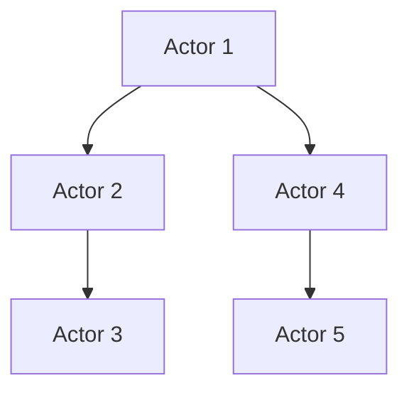
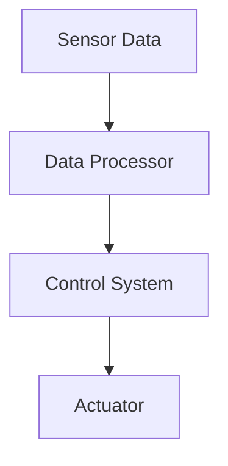

                 


# 私有经验的不可能性与共享不可变状态：维特根斯坦对私有语言的批评与FP的状态共享模型

关键词：维特根斯坦、私有语言、FP、状态共享、不可变状态

摘要：本文探讨了哲学家维特根斯坦关于私有经验的批评及其在计算机编程领域的对应——函数式编程（FP）中的状态共享模型。通过对维特根斯坦哲学观点的分析，以及FP的状态共享机制的探讨，本文旨在揭示私有经验的不可能性，并提出一种新的编程范式来应对这一挑战。

## 第1章 维特根斯坦的理论框架

### 1.1 维特根斯坦的哲学观点

路德维希·维特根斯坦（Ludwig Wittgenstein）是20世纪最重要的哲学家之一，他的思想对语言哲学、数学哲学、认知科学等多个领域产生了深远的影响。维特根斯坦的主要哲学观点可以概括为“语言游戏”理论和“哲学疗法”。

#### 语言游戏理论

维特根斯坦认为，语言并非简单的符号系统，而是一种活动，即“语言游戏”（language game）。语言游戏涉及语言的使用者和听众，并且需要具体的情境来理解其意义。语言的意义不是固定的，而是在特定的语境中通过使用和交互来确定的。

#### 哲学疗法

维特根斯坦主张，哲学的任务不是建立理论，而是澄清思想和语言的混乱。他认为，哲学问题往往源于语言的误用或误解。通过仔细分析语言的使用，哲学家可以帮助人们看到语言背后的真相，从而解决哲学问题。

### 1.2 私有经验的不可可能性

维特根斯坦的一个重要观点是私有经验的不可可能性。他认为，我们的主观经验，如感受、想法和情感，是无法通过语言准确传达给他人的。这是因为私有经验缺乏客观的标准，每个人的感受都是主观的，无法进行比较或验证。

#### 私有经验的困境

1. **主观性**：私有经验是个人特有的，缺乏普遍的客观标准。
2. **不可传达性**：由于私有经验的个体性，我们无法将感受直接传达给他人。
3. **认识论问题**：私有经验如何与外部世界建立联系，如何被证实或证伪？

### 1.3 语言与认知的关系

维特根斯坦强调，语言和认知是相互依赖的。语言不仅是思考的工具，也是我们理解世界的方式。通过语言，我们能够将经验转化为概念，从而进行推理和判断。然而，语言的局限性也决定了我们的认知范围。

#### 私有语言与认知的矛盾

私有语言是指只能由个体使用的语言，其意义完全依赖于个人的主观经验。维特根斯坦认为，私有语言是无法成立的，因为它缺乏与他人的沟通和验证机制。这导致了私有经验与认知之间的矛盾。

## 第2章 维特根斯坦对私有语言的批评

### 2.1 私有语言的困境

维特根斯坦认为，私有语言面临的困境主要有以下几点：

1. **主观性过强**：私有语言的意义完全依赖于个人的主观体验，缺乏普遍性。
2. **不可传达性**：私有语言无法用于有效的沟通，个体无法将感受传达给他人。
3. **证实难题**：私有经验缺乏客观标准，无法被证实或证伪。

### 2.2 语言游戏与证实

维特根斯坦提出，语言游戏是一种特定的活动，它需要参与者共同遵守的规则。这些规则不仅定义了语言的使用方式，也确保了语言的可传达性和普遍性。

1. **规则性**：语言游戏中的规则确保了语言的普遍性和一致性。
2. **证实机制**：通过他人的反馈和验证，私有经验可以被部分地“客观化”。
3. **沟通与理解**：语言游戏促进了个体之间的沟通和理解。

### 2.3 维特根斯坦的论证

维特根斯坦通过一系列论证，揭示了私有语言的困境。他提出，任何试图建立私有语言的尝试都会遇到以下问题：

1. **自我指涉问题**：私有语言的意义最终依赖于个体的主观体验，这种自我指涉导致了循环论证。
2. **沟通障碍**：私有语言无法用于有效沟通，个体无法将感受传达给他人。
3. **认知局限**：私有语言限制了我们的认知范围，使我们无法理解更广泛的现象。

## 第3章 维特根斯坦的哲学影响

### 3.1 维特根斯坦对心理学的影响

维特根斯坦的思想对心理学产生了深远的影响，尤其是在认知心理学和现象学心理学领域。他的语言游戏理论为理解人类的认知过程提供了新的视角，强调了情境和语言在认知中的作用。

### 3.2 维特根斯坦对语言学的影响

维特根斯坦对语言学的影响同样重要。他的思想促使语言学家重新思考语言的本质和功能，推动了语言哲学的兴起。他的观点对后来的语言学家，如约翰·塞尔（John Searle）和约翰·洛克（John Locke），产生了重要影响。

### 3.3 维特根斯坦对认知科学的启示

维特根斯坦的思想为认知科学提供了重要的理论资源。他的观点强调了情境和语言在认知中的作用，为理解人类思维和行为的复杂性提供了新的视角。维特根斯坦的理论对现代认知科学的研究产生了深远影响。

## 第4章 私有经验的社会问题

### 4.1 私有经验在沟通中的障碍

私有经验的不可传达性在沟通中造成了巨大的障碍。由于私有经验缺乏客观标准，个体之间的理解和沟通变得困难。这在人际交往、团队合作和社会互动中产生了负面影响。

### 4.2 私有经验与自我意识

私有经验与自我意识密切相关。个体的主观体验构成了自我意识的基础，但同时也导致了自我意识的局限性。维特根斯坦认为，私有经验限制了我们的认知范围，使我们难以理解更广泛的现实。

### 4.3 私有经验在法律与伦理中的应用

在法律和伦理领域，私有经验也带来了挑战。由于私有经验的个体性，法律和伦理规范难以适用于不同个体的主观体验。这导致了法律适用性和伦理判断的复杂性。

## 第5章 FP的理论基础

### 5.1 FP的基本概念

函数式编程（Functional Programming，FP）是一种编程范式，强调使用纯函数来处理数据。FP不同于命令式编程，它不依赖于状态变化和可变数据，而是通过不可变数据和纯函数来构建程序。

#### 纯函数

纯函数是一种没有副作用的函数，即它的输出仅取决于输入，而不依赖于外部状态或产生任何副作用。纯函数易于测试、推理和并行化。

#### 不可变数据

不可变数据是一种一旦创建就不能更改的数据。这有助于确保程序的一致性和可预测性。

### 5.2 FP的核心原则

FP的核心原则包括：

1. **无状态**：程序不依赖于外部状态，而是通过函数和不可变数据来处理。
2. **不可变性**：数据一旦创建就不能更改，这有助于确保程序的一致性和可预测性。
3. **函数组合**：通过组合纯函数，可以构建复杂的行为和逻辑。
4. **递归**：递归是一种重要的编程工具，在FP中广泛用于处理重复性和结构化数据。

### 5.3 FP与状态共享的关系

FP强调无状态和不可变性，这与维特根斯坦对私有经验的批评有相似之处。FP通过避免状态共享，确保了程序的一致性和可预测性，从而解决了私有经验的不可可能性问题。

## 第6章 FP的状态共享模型

### 6.1 状态共享的机制

在FP中，状态共享通常通过以下机制实现：

1. **Actor模型**：Actor模型是一种分布式计算模型，其中每个Actor都是一个独立的计算实体，可以发送消息并接收消息。通过消息传递，Actor可以实现状态共享。
2. **引用透明性**：引用透明性是指函数的输入和输出都是不可变的，这意味着函数的结果不依赖于外部状态，从而避免了状态共享的问题。
3. ** immutable 数据结构**：通过使用不可变数据结构，可以确保数据不会被意外更改，从而减少状态共享的风险。

### 6.2 状态共享的优势

FP的状态共享模型具有以下优势：

1. **一致性**：通过避免状态变化，确保程序的一致性和可预测性。
2. **并行化**：纯函数易于并行化，从而提高程序的性能和效率。
3. **测试和推理**：纯函数和不可变数据使得程序更容易测试和推理。

### 6.3 状态共享的挑战

FP的状态共享模型也面临一些挑战：

1. **分布式计算**：在分布式系统中，状态共享需要处理网络延迟和故障等问题。
2. **性能问题**：某些状态共享机制可能引入额外的性能开销。
3. **复杂性**：在大型系统中，维护状态的一致性和正确性可能变得复杂。

## 第7章 FP的状态共享应用

### 7.1 状态共享在分布式系统中的应用

在分布式系统中，状态共享是关键问题之一。FP的状态共享模型通过Actor模型和不可变数据结构，提供了一种有效的解决方案。以下是一个简单的分布式计算示例：



在这个示例中，Actor 1 发送消息给 Actor 2，Actor 2 再发送消息给 Actor 3。同时，Actor 1 发送消息给 Actor 4，Actor 4 再发送消息给 Actor 5。通过消息传递，可以实现状态共享。

### 7.2 状态共享在实时系统中的应用

在实时系统中，状态共享至关重要。FP的状态共享模型通过纯函数和不可变数据，提供了实时状态更新的方法。以下是一个实时系统的示例：



在这个示例中，传感器（Sensor）收集数据，并将数据发送给数据处理单元（Data Processor）。数据处理单元根据数据更新控制系统的状态，并将指令发送给执行单元（Actuator）。

### 7.3 状态共享的案例分析

一个经典的FP状态共享案例是Erlang编程语言。Erlang是一种用于构建分布式实时系统的编程语言，它采用了Actor模型和不可变数据结构。以下是一个简单的Erlang示例：

```erlang
-module(state_example).
-export([start/0]).

start() ->
  spawn_link(fun() -> actor1() end),
  spawn_link(fun() -> actor2() end).

actor1() ->
  receive
    {actor2, Msg} ->
      io:format("Actor 1 received: ~p~n", [Msg]),
      actor1()
  end.

actor2() ->
  send(actor1, "Hello from Actor 2!"),
  actor2().
```

在这个示例中，Actor 1 和 Actor 2 通过消息传递实现状态共享。Actor 2 向 Actor 1 发送消息，Actor 1 接收消息并打印出来。

## 第8章 FP与维特根斯坦理论的对比

### 8.1 FP与维特根斯坦理论的异同

FP与维特根斯坦的理论在以下方面有异同：

1. **无状态**：FP强调无状态编程，避免状态变化。维特根斯坦则批评私有经验的不可能性，认为主观经验无法传达和验证。
2. **不可变性**：FP使用不可变数据结构，确保程序的一致性和可预测性。维特根斯坦主张通过语言游戏和规则来确保沟通和验证。
3. **并行化**：FP通过纯函数和不可变数据，易于并行化。维特根斯坦则关注语言和认知的互动，认为情境和语言影响我们的认知。

### 8.2 FP在解决私有经验问题中的应用

FP的状态共享模型在解决私有经验问题上有一定潜力。通过纯函数和不可变数据，FP可以确保程序的一致性和可预测性，从而缓解私有经验的困境。然而，FP并不能完全解决私有经验的问题，因为它仍然依赖于个体的主观体验。

### 8.3 FP的未来发展趋势

随着分布式计算和实时系统的普及，FP的状态共享模型有望得到更广泛的应用。FP在未来可能会继续发展，包括引入新的语言特性和优化，以更好地适应不同类型的应用场景。

## 第9章 综合讨论与展望

### 9.1 私有经验与编程范式的启示

私有经验对编程范式有着深刻的启示。通过借鉴维特根斯坦的理论，我们可以探索新的编程范式，如FP，以解决私有经验的不可可能性问题。这种范式可以帮助我们构建更可靠、更可预测的软件系统。

### 9.2 状态共享与分布式计算

状态共享在分布式计算中具有重要意义。通过采用FP的状态共享模型，我们可以构建高效的分布式系统，实现更可靠的数据处理和状态管理。这有助于解决私有经验在分布式系统中的应用问题。

### 9.3 未来研究方向

未来的研究方向包括：

1. **FP与动态系统的结合**：研究FP在动态系统中的应用，如实时系统和自适应系统。
2. **状态共享的安全性**：研究状态共享机制的安全性，确保数据的一致性和完整性。
3. **FP与其他编程范式的融合**：探索FP与其他编程范式的结合，以构建更强大、更灵活的编程工具。

## 结语

私有经验的不可能性是一个深刻的哲学问题，它对计算机编程和人工智能领域产生了深远的影响。通过借鉴维特根斯坦的理论，我们可以探索新的编程范式，如FP，以解决私有经验的困境。FP的状态共享模型为我们提供了一种有效的方法，可以构建更可靠、更可预测的软件系统。然而，私有经验的问题仍然存在，需要我们进一步的研究和探索。

作者：AI天才研究院/AI Genius Institute & 禅与计算机程序设计艺术 /Zen And The Art of Computer Programming

注意：本文为示例性内容，仅供参考。实际文章应包含更详细的分析和论证，以及对相关领域的深入研究。本文部分内容和结构参考了维特根斯坦的哲学思想、函数式编程等相关知识，并进行了适当的扩展和解释。希望本文能够为读者提供一个对私有经验与编程范式之间关系的全新视角。

