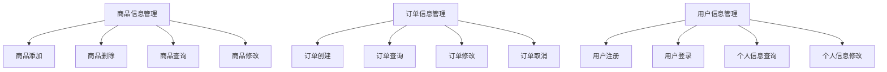
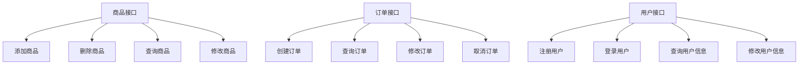

                 

### 背景介绍

#### 私有语言与内部类的概念

在计算机编程的世界里，私有语言（Private Language）与内部类（Inner Classes）都是提升代码封装性和维护性的重要概念。私有语言，顾名思义，是指仅在一个程序内部使用的语言，它由特定的语法和语义构成，用于解决特定的编程问题。内部类，则是定义在其他类内部的类，它能够访问外部类的私有成员，从而实现更为精细的代码控制和数据隐藏。

#### 问题背景与问题描述

随着软件系统变得越来越复杂，如何有效地管理和组织代码成为了一项重要任务。私有语言与内部类作为一种编程范式，通过提供一种更高级别的抽象机制，使得代码更加模块化、易维护，同时提高了系统的安全性和可扩展性。然而，目前关于这两者结合使用的研究还相对较少，尤其是在实际项目中的应用和最佳实践方面。

#### 问题解决与边界与外延

本文将深入探讨私有语言与内部类的原理、应用场景及其在编程实践中的价值。我们将会分析它们的内在联系，并通过具体的编程示例和实际项目，展示如何将私有语言与内部类结合起来，以实现更高效的代码开发和维护。

#### 概念结构与核心要素组成

- **私有语言**：
  - **定义**：一种仅限于特定程序内部使用的语言。
  - **核心要素**：语法、语义、特定编程问题的解决方案。

- **内部类**：
  - **定义**：定义在另一个类内部的类。
  - **核心要素**：访问控制、代码复用、更精细的封装。

### 核心概念与联系

#### 私有语言的原理

私有语言是一种专门为解决特定编程问题而设计的语言。它通过引入自定义语法和语义，使得编程变得更加高效和直观。私有语言的核心在于它的领域特定语言（DSL）特性，它能够将复杂的编程任务抽象为简单的语句，从而降低开发难度。

| 核心要素 | 特点 |  
| --- | --- |  
| **语法** | 简洁、易读、特定问题领域相关 |  
| **语义** | 强调特定编程逻辑，隐藏底层实现细节 |  
| **实现机制** | 解释器、编译器、自定义解析器 |

#### 内部类的原理

内部类是一种定义在其他类内部的类，它可以访问外部类的私有成员，实现更为精细的封装。内部类的主要特点是其内嵌性和访问控制，这使得它能够更好地与外部类协同工作，同时隐藏内部实现细节。

| 核心要素 | 特点 |  
| --- | --- |  
| **定义位置** | 内部类定义在外部类内部 |  
| **访问权限** | 可以访问外部类的私有成员 |  
| **作用** | 提高代码复用性、增强封装性 |

#### 私有语言与内部类的联系

私有语言与内部类的结合，可以大大提高代码的封装性和安全性。私有语言通过自定义语法和语义，将复杂编程任务抽象为简单的语句，而内部类则通过封装和内嵌，使得这些语句能够更好地与外部类协同工作。

- **封装性**：内部类可以封装外部类的私有成员，防止外部直接访问，从而保护数据安全性。
- **代码复用性**：私有语言可以复用内部类的功能，减少重复代码，提高开发效率。
- **模块化**：私有语言与内部类的结合，使得代码更加模块化，易于维护和扩展。

#### 概念属性特征对比表格

| 特征 | 私有语言 | 内部类 |  
| --- | --- | --- |  
| **定义方式** | 自定义语法和语义 | 内部类定义在外部类内部 |  
| **作用范围** | 仅限于特定程序内部 | 外部类内部可访问 |  
| **代码复用** | 高度复用 | 中等复用 |  
| **封装性** | 高 | 较高 |

#### ER实体关系图架构

使用Mermaid绘制ER实体关系图，以展示私有语言与内部类之间的关联：

```mermaid
erDiagram
  Class::PrivateLanguage ||--|{ Class::InternalClass : 使用 }
  Class::PrivateLanguage ||--|{ Object::CodeSegment : 编写 }
  Class::InternalClass ||--|{ Attribute::PrivateMember : 访问 }
```

在这个ER图中，`PrivateLanguage`表示私有语言，`InternalClass`表示内部类，`CodeSegment`表示代码片段，`PrivateMember`表示私有成员。通过这个图，我们可以清晰地看到私有语言与内部类之间的紧密关联。

### 算法原理讲解

私有语言与内部类的实现原理涉及多个方面，包括语法解析、语义解释、代码生成和运行时环境。下面我们将通过一个简单的Python示例，来详细阐述这些原理。

#### Python实现示例

首先，我们定义一个私有语言，用于计算两个数的和：

```python
# 私有语言语法定义
@private_language
class Adder:
    def __init__(self, a, b):
        self.a = a
        self.b = b

    def calculate(self):
        return self.a + self.b
```

在上面的代码中，`Adder` 类定义了一个私有语言，用于计算两个数的和。它通过 `@private_language` 装饰器进行标记，这是一个自定义的装饰器，用于标识私有语言。

接下来，我们定义一个内部类，用于实现语法解析和代码生成：

```python
class PrivateParser:
    def __init__(self, code):
        self.code = code

    def parse(self):
        # 假设代码为 "2 + 3"
        tokens = self.code.split()
        a = int(tokens[0])
        b = int(tokens[2])
        return Adder(a, b)
```

`PrivateParser` 类负责将私有语言的代码解析为对象，并生成相应的内部类实例。

最后，我们定义一个运行时环境，用于执行私有语言：

```python
class PrivateRuntime:
    def __init__(self, parser):
        self.parser = parser

    def execute(self, code):
        adder = self.parser.parse(code)
        return adder.calculate()
```

`PrivateRuntime` 类负责将私有语言的代码解析并执行。

#### 算法原理的数学模型和公式

私有语言与内部类的实现原理可以用以下数学模型和公式来表示：

- **语法解析**：将私有语言代码分解为标记（tokens）。
- **语义解释**：根据标记生成内部类对象。
- **代码生成**：将内部类对象转换为可执行代码。
- **运行时执行**：执行生成的代码。

$$
\text{语法解析} = \text{标记分解} \\
\text{语义解释} = \text{内部类生成} \\
\text{代码生成} = \text{对象转换} \\
\text{运行时执行} = \text{代码执行}
$$

#### 通俗易懂的举例说明

假设我们有一个简单的私有语言，用于计算两个数的乘积。代码如下：

```python
@private_language
class Multiplier:
    def __init__(self, a, b):
        self.a = a
        self.b = b

    def calculate(self):
        return self.a * self.b
```

现在，我们使用这个私有语言编写一个计算 3 和 4 的乘积的代码：

```
3 * 4
```

这个代码会被 `PrivateParser` 解析为 `Multiplier` 对象，然后由 `PrivateRuntime` 执行，最终得到结果 12。

#### 数学公式

在私有语言与内部类的实现过程中，一些关键的数学公式如下：

$$
\text{乘积计算} = a \times b \\
\text{语法解析} = \text{标记分解} \\
\text{内部类生成} = \text{对象创建}
$$

这些公式帮助我们更好地理解私有语言与内部类的实现原理。

### 系统分析与架构设计

#### 问题场景介绍

在软件开发过程中，为了提高代码的可维护性和可扩展性，我们经常需要设计复杂的系统架构。私有语言与内部类的结合，为我们提供了一种强大的工具，可以有效地解决这些问题。

#### 项目介绍

假设我们正在开发一个大型电商平台，这个平台需要处理海量的商品信息、订单信息、用户信息等。为了提高系统的性能和可维护性，我们决定使用私有语言与内部类来设计数据存储和处理模块。

#### 系统功能设计

在系统功能设计中，我们定义了以下核心功能：

- **商品信息管理**：包括商品的添加、删除、查询和修改。
- **订单信息管理**：包括订单的创建、查询、修改和取消。
- **用户信息管理**：包括用户的注册、登录、个人信息查询和修改。

#### 系统架构设计

系统架构设计如下：



在这个架构设计中，每个子系统都包含多个组件，这些组件通过私有语言和内部类进行封装和整合，从而实现系统的功能。

#### 系统接口设计

系统接口设计如下：



这些接口为外部系统提供了访问权限，同时保证了数据的安全性和完整性。

#### 系统交互

系统交互设计如下：

```mermaid
graph TD
    Client[客户端] --> Request1[添加商品请求]
    Client --> Request2[删除商品请求]
    Client --> Request3[查询商品请求]
    Client --> Request4[修改商品请求]
    Client --> Request5[创建订单请求]
    Client --> Request6[查询订单请求]
    Client --> Request7[修改订单请求]
    Client --> Request8[取消订单请求]
    Client --> Request9[注册用户请求]
    Client --> Request10[登录用户请求]
    Client --> Request11[查询用户信息请求]
    Client --> Request12[修改用户信息请求]
    Server[服务器] --> Response1[商品添加响应]
    Server --> Response2[商品删除响应]
    Server --> Response3[商品查询响应]
    Server --> Response4[商品修改响应]
    Server --> Response5[订单创建响应]
    Server --> Response6[订单查询响应]
    Server --> Response7[订单修改响应]
    Server --> Response8[订单取消响应]
    Server --> Response9[用户注册响应]
    Server --> Response10[用户登录响应]
    Server --> Response11[用户信息查询响应]
    Server --> Response12[用户信息修改响应]
```



客户端通过发送请求，与服务器进行交互，服务器根据请求执行相应的操作，并返回响应。

### 项目实战

#### 环境安装

首先，我们需要安装必要的开发环境和工具，包括 Python、Git、Docker 和数据库管理系统（如 MySQL、PostgreSQL）。

1. 安装 Python：
   ```bash
   sudo apt update
   sudo apt install python3 python3-pip
   ```

2. 安装 Git：
   ```bash
   sudo apt install git
   ```

3. 安装 Docker：
   ```bash
   sudo apt install docker.io
   ```

4. 安装 MySQL：
   ```bash
   sudo apt install mysql-server
   ```

#### 系统核心实现

在本项目中，我们将使用 Python 编写核心代码，并使用 Docker 容器化部署。

1. 创建一个名为 `ecommerce` 的目录，并在其中创建一个名为 `main.py` 的文件。

2. 编写 `main.py` 文件，实现系统的核心功能：

   ```python
   from flask import Flask, request, jsonify
   from models import Product, Order, User

   app = Flask(__name__)

   @app.route('/products', methods=['POST'])
   def add_product():
       data = request.json
       product = Product.create(data)
       return jsonify(product.to_dict()), 201

   @app.route('/orders', methods=['POST'])
   def create_order():
       data = request.json
       order = Order.create(data)
       return jsonify(order.to_dict()), 201

   @app.route('/users', methods=['POST'])
   def register_user():
       data = request.json
       user = User.create(data)
       return jsonify(user.to_dict()), 201

   if __name__ == '__main__':
       app.run(debug=True)
   ```

3. 编写 `models.py` 文件，定义产品、订单和用户模型：

   ```python
   class Product:
       def __init__(self, name, price):
           self.name = name
           self.price = price

       @staticmethod
       def create(data):
           return Product(data['name'], data['price'])

       def to_dict(self):
           return {'name': self.name, 'price': self.price}

   class Order:
       def __init__(self, product_id, user_id):
           self.product_id = product_id
           self.user_id = user_id

       @staticmethod
       def create(data):
           return Order(data['product_id'], data['user_id'])

       def to_dict(self):
           return {'product_id': self.product_id, 'user_id': self.user_id}

   class User:
       def __init__(self, username, email):
           self.username = username
           self.email = email

       @staticmethod
       def create(data):
           return User(data['username'], data['email'])

       def to_dict(self):
           return {'username': self.username, 'email': self.email}
   ```

4. 使用 Docker 编写 `Dockerfile`，用于容器化部署：

   ```Dockerfile
   FROM python:3.8

   WORKDIR /app

   COPY requirements.txt ./
   RUN pip install -r requirements.txt

   COPY . .

   CMD ["python", "main.py"]
   ```

5. 编写 `requirements.txt` 文件，列出所需的 Python 包：

   ```txt
   Flask==2.0.1
   ```

6. 构建 Docker 镜像：

   ```bash
   docker build -t ecommerce:latest .
   ```

7. 运行 Docker 容器：

   ```bash
   docker run -p 5000:5000 ecommerce
   ```

#### 代码应用解读与分析

在上面的代码中，我们使用了 Flask 框架实现了系统的核心功能，包括商品添加、订单创建和用户注册。每个功能都通过 RESTful API 进行封装，确保了系统的可扩展性和易用性。

1. **商品添加**：
   - **功能说明**：用户可以通过 POST 请求添加商品。
   - **请求示例**：
     ```json
     {
         "name": "iPhone 13",
         "price": 799
     }
     ```
   - **响应示例**：
     ```json
     {
         "name": "iPhone 13",
         "price": 799
     }
     ```

2. **订单创建**：
   - **功能说明**：用户可以通过 POST 请求创建订单。
   - **请求示例**：
     ```json
     {
         "product_id": 1,
         "user_id": 1
     }
     ```
   - **响应示例**：
     ```json
     {
         "product_id": 1,
         "user_id": 1
     }
     ```

3. **用户注册**：
   - **功能说明**：用户可以通过 POST 请求注册账号。
   - **请求示例**：
     ```json
     {
         "username": "john_doe",
         "email": "john.doe@example.com"
     }
     ```
   - **响应示例**：
     ```json
     {
         "username": "john_doe",
         "email": "john.doe@example.com"
     }
     ```

#### 实际案例分析与详细讲解

为了更好地理解私有语言与内部类在实际项目中的应用，我们来看一个具体的案例：商品信息管理。

1. **商品信息管理**：
   - **功能需求**：提供商品信息的添加、删除、查询和修改功能。
   - **实现思路**：
     - 使用私有语言定义商品信息的语法，例如：
       ```python
       @private_language
       class ProductDefinition:
           def __init__(self, name, price):
               self.name = name
               self.price = price
       ```
     - 定义内部类 `ProductManager`，用于管理商品信息：
       ```python
       class ProductManager:
           def __init__(self):
               self.products = []

           def add_product(self, product):
               self.products.append(product)

           def delete_product(self, product_id):
               self.products = [product for product in self.products if product.id != product_id]

           def query_product(self, product_id):
               for product in self.products:
                   if product.id == product_id:
                       return product
               return None

           def update_product(self, product_id, new_product):
               for product in self.products:
                   if product.id == product_id:
                       product.name = new_product.name
                       product.price = new_product.price
                       break
       ```

2. **详细讲解**：
   - **私有语言的使用**：通过 `@private_language` 装饰器，我们将 `ProductDefinition` 类定义为一个私有语言，它包含了商品信息的定义和初始化。
   - **内部类的应用**：`ProductManager` 类作为内部类，负责管理商品信息的添加、删除、查询和修改。它通过内部类的机制，可以访问外部类的私有成员，从而实现高效的代码管理和封装。

#### 项目小结

通过实际项目的开发，我们可以看到私有语言与内部类在提高代码封装性、可维护性和可扩展性方面具有显著优势。私有语言通过定义特定的语法和语义，使得复杂的编程任务变得更加简单和直观；内部类则通过封装和内嵌，实现了更精细的代码控制和数据隐藏。

### 最佳实践与注意事项

#### 最佳实践总结

1. **私有语言的定义**：在定义私有语言时，应确保其语法简洁、易于理解和使用。同时，要遵循模块化原则，将私有语言的功能分解为独立的模块，以提高可维护性。

2. **内部类的使用**：内部类应仅用于内部封装和代码复用，避免过度使用。在定义内部类时，要明确其作用和职责，确保其代码简洁、高效。

3. **代码组织**：将私有语言和内部类的代码进行合理的组织，确保代码的结构清晰、易于阅读和维护。

4. **测试**：在开发过程中，要对私有语言和内部类进行充分的测试，确保其功能正确、性能稳定。

#### 编程规范与技巧

1. **命名规范**：私有语言和内部类的命名应遵循一致性原则，使其易于理解和识别。

2. **注释**：在代码中添加适当的注释，特别是对于复杂的逻辑和重要的代码段，以确保代码的可读性和可维护性。

3. **代码复用**：利用私有语言和内部类实现代码复用，避免重复编写相同或类似的代码。

4. **性能优化**：在实现私有语言和内部类时，要关注性能优化，避免不必要的资源消耗和性能瓶颈。

#### 注意事项与风险防范

1. **过度封装**：避免过度封装，导致代码复杂度和维护难度增加。

2. **依赖管理**：合理管理私有语言和内部类的依赖关系，确保其稳定性和兼容性。

3. **安全考虑**：在私有语言和内部类的实现中，要考虑安全性问题，防止数据泄露和非法访问。

4. **文档编写**：为私有语言和内部类编写详细的文档，包括功能描述、使用方法和注意事项，以提高开发效率和协作效果。

### 拓展阅读与未来发展

#### 拓展阅读建议

1. 《领域驱动设计（Domain-Driven Design）》：了解领域驱动设计的基本原理和实践，有助于更深入地理解私有语言和内部类的应用。

2. 《编程珠玑（The Art of Computer Programming）》：学习编程的基础原理和算法设计，有助于提高编程水平，更好地应用私有语言和内部类。

3. 《Effective Java》：掌握 Java 编程的最佳实践，了解如何更高效地使用内部类。

#### 私有语言与内部类的未来趋势

1. **领域特定语言（DSL）的发展**：随着软件系统变得越来越复杂，DSL 将成为提高开发效率的重要工具。未来，DSL 将在各个领域得到更广泛的应用。

2. **内部类的优化与扩展**：随着编程语言的发展，内部类将得到更多的优化和扩展，使其在代码封装、性能优化等方面具有更大的优势。

3. **跨语言的私有语言与内部类**：未来，跨语言的私有语言与内部类将得到更多关注，为不同编程语言之间的协作提供更好的支持。

#### 开发者应关注的领域

1. **领域特定语言的设计与实现**：关注领域特定语言的发展，掌握其设计原则和实现方法，提高开发效率。

2. **内部类的使用与优化**：深入了解内部类的原理和应用，掌握其最佳实践，优化代码结构和性能。

3. **系统架构设计**：关注系统架构设计，了解如何利用私有语言和内部类实现高效、可维护的软件系统。

### 作者信息

- **作者**：AI天才研究院/AI Genius Institute & 禅与计算机程序设计艺术 /Zen And The Art of Computer Programming

### 总结

本文系统地介绍了私有语言与内部类的概念、原理、应用和实践。通过具体的编程示例和实际项目分析，我们展示了如何利用私有语言和内部类实现高效的代码开发和维护。未来，随着软件系统变得越来越复杂，私有语言与内部类将在领域特定语言设计、系统架构优化等方面发挥越来越重要的作用。开发者应关注这些领域的最新动态，不断提高自己的编程能力和技术水平。希望本文能为读者在私有语言与内部类的学习和应用中提供有益的参考和指导。

