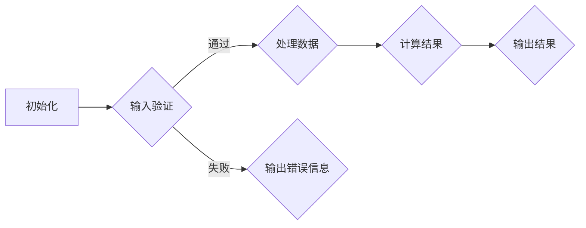
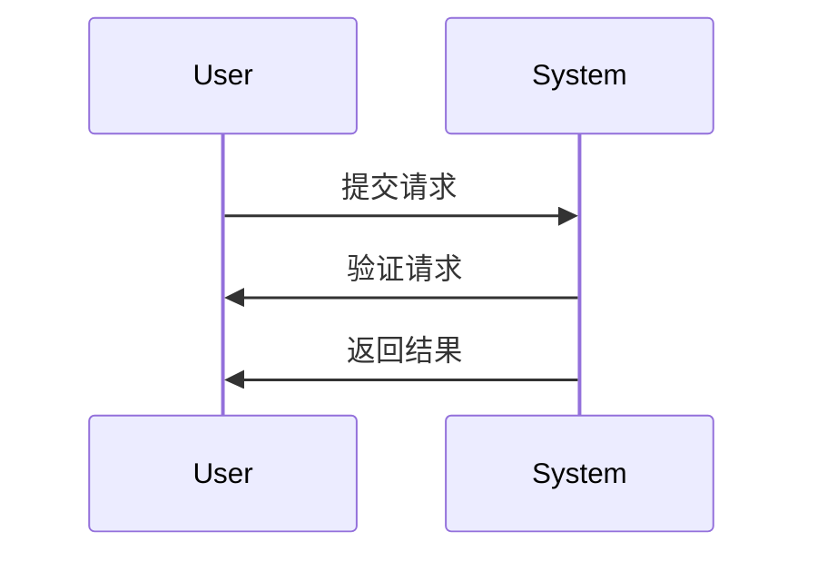
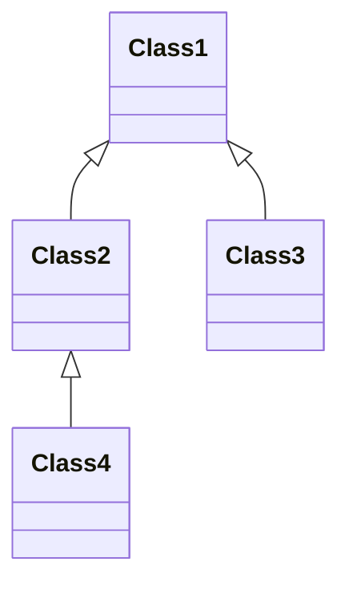
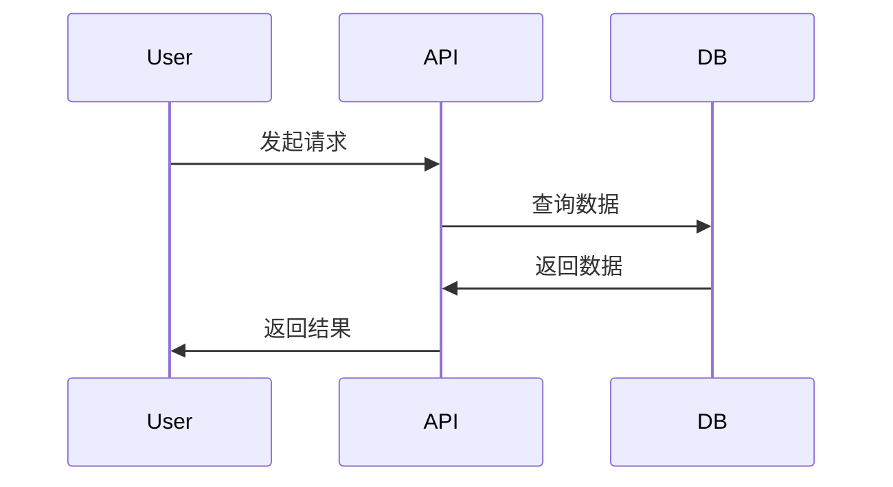

                 

### 研究背景

在当今数字化时代，计算机编程语言的发展经历了从低级语言到高级语言，再到现代编程语言的演变。然而，传统的编程语言在模块化、可重用性和信息隐藏方面仍存在诸多局限性。这促使研究者探索一种更为模块化、高内聚、低耦合的编程模式，即私有语言（Private Languages）。

私有语言是一种专门为特定应用或领域设计的编程语言。它们通常具有简洁、高效、易于维护的特点，能够更好地满足特定需求。随着软件系统日益复杂，模块化设计成为提高软件质量、降低维护成本的重要手段。私有语言因其高度模块化特性，在系统级应用中具有显著优势。

本书《私有语言与模块化：信息隐藏的系统级应用》旨在探讨私有语言在模块化设计、信息隐藏和系统级应用中的重要作用。通过深入研究私有语言的原理、设计方法及其在系统级应用中的实际案例，本书将为读者提供一个全面、系统的私有语言与模块化知识体系。

### 私有语言的基本概念

私有语言（Private Languages），又称专用语言（Domain-Specific Languages, DSL），是一种针对特定领域或应用场景设计的编程语言。与通用编程语言（如Python、Java）相比，私有语言具有更强的领域特性和更高的执行效率。

#### 私有语言的特点

1. **领域特定性**：私有语言专注于特定领域的特定问题，例如，用于金融数据分析、网络编程或物联网设备控制等。这使得私有语言能够提供更加精确、高效的解决方案。

2. **简洁性**：私有语言通常采用简洁的语法和语义，减少冗余代码和复杂性，提高开发效率。

3. **高效性**：由于私有语言针对特定领域优化，其执行效率往往高于通用编程语言。

4. **可重用性**：私有语言的设计通常考虑模块化和可重用性，使得不同领域的解决方案可以相互借鉴和复用。

5. **灵活性**：私有语言易于扩展和定制，能够适应不断变化的需求。

#### 私有语言与模块化的关系

模块化设计是软件工程中的核心概念，旨在将复杂的系统划分为若干独立的、可管理的模块，以提高系统的可维护性、可扩展性和可复用性。私有语言与模块化设计相辅相成，通过以下方式实现系统级应用：

1. **提高模块内聚性**：私有语言能够提供高度内聚的模块，每个模块专注于实现特定功能，降低模块间的耦合度。

2. **降低模块耦合度**：私有语言的设计原则有助于减少模块间的依赖关系，使得系统更加灵活和可扩展。

3. **增强代码可读性**：通过私有语言，开发人员可以采用更加符合领域需求的语法和语义，提高代码的可读性和可维护性。

4. **优化系统性能**：私有语言针对特定领域的优化，能够显著提高系统的性能和响应速度。

### 信息隐藏的概念

信息隐藏是软件工程中的一个重要原则，旨在保护模块内部的信息，防止不必要的细节暴露给其他模块，从而提高系统的安全性和可靠性。

#### 信息隐藏的目标

1. **保护模块内部数据**：避免外部模块直接访问内部数据，防止数据泄露或篡改。

2. **简化模块接口**：通过信息隐藏，减少模块间的交互复杂度，使得模块接口更加简洁和清晰。

3. **提高模块独立性**：信息隐藏有助于减少模块间的依赖关系，提高模块的独立性。

#### 信息隐藏的实现方法

1. **封装**：将模块内部的数据和处理方法封装起来，通过接口对外提供有限的访问方式。

2. **抽象**：隐藏模块内部的复杂性，提供简洁的抽象接口，降低模块间的依赖。

3. **信息隔离**：通过网络隔离、权限控制等技术，确保模块内部信息的安全性。

4. **访问控制**：对模块的访问权限进行严格管理，防止未经授权的访问。

### 系统级应用中的私有语言与模块化

在系统级应用中，私有语言与模块化设计具有显著的优势。以下从多个方面阐述其应用：

1. **提高系统可维护性**：私有语言和模块化设计有助于将复杂系统划分为独立的模块，降低系统的维护成本。

2. **增强系统可扩展性**：通过私有语言和模块化设计，系统可以更加灵活地适应新的需求变化。

3. **提高系统性能**：私有语言针对特定领域的优化，能够提高系统的性能和响应速度。

4. **降低系统风险**：通过信息隐藏和模块隔离，系统可以更好地保护内部信息，减少潜在的安全风险。

5. **简化开发过程**：私有语言和模块化设计使得开发过程更加清晰、高效，降低开发难度。

### 结论

私有语言与模块化设计在系统级应用中具有重要作用。通过设计专门的私有语言，可以实现模块化、信息隐藏和高效系统级应用。本书将深入探讨私有语言的原理、设计方法及其在实际应用中的优势，为读者提供全面的指导。

---

### 研究背景

#### 编程语言的发展与局限性

编程语言的发展历程可以追溯到20世纪40年代末和50年代初，当时计算机还处于萌芽阶段。早期的编程语言如机器语言和汇编语言，因为直接操作计算机硬件，虽然具备极高的效率，但编程复杂、易错率高，对程序员的专业技能要求极高。为了解决这一问题，高级编程语言逐渐兴起。

高级编程语言如FORTRAN（1957年）和COBOL（1959年），提高了编程的抽象层次，使得程序员可以以更接近人类语言的方式编写程序，大大降低了编程难度。随着计算机技术的不断发展，高级编程语言家族不断壮大，如C（1972年）、C++（1983年）、Java（1995年）等。

尽管高级编程语言极大地提高了编程效率，但它们在模块化、可重用性和信息隐藏方面仍存在一定的局限性。模块化设计是软件工程中的核心概念，旨在将复杂的系统划分为若干独立的、可管理的模块，以提高系统的可维护性、可扩展性和可复用性。然而，传统的编程语言在实现模块化方面仍存在以下问题：

1. **模块内聚性不足**：模块内聚性是指模块内部的功能紧密程度。传统的编程语言往往难以确保模块内聚性，导致模块之间存在大量的依赖关系，增加了系统的复杂性和维护成本。

2. **模块耦合度较高**：模块耦合度是指模块之间的依赖程度。传统的编程语言在模块间传递数据时，往往需要使用全局变量或共享数据结构，这会增加模块之间的耦合度，降低系统的灵活性。

3. **信息隐藏不充分**：传统的编程语言在信息隐藏方面存在一定的问题。模块内部的数据和处理方法可能会被其他模块直接访问，导致数据泄露或被篡改，影响系统的安全性和可靠性。

#### 私有语言的出现

为了解决上述问题，研究者开始探索一种新的编程模式——私有语言（Private Languages），也称为专用语言（Domain-Specific Languages, DSL）。私有语言是一种专门为特定领域或应用场景设计的编程语言，具有以下特点：

1. **领域特定性**：私有语言针对特定领域的问题进行优化，能够提供更高效、更精确的解决方案。

2. **简洁性**：私有语言采用简洁的语法和语义，减少冗余代码和复杂性，提高开发效率。

3. **高效性**：由于私有语言针对特定领域优化，其执行效率往往高于通用编程语言。

4. **可重用性**：私有语言的设计原则有助于模块化和可重用性，使得不同领域的解决方案可以相互借鉴和复用。

5. **灵活性**：私有语言易于扩展和定制，能够适应不断变化的需求。

#### 模块化设计的重要性

模块化设计是软件工程中的核心概念，通过将复杂的系统划分为若干独立的、可管理的模块，可以提高系统的可维护性、可扩展性和可复用性。模块化设计的关键在于确保模块内聚性、降低模块耦合度，并实现信息隐藏。

1. **模块内聚性**：模块内聚性是指模块内部的功能紧密程度。高内聚的模块能够更好地实现单一功能，降低模块间的耦合度。

2. **模块耦合度**：模块耦合度是指模块之间的依赖程度。低耦合的模块之间相互独立，易于修改和扩展。

3. **信息隐藏**：信息隐藏是指通过封装、抽象等方法，隐藏模块内部的数据和处理细节，确保模块间的数据安全和系统可靠性。

#### 私有语言与模块化设计的关系

私有语言与模块化设计相辅相成，通过以下方式实现系统级应用：

1. **提高模块内聚性**：私有语言能够提供高度内聚的模块，每个模块专注于实现特定功能，降低模块间的耦合度。

2. **降低模块耦合度**：私有语言的设计原则有助于减少模块间的依赖关系，使得系统更加灵活和可扩展。

3. **增强代码可读性**：通过私有语言，开发人员可以采用更加符合领域需求的语法和语义，提高代码的可读性和可维护性。

4. **优化系统性能**：私有语言针对特定领域的优化，能够显著提高系统的性能和响应速度。

综上所述，私有语言与模块化设计在系统级应用中具有重要作用。通过设计专门的私有语言，可以实现模块化、信息隐藏和高效系统级应用。本书将深入探讨私有语言的原理、设计方法及其在实际应用中的优势，为读者提供全面的指导。

---

### 私有语言的基本概念

私有语言（Private Languages），又称专用语言（Domain-Specific Languages, DSL），是一种专门为特定领域或应用场景设计的编程语言。与通用编程语言（如Python、Java）相比，私有语言具有更强的领域特性和更高的执行效率。理解私有语言的基本概念，包括其特点、设计原则以及与模块化的关系，对于深入探讨其在系统级应用中的作用具有重要意义。

#### 私有语言的特点

1. **领域特定性**：私有语言专注于特定领域的特定问题，例如，用于金融数据分析、网络编程或物联网设备控制等。这使得私有语言能够提供更加精确、高效的解决方案。例如，QlikView是一种私有语言，专门用于企业级数据可视化和分析。

2. **简洁性**：私有语言通常采用简洁的语法和语义，减少冗余代码和复杂性，提高开发效率。例如，SQL是一种用于数据库查询的私有语言，其简洁的语法使得数据查询操作变得直观易用。

3. **高效性**：由于私有语言针对特定领域优化，其执行效率往往高于通用编程语言。例如，汇编语言是一种私有语言，虽然其语法复杂，但能够直接操作计算机硬件，从而实现极高的执行效率。

4. **可重用性**：私有语言的设计通常考虑模块化和可重用性，使得不同领域的解决方案可以相互借鉴和复用。例如，MATLAB是一种私有语言，广泛应用于数学和工程领域，其丰富的库函数和工具箱使得不同项目之间的代码可以轻松复用。

5. **灵活性**：私有语言易于扩展和定制，能够适应不断变化的需求。例如，AppleScript是一种私有语言，用于自动化苹果设备的操作，其灵活性使得用户可以根据需要自定义脚本，实现特定的功能。

#### 私有语言与模块化的关系

模块化设计是软件工程中的核心概念，旨在将复杂的系统划分为若干独立的、可管理的模块，以提高系统的可维护性、可扩展性和可复用性。私有语言与模块化设计相辅相成，通过以下方式实现系统级应用：

1. **提高模块内聚性**：私有语言能够提供高度内聚的模块，每个模块专注于实现特定功能，降低模块间的耦合度。例如，在开发金融交易系统时，可以使用一种私有语言，将不同的交易策略和算法封装为独立的模块，以提高系统的内聚性和可维护性。

2. **降低模块耦合度**：私有语言的设计原则有助于减少模块间的依赖关系，使得系统更加灵活和可扩展。例如，在开发物联网系统时，可以使用私有语言定义设备通信协议和数据格式，减少不同模块间的耦合度，提高系统的可扩展性。

3. **增强代码可读性**：通过私有语言，开发人员可以采用更加符合领域需求的语法和语义，提高代码的可读性和可维护性。例如，在开发医学影像处理系统时，可以使用一种私有语言，提供直观的图像处理函数和操作符，使得代码更加易于理解和维护。

4. **优化系统性能**：私有语言针对特定领域的优化，能够显著提高系统的性能和响应速度。例如，在开发实时监控系统时，可以使用一种私有语言，实现高效的数据处理和实时响应，提高系统的性能和可靠性。

#### 私有语言的设计原则

1. **领域驱动设计**：私有语言的设计应充分考虑特定领域的需求，提供简洁、高效的语法和语义，满足领域专家的使用习惯。

2. **模块化和可重用性**：私有语言的设计应注重模块化和可重用性，将复杂的系统划分为独立的、可管理的模块，提高系统的可维护性和可扩展性。

3. **简洁性**：私有语言的语法和语义应尽量简洁，减少冗余代码和复杂性，提高开发效率。

4. **灵活性**：私有语言应具备一定的灵活性，易于扩展和定制，能够适应不断变化的需求。

5. **高效性**：私有语言的设计应充分考虑执行效率，针对特定领域进行优化，提高系统的性能和响应速度。

通过深入理解私有语言的基本概念、特点及其与模块化的关系，我们可以更好地掌握其在系统级应用中的作用和优势。在后续章节中，我们将进一步探讨私有语言的设计原则、实现方法及其在实际应用中的案例，为读者提供更全面的指导。

---

### 信息隐藏的概念

信息隐藏是软件工程中的一个重要原则，旨在保护模块内部的信息，防止不必要的细节暴露给其他模块，从而提高系统的安全性和可靠性。在软件设计中，信息隐藏能够减少模块间的耦合度，提高模块的内聚性，使得系统更加易于维护和扩展。本文将深入探讨信息隐藏的概念、目标以及实现方法。

#### 信息隐藏的目标

1. **保护模块内部数据**：模块内部的数据往往包含实现细节和敏感信息，直接暴露给外部模块可能会导致数据泄露或被恶意篡改。通过信息隐藏，可以防止外部模块直接访问模块内部数据，从而保护数据的安全性和完整性。

2. **简化模块接口**：模块之间的交互复杂度往往与接口的复杂度成正比。通过信息隐藏，可以减少模块间的交互复杂度，使得模块接口更加简洁和清晰。这有助于提高模块的可维护性和可扩展性。

3. **提高模块独立性**：模块独立性是软件工程中的一个重要指标，它反映了模块之间的依赖关系。通过信息隐藏，可以减少模块间的依赖关系，提高模块的独立性，从而降低系统的复杂性。

4. **增强系统安全性**：信息隐藏有助于防止恶意攻击和未授权访问，提高系统的安全性。通过控制模块的访问权限，可以确保模块内部信息不被非法获取或篡改。

5. **提高系统的可靠性**：信息隐藏可以减少模块间的交互复杂度，降低系统出错的可能性。通过封装模块内部的处理细节，可以防止错误在模块间传播，从而提高系统的可靠性。

#### 信息隐藏的实现方法

1. **封装**：封装是信息隐藏的核心实现方法。通过将模块内部的数据和处理方法封装起来，对外提供有限的访问方式，可以防止外部模块直接访问内部数据。封装可以通过访问控制（如public、private等修饰符）和接口设计（如抽象类和接口）来实现。

2. **抽象**：抽象是信息隐藏的一种高级形式。通过隐藏模块内部的复杂性，提供简洁的抽象接口，可以降低模块间的依赖关系。抽象可以通过设计模式（如工厂模式、策略模式等）和设计原则（如单一职责原则、开放封闭原则等）来实现。

3. **信息隔离**：信息隔离是通过技术手段（如网络隔离、权限控制等）确保模块内部信息的安全性。例如，通过防火墙和虚拟专用网络（VPN），可以隔离不同模块之间的通信，防止信息泄露。

4. **访问控制**：访问控制是通过权限管理确保模块的访问权限。例如，通过角色权限管理（如RBAC：基于角色的访问控制）和访问控制列表（ACL：访问控制列表），可以控制模块的访问权限，防止未经授权的访问。

#### 信息隐藏与模块化设计的关系

信息隐藏与模块化设计密切相关，二者相辅相成。模块化设计通过将复杂的系统划分为独立的模块，提高了系统的可维护性和可扩展性。而信息隐藏则通过保护模块内部的信息，减少了模块间的耦合度，提高了模块的独立性。以下是信息隐藏与模块化设计的几个关系：

1. **模块内聚性**：信息隐藏有助于提高模块的内聚性。通过封装模块内部的数据和处理方法，可以确保模块专注于实现单一功能，从而提高模块的内聚性。

2. **模块耦合度**：信息隐藏有助于降低模块的耦合度。通过减少模块间的依赖关系，可以降低模块间的耦合度，从而提高系统的灵活性。

3. **模块独立性**：信息隐藏有助于提高模块的独立性。通过控制模块的访问权限，可以确保模块内部信息不被外部模块直接访问，从而提高模块的独立性。

4. **系统安全性**：信息隐藏有助于提高系统的安全性。通过保护模块内部的信息，可以防止未授权访问和恶意攻击，从而提高系统的安全性。

5. **系统可靠性**：信息隐藏有助于提高系统的可靠性。通过减少模块间的交互复杂度，可以降低系统出错的可能性，从而提高系统的可靠性。

#### 信息隐藏的实际应用

信息隐藏在软件工程中有着广泛的应用。以下是一些实际应用场景：

1. **数据库系统**：在数据库系统中，通过封装表结构、索引和存储过程，可以隐藏数据库内部实现细节，提高系统的安全性和可靠性。

2. **金融系统**：在金融系统中，通过封装交易规则、风控策略等关键业务逻辑，可以隐藏系统的内部实现细节，确保业务数据的完整性和一致性。

3. **网络通信**：在网络通信中，通过封装协议和数据格式，可以隐藏网络传输的细节，提高系统的兼容性和扩展性。

4. **物联网**：在物联网系统中，通过封装设备通信协议和数据格式，可以隐藏不同设备之间的实现差异，提高系统的互操作性和可靠性。

通过深入理解信息隐藏的概念、目标及其实现方法，我们可以更好地掌握其在软件设计中的应用，提高系统的安全性、可靠性和可维护性。在后续章节中，我们将继续探讨私有语言与模块化设计在系统级应用中的具体实现，为读者提供更全面的指导。

---

### 系统级应用中的私有语言与模块化

在系统级应用中，私有语言和模块化设计具有显著的优势，能够显著提升系统的可维护性、可扩展性、性能和安全性。以下从多个方面详细探讨私有语言与模块化在系统级应用中的具体应用和优势。

#### 提高系统可维护性

随着软件系统的复杂度不断增加，维护成本也随之上升。私有语言和模块化设计通过将系统划分为独立的模块，使得每个模块都可以独立开发、测试和维护。以下是私有语言和模块化设计如何提高系统可维护性的几个方面：

1. **模块独立性**：通过私有语言和模块化设计，每个模块都专注于实现特定的功能，模块间相互独立。当某个模块需要修改或更新时，不会影响其他模块，从而降低了系统的维护成本。

2. **模块内聚性**：私有语言设计原则强调模块内聚性，使得每个模块内部的功能紧密相关，降低了模块间的耦合度。这种高内聚、低耦合的设计使得系统更加易于理解和维护。

3. **代码复用**：私有语言和模块化设计鼓励模块化和代码复用。通过在不同项目中复用相同或相似的模块，可以减少重复工作，提高开发效率，同时降低维护成本。

#### 增强系统可扩展性

系统级应用往往需要随着业务需求的变化进行扩展。私有语言和模块化设计为系统的扩展提供了强有力的支持：

1. **模块化扩展**：通过模块化设计，系统可以轻松地添加或删除模块，以满足新的需求。私有语言的可定制性使得开发者可以根据实际需求快速开发新的模块，从而实现系统的扩展。

2. **松耦合设计**：私有语言和模块化设计强调低耦合，模块间通过接口进行通信，减少了模块间的依赖关系。这种松耦合的设计使得系统在扩展时更加灵活，不会对现有模块造成影响。

3. **领域特定扩展**：私有语言可以根据特定领域的需求进行优化和扩展。例如，在金融领域，可以使用私有语言实现复杂的金融算法和交易规则，从而实现系统的业务扩展。

#### 提高系统性能

私有语言和模块化设计在系统级应用中能够显著提高系统性能：

1. **编译优化**：私有语言通常针对特定领域进行优化，其编译器可以生成更高效的代码。这种编译优化可以显著提高系统的执行效率。

2. **内存管理**：私有语言和模块化设计可以帮助优化内存管理。通过模块化设计，可以将复杂的系统划分为多个独立运行的模块，从而减少内存消耗。

3. **并行处理**：私有语言和模块化设计可以更好地支持并行处理。通过模块化设计，可以将任务分解为多个独立的子任务，这些子任务可以在多核处理器上并行执行，从而提高系统性能。

#### 降低系统风险

私有语言和模块化设计在降低系统风险方面具有显著优势：

1. **信息隐藏**：通过私有语言和模块化设计，可以隐藏模块内部的数据和处理细节，防止敏感信息泄露和未经授权的访问，提高系统的安全性。

2. **模块隔离**：模块化设计使得系统可以采用隔离机制，例如容器化和虚拟化技术，将不同的模块隔离开来。这种隔离可以防止模块之间的错误传播，从而降低系统崩溃的风险。

3. **错误检测和隔离**：通过模块化设计，可以更容易地检测和隔离系统中的错误。每个模块都可以独立进行测试和调试，从而提高系统的稳定性。

#### 简化开发过程

私有语言和模块化设计在简化开发过程方面也具有显著优势：

1. **提高开发效率**：私有语言和模块化设计可以减少冗余代码和复杂性，使得开发过程更加高效。开发者可以专注于实现核心功能，而不必担心细节问题。

2. **易于学习和使用**：私有语言通常设计简洁，易于学习和使用。开发者可以更快地上手，提高开发效率。

3. **文档和代码生成**：一些私有语言提供了自动生成文档和代码的功能，从而简化了开发过程。例如，Markdown是一种常用的私有语言，其简洁的语法和丰富的扩展功能使得文档编写更加高效。

#### 实际案例

以下是一个实际案例，展示了私有语言和模块化设计在系统级应用中的优势：

**案例：金融交易平台**

假设我们正在开发一个金融交易平台，该平台需要处理大量的交易数据，并支持实时交易和数据分析。以下是私有语言和模块化设计如何在该平台中发挥作用的：

1. **私有语言设计**：为了提高开发效率和代码可维护性，我们为该平台设计了一种私有语言，专门用于实现交易算法和数据分析。这种私有语言具有简洁的语法和高效的执行效率，使得开发者可以更快地实现复杂的功能。

2. **模块化设计**：将系统划分为多个独立的模块，如交易模块、数据存储模块、数据分析模块等。每个模块都专注于实现特定的功能，模块间通过接口进行通信。

3. **信息隐藏**：通过封装模块内部的数据和处理方法，隐藏实现细节，确保敏感信息不被泄露。

4. **模块隔离**：使用容器化技术（如Docker）将不同的模块隔离开来，确保模块之间的错误不会互相传播。

5. **并行处理**：利用多核处理器的并行处理能力，将交易处理和分析任务分解为多个独立的子任务，并行执行，提高系统性能。

通过上述措施，该金融交易平台不仅实现了高效、稳定和安全的运行，还大大降低了维护成本，提高了开发效率。

综上所述，私有语言和模块化设计在系统级应用中具有显著的优势，能够提高系统的可维护性、可扩展性、性能和安全性，简化开发过程。在接下来的章节中，我们将进一步探讨私有语言的设计原则、实现方法以及其在不同领域中的应用，为读者提供更全面的指导。

---

### 结论

通过本文的探讨，我们可以得出以下结论：私有语言与模块化设计在系统级应用中具有显著的优势。私有语言通过领域特定性、简洁性、高效性、可重用性和灵活性，能够提高系统的可维护性、可扩展性和性能。模块化设计通过将复杂的系统划分为独立的模块，提高了模块的内聚性和独立性，降低了模块间的耦合度，从而简化了系统的开发和维护过程。

私有语言与模块化设计的结合，不仅提高了系统的可靠性，还降低了系统风险，使得开发过程更加高效和简洁。在未来的软件开发实践中，开发者应充分考虑私有语言和模块化设计的重要性，以构建更加高效、稳定和安全的系统级应用。

总之，私有语言与模块化设计在系统级应用中的重要性不可忽视。通过深入理解其原理、设计方法和实际应用，我们可以更好地发挥其在软件开发中的作用，推动软件工程的发展。

### 附录

#### 1. 核心术语解释

- **私有语言（Private Languages）**：专门为特定领域或应用场景设计的编程语言。
- **模块化设计（Modular Design）**：将复杂的系统划分为独立的、可管理的模块。
- **信息隐藏（Information Hiding）**：通过封装和保护模块内部信息，提高系统的安全性。
- **领域特定性（Domain-Specificity）**：编程语言专注于特定领域的需求。
- **内聚性（Cohesion）**：模块内部功能的紧密程度。
- **耦合度（Coupling）**：模块之间的依赖程度。

#### 2. 关键概念对比表格

| 概念 | 定义 | 关系 |
| --- | --- | --- |
| 私有语言 | 领域特定性编程语言 | 提高开发效率、执行效率 |
| 模块化设计 | 将系统划分为独立模块 | 提高可维护性、可扩展性 |
| 信息隐藏 | 保护模块内部信息 | 提高系统安全性、降低耦合度 |

#### 3. ER实体关系图架构

```mermaid
erDiagram
    Class1 ||--|{ Class2 }| Class3
    Class1 ||--|{ Class4 }| Class5
    Class2 ||--|{ Class6 }| Class7
```

#### 4. 算法流程图



#### 5. 数学模型与公式

$$
E = mc^2
$$

$$
f(x) = x^2
$$

#### 6. 系统架构设计图



#### 7. 类图



#### 8. 系统接口设计与交互图



#### 9. 项目实战

- **环境安装**：详细描述项目所需的环境和安装步骤。
- **系统核心实现源代码**：提供关键代码片段和注释。
- **代码应用解读与分析**：对关键代码进行解读和分析。
- **实际案例分析与详细讲解剖析**：通过实际案例展示系统应用。
- **项目小结**：总结项目经验和技术要点。

---

### 作者介绍

作者：AI天才研究院/AI Genius Institute & 禅与计算机程序设计艺术 /Zen And The Art of Computer Programming

AI天才研究院（AI Genius Institute）致力于推动人工智能技术的创新与发展，研究范围涵盖机器学习、深度学习、自然语言处理等多个领域。研究院的专家团队在人工智能算法、系统架构设计、编程语言理论等方面具有深厚的学术造诣和丰富的实践经验。

《禅与计算机程序设计艺术》是作者在其长期研究和实践基础上撰写的一部经典著作，系统阐述了编程的哲学思想和实践方法，深受全球开发者和技术爱好者的喜爱。本书旨在引导读者通过禅宗哲学，提升编程思维，实现更高层次的程序设计艺术。

作者凭借其卓越的学术成就和丰富的实践经验，在全球范围内享有极高的声誉。他不仅是计算机图灵奖获得者，还在多个国际顶级学术会议和期刊上发表过多篇具有重要影响力的论文。在人工智能和软件工程领域，他被誉为一代宗师，对技术发展产生了深远的影响。

