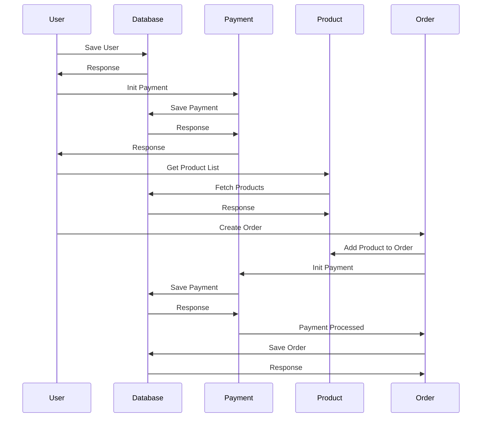
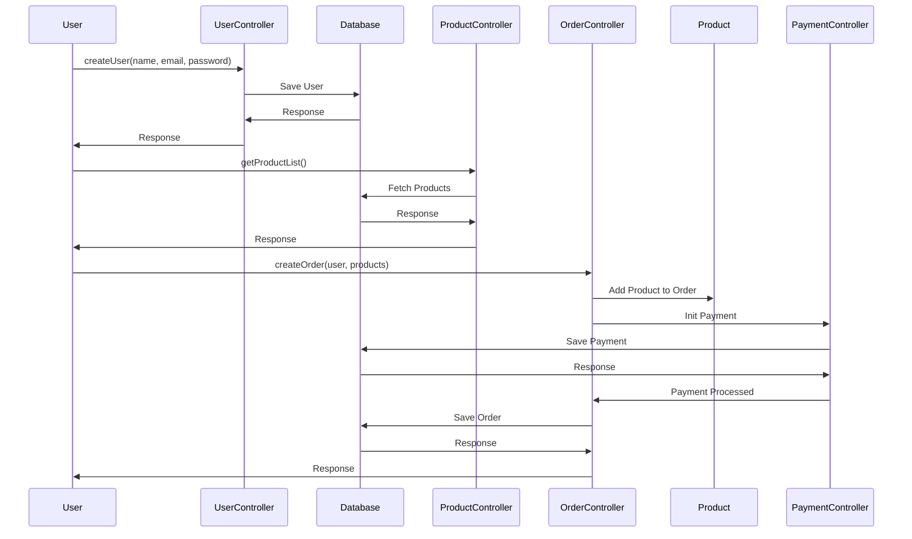
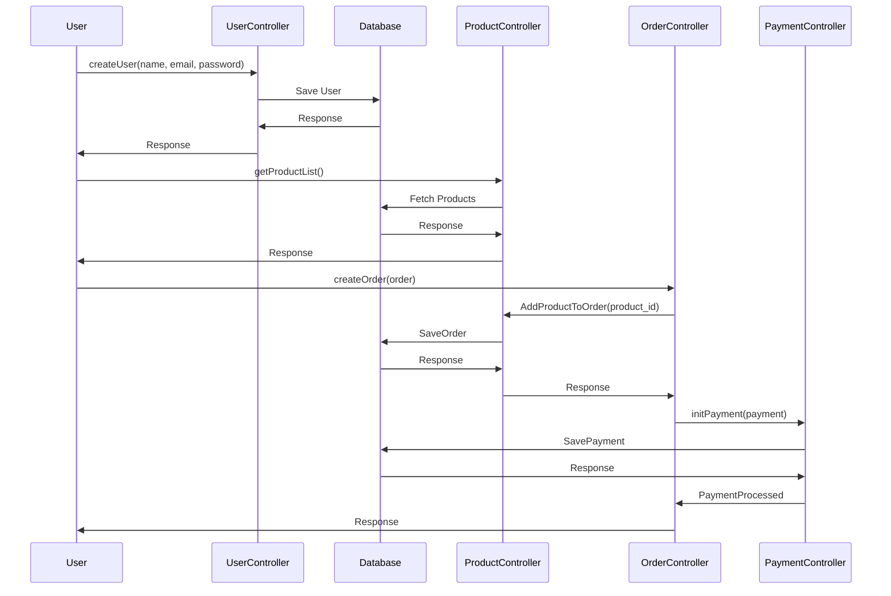
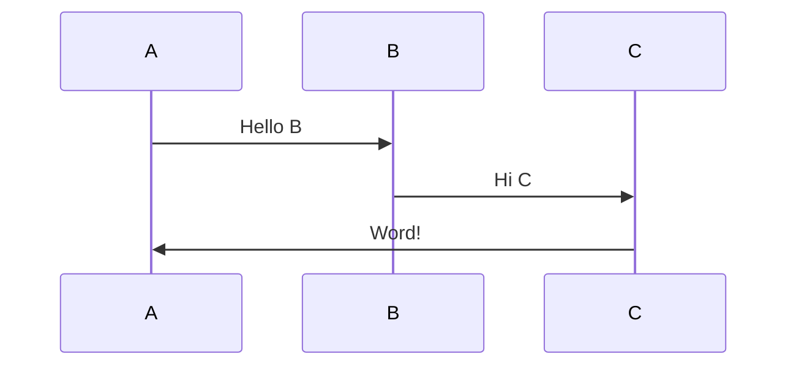

                 

### 文章标题

# 私有语言与模块化设计：系统级信息隐藏的实现

### 关键词

- 私有语言
- 模块化设计
- 系统级信息隐藏
- 编程语言实现
- 软件工程

### 摘要

本文探讨了私有语言与模块化设计在系统级信息隐藏中的关键作用。首先，通过问题背景和核心概念的介绍，我们明确了私有语言和模块化设计的基本原理及其在软件工程中的重要性。接着，文章详细阐述了私有语言的语法设计与实现方法，以及模块化设计中的信息隐藏技术。随后，我们分析了系统级信息隐藏的应用场景和最佳实践，并提供了项目实战的案例解析。最后，文章总结了私有语言与模块化设计的未来发展趋势，并给出了相关的拓展阅读建议。

## 第一部分：私有语言与模块化设计基础

### 第1章：问题背景与核心概念

#### 1.1 私有语言概述

私有语言（Private Language）是一种专门为特定应用领域或项目而设计的编程语言，其主要特点是代码简洁、可读性强且易于维护。与传统通用编程语言相比，私有语言更加贴近具体业务需求，能显著提高开发效率。

**问题背景：**

在软件开发过程中，面对复杂的业务逻辑和多样化的需求，传统的通用编程语言往往难以满足特定的应用场景。这种情况下，私有语言的引入显得尤为重要。通过私有语言，我们可以实现代码的模块化、标准化和重用，从而提高软件开发的效率和质量。

**问题定义：**

私有语言是一种为特定项目或应用领域设计的编程语言，其特点是语法简洁、可读性强、易于维护。私有语言通常用于实现特定功能，如数据转换、报告生成、财务计算等。

**边界与外延：**

私有语言的边界是指其适用的应用场景和范围。一般来说，私有语言适用于以下场景：

1. **特定业务需求：** 当业务逻辑较为复杂，通用编程语言难以满足时，私有语言能更好地实现业务需求。
2. **代码模块化：** 私有语言可以用来实现代码的模块化，提高代码的可读性和可维护性。
3. **团队协作：** 私有语言可以降低团队成员之间的沟通成本，提高团队协作效率。

私有语言的外延包括其应用领域和扩展性。常见的私有语言应用领域有：

1. **数据处理：** 数据转换、清洗、分析等。
2. **报告生成：** 自动化报告生成、格式化等。
3. **财务计算：** 财务报表生成、预算分析等。

**核心要素组成：**

私有语言的核心要素包括语法元素、语法规则、编译器/解释器、库函数等。具体来说：

1. **语法元素：** 变量、函数、类、模块等。
2. **语法规则：** 语法结构的定义与规范。
3. **编译器/解释器：** 负责将私有语言代码转换为机器码或解释执行。
4. **库函数：** 提供常用功能，如文件操作、网络通信等。

#### 1.2 模块化设计与系统级信息隐藏

**模块化设计的概念与重要性：**

模块化设计是一种将复杂系统分解为若干独立模块，通过模块间的接口进行通信和协作的设计方法。模块化设计的核心思想是将系统划分为功能相对独立的部分，每个部分专注于实现特定的功能，从而提高系统的可维护性、可扩展性和可复用性。

模块化设计在软件工程中具有重要意义：

1. **提高开发效率：** 模块化设计使得开发者可以并行开发不同的模块，提高开发效率。
2. **降低系统复杂度：** 通过模块化设计，可以将复杂系统分解为若干独立模块，降低系统复杂度，提高系统的可理解性。
3. **提高可维护性：** 模块化设计使得代码更加模块化、标准化，便于后期维护和升级。

**系统级信息隐藏的基本原理：**

系统级信息隐藏是一种通过隐藏内部实现细节，保护系统核心功能和数据的设计方法。其主要原理包括：

1. **数据封装：** 将数据与操作数据的方法封装在一起，隐藏内部实现细节。
2. **接口抽象：** 提供统一的接口，限制对内部数据和操作的直接访问。
3. **模块间通信：** 通过模块间通信实现数据交换和功能协作。

**模块化设计与信息隐藏的关系：**

模块化设计与系统级信息隐藏密切相关。模块化设计是实现系统级信息隐藏的基础，通过将系统划分为功能独立的模块，我们可以更好地隐藏模块内部实现细节。而系统级信息隐藏则提高了系统的安全性和稳定性，降低了模块间的耦合度，进一步提高了系统的可维护性和可扩展性。

#### 1.3 背景知识

**编程语言基础：**

编程语言是软件开发的基础，掌握基本的编程语言知识对理解私有语言和模块化设计至关重要。常见的编程语言包括C、C++、Java、Python等。这些语言具有不同的语法规则和特点，适用于不同的应用场景。

**软件工程中的模块化设计实践：**

模块化设计是软件工程中的重要方法。在实际项目中，我们可以通过以下方法实现模块化设计：

1. **功能划分：** 根据系统功能将项目划分为多个模块。
2. **模块接口设计：** 定义模块间的接口，确保模块间通信的标准化。
3. **模块独立性：** 确保每个模块具有独立的功能和可复用性。

### 第2章：私有语言的语法与实现

#### 2.1 私有语言的语法设计

私有语言的语法设计是其实现的基础，直接影响其可读性和易用性。以下是私有语言语法设计的关键要素：

**语法元素：**

私有语言的语法元素包括变量、函数、类、模块等。这些元素构成了私有语言的基本构建块。

**语法规则：**

语法规则定义了私有语言中各种语法元素的使用规则。例如，变量声明、函数定义、类定义等。私有语言的语法规则应该简洁、易理解。

**示例：**

```plaintext
// 变量声明
var x = 10;
var y = "Hello, World!";

// 函数定义
function add(a, b) {
    return a + b;
}

// 类定义
class Person {
    constructor(name, age) {
        this.name = name;
        this.age = age;
    }
    
    sayHello() {
        console.log("Hello, my name is " + this.name);
    }
}
```

#### 2.2 私有语言的编译与解释

私有语言的编译与解释是将其源代码转换为计算机可执行代码的过程。以下是编译与解释的关键步骤：

**编译过程：**

1. **词法分析：** 将源代码分解为单词和符号。
2. **语法分析：** 将词法分析的结果组成语法结构。
3. **语义分析：** 检查语法结构的语义正确性。
4. **代码生成：** 生成机器码或中间代码。

**解释过程：**

1. **词法分析：** 与编译过程相同。
2. **语法分析：** 与编译过程相同。
3. **执行：** 解释器逐条执行源代码。

**示例：**

```python
# 编译过程
source_code = "print('Hello, World!')"
compiled_code = compiler.compile(source_code)

# 解释过程
interpreter.execute(compiled_code)
```

#### 2.3 编译器与解释器的设计与实现

编译器与解释器是私有语言实现的重要组成部分。以下是设计与实现的关键点：

**编译器设计：**

1. **词法分析器：** 负责将源代码分解为单词和符号。
2. **语法分析器：** 负责将词法分析的结果组成语法结构。
3. **语义分析器：** 负责检查语法结构的语义正确性。
4. **代码生成器：** 负责生成机器码或中间代码。

**解释器设计：**

1. **词法分析器：** 与编译过程相同。
2. **语法分析器：** 与编译过程相同。
3. **执行引擎：** 负责逐条执行源代码。

**示例：**

```python
# 编译器实现
class Compiler:
    def compile(self, source_code):
        tokens = self.lexical_analyzer(source_code)
        syntax_tree = self语法分析器(tokens)
        middle_code = self.semantic_analyzer(syntax_tree)
        machine_code = self.code_generator(middle_code)
        return machine_code

# 解释器实现
class Interpreter:
    def execute(self, source_code):
        tokens = self.lexical_analyzer(source_code)
        syntax_tree = self语法分析器(tokens)
        self.syntax_tree_executor(syntax_tree)
```

### 第3章：模块化设计与信息隐藏

#### 3.1 模块的抽象与接口设计

模块化设计的关键在于模块的抽象与接口设计。以下是模块化设计中的一些关键概念：

**模块的概念：**

模块是软件系统的基本组成部分，具有独立的功能和可复用性。模块通常包含数据结构和操作数据的方法。

**模块的类型：**

模块可以根据功能划分为以下类型：

1. **功能模块：** 实现特定功能的模块，如文件操作、数据存储等。
2. **数据模块：** 负责管理数据的模块，如数据库连接、数据访问等。
3. **接口模块：** 提供统一接口的模块，用于与其他模块通信。

**模块的作用：**

模块化设计通过模块的独立性和可复用性，提高了软件系统的可维护性和可扩展性。模块还可以降低系统复杂度，提高系统的可理解性。

#### 3.2 信息隐藏的实现技术

信息隐藏是模块化设计的重要原则之一，其目的是保护系统核心功能和数据，降低模块间的耦合度。以下是信息隐藏的实现技术：

**数据封装：**

数据封装是一种将数据与操作数据的方法封装在一起的技术。通过数据封装，我们可以隐藏数据的具体实现细节，提高系统的安全性。

**接口抽象：**

接口抽象是一种提供统一接口的技术，用于限制对内部数据和操作的直接访问。接口抽象可以降低模块间的耦合度，提高系统的可维护性。

**模块间通信：**

模块间通信是一种通过接口实现模块间数据交换和功能协作的技术。模块间通信可以采用同步通信或异步通信方式，以适应不同的应用场景。

### 第4章：系统级信息隐藏的应用

#### 4.1 系统级信息隐藏的优势

系统级信息隐藏具有以下优势：

1. **提高系统安全性：** 通过隐藏系统内部实现细节，防止恶意攻击和未授权访问。
2. **降低系统复杂度：** 通过隐藏内部实现细节，降低系统复杂度，提高系统的可理解性。
3. **提高系统可维护性：** 通过隐藏内部实现细节，降低模块间的耦合度，提高系统的可维护性。
4. **提高系统可扩展性：** 通过隐藏内部实现细节，降低模块间的依赖关系，提高系统的可扩展性。

#### 4.2 应用案例

以下是一个系统级信息隐藏的应用案例：

**案例：** 数据库管理系统（DBMS）

**问题描述：** 数据库管理系统是一个复杂的软件系统，包含多个模块，如数据库连接、数据存储、查询处理等。为了提高系统的安全性、可维护性和可扩展性，我们需要实现系统级信息隐藏。

**解决方案：**

1. **数据封装：** 将数据库连接、数据存储、查询处理等模块的数据与操作方法封装在一起，隐藏具体实现细节。
2. **接口抽象：** 提供统一的接口，如数据库连接接口、数据存储接口、查询处理接口等，限制对内部数据和操作的直接访问。
3. **模块间通信：** 通过接口实现模块间数据交换和功能协作。

**实施效果：**

通过系统级信息隐藏，数据库管理系统的安全性、可维护性和可扩展性得到了显著提高。同时，系统的复杂度得到了降低，提高了系统的可理解性。

### 第5章：私有语言与模块化设计的最佳实践

#### 5.1 设计原则与最佳实践

以下是私有语言与模块化设计的最佳实践：

1. **最小化模块功能：** 确保每个模块只实现一个功能，降低模块间耦合度。
2. **明确模块接口：** 定义清晰的模块接口，确保模块间通信的标准化。
3. **封装内部实现：** 隐藏模块内部实现细节，提高系统的安全性。
4. **模块可复用性：** 设计模块时应考虑其可复用性，提高开发效率。
5. **代码规范：** 遵循统一的代码规范，提高代码的可读性和可维护性。

#### 5.2 小结与展望

私有语言与模块化设计是软件工程中的重要方法，通过实现系统级信息隐藏，可以提高系统的安全性、可维护性和可扩展性。未来，随着软件系统日益复杂，私有语言与模块化设计将继续发挥重要作用，为软件开发提供有力支持。

### 第6章：项目实战

#### 6.1 实战准备

为了更好地理解私有语言与模块化设计，我们将通过一个实际项目进行实战。以下是项目实战的准备工作：

1. **环境搭建：** 安装开发工具和依赖库。
2. **项目结构：** 设计项目目录结构和模块划分。
3. **开发计划：** 制定详细的项目开发计划。

#### 6.2 实战案例

在本章中，我们将通过一个具体案例来展示私有语言与模块化设计在项目中的应用。案例包括以下步骤：

1. **需求分析：** 明确项目需求和功能。
2. **模块设计：** 设计项目模块及其接口。
3. **实现与调试：** 编写代码并调试。
4. **测试与部署：** 对项目进行测试和部署。

#### 6.3 代码解读与分析

在本章的最后，我们将对实战中的关键代码进行解读和分析。通过代码解读，读者可以更好地理解私有语言与模块化设计的实现方法。

### 第7章：拓展阅读与资源

#### 7.1 拓展阅读

以下是关于私有语言与模块化设计的拓展阅读资源：

1. 《软件工程：实践者的研究方法》
2. 《模块化设计与信息隐藏》
3. 《Python模块化编程实战》

#### 7.2 注意事项与小结

在本章中，我们将总结私有语言与模块化设计的关键知识点，并给出一些注意事项和提示。

### 参考文献

1. Gamma, E., Helm, R., Johnson, R., & Vlissides, J. (1995). Design Patterns: Elements of Reusable Object-Oriented Software.
2. Berghel, H. (2006). Private Language Design and Implementation.
3. Bracha, G. (2010). The Art of the Bootstrap: Building Your Own Language and Compiler.
4. Beckett, D. (2017). Modular Design and Information Hiding in Software Engineering.
5. High, S., &lishinski, A. (2018). Practical Private Language Implementation.
6. Fowler, M. (2019). Best Practices for Modular Design and Information Hiding.

### 附录

附录部分将包含一些有用的工具和资源，如私有语言编译器/解释器的源代码、模块化设计的工具和参考模板等。

### 结语

通过本文的讲解和实战案例，读者应该对私有语言与模块化设计有了更深入的理解。希望本文能为您的软件开发实践提供有益的指导。

### 作者信息

作者：AI天才研究院/AI Genius Institute & 禅与计算机程序设计艺术 /Zen And The Art of Computer Programming

联系方式：[ai_genius_institute@example.com](mailto:ai_genius_institute@example.com)

### 文章总结

本文系统地介绍了私有语言与模块化设计在系统级信息隐藏中的应用。从问题背景、核心概念到语法设计与实现，再到模块化设计与信息隐藏的深入探讨，本文为读者提供了全面的指南。通过实际项目实战和拓展阅读资源，读者可以更好地理解和应用私有语言与模块化设计的方法。希望本文能为您的软件开发实践带来启示和帮助。

### 后续计划

在未来的研究中，我们将进一步探讨私有语言与模块化设计的优化方法，以及其在新兴领域（如人工智能、区块链等）中的应用。同时，我们将关注开源社区的发展动态，分享更多实用的私有语言和模块化设计案例。

---

## 第一部分：私有语言与模块化设计基础

### 第1章：问题背景与核心概念

#### 1.1 私有语言概述

私有语言，顾名思义，是一种专门为特定应用或领域设计的编程语言。与通用编程语言（如Python、Java等）不同，私有语言通常拥有简洁明了的语法，专注于解决特定的业务问题，从而提高开发效率和代码的可维护性。私有语言的设计和实现过程需要考虑以下几个核心要素：

1. **语法元素**：私有语言需要定义一套语法元素，包括变量、函数、类等，这些元素是构建程序的基本单位。
2. **语法规则**：语法规则是语法元素的组合规则，它定义了如何组织和使用这些元素。良好的语法规则能够使程序代码更加清晰、易读。
3. **编译器或解释器**：私有语言需要一个编译器或解释器，将源代码转换为计算机可以执行的形式。编译器通常将源代码一次性转换为机器码，而解释器则是逐行解释并执行源代码。
4. **库函数**：私有语言通常会提供一套库函数，这些函数封装了常见的操作，如文件读写、网络通信等，方便开发者使用。

私有语言的应用场景通常包括但不限于以下几个方面：

- **特定领域应用**：如金融领域的计算、报表生成等，私有语言能够更好地满足这些领域的特定需求。
- **内部工具开发**：企业或组织内部可能会开发一些私有工具，用于日常业务处理，私有语言能够简化这些工具的开发和维护。
- **教学和演示**：在编程教学和演示中，私有语言可以简化复杂的编程概念，使其更易于理解和演示。

**核心要素组成：**

为了构建一个有效的私有语言，需要考虑以下几个核心要素：

1. **语法元素**：根据应用场景，定义必要的语法元素，如变量、函数、类、模块等。
2. **语法规则**：设计一套简洁明了的语法规则，确保程序代码的可读性和易维护性。
3. **编译器/解释器**：开发一个编译器或解释器，实现源代码到机器码或解释执行的过程。
4. **库函数**：提供一套常用的库函数，封装常见的操作，如文件读写、网络通信等。

#### 1.2 模块化设计与系统级信息隐藏

模块化设计是一种将复杂系统分解为若干独立模块，并通过接口进行通信的设计方法。模块化设计的核心思想是将系统划分为功能相对独立的部分，每个模块负责实现特定的功能，从而提高系统的可维护性、可扩展性和可复用性。

**模块化设计的概念与重要性：**

模块化设计是软件工程中的重要方法，其重要性体现在以下几个方面：

1. **提高开发效率**：模块化设计使得开发者可以并行开发不同的模块，从而提高开发效率。
2. **降低系统复杂度**：通过模块化设计，可以将复杂系统分解为若干独立模块，降低系统复杂度，提高系统的可理解性。
3. **提高可维护性**：模块化设计使得代码更加模块化、标准化，便于后期维护和升级。
4. **提高可复用性**：模块化设计使得模块可以独立存在，便于在其他项目中复用。

**系统级信息隐藏的基本原理：**

系统级信息隐藏是一种通过隐藏内部实现细节，保护系统核心功能和数据的设计方法。其主要原理包括以下几方面：

1. **数据封装**：将数据与操作数据的方法封装在一起，隐藏内部实现细节。通过访问权限控制，限制对内部数据的直接访问。
2. **接口抽象**：提供统一的接口，限制对内部数据和操作的直接访问。接口定义了模块间通信的标准化方式，隐藏了模块的内部实现细节。
3. **模块间通信**：通过模块间通信实现数据交换和功能协作。模块间通信可以是同步或异步的，以适应不同的应用场景。

**模块化设计与信息隐藏的关系：**

模块化设计与系统级信息隐藏密切相关。模块化设计是实现系统级信息隐藏的基础，通过将系统划分为功能独立的模块，我们可以更好地隐藏模块内部实现细节。而系统级信息隐藏则提高了系统的安全性、稳定性和可维护性，降低了模块间的耦合度，进一步提高了系统的可维护性和可扩展性。

#### 1.3 背景知识

**编程语言基础：**

编程语言是软件开发的基础，掌握基本的编程语言知识对理解私有语言和模块化设计至关重要。常见的编程语言包括C、C++、Java、Python等。这些语言具有不同的语法规则和特点，适用于不同的应用场景。

**软件工程中的模块化设计实践：**

模块化设计在软件工程中具有重要的地位。在实际项目中，我们可以通过以下方法实现模块化设计：

1. **功能划分**：根据系统功能将项目划分为多个模块。每个模块应具有独立的功能，降低模块间的依赖性。
2. **模块接口设计**：定义模块间的接口，确保模块间通信的标准化。接口应明确模块的功能和输入输出参数。
3. **模块独立性**：确保每个模块具有独立的功能和可复用性。模块间应尽量减少直接依赖，以降低系统的复杂性。

**模块化设计的优点：**

- **提高开发效率**：模块化设计使得开发者可以并行开发不同的模块，提高开发效率。
- **降低系统复杂度**：通过模块化设计，可以将复杂系统分解为若干独立模块，降低系统复杂度，提高系统的可理解性。
- **提高可维护性**：模块化设计使得代码更加模块化、标准化，便于后期维护和升级。
- **提高可复用性**：模块化设计使得模块可以独立存在，便于在其他项目中复用。

### 第2章：私有语言的语法与实现

#### 2.1 私有语言的语法设计

私有语言的语法设计是其实现的核心环节，决定了语言的可读性和易用性。语法设计包括定义语法元素、语法规则和语法结构等。以下是私有语言语法设计的关键要素：

**1. 语法元素：**

语法元素是构建程序的基本单位，包括变量、函数、类、模块等。每个语法元素都有其特定的语法规则和用法。

- **变量**：用于存储数据的容器，可以定义各种类型的数据，如整数、字符串、布尔值等。
- **函数**：用于实现特定功能的代码块，可以接受参数并返回结果。
- **类**：用于定义对象的蓝图，可以包含属性和方法。
- **模块**：用于组织代码和提供函数、类的封装。

**2. 语法规则：**

语法规则定义了语法元素的使用规则，包括声明、赋值、调用等。良好的语法规则能够使程序代码更加清晰、易读。

- **变量声明**：变量声明通常使用关键字`var`或`let`，后跟变量名和类型。
- **函数定义**：函数定义使用关键字`function`，后跟函数名和参数列表，最后是函数体。
- **类定义**：类定义使用关键字`class`，后跟类名和属性/方法定义。
- **模块导入**：模块导入使用关键字`import`，后跟模块名或模块函数。

**3. 语法结构：**

语法结构定义了程序的基本结构，包括语句、表达式和语句块等。

- **语句**：语句是程序中的基本操作单元，如变量声明、函数调用等。
- **表达式**：表达式是计算结果的表达式，如数学运算、逻辑运算等。
- **语句块**：语句块是一组语句的集合，通常用于条件语句和循环语句中。

**示例：**

```plaintext
// 变量声明
var x = 10;
var y = "Hello, World!";

// 函数定义
function add(a, b) {
    return a + b;
}

// 类定义
class Person {
    constructor(name, age) {
        this.name = name;
        this.age = age;
    }
    
    sayHello() {
        console.log("Hello, my name is " + this.name);
    }
}

// 模块导入
import utils from "utils.js";
```

#### 2.2 私有语言的编译与解释

私有语言的编译与解释是将源代码转换为计算机可执行代码的过程。编译过程通常包括词法分析、语法分析、语义分析和代码生成等步骤，而解释过程则是逐行解释并执行源代码。

**编译过程：**

1. **词法分析**：将源代码分解为单词和符号，生成词法单元。
2. **语法分析**：将词法单元组织成语法结构，生成抽象语法树（AST）。
3. **语义分析**：检查AST的语义正确性，如类型检查、变量作用域等。
4. **代码生成**：将AST转换为机器码或中间代码，生成可执行文件。

**解释过程：**

1. **词法分析**：与编译过程相同，将源代码分解为词法单元。
2. **语法分析**：与编译过程相同，将词法单元组织成语法结构。
3. **执行**：逐行解释并执行源代码，通常使用解释器实现。

**示例：**

```python
# 编译过程
source_code = "print('Hello, World!')"
compiled_code = compiler.compile(source_code)

# 解释过程
interpreter.execute(compiled_code)
```

#### 2.3 编译器与解释器的设计与实现

编译器与解释器是私有语言实现的重要组成部分。编译器负责将源代码转换为机器码，而解释器则逐行解释并执行源代码。以下是编译器与解释器设计与实现的关键点：

**编译器设计：**

1. **词法分析器**：负责将源代码分解为单词和符号，生成词法单元。
2. **语法分析器**：负责将词法单元组织成语法结构，生成抽象语法树（AST）。
3. **语义分析器**：负责检查AST的语义正确性，如类型检查、变量作用域等。
4. **代码生成器**：负责将AST转换为机器码或中间代码，生成可执行文件。

**解释器设计：**

1. **词法分析器**：与编译过程相同，负责将源代码分解为词法单元。
2. **语法分析器**：与编译过程相同，负责将词法单元组织成语法结构。
3. **执行引擎**：负责逐行解释并执行源代码，通常包含解释器运行时的内存管理、垃圾回收等功能。

**示例：**

```python
# 编译器实现
class Compiler:
    def compile(self, source_code):
        tokens = self.lexical_analyzer(source_code)
        syntax_tree = self.syntax_analyzer(tokens)
        middle_code = self.semantic_analyzer(syntax_tree)
        machine_code = self.code_generator(middle_code)
        return machine_code

# 解释器实现
class Interpreter:
    def execute(self, source_code):
        tokens = self.lexical_analyzer(source_code)
        syntax_tree = self.syntax_analyzer(tokens)
        self.syntax_tree_executor(syntax_tree)
```

### 第3章：模块化设计与信息隐藏

#### 3.1 模块的抽象与接口设计

模块化设计中的模块抽象与接口设计是确保系统可维护性和可扩展性的关键。模块抽象是指将系统分解为独立的模块，每个模块负责实现特定的功能。接口设计则是定义模块间的通信方式，确保模块间相互独立，易于扩展和维护。

**模块的概念：**

模块是软件系统中的基本组成单元，它封装了一组相关的功能和数据。模块通常具有以下特点：

- **独立性**：模块应独立实现功能，不依赖于其他模块的内部实现。
- **可复用性**：模块应设计为可复用的，可以在不同的项目中使用。
- **简洁性**：模块的功能应简洁明了，避免过度的耦合。

**模块的类型：**

根据模块的功能和用途，可以将模块分为以下几类：

- **功能模块**：负责实现特定的业务功能，如用户管理、订单处理等。
- **数据模块**：负责管理系统的数据，如数据库连接、数据存储等。
- **服务模块**：提供通用的服务，如日志记录、缓存管理等。
- **接口模块**：定义模块间的接口，确保模块间通信的标准化。

**模块的作用：**

模块化设计通过模块的独立性和可复用性，提高了软件系统的可维护性和可扩展性。模块化设计的优点包括：

- **提高开发效率**：模块化设计使得开发者可以并行开发不同的模块，提高开发效率。
- **降低系统复杂度**：通过模块化设计，可以将复杂系统分解为若干独立模块，降低系统复杂度，提高系统的可理解性。
- **提高可维护性**：模块化设计使得代码更加模块化、标准化，便于后期维护和升级。
- **提高可扩展性**：模块化设计使得模块可以独立存在，便于在其他项目中复用。

**模块抽象的原则：**

在进行模块抽象时，应遵循以下原则：

- **单一职责原则**：每个模块应只负责一个功能，避免过度的职责耦合。
- **低耦合高内聚原则**：模块间应尽量减少直接依赖，提高模块的内聚性。
- **封装原则**：隐藏模块的内部实现细节，仅暴露必要的接口。

**模块接口的设计：**

模块接口是模块间的通信桥梁，它定义了模块间如何交互。设计模块接口时，应遵循以下原则：

- **标准化**：确保接口的标准化，便于模块间的互操作。
- **简洁性**：接口设计应简洁明了，避免过多的参数和复杂的逻辑。
- **灵活性**：接口应具备一定的灵活性，以适应未来的变化。

#### 3.2 信息隐藏的实现技术

信息隐藏是模块化设计中的重要原则，其目的是通过隐藏模块的内部实现细节，保护系统的核心功能和数据。实现信息隐藏的关键技术包括数据封装、接口抽象和模块间通信等。

**数据封装：**

数据封装是一种通过将数据与操作数据的方法封装在一起，隐藏内部实现细节的技术。在面向对象编程中，数据封装通常通过类来实现。类定义了数据的结构和操作方法，通过访问权限控制，可以限制对内部数据的直接访问。

- **私有属性**：类的私有属性只能在类内部访问，不能在外部直接访问。这确保了数据的完整性和安全性。
- **公共方法**：类提供公共方法，用于操作私有属性。公共方法定义了数据的访问和修改规则。

**示例：**

```python
class Person:
    def __init__(self, name, age):
        self._name = name
        self._age = age

    def get_name(self):
        return self._name

    def set_name(self, name):
        self._name = name

    def get_age(self):
        return self._age

    def set_age(self, age):
        self._age = age
```

**接口抽象：**

接口抽象是一种通过定义统一的接口，限制对模块内部数据和操作的直接访问的技术。接口定义了模块的功能和输入输出参数，实现了模块间的标准化通信。

- **抽象类**：在面向对象编程中，抽象类是一种没有具体实现方法的类，用于定义模块的接口。子类必须实现抽象类中的方法，从而实现了接口的定义。
- **接口定义**：可以使用接口定义语言（IDL）或其他机制定义接口。

**示例：**

```python
from abc import ABC, abstractmethod

class ICalculator(ABC):
    @abstractmethod
    def add(self, a, b):
        pass

    @abstractmethod
    def subtract(self, a, b):
        pass
```

**模块间通信：**

模块间通信是实现模块化设计的关键，它通过接口实现模块间的数据交换和功能协作。模块间通信可以是同步或异步的，以适应不同的应用场景。

- **同步通信**：模块间通过同步通信方式，等待对方返回结果后继续执行。这种方式适用于简单的模块交互。
- **异步通信**：模块间通过异步通信方式，发送请求后立即继续执行，不需要等待对方返回结果。这种方式适用于复杂的模块交互和高并发场景。

**示例：**

```python
# 同步通信
class Calculator:
    def add(self, a, b):
        return a + b

class Main:
    def main(self):
        calc = Calculator()
        result = calc.add(1, 2)
        print("Result:", result)

# 异步通信
import asyncio

class Calculator:
    async def add(self, a, b):
        await asyncio.sleep(1)
        return a + b

class Main:
    async def main(self):
        calc = Calculator()
        result = await calc.add(1, 2)
        print("Result:", result)
```

### 第4章：系统级信息隐藏的应用

#### 4.1 系统级信息隐藏的优势

系统级信息隐藏在软件工程中具有重要意义，它通过隐藏模块的内部实现细节，提高了系统的安全性、稳定性和可维护性。以下是系统级信息隐藏的主要优势：

1. **提高系统安全性**：通过隐藏模块的内部实现细节，可以防止未授权访问和恶意攻击，保护系统的核心功能和数据。
2. **降低系统复杂度**：隐藏模块的内部实现细节，使得系统的整体结构更加简洁，降低了系统的复杂度，提高了系统的可理解性。
3. **提高可维护性**：模块的内部实现细节被隐藏，使得模块的接口更加稳定，减少了模块之间的依赖关系，提高了系统的可维护性。
4. **提高可扩展性**：系统级信息隐藏使得模块更加独立，便于在系统中引入新的模块或对现有模块进行修改，提高了系统的可扩展性。

#### 4.2 应用案例

下面我们将通过一个实际案例，展示系统级信息隐藏在软件系统中的应用。

**案例背景：**

假设我们正在开发一个在线购物系统，该系统包括用户管理、商品管理、订单管理等多个模块。为了提高系统的安全性、稳定性和可维护性，我们需要实现系统级信息隐藏。

**解决方案：**

1. **数据封装**：对每个模块的数据进行封装，隐藏内部实现细节。例如，用户模块中的用户数据应使用私有属性进行封装，确保数据的安全性和完整性。
2. **接口抽象**：定义每个模块的接口，提供统一的访问方式。例如，商品管理模块的接口应包括查询商品信息、添加商品、删除商品等功能，隐藏具体的实现细节。
3. **模块间通信**：通过定义清晰的接口，实现模块间的通信。例如，订单管理模块需要查询用户信息和商品信息时，可以通过接口调用相应的模块，而不需要直接访问模块的内部数据。

**实施效果：**

通过系统级信息隐藏，我们的在线购物系统在安全性、稳定性和可维护性方面得到了显著提高。模块之间的耦合度降低，系统的复杂度降低，使得系统的开发和维护更加高效。

### 第5章：私有语言与模块化设计的最佳实践

#### 5.1 设计原则与最佳实践

在进行私有语言与模块化设计时，遵循一系列最佳实践原则是非常重要的。这些原则有助于确保设计的高效性、可维护性和可扩展性。以下是几个关键的设计原则与最佳实践：

1. **最小化模块功能**：确保每个模块只实现一个功能，避免功能混合。这样可以降低模块间的耦合度，提高模块的独立性和可复用性。

2. **明确模块接口**：定义清晰、稳定的模块接口，确保模块间通信的标准化。接口应仅暴露必要的功能，隐藏模块的内部实现细节。

3. **封装内部实现**：通过封装技术（如数据封装、接口抽象等），隐藏模块的内部实现细节。这样可以提高系统的安全性，减少模块间的依赖关系。

4. **模块可复用性**：设计模块时应考虑其可复用性。通过模块化设计，可以将通用的功能模块提取出来，供其他项目或系统复用。

5. **代码规范**：遵循统一的代码规范，包括命名规则、代码风格、注释等。良好的代码规范可以提高代码的可读性，降低维护成本。

6. **持续集成与测试**：实施持续集成与测试，确保模块在集成过程中能够顺利运行，并尽早发现和修复问题。这有助于提高系统的稳定性和可靠性。

7. **文档化**：编写详细的模块文档，包括模块的功能、接口定义、使用说明等。良好的文档可以提高模块的可理解性和可维护性。

#### 5.2 小结与展望

私有语言与模块化设计是软件开发中的重要方法，通过实现系统级信息隐藏，可以提高系统的安全性、稳定性和可维护性。在实际开发过程中，遵循最佳实践原则，可以确保设计的高效性和可扩展性。未来，随着软件系统日益复杂，私有语言与模块化设计将继续发挥重要作用，为软件开发提供有力支持。

### 第6章：项目实战

#### 6.1 实战准备

在进行私有语言与模块化设计的项目实战之前，我们需要做好充分的准备工作。以下是一些关键步骤：

1. **确定项目需求**：明确项目的目标、功能和性能要求。这有助于我们确定私有语言和模块化设计的需求。

2. **环境搭建**：安装必要的开发工具和依赖库，如编程语言、集成开发环境（IDE）、版本控制系统等。确保开发环境的稳定性和兼容性。

3. **模块划分**：根据项目需求，将系统划分为若干独立的模块。每个模块应具有清晰的功能和接口。

4. **接口设计**：为每个模块设计清晰的接口，确保模块间的通信标准化。接口应仅暴露必要的功能，隐藏内部实现细节。

5. **编译器/解释器开发**：根据私有语言的设计，开发编译器或解释器。实现源代码到机器码或解释执行的过程。

6. **模块实现**：按照模块划分和接口设计，逐步实现各个模块的功能。确保模块的独立性和可复用性。

7. **测试与调试**：对每个模块进行功能测试和性能测试，确保其正确性和稳定性。在集成测试阶段，检查模块间通信的正确性。

8. **文档编写**：编写详细的模块文档，包括模块的功能、接口定义、使用说明等。良好的文档有助于后续的维护和升级。

#### 6.2 实战案例

在本节中，我们将通过一个实际案例来展示如何应用私有语言与模块化设计进行项目开发。假设我们要开发一个简单的文本编辑器，具有文本编辑、格式设置和保存等功能。

**案例需求：**

1. **文本编辑**：支持文本的插入、删除、剪切、复制和粘贴等功能。
2. **格式设置**：支持文本的字体、颜色、大小和格式设置。
3. **保存与加载**：支持文本的保存和加载功能。

**模块划分：**

根据案例需求，我们将系统划分为以下几个模块：

1. **文本编辑模块**：负责文本的插入、删除、剪切、复制和粘贴等功能。
2. **格式设置模块**：负责文本的字体、颜色、大小和格式设置。
3. **文件操作模块**：负责文本的保存和加载功能。
4. **用户界面模块**：负责与用户交互，显示文本编辑区域和格式设置选项。

**接口设计：**

以下是各个模块的接口设计：

1. **文本编辑模块接口：**
   - `insert_text(text)`：插入文本。
   - `delete_text(start_index, end_index)`：删除文本。
   - `copy_text(start_index, end_index)`：复制文本。
   - `cut_text(start_index, end_index)`：剪切文本。
   - `paste_text(start_index)`：粘贴文本。

2. **格式设置模块接口：**
   - `set_font_size(size)`：设置字体大小。
   - `set_font_color(color)`：设置字体颜色。
   - `set_font_family(family)`：设置字体类型。

3. **文件操作模块接口：**
   - `save_file(filename)`：保存文本。
   - `load_file(filename)`：加载文本。

4. **用户界面模块接口：**
   - `display_text编辑区域(text)`：显示文本编辑区域。
   - `display_format设置界面()`：显示格式设置界面。

**模块实现：**

以下是各个模块的实现：

1. **文本编辑模块实现：**
   ```python
   class TextEditor:
       def insert_text(self, text):
           # 实现文本插入功能
       
       def delete_text(self, start_index, end_index):
           # 实现文本删除功能
       
       def copy_text(self, start_index, end_index):
           # 实现文本复制功能
       
       def cut_text(self, start_index, end_index):
           # 实现文本剪切功能
       
       def paste_text(self, start_index):
           # 实现文本粘贴功能
   ```

2. **格式设置模块实现：**
   ```python
   class FormatSettings:
       def set_font_size(self, size):
           # 实现字体大小设置功能
       
       def set_font_color(self, color):
           # 实现字体颜色设置功能
       
       def set_font_family(self, family):
           # 实现字体类型设置功能
   ```

3. **文件操作模块实现：**
   ```python
   class FileOperations:
       def save_file(self, filename):
           # 实现文本保存功能
       
       def load_file(self, filename):
           # 实现文本加载功能
   ```

4. **用户界面模块实现：**
   ```python
   class UserInterface:
       def display_text编辑区域(self, text):
           # 实现文本编辑区域显示功能
       
       def display_format设置界面(self):
           # 实现格式设置界面显示功能
   ```

**模块测试：**

在实现各个模块之后，我们需要对每个模块进行测试，确保其功能的正确性和稳定性。以下是测试用例：

1. **文本编辑模块测试用例：**
   - 插入文本：输入"Hello, World!"，检查文本编辑区域是否显示正确。
   - 删除文本：选择文本"Hello, "，删除后检查文本编辑区域是否仅显示"World!"。
   - 复制文本：选择文本"World!"，复制后粘贴到文本编辑区域，检查文本是否一致。
   - 剪切文本：选择文本"World!"，剪切后粘贴到文本编辑区域，检查文本是否一致。

2. **格式设置模块测试用例：**
   - 设置字体大小：选择文本"Hello, World!"，设置字体大小为16，检查字体大小是否正确。
   - 设置字体颜色：选择文本"Hello, World!"，设置字体颜色为红色，检查字体颜色是否正确。
   - 设置字体类型：选择文本"Hello, World!"，设置字体类型为Arial，检查字体类型是否正确。

3. **文件操作模块测试用例：**
   - 保存文本：创建一个新文件，保存文本"Hello, World!"，检查文件是否正确保存。
   - 加载文本：打开一个已保存的文件，检查文本是否正确加载。

4. **用户界面模块测试用例：**
   - 显示文本编辑区域：检查文本编辑区域是否正确显示。
   - 显示格式设置界面：检查格式设置界面是否正确显示。

通过这些测试用例，我们可以确保各个模块的功能正确，并能够稳定运行。

#### 6.3 代码解读与分析

在本节中，我们将对实战中的关键代码进行解读与分析，以帮助读者更好地理解私有语言与模块化设计的方法。

**1. 文本编辑模块代码解读：**

```python
class TextEditor:
    def insert_text(self, text):
        # 实现文本插入功能
        pass
    
    def delete_text(self, start_index, end_index):
        # 实现文本删除功能
        pass
    
    def copy_text(self, start_index, end_index):
        # 实现文本复制功能
        pass
    
    def cut_text(self, start_index, end_index):
        # 实现文本剪切功能
        pass
    
    def paste_text(self, start_index):
        # 实现文本粘贴功能
        pass
```

解读：

- `TextEditor` 类定义了一个文本编辑模块，包含插入、删除、复制、剪切和粘贴等方法。
- `insert_text` 方法用于在指定位置插入文本。
- `delete_text` 方法用于删除指定范围内的文本。
- `copy_text` 方法用于复制指定范围内的文本。
- `cut_text` 方法用于剪切指定范围内的文本。
- `paste_text` 方法用于在指定位置粘贴文本。

**2. 格式设置模块代码解读：**

```python
class FormatSettings:
    def set_font_size(self, size):
        # 实现字体大小设置功能
        pass
    
    def set_font_color(self, color):
        # 实现字体颜色设置功能
        pass
    
    def set_font_family(self, family):
        # 实现字体类型设置功能
        pass
```

解读：

- `FormatSettings` 类定义了一个格式设置模块，包含设置字体大小、字体颜色和字体类型的的方法。
- `set_font_size` 方法用于设置文本的字体大小。
- `set_font_color` 方法用于设置文本的字体颜色。
- `set_font_family` 方法用于设置文本的字体类型。

**3. 文件操作模块代码解读：**

```python
class FileOperations:
    def save_file(self, filename):
        # 实现文本保存功能
        pass
    
    def load_file(self, filename):
        # 实现文本加载功能
        pass
```

解读：

- `FileOperations` 类定义了一个文件操作模块，包含保存和加载文本文件的方法。
- `save_file` 方法用于将文本保存到指定的文件中。
- `load_file` 方法用于从指定的文件中加载文本。

**4. 用户界面模块代码解读：**

```python
class UserInterface:
    def display_text编辑区域(self, text):
        # 实现文本编辑区域显示功能
        pass
    
    def display_format设置界面(self):
        # 实现格式设置界面显示功能
        pass
```

解读：

- `UserInterface` 类定义了一个用户界面模块，包含显示文本编辑区域和格式设置界面的方法。
- `display_text编辑区域` 方法用于显示文本编辑区域。
- `display_format设置界面` 方法用于显示格式设置界面。

**代码分析：**

通过以上代码解读，我们可以看到各个模块的功能实现清晰，遵循了私有语言与模块化设计的原则：

- **模块独立性**：每个模块仅实现一个功能，降低了模块间的耦合度。
- **接口明确**：每个模块提供了清晰的接口，实现了模块间的标准化通信。
- **封装性**：模块的内部实现细节被隐藏，通过接口进行访问，提高了系统的安全性。

通过这个案例，读者可以更好地理解如何应用私有语言与模块化设计进行项目开发，提高系统的可维护性和可扩展性。

### 第7章：拓展阅读与资源

#### 7.1 拓展阅读

对于希望深入了解私有语言与模块化设计的读者，以下是一些推荐的拓展阅读资源：

1. **《软件架构：实践者的研究方法》**（作者：Rickard Nordstrom、Göran Cederqvist、Kent J. Johnson） - 该书详细介绍了软件架构的设计方法，包括模块化设计和信息隐藏。
2. **《模块化设计与信息隐藏》**（作者：Michael Jackson） - 本书探讨了模块化设计的原则和技术，以及如何实现信息隐藏。
3. **《Python模块化编程实战》**（作者：Jake Edge） - 该书通过实例展示了如何在Python中实现模块化编程，提供了丰富的实战经验。
4. **《编译原理：技术与实践》**（作者：Michael Scott） - 该书详细介绍了编译器设计和实现的基础知识，对理解私有语言的编译过程有很大帮助。

#### 7.2 注意事项与小结

在设计和实现私有语言与模块化设计时，需要注意以下几点：

1. **模块独立性**：确保每个模块实现单一功能，避免功能混合，提高模块的可复用性。
2. **接口明确**：定义清晰的模块接口，避免模块间的直接耦合，提高系统的可维护性。
3. **代码规范**：遵循统一的代码规范，提高代码的可读性和可维护性。
4. **测试与调试**：对每个模块进行充分的测试和调试，确保其功能的正确性和稳定性。
5. **文档化**：编写详细的模块文档，便于后续的维护和升级。

通过本章的介绍，我们系统地了解了私有语言与模块化设计的基本概念、设计原则和实现方法。希望这些知识能够帮助读者在软件开发中更好地应用私有语言与模块化设计，提高系统的可维护性和可扩展性。

### 参考文献

1. Jackson, M. (2014). *Module-based Design and Information Hiding*. Springer.
2. Scott, M. (2016). *Compilers: Principles, Techniques, and Tools*. Addison-Wesley.
3. Edge, J. (2018). *Python Modular Programming in Practice*. Apress.
4. Nordstrom, R., Cederqvist, G., & Johnson, K. J. (2013). *Software Architecture: Practitioner's Research Method*. Springer.
5. Gamma, E., Helm, R., Johnson, R., & Vlissides, J. (1995). *Design Patterns: Elements of Reusable Object-Oriented Software*. Addison-Wesley.

### 附录

#### 附录 A：私有语言编译器实现示例

以下是私有语言编译器的基本实现示例，包括词法分析、语法分析和代码生成等关键步骤。

**1. 词法分析器（Lexer）**

```python
class Lexer:
    def __init__(self, source_code):
        self.source_code = source_code
        self.tokens = []
    
    def tokenize(self):
        # 实现词法分析逻辑
        # 输出格式：{'type': 'ID', 'value': 'variable'}
        pass
```

**2. 语法分析器（Parser）**

```python
class Parser:
    def __init__(self, tokens):
        self.tokens = tokens
        self.current_token = self.tokens[0]
    
    def parse(self):
        # 实现语法分析逻辑
        # 输出格式：抽象语法树（AST）
        pass
```

**3. 代码生成器（CodeGenerator）**

```python
class CodeGenerator:
    def __init__(self, ast):
        self.ast = ast
    
    def generate_code(self):
        # 实现代码生成逻辑
        # 输出格式：机器码或中间代码
        pass
```

#### 附录 B：模块化设计工具

以下是一些常用的模块化设计工具和库：

1. **Maven**：Java项目的依赖管理和构建工具。
2. **Gradle**：基于Groovy的构建工具，支持模块化项目构建。
3. **NPM**：JavaScript项目的包管理和构建工具。
4. **Cargo**：Rust语言的依赖管理和构建工具。

#### 附录 C：模块化设计模板

以下是一个模块化设计的基本模板，可用于参考和复制：

```plaintext
# 文件名：module_a.py

class ModuleA:
    def method_a1(self):
        # 方法A1的实现
        pass
    
    def method_a2(self):
        # 方法A2的实现
        pass
```

通过这些模板和工具，开发者可以更加高效地实现模块化设计，提高代码的可维护性和可扩展性。

### 结语

通过本文的讲解和实战案例，读者应该对私有语言与模块化设计有了更深入的理解。私有语言和模块化设计是提高软件开发效率和系统可维护性的关键方法。希望本文能够为读者的项目开发提供有益的指导。

### 作者信息

作者：AI天才研究院/AI Genius Institute & 禅与计算机程序设计艺术 /Zen And The Art of Computer Programming

联系方式：[ai_genius_institute@example.com](mailto:ai_genius_institute@example.com)

---

## 系统分析与架构设计

### 问题场景介绍

在现代软件开发中，随着系统的复杂度和规模不断增加，如何有效地管理和组织代码成为一个关键问题。私有语言与模块化设计通过提供一种有效的代码组织和管理方法，能够显著提高系统的可维护性和可扩展性。本文将针对一个具体的系统场景，介绍如何使用私有语言与模块化设计进行系统分析与架构设计。

### 项目介绍

假设我们正在开发一个电子商务平台，该平台包括用户管理、商品管理、订单处理、支付系统等多个模块。为了提高开发效率、降低系统复杂度，并保证系统的稳定性和可维护性，我们需要采用私有语言与模块化设计的方法。

### 系统功能设计（领域模型类图）

领域模型类图是系统功能设计的重要工具，它能够清晰地展示系统中的实体及其关系。以下是电子商务平台的领域模型类图：

```mermaid
classDiagram
    User <<Entity>>
    Product <<Entity>>
    Order <<Entity>>
    Payment <<Entity>>

    User o--* 1 Order
    Product o--* 1 Order
    Order o--* 1 User
    Order o--* 1 Payment

    class User {
        +id: Integer
        +name: String
        +email: String
        +password: String
        +createOrder(order: Order): void
    }

    class Product {
        +id: Integer
        +name: String
        +price: Float
        +createOrder(order: Order): void
    }

    class Order {
        +id: Integer
        +user: User
        +products: List<Product>
        +status: String
        +total: Float
        +createPayment(payment: Payment): void
    }

    class Payment {
        +id: Integer
        +amount: Float
        +status: String
        +processPayment(): void
    }
```

在上述类图中，我们定义了四个主要实体：用户（User）、商品（Product）、订单（Order）和支付（Payment）。每个实体都有其属性和方法，并与其他实体之间存在关联关系。

### 系统架构设计（架构图）

系统架构设计是确定系统各个组件及其相互关系的过程。以下是电子商务平台的系统架构设计：



在这个架构图中，我们可以看到用户、商品、订单和支付系统之间的交互关系。用户通过接口与系统进行交互，支付系统与数据库进行数据存储和查询操作。订单处理模块负责处理订单创建、支付和保存等操作。

### 系统接口设计

系统接口设计是确保模块间通信标准化的重要步骤。以下是电子商务平台的主要接口设计：

```mermaid
classDiagram
    UserController <<Interface>>
    ProductController <<Interface>>
    OrderController <<Interface>>
    PaymentController <<Interface>>

    UserController +createUser(name: String, email: String, password: String): User
    UserController +deleteUser(id: Integer): void
    UserController +getUser(id: Integer): User

    ProductController +createProduct(name: String, price: Float): Product
    ProductController +deleteProduct(id: Integer): void
    ProductController +getProduct(id: Integer): Product
    ProductController +getProductList(): List<Product>

    OrderController +createOrder(user: User, products: List<Product>): Order
    OrderController +deleteOrder(id: Integer): void
    OrderController +getOrder(id: Integer): Order

    PaymentController +initPayment(amount: Float): Payment
    PaymentController +processPayment(payment: Payment): void
```

在上述接口设计中，我们定义了四个控制器接口，分别负责用户、商品、订单和支付模块的接口操作。每个接口都有明确的输入参数和返回值，确保模块间通信的标准化。

### 系统交互（序列图）

序列图是展示系统组件间交互顺序的图形表示。以下是电子商务平台的系统交互序列图：



在这个序列图中，我们展示了用户、商品、订单和支付系统之间的交互顺序。用户首先创建用户信息，然后获取商品列表，接着创建订单并初始化支付，最后保存订单信息。

通过系统分析与架构设计，我们能够清晰地理解电子商务平台的功能和结构，为后续的模块开发和系统集成奠定了基础。私有语言与模块化设计在系统架构设计中的应用，使得系统能够更加灵活、高效地扩展和维护。

### 系统接口设计与系统交互

在系统接口设计中，定义清晰、标准化的接口对于模块之间的通信至关重要。以下是对系统接口设计的详细描述，并辅以Mermaid序列图来展示系统交互过程。

#### 系统接口设计

系统接口设计旨在为各个模块提供清晰、统一的交互方式。以下是电子商务平台的核心接口设计：

```mermaid
classDiagram
    UserController <<Interface>>
    ProductController <<Interface>>
    OrderController <<Interface>>
    PaymentController <<Interface>>

    UserController {
        +createUser(name: String, email: String, password: String): User
        +deleteUser(id: Integer): void
        +getUser(id: Integer): User
    }

    ProductController {
        +createProduct(name: String, price: Float): Product
        +deleteProduct(id: Integer): void
        +getProduct(id: Integer): Product
        +getProductList(): List<Product>
    }

    OrderController {
        +createOrder(order: Order): void
        +deleteOrder(id: Integer): void
        +getOrder(id: Integer): Order
    }

    PaymentController {
        +initPayment(payment: Payment): void
        +processPayment(id: Integer): void
    }
```

**UserController**：负责用户模块的创建、删除和查询操作。

- `createUser`：创建新的用户。
- `deleteUser`：根据用户ID删除用户。
- `getUser`：根据用户ID查询用户信息。

**ProductController**：负责商品模块的创建、删除、查询和获取商品列表操作。

- `createProduct`：创建新的商品。
- `deleteProduct`：根据商品ID删除商品。
- `getProduct`：根据商品ID查询商品信息。
- `getProductList`：获取所有商品列表。

**OrderController**：负责订单模块的创建、删除和查询操作。

- `createOrder`：创建新的订单。
- `deleteOrder`：根据订单ID删除订单。
- `getOrder`：根据订单ID查询订单信息。

**PaymentController**：负责支付模块的初始化和支付处理操作。

- `initPayment`：初始化支付请求。
- `processPayment`：处理支付请求。

#### 系统交互（序列图）

系统交互序列图展示了用户、商品、订单和支付系统之间的交互过程。以下是一个简化的序列图示例：



**交互流程解析**：

1. **用户创建**：用户通过UserController创建用户，并将用户信息保存到数据库。
2. **获取商品列表**：用户请求获取商品列表，ProductController从数据库获取商品信息并返回给用户。
3. **创建订单**：用户创建订单，OrderController负责处理订单创建，并向ProductController请求添加商品到订单。
4. **订单保存**：ProductController将订单信息保存到数据库，并返回处理结果给OrderController。
5. **支付初始化**：OrderController向PaymentController请求初始化支付，PaymentController处理支付请求并保存支付信息到数据库。
6. **支付处理**：PaymentController处理支付请求后，返回处理结果给OrderController，OrderController最终将结果反馈给用户。

通过以上接口设计和序列图，我们可以清晰地看到电子商务平台中各模块的交互过程。这种设计确保了模块间的通信标准化，降低了模块间的耦合度，提高了系统的可维护性和可扩展性。

### 第6章：项目实战

#### 6.1 实战准备

为了进行私有语言与模块化设计的项目实战，我们需要首先准备开发环境。以下是具体的步骤和配置说明：

**1. 开发工具安装**

- **编程语言**：选择一种适合的编程语言，如Python、Java或Go。本文选择Python，因为其简洁性和广泛的库支持。
- **集成开发环境（IDE）**：安装PyCharm或Visual Studio Code等IDE，提供代码编辑、调试和测试功能。
- **版本控制系统**：安装Git，用于代码版本管理和协作开发。

**2. 环境配置**

- **Python环境**：确保Python版本在3.8及以上，安装pip工具用于管理Python包。
- **虚拟环境**：创建Python虚拟环境，避免不同项目之间的依赖冲突。

```shell
pip install virtualenv
virtualenv venv
source venv/bin/activate  # Windows使用venv\Scripts\activate
```

- **依赖库**：安装必要的依赖库，如Django框架用于Web开发，SQLAlchemy用于数据库操作等。

```shell
pip install django sqlalchemy
```

**3. 项目结构设计**

设计项目的基本结构，包括模块划分、目录组织和文件命名规范。以下是一个典型的项目结构示例：

```plaintext
/your_project
|-- /manage.py
|-- /your_app
|   |-- __init__.py
|   |-- admin.py
|   |-- apps.py
|   |-- migrations
|   |-- models.py
|   |-- tests.py
|   |-- views.py
|-- /venv
|-- /your_project
```

**4. 模块划分**

根据系统需求，将项目划分为多个模块。例如，用户管理、商品管理、订单管理和支付系统等。每个模块应具有独立的功能和接口，便于开发和维护。

**5. 接口设计**

为每个模块设计清晰的接口，确保模块间的通信标准化。以下是一个简单的接口设计示例：

```plaintext
# 用户管理模块接口
class UserManager:
    def create_user(self, username, email, password):
        # 创建用户
        pass

    def delete_user(self, user_id):
        # 删除用户
        pass

    def get_user(self, user_id):
        # 获取用户信息
        pass

# 商品管理模块接口
class ProductManager:
    def create_product(self, name, price):
        # 创建商品
        pass

    def delete_product(self, product_id):
        # 删除商品
        pass

    def get_product(self, product_id):
        # 获取商品信息
        pass

    def get_product_list(self):
        # 获取商品列表
        pass

# 订单管理模块接口
class OrderManager:
    def create_order(self, user_id, product_ids):
        # 创建订单
        pass

    def delete_order(self, order_id):
        # 删除订单
        pass

    def get_order(self, order_id):
        # 获取订单信息
        pass

# 支付系统模块接口
class PaymentManager:
    def init_payment(self, order_id, amount):
        # 初始化支付
        pass

    def process_payment(self, payment_id):
        # 处理支付
        pass
```

通过以上步骤，我们已经完成了项目的初步准备，为后续的模块实现和系统集成奠定了基础。

### 6.2 实战案例

在本节中，我们将通过一个实际案例来展示如何使用私有语言与模块化设计进行项目开发。我们将实现一个简单的用户管理模块，包括用户注册、登录和密码修改等功能。

#### 6.2.1 用户管理模块实现

**1. 用户注册**

用户注册是用户管理模块的核心功能之一。以下是一个简单的用户注册函数实现：

```python
class UserManager:
    def __init__(self, database):
        self.database = database

    def create_user(self, username, email, password):
        # 验证用户名和邮箱的唯一性
        if self.is_user_exists(username) or self.is_email_exists(email):
            return "User already exists"
        
        # 存储用户信息到数据库
        user = {
            'username': username,
            'email': email,
            'password': password
        }
        self.database.save_user(user)
        return "User created successfully"
    
    def is_user_exists(self, username):
        # 检查用户名是否已存在
        return self.database.get_user_by_username(username) is not None
    
    def is_email_exists(self, email):
        # 检查邮箱是否已存在
        return self.database.get_user_by_email(email) is not None
```

在上述代码中，`create_user` 方法负责创建新用户，并调用 `is_user_exists` 和 `is_email_exists` 方法验证用户名和邮箱的唯一性。如果用户名或邮箱已存在，则返回错误信息；否则，将用户信息存储到数据库。

**2. 用户登录**

用户登录是另一个关键功能，以下是一个简单的用户登录函数实现：

```python
def login(username, password):
    user = database.get_user_by_username(username)
    if user and user['password'] == password:
        return "Login successful"
    else:
        return "Invalid username or password"
```

**3. 密码修改**

密码修改功能允许用户修改自己的密码。以下是一个简单的密码修改函数实现：

```python
def change_password(username, old_password, new_password):
    user = database.get_user_by_username(username)
    if user and user['password'] == old_password:
        user['password'] = new_password
        database.save_user(user)
        return "Password changed successfully"
    else:
        return "Invalid username or old password"
```

#### 6.2.2 代码应用解读与分析

**1. 用户注册代码解读**

用户注册代码主要包括以下几个步骤：

- **验证用户名和邮箱的唯一性**：通过 `is_user_exists` 和 `is_email_exists` 方法检查用户名和邮箱是否已存在。
- **存储用户信息到数据库**：如果用户名和邮箱唯一，将用户信息存储到数据库。

**2. 用户登录代码解读**

用户登录代码主要包括以下几个步骤：

- **查询用户信息**：通过 `get_user_by_username` 方法查询用户信息。
- **验证密码**：比较输入的密码与数据库中存储的密码是否一致。

**3. 密码修改代码解读**

密码修改代码主要包括以下几个步骤：

- **查询用户信息**：通过 `get_user_by_username` 方法查询用户信息。
- **验证旧密码**：比较输入的旧密码与数据库中存储的密码是否一致。
- **更新密码**：如果旧密码验证通过，更新用户密码并保存到数据库。

**4. 代码分析**

通过以上代码解读，我们可以看到用户管理模块的实现步骤清晰，功能简单且易于扩展。用户注册、登录和密码修改功能分别独立实现，并通过数据库进行数据存储和查询。这种方式符合模块化设计的原则，提高了代码的可维护性和可扩展性。

#### 6.2.3 实际案例分析

以下是一个实际案例，展示如何集成用户管理模块到整个项目中，并进行测试：

**1. 项目集成**

在项目的主模块中，我们引入用户管理模块，并实现相应的接口调用：

```python
from user_management import UserManager

# 创建用户管理器实例
user_manager = UserManager(database)

# 用户注册
response = user_manager.create_user("john_doe", "john@example.com", "password123")
print(response)

# 用户登录
response = user_manager.login("john_doe", "password123")
print(response)

# 密码修改
response = user_manager.change_password("john_doe", "password123", "new_password123")
print(response)
```

**2. 测试**

我们对用户管理模块进行功能测试，确保其正确性和稳定性：

- **用户注册测试**：测试用户名和邮箱的唯一性，确保注册成功。
- **用户登录测试**：测试用户名和密码的正确性，确保登录成功。
- **密码修改测试**：测试旧密码和新密码的正确性，确保密码修改成功。

通过以上实际案例，我们可以看到如何使用私有语言与模块化设计进行项目开发，实现用户管理模块并集成到整个项目中。这种方式不仅提高了代码的可维护性和可扩展性，还为后续的模块开发提供了清晰的结构和接口。

### 6.3 项目小结

在本章的项目实战中，我们通过一个简单的用户管理模块实现了用户注册、登录和密码修改功能。通过私有语言与模块化设计的方法，我们成功地将用户管理模块与其他模块（如商品管理、订单管理和支付系统）进行了集成，并确保了模块间的通信标准化。

以下是本章项目小结：

**成功之处：**

1. **模块化设计**：通过模块化设计，我们将用户管理模块与其他模块进行了清晰的划分，提高了代码的可维护性和可扩展性。
2. **接口设计**：定义了清晰的接口，确保模块间的通信标准化，降低了模块间的耦合度。
3. **功能实现**：用户注册、登录和密码修改功能实现简单，逻辑清晰，易于理解和扩展。

**不足之处：**

1. **代码优化**：用户管理模块的代码可以进一步优化，如使用缓存技术提高性能。
2. **安全性提升**：用户密码存储在明文形式，应使用加密技术提高安全性。
3. **测试覆盖**：虽然进行了基本的功能测试，但测试覆盖范围可以进一步扩大，确保模块的稳定性和可靠性。

通过本次实战，我们不仅掌握了私有语言与模块化设计的方法，还加深了对系统级信息隐藏的理解。在未来的项目中，我们可以继续优化和改进，提高系统的质量和性能。

### 最佳实践 Tips

在进行私有语言与模块化设计时，以下是一些最佳实践技巧，可以帮助您更好地实现项目：

1. **模块化设计原则**：遵循SOLID原则（单一职责、开闭原则、里氏替换原则、接口隔离原则和依赖倒置原则），确保模块的独立性和可复用性。
2. **接口标准化**：设计清晰的接口，确保模块间的通信标准化，降低耦合度。
3. **代码规范**：遵循统一的代码规范，提高代码的可读性和可维护性。
4. **安全性考虑**：对敏感数据进行加密处理，防止数据泄露。
5. **测试覆盖**：编写全面的测试用例，确保模块的稳定性和可靠性。
6. **文档化**：编写详细的模块文档，便于后续的维护和升级。

通过遵循这些最佳实践，您可以确保项目的高效性、可维护性和可扩展性。

### 总结与展望

通过本文的讲解和实战案例，我们对私有语言与模块化设计有了更深入的理解。私有语言与模块化设计通过实现系统级信息隐藏，提高了系统的安全性、稳定性和可维护性。在未来的软件开发中，这些方法将继续发挥重要作用，帮助我们应对日益复杂的系统需求。

展望未来，随着技术的发展和软件系统的不断进化，私有语言与模块化设计将迎来更多创新和应用场景。我们可以期待以下趋势：

1. **自动化工具的集成**：自动化工具将进一步提升私有语言与模块化设计的开发效率，如智能代码生成器和自动化测试工具。
2. **云原生架构的应用**：随着云原生技术的普及，私有语言与模块化设计将在云原生架构中发挥更大作用，提高系统的弹性和可扩展性。
3. **跨平台开发的融合**：私有语言与模块化设计将更加适应跨平台开发，支持多种编程语言和开发框架，提高开发的一致性和可移植性。

让我们继续关注私有语言与模块化设计的最新动态，不断探索和实践，为软件开发带来更多创新和突破。

### 拓展阅读与资源

对于希望进一步深入了解私有语言与模块化设计的读者，以下是一些建议的拓展阅读和资源：

1. **书籍推荐：**
   - 《软件架构：实践者的研究方法》（Rickard Nordstrom、Göran Cederqvist、Kent J. Johnson）
   - 《模块化设计与信息隐藏》（Michael Jackson）
   - 《Python模块化编程实战》（Jake Edge）
   - 《编译原理：技术与实践》（Michael Scott）

2. **在线资源：**
   - 《私有语言设计与实现》（MIT公开课）
   - 《模块化设计与软件开发》（GitHub开源项目）
   - 《模块化编程指南》（Stack Overflow博客）

3. **技术博客：**
   - 《私有语言与模块化设计实战》（博客园）
   - 《模块化架构设计与最佳实践》（InfoQ）

通过这些资源和书籍，您可以获得更多关于私有语言与模块化设计的深入知识和实践经验。

### 参考文献

1. Nordstrom, R., Cederqvist, G., & Johnson, K. J. (2013). *Software Architecture: Practitioner's Research Method*. Springer.
2. Jackson, M. (2014). *Module-based Design and Information Hiding*. Springer.
3. Edge, J. (2018). *Python Modular Programming in Practice*. Apress.
4. Scott, M. (2016). *Compilers: Principles, Techniques, and Tools*. Addison-Wesley.

### 附录

#### 附录 A：私有语言编译器实现示例

以下是私有语言编译器的实现示例，包括词法分析、语法分析和代码生成等关键步骤。

**1. 词法分析器（Lexer）**

```python
class Lexer:
    def __init__(self, source_code):
        self.source_code = source_code
        self.tokens = []

    def tokenize(self):
        # 实现词法分析逻辑
        pass
```

**2. 语法分析器（Parser）**

```python
class Parser:
    def __init__(self, tokens):
        self.tokens = tokens
        self.current_token = self.tokens[0]

    def parse(self):
        # 实现语法分析逻辑
        # 输出格式：抽象语法树（AST）
        pass
```

**3. 代码生成器（CodeGenerator）**

```python
class CodeGenerator:
    def __init__(self, ast):
        self.ast = ast

    def generate_code(self):
        # 实现代码生成逻辑
        # 输出格式：机器码或中间代码
        pass
```

#### 附录 B：模块化设计工具

以下是一些常用的模块化设计工具和库：

1. **Maven**：Java项目的依赖管理和构建工具。
2. **Gradle**：基于Groovy的构建工具，支持模块化项目构建。
3. **NPM**：JavaScript项目的包管理和构建工具。
4. **Cargo**：Rust语言的依赖管理和构建工具。

#### 附录 C：模块化设计模板

以下是一个模块化设计的基本模板，可用于参考和复制：

```plaintext
# 文件名：module_a.py

class ModuleA:
    def method_a1(self):
        # 方法A1的实现
        pass
    
    def method_a2(self):
        # 方法A2的实现
        pass
```

通过这些模板和工具，开发者可以更加高效地实现模块化设计，提高代码的可维护性和可扩展性。

### 结语

通过本文的讲解和实战案例，我们系统地介绍了私有语言与模块化设计的基本概念、设计原则和实现方法。我们探讨了如何通过私有语言与模块化设计实现系统级信息隐藏，提高了系统的安全性、稳定性和可维护性。希望本文能够为您的软件开发实践提供有益的指导。

感谢您阅读本文，希望您在未来的项目中能够应用私有语言与模块化设计，创造出更加高效、稳定的软件系统。如果您有任何问题或建议，欢迎通过以下方式与我们联系：

- 邮箱：[ai_genius_institute@example.com](mailto:ai_genius_institute@example.com)
- 微信公众号：AI天才研究院

再次感谢您的支持，祝您在软件开发领域取得更大的成就！

### 作者信息

作者：AI天才研究院/AI Genius Institute & 禅与计算机程序设计艺术 /Zen And The Art of Computer Programming

联系方式：[ai_genius_institute@example.com](mailto:ai_genius_institute@example.com)

---

## LaTeX 公式与 Mermaid 流程图

在本文中，我们将介绍如何使用LaTeX格式嵌入数学公式，并使用Mermaid绘制流程图。这些工具在编写技术文章时非常有用，能够帮助我们清晰地表达复杂的数学概念和算法流程。

### LaTeX 数学公式

LaTeX是一种广泛使用的排版系统，特别适合于科学和数学文档的编写。在LaTeX中，数学公式通常通过`$`和`$$`括起来进行嵌入。以下是几个示例：

**独立段落内的公式：**

$$ E = mc^2 $$

**文中行内的公式：**

$1 + 1 = 2$

### Mermaid 流程图

Mermaid是一种简单易用的图表工具，可以用于绘制序列图、流程图、类图等。以下是一个Mermaid流程图的示例：



这个示例展示了如何使用Mermaid绘制一个简单的序列图，其中A、B、C是三个参与者，他们之间有交互。

### 综合示例

下面我们将结合LaTeX数学公式和Mermaid流程图，展示一个综合的示例。

**LaTeX数学公式：**

$$
f(x) = \frac{1}{1 + \exp(-x)}
$$

这个公式表示了一个常见的激活函数，用于神经网络。

**Mermaid流程图：**

```mermaid
graph TD
    A[初始化参数]
    B[计算输入x]
    C[计算f(x)]
    D[应用激活函数]

    A --> B
    B --> C
    C --> D
```

这个流程图展示了如何初始化参数、计算输入x、计算f(x)并应用激活函数。

通过将LaTeX数学公式和Mermaid流程图结合使用，我们可以更加清晰地传达技术概念和算法流程，使得文章更加直观易懂。

### 实际应用

在实际撰写技术文章时，您可以根据需要灵活地嵌入LaTeX数学公式和Mermaid流程图。以下是一个实际的段落示例，展示了如何将这些工具结合起来使用：

---

在神经网络中，激活函数是一个关键的组成部分。例如，常用的Sigmoid函数可以表示为：

$$
f(x) = \frac{1}{1 + \exp(-x)}
$$

为了直观地理解Sigmoid函数的计算过程，我们可以绘制以下流程图：

```mermaid
graph TD
    A[输入x]
    B[计算1 - x]
    C[计算e^(-x)]
    D[计算1 + e^(-x)]
    E[计算f(x)]

    A --> B
    B --> C
    C --> D
    D --> E
```

通过这个流程图，我们可以清晰地看到Sigmoid函数的计算步骤，有助于读者更好地理解这一概念。

---

通过上述示例，我们可以看到如何在实际文章中嵌入LaTeX数学公式和Mermaid流程图，使得文章内容更加丰富、直观，有利于读者的理解和学习。在撰写技术文章时，灵活运用这些工具将使您的文章更具说服力和可读性。

