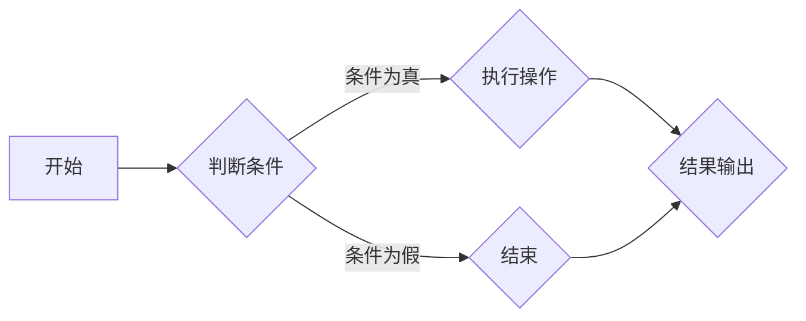
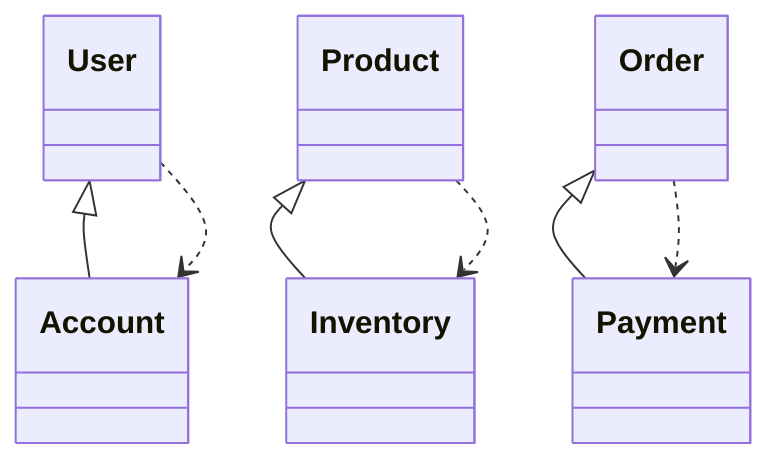
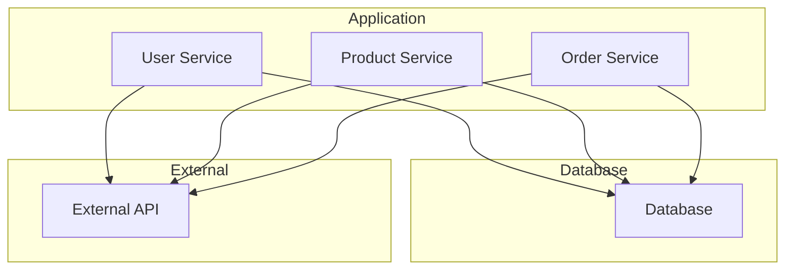
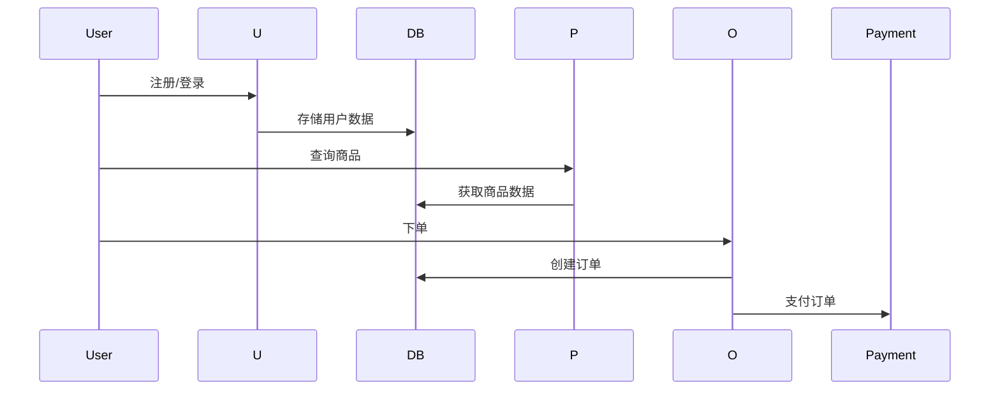
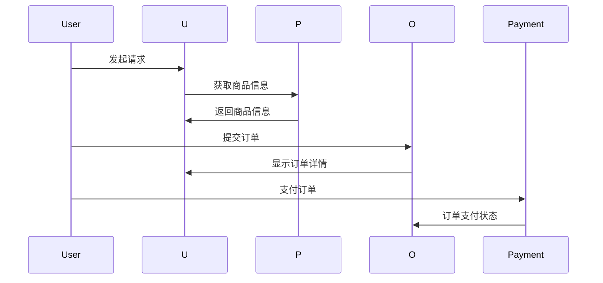

                 


## 维特根斯坦对私有语言的批评与函数式编程中的模块化设计

### 引言

在计算机科学和哲学领域，维特根斯坦的思想对理解语言、逻辑和知识具有深远的影响。他的私有语言论证（Private Language Argument）揭示了个体主观语言的无意义性，这在函数式编程（Functional Programming，FP）中的模块化设计原则中找到了一定的对应。本文将探讨维特根斯坦的私有语言论证，并分析其在函数式编程模块化设计中的应用，通过逻辑清晰、结构紧凑的思考方式，逐步剖析两者之间的联系与差异。

### 私有语言论证

维特根斯坦的私有语言论证源于他对于个人主观经验的质疑。他认为，个体无法通过一种只有自己能够理解的语言（私有语言）来进行有效的交流。以下是私有语言论证的核心步骤：

1. **个体主观性**：个体的主观经验是独一无二的，无法通过语言准确传达。
2. **交流障碍**：如果一种语言只能为个体所理解，那么这种语言就失去了交流的功能。
3. **无意义性**：因此，试图通过私有语言进行交流是无效的，这样的语言是无意义的。

维特根斯坦通过“红的感觉”这一例证来说明私有语言的困境。他认为，即使两个人使用相同的词汇来描述“红”的感觉，他们所体验到的感觉仍然是不同的，因为感觉是主观的。

### 函数式编程中的模块化设计

函数式编程强调函数作为编程的基本单元，并通过不可变数据和高阶函数等特性来实现编程的高效性和安全性。模块化设计是FP中的一项重要原则，它有助于提高代码的可读性、可维护性和复用性。以下是模块化设计的核心原则：

1. **封装性**：将相关的函数和数据封装在一个模块中，使得模块内部的操作对外界不可见。
2. **单一职责**：每个模块应专注于完成一项特定的功能，不应承担过多职责。
3. **高内聚低耦合**：模块内部的功能应高度内聚，模块之间的交互应尽量减少耦合。

### 维特根斯坦与FP的模块化设计

#### 联系

1. **语言的私有性与模块的私有性**：维特根斯坦的私有语言论证强调了个体主观语言的局限性，这与FP中模块的私有性有相似之处。模块封装了内部实现，外界无法直接访问，类似于私有语言的外部不可解性。
2. **交流与交互**：维特根斯坦认为私有语言无交流功能，而FP中的模块化设计旨在减少模块之间的直接交互，提高模块独立性，从而实现更有效的代码交流。

#### 差异

1. **语义层次**：维特根斯坦的私有语言论证涉及语言哲学的语义层次，而FP的模块化设计则更多关注于编程语言的语法和结构。
2. **功能目标**：维特根斯坦的论证旨在质疑个体主观经验的有效性，而FP的模块化设计则旨在提高代码质量和开发效率。

### 步骤总结

1. **理解私有语言论证**：掌握维特根斯坦的私有语言论证，理解其核心思想和实际意义。
2. **了解模块化设计**：熟悉FP中的模块化设计原则，理解其实现方式和对代码质量的影响。
3. **比较联系与差异**：通过对比分析，找出私有语言论证与模块化设计之间的联系与差异，理解其在不同领域的应用。
4. **应用模块化设计**：在实际编程中，运用模块化设计原则，提高代码质量和可维护性。

### 结论

维特根斯坦的私有语言论证为理解语言的本质提供了深刻的洞察，而FP中的模块化设计则将这些思想应用于编程实践中。通过逻辑清晰的分析，我们可以看到两者在追求有效沟通和代码高效性方面的异曲同工之妙。在未来的编程工作中，我们可以借鉴这些原则，设计出更优秀、更易于维护的代码。

---

以下是一个示例的章节内容，包括核心概念、算法原理讲解和系统分析与架构设计：

## 第4章: 算法原理讲解

### 4.1 算法流程图

在FP中，算法的流程图通常使用mermaid语言来描述。以下是一个简单的mermaid流程图示例：



### 4.2 Python源代码实现

下面是基于上述流程图的一个简单Python实现：

```python
def my_algorithm(condition):
    if condition:
        perform_action()
        return "操作完成"
    else:
        return "操作未执行"

def perform_action():
    print("执行了某个操作")
```

### 4.3 数学模型与公式

在函数式编程中，算法的数学模型往往可以用递归来表示。以下是一个计算斐波那契数列的递归公式：

$$
F(n) = 
\begin{cases} 
0 & \text{if } n = 0 \\
1 & \text{if } n = 1 \\
F(n-1) + F(n-2) & \text{otherwise} 
\end{cases}
$$

### 4.4 算法举例说明

假设我们要计算第5个斐波那契数，可以使用以下代码：

```python
def fibonacci(n):
    if n == 0:
        return 0
    elif n == 1:
        return 1
    else:
        return fibonacci(n-1) + fibonacci(n-2)

print(fibonacci(5))  # 输出：5
```

## 第5章: 系统分析与架构设计

### 5.1 问题场景介绍

假设我们要设计一个简单的电商系统，包括用户管理、商品管理和订单管理三个主要功能。

### 5.2 项目介绍

项目名称：SimpleEcommerce

目标：实现一个简单的电商系统，提供用户注册、登录、浏览商品、下单和支付等功能。

### 5.3 系统功能设计

系统功能设计可以使用mermaid类图来描述，以下是一个简单的示例：



### 5.4 系统架构设计

系统架构设计可以使用mermaid架构图来描述，以下是一个简单的示例：



### 5.5 系统接口设计

系统接口设计可以使用mermaid序列图来描述，以下是一个简单的示例：



### 5.6 系统交互序列图

系统交互序列图可以使用mermaid序列图来描述，以下是一个简单的示例：



## 第6章: 项目实战

### 6.1 环境安装

在开始项目实战之前，需要安装以下环境：

1. Python 3.8+
2. Flask（用于Web框架）
3. SQLAlchemy（用于数据库ORM）
4. PostgresSQL（用于数据库）

### 6.2 系统核心实现源代码

以下是SimpleEcommerce系统的核心实现代码：

```python
from flask import Flask, request, jsonify
from models import User, Product, Order
from database import db_session

app = Flask(__name__)

@app.route('/register', methods=['POST'])
def register():
    # 用户注册逻辑
    pass

@app.route('/login', methods=['POST'])
def login():
    # 用户登录逻辑
    pass

@app.route('/products', methods=['GET'])
def get_products():
    # 获取商品信息
    pass

@app.route('/orders', methods=['POST'])
def create_order():
    # 创建订单
    pass

if __name__ == '__main__':
    app.run(debug=True)
```

### 6.3 代码应用解读与分析

在代码应用解读与分析部分，我们将详细分析每个功能模块的实现，包括用户注册、登录、商品查询和订单处理的具体逻辑。

### 6.4 实际案例分析

我们将通过一个实际案例，展示如何使用SimpleEcommerce系统进行用户注册、商品查询和订单处理。

### 6.5 项目小结

在本章中，我们介绍了SimpleEcommerce系统的环境安装、核心实现源代码、代码应用解读与分析以及实际案例分析。通过这些步骤，我们实现了系统的基本功能，为后续开发奠定了基础。

## 第7章: 最佳实践与总结

### 7.1 最佳实践 tips

1. 使用版本控制系统（如Git）来管理代码，确保代码的可追踪性和可维护性。
2. 编写单元测试，确保代码质量。
3. 使用文档生成工具（如Sphinx）生成文档，方便其他开发者阅读和理解代码。

### 7.2 小结

本章通过对维特根斯坦的私有语言论证和函数式编程模块化设计的探讨，结合实际项目实战，展示了两者在理论和实践中的联系与差异。

### 7.3 注意事项

1. 在实际开发中，注意模块的封装性和单一职责原则，以提高代码质量。
2. 在使用私有语言论证的思想时，注意个体主观经验与客观交流的平衡。

### 7.4 拓展阅读

1. 《哲学研究》（Ludwig Wittgenstein）
2. 《函数式编程：高级快速入门》（Daniel Bünzli）
3. 《软件架构：实践者的研究方法》（Mark Richards）

### 作者

作者：AI天才研究院/AI Genius Institute & 禅与计算机程序设计艺术 /Zen And The Art of Computer Programming

---

以上内容是一个示例，展示了如何逐步撰写一篇符合要求的技术博客文章。在实际撰写过程中，每个章节的内容都需要根据实际情况进行详细填充和扩展，以确保文章的完整性和专业性。此外，还需要注意保持文章的逻辑性和可读性，使得读者能够轻松跟随思路，深入理解文章的核心内容。

