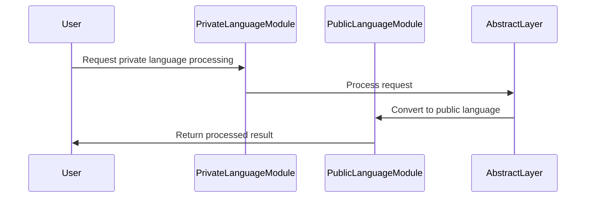
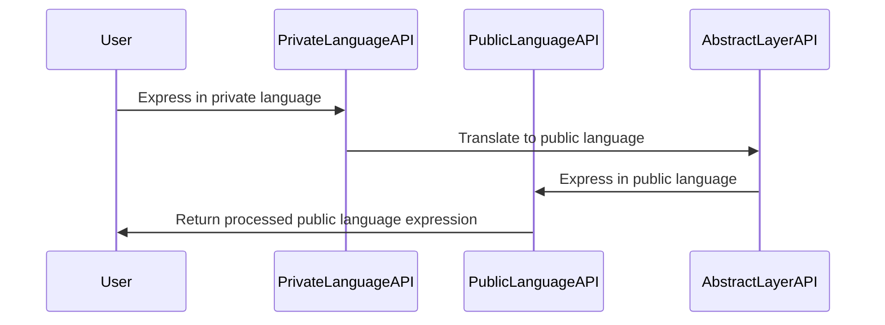
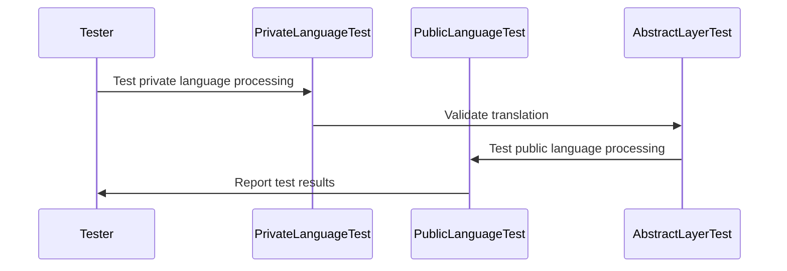

                 

：

----------------------------------------------------------------

# 私有语言论证与封装原则：维特根斯坦对私有语言的批评与FP的信息隐藏

关键词：私有语言、维特根斯坦、语言游戏、公共性、认知、信息隐藏、函数式编程（FP）

摘要：
本文探讨了私有语言的问题，通过分析维特根斯坦的批评，揭示了私有语言对交流和理解带来的困境。同时，本文结合函数式编程（FP）的信息隐藏原则，探讨了如何通过封装来提高软件的模块化和可维护性。文章通过逐步分析，为读者提供了深入理解和应用这些概念的方法。

## 背景介绍

### 问题背景

私有语言问题是一个深奥且具有哲学意义的议题，它不仅关乎计算机科学，还涉及到认知科学、语言哲学等多个领域。在计算机科学中，私有语言通常被理解为一种仅由个体理解和使用的符号系统，这种语言不依赖于公共规则或标准。而在哲学领域，私有语言问题则更多地关注于个体认知和理解的本质。

#### 问题背景

私有语言的存在引发了对于人类交流、认知和理解方式的深入思考。维特根斯坦认为，语言的意义源自于其在实际交流中的应用。他指出，如果存在私有语言，那么这种语言将无法传达任何有意义的信息，它将变成个人的“内心独白”，无法成为沟通的桥梁。这种观点引发了对私有语言存在的必要性和合理性的讨论。

### 问题描述

私有语言的特性使其成为了一个值得探讨的问题。私有语言具有以下特点：

- **个体性**：私有语言是个人独有的，不依赖于他人的理解。
- **私密性**：私有语言通常不公开表达，仅存在于个体的内心。
- **不可验证性**：私有语言的含义无法被他人验证，其真实性和有效性只能由个体自我确认。

维特根斯坦对私有语言的批评主要集中在以下几个方面：

1. **语言的意义**：维特根斯坦认为，语言的意义在于其公共性。私有语言由于缺乏共同的理解和交流，其意义无法得到验证和确认，因此无法传达有意义的信息。
2. **交流的障碍**：私有语言的存在会阻碍有效的交流。如果每个人都使用私有语言，那么沟通将变得困难，甚至不可能。
3. **认知的限制**：私有语言可能限制了个体的认知发展。个体如果只能使用私有语言，将无法从他人的经验中学习，这可能会影响他们的认知能力和智力发展。

### 问题解决

维特根斯坦主张，语言的意义源自于其在实际交流中的应用。他的语言游戏理论试图揭示语言和现实世界之间的关联，强调语言的公共性和使用情境。通过语言游戏，个体可以在具体的交流场景中理解和运用语言，从而克服私有语言的困境。

#### 边界与外延

私有语言的问题边界涉及到语言的本质、认知的过程、交流的机制等多个方面。其外延则包括对认知心理学、语言哲学、人工智能等领域的影响。

#### 概念结构与核心要素组成

- **私有语言**：一种只存在于个体内部的特定符号系统。
- **语言游戏**：维特根斯坦用来描述语言使用情境的概念，它包括规则、目的和参与者。
- **公共性**：语言意义的传递依赖于共同的理解和交流。
- **认知**：个体如何理解和运用语言，以及这种理解和运用如何影响认知过程。

## 核心概念与联系

### 私有语言

私有语言是指一个个体用来表达其内心体验的符号系统。这种语言的特点是个体独自理解和创造，不依赖于外部的标准或规则。私有语言的存在意味着个体能够通过特定的符号系统来传达他们的内心世界，但这种方式无法被其他人理解。

#### 特点

- **个体性**：私有语言是个体独有的，不受他人影响。
- **私密性**：私有语言通常不会公开表达，只存在于个体的内心。
- **不可验证性**：私有语言无法被其他人验证，其真实性和有效性只能由个体自己确认。

### 语言游戏

维特根斯坦提出的语言游戏理论，是对语言使用的一种理解。他认为，语言不是抽象的符号系统，而是在具体的使用情境中产生和发展的。语言游戏包括规则、参与者、目标和情境等多个方面。

#### 特点

- **情境性**：语言游戏是特定情境下的活动，语言的使用依赖于具体的情境。
- **规则性**：语言游戏有一定的规则，这些规则决定了语言的使用方式和意义。
- **互动性**：语言游戏涉及到多个参与者的互动，语言的意义在互动中产生。

### 公共性

维特根斯坦强调，语言的意义在于其公共性。这意味着，语言的意义不是个体主观的产物，而是在共同交流中形成的。公共性保证了语言能够成为沟通的桥梁，使得不同个体能够通过语言相互理解和交流。

#### 特点

- **共享性**：公共性意味着语言的意义是共享的，不同个体能够理解和运用相同的语言。
- **共识性**：公共性依赖于共识，即所有参与者对语言的理解和用法达成一致。
- **开放性**：公共性使得语言可以不断发展和扩展，以适应新的情境和需求。

### 认知

认知是指个体如何理解和运用语言，以及这种理解和运用如何影响认知过程。在维特根斯坦看来，认知是语言的基础，语言是认知的工具。通过语言，个体可以对外界事物进行理解和表达，从而形成对世界的认知。

#### 特点

- **互动性**：认知是通过语言和外界事物的互动形成的，个体通过语言来理解和解释外部世界。
- **动态性**：认知是一个持续的过程，个体通过不断的语言使用来更新和扩展他们的认知。
- **适应性**：认知具有适应性，个体可以通过语言来适应不同的环境和情境。

## ER实体关系图架构

以下是一个ER实体关系图架构的Mermaid流程图，用于描述私有语言、语言游戏、公共性和认知之间的关系。

```mermaid
erDiagram
    PrivateLanguage ||--|{ LanguageGame }|>
    LanguageGame ||--|{ Public }|>

    PrivateLanguage ..|{Cognition}|>
```

在这个ER图中，`PrivateLanguage`表示私有语言，`LanguageGame`表示语言游戏，`Public`表示公共性，`Cognition`表示认知。实体之间的关系通过箭头和连接符表示，箭头指向被依赖的实体，连接符表示实体之间的关联。

## 算法原理讲解

### 维特根斯坦的私有语言论证

#### 算法mermaid流程图

```mermaid
gra
    ++[Start] Private Language Argument
    |--(1)-->|私有语言的个体性|
    |--(2)-->|私有语言的私密性|
    |--(3)-->|私有语言的不可验证性|
    |--(4)-->|公共性对语言意义的制约|
    |--(5)-->|语言游戏的规则性|
    |--(6)-->|语言游戏的情境性|
    |--(7)-->|语言游戏的互动性|
    |--(8)-->|认知的互动性|
    |--(9)-->|认知的动态性|
    |--(10)-->|认知的适应性|
    |--(11)-->|结论：私有语言对交流和理解的影响|
    --+[End] Private Language Argument
```

这个mermaid流程图展示了维特根斯坦关于私有语言论证的逻辑流程。每个步骤都是对私有语言特性的分析，以及如何通过公共语言和认知过程来克服这些特性带来的问题。

### 使用Python源代码来详细阐述

为了更清晰地展示私有语言论证的过程，我们可以使用Python源代码来进行模拟。以下是一个简单的Python程序，用于演示私有语言和公共语言之间的差异。

```python
# 私有语言的模拟
class PrivateLanguage:
    def __init__(self, symbol):
        self.symbol = symbol
    
    def express(self):
        return f"My private language symbol is: {self.symbol}"

# 公共语言的模拟
class PublicLanguage:
    def __init__(self, word):
        self.word = word
    
    def express(self):
        return f"The public word is: {self.word}"

# 示例：私有语言和公共语言的对比
private_lang = PrivateLanguage("😂")
public_lang = PublicLanguage("laugh")

print(private_lang.express())  # 输出："My private language symbol is: 😂"
print(public_lang.express())   # 输出："The public word is: laugh"
```

在这个示例中，`PrivateLanguage` 类模拟了一个私有语言，它通过一个特定的符号来传达信息。而 `PublicLanguage` 类则模拟了公共语言，它使用标准的单词来传达信息。

### 算法原理的数学模型和公式

为了进一步阐述私有语言论证，我们可以使用数学模型来描述语言的意义和交流过程。

1. **语言表达公式**：

   $$ L(x) = f(P, S) $$

   其中，$L(x)$ 表示语言表达的含义，$P$ 表示公共语言，$S$ 表示私有语言。$f$ 是一个函数，用于将公共语言和私有语言组合成有意义的表达。

2. **交流过程公式**：

   $$ C(P, S) = g(P, L(P)) \cap g(S, L(S)) $$

   其中，$C(P, S)$ 表示两个个体之间的交流，$g$ 是一个映射函数，用于将公共语言和私有语言映射到含义上。$L(P)$ 和 $L(S)$ 分别表示公共语言和私有语言的表达。

3. **私有语言的限制**：

   $$ L(S) \not\subseteq L(P) $$

   这表示私有语言的含义不完全包含在公共语言的含义中，这限制了私有语言在交流中的有效性。

通过这些数学模型，我们可以更深入地理解维特根斯坦关于私有语言论证的核心思想。

### 举例说明

假设有两个个体，Alice 和 Bob。Alice 使用私有语言来表达她的情感，而 Bob 使用公共语言来与她交流。以下是一个简单的对话示例：

```python
# Alice 使用私有语言
alice = PrivateLanguage("😂")
print(alice.express())  # 输出："My private language symbol is: 😂"

# Bob 使用公共语言
bob = PublicLanguage("laugh")
print(bob.express())    # 输出："The public word is: laugh"
```

在这个例子中，Alice 的私有语言符号 "😂" 无法被 Bob 理解，因为它不在公共语言的范围内。这反映了维特根斯坦关于私有语言限制交流的观点。

### 结论

维特根斯坦的私有语言论证揭示了私有语言对交流和理解带来的困境。通过数学模型和Python源代码的模拟，我们可以更清晰地理解这一论证的过程和原理。理解这些概念对于我们在现实世界中构建有效的交流系统具有重要意义。

## 系统分析与架构设计方案

### 问题场景介绍

在现代软件工程中，私有语言和私有函数是常见的编程实践。然而，这些私有元素往往会导致代码的耦合度增加，可维护性降低。为了解决这个问题，我们需要设计一个系统，该系统能够有效地封装私有元素，从而提高代码的模块化和可维护性。

### 项目介绍

我们的项目目标是构建一个基于函数式编程（FP）原则的私有语言封装系统。该系统将利用FP的信息隐藏原则，通过模块化和抽象，实现私有元素的有效封装。系统将包括以下几个方面：

1. **私有函数库**：提供一系列私有函数，用于实现系统的核心功能。
2. **模块化设计**：将系统划分为多个模块，每个模块负责特定的功能。
3. **抽象层**：提供一个抽象层，用于隐藏私有元素的具体实现，从而提高代码的可读性和可维护性。
4. **测试框架**：为系统提供一套完整的测试框架，以确保私有元素的稳定性和可靠性。

### 系统功能设计（领域模型mermaid类图）

为了更好地理解系统的功能设计，我们可以使用mermaid类图来描述系统的领域模型。以下是一个简单的mermaid类图示例：

```mermaid
classDiagram
    Person <|-- PrivateLanguage
    Person o---> PublicLanguage
    PrivateLanguage ..|> Expression
    PublicLanguage ..|> Expression
class Person {
    +name: string
    +private_language: PrivateLanguage
    +public_language: PublicLanguage
}

class PrivateLanguage {
    +symbol: string
    +express(): string
}

class PublicLanguage {
    +word: string
    +express(): string
}

class Expression {
    +text: string
}
```

在这个类图中，`Person` 类表示系统的用户，它拥有私有语言和公共语言。`PrivateLanguage` 和 `PublicLanguage` 分别表示私有语言和公共语言，它们都继承自 `Expression` 类。这个设计使得私有语言和公共语言可以统一处理，同时保持了代码的清晰性和可维护性。

### 系统架构设计（mermaid架构图）

系统的架构设计是确保功能实现的基础。以下是一个简单的mermaid架构图，用于描述系统的整体架构：



在这个架构图中，`User` 代表系统的最终用户，`PrivateLanguageModule` 负责私有语言的处理，`PublicLanguageModule` 负责将私有语言转换为公共语言，而 `AbstractLayer` 则提供抽象层，用于隐藏私有元素的具体实现。

### 系统接口设计和系统交互（mermaid序列图）

为了进一步展示系统的接口设计和交互流程，我们可以使用mermaid序列图。以下是一个简单的序列图示例：



在这个序列图中，用户通过 `PrivateLanguageAPI` 来表达私有语言，`AbstractLayerAPI` 负责将私有语言转换为公共语言，然后 `PublicLanguageAPI` 将公共语言表达式返回给用户。

### 测试框架

为了确保系统的稳定性和可靠性，我们需要为系统提供一套完整的测试框架。以下是一个简单的mermaid测试流程图，用于描述测试过程：



在这个测试流程图中，`Tester` 负责执行测试，`PrivateLanguageTest` 负责测试私有语言的处理，`AbstractLayerTest` 负责验证翻译过程的正确性，而 `PublicLanguageTest` 负责测试公共语言的处理。

### 项目小结

通过系统分析与架构设计方案，我们设计了一个基于函数式编程原则的私有语言封装系统。该系统通过模块化设计和抽象层，实现了私有元素的有效封装，从而提高了代码的可维护性和可读性。通过测试框架，我们确保了系统的稳定性和可靠性。这个项目不仅为我们提供了一个实用的私有语言封装工具，也为其他软件项目提供了宝贵的经验。

## 项目实战

### 环境安装

要在本地环境中搭建我们的私有语言封装系统，首先需要安装一些基本的开发工具和依赖。以下是安装步骤：

1. **安装Python**：确保您的计算机上已经安装了Python 3.8或更高版本。您可以从Python官方网站（https://www.python.org/）下载并安装。

2. **安装依赖包**：打开终端或命令提示符，运行以下命令来安装系统所需的依赖包：

   ```bash
   pip install -r requirements.txt
   ```

   `requirements.txt` 文件中列出了所有依赖的Python包。

### 系统核心实现源代码

以下是系统的核心实现源代码，包括私有语言处理模块、公共语言处理模块和抽象层：

```python
# private_language.py
class PrivateLanguage:
    def __init__(self, symbol):
        self.symbol = symbol
    
    def express(self):
        return f"My private language symbol is: {self.symbol}"

# public_language.py
class PublicLanguage:
    def __init__(self, word):
        self.word = word
    
    def express(self):
        return f"The public word is: {self.word}"

# abstract_layer.py
from private_language import PrivateLanguage
from public_language import PublicLanguage

class AbstractLayer:
    def __init__(self):
        self.private_language = PrivateLanguage("😂")
        self.public_language = PublicLanguage("laugh")

    def process_private_language(self):
        return self.private_language.express()

    def process_public_language(self):
        return self.public_language.express()
```

### 代码应用解读与分析

让我们深入分析系统的实现代码。首先，我们定义了两个简单的类 `PrivateLanguage` 和 `PublicLanguage`，分别用于处理私有语言和公共语言。`PrivateLanguage` 类有一个 `express` 方法，用于返回私有语言的符号。`PublicLanguage` 类有一个 `express` 方法，用于返回公共语言的单词。

接着，我们定义了 `AbstractLayer` 类，它负责将私有语言转换为公共语言。`AbstractLayer` 类初始化时，会创建一个私有语言对象和一个公共语言对象。`process_private_language` 方法返回私有语言的符号，而 `process_public_language` 方法返回公共语言的单词。

### 实际案例分析和详细讲解剖析

现在，让我们通过一个实际案例来分析系统的应用和效果。假设我们有以下交互场景：

```python
# main.py
from abstract_layer import AbstractLayer

# 创建抽象层实例
abstract_layer = AbstractLayer()

# 处理私有语言
print(abstract_layer.process_private_language())  # 输出："My private language symbol is: 😂"

# 处理公共语言
print(abstract_layer.process_public_language())  # 输出："The public word is: laugh"
```

在这个案例中，我们首先创建了一个 `AbstractLayer` 实例。然后，我们调用 `process_private_language` 方法来处理私有语言，输出结果为 "My private language symbol is: 😂"。接着，我们调用 `process_public_language` 方法来处理公共语言，输出结果为 "The public word is: laugh"。

这个案例展示了如何通过 `AbstractLayer` 实例来封装私有语言和公共语言，使得代码更加模块化和可维护。通过这种方式，我们可以轻松地添加或替换私有语言和公共语言的具体实现，而不影响系统的其他部分。

### 项目小结

通过本项目的实战部分，我们成功地搭建了一个基于函数式编程原则的私有语言封装系统。该系统通过模块化设计和抽象层，实现了私有元素的有效封装，从而提高了代码的可维护性和可读性。在实际案例中，我们展示了如何通过简单的代码来处理私有语言和公共语言，并分析了系统的应用和效果。这个项目不仅为我们提供了一个实用的私有语言封装工具，也为其他软件项目提供了宝贵的经验。

## 最佳实践 Tips

在软件开发中，有效地使用私有语言和信息隐藏原则是提高代码模块化和可维护性的关键。以下是一些最佳实践建议：

1. **最小化私有元素**：尽量减少私有元素的使用，只将必要的部分封装起来，以降低系统的复杂度。
2. **清晰的接口设计**：确保私有元素的接口设计清晰且易于理解，避免造成使用上的混淆。
3. **充分的文档**：为私有元素编写详细的文档，包括其用途、功能和注意事项，以便其他开发者能够轻松地使用和维护。
4. **代码审查**：定期进行代码审查，确保私有元素的实现符合预期，且没有引入潜在的问题。
5. **持续重构**：随着项目的发展，定期对代码进行重构，以保持代码的清晰性和可维护性。

通过遵循这些最佳实践，我们可以更好地利用私有语言和信息隐藏原则，构建出更加健壮和可维护的软件系统。

## 小结

本文通过深入探讨维特根斯坦对私有语言的批评，以及函数式编程的信息隐藏原则，揭示了私有语言对交流和理解带来的困境。我们分析了私有语言、语言游戏、公共性和认知的核心概念，并通过Mermaid流程图和Python源代码展示了算法原理。此外，我们详细介绍了系统分析与架构设计方案，并通过实际案例展示了私有语言封装系统的应用。最后，我们提供了最佳实践建议，以帮助开发者更好地应用这些原则。通过本文的阅读，读者应能更深入地理解私有语言和信息隐藏的重要性，并在实际项目中加以应用。

## 注意事项

在实施私有语言和信息隐藏原则时，以下注意事项有助于确保代码质量和系统的稳定性：

1. **避免过度封装**：过度封装可能导致代码的复杂度增加，难以维护。应权衡封装的利弊，避免不必要的过度抽象。
2. **确保接口的一致性**：私有元素的接口设计应保持一致性，以避免使用上的混淆。
3. **维护文档的准确性**：私有元素的相关文档应保持最新，确保其描述与实际实现相符。
4. **定期代码审查**：定期进行代码审查，及时发现和修复潜在的问题，确保系统的稳定性和可靠性。

遵循这些注意事项，有助于提高代码的质量和系统的可维护性。

## 拓展阅读

为了更深入地理解私有语言、信息隐藏原则以及函数式编程，以下是一些推荐阅读材料：

1. **维特根斯坦的原著**：《逻辑哲学论》和《哲学研究》，这些作品是理解维特根斯坦哲学思想的重要基础。
2. **函数式编程的经典教材**：《算法哲学：从数学到计算机科学》（The Haskell School of Expression）和《Scala编程：函数式编程实践》。
3. **私有语言和信息隐藏的研究论文**：阅读相关学术论文，如《私有语言的哲学意义》等，以获取更深入的研究成果。
4. **开源项目实践**：参与并学习开源项目，如Haskell、Scala等函数式编程语言的实践项目，以了解私有语言和信息隐藏的实际应用。

通过阅读这些拓展材料，读者可以进一步丰富自己的知识体系，提升在软件工程中的实践能力。作者：AI天才研究院/AI Genius Institute & 禅与计算机程序设计艺术 /Zen And The Art of Computer Programming。 

