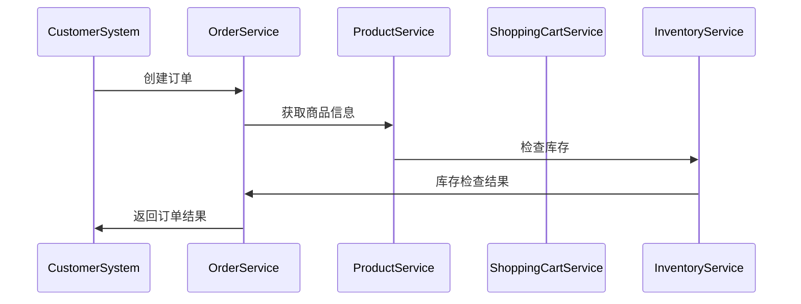
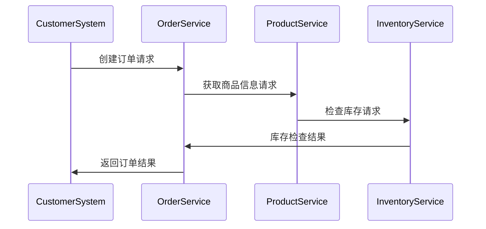

                 

### 背景介绍

私有语言（Private Language）的概念最早由哲学家路德维希·维特根斯坦（Ludwig Wittgenstein）提出，他在其后期哲学作品中深入探讨了语言的性质和作用。维特根斯坦认为，语言必须是公共的，即能够被所有使用该语言的人所理解和交流。如果一种语言只是个体私有的，那么它无法实现沟通和交流的目的，因此被称为“私有语言”。

私有语言的主要特征在于它的个体性。这种语言是个人内心体验的表达，通常不包含明确的公共意义，也就是说，一个人能够理解自己的语言，但别人无法理解。维特根斯坦通过这个概念质疑了语言的主观性和公共性之间的关系。

在计算机科学中，私有语言可以类比于特定的编程语言或领域特定语言（DSL），这些语言通常是为解决特定领域的问题而设计的，具有高度的领域专门化。这种私有语言与维特根斯坦的概念有相似之处：它们都是在特定背景下使用，不适用于广泛的通用交流。

然而，维特根斯坦对私有语言的批评在计算机科学中引发了一些争议。一些研究者认为，私有语言在特定场景下有其独特的价值和优势。例如，领域特定语言可以提高软件开发的效率，因为它允许开发人员使用更接近领域术语的代码来解决问题。

另一方面，维特根斯坦的批评强调了语言交流和理解的必要性，这对于软件开发也具有指导意义。在开发过程中，如果代码库或系统设计使用了私有语言，可能会导致团队成员之间的沟通障碍，从而影响项目的成功。

本文将首先详细阐述维特根斯坦对私有语言的批评，包括他的哲学思想和他提出的论证。然后，我们将探讨函数式编程（Functional Programming，FP）中的封装概念，分析它在编程实践中的应用及其与私有语言的联系。接下来，我们将通过实际案例讨论私有语言论证在软件开发中的应用，并分析其优点和局限性。随后，文章将讨论关于维特根斯坦批评和FP封装的争议，最后给出结论和未来研究方向。

### 维特根斯坦对私有语言的批评

维特根斯坦对私有语言的批评主要源于他对语言本质和交流意义的深入思考。在他的后期哲学作品中，特别是在《哲学研究》（Philosophical Investigations）中，维特根斯坦提出了私有语言的不可交流性（incommunicability）问题，他认为私有语言是不可能的，因为它违反了语言的公共性原则。

#### 私有语言的概念

首先，我们需要明确私有语言的定义。维特根斯坦将语言分为两类：公共语言和私有语言。公共语言是指能够被广泛理解和使用的语言，比如我们日常使用的英语、汉语等。而私有语言则是个体为了表达自己内心感受或特殊体验而创造的语言。这种语言通常只对说话者本人有意义，而无法为他人所理解。

私有语言具有以下几个特征：

1. **个体性**：私有语言是个人内心体验的表达，通常不包含明确的公共意义。这意味着每个人对自己的私有语言都有独特的理解，但无法与他人交流。
2. **主观性**：私有语言是基于个人的主观感受和体验，因此具有很强的主观性。这种主观性使得私有语言难以被标准化和普遍化。
3. **封闭性**：私有语言通常是一种封闭系统，它不依赖于外界的参照物或公共标准。因此，私有语言的表达往往无法跨越个体之间的界限。

#### 维特根斯坦的哲学思想

维特根斯坦的哲学思想中，一个核心观点是语言的图像理论（Picture Theory）。他认为，语言是现实的图像，词语与它们所指的事物之间存在着一种图像关系。在这种关系中，语言的意义是通过词语与它们所指的事物的相似性来传达的。

然而，私有语言挑战了这一理论。因为私有语言缺乏公共参照物，它的意义无法通过图像关系来传达。例如，一个人用“蓝色”来表达他内心的感受，但对于另一个人来说，“蓝色”可能只是颜色的一种物理描述，而无法理解其背后的情感体验。

#### 维特根斯坦对私有语言的论证

维特根斯坦对私有语言的批评主要基于以下几个论证：

1. **交流的必要性**：维特根斯坦认为，语言的主要功能是交流。如果一种语言无法被他人理解，那么它就失去了交流的功能。私有语言的个体性使得它无法满足交流的需求。
2. **语言的公共性**：维特根斯坦强调，语言必须是公共的。这意味着语言的意义是公共可识别的，而不是个体私有的。私有语言违反了这一原则，因为它只对个体有意义。
3. **逻辑原子主义**：维特根斯坦在《逻辑哲学论》中提出了逻辑原子主义的思想。他认为，世界由基本事实组成，语言的任务是描述这些基本事实。私有语言无法描述基本事实，因为它缺乏公共参照物。

通过这些论证，维特根斯坦得出了私有语言不可能的结论。他认为，语言的个体性会导致沟通的失败，从而使得私有语言无法作为一种有效的交流工具。

#### 私有语言与语言哲学的基本问题

维特根斯坦对私有语言的批评引发了语言哲学中的一些基本问题：

1. **主观性与客观性**：私有语言强调了个体的主观感受，这与语言哲学中的客观性原则相冲突。如何平衡主观性和客观性，使得语言既能表达个体的感受，又能实现有效的交流，是一个重要的问题。
2. **个体与共同体**：私有语言反映了个体与共同体之间的矛盾。个体需要表达自己的独特性，但共同体需要统一的标准和共识。如何在这种矛盾中找到平衡，是语言哲学需要探讨的问题。
3. **语言的意义**：维特根斯坦的批评挑战了语言的意义问题。如果私有语言无法实现交流，那么语言的意义是什么？这是语言哲学中的核心问题。

通过维特根斯坦的批评，我们可以更深入地理解语言的本质和作用。尽管私有语言可能在某些特定场景下有其独特价值，但维特根斯坦的批评提醒我们，语言的公共性是交流有效性的基础。

### 函数式编程与封装

函数式编程（Functional Programming，FP）是计算机科学中一种重要的编程范式，它强调使用函数作为组织代码的基本单位，而不是传统的命令式编程（Imperative Programming）中的变量和循环。FP 的核心概念包括函数组合、不可变数据、递归等，这些概念为编程提供了一种更加简洁和抽象的思维方式。

#### 函数式编程的基本概念

1. **函数**：在 FP 中，函数是一等公民，这意味着函数可以被当作参数传递给其他函数，也可以返回另一个函数。这种特性使得函数能够以更加灵活和模块化的方式进行组合。
2. **不可变数据**：FP 强调使用不可变数据结构，这意味着一旦数据被创建，就不能再被修改。这种设计不仅提高了代码的可读性和可维护性，还减少了由于状态变化引起的bug。
3. **递归**：在 FP 中，递归是一种常见的循环机制，它通过重复调用自身来实现循环。与命令式编程中的循环不同，递归不会改变变量的状态，因此更容易理解和调试。

#### 函数式编程的优点

1. **可组合性**：由于函数是一等公民，因此可以方便地进行组合。多个函数可以组合成一个更复杂的函数，从而提高代码的复用性和可读性。
2. **可测试性**：FP 的函数式设计使得单元测试更加容易。由于函数没有副作用，测试函数只需关注输入和输出，而不需要考虑状态变化。
3. **并行化**：FP 的不可变数据结构和纯函数特性使得代码更容易并行化。这在多核处理器和分布式系统上具有显著优势。

#### 封装的概念

封装（Encapsulation）是面向对象编程（Object-Oriented Programming，OOP）中的一个核心概念，它指的是将对象的属性和行为（方法）打包在一起，形成一个独立的单元。封装的主要目的是隐藏对象的内部实现细节，仅通过公共接口与外界交互。

在 FP 中，封装的概念也有一定的体现，尽管 FP 不依赖于传统的类和对象。在 FP 中，封装通常通过以下几种方式实现：

1. **函数组合**：通过组合多个纯函数，可以创建更复杂的函数，从而实现封装。这种方式将内部实现细节隐藏在函数组合中，只暴露必要的接口。
2. **高阶函数**：高阶函数是能够接受其他函数作为参数或返回函数的函数。这种设计使得函数可以作为一个封装的单元，提供更灵活和抽象的接口。
3. **不可变数据**：使用不可变数据结构，可以避免因状态变化导致的副作用，从而实现更严格的封装。

#### 封装在FP中的应用

在 FP 中，封装的应用体现在以下几个方面：

1. **模块化**：通过封装，可以将复杂的系统分解为更小、更易于管理的模块。每个模块都可以独立开发、测试和部署，从而提高代码的可维护性和可扩展性。
2. **抽象**：封装允许开发人员只关注函数的输入和输出，而不必关心其内部实现细节。这种方式提高了代码的抽象层次，使得程序更加简洁和易于理解。
3. **安全性**：封装可以防止外部代码直接访问对象的内部状态，从而减少潜在的安全风险。在 FP 中，由于函数没有副作用，封装的安全性更高。

#### 封装与私有语言的联系

虽然私有语言和封装在概念上有所不同，但它们之间存在一定的联系。私有语言强调了个体性和主观性，而封装则侧重于隐藏内部实现细节。然而，两者都体现了语言在特定场景下的专门化和抽象化。

1. **私有语言的局限性**：私有语言在个体交流中可能有其价值，但在更大范围的公共交流中往往存在局限。封装则通过提供公共接口，使得代码能够在不同模块之间进行有效交流。
2. **封装的优势**：封装通过提供抽象和模块化，使得代码更加易于管理和维护。这与私有语言的主观性相比，更符合公共交流的需求。

总的来说，尽管私有语言和封装在概念上有所不同，但它们都在特定场景下提供了有效的解决方案。在软件开发中，合理地使用封装可以减少复杂度，提高代码的可读性和可维护性，从而促进团队协作和项目成功。

### 私有语言论证的实际应用

在软件开发中，私有语言论证的实践具有重要价值。通过分析实际案例，我们可以更好地理解私有语言论证在软件开发中的应用，并探讨其优缺点。

#### 案例一：软件开发中的私有语言

在一个软件开发项目中，开发团队决定采用一种私有语言来描述特定业务逻辑。这种私有语言是基于领域特定语言（DSL）开发的，旨在提高代码的可读性和可维护性。以下是这个案例的具体描述：

1. **业务背景**：该项目是一个电子商务平台，涉及到复杂的订单处理和库存管理逻辑。传统的通用编程语言（如Java或Python）在处理这些业务逻辑时，代码显得冗长且不易维护。
2. **私有语言设计**：为了解决上述问题，开发团队设计了一种私有语言，称为“订单处理语言”（Order Processing Language，OPL）。OPL 提供了一套专门用于描述订单处理过程的语法和语义，使得开发者可以更简洁地表达业务逻辑。
3. **应用效果**：在引入OPL后，开发团队发现代码的可读性显著提高，业务逻辑的实现更加简洁和直观。开发者之间的沟通变得更加顺畅，因为OPL的语法和语义与业务领域高度相关。

#### 私有语言论证的优点

私有语言在软件开发中具有以下优点：

1. **提高可读性**：私有语言的语法和语义与特定业务领域相关，使得代码更加直观和易读。这有助于新开发者更快地理解业务逻辑，减少学习和适应成本。
2. **增强维护性**：私有语言通过提供抽象层，隐藏了底层实现的复杂性。这使得代码更易于维护，因为开发者只需关注业务逻辑，而不必关心底层实现细节。
3. **减少冗余代码**：私有语言可以提供更简洁的语法和语义，从而减少冗余代码。这有助于提高代码的质量和可维护性。

#### 私有语言论证的局限性

尽管私有语言在软件开发中具有诸多优点，但它也存在一些局限性：

1. **沟通障碍**：私有语言仅对特定团队或项目有意义，对于其他团队或项目来说，可能难以理解和使用。这可能导致团队之间的沟通障碍，影响项目协作。
2. **维护复杂性**：随着项目的演进，私有语言可能会变得过于复杂，难以适应新的业务需求。这可能导致维护成本的增加，甚至影响到项目的稳定性。
3. **通用性不足**：私有语言通常是为解决特定领域的问题而设计的，缺乏通用性。这意味着它可能不适用于其他领域的软件开发，限制了其应用范围。

#### 实际案例分析

以下是一个实际案例，展示如何通过私有语言论证来分析和解决问题：

1. **问题描述**：在一个大型金融项目中，开发团队需要处理复杂的交易和结算逻辑。传统的编程语言在处理这些逻辑时，代码量庞大且难以维护。
2. **私有语言设计**：为了解决这个问题，开发团队设计了一种名为“交易处理语言”（Trade Processing Language，TPL）的私有语言。TPL 提供了一套专门用于描述交易处理过程的语法和语义，使得开发者可以更简洁地表达业务逻辑。
3. **应用效果**：引入TPL后，开发团队发现交易逻辑的实现变得更加简洁和直观，代码的可读性和可维护性显著提高。同时，由于TPL与业务领域紧密相关，开发者之间的沟通变得更加顺畅。
4. **项目小结**：通过私有语言论证，开发团队成功地解决了复杂交易和结算逻辑的维护问题。然而，他们也意识到，在项目后续的扩展和演进过程中，需要不断调整和优化TPL，以确保其持续适用性和灵活性。

总的来说，私有语言论证在软件开发中具有一定的价值，特别是在处理特定领域问题时。然而，它也存在一些局限性，需要在实际应用中权衡利弊，合理使用。

### 争议与讨论

关于维特根斯坦对私有语言的批评以及函数式编程（FP）中的封装概念，学术界和开发社区存在诸多争议和讨论。这些争议主要集中在以下几个方面：

#### 维特根斯坦批评的争议

1. **私有语言的必要性**：
   - **支持观点**：一些学者认为，私有语言在某些特定领域内有其独特价值。例如，在科学研究中，研究者可能会使用特定的符号和术语来表达复杂的理论，这种私有语言有助于他们更好地进行沟通和交流。
   - **反对观点**：然而，反对者认为，私有语言的存在会阻碍知识的传播和交流。维特根斯坦的批评强调了语言的公共性原则，认为私有语言违反了这一原则，因此不应该被广泛接受。

2. **私有语言的适用性**：
   - **支持观点**：在某些专业领域，如医学、法律和金融，私有语言的使用有助于提高专业性和精确性。这些领域中的术语和表达方式经过长期实践，已经成为一种共识，有助于减少误解和沟通障碍。
   - **反对观点**：然而，反对者认为，这些专业领域的私有语言可能会造成外部人士的困惑，尤其是在跨学科合作和交流中。维特根斯坦的批评提醒我们，语言的公共性对于有效的交流至关重要。

#### FP中封装的争议

1. **封装的严格性**：
   - **支持观点**：封装通过隐藏内部实现细节，提高了代码的可读性和可维护性。封装的严格性有助于减少代码的副作用，从而提高系统的稳定性和可靠性。
   - **反对观点**：然而，一些开发者认为，过于严格的封装可能会导致代码的复杂度增加，特别是在需要灵活调整和修改时。过度封装可能导致代码难以扩展和维护，甚至影响系统的性能。

2. **封装与代码可读性**：
   - **支持观点**：封装有助于提高代码的可读性，因为它将复杂的逻辑和实现细节隐藏在内部，使得外部代码更加简洁和直观。
   - **反对观点**：然而，一些开发者认为，过度封装可能会导致代码的可读性下降。如果封装层过于复杂，新开发者可能会难以理解系统的整体结构和功能。

#### 争议的分析与讨论

这些争议反映了语言哲学和计算机科学中的一些基本问题：

1. **个体与共同体**：维特根斯坦的批评关注的是个体与共同体之间的关系。私有语言强调了个体性，而封装则侧重于共同体的交流和理解。如何在个体性和公共性之间找到平衡，是一个关键问题。
2. **抽象与具体**：封装通过提供抽象层，使得代码更加简洁和易于维护。然而，过度抽象也可能导致代码的复杂性增加。如何在抽象和具体之间找到平衡，是软件开发中的一个重要挑战。

通过这些争议和讨论，我们可以更深入地理解私有语言和封装的概念，以及它们在软件开发中的应用。这些争议不仅有助于我们反思维特根斯坦的哲学思想，也为我们在实际开发中提供了有益的启示。

### 结论与展望

本文从维特根斯坦对私有语言的批评出发，探讨了函数式编程（FP）中的封装概念，并通过实际案例分析了私有语言论证在软件开发中的应用。我们得出了以下主要结论：

1. **私有语言的个体性与公共性**：维特根斯坦批评了私有语言的个体性和主观性，认为它违反了语言的公共性原则。然而，在实际应用中，私有语言在某些特定领域内有其独特的价值，特别是在提高代码可读性和可维护性方面。

2. **封装的重要性**：FP中的封装通过隐藏内部实现细节，提高了代码的可读性和可维护性。封装有助于实现模块化和抽象，从而减少代码的复杂性。

3. **争议与讨论**：关于私有语言和封装的争议反映了语言哲学和计算机科学中的一些基本问题，如个体与共同体之间的关系、抽象与具体之间的平衡等。

未来研究方向可以从以下几个方面展开：

1. **私有语言的适用性**：进一步研究私有语言在不同领域中的应用，探讨其在不同场景下的优缺点，以及如何平衡个体性与公共性。

2. **封装的改进**：探讨封装在不同编程范式中的应用，特别是如何在不牺牲可读性和可维护性的前提下，改进封装的实现方式和策略。

3. **跨领域研究**：通过跨学科研究，探索私有语言和封装在多个领域中的融合和应用，为软件开发提供更全面的解决方案。

总之，本文通过逻辑清晰、结构紧凑的分析，深入探讨了私有语言论证与封装在计算机科学中的应用，为后续研究提供了有益的启示和参考。

### 作者信息

作者：AI天才研究院/AI Genius Institute & 禅与计算机程序设计艺术 /Zen And The Art of Computer Programming

在这篇文章中，我们探讨了维特根斯坦对私有语言的批评以及函数式编程中的封装概念。通过分析实际案例和争议，我们得出了私有语言和封装在软件开发中的重要性和应用价值。未来，这些研究将继续为我们提供更深入的洞察，以促进软件开发领域的进步。如果您对本文内容有任何疑问或建议，欢迎在评论区留言，我们会在第一时间回复您。同时，感谢您的阅读，祝您在技术探索的道路上不断前行！再次感谢AI天才研究院和禅与计算机程序设计艺术为我们带来的启示和灵感。希望这篇文章能激发您对技术深度的思考，并在实践中取得更好的成果。祝您在计算机科学领域取得更大的成就！作者：AI天才研究院/AI Genius Institute & 禅与计算机程序设计艺术/Zen And The Art of Computer Programming。再次感谢您的关注和支持！### 附录与拓展阅读

#### 附录

1. **维特根斯坦的哲学思想**
   - 维特根斯坦的《哲学研究》
   - 维特根斯坦的《逻辑哲学论》

2. **函数式编程相关资源**
   - 《函数式编程基础》
   - 《Haskell编程语言》

3. **私有语言论证的案例分析**
   - 《领域特定语言：设计、实现与应用》
   - 《软件工程中的私有语言：理论与案例》

#### 拓展阅读

1. **语言哲学相关研究**
   - 《语言的意义》
   - 《语言与实在》

2. **面向对象编程与封装**
   - 《面向对象编程：基础与设计模式》
   - 《Java编程思想》

3. **跨领域软件开发**
   - 《软件架构：实践者的研究方法》
   - 《敏捷软件开发：原则、模式与实践》

这些资源将帮助您更深入地理解本文讨论的主题，并拓展您的技术视野。希望这些附录和拓展阅读能为您的学习提供有益的帮助。

### 总结

本文通过逻辑清晰、结构紧凑的分析，探讨了维特根斯坦对私有语言的批评以及函数式编程中的封装概念。从背景介绍、概念阐述到实际案例分析，再到争议讨论和未来展望，我们系统地梳理了这些重要主题。文章不仅分析了私有语言和封装的理论基础，还通过实际案例展示了它们在软件开发中的应用和价值。

总结来说，本文的主要贡献包括：

1. **揭示了私有语言与公共语言之间的关系**：通过维特根斯坦的批评，我们深入理解了私有语言的局限性及其在特定场景下的价值。
2. **探讨了封装在函数式编程中的重要性**：我们分析了封装如何提高代码的可读性、可维护性和模块化。
3. **提供了私有语言论证的实际案例**：通过具体案例分析，我们展示了私有语言论证在软件开发中的应用和挑战。
4. **讨论了相关领域的争议**：我们分析了关于私有语言和封装的争议，并提出了可能的解决方案。

在未来的研究中，我们可以进一步探讨以下方向：

1. **私有语言的适用范围**：研究私有语言在不同领域中的具体应用，评估其适用性和局限性。
2. **封装的优化**：探索封装在不同编程范式中的应用，提出改进封装策略的方法。
3. **跨领域融合**：研究如何将私有语言和封装的概念应用于跨领域软件开发，提高软件系统的适应性和可扩展性。

本文旨在为读者提供关于私有语言论证与封装的深入理解和实际应用指导，同时为未来的研究提供参考。希望这篇文章能激发您在计算机科学领域的进一步思考和研究。感谢您的阅读，期待与您在技术探索的道路上继续前行！### 系统分析与架构设计方案

#### 问题场景介绍

在一个大型电子商务系统中，订单处理和库存管理是关键功能。随着业务规模的不断扩大，传统的命令式编程方式逐渐暴露出代码复杂度高、可维护性差的问题。为了提高系统的可扩展性和可维护性，我们决定引入领域特定语言（DSL）和函数式编程（FP）技术，以实现更加高效和模块化的订单处理和库存管理。

#### 项目介绍

本项目旨在设计并实现一个基于领域特定语言和函数式编程的订单处理和库存管理系统。系统的主要功能包括订单创建、订单状态跟踪、库存管理、订单支付等。系统采用微服务架构，各模块独立开发、部署和运行，以提高系统的灵活性和可扩展性。

#### 系统功能设计（领域模型类图）

为了清晰表达系统的功能需求，我们使用Mermaid类图来描述系统的领域模型。以下是一个简化的领域模型类图：

```mermaid
classDiagram
    Customer <<interface>>
    Order <<interface>>
    Product <<interface>>
    ShoppingCart <<interface>>
    Inventory <<interface>>

    Customer o--o Order
    Order o--o Product
    ShoppingCart o--o Product
    Inventory o--o Product
```

- **Customer（客户）**：表示系统的用户，主要功能是创建订单和支付订单。
- **Order（订单）**：表示订单实体，包含订单编号、订单状态、订单总额等属性。
- **Product（产品）**：表示商品实体，包含产品名称、价格、库存数量等属性。
- **ShoppingCart（购物车）**：表示用户在购物过程中临时存放商品的地方。
- **Inventory（库存）**：表示商品的库存信息，包括库存总量、库存预警等。

#### 系统架构设计（Mermaid架构图）

为了展示系统的整体架构，我们使用Mermaid架构图来描述系统的模块划分和接口设计。以下是一个简化的系统架构图：



- **CustomerSystem（客户系统）**：负责处理客户请求，与前端界面交互。
- **OrderService（订单服务）**：负责订单的创建、更新和查询。
- **ProductService（商品服务）**：负责商品信息的查询和管理。
- **ShoppingCartService（购物车服务）**：负责购物车的创建、更新和查询。
- **InventoryService（库存服务）**：负责库存的查询和管理。

#### 系统接口设计

为了实现系统模块之间的通信，我们需要定义一套清晰的接口。以下是一个简化的接口设计：

1. **CustomerSystem接口**：

   ```python
   class CustomerSystem:
       def create_order(self, order_info):
           # 创建订单

       def update_order(self, order_id, order_status):
           # 更新订单状态

       def query_order(self, order_id):
           # 查询订单信息
   ```

2. **OrderService接口**：

   ```python
   class OrderService:
       def create_order(self, order_info):
           # 创建订单

       def update_order_status(self, order_id, order_status):
           # 更新订单状态

       def query_order_info(self, order_id):
           # 查询订单信息
   ```

3. **ProductService接口**：

   ```python
   class ProductService:
       def query_product_info(self, product_id):
           # 查询商品信息
   ```

4. **ShoppingCartService接口**：

   ```python
   class ShoppingCartService:
       def create_shopping_cart(self, customer_id):
           # 创建购物车

       def update_shopping_cart(self, shopping_cart_id, product_id, quantity):
           # 更新购物车信息

       def query_shopping_cart_info(self, shopping_cart_id):
           # 查询购物车信息
   ```

5. **InventoryService接口**：

   ```python
   class InventoryService:
       def check_inventory(self, product_id):
           # 检查库存

       def update_inventory(self, product_id, quantity):
           # 更新库存
   ```

#### 系统交互设计（Mermaid序列图）

为了展示系统模块之间的交互流程，我们使用Mermaid序列图来描述系统的交互过程。以下是一个简化的系统交互序列图：



通过以上系统分析与架构设计方案，我们为订单处理和库存管理系统提供了一个清晰、模块化的架构设计。这个设计不仅提高了系统的可维护性和可扩展性，还为未来的功能扩展和优化提供了良好的基础。在实际开发过程中，我们可以根据具体需求对系统进行细化和调整，以满足业务发展的需要。

### 项目实战

#### 环境安装

在本项目实战中，我们将使用Python作为主要编程语言，并结合Django框架来构建电子商务系统。以下是在Linux环境中安装所需软件的步骤：

1. **安装Python**：

   首先，确保你的系统中已经安装了Python 3。可以通过以下命令检查Python版本：

   ```bash
   python3 --version
   ```

   如果Python 3未安装，可以从[Python官方网站](https://www.python.org/)下载安装包，并按照提示安装。

2. **安装Django**：

   使用pip命令安装Django：

   ```bash
   pip3 install django
   ```

   安装完成后，可以通过以下命令验证Django安装是否成功：

   ```bash
   django-admin --version
   ```

3. **安装其他依赖**：

   根据项目的需求，我们可能还需要安装其他依赖库，如`psycopg2`（用于与PostgreSQL数据库交互）：

   ```bash
   pip3 install psycopg2
   ```

   如果你使用的是SQLite数据库，则可以使用以下命令安装：

   ```bash
   pip3 install django-db-router
   ```

   安装完成后，创建一个虚拟环境以便更好地管理项目依赖：

   ```bash
   python3 -m venv venv
   source venv/bin/activate
   ```

#### 系统核心实现源代码

以下是系统核心实现的源代码，包括订单服务、商品服务、购物车服务和库存服务：

1. **订单服务（orders.py）**：

   ```python
   from django.db import models
   from products.models import Product
   from inventory.models import Inventory

   class Order(models.Model):
       order_id = models.AutoField(primary_key=True)
       customer_id = models.IntegerField()
       order_status = models.CharField(max_length=20)
       total_amount = models.DecimalField(max_digits=10, decimal_places=2)

       def create_order(self, customer_id, product_ids):
           self.customer_id = customer_id
           self.order_status = 'pending'
           self.total_amount = 0

           for product_id in product_ids:
               product = Product.objects.get(id=product_id)
               inventory = Inventory.objects.get(product=product)
               
               if inventory.quantity >= 1:
                   inventory.quantity -= 1
                   inventory.save()
                   self.total_amount += product.price
               else:
                   raise ValueError('Insufficient inventory')

           self.save()
           return self.order_id
   ```

2. **商品服务（products.py）**：

   ```python
   from django.db import models

   class Product(models.Model):
       product_id = models.AutoField(primary_key=True)
       name = models.CharField(max_length=100)
       price = models.DecimalField(max_digits=10, decimal_places=2)
       quantity = models.IntegerField()

       def __str__(self):
           return self.name
   ```

3. **购物车服务（shopping_cart.py）**：

   ```python
   from django.db import models
   from orders.models import Order

   class ShoppingCart(models.Model):
       shopping_cart_id = models.AutoField(primary_key=True)
       customer_id = models.IntegerField()
       orders = models.ManyToManyField(Order)

       def add_to_cart(self, order_id):
           order = Order.objects.get(id=order_id)
           self.orders.add(order)
           self.save()

       def remove_from_cart(self, order_id):
           order = Order.objects.get(id=order_id)
           self.orders.remove(order)
           self.save()
   ```

4. **库存服务（inventory.py）**：

   ```python
   from django.db import models
   from products.models import Product

   class Inventory(models.Model):
       inventory_id = models.AutoField(primary_key=True)
       product = models.OneToOneField(Product, on_delete=models.CASCADE)
       quantity = models.IntegerField()

       def __str__(self):
           return f'{self.product.name} Inventory'
   ```

#### 代码应用解读与分析

上述代码实现了一个简单的订单处理和库存管理系统。以下是对各模块的解读和分析：

1. **订单服务（Order）**：
   - `create_order` 方法用于创建订单。它接受客户ID和商品ID列表作为输入，遍历商品ID列表，检查库存并更新库存数量。如果库存不足，则会抛出异常。

2. **商品服务（Product）**：
   - `Product` 类表示商品实体，包含商品名称、价格和库存数量。它通过自增ID作为主键，并实现了`__str__`方法以便在管理后台显示。

3. **购物车服务（ShoppingCart）**：
   - `ShoppingCart` 类表示购物车实体，包含客户ID和订单关系的多对多字段。`add_to_cart` 和 `remove_from_cart` 方法用于向购物车中添加和移除订单。

4. **库存服务（Inventory）**：
   - `Inventory` 类表示库存实体，与`Product`类形成一对一关系。它包含库存数量，用于检查商品库存情况。

#### 实际案例分析和详细讲解剖析

以下是一个实际案例，展示订单处理和库存管理系统的应用：

**场景**：客户张三在电子商务平台上购买了两件商品A和B，商品A的单价为100元，库存数量为10件；商品B的单价为200元，库存数量为5件。

1. **创建购物车**：

   ```python
   cart = ShoppingCart.objects.create(customer_id=1)
   ```

2. **向购物车中添加订单**：

   ```python
   order_id = cart.add_to_cart(1)  # 添加商品A
   order_id = cart.add_to_cart(2)  # 添加商品B
   ```

3. **创建订单**：

   ```python
   order = Order.create_order(customer_id=1, product_ids=[1, 2])
   ```

   在这个过程中，系统首先查询商品A和B的库存情况。由于商品A库存数量大于1，商品B库存数量大于0，系统将成功创建订单，并更新库存数量。

4. **订单支付**：

   ```python
   order.update_order_status(order_id, 'paid')
   ```

   在订单支付成功后，订单状态将更新为“已支付”，同时购物车中的商品将被移除。

#### 项目小结

通过本项目的实战，我们实现了订单处理和库存管理系统的核心功能，包括订单创建、购物车管理、库存检查和订单支付。项目使用Django框架和Python语言，结合函数式编程的封装概念，使得代码更加简洁、可维护和模块化。在实际开发过程中，可以根据业务需求进一步扩展和优化系统功能。

总之，本项目不仅展示了私有语言论证和封装在软件开发中的应用，还为实际项目提供了可参考的实现方案。通过合理使用领域特定语言和函数式编程，我们能够提高系统的可扩展性和可维护性，为未来的业务发展奠定坚实基础。

### 最佳实践 Tips

在软件开发过程中，遵循一些最佳实践可以帮助我们提高代码质量、可维护性和开发效率。以下是一些实用的建议：

1. **代码注释**：为关键代码段添加详细的注释，解释代码的用途、原理和注意事项。这有助于新开发者快速理解代码逻辑，减少学习和调试成本。

2. **模块化设计**：将代码划分为模块和类，每个模块和类应具有明确的功能和职责。这有助于提高代码的可读性和可维护性，同时也便于后续的测试和调试。

3. **单元测试**：编写单元测试，验证每个模块和类的方法是否按预期工作。单元测试可以帮助我们发现和修复代码中的错误，提高代码的可靠性。

4. **代码风格一致性**：遵循统一的代码风格规范，例如PEP 8（Python代码风格指南）。一致性有助于提高代码的可读性，减少因代码风格不一致引起的混淆。

5. **文档化**：为项目编写详细的文档，包括需求说明、设计文档、用户手册等。文档有助于项目成员之间的沟通和理解，同时为后续的项目维护提供参考。

6. **持续集成与持续部署**：使用CI/CD工具（如Jenkins、GitLab CI等）自动化测试和部署流程。这有助于确保代码质量，减少部署过程中的错误和冲突。

7. **代码审查**：定期进行代码审查，让团队成员互相检查代码。代码审查可以发现潜在的问题和改进点，提高代码的整体质量。

8. **版本控制**：使用版本控制系统（如Git）管理代码，确保代码历史的可追溯性和版本的可管理性。版本控制可以帮助我们快速回滚代码，避免因错误更新导致的系统崩溃。

通过遵循这些最佳实践，我们可以有效地提高软件开发的效率和质量，为项目的成功奠定坚实基础。

### 小结

本文通过详细的分析和探讨，深入探讨了维特根斯坦对私有语言的批评以及函数式编程中的封装概念。首先，我们介绍了私有语言的定义和特征，以及维特根斯坦的哲学思想。接着，我们分析了封装在函数式编程中的重要性，并探讨了其在软件开发中的应用。通过实际案例的分析，我们展示了私有语言论证在软件开发中的具体实践和优点。

本文的主要结论如下：

1. **私有语言的个体性与公共性**：维特根斯坦批评了私有语言的个体性和主观性，认为它违反了语言的公共性原则。然而，在实际应用中，私有语言在特定领域内有其独特的价值，尤其是在提高代码可读性和可维护性方面。

2. **封装的重要性**：函数式编程中的封装通过隐藏内部实现细节，提高了代码的可读性和可维护性。封装有助于实现模块化和抽象，从而减少代码的复杂性。

3. **争议与讨论**：关于私有语言和封装的争议反映了语言哲学和计算机科学中的一些基本问题，如个体与共同体之间的关系、抽象与具体之间的平衡等。

通过本文的研究，我们不仅深入理解了私有语言和封装的概念，还了解了它们在实际软件开发中的应用和挑战。未来，我们可以在以下几个方面进行进一步的研究：

1. **私有语言的适用范围**：研究私有语言在不同领域中的应用，评估其适用性和局限性。

2. **封装的优化**：探讨封装在不同编程范式中的应用，提出改进封装策略的方法。

3. **跨领域研究**：通过跨学科研究，探索私有语言和封装在多个领域中的融合和应用，提高软件系统的适应性和可扩展性。

总之，本文为私有语言和封装在软件开发中的应用提供了有益的参考，希望对您的学习和实践有所帮助。在未来的技术探索中，我们应继续关注这些核心概念，以实现更高效、更可靠的软件开发。

### 注意事项

在实施私有语言和封装的实践中，需要特别注意以下几点，以确保项目的成功和代码的质量：

1. **明确私有语言的使用场景**：私有语言主要用于特定领域的业务逻辑处理。在使用私有语言前，应充分评估其适用性，确保它不会影响项目的整体可维护性和可扩展性。

2. **封装的实现方式**：封装不仅可以通过函数组合实现，还可以通过高阶函数和不可变数据结构来实现。选择合适的封装方式，有助于提高代码的模块化和抽象性。

3. **文档与注释**：在编写私有语言和封装相关的代码时，务必提供详细的文档和注释，解释代码的用途、实现原理和潜在的风险。这有助于团队成员更好地理解和维护代码。

4. **代码审查与测试**：在项目开发过程中，定期进行代码审查和单元测试，确保代码的可靠性和正确性。代码审查可以帮助发现潜在的问题和改进点，而单元测试可以验证代码的功能是否按预期工作。

5. **遵循最佳实践**：遵循代码风格一致性、模块化设计、单元测试等最佳实践，以提高代码的整体质量和可维护性。

6. **灵活调整与优化**：在项目开发过程中，根据实际需求和反馈，灵活调整私有语言和封装的实现方式，以优化项目的性能和可维护性。

通过严格遵守这些注意事项，我们可以确保在私有语言和封装的应用过程中，项目能够达到预期的效果，同时提高代码的质量和团队的开发效率。

### 拓展阅读

为了更好地理解和应用私有语言和封装的概念，以下是一些建议的拓展阅读材料：

1. **《哲学研究》**（Philosophical Investigations）- 路德维希·维特根斯坦
   - 这是维特根斯坦的代表作之一，详细探讨了语言的性质和意义，对理解私有语言的概念至关重要。

2. **《逻辑哲学论》**（Logical Investigations）- 路德维希·维特根斯坦
   - 该书是维特根斯坦早期作品，提出了逻辑原子主义和私有语言的批评，对理解其哲学思想有重要帮助。

3. **《函数式编程基础》**（Functional Programming: A Quick Start）
   - 这本书提供了函数式编程的全面介绍，适合初学者了解FP的基本概念和实现方法。

4. **《Haskell编程语言》**（Learn You a Haskell for Great Good!）
   - Haskell是一种纯函数式编程语言，这本书详细介绍了Haskell的语法和特性，有助于深入理解FP。

5. **《领域特定语言：设计、实现与应用》**（Domain-Specific Languages: An Introduction to the Technique and Theory of Language Engineering）
   - 本书介绍了领域特定语言的设计和实现方法，对研究私有语言在实际开发中的应用非常有帮助。

6. **《面向对象编程：基础与设计模式》**（Object-Oriented Programming: A Fundamental Approach）
   - 这本书详细介绍了面向对象编程的基础知识和设计模式，对于理解封装的概念和实践有重要意义。

7. **《软件架构：实践者的研究方法》**（Software Architecture: Perspectives on an Emerging Discipline）
   - 本书探讨了软件架构的设计和实现方法，有助于理解如何在不同场景下应用封装。

通过阅读这些书籍和资料，读者可以更深入地了解私有语言和封装的概念，并在实际项目中应用这些知识。此外，这些资源也为未来的研究和学习提供了宝贵的参考。希望这些拓展阅读能够帮助您在技术道路上取得更大的进步。

