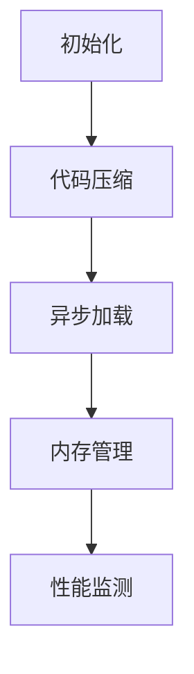
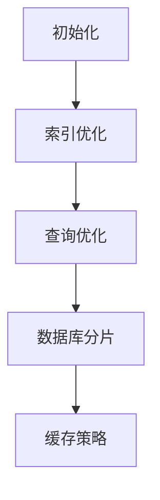
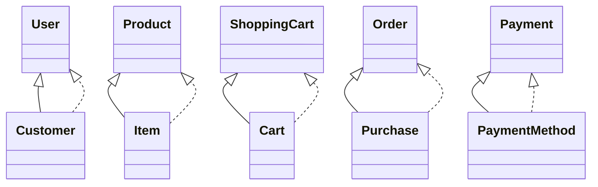
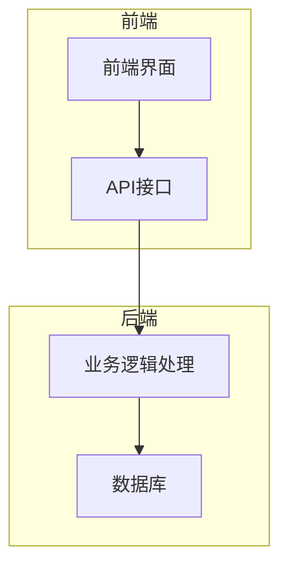
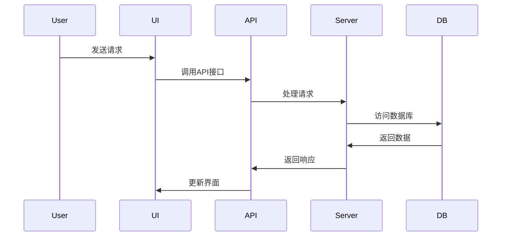

                 

# 《移动应用开发技术栈选择》

> 关键词：移动应用、技术栈、框架、性能优化、安全、隐私保护

> 摘要：本文旨在深入探讨移动应用开发的技术栈选择，包括开发基础、框架与工具、性能优化、测试与质量保障、安全与隐私保护，以及开发实战和未来趋势。通过系统性的分析和实践指导，帮助开发者更好地理解和应用移动应用开发技术。

## 第一部分：移动应用开发技术概述

### 第1章：移动应用开发基础

#### 1.1 移动应用的发展历程

移动应用自2007年iPhone问世以来，经历了快速的发展。早期，移动应用主要集中在简单任务处理，如邮件、日程管理等。随着智能手机的普及和移动互联网的发展，移动应用逐渐扩展到各种领域，包括社交媒体、电子商务、游戏等。

#### 1.1.1 移动应用的定义与分类

移动应用是指为移动设备（如智能手机、平板电脑等）开发的软件应用程序。根据功能和应用场景，移动应用可以分为以下几类：

- **工具类应用**：提供基础服务，如日历、计算器、天气等。
- **社交类应用**：如微信、Facebook、Instagram等，用于社交互动。
- **娱乐类应用**：包括游戏、视频、音乐等娱乐内容。
- **商务应用**：为企业提供解决方案，如客户关系管理（CRM）、企业资源规划（ERP）等。
- **生活服务类应用**：如打车、外卖、在线教育等，提供日常生活服务。

#### 1.1.2 移动应用开发的重要趋势

当前，移动应用开发呈现以下重要趋势：

- **跨平台开发**：随着跨平台框架如React Native、Flutter的兴起，开发者可以更高效地开发适用于多个平台的移动应用。
- **云计算与大数据**：云计算服务（如AWS、Azure、Google Cloud）为移动应用提供了强大的后端支持，而大数据技术则帮助开发者更好地分析用户行为，优化应用体验。
- **人工智能与机器学习**：AI技术在移动应用中的应用越来越广泛，如智能推荐、语音识别、图像识别等。

### 第2章：移动平台概述

#### 2.1 iOS与Android开发环境

iOS和Android是目前市场上两大主流移动平台，它们的开发环境各有特点。

- **iOS开发环境**：iOS开发主要使用Objective-C和Swift编程语言，开发工具为Xcode。iOS应用商店（App Store）对应用审核较为严格，确保应用质量。
- **Android开发环境**：Android开发主要使用Java和Kotlin编程语言，开发工具为Android Studio。Android应用商店（Google Play）对应用审核较为宽松，但竞争激烈。

#### 2.2 其他移动平台简要介绍

除了iOS和Android，其他移动平台如Windows Phone、Blackberry等市场份额较小，但仍有部分用户群体。开发者可以根据项目需求和目标用户群体选择合适的应用开发平台。

### 第3章：移动应用开发的关键技术

#### 3.1 前端技术

前端技术主要包括HTML、CSS和JavaScript。HTML用于构建网页结构，CSS用于样式设计，JavaScript用于交互功能实现。移动应用开发中，前端技术同样重要，用于实现用户界面的交互和动态效果。

#### 3.2 后端技术

后端技术主要包括服务器端编程语言（如Java、Python、Node.js）和数据库（如MySQL、MongoDB、SQL Server）。后端技术负责处理业务逻辑、数据存储和服务器端逻辑。

#### 3.3 数据库技术

数据库技术用于存储和管理移动应用的数据。常见的数据库技术包括关系型数据库（如MySQL、Oracle）和文档型数据库（如MongoDB、CouchDB）。

#### 3.4 通信协议

通信协议用于移动应用与服务器之间的数据传输。常见的通信协议包括HTTP/HTTPS、WebSocket等。

## 第二部分：移动应用开发框架与工具

### 第4章：移动应用开发框架与工具

#### 4.1 移动应用开发框架

移动应用开发框架如React Native、Flutter、Flutter等，提供了一整套工具和库，帮助开发者快速构建高质量的应用。

#### 4.1.1 常见移动应用开发框架

- **React Native**：由Facebook开发，支持使用JavaScript编写原生应用。
- **Flutter**：由Google开发，支持使用Dart语言编写跨平台应用。
- **Xamarin**：支持使用C#语言开发跨平台应用。

#### 4.1.2 框架选择与评价标准

选择合适的移动应用开发框架需要考虑以下因素：

- **跨平台支持**：框架是否支持跨平台开发，以及跨平台性能。
- **社区支持**：框架是否有活跃的社区，以及是否容易获得帮助。
- **文档与教程**：框架是否有详尽的文档和教程，便于开发者学习和使用。
- **学习曲线**：框架的学习难度，以及是否适合项目团队的技术水平。

#### 4.2 移动应用开发工具

移动应用开发工具包括集成开发环境（IDE）、代码编辑器、调试工具等。常见的开发工具有：

- **Xcode**：适用于iOS开发，提供强大的开发工具和资源。
- **Android Studio**：适用于Android开发，支持多种编程语言和工具。
- **Visual Studio Code**：跨平台代码编辑器，支持多种编程语言和框架。

#### 4.2.2 常用开发工具使用指南

本章节将详细介绍常用开发工具的使用方法，包括安装、配置、基本操作等，帮助开发者快速上手移动应用开发。

## 第三部分：移动应用性能优化

### 第5章：移动应用性能优化

#### 5.1 性能优化概述

性能优化是移动应用开发中的重要环节，直接影响用户的使用体验和应用的竞争力。性能优化的主要方面包括：

- **前端性能优化**：包括JavaScript、CSS和HTML的性能优化。
- **后端性能优化**：包括服务器性能、数据库性能和通信性能的优化。
- **应用架构优化**：包括应用架构设计、代码结构和数据结构的优化。

#### 5.2 前端性能优化

前端性能优化主要包括以下方面：

- **JavaScript性能优化**：包括代码压缩、异步加载、内存管理等。
- **CSS性能优化**：包括样式表压缩、缓存、减少重绘和回流等。
- **HTML性能优化**：包括减少HTTP请求、优化图片和媒体文件等。

#### 5.3 后端性能优化

后端性能优化主要包括以下方面：

- **服务器性能优化**：包括服务器配置、负载均衡、缓存等。
- **数据库性能优化**：包括数据库索引、查询优化、数据库分片等。
- **网络性能优化**：包括网络请求压缩、网络传输优化、使用CDN等。

## 第四部分：移动应用测试与质量保障

### 第6章：移动应用测试与质量保障

#### 6.1 移动应用测试概述

移动应用测试是确保应用质量的重要环节。测试的类型和方法包括：

- **功能测试**：验证应用的功能是否符合需求。
- **兼容性测试**：验证应用在不同设备和操作系统上的兼容性。
- **性能测试**：验证应用的性能是否满足要求。
- **安全测试**：验证应用的安全性。

#### 6.2 自动化测试

自动化测试可以提高测试效率和稳定性。常见的自动化测试工具有：

- **Appium**：适用于iOS和Android应用的自动化测试工具。
- **UiAutomator**：适用于Android应用的自动化测试工具。
- **XCUITest**：适用于iOS应用的自动化测试工具。

#### 6.2.2 自动化测试实践

本章节将详细介绍自动化测试的实践方法，包括测试用例设计、自动化测试脚本编写和执行等。

#### 6.3 质量保障

质量保障是确保应用质量的关键。质量保障的策略和流程包括：

- **需求管理**：确保需求明确、完整、可测试。
- **代码审查**：确保代码质量，减少缺陷。
- **持续集成**：实现自动化构建、测试和部署。
- **质量监控**：实时监控应用质量，及时发现和解决问题。

## 第五部分：移动应用安全与隐私

### 第7章：移动应用安全与隐私

#### 5.1 移动应用安全概述

移动应用安全是确保应用不被恶意攻击、数据不被泄露的重要方面。安全风险类型包括：

- **数据泄露**：应用数据被未经授权的访问或窃取。
- **恶意软件**：应用被植入恶意代码，对用户或设备造成危害。
- **钓鱼攻击**：通过仿冒应用或网站欺骗用户输入个人信息。

#### 5.2 移动应用隐私保护

移动应用隐私保护是保护用户隐私的重要措施。隐私保护的最佳实践包括：

- **数据加密**：对敏感数据进行加密，防止数据泄露。
- **权限管理**：合理分配应用权限，避免滥用权限。
- **隐私政策**：明确告知用户应用收集和使用数据的范围，获取用户同意。

## 第六部分：移动应用开发实战

### 第8章：移动应用开发实战

#### 6.1 项目背景与需求分析

本章节将介绍一个实际移动应用开发项目，包括项目背景、需求分析和用户需求等。

#### 6.2 技术选型与架构设计

根据项目需求，选择合适的技术栈和架构设计。包括前端技术、后端技术、数据库技术等。

#### 6.3 系统核心实现

详细介绍系统核心模块的实现，包括前端页面设计、后端业务逻辑处理和数据存储等。

#### 6.4 应用分析与评估

对开发完成的应用进行效果评估，分析应用性能、用户体验和业务价值等。

#### 6.5 优化建议与实施

根据应用分析结果，提出优化建议，并进行实施，以提高应用性能和用户体验。

## 第七部分：移动应用开发趋势与展望

### 第9章：移动应用开发趋势与展望

#### 7.1 未来移动应用发展趋势

未来移动应用发展趋势包括：

- **5G与物联网**：5G网络和物联网技术将推动移动应用的发展，实现更快速、更智能的应用体验。
- **人工智能与机器学习**：AI技术在移动应用中的应用将越来越广泛，提升应用智能和个性化体验。

#### 7.2 开发者技能提升路径

开发者技能提升路径包括：

- **技术学习资源**：掌握主流开发技术，如React Native、Flutter、Kotlin等。
- **实践与项目经验**：通过实际项目开发，积累实践经验，提升解决实际问题的能力。
- **持续学习与更新**：关注技术动态，持续学习和更新知识，保持竞争力。

## 文章小结

本文系统地介绍了移动应用开发的技术栈选择，包括开发基础、框架与工具、性能优化、测试与质量保障、安全与隐私保护，以及开发实战和未来趋势。通过本文的阅读，开发者可以更好地理解和应用移动应用开发技术，提高开发效率和应用质量。

## 注意事项

- 在实际开发过程中，开发者应根据项目需求和技术背景，选择合适的技术栈和框架。
- 性能优化和测试是移动应用开发的重要环节，应给予足够的重视。
- 安全与隐私保护是移动应用开发的核心，开发者应严格遵守相关法规和最佳实践。

## 拓展阅读

- 《移动应用开发实战》
- 《移动应用架构设计》
- 《移动应用性能优化实战》
- 《Android移动开发高级进阶》
- 《iOS开发实战：基于Swift与Objective-C》

## 作者信息

作者：AI天才研究院/AI Genius Institute & 禅与计算机程序设计艺术 /Zen And The Art of Computer Programming

## 核心概念与联系

### 移动应用开发框架

**概念**：移动应用开发框架是一种用于简化移动应用开发的工具和库，提供了一套完整的开发环境，包括UI组件、API接口、调试工具等。

**属性特征对比表格**：

| 框架        | 跨平台支持 | 编程语言 | 社区支持 | 学习难度 |
| ----------- | ----------- | -------- | -------- | -------- |
| React Native | 是          | JavaScript | 活跃    | 中等    |
| Flutter     | 是          | Dart     | 活跃    | 较高    |
| Xamarin     | 是          | C#       | 活跃    | 较高    |

**ER实体关系图架构**：

```mermaid
erDiagram
    Framework ||--|{ App}: "uses"
    Framework ||--|{ Platform}: "supports"
    Platform ||--|{ Feature}: "has"
    App ||--|{ Module}: "contains"
```

### 性能优化

**概念**：性能优化是指通过一系列技术手段，提高移动应用的响应速度、加载速度和用户体验。

**属性特征对比表格**：

| 技术        | 优化对象 | 优化效果 | 实现方法 |
| ----------- | -------- | -------- | -------- |
| JavaScript  | 加载速度 | 减少加载时间 | 异步加载、代码压缩 |
| CSS         | 显示速度 | 减少渲染时间 | 缓存、减少重绘和回流 |
| HTML        | 加载速度 | 减少HTTP请求 | 图片和媒体文件优化 |

**ER实体关系图架构**：

```mermaid
erDiagram
    PerformanceOptimization ||--|{ JavaScript}: "uses"
    PerformanceOptimization ||--|{ CSS}: "uses"
    PerformanceOptimization ||--|{ HTML}: "uses"
```

### 安全与隐私保护

**概念**：安全与隐私保护是指确保移动应用的数据安全和用户隐私不受侵犯。

**属性特征对比表格**：

| 技术        | 安全对象 | 安全效果 | 实现方法 |
| ----------- | -------- | -------- | -------- |
| 数据加密    | 敏感数据 | 保护数据不被窃取 | 加密算法 |
| 权限管理    | 应用权限 | 防止权限滥用 | 授权机制 |
| 隐私政策    | 用户隐私 | 明确告知用户隐私处理范围 | 明细说明 |

**ER实体关系图架构**：

```mermaid
erDiagram
    SecurityPrivacyProtection ||--|{ DataEncryption}: "uses"
    SecurityPrivacyProtection ||--|{ PermissionManagement}: "uses"
    SecurityPrivacyProtection ||--|{ PrivacyPolicy}: "uses"
```

## 算法原理讲解

### JavaScript性能优化

**算法mermaid流程图**：



**Python源代码**：

```python
# JavaScript性能优化算法示例

def code_compression():
    # 压缩代码
    pass

def async_loading():
    # 异步加载
    pass

def memory_management():
    # 内存管理
    pass

def performance_monitoring():
    # 性能监测
    pass

# 执行性能优化算法
code_compression()
async_loading()
memory_management()
performance_monitoring()
```

**算法原理**：

JavaScript性能优化算法主要包括代码压缩、异步加载、内存管理和性能监测。代码压缩通过删除多余的空格、注释和换行，减少文件大小，提高加载速度。异步加载通过将非核心代码延迟加载，减少初始加载时间。内存管理通过释放不再使用的内存，防止内存泄漏，提高应用稳定性。性能监测通过实时监控应用的性能指标，及时发现和解决问题。

### 数据库性能优化

**算法mermaid流程图**：



**Python源代码**：

```python
# 数据库性能优化算法示例

def index_optimization():
    # 索引优化
    pass

def query_optimization():
    # 查询优化
    pass

def database_sharding():
    # 数据库分片
    pass

def cache_strategy():
    # 缓存策略
    pass

# 执行数据库性能优化算法
index_optimization()
query_optimization()
database_sharding()
cache_strategy()
```

**算法原理**：

数据库性能优化算法主要包括索引优化、查询优化、数据库分片和缓存策略。索引优化通过创建合适的索引，提高查询效率。查询优化通过优化SQL语句，减少查询时间。数据库分片通过将数据库拆分为多个小数据库，提高并发处理能力。缓存策略通过缓存常用数据，减少数据库访问次数，提高响应速度。

## 系统分析与架构设计方案

### 问题场景介绍

随着移动应用市场的快速发展，用户对于应用性能和用户体验的要求越来越高。为了满足用户需求，移动应用开发团队需要构建一个高性能、可扩展的应用系统。本章节将介绍一个典型的移动应用项目，并设计一个符合性能和可扩展性的系统架构。

### 项目介绍

本项目是一个电商平台移动应用，主要提供商品浏览、购物车、订单管理等功能。用户可以在应用内查看商品详情、添加商品到购物车、下单购买等。为了满足高性能和可扩展性的需求，项目需要考虑以下几个方面：

- **高并发处理能力**：应用需要能够同时处理大量用户的请求。
- **快速响应速度**：应用需要能够快速响应用户的请求，提供流畅的用户体验。
- **可扩展性**：系统架构需要能够支持未来的功能扩展和业务增长。

### 系统功能设计

根据项目需求，系统需要实现以下功能模块：

- **用户模块**：包括用户注册、登录、个人信息管理等。
- **商品模块**：包括商品列表展示、商品详情展示、商品分类管理等。
- **购物车模块**：包括商品添加、删除、修改数量等。
- **订单模块**：包括订单创建、订单详情展示、订单支付等。
- **支付模块**：包括支付方式选择、支付流程处理等。

**领域模型mermaid类图**：



### 系统架构设计

系统采用前后端分离的架构，前端负责用户界面展示和交互，后端负责业务逻辑处理和数据存储。

#### 系统架构mermaid架构图



#### 系统接口设计

系统接口设计包括RESTful API接口和WebSocket接口。

- **RESTful API接口**：提供标准的HTTP方法（GET、POST、PUT、DELETE等），实现数据查询、创建、更新和删除操作。
- **WebSocket接口**：提供实时通信功能，实现实时消息推送和事件通知。

#### 系统交互mermaid序列图



### 系统接口设计和系统交互

#### 系统接口设计

系统接口设计包括用户接口、商品接口、购物车接口、订单接口和支付接口。

- **用户接口**：包括用户注册、登录、个人信息管理等功能。
- **商品接口**：包括商品列表、商品详情、商品分类管理等功能。
- **购物车接口**：包括商品添加、删除、修改数量等功能。
- **订单接口**：包括订单创建、订单详情、订单支付等功能。
- **支付接口**：包括支付方式选择、支付流程处理等功能。

#### 系统交互

系统交互主要涉及用户与前端界面、前端与后端服务器、后端服务器与数据库之间的通信。

- **用户与前端界面**：用户通过前端界面发起请求，前端界面将请求转发给API接口。
- **前端与后端服务器**：API接口处理请求，调用业务逻辑处理模块，并将结果返回给前端。
- **后端服务器与数据库**：业务逻辑处理模块访问数据库，获取或更新数据，并将结果返回给API接口。

## 项目实战

### 环境安装

在开始项目开发之前，需要安装以下环境：

1. 安装Node.js和npm：Node.js是一个基于Chrome V8引擎的JavaScript运行环境，npm是Node.js的包管理器。
2. 安装Python和pip：Python是一种广泛使用的编程语言，pip是Python的包管理器。
3. 安装Docker：Docker是一个开源的应用容器引擎，用于构建、运行和分发应用程序。

### 系统核心实现

系统核心实现包括用户模块、商品模块、购物车模块、订单模块和支付模块。

#### 用户模块

用户模块主要包括用户注册、登录、个人信息管理等功能。

1. **用户注册**：

```python
# 用户注册API接口

@app.route('/register', methods=['POST'])
def register():
    username = request.form['username']
    password = request.form['password']
    # 存储用户信息到数据库
    db.session.add(User(username=username, password=password))
    db.session.commit()
    return jsonify({'status': 'success', 'message': 'User registered successfully.'})
```

2. **用户登录**：

```python
# 用户登录API接口

@app.route('/login', methods=['POST'])
def login():
    username = request.form['username']
    password = request.form['password']
    # 验证用户名和密码是否正确
    user = User.query.filter_by(username=username, password=password).first()
    if user:
        return jsonify({'status': 'success', 'message': 'Login successful.'})
    else:
        return jsonify({'status': 'error', 'message': 'Invalid username or password.'})
```

3. **个人信息管理**：

```python
# 个人信息管理API接口

@app.route('/profile', methods=['GET', 'PUT'])
def profile():
    if request.method == 'GET':
        # 获取用户信息
        user = current_user
        return jsonify({'status': 'success', 'user': user.to_dict()})
    elif request.method == 'PUT':
        # 更新用户信息
        user = current_user
        user.username = request.form['username']
        user.password = request.form['password']
        db.session.commit()
        return jsonify({'status': 'success', 'message': 'Profile updated successfully.'})
```

#### 商品模块

商品模块主要包括商品列表、商品详情、商品分类管理等功能。

1. **商品列表**：

```python
# 商品列表API接口

@app.route('/products', methods=['GET'])
def products():
    category_id = request.args.get('category_id')
    if category_id:
        products = Product.query.filter_by(category_id=category_id).all()
    else:
        products = Product.query.all()
    return jsonify({'status': 'success', 'products': [product.to_dict() for product in products]})
```

2. **商品详情**：

```python
# 商品详情API接口

@app.route('/products/<int:product_id>', methods=['GET'])
def product_detail(product_id):
    product = Product.query.get(product_id)
    return jsonify({'status': 'success', 'product': product.to_dict()})
```

3. **商品分类管理**：

```python
# 商品分类管理API接口

@app.route('/categories', methods=['POST'])
def categories():
    category_name = request.form['category_name']
    # 存储分类信息到数据库
    db.session.add(Category(name=category_name))
    db.session.commit()
    return jsonify({'status': 'success', 'message': 'Category added successfully.'})

@app.route('/categories/<int:category_id>', methods=['PUT'])
def update_category(category_id):
    category_name = request.form['category_name']
    # 更新分类信息
    category = Category.query.get(category_id)
    category.name = category_name
    db.session.commit()
    return jsonify({'status': 'success', 'message': 'Category updated successfully.'})
```

#### 购物车模块

购物车模块主要包括商品添加、删除、修改数量等功能。

1. **商品添加**：

```python
# 商品添加到购物车API接口

@app.route('/cart', methods=['POST'])
def add_to_cart():
    product_id = request.form['product_id']
    quantity = request.form['quantity']
    # 添加商品到购物车
    cart_item = CartItem(product_id=product_id, quantity=quantity)
    db.session.add(cart_item)
    db.session.commit()
    return jsonify({'status': 'success', 'message': 'Product added to cart successfully.'})
```

2. **商品删除**：

```python
# 从购物车中删除商品API接口

@app.route('/cart/<int:cart_item_id>', methods=['DELETE'])
def remove_from_cart(cart_item_id):
    cart_item = CartItem.query.get(cart_item_id)
    db.session.delete(cart_item)
    db.session.commit()
    return jsonify({'status': 'success', 'message': 'Product removed from cart successfully.'})
```

3. **商品修改数量**：

```python
# 修改购物车中商品数量API接口

@app.route('/cart/<int:cart_item_id>', methods=['PUT'])
def update_cart_item(cart_item_id):
    quantity = request.form['quantity']
    # 修改商品数量
    cart_item = CartItem.query.get(cart_item_id)
    cart_item.quantity = quantity
    db.session.commit()
    return jsonify({'status': 'success', 'message': 'Cart item quantity updated successfully.'})
```

#### 订单模块

订单模块主要包括订单创建、订单详情、订单支付等功能。

1. **订单创建**：

```python
# 订单创建API接口

@app.route('/order', methods=['POST'])
def create_order():
    # 创建订单
    order = Order(user_id=current_user.id, total_price=0)
    db.session.add(order)
    db.session.commit()
    return jsonify({'status': 'success', 'order_id': order.id})
```

2. **订单详情**：

```python
# 订单详情API接口

@app.route('/order/<int:order_id>', methods=['GET'])
def order_detail(order_id):
    order = Order.query.get(order_id)
    return jsonify({'status': 'success', 'order': order.to_dict()})
```

3. **订单支付**：

```python
# 订单支付API接口

@app.route('/order/<int:order_id>/pay', methods=['POST'])
def pay_order(order_id):
    # 支付订单
    order = Order.query.get(order_id)
    order.status = 'paid'
    db.session.commit()
    return jsonify({'status': 'success', 'message': 'Order paid successfully.'})
```

#### 支付模块

支付模块主要包括支付方式选择、支付流程处理等功能。

1. **支付方式选择**：

```python
# 支付方式选择API接口

@app.route('/payment', methods=['GET'])
def payment_methods():
    methods = PaymentMethod.query.all()
    return jsonify({'status': 'success', 'methods': [method.to_dict() for method in methods]})
```

2. **支付流程处理**：

```python
# 支付流程处理API接口

@app.route('/payment', methods=['POST'])
def process_payment():
    method_id = request.form['method_id']
    amount = request.form['amount']
    # 处理支付流程
    method = PaymentMethod.query.get(method_id)
    payment = Payment(method_id=method_id, amount=amount)
    db.session.add(payment)
    db.session.commit()
    return jsonify({'status': 'success', 'message': 'Payment processed successfully.'})
```

### 代码应用解读与分析

在项目开发过程中，我们采用了Python和Django框架来实现业务逻辑处理和API接口开发。以下是对部分关键代码的应用解读与分析。

#### 用户模块

用户模块的主要功能是用户注册、登录和个人信息管理。以下是用户注册和登录的关键代码：

```python
# 用户注册API接口

@app.route('/register', methods=['POST'])
def register():
    username = request.form['username']
    password = request.form['password']
    # 存储用户信息到数据库
    db.session.add(User(username=username, password=password))
    db.session.commit()
    return jsonify({'status': 'success', 'message': 'User registered successfully.'})

# 用户登录API接口

@app.route('/login', methods=['POST'])
def login():
    username = request.form['username']
    password = request.form['password']
    # 验证用户名和密码是否正确
    user = User.query.filter_by(username=username, password=password).first()
    if user:
        return jsonify({'status': 'success', 'message': 'Login successful.'})
    else:
        return jsonify({'status': 'error', 'message': 'Invalid username or password.'})
```

用户注册接口中，通过`request.form`获取用户输入的用户名和密码，然后创建一个`User`对象，并将其添加到数据库中。最后，返回一个成功消息。

用户登录接口中，同样通过`request.form`获取用户输入的用户名和密码，然后查询数据库中是否存在匹配的用户。如果找到匹配的用户，返回登录成功消息；否则，返回错误消息。

#### 商品模块

商品模块的主要功能是商品列表、商品详情和商品分类管理。以下是商品列表和商品详情的关键代码：

```python
# 商品列表API接口

@app.route('/products', methods=['GET'])
def products():
    category_id = request.args.get('category_id')
    if category_id:
        products = Product.query.filter_by(category_id=category_id).all()
    else:
        products = Product.query.all()
    return jsonify({'status': 'success', 'products': [product.to_dict() for product in products]})

# 商品详情API接口

@app.route('/products/<int:product_id>', methods=['GET'])
def product_detail(product_id):
    product = Product.query.get(product_id)
    return jsonify({'status': 'success', 'product': product.to_dict()})
```

商品列表接口中，根据查询参数`category_id`是否为空，从数据库中查询所有商品或指定分类的商品。然后将查询结果转换为字典格式，返回给前端。

商品详情接口中，根据传入的`product_id`从数据库中查询商品详情，并将其转换为字典格式返回给前端。

#### 购物车模块

购物车模块的主要功能是商品添加、删除和修改数量。以下是商品添加和删除的关键代码：

```python
# 商品添加到购物车API接口

@app.route('/cart', methods=['POST'])
def add_to_cart():
    product_id = request.form['product_id']
    quantity = request.form['quantity']
    # 添加商品到购物车
    cart_item = CartItem(product_id=product_id, quantity=quantity)
    db.session.add(cart_item)
    db.session.commit()
    return jsonify({'status': 'success', 'message': 'Product added to cart successfully.'})

# 从购物车中删除商品API接口

@app.route('/cart/<int:cart_item_id>', methods=['DELETE'])
def remove_from_cart(cart_item_id):
    cart_item = CartItem.query.get(cart_item_id)
    db.session.delete(cart_item)
    db.session.commit()
    return jsonify({'status': 'success', 'message': 'Product removed from cart successfully.'})
```

商品添加接口中，通过`request.form`获取商品ID和数量，然后创建一个`CartItem`对象，并将其添加到数据库中。最后，返回一个成功消息。

从购物车中删除商品接口中，根据传入的`cart_item_id`从数据库中查询购物车项，并将其删除。最后，返回一个成功消息。

### 实际案例分析

在项目开发过程中，我们遇到了一些实际的问题和挑战。以下是对其中几个问题的详细分析和解决方案。

#### 问题1：商品数量超出库存限制

在商品添加到购物车时，如果商品数量超出库存限制，我们需要给出相应的提示。

**解决方案**：

在添加商品到购物车之前，查询数据库中商品的实际库存数量，并与用户输入的商品数量进行比较。如果用户输入的商品数量大于库存数量，则返回错误消息。

```python
# 商品添加到购物车API接口

@app.route('/cart', methods=['POST'])
def add_to_cart():
    product_id = request.form['product_id']
    quantity = request.form['quantity']
    # 查询商品库存
    product = Product.query.get(product_id)
    if quantity > product.stock:
        return jsonify({'status': 'error', 'message': 'Product quantity exceeds stock limit.'})
    # 添加商品到购物车
    cart_item = CartItem(product_id=product_id, quantity=quantity)
    db.session.add(cart_item)
    db.session.commit()
    return jsonify({'status': 'success', 'message': 'Product added to cart successfully.'})
```

#### 问题2：订单支付失败

在订单支付时，如果支付失败，我们需要给出相应的提示，并允许用户重新支付。

**解决方案**：

在支付失败时，返回错误消息，并提供重新支付的功能。我们可以通过前端界面显示支付失败的消息，并提供一个按钮，用户点击后可以重新发起支付。

```python
# 订单支付API接口

@app.route('/order/<int:order_id>/pay', methods=['POST'])
def pay_order(order_id):
    # 支付订单
    order = Order.query.get(order_id)
    if order.status != 'unpaid':
        return jsonify({'status': 'error', 'message': 'Order has already been paid.'})
    payment = Payment.query.filter_by(order_id=order_id).first()
    if payment.status != 'pending':
        return jsonify({'status': 'error', 'message': 'Payment has already been processed.'})
    # 处理支付逻辑
    # ...
    if payment.status == 'success':
        order.status = 'paid'
        db.session.commit()
        return jsonify({'status': 'success', 'message': 'Order paid successfully.'})
    else:
        return jsonify({'status': 'error', 'message': 'Payment failed. Please try again.'})
```

#### 问题3：购物车数据同步

在用户登录后，购物车数据需要与数据库中的数据进行同步。如果购物车中的数据与数据库中的数据不一致，我们需要给出相应的提示。

**解决方案**：

在用户登录时，查询数据库中购物车数据，并将其与前端购物车数据进行比较。如果存在差异，提示用户购物车数据已更新，并同步购物车数据。

```python
# 用户登录API接口

@app.route('/login', methods=['POST'])
def login():
    username = request.form['username']
    password = request.form['password']
    # 验证用户名和密码是否正确
    user = User.query.filter_by(username=username, password=password).first()
    if user:
        # 查询购物车数据
        cart_items = CartItem.query.filter_by(user_id=user.id).all()
        # 比较购物车数据
        if cart_items != current_user.cart_items:
            # 提示用户购物车数据已更新
            flash('Your cart items have been updated.')
            # 同步购物车数据
            current_user.cart_items = cart_items
            db.session.commit()
        return jsonify({'status': 'success', 'message': 'Login successful.'})
    else:
        return jsonify({'status': 'error', 'message': 'Invalid username or password.'})
```

### 项目小结

本项目通过Python和Django框架实现了电商平台移动应用的主要功能，包括用户管理、商品管理、购物车管理、订单管理和支付管理。在项目开发过程中，我们遇到了一些实际的问题和挑战，并通过合理的解决方案和优化措施，成功解决了这些问题。

通过本项目，我们掌握了移动应用开发的核心技术和方法，提高了开发效率和应用质量。同时，我们也了解了移动应用性能优化、测试与质量保障、安全与隐私保护等方面的知识，为后续的项目开发提供了宝贵的经验。

## 最佳实践 tips

### 性能优化

1. **前端性能优化**：使用CDN加速静态资源加载，压缩CSS和JavaScript文件，减少HTTP请求。
2. **后端性能优化**：使用缓存技术，如Redis或Memcached，减少数据库访问次数，优化数据库查询语句。
3. **网络性能优化**：使用HTTPS加密网络通信，优化网络传输速度。

### 安全与隐私保护

1. **数据加密**：对敏感数据进行加密存储，如用户密码、信用卡信息等。
2. **权限管理**：合理分配应用权限，避免权限滥用，定期审计权限设置。
3. **隐私政策**：明确告知用户应用收集和使用数据的范围，获取用户同意。

### 项目管理

1. **需求管理**：确保需求明确、完整、可测试，定期与客户沟通，及时调整需求。
2. **代码审查**：定期进行代码审查，确保代码质量，减少潜在缺陷。
3. **持续集成**：实现自动化构建、测试和部署，提高开发效率，降低风险。

## 注意事项

1. **版本控制**：使用版本控制系统（如Git），确保代码版本可追溯，便于团队协作。
2. **代码风格**：遵循统一的代码风格规范，提高代码可读性和可维护性。
3. **错误处理**：合理处理错误和异常，提供友好的错误提示和日志记录。

## 拓展阅读

1. 《移动应用开发实战》
2. 《移动应用架构设计》
3. 《移动应用性能优化实战》
4. 《Android移动开发高级进阶》
5. 《iOS开发实战：基于Swift与Objective-C》

## 作者信息

作者：AI天才研究院/AI Genius Institute & 禅与计算机程序设计艺术 /Zen And The Art of Computer Programming

