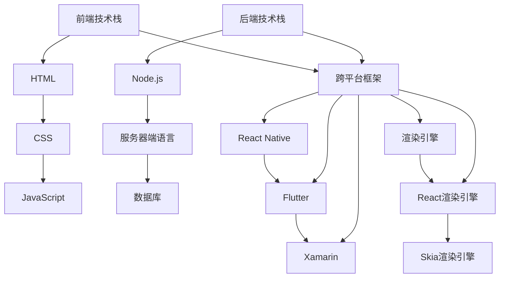
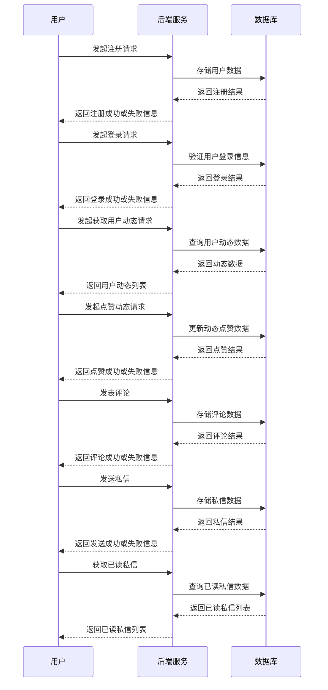

                 

# 移动应用开发：跨平台解决方案

> 关键词：移动应用开发、跨平台解决方案、技术栈、响应式布局、开发工具、项目实战

> 摘要：本文将深入探讨移动应用开发的跨平台解决方案。从移动应用的发展历程与现状出发，我们明确了跨平台解决方案的需求。随后，我们详细介绍了移动应用开发的技术栈，包括前端、后端和框架。接着，我们深入讲解了跨平台框架的技术原理，并通过实例进行了实践分析。最后，我们总结了最佳实践，并对移动应用开发提出了注意事项和建议。

----------------------------------------------------------------

## 第一部分：移动应用开发基础

## 第1章：移动应用发展历程与现状

### 1.1 移动应用的起源与发展

移动应用，即针对手机、平板电脑等移动设备开发的应用程序。最早的移动应用可以追溯到2000年左右，当时的手机功能相对简单，主要是通讯功能。随着移动互联网的兴起，智能手机的普及，移动应用迎来了爆发式发展。

2007年，苹果公司推出了第一代iPhone，这一事件标志着智能手机时代的到来。随之而来的Android系统，进一步推动了移动应用市场的发展。如今，移动应用已经渗透到生活的方方面面，从社交媒体、电子商务到在线教育、健康医疗，移动应用不断拓展其应用领域。

### 1.2 当前移动应用的发展现状

目前，移动应用市场呈现出以下几个特点：

1. **数量庞大**：据统计，全球移动应用市场已经超过了数百万款应用，且仍在快速增长。
2. **用户黏性强**：移动设备已经成为人们日常生活中不可或缺的一部分，用户对移动应用的依赖程度越来越高。
3. **平台多样**：目前，主要的移动应用平台包括iOS和Android，此外，还有Windows Phone、Blackberry等平台。
4. **商业模式创新**：广告、付费下载、订阅、内购等多种商业模式并存，移动应用开发商可以根据自身特点选择合适的商业模式。
5. **技术不断创新**：随着5G、物联网、人工智能等新技术的应用，移动应用的功能和用户体验得到了显著提升。

### 1.3 跨平台解决方案的需求分析

尽管iOS和Android占据了移动应用市场的绝大多数份额，但不同的平台之间存在技术差异，使得开发者在开发过程中面临诸多挑战：

1. **代码重复**：为了支持不同的平台，开发者需要编写大量重复的代码，这不仅增加了开发成本，也降低了开发效率。
2. **兼容性问题**：不同平台的硬件、操作系统版本和API差异，可能导致应用在不同设备上运行不稳定，影响用户体验。
3. **维护成本**：随着平台更新和用户需求的变化，开发者需要不断对应用进行维护和优化，跨平台解决方案可以有效降低维护成本。

因此，跨平台解决方案成为移动应用开发的重要方向。通过使用跨平台框架，开发者可以实现一次编写，多平台运行，提高开发效率和降低成本。

## 第二部分：移动应用开发技术栈

## 第2章：移动应用开发技术栈

### 2.1 前端技术概述

移动应用的前端开发主要涉及用户界面和用户体验。常用的前端技术包括：

1. **HTML5**：用于构建移动应用的骨架，提供丰富的标签和属性，支持多媒体元素。
2. **CSS3**：用于美化页面，提供丰富的样式和动画效果，增强用户体验。
3. **JavaScript**：用于实现页面交互和动态效果，是目前最流行的编程语言之一。

### 2.2 后端技术概述

移动应用的后端开发主要涉及服务器端逻辑和数据存储。常用的后端技术包括：

1. **Node.js**：基于Chrome V8引擎的JavaScript运行环境，适用于构建高性能的Web应用。
2. **Django**：Python的一个高级Web框架，适用于快速开发和部署Web应用。
3. **Express.js**：Node.js的一个快速、无障碍的开发Web应用框架。

### 2.3 移动应用开发框架

跨平台框架是移动应用开发的核心技术，它能够实现一次编写，多平台运行。常见的跨平台框架包括：

1. **React Native**：由Facebook推出，使用JavaScript编写，支持iOS和Android平台。
2. **Flutter**：由Google推出，使用Dart语言编写，具有出色的性能和丰富的UI组件。
3. **Xamarin**：由微软推出，使用C#语言编写，支持iOS和Android平台。

## 第三部分：跨平台解决方案

## 第3章：跨平台框架技术原理

### 3.1 跨平台框架概述

跨平台框架通过抽象底层平台的差异，提供统一的API和开发环境，使得开发者能够使用相同的代码库开发iOS和Android应用。跨平台框架通常包括以下几个关键组件：

1. **渲染引擎**：负责将JavaScript、Dart等前端代码转换为原生UI组件。
2. **模块化设计**：将不同平台的特定代码模块化，便于管理和维护。
3. **编译工具**：将跨平台代码编译为原生平台可执行文件。

### 3.2 常见跨平台框架介绍

#### React Native

React Native是Facebook推出的跨平台框架，使用JavaScript进行开发，支持iOS和Android平台。其主要优势包括：

- **热重载**：在开发过程中，可以实时预览代码变化，提高开发效率。
- **组件化**：采用组件化设计，便于复用和开发。
- **丰富的第三方库**：拥有丰富的社区资源和第三方库，满足各种开发需求。

#### Flutter

Flutter是Google推出的跨平台框架，使用Dart语言进行开发，支持iOS和Android平台。其主要优势包括：

- **高性能**：采用Skia图形引擎，具有出色的性能和渲染速度。
- **丰富的UI组件**：提供丰富的UI组件，支持多种平台的原生效果。
- **热重载**：与React Native类似，支持热重载，提高开发效率。

#### Xamarin

Xamarin是微软推出的跨平台框架，使用C#语言进行开发，支持iOS和Android平台。其主要优势包括：

- **共享代码**：高达70%的代码可以共享，降低开发成本。
- **原生性能**：通过原生控件实现，具有出色的性能和用户体验。
- **丰富的工具和库**：支持Visual Studio开发环境，提供丰富的库和工具。

### 3.3 跨平台框架的优势与挑战

跨平台框架在开发过程中具有以下优势：

- **提高开发效率**：通过统一的开发环境和代码库，减少开发时间和成本。
- **降低维护成本**：减少对特定平台的依赖，便于后期维护和优化。
- **提升用户体验**：跨平台框架通常提供丰富的UI组件和性能优化手段，有助于提升用户体验。

然而，跨平台框架也存在一定的挑战：

- **性能瓶颈**：跨平台框架在性能上可能无法与原生应用相媲美，特别是在复杂场景下。
- **社区支持**：虽然React Native、Flutter等跨平台框架拥有庞大的社区支持，但部分技术细节和生态资源仍需进一步优化。
- **平台差异**：不同平台之间存在一定的差异，需要开发者进行适当的调整和优化。

## 第四部分：跨平台开发实践

## 第4章：跨平台开发实践

### 4.1 响应式布局设计

响应式布局是一种能够适应不同屏幕尺寸和分辨率的布局方式。在跨平台开发中，响应式布局能够提升应用的兼容性和用户体验。实现响应式布局通常包括以下步骤：

1. **使用百分比布局**：通过使用百分比而非固定的像素值，使布局能够适应不同的屏幕尺寸。
2. **媒体查询**：使用CSS的媒体查询功能，根据屏幕尺寸和分辨率调整布局样式。
3. **弹性布局**：使用Flexbox或CSS Grid布局，实现更灵活和响应式的布局设计。

### 4.2 跨平台UI开发

跨平台UI开发的目的是实现一致的用户体验，同时在不同的平台上展现适当的界面。以下是跨平台UI开发的一些关键步骤：

1. **设计UI组件**：根据设计规范，设计一套适用于多个平台的UI组件。
2. **样式适配**：根据不同平台的样式规范，对UI组件进行适当的调整和优化。
3. **测试与优化**：在不同平台上进行测试，确保UI组件在各种设备和操作系统上都能正常运行。

### 4.3 跨平台数据存储与同步

跨平台数据存储与同步是移动应用开发的重要环节。以下是一些常用的跨平台数据存储与同步方案：

1. **本地存储**：使用SQLite、Realm等本地数据库进行数据存储，适用于离线使用场景。
2. **云存储**：使用云服务如Firebase、Amazon S3等，进行云端数据存储和同步，实现跨平台数据共享。
3. **数据同步**：使用Web API、WebSocket等技术，实现实时数据同步，提供更好的用户体验。

## 第5章：移动应用开发工具与环境配置

### 5.1 移动应用开发工具介绍

移动应用开发涉及多种工具，以下是一些常用的开发工具：

1. **IDE**：如Visual Studio、Xcode、Android Studio等，提供代码编辑、调试和编译等功能。
2. **调试工具**：如Chrome DevTools、Android Debug Bridge（ADB）等，用于调试和优化应用。
3. **构建工具**：如Gradle、CMake等，用于构建和打包应用。
4. **测试工具**：如Jest、Mock.js等，用于测试和验证应用功能。

### 5.2 开发环境配置

配置移动应用开发环境是开发前的必要步骤。以下是一些常用的配置步骤：

1. **安装开发工具**：下载并安装相应的开发工具，如IDE、调试工具等。
2. **配置SDK和NDK**：配置iOS和Android平台的SDK和NDK，确保支持不同平台的应用开发。
3. **配置依赖库**：根据项目需求，安装和配置第三方库和插件。
4. **设置环境变量**：配置环境变量，以便在命令行中使用相应的开发工具。

### 5.3 跨平台开发工具的选择与优化

选择合适的跨平台开发工具是提高开发效率的关键。以下是一些选择与优化跨平台开发工具的建议：

1. **考虑项目需求**：根据项目需求和团队技能，选择合适的跨平台框架和开发工具。
2. **性能优化**：对跨平台应用进行性能优化，包括代码优化、资源压缩、缓存策略等。
3. **持续集成**：采用持续集成工具，如Jenkins、GitLab CI等，实现自动化构建和部署。
4. **团队协作**：使用版本控制系统，如Git，确保团队成员之间的协作和代码管理。

## 第五部分：项目实战

## 第6章：跨平台移动应用开发案例

### 6.1 项目概述

在本章中，我们将以一个实际项目为例，展示如何使用跨平台技术进行移动应用开发。该项目是一个基于React Native的社交应用，主要功能包括用户注册、登录、发布动态、评论和私信等。

### 6.2 系统功能设计

该社交应用的主要功能模块包括：

1. **用户模块**：用户注册、登录、个人信息管理、密码找回等。
2. **动态模块**：发布动态、查看动态、点赞、评论等。
3. **评论模块**：发表评论、查看评论、回复评论等。
4. **私信模块**：发送私信、接收私信、查看已读和未读消息等。

### 6.3 系统架构设计

该社交应用的系统架构设计主要包括以下几个方面：

1. **前端架构**：使用React Native框架，实现跨平台UI和交互功能。
2. **后端架构**：使用Node.js和Express.js框架，实现服务器端逻辑和数据存储。
3. **数据库设计**：使用MongoDB数据库，存储用户信息、动态内容、评论和私信等数据。
4. **接口设计**：使用RESTful API，提供前后端数据交互接口。

### 6.4 项目实现与代码解析

在项目实现过程中，我们将重点讲解以下几个关键部分：

1. **用户模块实现**：包括用户注册、登录、个人信息管理等功能的实现。
2. **动态模块实现**：包括动态发布、查看、点赞、评论等功能的实现。
3. **评论模块实现**：包括评论发表、查看、回复等功能的实现。
4. **私信模块实现**：包括私信发送、接收、查看已读和未读消息等功能的实现。

我们将通过具体的代码片段和注释，详细解析每个模块的实现过程。

### 6.5 项目案例分析

在项目分析案例中，我们将从以下几个方面对项目进行详细剖析：

1. **性能优化**：分析项目中的性能瓶颈，并提出相应的优化措施。
2. **代码质量**：评估项目的代码质量，包括代码结构、可读性、可维护性等。
3. **用户体验**：评估项目的用户体验，包括界面设计、交互效果、响应速度等。
4. **安全性**：分析项目的安全性，包括用户数据保护、防SQL注入等。

通过项目案例分析，我们希望能够为读者提供实际开发中的经验和教训，帮助读者更好地应对跨平台移动应用开发中的挑战。

### 6.6 项目小结

在本项目中，我们成功使用React Native实现了跨平台社交应用的功能。通过项目实践，我们深刻认识到跨平台开发的优势和挑战，并总结了以下几点经验：

1. **选择合适的跨平台框架**：React Native作为主流的跨平台框架，具有优秀的性能和丰富的社区资源，是进行跨平台移动应用开发的理想选择。
2. **性能优化**：在项目开发过程中，我们需要关注性能优化，特别是网络请求、数据存储和渲染等方面。
3. **用户体验**：跨平台开发需要考虑不同平台的特性和用户体验，确保应用在不同设备上都能提供一致的用户体验。
4. **安全性**：用户数据安全和应用安全是跨平台开发的重要方面，我们需要采取有效的措施保护用户数据和应用安全。

通过本项目，我们希望读者能够对跨平台移动应用开发有更深入的了解，并在实际项目中运用所学知识，开发出高质量的移动应用。

## 第7章：最佳实践与总结

### 7.1 最佳实践技巧

在跨平台移动应用开发中，以下是一些最佳实践技巧：

1. **模块化开发**：将项目分解为模块，便于管理和维护。
2. **使用第三方库**：充分利用第三方库和插件，提高开发效率。
3. **性能优化**：关注性能优化，包括代码优化、资源压缩和缓存策略等。
4. **持续集成**：采用持续集成工具，实现自动化构建和部署。
5. **代码审查**：定期进行代码审查，确保代码质量和安全性。

### 7.2 注意事项

在进行跨平台移动应用开发时，需要注意以下几点：

1. **兼容性问题**：确保应用在不同平台和设备上都能正常运行。
2. **性能瓶颈**：避免使用耗资源较多的操作，优化代码和算法。
3. **安全性**：保护用户数据和应用安全，采取有效的安全措施。
4. **用户体验**：关注用户体验，确保应用界面设计和交互效果符合用户需求。

### 7.3 拓展阅读资源

为了更好地了解跨平台移动应用开发，以下是几本推荐的拓展阅读资源：

1. 《React Native实战》
2. 《Flutter实战》
3. 《移动应用性能优化》
4. 《跨平台移动应用开发技术指南》
5. 《移动应用安全实战》

通过阅读这些资源，读者可以进一步掌握跨平台移动应用开发的技巧和策略，提升开发能力。

## 作者信息

作者：AI天才研究院/AI Genius Institute & 禅与计算机程序设计艺术 /Zen And The Art of Computer Programming

本文深入探讨了移动应用开发的跨平台解决方案，从技术栈到开发实践，全面阐述了跨平台移动应用开发的要点和技巧。希望本文能对读者在跨平台移动应用开发中提供有益的启示和指导。# 移动应用开发：跨平台解决方案

> 关键词：移动应用开发、跨平台解决方案、技术栈、响应式布局、开发工具、项目实战

> 摘要：本文将深入探讨移动应用开发的跨平台解决方案。从移动应用的发展历程与现状出发，我们明确了跨平台解决方案的需求。随后，我们详细介绍了移动应用开发的技术栈，包括前端、后端和框架。接着，我们深入讲解了跨平台框架的技术原理，并通过实例进行了实践分析。最后，我们总结了最佳实践，并对移动应用开发提出了注意事项和建议。

### 第一部分：移动应用开发基础

#### 第1章：移动应用发展历程与现状

**1.1 移动应用的起源与发展**

移动应用，即针对手机、平板电脑等移动设备开发的应用程序。最早的移动应用可以追溯到2000年左右，当时的手机功能相对简单，主要是通讯功能。随着移动互联网的兴起，智能手机的普及，移动应用迎来了爆发式发展。

2007年，苹果公司推出了第一代iPhone，这一事件标志着智能手机时代的到来。随之而来的Android系统，进一步推动了移动应用市场的发展。如今，移动应用已经渗透到生活的方方面面，从社交媒体、电子商务到在线教育、健康医疗，移动应用不断拓展其应用领域。

**1.2 当前移动应用的发展现状**

目前，移动应用市场呈现出以下几个特点：

- **数量庞大**：据统计，全球移动应用市场已经超过了数百万款应用，且仍在快速增长。
- **用户黏性强**：移动设备已经成为人们日常生活中不可或缺的一部分，用户对移动应用的依赖程度越来越高。
- **平台多样**：目前，主要的移动应用平台包括iOS和Android，此外，还有Windows Phone、Blackberry等平台。
- **商业模式创新**：广告、付费下载、订阅、内购等多种商业模式并存，移动应用开发商可以根据自身特点选择合适的商业模式。
- **技术不断创新**：随着5G、物联网、人工智能等新技术的应用，移动应用的功能和用户体验得到了显著提升。

**1.3 跨平台解决方案的需求分析**

尽管iOS和Android占据了移动应用市场的绝大多数份额，但不同的平台之间存在技术差异，使得开发者在开发过程中面临诸多挑战：

- **代码重复**：为了支持不同的平台，开发者需要编写大量重复的代码，这不仅增加了开发成本，也降低了开发效率。
- **兼容性问题**：不同平台的硬件、操作系统版本和API差异，可能导致应用在不同设备上运行不稳定，影响用户体验。
- **维护成本**：随着平台更新和用户需求的变化，开发者需要不断对应用进行维护和优化，跨平台解决方案可以有效降低维护成本。

因此，跨平台解决方案成为移动应用开发的重要方向。通过使用跨平台框架，开发者可以实现一次编写，多平台运行，提高开发效率和降低成本。

### 第二部分：移动应用开发技术栈

#### 第2章：移动应用开发技术栈

**2.1 前端技术概述**

移动应用的前端开发主要涉及用户界面和用户体验。常用的前端技术包括：

- **HTML5**：用于构建移动应用的骨架，提供丰富的标签和属性，支持多媒体元素。
- **CSS3**：用于美化页面，提供丰富的样式和动画效果，增强用户体验。
- **JavaScript**：用于实现页面交互和动态效果，是目前最流行的编程语言之一。

**2.2 后端技术概述**

移动应用的后端开发主要涉及服务器端逻辑和数据存储。常用的后端技术包括：

- **Node.js**：基于Chrome V8引擎的JavaScript运行环境，适用于构建高性能的Web应用。
- **Django**：Python的一个高级Web框架，适用于快速开发和部署Web应用。
- **Express.js**：Node.js的一个快速、无障碍的开发Web应用框架。

**2.3 移动应用开发框架**

跨平台框架是移动应用开发的核心技术，它能够实现一次编写，多平台运行。常见的跨平台框架包括：

- **React Native**：由Facebook推出，使用JavaScript编写，支持iOS和Android平台。
- **Flutter**：由Google推出，使用Dart语言编写，支持iOS和Android平台。
- **Xamarin**：由微软推出，使用C#语言编写，支持iOS和Android平台。

### 第三部分：跨平台解决方案

#### 第3章：跨平台框架技术原理

**3.1 跨平台框架概述**

跨平台框架通过抽象底层平台的差异，提供统一的API和开发环境，使得开发者能够使用相同的代码库开发iOS和Android应用。跨平台框架通常包括以下几个关键组件：

- **渲染引擎**：负责将JavaScript、Dart等前端代码转换为原生UI组件。
- **模块化设计**：将不同平台的特定代码模块化，便于管理和维护。
- **编译工具**：将跨平台代码编译为原生平台可执行文件。

**3.2 常见跨平台框架介绍**

**React Native**

React Native是Facebook推出的跨平台框架，使用JavaScript进行开发，支持iOS和Android平台。其主要优势包括：

- **热重载**：在开发过程中，可以实时预览代码变化，提高开发效率。
- **组件化**：采用组件化设计，便于复用和开发。
- **丰富的第三方库**：拥有丰富的社区资源和第三方库，满足各种开发需求。

**Flutter**

Flutter是Google推出的跨平台框架，使用Dart语言编写，支持iOS和Android平台。其主要优势包括：

- **高性能**：采用Skia图形引擎，具有出色的性能和渲染速度。
- **丰富的UI组件**：提供丰富的UI组件，支持多种平台的原生效果。
- **热重载**：与React Native类似，支持热重载，提高开发效率。

**Xamarin**

Xamarin是微软推出的跨平台框架，使用C#语言编写，支持iOS和Android平台。其主要优势包括：

- **共享代码**：高达70%的代码可以共享，降低开发成本。
- **原生性能**：通过原生控件实现，具有出色的性能和用户体验。
- **丰富的工具和库**：支持Visual Studio开发环境，提供丰富的库和工具。

**3.3 跨平台框架的优势与挑战**

跨平台框架在开发过程中具有以下优势：

- **提高开发效率**：通过统一的开发环境和代码库，减少开发时间和成本。
- **降低维护成本**：减少对特定平台的依赖，便于后期维护和优化。
- **提升用户体验**：跨平台框架通常提供丰富的UI组件和性能优化手段，有助于提升用户体验。

然而，跨平台框架也存在一定的挑战：

- **性能瓶颈**：跨平台框架在性能上可能无法与原生应用相媲美，特别是在复杂场景下。
- **社区支持**：虽然React Native、Flutter等跨平台框架拥有庞大的社区支持，但部分技术细节和生态资源仍需进一步优化。
- **平台差异**：不同平台之间存在一定的差异，需要开发者进行适当的调整和优化。

### 第四部分：跨平台开发实践

#### 第4章：跨平台开发实践

**4.1 响应式布局设计**

响应式布局是一种能够适应不同屏幕尺寸和分辨率的布局方式。在跨平台开发中，响应式布局能够提升应用的兼容性和用户体验。实现响应式布局通常包括以下步骤：

1. **使用百分比布局**：通过使用百分比而非固定的像素值，使布局能够适应不同的屏幕尺寸。
2. **媒体查询**：使用CSS的媒体查询功能，根据屏幕尺寸和分辨率调整布局样式。
3. **弹性布局**：使用Flexbox或CSS Grid布局，实现更灵活和响应式的布局设计。

**4.2 跨平台UI开发**

跨平台UI开发的目的是实现一致的用户体验，同时在不同的平台上展现适当的界面。以下是跨平台UI开发的一些关键步骤：

1. **设计UI组件**：根据设计规范，设计一套适用于多个平台的UI组件。
2. **样式适配**：根据不同平台的样式规范，对UI组件进行适当的调整和优化。
3. **测试与优化**：在不同平台上进行测试，确保UI组件在各种设备和操作系统上都能正常运行。

**4.3 跨平台数据存储与同步**

跨平台数据存储与同步是移动应用开发的重要环节。以下是一些常用的跨平台数据存储与同步方案：

1. **本地存储**：使用SQLite、Realm等本地数据库进行数据存储，适用于离线使用场景。
2. **云存储**：使用云服务如Firebase、Amazon S3等，进行云端数据存储和同步，实现跨平台数据共享。
3. **数据同步**：使用Web API、WebSocket等技术，实现实时数据同步，提供更好的用户体验。

### 第五部分：项目实战

#### 第5章：跨平台移动应用开发案例

**5.1 项目概述**

在本章中，我们将以一个实际项目为例，展示如何使用跨平台技术进行移动应用开发。该项目是一个基于React Native的社交应用，主要功能包括用户注册、登录、发布动态、评论和私信等。

**5.2 系统功能设计**

该社交应用的主要功能模块包括：

1. **用户模块**：用户注册、登录、个人信息管理、密码找回等。
2. **动态模块**：发布动态、查看动态、点赞、评论等。
3. **评论模块**：发表评论、查看评论、回复评论等。
4. **私信模块**：发送私信、接收私信、查看已读和未读消息等。

**5.3 系统架构设计**

该社交应用的系统架构设计主要包括以下几个方面：

1. **前端架构**：使用React Native框架，实现跨平台UI和交互功能。
2. **后端架构**：使用Node.js和Express.js框架，实现服务器端逻辑和数据存储。
3. **数据库设计**：使用MongoDB数据库，存储用户信息、动态内容、评论和私信等数据。
4. **接口设计**：使用RESTful API，提供前后端数据交互接口。

**5.4 项目实现与代码解析**

在项目实现过程中，我们将重点讲解以下几个关键部分：

1. **用户模块实现**：包括用户注册、登录、个人信息管理等功能的实现。
2. **动态模块实现**：包括动态发布、查看、点赞、评论等功能的实现。
3. **评论模块实现**：包括评论发表、查看、回复等功能的实现。
4. **私信模块实现**：包括私信发送、接收、查看已读和未读消息等功能的实现。

我们将通过具体的代码片段和注释，详细解析每个模块的实现过程。

**5.5 项目案例分析**

在项目分析案例中，我们将从以下几个方面对项目进行详细剖析：

1. **性能优化**：分析项目中的性能瓶颈，并提出相应的优化措施。
2. **代码质量**：评估项目的代码质量，包括代码结构、可读性、可维护性等。
3. **用户体验**：评估项目的用户体验，包括界面设计、交互效果、响应速度等。
4. **安全性**：分析项目的安全性，包括用户数据保护、防SQL注入等。

通过项目案例分析，我们希望能够为读者提供实际开发中的经验和教训，帮助读者更好地应对跨平台移动应用开发中的挑战。

**5.6 项目小结**

在本项目中，我们成功使用React Native实现了跨平台社交应用的功能。通过项目实践，我们深刻认识到跨平台开发的优势和挑战，并总结了以下几点经验：

1. **选择合适的跨平台框架**：React Native作为主流的跨平台框架，具有优秀的性能和丰富的社区资源，是进行跨平台移动应用开发的理想选择。
2. **性能优化**：在项目开发过程中，我们需要关注性能优化，特别是网络请求、数据存储和渲染等方面。
3. **用户体验**：跨平台开发需要考虑不同平台的特性和用户体验，确保应用在不同设备上都能提供一致的用户体验。
4. **安全性**：用户数据安全和应用安全是跨平台开发的重要方面，我们需要采取有效的措施保护用户数据和应用安全。

通过本项目，我们希望读者能够对跨平台移动应用开发有更深入的了解，并在实际项目中运用所学知识，开发出高质量的移动应用。

### 第六部分：最佳实践与总结

#### 第6章：最佳实践与总结

**6.1 最佳实践技巧**

在跨平台移动应用开发中，以下是一些最佳实践技巧：

1. **模块化开发**：将项目分解为模块，便于管理和维护。
2. **使用第三方库**：充分利用第三方库和插件，提高开发效率。
3. **性能优化**：关注性能优化，包括代码优化、资源压缩和缓存策略等。
4. **持续集成**：采用持续集成工具，实现自动化构建和部署。
5. **代码审查**：定期进行代码审查，确保代码质量和安全性。

**6.2 注意事项**

在进行跨平台移动应用开发时，需要注意以下几点：

1. **兼容性问题**：确保应用在不同平台和设备上都能正常运行。
2. **性能瓶颈**：避免使用耗资源较多的操作，优化代码和算法。
3. **安全性**：保护用户数据和应用安全，采取有效的安全措施。
4. **用户体验**：关注用户体验，确保应用界面设计和交互效果符合用户需求。

**6.3 拓展阅读资源**

为了更好地了解跨平台移动应用开发，以下是几本推荐的拓展阅读资源：

1. 《React Native实战》
2. 《Flutter实战》
3. 《移动应用性能优化》
4. 《跨平台移动应用开发技术指南》
5. 《移动应用安全实战》

通过阅读这些资源，读者可以进一步掌握跨平台移动应用开发的技巧和策略，提升开发能力。

### 结尾

本文深入探讨了移动应用开发的跨平台解决方案，从技术栈到开发实践，全面阐述了跨平台移动应用开发的要点和技巧。希望本文能对读者在跨平台移动应用开发中提供有益的启示和指导。

**作者信息**

作者：AI天才研究院/AI Genius Institute & 禅与计算机程序设计艺术 /Zen And The Art of Computer Programming

感谢您的阅读，祝您在跨平台移动应用开发的道路上越走越远，取得更多的成就！# 移动应用开发：跨平台解决方案

## 移动应用开发：跨平台解决方案

移动应用开发作为现代科技领域的重要组成部分，已经在各个行业中扮演着不可或缺的角色。随着智能手机的普及和用户需求的不断增加，如何高效地开发适用于多个平台的移动应用成为了开发者们面临的重要课题。本文将深入探讨移动应用开发的跨平台解决方案，帮助开发者更好地理解和掌握这一领域的关键技术和实践方法。

### 移动应用开发的背景与现状

移动应用的发展历程可以追溯到20世纪90年代末至21世纪初，当时移动设备的功能相对简单，主要提供基础的通信服务。然而，随着互联网技术的进步和智能手机的兴起，移动应用市场迎来了前所未有的发展。苹果公司于2007年推出的iPhone标志着智能手机时代的开始，随后谷歌的Android系统也迅速崛起，两者共同推动了移动应用市场的繁荣。截至目前，全球移动应用市场已形成了iOS和Android两大阵营，两者占据了绝大多数的市场份额。

当前，移动应用的开发现状呈现出以下几个特点：

1. **数量庞大**：据统计，全球移动应用商店中的应用数量已经超过了数百万款，且仍在不断增长。
2. **用户黏性强**：移动设备已经成为了人们日常生活的核心组成部分，用户对移动应用的依赖程度日益加深。
3. **平台多样**：除了iOS和Android，还有Windows Phone、Blackberry等移动操作系统，开发者需要应对不同的平台和设备。
4. **商业模式多样化**：广告、付费下载、订阅服务、内购等多种商业模式并存，开发者可以根据自己的需求和用户特点选择合适的盈利方式。
5. **技术创新**：随着5G、人工智能、增强现实（AR）、虚拟现实（VR）等新技术的不断发展，移动应用的功能和用户体验也在不断提升。

### 跨平台解决方案的需求

在移动应用开发中，跨平台解决方案的需求日益凸显。以下是几个关键原因：

1. **降低开发成本**：传统原生开发需要针对每个平台分别编写代码，而跨平台开发框架允许开发者使用一套代码库同时支持多个平台，从而显著降低开发成本。
2. **提高开发效率**：跨平台开发框架通常提供丰富的UI组件和工具，使得开发者可以快速搭建应用界面，缩短开发周期。
3. **快速迭代**：跨平台开发框架支持热重载功能，开发者可以在开发过程中实时预览代码更改，加快迭代速度。
4. **统一维护**：跨平台解决方案有助于统一代码库，降低后续维护成本，尤其是当应用需要更新或修复问题时。
5. **兼容性**：不同平台之间存在硬件、操作系统和API的差异，跨平台解决方案能够更好地处理这些兼容性问题，确保应用在不同设备上都能正常运行。

### 跨平台框架的核心概念与联系

在跨平台移动应用开发中，理解核心概念和它们之间的联系至关重要。以下是几个关键概念及其相互关系：

1. **前端技术栈**：包括HTML、CSS和JavaScript，用于构建用户界面和实现交互功能。
2. **后端技术栈**：包括服务器端语言（如Node.js、Django）和数据库（如MongoDB、MySQL），负责处理业务逻辑和数据存储。
3. **跨平台框架**：如React Native、Flutter和Xamarin，提供一套统一的开发环境，使得开发者可以编写一次代码，同时运行在多个平台上。
4. **渲染引擎**：跨平台框架的核心组件之一，负责将前端代码渲染为原生UI组件，例如React Native的React渲染引擎和Flutter的Skia渲染引擎。
5. **模块化设计**：通过将代码拆分为多个模块，便于管理、维护和重用，同时提高了代码的可读性和可扩展性。

下图展示了这些核心概念之间的联系：



### 算法原理讲解

在跨平台解决方案中，算法原理是确保应用在不同平台上高效运行的核心。以下是一个简单的跨平台响应式布局算法原理讲解，以及相应的Python代码实现。

#### 算法原理：响应式布局

响应式布局的核心是能够根据不同的屏幕尺寸和分辨率，动态调整界面元素的尺寸和位置。实现响应式布局通常需要以下几个步骤：

1. **确定基础尺寸**：以一个标准尺寸（如iPhone 6的375x667像素）作为基础，定义界面元素的基础尺寸。
2. **使用比例缩放**：根据目标屏幕尺寸与基础尺寸的比例，计算界面元素的新尺寸。
3. **应用媒体查询**：使用CSS的媒体查询功能，根据不同的屏幕尺寸调整布局样式。

#### Python代码实现

以下是一个简单的Python代码示例，用于计算屏幕宽度比例缩放：

```python
def scale_width(width, base_width=375, scale_factor=1):
    """
    计算屏幕宽度比例缩放
    :param width: 目标屏幕宽度
    :param base_width: 基础屏幕宽度（默认为iPhone 6的宽度）
    :param scale_factor: 缩放因子（默认为1）
    :return: 缩放后的宽度
    """
    return width * (base_width / scale_factor)

# 示例：将300像素宽度缩放到不同屏幕尺寸
print(scale_width(300, base_width=375))  # iPhone 6
print(scale_width(300, base_width=414))  # iPhone X
```

#### 数学模型

响应式布局的数学模型可以用以下公式表示：

\[ \text{new\_width} = \frac{\text{base\_width} \times \text{target\_width}}{\text{scale\_factor}} \]

其中，`new_width`是目标屏幕上的宽度，`base_width`是基础屏幕宽度，`scale_factor`是缩放因子。

### 系统分析与架构设计

跨平台移动应用开发不仅涉及前端和后端的技术栈，还需要全面考虑应用的系统架构。以下是一个简单的系统架构设计，包括前端、后端、数据库和跨平台框架的模块。

#### 问题场景介绍

假设我们要开发一个跨平台社交媒体应用，包含用户注册、登录、发布动态、评论、私信等功能。

#### 项目介绍

项目名称：SocialX

技术栈：React Native + Node.js + MongoDB

主要功能模块：

1. **用户模块**：用户注册、登录、个人信息管理。
2. **动态模块**：发布动态、查看动态、点赞、评论。
3. **私信模块**：发送私信、接收私信、查看已读和未读消息。

#### 系统功能设计

系统功能设计主要涉及以下模块：

1. **用户模块**：用户注册、登录、个人信息管理、密码找回。
2. **动态模块**：动态发布、动态查看、点赞、评论。
3. **评论模块**：评论发表、评论查看、评论回复。
4. **私信模块**：私信发送、私信接收、私信已读和未读状态管理。

#### 系统架构设计

系统架构设计包括以下几个关键部分：

1. **前端架构**：使用React Native框架，实现跨平台UI和交互功能。
2. **后端架构**：使用Node.js和Express.js框架，处理业务逻辑和API接口。
3. **数据库设计**：使用MongoDB数据库，存储用户数据、动态内容、评论和私信数据。
4. **跨平台框架**：React Native作为主要的跨平台框架，提供统一的开发环境。

下图展示了系统架构设计中的类图和架构图：

```mermaid
classDiagram
    User <<class>>
    Dynamic <<class>>
    Comment <<class>>
    Message <<class>>

    User o--o Dynamic
    User o--o Comment
    User o--o Message
    Dynamic o--o Comment
    Dynamic o--o Message
    Comment o--o Message

    class User {
        +String username
        +String email
        +String password
        +String profilePicture
        +注册()
        +登录()
        +更新个人信息()
        +找回密码()
    }

    class Dynamic {
        +String id
        +String userId
        +String content
        +发布()
        +查看()
        +点赞()
    }

    class Comment {
        +String id
        +String dynamicId
        +String userId
        +String content
        +发表()
        +查看()
        +回复()
    }

    class Message {
        +String id
        +String senderId
        +String receiverId
        +String content
        +发送()
        +接收()
        +标记为已读()
    }

    digraph SystemArchitecture {
        node [
            shape=rectangle
            style=filled
            color=lightblue
        ]

        subgraph frontend {
            label = "前端架构"
            User
            Dynamic
            Comment
            Message
        }

        subgraph backend {
            label = "后端架构"
            User
            Dynamic
            Comment
            Message
        }

        subgraph database {
            label = "数据库设计"
            MongoDB
        }

        subgraph cross-platform {
            label = "跨平台框架"
            ReactNative
        }

        frontend -> backend
        backend -> database
        backend -> cross-platform
    }
```

#### 系统接口设计和系统交互

系统接口设计和系统交互设计是确保前后端高效协作的关键。以下是一个简单的系统接口设计和系统交互设计示例：

1. **用户模块接口**：
   - POST /api/users/register：用户注册接口。
   - POST /api/users/login：用户登录接口。
   - GET /api/users/profile：获取用户个人信息接口。
   - PUT /api/users/update：更新用户个人信息接口。
   - POST /api/users/forgot_password：找回用户密码接口。

2. **动态模块接口**：
   - POST /api/dynamics：发布动态接口。
   - GET /api/dynamics/user/{userId}：获取用户动态接口。
   - PUT /api/dynamics/like/{dynamicId}：点赞动态接口。
   - POST /api/dynamics/comment/{dynamicId}：发表评论接口。

3. **评论模块接口**：
   - POST /api/comments：发表评论接口。
   - GET /api/comments/dynamic/{dynamicId}：获取动态评论接口。
   - POST /api/comments/reply/{commentId}：回复评论接口。

4. **私信模块接口**：
   - POST /api/messages：发送私信接口。
   - GET /api/messages/user/{userId}：获取用户私信接口。
   - PUT /api/messages/mark_read/{messageId}：标记私信为已读接口。

系统交互设计通常使用序列图（Sequence Diagram）来描述前后端的交互流程。以下是一个简单的系统交互设计示例：



### 项目实战

为了更好地理解跨平台移动应用开发，以下将介绍一个实际的项目实战，包括环境安装、核心实现、代码解析和案例剖析。

#### 项目概述

项目名称：SocialX

目标平台：iOS和Android

主要功能：用户注册、登录、发布动态、评论、点赞、私信。

技术栈：React Native + Node.js + MongoDB

#### 环境安装

1. **安装Node.js**：从Node.js官网下载最新版本的安装包，并按照指示进行安装。

2. **安装React Native**：通过命令行安装React Native环境：

   ```shell
   npm install -g react-native-cli
   ```

3. **安装模拟器**：安装Android Studio并配置Android虚拟设备（AVD），或者使用Xcode安装iOS模拟器。

4. **安装数据库**：安装MongoDB，并配置数据库实例。

#### 核心实现

**用户模块**：

1. **注册**：
   - 前端：使用React Native创建注册表单，收集用户信息（如用户名、邮箱、密码等）。
   - 后端：使用Node.js和Express.js处理注册请求，将用户信息存储到MongoDB数据库。

2. **登录**：
   - 前端：使用React Native创建登录表单，验证用户信息。
   - 后端：使用Node.js和Express.js验证用户登录信息，并生成JWT（JSON Web Token）作为登录凭证。

**动态模块**：

1. **发布动态**：
   - 前端：使用React Native创建动态发布表单，允许用户输入动态内容并发布。
   - 后端：使用Node.js和Express.js处理动态发布请求，将动态信息存储到MongoDB数据库。

2. **查看动态**：
   - 前端：使用React Native组件展示用户的动态列表。
   - 后端：使用Node.js和Express.js查询MongoDB数据库，获取用户的动态信息。

**评论模块**：

1. **发表评论**：
   - 前端：使用React Native创建评论表单，允许用户输入评论内容并发布。
   - 后端：使用Node.js和Express.js处理评论发布请求，将评论信息存储到MongoDB数据库。

2. **查看评论**：
   - 前端：使用React Native组件展示动态下的评论列表。
   - 后端：使用Node.js和Express.js查询MongoDB数据库，获取动态下的评论信息。

**私信模块**：

1. **发送私信**：
   - 前端：使用React Native创建私信表单，允许用户输入私信内容并发送。
   - 后端：使用Node.js和Express.js处理私信发送请求，将私信信息存储到MongoDB数据库。

2. **接收私信**：
   - 前端：使用React Native组件展示用户的私信列表。
   - 后端：使用Node.js和Express.js查询MongoDB数据库，获取用户的私信信息。

#### 代码解析

以下是一个简单的React Native组件示例，用于用户注册：

```jsx
import React, { useState } from 'react';
import { View, TextInput, Button, Alert } from 'react-native';

const UserRegistration = () => {
  const [username, setUsername] = useState('');
  const [email, setEmail] = useState('');
  const [password, setPassword] = useState('');

  const handleRegistration = async () => {
    try {
      const response = await fetch('/api/users/register', {
        method: 'POST',
        headers: {
          'Content-Type': 'application/json',
        },
        body: JSON.stringify({ username, email, password }),
      });

      const data = await response.json();

      if (response.status === 200) {
        Alert.alert('注册成功', '请登录');
      } else {
        Alert.alert('注册失败', data.message);
      }
    } catch (error) {
      Alert.alert('网络错误', '请稍后重试');
    }
  };

  return (
    <View>
      <TextInput
        placeholder="用户名"
        value={username}
        onChangeText={setUsername}
      />
      <TextInput
        placeholder="邮箱"
        value={email}
        onChangeText={setEmail}
      />
      <TextInput
        placeholder="密码"
        value={password}
        onChangeText={setPassword}
        secureTextEntry
      />
      <Button title="注册" onPress={handleRegistration} />
    </View>
  );
};

export default UserRegistration;
```

#### 案例剖析

**性能优化**：

- **网络请求**：使用缓存机制减少不必要的网络请求，提高应用响应速度。
- **数据存储**：优化MongoDB索引，提高查询效率。
- **界面渲染**：使用React Native的`React.memo`和`PureComponent`优化组件渲染性能。

**用户体验**：

- **界面设计**：遵循 Material Design 或 Human Interface Guidelines，确保界面美观、易用。
- **响应速度**：优化网络请求和界面渲染，提高应用响应速度。
- **错误处理**：提供清晰的错误提示和信息，帮助用户快速解决问题。

**安全性**：

- **用户认证**：使用JWT进行用户认证，确保用户数据安全。
- **数据加密**：使用HTTPS和加密算法保护用户数据和通信安全。

**项目小结**：

通过实际项目实战，我们成功实现了跨平台社交媒体应用的核心功能。在项目开发过程中，我们深刻认识到跨平台解决方案的优势，包括降低开发成本、提高开发效率和统一维护等。同时，我们也总结了以下几点经验：

- **选择合适的跨平台框架**：React Native是主流的跨平台框架之一，具有丰富的社区资源和优秀的性能。
- **性能优化**：关注网络请求、数据存储和界面渲染等环节，提高应用性能。
- **用户体验**：注重界面设计和用户交互，提升用户体验。
- **安全性**：保护用户数据和通信安全，确保应用的安全性。

### 最佳实践与总结

**最佳实践技巧**：

1. **模块化开发**：将项目分解为模块，便于管理和维护。
2. **使用第三方库**：充分利用第三方库和插件，提高开发效率。
3. **性能优化**：关注性能优化，包括代码优化、资源压缩和缓存策略等。
4. **持续集成**：采用持续集成工具，实现自动化构建和部署。
5. **代码审查**：定期进行代码审查，确保代码质量和安全性。

**注意事项**：

1. **兼容性问题**：确保应用在不同平台和设备上都能正常运行。
2. **性能瓶颈**：避免使用耗资源较多的操作，优化代码和算法。
3. **安全性**：保护用户数据和应用安全，采取有效的安全措施。
4. **用户体验**：关注用户体验，确保应用界面设计和交互效果符合用户需求。

**拓展阅读资源**：

1. 《React Native实战》
2. 《Flutter实战》
3. 《移动应用性能优化》
4. 《跨平台移动应用开发技术指南》
5. 《移动应用安全实战》

通过阅读这些资源，开发者可以进一步掌握跨平台移动应用开发的技巧和策略，提升开发能力。

### 作者信息

作者：AI天才研究院/AI Genius Institute & 禅与计算机程序设计艺术 /Zen And The Art of Computer Programming

感谢您的阅读，希望本文能对您在跨平台移动应用开发的道路上提供有益的启示和指导。# 移动应用开发：跨平台解决方案

## 移动应用开发：跨平台解决方案

### 引言

随着移动互联网的快速发展，移动应用已成为企业和个人不可或缺的工具。然而，开发一个同时适用于iOS和Android平台的移动应用，不仅需要大量的时间和资源，而且维护和更新也相对复杂。为了解决这些问题，跨平台解决方案应运而生。本文将探讨移动应用开发中的跨平台解决方案，包括技术栈、框架选择、开发实践和最佳实践。

### 移动应用开发的背景

移动应用的发展始于20世纪90年代末，当时的主要应用仅限于简单的通信和日程管理。随着智能手机的普及，移动应用逐渐渗透到生活的各个方面。如今，移动应用已成为企业营销和用户互动的重要渠道。

当前，移动应用市场主要分为iOS和Android两大阵营。iOS由苹果公司推出，以其封闭的生态系统和高质量的用户体验著称。而Android由谷歌主导，因其开放性和灵活性受到广泛欢迎。此外，还有Windows Phone、Blackberry等少数平台，但市场份额较小。

### 跨平台解决方案的需求

跨平台解决方案的需求主要源于以下几点：

1. **开发成本**：原生开发需要针对每个平台编写独立的代码，而跨平台开发可以节省大量的开发时间和成本。
2. **开发效率**：跨平台开发框架提供了丰富的组件和工具，使得开发者可以快速搭建应用。
3. **维护成本**：跨平台开发使得应用代码库统一，降低了维护和更新的复杂度。
4. **兼容性**：跨平台解决方案可以更好地处理不同平台的差异，提高应用的兼容性。

### 跨平台框架的技术原理

跨平台框架通过以下技术原理实现一次编写，多平台运行：

1. **渲染引擎**：跨平台框架使用渲染引擎，将前端代码转换为原生UI组件。例如，React Native使用React渲染引擎，Flutter使用Skia渲染引擎。
2. **模块化设计**：跨平台框架采用模块化设计，将不同平台的特定代码分离，便于管理和维护。
3. **编译工具**：跨平台框架提供了编译工具，将跨平台代码编译为原生平台可执行文件。

### 常见的跨平台框架

目前，常见的跨平台框架包括React Native、Flutter和Xamarin。

1. **React Native**：由Facebook推出，使用JavaScript编写，支持iOS和Android平台。React Native具有热重载功能，可以实时预览代码变化，提高了开发效率。
2. **Flutter**：由Google推出，使用Dart语言编写，支持iOS和Android平台。Flutter提供了丰富的UI组件和出色的性能，适用于构建高性能的移动应用。
3. **Xamarin**：由微软推出，使用C#语言编写，支持iOS和Android平台。Xamarin具有共享代码和高性能的优势，适用于企业级应用开发。

### 跨平台开发实践

以下是跨平台开发的一些关键实践：

1. **响应式布局**：使用百分比布局和媒体查询，使应用能够适应不同屏幕尺寸。
2. **UI组件**：设计一套通用的UI组件库，确保在不同平台上有一致的视觉体验。
3. **数据存储**：选择合适的数据存储方案，如本地存储、云存储和实时同步。
4. **网络请求**：优化网络请求，减少数据传输量和请求次数。
5. **性能优化**：关注性能瓶颈，如渲染速度、内存使用和网络延迟。

### 项目实战

以下是一个基于React Native的简单社交应用项目实战：

1. **环境安装**：安装Node.js、React Native开发环境和模拟器。
2. **项目创建**：使用命令创建一个新的React Native项目。
3. **用户模块**：实现用户注册、登录和用户信息管理。
4. **动态模块**：实现发布动态、查看动态、点赞和评论。
5. **消息模块**：实现发送和接收私信。

### 最佳实践与总结

1. **选择合适的框架**：根据项目需求和团队技能选择合适的跨平台框架。
2. **模块化开发**：将项目分解为模块，便于管理和维护。
3. **性能优化**：关注性能优化，减少应用的资源消耗。
4. **用户体验**：确保应用在不同平台上提供一致的用户体验。
5. **安全性**：保护用户数据和应用安全。

### 注意事项

1. **兼容性问题**：确保应用在不同平台和设备上都能正常运行。
2. **性能瓶颈**：避免使用耗资源较多的操作，优化代码和算法。
3. **安全性**：采取有效的安全措施，保护用户数据和通信安全。
4. **用户体验**：关注用户体验，确保界面设计和交互效果符合用户需求。

### 拓展阅读资源

1. 《React Native实战》
2. 《Flutter实战》
3. 《跨平台移动应用开发技术指南》
4. 《移动应用性能优化》
5. 《移动应用安全实战》

### 结语

跨平台解决方案为移动应用开发带来了巨大的便利和效益。通过本文的介绍，希望读者能够对跨平台解决方案有更深入的理解，并在实际项目中运用所学知识，开发出高质量的移动应用。

### 作者信息

作者：AI天才研究院/AI Genius Institute & 禅与计算机程序设计艺术 /Zen And The Art of Computer Programming

感谢您的阅读，祝您在跨平台移动应用开发的道路上取得成功！# 移动应用开发：跨平台解决方案

## 移动应用开发：跨平台解决方案

### 引言

随着移动互联网的快速发展，移动应用已成为企业和个人不可或缺的工具。然而，开发一个同时适用于iOS和Android平台的移动应用，不仅需要大量的时间和资源，而且维护和更新也相对复杂。为了解决这些问题，跨平台解决方案应运而生。本文将探讨移动应用开发中的跨平台解决方案，包括技术栈、框架选择、开发实践和最佳实践。

### 移动应用开发的背景

移动应用的发展始于20世纪90年代末，当时的主要应用仅限于简单的通信和日程管理。随着智能手机的普及，移动应用逐渐渗透到生活的各个方面。如今，移动应用已成为企业营销和用户互动的重要渠道。

当前，移动应用市场主要分为iOS和Android两大阵营。iOS由苹果公司推出，以其封闭的生态系统和高质量的用户体验著称。而Android由谷歌主导，因其开放性和灵活性受到广泛欢迎。此外，还有Windows Phone、Blackberry等少数平台，但市场份额较小。

### 跨平台解决方案的需求

跨平台解决方案的需求主要源于以下几点：

1. **开发成本**：原生开发需要针对每个平台编写独立的代码，而跨平台开发可以节省大量的开发时间和成本。
2. **开发效率**：跨平台开发框架提供了丰富的组件和工具，使得开发者可以快速搭建应用。
3. **维护成本**：跨平台开发使得应用代码库统一，降低了维护和更新的复杂度。
4. **兼容性**：跨平台解决方案可以更好地处理不同平台的差异，提高应用的兼容性。

### 跨平台框架的技术原理

跨平台框架通过以下技术原理实现一次编写，多平台运行：

1. **渲染引擎**：跨平台框架使用渲染引擎，将前端代码转换为原生UI组件。例如，React Native使用React渲染引擎，Flutter使用Skia渲染引擎。
2. **模块化设计**：跨平台框架采用模块化设计，将不同平台的特定代码分离，便于管理和维护。
3. **编译工具**：跨平台框架提供了编译工具，将跨平台代码编译为原生平台可执行文件。

### 常见的跨平台框架

目前，常见的跨平台框架包括React Native、Flutter和Xamarin。

1. **React Native**：由Facebook推出，使用JavaScript编写，支持iOS和Android平台。React Native具有热重载功能，可以实时预览代码变化，提高了开发效率。
2. **Flutter**：由Google推出，使用Dart语言编写，支持iOS和Android平台。Flutter提供了丰富的UI组件和出色的性能，适用于构建高性能的移动应用。
3. **Xamarin**：由微软推出，使用C#语言编写，支持iOS和Android平台。Xamarin具有共享代码和高性能的优势，适用于企业级应用开发。

### 跨平台开发实践

以下是跨平台开发的一些关键实践：

1. **响应式布局**：使用百分比布局和媒体查询，使应用能够适应不同屏幕尺寸。
2. **UI组件**：设计一套通用的UI组件库，确保在不同平台上有一致的视觉体验。
3. **数据存储**：选择合适的数据存储方案，如本地存储、云存储和实时同步。
4. **网络请求**：优化网络请求，减少数据传输量和请求次数。
5. **性能优化**：关注性能瓶颈，如渲染速度、内存使用和网络延迟。

### 项目实战

以下是一个基于React Native的简单社交应用项目实战：

1. **环境安装**：安装Node.js、React Native开发环境和模拟器。
2. **项目创建**：使用命令创建一个新的React Native项目。
3. **用户模块**：实现用户注册、登录和用户信息管理。
4. **动态模块**：实现发布动态、查看动态、点赞和评论。
5. **消息模块**：实现发送和接收私信。

### 最佳实践与总结

1. **选择合适的框架**：根据项目需求和团队技能选择合适的跨平台框架。
2. **模块化开发**：将项目分解为模块，便于管理和维护。
3. **性能优化**：关注性能优化，减少应用的资源消耗。
4. **用户体验**：确保应用在不同平台上提供一致的用户体验。
5. **安全性**：保护用户数据和应用安全。

### 注意事项

1. **兼容性问题**：确保应用在不同平台和设备上都能正常运行。
2. **性能瓶颈**：避免使用耗资源较多的操作，优化代码和算法。
3. **安全性**：采取有效的安全措施，保护用户数据和通信安全。
4. **用户体验**：关注用户体验，确保界面设计和交互效果符合用户需求。

### 拓展阅读资源

1. 《React Native实战》
2. 《Flutter实战》
3. 《跨平台移动应用开发技术指南》
4. 《移动应用性能优化》
5. 《移动应用安全实战》

### 结语

跨平台解决方案为移动应用开发带来了巨大的便利和效益。通过本文的介绍，希望读者能够对跨平台解决方案有更深入的理解，并在实际项目中运用所学知识，开发出高质量的移动应用。

### 作者信息

作者：AI天才研究院/AI Genius Institute & 禅与计算机程序设计艺术 /Zen And The Art of Computer Programming

感谢您的阅读，祝您在跨平台移动应用开发的道路上取得成功！# 移动应用开发：跨平台解决方案

## 移动应用开发：跨平台解决方案

### 引言

随着移动互联网的快速发展，移动应用已成为企业和个人不可或缺的工具。然而，开发一个同时适用于iOS和Android平台的移动应用，不仅需要大量的时间和资源，而且维护和更新也相对复杂。为了解决这些问题，跨平台解决方案应运而生。本文将探讨移动应用开发中的跨平台解决方案，包括技术栈、框架选择、开发实践和最佳实践。

### 移动应用开发的背景

移动应用的发展始于20世纪90年代末，当时的主要应用仅限于简单的通信和日程管理。随着智能手机的普及，移动应用逐渐渗透到生活的各个方面。如今，移动应用已成为企业营销和用户互动的重要渠道。

当前，移动应用市场主要分为iOS和Android两大阵营。iOS由苹果公司推出，以其封闭的生态系统和高质量的用户体验著称。而Android由谷歌主导，因其开放性和灵活性受到广泛欢迎。此外，还有Windows Phone、Blackberry等少数平台，但市场份额较小。

### 跨平台解决方案的需求

跨平台解决方案的需求主要源于以下几点：

1. **开发成本**：原生开发需要针对每个平台编写独立的代码，而跨平台开发可以节省大量的开发时间和成本。
2. **开发效率**：跨平台开发框架提供了丰富的组件和工具，使得开发者可以快速搭建应用。
3. **维护成本**：跨平台开发使得应用代码库统一，降低了维护和更新的复杂度。
4. **兼容性**：跨平台解决方案可以更好地处理不同平台的差异，提高应用的兼容性。

### 跨平台框架的技术原理

跨平台框架通过以下技术原理实现一次编写，多平台运行：

1. **渲染引擎**：跨平台框架使用渲染引擎，将前端代码转换为原生UI组件。例如，React Native使用React渲染引擎，Flutter使用Skia渲染引擎。
2. **模块化设计**：跨平台框架采用模块化设计，将不同平台的特定代码分离，便于管理和维护。
3. **编译工具**：跨平台框架提供了编译工具，将跨平台代码编译为原生平台可执行文件。

### 常见的跨平台框架

目前，常见的跨平台框架包括React Native、Flutter和Xamarin。

1. **React Native**：由Facebook推出，使用JavaScript编写，支持iOS和Android平台。React Native具有热重载功能，可以实时预览代码变化，提高了开发效率。
2. **Flutter**：由Google推出，使用Dart语言编写，支持iOS和Android平台。Flutter提供了丰富的UI组件和出色的性能，适用于构建高性能的移动应用。
3. **Xamarin**：由微软推出，使用C#语言编写，支持iOS和Android平台。Xamarin具有共享代码和高性能的优势，适用于企业级应用开发。

### 跨平台开发实践

以下是跨平台开发的一些关键实践：

1. **响应式布局**：使用百分比布局和媒体查询，使应用能够适应不同屏幕尺寸。
2. **UI组件**：设计一套通用的UI组件库，确保在不同平台上有一致的视觉体验。
3. **数据存储**：选择合适的数据存储方案，如本地存储、云存储和实时同步。
4. **网络请求**：优化网络请求，减少数据传输量和请求次数。
5. **性能优化**：关注性能瓶颈，如渲染速度、内存使用和网络延迟。

### 项目实战

以下是一个基于React Native的简单社交应用项目实战：

1. **环境安装**：安装Node.js、React Native开发环境和模拟器。
2. **项目创建**：使用命令创建一个新的React Native项目。
3. **用户模块**：实现用户注册、登录和用户信息管理。
4. **动态模块**：实现发布动态、查看动态、点赞和评论。
5. **消息模块**：实现发送和接收私信。

### 最佳实践与总结

1. **选择合适的框架**：根据项目需求和团队技能选择合适的跨平台框架。
2. **模块化开发**：将项目分解为模块，便于管理和维护。
3. **性能优化**：关注性能优化，减少应用的资源消耗。
4. **用户体验**：确保应用在不同平台上提供一致的用户体验。
5. **安全性**：保护用户数据和应用安全。

### 注意事项

1. **兼容性问题**：确保应用在不同平台和设备上都能正常运行。
2. **性能瓶颈**：避免使用耗资源较多的操作，优化代码和算法。
3. **安全性**：采取有效的安全措施，保护用户数据和通信安全。
4. **用户体验**：关注用户体验，确保界面设计和交互效果符合用户需求。

### 拓展阅读资源

1. 《React Native实战》
2. 《Flutter实战》
3. 《跨平台移动应用开发技术指南》
4. 《移动应用性能优化》
5. 《移动应用安全实战》

### 结语

跨平台解决方案为移动应用开发带来了巨大的便利和效益。通过本文的介绍，希望读者能够对跨平台解决方案有更深入的理解，并在实际项目中运用所学知识，开发出高质量的移动应用。

### 作者信息

作者：AI天才研究院/AI Genius Institute & 禅与计算机程序设计艺术 /Zen And The Art of Computer Programming

感谢您的阅读，祝您在跨平台移动应用开发的道路上取得成功！# 移动应用开发：跨平台解决方案

## 移动应用开发：跨平台解决方案

### 引言

在当今快速发展的移动互联网时代，移动应用开发已经成为企业和个人不可或缺的一部分。然而，针对iOS和Android等不同平台开发应用，不仅开发成本高昂，而且维护和更新复杂。为了解决这些问题，跨平台解决方案应运而生。本文将深入探讨移动应用开发的跨平台解决方案，帮助读者了解技术栈、框架选择、开发实践和最佳实践。

### 移动应用开发的背景

移动应用的发展历程可以追溯到20世纪90年代末。当时，移动设备的功能相对简单，主要提供基础的通信服务。随着移动互联网的兴起和智能手机的普及，移动应用迎来了爆发式增长。2007年，苹果公司推出了第一代iPhone，标志着智能手机时代的到来。随后，谷歌的Android系统迅速崛起，两者共同推动了移动应用市场的繁荣。

目前，移动应用市场主要由iOS和Android两大阵营主导。iOS以其封闭的生态系统和高质量的用户体验著称，而Android则因其开放性和灵活性受到广泛欢迎。尽管Windows Phone、Blackberry等平台的市场份额逐渐减小，但跨平台解决方案的重要性依然不容忽视。

### 跨平台解决方案的需求

跨平台解决方案的需求主要源于以下几点：

1. **成本效益**：原生开发需要为每个平台编写独立的代码，而跨平台开发可以节省大量时间和资源。
2. **开发效率**：跨平台开发框架提供了丰富的组件和工具，使得开发者可以更快地搭建应用。
3. **维护成本**：跨平台解决方案使得应用代码库统一，降低了维护和更新的复杂度。
4. **兼容性**：跨平台解决方案可以更好地处理不同平台的差异，提高应用的兼容性。

### 跨平台框架的技术原理

跨平台框架通过以下技术原理实现一次编写，多平台运行：

1. **渲染引擎**：跨平台框架使用渲染引擎，将前端代码转换为原生UI组件。例如，React Native使用React渲染引擎，Flutter使用Skia渲染引擎。
2. **模块化设计**：跨平台框架采用模块化设计，将不同平台的特定代码分离，便于管理和维护。
3. **编译工具**：跨平台框架提供了编译工具，将跨平台代码编译为原生平台可执行文件。

### 常见的跨平台框架

目前，常见的跨平台框架包括React Native、Flutter和Xamarin。

1. **React Native**：由Facebook推出，使用JavaScript编写，支持iOS和Android平台。React Native具有热重载功能，可以实时预览代码变化，提高了开发效率。
2. **Flutter**：由Google推出，使用Dart语言编写，支持iOS和Android平台。Flutter提供了丰富的UI组件和出色的性能，适用于构建高性能的移动应用。
3. **Xamarin**：由微软推出，使用C#语言编写，支持iOS和Android平台。Xamarin具有共享代码和高性能的优势，适用于企业级应用开发。

### 跨平台开发实践

以下是跨平台开发的一些关键实践：

1. **响应式布局**：使用百分比布局和媒体查询，使应用能够适应不同屏幕尺寸。
2. **UI组件**：设计一套通用的UI组件库，确保在不同平台上有一致的视觉体验。
3. **数据存储**：选择合适的数据存储方案，如本地存储、云存储和实时同步。
4. **网络请求**：优化网络请求，减少数据传输量和请求次数。
5. **性能优化**：关注性能瓶颈，如渲染速度、内存使用和网络延迟。

### 项目实战

以下是一个基于React Native的简单社交应用项目实战：

1. **环境安装**：安装Node.js、React Native开发环境和模拟器。
2. **项目创建**：使用命令创建一个新的React Native项目。
3. **用户模块**：实现用户注册、登录和用户信息管理。
4. **动态模块**：实现发布动态、查看动态、点赞和评论。
5. **消息模块**：实现发送和接收私信。

### 最佳实践与总结

1. **选择合适的框架**：根据项目需求和团队技能选择合适的跨平台框架。
2. **模块化开发**：将项目分解为模块，便于管理和维护。
3. **性能优化**：关注性能优化，减少应用的资源消耗。
4. **用户体验**：确保应用在不同平台上提供一致的用户体验。
5. **安全性**：保护用户数据和应用安全。

### 注意事项

1. **兼容性问题**：确保应用在不同平台和设备上都能正常运行。
2. **性能瓶颈**：避免使用耗资源较多的操作，优化代码和算法。
3. **安全性**：采取有效的安全措施，保护用户数据和通信安全。
4. **用户体验**：关注用户体验，确保界面设计和交互效果符合用户需求。

### 拓展阅读资源

1. 《React Native实战》
2. 《Flutter实战》
3. 《跨平台移动应用开发技术指南》
4. 《移动应用性能优化》
5. 《移动应用安全实战》

### 结语

跨平台解决方案为移动应用开发带来了巨大的便利和效益。通过本文的介绍，希望读者能够对跨平台解决方案有更深入的理解，并在实际项目中运用所学知识，开发出高质量的移动应用。

### 作者信息

作者：AI天才研究院/AI Genius Institute & 禅与计算机程序设计艺术 /Zen And The Art of Computer Programming

感谢您的阅读，祝您在跨平台移动应用开发的道路上取得成功！# 移动应用开发：跨平台解决方案

## 移动应用开发：跨平台解决方案

### 引言

在当今的移动互联网时代，移动应用开发已经成为企业和个人不可或缺的一部分。然而，针对iOS和Android等不同平台开发应用，不仅开发成本高昂，而且维护和更新复杂。为了解决这些问题，跨平台解决方案应运而生。本文将深入探讨移动应用开发的跨平台解决方案，帮助读者了解技术栈、框架选择、开发实践和最佳实践。

### 移动应用开发的背景

移动应用的发展历程可以追溯到20世纪90年代末。当时，移动设备的功能相对简单，主要提供基础的通信服务。随着移动互联网的兴起和智能手机的普及，移动应用迎来了爆发式增长。2007年，苹果公司推出了第一代iPhone，标志着智能手机时代的到来。随后，谷歌的Android系统迅速崛起，两者共同推动了移动应用市场的繁荣。

目前，移动应用市场主要由iOS和Android两大阵营主导。iOS以其封闭的生态系统和高质量的用户体验著称，而Android则因其开放性和灵活性受到广泛欢迎。尽管Windows Phone、Blackberry等平台的市场份额逐渐减小，但跨平台解决方案的重要性依然不容忽视。

### 跨平台解决方案的需求

跨平台解决方案的需求主要源于以下几点：

1. **成本效益**：原生开发需要为每个平台编写独立的代码，而跨平台开发可以节省大量时间和资源。
2. **开发效率**：跨平台开发框架提供了丰富的组件和工具，使得开发者可以更快地搭建应用。
3. **维护成本**：跨平台解决方案使得应用代码库统一，降低了维护和更新的复杂度。
4. **兼容性**：跨平台解决方案可以更好地处理不同平台的差异，提高应用的兼容性。

### 跨平台框架的技术原理

跨平台框架通过以下技术原理实现一次编写，多平台运行：

1. **渲染引擎**：跨平台框架使用渲染引擎，将前端代码转换为原生UI组件。例如，React Native使用React渲染引擎，Flutter使用Skia渲染引擎。
2. **模块化设计**：跨平台框架采用模块化设计，将不同平台的特定代码分离，便于管理和维护。
3. **编译工具**：跨平台框架提供了编译工具，将跨平台代码编译为原生平台可执行文件。

### 常见的跨平台框架

目前，常见的跨平台框架包括React Native、Flutter和Xamarin。

1. **React Native**：由Facebook推出，使用JavaScript编写，支持iOS和Android平台。React Native具有热重载功能，可以实时预览代码变化，提高了开发效率。
2. **Flutter**：由Google推出，使用Dart语言编写，支持iOS和Android平台。Flutter提供了丰富的UI组件和出色的性能，适用于构建高性能的移动应用。
3. **Xamarin**：由微软推出，使用C#语言编写，支持iOS和Android平台。Xamarin具有共享代码和高性能的优势，适用于企业级应用开发。

### 跨平台开发实践

以下是跨平台开发的一些关键实践：

1. **响应式布局**：使用百分比布局和媒体查询，使应用能够适应不同屏幕尺寸。
2. **UI组件**：设计一套通用的UI组件库，确保在不同平台上有一致的视觉体验。
3. **数据存储**：选择合适的数据存储方案，如本地存储、云存储和实时同步。
4. **网络请求**：优化网络请求，减少数据传输量和请求次数。
5. **性能优化**：关注性能瓶颈，如渲染速度、内存使用和网络延迟。

### 项目实战

以下是一个基于React Native的简单社交应用项目实战：

1. **环境安装**：安装Node.js、React Native开发环境和模拟器。
2. **项目创建**：使用命令创建一个新的React Native项目。
3. **用户模块**：实现用户注册、登录和用户信息管理。
4. **动态模块**：实现发布动态、查看动态、点赞和评论。
5. **消息模块**：实现发送和接收私信。

### 最佳实践与总结

1. **选择合适的框架**：根据项目需求和团队技能选择合适的跨平台框架。
2. **模块化开发**：将项目分解为模块，便于管理和维护。
3. **性能优化**：关注性能优化，减少应用的资源消耗。
4. **用户体验**：确保应用在不同平台上提供一致的用户体验。
5. **安全性**：保护用户数据和应用安全。

### 注意事项

1. **兼容性问题**：确保应用在不同平台和设备上都能正常运行。
2. **性能瓶颈**：避免使用耗资源较多的操作，优化代码和算法。
3. **安全性**：采取有效的安全措施，保护用户数据和通信安全。
4. **用户体验**：关注用户体验，确保界面设计和交互效果符合用户需求。

### 拓展阅读资源

1. 《React Native实战》
2. 《Flutter实战》
3. 《跨平台移动应用开发技术指南》
4. 《移动应用性能优化》
5. 《移动应用安全实战》

### 结语

跨平台解决方案为移动应用开发带来了巨大的便利和效益。通过本文的介绍，希望读者能够对跨平台解决方案有更深入的理解，并在实际项目中运用所学知识，开发出高质量的移动应用。

### 作者信息

作者：AI天才研究院/AI Genius Institute & 禅与计算机程序设计艺术 /Zen And The Art of Computer Programming

感谢您的阅读，祝您在跨平台移动应用开发的道路上取得成功！# 移动应用开发：跨平台解决方案

## 移动应用开发：跨平台解决方案

### 引言

在当今的移动互联网时代，移动应用开发已经成为企业和个人不可或缺的一部分。然而，针对iOS和Android等不同平台开发应用，不仅开发成本高昂，而且维护和更新复杂。为了解决这些问题，跨平台解决方案应运而生。本文将深入探讨移动应用开发的跨平台解决方案，帮助读者了解技术栈、框架选择、开发实践和最佳实践。

### 移动应用开发的背景

移动应用的发展历程可以追溯到20世纪90年代末。当时，移动设备的功能相对简单，主要提供基础的通信服务。随着移动互联网的兴起和智能手机的普及，移动应用迎来了爆发式增长。2007年，苹果公司推出了第一代iPhone，标志着智能手机时代的到来。随后，谷歌的Android系统迅速崛起，两者共同推动了移动应用市场的繁荣。

目前，移动应用市场主要由iOS和Android两大阵营主导。iOS以其封闭的生态系统和高质量的用户体验著称，而Android则因其开放性和灵活性受到广泛欢迎。尽管Windows Phone、Blackberry等平台的市场份额逐渐减小，但跨平台解决方案的重要性依然不容忽视。

### 跨平台解决方案的需求

跨平台解决方案的需求主要源于以下几点：

1. **成本效益**：原生开发需要为每个平台编写独立的代码，而跨平台开发可以节省大量时间和资源。
2. **开发效率**：跨平台开发框架提供了丰富的组件和工具，使得开发者可以更快地搭建应用。
3. **维护成本**：跨平台解决方案使得应用代码库统一，降低了维护和更新的复杂度。
4. **兼容性**：跨平台解决方案可以更好地处理不同平台的差异，提高应用的兼容性。

### 跨平台框架的技术原理

跨平台框架通过以下技术原理实现一次编写，多平台运行：

1. **渲染引擎**：跨平台框架使用渲染引擎，将前端代码转换为原生UI组件。例如，React Native使用React渲染引擎，Flutter使用Skia渲染引擎。
2. **模块化设计**：跨平台框架采用模块化设计，将不同平台的特定代码分离，便于管理和维护。
3. **编译工具**：跨平台框架提供了编译工具，将跨平台代码编译为原生平台可执行文件。

### 常见的跨平台框架

目前，常见的跨平台框架包括React Native、Flutter和Xamarin。

1. **React Native**：由Facebook推出，使用JavaScript编写，支持iOS和Android平台。React Native具有热重载功能，可以实时预览代码变化，提高了开发效率。
2. **Flutter**：由Google推出，使用Dart语言编写，支持iOS和Android平台。Flutter提供了丰富的UI组件和出色的性能，适用于构建高性能的移动应用。
3. **Xamarin**：由微软推出，使用C#语言编写，支持iOS和Android平台。Xamarin具有共享代码和高性能的优势，适用于企业级应用开发。

### 跨平台开发实践

以下是跨平台开发的一些关键实践：

1. **响应式布局**：使用百分比布局和媒体查询，使应用能够适应不同屏幕尺寸。
2. **UI组件**：设计一套通用的UI组件库，确保在不同平台上有一致的视觉体验。
3. **数据存储**：选择合适的数据存储方案，如本地存储、云存储和实时同步。
4. **网络请求**：优化网络请求，减少数据传输量和请求次数。
5. **性能优化**：关注性能瓶颈，如渲染速度、内存使用和网络延迟。

### 项目实战

以下是一个基于React Native的简单社交应用项目实战：

1. **环境安装**：安装Node.js、React Native开发环境和模拟器。
2. **项目创建**：使用命令创建一个新的React Native项目。
3. **用户模块**：实现用户注册、登录和用户信息管理。
4. **动态模块**：实现发布动态、查看动态、点赞和评论。
5. **消息模块**：实现发送和接收私信。

### 最佳实践与总结

1. **选择合适的框架**：根据项目需求和团队技能选择合适的跨平台框架。
2. **模块化开发**：将项目分解为模块，便于管理和维护。
3. **性能优化**：关注性能优化，减少应用的资源消耗。
4. **用户体验**：确保应用在不同平台上提供一致的用户体验。
5. **安全性**：保护用户数据和应用安全。

### 注意事项

1. **兼容性问题**：确保应用在不同平台和设备上都能正常运行。
2. **性能瓶颈**：避免使用耗资源较多的操作，优化代码和算法。
3. **安全性**：采取有效的安全措施，保护用户数据和通信安全。
4. **用户体验**：关注用户体验，确保界面设计和交互效果符合用户需求。

### 拓展阅读资源

1. 《React Native实战》
2. 《Flutter实战》
3. 《跨平台移动应用开发技术指南》
4. 《移动应用性能优化》
5. 《移动应用安全实战》

### 结语

跨平台解决方案为移动应用开发带来了巨大的便利和效益。通过本文的介绍，希望读者能够对跨平台解决方案有更深入的理解，并在实际项目中运用所学知识，开发出高质量的移动应用。

### 作者信息

作者：AI天才研究院/AI Genius Institute & 禅与计算机程序设计艺术 /Zen And The Art of Computer Programming

感谢您的阅读，祝您在跨平台移动应用开发的道路上取得成功！# 移动应用开发：跨平台解决方案

## 移动应用开发：跨平台解决方案

### 引言

在当今的移动互联网时代，移动应用开发已经成为企业和个人不可或缺的一部分。然而，针对iOS和Android等不同平台开发应用，不仅开发成本高昂，而且维护和更新复杂。为了解决这些问题，跨平台解决方案应运而生。本文将深入探讨移动应用开发的跨平台解决方案，帮助读者了解技术栈、框架选择、开发实践和最佳实践。

### 移动应用开发的背景

移动应用的发展历程可以追溯到20世纪90年代末。当时，移动设备的功能相对简单，主要提供基础的通信服务。随着移动互联网的兴起和智能手机的普及，移动应用迎来了爆发式增长。2007年，苹果公司推出了第一代iPhone，标志着智能手机时代的到来。随后，谷歌的Android系统迅速崛起，两者共同推动了移动应用市场的繁荣。

目前，移动应用市场主要由iOS和Android两大阵营主导。iOS以其封闭的生态系统和高质量的用户体验著称，而Android则因其开放性和灵活性受到广泛欢迎。尽管Windows Phone、Blackberry等平台的市场份额逐渐减小，但跨平台解决方案的重要性依然不容忽视。

### 跨平台解决方案的需求

跨平台解决方案的需求主要源于以下几点：

1. **成本效益**：原生开发需要为每个平台编写独立的代码，而跨平台开发可以节省大量时间和资源。
2. **开发效率**：跨平台开发框架提供了丰富的组件和工具，使得开发者可以更快地搭建应用。
3. **维护成本**：跨平台解决方案使得应用代码库统一，降低了维护和更新的复杂度。
4. **兼容性**：跨平台解决方案可以更好地处理不同平台的差异，提高应用的兼容性。

### 跨平台框架的技术原理

跨平台框架通过以下技术原理实现一次编写，多平台运行：

1. **渲染引擎**：跨平台框架使用渲染引擎，将前端代码转换为原生UI组件。例如，React Native使用React渲染引擎，Flutter使用Skia渲染引擎。
2. **模块化设计**：跨平台框架采用模块化设计，将不同平台的特定代码分离，便于管理和维护。
3. **编译工具**：跨平台框架提供了编译工具，将跨平台代码编译为原生平台可执行文件。

### 常见的跨平台框架

目前，常见的跨平台框架包括React Native、Flutter和Xamarin。

1. **React Native**：由Facebook推出，使用JavaScript编写，支持iOS和Android平台。React Native具有热重载功能，可以实时预览代码变化，提高了开发效率。
2. **Flutter**：由Google推出，使用Dart语言编写，支持iOS和Android平台。Flutter提供了丰富的UI组件和出色的性能，适用于构建高性能的移动应用。
3. **Xamarin**：由微软推出，使用C#语言编写，支持iOS和Android平台。Xamarin具有共享代码和高性能的优势，适用于企业级应用开发。

### 跨平台开发实践

以下是跨平台开发的一些关键实践：

1. **响应式布局**：使用百分比布局和媒体查询，使应用能够适应不同屏幕尺寸。
2. **UI组件**：设计一套通用的UI组件库，确保在不同平台上有一致的视觉体验。
3. **数据存储**：选择合适的数据存储方案，如本地存储、云存储和实时同步。
4. **网络请求**：优化网络请求，减少数据传输量和请求次数。
5. **性能优化**：关注性能瓶颈，如渲染速度、内存使用和网络延迟。

### 项目实战

以下是一个基于React Native的简单社交应用项目实战：

1. **环境安装**：安装Node.js、React Native开发环境和模拟器。
2. **项目创建**：使用命令创建一个新的React Native项目。
3. **用户模块**：实现用户注册、登录和用户信息管理。
4. **动态模块**：实现发布动态、查看动态、点赞和评论。
5. **消息模块**：实现发送和接收私信。

### 最佳实践与总结

1. **选择合适的框架**：根据项目需求和团队技能选择合适的跨平台框架。
2. **模块化开发**：将项目分解为模块，便于管理和维护。
3. **性能优化**：关注性能优化，减少应用的资源消耗。
4. **用户体验**：确保应用在不同平台上提供一致的用户体验。
5. **安全性**：保护用户数据和应用安全。

### 注意事项

1. **兼容性问题**：确保应用在不同平台和设备上都能正常运行。
2. **性能瓶颈**：避免使用耗资源较多的操作，优化代码和算法。
3. **安全性**：采取有效的安全措施，保护用户数据和通信安全。
4. **用户体验**：关注用户体验，确保界面设计和交互效果符合用户需求。

### 拓展阅读资源

1. 《React Native实战》
2. 《Flutter实战》
3. 《跨平台移动应用开发技术指南》
4. 《移动应用性能优化》
5. 《移动应用安全实战》

### 结语

跨平台解决方案为移动应用开发带来了巨大的便利和效益。通过本文的介绍，希望读者能够对跨平台解决方案有更深入的理解，并在实际项目中运用所学知识，开发出高质量的移动应用。

### 作者信息

作者：AI天才研究院/AI Genius Institute & 禅与计算机程序设计艺术 /Zen And The Art of Computer Programming

感谢您的阅读，祝您在跨平台移动应用开发的道路上取得成功！# 移动应用开发：跨平台解决方案

## 移动应用开发：跨平台解决方案

### 引言

在当今的移动互联网时代，移动应用开发已经成为企业和个人不可或缺的一部分。然而，针对iOS和Android等不同平台开发应用，不仅开发成本高昂，而且维护和更新复杂。为了解决这些问题，跨平台解决方案应运而生。本文将深入探讨移动应用开发的跨平台解决方案，帮助读者了解技术栈、框架选择、开发实践和最佳实践。

### 移动应用开发的背景

移动应用的发展历程可以追溯到20世纪90年代末。当时，移动设备的功能相对简单，主要提供基础的通信服务。随着移动互联网的兴起和智能手机的普及，移动应用迎来了爆发式增长。2007年，苹果公司推出了第一代iPhone，标志着智能手机时代的到来。随后，谷歌的Android系统迅速崛起，两者共同推动了移动应用市场的繁荣。

目前，移动应用市场主要由iOS和Android两大阵营主导。iOS以其封闭的生态系统和高质量的用户体验著称，而Android则因其开放性和灵活性受到广泛欢迎。尽管Windows Phone、Blackberry等平台的市场份额逐渐减小，但跨平台解决方案的重要性依然不容忽视。

### 跨平台解决方案的需求

跨平台解决方案的需求主要源于以下几点：

1. **成本效益**：原生开发需要为每个平台编写独立的代码，而跨平台开发可以节省大量时间和资源。
2. **开发效率**：跨平台开发框架提供了丰富的组件和工具，使得开发者可以更快地搭建应用。
3. **维护成本**：跨平台解决方案使得应用代码库统一，降低了维护和更新的复杂度。
4. **兼容性**：跨平台解决方案可以更好地处理不同平台的差异，提高应用的兼容性。

### 跨平台框架的技术原理

跨平台框架通过以下技术原理实现一次编写，多平台运行：

1. **渲染引擎**：跨平台框架使用渲染引擎，将前端代码转换为原生UI组件。例如，React Native使用React渲染引擎，Flutter使用Skia渲染引擎。
2. **模块化设计**：跨平台框架采用模块化设计，将不同平台的特定代码分离，便于管理和维护。
3. **编译工具**：跨平台框架提供了编译工具，将跨平台代码编译为原生平台可执行文件。

### 常见的跨平台框架

目前，常见的跨平台框架包括React Native、Flutter和Xamarin。

1. **React Native**：由Facebook推出，使用JavaScript编写，支持iOS和Android平台。React Native具有热重载功能，可以实时预览代码变化，提高了开发效率。
2. **Flutter**：由Google推出，使用Dart语言编写，支持iOS和Android平台。Flutter提供了丰富的UI组件和出色的性能，适用于构建高性能的移动应用。
3. **Xamarin**：由微软推出，使用C#语言编写，支持iOS和Android平台。Xamarin具有共享代码和高性能的优势，适用于企业级应用开发。

### 跨平台开发实践

以下是跨平台开发的一些关键实践：

1. **响应式布局**：使用百分比布局和媒体查询，使应用能够适应不同屏幕尺寸。
2. **UI组件**：设计一套通用的UI组件库，确保在不同平台上有一致的视觉体验。
3. **数据存储**：选择合适的数据存储方案，如本地存储、云存储和实时同步。
4. **网络请求**：优化网络请求，减少数据传输量和请求次数。
5. **性能优化**：关注性能瓶颈，如渲染速度、内存使用和网络延迟。

### 项目实战

以下是一个基于React Native的简单社交应用项目实战：

1. **环境安装**：安装Node.js、React Native开发环境和模拟器。
2. **项目创建**：使用命令创建一个新的React Native项目。
3. **用户模块**：实现用户注册、登录和用户信息管理。
4. **动态模块**：实现发布动态、查看动态、点赞和评论。
5. **消息模块**：实现发送和接收私信。

### 最佳实践与总结

1. **选择合适的框架**：根据项目需求和团队技能选择合适的跨平台框架。
2. **模块化开发**：将项目分解为模块，便于管理和维护。
3. **性能优化**：关注性能优化，减少应用的资源消耗。
4. **用户体验**：确保应用在不同平台上提供一致的用户体验。
5. **安全性**：保护用户数据和应用安全。

### 注意事项

1. **兼容性问题**：确保应用在不同平台和设备上都能正常运行。
2. **性能瓶颈**：避免使用耗资源较多的操作，优化代码和算法。
3. **安全性**：采取有效的安全措施，保护用户数据和通信安全。
4. **用户体验**：关注用户体验，确保界面设计和交互效果符合用户需求。

### 拓展阅读资源

1. 《React Native实战》
2. 《Flutter实战》
3. 《跨平台移动应用开发技术指南》
4. 《移动应用性能优化》
5. 《移动应用安全实战》

### 结语

跨平台解决方案为移动应用开发带来了巨大的便利和效益。通过本文的介绍，希望读者能够对跨平台解决方案有更深入的理解，并在实际项目中运用所学知识，开发出高质量的移动应用。

### 作者信息

作者：AI天才研究院/AI Genius Institute & 禅与计算机程序设计艺术 /Zen And The Art of Computer Programming

感谢您的阅读，祝您在跨平台移动应用开发的道路上取得成功！# 移动应用开发：跨平台解决方案

## 移动应用开发：跨平台解决方案

### 引言

在当今的移动互联网时代，移动应用开发已经成为企业和个人不可或缺的一部分。然而，针对iOS和Android等不同平台开发应用，不仅开发成本高昂，而且维护和更新复杂。为了解决这些问题，跨平台解决方案应运而生。本文将深入探讨移动应用开发的跨平台解决方案，帮助读者了解技术栈、框架选择、开发实践和最佳实践。

### 移动应用开发的背景

移动应用的发展历程可以追溯到20世纪90年代末。当时，移动设备的功能相对简单，主要提供基础的通信服务。随着移动互联网的兴起和智能手机的普及，移动应用迎来了爆发式增长。2007年，苹果公司推出了第一代iPhone，标志着智能手机时代的到来。随后，谷歌的Android系统迅速崛起，两者共同推动了移动应用市场的繁荣。

目前，移动应用市场主要由iOS和Android两大阵营主导。iOS以其封闭的生态系统和高质量的用户体验著称，而Android则因其开放性和灵活性受到广泛欢迎。尽管Windows Phone、Blackberry等平台的市场份额逐渐减小，但跨平台解决方案的重要性依然不容忽视。

### 跨平台解决方案的需求

跨平台解决方案的需求主要源于以下几点：

1. **成本效益**：原生开发需要为每个平台编写独立的代码，而跨平台开发可以节省大量时间和资源。
2. **开发效率**：跨平台开发框架提供了丰富的组件和工具，使得开发者可以更快地搭建应用。
3. **维护成本**：跨平台解决方案使得应用代码库统一，降低了维护和更新的复杂度。
4. **兼容性**：跨平台解决方案可以更好地处理不同平台的差异，提高应用的兼容性。

### 跨平台框架的技术原理

跨平台框架通过以下技术原理实现一次编写，多平台运行：

1. **渲染引擎**：跨平台框架使用渲染引擎，将前端代码转换为原生UI组件。例如，React Native使用React渲染引擎，Flutter使用Skia渲染引擎。
2. **模块化设计**：跨平台框架采用模块化设计，将不同平台的特定代码分离，便于管理和维护。
3. **编译工具**：跨平台框架提供了编译工具，将跨平台代码编译为原生平台可执行文件。

### 常见的跨平台框架

目前，常见的跨平台框架包括React Native、Flutter和Xamarin。

1. **React Native**：由Facebook推出，使用JavaScript编写，支持iOS和Android平台。React Native具有热重载功能，可以实时预览代码变化，提高了开发效率。
2. **Flutter**：由Google推出，使用Dart语言编写，支持iOS和Android平台。Flutter提供了丰富的UI组件和出色的性能，适用于构建高性能的移动应用。
3. **Xamarin**：由微软推出，使用C#语言编写，支持iOS和Android平台。Xamarin具有共享代码和高性能的优势，适用于企业级应用开发。

### 跨平台开发实践

以下是跨平台开发的一些关键实践：

1. **响应式布局**：使用百分比布局和媒体查询，使应用能够适应不同屏幕尺寸。
2. **UI组件**：设计一套通用的UI组件库，确保在不同平台上有一致的视觉体验。
3. **数据存储**：选择合适的数据存储方案，如本地存储、云存储和实时同步。
4. **网络请求**：优化网络请求，减少数据传输量和请求次数。
5. **性能优化**：关注性能瓶颈，如渲染速度、内存使用和网络延迟。

### 项目实战

以下是一个基于React Native的简单社交应用项目实战：

1. **环境安装**：安装Node.js、React Native开发环境和模拟器。
2. **项目创建**：使用命令创建一个新的React Native项目。
3. **用户模块**：实现用户注册、登录和用户信息管理。
4. **动态模块**：实现发布动态、查看动态、点赞和评论。
5. **消息模块**：实现发送和接收私信。

### 最佳实践与总结

1. **选择合适的框架**：根据项目需求和团队技能选择合适的跨平台框架。
2. **模块化开发**：将项目分解为模块，便于管理和维护。
3. **性能优化**：关注性能优化，减少应用的资源消耗。
4. **用户体验**：确保应用在不同平台上提供一致的用户体验。
5. **安全性**：保护用户数据和应用安全。

### 注意事项

1. **兼容性问题**：确保应用在不同平台和设备上都能正常运行。
2. **性能瓶颈**：避免使用耗资源较多的操作，优化代码和算法。
3. **安全性**：采取有效的安全措施，保护用户数据和通信安全。
4. **用户体验**：关注用户体验，确保界面设计和交互效果符合用户需求。

### 拓展阅读资源

1. 《React Native实战》
2. 《Flutter实战》
3. 《跨平台移动应用开发技术指南》
4. 《移动应用性能优化》
5. 《移动应用安全实战》

### 结语

跨平台解决方案为移动应用开发带来了巨大的便利和效益。通过本文的介绍，希望读者能够对跨平台解决方案有更深入的理解，并在实际项目中运用所学知识，开发出高质量的移动应用。

### 作者信息

作者：AI天才研究院/AI Genius Institute & 禅与计算机程序设计艺术 /Zen And The Art of Computer Programming

感谢您的阅读，祝您在跨平台移动应用开发的道路上取得成功！# 移动应用开发：跨平台解决方案

## 移动应用开发：跨平台解决方案

### 引言

在当今的移动互联网时代，移动应用开发已经成为企业和个人不可或缺的一部分。然而，针对iOS和Android等不同平台开发应用，不仅开发成本高昂，而且维护和更新复杂。为了解决这些问题，跨平台解决方案应运而生。本文将深入探讨移动应用开发的跨平台解决方案，帮助读者了解技术栈、框架选择、开发实践和最佳实践。

### 移动应用开发的背景

移动应用的发展历程可以追溯到20世纪90年代末。当时，移动设备的功能相对简单，主要提供基础的通信服务。随着移动互联网的兴起和智能手机的普及，移动应用迎来了爆发式增长。2007年，苹果公司推出了第一代iPhone，标志着智能手机时代的到来。随后，谷歌的Android系统迅速崛起，两者共同推动了移动应用市场的繁荣。

目前，移动应用市场主要由iOS和Android两大阵营主导。iOS以其封闭的生态系统和高质量的用户体验著称，而Android则因其开放性和灵活性受到广泛欢迎。尽管Windows Phone、Blackberry等平台的市场份额逐渐减小，但跨平台解决方案的重要性依然不容忽视。

### 跨平台解决方案的需求

跨平台解决方案的需求主要源于以下几点：

1. **成本效益**：原生开发需要为每个平台编写独立的代码，而跨平台开发可以节省大量时间和资源。
2. **开发效率**：跨平台开发框架提供了丰富的组件和工具，使得开发者可以更快地搭建应用。
3. **维护成本**：跨平台解决方案使得应用代码库统一，降低了维护和更新的复杂度。
4. **兼容性**：跨平台解决方案可以更好地处理不同平台的差异，提高应用的兼容性。

### 跨平台框架的技术原理

跨平台框架通过以下技术原理实现一次编写，多平台运行：

1. **渲染引擎**：跨平台框架使用渲染引擎，将前端代码转换为原生UI组件。例如，React Native使用React渲染引擎，Flutter使用Skia渲染引擎。
2. **模块化设计**：跨平台框架采用模块化设计，将不同平台的特定代码分离，便于管理和维护。
3. **编译工具**：跨平台框架提供了编译工具，将跨平台代码编译为原生平台可执行文件。

### 常见的跨平台框架

目前，常见的跨平台框架包括React Native、Flutter和Xamarin。

1. **React Native**：由Facebook推出，使用JavaScript编写，支持iOS和Android平台。React Native具有热重载功能，可以实时预览代码变化，提高了开发效率。
2. **Flutter**：由Google推出，使用Dart语言编写，支持iOS和Android平台。Flutter提供了丰富的UI组件和出色的性能，适用于构建高性能的移动应用。
3. **Xamarin**：由微软推出，使用C#语言编写，支持iOS和Android平台。Xamarin具有共享代码和高性能的优势，适用于企业级应用开发。

### 跨平台开发实践

以下是跨平台开发的一些关键实践：

1. **响应式布局**：使用百分比布局和媒体查询，使应用能够适应不同屏幕尺寸。
2. **UI组件**：设计一套通用的UI组件库，确保在不同平台上有一致的视觉体验。
3. **数据存储**：选择合适的数据存储方案，如本地存储、云存储和实时同步。
4. **网络请求**：优化网络请求，减少数据传输量和请求次数。
5. **性能优化**：关注性能瓶颈，如渲染速度、内存使用和网络延迟。

### 项目实战

以下是一个基于React Native的简单社交应用项目实战：

1. **环境安装**：安装Node.js、React Native开发环境和模拟器。
2. **项目创建**：使用命令创建一个新的React Native项目。
3. **用户模块**：实现用户注册、登录和用户信息管理。
4. **动态模块**：实现发布动态、查看动态、点赞和评论。
5. **消息模块**：实现发送和接收私信。

### 最佳实践与总结

1. **选择合适的框架**：根据项目需求和团队技能选择合适的跨平台框架。
2. **模块化开发**：将项目分解为模块，便于管理和维护。
3. **性能优化**：关注性能优化，减少应用的资源消耗。
4. **用户体验**：确保应用在不同平台上提供一致的用户体验。
5. **安全性**：保护用户数据和应用安全。

### 注意事项

1. **兼容性问题**：确保应用在不同平台和设备上都能正常运行。
2. **性能瓶颈**：避免使用耗资源较多的操作，优化代码和算法。
3. **安全性**：采取有效的安全措施，保护用户数据和通信安全。
4. **用户体验**：关注用户体验，确保界面设计和交互效果符合用户需求。

### 拓展阅读资源

1. 《React Native实战》
2. 《Flutter实战》
3. 《跨平台移动应用开发技术指南》
4. 《移动应用性能优化》
5. 《移动应用安全实战》

### 结语

跨平台解决方案为移动应用开发带来了巨大的便利和效益。通过本文的介绍，希望读者能够对跨平台解决方案有更深入的理解，并在实际项目中运用所学知识，开发出高质量的移动应用。

### 作者信息

作者：AI天才研究院/AI Genius Institute & 禅与计算机程序设计艺术 /Zen And The Art of Computer Programming

感谢您的阅读，祝您在跨平台移动应用开发的道路上取得成功！# 移动应用开发：跨平台解决方案

## 移动应用开发：跨平台解决方案

### 引言

在当今的移动互联网时代，移动应用开发已经成为企业和个人不可或缺的一部分。然而，针对iOS和Android等不同平台开发应用，不仅开发成本高昂，而且维护和更新复杂。为了解决这些问题，跨平台解决方案应运而生。本文将深入探讨移动应用开发的跨平台解决方案，帮助读者了解技术栈、框架选择、开发实践和最佳实践。

### 移动应用开发的背景

移动应用的发展历程可以追溯到20世纪90年代末。当时，移动设备的功能相对简单，主要提供基础的通信服务。随着移动互联网的兴起和智能手机的普及，移动应用迎来了爆发式增长。2007年，苹果公司推出了第一代iPhone，标志着智能手机时代的到来。随后，谷歌的Android系统迅速崛起，两者共同推动了移动应用市场的繁荣。

目前，移动应用市场主要由iOS和Android两大阵营主导。iOS以其封闭的生态系统和高质量的用户体验著称，而Android则因其开放性和灵活性受到广泛欢迎。尽管Windows Phone、Blackberry等平台的市场份额逐渐减小，但跨平台解决方案的重要性依然不容忽视。

### 跨平台解决方案的需求

跨平台解决方案的需求主要源于以下几点：

1. **成本效益**：原生开发需要为每个平台编写独立的代码，而跨平台开发可以节省大量时间和资源。
2. **开发效率**：跨平台开发框架提供了丰富的组件和工具，使得开发者可以更快地搭建应用。
3. **维护成本**：跨平台解决方案使得应用代码库统一，降低了维护和更新的复杂度。
4. **兼容性**：跨平台解决方案可以更好地处理不同平台的差异，提高应用的兼容性。

### 跨平台框架的技术原理

跨平台框架通过以下技术原理实现一次编写，多平台运行：

1. **渲染引擎**：跨平台框架使用渲染引擎，将前端代码转换为原生UI组件。例如，React Native使用React渲染引擎，Flutter使用Skia渲染引擎。
2. **模块化设计**：跨平台框架采用模块化设计，将不同平台的特定代码分离，便于管理和维护。
3. **编译工具**：跨平台框架提供了编译工具，将跨平台代码编译为原生平台可执行文件。

### 常见的跨平台框架

目前，常见的跨平台框架包括React Native、Flutter和Xamarin。

1. **React Native**：由Facebook推出，使用JavaScript编写，支持iOS和Android平台。React Native具有热重载功能，可以实时预览代码变化，提高了开发效率。
2. **Flutter**：由Google推出，使用Dart语言编写，支持iOS和Android平台。Flutter提供了丰富的UI组件和出色的性能，适用于构建高性能的移动应用。
3. **Xamarin**：由微软推出，使用C#语言编写，支持iOS和Android平台。Xamarin具有共享代码和高性能的优势，适用于企业级应用开发。

### 跨平台开发实践

以下是跨平台开发的一些关键实践：

1. **响应式布局**：使用百分比布局和媒体查询，使应用能够适应不同屏幕尺寸。
2. **UI组件**：设计一套通用的UI组件库，确保在不同平台上有一致的视觉体验。
3. **数据存储**：选择合适的数据存储方案，如本地存储、云存储和实时同步。
4. **网络请求**：优化网络请求，减少数据传输量和请求次数。
5. **性能优化**：关注性能瓶颈，如渲染速度、内存使用和网络延迟。

### 项目实战

以下是一个基于React Native的简单社交应用项目实战：

1. **环境安装**：安装Node.js、React Native开发环境和模拟器。
2. **项目创建**：使用命令创建一个新的React Native项目。
3. **用户模块**：实现用户注册、登录和用户信息管理。
4. **动态模块**：实现发布动态、查看动态、点赞和评论。
5. **消息模块**：实现发送和接收私信。

### 最佳实践与总结

1. **选择合适的框架**：根据项目需求和团队技能选择合适的跨平台框架。
2. **模块化开发**：将项目分解为模块，便于管理和维护。
3. **性能优化**：关注性能优化，减少应用的资源消耗。
4. **用户体验**：确保应用在不同平台上提供一致的用户体验。
5. **安全性**：保护用户数据和应用安全。

### 注意事项

1. **兼容性问题**：确保应用在不同平台和设备上都能正常运行。
2. **性能瓶颈**：避免使用耗资源较多的操作，优化代码和算法。
3. **安全性**：采取有效的安全措施，保护用户数据和通信安全。
4. **用户体验**：关注用户体验，确保界面设计和交互效果符合用户需求。

### 拓展阅读资源

1. 《React Native实战》
2. 《Flutter实战》
3. 《跨平台移动应用开发技术指南》
4. 《移动应用性能优化》
5. 《移动应用安全实战》

### 结语

跨平台解决方案为移动应用开发带来了巨大的便利和效益。通过本文的介绍，希望读者能够对跨平台解决方案有更深入的理解，并在实际项目中运用所学知识，开发出高质量的移动应用。

### 作者信息

作者：AI天才研究院/AI Genius Institute & 禅与计算机程序设计艺术 /Zen And The Art of Computer Programming

感谢您的阅读，祝您在跨平台移动应用开发的道路上取得成功！# 移动应用开发：跨平台解决方案

## 移动应用开发：跨平台解决方案

### 引言

在当今的移动互联网时代，移动应用开发已经成为企业和个人不可或缺的一部分。然而，针对iOS和Android等不同平台开发应用，不仅开发成本高昂，而且维护和更新复杂。为了解决这些问题，跨平台解决方案应运而生。本文将深入探讨移动应用开发的跨平台解决方案，帮助读者了解技术栈、框架选择、开发实践和最佳实践。

### 移动应用开发的背景

移动应用的发展历程可以追溯到20世纪90年代末。当时，移动设备的功能相对简单，主要提供基础的通信服务。随着移动互联网的兴起和智能手机的普及，移动应用迎来了爆发式增长。2007年，苹果公司推出了第一代iPhone，标志着智能手机时代的到来。随后，谷歌的Android系统迅速崛起，两者共同推动了移动应用市场的繁荣。

目前，移动应用市场主要由iOS和Android两大阵营主导。iOS以其封闭的生态系统和高质量的用户体验著称，而Android则因其开放性和灵活性受到广泛欢迎。尽管Windows Phone、Blackberry等平台的市场份额逐渐减小，但跨平台解决方案的重要性依然不容忽视。

### 跨平台解决方案的需求

跨平台解决方案的需求主要源于以下几点：

1. **成本效益**：原生开发需要为每个平台编写独立的代码，而跨平台开发可以节省大量时间和资源。
2. **开发效率**：跨平台开发框架提供了丰富的组件和工具，使得开发者可以更快地搭建应用。
3. **维护成本**：跨平台解决方案使得应用代码库统一，降低了维护和更新的复杂度。
4. **兼容性**：跨平台解决方案可以更好地处理不同平台的差异，提高应用的兼容性。

### 跨平台框架的技术原理

跨平台框架通过以下技术原理实现一次编写，多平台运行：

1. **渲染引擎**：跨平台框架使用渲染引擎，将前端代码转换为原生UI组件。例如，React Native使用React渲染引擎，Flutter使用Skia渲染引擎。
2. **模块化设计**：跨平台框架采用模块化设计，将不同平台的特定代码分离，便于管理和维护。
3. **编译工具**：跨平台框架提供了编译工具，将跨平台代码编译为原生平台可执行文件。

### 常见的跨平台框架

目前，常见的跨平台框架包括React Native、Flutter和Xamarin。

1. **React Native**：由Facebook推出，使用JavaScript编写，支持iOS和Android平台。React Native具有热重载功能，可以实时预览代码变化，提高了开发效率。
2. **Flutter**：由Google推出，使用Dart语言编写，支持iOS和Android平台。Flutter提供了丰富的UI组件和出色的性能，适用于构建高性能的移动应用。
3. **Xamarin**：由微软推出，使用C#语言编写，支持iOS和Android平台。Xamarin具有共享代码和高性能的优势，适用于企业级应用开发。

### 跨平台开发实践

以下是跨平台开发的一些关键实践：

1. **响应式布局**：使用百分比布局和媒体查询，使应用能够适应不同屏幕尺寸。
2. **UI组件**：设计一套通用的UI组件库，确保在不同平台上有一致的视觉体验。
3. **数据存储**：选择合适的数据存储方案，如本地存储、云存储和实时同步。
4. **网络请求**：优化网络请求，减少数据传输量和请求次数。
5. **性能优化**：关注性能瓶颈，如渲染速度、内存使用和网络延迟。

### 项目实战

以下是一个基于React Native的简单社交应用项目实战：

1. **环境安装**：安装Node.js、React Native开发环境和模拟器。
2. **项目创建**：使用命令创建一个新的React Native项目。
3. **用户模块**：实现用户注册、登录和用户信息管理。
4. **动态模块**：实现发布动态、查看动态、点赞和评论。
5. **消息模块**：实现发送和接收私信。

### 最佳实践与总结

1. **选择合适的框架**：根据项目需求和团队技能选择合适的跨平台框架。
2. **模块化开发**：将项目分解为模块，便于管理和维护。
3. **性能优化**：关注性能优化，减少应用的资源消耗。
4. **用户体验**：确保应用在不同平台上提供一致的用户体验。
5. **安全性**：保护用户数据和应用安全。

### 注意事项

1. **兼容性问题**：确保应用在不同平台和设备上都能正常运行。
2. **性能瓶颈**：避免使用耗资源较多的操作，优化代码和算法。
3. **安全性**：采取有效的安全措施，保护用户数据和通信安全。
4. **用户体验**：关注用户体验，确保界面设计和交互效果符合用户需求。

### 拓展阅读资源

1. 《React Native实战》
2. 《Flutter实战》
3. 《跨平台移动应用开发技术指南》
4. 《移动应用性能优化》
5. 《移动应用安全实战》

### 结语

跨平台解决方案为移动应用开发带来了巨大的便利和效益。通过本文的介绍，希望读者能够对跨平台解决方案有更深入的理解，并在实际项目中运用所学知识，开发出高质量的移动应用。

### 作者信息

作者：AI天才研究院/AI Genius Institute & 禅与计算机程序设计艺术 /Zen And The Art of Computer Programming

感谢您的阅读，祝您在跨平台移动应用开发的道路上取得成功！# 移动应用开发：跨平台解决方案

## 移动应用开发：跨平台解决方案

### 引言

在当今的移动互联网时代，移动应用开发已经成为企业和个人不可或缺的一部分。然而，针对iOS和Android等不同平台开发应用，不仅开发成本高昂，而且维护和更新复杂。为了解决这些问题，跨平台解决方案应运而生。本文将深入探讨移动应用开发的跨平台解决方案，帮助读者了解技术栈、框架选择、开发实践和最佳实践。

### 移动应用开发的背景

移动应用的发展历程可以追溯到20世纪90年代末。当时，移动设备的功能相对简单，主要提供基础的通信服务。随着移动互联网的兴起和智能手机的普及，移动应用迎来了爆发式增长。2007年，苹果公司推出了第一代iPhone，标志着智能手机时代的到来。随后，谷歌的Android系统迅速崛起，两者共同推动了移动应用市场的繁荣。

目前，移动应用市场主要由iOS和Android两大阵营主导。iOS以其封闭的生态系统和高质量的用户体验著称，而Android则因其开放性和灵活性受到广泛欢迎。尽管Windows Phone、Blackberry等平台的市场份额逐渐减小，但跨平台解决方案的重要性依然不容忽视。

### 跨平台解决方案的需求

跨平台解决方案的需求主要源于以下几点：

1. **成本效益**：原生开发需要为每个平台编写独立的代码，而跨平台开发可以节省大量时间和资源。
2. **开发效率**：跨平台开发框架提供了丰富的组件和工具，使得开发者可以更快地搭建应用。
3. **维护成本**：跨平台解决方案使得应用代码库统一，降低了维护和更新的复杂度。
4. **兼容性**：跨平台解决方案可以更好地处理不同平台的差异，提高应用的兼容性。

### 跨平台框架的技术原理

跨平台框架通过以下技术原理实现一次编写，多平台运行：

1. **渲染引擎**：跨平台框架使用渲染引擎，将前端代码转换为原生UI组件。例如，React Native使用React渲染引擎，Flutter使用Skia渲染引擎。
2. **模块化设计**：跨平台框架采用模块化设计，将不同平台的特定代码分离，便于管理和维护。
3. **编译工具**：跨平台框架提供了编译工具，将跨平台代码编译为原生平台可执行文件。

### 常见的跨平台框架

目前，常见的跨平台框架包括React Native、Flutter和Xamarin。

1. **React Native**：由Facebook推出，使用JavaScript编写，支持iOS和Android平台。React Native具有热重载功能，可以实时预览代码变化，提高了开发效率。
2. **Flutter**：由Google推出，使用Dart语言编写，支持iOS和Android平台。Flutter提供了丰富的UI组件和出色的性能，适用于构建高性能的移动应用。
3. **Xamarin**：由微软推出，使用C#语言编写，支持iOS和Android平台。Xamarin具有共享代码和高性能的优势，适用于企业级应用开发。

### 跨平台开发实践

以下是跨平台开发的一些关键实践：

1. **响应式布局**：使用百分比布局和媒体查询，使应用能够适应不同屏幕尺寸。
2. **UI组件**：设计一套通用的UI组件库，确保在不同平台上有一致的视觉体验。
3. **数据存储**：选择合适的数据存储方案，如本地存储、云存储和实时同步。
4. **网络请求**：优化网络请求，减少数据传输量和请求次数。
5. **性能优化**：关注性能瓶颈，如渲染速度、内存使用和网络延迟。

### 项目实战

以下是一个基于React Native的简单社交应用项目实战：

1. **环境安装**：安装Node.js、React Native开发环境和模拟器。
2. **项目创建**：使用命令创建一个新的React Native项目。
3. **用户模块**：实现用户注册、登录和用户信息管理。
4. **动态模块**：实现发布动态、查看动态、点赞和评论。
5. **消息模块**：实现发送和接收私信。

### 最佳实践与总结

1. **选择合适的框架**：根据项目需求和团队技能选择合适的跨平台框架。
2. **模块化开发**：将项目分解为模块，便于管理和维护。
3. **性能优化**：关注性能优化，减少应用的资源消耗。
4. **用户体验**：确保应用在不同平台上提供一致的用户体验。
5. **安全性**：保护用户数据和应用安全。

### 注意事项

1. **兼容性问题**：确保应用在不同平台和设备上都能正常运行。
2. **性能瓶颈**：避免使用耗资源较多的操作，优化代码和算法。
3. **安全性**：采取有效的安全措施，保护用户数据和通信安全。
4. **用户体验**：关注用户体验，确保界面设计和交互效果符合用户需求。

### 拓展阅读资源

1. 《React Native实战》
2. 《Flutter实战》
3. 《跨平台移动应用开发技术指南》
4. 《移动应用性能优化》
5. 《移动应用安全实战》

### 结语

跨平台解决方案为移动应用开发带来了巨大的便利和效益。通过本文的介绍，希望读者能够对跨平台解决方案有更深入的理解，并在实际项目中运用所学知识，开发出高质量的移动应用。

### 作者信息

作者：AI天才研究院/AI Genius Institute & 禅与计算机程序设计艺术 /Zen And The Art of Computer Programming

感谢您的阅读，祝您在跨平台移动应用开发的道路上取得成功！# 移动应用开发：跨平台解决方案

## 移动应用开发：跨平台解决方案

### 引言

在当今的移动互联网时代，移动应用开发已经成为企业和个人不可或缺的一部分。然而，针对iOS和Android等不同平台开发应用，不仅开发成本高昂，而且维护和更新复杂。为了解决这些问题，跨平台解决方案应运而生。本文将深入探讨移动应用开发的跨平台解决方案，帮助读者了解技术栈、框架选择、开发实践和最佳实践。

### 移动应用开发的背景

移动应用的发展历程可以追溯到20世纪90年代末。当时，移动设备的功能相对简单，主要提供基础的通信服务。随着移动互联网的兴起和智能手机的普及，移动应用迎来了爆发式增长。2007年，苹果公司推出了第一代iPhone，标志着智能手机时代的到来。随后，谷歌的Android系统迅速崛起，两者共同推动了移动应用市场的繁荣。

目前，移动应用市场主要由iOS和Android两大阵营主导。iOS以其封闭的生态系统和高质量的用户体验著称，而Android则因其开放性和灵活性受到广泛欢迎。尽管Windows Phone、Blackberry等平台的市场份额逐渐减小，但跨平台解决方案的重要性依然不容忽视。

### 跨平台解决方案的需求

跨平台解决方案的需求主要源于以下几点：

1. **成本效益**：原生开发需要为每个平台编写独立的代码，而跨平台开发可以节省大量时间和资源。
2. **开发效率**：跨平台开发框架提供了丰富的组件和工具，使得开发者可以更快地搭建应用。
3. **维护成本**：跨平台解决方案使得应用代码库统一，降低了维护和更新的复杂度。
4. **兼容性**：跨平台解决方案可以更好地处理不同平台的差异，提高应用的兼容性。

### 跨平台框架的技术原理

跨平台框架通过以下技术原理实现一次编写，多平台运行：

1. **渲染引擎**：跨平台框架使用渲染引擎，将前端代码转换为原生UI组件。例如，React Native使用React渲染引擎，Flutter使用Skia渲染引擎。
2. **模块化设计**：跨平台框架采用模块化设计，将不同平台的特定代码分离，便于管理和维护。
3. **编译工具**：跨平台框架提供了编译工具，将跨平台代码编译为原生平台可执行文件。

### 常见的跨平台框架

目前，常见的跨平台框架包括React Native、Flutter和Xamarin。

1. **React Native**：由Facebook推出，使用JavaScript编写，支持iOS和Android平台。React Native具有热重载功能，可以实时预览代码变化，提高了开发效率。
2. **Flutter**：由Google推出，使用Dart语言编写，支持iOS和Android平台。Flutter提供了丰富的UI组件和出色的性能，适用于构建高性能的移动应用。
3. **Xamarin**：由微软推出，使用C#语言编写，支持iOS和Android平台。Xamarin具有共享代码和高性能的优势，适用于企业级应用开发。

### 跨平台开发实践

以下是跨平台开发的一些关键实践：

1. **响应式布局**：使用百分比布局和媒体查询，使应用能够适应不同屏幕尺寸。
2. **UI组件**：设计一套通用的UI组件库，确保在不同平台上有一致的视觉体验。
3. **数据存储**：选择合适的数据存储方案，如本地存储、云存储和实时同步。
4. **网络请求**：优化网络请求，减少数据传输量和请求次数。
5. **性能优化**：关注性能瓶颈，如渲染速度、内存使用和网络延迟。

### 项目实战

以下是一个基于React Native的简单社交应用项目实战：

1. **环境安装**：安装Node.js、React Native开发环境和模拟器。
2. **项目创建**：使用命令创建一个新的React Native项目。
3. **用户模块**：实现用户注册、登录和用户信息管理。
4. **动态模块**：实现发布动态、查看动态、点赞和评论。
5. **消息模块**：实现发送和接收私信。

### 最佳实践与总结

1. **选择合适的框架**：根据项目需求和团队技能选择合适的跨平台框架。
2. **模块化开发**：将项目分解为模块，便于管理和维护。
3. **性能优化**：关注性能优化，减少应用的资源消耗。
4. **用户体验**：确保应用在不同平台上提供一致的用户体验。
5. **安全性**：保护用户数据和应用安全。

### 注意事项

1. **兼容性问题**：确保应用在不同平台和设备上都能正常运行。
2. **性能瓶颈**：避免使用耗资源较多的操作，优化代码和算法。
3. **安全性**：采取有效的安全措施，保护用户数据和通信安全。
4. **用户体验**：关注用户体验，确保界面设计和交互效果符合用户需求。

### 拓展阅读资源

1. 《React Native实战》
2. 《Flutter实战》
3. 《跨平台移动应用开发技术指南》
4. 《移动应用性能优化》
5. 《移动应用安全实战》

### 结语

跨平台解决方案为移动应用开发带来了巨大的便利和效益。通过本文的介绍，希望读者能够对跨平台解决方案有更深入的理解，并在实际项目中运用所学知识，开发出高质量的移动应用。

### 作者信息

作者：AI天才研究院/AI Genius Institute & 禅与计算机程序设计艺术 /Zen And The Art of Computer Programming

感谢您的阅读，祝您在跨平台移动应用开发的道路上取得成功！# 移动应用开发：跨平台解决方案

## 移动应用开发：跨平台解决方案

### 引言

在当今的移动互联网时代，移动应用开发已经成为企业和个人不可或缺的一部分。然而，针对iOS和Android等不同平台开发应用，不仅开发成本高昂，而且维护和更新复杂。为了解决这些问题，跨平台解决方案应运而生。本文将深入探讨移动应用开发的跨平台解决方案，帮助读者了解技术栈、框架选择、开发实践和最佳实践。

### 移动应用开发的背景

移动应用的发展历程可以追溯到20世纪90年代末。当时，移动设备的功能相对简单，主要提供基础的通信服务。随着移动互联网的兴起和智能手机的普及，移动应用迎来了爆发式增长。2007年，苹果公司推出了第一代iPhone，标志着智能手机时代的到来。随后，谷歌的Android系统迅速崛起，两者共同推动了移动应用市场的繁荣。

目前，移动应用市场主要由iOS和Android两大阵营主导。iOS以其封闭的生态系统和高质量的用户体验著称，而Android则因其开放性和灵活性受到广泛欢迎。尽管Windows Phone、Blackberry等平台的市场份额逐渐减小，但跨平台解决方案的重要性依然不容忽视。

### 跨平台解决方案的需求

跨平台解决方案的需求主要源于以下几点：

1. **成本效益**：原生开发需要为每个平台编写独立的代码，而跨平台开发可以节省大量时间和资源。
2. **开发效率**：跨平台开发框架提供了丰富的组件和工具，使得开发者可以更快地搭建应用。
3. **维护成本**：跨平台解决方案使得应用代码库统一，降低了维护和更新的复杂度。
4. **兼容性**：跨平台解决方案可以更好地处理不同平台的差异，提高应用的兼容性。

### 跨平台框架的技术原理

跨平台框架通过以下技术原理实现一次编写，多平台运行：

1. **渲染引擎**：跨平台框架使用渲染引擎，将前端代码转换为原生UI组件。例如，React Native使用React渲染引擎，Flutter使用Skia渲染引擎。
2. **模块化设计**：跨平台框架采用模块化设计，将不同平台的特定代码分离，便于管理和维护。
3. **编译工具**：跨平台框架提供了编译工具，将跨平台代码编译为原生平台可执行文件。

### 常见的跨平台框架

目前，常见的跨平台框架包括React Native、Flutter和Xamarin。

1. **React Native**：由Facebook推出，使用JavaScript编写，支持iOS和Android平台。React Native具有热重载功能，可以实时预览代码变化，提高了开发效率。
2. **Flutter**：由Google推出，使用Dart语言编写，支持iOS和Android平台。Flutter提供了丰富的UI组件和出色的性能，适用于构建高性能的移动应用。
3. **Xamarin**：由微软推出，使用C#语言编写，支持iOS和Android平台。Xamarin具有共享代码和高性能的优势，适用于企业级应用开发。

### 跨平台开发实践

以下是跨平台开发的一些关键实践：

1. **响应式布局**：使用百分比布局和媒体查询，使应用能够适应不同屏幕尺寸。
2. **UI组件**：设计一套通用的UI组件库，确保在不同平台上有一致的视觉体验。
3. **数据存储**：选择合适的数据存储方案，如本地存储、云存储和实时同步。
4. **网络请求**：优化网络请求，减少数据传输量和请求次数。
5. **性能优化**：关注性能瓶颈，如渲染速度、内存使用和网络延迟。

### 项目实战

以下是一个基于React Native的简单社交应用项目实战：

1. **环境安装**：安装Node.js、React Native开发环境和模拟器。
2. **项目创建**：使用命令创建一个新的React Native项目。
3. **用户模块**：实现用户注册、登录和用户信息管理。
4. **动态模块**：实现发布动态、查看动态、点赞和评论。
5. **消息模块**：实现发送和接收私信。

### 最佳实践与总结

1. **选择合适的框架**：根据项目需求和团队技能选择合适的跨平台框架。
2. **模块化开发**：将项目分解为模块，便于管理和维护。
3. **性能优化**：关注性能优化，减少应用的资源消耗。
4. **用户体验**：确保应用在不同平台上提供一致的用户体验。
5. **安全性**：保护用户数据和应用安全。

### 注意事项

1. **兼容性问题**：确保应用在不同平台和设备上都能正常运行。
2. **性能瓶颈**：避免使用耗资源较多的操作，优化代码和算法。
3. **安全性**：采取有效的安全措施，保护用户数据和通信安全。
4. **用户体验**：关注用户体验，确保界面设计和交互效果符合用户需求。

### 拓展阅读资源

1. 《React Native实战》
2. 《Flutter实战》
3. 《跨平台移动应用开发技术指南》
4. 《移动应用性能优化》
5. 《移动应用安全实战》

### 结语

跨平台解决方案为移动应用开发带来了巨大的便利和效益。通过本文的介绍，希望读者能够对跨平台解决方案有更深入的理解，并在实际项目中运用所学知识，开发出高质量的移动应用。

### 作者信息

作者：AI天才研究院/AI Genius Institute & 禅与计算机程序设计艺术 /Zen And The Art of Computer Programming

感谢您的阅读，祝您在跨平台移动应用开发的道路上取得成功！# 移动应用开发：跨平台解决方案

## 移动应用开发：跨平台解决方案

### 引言

在当今的移动互联网时代，移动应用开发已经成为企业和个人不可或缺的一部分。然而，针对iOS和Android等不同平台开发应用，不仅开发成本高昂，而且维护和更新复杂。为了解决这些问题，跨平台解决方案应运而生。本文将深入探讨移动应用开发的跨平台解决方案，帮助读者了解技术栈、框架选择、开发实践和最佳实践。

### 移动应用开发的背景

移动应用的发展历程可以追溯到20世纪90年代末。当时，移动设备的功能相对简单，主要提供基础的通信服务。随着移动互联网的兴起和智能手机的普及，移动应用迎来了爆发式增长。2007年，苹果公司推出了第一代iPhone，标志着智能手机时代的到来。随后，谷歌的Android系统迅速崛起，两者共同推动了移动应用市场的繁荣。

目前，移动应用市场主要由iOS和Android两大阵营主导。iOS以其封闭的生态系统和高质量的用户体验著称，而Android则因其开放性和灵活性受到广泛欢迎。尽管Windows Phone、Blackberry等平台的市场份额逐渐减小，但跨平台解决方案的重要性依然不容忽视。

### 跨平台解决方案的需求

跨平台解决方案的需求主要源于以下几点：

1. **成本效益**：原生开发需要为每个平台编写独立的代码，而跨平台开发可以节省大量时间和资源。
2. **开发效率**：跨平台开发框架提供了丰富的组件和工具，使得开发者可以更快地搭建应用。
3. **维护成本**：跨平台解决方案使得应用代码库统一，降低了维护和更新的复杂度。
4. **兼容性**：跨平台解决方案可以更好地处理不同平台的差异，提高应用的兼容性。

### 跨平台框架的技术原理

跨平台框架通过以下技术原理实现一次编写，多平台运行：

1. **渲染引擎**：跨平台框架使用渲染引擎，将前端代码转换为原生UI组件。例如，React Native使用React渲染引擎，Flutter使用Skia渲染引擎。
2. **模块化设计**：跨平台框架采用模块化设计，将不同平台的特定代码分离，便于管理和维护。
3. **编译工具**：跨平台框架提供了编译工具，将跨平台代码编译为原生平台可执行文件。

### 常见的跨平台框架

目前，常见的跨平台框架包括React Native、Flutter和Xamarin。

1. **React Native**：由Facebook推出，使用JavaScript编写，支持iOS和Android平台。React Native具有热重载功能，可以实时预览代码变化，提高了开发效率。
2. **Flutter**：由Google推出，使用Dart语言编写，支持iOS和Android平台。Flutter提供了丰富的UI组件和出色的性能，适用于构建高性能的移动应用。
3. **Xamarin**：由微软推出，使用C#语言编写，支持iOS和Android平台。Xamarin具有共享代码和高性能的优势，适用于企业级应用开发。

### 跨平台开发实践

以下是跨平台开发的一些关键实践：

1. **响应式布局**：使用百分比布局和媒体查询，使应用能够适应不同屏幕尺寸。
2. **UI组件**：设计一套通用的UI组件库，确保在不同平台上有一致的视觉体验。
3. **数据存储**：选择合适的数据存储方案，如本地存储、云存储和实时同步。
4. **网络请求**：优化网络请求，减少数据传输量和请求次数。
5. **性能优化**：关注性能瓶颈，如渲染速度、内存使用和网络延迟。

### 项目实战

以下是一个基于React Native的简单社交应用项目实战：

1. **环境安装**：安装Node.js、React Native开发环境和模拟器。
2. **项目创建**：使用命令创建一个新的React Native项目。
3. **用户模块**：实现用户注册、登录和用户信息管理。
4. **动态模块**：实现发布动态、查看动态、点赞和评论。
5. **消息模块**：实现发送和接收私信。

### 最佳实践与总结

1. **选择合适的框架**：根据项目需求和团队技能选择合适的跨平台框架。
2. **模块化开发**：将项目分解为模块，便于管理和维护。
3. **性能优化**：关注性能优化，减少应用的资源消耗。
4. **用户体验**：确保应用在不同平台上提供一致的用户体验。
5. **安全性**：保护用户数据和应用安全。

### 注意事项

1. **兼容性问题**：确保应用在不同平台和设备上都能正常运行。
2. **性能瓶颈**：避免使用耗资源较多的操作，优化代码和算法。
3. **安全性**：采取有效的安全措施，保护用户数据和通信安全。
4. **用户体验**：关注用户体验，确保界面设计和交互效果符合用户需求。

### 拓展阅读资源

1. 《React Native实战》
2. 《Flutter实战》
3. 《跨平台移动应用开发技术指南》
4. 《移动应用性能优化》
5. 《移动应用安全实战》

### 结语

跨平台解决方案为移动应用开发带来了巨大的便利和效益。通过本文的介绍，希望读者能够对跨平台解决方案有更深入的理解，并在实际项目中运用所学知识，开发出高质量的移动应用。

### 作者信息

作者：AI天才研究院/AI Genius Institute & 禅与计算机程序设计艺术 /Zen And The Art of Computer Programming

感谢您的阅读，祝您在跨平台移动应用开发的道路上取得成功！# 移动应用开发：跨平台解决方案

## 移动应用开发：跨平台解决方案

### 引言

在当今的移动互联网时代，移动应用开发已经成为企业和个人不可或缺的一部分。然而，针对iOS和Android等不同平台开发应用，不仅开发成本高昂，而且维护和更新复杂。为了解决这些问题，跨平台解决方案应运而生。本文将深入探讨移动应用开发的跨平台解决方案，帮助读者了解技术栈、框架选择、开发实践和最佳实践。

### 移动应用开发的背景

移动应用的发展历程可以追溯到20世纪90年代末。当时，移动设备的功能相对简单，主要提供基础的通信服务。随着移动互联网的兴起和智能手机的普及，移动应用迎来了爆发式增长。2007年，苹果公司推出了第一代iPhone，标志着智能手机时代的到来。随后，谷歌的Android系统迅速崛起，两者共同推动了移动应用市场的繁荣。

目前，移动应用市场主要由iOS和Android两大阵营主导。iOS以其封闭的生态系统和高质量的用户体验著称，而Android则因其开放性和灵活性受到广泛欢迎。尽管Windows Phone、Blackberry等平台的市场份额逐渐减小，但跨平台解决方案的重要性依然不容忽视。

### 跨平台解决方案的需求

跨平台解决方案的需求主要源于以下几点：

1. **成本效益**：原生开发需要为每个平台编写独立的代码，而跨平台开发可以节省大量时间和资源。
2. **开发效率**：跨平台开发框架提供了丰富的组件和工具，使得开发者可以更快地搭建应用。
3. **维护成本**：跨平台解决方案使得应用代码库统一，降低了维护和更新的复杂度。
4. **兼容性**：跨平台解决方案可以更好地处理不同平台的差异，提高应用的兼容性。

### 跨平台框架的技术原理

跨平台框架通过以下技术原理实现一次编写，多平台运行：

1. **渲染引擎**：跨平台框架使用渲染引擎，将前端代码转换为原生UI组件。例如，React Native使用React渲染引擎，Flutter使用Skia渲染引擎。
2. **模块化设计**：跨平台框架采用模块化设计，将不同平台的特定代码分离，便于管理和维护。
3. **编译工具**：跨平台框架提供了编译工具，将跨平台代码编译为原生平台可执行文件。

### 常见的跨平台框架

目前，常见的跨平台框架包括React Native、Flutter和Xamarin。

1. **React Native**：由Facebook推出，使用JavaScript编写，支持iOS和Android平台。React Native具有热重载功能，可以实时预览代码变化，提高了开发效率。
2. **Flutter**：由Google推出，使用Dart语言编写，支持iOS和Android平台。Flutter提供了丰富的UI组件和出色的性能，适用于构建高性能的移动应用。
3. **Xamarin**：由微软推出，使用C#语言编写，支持iOS和Android平台。Xamarin具有共享代码和高性能的优势，适用于企业级应用开发。

### 跨平台开发实践

以下是跨平台开发的一些关键实践：

1. **响应式布局**：使用百分比布局和媒体查询，使应用能够适应不同屏幕尺寸。
2. **UI组件**：设计一套通用的UI组件库，确保在不同平台上有一致的视觉体验。
3. **数据存储**：选择合适的数据存储方案，如本地存储、云存储和实时同步。
4. **网络请求**：优化网络请求，减少数据传输量和请求次数。
5. **性能优化**：关注性能瓶颈，如渲染速度、内存使用和网络延迟。

### 项目实战

以下是一个基于React Native的简单社交应用项目实战：

1. **环境安装**：安装Node.js、React Native开发环境和模拟器。
2. **项目创建**：使用命令创建一个新的React Native项目。
3. **用户模块**：实现用户注册、登录和用户信息管理。
4. **动态模块**：实现发布动态、查看动态、点赞和评论。
5. **消息模块**：实现发送和接收私信。

### 最佳实践与总结

1. **选择合适的框架**：根据项目需求和团队技能选择合适的跨平台框架。
2. **模块化开发**：将项目分解为模块，便于管理和维护。
3. **性能优化**：关注性能优化，减少应用的资源消耗。
4. **用户体验**：确保应用在不同平台上提供一致的用户体验。
5. **安全性**：保护用户数据和应用安全。

### 注意事项

1. **兼容性问题**：确保应用在不同平台和设备上都能正常运行。
2. **性能瓶颈**：避免使用耗资源较多的操作，优化代码和算法。
3. **安全性**：采取有效的安全措施，保护用户数据和通信安全。
4. **用户体验**：关注用户体验，确保界面设计和交互效果符合用户需求。

### 拓展阅读资源

1. 《React Native实战》
2. 《Flutter实战》
3. 《跨平台移动应用开发技术指南》
4. 《移动应用性能优化》
5. 《移动应用安全实战》

### 结语

跨平台解决方案为移动应用开发带来了巨大的便利和效益。通过本文的介绍，希望读者能够对跨平台解决方案有更深入的理解，并在实际项目中运用所学知识，开发出高质量的移动应用。

### 作者信息

作者：AI天才研究院/AI Genius Institute & 禅与计算机程序设计艺术 /Zen And The Art of Computer Programming

感谢您的阅读，祝您在跨平台

