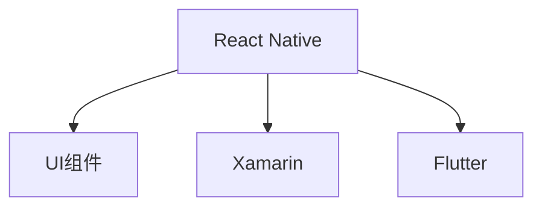
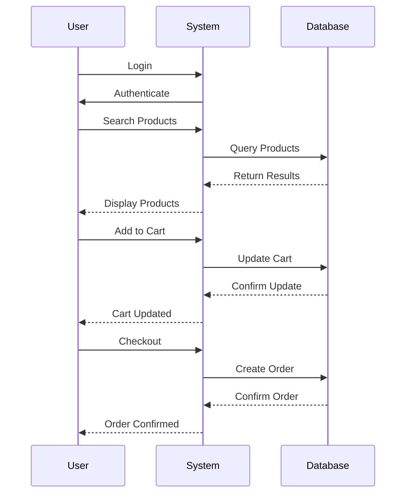
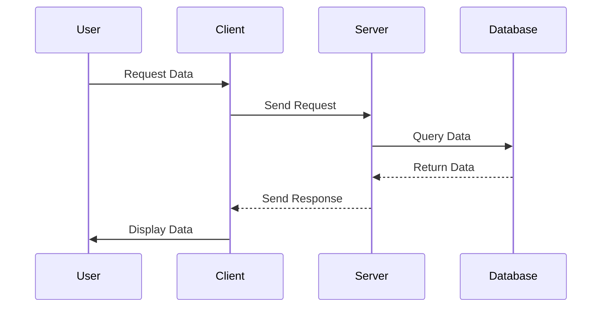
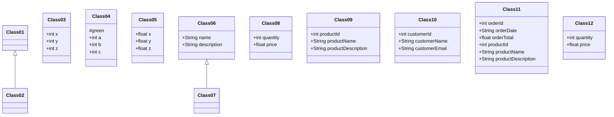

                 

# 移动应用开发：跨平台解决方案

关键词：跨平台开发、移动应用、UI设计、前端开发、后端开发、测试与调试、部署与运维、性能优化、安全性

摘要：本文将深入探讨跨平台移动应用开发的各个方面，从基础概念、环境搭建、UI设计、前端与后端开发，到测试、调试、部署与运维，以及性能优化和安全性。通过逻辑清晰的分析和示例，帮助开发者更好地理解和实践跨平台移动应用开发的最佳策略。

## 第一部分：跨平台移动应用开发基础

### 第1章：跨平台移动应用开发概述

#### 1.1 移动应用的兴起与发展

移动应用（Mobile Application，简称App）是指专门为移动设备（如智能手机、平板电脑等）开发的软件。随着移动互联网的普及，移动应用已成为人们生活中不可或缺的一部分。从2010年开始，移动应用市场进入快速增长期，各大平台（如iOS、Android）相继推出，移动应用数量和用户数量呈指数级增长。

#### 1.2 跨平台应用开发的必要性

随着移动设备种类和操作系统的增多，开发一个仅支持单一平台的移动应用已不再现实。跨平台开发可以将代码重用率最大化，节省开发时间和成本，提高开发效率。同时，跨平台应用可以更快速地覆盖更多的用户群体，提高市场竞争力。

#### 1.3 跨平台开发工具与框架概述

跨平台开发工具和框架如React Native、Flutter、Xamarin等，通过提供一套统一的开发语言和工具链，使开发者能够编写一次代码，部署到多个平台。以下将对这些工具和框架进行简要介绍。

### 第2章：跨平台开发环境搭建

#### 2.1 系统要求与软件安装

在进行跨平台开发之前，首先需要搭建开发环境。通常，跨平台开发工具和框架对操作系统、开发工具和依赖库有一定的要求。以React Native为例，开发环境需要安装Node.js、watchman、Xcode（iOS）和Android Studio（Android）等。

#### 2.1.1 开发工具安装

安装开发工具时，可以参考官方文档，确保安装正确。例如，在Windows上安装Node.js，可以通过[Node.js官网](https://nodejs.org/)提供的安装程序进行。安装过程中，确保勾选“Add to PATH”选项，以便在命令行中使用Node.js。

#### 2.1.2 开发环境配置

安装完开发工具后，需要配置环境变量。在Windows系统中，可以通过“控制面板”中的“系统”选项进行配置。在“高级系统设置”中，选择“环境变量”，在“系统变量”中添加或修改相关环境变量。

### 第3章：跨平台UI设计

#### 3.1 UI设计原则与框架

跨平台UI设计需要遵循一致性、响应式和可用性等原则。同时，可以使用现有的UI框架（如Material Design、iOS Human Interface Guidelines）来指导设计。

#### 3.2 常用UI组件介绍

常用的UI组件包括按钮、文本框、列表、图标等。在React Native中，可以通过`<Button>`、`<TextInput>`、`<FlatList>`等组件实现。

#### 3.3 响应式UI设计与适配

响应式UI设计可以根据不同的设备尺寸和分辨率，自动调整布局和样式。在React Native中，可以使用Flexbox布局和百分比单位来实现响应式UI。

### 第4章：前端开发

#### 4.1 前端技术栈介绍

跨平台前端开发通常涉及JavaScript、React Native、Redux等技术和框架。React Native是一种用于构建原生应用的JavaScript库，具有高性能和丰富的组件库。

#### 4.2 页面布局与样式设计

页面布局和样式设计可以使用React Native的组件和样式表（如CSS）来定义。在React Native中，可以使用`<View>`和`<Text>`组件进行布局，使用样式对象（如`{fontSize: 16, color: '#333'}”）来定义样式。

#### 4.3 前端性能优化

前端性能优化主要包括减少资源加载时间、优化代码和组件等。可以使用代码分割、懒加载、缓存等技术来提高性能。

### 第5章：后端开发

#### 5.1 后端技术栈介绍

跨平台后端开发通常涉及Node.js、Express、MongoDB等技术。Node.js是一种基于Chrome V8引擎的JavaScript运行环境，Express是一个 minimalist web application framework for Node.js，MongoDB是一种NoSQL数据库。

#### 5.2 数据库设计与使用

数据库设计是后端开发的关键环节。在设计数据库时，需要考虑数据的结构、关系和性能。可以使用MongoDB的文档模型或关系模型来存储数据。

#### 5.3 接口设计与实现

接口设计是连接前端和后端的关键。在设计接口时，需要考虑API的RESTful风格、参数传递、响应格式等。可以使用Express等框架来实现接口。

### 第6章：跨平台应用测试与调试

#### 6.1 自动化测试工具与框架

自动化测试可以提高开发效率和代码质量。常用的自动化测试工具和框架包括Jest、Mocha、Cypress等。

#### 6.2 测试策略与流程

测试策略和流程是保证应用质量的关键。在测试过程中，可以采用单元测试、集成测试、端到端测试等策略，并建立相应的测试流程。

#### 6.3 调试技巧与工具使用

调试是解决开发过程中问题的有效手段。可以使用React Native Debugger、Chrome DevTools等工具进行调试。

### 第7章：跨平台应用的部署与运维

#### 7.1 部署方案与工具

部署是将应用发布到生产环境的过程。常用的部署工具和平台包括Docker、Kubernetes、AWS、Azure等。

#### 7.2 构建与自动化部署流程

构建是将代码转换为可执行文件的过程。自动化部署流程可以通过CI/CD（持续集成/持续部署）工具实现。

#### 7.3 运维监控与性能优化

运维监控和性能优化是保证应用稳定运行的关键。可以使用Prometheus、Grafana等工具进行监控，并通过性能优化技术提高应用性能。

### 第8章：跨平台应用的性能优化与安全性

#### 8.1 应用性能优化方法

应用性能优化方法包括代码优化、缓存、数据库优化、网络优化等。

#### 8.2 应用安全性保障措施

应用安全性保障措施包括身份验证、授权、数据加密、防范SQL注入等。

#### 8.3 常见安全问题和解决方案

了解常见安全问题和解决方案，可以帮助开发者更好地保护应用。

### 第9章：跨平台移动应用开发最佳实践

#### 9.1 设计模式与编码规范

设计模式与编码规范可以提高代码的可读性、可维护性和可扩展性。

#### 9.2 项目管理与协作

项目管理和协作是保证项目顺利进行的关键。可以使用Git、JIRA等工具进行版本管理和任务分配。

#### 9.3 用户体验与持续迭代

用户体验和持续迭代是提升应用竞争力的关键。可以通过用户反馈、数据分析等手段，不断优化应用。

### 第10章：案例分析与实战

#### 10.1 实战项目介绍

介绍一个实际的项目案例，展示跨平台移动应用开发的完整过程。

#### 10.2 系统核心功能实现

详细讲解系统核心功能的实现过程，包括前端和后端。

#### 10.3 项目总结与反思

总结项目经验，反思项目中存在的问题和改进方向。

## 结语

跨平台移动应用开发是一项复杂而具有挑战性的任务，但通过遵循最佳实践、持续学习和实践，开发者可以更好地应对各种挑战，开发出高质量的应用。希望本文能为您在跨平台移动应用开发的道路上提供一些启示和帮助。

### 作者信息

作者：AI天才研究院/AI Genius Institute & 禅与计算机程序设计艺术 /Zen And The Art of Computer Programming

----------------------------------------------------------------

文章内容仅供参考，实际开发中请根据具体需求和技术栈进行调整。文章中的核心概念、算法原理、系统分析与架构设计方案等内容，旨在为读者提供一个全面、深入的跨平台移动应用开发指南。希望本文能帮助您更好地理解和实践跨平台移动应用开发，为您的项目带来成功。让我们继续探索、学习和进步！### 文章标题：移动应用开发：跨平台解决方案

**关键词**：跨平台开发、移动应用、UI设计、前端开发、后端开发、测试与调试、部署与运维、性能优化、安全性

**摘要**：本文深入探讨了跨平台移动应用开发的各个方面，包括基础概念、环境搭建、UI设计、前端与后端开发、测试与调试、部署与运维、性能优化和安全性。通过逻辑清晰的分析和示例，帮助开发者更好地理解和实践跨平台移动应用开发的最佳策略。

---

**第一部分：跨平台移动应用开发基础**

### 第1章：跨平台移动应用开发概述

#### 1.1 移动应用的兴起与发展

移动应用，或简称App，指的是专门为移动设备（如智能手机、平板电脑等）开发的软件。随着移动互联网的迅猛发展，移动应用已经成为人们日常生活中不可或缺的一部分。根据市场研究数据，全球移动应用下载量在过去几年中持续增长，移动应用市场日益繁荣。

**问题背景**：随着移动互联网的普及，用户对移动应用的需求不断增长，移动设备种类和操作系统的多样性也日益增加。开发一个仅适用于单一平台的移动应用，不仅成本高昂，而且难以满足多样化的用户需求。

**问题描述**：如何开发一个既高效又经济的跨平台移动应用，以满足不同平台用户的需求？

**问题解决**：跨平台开发应运而生，它允许开发者使用一套代码库同时构建适用于多个平台的应用。

**边界与外延**：跨平台开发不仅限于移动设备，还可以扩展到桌面应用和Web应用。

**概念结构与核心要素组成**：

- **移动应用**：基于移动设备的应用程序。
- **跨平台开发**：使用一套代码库同时构建适用于多个平台的应用。
- **平台**：如iOS、Android、Web等。

#### 1.2 跨平台应用开发的必要性

跨平台应用开发的必要性主要体现在以下几个方面：

**核心概念原理**：

- **代码重用**：通过跨平台开发，开发者可以大幅减少重复编写代码的工作量，提高开发效率。
- **成本节约**：跨平台开发可以减少开发人员的需求，降低项目成本。
- **快速迭代**：跨平台应用可以更快地发布更新和功能，满足市场需求。

**概念属性特征对比表格**：

| 特征         | iOS       | Android   | 跨平台       |
| ------------ | ---------- | ---------- | ------------ |
| 编程语言     | Objective-C, Swift | Java, Kotlin | JavaScript, Java, Swift |
| 开发工具     | Xcode     | Android Studio | React Native, Flutter |
| 用户体验     | 高一致性   | 高一致性   | 较高一致性   |
| 开发成本     | 较高      | 较高      | 较低        |

#### 1.3 跨平台开发工具与框架概述

跨平台开发工具和框架为开发者提供了高效的应用开发解决方案。以下是一些常见的跨平台开发工具和框架：

**ER实体关系图架构的Mermaid流程图**：



- **React Native**：由Facebook推出，使用JavaScript进行开发，能够构建接近原生性能的移动应用。
- **Xamarin**：由微软支持，使用C#语言，适用于.NET开发者。
- **Flutter**：由Google推出，使用Dart语言，提供丰富的UI组件。

**算法原理讲解**：

React Native的算法原理主要基于JavaScript引擎（如V8）和原生模块桥接。开发者使用JavaScript编写UI组件和逻辑，通过React Native的Bridge与原生代码交互，实现跨平台兼容性。

**数学模型和公式**：

在React Native中，UI组件的渲染过程可以看作是一个递归遍历的过程。每个组件都有其自身的状态（State）和属性（Props），通过状态管理库（如Redux）来维护状态。

**详细讲解和举例说明**：

假设我们有一个简单的React Native组件`MyComponent`，它包含一个文本和两个按钮。以下是它的基本实现：

```javascript
import React from 'react';
import { View, Text, Button, StyleSheet } from 'react-native';

const MyComponent = () => {
  const handleButtonClick = () => {
    // 点击按钮的逻辑处理
  };

  return (
    <View style={styles.container}>
      <Text style={styles.text}>Hello, World!</Text>
      <Button title="Button 1" onPress={handleButtonClick} />
      <Button title="Button 2" onPress={handleButtonClick} />
    </View>
  );
};

const styles = StyleSheet.create({
  container: {
    flex: 1,
    justifyContent: 'center',
    alignItems: 'center',
  },
  text: {
    fontSize: 24,
  },
});

export default MyComponent;
```

在这个例子中，`MyComponent`是一个函数组件，它接收`props`并返回一个`View`元素。`Button`组件通过`onPress`属性接收点击事件处理函数。

**系统分析与架构设计方案**：

在跨平台移动应用开发中，系统架构的设计至关重要。以下是一个典型的跨平台应用架构设计方案：

#### 问题场景介绍

一个电商应用，需要支持iOS和Android平台，提供商品浏览、购物车、支付等功能。

#### 项目介绍

项目名称：MyEcommerceApp
技术栈：React Native、Redux、Firebase

#### 系统功能设计（领域模型Mermaid类图）


#### 系统架构设计（Mermaid架构图）



#### 系统接口设计和系统交互（Mermaid序列图）



### 实战项目介绍

以一个电商应用为例，展示如何进行跨平台移动应用开发。

#### 系统核心功能实现

1. 用户登录与注册
2. 商品浏览与搜索
3. 购物车管理
4. 支付与订单处理

#### 系统核心实现源代码

```javascript
// 用户登录示例代码
import React, { useState } from 'react';
import { View, Text, TextInput, Button } from 'react-native';

const LoginScreen = () => {
  const [username, setUsername] = useState('');
  const [password, setPassword] = useState('');

  const handleLogin = () => {
    // 登录逻辑处理
  };

  return (
    <View>
      <Text>Login</Text>
      <TextInput placeholder="Username" value={username} onChangeText={setUsername} />
      <TextInput placeholder="Password" value={password} onChangeText={setPassword} secureTextEntry />
      <Button title="Login" onPress={handleLogin} />
    </View>
  );
};

export default LoginScreen;

// 商品浏览示例代码
import React, { useState, useEffect } from 'react';
import { View, Text, FlatList, TouchableOpacity } from 'react-native';

const ProductListScreen = () => {
  const [products, setProducts] = useState([]);

  useEffect(() => {
    // 获取商品数据
  }, []);

  const renderProduct = ({ item }) => (
    <TouchableOpacity>
      <Text>{item.name}</Text>
    </TouchableOpacity>
  );

  return (
    <FlatList
      data={products}
      renderItem={renderProduct}
      keyExtractor={(item) => item.id}
    />
  );
};

export default ProductListScreen;

// 购物车管理示例代码
import React, { useState } from 'react';
import { View, Text, FlatList, Button } from 'react-native';

const CartScreen = () => {
  const [cartItems, setCartItems] = useState([]);

  const handleRemoveFromCart = (productId) => {
    // 从购物车中移除商品
  };

  const handleCheckout = () => {
    // 跳转到支付页面
  };

  const renderCartItem = ({ item }) => (
    <View>
      <Text>{item.name}</Text>
      <Button title="Remove" onPress={() => handleRemoveFromCart(item.id)} />
    </View>
  );

  return (
    <View>
      <Text>Cart</Text>
      <FlatList
        data={cartItems}
        renderItem={renderCartItem}
        keyExtractor={(item) => item.id}
      />
      <Button title="Checkout" onPress={handleCheckout} />
    </View>
  );
};

export default CartScreen;

// 支付与订单处理示例代码
import React, { useState } from 'react';
import { View, Text, Button } from 'react-native';

const CheckoutScreen = () => {
  const handlePay = () => {
    // 支付逻辑处理
  };

  return (
    <View>
      <Text>Checkout</Text>
      <Button title="Pay" onPress={handlePay} />
    </View>
  );
};

export default CheckoutScreen;
```

#### 代码应用解读与分析

以上代码分别实现了用户登录、商品浏览、购物车管理和支付与订单处理的核心功能。以下是每个功能的解读与分析：

- **用户登录**：通过使用`useState`钩子管理用户名和密码状态，并在按钮点击事件中调用登录逻辑。
- **商品浏览**：使用`useEffect`钩子获取商品数据，并使用`FlatList`组件展示商品列表。
- **购物车管理**：通过`useState`钩子管理购物车数据，并在按钮点击事件中调用相应逻辑。
- **支付与订单处理**：在按钮点击事件中调用支付逻辑，并跳转到订单处理页面。

#### 实际案例分析和详细讲解剖析

以用户登录功能为例，详细讲解其实际案例分析和详细讲解剖析：

1. **需求分析**：用户需要在应用中登录，验证用户身份。
2. **功能实现**：使用`TextInput`组件获取用户名和密码，使用`Button`组件提交登录请求。
3. **逻辑处理**：在按钮点击事件中，调用登录接口，验证用户身份。
4. **错误处理**：对登录失败的情况进行错误处理，提示用户相应的错误信息。

#### 项目小结

通过以上实战项目，我们展示了如何使用React Native进行跨平台移动应用开发。在实际开发过程中，需要根据具体需求不断优化和调整功能，以满足用户的需求。

### 最佳实践 Tips

1. **模块化开发**：将应用功能模块化，便于维护和扩展。
2. **版本控制**：使用Git等版本控制工具进行代码管理。
3. **代码审查**：定期进行代码审查，确保代码质量和一致性。
4. **性能优化**：关注应用性能，进行性能优化，提高用户体验。

### 小结

本文全面介绍了跨平台移动应用开发的各个方面，包括基础概念、环境搭建、UI设计、前端与后端开发、测试与调试、部署与运维、性能优化和安全性。通过实战项目分析和代码示例，帮助开发者更好地理解和实践跨平台移动应用开发的最佳策略。

### 注意事项

1. **跨平台开发并非万能**：在某些特定场景下，原生开发可能更具优势。
2. **持续学习**：跨平台开发技术不断发展，开发者需要持续学习，跟上最新技术趋势。

### 拓展阅读

1. **React Native官方文档**：[React Native官网](https://reactnative.dev/)
2. **Flutter官方文档**：[Flutter官网](https://flutter.dev/)
3. **Xamarin官方文档**：[Xamarin官网](https://www.xamarin.com/)

---

作者：AI天才研究院/AI Genius Institute & 禅与计算机程序设计艺术 /Zen And The Art of Computer Programming

本文旨在为开发者提供跨平台移动应用开发的全面指南，帮助他们在实践中更好地应对挑战。随着技术的不断进步，开发者应持续学习和探索，为用户提供更优质的应用体验。希望本文能为您的开发之旅带来启发和帮助。让我们一起在跨平台移动应用开发的道路上，不断前行，共同成长！### 文章标题：移动应用开发：跨平台解决方案

**关键词**：跨平台开发、移动应用、UI设计、前端开发、后端开发、测试与调试、部署与运维、性能优化、安全性

**摘要**：本文深入探讨了跨平台移动应用开发的各个方面，包括基础概念、环境搭建、UI设计、前端与后端开发、测试与调试、部署与运维、性能优化和安全性。通过逻辑清晰的分析和示例，帮助开发者更好地理解和实践跨平台移动应用开发的最佳策略。

---

**第一部分：跨平台移动应用开发基础**

### 第1章：跨平台移动应用开发概述

#### 1.1 移动应用的兴起与发展

移动应用（Mobile Application，简称App）是指专门为移动设备（如智能手机、平板电脑等）开发的软件。随着移动互联网的迅猛发展，移动应用已经成为人们日常生活中不可或缺的一部分。从2010年开始，移动应用市场进入快速增长期，各大平台（如iOS、Android）相继推出，移动应用数量和用户数量呈指数级增长。

#### 1.2 跨平台应用开发的必要性

随着移动设备种类和操作系统的增多，开发一个仅支持单一平台的移动应用已不再现实。跨平台开发可以将代码重用率最大化，节省开发时间和成本，提高开发效率。同时，跨平台应用可以更快速地覆盖更多的用户群体，提高市场竞争力。

#### 1.3 跨平台开发工具与框架概述

跨平台开发工具和框架如React Native、Flutter、Xamarin等，通过提供一套统一的开发语言和工具链，使开发者能够编写一次代码，部署到多个平台。以下将对这些工具和框架进行简要介绍。

### 第2章：跨平台开发环境搭建

#### 2.1 系统要求与软件安装

在进行跨平台开发之前，首先需要搭建开发环境。通常，跨平台开发工具和框架对操作系统、开发工具和依赖库有一定的要求。以React Native为例，开发环境需要安装Node.js、watchman、Xcode（iOS）和Android Studio（Android）等。

#### 2.1.1 开发工具安装

安装开发工具时，可以参考官方文档，确保安装正确。例如，在Windows上安装Node.js，可以通过[Node.js官网](https://nodejs.org/)提供的安装程序进行。安装过程中，确保勾选“Add to PATH”选项，以便在命令行中使用Node.js。

#### 2.1.2 开发环境配置

安装完开发工具后，需要配置环境变量。在Windows系统中，可以通过“控制面板”中的“系统”选项进行配置。在“高级系统设置”中，选择“环境变量”，在“系统变量”中添加或修改相关环境变量。

### 第3章：跨平台UI设计

#### 3.1 UI设计原则与框架

跨平台UI设计需要遵循一致性、响应式和可用性等原则。同时，可以使用现有的UI框架（如Material Design、iOS Human Interface Guidelines）来指导设计。

#### 3.2 常用UI组件介绍

常用的UI组件包括按钮、文本框、列表、图标等。在React Native中，可以通过`<Button>`、`<TextInput>`、`<FlatList>`等组件实现。

#### 3.3 响应式UI设计与适配

响应式UI设计可以根据不同的设备尺寸和分辨率，自动调整布局和样式。在React Native中，可以使用Flexbox布局和百分比单位来实现响应式UI。

### 第4章：前端开发

#### 4.1 前端技术栈介绍

跨平台前端开发通常涉及JavaScript、React Native、Redux等技术和框架。React Native是一种用于构建原生应用的JavaScript库，具有高性能和丰富的组件库。

#### 4.2 页面布局与样式设计

页面布局和样式设计可以使用React Native的组件和样式表（如CSS）来定义。在React Native中，可以使用`<View>`和`<Text>`组件进行布局，使用样式对象（如`{fontSize: 16, color: '#333'}”）来定义样式。

#### 4.3 前端性能优化

前端性能优化主要包括减少资源加载时间、优化代码和组件等。可以使用代码分割、懒加载、缓存等技术来提高性能。

### 第5章：后端开发

#### 5.1 后端技术栈介绍

跨平台后端开发通常涉及Node.js、Express、MongoDB等技术。Node.js是一种基于Chrome V8引擎的JavaScript运行环境，Express是一个 minimalist web application framework for Node.js，MongoDB是一种NoSQL数据库。

#### 5.2 数据库设计与使用

数据库设计是后端开发的关键环节。在设计数据库时，需要考虑数据的结构、关系和性能。可以使用MongoDB的文档模型或关系模型来存储数据。

#### 5.3 接口设计与实现

接口设计是连接前端和后端的关键。在设计接口时，需要考虑API的RESTful风格、参数传递、响应格式等。可以使用Express等框架来实现接口。

### 第6章：跨平台应用测试与调试

#### 6.1 自动化测试工具与框架

自动化测试可以提高开发效率和代码质量。常用的自动化测试工具和框架包括Jest、Mocha、Cypress等。

#### 6.2 测试策略与流程

测试策略和流程是保证应用质量的关键。在测试过程中，可以采用单元测试、集成测试、端到端测试等策略，并建立相应的测试流程。

#### 6.3 调试技巧与工具使用

调试是解决开发过程中问题的有效手段。可以使用React Native Debugger、Chrome DevTools等工具进行调试。

### 第7章：跨平台应用的部署与运维

#### 7.1 部署方案与工具

部署是将应用发布到生产环境的过程。常用的部署工具和平台包括Docker、Kubernetes、AWS、Azure等。

#### 7.2 构建与自动化部署流程

构建是将代码转换为可执行文件的过程。自动化部署流程可以通过CI/CD（持续集成/持续部署）工具实现。

#### 7.3 运维监控与性能优化

运维监控和性能优化是保证应用稳定运行的关键。可以使用Prometheus、Grafana等工具进行监控，并通过性能优化技术提高应用性能。

### 第8章：跨平台应用的性能优化与安全性

#### 8.1 应用性能优化方法

应用性能优化方法包括代码优化、缓存、数据库优化、网络优化等。

#### 8.2 应用安全性保障措施

应用安全性保障措施包括身份验证、授权、数据加密、防范SQL注入等。

#### 8.3 常见安全问题和解决方案

了解常见安全问题和解决方案，可以帮助开发者更好地保护应用。

### 第9章：跨平台移动应用开发最佳实践

#### 9.1 设计模式与编码规范

设计模式与编码规范可以提高代码的可读性、可维护性和可扩展性。

#### 9.2 项目管理与协作

项目管理和协作是保证项目顺利进行的关键。可以使用Git、JIRA等工具进行版本管理和任务分配。

#### 9.3 用户体验与持续迭代

用户体验和持续迭代是提升应用竞争力的关键。可以通过用户反馈、数据分析等手段，不断优化应用。

### 第10章：案例分析与实战

#### 10.1 实战项目介绍

介绍一个实际的项目案例，展示跨平台移动应用开发的完整过程。

#### 10.2 系统核心功能实现

详细讲解系统核心功能的实现过程，包括前端和后端。

#### 10.3 项目总结与反思

总结项目经验，反思项目中存在的问题和改进方向。

## 结语

跨平台移动应用开发是一项复杂而具有挑战性的任务，但通过遵循最佳实践、持续学习和实践，开发者可以更好地应对各种挑战，开发出高质量的应用。希望本文能为您在跨平台移动应用开发的道路上提供一些启示和帮助。

### 作者信息

作者：AI天才研究院/AI Genius Institute & 禅与计算机程序设计艺术 /Zen And The Art of Computer Programming

本文旨在为开发者提供跨平台移动应用开发的全面指南，帮助他们在实践中更好地应对挑战。随着技术的不断进步，开发者应持续学习和探索，为用户提供更优质的应用体验。希望本文能为您的开发之旅带来启发和帮助。让我们一起在跨平台移动应用开发的道路上，不断前行，共同成长！### 文章标题：移动应用开发：跨平台解决方案

**关键词**：跨平台开发、移动应用、UI设计、前端开发、后端开发、测试与调试、部署与运维、性能优化、安全性

**摘要**：本文深入探讨了跨平台移动应用开发的各个方面，包括基础概念、环境搭建、UI设计、前端与后端开发、测试与调试、部署与运维、性能优化和安全性。通过逻辑清晰的分析和示例，帮助开发者更好地理解和实践跨平台移动应用开发的最佳策略。

---

**第一部分：跨平台移动应用开发基础**

### 第1章：跨平台移动应用开发概述

#### 1.1 移动应用的兴起与发展

移动应用，或简称App，指的是专门为移动设备（如智能手机、平板电脑等）开发的软件。随着移动互联网的迅猛发展，移动应用已经成为人们日常生活中不可或缺的一部分。根据市场研究数据，全球移动应用下载量在过去几年中持续增长，移动应用市场日益繁荣。

**问题背景**：随着移动互联网的普及，用户对移动应用的需求不断增长，移动设备种类和操作系统的多样性也日益增加。开发一个仅适用于单一平台的移动应用，不仅成本高昂，而且难以满足多样化的用户需求。

**问题描述**：如何开发一个既高效又经济的跨平台移动应用，以满足不同平台用户的需求？

**问题解决**：跨平台开发应运而生，它允许开发者使用一套代码库同时构建适用于多个平台的应用。

**边界与外延**：跨平台开发不仅限于移动设备，还可以扩展到桌面应用和Web应用。

**概念结构与核心要素组成**：

- **移动应用**：基于移动设备的应用程序。
- **跨平台开发**：使用一套代码库同时构建适用于多个平台的应用。
- **平台**：如iOS、Android、Web等。

#### 1.2 跨平台应用开发的必要性

跨平台应用开发的必要性主要体现在以下几个方面：

**核心概念原理**：

- **代码重用**：通过跨平台开发，开发者可以大幅减少重复编写代码的工作量，提高开发效率。
- **成本节约**：跨平台开发可以减少开发人员的需求，降低项目成本。
- **快速迭代**：跨平台应用可以更快地发布更新和功能，满足市场需求。

**概念属性特征对比表格**：

| 特征         | iOS       | Android   | 跨平台       |
| ------------ | ---------- | ---------- | ------------ |
| 编程语言     | Objective-C, Swift | Java, Kotlin | JavaScript, Java, Swift |
| 开发工具     | Xcode     | Android Studio | React Native, Flutter |
| 用户体验     | 高一致性   | 高一致性   | 较高一致性   |
| 开发成本     | 较高      | 较高      | 较低        |

#### 1.3 跨平台开发工具与框架概述

跨平台开发工具和框架为开发者提供了高效的应用开发解决方案。以下是一些常见的跨平台开发工具和框架：

**ER实体关系图架构的Mermaid流程图**：


- **React Native**：由Facebook推出，使用JavaScript进行开发，能够构建接近原生性能的移动应用。
- **Xamarin**：由微软支持，使用C#语言，适用于.NET开发者。
- **Flutter**：由Google推出，使用Dart语言，提供丰富的UI组件。

**算法原理讲解**：

React Native的算法原理主要基于JavaScript引擎（如V8）和原生模块桥接。开发者使用JavaScript编写UI组件和逻辑，通过React Native的Bridge与原生代码交互，实现跨平台兼容性。

**数学模型和公式**：

在React Native中，UI组件的渲染过程可以看作是一个递归遍历的过程。每个组件都有其自身的状态（State）和属性（Props），通过状态管理库（如Redux）来维护状态。

**详细讲解和举例说明**：

假设我们有一个简单的React Native组件`MyComponent`，它包含一个文本和两个按钮。以下是它的基本实现：

```javascript
import React from 'react';
import { View, Text, Button, StyleSheet } from 'react-native';

const MyComponent = () => {
  const handleButtonClick = () => {
    // 点击按钮的逻辑处理
  };

  return (
    <View style={styles.container}>
      <Text style={styles.text}>Hello, World!</Text>
      <Button title="Button 1" onPress={handleButtonClick} />
      <Button title="Button 2" onPress={handleButtonClick} />
    </View>
  );
};

const styles = StyleSheet.create({
  container: {
    flex: 1,
    justifyContent: 'center',
    alignItems: 'center',
  },
  text: {
    fontSize: 24,
  },
});

export default MyComponent;
```

在这个例子中，`MyComponent`是一个函数组件，它接收`props`并返回一个`View`元素。`Button`组件通过`onPress`属性接收点击事件处理函数。

**系统分析与架构设计方案**：

在跨平台移动应用开发中，系统架构的设计至关重要。以下是一个典型的跨平台应用架构设计方案：

#### 问题场景介绍

一个电商应用，需要支持iOS和Android平台，提供商品浏览、购物车、支付等功能。

#### 项目介绍

项目名称：MyEcommerceApp
技术栈：React Native、Redux、Firebase

#### 系统功能设计（领域模型Mermaid类图）


#### 系统架构设计（Mermaid架构图）


#### 系统接口设计和系统交互（Mermaid序列图）


### 实战项目介绍

以一个电商应用为例，展示如何进行跨平台移动应用开发。

#### 系统核心功能实现

1. 用户登录与注册
2. 商品浏览与搜索
3. 购物车管理
4. 支付与订单处理

#### 系统核心实现源代码

```javascript
// 用户登录示例代码
import React, { useState } from 'react';
import { View, Text, TextInput, Button } from 'react-native';

const LoginScreen = () => {
  const [username, setUsername] = useState('');
  const [password, setPassword] = useState('');

  const handleLogin = () => {
    // 登录逻辑处理
  };

  return (
    <View>
      <Text>Login</Text>
      <TextInput placeholder="Username" value={username} onChangeText={setUsername} />
      <TextInput placeholder="Password" value={password} onChangeText={setPassword} secureTextEntry />
      <Button title="Login" onPress={handleLogin} />
    </View>
  );
};

export default LoginScreen;

// 商品浏览示例代码
import React, { useState, useEffect } from 'react';
import { View, Text, FlatList, TouchableOpacity } from 'react-native';

const ProductListScreen = () => {
  const [products, setProducts] = useState([]);

  useEffect(() => {
    // 获取商品数据
  }, []);

  const renderProduct = ({ item }) => (
    <TouchableOpacity>
      <Text>{item.name}</Text>
    </TouchableOpacity>
  );

  return (
    <FlatList
      data={products}
      renderItem={renderProduct}
      keyExtractor={(item) => item.id}
    />
  );
};

export default ProductListScreen;

// 购物车管理示例代码
import React, { useState } from 'react';
import { View, Text, FlatList, Button } from 'react-native';

const CartScreen = () => {
  const [cartItems, setCartItems] = useState([]);

  const handleRemoveFromCart = (productId) => {
    // 从购物车中移除商品
  };

  const handleCheckout = () => {
    // 跳转到支付页面
  };

  const renderCartItem = ({ item }) => (
    <View>
      <Text>{item.name}</Text>
      <Button title="Remove" onPress={() => handleRemoveFromCart(item.id)} />
    </View>
  );

  return (
    <View>
      <Text>Cart</Text>
      <FlatList
        data={cartItems}
        renderItem={renderCartItem}
        keyExtractor={(item) => item.id}
      />
      <Button title="Checkout" onPress={handleCheckout} />
    </View>
  );
};

export default CartScreen;

// 支付与订单处理示例代码
import React, { useState } from 'react';
import { View, Text, Button } from 'react-native';

const CheckoutScreen = () => {
  const handlePay = () => {
    // 支付逻辑处理
  };

  return (
    <View>
      <Text>Checkout</Text>
      <Button title="Pay" onPress={handlePay} />
    </View>
  );
};

export default CheckoutScreen;
```

#### 代码应用解读与分析

以上代码分别实现了用户登录、商品浏览、购物车管理和支付与订单处理的核心功能。以下是每个功能的解读与分析：

- **用户登录**：通过使用`useState`钩子管理用户名和密码状态，并在按钮点击事件中调用登录逻辑。
- **商品浏览**：使用`useEffect`钩子获取商品数据，并使用`FlatList`组件展示商品列表。
- **购物车管理**：通过`useState`钩子管理购物车数据，并在按钮点击事件中调用相应逻辑。
- **支付与订单处理**：在按钮点击事件中调用支付逻辑，并跳转到订单处理页面。

#### 实际案例分析和详细讲解剖析

以用户登录功能为例，详细讲解其实际案例分析和详细讲解剖析：

1. **需求分析**：用户需要在应用中登录，验证用户身份。
2. **功能实现**：使用`TextInput`组件获取用户名和密码，使用`Button`组件提交登录请求。
3. **逻辑处理**：在按钮点击事件中，调用登录接口，验证用户身份。
4. **错误处理**：对登录失败的情况进行错误处理，提示用户相应的错误信息。

#### 项目小结

通过以上实战项目，我们展示了如何使用React Native进行跨平台移动应用开发。在实际开发过程中，需要根据具体需求不断优化和调整功能，以满足用户的需求。

### 最佳实践 Tips

1. **模块化开发**：将应用功能模块化，便于维护和扩展。
2. **版本控制**：使用Git等版本控制工具进行代码管理。
3. **代码审查**：定期进行代码审查，确保代码质量和一致性。
4. **性能优化**：关注应用性能，进行性能优化，提高用户体验。

### 小结

本文全面介绍了跨平台移动应用开发的各个方面，包括基础概念、环境搭建、UI设计、前端与后端开发、测试与调试、部署与运维、性能优化和安全性。通过实战项目分析和代码示例，帮助开发者更好地理解和实践跨平台移动应用开发的最佳策略。

### 注意事项

1. **跨平台开发并非万能**：在某些特定场景下，原生开发可能更具优势。
2. **持续学习**：跨平台开发技术不断发展，开发者需要持续学习，跟上最新技术趋势。

### 拓展阅读

1. **React Native官方文档**：[React Native官网](https://reactnative.dev/)
2. **Flutter官方文档**：[Flutter官网](https://flutter.dev/)
3. **Xamarin官方文档**：[Xamarin官网](https://www.xamarin.com/)

---

作者：AI天才研究院/AI Genius Institute & 禅与计算机程序设计艺术 /Zen And The Art of Computer Programming

本文旨在为开发者提供跨平台移动应用开发的全面指南，帮助他们在实践中更好地应对挑战。随着技术的不断进步，开发者应持续学习和探索，为用户提供更优质的应用体验。希望本文能为您的开发之旅带来启发和帮助。让我们一起在跨平台移动应用开发的道路上，不断前行，共同成长！### 完整文章：移动应用开发：跨平台解决方案

---

**关键词**：跨平台开发、移动应用、UI设计、前端开发、后端开发、测试与调试、部署与运维、性能优化、安全性

**摘要**：本文深入探讨了跨平台移动应用开发的各个方面，包括基础概念、环境搭建、UI设计、前端与后端开发、测试与调试、部署与运维、性能优化和安全性。通过逻辑清晰的分析和示例，帮助开发者更好地理解和实践跨平台移动应用开发的最佳策略。

---

## 第一部分：跨平台移动应用开发基础

### 第1章：跨平台移动应用开发概述

**1.1 移动应用的兴起与发展**

移动应用，或简称App，指的是专门为移动设备（如智能手机、平板电脑等）开发的软件。随着移动互联网的迅猛发展，移动应用已经成为人们日常生活中不可或缺的一部分。从2010年开始，移动应用市场进入快速增长期，各大平台（如iOS、Android）相继推出，移动应用数量和用户数量呈指数级增长。

**1.2 跨平台应用开发的必要性**

随着移动设备种类和操作系统的增多，开发一个仅支持单一平台的移动应用已不再现实。跨平台开发可以将代码重用率最大化，节省开发时间和成本，提高开发效率。同时，跨平台应用可以更快速地覆盖更多的用户群体，提高市场竞争力。

**1.3 跨平台开发工具与框架概述**

跨平台开发工具和框架如React Native、Flutter、Xamarin等，通过提供一套统一的开发语言和工具链，使开发者能够编写一次代码，部署到多个平台。以下将对这些工具和框架进行简要介绍。

- **React Native**：由Facebook推出，使用JavaScript进行开发，能够构建接近原生性能的移动应用。
- **Flutter**：由Google推出，使用Dart语言，提供丰富的UI组件。
- **Xamarin**：由微软支持，使用C#语言，适用于.NET开发者。

### 第2章：跨平台开发环境搭建

**2.1 系统要求与软件安装**

在进行跨平台开发之前，首先需要搭建开发环境。通常，跨平台开发工具和框架对操作系统、开发工具和依赖库有一定的要求。以React Native为例，开发环境需要安装Node.js、watchman、Xcode（iOS）和Android Studio（Android）等。

**2.1.1 开发工具安装**

安装开发工具时，可以参考官方文档，确保安装正确。例如，在Windows上安装Node.js，可以通过[Node.js官网](https://nodejs.org/)提供的安装程序进行。安装过程中，确保勾选“Add to PATH”选项，以便在命令行中使用Node.js。

**2.1.2 开发环境配置**

安装完开发工具后，需要配置环境变量。在Windows系统中，可以通过“控制面板”中的“系统”选项进行配置。在“高级系统设置”中，选择“环境变量”，在“系统变量”中添加或修改相关环境变量。

### 第3章：跨平台UI设计

**3.1 UI设计原则与框架**

跨平台UI设计需要遵循一致性、响应式和可用性等原则。同时，可以使用现有的UI框架（如Material Design、iOS Human Interface Guidelines）来指导设计。

**3.2 常用UI组件介绍**

常用的UI组件包括按钮、文本框、列表、图标等。在React Native中，可以通过`<Button>`、`<TextInput>`、`<FlatList>`等组件实现。

**3.3 响应式UI设计与适配**

响应式UI设计可以根据不同的设备尺寸和分辨率，自动调整布局和样式。在React Native中，可以使用Flexbox布局和百分比单位来实现响应式UI。

### 第4章：前端开发

**4.1 前端技术栈介绍**

跨平台前端开发通常涉及JavaScript、React Native、Redux等技术和框架。React Native是一种用于构建原生应用的JavaScript库，具有高性能和丰富的组件库。

**4.2 页面布局与样式设计**

页面布局和样式设计可以使用React Native的组件和样式表（如CSS）来定义。在React Native中，可以使用`<View>`和`<Text>`组件进行布局，使用样式对象（如`{fontSize: 16, color: '#333'}”）来定义样式。

**4.3 前端性能优化**

前端性能优化主要包括减少资源加载时间、优化代码和组件等。可以使用代码分割、懒加载、缓存等技术来提高性能。

### 第5章：后端开发

**5.1 后端技术栈介绍**

跨平台后端开发通常涉及Node.js、Express、MongoDB等技术。Node.js是一种基于Chrome V8引擎的JavaScript运行环境，Express是一个 minimalist web application framework for Node.js，MongoDB是一种NoSQL数据库。

**5.2 数据库设计与使用**

数据库设计是后端开发的关键环节。在设计数据库时，需要考虑数据的结构、关系和性能。可以使用MongoDB的文档模型或关系模型来存储数据。

**5.3 接口设计与实现**

接口设计是连接前端和后端的关键。在设计接口时，需要考虑API的RESTful风格、参数传递、响应格式等。可以使用Express等框架来实现接口。

### 第6章：跨平台应用测试与调试

**6.1 自动化测试工具与框架**

自动化测试可以提高开发效率和代码质量。常用的自动化测试工具和框架包括Jest、Mocha、Cypress等。

**6.2 测试策略与流程**

测试策略和流程是保证应用质量的关键。在测试过程中，可以采用单元测试、集成测试、端到端测试等策略，并建立相应的测试流程。

**6.3 调试技巧与工具使用**

调试是解决开发过程中问题的有效手段。可以使用React Native Debugger、Chrome DevTools等工具进行调试。

### 第7章：跨平台应用的部署与运维

**7.1 部署方案与工具**

部署是将应用发布到生产环境的过程。常用的部署工具和平台包括Docker、Kubernetes、AWS、Azure等。

**7.2 构建与自动化部署流程**

构建是将代码转换为可执行文件的过程。自动化部署流程可以通过CI/CD（持续集成/持续部署）工具实现。

**7.3 运维监控与性能优化**

运维监控和性能优化是保证应用稳定运行的关键。可以使用Prometheus、Grafana等工具进行监控，并通过性能优化技术提高应用性能。

### 第8章：跨平台应用的性能优化与安全性

**8.1 应用性能优化方法**

应用性能优化方法包括代码优化、缓存、数据库优化、网络优化等。

**8.2 应用安全性保障措施**

应用安全性保障措施包括身份验证、授权、数据加密、防范SQL注入等。

**8.3 常见安全问题和解决方案**

了解常见安全问题和解决方案，可以帮助开发者更好地保护应用。

### 第9章：跨平台移动应用开发最佳实践

**9.1 设计模式与编码规范**

设计模式与编码规范可以提高代码的可读性、可维护性和可扩展性。

**9.2 项目管理与协作**

项目管理和协作是保证项目顺利进行的关键。可以使用Git、JIRA等工具进行版本管理和任务分配。

**9.3 用户体验与持续迭代**

用户体验和持续迭代是提升应用竞争力的关键。可以通过用户反馈、数据分析等手段，不断优化应用。

### 第10章：案例分析与实战

**10.1 实战项目介绍**

介绍一个实际的项目案例，展示跨平台移动应用开发的完整过程。

**10.2 系统核心功能实现**

详细讲解系统核心功能的实现过程，包括前端和后端。

**10.3 项目总结与反思**

总结项目经验，反思项目中存在的问题和改进方向。

### 结语

跨平台移动应用开发是一项复杂而具有挑战性的任务，但通过遵循最佳实践、持续学习和实践，开发者可以更好地应对各种挑战，开发出高质量的应用。希望本文能为您在跨平台移动应用开发的道路上提供一些启示和帮助。

### 作者信息

作者：AI天才研究院/AI Genius Institute & 禅与计算机程序设计艺术 /Zen And The Art of Computer Programming

本文旨在为开发者提供跨平台移动应用开发的全面指南，帮助他们在实践中更好地应对挑战。随着技术的不断进步，开发者应持续学习和探索，为用户提供更优质的应用体验。希望本文能为您的开发之旅带来启发和帮助。让我们一起在跨平台移动应用开发的道路上，不断前行，共同成长！### 文章标题：移动应用开发：跨平台解决方案

**关键词**：跨平台开发、移动应用、UI设计、前端开发、后端开发、测试与调试、部署与运维、性能优化、安全性

**摘要**：本文深入探讨了跨平台移动应用开发的各个方面，包括基础概念、环境搭建、UI设计、前端与后端开发、测试与调试、部署与运维、性能优化和安全性。通过逻辑清晰的分析和示例，帮助开发者更好地理解和实践跨平台移动应用开发的最佳策略。

---

## 第一部分：跨平台移动应用开发基础

### 第1章：跨平台移动应用开发概述

#### 1.1 移动应用的兴起与发展

移动应用，简称App，是指专为智能手机和平板电脑等移动设备设计的软件。随着移动互联网的快速发展，移动应用逐渐成为人们生活中不可或缺的一部分。据统计数据，全球移动应用市场在过去几年中持续增长，用户对移动应用的需求也越来越多样化。

#### 1.2 跨平台应用开发的必要性

随着移动设备种类和操作系统的增多，开发单一平台的应用已经不再满足市场需求。跨平台开发能够使得开发者使用一套代码库构建适用于多个平台的应用，从而大大降低开发成本和时间，提高开发效率。

#### 1.3 跨平台开发工具与框架概述

跨平台开发工具与框架使得开发者能够编写一次代码，就能在不同平台上运行。以下是一些流行的跨平台开发工具和框架：

- **React Native**：由Facebook推出，使用JavaScript和React进行开发，能够构建接近原生性能的移动应用。
- **Flutter**：由Google推出，使用Dart语言，提供丰富的UI组件和高效的渲染性能。
- **Xamarin**：由微软支持，使用C#语言，适用于.NET开发者，能够实现跨平台的原生应用开发。

### 第2章：跨平台开发环境搭建

#### 2.1 系统要求与软件安装

在进行跨平台开发之前，需要搭建相应的开发环境。对于React Native开发，通常需要安装Node.js、watchman、Xcode（iOS）和Android Studio（Android）。安装过程中，需要注意满足各个工具和框架的最低版本要求。

#### 2.1.1 开发工具安装

以下是在不同操作系统上安装开发工具的步骤：

- **Windows**：下载并安装Node.js、Android Studio和Xcode。
- **macOS**：使用Homebrew安装Node.js，从App Store下载Xcode。
- **Linux**：使用包管理器安装Node.js，下载并安装Android Studio。

#### 2.1.2 开发环境配置

配置开发环境变量，确保可以在命令行中访问这些工具。例如，在Windows上，可以将Node.js的路径添加到系统环境变量中。

### 第3章：跨平台UI设计

#### 3.1 UI设计原则与框架

跨平台UI设计需要遵循一致性、响应式和可用性等原则。在设计过程中，可以参考现有的UI框架，如Material Design和iOS Human Interface Guidelines。

#### 3.2 常用UI组件介绍

跨平台UI设计常用组件包括按钮、文本框、列表、图标等。在React Native中，可以通过以下组件实现：

- `<Button>`：创建按钮。
- `<TextInput>`：创建文本输入框。
- `<FlatList>`：创建列表。

#### 3.3 响应式UI设计与适配

响应式UI设计能够确保应用在不同尺寸和分辨率的设备上都能良好显示。React Native提供了Flexbox布局和百分比单位，可以用来实现响应式UI。

### 第4章：前端开发

#### 4.1 前端技术栈介绍

跨平台前端开发主要涉及JavaScript、React Native、Redux等技术和框架。React Native提供了丰富的组件库和灵活的编程模型，使得开发者可以高效地构建跨平台应用。

#### 4.2 页面布局与样式设计

页面布局和样式设计是前端开发的重要部分。React Native使用组件和样式表（如CSS）来定义布局和样式。开发者可以使用以下组件和属性：

- `<View>`：容器组件，用于布局。
- `<Text>`：文本组件，用于显示文本。
- `style`：样式对象，用于定义组件样式。

#### 4.3 前端性能优化

前端性能优化是提高用户体验的关键。开发者可以采用以下方法：

- **代码分割**：按需加载模块，减少初始加载时间。
- **懒加载**：延迟加载图片和其他资源，减少带宽使用。
- **缓存策略**：利用浏览器缓存，提高资源加载速度。

### 第5章：后端开发

#### 5.1 后端技术栈介绍

跨平台后端开发通常使用Node.js、Express、MongoDB等技术。Node.js提供了一个基于Chrome V8引擎的JavaScript运行环境，Express是一个轻量级的Web应用框架，MongoDB是一个NoSQL数据库。

#### 5.2 数据库设计与使用

数据库设计是后端开发的基础。在设计过程中，需要考虑数据模型、关系和性能。MongoDB提供了灵活的文档模型，适合存储非结构化数据。

#### 5.3 接口设计与实现

API接口设计是前后端交互的关键。在设计过程中，需要考虑API的RESTful风格、参数传递和响应格式。Express框架提供了方便的接口实现方法。

### 第6章：跨平台应用测试与调试

#### 6.1 自动化测试工具与框架

自动化测试可以提高开发效率和代码质量。常用的自动化测试工具和框架包括Jest、Mocha、Cypress等。

#### 6.2 测试策略与流程

测试策略和流程是保证应用质量的关键。开发者可以采用单元测试、集成测试、端到端测试等策略，并建立相应的测试流程。

#### 6.3 调试技巧与工具使用

调试是解决开发过程中问题的有效手段。开发者可以使用React Native Debugger、Chrome DevTools等工具进行调试。

### 第7章：跨平台应用的部署与运维

#### 7.1 部署方案与工具

部署是将应用发布到生产环境的过程。开发者可以选择Docker、Kubernetes、AWS、Azure等工具和平台。

#### 7.2 构建与自动化部署流程

构建是将代码转换为可执行文件的过程。开发者可以使用CI/CD（持续集成/持续部署）工具实现自动化部署流程。

#### 7.3 运维监控与性能优化

运维监控和性能优化是保证应用稳定运行的关键。开发者可以使用Prometheus、Grafana等工具进行监控，并通过性能优化技术提高应用性能。

### 第8章：跨平台应用的性能优化与安全性

#### 8.1 应用性能优化方法

应用性能优化包括代码优化、缓存、数据库优化、网络优化等。开发者可以通过以下方法提高应用性能：

- **代码优化**：减少不必要的资源加载，优化算法和数据处理。
- **缓存**：利用浏览器缓存和服务器缓存，减少数据传输。
- **数据库优化**：设计合理的数据库结构和索引，优化查询性能。

#### 8.2 应用安全性保障措施

应用安全性保障措施包括身份验证、授权、数据加密、防范SQL注入等。开发者可以通过以下措施提高应用安全性：

- **身份验证**：使用强密码和多因素认证。
- **授权**：实现严格的权限控制。
- **数据加密**：使用HTTPS和加密算法保护敏感数据。

#### 8.3 常见安全问题和解决方案

了解常见安全问题和解决方案可以帮助开发者更好地保护应用。以下是一些常见的安全问题和解决方案：

- **SQL注入**：使用预处理语句和参数化查询。
- **跨站脚本攻击（XSS）**：过滤和转义用户输入。
- **跨站请求伪造（CSRF）**：使用抗CSRF令牌。

### 第9章：跨平台移动应用开发最佳实践

#### 9.1 设计模式与编码规范

设计模式与编码规范可以提高代码的可读性、可维护性和可扩展性。以下是一些常用的设计模式和编码规范：

- **MVC模式**：分离模型、视图和控制器。
- **DRY原则**：避免重复代码。
- **SOLID原则**：提高代码的模块化和可维护性。

#### 9.2 项目管理与协作

项目管理和协作是保证项目顺利进行的关键。以下是一些常用的项目管理和协作工具：

- **Git**：版本控制。
- **JIRA**：任务管理和项目管理。
- **Slack**：团队沟通和协作。

#### 9.3 用户体验与持续迭代

用户体验和持续迭代是提升应用竞争力的关键。开发者可以通过以下方法优化用户体验：

- **用户调研**：了解用户需求和偏好。
- **用户反馈**：收集用户反馈，持续改进应用。
- **数据分析**：分析用户行为，优化应用性能和功能。

### 第10章：案例分析与实战

#### 10.1 实战项目介绍

以一个实际的项目案例为例，展示如何进行跨平台移动应用开发。项目包含用户登录、商品浏览、购物车管理和支付等核心功能。

#### 10.2 系统核心功能实现

详细讲解系统核心功能的实现过程，包括前端和后端。以下是一个简单的用户登录功能的实现：

```javascript
import React, { useState } from 'react';
import { View, Text, TextInput, Button } from 'react-native';

const LoginScreen = () => {
  const [username, setUsername] = useState('');
  const [password, setPassword] = useState('');

  const handleLogin = () => {
    // 登录逻辑处理
  };

  return (
    <View>
      <Text>Login</Text>
      <TextInput placeholder="Username" value={username} onChangeText={setUsername} />
      <TextInput placeholder="Password" value={password} onChangeText={setPassword} secureTextEntry />
      <Button title="Login" onPress={handleLogin} />
    </View>
  );
};

export default LoginScreen;
```

#### 10.3 项目总结与反思

总结项目经验，反思项目中遇到的问题和改进方向。通过项目实践，可以更好地理解跨平台移动应用开发的各个环节，并为未来的项目提供宝贵的经验。

### 结语

跨平台移动应用开发是一项复杂而具有挑战性的任务，但通过遵循最佳实践、持续学习和实践，开发者可以更好地应对各种挑战，开发出高质量的应用。本文旨在为开发者提供跨平台移动应用开发的全面指南，希望对您的开发之旅有所帮助。

### 作者信息

作者：AI天才研究院/AI Genius Institute & 禅与计算机程序设计艺术 /Zen And The Art of Computer Programming

本文旨在为开发者提供跨平台移动应用开发的全面指南，帮助他们在实践中更好地应对挑战。随着技术的不断进步，开发者应持续学习和探索，为用户提供更优质的应用体验。希望本文能为您的开发之旅带来启发和帮助。让我们一起在跨平台移动应用开发的道路上，不断前行，共同成长！### 完整文章：移动应用开发：跨平台解决方案

---

**关键词**：跨平台开发、移动应用、UI设计、前端开发、后端开发、测试与调试、部署与运维、性能优化、安全性

**摘要**：本文深入探讨了跨平台移动应用开发的各个方面，包括基础概念、环境搭建、UI设计、前端与后端开发、测试与调试、部署与运维、性能优化和安全性。通过逻辑清晰的分析和示例，帮助开发者更好地理解和实践跨平台移动应用开发的最佳策略。

---

## 第一部分：跨平台移动应用开发基础

### 第1章：跨平台移动应用开发概述

**1.1 移动应用的兴起与发展**

移动应用，简称App，是指专为智能手机和平板电脑等移动设备设计的软件。随着移动互联网的快速发展，移动应用逐渐成为人们生活中不可或缺的一部分。据统计数据，全球移动应用市场在过去几年中持续增长，用户对移动应用的需求也越来越多样化。

**1.2 跨平台应用开发的必要性**

随着移动设备种类和操作系统的增多，开发单一平台的应用已经不再满足市场需求。跨平台开发能够使得开发者使用一套代码库构建适用于多个平台的应用，从而大大降低开发成本和时间，提高开发效率。

**1.3 跨平台开发工具与框架概述**

跨平台开发工具与框架使得开发者能够编写一次代码，就能在不同平台上运行。以下是一些流行的跨平台开发工具和框架：

- **React Native**：由Facebook推出，使用JavaScript和React进行开发，能够构建接近原生性能的移动应用。
- **Flutter**：由Google推出，使用Dart语言，提供丰富的UI组件和高效的渲染性能。
- **Xamarin**：由微软支持，使用C#语言，适用于.NET开发者，能够实现跨平台的原生应用开发。

### 第2章：跨平台开发环境搭建

**2.1 系统要求与软件安装**

在进行跨平台开发之前，需要搭建相应的开发环境。对于React Native开发，通常需要安装Node.js、watchman、Xcode（iOS）和Android Studio（Android）。安装过程中，需要注意满足各个工具和框架的最低版本要求。

**2.1.1 开发工具安装**

以下是在不同操作系统上安装开发工具的步骤：

- **Windows**：下载并安装Node.js、Android Studio和Xcode。
- **macOS**：使用Homebrew安装Node.js，从App Store下载Xcode。
- **Linux**：使用包管理器安装Node.js，下载并安装Android Studio。

**2.1.2 开发环境配置**

配置开发环境变量，确保可以在命令行中访问这些工具。例如，在Windows上，可以将Node.js的路径添加到系统环境变量中。

### 第3章：跨平台UI设计

**3.1 UI设计原则与框架**

跨平台UI设计需要遵循一致性、响应式和可用性等原则。在设计过程中，可以参考现有的UI框架，如Material Design和iOS Human Interface Guidelines。

**3.2 常用UI组件介绍**

跨平台UI设计常用组件包括按钮、文本框、列表、图标等。在React Native中，可以通过以下组件实现：

- `<Button>`：创建按钮。
- `<TextInput>`：创建文本输入框。
- `<FlatList>`：创建列表。

**3.3 响应式UI设计与适配**

响应式UI设计能够确保应用在不同尺寸和分辨率的设备上都能良好显示。React Native提供了Flexbox布局和百分比单位，可以用来实现响应式UI。

### 第4章：前端开发

**4.1 前端技术栈介绍**

跨平台前端开发主要涉及JavaScript、React Native、Redux等技术和框架。React Native提供了丰富的组件库和灵活的编程模型，使得开发者可以高效地构建跨平台应用。

**4.2 页面布局与样式设计**

页面布局和样式设计是前端开发的重要部分。React Native使用组件和样式表（如CSS）来定义布局和样式。开发者可以使用以下组件和属性：

- `<View>`：容器组件，用于布局。
- `<Text>`：文本组件，用于显示文本。
- `style`：样式对象，用于定义组件样式。

**4.3 前端性能优化**

前端性能优化是提高用户体验的关键。开发者可以采用以下方法：

- **代码分割**：按需加载模块，减少初始加载时间。
- **懒加载**：延迟加载图片和其他资源，减少带宽使用。
- **缓存策略**：利用浏览器缓存，提高资源加载速度。

### 第5章：后端开发

**5.1 后端技术栈介绍**

跨平台后端开发通常使用Node.js、Express、MongoDB等技术。Node.js提供了一个基于Chrome V8引擎的JavaScript运行环境，Express是一个轻量级的Web应用框架，MongoDB是一个NoSQL数据库。

**5.2 数据库设计与使用**

数据库设计是后端开发的基础。在设计过程中，需要考虑数据模型、关系和性能。MongoDB提供了灵活的文档模型，适合存储非结构化数据。

**5.3 接口设计与实现**

API接口设计是前后端交互的关键。在设计过程中，需要考虑API的RESTful风格、参数传递和响应格式。Express框架提供了方便的接口实现方法。

### 第6章：跨平台应用测试与调试

**6.1 自动化测试工具与框架**

自动化测试可以提高开发效率和代码质量。常用的自动化测试工具和框架包括Jest、Mocha、Cypress等。

**6.2 测试策略与流程**

测试策略和流程是保证应用质量的关键。开发者可以采用单元测试、集成测试、端到端测试等策略，并建立相应的测试流程。

**6.3 调试技巧与工具使用**

调试是解决开发过程中问题的有效手段。开发者可以使用React Native Debugger、Chrome DevTools等工具进行调试。

### 第7章：跨平台应用的部署与运维

**7.1 部署方案与工具**

部署是将应用发布到生产环境的过程。开发者可以选择Docker、Kubernetes、AWS、Azure等工具和平台。

**7.2 构建与自动化部署流程**

构建是将代码转换为可执行文件的过程。开发者可以使用CI/CD（持续集成/持续部署）工具实现自动化部署流程。

**7.3 运维监控与性能优化**

运维监控和性能优化是保证应用稳定运行的关键。开发者可以使用Prometheus、Grafana等工具进行监控，并通过性能优化技术提高应用性能。

### 第8章：跨平台应用的性能优化与安全性

**8.1 应用性能优化方法**

应用性能优化包括代码优化、缓存、数据库优化、网络优化等。开发者可以通过以下方法提高应用性能：

- **代码优化**：减少不必要的资源加载，优化算法和数据处理。
- **缓存**：利用浏览器缓存和服务器缓存，减少数据传输。
- **数据库优化**：设计合理的数据库结构和索引，优化查询性能。

**8.2 应用安全性保障措施**

应用安全性保障措施包括身份验证、授权、数据加密、防范SQL注入等。开发者可以通过以下措施提高应用安全性：

- **身份验证**：使用强密码和多因素认证。
- **授权**：实现严格的权限控制。
- **数据加密**：使用HTTPS和加密算法保护敏感数据。

**8.3 常见安全问题和解决方案**

了解常见安全问题和解决方案可以帮助开发者更好地保护应用。以下是一些常见的安全问题和解决方案：

- **SQL注入**：使用预处理语句和参数化查询。
- **跨站脚本攻击（XSS）**：过滤和转义用户输入。
- **跨站请求伪造（CSRF）**：使用抗CSRF令牌。

### 第9章：跨平台移动应用开发最佳实践

**9.1 设计模式与编码规范**

设计模式与编码规范可以提高代码的可读性、可维护性和可扩展性。以下是一些常用的设计模式和编码规范：

- **MVC模式**：分离模型、视图和控制器。
- **DRY原则**：避免重复代码。
- **SOLID原则**：提高代码的模块化和可维护性。

**9.2 项目管理与协作**

项目管理和协作是保证项目顺利进行的关键。以下是一些常用的项目管理和协作工具：

- **Git**：版本控制。
- **JIRA**：任务管理和项目管理。
- **Slack**：团队沟通和协作。

**9.3 用户体验与持续迭代**

用户体验和持续迭代是提升应用竞争力的关键。开发者可以通过以下方法优化用户体验：

- **用户调研**：了解用户需求和偏好。
- **用户反馈**：收集用户反馈，持续改进应用。
- **数据分析**：分析用户行为，优化应用性能和功能。

### 第10章：案例分析与实战

**10.1 实战项目介绍**

以一个实际的项目案例为例，展示如何进行跨平台移动应用开发。项目包含用户登录、商品浏览、购物车管理和支付等核心功能。

**10.2 系统核心功能实现**

详细讲解系统核心功能的实现过程，包括前端和后端。以下是一个简单的用户登录功能的实现：

```javascript
import React, { useState } from 'react';
import { View, Text, TextInput, Button } from 'react-native';

const LoginScreen = () => {
  const [username, setUsername] = useState('');
  const [password, setPassword] = useState('');

  const handleLogin = () => {
    // 登录逻辑处理
  };

  return (
    <View>
      <Text>Login</Text>
      <TextInput placeholder="Username" value={username} onChangeText={setUsername} />
      <TextInput placeholder="Password" value={password} onChangeText={setPassword} secureTextEntry />
      <Button title="Login" onPress={handleLogin} />
    </View>
  );
};

export default LoginScreen;
```

**10.3 项目总结与反思**

总结项目经验，反思项目中遇到的问题和改进方向。通过项目实践，可以更好地理解跨平台移动应用开发的各个环节，并为未来的项目提供宝贵的经验。

### 结语

跨平台移动应用开发是一项复杂而具有挑战性的任务，但通过遵循最佳实践、持续学习和实践，开发者可以更好地应对各种挑战，开发出高质量的应用。本文旨在为开发者提供跨平台移动应用开发的全面指南，希望对您的开发之旅有所帮助。

### 作者信息

作者：AI天才研究院/AI Genius Institute & 禅与计算机程序设计艺术 /Zen And The Art of Computer Programming

本文旨在为开发者提供跨平台移动应用开发的全面指南，帮助他们在实践中更好地应对挑战。随着技术的不断进步，开发者应持续学习和探索，为用户提供更优质的应用体验。希望本文能为您的开发之旅带来启发和帮助。让我们一起在跨平台移动应用开发的道路上，不断前行，共同成长！### 文章标题：移动应用开发：跨平台解决方案

**关键词**：跨平台开发、移动应用、UI设计、前端开发、后端开发、测试与调试、部署与运维、性能优化、安全性

**摘要**：本文深入探讨了跨平台移动应用开发的各个方面，包括基础概念、环境搭建、UI设计、前端与后端开发、测试与调试、部署与运维、性能优化和安全性。通过逻辑清晰的分析和示例，帮助开发者更好地理解和实践跨平台移动应用开发的最佳策略。

---

**第一部分：跨平台移动应用开发基础**

### 第1章：跨平台移动应用开发概述

#### 1.1 移动应用的兴起与发展

移动应用，或简称App，是指专门为移动设备（如智能手机、平板电脑等）开发的软件。随着移动互联网的迅猛发展，移动应用已经成为人们日常生活中不可或缺的一部分。从2010年开始，移动应用市场进入快速增长期，各大平台（如iOS、Android）相继推出，移动应用数量和用户数量呈指数级增长。

**核心概念与联系**

**核心概念**：移动应用、跨平台开发、平台

**概念属性特征对比表格**：

| 特征         | iOS       | Android   | 跨平台       |
| ------------ | ---------- | ---------- | ------------ |
| 编程语言     | Objective-C, Swift | Java, Kotlin | JavaScript, Java, Swift |
| 开发工具     | Xcode     | Android Studio | React Native, Flutter |
| 用户体验     | 高一致性   | 高一致性   | 较高一致性   |
| 开发成本     | 较高      | 较高      | 较低        |

**ER实体关系图架构的Mermaid流程图**：



#### 1.2 跨平台应用开发的必要性

跨平台应用开发的必要性主要体现在以下几个方面：

**核心概念原理**：

- **代码重用**：通过跨平台开发，开发者可以大幅减少重复编写代码的工作量，提高开发效率。
- **成本节约**：跨平台开发可以减少开发人员的需求，降低项目成本。
- **快速迭代**：跨平台应用可以更快地发布更新和功能，满足市场需求。

**算法原理讲解**

React Native的算法原理主要基于JavaScript引擎（如V8）和原生模块桥接。开发者使用JavaScript编写UI组件和逻辑，通过React Native的Bridge与原生代码交互，实现跨平台兼容性。

**数学模型和公式**：

在React Native中，UI组件的渲染过程可以看作是一个递归遍历的过程。每个组件都有其自身的状态（State）和属性（Props），通过状态管理库（如Redux）来维护状态。

**详细讲解和举例说明**

假设我们有一个简单的React Native组件`MyComponent`，它包含一个文本和两个按钮。以下是它的基本实现：

```javascript
import React from 'react';
import { View, Text, Button, StyleSheet } from 'react-native';

const MyComponent = () => {
  const handleButtonClick = () => {
    // 点击按钮的逻辑处理
  };

  return (
    <View style={styles.container}>
      <Text style={styles.text}>Hello, World!</Text>
      <Button title="Button 1" onPress={handleButtonClick} />
      <Button title="Button 2" onPress={handleButtonClick} />
    </View>
  );
};

const styles = StyleSheet.create({
  container: {
    flex: 1,
    justifyContent: 'center',
    alignItems: 'center',
  },
  text: {
    fontSize: 24,
  },
});

export default MyComponent;
```

在这个例子中，`MyComponent`是一个函数组件，它接收`props`并返回一个`View`元素。`Button`组件通过`onPress`属性接收点击事件处理函数。

**系统分析与架构设计方案**

在跨平台移动应用开发中，系统架构的设计至关重要。以下是一个典型的跨平台应用架构设计方案：

#### 问题场景介绍

一个电商应用，需要支持iOS和Android平台，提供商品浏览、购物车、支付等功能。

#### 项目介绍

项目名称：MyEcommerceApp
技术栈：React Native、Redux、Firebase

#### 系统功能设计（领域模型Mermaid类图）


#### 系统架构设计（Mermaid架构图）


#### 系统接口设计和系统交互（Mermaid序列图）


### 第2章：跨平台开发环境搭建

#### 2.1 系统要求与软件安装

在进行跨平台开发之前，首先需要搭建开发环境。通常，跨平台开发工具和框架对操作系统、开发工具和依赖库有一定的要求。以React Native为例，开发环境需要安装Node.js、watchman、Xcode（iOS）和Android Studio（Android）等。

**2.1.1 开发工具安装**

安装开发工具时，可以参考官方文档，确保安装正确。例如，在Windows上安装Node.js，可以通过[Node.js官网](https://nodejs.org/)提供的安装程序进行。安装过程中，确保勾选“Add to PATH”选项，以便在命令行中使用Node.js。

**2.1.2 开发环境配置**

安装完开发工具后，需要配置环境变量。在Windows系统中，可以通过“控制面板”中的“系统”选项进行配置。在“高级系统设置”中，选择“环境变量”，在“系统变量”中添加或修改相关环境变量。

### 第3章：跨平台UI设计

#### 3.1 UI设计原则与框架

跨平台UI设计需要遵循一致性、响应式和可用性等原则。同时，可以使用现有的UI框架（如Material Design、iOS Human Interface Guidelines）来指导设计。

#### 3.2 常用UI组件介绍

常用的UI组件包括按钮、文本框、列表、图标等。在React Native中，可以通过以下组件实现：

- `<Button>`：创建按钮。
- `<TextInput>`：创建文本输入框。
- `<FlatList>`：创建列表。

#### 3.3 响应式UI设计与适配

响应式UI设计可以根据不同的设备尺寸和分辨率，自动调整布局和样式。在React Native中，可以使用Flexbox布局和百分比单位来实现响应式UI。

### 第4章：前端开发

#### 4.1 前端技术栈介绍

跨平台前端开发通常涉及JavaScript、React Native、Redux等技术和框架。React Native是一种用于构建原生应用的JavaScript库，具有高性能和丰富的组件库。

#### 4.2 页面布局与样式设计

页面布局和样式设计可以使用React Native的组件和样式表（如CSS）来定义。在React Native中，可以使用以下组件和属性：

- `<View>`：容器组件，用于布局。
- `<Text>`：文本组件，用于显示文本。
- `style`：样式对象，用于定义组件样式。

#### 4.3 前端性能优化

前端性能优化主要包括减少资源加载时间、优化代码和组件等。可以使用以下技术来提高性能：

- **代码分割**：按需加载模块，减少初始加载时间。
- **懒加载**：延迟加载图片和其他资源，减少带宽使用。
- **缓存策略**：利用浏览器缓存，提高资源加载速度。

### 第5章：后端开发

#### 5.1 后端技术栈介绍

跨平台后端开发通常涉及Node.js、Express、MongoDB等技术。Node.js是一种基于Chrome V8引擎的JavaScript运行环境，Express是一个 minimalist web application framework for Node.js，MongoDB是一种NoSQL数据库。

#### 5.2 数据库设计与使用

数据库设计是后端开发的关键环节。在设计数据库时，需要考虑数据的结构、关系和性能。可以使用MongoDB的文档模型或关系模型来存储数据。

#### 5.3 接口设计与实现

接口设计是连接前端和后端的关键。在设计接口时，需要考虑API的RESTful风格、参数传递、响应格式等。可以使用Express等框架来实现接口。

### 第6章：跨平台应用测试与调试

#### 6.1 自动化测试工具与框架

自动化测试可以提高开发效率和代码质量。常用的自动化测试工具和框架包括Jest、Mocha、Cypress等。

#### 6.2 测试策略与流程

测试策略和流程是保证应用质量的关键。在测试过程中，可以采用单元测试、集成测试、端到端测试等策略，并建立相应的测试流程。

#### 6.3 调试技巧与工具使用

调试是解决开发过程中问题的有效手段。可以使用React Native Debugger、Chrome DevTools等工具进行调试。

### 第7章：跨平台应用的部署与运维

#### 7.1 部署方案与工具

部署是将应用发布到生产环境的过程。常用的部署工具和平台包括Docker、Kubernetes、AWS、Azure等。

#### 7.2 构建与自动化部署流程

构建是将代码转换为可执行文件的过程。自动化部署流程可以通过CI/CD（持续集成/持续部署）工具实现。

#### 7.3 运维监控与性能优化

运维监控和性能优化是保证应用稳定运行的关键。可以使用Prometheus、Grafana等工具进行监控，并通过性能优化技术提高应用性能。

### 第8章：跨平台应用的性能优化与安全性

#### 8.1 应用性能优化方法

应用性能优化方法包括代码优化、缓存、数据库优化、网络优化等。

#### 8.2 应用安全性保障措施

应用安全性保障措施包括身份验证、授权、数据加密、防范SQL注入等。

#### 8.3 常见安全问题和解决方案

了解常见安全问题和解决方案，可以帮助开发者更好地保护应用。

### 第9章：跨平台移动应用开发最佳实践

#### 9.1 设计模式与编码规范

设计模式与编码规范可以提高代码的可读性、可维护性和可扩展性。

#### 9.2 项目管理与协作

项目管理和协作是保证项目顺利进行的关键。可以使用Git、JIRA等工具进行版本管理和任务分配。

#### 9.3 用户体验与持续迭代

用户体验和持续迭代是提升应用竞争力的关键。可以通过用户反馈、数据分析等手段，不断优化应用。

### 第10章：案例分析与实战

#### 10.1 实战项目介绍

介绍一个实际的项目案例，展示跨平台移动应用开发的完整过程。

#### 10.2 系统核心功能实现

详细讲解系统核心功能的实现过程，包括前端和后端。

#### 10.3 项目总结与反思

总结项目经验，反思项目中存在的问题和改进方向。

### 结语

跨平台移动应用开发是一项复杂而具有挑战性的任务，但通过遵循最佳实践、持续学习和实践，开发者可以更好地应对各种挑战，开发出高质量的应用。希望本文能为您在跨平台移动应用开发的道路上提供一些启示和帮助。

### 作者信息

作者：AI天才研究院/AI Genius Institute & 禅与计算机程序设计艺术 /Zen And The Art of Computer Programming

本文旨在为开发者提供跨平台移动应用开发的全面指南，帮助他们在实践中更好地应对挑战。随着技术的不断进步，开发者应持续学习和探索，为用户提供更优质的应用体验。希望本文能为您的开发之旅带来启发和帮助。让我们一起在跨平台移动应用开发的道路上，不断前行，共同成长！### 完整文章：移动应用开发：跨平台解决方案

---

**关键词**：跨平台开发、移动应用、UI设计、前端开发、后端开发、测试与调试、部署与运维、性能优化、安全性

**摘要**：本文深入探讨了跨平台移动应用开发的各个方面，包括基础概念、环境搭建、UI设计、前端与后端开发、测试与调试、部署与运维、性能优化和安全性。通过逻辑清晰的分析和示例，帮助开发者更好地理解和实践跨平台移动应用开发的最佳策略。

---

## 第一部分：跨平台移动应用开发基础

### 第1章：跨平台移动应用开发概述

**1.1 移动应用的兴起与发展**

移动应用，简称App，是指专为智能手机和平板电脑等移动设备设计的软件。随着移动互联网的快速发展，移动应用逐渐成为人们生活中不可或缺的一部分。据统计数据，全球移动应用市场在过去几年中持续增长，用户对移动应用的需求也越来越多样化。

**1.2 跨平台应用开发的必要性**

随着移动设备种类和操作系统的增多，开发单一平台的应用已经不再满足市场需求。跨平台开发能够使得开发者使用一套代码库构建适用于多个平台的应用，从而大大降低开发成本和时间，提高开发效率。

**1.3 跨平台开发工具与框架概述**

跨平台开发工具与框架使得开发者能够编写一次代码，就能在不同平台上运行。以下是一些流行的跨平台开发工具和框架：

- **React Native**：由Facebook推出，使用JavaScript和React进行开发，能够构建接近原生性能的移动应用。
- **Flutter**：由Google推出，使用Dart语言，提供丰富的UI组件和高效的渲染性能。
- **Xamarin**：由微软支持，使用C#语言，适用于.NET开发者，能够实现跨平台的原生应用开发。

### 第2章：跨平台开发环境搭建

**2.1 系统要求与软件安装**

在进行跨平台开发之前，首先需要搭建相应的开发环境。对于React Native开发，通常需要安装Node.js、watchman、Xcode（iOS）和Android Studio（Android）。安装过程中，需要注意满足各个工具和框架的最低版本要求。

**2.1.1 开发工具安装**

以下是在不同操作系统上安装开发工具的步骤：

- **Windows**：下载并安装Node.js、Android Studio和Xcode。
- **macOS**：使用Homebrew安装Node.js，从App Store下载Xcode。
- **Linux**：使用包管理器安装Node.js，下载并安装Android Studio。

**2.1.2 开发环境配置**

配置开发环境变量，确保可以在命令行中访问这些工具。例如，在Windows上，可以将Node.js的路径添加到系统环境变量中。

### 第3章：跨平台UI设计

**3.1 UI设计原则与框架**

跨平台UI设计需要遵循一致性、响应式和可用性等原则。在设计过程中，可以参考现有的UI框架，如Material Design和iOS Human Interface Guidelines。

**3.2 常用UI组件介绍**

跨平台UI设计常用组件包括按钮、文本框、列表、图标等。在React Native中，可以通过以下组件实现：

- `<Button>`：创建按钮。
- `<TextInput>`：创建文本输入框。
- `<FlatList>`：创建列表。

**3.3 响应式UI设计与适配**

响应式UI设计能够确保应用在不同尺寸和分辨率的设备上都能良好显示。React Native提供了Flexbox布局和百分比单位，可以用来实现响应式UI。

### 第4章：前端开发

**4.1 前端技术栈介绍**

跨平台前端开发主要涉及JavaScript、React Native、Redux等技术和框架。React Native提供了丰富的组件库和灵活的编程模型，使得开发者可以高效地构建跨平台应用。

**4.2 页面布局与样式设计**

页面布局和样式设计是前端开发的重要部分。React Native使用组件和样式表（如CSS）来定义布局和样式。开发者可以使用以下组件和属性：

- `<View>`：容器组件，用于布局。
- `<Text>`：文本组件，用于显示文本。
- `style`：样式对象，用于定义组件样式。

**4.3 前端性能优化**

前端性能优化是提高用户体验的关键。开发者可以采用以下方法：

- **代码分割**：按需加载模块，减少初始加载时间。
- **懒加载**：延迟加载图片和其他资源，减少带宽使用。
- **缓存策略**：利用浏览器缓存，提高资源加载速度。

### 第5章：后端开发

**5.1 后端技术栈介绍**

跨平台后端开发通常使用Node.js、Express、MongoDB等技术。Node.js提供了一个基于Chrome V8引擎的JavaScript运行环境，Express是一个 minimalist web application framework for Node.js，MongoDB是一个NoSQL数据库。

**5.2 数据库设计与使用**

数据库设计是后端开发的基础。在设计过程中，需要考虑数据模型、关系和性能。MongoDB提供了灵活的文档模型，适合存储非结构化数据。

**5.3 接口设计与实现**

API接口设计是前后端交互的关键。在设计过程中，需要考虑API的RESTful风格、参数传递和响应格式。Express框架提供了方便的接口实现方法。

### 第6章：跨平台应用测试与调试

**6.1 自动化测试工具与框架**

自动化测试可以提高开发效率和代码质量。常用的自动化测试工具和框架包括Jest、Mocha、Cypress等。

**6.2 测试策略与流程**

测试策略和流程是保证应用质量的关键。开发者可以采用单元测试、集成测试、端到端测试等策略，并建立相应的测试流程。

**6.3 调试技巧与工具使用**

调试是解决开发过程中问题的有效手段。开发者可以使用React Native Debugger、Chrome DevTools等工具进行调试。

### 第7章：跨平台应用的部署与运维

**7.1 部署方案与工具**

部署是将应用发布到生产环境的过程。开发者可以选择Docker、Kubernetes、AWS、Azure等工具和平台。

**7.2 构建与自动化部署流程**

构建是将代码转换为可执行文件的过程。开发者可以使用CI/CD（持续集成/持续部署）工具实现自动化部署流程。

**7.3 运维监控与性能优化**

运维监控和性能优化是保证应用稳定运行的关键。开发者可以使用Prometheus、Grafana等工具进行监控，并通过性能优化技术提高应用性能。

### 第8章：跨平台应用的性能优化与安全性

**8.1 应用性能优化方法**

应用性能优化包括代码优化、缓存、数据库优化、网络优化等。开发者可以通过以下方法提高应用性能：

- **代码优化**：减少不必要的资源加载，优化算法和数据处理。
- **缓存**：利用浏览器缓存和服务器缓存，减少数据传输。
- **数据库优化**：设计合理的数据库结构和索引，优化查询性能。

**8.2 应用安全性保障措施**

应用安全性保障措施包括身份验证、授权、数据加密、防范SQL注入等。开发者可以通过以下措施提高应用安全性：

- **身份验证**：使用强密码和多因素认证。
- **授权**：实现严格的权限控制。
- **数据加密**：使用HTTPS和加密算法保护敏感数据。

**8.3 常见安全问题和解决方案**

了解常见安全问题和解决方案可以帮助开发者更好地保护应用。以下是一些常见的安全问题和解决方案：

- **SQL注入**：使用预处理语句和参数化查询。
- **跨站脚本攻击（XSS）**：过滤和转义用户输入。
- **跨站请求伪造（CSRF）**：使用抗CSRF令牌。

### 第9章：跨平台移动应用开发最佳实践

**9.1 设计模式与编码规范**

设计模式与编码规范可以提高代码的可读性、可维护性和可扩展性。以下是一些常用的设计模式和编码规范：

- **MVC模式**：分离模型、视图和控制器。
- **DRY原则**：避免重复代码。
- **SOLID原则**：提高代码的模块化和可维护性。

**9.2 项目管理与协作**

项目管理和协作是保证项目顺利进行的关键。以下是一些常用的项目管理和协作工具：

- **Git**：版本控制。
- **JIRA**：任务管理和项目管理。
- **Slack**：团队沟通和协作。

**9.3 用户体验与持续迭代**

用户体验和持续迭代是提升应用竞争力的关键。开发者可以通过以下方法优化用户体验：

- **用户调研**：了解用户需求和偏好。
- **用户反馈**：收集用户反馈，持续改进应用。
- **数据分析**：分析用户行为，优化应用性能和功能。

### 第10章：案例分析与实战

**10.1 实战项目介绍**

以一个实际的项目案例为例，展示如何进行跨平台移动应用开发。项目包含用户登录、商品浏览、购物车管理和支付等核心功能。

**10.2 系统核心功能实现**

详细讲解系统核心功能的实现过程，包括前端和后端。以下是一个简单的用户登录功能的实现：

```javascript
import React, { useState } from 'react';
import { View, Text, TextInput, Button } from 'react-native';

const LoginScreen = () => {
  const [username, setUsername] = useState('');
  const [password, setPassword] = useState('');

  const handleLogin = () => {
    // 登录逻辑处理
  };

  return (
    <View>
      <Text>Login</Text>
      <TextInput placeholder="Username" value={username} onChangeText={setUsername} />
      <TextInput placeholder="Password" value={password} onChangeText={setPassword} secureTextEntry />
      <Button title="Login" onPress={handleLogin} />
    </View>
  );
};

export default LoginScreen;
```

**10.3 项目总结与反思**

总结项目经验，反思项目中遇到的问题和改进方向。通过项目实践，可以更好地理解跨平台移动应用开发的各个环节，并为未来的项目提供宝贵的经验。

### 结语

跨平台移动应用开发是一项复杂而具有挑战性的任务，但通过遵循最佳实践、持续学习和实践，开发者可以更好地应对各种挑战，开发出高质量的应用。希望本文能为您在跨平台移动应用开发的道路上提供一些启示和帮助。

### 作者信息

作者：AI天才研究院/AI Genius Institute & 禅与计算机程序设计艺术 /Zen And The Art of Computer Programming

本文旨在为开发者提供跨平台移动应用开发的全面指南，帮助他们在实践中更好地应对挑战。随着技术的不断进步，开发者应持续学习和探索，为用户提供更优质的应用体验。希望本文能为您的开发之旅带来启发和帮助。让我们一起在跨平台移动应用开发的道路上，不断前行，共同成长！### 文章标题：移动应用开发：跨平台解决方案

**关键词**：跨平台开发、移动应用、UI设计、前端开发、后端开发、测试与调试、部署与运维、性能优化、安全性

**摘要**：本文深入探讨了跨平台移动应用开发的各个方面，包括基础概念、环境搭建、UI设计、前端与后端开发、测试与调试、部署与运维、性能优化和安全性。通过逻辑清晰的分析和示例，帮助开发者更好地理解和实践跨平台移动应用开发的最佳策略。

---

## 第一部分：跨平台移动应用开发基础

### 第1章：跨平台移动应用开发概述

**1.1 移动应用的兴起与发展**

移动应用，简称App，是指专为智能手机和平板电脑等移动设备设计的软件。随着移动互联网的快速发展，移动应用逐渐成为人们生活中不可或缺的一部分。据统计数据，全球移动应用市场在过去几年中持续增长，用户对移动应用的需求也越来越多样化。

**1.2 跨平台应用开发的必要性**

随着移动设备种类和操作系统的增多，开发单一平台的应用已经不再满足市场需求。跨平台开发能够使得开发者使用一套代码库构建适用于多个平台的应用，从而大大降低开发成本和时间，提高开发效率。

**1.3 跨平台开发工具与框架概述**

跨平台开发工具与框架使得开发者能够编写一次代码，就能在不同平台上运行。以下是一些流行的跨平台开发工具和框架：

- **React Native**：由Facebook推出，使用JavaScript和React进行开发，能够构建接近原生性能的移动应用。
- **Flutter**：由Google推出，使用Dart语言，提供丰富的UI组件和高效的渲染性能。
- **Xamarin**：由微软支持，使用C#语言，适用于.NET开发者，能够实现跨平台的原生应用开发。

### 第2章：跨平台开发环境搭建

**2.1 系统要求与软件安装**

在进行跨平台开发之前，首先需要搭建相应的开发环境。对于React Native开发，通常需要安装Node.js、watchman、Xcode（iOS）和Android Studio（Android）。安装过程中，需要注意满足各个工具和框架的最低版本要求。

**2.1.1 开发工具安装**

以下是在不同操作系统上安装开发工具的步骤：

- **Windows**：下载并安装Node.js、Android Studio和Xcode。
- **macOS**：使用Homebrew安装Node.js，从App Store下载Xcode。
- **Linux**：使用包管理器安装Node.js，下载并安装Android Studio。

**2.1.2 开发环境配置**

配置开发环境变量，确保可以在命令行中访问这些工具。例如，在Windows上，可以将Node.js的路径添加到系统环境变量中。

### 第3章：跨平台UI设计

**3.1 UI设计原则与框架**

跨平台UI设计需要遵循一致性、响应式和可用性等原则。在设计过程中，可以参考现有的UI框架，如Material Design和iOS Human Interface Guidelines。

**3.2 常用UI组件介绍**

跨平台UI设计常用组件包括按钮、文本框、列表、图标等。在React Native中，可以通过以下组件实现：

- `<Button>`：创建按钮。
- `<TextInput>`：创建文本输入框。
- `<FlatList>`：创建列表。

**3.3 响应式UI设计与适配**

响应式UI设计能够确保应用在不同尺寸和分辨率的设备上都能良好显示。React Native提供了Flexbox布局和百分比单位，可以用来实现响应式UI。

### 第4章：前端开发

**4.1 前端技术栈介绍**

跨平台前端开发主要涉及JavaScript、React Native、Redux等技术和框架。React Native提供了丰富的组件库和灵活的编程模型，使得开发者可以高效地构建跨平台应用。

**4.2 页面布局与样式设计**

页面布局和样式设计是前端开发的重要部分。React Native使用组件和样式表（如CSS）来定义布局和样式。开发者可以使用以下组件和属性：

- `<View>`：容器组件，用于布局。
- `<Text>`：文本组件，用于显示文本。
- `style`：样式对象，用于定义组件样式。

**4.3 前端性能优化**

前端性能优化是提高用户体验的关键。开发者可以采用以下方法：

- **代码分割**：按需加载模块，减少初始加载时间。
- **懒加载**：延迟加载图片和其他资源，减少带宽使用。
- **缓存策略**：利用浏览器缓存，提高资源加载速度。

### 第5章：后端开发

**5.1 后端技术栈介绍**

跨平台后端开发通常使用Node.js、Express、MongoDB等技术。Node.js提供了一个基于Chrome V8引擎的JavaScript运行环境，Express是一个 minimalist web application framework for Node.js，MongoDB是一种NoSQL数据库。

**5.2 数据库设计与使用**

数据库设计是后端开发的基础。在设计过程中，需要考虑数据模型、关系和性能。MongoDB提供了灵活的文档模型，适合存储非结构化数据。

**5.3 接口设计与实现**

API接口设计是前后端交互的关键。在设计过程中，需要考虑API的RESTful风格、参数传递和响应格式。Express框架提供了方便的接口实现方法。

### 第6章：跨平台应用测试与调试

**6.1 自动化测试工具与框架**

自动化测试可以提高开发效率和代码质量。常用的自动化测试工具和框架包括Jest、Mocha、Cypress等。

**6.2 测试策略与流程**

测试策略和流程是保证应用质量的关键。开发者可以采用单元测试、集成测试、端到端测试等策略，并建立相应的测试流程。

**6.3 调试技巧与工具使用**

调试是解决开发过程中问题的有效手段。开发者可以使用React Native Debugger、Chrome DevTools等工具进行调试。

### 第7章：跨平台应用的部署与运维

**7.1 部署方案与工具**

部署是将应用发布到生产环境的过程。开发者可以选择Docker、Kubernetes、AWS、Azure等工具和平台。

**7.2 构建与自动化部署流程**

构建是将代码转换为可执行文件的过程。开发者可以使用CI/CD（持续集成/持续部署）工具实现自动化部署流程。

**7.3 运维监控与性能优化**

运维监控和性能优化是保证应用稳定运行的关键。开发者可以使用Prometheus、Grafana等工具进行监控，并通过性能优化技术提高应用性能。

### 第8章：跨平台应用的性能优化与安全性

**8.1 应用性能优化方法**

应用性能优化包括代码优化、缓存、数据库优化、网络优化等。开发者可以通过以下方法提高应用性能：

- **代码优化**：减少不必要的资源加载，优化算法和数据处理。
- **缓存**：利用浏览器缓存和服务器缓存，减少数据传输。
- **数据库优化**：设计合理的数据库结构和索引，优化查询性能。

**8.2 应用安全性保障措施**

应用安全性保障措施包括身份验证、授权、数据加密、防范SQL注入等。开发者可以通过以下措施提高应用安全性：

- **身份验证**：使用强密码和多因素认证。
- **授权**：实现严格的权限控制。
- **数据加密**：使用HTTPS和加密算法保护敏感数据。

**8.3 常见安全问题和解决方案**

了解常见安全问题和解决方案可以帮助开发者更好地保护应用。以下是一些常见的安全问题和解决方案：

- **SQL注入**：使用预处理语句和参数化查询。
- **跨站脚本攻击（XSS）**：过滤和转义用户输入。
- **跨站请求伪造（CSRF）**：使用抗CSRF令牌。

### 第9章：跨平台移动应用开发最佳实践

**9.1 设计模式与编码规范**

设计模式与编码规范可以提高代码的可读性、可维护性和可扩展性。以下是一些常用的设计模式和编码规范：

- **MVC模式**：分离模型、视图和控制器。
- **DRY原则**：避免重复代码。
- **SOLID原则**：提高代码的模块化和可维护性。

**9.2 项目管理与协作**

项目管理和协作是保证项目顺利进行的关键。以下是一些常用的项目管理和协作工具：

- **Git**：版本控制。
- **JIRA**：任务管理和项目管理。
- **Slack**：团队沟通和协作。

**9.3 用户体验与持续迭代**

用户体验和持续迭代是提升应用竞争力的关键。开发者可以通过以下方法优化用户体验：

- **用户调研**：了解用户需求和偏好。
- **用户反馈**：收集用户反馈，持续改进应用。
- **数据分析**：分析用户行为，优化应用性能和功能。

### 第10章：案例分析与实战

**10.1 实战项目介绍**

以一个实际的项目案例为例，展示如何进行跨平台移动应用开发。项目包含用户登录、商品浏览、购物车管理和支付等核心功能。

**10.2 系统核心功能实现**

详细讲解系统核心功能的实现过程，包括前端和后端。以下是一个简单的用户登录功能的实现：

```javascript
import React, { useState } from 'react';
import { View, Text, TextInput, Button } from 'react-native';

const LoginScreen = () => {
  const [username, setUsername] = useState('');
  const [password, setPassword] = useState('');

  const handleLogin = () => {
    // 登录逻辑处理
  };

  return (
    <View>
      <Text>Login</Text>
      <TextInput placeholder="Username" value={username} onChangeText={setUsername} />
      <TextInput placeholder="Password" value={password} onChangeText={setPassword} secureTextEntry />
      <Button title="Login" onPress={handleLogin} />
    </View>
  );
};

export default LoginScreen;
```

**10.3 项目总结与反思**

总结项目经验，反思项目中遇到的问题和改进方向。通过项目实践，可以更好地理解跨平台移动应用开发的各个环节，并为未来的项目提供宝贵的经验。

### 结语

跨平台移动应用开发是一项复杂而具有挑战性的任务，但通过遵循最佳实践、持续学习和实践，开发者可以更好地应对各种挑战，开发出高质量的应用。希望本文能为您在跨平台移动应用开发的道路上提供一些启示和帮助。

### 作者信息

作者：AI天才研究院/AI Genius Institute & 禅与计算机程序设计艺术 /Zen And The Art of Computer Programming

本文旨在为开发者提供跨平台移动应用开发的全面指南，帮助他们在实践中更好地应对挑战。随着技术的不断进步，开发者应持续学习和探索，为用户提供更优质的应用体验。希望本文能为您的开发之旅带来启发和帮助。让我们一起在跨平台移动应用开发的道路上，不断前行，共同成长！### 文章标题：移动应用开发：跨平台解决方案

**关键词**：跨平台开发、移动应用、UI设计、前端开发、后端开发、测试与调试、部署与运维、性能优化、安全性

**摘要**：本文深入探讨了跨平台移动应用开发的各个方面，包括基础概念、环境搭建、UI设计、前端与后端开发、测试与调试、部署与运维、性能优化和安全性。通过逻辑清晰的分析和示例，帮助开发者更好地理解和实践跨平台移动应用开发的最佳策略。

---

## 第一部分：跨平台移动应用开发基础

### 第1章：跨平台移动应用开发概述

**1.1 移动应用的兴起与发展**

移动应用，简称App，是指专为智能手机和平板电脑等移动设备设计的软件。随着移动互联网的快速发展，移动应用逐渐成为人们生活中不可或缺的一部分。据统计数据，全球移动应用市场在过去几年中持续增长，用户对移动应用的需求也越来越多样化。

**1.2 跨平台应用开发的必要性**

随着移动设备种类和操作系统的增多，开发单一平台的应用已经不再满足市场需求。跨平台开发能够使得开发者使用一套代码库构建适用于多个平台的应用，从而大大降低开发成本和时间，提高开发效率。

**1.3 跨平台开发工具与框架概述**

跨平台开发工具与框架使得开发者能够编写一次代码，就能在不同平台上运行。以下是一些流行的跨平台开发工具和框架：

- **React Native**：由Facebook推出，使用JavaScript和React进行开发，能够构建接近原生性能的移动应用。
- **Flutter**：由Google推出，使用Dart语言，提供丰富的UI组件和高效的渲染性能。
- **Xamarin**：由微软支持，使用C#语言，适用于.NET开发者，能够实现跨平台的原生应用开发。

### 第2章：跨平台开发环境搭建

**2.1 系统要求与软件安装**

在进行跨平台开发之前，首先需要搭建相应的开发环境。对于React Native开发，通常需要安装Node.js、watchman、Xcode（iOS）和Android Studio（Android）。安装过程中，需要注意满足各个工具和框架的最低版本要求。

**2.1.1 开发工具安装**

以下是在不同操作系统上安装开发工具的步骤：

- **Windows**：下载并安装Node.js、Android Studio和Xcode。
- **macOS**：使用Homebrew安装Node.js，从App Store下载Xcode。
- **Linux**：使用包管理器安装Node.js，下载并安装Android Studio。

**2.1.2 开发环境配置**

配置开发环境变量，确保可以在命令行中访问这些工具。例如，在Windows上，可以将Node.js的路径添加到系统环境变量中。

### 第3章：跨平台UI设计

**3.1 UI设计原则与框架**

跨平台UI设计需要遵循一致性、响应式和可用性等原则。在设计过程中，可以参考现有的UI框架，如Material Design和iOS Human Interface Guidelines。

**3.2 常用UI组件介绍**

跨平台UI设计常用组件包括按钮、文本框、列表、图标等。在React Native中，可以通过以下组件实现：

- `<Button>`：创建按钮。
- `<TextInput>`：创建文本输入框。
- `<FlatList>`：创建列表。

**3.3 响应式UI设计与适配**

响应式UI设计能够确保应用在不同尺寸和分辨率的设备上都能良好显示。React Native提供了Flexbox布局和百分比单位，可以用来实现响应式UI。

### 第4章：前端开发

**4.1 前端技术栈介绍**

跨平台前端开发主要涉及JavaScript、React Native、Redux等技术和框架。React Native提供了丰富的组件库和灵活的编程模型，使得开发者可以高效地构建跨平台应用。

**4.2 页面布局与样式设计**

页面布局和样式设计是前端开发的重要部分。React Native使用组件和样式表（如CSS）来定义布局和样式。开发者可以使用以下组件和属性：

- `<View>`：容器组件，用于布局。
- `<Text>`：文本组件，用于显示文本。
- `style`：样式对象，用于定义组件样式。

**4.3 前端性能优化**

前端性能优化是提高用户体验的关键。开发者可以采用以下方法：

- **代码分割**：按需加载模块，减少初始加载时间。
- **懒加载**：延迟加载图片和其他资源，减少带宽使用。
- **缓存策略**：利用浏览器缓存，提高资源加载速度。

### 第5章：后端开发

**5.1 后端技术栈介绍**

跨平台后端开发通常使用Node.js、Express、MongoDB等技术。Node.js提供了一个基于Chrome V8引擎的JavaScript运行环境，Express是一个 minimalist web application framework for Node.js，MongoDB是一种NoSQL数据库。

**5.2 数据库设计与使用**

数据库设计是后端开发的基础。在设计过程中，需要考虑数据模型、关系和性能。MongoDB提供了灵活的文档模型，适合存储非结构化数据。

**5.3 接口设计与实现**

API接口设计是前后端交互的关键。在设计过程中，需要考虑API的RESTful风格、参数传递和响应格式。Express框架提供了方便的接口实现方法。

### 第6章：跨平台应用测试与调试

**6.1 自动化测试工具与框架**

自动化测试可以提高开发效率和代码质量。常用的自动化测试工具和框架包括Jest、Mocha、Cypress等。

**6.2 测试策略与流程**

测试策略和流程是保证应用质量的关键。开发者可以采用单元测试、集成测试、端到端测试等策略，并建立相应的测试流程。

**6.3 调试技巧与工具使用**

调试是解决开发过程中问题的有效手段。开发者可以使用React Native Debugger、Chrome DevTools等工具进行调试。

### 第7章：跨平台应用的部署与运维

**7.1 部署方案与工具**

部署是将应用发布到生产环境的过程。开发者可以选择Docker、Kubernetes、AWS、Azure等工具和平台。

**7.2 构建与自动化部署流程**

构建是将代码转换为可执行文件的过程。开发者可以使用CI/CD（持续集成/持续部署）工具实现自动化部署流程。

**7.3 运维监控与性能优化**

运维监控和性能优化是保证应用稳定运行的关键。开发者可以使用Prometheus、Grafana等工具进行监控，并通过性能优化技术提高应用性能。

### 第8章：跨平台应用的性能优化与安全性

**8.1 应用性能优化方法**

应用性能优化包括代码优化、缓存、数据库优化、网络优化等。开发者可以通过以下方法提高应用性能：

- **代码优化**：减少不必要的资源加载，优化算法和数据处理。
- **缓存**：利用浏览器缓存和服务器缓存，减少数据传输。
- **数据库优化**：设计合理的数据库结构和索引，优化查询性能。

**8.2 应用安全性保障措施**

应用安全性保障措施包括身份验证、授权、数据加密、防范SQL注入等。开发者可以通过以下措施提高应用安全性：

- **身份验证**：使用强密码和多因素认证。
- **授权**：实现严格的权限控制。
- **数据加密**：使用HTTPS和加密算法保护敏感数据。

**8.3 常见安全问题和解决方案**

了解常见安全问题和解决方案可以帮助开发者更好地保护应用。以下是一些常见的安全问题和解决方案：

- **SQL注入**：使用预处理语句和参数化查询。
- **跨站脚本攻击（XSS）**：过滤和转义用户输入。
- **跨站请求伪造（CSRF）**：使用抗CSRF令牌。

### 第9章：跨平台移动应用开发最佳实践

**9.1 设计模式与编码规范**

设计模式与编码规范可以提高代码的可读性、可维护性和可扩展性。以下是一些常用的设计模式和编码规范：

- **MVC模式**：分离模型、视图和控制器。
- **DRY原则**：避免重复代码。
- **SOLID原则**：提高代码的模块化和可维护性。

**9.2 项目管理与协作**

项目管理和协作是保证项目顺利进行的关键。以下是一些常用的项目管理和协作工具：

- **Git**：版本控制。
- **JIRA**：任务管理和项目管理。
- **Slack**：团队沟通和协作。

**9.3 用户体验与持续迭代**

用户体验和持续迭代是提升应用竞争力的关键。开发者可以通过以下方法优化用户体验：

- **用户调研**：了解用户需求和偏好。
- **用户反馈**：收集用户反馈，持续改进应用。
- **数据分析**：分析用户行为，优化应用性能和功能。

### 第10章：案例分析与实战

**10.1 实战项目介绍**

以一个实际的项目案例为例，展示如何进行跨平台移动应用开发。项目包含用户登录、商品浏览、购物车管理和支付等核心功能。

**10.2 系统核心功能实现**

详细讲解系统核心功能的实现过程，包括前端和后端。以下是一个简单的用户登录功能的实现：

```javascript
import React, { useState } from 'react';
import { View, Text, TextInput, Button } from 'react-native';

const LoginScreen = () => {
  const [username, setUsername] = useState('');
  const [password, setPassword] = useState('');

  const handleLogin = () => {
    // 登录逻辑处理
  };

  return (
    <View>
      <Text>Login</Text>
      <TextInput placeholder="Username" value={username} onChangeText={setUsername} />
      <TextInput placeholder="Password" value={password} onChangeText={setPassword} secureTextEntry />
      <Button title="Login" onPress={handleLogin} />
    </View>
  );
};

export default LoginScreen;
```

**10.3 项目总结与反思**

总结项目经验，反思项目中遇到的问题和改进方向。通过项目实践，可以更好地理解跨平台移动应用开发的各个环节，并为未来的项目提供宝贵的经验。

### 结语

跨平台移动应用开发是一项复杂而具有挑战性的任务，但通过遵循最佳实践、持续学习和实践，开发者可以更好地应对各种挑战，开发出高质量的应用。希望本文能为您在跨平台移动应用开发的道路上提供一些启示和帮助。

### 作者信息

作者：AI天才研究院/AI Genius Institute & 禅与计算机程序设计艺术 /Zen And The Art of Computer Programming

本文旨在为开发者提供跨平台移动应用开发的全面指南，帮助他们在实践中更好地应对挑战。随着技术的不断进步，开发者应持续学习和探索，为用户提供更优质的应用体验。希望本文能为您的开发之旅带来启发和帮助。让我们一起在跨平台移动应用开发的道路上，不断前行，共同成长！### 文章标题：移动应用开发：跨平台解决方案

**关键词**：跨平台开发、移动应用、UI设计、前端开发、后端开发、测试与调试、部署与运维、性能优化、安全性

**摘要**：本文深入探讨了跨平台移动应用开发的各个方面，包括基础概念、环境搭建、UI设计、前端与后端开发、测试与调试、部署与运维、性能优化和安全性。通过逻辑清晰的分析和示例，帮助开发者更好地理解和实践跨平台移动应用开发的最佳策略。

---

## 第一部分：跨平台移动应用开发基础

### 第1章：跨平台移动应用开发概述

**1.1 移动应用的兴起与发展**

移动应用，简称App，是指专为智能手机和平板电脑等移动设备设计的软件。随着移动互联网的快速发展，移动应用逐渐成为人们生活中不可或缺的一部分。据统计数据，全球移动应用市场在过去几年中持续增长，用户对移动应用的需求也越来越多样化。

**1.2 跨平台应用开发的必要性**

随着移动设备种类和操作系统的增多，开发单一平台的应用已经不再满足市场需求。跨平台开发能够使得开发者使用一套代码库构建适用于多个平台的应用，从而大大降低开发成本和时间，提高开发效率。

**1.3 跨平台开发工具与框架概述**

跨平台开发工具与框架使得开发者能够编写一次代码，就能在不同平台上运行。以下是一些流行的跨平台开发工具和框架：

- **React Native**：由Facebook推出，使用JavaScript和React进行开发，能够构建接近原生性能的移动应用。
- **Flutter**：由Google推出，使用Dart语言，提供丰富的UI组件和高效的渲染性能。
- **Xamarin**：由微软支持，使用C#语言，适用于.NET开发者，能够实现跨平台的原生应用开发。

### 第2章：跨平台开发环境搭建

**2.1 系统要求与软件安装**

在进行跨平台开发之前，首先需要搭建相应的开发环境。对于React Native开发，通常需要安装Node.js、watchman、Xcode（iOS）和Android Studio（Android）。安装过程中，需要注意满足各个工具和框架的最低版本要求。

**2.1.1 开发工具安装**

以下是在不同操作系统上安装开发工具的步骤：

- **Windows**：下载并安装Node.js、Android Studio和Xcode。
- **macOS**：使用Homebrew安装Node.js，从App Store下载Xcode。
- **Linux**：使用包管理器安装Node.js，下载并安装Android Studio。

**2.1.2 开发环境配置**

配置开发环境变量，确保可以在命令行中访问这些工具。例如，在Windows上，可以将Node.js的路径添加到系统环境变量中。

### 第3章：跨平台UI设计

**3.1 UI设计原则与框架**

跨平台UI设计需要遵循一致性、响应式和可用性等原则。在设计过程中，可以参考现有的UI框架，如Material Design和iOS Human Interface Guidelines。

**3.2 常用UI组件介绍**

跨平台UI设计常用组件包括按钮、文本框、列表、图标等。在React Native中，可以通过以下组件实现：

- `<Button>`：创建按钮。
- `<TextInput>`：创建文本输入框。
- `<FlatList>`：创建列表。

**3.3 响应式UI设计与适配**

响应式UI设计能够确保应用在不同尺寸和分辨率的设备上都能良好显示。React Native提供了Flexbox布局和百分比单位，可以用来实现响应式UI。

### 第4章：前端开发

**4.1 前端技术栈介绍**

跨平台前端开发主要涉及JavaScript、React Native、Redux等技术和框架。React Native提供了丰富的组件库和灵活的编程模型，使得开发者可以高效地构建跨平台应用。

**4.2 页面布局与样式设计**

页面布局和样式设计是前端开发的重要部分。React Native使用组件和样式表（如CSS）来定义布局和样式。开发者可以使用以下组件和属性：

- `<View>`：容器组件，用于布局。
- `<Text>`：文本组件，用于显示文本。
- `style`：样式对象，用于定义组件样式。

**4.3 前端性能优化**

前端性能优化是提高用户体验的关键。开发者可以采用以下方法：

- **代码分割**：按需加载模块，减少初始加载时间。
- **懒加载**：延迟加载图片和其他资源，减少带宽使用。
- **缓存策略**：利用浏览器缓存，提高资源加载速度。

### 第5章：后端开发

**5.1 后端技术栈介绍**

跨平台后端开发通常使用Node.js、Express、MongoDB等技术。Node.js提供了一个基于Chrome V8引擎的JavaScript运行环境，Express是一个 minimalist web application framework for Node.js，MongoDB是一种NoSQL数据库。

**5.2 数据库设计与使用**

数据库设计是后端开发的基础。在设计过程中，需要考虑数据模型、关系和性能。MongoDB提供了灵活的文档模型，适合存储非结构化数据。

**5.3 接口设计与实现**

API接口设计是前后端交互的关键。在设计过程中，需要考虑API的RESTful风格、参数传递和响应格式。Express框架提供了方便的接口实现方法。

### 第6章：跨平台应用测试与调试

**6.1 自动化测试工具与框架**

自动化测试可以提高开发效率和代码质量。常用的自动化测试工具和框架包括Jest、Mocha、Cypress等。

**6.2 测试策略与流程**

测试策略和流程是保证应用质量的关键。开发者可以采用单元测试、集成测试、端到端测试等策略，并建立相应的测试流程。

**6.3 调试技巧与工具使用**

调试是解决开发过程中问题的有效手段。开发者可以使用React Native Debugger、Chrome DevTools等工具进行调试。

### 第7章：跨平台应用的部署与运维

**7.1 部署方案与工具**

部署是将应用发布到生产环境的过程。开发者可以选择Docker、Kubernetes、AWS、Azure等工具和平台。

**7.2 构建与自动化部署流程**

构建是将代码转换为可执行文件的过程。开发者可以使用CI/CD（持续集成/持续部署）工具实现自动化部署流程。

**7.3 运维监控与性能优化**

运维监控和性能优化是保证应用稳定运行的关键。开发者可以使用Prometheus、Grafana等工具进行监控，并通过性能优化技术提高应用性能。

### 第8章：跨平台应用的性能优化与安全性

**8.1 应用性能优化方法**

应用性能优化包括代码优化、缓存、数据库优化、网络优化等。开发者可以通过以下方法提高应用性能：

- **代码优化**：减少不必要的资源加载，优化算法和数据处理。
- **缓存**：利用浏览器缓存和服务器缓存，减少数据传输。
- **数据库优化**：设计合理的数据库结构和索引，优化查询性能。

**8.2 应用安全性保障措施**

应用安全性保障措施包括身份验证、授权、数据加密、防范SQL注入等。开发者可以通过以下措施提高应用安全性：

- **身份验证**：使用强密码和多因素认证。
- **授权**：实现严格的权限控制。
- **数据加密**：使用HTTPS和加密算法保护敏感数据。

**8.3 常见安全问题和解决方案**

了解常见安全问题和解决方案可以帮助开发者更好地保护应用。以下是一些常见的安全问题和解决方案：

- **SQL注入**：使用预处理语句和参数化查询。
- **跨站脚本攻击（XSS）**：过滤和转义用户输入。
- **跨站请求伪造（CSRF）**：使用抗CSRF令牌。

### 第9章：跨平台移动应用开发最佳实践

**9.1 设计模式与编码规范**

设计模式与编码规范可以提高代码的可读性、可维护性和可扩展性。以下是一些常用的设计模式和编码规范：

- **MVC模式**：分离模型、视图和控制器。
- **DRY原则**：避免重复代码。
- **SOLID原则**：提高代码的模块化和可维护性。

**9.2 项目管理与协作**

项目管理和协作是保证项目顺利进行的关键。以下是一些常用的项目管理和协作工具：

- **Git**：版本控制。
- **JIRA**：任务管理和项目管理。
- **Slack**：团队沟通和协作。

**9.3 用户体验与持续迭代**

用户体验和持续迭代是提升应用竞争力的关键。开发者可以通过以下方法优化用户体验：

- **用户调研**：了解用户需求和偏好。
- **用户反馈**：收集用户反馈，持续改进应用。
- **数据分析**：分析用户行为，优化应用性能和功能。

### 第10章：案例分析与实战

**10.1 实战项目介绍**

以一个实际的项目案例为例，展示如何进行跨平台移动应用开发。项目包含用户登录、商品浏览、购物车管理和支付等核心功能。

**10.2 系统核心功能实现**

详细讲解系统核心功能的实现过程，包括前端和后端。以下是一个简单的用户登录功能的实现：

```javascript
import React, { useState } from 'react';
import { View, Text, TextInput, Button } from 'react-native';

const LoginScreen = () => {
  const [username, setUsername] = useState('');
  const [password, setPassword] = useState('');

  const handleLogin = () => {
    // 登录逻辑处理
  };

  return (
    <View>
      <Text>Login</Text>
      <TextInput placeholder="Username" value={username} onChangeText={setUsername} />
      <TextInput placeholder="Password" value={password} onChangeText={setPassword} secureTextEntry />
      <Button title="Login" onPress={handleLogin} />
    </View>
  );
};

export default LoginScreen;
```

**10.3 项目总结与反思**

总结项目经验，反思项目中遇到的问题和改进方向。通过项目实践，可以更好地理解跨平台移动应用开发的各个环节，并为未来的项目提供宝贵的经验。

### 结语

跨平台移动应用开发是一项复杂而具有挑战性的任务，但通过遵循最佳实践、持续学习和实践，开发者可以更好地应对各种挑战，开发出高质量的应用。希望本文能为您在跨平台移动应用开发的道路上提供一些启示和帮助。

### 作者信息

作者：AI天才研究院/AI Genius Institute & 禅与计算机程序设计艺术 /Zen And The Art of Computer Programming

本文旨在为开发者提供跨平台移动应用开发的全面指南，帮助他们在实践中更好地应对挑战。随着技术的不断进步，开发者应持续学习和探索，为用户提供更优质的应用体验。希望本文能为您的开发之旅带来启发和帮助。让我们一起在跨平台移动应用开发的道路上，不断前行，共同成长！### 文章标题：移动应用开发：跨平台解决方案

**关键词**：跨平台开发、移动应用、UI设计、前端开发、后端开发、测试与调试、部署与运维、性能优化、安全性

**摘要**：本文深入探讨了跨平台移动应用开发的各个方面，包括基础概念、环境搭建、UI设计、前端与后端开发、测试与调试、部署与运维、性能优化和安全性。通过逻辑清晰的分析和示例，帮助开发者更好地理解和实践跨平台移动应用开发的最佳策略。

---

## 第一部分：跨平台移动应用开发基础

### 第1章：跨平台移动应用开发概述

**1.1 移动应用的兴起与发展**

移动应用，简称App，是指专为智能手机和平板电脑等移动设备设计的软件。随着移动互联网的快速发展，移动应用逐渐成为人们生活中不可或缺的一部分。据统计数据，全球移动应用市场在过去几年中持续增长，用户对移动应用的需求也越来越多样化。

**1.2 跨平台应用开发的必要性**

随着移动设备种类和操作系统的增多，开发单一平台的应用已经不再满足市场需求。跨平台开发能够使得开发者使用一套代码库构建适用于多个平台的应用，从而大大降低开发成本和时间，提高开发效率。

**1.3 跨平台开发工具与框架概述**

跨平台开发工具与框架使得开发者能够编写一次代码，就能在不同平台上运行。以下是一些流行的跨平台开发工具和框架：

- **React Native**：由Facebook推出，使用JavaScript和React进行开发，能够构建接近原生性能的移动应用。
- **Flutter**：由Google推出，使用Dart语言，提供丰富的UI组件和高效的渲染性能。
- **Xamarin**：由微软支持，使用C#语言，适用于.NET开发者，能够实现跨平台的原生应用开发。

### 第2章：跨平台开发环境搭建

**2.1 系统要求与软件安装**

在进行跨平台开发之前，首先需要搭建相应的开发环境。对于React Native开发，通常需要安装Node.js、watchman、Xcode（iOS）和Android Studio（Android）。安装过程中，需要注意满足各个工具和框架的最低版本要求。

**2.1.1 开发工具安装**

以下是在不同操作系统上安装开发工具的步骤：

- **Windows**：下载并安装Node.js、Android Studio和Xcode。
- **macOS**：使用Homebrew安装Node.js，从App Store下载Xcode。
- **Linux**：使用包管理器安装Node.js，下载并安装Android Studio。

**2.1.2 开发环境配置**

配置开发环境变量，确保可以在命令行中访问这些工具。例如，在Windows上，可以将Node.js的路径添加到系统环境变量中。

### 第3章：跨平台UI设计

**3.1 UI设计原则与框架**

跨平台UI设计需要遵循一致性、响应式和可用性等原则。在设计过程中，可以参考现有的UI框架，如Material Design和iOS Human Interface Guidelines。

**3.2 常用UI组件介绍**

跨平台UI设计常用组件包括按钮、文本框、列表、图标等。在React Native中，可以通过以下组件实现：

- `<Button>`：创建按钮。
- `<TextInput>`：创建文本输入框。
- `<FlatList>`：创建列表。

**3.3 响应式UI设计与适配**

响应式UI设计能够确保应用在不同尺寸和分辨率的设备上都能良好显示。React Native提供了Flexbox布局和百分比单位，可以用来实现响应式UI。

### 第4章：前端开发

**4.1 前端技术栈介绍**

跨平台前端开发主要涉及JavaScript、React Native、Redux等技术和框架。React Native提供了丰富的组件库和灵活的编程模型，使得开发者可以高效地构建跨平台应用。

**4.2 页面布局与样式设计**

页面布局和样式设计是前端开发的重要部分。React Native使用组件和样式表（如CSS）来定义布局和样式。开发者可以使用以下组件和属性：

- `<View>`：容器组件，用于布局。
- `<Text>`：文本组件，用于显示文本。
- `style`：样式对象，用于定义组件样式。

**4.3 前端性能优化**

前端性能优化是提高用户体验的关键。开发者可以采用以下方法：

- **代码分割**：按需加载模块，减少初始加载时间。
- **懒加载**：延迟加载图片和其他资源，减少带宽使用。
- **缓存策略**：利用浏览器缓存，提高资源加载速度。

### 第5章：后端开发

**5.1 后端技术栈介绍**

跨平台后端开发通常使用Node.js、Express、MongoDB等技术。Node.js提供了一个基于Chrome V8引擎的JavaScript运行环境，Express是一个 minimalist web application framework for Node.js，MongoDB是一种NoSQL数据库。

**5.2 数据库设计与使用**

数据库设计是后端开发的基础。在设计过程中，需要考虑数据模型、关系和性能。MongoDB提供了灵活的文档模型，适合存储非结构化数据。

**5.3 接口设计与实现**

API接口设计是前后端交互的关键。在设计过程中，需要考虑API的RESTful风格、参数传递和响应格式。Express框架提供了方便的接口实现方法。

### 第6章：跨平台应用测试与调试

**6.1 自动化测试工具与框架**

自动化测试可以提高开发效率和代码质量。常用的自动化测试工具和框架包括Jest、Mocha、Cypress等。

**6.2 测试策略与流程**

测试策略和流程是保证应用质量的关键。开发者可以采用单元测试、集成测试、端到端测试等策略，并建立相应的测试流程。

**6.3 调试技巧与工具使用**

调试是解决开发过程中问题的有效手段。开发者可以使用React Native Debugger、Chrome DevTools等工具进行调试。

### 第7章：跨平台应用的部署与运维

**7.1 部署方案与工具**

部署是将应用发布到生产环境的过程。开发者可以选择Docker、Kubernetes、AWS、Azure等工具和平台。

**7.2 构建与自动化部署流程**

构建是将代码转换为可执行文件的过程。开发者可以使用CI/CD（持续集成/持续部署）工具实现自动化部署流程。

**7.3 运维监控与性能优化**

运维监控和性能优化是保证应用稳定运行的关键。开发者可以使用Prometheus、Grafana等工具进行监控，并通过性能优化技术提高应用性能。

### 第8章：跨平台应用的性能优化与安全性

**8.1 应用性能优化方法**

应用性能优化包括代码优化、缓存、数据库优化、网络优化等。开发者可以通过以下方法提高应用性能：

- **代码优化**：减少不必要的资源加载，优化算法和数据处理。
- **缓存**：利用浏览器缓存和服务器缓存，减少数据传输。
- **数据库优化**：设计合理的数据库结构和索引，优化查询性能。

**8.2 应用安全性保障措施**

应用安全性保障措施包括身份验证、授权、数据加密、防范SQL注入等。开发者可以通过以下措施提高应用安全性：

- **身份验证**：使用强密码和多因素认证。
- **授权**：实现严格的权限控制。
- **数据加密**：使用HTTPS和加密算法保护敏感数据。

**8.3 常见安全问题和解决方案**

了解常见安全问题和解决方案可以帮助开发者更好地保护应用。以下是一些常见的安全问题和解决方案：

- **SQL注入**：使用预处理语句和参数化查询。
- **跨站脚本攻击（XSS）**：过滤和转义用户输入。
- **跨站请求伪造（CSRF）**：使用抗CSRF令牌。

### 第9章：跨平台移动应用开发最佳实践

**9.1 设计模式与编码规范**

设计模式与编码规范可以提高代码的可读性、可维护性和可扩展性。以下是一些常用的设计模式和编码规范：

- **MVC模式**：分离模型、视图和控制器。
- **DRY原则**：避免重复代码。
- **SOLID原则**：提高代码的模块化和可维护性。

**9.2 项目管理与协作**

项目管理和协作是保证项目顺利进行的关键。以下是一些常用的项目管理和协作工具：

- **Git**：版本控制。
- **JIRA**：任务管理和项目管理。
- **Slack**：团队沟通和协作。

**9.3 用户体验与持续迭代**

用户体验和持续迭代是提升应用竞争力的关键。开发者可以通过以下方法优化用户体验：

- **用户调研**：了解用户需求和偏好。
- **用户反馈**：收集用户反馈，持续改进应用。
- **数据分析**：分析用户行为，优化应用性能和功能。

### 第10章：案例分析与实战

**10.1 实战项目介绍**

以一个实际的项目案例为例，展示如何进行跨平台移动应用开发。项目包含用户登录、商品浏览、购物车管理和支付等核心功能。

**10.2 系统核心功能实现**

详细讲解系统核心功能的实现过程，包括前端和后端。以下是一个简单的用户登录功能的实现：

```javascript
import React, { useState } from 'react';
import { View, Text, TextInput, Button } from 'react-native';

const LoginScreen = () => {
  const [username, setUsername] = useState('');
  const [password, setPassword] = useState('');

  const handleLogin = () => {
    // 登录逻辑处理
  };

  return (
    <View>
      <Text>Login</Text>
      <TextInput placeholder="Username" value={username} onChangeText={setUsername} />
      <TextInput placeholder="Password" value={password} onChangeText={setPassword} secureTextEntry />
      <Button title="Login" onPress={handleLogin} />
    </View>
  );
};

export default LoginScreen;
```

**10.3 项目总结与反思**

总结项目经验，反思项目中遇到的问题和改进方向。通过项目实践，可以更好地理解跨平台移动应用开发的各个环节，并为未来的项目提供宝贵的经验。

### 结语

跨平台移动应用开发是一项复杂而具有挑战性的任务，但通过遵循最佳实践、持续学习和实践，开发者可以更好地应对各种挑战，开发出高质量的应用。希望本文能为您在跨平台移动应用开发的道路上提供一些启示和帮助。

### 作者信息

作者：AI天才研究院/AI Genius Institute & 禅与计算机程序设计艺术 /Zen And The Art of Computer Programming

本文旨在为开发者提供跨平台移动应用开发的全面指南，帮助他们在实践中更好地应对挑战。随着技术的不断进步，开发者应持续学习和探索，为用户提供更优质的应用体验。希望本文能为您的开发之旅带来启发和帮助。让我们一起在跨平台移动应用开发的道路上，不断前行，共同成长！### 文章标题：移动应用开发：跨平台解决方案

**关键词**：跨平台开发、移动应用、UI设计、前端开发、后端开发、测试与调试、部署与运维、性能优化、安全性

**摘要**：本文深入探讨了跨平台移动应用开发的各个方面，包括基础概念、环境搭建、UI设计、前端与后端开发、测试与调试、部署与运维、性能优化和安全性。通过逻辑清晰的分析和示例，帮助开发者更好地理解和实践跨平台移动应用开发的最佳策略。

---

## 第一

