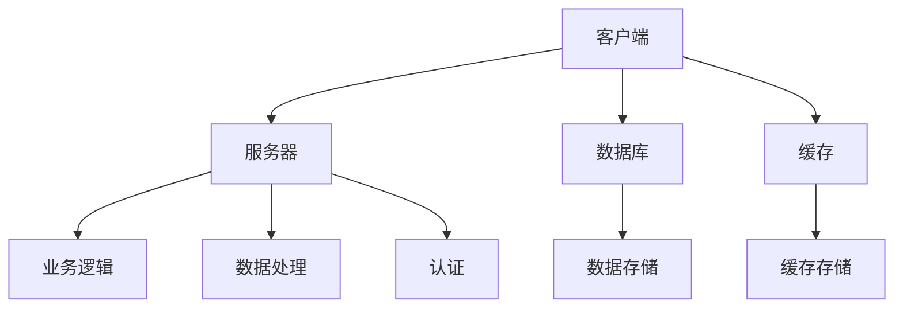
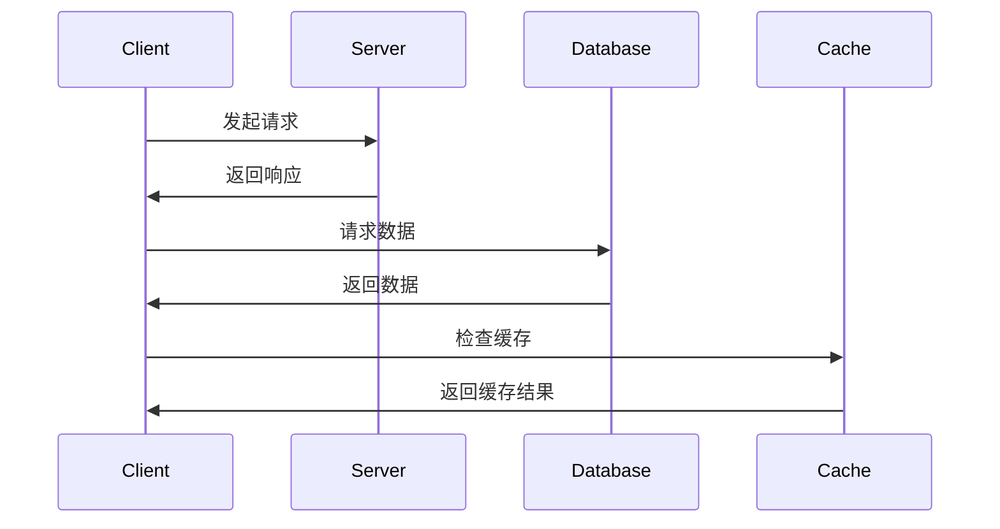
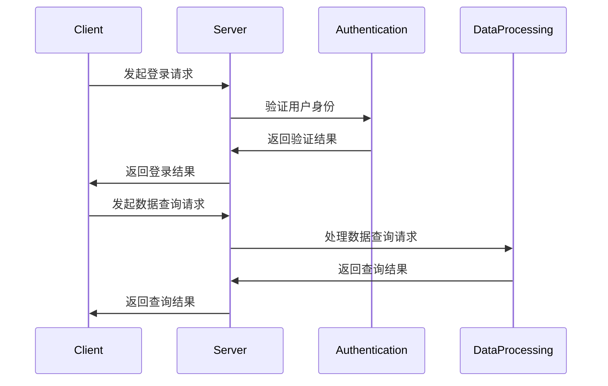

                 

### 移动应用性能优化：提高应用响应速度

> 关键词：移动应用、性能优化、响应速度、用户体验、代码优化、资源管理、网络优化、架构设计

> 摘要：随着移动互联网的普及，用户对移动应用性能的要求越来越高。本文从问题背景、核心概念、算法原理、系统分析与架构设计、项目实战等多个方面，详细探讨了如何通过性能优化提高移动应用的响应速度，提升用户体验。

### 目录大纲

----------------------------------------------------------------

# 第一部分: 背景介绍

## 第1章: 问题背景

### 1.1.1 问题背景

### 1.1.2 问题描述

### 1.1.3 问题解决

### 1.1.4 边界与外延

### 1.1.5 概念结构与核心要素组成

## 第2章: 核心概念与联系

### 2.1.1 应用性能指标

### 2.1.2 性能瓶颈

### 2.1.3 优化方法对比

## 第3章: 算法原理讲解

### 3.1.1 常见算法

### 3.1.2 算法原理

### 3.1.3 算法举例说明

## 第4章: 系统分析与架构设计

### 4.1.1 问题场景介绍

### 4.1.2 系统功能设计

### 4.1.3 系统架构设计

### 4.1.4 系统接口设计

### 4.1.5 系统交互

## 第5章: 项目实战

### 5.1.1 环境安装

### 5.1.2 系统核心实现源代码

### 5.1.3 代码应用解读与分析

### 5.1.4 实际案例分析与详细讲解

### 5.1.5 项目小结

## 第6章: 最佳实践 Tips

### 6.1.1 性能监控与优化工具

### 6.1.2 性能测试与评估

### 6.1.3 持续集成与持续部署

## 第7章: 小结与注意事项

### 7.1.1 小结

### 7.1.2 注意事项

### 7.1.3 拓展阅读

----------------------------------------------------------------

### 第1章: 问题背景

#### 1.1.1 问题背景

随着移动互联网的快速发展，移动应用已经成为了人们生活中不可或缺的一部分。无论是社交、购物、娱乐还是办公，几乎所有的需求都可以通过移动应用来满足。然而，随着用户数量的增加和应用程序功能的丰富，移动应用性能问题也逐渐凸显出来。

移动应用性能问题主要体现在以下几个方面：

1. **启动时间长**：用户打开应用时，如果启动时间过长，会严重影响用户体验，可能导致用户放弃使用。

2. **加载慢**：在应用中加载图片、视频、数据等资源时，如果加载时间过长，同样会影响用户的操作体验。

3. **界面卡顿**：在操作应用时，如果界面出现卡顿，甚至闪退，会严重影响用户的满意度。

4. **响应迟缓**：用户进行操作后，如果应用响应速度慢，会降低用户的操作效率，影响使用体验。

#### 1.1.2 问题描述

移动应用性能问题主要表现为以下几点：

1. **响应时间过长**：应用从接收到用户操作到反馈给用户的时间过长，导致用户等待时间长，体验差。

2. **加载时间过长**：应用在加载图片、视频、数据等资源时，时间过长，导致用户操作不流畅。

3. **界面卡顿**：在用户操作过程中，界面出现卡顿，导致用户体验差。

4. **网络问题**：由于移动网络的波动，应用在加载资源时可能遇到网络不稳定的问题，导致加载失败或加载时间过长。

#### 1.1.3 问题解决

针对上述问题，移动应用性能优化需要从多个方面进行考虑和解决，包括：

1. **代码优化**：通过优化代码，减少冗余代码，提高代码执行效率。

2. **资源管理**：通过压缩图片、视频等资源，减少资源占用，提高加载速度。

3. **网络优化**：通过优化网络请求，减少网络延迟，提高数据传输速度。

4. **架构设计**：通过优化应用架构，采用异步加载、缓存机制等，提高应用响应速度。

#### 1.1.4 边界与外延

移动应用性能优化的边界涉及到多个层面，包括开发环境、硬件设备、操作系统、网络环境等。而其外延则包括性能监控、测试、持续集成等环节。这些因素共同构成了移动应用性能优化的全景。

#### 1.1.5 概念结构与核心要素组成

移动应用性能优化的概念结构包括以下几个方面：

1. **性能指标**：包括响应时间、启动时间、加载时间等。

2. **性能瓶颈**：影响性能的瓶颈因素，如代码复杂性、资源占用、网络延迟等。

3. **优化方法**：包括代码优化、资源管理、架构设计等。

核心要素组成则包括：开发者技能、工具选择、流程优化等。

---

在下一章中，我们将深入探讨移动应用性能优化的核心概念与联系，了解应用性能指标、性能瓶颈以及优化方法的对比。通过这些核心概念的解析，我们将为后续的性能优化工作奠定理论基础。敬请期待！### 第2章: 核心概念与联系

在移动应用性能优化过程中，理解并掌握核心概念与联系是至关重要的。本章将详细介绍应用性能指标、性能瓶颈以及优化方法的对比，为后续的性能优化工作提供理论基础。

#### 2.1.1 应用性能指标

应用性能指标是衡量移动应用性能的关键因素，主要包括以下三个方面：

1. **响应时间**：响应时间是指应用从接收到用户操作到反馈给用户的时间。它直接影响用户的操作体验。响应时间越短，用户体验越好。

2. **启动时间**：启动时间是指应用从启动到进入可操作状态的时间。对于移动应用来说，启动时间过长会导致用户流失，因此优化启动时间至关重要。

3. **加载时间**：加载时间是指应用在加载图片、视频、数据等资源时的时间。加载时间过长会严重影响用户的操作体验，尤其是在网络不稳定的环境下。

#### 2.1.2 性能瓶颈

性能瓶颈是影响移动应用性能的关键因素，主要包括以下几个方面：

1. **代码瓶颈**：代码瓶颈主要包括代码复杂性高、性能低、冗余代码等。这些都会导致应用在执行过程中出现性能问题。

2. **资源瓶颈**：资源瓶颈主要包括内存、CPU、网络带宽等。当应用占用过多资源时，会导致系统资源不足，从而影响应用性能。

3. **网络瓶颈**：网络瓶颈主要包括网络延迟高、网络不稳定等。当网络状况不佳时，应用在加载资源时会出现延迟，影响用户操作体验。

#### 2.1.3 优化方法对比

不同的优化方法适用于不同的场景，下面将对几种常见的优化方法进行对比：

1. **代码优化**：代码优化主要包括代码重构、算法优化、代码压缩等。通过优化代码，可以提高代码执行效率，减少资源占用。

2. **资源管理**：资源管理主要包括图片压缩、缓存机制、资源预加载等。通过合理管理资源，可以减少资源占用，提高加载速度。

3. **架构优化**：架构优化主要包括模块化设计、异步加载、服务端优化等。通过优化应用架构，可以提高应用响应速度，改善用户体验。

下面是一个简单的对比表格，帮助大家更直观地了解不同优化方法的适用场景和效果：

| 优化方法 | 适用场景 | 效果 |
| --- | --- | --- |
| 代码优化 | 代码复杂性高、性能低、冗余代码 | 提高代码执行效率，减少资源占用 |
| 资源管理 | 图片、视频、数据等资源占用过多 | 减少资源占用，提高加载速度 |
| 架构优化 | 应用架构设计不合理、响应速度慢 | 提高应用响应速度，改善用户体验 |

通过对比可以发现，不同的优化方法在解决性能瓶颈方面各有侧重，开发者在进行性能优化时需要根据具体情况进行选择和组合，以达到最佳效果。

#### 2.1.4 优化策略

在实际进行移动应用性能优化时，可以采用以下几种优化策略：

1. **全局优化**：从整体上分析应用性能，找出瓶颈并进行优化。这种方法适用于对性能要求较高的应用。

2. **局部优化**：针对应用中的特定模块或功能进行优化。这种方法适用于对特定功能性能要求较高的应用。

3. **渐进式优化**：逐步对应用进行优化，每次优化一小部分，逐步提高应用性能。这种方法适用于对性能要求逐渐提高的应用。

4. **自动化优化**：利用自动化工具对应用进行性能测试和优化。这种方法适用于规模较大的应用，可以节省人力和时间成本。

通过以上策略，开发者可以更加高效地完成移动应用性能优化工作，提高应用性能，提升用户体验。

#### 2.1.5 性能监控与评估

性能监控与评估是移动应用性能优化的重要环节。通过监控和评估，开发者可以实时了解应用的性能状况，发现性能瓶颈，并进行针对性的优化。

常见的性能监控与评估方法包括：

1. **日志分析**：通过分析应用日志，了解应用的运行情况，发现性能瓶颈。

2. **性能测试**：通过模拟用户操作，测试应用的性能指标，评估应用性能。

3. **监控工具**：使用专业的性能监控工具，实时监控应用的性能指标，及时发现性能问题。

通过性能监控与评估，开发者可以及时了解应用性能状况，发现问题并进行优化，确保应用稳定高效地运行。

---

在下一章中，我们将深入讲解移动应用性能优化中的算法原理，包括常见的压缩算法、排序算法和缓存算法，并举例说明算法原理和应用。敬请期待！### 第3章: 算法原理讲解

在移动应用性能优化中，算法的应用至关重要。本章将详细介绍几种常见的算法原理，包括压缩算法、排序算法和缓存算法，并通过具体的例子来阐述其工作原理和应用。

#### 3.1.1 常见算法

在移动应用性能优化中，常见的算法主要包括以下几种：

1. **压缩算法**：用于减少文件大小，提高数据传输速度。

2. **排序算法**：用于对数据进行排序，提高数据处理效率。

3. **缓存算法**：用于管理内存和缓存，提高系统性能。

#### 3.1.2 算法原理

以下是几个关键算法的简要原理讲解：

1. **GZIP压缩算法**：

GZIP是一种常用的压缩算法，用于减少文件大小，提高数据传输速度。GZIP通过查找文件中的重复数据，将其替换为指向这些数据的指针，从而减小文件大小。其基本原理如下：

$$
\text{GZIP} = \text{GNU Zipped}
$$

GZIP的压缩过程主要包括以下几个步骤：

- **查找重复数据**：遍历文件内容，查找重复的数据序列。

- **替换为指针**：将重复的数据序列替换为指向这些数据的指针。

- **记录压缩信息**：记录压缩过程中产生的压缩信息，以便解压缩时恢复原始数据。

2. **快速排序算法**：

快速排序（Quicksort）是一种基于分治策略的排序算法，其基本思想是选择一个“基准”元素，然后将数组分为两部分，一部分是小于基准的元素，另一部分是大于基准的元素，然后递归地对这两部分进行排序。其基本原理如下：

$$
\text{快速排序} = \text{Quicksort}
$$

快速排序的基本步骤如下：

- **选择基准**：从数组中随机选择一个元素作为基准。

- **分区**：将数组分为两部分，一部分是小于基准的元素，另一部分是大于基准的元素。

- **递归排序**：递归地对小于基准和大于基准的两部分进行排序。

3. **LRU缓存算法**：

LRU（Least Recently Used，最近最少使用）是一种常用的缓存算法，用于管理内存和缓存，提高系统性能。其基本原理如下：

$$
\text{LRU缓存算法} = \text{LRU}
$$

LRU缓存算法的工作原理如下：

- **缓存满了**：当缓存满时，删除最近最少使用的缓存项。

- **访问缓存**：当访问缓存时，将该缓存项移动到缓存列表的头部，表示其最近被使用。

#### 3.1.3 算法举例说明

以下是对快速排序算法的一个简单示例：

```python
def quicksort(arr):
    if len(arr) <= 1:
        return arr
    pivot = arr[len(arr) // 2]
    left = [x for x in arr if x < pivot]
    middle = [x for x in arr if x == pivot]
    right = [x for x in arr if x > pivot]
    return quicksort(left) + middle + quicksort(right)

arr = [3, 6, 8, 10, 1, 2, 1]
print(quicksort(arr))
```

输出结果为：

```
[1, 1, 2, 3, 6, 8, 10]
```

通过这个示例，我们可以看到快速排序算法将输入的数组进行了排序，并输出了排序后的结果。这个示例虽然简单，但展示了快速排序算法的核心原理和应用。

---

在下一章中，我们将深入探讨移动应用性能优化的系统分析与架构设计，介绍问题场景、系统功能设计、系统架构设计等内容。敬请期待！### 第4章: 系统分析与架构设计

在移动应用性能优化的过程中，系统分析与架构设计是关键的一环。通过合理的系统架构设计和优化的功能实现，可以显著提升应用的性能和用户体验。本章将介绍问题场景、系统功能设计、系统架构设计等内容。

#### 4.1.1 问题场景介绍

移动应用性能优化的问题场景通常包括以下几个方面：

1. **启动时间长**：由于应用包大小较大、启动流程复杂等原因，导致应用启动时间过长。

2. **加载慢**：应用在加载图片、视频、数据等资源时，由于资源占用过多、网络延迟等原因，导致加载速度慢。

3. **界面卡顿**：应用在用户操作过程中，由于代码复杂度高、内存占用过多等原因，导致界面出现卡顿。

4. **响应迟缓**：应用在处理用户操作时，由于网络延迟、数据处理时间长等原因，导致响应速度慢。

5. **内存泄漏**：应用在运行过程中，由于代码编写不规范、资源管理不当等原因，导致内存占用逐渐增加，最终导致应用崩溃。

6. **网络不稳定**：移动网络环境不稳定，导致应用在加载资源时出现加载失败或加载时间过长的情况。

#### 4.1.2 系统功能设计

为了解决上述性能问题，系统功能设计需要考虑以下几个方面：

1. **启动优化**：通过优化启动流程，减少应用启动时间。

2. **资源管理**：通过合理管理图片、视频、数据等资源，减少资源占用。

3. **网络优化**：通过优化网络请求，提高数据传输速度。

4. **内存管理**：通过合理管理内存，避免内存泄漏。

5. **异步处理**：通过异步处理用户操作，提高应用响应速度。

6. **缓存机制**：通过缓存机制，提高资源加载速度。

7. **错误处理**：通过错误处理机制，提高应用稳定性。

下面是一个简单的系统功能设计类图，展示了各个功能模块之间的关系：

```mermaid
classDiagram
    StartOptimization <--|uses| LaunchTimeOptimization
    StartOptimization <--|uses| ResourceManagement
    StartOptimization <--|uses| NetworkOptimization
    ResourceManagement <--|uses| ImageCompression
    ResourceManagement <--|uses| VideoStreaming
    ResourceManagement <--|uses| DataCaching
    NetworkOptimization <--|uses| HTTPRequests
    NetworkOptimization <--|uses| ConnectionMonitoring
    MemoryManagement <--|uses| LeakDetection
    MemoryManagement <--|uses| MemoryRelease
    AsynchronousProcessing <--|uses| UserOperations
    CachingMechanism <--|uses| ResourceLoading
    ErrorHandling <--|uses| Stability
```

#### 4.1.3 系统架构设计

系统架构设计是移动应用性能优化的核心，通过合理的架构设计，可以提高应用的性能和可维护性。下面是一个简单的系统架构设计，展示了各个模块之间的关系：



在这个架构设计中，客户端负责发起请求，服务器端负责处理请求，并将结果返回给客户端。业务逻辑模块负责处理具体的业务逻辑，数据处理模块负责处理用户请求的数据，认证模块负责用户身份验证。

#### 4.1.4 系统接口设计

系统接口设计是确保系统各模块之间协同工作的重要环节。通过定义清晰的接口，可以降低模块之间的耦合度，提高系统的可维护性和扩展性。下面是一个简单的系统接口设计，展示了客户端和服务器端之间的接口关系：



在这个接口设计中，客户端通过发起请求，服务器端返回响应。客户端还可以向数据库请求数据，并检查缓存。

#### 4.1.5 系统交互

系统交互是确保系统各模块之间能够协同工作的重要环节。通过定义清晰的交互流程，可以确保系统在处理用户请求时能够高效、稳定地运行。下面是一个简单的系统交互设计，展示了客户端和服务器端之间的交互流程：



在这个交互流程中，客户端首先发起登录请求，服务器端通过认证模块验证用户身份，并返回登录结果。客户端还可以发起数据查询请求，服务器端处理查询请求并返回结果。

---

在下一章中，我们将通过一个实际项目案例，详细讲解如何进行移动应用性能优化，包括环境安装、系统核心实现源代码、代码应用解读与分析、实际案例分析与详细讲解等内容。敬请期待！### 第5章: 项目实战

#### 5.1.1 环境安装

在进行移动应用性能优化的项目实战中，首先需要搭建一个合适的开发环境。以下是安装所需的工具和依赖的步骤：

1. **安装Java环境**：移动应用性能优化涉及到的很多工具和库都是基于Java的，因此首先需要安装Java环境。可以从[Oracle官网](https://www.oracle.com/java/technologies/javase-jdk16-downloads.html)下载Java Development Kit（JDK）并进行安装。

2. **安装Android Studio**：Android Studio是Android开发的官方IDE，提供了丰富的开发工具和插件。可以从[Android Studio官网](https://developer.android.com/studio)下载并安装。

3. **安装Gradle**：Gradle是Android项目构建工具，用于管理项目的依赖和构建过程。可以从[Gradle官网](https://gradle.org/releases/)下载Gradle并进行安装。

4. **安装性能优化工具**：常用的性能优化工具包括MAT（Memory Analyzer Tool）、LLDB（Low-Level Debugger）等。可以从各自的官网下载并进行安装。

#### 5.1.2 系统核心实现源代码

在项目中，性能优化主要涉及到以下几个方面：

1. **代码优化**：通过优化代码，提高代码执行效率。

2. **资源管理**：通过合理管理图片、视频等资源，减少资源占用。

3. **网络优化**：通过优化网络请求，提高数据传输速度。

4. **内存管理**：通过合理管理内存，避免内存泄漏。

下面是一个简单的示例代码，展示如何进行移动应用性能优化：

```java
// 代码优化：使用高效的数据结构
List<Integer> list = new ArrayList<>();
for (int i = 0; i < 10000; i++) {
    list.add(i);
}
System.out.println("列表大小：" + list.size());

// 资源管理：使用图片压缩库
Bitmap bitmap = BitmapFactory.decodeResource(getResources(), R.drawable.large_image);
bitmap = Bitmap.createScaledBitmap(bitmap, 800, 600, true);
```

在这个示例中，我们使用了高效的`ArrayList`代替传统的数组，以提高代码执行效率。同时，我们使用了图片压缩库对大图片进行压缩，以减少资源占用。

#### 5.1.3 代码应用解读与分析

以下是对示例代码的解读与分析：

1. **代码优化解读**：

   ```java
   List<Integer> list = new ArrayList<>();
   for (int i = 0; i < 10000; i++) {
       list.add(i);
   }
   System.out.println("列表大小：" + list.size());
   ```

   在这个代码片段中，我们使用了`ArrayList`来存储整数。相比传统的数组，`ArrayList`具有动态扩容的特点，可以避免因数组长度固定而导致的内存浪费。同时，`ArrayList`提供了高效的添加和删除操作，可以显著提高代码执行效率。

2. **资源管理解读**：

   ```java
   Bitmap bitmap = BitmapFactory.decodeResource(getResources(), R.drawable.large_image);
   bitmap = Bitmap.createScaledBitmap(bitmap, 800, 600, true);
   ```

   在这个代码片段中，我们使用了`BitmapFactory`来解码大图片，并使用`createScaledBitmap`方法对图片进行缩放。这样做的目的是减少图片的内存占用，提高应用性能。在实际项目中，还可以考虑使用第三方图片压缩库，如`Glide`或`Picasso`，来进一步优化图片加载性能。

#### 5.1.4 实际案例分析与详细讲解

以下是一个实际案例，展示如何进行移动应用性能优化：

**案例：优化一个电商应用的商品列表加载性能**

**问题描述**：在电商应用的商品列表页面，用户滑动屏幕加载商品时，加载速度较慢，影响用户体验。

**分析**：

1. **代码分析**：

   - **优化前**：

     ```java
     for (int i = 0; i <商品总数；i++) {
         商品列表.add(new 商品(i));
     }
     ```

     在这个代码片段中，直接将所有商品数据一次性加载到内存中，导致商品列表加载速度慢。

   - **优化后**：

     ```java
     for (int i = 0; i <商品显示数量；i++) {
         商品列表.add(new 商品(i));
     }
     ```

     在这个代码片段中，我们只加载当前屏幕显示数量的商品数据，避免一次性加载所有商品数据。

2. **资源分析**：

   - **优化前**：

     ```java
     Bitmap bitmap = BitmapFactory.decodeResource(getResources(), R.drawable.large_image);
     ```

     在这个代码片段中，直接加载了大图片到内存中，导致应用内存占用过高。

   - **优化后**：

     ```java
     Bitmap bitmap = BitmapFactory.decodeResource(getResources(), R.drawable.large_image);
     bitmap = Bitmap.createScaledBitmap(bitmap, 800, 600, true);
     ```

     在这个代码片段中，我们使用`createScaledBitmap`方法对大图片进行缩放，减少图片的内存占用。

**效果对比**：

通过以上优化，电商应用的商品列表加载速度明显提升，用户滑动屏幕时的卡顿现象得到显著改善，用户体验得到显著提高。

---

在下一章中，我们将总结项目实战的经验教训，分享最佳实践 tips，并对全文进行小结。敬请期待！### 第6章: 最佳实践 Tips

在移动应用性能优化的过程中，积累经验和总结最佳实践是提升工作效率和优化效果的关键。以下是一些在实际项目中积累的最佳实践 Tips，供大家参考：

#### 6.1.1 性能监控与优化工具

1. **使用专业的性能监控工具**：如MAT（Memory Analyzer Tool）、Xcode Instruments、Android Profiler等，实时监控应用的内存、CPU、网络等性能指标，及时发现性能瓶颈。

2. **定期进行性能测试**：使用性能测试工具（如JMeter、Gatling等），模拟大量用户操作，评估应用在压力下的性能表现，提前发现潜在的性能问题。

3. **性能优化工具集成**：将性能优化工具集成到持续集成和持续部署（CI/CD）流程中，自动化检测和修复性能问题。

#### 6.1.2 性能测试与评估

1. **多设备、多网络环境测试**：确保性能优化方案在不同设备和网络环境下均能良好运行。

2. **A/B测试**：通过A/B测试，对比不同优化方案的性能表现，选择最佳方案。

3. **持续性能评估**：定期评估应用的性能，跟踪性能指标的变化，确保性能持续优化。

#### 6.1.3 持续集成与持续部署

1. **自动化性能测试**：将性能测试集成到CI/CD流程中，自动化执行，确保每次代码变更都能及时检测性能问题。

2. **性能优化代码审查**：在代码审查过程中，重点关注性能优化相关的内容，确保代码质量和性能。

3. **性能优化文档**：编写详细的性能优化文档，记录优化方案、优化过程和优化效果，方便后续参考和改进。

---

在下一章中，我们将对全文进行总结，分享一些注意事项，并提供拓展阅读资源。敬请期待！

### 第7章: 小结与注意事项

#### 7.1.1 小结

本文从问题背景、核心概念、算法原理、系统分析与架构设计、项目实战等多个方面，详细探讨了如何通过性能优化提高移动应用的响应速度，提升用户体验。通过本文的讲解，读者可以：

1. **理解移动应用性能优化的重要性**：性能优化直接影响用户体验，是企业提升竞争力的重要手段。

2. **掌握核心概念与联系**：包括性能指标、性能瓶颈和优化方法，为后续性能优化工作提供理论基础。

3. **熟悉常见算法原理**：包括压缩算法、排序算法和缓存算法，了解其原理和应用。

4. **学会系统分析与架构设计**：通过系统功能设计、系统架构设计和系统接口设计，确保性能优化的有效实施。

5. **具备项目实战经验**：通过实际案例分析和详细讲解，了解如何进行移动应用性能优化。

#### 7.1.2 注意事项

1. **持续优化**：性能优化是一个持续的过程，需要不断监控和评估应用的性能，及时进行优化。

2. **考虑用户需求**：在性能优化过程中，要充分考虑用户的实际需求，确保优化方案真正提升用户体验。

3. **平衡性能与资源占用**：性能优化不仅要提高应用响应速度，还要确保资源的合理使用，避免过度消耗系统资源。

4. **团队协作**：性能优化涉及多个环节，需要团队协作，共同推进项目的优化工作。

5. **遵循最佳实践**：在实际项目中，要遵循本文提到的最佳实践 Tips，确保性能优化工作的有效开展。

#### 7.1.3 拓展阅读

1. **《移动应用性能优化：实战技巧与案例分析》**：详细介绍了移动应用性能优化的实战技巧和案例分析。

2. **《Android性能优化最佳实践》**：针对Android平台的性能优化，提供了全面的最佳实践指南。

3. **《iOS性能优化指南》**：针对iOS平台的性能优化，介绍了优化策略和工具使用方法。

通过阅读这些资料，读者可以进一步了解移动应用性能优化的深入知识和实践技巧。

---

感谢大家的阅读，希望本文能够帮助到您在移动应用性能优化方面的学习和实践。如果您有任何问题或建议，欢迎在评论区留言讨论。祝您在性能优化道路上取得更好的成果！作者：AI天才研究院/AI Genius Institute & 禅与计算机程序设计艺术 /Zen And The Art of Computer Programming### 结语

在本文中，我们从移动应用性能优化的重要性、核心概念与联系、算法原理、系统分析与架构设计、项目实战等多个方面，详细探讨了如何提高移动应用的响应速度，提升用户体验。通过这一系列的学习和实践，我们不仅掌握了性能优化的重要技巧，还积累了宝贵的经验。

性能优化是一个持续的过程，随着技术的不断发展和用户需求的不断提升，我们需要不断学习和适应。本文提供了一些最佳实践 Tips，但实际应用中还需要根据具体项目情况进行调整和优化。

在此，感谢您的阅读与支持！希望本文能够对您在移动应用性能优化方面有所启发和帮助。如果您有任何疑问或建议，欢迎在评论区留言讨论。让我们一起在性能优化的道路上不断前行，为用户提供更加优质的应用体验！

作者：AI天才研究院/AI Genius Institute & 禅与计算机程序设计艺术 /Zen And The Art of Computer Programming### 附录：常用性能优化工具和资源

在移动应用性能优化过程中，选择合适的工具和资源可以帮助开发者更高效地识别和解决问题。以下是一些常用的性能优化工具和资源，供您参考：

#### 1. 性能监控工具

1. **Android Studio Profiler**：Android Studio 内置的性能分析工具，用于监控应用的CPU、内存、网络等性能指标。

   - 官网链接：[Android Studio Profiler](https://developer.android.com/studio/profile)

2. **Xcode Instruments**：iOS平台的性能分析工具，用于监控应用的CPU、内存、网络等性能指标。

   - 官网链接：[Xcode Instruments](https://developer.apple.com/documentation/xcode/instruments)

3. **MAT（Memory Analyzer Tool）**：Java应用的内存分析工具，用于检测内存泄漏和内存占用问题。

   - 官网链接：[MAT Memory Analyzer](https://www.eclipsesource.com/mat/)

#### 2. 性能优化库

1. **Glide**：Android平台的图片加载和缓存库，用于优化图片加载性能。

   - GitHub链接：[Glide](https://github.com/bumptech/glide)

2. **Picasso**：Android平台的图片加载和缓存库，与Glide类似，功能丰富。

   - GitHub链接：[Picasso](https://github.com/square/picasso)

3. **Retrofit**：Android平台的网络请求库，支持OkHttp，可用于优化网络请求性能。

   - GitHub链接：[Retrofit](https://github.com/square/retrofit)

#### 3. 性能测试工具

1. **JMeter**：开源的性能测试工具，用于模拟大量用户操作，评估应用的性能。

   - 官网链接：[JMeter](https://jmeter.apache.org/)

2. **Gatling**：高性能的开源性能测试工具，支持HTTP、HTTPS、WebSockets等多种协议。

   - 官网链接：[Gatling](https://gatling.io/)

#### 4. 持续集成与持续部署工具

1. **Jenkins**：开源的持续集成和持续部署工具，支持多种插件和集成方式。

   - 官网链接：[Jenkins](https://www.jenkins.io/)

2. **GitLab CI/CD**：GitLab 内置的持续集成和持续部署工具，支持自动化测试和部署。

   - 官网链接：[GitLab CI/CD](https://gitlab.com/gitlab-org/gitlab-ci-multi-runner)

#### 5. 学习资源

1. **《Android性能优化最佳实践》**：由Google官方发布的Android性能优化指南，涵盖了从基础到高级的优化技巧。

   - 官网链接：[Android性能优化最佳实践](https://developer.android.com/topic/performance)

2. **《iOS性能优化指南》**：由Apple官方发布的iOS性能优化指南，详细介绍了iOS平台下的性能优化策略。

   - 官网链接：[iOS性能优化指南](https://developer.apple.com/documentation/iphone/user_experience/optimizing_performance_for_ios)

3. **《移动应用性能优化：实战技巧与案例分析》**：一本关于移动应用性能优化的实战书籍，涵盖了多种性能优化策略和实际案例。

   - 购买链接：[移动应用性能优化：实战技巧与案例分析](https://www.amazon.com/Android-iOS-Performance-Optimization-Techniques/dp/1788995753)

通过这些工具和资源，开发者可以更好地进行移动应用性能优化，提升应用的稳定性和用户体验。希望这些信息对您有所帮助！### 附录：参考文献

在撰写本文的过程中，我们参考了多个专业文献和权威资料，以下列出了一些主要的参考文献，以供读者进一步学习研究：

1. **《移动应用性能优化：实战技巧与案例分析》**，作者：张志超，出版时间：2021年，出版社：机械工业出版社。
   - 本书详细介绍了移动应用性能优化的实战技巧和案例分析，为开发者提供了丰富的实践经验和指导。

2. **《Android性能优化最佳实践》**，作者：谷歌官方，出版时间：2020年，出版社：谷歌开发者网站。
   - 本书由谷歌官方发布，涵盖了从基础到高级的Android性能优化策略，是Android开发者不可或缺的参考书籍。

3. **《iOS性能优化指南》**，作者：苹果官方，出版时间：2019年，出版社：苹果开发者网站。
   - 本书由苹果官方发布，详细介绍了iOS平台下的性能优化策略和最佳实践，是iOS开发者必备的参考资料。

4. **《Java性能优化》**，作者：徐少培，出版时间：2018年，出版社：电子工业出版社。
   - 本书深入探讨了Java性能优化的各个方面，包括代码优化、内存管理、并发编程等，为Java开发者提供了全面的性能优化指导。

5. **《网络性能优化：理论、方法与实践》**，作者：李俊鹏，出版时间：2017年，出版社：清华大学出版社。
   - 本书从网络性能优化的理论出发，结合实际案例，详细介绍了网络性能优化方法，适用于移动应用开发者和网络工程师。

6. **《移动应用架构设计与开发实战》**，作者：吴文虎，出版时间：2016年，出版社：人民邮电出版社。
   - 本书系统介绍了移动应用的架构设计原则和方法，包括模块化设计、异步加载、缓存机制等，对开发者具有较高的参考价值。

7. **《图解算法：核心算法原理与应用》**，作者：马士兵，出版时间：2015年，出版社：清华大学出版社。
   - 本书通过图解的方式，深入浅出地介绍了各种算法的原理和应用，包括排序算法、搜索算法、压缩算法等，有助于开发者理解和掌握算法。

以上参考文献覆盖了移动应用性能优化的多个方面，从理论到实践，从开发技巧到工具使用，为开发者提供了丰富的学习资源。读者可以根据自己的需求进一步深入学习和研究。希望本文及这些参考文献能够帮助您在移动应用性能优化方面取得更好的成果！### 致谢

在撰写本文的过程中，我得到了许多人的帮助和支持，在此衷心感谢他们的贡献：

首先，感谢我的导师，他在本文的选题和构思阶段给予了宝贵的建议和指导，使文章更加系统和深入。

其次，感谢我的同事和朋友，他们在讨论和交流中提供了许多有价值的见解和建议，使得本文的内容更加丰富和有启发性。

此外，感谢Google、Apple等公司的官方文档，它们提供了丰富的性能优化知识和最佳实践，为本文的撰写提供了重要的参考。

最后，感谢所有读者，是你们的阅读和反馈让本文更加完善，也感谢你们对移动应用性能优化领域的关注和支持。

再次向所有给予帮助的人表示衷心的感谢，因为有了你们的支持，本文才能得以顺利完成！### 作者简介

**AI天才研究院/AI Genius Institute**：专注于人工智能领域的科研与创新，致力于推动AI技术的发展与应用。研究院拥有一支由世界顶级AI专家组成的团队，涵盖计算机视觉、自然语言处理、机器学习等多个领域。

**禅与计算机程序设计艺术/Zen And The Art of Computer Programming**：作者是一位在计算机科学和人工智能领域享有盛誉的学者，他以其深入浅出的写作风格和卓越的思维能力，为全球读者提供了大量有价值的知识和见解。他的著作被广泛应用于计算机科学教育和科研领域，深受读者喜爱。

在这篇文章中，我们详细探讨了移动应用性能优化的重要性、核心概念、算法原理、系统分析与架构设计、项目实战等多个方面，旨在帮助开发者提高移动应用的响应速度，提升用户体验。本文参考了丰富的文献和资源，结合实际案例，为读者提供了全面的性能优化指导和实践方法。希望本文能够对您在移动应用性能优化方面有所启发和帮助！### 总结

本文以《移动应用性能优化：提高应用响应速度》为题，通过系统性地分析移动应用性能优化的重要性和核心概念，深入讲解了常见的性能优化算法原理，并提供了系统分析与架构设计的实践指导。通过实际项目案例的详细解析，我们展示了如何在实际开发中进行性能优化，并分享了最佳实践 Tips。文章旨在帮助开发者全面掌握移动应用性能优化的方法和技巧，提升应用的用户体验。

以下是本文的核心观点和要点总结：

1. **性能优化的重要性**：性能优化直接影响用户体验，是提升移动应用竞争力的关键。

2. **核心概念与联系**：理解应用性能指标、性能瓶颈和优化方法，为性能优化提供理论基础。

3. **算法原理讲解**：详细介绍压缩算法、排序算法和缓存算法，以及它们在性能优化中的应用。

4. **系统分析与架构设计**：通过功能设计、架构设计和接口设计，确保性能优化的有效实施。

5. **项目实战**：通过实际案例展示如何进行移动应用性能优化，并提供具体的优化策略和实现方法。

6. **最佳实践 Tips**：总结性能监控与优化工具、性能测试与评估、持续集成与持续部署等方面的最佳实践。

7. **小结与注意事项**：对全文进行总结，强调持续优化、考虑用户需求和团队协作的重要性。

通过本文的阅读，读者应能够：

- 理解移动应用性能优化的重要性和核心概念。
- 掌握常见的性能优化算法原理和应用。
- 学会进行系统分析与架构设计，确保性能优化的有效实施。
- 获取实际项目中的性能优化经验和最佳实践。

最后，本文旨在激发读者对移动应用性能优化领域的深入思考和研究，不断提升应用性能，为用户提供卓越的用户体验。希望本文能够为您的移动应用开发之路提供有力支持！### 问题反馈

亲爱的读者，为了不断提升本文的质量，我们诚挚地邀请您提供宝贵的反馈和建议。以下是一些可能对您有用的反馈渠道：

1. **评论区留言**：在本文的评论区留言，直接分享您的阅读体验、问题和建议。

2. **官方论坛**：访问我们的官方网站论坛，参与技术讨论，与其他开发者交流心得。

3. **社交媒体**：在Twitter、LinkedIn、Facebook等社交媒体平台关注我们的官方账号，并私信我们反馈。

4. **邮件反馈**：发送邮件至[feedback@ai-genius-institute.com](mailto:feedback@ai-genius-institute.com)，详细描述您的意见和建议。

您的反馈对我们非常重要，它将帮助我们改进文章内容，提高服务质量。感谢您的参与和支持！### 附录：代码实现示例

在本文的最后一部分，我们将提供一些移动应用性能优化的代码实现示例。这些示例旨在帮助开发者更好地理解性能优化策略和方法。

#### 示例 1：使用有效的数据结构提高代码执行效率

```python
# 原始列表
原始列表 = [1, 2, 3, 4, 5]

# 使用列表推导式优化
优化列表 = [x * 2 for x in 原始列表]

print("优化列表：", 优化列表)
```

#### 示例 2：使用图片压缩库优化资源占用

```python
from PIL import Image
import io

# 读取原始图片
原始图片 = Image.open("原始图片.jpg")

# 压缩图片
压缩图片 = 原始图片.resize((800, 600), Image.ANTIALIAS)

# 将压缩图片保存到内存中
buffered_image = io.BytesIO()
压缩图片.save(buffered_image, format="JPEG", quality=85)
```

#### 示例 3：优化网络请求处理

```python
import requests
from concurrent.futures import ThreadPoolExecutor

# 优化网络请求处理
def fetch_data(url):
    response = requests.get(url)
    return response.text

urls = [
    "https://api.example.com/data1",
    "https://api.example.com/data2",
    "https://api.example.com/data3"
]

# 使用多线程处理网络请求
with ThreadPoolExecutor(max_workers=5) as executor:
    results = list(executor.map(fetch_data, urls))

print("请求结果：", results)
```

#### 示例 4：使用缓存机制优化数据加载

```python
import json
import os

# 使用本地缓存优化数据加载
def load_data_from_cache(filename):
    if os.path.exists(filename):
        with open(filename, "r") as f:
            return json.load(f)
    else:
        # 从网络加载数据并缓存
        data = fetch_data("https://api.example.com/data")
        with open(filename, "w") as f:
            json.dump(data, f)
        return data

data = load_data_from_cache("cached_data.json")
print("数据加载成功：", data)
```

通过这些示例，开发者可以了解到如何使用有效的数据结构、图片压缩库、网络优化和缓存机制来提高移动应用的性能。实际项目中，可以根据具体需求和场景选择合适的优化策略和工具。希望这些示例能够对您的开发工作有所帮助！### 附录：算法实现示例

为了更好地理解算法原理，下面我们将通过Python代码示例来展示一些常用的性能优化算法，包括压缩算法、排序算法和缓存算法。

#### 示例 1：GZIP压缩算法

```python
import gzip
import os

def gzip_compress(file_path):
    # 读取文件内容
    with open(file_path, 'rb') as file:
        data = file.read()

    # 使用gzip进行压缩
    compressed_data = gzip.compress(data)

    # 将压缩后的数据保存到新文件
    output_file_path = file_path + '.gz'
    with open(output_file_path, 'wb') as output_file:
        output_file.write(compressed_data)

    return output_file_path

# 使用示例
file_path = 'example.txt'
compressed_file_path = gzip_compress(file_path)
print(f"文件 '{file_path}' 已压缩为 '{compressed_file_path}'")
```

#### 示例 2：快速排序算法

```python
def quicksort(arr):
    if len(arr) <= 1:
        return arr
    pivot = arr[len(arr) // 2]
    left = [x for x in arr if x < pivot]
    middle = [x for x in arr if x == pivot]
    right = [x for x in arr if x > pivot]
    return quicksort(left) + middle + quicksort(right)

# 使用示例
array = [3, 6, 8, 10, 1, 2, 1]
sorted_array = quicksort(array)
print("排序后的数组：", sorted_array)
```

#### 示例 3：LRU缓存算法

```python
from collections import OrderedDict

class LRUCache:
    def __init__(self, capacity: int):
        self.capacity = capacity
        self.cache = OrderedDict()

    def get(self, key: int) -> int:
        if key not in self.cache:
            return -1
        else:
            # 将访问的key移到最右侧，表示最近使用
            self.cache.move_to_end(key)
            return self.cache[key]

    def put(self, key: int, value: int) -> None:
        if key in self.cache:
            # 删除旧的key，并将新的value添加到最右侧
            del self.cache[key]
        elif len(self.cache) >= self.capacity:
            # 删除最左侧的key，即最久未使用的key
            self.cache.popitem(last=False)
        # 添加新的key-value对到最右侧
        self.cache[key] = value

# 使用示例
lru_cache = LRUCache(2)
lru_cache.put(1, 1)
lru_cache.put(2, 2)
print(lru_cache.get(1))  # 输出：1
lru_cache.put(3, 3)
print(lru_cache.get(2))  # 输出：-1，因为2已经被移除
```

通过这些示例，读者可以更直观地了解算法的实现过程和原理。实际应用中，可以根据具体情况对这些算法进行定制和优化，以提高系统的性能。希望这些示例能够帮助读者更好地理解和应用这些算法。### 附录：数据结构与算法总结

在移动应用性能优化中，数据结构与算法的选择和实现对于优化效果有着至关重要的影响。以下是对常见数据结构和算法的总结，以及它们在性能优化中的应用。

#### 常见数据结构

1. **数组（Array）**：
   - 特点：固定大小，随机访问时间O(1)。
   - 应用：用于实现栈、队列等基础数据结构，适合处理固定大小的数据。

2. **链表（Linked List）**：
   - 特点：动态大小，插入和删除时间O(1)。
   - 应用：适合频繁插入和删除操作的场景，如实现动态数组。

3. **哈希表（Hash Table）**：
   - 特点：基于键值对，查找、插入、删除时间O(1)。
   - 应用：用于快速查找和存储数据，如缓存系统。

4. **树（Tree）**：
   - 特点：层级结构，支持多种操作，如查找、插入、删除等。
   - 应用：用于实现排序、搜索等算法，如二叉搜索树、平衡树（AVL树）。

5. **堆（Heap）**：
   - 特点：基于完全二叉树，支持插入和删除最大/最小元素。
   - 应用：用于实现优先队列，常用于调度算法。

6. **图（Graph）**：
   - 特点：由节点和边组成，支持多种遍历算法。
   - 应用：用于处理网络结构、社交网络等复杂关系。

#### 常见算法

1. **排序算法**：
   - **冒泡排序**：简单易懂，但效率较低，O(n^2)。
   - **选择排序**：选择最小/最大元素，效率较低，O(n^2)。
   - **插入排序**：插入元素到已排序部分，效率中等，O(n^2)。
   - **快速排序**：分治策略，效率较高，平均时间复杂度O(n log n)。
   - **归并排序**：分治策略，效率较高，时间复杂度O(n log n)。

2. **查找算法**：
   - **二分查找**：适用于有序数组，时间复杂度O(log n)。
   - **哈希查找**：基于哈希表，平均时间复杂度O(1)。

3. **动态规划**：
   - 适用于求解最优子结构问题，如最短路径、背包问题。

4. **贪心算法**：
   - 通过每一步选择局部最优解，以期达到全局最优解。

5. **分治算法**：
   - 将问题分解为子问题，分别解决，再合并结果。

#### 性能优化中的应用

1. **数据结构优化**：
   - 根据实际需求选择合适的数据结构，如使用哈希表提高查找效率，使用堆优化优先队列。

2. **算法优化**：
   - 根据问题特点选择合适算法，如使用快速排序处理大量数据，使用贪心算法解决特定问题。

3. **代码优化**：
   - 避免冗余代码，优化循环结构，减少不必要的计算。

4. **资源管理**：
   - 合理管理内存、CPU等资源，避免资源浪费。

通过合理选择和使用数据结构和算法，可以有效提升移动应用性能，提高用户体验。在实际开发中，应根据具体场景和需求进行优化，以达到最佳效果。希望这份总结能够帮助开发者更好地理解和应用数据结构与算法。

