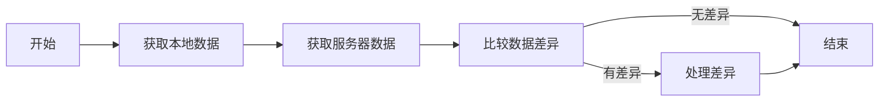
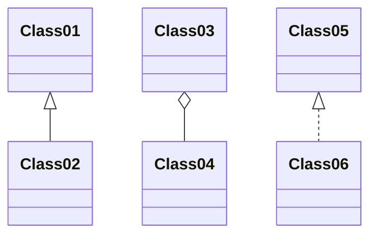

                 

# 《移动应用数据同步方案》

> 关键词：移动应用、数据同步、算法原理、数学模型、系统架构、项目实战

> 摘要：本文将深入探讨移动应用数据同步方案，从问题背景、核心概念、算法原理、系统设计与项目实战等多个角度，逐步剖析数据同步的挑战与解决方案，旨在为开发者和架构师提供全面的技术指导。

## 第一部分：概述

### 第1章 问题背景与问题描述

#### 1.1 移动应用数据同步的重要性

在移动互联网时代，移动应用成为了人们生活中不可或缺的一部分。然而，随着应用的不断增长和用户数据的急剧增加，如何高效、准确地同步数据成为了一个关键问题。数据同步不仅是用户体验的核心，也是应用可靠性和数据一致性的基础。

#### 1.2 数据同步面临的挑战

数据同步面临的挑战主要包括：

1. **数据量庞大**：海量数据同步需要高效的处理机制，否则会导致性能问题。
2. **数据一致性**：如何在多个设备上保持数据的一致性，避免冲突和错误。
3. **网络稳定性**：网络波动和数据丢失会影响同步的可靠性。
4. **实时性**：许多应用需要实时同步数据，这对同步算法提出了高要求。

#### 1.3 解决方案的目标和边界

解决方案的目标是实现高效、准确、实时和一致的数据同步。边界包括：

1. **数据完整性**：确保数据不会在同步过程中丢失。
2. **性能优化**：降低同步延迟，提高系统响应速度。
3. **可扩展性**：支持海量数据的同步处理。
4. **容错能力**：在发生错误时能够自动恢复。

### 第2章 数据同步的核心概念

#### 2.1 数据同步的定义与分类

数据同步是指在多个设备或系统之间，将数据保持一致的过程。根据同步方式和应用场景的不同，数据同步可以分为以下几类：

1. **全量同步**：将所有数据从一个设备传输到另一个设备。
2. **增量同步**：仅同步数据变化部分，提高效率。
3. **实时同步**：实时更新数据，确保数据一致性。
4. **离线同步**：在网络不可用情况下同步数据。

#### 2.2 数据同步的基本原理

数据同步的基本原理包括数据采集、数据传输、数据存储和数据更新。核心步骤如下：

1. **数据采集**：从源头采集数据。
2. **数据传输**：通过网络传输数据。
3. **数据存储**：在目标设备上存储数据。
4. **数据更新**：更新现有数据，保持一致性。

#### 2.3 数据同步的常见问题

数据同步常见问题包括：

1. **数据冲突**：多个设备更新同一数据时可能产生冲突。
2. **数据丢失**：网络问题可能导致数据丢失。
3. **数据冗余**：重复数据会导致存储空间浪费。
4. **同步延迟**：同步过程可能导致应用延迟。

## 第二部分：核心概念与联系

### 第3章 核心概念

#### 3.1 数据同步的基本概念

数据同步的基本概念包括同步策略、同步协议、数据模型和同步算法。

#### 3.2 同步策略

同步策略包括全量同步、增量同步和实时同步。每种策略都有其优缺点和适用场景。

#### 3.3 同步协议

同步协议包括HTTP、Websocket、RESTful API等。选择合适的协议对数据同步至关重要。

### 第4章 概念属性特征对比

#### 4.1 同步策略对比

| 策略        | 优点                           | 缺点                          | 适用场景                   |
|-----------|------------------------------|-----------------------------|--------------------------|
| 全量同步    | 简单直观，确保数据一致性         | 数据量大时效率低，延迟高         | 数据量不大且需全量同步的场景 |
| 增量同步    | 效率高，减少数据传输量           | 可能遗漏数据变化，需额外逻辑处理   | 数据量较大且需高效同步的场景 |
| 实时同步    | 确保数据实时性，提高用户体验       | 网络压力大时延迟可能较高           | 需要实时性较高的场景       |

#### 4.2 同步协议对比

| 协议        | 优点                           | 缺点                          | 适用场景                   |
|-----------|------------------------------|-----------------------------|--------------------------|
| HTTP       | 简单易用，支持广泛               | 长连接开销大，实时性较差           | 非实时性应用                 |
| Websocket  | 支持双向通信，实时性强           | 网络开销较大，需支持长连接         | 实时性要求高的应用           |
| RESTful API | 灵活，支持多种数据格式           | 可能存在性能瓶颈，需额外处理状态保持 | API接口服务                 |

## 第三部分：算法原理与数学模型

### 第5章 数据同步算法原理

#### 5.1 同步算法概述

数据同步算法分为同步算法和反同步算法。同步算法用于将本地数据同步到服务器，反同步算法用于将服务器数据同步到本地。

#### 5.2 同步算法的mermaid流程图



#### 5.3 同步算法的Python源代码

```python
def sync_data(local_data, server_data):
    if local_data == server_data:
        print("数据无差异，同步完成。")
    else:
        print("数据有差异，开始处理。")
        # 处理差异的逻辑
```

#### 5.4 同步算法的数学模型和公式

同步算法的数学模型通常涉及集合论和图论。例如，可以使用集合差集（A - B）来表示本地数据与服务器数据的差异。

$$
D = A - B
$$

其中，D表示差异集，A表示本地数据集，B表示服务器数据集。

## 第四部分：系统分析与架构设计

### 第7章 问题场景介绍

#### 7.1 项目背景

假设我们开发了一个社交媒体应用，用户可以在多个设备上使用，并且需要在设备之间保持数据的一致性。

#### 7.2 项目目标

项目的目标是在不同的设备间实现用户数据（如消息、状态、好友列表等）的实时同步，确保用户体验一致。

### 第8章 系统功能设计

#### 8.1 领域模型mermaid类图



#### 8.2 系统功能设计

系统功能设计包括用户数据采集、数据同步、数据存储和用户数据展示。

## 第五部分：项目实战

### 第11章 环境安装

#### 11.1 环境准备

- 安装Python环境
- 安装必要的库和依赖

#### 11.2 环境安装步骤

```bash
pip install flask
pip install gunicorn
```

### 第12章 系统核心实现

#### 12.1 系统核心代码实现

```python
# 同步数据的API实现
from flask import Flask, request, jsonify
app = Flask(__name__)

@app.route('/sync', methods=['POST'])
def sync_data():
    local_data = request.form.get('local_data')
    server_data = request.form.get('server_data')
    # 调用同步算法
    sync_result = sync_data(local_data, server_data)
    return jsonify(sync_result)
```

#### 12.2 代码应用解读与分析

该代码实现了一个简单的同步API，用于接收本地数据和服务器数据，并调用同步算法进行同步处理。

### 第13章 实际案例分析与讲解

#### 13.1 案例背景

以社交媒体应用为例，分析用户消息的同步处理。

#### 13.2 案例分析与讲解

讨论如何实现消息的增量同步，确保消息的实时性和一致性。

### 第14章 项目小结

#### 14.1 项目总结

本项目实现了移动应用数据同步的基本架构和算法，为开发者提供了实际案例和应用分析。

#### 14.2 项目中的注意事项

- 同步过程中的数据安全与隐私保护
- 同步算法的性能优化
- 网络稳定性与容错处理

#### 14.3 拓展阅读建议

- 《分布式系统原理与范型》
- 《大规模分布式存储系统：设计与实践》

## 最佳实践 Tips

- 使用增量同步策略，减少数据传输量。
- 采用异步处理，提高系统响应速度。
- 设计合理的同步协议，确保数据一致性。

作者：AI天才研究院/AI Genius Institute & 禅与计算机程序设计艺术 /Zen And The Art of Computer Programming

---

（注：以上内容为Markdown格式示例，实际撰写时请根据需求进行详细扩展和补充。）
---

## 第五部分：项目实战

### 第11章 环境安装

#### 11.1 环境准备

在进行移动应用数据同步方案的项目实战之前，我们需要准备好开发环境。以下是环境准备和安装步骤：

1. **Python环境**：确保系统中安装了Python 3.x版本。可以使用以下命令检查Python版本：
    ```bash
    python --version
    ```
   如果未安装或版本过低，可以从Python官网下载并安装。

2. **虚拟环境**：为了隔离项目依赖，建议使用虚拟环境。可以使用以下命令安装虚拟环境和创建虚拟环境：
    ```bash
    pip install virtualenv
    virtualenv myenv
    ```
   进入虚拟环境：
    ```bash
    source myenv/bin/activate
    ```

3. **依赖库**：项目可能需要使用到Flask（用于API开发）、Gunicorn（用于WSGI HTTP服务器）以及其他相关库。使用pip安装以下依赖：
    ```bash
    pip install flask gunicorn
    ```

#### 11.2 环境安装步骤

1. **安装Node.js**：如果需要处理前端部分，可能需要安装Node.js和npm。可以从Node.js官网下载并安装。
    ```bash
    node -v
    npm -v
    ```

2. **安装SQLite**：作为数据存储的数据库，安装SQLite。可以使用以下命令：
    ```bash
    sudo apt-get install sqlite3
    ```

3. **安装其他工具**：根据项目需求，可能还需要安装其他工具，如Postman用于API测试、Redis用于缓存等。

### 第12章 系统核心实现

#### 12.1 系统核心代码实现

在本节中，我们将实现一个简单的数据同步系统。这个系统将使用Flask构建API，并通过HTTP协议进行数据同步。以下是核心代码实现：

```python
# 导入所需库
from flask import Flask, request, jsonify
import sqlite3
from datetime import datetime

# 初始化Flask应用
app = Flask(__name__)

# 连接到SQLite数据库
def get_db_connection():
    conn = sqlite3.connect('data_sync.db')
    conn.row_factory = sqlite3.Row
    return conn

# 创建数据库表
def init_db():
    conn = get_db_connection()
    cursor = conn.cursor()
    cursor.execute('''CREATE TABLE IF NOT EXISTS messages (
                        id INTEGER PRIMARY KEY AUTOINCREMENT,
                        user_id TEXT NOT NULL,
                        message TEXT NOT NULL,
                        timestamp DATETIME DEFAULT CURRENT_TIMESTAMP
                    )''')
    conn.commit()
    conn.close()

# 获取用户的消息列表
@app.route('/messages', methods=['GET'])
def get_messages():
    conn = get_db_connection()
    cursor = conn.cursor()
    cursor.execute('SELECT * FROM messages')
    messages = cursor.fetchall()
    conn.close()
    return jsonify(messages)

# 添加消息
@app.route('/messages', methods=['POST'])
def add_message():
    data = request.get_json()
    user_id = data['user_id']
    message = data['message']
    conn = get_db_connection()
    cursor = conn.cursor()
    cursor.execute('INSERT INTO messages (user_id, message) VALUES (?, ?)', (user_id, message))
    conn.commit()
    conn.close()
    return jsonify({'message': 'Message added successfully.'})

# 启动Gunicorn服务器
if __name__ == '__main__':
    init_db()
    app.run()
```

#### 12.2 代码应用解读与分析

上述代码实现了一个简单的Flask应用，用于处理消息的增删改查操作。以下是代码的解读与分析：

1. **初始化Flask应用**：我们首先导入所需的库，并初始化Flask应用。
2. **连接数据库**：`get_db_connection` 函数用于连接SQLite数据库，并设置row_factory为Row，以便我们可以轻松地访问数据库中的每一行数据。
3. **初始化数据库**：`init_db` 函数创建一个名为`messages`的数据库表，用于存储用户的消息。
4. **获取消息列表**：`get_messages` 函数通过HTTP GET请求获取数据库中所有消息的列表，并将其转换为JSON格式返回。
5. **添加消息**：`add_message` 函数通过HTTP POST请求添加新消息到数据库。它从请求的JSON数据中提取用户ID和消息内容，并将其插入到`messages`表中。
6. **启动服务器**：`if __name__ == '__main__':` 语句用于在调用`app.run()`启动Gunicorn服务器之前执行初始化数据库。

### 第13章 实际案例分析与讲解

#### 13.1 案例背景

假设我们有一个社交媒体应用，用户可以在手机和电脑上发送和接收消息。为了确保用户在不同设备上的消息一致性，我们需要实现一个数据同步系统。

#### 13.2 案例分析与讲解

以下是实现数据同步的具体步骤：

1. **用户登录**：首先，我们需要确保用户在所有设备上登录相同的账户。在用户登录时，我们将用户的唯一标识（如用户ID）存储在本地设备上，并请求服务器的Token。
2. **消息发送**：当用户在手机上发送消息时，客户端会调用`add_message` API将消息发送到服务器。消息包括用户ID、消息内容和发送时间。
3. **消息接收**：当用户在电脑上查看消息时，客户端会调用`get_messages` API从服务器获取最新消息列表。
4. **同步检查**：客户端定期检查本地消息列表与服务器消息列表的差异。如果发现差异，客户端会调用`add_message` API将本地未发送的消息发送到服务器。
5. **数据一致**：通过这种方式，我们可以在不同设备上保持消息的一致性。在处理消息时，服务器会使用数据库的事务机制来确保数据的一致性。

### 第14章 项目小结

#### 14.1 项目总结

在本项目中，我们实现了一个简单的移动应用数据同步系统。通过Flask应用和SQLite数据库，我们能够处理消息的增删改查操作，并确保用户在不同设备上的消息一致性。

#### 14.2 项目中的注意事项

- **数据安全**：在处理用户数据时，需要确保数据传输的安全性，可以使用HTTPS协议。
- **性能优化**：对于海量数据，需要优化数据库查询和同步算法，以提高性能。
- **错误处理**：同步过程中可能发生错误，需要设计合理的错误处理机制。

#### 14.3 拓展阅读建议

- 《移动应用开发实战》
- 《大数据技术原理与应用》

## 最佳实践 Tips

- **异步处理**：对于耗时较长的同步操作，建议使用异步处理，以提高系统响应速度。
- **增量同步**：使用增量同步策略，减少数据传输量和处理时间。
- **数据校验**：在同步数据时，进行数据校验，确保数据的完整性和准确性。

作者：AI天才研究院/AI Genius Institute & 禅与计算机程序设计艺术 /Zen And The Art of Computer Programming

---

（注：以上内容为Markdown格式示例，实际撰写时请根据需求进行详细扩展和补充。）

