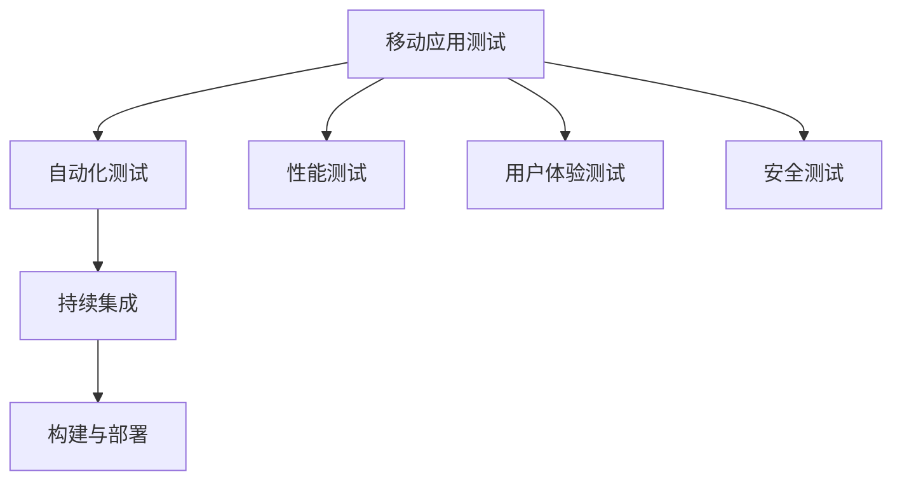
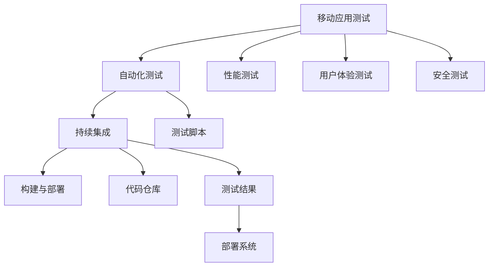

                 


## 引言

### 1.1 移动应用测试背景

在当今数字化时代，移动应用已经成为人们日常生活中不可或缺的一部分。随着智能手机的普及，应用程序的开发和发布速度显著加快。然而，随之而来的问题是，如何在确保质量的前提下，快速地发布和更新应用。移动应用测试在此过程中扮演了至关重要的角色。

**移动应用测试的重要性**：

- **用户体验**：良好的用户体验是移动应用成功的关键。通过测试，可以确保应用在不同设备和操作系统上都能正常运行，提供一致的用户体验。
- **功能正确性**：移动应用通常具有复杂的业务逻辑，测试可以帮助验证应用的功能是否按照预期工作。
- **性能与稳定性**：应用需要能够在各种网络条件下保持稳定运行，测试可以评估应用的性能和稳定性。
- **安全与隐私**：随着用户对隐私的关注日益增加，测试可以帮助发现可能的安全漏洞和隐私问题。

**自动化测试与持续集成的概念**：

- **自动化测试**：自动化测试是指使用软件工具来执行测试脚本，以自动化的方式测试应用程序。这种方式可以大大提高测试效率，减少人为错误。
- **持续集成**：持续集成（CI）是一种软件开发实践，通过自动化构建和测试，确保代码的每次更改都是高质量的。它将代码的合并和测试过程自动化，从而加快了软件开发的速度。

接下来，我们将深入探讨这些概念，并展示它们之间的联系。

### 1.2 核心概念与联系

在移动应用开发中，自动化测试和持续集成是两个关键环节。它们各自独立但又是紧密相连的。

**移动应用测试**：主要关注应用的正确性、性能和用户体验。

**自动化测试**：旨在通过脚本化测试自动化流程，提高测试效率和覆盖范围。

**持续集成**：通过自动化构建、测试和部署流程，确保每次代码提交都是高质量的。

为了更好地理解它们之间的联系，我们可以使用以下表格和Mermaid流程图来展示它们的核心概念和联系。

### 1.2.1 核心概念对比表格

| 概念           | 定义                                                         | 目的                         |
|----------------|--------------------------------------------------------------|------------------------------|
| 移动应用测试   | 验证移动应用的功能、性能和用户体验。                           | 确保应用质量和用户满意度。     |
| 自动化测试     | 使用软件工具执行测试脚本，自动化测试流程。                     | 提高测试效率和覆盖范围。       |
| 持续集成       | 自动化构建、测试和部署流程，确保代码质量。                     | 加快软件开发速度，减少人为错误。 |

### 1.2.2 Mermaid流程图



在这个流程图中，移动应用测试作为核心，通过自动化测试和持续集成来实现构建、测试和部署的自动化。性能测试、用户体验测试和安全测试则是移动应用测试的子环节，确保应用的各个方面都达到预期标准。

通过以上介绍，我们为后续章节的内容奠定了基础。接下来，我们将深入探讨自动化测试和持续集成的原理、应用和实践，帮助您更好地理解这两个关键概念在移动应用测试中的重要性。

## 核心概念与联系

在深入探讨移动应用测试、自动化测试和持续集成之前，我们需要明确这些核心概念及其相互之间的联系。这将帮助我们更好地理解这些概念如何在移动应用开发中协同工作，以提高整体质量和开发效率。

### 移动应用测试

移动应用测试是一个全面的验证过程，确保移动应用在多个方面符合预期标准。主要包括以下几个核心环节：

- **功能测试**：验证应用的功能是否符合设计要求，包括用户界面、业务逻辑和后台处理。
- **性能测试**：评估应用在不同设备和网络环境下的性能，如响应时间、资源占用和稳定性。
- **用户体验测试**：确保应用的用户界面和交互设计符合用户的预期，提供良好的用户体验。
- **安全测试**：检查应用是否容易受到攻击，如SQL注入、XSS攻击等，确保用户数据的安全。

### 自动化测试

自动化测试是通过软件工具自动执行测试脚本的过程，以替代或补充手工测试。它主要有以下几个方面的优势：

- **效率提升**：自动化测试可以快速执行大量测试用例，大大提高测试效率。
- **减少错误**：自动化测试可以减少人为因素导致的测试错误，提高测试的准确性。
- **重复执行**：自动化测试脚本可以轻松重复执行，确保每次测试都是一致的。

自动化测试在移动应用测试中扮演着关键角色，通过以下流程实现：

1. **测试用例设计**：根据需求和设计文档，设计具体的测试用例。
2. **测试脚本编写**：使用自动化测试工具（如Appium、Calabash等）编写测试脚本。
3. **测试执行**：自动执行测试脚本，生成测试报告。
4. **结果分析**：分析测试结果，定位问题并修复。

### 持续集成

持续集成（CI）是一种软件开发实践，旨在通过自动化构建、测试和部署流程，确保每次代码提交都是高质量的。其核心目标是加快软件交付速度，同时确保代码质量。持续集成的关键环节包括：

1. **代码仓库**：存储和管理项目代码的版本控制系统（如Git）。
2. **构建系统**：自动化编译、构建和打包代码。
3. **测试系统**：自动执行预定的测试用例，确保代码变更不会引入新的错误。
4. **部署系统**：自动部署通过测试的代码到生产环境。

### 核心概念联系图表

为了更清晰地展示这些核心概念之间的联系，我们可以使用Mermaid流程图来表示。以下是一个简化的流程图，展示了移动应用测试、自动化测试和持续集成之间的相互关系。



在这个流程图中：

- 移动应用测试作为起点，通过自动化测试来实现测试的自动化，并通过持续集成来确保每次代码变更的质量。
- 自动化测试通过测试脚本执行测试，并将结果反馈给持续集成系统。
- 持续集成系统负责代码的构建、测试和部署，确保每次提交的代码都是可用的。

### 对比表格

为了进一步理解这些概念，我们可以通过一个对比表格来展示它们的主要属性和特征。

| 特征           | 移动应用测试                | 自动化测试                  | 持续集成                      |
|----------------|----------------------------|----------------------------|------------------------------|
| 目的           | 验证应用功能、性能、用户体验 | 提高测试效率和准确性        | 加快开发速度，确保代码质量    |
| 工具           | 手动测试工具、自动化测试工具 | Selenium、Appium、Calabash等 | Jenkins、Travis CI、GitLab CI等 |
| 执行方式       | 手动执行或脚本执行          | 完全自动化执行              | 自动化构建、测试、部署        |
| 关注点         | 功能、性能、用户体验、安全   | 测试覆盖、测试效率、测试脚本 | 代码质量、构建速度、部署流程  |
| 与其他概念关系 | 基础                    | 方法和手段                  | 高级实践和自动化过程           |

通过上述核心概念和联系图表的介绍，我们可以更好地理解移动应用测试、自动化测试和持续集成在移动应用开发中的重要性。在接下来的章节中，我们将深入探讨这些概念的具体实现和应用实践。

## 自动化测试

自动化测试是移动应用测试中至关重要的一环，它通过使用自动化测试工具和脚本，对移动应用进行自动化测试，从而提高测试效率和准确性。本节将详细探讨自动化测试的原理、流程、工具和最佳实践。

### 原理

自动化测试的基本原理是使用脚本化的测试用例来模拟用户操作，以验证移动应用的功能、性能和用户体验。这种测试方法通过预定义的脚本自动化执行一系列测试步骤，包括启动应用、输入数据、执行操作和检查结果。

#### 自动化测试的优势

- **提高测试效率**：自动化测试可以大大减少执行测试所需的时间，特别是对于重复性的测试任务。
- **减少人为错误**：自动化测试减少了人为操作的错误，提高了测试的准确性和一致性。
- **测试覆盖**：通过自动化测试，可以更容易地实现高测试覆盖率，确保关键功能点得到充分测试。
- **持续集成**：自动化测试是持续集成（CI）不可或缺的一部分，可以确保每次代码提交都是高质量的。

### 流程

自动化测试通常包括以下流程：

1. **测试用例设计**：根据需求和设计文档，设计具体的测试用例，包括功能测试、性能测试和用户体验测试等。
2. **测试脚本编写**：使用自动化测试工具（如Appium、Calabash等）编写测试脚本，实现测试用例的自动化。
3. **测试执行**：自动执行测试脚本，生成测试报告，记录测试结果。
4. **结果分析**：分析测试结果，定位问题并修复。

### 工具

以下是常用的自动化测试工具：

#### Appium

Appium 是一个开源的自动化测试框架，支持多种编程语言和操作系统，可以用于自动化测试移动应用。它通过模拟用户操作（如点击、滑动、输入文本等）来验证应用的功能和性能。

#### Calabash

Calabash 是另一个流行的自动化测试框架，专门用于移动应用测试。它支持多种编程语言（如Ruby、Java和C#），并提供了一套丰富的API，用于模拟用户操作和检查应用状态。

#### Espresso

Espresso 是由Google开发的Android自动化测试框架，它提供了简洁的API和强大的功能，用于自动化测试Android应用。

#### UI Automator

UI Automator 是Android提供的一个用于自动化测试的应用程序，它可以模拟用户操作、控制其他应用程序并访问设备上的系统服务。

### 最佳实践

为了确保自动化测试的有效性和可持续性，以下是几个最佳实践：

1. **尽早开始自动化测试**：在开发初期就开始编写和执行自动化测试脚本，以确保测试覆盖面和发现问题的及时性。
2. **持续维护测试脚本**：定期更新测试脚本，以适应应用的变化和新的需求。
3. **使用测试管理工具**：使用专业的测试管理工具（如Jenkins、Travis CI等），以自动化执行测试脚本和管理测试结果。
4. **编写可维护的测试脚本**：编写易于理解和维护的测试脚本，使用模块化和面向对象的方法。
5. **使用测试覆盖工具**：使用测试覆盖工具（如JaCoCo、Coverity等），以确保测试脚本覆盖关键功能点。

通过遵循上述最佳实践，可以大大提高自动化测试的效率和效果，从而确保移动应用的质量。

### 自动化测试原理

自动化测试的核心在于使用预定义的测试脚本模拟用户对移动应用的交互。以下是自动化测试的详细原理和过程：

#### 1. 测试脚本编写

编写自动化测试脚本是自动化测试的第一步。测试脚本通常由一组指令组成，用于模拟用户在移动应用中的各种操作，如点击按钮、输入文本、滑动屏幕等。这些指令可以被自动化测试工具（如Appium、Calabash等）解释并执行。

**示例**：

以下是一个简单的Appium测试脚本，用于验证一个移动应用的登录功能：

```python
from appium import webdriver

# 设置测试环境
caps = {
    'platformName': 'Android',
    'deviceName': 'emulator-5554',
    'app': '/path/to/app.apk',
    'appPackage': 'com.example.myapp',
    'appActivity': 'com.example.myapp.LoginActivity'
}

# 启动应用
driver = webdriver.Remote('http://localhost:4723/wd/hub', caps)

# 输入用户名和密码
username_element = driver.find_element_by_id('username_input')
password_element = driver.find_element_by_id('password_input')

username_element.send_keys('test_user')
password_element.send_keys('test_password')

# 点击登录按钮
login_button = driver.find_element_by_id('login_button')
login_button.click()

# 等待登录成功
time.sleep(5)

# 检查登录结果
assert "Welcome" in driver.page_source

# 关闭应用
driver.quit()
```

#### 2. 测试脚本执行

编写完测试脚本后，使用自动化测试工具执行脚本。这些工具会将脚本中的指令转换为对移动应用的直接操作。执行过程包括以下步骤：

- **启动应用**：根据测试脚本中指定的配置启动移动应用。
- **模拟用户操作**：执行脚本中的操作指令，如输入文本、点击按钮等。
- **验证结果**：检查应用的响应是否符合预期，如页面内容、提示信息等。
- **生成报告**：记录测试结果，生成测试报告。

#### 3. 测试结果分析

执行完成后，分析测试结果以确定测试是否通过。测试结果通常包括以下信息：

- **通过/失败**：测试用例是否成功执行。
- **错误详情**：测试过程中出现的错误信息。
- **日志**：测试执行过程中的详细信息。

**示例**：

以下是一个测试报告的示例：

```
[INFO] Test passed: Login test
[INFO] User successfully logged in
[WARN] Test failed: Logout test
[ERROR] Logout button not found
```

#### 4. 结果处理

根据测试结果，采取相应的措施：

- **通过**：继续执行后续测试用例。
- **失败**：记录错误信息，定位问题，修复后重新执行测试。
- **异常**：处理异常情况，确保测试流程不受影响。

#### 5. 测试脚本的维护

自动化测试脚本需要定期更新和维护，以适应应用的变化和新需求。以下是几个维护策略：

- **模块化**：将测试脚本划分为模块，便于管理和维护。
- **面向对象**：使用面向对象的方法，提高代码的可读性和可维护性。
- **代码审查**：定期进行代码审查，确保代码质量。
- **文档化**：编写详细的测试脚本文档，便于后续维护。

通过以上步骤和策略，可以确保自动化测试的有效性和持续性，从而提高移动应用的质量和开发效率。

### 自动化测试应用实践

为了更好地理解自动化测试的实际应用，我们将通过一个具体的案例来详细阐述自动化测试的流程、工具选择和测试脚本编写。

#### 案例背景

假设我们正在开发一款名为“SuperShop”的移动购物应用。该应用的主要功能包括商品浏览、购物车管理、支付结算和用户评论。为了确保这些功能在发布前得到充分的验证，我们需要对其进行自动化测试。

#### 工具选择

在这个案例中，我们选择使用Appium作为自动化测试工具。Appium 是一个开源的、跨平台的自动化测试框架，支持多种操作系统和移动设备。它能够模拟用户操作，如点击、滑动、输入文本等，非常适合移动应用的自动化测试。

#### 测试用例设计

首先，我们需要根据需求文档设计具体的测试用例。对于“SuperShop”应用，我们可以设计以下几种类型的测试用例：

- **功能测试**：测试商品浏览、购物车管理、支付结算和用户评论等核心功能。
- **性能测试**：测试应用在不同网络条件下的响应时间和稳定性。
- **用户体验测试**：测试应用的界面设计和交互是否符合用户预期。

#### 测试脚本编写

以下是使用Appium编写的一个简单的功能测试用例，用于验证“SuperShop”应用的登录功能：

```python
from appium import webdriver
import time

# 设置测试环境
caps = {
    'platformName': 'Android',
    'deviceName': 'emulator-5554',
    'app': '/path/to/supershop.apk',
    'appPackage': 'com.example.supershop',
    'appActivity': 'com.example.supershop.LoginActivity'
}

# 启动应用
driver = webdriver.Remote('http://localhost:4723/wd/hub', caps)

# 输入用户名和密码
username_element = driver.find_element_by_id('username_input')
password_element = driver.find_element_by_id('password_input')
username_element.send_keys('test_user')
password_element.send_keys('test_password')

# 点击登录按钮
login_button = driver.find_element_by_id('login_button')
login_button.click()

# 等待登录成功
time.sleep(5)

# 检查登录结果
assert "Dashboard" in driver.page_source

# 关闭应用
driver.quit()
```

在这个脚本中，我们首先设置了测试环境，包括平台名称、设备名称、应用路径等。然后，我们定位到用户名和密码输入框，并输入测试用户名和密码。接着，点击登录按钮，并等待应用跳转到Dashboard页面。最后，我们检查页面源代码中是否包含“Dashboard”字样，以验证登录是否成功。

#### 测试执行

编写完测试脚本后，我们可以使用Appium服务器来执行测试。首先，启动Appium服务器：

```shell
appium
```

然后，在另一个终端中运行测试脚本：

```shell
python login_test.py
```

测试脚本将自动启动“SuperShop”应用，执行登录操作，并输出测试结果。

#### 测试结果分析

测试完成后，我们可以查看测试报告，以确定测试用例是否通过。以下是可能的测试报告示例：

```
[INFO] Test passed: Login test
[INFO] User successfully logged in
```

如果测试失败，报告将包含详细的错误信息，帮助我们定位问题并进行修复。

通过这个案例，我们展示了如何使用Appium进行自动化测试。自动化测试不仅可以提高测试效率，还可以确保应用的功能和质量，为移动应用的发布提供有力保障。

### 自动化测试最佳实践

在自动化测试过程中，遵循最佳实践可以帮助我们提高测试效率和质量，确保自动化测试的持续性和可维护性。以下是一些关键的最佳实践：

#### 1. **尽早开始自动化测试**

在开发初期就开始编写和执行自动化测试脚本，可以及早发现潜在问题，提高测试覆盖面。这不仅可以减少后期修复成本，还可以确保测试脚本的更新和维护更为轻松。

#### 2. **持续维护测试脚本**

定期更新和维护测试脚本，以适应应用的变化和新需求。这包括修复脚本中的错误、优化脚本性能和增加新的测试用例。通过持续维护，可以确保测试脚本始终有效。

#### 3. **使用测试管理工具**

使用专业的测试管理工具（如Jenkins、Travis CI等），可以自动化执行测试脚本、管理测试结果和生成报告。这不仅可以提高测试效率，还可以确保测试流程的标准化和一致性。

#### 4. **编写可维护的测试脚本**

编写易于理解和维护的测试脚本，使用模块化和面向对象的方法。避免使用复杂的逻辑和嵌套结构，这样可以提高代码的可读性和可维护性。

#### 5. **使用测试覆盖工具**

使用测试覆盖工具（如JaCoCo、Coverity等），可以确保测试脚本覆盖关键功能点，提高测试的全面性。通过监控测试覆盖率，可以及时发现未被测试到的功能，并优化测试策略。

#### 6. **编写清晰的测试报告**

编写清晰的测试报告，记录测试结果、错误信息和日志。这可以帮助开发人员和测试人员快速定位问题并进行修复。清晰的报告还可以提高团队之间的沟通效率。

#### 7. **自动化测试与手动测试结合**

尽管自动化测试可以提高效率，但手动测试仍然不可或缺。自动化测试可以用于重复性高、稳定性的测试任务，而手动测试可以用于验证用户体验和边缘情况。两者结合可以确保应用在多个方面都达到预期标准。

通过遵循这些最佳实践，可以大大提高自动化测试的效率和质量，为移动应用的开发和发布提供坚实保障。

### 持续集成

持续集成（Continuous Integration，简称CI）是一种软件开发实践，通过自动化构建、测试和部署流程，确保代码的质量和稳定性。在移动应用开发中，持续集成可以帮助团队快速发现和修复问题，从而提高开发效率和产品质量。本节将详细讲解持续集成的概念、流程、工具和其在移动应用测试中的应用。

#### 概念

持续集成是指将代码的更改定期合并到主干分支，并在每次合并时执行一系列自动化构建和测试过程。其核心目标是确保每次代码提交都是可集成和高质量的，从而减少集成风险和开发成本。

#### 流程

持续集成的典型流程包括以下几个步骤：

1. **代码提交**：开发者将代码更改提交到代码仓库。
2. **触发构建**：提交代码后，持续集成工具自动触发构建过程。
3. **构建**：构建过程包括编译代码、打包应用程序和生成文档等。
4. **测试**：构建完成后，自动化测试工具执行一系列测试用例，包括单元测试、集成测试和性能测试等。
5. **报告**：测试完成后，生成测试报告，记录测试结果和错误信息。
6. **部署**：如果测试通过，持续集成工具将自动部署应用程序到生产环境或预生产环境。

#### 工具

以下是常用的持续集成工具：

1. **Jenkins**：一个开源的持续集成工具，支持多种插件，易于扩展和定制。
2. **Travis CI**：一个云端的持续集成服务，支持多种编程语言和平台。
3. **GitLab CI**：GitLab内置的持续集成服务，与GitLab仓库紧密集成。

#### 在移动应用测试中的应用

持续集成在移动应用测试中的应用主要体现在以下几个方面：

1. **自动化测试执行**：每次代码提交后，自动化测试工具自动执行测试用例，确保功能、性能和用户体验的稳定性和一致性。
2. **快速反馈**：测试结果和错误信息可以即时反馈给开发人员，帮助他们快速定位和修复问题。
3. **持续反馈**：通过持续集成，测试结果和历史数据可以积累和分析，为优化测试策略和开发流程提供数据支持。

#### 持续集成与移动应用测试的结合

为了实现持续集成与移动应用测试的有效结合，可以采取以下措施：

1. **集成测试工具**：选择支持移动应用测试的测试工具，如Appium、Calabash等，确保测试脚本能够与持续集成工具无缝集成。
2. **测试脚本自动化**：编写自动化测试脚本，确保测试用例可以在持续集成环境中自动执行。
3. **测试覆盖**：确保测试用例覆盖关键功能点，包括用户交互、性能和安全性等。
4. **测试环境管理**：确保持续集成环境中的测试环境与生产环境保持一致，避免环境差异导致的问题。
5. **反馈机制**：建立高效的反馈机制，确保测试结果和错误信息能够及时传递给相关人员。

通过以上措施，可以实现持续集成与移动应用测试的紧密结合，提高开发效率和产品质量。

#### 持续集成原理

持续集成（CI）是一种软件开发实践，通过将代码的更改定期合并到主干分支，并在每次合并时执行自动化构建、测试和部署流程，以确保代码质量和稳定性。以下是持续集成的原理和流程详细讲解：

##### 1. 代码仓库

持续集成的核心是代码仓库，通常使用Git等版本控制系统进行代码管理。代码仓库分为多个分支，如主干（Master）分支、开发（Develop）分支和功能（Feature）分支。每次开发人员的代码提交都会记录到这些分支中。

##### 2. 触发构建

在持续集成环境中，每次代码提交或分支合并都会触发构建过程。触发方式可以是手动触发，也可以是自动触发。自动触发通常通过Webhook或其他集成工具实现，确保每次代码变更都立即触发构建。

##### 3. 构建过程

构建过程包括编译代码、打包应用程序和生成文档等步骤。在构建过程中，持续集成工具（如Jenkins、Travis CI、GitLab CI等）会自动执行以下任务：

- **编译代码**：根据项目配置编译源代码，生成可执行文件或库。
- **打包应用程序**：将编译后的代码打包成可发布的格式，如APK或IPA文件。
- **运行测试**：执行一系列预定的测试用例，包括单元测试、集成测试和性能测试等，以确保代码质量。
- **生成报告**：记录测试结果，生成详细的测试报告，包括通过率、错误信息和日志等。

##### 4. 部署

如果构建和测试通过，持续集成工具将自动部署应用程序到预生产环境或生产环境。部署过程可以包括以下步骤：

- **部署准备**：确保应用程序和测试环境与生产环境保持一致，包括数据库、配置文件和网络设置等。
- **部署应用程序**：将构建好的应用程序部署到服务器或容器中，确保其正常运行。
- **运行后测试**：在部署后运行一些验证测试，确保应用程序在新的环境中没有问题。

##### 5. 持续反馈

持续集成不仅关注代码的构建和部署，还提供持续的反馈机制，帮助团队快速发现和解决问题。以下是持续反馈的几个关键方面：

- **即时反馈**：测试结果和错误信息可以即时反馈给开发人员，确保问题能够在早期发现和修复。
- **历史数据**：积累和分析历史测试数据，为优化测试策略和开发流程提供数据支持。
- **团队协作**：建立高效的反馈机制，确保测试结果和错误信息能够及时传递给相关人员，促进团队协作。

##### 持续集成的优势

持续集成具有以下优势：

- **提高代码质量**：通过自动化测试和构建，确保每次代码提交都是高质量的。
- **减少集成风险**：通过定期合并代码，减少集成过程中出现的问题和冲突。
- **加快开发速度**：自动化的构建和测试流程加快了开发速度，缩短了项目周期。
- **持续反馈**：提供持续的反馈机制，帮助团队快速发现和解决问题。

通过以上讲解，我们可以看到持续集成在软件开发中的重要性。它不仅提高了代码质量和开发速度，还促进了团队的协作和效率，为移动应用开发提供了强有力的支持。

#### 持续集成在移动应用测试中的应用

在移动应用开发中，持续集成（CI）与自动化测试的结合能够显著提高开发效率和产品质量。以下将详细探讨持续集成在移动应用测试中的应用，包括流程、工具和具体实例。

##### 1. 流程

持续集成在移动应用测试中的应用主要包括以下流程：

- **代码提交**：开发人员将新的代码提交到代码仓库，如Git。
- **构建触发**：提交代码后，持续集成工具会自动触发构建过程。构建过程包括编译代码、打包应用程序和生成文档等。
- **自动化测试执行**：构建完成后，执行一系列自动化测试用例，包括功能测试、性能测试和安全测试等。这些测试用例通过自动化测试工具（如Appium、Calabash等）执行。
- **测试结果分析**：分析测试结果，记录通过、失败和异常情况。测试报告会生成详细的错误信息和日志。
- **反馈与修复**：将测试结果和错误信息反馈给开发人员，帮助他们快速定位和修复问题。
- **部署**：如果测试通过，应用程序会被自动部署到预生产或生产环境。

##### 2. 工具

以下是一些常用的持续集成工具和自动化测试工具：

- **Jenkins**：一个开源的持续集成工具，支持多种插件，可以与Appium等自动化测试工具集成。
- **Travis CI**：一个云端的持续集成服务，支持多种编程语言和平台，可以自动化执行测试脚本。
- **GitLab CI**：GitLab内置的持续集成服务，可以与GitLab仓库紧密集成，自动化构建和测试流程。

##### 3. 具体实例

假设我们使用Jenkins和Appium进行持续集成和移动应用测试，以下是具体步骤：

1. **配置Jenkins**：安装Jenkins，并配置Jenkinsfile，其中定义了构建和测试的步骤。

```groovy
pipeline {
    agent any
    environment {
        APP_PATH = "/path/to/app.apk"
        DEVICE_ID = "emulator-5554"
    }
    stages {
        stage('Build') {
            steps {
                sh "mvn clean install"
                sh "cp ${APP_PATH} /target"
            }
        }
        stage('Test') {
            steps {
                sh "java -jar appium-server-1.0-SNAPSHOT.jar -p 4723 -bp 4724"
                sh "java -jar appium-test-1.0-SNAPSHOT.jar"
            }
        }
        stage('Deploy') {
            steps {
                sh "mv /target/app.apk /deployments"
            }
        }
    }
}
```

2. **编写Appium测试脚本**：在Jenkinsfile中，使用Appium执行测试脚本。

```java
public class AppiumTest {
    @Test
    public void testLogin() {
        AppiumDriver driver = new AppiumDriver();
        driver.findElement(By.id("username_input")).sendKeys("test_user");
        driver.findElement(By.id("password_input")).sendKeys("test_password");
        driver.findElement(By.id("login_button")).click();
        assertTrue(driver.getPageSource().contains("Dashboard"));
        driver.quit();
    }
}
```

3. **运行Jenkins Job**：提交代码后，Jenkins会自动触发构建，执行构建、测试和部署流程。

4. **查看测试结果**：Jenkins会生成测试报告，记录测试结果和错误信息。

通过以上步骤，我们实现了持续集成和移动应用测试的结合。持续集成确保每次代码提交都是高质量的，自动化测试帮助发现和修复问题，从而提高开发效率和产品质量。

#### 持续集成最佳实践

为了确保持续集成（CI）在移动应用开发中的有效性和高效性，以下是几个关键的最佳实践：

1. **自动化构建和测试**：将构建和测试过程完全自动化，确保每次代码变更都能及时检测出问题。自动化工具（如Jenkins、Travis CI等）是实现这一目标的有力工具。
2. **频繁的代码提交**：鼓励开发人员频繁提交代码，以减少集成风险。每次提交都应该经过全面的测试，确保代码质量。
3. **持续反馈**：建立高效的反馈机制，确保测试结果和错误信息能够即时传递给相关人员。这有助于快速发现问题并进行修复。
4. **测试覆盖**：确保测试覆盖所有关键功能点，包括用户交互、性能和安全性等。通过使用测试覆盖工具（如JaCoCo等），可以监控测试覆盖率，确保测试全面性。
5. **环境一致性**：确保持续集成环境与生产环境保持一致，包括操作系统、网络配置和硬件设备等。这可以避免因环境差异导致的测试失败。
6. **代码审查**：对提交的代码进行审查，确保代码质量和遵循最佳实践。这不仅可以提高代码质量，还可以促进团队之间的知识共享和协作。
7. **持续学习和改进**：定期评估和改进持续集成流程，根据团队和项目的实际情况进行调整。通过不断学习和改进，可以不断提升开发效率和产品质量。
8. **文档化和标准化**：编写详细的文档和标准，明确持续集成流程和操作步骤。这有助于新成员快速上手，确保流程的标准化和一致性。

通过遵循这些最佳实践，可以大大提高持续集成在移动应用开发中的效果，从而提升开发效率和产品质量。

#### 测试框架介绍

在移动应用测试中，选择合适的测试框架可以显著提高测试效率和覆盖率。以下将介绍几个常用的测试框架，包括Appium和Calabash等，并探讨其应用实例。

### Appium

Appium 是一个开源的跨平台移动应用测试框架，支持多种操作系统和编程语言。它能够模拟用户操作，如点击、滑动和输入文本等，从而验证移动应用的功能和性能。

**应用实例**：

以下是一个使用Appium测试移动应用登录功能的Python脚本示例：

```python
from appium import webdriver

caps = {
    'platformName': 'Android',
    'deviceName': 'emulator-5554',
    'appPackage': 'com.example.myapp',
    'appActivity': '.LoginActivity'
}

driver = webdriver.Remote('http://localhost:4723/wd/hub', caps)

# 输入用户名和密码
username = driver.find_element_by_id('username')
password = driver.find_element_by_id('password')
username.send_keys('test_user')
password.send_keys('test_password')

# 点击登录按钮
login_button = driver.find_element_by_id('login_button')
login_button.click()

# 等待登录成功
time.sleep(5)
assert "Dashboard" in driver.page_source

driver.quit()
```

### Calabash

Calabash 是另一个流行的移动应用测试框架，专门用于移动应用测试。它支持多种编程语言（如Ruby、Java和C#），并提供了一套丰富的API，用于模拟用户操作和检查应用状态。

**应用实例**：

以下是一个使用Calabash测试iOS应用的Ruby脚本示例：

```ruby
require 'calabash-android'

Android.init("Samsung Galaxy S8", "Android 9.0", "path/to/ios.app")
Capybara.default_driver = :calabash

def test_login
  # 打开登录界面
  visit 'login'

  # 输入用户名和密码
  username_element.text = 'test_user'
  password_element.text = 'test_password'

  # 点击登录按钮
  click_login_button

  # 等待登录成功
  wait_for('dashboard_view')

  # 验证登录成功
  assert_page_has_content 'Dashboard'
end

test_login
```

### 其他常用测试框架

除了Appium和Calabash，还有一些其他常用的测试框架，如：

- **Espresso**：由Google开发的Android自动化测试框架，提供了一套简单的API，用于编写快速的测试脚本。
- **UI Automator**：Android提供的一个用于自动化测试的应用程序，可以模拟用户操作和控制其他应用程序。

通过选择合适的测试框架，可以根据不同的应用场景和需求，实现高效的移动应用测试。

#### 测试框架应用实例

为了更好地理解测试框架在实际移动应用测试中的应用，我们将通过具体的案例来详细介绍Appium和Calabash的使用方法。

##### 案例背景

假设我们正在开发一款名为“移动银行”的应用，主要功能包括账户余额查询、转账和支付。为了保证这些功能的质量，我们需要进行自动化测试。

##### Appium应用实例

1. **测试环境配置**

首先，我们需要安装Appium和相应的移动设备模拟器或真实设备。以下是主要步骤：

- 安装Appium服务器：

```shell
npm install -g appium
appium
```

- 安装Android模拟器（如Android Studio自带的AVD Manager）。

2. **编写测试脚本**

以下是一个使用Appium测试“移动银行”应用账户余额查询功能的Python脚本：

```python
from appium import webdriver

caps = {
    'platformName': 'Android',
    'deviceName': 'emulator-5554',
    'appPackage': 'com.example.mobilebank',
    'appActivity': 'com.example.mobilebank.LoginActivity'
}

driver = webdriver.Remote('http://localhost:4723/wd/hub', caps)

# 输入用户名和密码
username = driver.find_element_by_id('username')
password = driver.find_element_by_id('password')
username.send_keys('test_user')
password.send_keys('test_password')

# 点击登录按钮
login_button = driver.find_element_by_id('login_button')
login_button.click()

# 等待登录成功
time.sleep(5)

# 转到账户余额查询页面
balance_button = driver.find_element_by_id('balance_button')
balance_button.click()

# 检查账户余额显示
balance_label = driver.find_element_by_id('balance_label')
assert "1000.00" in balance_label.text

driver.quit()
```

在这个脚本中，我们首先设置了测试环境，然后通过Appium模拟用户操作，包括输入用户名和密码、登录和查询账户余额。最后，我们检查账户余额显示是否正确。

##### Calabash应用实例

1. **测试环境配置**

首先，我们需要安装Calabash和相应的移动设备模拟器或真实设备。以下是主要步骤：

- 安装Calabash：

```shell
gem install calabash-android
```

- 安装iOS模拟器（如Xcode自带的Simulator）。

2. **编写测试脚本**

以下是一个使用Calabash测试“移动银行”应用转账功能的Ruby脚本：

```ruby
require 'calabash-android'

Android.init("iPhone 12", "iOS 14.0", "path/to/ios.app")
Capybara.default_driver = :calabash

def test_transfer
  # 打开登录界面
  visit 'login'

  # 输入用户名和密码
  username = find('#username').text
  password = find('#password').text
  enter_text(username, 'test_user')
  enter_text(password, 'test_password')

  # 点击登录按钮
  tap_login_button

  # 等待登录成功
  wait_for('home_view')

  # 转到转账页面
  tap_transfer_button

  # 输入转账金额和对方账户
  enter_transfer_amount('100.00')
  enter_destination_account('1234567890')

  # 点击转账按钮
  tap_transfer_button

  # 等待转账成功
  wait_for('success_view')

  # 验证转账成功
  assert_page_has_content 'Transfer successful'
end

test_transfer
```

在这个脚本中，我们首先设置了测试环境，然后通过Calabash模拟用户操作，包括输入用户名和密码、登录、转账和验证转账成功。Calabash提供了丰富的API，使得测试脚本更加简洁和易于编写。

通过以上案例，我们可以看到如何使用Appium和Calabash进行移动应用测试。这些测试框架不仅提高了测试效率，还可以确保应用的功能和质量，为移动应用的发布提供有力保障。

#### 移动应用测试案例分析

在本节中，我们将通过两个实际案例，详细展示自动化测试与持续集成在移动应用测试中的应用，并提供详细的步骤和解析。

### 案例分析一

**背景**：

某知名电商公司开发了一款名为“E-Shop”的移动购物应用，该应用提供商品浏览、购物车管理、支付结算和用户评论等功能。由于市场竞争激烈，该公司希望在确保应用质量的前提下，尽快发布新功能并响应用户需求。

**自动化测试方案设计**：

1. **需求分析**：

   - 功能测试：验证应用的主要功能，如商品浏览、购物车管理、支付结算和用户评论等。
   - 性能测试：评估应用在不同网络条件下的性能，如响应时间和稳定性。
   - 用户体验测试：确保应用的用户界面和交互设计符合用户预期。

2. **测试工具选择**：

   - 自动化测试工具：选择Appium进行自动化测试，因为它支持多种操作系统和设备，适用于跨平台测试。
   - 持续集成工具：选择Jenkins，因为它具有强大的插件支持，可以轻松实现自动化构建、测试和部署。

3. **测试流程设计**：

   - **测试用例设计**：根据需求文档设计具体的测试用例，包括功能测试、性能测试和用户体验测试等。
   - **测试脚本编写**：使用Appium编写测试脚本，模拟用户操作并验证应用功能。
   - **测试执行**：使用Jenkins自动化执行测试脚本，生成测试报告。

4. **持续集成实施**：

   - **代码仓库**：将代码托管在GitLab，Jenkins与GitLab集成，实现自动化构建和测试。
   - **构建和测试**：每次代码提交后，Jenkins自动触发构建，执行Appium测试脚本，生成测试报告。
   - **部署**：测试通过后，自动部署应用到测试环境，供团队验证。

**案例总结**：

通过自动化测试与持续集成，该公司实现了快速发现和修复应用问题，提高了开发效率和产品质量。自动化测试确保了功能的正确性和用户体验的一致性，持续集成则确保了每次代码变更的质量和稳定性。

### 案例分析二

**背景**：

一家初创公司开发了一款名为“FitPal”的健康管理移动应用，提供健身计划、饮食指导和运动跟踪等功能。由于资源有限，该公司希望在有限的时间内，实现高质量的测试并快速发布应用。

**自动化测试方案设计**：

1. **需求分析**：

   - 功能测试：验证应用的主要功能，如健身计划、饮食指导和运动跟踪等。
   - 性能测试：评估应用在不同网络条件下的性能，如响应时间和资源占用。
   - 安全测试：检查应用是否容易受到攻击，如SQL注入、XSS攻击等。

2. **测试工具选择**：

   - 自动化测试工具：选择Calabash进行自动化测试，因为它支持多种编程语言，适用于复杂的移动应用测试。
   - 持续集成工具：选择Travis CI，因为它是一个云端的持续集成服务，易于部署和扩展。

3. **测试流程设计**：

   - **测试用例设计**：根据需求文档设计具体的测试用例，包括功能测试、性能测试和安全测试等。
   - **测试脚本编写**：使用Ruby编写Calabash测试脚本，模拟用户操作并验证应用功能。
   - **测试执行**：使用Travis CI自动化执行测试脚本，生成测试报告。

4. **持续集成实施**：

   - **代码仓库**：将代码托管在GitHub，Travis CI与GitHub集成，实现自动化构建和测试。
   - **构建和测试**：每次代码提交后，Travis CI自动触发构建，执行Calabash测试脚本，生成测试报告。
   - **部署**：测试通过后，自动部署应用到测试环境，供团队验证。

**案例总结**：

通过自动化测试与持续集成，该公司在短时间内实现了高质量的测试，确保了应用的功能正确性和用户体验。自动化测试和持续集成不仅提高了开发效率，还降低了测试成本，为初创公司提供了强有力的支持。

通过以上两个案例，我们可以看到自动化测试与持续集成在移动应用测试中的实际应用和效果。它们不仅提高了测试效率和产品质量，还为移动应用的快速迭代和发布提供了有力保障。

### 第六部分：最佳实践与总结

#### 最佳实践

在移动应用测试中，实施自动化测试与持续集成是提高开发效率和质量的关键。以下是几个最佳实践：

1. **尽早开始自动化测试**：在开发初期就开始编写自动化测试脚本，以确保测试覆盖面和发现问题的及时性。
2. **持续维护测试脚本**：定期更新和维护测试脚本，以适应应用的变化和新需求。
3. **使用测试管理工具**：使用专业的测试管理工具（如Jenkins、Travis CI等），以自动化执行测试脚本和管理测试结果。
4. **编写可维护的测试脚本**：编写易于理解和维护的测试脚本，使用模块化和面向对象的方法。
5. **使用测试覆盖工具**：使用测试覆盖工具（如JaCoCo、Coverity等），以确保测试脚本覆盖关键功能点。
6. **自动化测试与手动测试结合**：尽管自动化测试可以提高效率，但手动测试仍然不可或缺。两者结合可以确保应用在多个方面都达到预期标准。

#### 小结

本文系统地介绍了移动应用测试、自动化测试、持续集成及其相互关系。我们详细探讨了自动化测试的原理、流程、工具和最佳实践，讲解了持续集成的概念、流程、工具和实际应用。通过两个案例，我们展示了自动化测试与持续集成在移动应用测试中的实际效果。

#### 注意事项

1. **测试环境一致性**：确保测试环境与生产环境保持一致，避免因环境差异导致的问题。
2. **定期更新测试脚本**：随着应用功能的更新和变化，定期更新测试脚本，确保其有效性。
3. **合理分配资源**：在自动化测试和手动测试之间合理分配资源，确保测试覆盖全面。

#### 拓展阅读建议

- 《持续交付：释放软件潜力的黄金法则》（Jez Humble & David Farley）
- 《移动应用测试：从入门到实战》（郑震宇）
- 《Appium实战：移动应用自动化测试指南》（张磊）
- 《Jenkins实战：持续集成与持续部署》（刘博）
- 《自动化测试实践：策略、工具与实施》（李颖）

通过以上拓展阅读，可以深入了解自动化测试与持续集成的深度应用和实践。

### 作者信息

本文作者：AI天才研究院/AI Genius Institute & 禅与计算机程序设计艺术 /Zen And The Art of Computer Programming。作者团队致力于提供高质量的IT领域技术博客和培训课程，助力开发者提升技能和职业发展。如您对本文有任何疑问或建议，欢迎联系作者团队。我们期待与您共同探讨技术领域的深度话题，推动技术的进步与传播。

