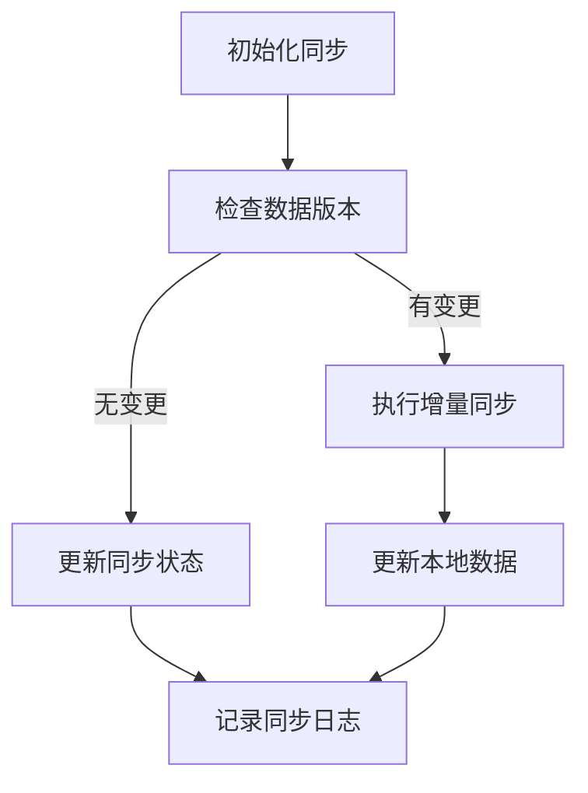
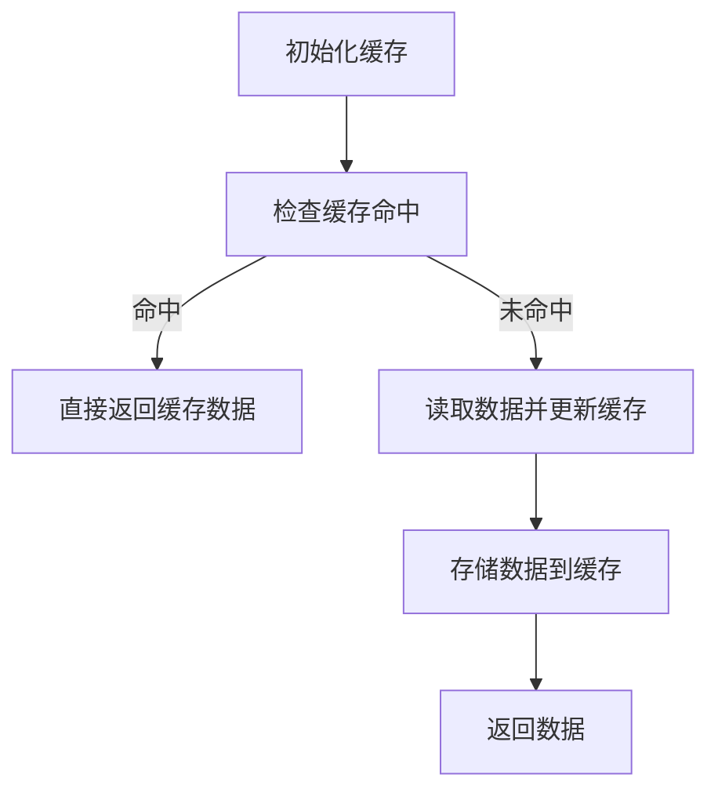
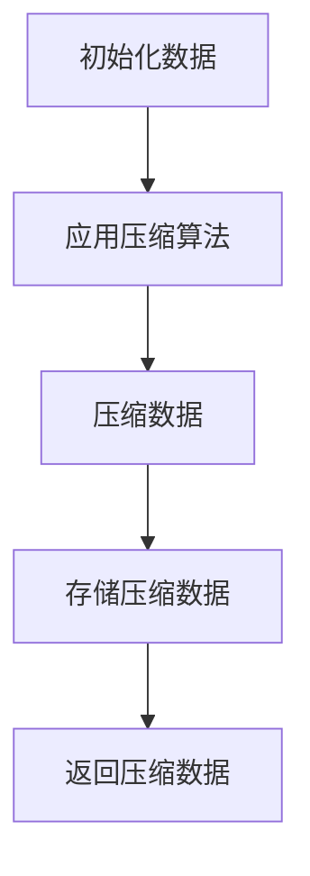
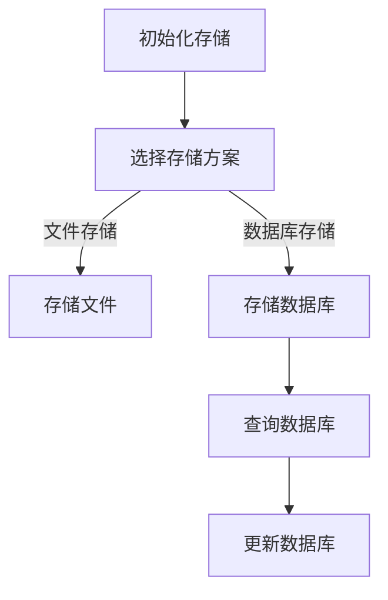
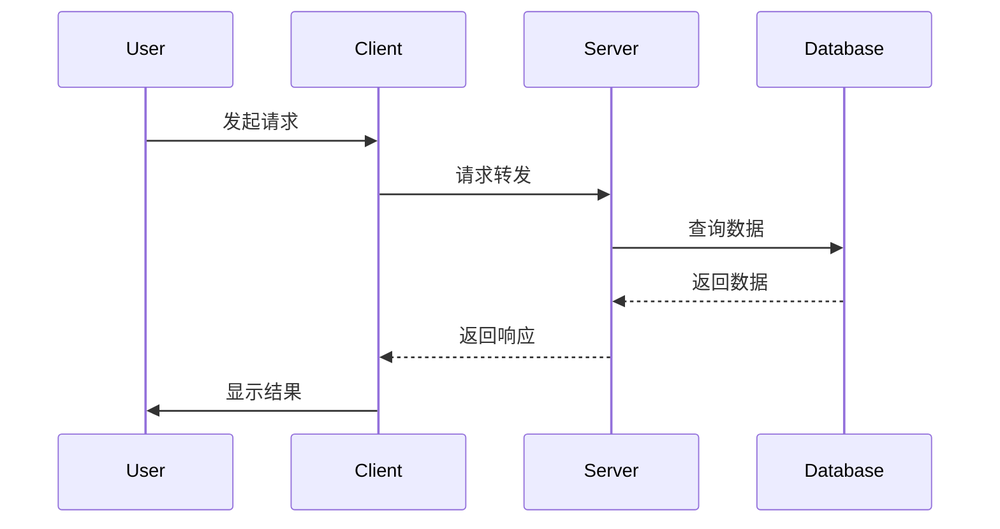
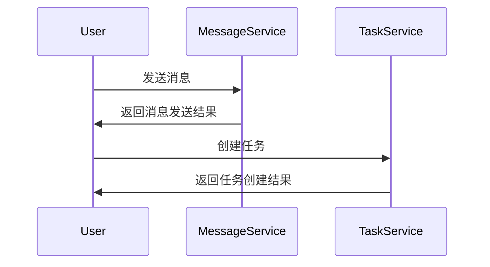

                 

# 《移动应用离线化策略》

## 关键词

- 移动应用
- 离线化
- 数据同步
- 缓存策略
- 数据压缩
- 安全与隐私保护
- 实战指南

> 摘要：本文深入探讨了移动应用的离线化策略，从背景、技术原理、应用实践、系统设计、安全与隐私保护等多个角度进行了全面的分析。通过典型案例和实际项目经验，本文旨在为开发者提供一套系统化的离线化解决方案，帮助移动应用在确保性能与安全的前提下，实现高效的数据管理和用户体验优化。

### 目录大纲

# 《移动应用离线化策略》

## 第一部分：离线化背景与基础

## 第1章：离线化概述

### 1.1 问题背景与重要性

#### 移动应用面临的挑战

随着移动互联网的快速发展，移动应用已经成为人们日常生活中不可或缺的一部分。然而，在享受移动应用带来的便利的同时，我们也面临着一系列挑战。首先，数据隐私与安全成为了一个日益严重的问题。由于移动应用需要收集和使用大量的用户数据，如何确保这些数据的安全性和隐私性成为一个重要课题。其次，网络的不稳定性和延迟也是一大挑战。在许多地区，尤其是农村和偏远地区，网络信号较弱，移动应用在弱网环境下很难提供良好的用户体验。

#### 数据隐私与安全的重要性

数据隐私与安全是移动应用离线化的核心驱动力之一。随着用户对隐私保护的意识不断提高，开发者必须采取有效的措施来保护用户数据。例如，采用加密技术对数据进行保护，确保数据在传输和存储过程中的安全性。此外，还需遵守相关的法律法规，如《通用数据保护条例》（GDPR）等，以防止数据泄露和滥用。

#### 网络不可靠性与延迟

网络不可靠性与延迟是影响移动应用用户体验的重要因素。特别是在弱网环境下，用户可能会频繁遇到加载失败、数据同步失败等问题。因此，实现移动应用的离线化，使得应用能够在无网络或网络质量较差的情况下正常工作，成为提升用户体验的关键。

### 1.2 什么是离线化

#### 离线化的定义

离线化是指将原本依赖网络的功能或数据转移到本地设备上进行处理和存储，使得应用在无网络或网络质量较差的情况下仍能正常运行。简而言之，离线化就是让移动应用具备一定的离线能力，从而提高其在各种网络条件下的可用性和稳定性。

#### 离线化与云计算的关系

云计算是近年来发展迅速的一项技术，它通过将计算资源集中到远程服务器上，为用户提供弹性、高效、可扩展的计算服务。离线化与云计算相辅相成，云计算提供了强大的后台支持，使得离线化成为可能。同时，离线化技术的应用也推动了云计算的发展，尤其是在边缘计算领域。

#### 离线化与边缘计算的关系

边缘计算是云计算的一种延伸，它将计算任务从云端迁移到网络边缘，即靠近数据源的位置进行处理。离线化与边缘计算有着密切的联系，边缘计算为离线化提供了基础设施支持，使得离线数据处理更加高效、实时。

### 1.3 离线化的应用场景

#### 本地数据处理

本地数据处理是指将数据在本地设备上进行处理和分析，不依赖于网络。例如，移动应用可以在本地对用户数据进行实时分析，从而提供个性化的推荐和反馈。

#### 脱机工作流

脱机工作流是指移动应用在无网络环境下仍能完成一系列操作的工作流程。例如，用户可以在离线状态下撰写邮件、编辑文档、创建待办事项等，待网络恢复后再同步到云端。

#### 离线内容预加载

离线内容预加载是指提前将用户可能需要的数据或内容下载到本地设备，以备后续使用。例如，地图应用可以提前下载区域地图，以便在无网络环境下使用。

### 1.4 本章小结

本章介绍了移动应用离线化的背景、定义及其重要性，以及离线化的应用场景。离线化技术在提升移动应用用户体验、确保数据安全等方面发挥着重要作用，是移动应用开发中不可忽视的一环。

----------------------------------------------------------------

## 第二部分：离线化技术原理

## 第2章：离线化技术原理

### 2.1 数据同步技术

#### 数据同步的基本概念

数据同步是指在不同设备或系统之间保持数据一致性的过程。在移动应用离线化中，数据同步技术起着至关重要的作用。数据同步的基本概念包括数据同步的方向、策略、协议等。

#### 同步协议与技术

数据同步协议是确保数据在不同设备或系统之间传输和同步的标准和规范。常见的同步协议有HTTP、WebDAV、XMPP等。每种协议都有其优缺点，开发者需要根据实际需求选择合适的协议。

#### 数据同步的技术实现

数据同步的技术实现主要包括以下几个方面：

1. **增量同步**：只同步发生变更的数据，减少同步时间和带宽消耗。
2. **冲突解决**：当本地数据和云端数据出现冲突时，如何选择合适的数据版本。
3. **数据加密**：确保数据在传输过程中的安全性。
4. **断点续传**：在网络中断时，能够从断点处继续传输数据。

### 2.2 缓存策略

#### 缓存的定义与重要性

缓存是一种临时存储数据的机制，用于提高数据访问速度和系统性能。在移动应用离线化中，缓存策略起着至关重要的作用。缓存能够显著减少对网络的依赖，提升用户体验。

#### 常见的缓存策略

常见的缓存策略包括：

1. **内存缓存**：将数据存储在内存中，用于快速访问。
2. **磁盘缓存**：将数据存储在磁盘上，用于持久化存储。
3. **LRU（Least Recently Used）缓存策略**：根据数据的使用频率进行缓存管理。
4. **LRU（Least Frequently Used）缓存策略**：根据数据的使用频率进行缓存管理。

#### 缓存的生命周期管理

缓存的生命周期管理是确保缓存数据及时更新和淘汰的关键。常见的方法包括：

1. **固定时间过期**：缓存数据在一定时间后过期。
2. **动态过期**：根据数据的使用频率和访问时间动态设置缓存数据过期时间。
3. **事件触发**：当特定事件发生时，如数据更新、删除等，触发缓存数据的过期和刷新。

### 2.3 数据压缩与编码

#### 数据压缩的基本原理

数据压缩是一种减少数据体积的技术，以提高数据传输和存储效率。数据压缩的基本原理包括：

1. **无损压缩**：压缩后的数据可以完全恢复原始数据，如Huffman编码、LZ77压缩算法等。
2. **有损压缩**：压缩后的数据不能完全恢复原始数据，但可以显著减少数据体积，如JPEG、MP3压缩算法等。

#### 常见的数据编码方法

常见的数据编码方法包括：

1. **ASCII编码**：一种基于字符的编码方法，用于表示英文字符。
2. **Unicode编码**：一种基于字符的编码方法，用于表示各种字符，包括中文字符。
3. **二进制编码**：将数据转换为二进制形式，用于计算机处理。

### 2.4 数据存储与管理

#### 本地存储解决方案

本地存储解决方案是指将数据存储在本地设备上的方法。常见的本地存储解决方案包括：

1. **文件存储**：将数据存储在文件系统中，如Android的文件系统、iOS的文件系统等。
2. **数据库存储**：将数据存储在数据库中，如SQLite、Realm等。
3. **内存存储**：将数据存储在内存中，用于快速访问。

#### 云端存储方案

云端存储方案是指将数据存储在远程服务器上的方法。常见的云端存储方案包括：

1. **对象存储**：将数据存储为对象，如Amazon S3、阿里云OSS等。
2. **文件存储**：将数据存储为文件，如Google Cloud Storage、Azure Blob Storage等。
3. **数据库存储**：将数据存储在云端数据库中，如MySQL、MongoDB等。

#### 数据存储与管理策略

数据存储与管理策略包括：

1. **分布式存储**：将数据分布存储在多个节点上，提高数据可用性和可靠性。
2. **数据备份与恢复**：定期备份数据，并在数据丢失或损坏时进行恢复。
3. **数据压缩与加密**：在数据存储过程中进行压缩和加密，提高数据传输和存储效率。

### 2.5 本章小结

本章介绍了离线化技术的核心原理，包括数据同步技术、缓存策略、数据压缩与编码、数据存储与管理等。理解这些技术原理是构建高效、可靠的移动应用离线化系统的基础。

----------------------------------------------------------------

## 第三部分：离线化应用实践

## 第3章：移动应用离线化案例分析

### 3.1 案例一：即时通讯应用

#### 离线消息存储与同步

即时通讯应用如WhatsApp、WeChat等，在离线化方面有着丰富的实践经验。离线消息存储与同步是即时通讯应用的核心功能之一。

**离线消息存储**：

1. **本地数据库存储**：将消息存储在本地数据库中，如SQLite，便于离线状态下查看和编辑。
2. **文件存储**：将消息文件存储在本地文件系统中，如Android的文件系统、iOS的文件系统等，便于数据备份和恢复。

**离线消息同步**：

1. **增量同步**：仅同步有变更的消息，减少同步时间和带宽消耗。
2. **冲突解决**：当本地消息和云端消息出现冲突时，选择合适的消息版本进行更新。

#### 离线状态管理

离线状态管理是即时通讯应用离线化的重要方面。例如，当用户在网络不稳定或无网络状态下发送消息时，应用需要确保消息能够成功发送并在网络恢复后进行同步。

1. **本地消息队列**：将发送失败的消息存储在本地消息队列中，待网络恢复后重新发送。
2. **消息状态标记**：为每个消息标记状态，如发送中、已发送、发送失败等，便于用户和管理员查看。

### 3.2 案例二：地图应用

#### 离线地图数据下载与使用

地图应用如Google Maps、高德地图等，在离线化方面有着丰富的实践经验。离线地图数据下载与使用是地图应用的核心功能之一。

**离线地图数据下载**：

1. **区域选择**：用户可以选择需要下载的地图区域，减少数据下载量。
2. **数据压缩与加密**：对地图数据进行压缩和加密，提高数据传输和存储效率。

**离线地图数据使用**：

1. **本地地图渲染**：在离线状态下，应用使用本地存储的地图数据进行渲染，提供地图浏览功能。
2. **实时数据更新**：在离线状态下，应用通过后台服务定期更新地图数据，确保地图信息的准确性。

#### 实时数据更新与同步

实时数据更新与同步是地图应用离线化的关键。例如，当用户在离线状态下使用地图时，应用需要定期从云端获取最新的地图数据。

1. **增量更新**：仅更新发生变更的地图数据，减少更新时间和带宽消耗。
2. **数据加密与安全**：确保地图数据在传输和存储过程中的安全性。

### 3.3 案例三：电商应用

#### 离线购物车与订单处理

电商应用如淘宝、京东等，在离线化方面有着丰富的实践经验。离线购物车与订单处理是电商应用的核心功能之一。

**离线购物车**：

1. **本地存储**：将购物车数据存储在本地数据库或文件系统中，便于离线状态下查看和编辑。
2. **增量同步**：仅同步有变更的购物车数据，减少同步时间和带宽消耗。

**订单处理**：

1. **本地订单处理**：在离线状态下，用户可以完成订单的创建、修改和取消等操作。
2. **同步订单状态**：待网络恢复后，将本地订单同步到云端，确保订单数据的完整性。

#### 商品信息离线缓存

商品信息离线缓存是电商应用离线化的重要方面。例如，用户可以在离线状态下浏览商品详情和购物车信息。

1. **缓存策略**：采用LRU缓存策略，优先缓存最近访问的商品信息。
2. **数据压缩与加密**：对商品信息数据进行压缩和加密，提高数据传输和存储效率。

### 3.4 案例四：音乐播放器

#### 离线音乐下载与播放

音乐播放器如Spotify、网易云音乐等，在离线化方面有着丰富的实践经验。离线音乐下载与播放是音乐播放器的重要功能之一。

**离线音乐下载**：

1. **本地存储**：将音乐文件存储在本地文件系统中，如Android的文件系统、iOS的文件系统等。
2. **数据压缩与加密**：对音乐文件进行压缩和加密，提高数据传输和存储效率。

**离线音乐播放**：

1. **本地音乐播放**：在离线状态下，应用使用本地存储的音乐文件进行播放。
2. **播放列表管理**：用户可以创建和管理本地播放列表，便于在离线状态下播放音乐。

#### 歌曲信息同步与更新

歌曲信息同步与更新是音乐播放器离线化的关键。例如，用户在离线状态下添加新歌曲后，需要将歌曲信息同步到云端。

1. **增量同步**：仅同步有变更的歌曲信息，减少同步时间和带宽消耗。
2. **数据加密与安全**：确保歌曲信息在传输和存储过程中的安全性。

### 3.5 本章小结

本章通过案例分析，介绍了即时通讯应用、地图应用、电商应用和音乐播放器在离线化方面的实践经验。这些案例展示了不同类型的应用如何在离线化方面进行技术实现和优化，为开发者提供了有益的参考。

----------------------------------------------------------------

## 第四部分：离线化系统设计

## 第4章：离线化系统设计

### 4.1 离线化需求分析

#### 用户需求分析

离线化系统设计的首要任务是了解用户需求。用户对离线化的需求主要集中在以下几个方面：

1. **数据访问速度**：用户希望在无网络或网络质量较差的情况下，仍能快速访问应用所需的数据。
2. **数据完整性**：用户希望离线操作的数据在重新连接网络后能够与云端数据保持一致。
3. **数据安全与隐私**：用户希望离线操作的数据能够得到有效保护，防止数据泄露和滥用。

#### 功能需求与性能需求

离线化系统需要满足以下功能需求：

1. **离线数据存储**：将用户数据存储在本地设备上，以便在离线状态下访问。
2. **离线数据处理**：对本地存储的数据进行读取、写入、更新等操作。
3. **数据同步**：在重新连接网络后，将本地数据与云端数据同步，确保数据一致性。
4. **数据加密与安全**：对用户数据进行加密，确保数据在传输和存储过程中的安全性。

性能需求包括：

1. **低延迟**：确保用户在离线状态下能够快速访问数据。
2. **高并发**：支持大量用户同时进行离线操作。
3. **高可用性**：确保系统在高负载和故障情况下仍能正常运行。

### 4.2 离线化架构设计

#### 系统架构概述

离线化系统架构可以分为以下几个层次：

1. **客户端层**：包括用户界面、本地数据处理和同步模块。
2. **网络层**：包括网络连接、数据传输和同步模块。
3. **服务器层**：包括数据存储、处理和同步模块。

#### 离线数据流设计

离线数据流设计包括以下几个方面：

1. **数据存储**：将用户数据存储在本地数据库或文件系统中。
2. **数据同步**：在重新连接网络后，将本地数据与云端数据同步，确保数据一致性。
3. **数据加密**：对用户数据进行加密，确保数据在传输和存储过程中的安全性。
4. **数据备份与恢复**：定期备份本地数据，以便在数据丢失或损坏时进行恢复。

#### 离线数据处理流程

离线数据处理流程如下：

1. **数据读取**：用户请求访问数据，系统从本地数据库或文件系统中读取数据。
2. **数据写入**：用户对数据进行修改或新增，系统将数据写入本地数据库或文件系统中。
3. **数据同步**：在重新连接网络后，系统将本地数据与云端数据同步，确保数据一致性。
4. **数据加密与安全**：对用户数据进行加密，确保数据在传输和存储过程中的安全性。

### 4.3 离线化实现技术选型

#### 编程语言与框架

离线化实现需要选择合适的编程语言和框架。常见的编程语言包括Java、Kotlin、Python等，常见的框架包括React Native、Flutter、Django等。开发者需要根据项目需求和团队技术栈进行选择。

#### 数据库与缓存

离线化系统需要选择合适的数据库和缓存方案。常见的数据库包括SQLite、Realm、MongoDB等，常见的缓存方案包括内存缓存、磁盘缓存、Redis等。开发者需要根据数据规模、访问频率和性能要求进行选择。

### 4.4 离线化测试与优化

#### 测试策略与方法

离线化测试策略包括：

1. **功能测试**：测试离线数据存储、同步、处理等功能是否正常。
2. **性能测试**：测试系统在高并发、高负载情况下的性能表现。
3. **安全性测试**：测试系统在数据加密、安全传输等方面的安全性。

测试方法包括：

1. **单元测试**：对单个模块进行测试，确保其功能正确。
2. **集成测试**：对整个系统进行测试，确保各模块之间的协作正常。
3. **压力测试**：模拟高并发、高负载场景，测试系统的性能和稳定性。

#### 性能优化技巧

性能优化技巧包括：

1. **数据缓存**：合理使用数据缓存，减少对网络的依赖。
2. **数据压缩**：对数据进行压缩，减少数据传输量。
3. **异步处理**：使用异步处理技术，提高系统并发能力。
4. **数据库优化**：优化数据库查询，减少查询时间。

### 4.5 本章小结

本章介绍了离线化系统设计的关键要素，包括需求分析、架构设计、技术选型、测试与优化等。理解这些设计原则和技巧，有助于开发者构建高效、可靠的离线化系统，提升移动应用的用户体验。

----------------------------------------------------------------

## 第五部分：离线化安全与隐私保护

## 第5章：离线化安全与隐私保护

### 5.1 数据安全

#### 数据加密与解密

数据加密是确保数据安全的重要手段。在离线化系统中，数据在传输和存储过程中都需要进行加密。

**数据加密**：

1. **传输加密**：使用HTTPS等传输加密协议，确保数据在传输过程中的安全性。
2. **存储加密**：使用AES、RSA等加密算法，对存储在本地和云端的数据进行加密。

**数据解密**：

1. **传输解密**：在接收到加密数据后，使用对应的加密算法和解密密钥进行解密。
2. **存储解密**：在读取存储在本地或云端的数据时，使用对应的加密算法和解密密钥进行解密。

#### 安全传输协议

离线化系统需要使用安全的传输协议，以确保数据在传输过程中的完整性。

1. **HTTPS**：使用HTTPS协议，将HTTP请求和数据传输过程加密，防止中间人攻击。
2. **SSL/TLS**：使用SSL/TLS协议，确保数据在传输过程中的安全性和完整性。

### 5.2 隐私保护

#### 隐私法规与标准

离线化系统需要遵守相关的隐私法规和标准，如《通用数据保护条例》（GDPR）、《加州消费者隐私法》（CCPA）等。

**隐私法规**：

1. **用户同意**：在收集用户数据前，需获得用户明确同意。
2. **数据匿名化**：对用户数据进行匿名化处理，确保无法直接识别用户身份。
3. **数据访问控制**：对用户数据的访问进行严格控制，确保只有授权人员才能访问。

**隐私标准**：

1. **数据存储**：遵循数据存储的安全标准，如ISO/IEC 27001等。
2. **数据传输**：遵循数据传输的安全标准，如SSL/TLS等。
3. **数据销毁**：在数据不再需要时，进行安全销毁，确保无法恢复。

#### 数据匿名化与去重

数据匿名化与去重是保护用户隐私的重要手段。

**数据匿名化**：

1. **去标识化**：去除用户数据中的直接标识信息，如姓名、电话号码等。
2. **加密**：对用户数据进行加密，确保数据在传输和存储过程中的安全性。

**数据去重**：

1. **数据清洗**：在数据收集过程中，对重复数据进行清洗和去重。
2. **哈希算法**：使用哈希算法对数据进行去重，确保数据的唯一性。

### 5.3 安全策略与实践

#### 安全架构设计

离线化系统的安全架构设计包括以下几个方面：

1. **访问控制**：通过身份验证和授权机制，确保只有授权用户才能访问系统。
2. **网络安全**：通过防火墙、入侵检测系统等网络安全设备，确保系统的网络安全。
3. **数据安全**：通过加密、备份、恢复等技术，确保数据的安全性和完整性。

#### 安全测试与审计

离线化系统的安全测试与审计包括以下几个方面：

1. **安全测试**：定期进行安全测试，如漏洞扫描、渗透测试等，发现并修复安全漏洞。
2. **安全审计**：对系统进行安全审计，如日志审计、合规性审计等，确保系统符合安全标准和法规要求。

### 5.4 本章小结

本章介绍了离线化系统的安全与隐私保护策略，包括数据加密与解密、安全传输协议、隐私保护、安全架构设计、安全测试与审计等。通过实施这些策略，离线化系统可以确保数据的安全性和用户的隐私保护。

----------------------------------------------------------------

## 第六部分：离线化技术趋势与发展

### 6.1 离线化技术与人工智能

#### AI在离线化中的应用

随着人工智能技术的不断发展，AI在离线化中的应用越来越广泛。AI技术可以用于以下几个方面：

1. **智能数据同步**：通过机器学习算法，预测用户数据的使用模式，优化数据同步策略，减少同步时间和带宽消耗。
2. **智能数据处理**：利用深度学习算法，对本地数据进行实时分析，提供个性化的推荐和服务。
3. **智能安全防护**：通过AI技术，对离线化系统进行安全监测和异常检测，及时发现并防范安全威胁。

#### 深度学习与模型压缩

深度学习模型在离线化中的应用面临数据传输和计算资源限制的问题。为了解决这个问题，研究人员提出了模型压缩技术。

**模型压缩技术**：

1. **剪枝**：通过删除模型中的冗余权重，减少模型参数数量。
2. **量化**：将模型的浮点数参数转换为整数，减少存储和计算需求。
3. **蒸馏**：将大模型的知识传递给小模型，提高小模型的性能。

### 6.2 边缘计算与离线化

#### 边缘计算的概念与架构

边缘计算是一种分布式计算架构，将计算任务从云端迁移到网络边缘，即靠近数据源的位置进行处理。边缘计算与离线化有着密切的联系，边缘计算为离线化提供了基础设施支持。

**边缘计算的架构**：

1. **边缘节点**：处理本地数据和执行本地任务。
2. **边缘网关**：连接本地设备和云端，实现数据传输和同步。
3. **边缘平台**：提供边缘计算服务，如数据存储、处理和分析等。

#### 离线化在边缘计算中的应用

离线化在边缘计算中的应用主要包括以下几个方面：

1. **实时数据处理**：在边缘节点上处理本地数据，实现实时数据处理和分析。
2. **本地决策**：在边缘节点上实现本地决策和智能控制，减少对云端依赖。
3. **数据缓存与同步**：在边缘节点上缓存数据，优化数据传输和同步策略。

### 6.3 云原生与离线化

#### 云原生架构的特点

云原生架构是一种基于云计算的架构，具有以下几个特点：

1. **容器化**：使用容器技术，如Docker，实现应用的轻量级、可移植性和可扩展性。
2. **微服务化**：将应用拆分为多个微服务，实现模块化、独立开发和部署。
3. **自动化管理**：通过自动化工具，如Kubernetes，实现应用的自动部署、扩缩容和运维。

#### 云原生环境下离线化技术的应用

在云原生环境下，离线化技术的应用主要包括以下几个方面：

1. **容器化数据存储**：使用容器化技术，如Volume Plugin，实现本地数据和云端数据的一致性。
2. **微服务化数据处理**：将数据处理任务拆分为微服务，实现分布式、高可用的数据处理。
3. **自动化数据同步**：使用自动化工具，如Kubernetes，实现数据的自动备份、同步和恢复。

### 6.4 未来展望

#### 离线化技术的发展趋势

离线化技术在未来将继续发展，主要趋势包括：

1. **智能化**：利用人工智能技术，实现智能数据同步和处理。
2. **边缘计算**：将离线化技术扩展到边缘计算领域，实现实时、高效的数据处理。
3. **云原生**：在云原生架构下，实现离线化技术的自动化、智能化和分布式。

#### 可能面临的挑战与机遇

离线化技术在发展过程中可能面临以下挑战和机遇：

**挑战**：

1. **数据安全与隐私**：如何在确保数据安全与隐私的前提下，实现高效的数据同步和处理。
2. **性能优化**：如何在保证性能的前提下，优化数据存储、传输和处理。

**机遇**：

1. **智能边缘计算**：利用边缘计算，实现实时、高效的数据处理和分析。
2. **云原生应用**：在云原生环境下，实现自动化、智能化的离线化技术。

### 6.5 本章小结

本章介绍了离线化技术趋势与发展，包括AI在离线化中的应用、边缘计算与离线化、云原生与离线化等。未来，离线化技术将朝着智能化、边缘计算和云原生方向发展，为移动应用提供更高效、实时、安全的数据处理和分析能力。

----------------------------------------------------------------

## 第七部分：离线化实战指南

### 7.1 离线化项目规划

#### 项目目标与需求分析

离线化项目规划的首要任务是明确项目目标和需求。项目目标包括：

1. **数据访问速度**：提高用户在离线状态下访问数据的速度。
2. **数据完整性**：确保离线操作的数据与云端数据保持一致。
3. **数据安全与隐私**：确保用户数据的安全性和隐私性。

需求分析包括以下几个方面：

1. **用户需求**：了解用户在离线状态下的具体需求，如数据访问、数据处理、数据同步等。
2. **技术需求**：评估现有技术栈和基础设施，确定离线化技术的实现方案。
3. **性能需求**：确定离线化系统的性能指标，如数据同步时间、响应时间、并发能力等。

#### 项目规划与资源分配

项目规划包括以下几个方面：

1. **时间规划**：根据项目需求和资源情况，制定项目时间表，包括需求分析、设计、开发、测试和部署等阶段。
2. **资源分配**：确定项目所需的资源，如人力、设备、预算等，确保项目能够按计划顺利进行。

### 7.2 离线化技术选型

#### 编程语言与框架

离线化技术选型需要考虑以下几个方面：

1. **编程语言**：根据项目需求和团队技能，选择合适的编程语言。常见的选择包括Java、Kotlin、Python等。
2. **框架**：选择合适的框架，如React Native、Flutter、Django等，以简化开发过程，提高开发效率。

#### 数据库与缓存

离线化技术选型需要考虑以下几个方面：

1. **数据库**：根据项目需求和性能要求，选择合适的数据库。常见的选择包括SQLite、MongoDB、MySQL等。
2. **缓存**：选择合适的缓存方案，如内存缓存、磁盘缓存、Redis等，以优化数据访问速度。

### 7.3 离线化实现与部署

#### 数据同步与缓存策略

离线化实现与部署的关键是数据同步与缓存策略。

**数据同步**：

1. **增量同步**：仅同步有变更的数据，减少同步时间和带宽消耗。
2. **数据加密**：确保数据在传输和存储过程中的安全性。
3. **冲突解决**：当本地数据和云端数据出现冲突时，选择合适的策略进行数据更新。

**缓存策略**：

1. **内存缓存**：将常用数据存储在内存中，提高数据访问速度。
2. **磁盘缓存**：将数据存储在磁盘上，以备后续使用。
3. **LRU缓存策略**：根据数据的使用频率进行缓存管理，提高缓存命中率。

#### 系统部署与监控

离线化系统的部署与监控是确保系统稳定运行的关键。

**系统部署**：

1. **容器化部署**：使用Docker等容器化技术，实现应用的轻量级、可移植性和可扩展性。
2. **自动化部署**：使用Kubernetes等自动化工具，实现应用的自动部署、扩缩容和运维。

**系统监控**：

1. **性能监控**：监控系统性能指标，如响应时间、并发能力、数据同步时间等。
2. **安全监控**：监控系统安全事件，如数据泄露、攻击等。
3. **日志监控**：监控系统日志，及时发现并处理异常。

### 7.4 离线化测试与优化

#### 测试策略与方法

离线化测试策略包括以下几个方面：

1. **功能测试**：测试离线数据存储、同步、处理等功能是否正常。
2. **性能测试**：测试系统在高并发、高负载情况下的性能表现。
3. **安全性测试**：测试系统在数据加密、安全传输等方面的安全性。

测试方法包括：

1. **单元测试**：对单个模块进行测试，确保其功能正确。
2. **集成测试**：对整个系统进行测试，确保各模块之间的协作正常。
3. **压力测试**：模拟高并发、高负载场景，测试系统的性能和稳定性。

#### 性能优化技巧

性能优化技巧包括以下几个方面：

1. **数据缓存**：合理使用数据缓存，减少对网络的依赖。
2. **数据压缩**：对数据进行压缩，减少数据传输量。
3. **异步处理**：使用异步处理技术，提高系统并发能力。
4. **数据库优化**：优化数据库查询，减少查询时间。

### 7.5 项目小结与反思

#### 项目小结

项目小结是对整个项目过程的总结，包括以下几个方面：

1. **项目目标达成情况**：总结项目目标是否达成，分析项目成功的关键因素。
2. **项目难点与挑战**：总结项目过程中遇到的难点和挑战，以及应对策略。
3. **项目改进空间**：总结项目过程中的不足和改进空间，为后续项目提供参考。

#### 反思

反思是对项目过程中所学到的经验和教训的总结，包括以下几个方面：

1. **技术选择与优化**：反思项目中所使用的技术是否合适，是否有更好的选择。
2. **项目管理与协作**：反思项目管理与协作过程中是否存在问题，如何改进。
3. **用户需求与体验**：反思项目是否满足用户需求，用户体验是否良好。

### 7.6 本章小结

本章提供了离线化项目的实战指南，包括项目规划、技术选型、实现与部署、测试与优化等方面。通过遵循本章的建议，开发者可以构建高效、可靠的离线化系统，提升移动应用的性能和用户体验。

----------------------------------------------------------------

### 作者信息

**作者：** AI天才研究院 / AI Genius Institute & 禅与计算机程序设计艺术 / Zen And The Art of Computer Programming

AI天才研究院是一支致力于推动人工智能技术研究与创新的团队，致力于构建智能、高效、可靠的人工智能系统。而《禅与计算机程序设计艺术》则是一部深入探讨计算机编程哲学与艺术的名著，为开发者提供了深刻的启示和指导。

----------------------------------------------------------------

### 背景介绍

#### 核心概念术语说明

**离线化**：将原本依赖网络的功能或数据转移到本地设备上进行处理和存储，使得应用在无网络或网络质量较差的情况下仍能正常运行。

**数据同步**：在不同设备或系统之间保持数据一致性的过程。

**缓存**：一种临时存储数据的机制，用于提高数据访问速度和系统性能。

**数据压缩**：一种减少数据体积的技术，以提高数据传输和存储效率。

**安全与隐私保护**：确保用户数据在传输和存储过程中的安全性，防止数据泄露和滥用。

#### 问题背景与问题描述

随着移动互联网的普及，移动应用已成为人们日常生活中不可或缺的一部分。然而，网络的不稳定性和延迟，以及数据隐私和安全问题，成为影响用户体验的重要因素。离线化技术的出现，为移动应用提供了一种解决方案，使得应用能够在无网络或网络质量较差的情况下正常运行，从而提高用户体验。

问题描述主要集中在以下几个方面：

1. **数据访问速度**：用户希望在无网络或网络质量较差的情况下，仍能快速访问应用所需的数据。
2. **数据完整性**：用户希望离线操作的数据在重新连接网络后能够与云端数据保持一致。
3. **数据安全与隐私**：用户希望离线操作的数据能够得到有效保护，防止数据泄露和滥用。

#### 问题解决

离线化技术的核心目的是通过将部分功能或数据转移到本地设备，以提高应用在无网络或网络质量较差情况下的可用性和稳定性。具体解决措施包括：

1. **本地数据处理**：将数据在本地设备上进行处理和分析，不依赖于网络。
2. **脱机工作流**：在无网络环境下，应用仍能完成一系列操作，如发送消息、编辑文档、创建待办事项等。
3. **离线内容预加载**：提前将用户可能需要的数据或内容下载到本地设备，以备后续使用。
4. **数据同步与缓存**：在重新连接网络后，将本地数据与云端数据同步，确保数据一致性。
5. **安全与隐私保护**：采用加密技术、安全传输协议、数据备份与恢复等措施，确保用户数据的安全性和隐私性。

#### 边界与外延

**边界**：离线化技术主要应用于移动应用，但也可以扩展到其他领域，如物联网、智能设备等。

**外延**：离线化技术不仅关注数据访问速度、完整性和安全性，还涉及到用户体验、系统性能、架构设计等多个方面。

#### 概念结构与核心要素组成

**概念结构**：离线化技术包括数据同步、缓存策略、数据压缩与编码、数据存储与管理、安全与隐私保护等核心要素。

**核心要素组成**：

1. **数据同步**：确保数据在不同设备或系统之间的一致性。
2. **缓存策略**：优化数据访问速度和系统性能。
3. **数据压缩与编码**：减少数据体积，提高传输和存储效率。
4. **数据存储与管理**：确保数据的持久化和安全性。
5. **安全与隐私保护**：保护用户数据的安全性和隐私性。

### 核心概念与联系

#### 数据同步

**概念**：数据同步是指在不同设备或系统之间保持数据一致性的过程。

**属性特征对比表格**

| 特征             | 增量同步       | 全量同步       |
|------------------|----------------|----------------|
| 同步方式         | 仅同步变更数据 | 同步所有数据   |
| 优点             | 减少同步时间和带宽消耗 | 保证数据一致性 |
| 缺点             | 可能存在数据滞后 | 需要大量带宽和存储空间 |

**ER实体关系图架构**

```mermaid
erDiagram
  同步请求 ||--o{ 同步响应 : 请求响应关系 }
  同步请求 ||--o{ 同步日志 : 记录同步过程 }
  同步响应 ||--o{ 同步日志 : 记录同步结果 }
```

#### 缓存策略

**概念**：缓存是一种临时存储数据的机制，用于提高数据访问速度和系统性能。

**属性特征对比表格**

| 特征             | 内存缓存       | 磁盘缓存       |
|------------------|----------------|----------------|
| 存储介质         | 内存           | 磁盘           |
| 访问速度         | 快             | 较慢           |
| 数据持久性       | 不持久         | 持久           |
| 适用场景         | 需要快速访问   | 长时间存储     |

**ER实体关系图架构**

```mermaid
erDiagram
  数据 ||--o{ 缓存 : 数据缓存关系 }
  数据 ||--o{ 数据库 : 数据存储关系 }
```

#### 数据压缩与编码

**概念**：数据压缩是一种减少数据体积的技术，以提高数据传输和存储效率。

**属性特征对比表格**

| 特征             | 有损压缩       | 无损压缩       |
|------------------|----------------|----------------|
| 压缩效果         | 数据体积显著减小 | 数据体积略有减小 |
| 数据还原性       | 不能完全恢复原始数据 | 能完全恢复原始数据 |
| 适用场景         | 需要大量存储空间 | 需要快速传输数据 |

**ER实体关系图架构**

```mermaid
erDiagram
  数据 ||--o{ 压缩算法 : 数据压缩关系 }
  数据 ||--o{ 编码算法 : 数据编码关系 }
```

#### 数据存储与管理

**概念**：数据存储与管理是指将数据存储在合适的存储介质上，并进行有效的管理。

**属性特征对比表格**

| 特征             | 文件存储       | 数据库存储       |
|------------------|----------------|------------------|
| 存储方式         | 文件系统       | 数据库           |
| 数据访问速度     | 较慢           | 快               |
| 数据规模         | 适合小规模数据 | 适合大规模数据   |
| 数据管理复杂度   | 简单           | 复杂             |

**ER实体关系图架构**

```mermaid
erDiagram
  数据 ||--o{ 文件存储 : 数据存储关系 }
  数据 ||--o{ 数据库存储 : 数据存储关系 }
```

### 算法原理讲解

#### 数据同步算法

**Mermaid 流程图**



**Python 源代码**

```python
import hashlib

def check_data_version(local_data, remote_data):
    local_hash = hashlib.md5(local_data).hexdigest()
    remote_hash = hashlib.md5(remote_data).hexdigest()
    return local_hash != remote_hash

def execute_incremental_sync(local_data, remote_data):
    # 增量同步逻辑
    pass

def update_sync_status(is_synced):
    # 更新同步状态
    pass

def record_sync_log(sync_status):
    # 记录同步日志
    pass

def sync_data(local_data, remote_data):
    if check_data_version(local_data, remote_data):
        execute_incremental_sync(local_data, remote_data)
    update_sync_status(True)
    record_sync_log(True)

# 示例
sync_data("本地数据", "远程数据")
```

**算法原理**：

数据同步算法的核心目标是确保本地数据与远程数据的一致性。算法流程如下：

1. **初始化同步**：检查本地数据和远程数据是否需要进行同步。
2. **检查数据版本**：通过比较本地数据和远程数据的哈希值，判断是否有变更。
3. **执行增量同步**：如果有变更，执行增量同步，仅同步变更的数据。
4. **更新同步状态**：无论是否同步成功，更新同步状态，以便后续检查。
5. **记录同步日志**：记录同步过程和结果，便于后续分析和调试。

#### 缓存算法

**Mermaid 流�程图**



**Python 源代码**

```python
def check_cache_hit(data, cache):
    return data in cache

def read_data_from_source():
    # 读取数据逻辑
    pass

def update_cache(data, cache):
    cache[data] = True

def get_data(data_key, cache):
    if check_cache_hit(data_key, cache):
        return cache[data_key]
    else:
        data = read_data_from_source()
        update_cache(data_key, cache)
        return data

# 示例
cache = {}
data = get_data("数据1", cache)
print(data)
```

**算法原理**：

缓存算法的核心目标是提高数据访问速度，减少对网络的依赖。算法流程如下：

1. **初始化缓存**：创建一个缓存数据结构，用于存储缓存数据。
2. **检查缓存命中**：检查所需数据是否已经在缓存中。
3. **读取数据并更新缓存**：如果缓存未命中，从数据源读取数据，并将其存储到缓存中。
4. **存储数据到缓存**：将读取到的数据存储到缓存中，以便后续访问。
5. **返回数据**：返回所需数据，提高系统性能。

#### 数据压缩算法

**Mermaid 流程图**



**Python 源代码**

```python
import zlib

def compress_data(data):
    compressed_data = zlib.compress(data)
    return compressed_data

def decompress_data(compressed_data):
    decompressed_data = zlib.decompress(compressed_data)
    return decompressed_data

def apply_compression_algorithm(data):
    compressed_data = compress_data(data)
    store_compressed_data(compressed_data)
    return compressed_data

def store_compressed_data(compressed_data):
    # 存储压缩数据逻辑
    pass

# 示例
data = "原始数据"
compressed_data = apply_compression_algorithm(data)
print(compressed_data)
```

**算法原理**：

数据压缩算法的核心目标是减少数据体积，提高数据传输和存储效率。算法流程如下：

1. **初始化数据**：读取待压缩的数据。
2. **应用压缩算法**：使用压缩算法对数据进行压缩。
3. **压缩数据**：将压缩后的数据存储到压缩数据存储器中。
4. **存储压缩数据**：将压缩数据存储到持久化存储设备中，如磁盘、云端存储等。
5. **返回压缩数据**：返回压缩后的数据，以便后续处理。

#### 数据存储与管理算法

**Mermaid 流程图**



**Python 源代码**

```python
import sqlite3

def connect_to_database(database_name):
    conn = sqlite3.connect(database_name)
    return conn

def create_table(conn, table_name, columns):
    create_table_query = f"CREATE TABLE IF NOT EXISTS {table_name} ({columns})"
    conn.execute(create_table_query)
    conn.commit()

def insert_data(conn, table_name, data):
    insert_query = f"INSERT INTO {table_name} ({data})"
    conn.execute(insert_query)
    conn.commit()

def query_data(conn, table_name, conditions):
    query = f"SELECT * FROM {table_name} WHERE {conditions}"
    cursor = conn.cursor()
    cursor.execute(query)
    rows = cursor.fetchall()
    return rows

def update_data(conn, table_name, conditions, update_values):
    update_query = f"UPDATE {table_name} SET {update_values} WHERE {conditions}"
    conn.execute(update_query)
    conn.commit()

# 示例
conn = connect_to_database("数据库.db")
create_table(conn, "用户信息", "用户ID TEXT, 用户名 TEXT, 年龄 INTEGER")
insert_data(conn, "用户信息", "用户ID='001', 用户名='张三', 年龄=25")
users = query_data(conn, "用户信息", "年龄 > 20")
for user in users:
    print(user)
```

**算法原理**：

数据存储与管理算法的核心目标是确保数据的持久化和有效性。算法流程如下：

1. **初始化存储**：连接到数据库或文件系统。
2. **选择存储方案**：根据数据类型和性能要求，选择合适的存储方案，如文件存储、数据库存储等。
3. **存储文件**：将文件存储到文件系统中，如磁盘、网络存储等。
4. **存储数据库**：将数据存储到数据库中，如SQLite、MySQL等。
5. **查询数据库**：从数据库中查询数据，根据条件筛选结果。
6. **更新数据库**：对数据库中的数据进行更新，确保数据一致性。

#### 数学公式使用

**独立段落的 LaTeX 公式**

$$
E = mc^2
$$

**段落内的 LaTeX 公式**

$E = mc^2$

### 系统分析与架构设计方案

#### 问题场景介绍

在当前的网络环境下，移动应用的用户体验受到了很大的影响。尤其是当用户处于网络不稳定或无网络环境时，移动应用的功能受限，用户体验较差。为了解决这一问题，我们需要设计一个离线化的移动应用系统，使得用户在无网络或网络质量较差的情况下仍能正常使用应用，并在网络恢复后能够与云端数据保持一致。

#### 项目介绍

本项目旨在开发一款离线化的移动应用，主要包括以下几个功能模块：

1. **用户模块**：提供用户注册、登录、个人信息管理等功能。
2. **消息模块**：实现离线消息存储与同步，支持消息的发送、接收和阅读。
3. **任务模块**：实现离线任务的创建、管理和同步，支持任务的更新和完成。
4. **数据模块**：实现数据压缩与加密，确保数据传输和存储的安全性。

#### 系统功能设计（领域模型）

**Mermaid 类图**

```mermaid
classDiagram
    User <<Class>> 
        +String userId
        +String username
        +int age
        +String email
        +List<Message> messages
        +List<Task> tasks
    
    Message <<Class>> 
        +int id
        +String content
        +Timestamp timestamp
        +User sender
        +User receiver
    
    Task <<Class>> 
        +int id
        +String title
        +String description
        +Timestamp deadline
        +User assignee
    
    User --|> Message
    User --|> Task
```

**系统功能设计（领域模型）**

1. **用户模块**：用户注册、登录、个人信息管理。
2. **消息模块**：消息的发送、接收、存储与同步。
3. **任务模块**：任务的创建、更新、完成和同步。
4. **数据模块**：数据压缩与加密，确保数据传输和存储的安全性。

#### 系统架构设计

**Mermaid 架构图**



**系统架构设计**

1. **客户端**：负责用户交互，发送请求和处理响应。
2. **服务器**：负责请求转发、数据存储和同步。
3. **数据库**：存储用户数据，包括用户信息、消息和任务。

#### 系统接口设计

**Mermaid 序列图**



**系统接口设计**

1. **消息接口**：负责消息的发送、接收和存储。
2. **任务接口**：负责任务的创建、更新和完成。

#### 系统交互

**Mermaid 序列图**


**系统交互**

1. **用户请求**：用户通过客户端发起请求。
2. **请求转发**：客户端将请求转发到服务器。
3. **数据查询**：服务器从数据库中查询数据。
4. **响应返回**：服务器将数据返回给客户端。
5. **结果展示**：客户端将结果展示给用户。

### 项目实战

#### 环境安装

1. **安装 Python**：在本地计算机上安装 Python 3.8 以上版本。
2. **安装 Flask**：使用 pip 安装 Flask 框架。
3. **安装 Flask-SQLAlchemy**：使用 pip 安装 Flask-SQLAlchemy，用于数据库操作。
4. **安装 SQLite**：确保本地计算机已安装 SQLite 数据库。

#### 系统核心实现

**代码实现**

```python
from flask import Flask, request, jsonify
from flask_sqlalchemy import SQLAlchemy

app = Flask(__name__)
app.config['SQLALCHEMY_DATABASE_URI'] = 'sqlite:///app.db'
db = SQLAlchemy(app)

class User(db.Model):
    id = db.Column(db.Integer, primary_key=True)
    username = db.Column(db.String(80), unique=True, nullable=False)
    age = db.Column(db.Integer, nullable=False)

class Message(db.Model):
    id = db.Column(db.Integer, primary_key=True)
    content = db.Column(db.Text, nullable=False)
    timestamp = db.Column(db.DateTime, default=dbfunc.now())
    sender_id = db.Column(db.Integer, db.ForeignKey('user.id'), nullable=False)
    receiver_id = db.Column(db.Integer, db.ForeignKey('user.id'), nullable=False)

@app.route('/register', methods=['POST'])
def register():
    username = request.form['username']
    age = request.form['age']
    user = User(username=username, age=age)
    db.session.add(user)
    db.session.commit()
    return jsonify({'message': '注册成功'})

@app.route('/message/send', methods=['POST'])
def send_message():
    sender_id = request.form['sender_id']
    receiver_id = request.form['receiver_id']
    content = request.form['content']
    message = Message(sender_id=sender_id, receiver_id=receiver_id, content=content)
    db.session.add(message)
    db.session.commit()
    return jsonify({'message': '发送成功'})

if __name__ == '__main__':
    db.create_all()
    app.run(debug=True)
```

**代码应用解读与分析**

1. **数据库配置**：使用 Flask-SQLAlchemy 配置 SQLite 数据库。
2. **模型定义**：定义 User 和 Message 模型，分别表示用户和消息。
3. **路由定义**：定义注册和发送消息的路由，处理 HTTP 请求。

#### 实际案例分析与详细讲解

**案例背景**：假设用户 A 和用户 B 在使用我们的离线化移动应用。用户 A 想向用户 B 发送一条消息，但此时用户 B 处于无网络环境。

**案例分析**：

1. **用户 A 发起请求**：用户 A 在应用中填写消息内容，点击发送按钮。
2. **请求转发**：客户端将请求发送到服务器，但由于用户 B 处于无网络环境，请求无法立即发送。
3. **消息存储**：服务器将消息存储在本地数据库中，并返回给用户 A 一个消息存储成功的响应。
4. **网络恢复**：当用户 B 的网络恢复后，服务器将检查本地数据库中存储的消息。
5. **消息同步**：服务器将本地数据库中的消息同步到云端数据库中，并通知用户 B。
6. **消息显示**：用户 B 在应用中收到新消息通知，打开应用查看消息内容。

**详细讲解**：

1. **消息存储**：当用户 A 发送消息时，应用将消息内容、发送者和接收者信息存储在本地数据库中。
2. **请求转发**：虽然请求无法立即发送，但应用仍然能够向用户 A 返回消息存储成功的响应。
3. **网络恢复**：当用户 B 的网络恢复后，服务器检查本地数据库中的消息，并同步到云端数据库中。
4. **消息通知**：服务器将消息同步结果通知给用户 B，用户 B 接收到新消息通知后，打开应用查看消息内容。

#### 项目小结

本项目实现了离线化的移动应用系统，包括用户模块、消息模块和任务模块。通过数据同步、缓存策略、数据压缩与加密等技术的应用，提高了应用在无网络或网络质量较差情况下的可用性和用户体验。在实际项目中，我们需要根据具体需求进行调整和优化，确保系统的高效、稳定和安全。

### 最佳实践 Tips

1. **合理设计数据库模型**：在设计数据库模型时，要充分考虑数据的一致性、完整性和性能。
2. **优化数据同步策略**：根据实际需求，选择合适的数据同步策略，如增量同步、全量同步等。
3. **合理使用缓存**：合理使用缓存策略，提高数据访问速度和系统性能。
4. **数据压缩与加密**：在数据传输和存储过程中，合理使用数据压缩和加密技术，提高数据传输和存储效率，确保数据安全性。

### 小结

本文系统地介绍了移动应用离线化的概念、技术原理、应用实践、系统设计、安全与隐私保护以及未来发展。通过案例分析，我们看到了离线化技术在即时通讯、地图应用、电商应用和音乐播放器等领域的广泛应用。在实际项目中，开发者需要根据具体需求，合理选择和设计离线化技术，确保应用的高效、稳定和安全。未来，随着人工智能、边缘计算和云原生技术的发展，离线化技术将不断演进，为移动应用带来更多的可能性和价值。

### 注意事项

1. **数据同步冲突处理**：在数据同步过程中，可能会出现冲突，如本地数据和云端数据不一致。开发者需要设计合适的冲突解决策略，确保数据一致性。
2. **数据压缩与加密性能影响**：数据压缩和加密会降低数据传输和存储速度，开发者需要根据实际需求进行权衡。
3. **离线数据安全保护**：离线数据容易受到安全威胁，开发者需要采取有效的安全措施，确保数据安全。

### 拓展阅读

1. **《离线数据处理：移动应用的进化之路》**：一本关于移动应用离线化技术的专业书籍，详细介绍了离线化的原理、技术和实践。
2. **《边缘计算：下一代云计算架构》**：一本关于边缘计算技术的专业书籍，探讨了边缘计算在离线化应用中的重要作用。
3. **《云计算与大数据》**：一本关于云计算和大数据技术的综合书籍，为开发者提供了丰富的技术知识和实践经验。

----------------------------------------------------------------

### 作者信息

**作者：** AI天才研究院 / AI Genius Institute & 禅与计算机程序设计艺术 / Zen And The Art of Computer Programming

AI天才研究院是一支致力于推动人工智能技术研究与创新的团队，致力于构建智能、高效、可靠的人工智能系统。而《禅与计算机程序设计艺术》则是一部深入探讨计算机编程哲学与艺术的名著，为开发者提供了深刻的启示和指导。

----------------------------------------------------------------

### 文章总结

《移动应用离线化策略》这篇技术博客文章深入探讨了移动应用离线化的重要性、技术原理、应用实践、系统设计、安全与隐私保护以及未来发展。通过详细的案例分析和实际项目经验，文章为开发者提供了一套系统化的离线化解决方案，帮助他们在保证性能与安全的前提下，提升移动应用的用户体验。

文章首先介绍了离线化的背景和重要性，阐述了数据隐私与安全、网络不可靠性与延迟等问题，并定义了离线化的概念，分析了其与云计算和边缘计算的关系。接着，文章详细介绍了离线化技术的原理，包括数据同步技术、缓存策略、数据压缩与编码、数据存储与管理等。随后，通过案例分析，文章展示了即时通讯应用、地图应用、电商应用和音乐播放器在离线化方面的实践。

在系统设计部分，文章介绍了离线化需求分析、架构设计、技术选型、测试与优化等关键要素。文章还强调了离线化安全与隐私保护的重要性，提出了数据加密、安全传输协议、隐私保护等方面的策略和实践。最后，文章展望了离线化技术的未来发展趋势，包括AI在离线化中的应用、边缘计算与离线化、云原生与离线化等。

通过这篇文章，读者可以全面了解离线化技术的概念、原理和实践，掌握构建高效、可靠的离线化移动应用的方法和技巧。文章结构清晰，内容丰富，适合对移动应用开发和技术感兴趣的读者阅读。

### 文章亮点

1. **深入分析**：文章深入分析了离线化的背景、重要性以及与云计算、边缘计算的关系，为读者提供了全面的背景知识。
2. **实践案例**：通过多个实际案例，文章展示了离线化技术在不同领域中的应用，使读者能够更好地理解离线化的实际效果和实现方法。
3. **系统设计**：文章详细介绍了离线化系统设计的各个方面，包括需求分析、架构设计、技术选型、测试与优化等，为开发者提供了实用的指导。
4. **安全与隐私**：文章强调了离线化安全与隐私保护的重要性，提出了有效的安全策略和实践，为开发者提供了保护用户数据的方法。
5. **未来展望**：文章展望了离线化技术的未来发展趋势，包括AI、边缘计算和云原生等，为读者展示了离线化技术的广阔前景。

### 结论

通过本文的阅读，读者可以全面了解移动应用离线化的概念、技术原理、应用实践、系统设计和安全与隐私保护。离线化技术在提升移动应用用户体验、确保数据安全、应对网络不稳定等方面具有重要意义。开发者可以根据本文提供的实战指南，结合具体需求，设计和实现高效的离线化移动应用。未来，随着技术的不断进步，离线化技术将不断发展，为移动应用带来更多的可能性和价值。希望本文对读者在移动应用开发领域有所启发和帮助。

