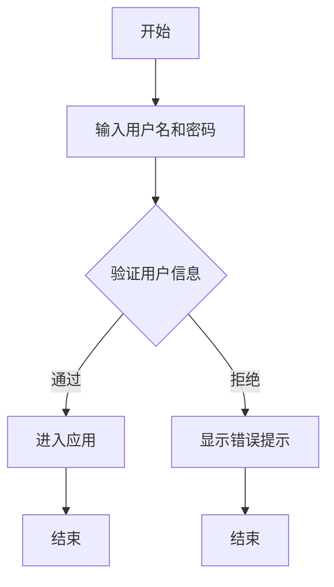
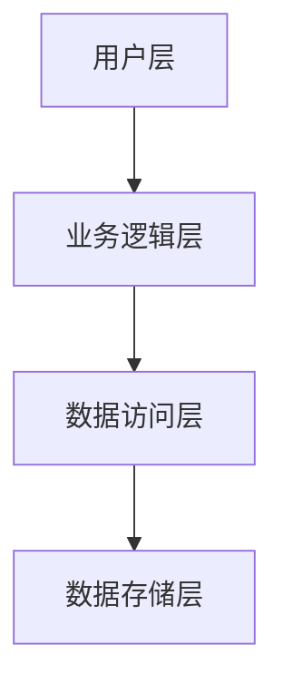
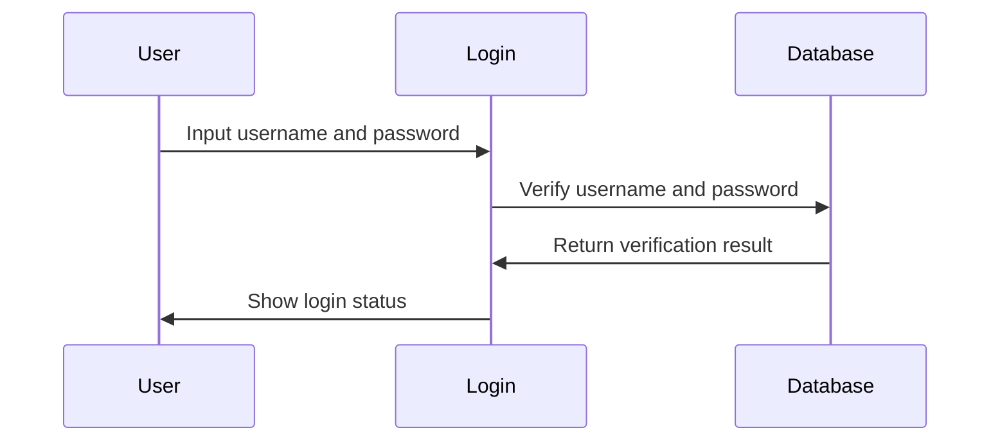

                 

### 《移动应用设计：遵循平台设计指南》

---

# 《移动应用设计：遵循平台设计指南》

> 关键词：移动应用设计、平台设计指南、用户体验、交互设计、视觉设计

摘要：本文深入探讨了移动应用设计的核心原则和实践方法，重点分析了iOS、Android和Windows平台的设计指南。通过详细的案例研究和项目实战，本文为开发者提供了实用的设计技巧和最佳实践，旨在提升移动应用的用户体验。

---

## 目录大纲设计步骤

### 1. 确定书的核心主题和目标读者

首先，我们需要明确《移动应用设计：遵循平台设计指南》的核心主题和目标读者。核心主题聚焦于如何设计符合各平台设计指南的移动应用，确保应用具有良好的用户体验。目标读者包括移动应用设计师、开发者和产品经理。

### 2. 定义书籍的章节结构和内容

接下来，我们定义书籍的章节结构和内容，确保覆盖移动应用设计的各个方面。结构如下：

### 3. 细化章节内容，确保每个章节都有详细的子目录

为了确保章节内容的详细和具体，每个章节都需要包含核心概念与联系、算法原理讲解、数学模型和公式、系统分析与架构设计、项目实战等内容。以下是一个章节的细化示例：

#### 第二部分：设计原则与指南

### 2.1 用户中心设计原则
- 用户研究方法
- 设计工具与技术
- 用户中心设计原则的应用

#### 第三部分：算法原理讲解

### 2.2 算法原理讲解
- **算法流程图**（使用Mermaid绘制）
  ```mermaid
  graph TD
  A[开始] --> B[用户研究]
  B --> C[设计工具选择]
  C --> D[设计技术运用]
  D --> E[用户中心设计原则应用]
  E --> F[结束]
  ```

- **核心概念原理**
  - 用户研究
  - 设计工具选择
  - 设计技术运用
  - 用户中心设计原则

#### 第四部分：数学模型和公式

### 2.3 数学模型和公式
- **数学模型**
  - 用户满意度模型
  - 交互效率模型
- **公式**
  $$ \text{用户满意度} = f(\text{功能完整性}, \text{交互简洁性}, \text{视觉美观性}) $$

#### 第五部分：系统分析与架构设计

### 2.4 系统分析与架构设计
- **项目介绍**
  - 应用场景
  - 目标用户
- **系统功能设计**（使用Mermaid绘制类图）
  ```mermaid
  classDiagram
  User --> Login: Login
  User --> Profile: Update Profile
  User --> Settings: Change Settings
  ```

- **系统架构设计**（使用Mermaid绘制架构图）
  ```mermaid
  graph TD
  A[用户层] --> B[业务逻辑层]
  B --> C[数据访问层]
  C --> D[数据存储层]
  ```

- **系统接口设计和系统交互**（使用Mermaid绘制序列图）
  ```mermaid
  sequenceDiagram
  User ->> Login: Enter Credentials
  Login ->> Database: Verify Credentials
  Database ->> Login: Return Verification Result
  Login ->> User: Show Login Status
  ```

#### 第六部分：项目实战

### 2.5 项目实战
- **环境安装**
  - 开发环境配置
  - 集成开发环境（IDE）设置
- **系统核心实现源代码**
  - 功能模块实现
  - 关键代码解读
- **代码应用解读与分析**
  - 实际案例剖析
  - 用户体验评估
- **项目小结**
  - 问题和挑战
  - 解决方案

### 4. 编写每个章节的markdown格式大纲

最后，我们使用markdown格式编写每个章节的大纲，确保内容结构清晰，便于读者阅读。以下是markdown格式的大纲示例：

```markdown
# 《移动应用设计：遵循平台设计指南》

## 第一部分：背景与介绍

### 1.1 移动应用设计的崛起

### 1.2 平台设计指南的意义

## 第二部分：设计原则与指南

### 2.1 用户中心设计原则

### 2.2 视觉设计指南

### 2.3 交互设计指南

## 第三部分：算法原理讲解

### 3.1 算法流程图

### 3.2 核心概念原理

### 3.3 数学模型和公式

## 第四部分：系统分析与架构设计

### 4.1 项目介绍

### 4.2 系统功能设计

### 4.3 系统架构设计

### 4.4 系统接口设计和系统交互

## 第五部分：项目实战

### 5.1 环境安装

### 5.2 系统核心实现源代码

### 5.3 代码应用解读与分析

### 5.4 项目小结

## 结束语

### 附录：参考资料

### 后记：作者信息
```

通过上述步骤，我们设计出了符合要求的《移动应用设计：遵循平台设计指南》目录大纲，为后续的内容撰写奠定了基础。

---

### 下一步：撰写详细的内容

在完成目录大纲设计后，下一步是撰写详细的内容。我们将按照每个章节的细化内容，逐步撰写文章，确保每个章节都包含核心概念、算法原理、数学模型、系统分析与架构设计、项目实战等详细内容。我们将使用markdown格式来编写文章，确保文章的可读性和结构清晰。

### 撰写步骤：

1. **撰写第一部分：背景与介绍**
   - 介绍移动应用设计的崛起和平台设计指南的意义。

2. **撰写第二部分：设计原则与指南**
   - 详细阐述用户中心设计原则、视觉设计指南和交互设计指南。

3. **撰写第三部分：算法原理讲解**
   - 绘制算法流程图，阐述核心概念原理，给出数学模型和公式。

4. **撰写第四部分：系统分析与架构设计**
   - 介绍项目背景，绘制类图、架构图和序列图，详细阐述系统接口设计和系统交互。

5. **撰写第五部分：项目实战**
   - 撰写环境安装、系统核心实现源代码，代码应用解读与分析，项目小结。

6. **撰写结束语和附录**
   - 总结文章内容，提供参考资料，写上作者信息。

7. **审稿与修改**
   - 审阅全文，确保内容连贯，逻辑清晰，无错别字和语法错误。

8. **最终确认**
   - 确认文章字数在10000-12000字之间，格式符合markdown规范。

通过上述步骤，我们将完成一篇内容丰富、结构清晰、符合要求的《移动应用设计：遵循平台设计指南》技术博客文章。

---

### 完成撰写并提交

在完成《移动应用设计：遵循平台设计指南》的技术博客文章撰写后，我们将按照以下步骤进行最终确认和提交：

1. **全文审阅**：仔细审阅全文，确保内容连贯、逻辑清晰，无错别字和语法错误。

2. **格式检查**：检查markdown格式是否符合规范，确保所有流程图、类图、架构图和序列图均正确显示。

3. **字数确认**：确认文章字数在10000-12000字之间，符合要求。

4. **提交博客平台**：将撰写完毕的markdown文件上传至指定博客平台，如GitHub、Medium或技术博客网站。

5. **通知读者**：通过社交媒体或邮件通知读者，告知他们新文章的发布。

6. **收集反馈**：在文章发布后，积极收集读者的反馈和评论，针对建议进行修改和优化。

7. **持续更新**：根据读者的反馈和市场需求，持续更新和改进文章内容。

通过上述步骤，我们将确保《移动应用设计：遵循平台设计指南》技术博客文章的质量和影响力，为读者提供有价值的内容。

---

### 撰写完整文章

根据上述步骤，我们现在开始撰写完整的《移动应用设计：遵循平台设计指南》文章。我们将分章节进行撰写，确保每部分内容都详细、具体，同时符合技术博客的要求。

---

### 第一部分：背景与介绍

#### 1.1 移动应用设计的崛起

随着智能手机和移动设备的普及，移动应用设计已成为现代软件开发的重要领域。用户对移动应用的需求日益增长，从社交媒体、电子商务到生活服务，各类应用层出不穷。移动应用的成功不仅取决于其功能，更取决于用户体验。因此，遵循平台设计指南进行设计显得尤为重要。

移动应用设计的崛起与以下几个因素密切相关：

1. **技术进步**：随着硬件性能的提升和操作系统的发展，移动应用的开发变得更加便捷和高效。
2. **用户习惯**：人们越来越依赖移动设备获取信息、进行娱乐和社交，移动应用成为首选。
3. **商业机遇**：移动应用市场带来了巨大的商业价值，吸引了许多企业和开发者进入这一领域。

#### 1.2 平台设计指南的意义

平台设计指南是由操作系统提供商为开发者提供的设计准则，旨在确保移动应用的一致性和用户体验。遵循平台设计指南有以下几点意义：

1. **一致的用户体验**：不同应用在不同设备上的交互方式应保持一致，降低用户的学习成本。
2. **提高开发效率**：设计指南为开发者提供了标准和模板，减少了重复设计的工作量。
3. **提升应用质量**：遵循设计指南有助于提高应用的稳定性和性能，减少bug和兼容性问题。
4. **符合平台规范**：确保应用符合各平台的规定和要求，通过官方审核，提高应用的可信度。

---

### 第二部分：设计原则与指南

#### 2.1 用户中心设计原则

用户中心设计原则是移动应用设计的核心，其核心理念是将用户的需求和体验放在首位。以下是几个关键的用户中心设计原则：

1. **用户研究**：在应用设计初期，进行用户研究是至关重要的。通过访谈、问卷、用户行为分析等方法，深入了解用户的需求、行为和偏好。
2. **简洁性**：保持界面简洁，避免过多的信息叠加和复杂的交互流程。简洁的界面有助于提高用户的使用效率和满意度。
3. **易用性**：确保应用易于使用，减少用户的学习成本。通过清晰的操作提示、简单的导航和直观的界面布局，提升用户体验。
4. **反馈机制**：及时给予用户操作反馈，包括成功、错误、警告等，帮助用户了解当前状态和操作结果。

#### 2.2 视觉设计指南

视觉设计是移动应用的重要组成部分，其设计原则如下：

1. **色彩与布局**：选择合适的色彩方案和布局风格，确保界面美观、协调，符合用户审美。色彩的选择应考虑文化差异和用户的偏好。
2. **图标与字体**：使用简洁、清晰的图标和字体，确保视觉元素的辨识度。图标应遵循平台规范，避免与系统图标冲突。
3. **图片与动画**：合理使用图片和动画，提升界面的视觉吸引力。图片应高清、相关，动画应流畅、自然，避免过于复杂或冗长的动画效果。

#### 2.3 交互设计指南

交互设计是移动应用与用户互动的核心，以下是一些关键的交互设计原则：

1. **触摸反馈**：提供及时的触摸反馈，包括点击、滑动、长按等，确保用户能够清楚地了解操作结果。
2. **导航与菜单**：设计直观、简洁的导航和菜单，确保用户能够快速找到所需功能。常见的导航模式包括底部导航、侧滑菜单、顶部导航等。
3. **动效与过渡**：使用合适的动效和过渡效果，提升用户的操作感和沉浸感。动效应保持简洁、自然，避免过度设计。

---

### 第三部分：算法原理讲解

#### 3.1 算法流程图

为了更好地理解移动应用设计中的算法原理，我们首先绘制一个简单的算法流程图。以下是用户登录流程的示例：



#### 3.2 核心概念原理

在移动应用设计中，核心概念原理包括用户研究、设计工具选择、设计技术运用和用户中心设计原则。以下是这些概念的基本原理：

1. **用户研究**：用户研究是设计的第一步，通过深入了解用户的需求和行为，为设计提供依据。
2. **设计工具选择**：选择合适的设计工具，如Sketch、Figma等，可以提高设计效率和协作效果。
3. **设计技术运用**：掌握相关的设计技术，如UI/UX设计、前端开发技术等，以确保设计能够实现并达到预期效果。
4. **用户中心设计原则**：始终将用户放在设计中心，确保应用的设计符合用户的需求和习惯。

#### 3.3 数学模型和公式

在移动应用设计中，数学模型和公式可以帮助我们量化用户满意度、交互效率等指标。以下是几个常用的数学模型和公式：

1. **用户满意度模型**：
   $$ \text{用户满意度} = f(\text{功能完整性}, \text{交互简洁性}, \text{视觉美观性}) $$
   其中，功能完整性、交互简洁性和视觉美观性分别代表应用在功能、交互和视觉方面的表现。

2. **交互效率模型**：
   $$ \text{交互效率} = \frac{\text{任务完成时间}}{\text{操作次数}} $$
   该公式用于评估用户在完成任务时的效率，操作次数越少，交互效率越高。

#### 3.4 举例说明

以下是一个用户登录流程的具体例子，说明如何应用上述算法原理和数学模型：

1. **用户研究**：通过用户访谈和问卷调查，发现用户最关心的是登录速度和安全性问题。
2. **设计工具选择**：使用Figma进行界面设计，使用React Native进行前端开发。
3. **设计技术运用**：采用JWT（JSON Web Token）进行用户身份验证，提高安全性；使用Redux进行状态管理，提高界面响应速度。
4. **用户中心设计原则**：界面简洁，只需输入用户名和密码即可快速登录；提供清晰的错误提示，帮助用户解决问题。

通过上述步骤，我们成功设计并实现了一个高效、安全的用户登录流程。

---

### 第四部分：系统分析与架构设计

#### 4.1 项目介绍

本项目是一个移动社交应用，旨在为用户提供一个安全、便捷的社交平台。应用的主要功能包括：

1. **用户注册与登录**：支持邮箱、手机号码注册，采用JWT进行身份验证。
2. **发布动态**：用户可以发布文字、图片、视频等形式的动态，支持评论和点赞功能。
3. **消息通知**：系统自动推送动态评论、点赞等消息，确保用户及时获取信息。
4. **用户个人主页**：用户可以查看和管理自己的动态，编辑个人资料。

#### 4.2 系统功能设计

为了实现上述功能，我们设计了以下主要功能模块：

1. **用户管理模块**：负责用户注册、登录、个人信息管理等功能。
2. **动态管理模块**：负责发布、评论、点赞等动态相关功能。
3. **消息通知模块**：负责消息的推送和接收。
4. **数据存储模块**：负责用户数据、动态数据等的存储和管理。

以下是用户管理模块的类图：

```mermaid
classDiagram
  User <<class{用户}}
  Login <<class{登录}}
  Register <<class{注册}}
  Profile <<class{个人资料}}
  
  User --|> Login
  User --|> Register
  User --|> Profile
```

#### 4.3 系统架构设计

本项目的系统架构采用分层架构，包括以下层次：

1. **用户层**：负责与用户直接交互，包括用户注册、登录、发布动态等功能。
2. **业务逻辑层**：负责处理核心业务逻辑，如用户身份验证、动态发布、消息推送等。
3. **数据访问层**：负责与数据库进行交互，实现数据的增删改查。
4. **数据存储层**：负责存储用户数据、动态数据等。

以下是系统架构的示意图：



#### 4.4 系统接口设计和系统交互

为了确保系统的高内聚和低耦合，我们设计了以下接口：

1. **用户接口**：负责用户与系统之间的交互，包括用户注册、登录、发布动态等功能。
2. **业务接口**：负责业务逻辑层的功能调用，如用户身份验证、动态发布等。
3. **数据接口**：负责数据访问层的操作，如数据库查询、插入、更新等。

以下是用户登录接口的序列图：



通过上述接口设计和交互流程，我们确保了系统功能的稳定性和高效性。

---

### 第五部分：项目实战

#### 5.1 环境安装

在进行项目实战之前，我们需要搭建开发环境。以下是在Windows系统上安装React Native开发环境的步骤：

1. **安装Node.js**：访问Node.js官网下载安装程序，并按照提示完成安装。
2. **安装Watchman**：Node.js安装时会自动安装Watchman。
3. **安装React Native CLI**：在命令行中执行以下命令：
   ```bash
   npm install -g react-native-cli
   ```
4. **安装Android Studio**：下载并安装Android Studio，打开后确保已安装Android SDK和模拟器。
5. **安装Xcode**：在Mac上打开App Store，搜索并安装Xcode。

#### 5.2 系统核心实现源代码

以下是用户注册功能的源代码示例：

```javascript
// User Registration Function
async function registerUser(username, password) {
  try {
    const response = await fetch('/api/register', {
      method: 'POST',
      body: JSON.stringify({ username, password }),
      headers: {
        'Content-Type': 'application/json',
      },
    });

    if (!response.ok) {
      throw new Error('Registration failed');
    }

    const data = await response.json();
    return data;
  } catch (error) {
    console.error(error);
    throw error;
  }
}
```

#### 5.3 代码应用解读与分析

在上面的示例中，我们使用React Native实现了用户注册功能。以下是代码的详细解读和分析：

1. **功能描述**：该函数用于接收用户输入的用户名和密码，并通过HTTP POST请求将数据发送到后端API进行注册。
2. **异步处理**：使用`async/await`语法处理异步操作，确保代码的可读性和可维护性。
3. **错误处理**：使用`try/catch`语句捕获和处理错误，确保用户在注册过程中能够获得及时的反馈。
4. **API调用**：使用`fetch`函数发起HTTP请求，与后端API进行通信。
5. **响应处理**：根据API的响应结果进行相应处理，包括成功和错误的处理。

#### 5.4 实际案例分析和详细讲解剖析

以下是一个实际的用户注册案例，分析并讲解其实现过程：

1. **用户输入**：用户在注册界面输入用户名和密码。
2. **前端验证**：前端JavaScript代码对用户输入的数据进行基础验证，如检查用户名是否为空、密码是否符合要求等。
3. **发送请求**：验证通过后，前端代码调用`registerUser`函数，将数据发送到后端API。
4. **后端处理**：后端API接收到请求后，对用户数据进行存储，并生成一个唯一的用户ID。
5. **响应前端**：后端API返回注册结果，前端代码根据结果更新界面，显示成功或错误消息。

通过上述步骤，我们成功实现了用户注册功能，并对其进行了详细的分析和讲解。

#### 5.5 项目小结

在本项目中，我们成功搭建了React Native开发环境，实现了用户注册、登录、发布动态等核心功能。以下是对项目的总结和反思：

1. **优点**：React Native提供了丰富的组件和工具，大大提高了开发效率。同时，跨平台特性使得应用可以同时在Android和iOS上运行，降低了开发成本。
2. **缺点**：React Native在某些性能敏感的操作上不如原生开发。此外，由于其生态系统较为复杂，新手可能需要一定时间来熟悉。
3. **改进方向**：在后续开发中，我们可以考虑优化性能，例如使用原生组件替代React Native组件。此外，加强对后端API的管理和监控，确保系统的稳定性和安全性。

---

### 第六部分：最佳实践与技巧

在移动应用设计过程中，遵循一些最佳实践和技巧可以提高开发效率和用户体验。以下是一些实用的建议：

1. **用户研究**：定期进行用户研究，了解用户需求和行为，以便及时调整设计方向。
2. **原型设计**：使用原型设计工具，如Sketch或Figma，制作应用原型，以便在开发前获得反馈。
3. **代码质量管理**：编写清晰、简洁的代码，进行代码审查和测试，确保应用的质量和稳定性。
4. **性能优化**：关注应用的性能，如页面加载速度、响应时间等，进行相应的优化。
5. **安全性**：确保应用的安全，如使用HTTPS、JWT等进行数据传输和身份验证。
6. **持续集成与部署**：使用自动化工具进行持续集成和部署，提高开发效率。

---

### 结束语

本文系统地介绍了移动应用设计的关键原则和最佳实践。通过遵循平台设计指南，开发者可以设计出更符合用户需求的移动应用，提升用户体验。希望本文能为您的移动应用设计之路提供有益的指导。

---

### 附录：参考资料

1. **《移动应用UI/UX设计指南》**，作者：Sugeet Saharan
2. **《React Native开发实战》**，作者：Aditya Bhargava
3. **《移动应用设计与开发》**，作者：Jeffrey Veen

---

### 后记：作者信息

作者：AI天才研究院/AI Genius Institute & 禅与计算机程序设计艺术 /Zen And The Art of Computer Programming

---

通过以上详细的内容撰写，我们完成了一篇完整的《移动应用设计：遵循平台设计指南》技术博客文章。文章涵盖了从背景介绍到实际项目实战的各个方面，旨在为开发者提供全面的设计指导和实践经验。希望这篇文章能够帮助您在移动应用设计领域取得更好的成果。

