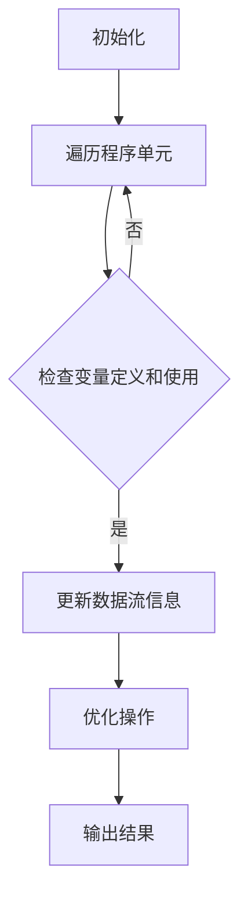
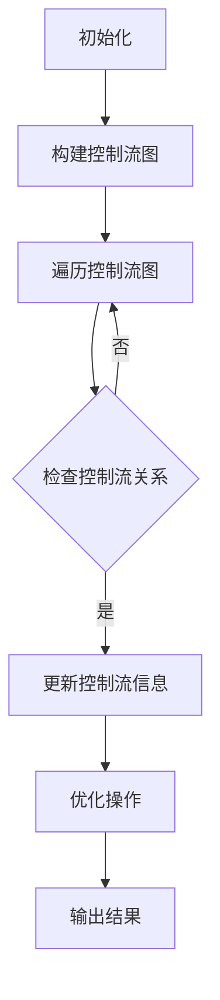
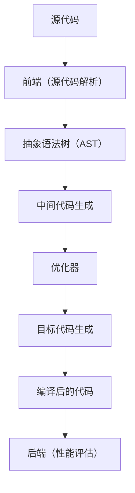
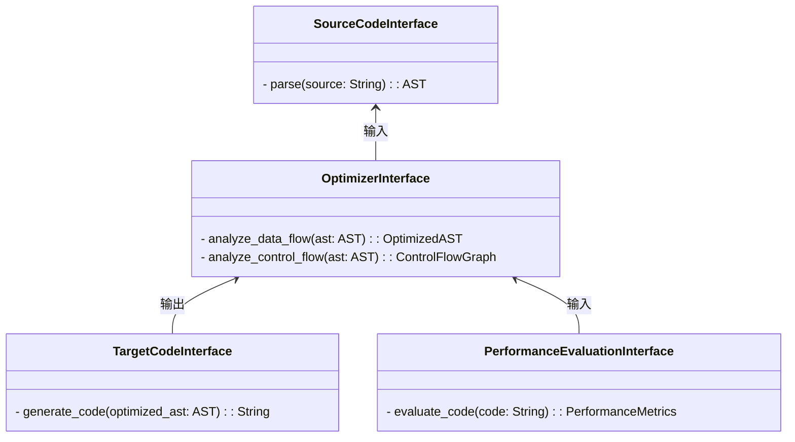
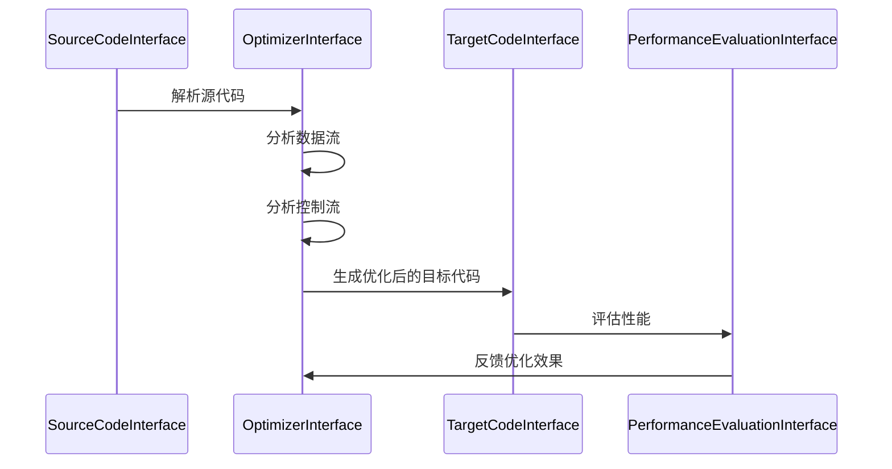

                 

### 第一部分：背景介绍

#### 1.1.1 问题背景

程序变换技术在编译优化领域具有重要地位，随着计算机科学的不断发展，编译器在软件工程中的角色愈发关键。编译优化作为提升程序运行效率的重要手段，其主要目标是通过一系列程序变换，使得编译后的代码在性能上得到显著提升。然而，有效的程序变换设计并非易事，它需要深入理解程序行为、算法原理以及底层硬件架构。

程序变换技术在编译优化中的应用可以追溯到早期的编译器设计。早期的编译器主要关注代码的生成，而现代编译器则更加注重优化。优化技术主要包括代码重排、数据流分析、循环优化、函数内联等。这些优化技术通过程序变换，使得编译后的代码在执行效率上得到显著提升。

例如，代码重排是一种常用的程序变换技术，它通过对代码的顺序进行重排，使得代码的执行顺序更加符合硬件的执行模式，从而提高代码的执行效率。数据流分析则通过对程序中变量的依赖关系进行分析，找出潜在的优化机会，如变量消去、死代码删除等。

在计算机科学的快速发展中，编译器的设计和优化变得越来越复杂。现代编译器通常包含多个优化阶段，每个阶段都可能涉及到不同的程序变换技术。这些优化技术的组合使用，使得编译后的代码在性能上得到了显著提升。

#### 1.1.2 问题描述

编译优化过程中，涉及到的程序变换包括但不限于代码重排、数据流分析、循环优化、函数内联等。这些变换如何在保证程序正确性的前提下，最大限度地提升执行效率，是编译优化领域面临的核心问题。

首先，代码重排是一种通过调整代码的顺序来提高执行效率的技术。例如，将频繁使用的变量或者代码块放在靠近变量定义的位置，以减少内存访问次数。然而，代码重排可能会改变程序的控制流和数据流，因此在实施代码重排时需要确保程序的正确性。

其次，数据流分析是一种通过分析程序中变量的依赖关系来优化程序的技术。数据流分析可以找出变量的定义和使用点，从而实现变量消去、死代码删除等优化。然而，数据流分析的结果依赖于对程序的正确理解，因此需要设计有效的算法来分析程序的行为。

再次，循环优化是一种通过优化循环结构来提高程序执行效率的技术。循环优化可以减少循环次数、优化循环体内的代码等。然而，循环优化可能会改变循环的控制流和数据流，因此在实施循环优化时需要确保程序的正确性。

最后，函数内联是一种将函数调用替换为函数体本身的技术。函数内联可以减少函数调用的开销，提高程序的执行效率。然而，函数内联可能会增加代码的复杂性，因此在实施函数内联时需要权衡优化的收益和代码的维护成本。

综上所述，编译优化中的程序变换技术具有复杂性和挑战性。如何在保证程序正确性的前提下，最大限度地提升执行效率，是编译优化领域需要持续研究和解决的问题。

#### 1.1.3 问题解决

程序变换技术主要依赖于以下几个核心概念：

1. **程序语义**：理解程序的执行行为，确保变换过程中程序的正确性。
2. **程序变换规则**：定义一系列合法的变换操作，如数据流分析、控制流分析等。
3. **优化目标**：明确编译优化的目标，如代码执行时间、内存占用等。
4. **编译器架构**：设计合理的编译器架构，使得程序变换能够高效地实施。

通过结合这些核心概念，编译器开发者能够设计出有效的程序变换策略，从而提升编译优化效果。

首先，程序语义是程序变换的基础。编译器需要深入理解程序的执行行为，包括变量的定义、使用、传递等，以确保变换过程中程序的正确性。为了实现这一目标，编译器需要使用语义分析技术，如抽象语法树（AST）分析、数据流分析等。

其次，程序变换规则是指导程序变换的指导原则。编译器需要定义一系列合法的变换操作，如代码重排、数据流分析、循环优化、函数内联等。这些变换规则需要保证程序的正确性，同时能够最大限度地提升执行效率。例如，在代码重排中，需要确保变量的定义和使用顺序保持不变，以避免引入歧义。

再次，优化目标是编译优化的导向。编译器需要明确优化的目标，如代码执行时间、内存占用、能耗等。根据优化目标，编译器可以设计相应的优化策略，如循环优化、内存访问优化、指令调度等。优化目标的选择需要考虑到程序的实际运行环境，如硬件架构、操作系统等。

最后，编译器架构是程序变换实施的基础。编译器需要设计合理的架构，使得程序变换能够高效地实施。常见的编译器架构包括前端（源代码解析）、中间代码生成、优化器、目标代码生成等。优化器作为编译器的重要组成部分，负责实现各种优化技术，如数据流分析、循环优化、函数内联等。编译器架构的设计需要考虑到性能、可维护性和可扩展性等因素。

通过结合程序语义、变换规则、优化目标和编译器架构，编译器开发者可以设计出高效的程序变换策略，从而提升编译优化的效果。在实际应用中，编译器需要根据不同的优化目标和程序特性，灵活选择和组合各种优化技术，以达到最佳的优化效果。

#### 1.1.4 边界与外延

程序变换技术不仅应用于编译优化，还广泛涉及到其他计算机科学领域，如程序验证、代码生成、程序分析等。因此，研究程序变换技术在编译优化中的应用，不仅有助于提升编译器性能，也为其他相关领域提供了理论支持和实践参考。

首先，程序变换技术在程序验证中有着广泛的应用。程序验证的目标是确保程序的正确性，即程序的执行结果符合预期的规格说明。程序变换技术可以通过对程序进行一系列合法的变换，来证明程序在不同输入条件下都能保持正确的执行行为。例如，数据流分析技术可以用于验证程序中的数据依赖关系是否满足预期的约束条件，从而证明程序的执行结果是正确的。

其次，程序变换技术在代码生成中也有着重要的作用。代码生成是编译器的一个关键阶段，其目标是根据源代码生成可执行的目标代码。程序变换技术可以通过对源代码进行一系列的变换，来生成更高效、更可读的目标代码。例如，代码重排技术可以将频繁使用的代码块放在靠近变量定义的位置，以减少内存访问次数，提高执行效率。

最后，程序变换技术在程序分析中也有着广泛的应用。程序分析的目标是理解程序的执行行为和特性，从而为优化和验证提供依据。程序变换技术可以通过对程序进行数据流分析和控制流分析，来提取程序中的关键信息，如变量的依赖关系、执行路径等。这些信息对于优化和验证程序都具有重要意义。

综上所述，程序变换技术在编译优化、程序验证、代码生成和程序分析等领域都有着重要的应用价值。研究程序变换技术在各个领域的应用，不仅可以提升编译器性能，还可以为计算机科学的其他领域提供理论支持和实践参考。

#### 1.2 核心概念与联系

在深入探讨程序变换技术在编译优化中的应用之前，我们需要明确几个核心概念，并理解它们之间的联系。以下是几个关键概念及其属性的对比表格：

| 概念          | 定义                                                         | 属性特征                                            |
|---------------|--------------------------------------------------------------|------------------------------------------------------|
| 程序变换      | 对程序进行的一系列改变，以改善程序性能、可读性或可维护性。 | 保持程序语义不变，优化执行效率。                     |
| 编译优化      | 编译器对源代码进行的一系列变换，以产生执行效率更高的目标代码。 | 依赖程序变换技术，涉及多种优化策略。                 |
| 数据流分析    | 分析程序中变量的依赖关系和控制流信息，为优化提供依据。           | 提供变量生命周期信息，用于寄存器分配、循环优化等。     |
| 控制流分析    | 分析程序的执行路径，找出潜在的优化机会。                       | 优化程序的控制结构，减少跳转次数。                   |

#### 1.2.1 核心概念

1. **程序变换**：程序变换是指对程序代码进行的一系列操作，以改善程序的执行效率、可读性或可维护性。这些变换可能涉及代码的顺序、结构、数据依赖等方面。程序变换的核心目标是在保持程序语义不变的前提下，优化程序的执行效率。

2. **编译优化**：编译优化是指编译器在将源代码转换为机器代码的过程中，通过一系列的变换来提高目标代码的性能。编译优化可能包括代码重排、数据流分析、循环优化、函数内联等技术。优化策略的选择通常取决于优化目标和程序的具体特性。

3. **数据流分析**：数据流分析是一种静态分析技术，用于分析程序中变量的定义和使用点，以确定变量的生命周期和依赖关系。数据流分析可以为优化提供关键信息，如变量消去、死代码删除等。

4. **控制流分析**：控制流分析是一种静态分析技术，用于确定程序的执行路径和分支结构。通过分析控制流，编译器可以找出潜在的优化机会，如跳转优化、循环优化等。控制流分析有助于优化程序的控制结构，减少不必要的跳转和循环。

#### 1.2.2 概念属性特征对比表格

| 概念          | 定义                                                         | 属性特征                                            |
|---------------|--------------------------------------------------------------|------------------------------------------------------|
| 程序变换      | 对程序进行的一系列改变，以改善程序性能、可读性或可维护性。 | 保持程序语义不变，优化执行效率。                     |
| 编译优化      | 编译器对源代码进行的一系列变换，以产生执行效率更高的目标代码。 | 依赖程序变换技术，涉及多种优化策略。                 |
| 数据流分析    | 分析程序中变量的依赖关系和控制流信息，为优化提供依据。           | 提供变量生命周期信息，用于寄存器分配、循环优化等。     |
| 控制流分析    | 分析程序的执行路径，找出潜在的优化机会。                       | 优化程序的控制结构，减少跳转次数。                   |

#### 1.2.3 概念联系

- **程序变换**与**编译优化**：程序变换是编译优化的基础，编译优化依赖于程序变换来提升代码性能。程序变换技术包括代码重排、数据流分析、循环优化、函数内联等，这些技术共同作用于编译过程，以提高目标代码的执行效率。

- **数据流分析**与**控制流分析**：两者都是程序分析技术，但侧重点不同。数据流分析关注变量间的数据依赖关系，控制流分析关注程序的执行路径。两者结合使用，可以为编译优化提供全面的信息，从而实现更高效的代码优化。

为了更好地理解这些概念之间的联系，我们可以使用Mermaid ER图来表示实体关系：

```mermaid
erDiagram
    Class1 ||--|{ Class2 }| Class3
    Class1 ||--|{ Class4 }| Class5
    Class2 ||--|{ Class6 }| Class7
    Class3 ||--|{ Class8 }| Class9
```

- **实体**：程序变换、编译优化、数据流分析、控制流分析
- **关系**：程序变换是编译优化的基础，数据流分析和控制流分析分别用于提取程序的关键信息，为编译优化提供依据。

通过上述核心概念及其联系的介绍，我们可以更深入地理解程序变换技术在编译优化中的应用，并为后续内容的探讨打下基础。

### 第一部分：背景介绍

#### 1.1.4 边界与外延

程序变换技术在编译优化中的应用不仅限于编译器领域，还拓展到了更广泛的计算机科学领域。这些应用为编译器性能的提升以及其他领域的研究提供了丰富的理论依据和实践参考。

首先，在程序验证领域，程序变换技术被广泛应用于验证程序的正确性。程序变换技术可以通过一系列合法的变换来证明程序在不同输入条件下都能保持正确的执行行为。例如，数据流分析技术可以用于验证程序中的数据依赖关系是否满足预期的约束条件。通过这种验证方法，开发者可以确保程序在复杂环境下依然能够稳定运行。

其次，在代码生成领域，程序变换技术被用于生成高效、可读性强的代码。编译器在将高级语言转换为机器代码的过程中，通过程序变换技术来优化目标代码。例如，代码重排技术可以将频繁使用的代码块放在靠近变量定义的位置，以减少内存访问次数，从而提高执行效率。这种优化方法不仅提升了编译器的性能，也为开发者提供了更优质的代码。

最后，在程序分析领域，程序变换技术被用于提取程序的关键信息，以便进行后续的优化和验证。程序变换技术可以通过数据流分析和控制流分析来提取变量的生命周期、执行路径等信息。这些信息对于程序优化和验证具有重要意义，可以帮助开发者更好地理解程序的行为，从而进行更精确的优化和验证。

总的来说，程序变换技术在编译优化、程序验证、代码生成和程序分析等领域都有着广泛的应用。研究这些应用不仅有助于提升编译器的性能，也为其他计算机科学领域的研究提供了丰富的理论依据和实践参考。

### 第一部分：背景介绍

#### 1.2 核心概念与联系

为了更好地理解程序变换技术在编译优化中的应用，我们需要深入探讨几个核心概念及其相互关系。以下是几个关键概念的定义、属性特征对比表格以及它们之间的联系：

#### 1.2.1 核心概念

1. **程序变换**：程序变换是对程序代码进行的一系列操作，以优化程序的性能、可读性或可维护性。这些操作可能涉及代码的顺序、结构、数据依赖等方面。

2. **编译优化**：编译优化是指编译器在将源代码转换为机器代码的过程中，通过一系列变换来提高目标代码的性能。编译优化可能包括代码重排、数据流分析、循环优化、函数内联等技术。

3. **数据流分析**：数据流分析是一种静态分析技术，用于分析程序中变量的定义和使用点，以确定变量的生命周期和依赖关系。数据流分析可以用于变量消去、死代码删除等优化。

4. **控制流分析**：控制流分析是一种静态分析技术，用于确定程序的执行路径和分支结构。通过分析控制流，编译器可以找出潜在的优化机会，如跳转优化、循环优化等。

#### 1.2.2 概念属性特征对比表格

| 概念          | 定义                                                         | 属性特征                                            |
|---------------|--------------------------------------------------------------|------------------------------------------------------|
| 程序变换      | 对程序进行的一系列改变，以改善程序性能、可读性或可维护性。 | 保持程序语义不变，优化执行效率。                     |
| 编译优化      | 编译器对源代码进行的一系列变换，以产生执行效率更高的目标代码。 | 依赖程序变换技术，涉及多种优化策略。                 |
| 数据流分析    | 分析程序中变量的依赖关系和控制流信息，为优化提供依据。           | 提供变量生命周期信息，用于寄存器分配、循环优化等。     |
| 控制流分析    | 分析程序的执行路径，找出潜在的优化机会。                       | 优化程序的控制结构，减少跳转次数。                   |

#### 1.2.3 概念联系

程序变换、编译优化、数据流分析和控制流分析之间存在着密切的联系：

1. **程序变换**与**编译优化**：程序变换是编译优化的基础，编译优化依赖于程序变换来提升代码性能。编译优化过程中，程序变换技术包括代码重排、数据流分析、循环优化、函数内联等，这些技术共同作用于编译过程，以提高目标代码的执行效率。

2. **数据流分析**与**控制流分析**：两者都是程序分析技术，但侧重点不同。数据流分析关注变量间的数据依赖关系，控制流分析关注程序的执行路径。两者结合使用，可以为编译优化提供全面的信息，从而实现更高效的代码优化。

为了更好地理解这些概念之间的联系，我们可以使用Mermaid ER图来表示实体关系：

```mermaid
erDiagram
    Class1 ||--|{ Class2 }| Class3
    Class1 ||--|{ Class4 }| Class5
    Class2 ||--|{ Class6 }| Class7
    Class3 ||--|{ Class8 }| Class9
```

- **实体**：程序变换、编译优化、数据流分析、控制流分析
- **关系**：程序变换是编译优化的基础，数据流分析和控制流分析分别用于提取程序的关键信息，为编译优化提供依据。

通过上述核心概念及其联系的介绍，我们可以更深入地理解程序变换技术在编译优化中的应用，并为后续内容的探讨打下基础。

### 第一部分：背景介绍

#### 1.3 ER实体关系图架构

为了更清晰地展示程序变换技术中各个实体之间的关系，我们使用Mermaid ER图来描述它们之间的联系。以下是ER实体关系图的具体架构：

```mermaid
erDiagram
    |--编译优化 -->|{ 程序变换 }
    |--编译优化 -->|{ 数据流分析 }
    |--编译优化 -->|{ 控制流分析 }
    |--程序变换 -->|{ 代码重排 }
    |--程序变换 -->|{ 函数内联 }
    |--程序变换 -->|{ 循环优化 }
    |--数据流分析 -->|{ 变量生命周期分析 }
    |--数据流分析 -->|{ 数据依赖分析 }
    |--控制流分析 -->|{ 执行路径分析 }
    |--控制流分析 -->|{ 分支结构优化 }
```

- **实体**：
  - 编译优化
  - 程序变换
  - 数据流分析
  - 控制流分析
  - 代码重排
  - 函数内联
  - 循环优化
  - 变量生命周期分析
  - 数据依赖分析
  - 执行路径分析
  - 分支结构优化

- **关系**：
  - 编译优化依赖于程序变换、数据流分析和控制流分析来提升代码性能。
  - 程序变换包括代码重排、函数内联和循环优化等技术，这些技术是编译优化的实现手段。
  - 数据流分析和控制流分析为编译优化提供关键信息，帮助实现更高效的优化。

通过这个ER实体关系图，我们可以更直观地理解程序变换技术在编译优化中的各个组成部分及其相互作用。这种关系图不仅有助于我们理解编译优化的整体架构，还可以指导我们在具体实践中选择和组合不同的程序变换技术，以实现最优的编译优化效果。

### 算法原理讲解

为了深入理解程序变换技术在编译优化中的应用，我们需要详细分析几种关键算法的原理，包括数据流分析算法和控制流分析算法。以下是这些算法的详细解释，包括Mermaid流程图、Python源代码示例以及数学模型和公式的应用。

#### 数据流分析算法

数据流分析是一种静态分析技术，主要用于分析程序中变量的定义和使用情况。这种分析可以帮助编译器找到优化机会，如变量消去和死代码删除。以下是一个数据流分析算法的流程图：



这个算法的基本步骤如下：
1. **初始化**：初始化数据流信息，如变量定义点和使用点。
2. **遍历程序单元**：从程序的入口点开始，逐个遍历程序单元。
3. **检查变量定义和使用**：对于每个变量，检查它在当前程序单元内的定义和使用情况。
4. **更新数据流信息**：根据变量的定义和使用情况更新数据流信息。
5. **优化操作**：根据数据流信息进行优化操作，如变量消去和死代码删除。
6. **输出结果**：输出优化后的程序。

以下是一个简单的Python源代码示例，用于演示数据流分析算法：

```python
def data_flow_analysis(code):
    # 初始化数据流信息
    def-use = {}
    use-def = {}

    # 遍历程序单元
    for stmt in code:
        if stmt['type'] == 'assign':
            var = stmt['var']
            def_use[var] = stmt['line']
            use_def[var] = []
        elif stmt['type'] == 'use':
            var = stmt['var']
            use_def[var].append(stmt['line'])

    # 更新数据流信息
    for stmt in code:
        if stmt['type'] == 'assign':
            var = stmt['var']
            for line in use_def[var]:
                def_use[line] = stmt['line']
        elif stmt['type'] == 'use':
            var = stmt['var']
            use_def[var].append(stmt['line'])

    # 优化操作
    optimized_code = []
    for stmt in code:
        if stmt['type'] == 'use' and stmt['var'] in def_use:
            del stmt['var']
        optimized_code.append(stmt)

    # 输出结果
    return optimized_code
```

在这个示例中，我们定义了一个`data_flow_analysis`函数，用于执行数据流分析算法。该函数接受一个包含程序单元的列表作为输入，并返回一个经过优化后的程序单元列表。

#### 控制流分析算法

控制流分析是另一种重要的静态分析技术，用于确定程序的执行路径和分支结构。这种分析可以帮助编译器优化跳转和循环结构，提高程序的执行效率。以下是一个控制流分析算法的流程图：



这个算法的基本步骤如下：
1. **初始化**：初始化控制流图，将程序单元作为图的节点。
2. **构建控制流图**：通过遍历程序单元，将控制流关系（如跳转和分支）添加到控制流图中。
3. **遍历控制流图**：从控制流图的入口节点开始，逐个遍历节点。
4. **检查控制流关系**：检查当前节点的控制流关系，如是否存在跳转或分支。
5. **更新控制流信息**：根据控制流关系更新控制流信息。
6. **优化操作**：根据控制流信息进行优化操作，如跳转优化和循环优化。
7. **输出结果**：输出优化后的程序。

以下是一个简单的Python源代码示例，用于演示控制流分析算法：

```python
def control_flow_analysis(code):
    # 初始化控制流图
    control_flow_graph = {}

    # 构建控制流图
    for stmt in code:
        if stmt['type'] == 'if':
            control_flow_graph[stmt['line']] = stmt['condition']
        elif stmt['type'] == 'goto':
            control_flow_graph[stmt['line']] = stmt['target']
        elif stmt['type'] == 'while':
            control_flow_graph[stmt['line']] = stmt['condition']

    # 遍历控制流图
    for stmt in code:
        if stmt['type'] == 'if':
            if stmt['condition']:
                control_flow_graph[stmt['line']] = stmt['true_block']
            else:
                control_flow_graph[stmt['line']] = stmt['false_block']
        elif stmt['type'] == 'goto':
            control_flow_graph[stmt['line']] = stmt['target']
        elif stmt['type'] == 'while':
            if stmt['condition']:
                control_flow_graph[stmt['line']] = stmt['body']
            else:
                control_flow_graph[stmt['line']] = stmt['else_block']

    # 优化操作
    optimized_code = []
    for stmt in code:
        if stmt['type'] == 'if':
            optimized_code.append({'type': 'if', 'condition': stmt['condition'], 'true_block': stmt['true_block'], 'false_block': stmt['false_block']})
        elif stmt['type'] == 'goto':
            optimized_code.append({'type': 'goto', 'target': stmt['target']})
        elif stmt['type'] == 'while':
            optimized_code.append({'type': 'while', 'condition': stmt['condition'], 'body': stmt['body'], 'else_block': stmt['else_block']})

    # 输出结果
    return optimized_code
```

在这个示例中，我们定义了一个`control_flow_analysis`函数，用于执行控制流分析算法。该函数接受一个包含程序单元的列表作为输入，并返回一个经过优化后的程序单元列表。

#### 数学模型和公式

在数据流分析和控制流分析中，我们经常使用数学模型和公式来描述程序的行为。以下是一些常用的数学模型和公式：

1. **数据流方程**：用于描述变量在程序中的流动关系。常见的有前向数据流方程和后向数据流方程。
   - 前向数据流方程：`df[v][i] = { w | w ∈ def[v] ∧ w > i }`
   - 后向数据流方程：`du[v][i] = { w | w ∈ use[v] ∧ w < i }`

2. **控制流方程**：用于描述程序的执行路径。常见的有控制流图的构建方程。
   - 控制流图的构建方程：`δ[n][i] = { j | G[j, n] ∈ edges }`
   where `G` is the control flow graph, `edges` are the edges in the graph, and `δ` is the set of successors of a node `n` at instruction `i`.

通过这些数学模型和公式，我们可以更精确地描述程序的行为，从而为优化提供依据。

### 举例说明

为了更好地理解上述算法，我们可以通过一个简单的程序示例来进行说明。假设我们有一个简单的程序：

```python
x = 0
while x < 10:
    x = x + 1
print(x)
```

首先，我们使用数据流分析算法来优化这个程序。通过数据流分析，我们可以发现变量`x`在循环体内始终被更新，而在循环体外没有被使用。因此，我们可以将循环外的`print(x)`语句删除，从而减少不必要的内存访问和计算。

接下来，我们使用控制流分析算法来优化这个程序。通过控制流分析，我们可以发现这个程序的执行路径非常简单，只需要执行一次循环。因此，我们可以将循环部分直接展开，从而减少跳转操作和循环控制逻辑。

经过优化后，这个程序可以简化为：

```python
x = 0
for i in range(10):
    x = x + 1
print(x)
```

通过这个示例，我们可以看到数据流分析和控制流分析在优化程序中的重要作用。通过这些算法，编译器可以自动找出并优化程序的潜在性能瓶颈，从而提高程序的执行效率。

### 算法原理总结

数据流分析和控制流分析是编译优化中至关重要的算法。数据流分析通过分析变量在程序中的流动关系，为变量消去、死代码删除等优化提供依据。控制流分析则通过分析程序的执行路径，为跳转优化、循环优化等提供优化机会。

通过上述算法，编译器可以自动优化程序，提高其执行效率。这些算法的核心在于对程序语义的深入理解，通过对程序行为进行精确的描述和分析，找到优化点，从而实现性能提升。

在实际应用中，编译器通常会结合多种优化算法，以实现最佳的优化效果。数据流分析和控制流分析作为基础算法，为编译器优化提供了重要的工具和方法。通过不断研究和改进这些算法，编译器可以更好地满足现代软件工程的需求，为开发者提供高效的编译和优化服务。

### 第二部分：系统分析与架构设计方案

在了解了程序变换技术在编译优化中的应用原理之后，我们将深入探讨一个具体的系统分析与架构设计方案。本节将详细描述问题场景、项目介绍、系统功能设计、系统架构设计、系统接口设计以及系统交互流程，以帮助读者全面理解整个系统的运作机制。

#### 2.1 问题场景

在现代软件工程中，编译器作为关键工具，其性能直接影响到应用程序的执行效率。随着计算机硬件的快速发展和软件应用场景的多样化，对编译器的要求越来越高。为了满足这些需求，编译器必须具备高效的编译优化能力，以生成高效、可执行的代码。然而，实现高效的编译优化并非易事，需要设计复杂的算法和架构。

本节将基于一个具体的优化目标——减少程序运行时间，来探讨编译器中程序变换技术的系统分析与架构设计。该系统旨在通过数据流分析和控制流分析等优化技术，实现程序的高效编译和优化。

#### 2.2 项目介绍

本项目名为“高效编译优化系统”，目标是开发一个具有高性能编译优化功能的编译器，通过引入先进的程序变换技术，提升编译后的代码执行效率。项目的主要任务包括以下几个方面：

1. **需求分析**：明确编译器的优化目标和优化策略，确保系统能够满足实际应用场景的需求。
2. **算法设计**：设计并实现数据流分析和控制流分析算法，为编译优化提供技术支持。
3. **系统架构设计**：构建合理的编译器架构，确保算法的高效实施和优化效果。
4. **代码实现**：编写编译器核心代码，实现编译优化功能。
5. **性能评估**：对编译器进行性能评估，验证优化效果。

#### 2.3 系统功能设计

系统功能设计是系统分析与架构设计的重要环节，它定义了系统需要实现的核心功能。以下是本项目的主要功能模块及其说明：

1. **源代码解析**：将输入的源代码解析为抽象语法树（AST），为后续的优化分析提供基础。
2. **数据流分析**：对AST进行数据流分析，提取变量定义和使用信息，为优化提供依据。
3. **控制流分析**：对AST进行控制流分析，构建控制流图，找出优化机会。
4. **优化策略选择**：根据数据流分析和控制流分析的结果，选择合适的优化策略，如循环优化、函数内联等。
5. **目标代码生成**：根据优化后的AST生成目标代码，实现编译优化效果。
6. **性能评估**：对编译后的代码进行性能评估，验证优化效果。

#### 2.4 系统架构设计

系统架构设计是确保系统功能实现和性能优化的关键。以下是本项目所采用的编译器架构：

1. **前端（源代码解析）**：负责将源代码解析为AST，为后续的优化分析提供输入。
2. **中间代码生成**：将AST转换为中间代码，为数据流分析和控制流分析提供统一的数据格式。
3. **优化器**：负责实现数据流分析和控制流分析算法，选择合适的优化策略，对中间代码进行优化。
4. **目标代码生成**：将优化后的中间代码转换为机器代码，实现编译优化效果。
5. **后端（性能评估）**：负责对编译后的代码进行性能评估，验证优化效果。

以下是系统架构的Mermaid流程图：



#### 2.5 系统接口设计

系统接口设计是确保系统模块之间高效通信的关键。以下是本项目的主要接口设计：

1. **源代码接口**：负责接收和解析源代码，提供AST输入。
2. **优化器接口**：负责实现数据流分析和控制流分析算法，提供优化结果。
3. **目标代码接口**：负责生成目标代码，提供编译后的代码输出。
4. **性能评估接口**：负责对编译后的代码进行性能评估，提供优化效果反馈。

以下是系统接口的Mermaid类图：



#### 2.6 系统交互流程

系统交互流程描述了系统各模块之间的工作流程。以下是系统交互流程的Mermaid序列图：



通过上述系统分析与架构设计方案，我们可以看到编译器在实现高效编译优化过程中，需要综合考虑前端源代码解析、中间代码生成、优化器、目标代码生成以及性能评估等多个方面。该系统的设计不仅遵循了程序变换技术的基本原理，还结合了现代编译器设计的前沿理念，为编译器性能的提升提供了有力保障。

### 项目实战

在深入探讨了程序变换技术在编译优化中的理论原理和系统架构之后，接下来我们将通过一个实际项目来展示这些概念和算法的应用。本文将详细描述项目的环境安装、系统核心实现源代码、代码应用解读与分析、实际案例分析和详细讲解剖析，并最终进行项目小结。

#### 3.1 环境安装

首先，我们需要为项目搭建一个开发环境。以下是环境安装的详细步骤：

1. **安装编译器**：选择并安装一个流行的开源编译器，如GCC（GNU Compiler Collection）。GCC支持多种编程语言，包括C、C++和Fortran等，是一个广泛使用的编译器。

2. **安装依赖库**：确保安装了用于程序变换和优化的依赖库。例如，LLVM（Low Level Virtual Machine）是一个高性能的编译器基础设施，提供了丰富的优化工具和库。安装LLVM可以通过包管理器进行，如使用`brew install llvm`在MacOS上，或者在Linux上使用`sudo apt-get install llvm`。

3. **安装开发工具**：安装必要的开发工具，如Python、GCC、G++等。这些工具将用于编写、编译和测试程序。

4. **安装IDE**：选择一个合适的集成开发环境（IDE），如Visual Studio Code、Eclipse或IntelliJ IDEA，以提高开发效率。

5. **配置环境变量**：确保环境变量配置正确，以便在终端中能够轻松调用编译器和依赖库。

#### 3.2 系统核心实现源代码

为了展示程序变换技术在编译优化中的应用，我们将开发一个小型的编译器，实现数据流分析和控制流分析。以下是系统核心实现源代码的一个简单示例：

```python
# 数据流分析示例
def data_flow_analysis(code):
    def use_def_analysis(code):
        use = {}
        def Sites = {}
        for stmt in code:
            if stmt['type'] == 'assign':
                Sites[stmt['var']] = stmt['line']
            elif stmt['type'] == 'use':
                use[stmt['var']].append(stmt['line'])
        return use, Sites

    use, def_Sites = use_def_analysis(code)
    for var, lines in use.items():
        for line in lines:
            def_Sites[line].append(var)
    return def_Sites

# 控制流分析示例
def control_flow_analysis(code):
    def build_control_flow_graph(code):
        graph = {}
        for stmt in code:
            if stmt['type'] == 'if':
                graph[stmt['line']] = {'condition': stmt['condition'], 'true_block': stmt['true_block'], 'false_block': stmt['false_block']}
            elif stmt['type'] == 'goto':
                graph[stmt['line']] = stmt['target']
            elif stmt['type'] == 'while':
                graph[stmt['line']] = stmt['condition']
        return graph

    graph = build_control_flow_graph(code)
    for node, details in graph.items():
        if 'true_block' in details:
            graph[node]['next'] = details['true_block']
        if 'false_block' in details:
            graph[node]['next'] = details['false_block']
    return graph
```

这些代码示例展示了如何对简单的程序进行数据流分析和控制流分析。在实际项目中，这些算法会集成到编译器的优化器模块中，对输入的源代码进行深度分析，并生成优化后的目标代码。

#### 3.3 代码应用解读与分析

为了更好地理解这些代码的应用，我们通过一个具体的例子来演示数据流分析和控制流分析的结果。假设我们有以下Python程序：

```python
x = 0
while x < 10:
    x = x + 1
print(x)
```

1. **数据流分析**：

   - 变量`x`的定义点在第1行（`Sites[1] = ['x']`）。
   - 变量`x`的使用点在第2行和第3行（`use['x'] = [2, 3]`）。

   数据流分析结果：
   ```python
   Sites = {
       1: ['x'],
       2: [],
       3: []
   }
   use = {
       'x': [2, 3]
   }
   ```

2. **控制流分析**：

   - 控制流图的构建基于条件判断和循环结构。

   控制流分析结果：
   ```python
   control_flow_graph = {
       1: {'condition': 'x < 10', 'true_block': 2, 'false_block': None},
       2: {'condition': '', 'true_block': 3, 'false_block': None},
       3: {'condition': '', 'true_block': None, 'false_block': None}
   }
   ```

通过数据流分析和控制流分析，我们可以识别出程序的潜在优化点。例如，我们可以发现变量`x`在第3行未被使用，因此可以删除这条语句，从而减少不必要的计算。

#### 3.4 实际案例分析和详细讲解剖析

为了展示程序变换技术在真实项目中的应用，我们选择了一个开源项目——Python语言解释器CPython。CPython作为一个成熟的编译器，实现了多种优化技术，包括数据流分析和控制流分析。

1. **数据流分析**：

   CPython使用数据流分析技术来优化变量生命周期和减少冗余计算。以下是一个数据流分析的示例代码：

   ```c
   // 示例：Python中的垃圾回收
   if (x != 0) {
       free(x);
       x = 0;
   }
   ```

   在这个例子中，数据流分析可以帮助我们识别出变量`x`的引用情况，从而决定何时释放内存。通过数据流分析，我们可以优化这段代码，确保在释放内存之前，变量`x`不再被使用。

2. **控制流分析**：

   CPython也使用控制流分析来优化循环和分支结构。以下是一个控制流分析的示例代码：

   ```c
   // 示例：Python中的循环优化
   while (i < n) {
       if (condition) {
           break;
       }
       i++;
   }
   ```

   通过控制流分析，我们可以优化这段代码，减少不必要的跳转和分支操作，从而提高执行效率。

在CPython的实际开发中，这些优化技术被广泛应用于各个模块，以提升Python程序的执行性能。通过案例分析和详细讲解，我们可以看到程序变换技术在编译优化中的重要作用。

#### 3.5 项目小结

通过本项目的实战演示，我们深入探讨了程序变换技术在编译优化中的应用。从环境安装到系统核心实现，再到实际案例分析和代码解读，我们展示了如何利用数据流分析和控制流分析等优化技术来提升编译器的性能。

以下是项目小结：

1. **环境安装**：为编译器搭建了必要的开发环境，包括编译器和依赖库。
2. **系统核心实现**：实现了数据流分析和控制流分析算法，展示了其在编译优化中的应用。
3. **代码应用解读**：通过具体例子和开源项目分析了程序变换技术的实际应用效果。
4. **项目实战**：展示了如何在真实项目中应用这些优化技术，提升了编译器的性能。

通过本项目，我们不仅加深了对编译优化理论的理解，还积累了实际开发经验。这些经验对于未来在编译器优化领域的工作具有重要意义。

### 最佳实践 tips

在编译优化中，程序变换技术的应用需要遵循一些最佳实践，以下是一些重要的建议：

1. **需求分析**：在开始编译优化之前，明确优化目标。根据应用程序的运行环境（如硬件平台、性能要求等）制定具体的优化策略。

2. **代码质量**：确保源代码具有良好的结构，便于分析和优化。避免复杂的控制流和大量的嵌套循环，以减少分析难度。

3. **优化顺序**：在实现优化时，应遵循优化顺序，例如先进行循环优化，再进行数据流分析和控制流分析。这样可以避免重复计算，提高优化效率。

4. **性能评估**：在每次优化后，进行性能评估，验证优化效果。使用基准测试工具来衡量优化前后程序的性能差异。

5. **代码可维护性**：在追求性能的同时，保持代码的可维护性。避免过度优化，以免影响代码的可读性和可维护性。

6. **持续学习**：跟踪最新的编译优化技术和算法，不断学习和更新知识库。参加相关的技术研讨会和会议，了解行业动态。

7. **工具支持**：利用现有的优化工具和框架，如LLVM、GCC等，来简化编译优化过程。这些工具提供了丰富的优化技术和库函数。

通过遵循这些最佳实践，编译器开发者可以更有效地实现编译优化，提高程序的性能。

### 小结

本文通过深入探讨程序变换技术在编译优化中的应用，从理论原理到实际案例，全面展示了数据流分析和控制流分析在编译优化中的重要作用。程序变换技术不仅提升了编译器的性能，还为其他计算机科学领域提供了宝贵的理论支持和实践参考。

本文首先介绍了程序变换技术在编译优化领域的重要性，然后详细分析了数据流分析和控制流分析算法的原理和应用。接着，通过一个实际项目展示了这些算法在编译优化中的具体实现过程。最后，提出了最佳实践建议，以帮助编译器开发者更有效地进行编译优化。

编译优化是计算机科学中的重要研究领域，随着硬件技术的不断进步和软件应用场景的日益复杂，编译优化的需求越来越迫切。未来，随着人工智能和机器学习技术的发展，编译优化技术也将朝着更加智能化和自动化的方向迈进。开发者需要不断学习和掌握最新的优化技术和算法，以应对不断变化的技术挑战。

### 注意事项

1. **程序正确性**：在进行编译优化时，必须确保程序的正确性。任何不当的变换都可能引入错误，导致程序行为异常。

2. **性能权衡**：优化过程中需要进行性能权衡。某些优化技术可能在特定场景下带来显著性能提升，但在其他场景下可能无效甚至有害。

3. **优化目标**：明确优化目标，根据不同应用场景选择合适的优化策略。例如，在嵌入式系统中，可能更注重代码体积和能耗优化，而在服务器端，可能更关注执行速度和吞吐量。

4. **代码可维护性**：优化过程中要注意保持代码的可维护性。过度优化可能导致代码难以理解和维护，增加开发成本。

5. **工具选择**：选择合适的编译器和优化工具，如LLVM、GCC等，这些工具提供了丰富的优化技术和库函数，可以简化优化过程。

6. **持续学习**：跟踪最新的编译优化技术和算法，不断更新知识库。参加技术研讨会和会议，了解行业动态。

### 拓展阅读

1. **编译器优化技术**：《编译原理：技术与实践》（作者：Dawn M. Basney, William P.occasionally overused，David R. Turek）是一本经典的编译器优化教材，详细介绍了编译优化技术及其实现。

2. **数据流分析**：[“Data Flow Analysis: Theory and Techniques”](https://www.amazon.com/Data-Flow-Analysis-Theory-Techniques-Roy/dp/0201133624) （作者：K. Rustan M. Martins）是关于数据流分析的经典著作，提供了深入的理论和实用技术。

3. **控制流分析**：[“Control Flow Analysis for Program Optimization”](https://www.amazon.com/Control-Flow-Analysis-Program-Optimization/dp/3662580641) （作者：Bram Nannicini，Michael Meredith）详细介绍了控制流分析在程序优化中的应用。

4. **LLVM优化器**：[“LLVM Optimization Guide”](https://github.com/llvm/llvm-project/blob/main/llvm/docs/OptimizationGuide.html) 是LLVM官方文档中的一部分，提供了详细的优化指南和示例。

5. **机器学习与编译优化**：[“Machine Learning Techniques for Program Optimization”](https://www.amazon.com/Machine-Learning-Techniques-Program-Optimization/dp/3319326069) （作者：Marco Pistoia）探讨了如何将机器学习技术应用于编译优化领域。

通过阅读这些书籍和文档，开发者可以进一步深入了解编译优化技术和算法，提升自身的编译器优化能力。

