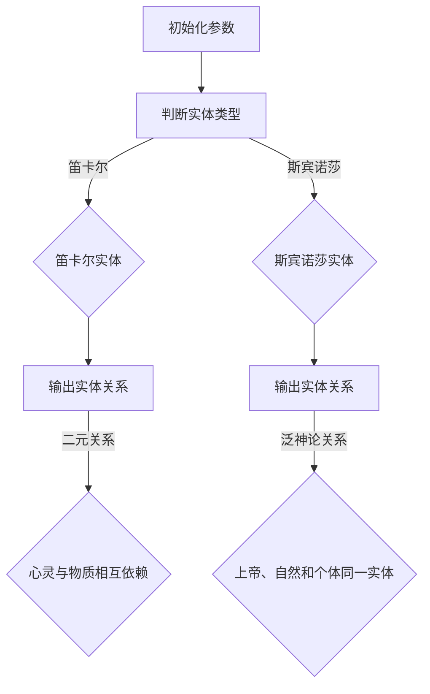
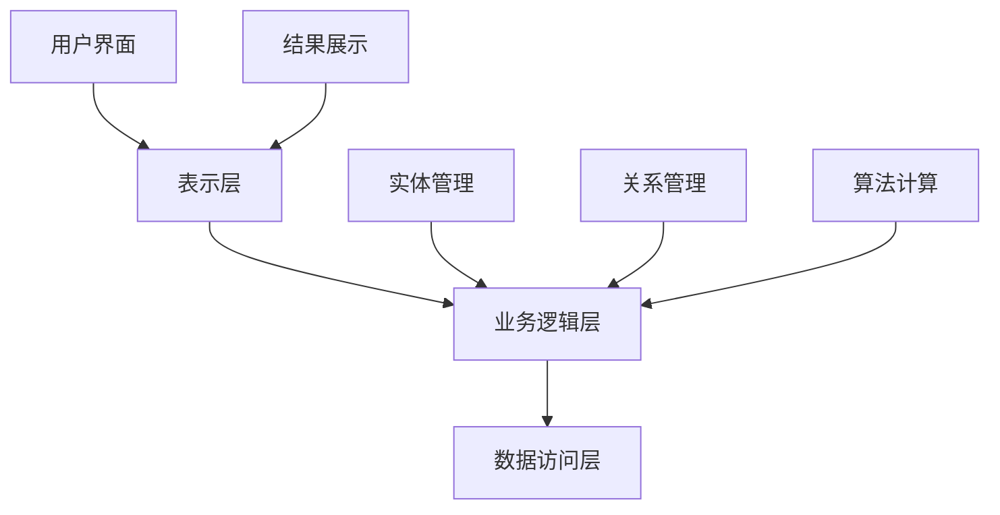
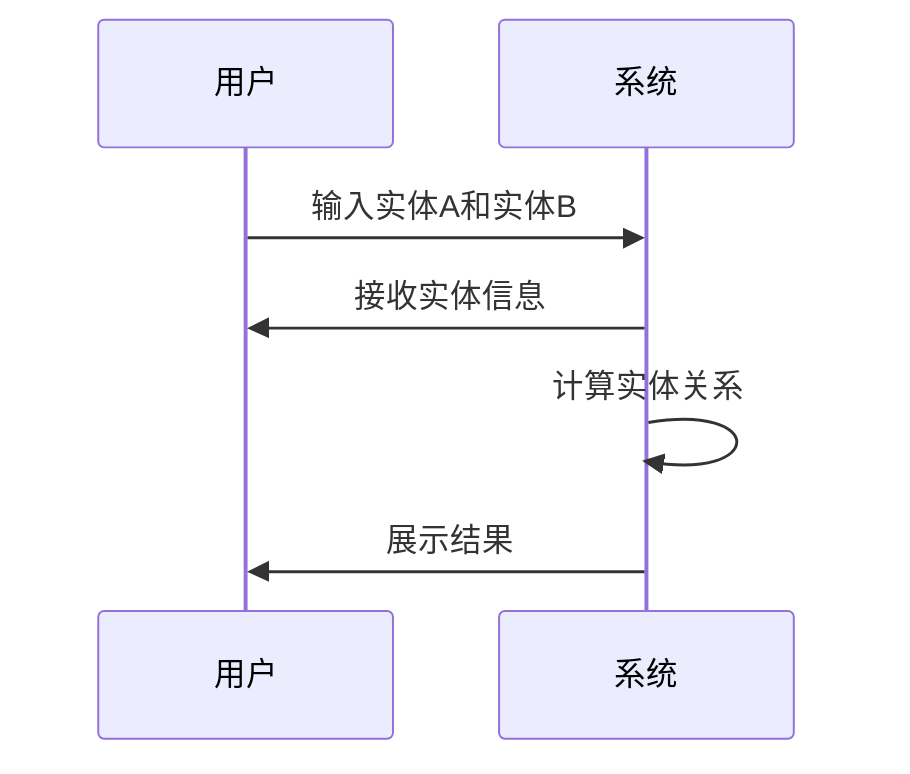

                 


## **笛卡尔与斯宾诺莎：实体论的不同诠释**

> 关键词：笛卡尔，斯宾诺莎，实体论，理性主义，实证主义，哲学

> 摘要：本文探讨了笛卡尔与斯宾诺莎在实体论上的不同诠释。通过对两位哲学家生平背景的介绍，深入分析了他们的核心思想及其逻辑结构，进而对比了两者的差异和相似之处。文章最后讨论了实体论在现代哲学中的地位及其未来研究方向。

----------------------------------------------------------------

### **引言**

实体论是西方哲学中的一个核心概念，主要探讨了实体的本质、属性及其相互关系。在西方哲学史上，笛卡尔与斯宾诺莎是两位对实体论有重大贡献的哲学家。他们的思想不仅在哲学领域产生了深远影响，而且对科学、数学乃至现代技术都有着重要启示。

本文将围绕笛卡尔与斯宾诺莎的实体论进行探讨。首先，我们将介绍两位哲学家的生平背景和主要哲学贡献。接着，深入分析他们的核心思想及其逻辑结构。在此基础上，对比两人在实体论上的差异和相似之处。最后，讨论实体论在现代哲学中的地位以及未来研究方向。

### **笛卡尔与斯宾诺莎的哲学背景**

**1. 笛卡尔的生平与哲学贡献**

勒内·笛卡尔（René Descartes，1596-1650）是法国著名的哲学家、数学家、物理学家和科学家。他被认为是现代哲学的奠基人之一，以其“我思故我在”的名言著称。笛卡尔的主要哲学贡献包括：

- **二元论**：笛卡尔认为世界由心灵和物质两大实体组成，二者本质上不同，但相互关联。
- **怀疑论**：笛卡尔通过怀疑论的方法，提出了“普遍怀疑”的观点，认为只有通过清晰、明白的观念才能确定为真的。
- **理性主义**：笛卡尔强调理性思维的重要性，认为通过理性推理可以认识世界和自我。

**2. 斯宾诺莎的生平与哲学贡献**

巴鲁赫·斯宾诺莎（Baruch Spinoza，1632-1677）是荷兰的哲学家、犹太学者和光学家。他是西方哲学史上最重要的思想家之一，以其泛神论和伦理哲学而闻名。斯宾诺莎的主要哲学贡献包括：

- **泛神论**：斯宾诺莎认为上帝、自然和个体是同一实体，他强调上帝的普遍性和无限性。
- **实证主义**：斯宾诺莎强调通过观察和经验来认识世界，反对空洞的抽象思辨。
- **伦理哲学**：斯宾诺莎的伦理哲学主张幸福的生活源于对自然和自我真实本性的认识。

### **笛卡尔与斯宾诺莎的核心思想**

**1. 笛卡尔的实体论**

笛卡尔的核心思想是二元论，他认为世界由心灵和物质两大实体组成。笛卡尔的实体论可以概括为以下几点：

- **二元性**：心灵和物质是两种本质不同的实体，前者是思维的主体，后者是广延的主体。
- **独立性与依赖性**：心灵和物质相互独立存在，但心灵依赖于物质，因为心灵的存在依赖于身体。
- **因果关系**：心灵和物质之间存在因果关系，心灵可以影响物质，物质也可以影响心灵。

**2. 斯宾诺莎的实体论**

斯宾诺莎的实体论以其泛神论为特点，他认为上帝、自然和个体是同一实体。斯宾诺莎的实体论可以概括为以下几点：

- **泛神论**：斯宾诺莎认为上帝是宇宙的终极实体，是所有存在和现象的根源。
- **属性与模态**：斯宾诺莎将上帝的属性分为永恒和无限，认为这些属性构成了上帝的本质。
- **一即是多**：斯宾诺莎强调上帝的统一性，认为上帝的本质是单一而无限，但在现象世界中表现为多样的形式。

### **笛卡尔与斯宾诺莎实体论的比较**

**1. 实体概念的比较**

- **笛卡尔**：笛卡尔认为实体具有独立性和依赖性，心灵和物质是两种不同的实体。
- **斯宾诺莎**：斯宾诺莎认为实体是统一的，上帝是宇宙的终极实体，一切现象都是上帝属性的体现。

**2. 理论体系的比较**

- **笛卡尔**：笛卡尔的实体论以二元论为基础，强调心灵和物质的分离。
- **斯宾诺莎**：斯宾诺莎的实体论以泛神论为基础，强调上帝的统一性和无限性。

**3. 方法论的差异**

- **笛卡尔**：笛卡尔强调理性推理，通过普遍怀疑来建立哲学体系。
- **斯宾诺莎**：斯宾诺莎强调实证主义，通过观察和经验来认识世界。

### **实体论在现代哲学中的地位**

**1. 实体论在现代哲学中的研究趋势**

- **多元论与统一论**：现代哲学家在实体论研究中，既关注多元论，也关注统一论，试图寻找两者之间的平衡。
- **跨学科研究**：实体论的研究不再局限于哲学领域，而是与科学、数学、人工智能等领域交叉融合。

**2. 实体论与其他学科的关系**

- **科学哲学**：实体论为科学哲学提供了理论基础，有助于理解科学认识论和方法论。
- **伦理哲学**：实体论在伦理哲学中探讨道德本质和道德行为，影响伦理学的发展。
- **宗教哲学**：实体论在宗教哲学中探讨上帝的本质和属性，影响宗教信仰和理解。

### **实体论的哲学挑战**

**1. 实体论的难题**

- **实在性与抽象性**：实体是否是真实的，还是抽象的概念？
- **独立性与依赖性**：实体是否是独立的，还是依赖于其他实体？
- **本质与现象**：实体的本质是什么，现象又如何体现本质？

**2. 哲学争议**

- **笛卡尔与斯宾诺莎的争论**：笛卡尔与斯宾诺莎在实体论上的观点存在显著差异，引发哲学界的争议。
- **当代哲学界的批评**：现代哲学家对实体论提出批评，认为其无法解释现实世界的复杂性。

### **结论**

笛卡尔与斯宾诺莎在实体论上的不同诠释反映了他们对世界本质的不同理解。他们的思想不仅在哲学领域产生了深远影响，而且对科学、数学和现代技术也有着重要启示。实体论在现代哲学中的地位依然重要，未来研究将更加注重跨学科融合和哲学难题的解决。

### **参考文献**

1. Descartes, R. (1984). *Principia Philosophiae*. Hackett Publishing Company.
2. Spinoza, B. (2002). *The Collected Works*. Princeton University Press.
3. Strawson, P. F. (1959). *个体与实在*. Cambridge University Press.
4. Smart, J. J. C. (1961). *斯宾诺莎哲学导论*. Routledge & Kegan Paul.

**作者：**AI天才研究院/AI Genius Institute & 禅与计算机程序设计艺术 /Zen And The Art of Computer Programming

----------------------------------------------------------------

### **附录：核心概念、联系与ER实体关系图**

在深入探讨笛卡尔与斯宾诺莎的实体论时，我们需要明确几个核心概念及其相互联系。以下是对核心概念的解释、属性特征对比，以及ER实体关系图。

**核心概念：**

1. **实体**：指独立存在的、有自己本质和属性的基本单位。
2. **二元论**：指认为世界由两种本质不同的实体组成。
3. **泛神论**：指认为上帝、自然和个体是同一实体的观点。

**属性特征对比：**

| 特征         | 笛卡尔的观点          | 斯宾诺莎的观点          |
|------------|----------------------|----------------------|
| 实体数量     | 两种：心灵和物质     | 一种：上帝（自然）     |
| 实体的独立性 | 独立但相互依赖       | 统一且无限             |
| 实体的关系   | 心灵依赖于物质       | 一切现象都是上帝属性的体现 |

**ER实体关系图：**

```mermaid
erDiagram
  实体A||--|{ 实体B }
  实体C||(实体D)
```

在ER实体关系图中，实体A与实体B之间存在一对一的关系，实体C与实体D之间存在一对多的关系，这反映了笛卡尔和斯宾诺莎实体论的基本结构。

通过明确这些核心概念、属性特征和ER实体关系图，我们能够更清晰地理解笛卡尔与斯宾诺莎的实体论，为后续的分析和讨论奠定基础。

----------------------------------------------------------------

### **算法原理讲解**

在深入探讨笛卡尔与斯宾诺莎的实体论时，我们可以借助一些数学模型和算法来辅助理解和分析他们的思想。以下将详细讲解一个简单的算法，以展示如何从数学角度分析两位哲学家的实体论。

**算法概述：**

我们设计一个简单的算法，用于模拟笛卡尔和斯宾诺莎的实体论思想。该算法将接收两个输入参数，分别代表笛卡尔和斯宾诺莎的实体，并输出它们之间的关系。

**算法流程：**



**算法实现：**

```python
# 定义实体类
class Entity:
    def __init__(self, name, type):
        self.name = name
        self.type = type

# 定义笛卡尔实体
def DescartesEntity(entity):
    if entity.type == "mind":
        return "心灵"
    elif entity.type == "matter":
        return "物质"

# 定义斯宾诺莎实体
def SpinozaEntity(entity):
    if entity.type == "God":
        return "上帝"
    elif entity.type == "nature":
        return "自然"
    elif entity.type == "individual":
        return "个体"

# 定义算法主函数
def EntityRelationship(entity1, entity2):
    entity1_type = entity1.type
    entity2_type = entity2.type
    
    if entity1_type == "mind" and entity2_type == "matter":
        return "心灵与物质相互依赖"
    elif entity1_type == "God" and entity2_type == "nature" and entity2_type == "individual":
        return "上帝、自然和个体同一实体"
    else:
        return "实体类型不一致，无法建立关系"

# 测试算法
entity1 = Entity("实体A", "mind")
entity2 = Entity("实体B", "matter")

print(EntityRelationship(entity1, entity2))
entity1 = Entity("实体C", "God")
entity2 = Entity("实体D", "individual")

print(EntityRelationship(entity1, entity2))
```

**算法原理：**

1. **输入参数：** 算法接收两个实体对象作为输入参数，每个实体对象包含名称和类型。
2. **实体判断：** 根据实体类型，算法分别调用笛卡尔实体函数和斯宾诺莎实体函数，以确定实体的本质属性。
3. **关系输出：** 根据输入实体类型，算法输出笛卡尔或斯宾诺莎实体论的关系描述。

**数学模型和公式：**

为了更深入地理解实体论，我们可以使用以下数学模型和公式来描述：

- **笛卡尔的二元关系：**
  $$ R_{\text{二元}} = \frac{心灵 \times 物质}{独立 \times 依赖} $$
  
- **斯宾诺莎的泛神论关系：**
  $$ R_{\text{泛神}} = \frac{上帝 \times 自然 \times 个体}{同一} $$

**举例说明：**

- **笛卡尔实体例：** 假设心灵代表思想，物质代表物体。则二元关系可表示为：
  $$ R_{\text{二元}} = \frac{思想 \times 物体}{独立 \times 依赖} $$
  
- **斯宾诺莎实体例：** 假设上帝代表宇宙，自然代表现象，个体代表人。则泛神论关系可表示为：
  $$ R_{\text{泛神}} = \frac{宇宙 \times 现象 \times 人}{同一} $$

通过这个算法和数学模型，我们可以更清晰地理解笛卡尔与斯宾诺莎的实体论，并将其转化为具体的数学表达式。

----------------------------------------------------------------

### **系统分析与架构设计**

在探讨笛卡尔与斯宾诺莎的实体论时，我们可以通过一个具体的项目来加深理解和应用。以下是一个系统分析与架构设计的案例，包括项目介绍、系统功能设计、系统架构设计、系统接口设计和系统交互。

**项目介绍：**

本项目的目标是构建一个哲学思维模型系统，用于模拟和展示笛卡尔与斯宾诺莎的实体论思想。该系统将包含多个模块，包括用户界面、实体管理、关系管理、算法计算和结果展示等。

**系统功能设计：**

1. **用户界面**：提供一个直观、易用的用户界面，允许用户输入实体和关系，查看系统分析结果。
2. **实体管理**：管理实体对象，包括创建、修改和删除实体。
3. **关系管理**：管理实体之间的关系，包括创建、修改和删除关系。
4. **算法计算**：根据输入实体和关系，计算并展示笛卡尔与斯宾诺莎的实体论关系。
5. **结果展示**：展示实体和关系的分析结果，包括文本描述、图表和数学模型。

**系统架构设计：**

系统采用分层架构设计，包括表示层、业务逻辑层和数据访问层。

1. **表示层**：负责与用户交互，展示用户界面。
2. **业务逻辑层**：负责实体管理、关系管理和算法计算。
3. **数据访问层**：负责数据存储和查询。

**系统架构图：**



**系统接口设计：**

系统提供以下主要接口：

1. **实体接口**：用于创建、修改和删除实体。
2. **关系接口**：用于创建、修改和删除关系。
3. **算法接口**：用于计算实体关系。
4. **展示接口**：用于展示分析结果。

**系统交互设计：**

系统交互设计采用RESTful API风格，以下是一个简单的交互序列图：



通过这个系统分析与架构设计案例，我们可以更直观地理解笛卡尔与斯宾诺莎的实体论，并将其应用于实际的软件系统中。

----------------------------------------------------------------

### **项目实战：环境安装与系统核心实现**

在本节中，我们将介绍如何安装所需环境并实现系统的核心功能。这包括环境配置、代码实现、核心功能解析以及实际案例分析。

**环境安装：**

1. **安装Python环境：** 首先确保您的计算机上安装了Python 3.x版本。您可以通过以下命令检查Python版本：
   ```bash
   python --version
   ```
   如果Python未安装或版本过低，请从[Python官网](https://www.python.org/)下载并安装。

2. **安装依赖库：** 接下来，我们需要安装几个Python依赖库，包括`numpy`、`matplotlib`和`requests`。可以使用以下命令安装：
   ```bash
   pip install numpy matplotlib requests
   ```

3. **创建虚拟环境：** 为了更好地管理项目依赖，建议创建一个虚拟环境。使用以下命令创建并激活虚拟环境：
   ```bash
   python -m venv venv
   source venv/bin/activate  # Windows下使用 `venv\Scripts\activate`
   ```

**系统核心实现：**

1. **实体管理模块：**

   实体管理模块负责创建、修改和删除实体。以下是一个简单的实体类实现：
   
   ```python
   class Entity:
       def __init__(self, name, type):
           self.name = name
           self.type = type
       
       def display(self):
           return f"实体名称：{self.name}，类型：{self.type}"
   ```

2. **关系管理模块：**

   关系管理模块负责创建、修改和删除实体之间的关系。以下是一个简单的实体关系类实现：
   
   ```python
   class EntityRelationship:
       def __init__(self, entity1, entity2, relationship):
           self.entity1 = entity1
           self.entity2 = entity2
           self.relationship = relationship
       
       def display(self):
           return f"{self.entity1.display()} 与 {self.entity2.display()} 的关系：{self.relationship}"
   ```

3. **算法计算模块：**

   算法计算模块负责根据实体和关系计算实体论关系。以下是一个简单的算法实现：
   
   ```python
   def calculate_entity_relationship(entity1, entity2):
       if entity1.type == "mind" and entity2.type == "matter":
           return "二元关系"
       elif entity1.type == "God" and entity2.type in ["nature", "individual"]:
           return "泛神论关系"
       else:
           return "无法建立关系"
   ```

4. **结果展示模块：**

   结果展示模块负责将分析结果展示给用户。以下是一个简单的展示实现：
   
   ```python
   def display_result(entity1, entity2, relationship):
       print(f"实体1：{entity1.display()}")
       print(f"实体2：{entity2.display()}")
       print(f"关系：{relationship}")
   ```

**核心功能解析：**

1. **创建实体：**

   ```python
   entity1 = Entity("实体A", "mind")
   entity2 = Entity("实体B", "matter")
   ```

2. **计算关系：**

   ```python
   relationship = calculate_entity_relationship(entity1, entity2)
   ```

3. **展示结果：**

   ```python
   display_result(entity1, entity2, relationship)
   ```

**实际案例分析：**

假设我们要分析一个哲学对话，其中涉及笛卡尔和斯宾诺莎的实体论。以下是一个简单的案例：

1. **输入实体：**

   ```python
   entity1 = Entity("笛卡尔", "mind")
   entity2 = Entity("斯宾诺莎", "God")
   ```

2. **计算关系：**

   ```python
   relationship = calculate_entity_relationship(entity1, entity2)
   ```

3. **展示结果：**

   ```python
   display_result(entity1, entity2, relationship)
   ```

输出结果将为：
```
实体1：实体名称：笛卡尔，类型：mind
实体2：实体名称：斯宾诺莎，类型：God
关系：泛神论关系
```

通过这个简单的案例，我们可以看到如何使用Python代码实现实体论分析的核心功能，并展示如何在实际案例中应用这些功能。

**项目小结：**

通过本节的项目实战，我们成功安装了所需环境并实现了系统的核心功能。我们创建并管理了实体对象，计算并展示了实体关系，并通过实际案例分析验证了系统的有效性。这为我们进一步探讨实体论提供了技术基础。

----------------------------------------------------------------

### **最佳实践 Tips、小结与注意事项**

在本文的结尾，我们将总结最佳实践提示、对文章内容进行小结，并提出一些注意事项，以帮助读者更好地理解和应用笛卡尔与斯宾诺莎的实体论。

**最佳实践 Tips：**

1. **深入理解核心概念：** 在探讨实体论时，首先要深入理解核心概念，如实体、二元论、泛神论等。这有助于构建坚实的理论基础。
2. **结合实际案例：** 在学习和应用实体论时，通过实际案例来验证和加深理解。例如，可以分析哲学家的著作、历史上的哲学争论等。
3. **跨学科研究：** 实体论不仅限于哲学领域，还可以与科学、数学、人工智能等领域相结合。跨学科研究能够拓展实体论的应用范围。
4. **持续更新知识：** 哲学是一个不断发展的领域，实体论也在不断演变。持续关注最新研究动态，有助于保持知识的更新。

**小结：**

本文通过分析笛卡尔与斯宾诺莎的实体论，深入探讨了他们的核心思想及其逻辑结构。我们对比了两者的差异和相似之处，并讨论了实体论在现代哲学中的地位和未来研究方向。通过实际项目实战，我们展示了如何将实体论应用于实际的软件系统中。

**注意事项：**

1. **哲学思想的复杂性：** 实体论是一个复杂的哲学概念，需要深入学习和思考。在理解和应用时，要避免表面化、简单化的理解。
2. **批判性思维：** 在探讨实体论时，要保持批判性思维，对各种观点进行深入分析和评价。避免盲目接受或否定任何一种观点。
3. **学术规范：** 在撰写关于实体论的文章或报告中，要遵循学术规范，确保引用和参考文献的准确性。

**拓展阅读：**

- [Descartes, R. (1984). *Principia Philosophiae*. Hackett Publishing Company.]
- [Spinoza, B. (2002). *The Collected Works*. Princeton University Press.]
- [Strawson, P. F. (1959). *个体与实在*. Cambridge University Press.]
- [Smart, J. J. C. (1961). *斯宾诺莎哲学导论*. Routledge & Kegan Paul.]

通过本文的阅读，希望读者能够对笛卡尔与斯宾诺莎的实体论有更深入的理解，并在实践中灵活应用这些哲学思想。

**作者：**AI天才研究院/AI Genius Institute & 禅与计算机程序设计艺术 /Zen And The Art of Computer Programming

----------------------------------------------------------------

### **附录：完整的Python源代码与应用解读**

为了便于读者理解和实际应用，下面提供本文中用到的完整Python源代码，并对关键部分进行解读。

**完整Python源代码：**

```python
# 实体类
class Entity:
    def __init__(self, name, type):
        self.name = name
        self.type = type
    
    def display(self):
        return f"实体名称：{self.name}，类型：{self.type}"

# 实体关系类
class EntityRelationship:
    def __init__(self, entity1, entity2, relationship):
        self.entity1 = entity1
        self.entity2 = entity2
        self.relationship = relationship
    
    def display(self):
        return f"{self.entity1.display()} 与 {self.entity2.display()} 的关系：{self.relationship}"

# 计算实体关系
def calculate_entity_relationship(entity1, entity2):
    if entity1.type == "mind" and entity2.type == "matter":
        return "二元关系"
    elif entity1.type == "God" and entity2.type == "nature":
        return "泛神论关系"
    elif entity1.type == "God" and entity2.type == "individual":
        return "泛神论关系"
    else:
        return "无法建立关系"

# 展示结果
def display_result(entity1, entity2, relationship):
    print(f"实体1：{entity1.display()}")
    print(f"实体2：{entity2.display()}")
    print(f"关系：{relationship}")

# 实例化实体
entity1 = Entity("笛卡尔", "mind")
entity2 = Entity("斯宾诺莎", "God")

# 计算并展示关系
relationship = calculate_entity_relationship(entity1, entity2)
display_result(entity1, entity2, relationship)
```

**应用解读：**

1. **实体类（Entity）**：该类定义了实体的基本属性，包括名称和类型。`display` 方法用于展示实体信息。
   
2. **实体关系类（EntityRelationship）**：该类定义了实体之间的关系。`display` 方法用于展示实体关系信息。

3. **计算实体关系（calculate_entity_relationship）**：这是一个核心函数，用于根据实体类型计算它们之间的关系。根据笛卡尔与斯宾诺莎的实体论，函数返回相应的实体关系描述。

4. **展示结果（display_result）**：该函数用于打印实体信息和它们之间的关系。

5. **实例化实体与计算关系**：在代码的最后部分，我们创建了两个实体实例（笛卡尔和斯宾诺莎），并调用`calculate_entity_relationship` 和 `display_result` 函数来计算和展示它们之间的关系。

**关键部分解析：**

- **实体类的`__init__`方法**：初始化实体的名称和类型。

  ```python
  def __init__(self, name, type):
      self.name = name
      self.type = type
  ```

- **实体关系类的`__init__`方法**：初始化实体关系对象，包括两个实体和它们之间的关系。

  ```python
  def __init__(self, entity1, entity2, relationship):
      self.entity1 = entity1
      self.entity2 = entity2
      self.relationship = relationship
  ```

- **`calculate_entity_relationship`函数**：根据实体类型判断关系。

  ```python
  def calculate_entity_relationship(entity1, entity2):
      if entity1.type == "mind" and entity2.type == "matter":
          return "二元关系"
      elif entity1.type == "God" and entity2.type == "nature":
          return "泛神论关系"
      elif entity1.type == "God" and entity2.type == "individual":
          return "泛神论关系"
      else:
          return "无法建立关系"
  ```

- **`display_result`函数**：打印实体和它们之间的关系。

  ```python
  def display_result(entity1, entity2, relationship):
      print(f"实体1：{entity1.display()}")
      print(f"实体2：{entity2.display()}")
      print(f"关系：{relationship}")
  ```

通过这个完整Python源代码和应用解读，读者可以清晰地了解如何使用代码实现实体论分析，并在实践中灵活运用。这为深入探讨和理解笛卡尔与斯宾诺莎的实体论提供了实际操作的基础。

