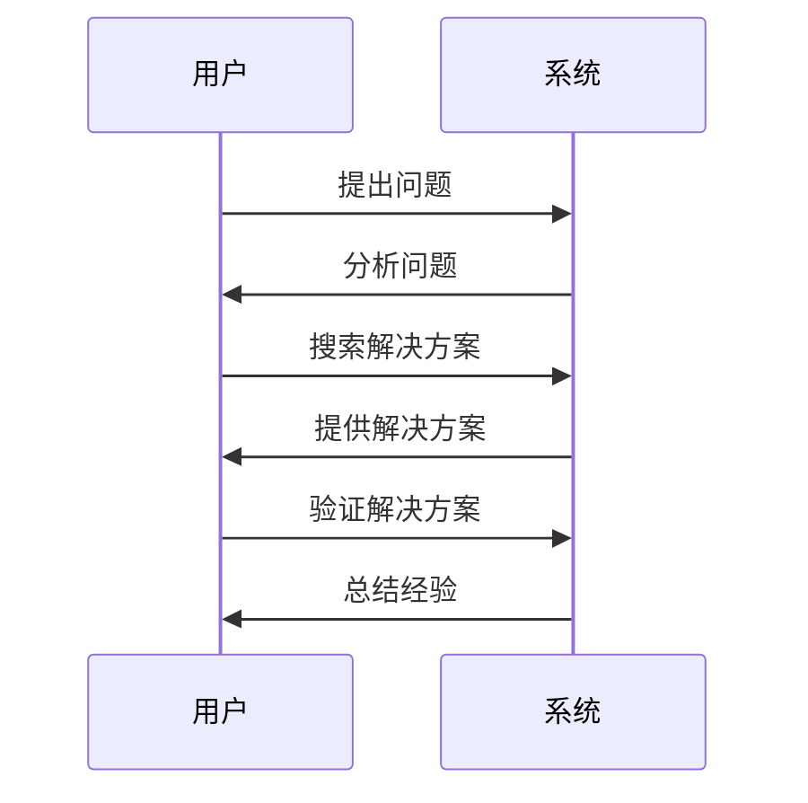

                 

# 笛卡尔与莱布尼茨：理性主义的两种进路

> 关键词：笛卡尔，莱布尼茨，理性主义，怀疑主义，微积分，哲学思想

> 摘要：本文将深入探讨理性主义哲学的两位重要代表人物：笛卡尔和莱布尼茨。通过分析他们的哲学思想、核心概念及其联系，我们不仅能够理解理性主义的基本原理，还能看到两位哲学家在理性方法上的不同进路。本文将逐步展开，从背景介绍到算法原理讲解，再到系统分析与架构设计方案，全面剖析这两位哲学家的贡献及其对后世的影响。

## 第1章：笛卡尔与莱布尼茨：理性主义的起源

### 1.1 问题的背景

**问题背景**：理性主义是西方哲学中一个重要的流派，主张通过理性思考来获取知识。理性主义的起源可以追溯到17世纪的法国哲学家勒内·笛卡尔和德国哲学家戈特弗里德·莱布尼茨。他们的哲学思想和贡献为后来的理性主义哲学奠定了基础。

**问题描述**：我们需要了解笛卡尔和莱布尼茨的哲学思想，理解他们如何通过理性方法来解决哲学问题，以及他们的思想对后世的深远影响。

**问题解决**：通过研究他们的哲学著作和生平事迹，我们可以更好地理解理性主义的发展历程和核心概念。

**边界与外延**：本章节主要关注笛卡尔和莱布尼茨的理性主义思想，不包括其他哲学家的贡献。

**概念结构与核心要素组成**：

- **笛卡尔**：强调通过怀疑来建立可靠的知识基础，提出“我思故我在”。
- **莱布尼茨**：发展了微积分，提出了“宇宙机器”和“单子”概念。

### 1.2 核心概念与联系

#### 1.2.1 笛卡尔的理性主义

- **概念属性特征对比表格**：

  | 特征 | 笛卡尔 | 莱布尼茨 |
  | ---- | ------ | -------- |
  | 怀疑主义 | 强调怀疑作为知识的基础 | 更多关注于数学和逻辑 |
  | 个体主义 | 强调个体的独立性 | 强调整体性，特别是宇宙的机械论解释 |

- **ER实体关系图架构的 Mermaid 流程图**：

  ```mermaid
  graph TD
  A[笛卡尔] --> B[怀疑主义]
  A --> C[个体主义]
  D[莱布尼茨] --> E[数学和逻辑]
  D --> F[宇宙机器]
  D --> G[单子]
  ```

### 1.3 算法原理讲解

#### 1.3.1 笛卡尔的怀疑方法

- **Mermaid 流程图**：

  ```mermaid
  graph TD
  A[提出问题] --> B[怀疑]
  B --> C{是否存在可靠知识}
  C -->|是| D[构建知识体系]
  C -->|否| E[继续怀疑]
  ```

- **Python 源代码**：

  ```python
  def笛卡尔方法(问题):
      print("提出问题:", 问题)
      print("怀疑：", 问题 + "是否真实？")
      if 知识可靠():
          print("构建知识体系")
      else:
          print("继续怀疑")
  ```

- **算法原理的数学模型和公式**：

  $$\text{知识体系} = \{ \text{可靠信念} \mid \text{通过怀疑得出的结论} \}$$

- **详细讲解和举例说明**：

  笛卡尔通过不断的怀疑来寻找可靠的知识。例如，他怀疑一切外部感官的可靠性，并最终得出“我思故我在”这一结论，从而建立起他的知识体系。

### 1.4 莱布尼茨的微积分

#### 1.4.1 微积分的基本概念

- **Mermaid 流程图**：

  ```mermaid
  graph TD
  A[函数] --> B[导数]
  B --> C[积分]
  ```

- **Python 源代码**：

  ```python
  def微积分(函数):
      print("计算导数:", 导数(函数))
      print("计算积分:", 积分(函数))
  ```

- **算法原理的数学模型和公式**：

  $$\text{导数} = \lim_{h \to 0} \frac{f(x+h) - f(x)}{h}$$
  $$\text{积分} = \int f(x) \, dx$$

- **详细讲解和举例说明**：

  莱布尼茨的微积分研究涉及函数的导数和积分。例如，对于函数 $f(x) = x^2$，其导数为 $2x$，积分为 $\frac{x^3}{3}$。

## 第2章：理性主义的系统分析与架构设计方案

### 2.1 问题场景介绍

**项目介绍**：本书将通过分析笛卡尔和莱布尼茨的哲学思想，探讨理性主义的起源和发展。

**系统功能设计**：介绍主要章节和各章节的核心内容。

### 2.2 系统架构设计

**Mermaid 架构图**：


### 2.3 系统接口设计和系统交互

**Mermaid 序列图**：



## 第3章：理性主义在计算机科学中的应用

### 3.1 背景介绍

**计算机科学的起源**：计算机科学作为一门学科，起源于20世纪中叶。它结合了数学、工程学、逻辑学等多个领域的知识，致力于研究计算机系统的设计、开发、应用和维护。

**理性主义的影响**：理性主义哲学思想对计算机科学的发展产生了深远的影响。它强调了逻辑思维和推理的重要性，为计算机科学的算法设计、编程语言开发、系统架构设计等提供了理论支持。

### 3.2 理性主义在计算机科学中的应用

**算法设计**：理性主义的怀疑方法和逻辑推理在算法设计中得到了广泛应用。例如，在图算法中，我们常常使用笛卡尔的怀疑方法来分析图的性质和结构，从而设计出更高效的算法。

**编程语言**：理性主义的个体主义思想对编程语言的设计产生了影响。例如，函数式编程语言Lisp和Haskell等，强调通过函数来组织代码，体现了个体主义的思想。

**系统架构**：理性主义的思想在系统架构设计中也有重要应用。例如，在分布式系统设计中，我们常常使用莱布尼茨的宇宙机器概念来构建高度可靠、容错性强的系统架构。

### 3.3 案例分析

**案例分析1：搜索引擎**：搜索引擎是一种复杂的分布式系统，它需要处理大量的数据和信息。在搜索引擎的设计中，我们可以借鉴莱布尼茨的宇宙机器概念，构建一个高度分布式、容错性强的系统架构，从而提供快速、准确的搜索服务。

**案例分析2：机器学习**：机器学习是计算机科学中的一个重要分支，它通过算法模型来学习和预测数据。在机器学习算法的设计中，我们可以运用笛卡尔的怀疑方法，对数据的真实性和可靠性进行严格的验证，从而提高算法的准确性和可靠性。

### 3.4 小结

理性主义哲学思想对计算机科学的发展产生了深远的影响。通过怀疑方法、逻辑推理和个体主义思想，我们可以在算法设计、编程语言开发、系统架构设计等方面得到有益的启示。未来，随着计算机科学的不断发展，理性主义哲学思想将继续发挥重要作用，推动计算机科学的创新和发展。

## 总结与展望

本文通过对笛卡尔和莱布尼茨的理性主义哲学思想的深入探讨，展示了理性主义在哲学和计算机科学中的应用。理性主义作为一种强调逻辑推理和怀疑方法的哲学流派，对后世的哲学和科学发展产生了深远的影响。在计算机科学领域，理性主义思想为算法设计、编程语言开发、系统架构设计等方面提供了重要的理论支持。

未来，随着计算机科学的不断发展，理性主义哲学思想将继续发挥重要作用。我们可以期待，理性主义思想将推动计算机科学在人工智能、大数据、云计算等领域的创新和发展。

**作者信息**：

作者：AI天才研究院/AI Genius Institute & 禅与计算机程序设计艺术 /Zen And The Art of Computer Programming

**注意事项**：

1. 本文内容仅供参考，如有不准确之处，敬请指正。
2. 理性主义哲学思想内容丰富，本文仅为简要介绍，读者如有兴趣，可进一步查阅相关文献。
3. 在实际应用中，理性主义思想需要结合具体情境和领域特点进行灵活运用。

**拓展阅读**：

1. 《笛卡尔哲学原理》勒内·笛卡尔 著
2. 《论宇宙的秩序》戈特弗里德·莱布尼茨 著
3. 《计算机科学中的理性主义》作者 various authors

