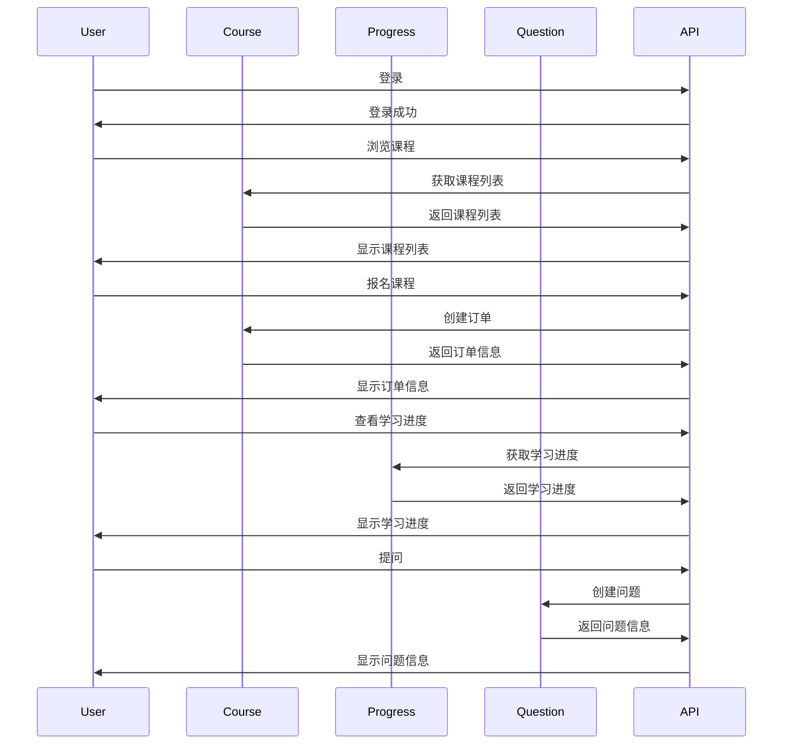
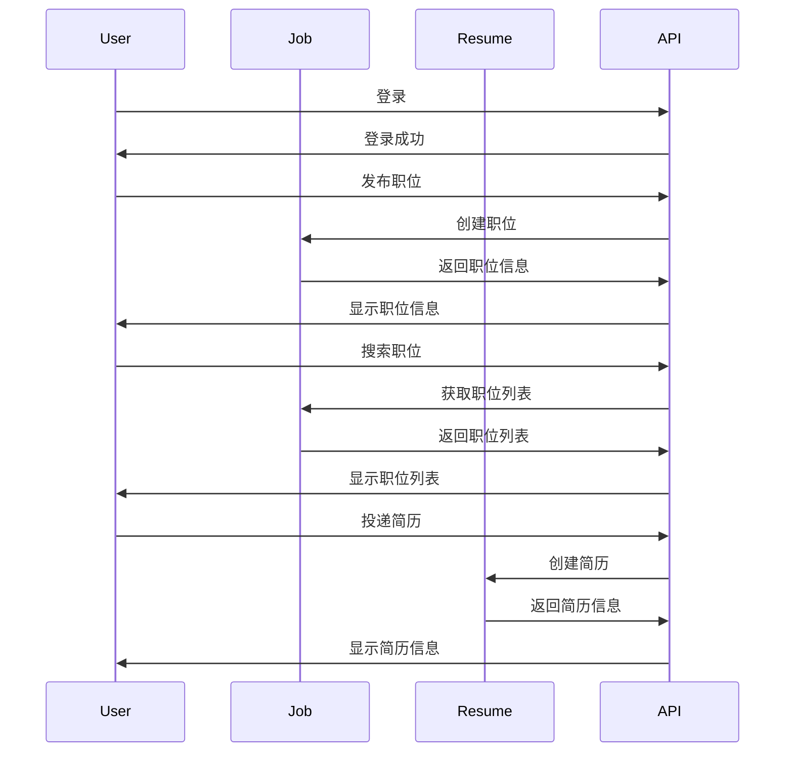

                 

### 笛卡尔的二元论概述

**1.1 笛卡尔二元论的历史背景**

笛卡尔（René Descartes），法国哲学家、数学家、物理学家和解析几何的奠基人，是17世纪欧洲理性主义哲学的先驱。他被誉为“近代哲学之父”，其著作《方法谈》和《第一哲学沉思集》对后世哲学、科学和数学产生了深远的影响。笛卡尔二元论是其哲学思想的核心，他认为世界由心灵（精神）和物质（身体）两个完全不同的实体组成，这两个实体在本质上是相互独立的。

**1.2 笛卡尔二元论的核心概念**

笛卡尔二元论主要包括以下几个核心概念：

- **心灵**：心灵是意识的主体，具有感知、思考、意愿等能力。笛卡尔认为心灵是纯粹的精神实体，不受物质世界的限制，能够独立存在。

- **物质**：物质是构成物理世界的实体，具有形状、位置、运动等属性。笛卡尔认为物质是广延的，可以在空间中占据位置，但无法进行自我运动。

- **交互作用**：笛卡尔认为心灵和物质之间存在某种交互作用，但这种作用是间接的，通过上帝的干预来实现。他认为上帝是连接心灵和物质的中介，使二者能够相互作用。

**1.3 笛卡尔二元论的影响**

笛卡尔二元论对后世哲学、科学和数学产生了深远的影响：

- **哲学**：笛卡尔二元论为后来的唯心主义、唯物主义和存在主义等哲学流派提供了理论基础。

- **科学**：笛卡尔二元论促进了物理学和生物学的发展，使科学家能够更准确地研究物质世界的规律。

- **数学**：笛卡尔引入的解析几何为后来的数学分析奠定了基础，成为现代数学的重要分支。

在后续的章节中，我们将进一步探讨Model-View分离的概念，以及它与笛卡尔二元论之间的关系。这将有助于我们理解如何将这些哲学原理应用于软件架构设计，提高软件系统的可维护性和可扩展性。让我们继续深入探讨这些重要的概念。### Model-View分离的概念与历史

**2.1 Model-View分离的定义**

Model-View分离（Model-View Separation，简称MVC）是一种常见的软件架构设计模式，旨在将数据模型（Model）、视图（View）和用户界面（Controller）分离，以实现软件系统的模块化和可维护性。具体来说，Model负责处理数据的存储和操作，View负责呈现数据，而Controller负责处理用户输入和视图之间的交互。

**2.2 Model-View分离的发展历程**

Model-View分离的概念最早可以追溯到1970年代的Smalltalk语言，由Smalltalk的开发者Larry Constantine和Ward Cunningham提出。此后，MVC模式逐渐被其他编程语言和框架所采纳，如Java的Struts框架、Ruby on Rails、Python的Django等。随着软件工程的不断发展和演化，Model-View分离模式逐渐成为了一种广泛应用的软件架构设计原则。

**2.3 Model-View分离的重要性**

Model-View分离在软件架构设计中的重要性主要体现在以下几个方面：

- **模块化**：通过将数据模型、视图和控制器分离，可以有效地降低系统的复杂度，提高模块的可维护性。

- **可扩展性**：模块化设计使得系统可以在不改变现有模块的前提下，方便地添加新功能或修改现有功能。

- **重用性**：分离的模块可以独立开发、测试和部署，提高了代码的重用性。

- **测试性**：MVC模式使得单元测试和集成测试变得更加简单和高效，有助于提高软件的质量。

- **用户体验**：Model-View分离有助于提高用户界面的响应速度和交互性能，从而提升用户体验。

在下一章中，我们将进一步探讨Model-View分离与笛卡尔二元论之间的联系，并分析它们在软件架构设计中的应用。这将帮助我们更好地理解如何将这些哲学和设计原则应用于实际项目中，以构建高质量的软件系统。### 笛卡尔二元论与Model-View分离的比较

**3.1 概念属性特征对比表格**

| 概念          | 笛卡尔二元论                                     | Model-View分离                                     |
| ------------- | ---------------------------------------------- | ---------------------------------------------- |
| 核心          | 心灵和物质两个独立的实体                           | 数据模型、视图和控制器三个分离的组件                           |
| 目的          | 解释心灵和物质的关系及其交互                       | 提高软件系统的模块化和可维护性                           |
| 实现方法      | 通过哲学思考和科学实验                             | 通过编程语言和框架实现                             |
| 应用领域      | 哲学、科学、数学、心理学、计算机科学               | 软件开发、软件架构设计、界面设计                     |
| 关键特性      | 心灵具有主观性，物质具有客观性                     | Model负责数据，View负责界面，Controller负责交互 |
| 主要优势      | 强调个体意识和自由意志                             | 提高代码复用性，降低耦合度                           |
| 主要劣势      | 较为抽象，难以应用于具体问题                       | 可能导致过度设计，增加系统复杂度                     |

**3.2 ER实体关系图架构**

为了更好地理解笛卡尔二元论和Model-View分离的关系，我们可以通过ER（实体-关系）图来展示它们之间的架构关系。

```mermaid
erDiagram
  A[(心灵)] ||--|{ B[(物质)] }
  B ||--|{ C[(数据模型)] }
  C ||--|{ D[(视图)] }
  D ||--|{ E[(控制器)] }
```

在这个ER图中，心灵（A）和物质（B）是两个独立的实体，它们通过某种方式相互关联。数据模型（C）代表物质世界中的数据表示，视图（D）代表用户界面，控制器（E）负责处理用户输入和视图之间的交互。这个ER图展示了笛卡尔二元论和Model-View分离之间的关联性，表明它们都是关于分离和独立性的概念，尽管它们的应用领域和实现方法有所不同。

**3.3 笛卡尔二元论与Model-View分离的相互关系**

笛卡尔二元论和Model-View分离之间存在着一定的相似性和互补性。

- **相似性**：
  - 都强调分离和独立性：笛卡尔二元论认为心灵和物质是两个独立的实体，Model-View分离则将数据模型、视图和控制器分离。
  - 都关注模块化和可维护性：笛卡尔二元论通过将心灵和物质分离来降低哲学问题的复杂性，Model-View分离通过分离模型、视图和控制器来提高软件系统的可维护性。
  
- **互补性**：
  - 笛卡尔二元论提供了哲学和理论上的指导：它为软件架构设计提供了关于分离和独立性的哲学思考，有助于我们理解软件系统的本质。
  - Model-View分离提供了具体的实现方法：它通过编程语言和框架为软件架构设计提供了实用的解决方案，使分离和独立性原则得以在软件系统中得到应用。

在下一章中，我们将探讨笛卡尔二元论在软件架构设计中的应用，并分析如何将哲学原理转化为具体的软件架构设计方案。这将帮助我们更好地理解如何通过哲学思考来指导软件架构设计，提高软件系统的质量和可维护性。### 笛卡尔二元论在软件架构设计中的应用

**4.1 笛卡尔二元论在软件架构设计中的运用**

笛卡尔二元论的哲学思想在软件架构设计中有着广泛的应用。具体来说，它可以指导我们如何分离和独立地处理软件系统的不同组成部分，以提高系统的可维护性和可扩展性。以下是几种典型的应用场景：

**1. 分离逻辑与界面**

在软件架构设计中，我们可以借鉴笛卡尔的二元论，将系统的逻辑处理部分（心灵）与用户界面（物质）分离。这种分离有助于提高代码的可读性和可维护性，使得开发人员可以独立地修改和优化系统功能，而不影响用户界面。例如，在Web开发中，我们可以使用MVC模式来实现逻辑处理（Controller）和用户界面（View）的分离。

**2. 分离数据与处理**

在软件架构设计中，我们还可以将数据存储和处理部分（物质）分离。这种分离有助于提高系统的可扩展性，使得我们可以在不改变数据处理逻辑的情况下，方便地更换或升级数据存储系统。例如，在关系型数据库和NoSQL数据库之间进行切换时，只需修改数据访问层（Model）的代码，而不需要修改业务逻辑（Controller）和用户界面（View）。

**3. 分离核心功能与辅助功能**

在大型软件系统中，我们可以借鉴笛卡尔二元论，将核心功能（心灵）与辅助功能（物质）分离。这种分离有助于提高系统的模块化程度，使得开发人员可以独立地开发和优化各个模块。例如，在电子商务系统中，核心功能包括购物车、订单管理和支付等，而辅助功能包括广告、推荐系统和客服等。通过将核心功能与辅助功能分离，可以方便地增加或删除辅助功能，而不影响核心功能的稳定性。

**4. 应用案例研究**

为了更好地理解笛卡尔二元论在软件架构设计中的应用，我们可以通过一个实际案例来进行分析。

**案例：电商平台的订单管理系统**

在这个案例中，我们可以将订单管理系统的核心功能（心灵）与辅助功能（物质）进行分离。

- **核心功能（心灵）**：
  - 订单创建：处理用户提交的订单信息，生成订单记录。
  - 订单查询：提供订单查询接口，允许用户查询订单状态。
  - 订单修改：允许用户修改订单信息，如地址、联系方式等。
  - 订单删除：提供订单删除接口，允许用户删除订单。

- **辅助功能（物质）**：
  - 邮件通知：当订单状态发生变化时，发送邮件通知用户。
  - 短信通知：当订单状态发生变化时，发送短信通知用户。
  - 支付通知：当订单支付成功时，发送支付通知给用户。

通过将核心功能与辅助功能分离，我们可以方便地增加或删除通知方式，而不影响订单管理系统的核心功能。这种设计使得订单管理系统具有更好的可扩展性和可维护性。

在下一章中，我们将探讨Model-View分离在软件架构设计中的应用，并分析如何通过这种设计模式来提高软件系统的质量和用户体验。这将帮助我们更好地理解如何将哲学原理应用于实际软件架构设计，提高软件系统的质量。### Model-View分离在软件架构设计中的应用

**5.1 Model-View分离的具体实践**

Model-View分离（MVC）模式在软件架构设计中的应用广泛，尤其是在Web应用开发中。通过这种模式，我们可以将系统的逻辑、数据和用户界面分离，从而实现更好的模块化、可维护性和可扩展性。以下是一个简单的例子，展示如何在Web应用中实现Model-View分离。

**1. Model**

Model代表应用的数据模型，负责处理数据的存储和操作。在Python的Django框架中，Model通常对应数据库表，通过ORM（对象关系映射）实现数据的CRUD（创建、读取、更新、删除）操作。

**示例代码：**

```python
from django.db import models

class Order(models.Model):
    user = models.ForeignKey('auth.User', on_delete=models.CASCADE)
    status = models.CharField(max_length=20)
    total_price = models.DecimalField(max_digits=10, decimal_places=2)
    created_at = models.DateTimeField(auto_now_add=True)
    updated_at = models.DateTimeField(auto_now=True)
```

在这个例子中，`Order` 类定义了一个订单模型，包括用户、订单状态、总价和创建时间等字段。

**2. View**

View负责处理用户请求，渲染页面，并将用户输入传递给Model。在Django中，View通常是一个函数或类，处理HTTP请求，并调用适当的Model方法来操作数据。

**示例代码：**

```python
from django.shortcuts import render
from .models import Order

def order_create(request):
    if request.method == 'POST':
        # 处理订单创建
        order = Order.objects.create(
            user=request.user,
            status='pending',
            total_price=request.POST['total_price']
        )
        # 重定向到订单详情页面
        return redirect('order_detail', order_id=order.id)
    else:
        # 渲染订单创建页面
        return render(request, 'order_create.html')
```

在这个例子中，`order_create` 函数处理订单创建请求，通过调用 `Order.objects.create()` 方法创建订单，并重定向到订单详情页面。

**3. Controller**

Controller在MVC模式中通常由框架自动实现，它负责协调Model和View之间的交互。在Django中，Controller对应于URL路由和视图函数的映射。

**示例代码：**

```python
from django.urls import path
from .views import order_create

urlpatterns = [
    path('order/create/', order_create, name='order_create'),
]
```

在这个例子中，`order_create` 视图函数通过URL路径 `order/create/` 被访问。

**4. 应用案例研究**

为了更好地理解Model-View分离在实际项目中的应用，我们可以分析一个电子商务平台的项目案例。

**案例：电子商务平台的购物车功能**

在这个案例中，我们将购物车功能分解为Model、View和Controller三个部分。

- **Model**：购物车数据模型，包括用户、商品、数量等信息。

```python
class Cart(models.Model):
    user = models.ForeignKey('auth.User', on_delete=models.CASCADE)
    products = models.ManyToManyField('Product', through='CartItem')
    created_at = models.DateTimeField(auto_now_add=True)
    updated_at = models.DateTimeField(auto_now=True)
```

- **View**：购物车视图，负责渲染购物车页面，显示用户已添加的商品。

```python
from django.shortcuts import render
from .models import Cart, CartItem

def cart_view(request):
    cart = Cart.objects.get(user=request.user)
    cart_items = CartItem.objects.filter(cart=cart)
    return render(request, 'cart.html', {'cart_items': cart_items})
```

- **Controller**：路由和视图函数的映射，处理购物车相关的HTTP请求。

```python
from django.urls import path
from .views import cart_view

urlpatterns = [
    path('cart/', cart_view, name='cart'),
]
```

通过这个案例，我们可以看到如何将购物车功能分解为Model、View和Controller三个部分，实现Model-View分离。这种分离使得我们可以在不改变购物车功能逻辑的情况下，方便地修改和扩展购物车界面，提高了系统的可维护性和可扩展性。

在下一章中，我们将探讨如何将笛卡尔二元论的哲学原理应用于实际软件架构设计，以构建高质量的软件系统。这将帮助我们更好地理解如何将哲学思考转化为实际的设计方案，提高软件系统的质量和可维护性。### 实际项目中的笛卡尔二元论应用

**6.1 项目介绍**

为了深入探讨笛卡尔二元论在软件架构设计中的应用，我们将以一个在线教育平台项目为例。该平台旨在为用户提供一个便捷的学习环境，包括课程浏览、报名、学习进度跟踪和互动交流等功能。在项目开发过程中，我们借鉴了笛卡尔二元论的哲学思想，将系统的逻辑处理（心灵）与用户界面（物质）分离，以提高系统的可维护性和可扩展性。

**6.2 系统功能设计**

在这个项目中，我们首先对系统功能进行了详细设计。根据笛卡尔二元论的思想，我们将核心功能与辅助功能分离，以便于后续的独立开发和维护。

- **核心功能**：
  - 课程浏览：用户可以浏览平台上的所有课程，包括课程名称、简介、难度等级等。
  - 课程报名：用户可以报名参加感兴趣的课程，并查看已报名的课程列表。
  - 学习进度跟踪：用户可以查看自己在已报名课程中的学习进度，包括已完成课程和待学习课程。
  - 互动交流：用户可以在课程讨论区中提问和回答问题，与其他用户互动。

- **辅助功能**：
  - 用户管理：包括用户注册、登录、个人信息修改等。
  - 权限管理：为不同角色的用户分配不同的权限，如管理员、教师、学生等。
  - 数据统计：收集用户学习数据，为课程推荐和平台优化提供依据。

**6.3 系统架构设计**

在系统架构设计阶段，我们遵循了MVC模式，将数据模型（Model）、视图（View）和控制器（Controller）分离。

- **数据模型（Model）**：
  - 课程：存储课程相关信息，如课程名称、简介、难度等级等。
  - 用户：存储用户信息，如用户名、密码、邮箱等。
  - 学习进度：存储用户在课程中的学习进度，如已学章节、已完成作业等。
  - 讨论区：存储用户提问和回答的内容。

- **视图（View）**：
  - 课程浏览页面：显示所有课程列表，提供课程筛选和搜索功能。
  - 课程报名页面：允许用户选择课程并报名。
  - 学习进度页面：显示用户在已报名课程中的学习进度。
  - 讨论区页面：显示课程讨论区的提问和回答。

- **控制器（Controller）**：
  - 课程控制器：处理课程相关的请求，如课程浏览、报名等。
  - 用户控制器：处理用户相关的请求，如注册、登录、个人信息修改等。
  - 学习进度控制器：处理学习进度相关的请求，如学习进度更新、已学章节查询等。
  - 讨论区控制器：处理讨论区相关的请求，如提问、回答等。

**6.4 系统接口设计**

在系统接口设计阶段，我们采用了RESTful API设计风格，将系统功能封装为一系列的HTTP接口，便于前后端分离开发和部署。

- **课程接口**：
  - `GET /courses/`：获取所有课程列表。
  - `GET /courses/{course_id}/`：获取指定课程详细信息。

- **用户接口**：
  - `POST /users/`：注册新用户。
  - `POST /users/login/`：用户登录。
  - `PUT /users/{user_id}/`：修改用户信息。

- **学习进度接口**：
  - `GET /users/{user_id}/progress/`：获取用户学习进度。
  - `PUT /users/{user_id}/progress/`：更新用户学习进度。

- **讨论区接口**：
  - `POST /questions/`：发布新问题。
  - `POST /answers/`：发布新回答。
  - `GET /questions/{question_id}/`：获取指定问题的详细信息。

**6.5 系统交互**

为了更好地展示系统功能，我们使用Mermaid绘制了系统的交互序列图。



在这个交互序列图中，用户通过API与系统进行交互，获取课程列表、报名课程、查看学习进度和发布问题等。通过这种分离和独立的设计，我们可以方便地扩展和优化系统的功能，提高系统的可维护性和可扩展性。

在下一章中，我们将探讨Model-View分离在项目中的具体实践，并分析如何通过这种设计模式提高软件系统的质量和用户体验。这将帮助我们更好地理解如何将哲学和设计原则应用于实际项目中，构建高质量的软件系统。### Model-View分离在项目中的实践

**7.1 项目介绍**

为了更深入地理解Model-View分离在项目中的实践，我们将分析一个实际的企业级Web应用项目——一个在线招聘平台。该平台旨在帮助求职者找到合适的工作机会，同时为企业提供高效的人才招聘解决方案。在项目开发过程中，我们采用了Model-View分离的设计模式，以提高系统的可维护性和可扩展性。

**7.2 系统功能设计**

在这个在线招聘平台项目中，我们首先对系统功能进行了详细设计。根据Model-View分离的原则，我们将核心功能与辅助功能分离，以便于后续的独立开发和维护。

- **核心功能**：
  - 求职者注册和登录：提供用户注册、登录、个人信息管理等功能。
  - 招聘信息发布：允许企业发布招聘信息，包括职位名称、职位描述、薪资待遇等。
  - 招聘信息搜索：提供招聘信息搜索功能，支持关键字、行业、地区等过滤条件。
  - 投递简历：求职者可以投递简历，申请感兴趣的职位。

- **辅助功能**：
  - 用户管理：包括用户注册、登录、权限管理等功能。
  - 数据统计：收集用户行为数据，为平台优化提供依据。
  - 邮件通知：当有新的招聘信息或面试邀请时，向用户发送邮件通知。

**7.3 系统架构设计**

在系统架构设计阶段，我们遵循了MVC模式，将数据模型（Model）、视图（View）和控制器（Controller）分离。

- **数据模型（Model）**：
  - 用户：存储用户信息，包括用户名、密码、电子邮件等。
  - 职位：存储招聘信息，包括职位名称、职位描述、薪资待遇等。
  - 简历：存储求职者的简历信息，包括姓名、联系方式、工作经历等。
  - 投递记录：记录求职者投递简历的职位信息。

- **视图（View）**：
  - 用户界面：包括登录、注册、个人信息管理、招聘信息浏览、简历投递等页面。
  - 邮件模板：用于生成邮件通知的模板。

- **控制器（Controller）**：
  - 用户控制器：处理用户相关的请求，如注册、登录、个人信息管理等。
  - 职位控制器：处理招聘信息相关的请求，如发布、搜索、投递等。
  - 邮件控制器：处理邮件通知相关的请求，如发送邮件通知。

**7.4 系统接口设计**

在系统接口设计阶段，我们采用了RESTful API设计风格，将系统功能封装为一系列的HTTP接口，便于前后端分离开发和部署。

- **用户接口**：
  - `POST /users/register/`：注册新用户。
  - `POST /users/login/`：用户登录。
  - `GET /users/me/`：获取当前用户信息。
  - `PUT /users/me/`：修改当前用户信息。

- **职位接口**：
  - `POST /jobs/`：发布新职位。
  - `GET /jobs/`：获取职位列表。
  - `GET /jobs/{job_id}/`：获取指定职位详细信息。
  - `POST /jobs/{job_id}/apply/`：投递简历。

- **简历接口**：
  - `POST /resumes/`：提交新简历。
  - `GET /resumes/`：获取当前用户的简历列表。

**7.5 系统交互**

为了更好地展示系统功能，我们使用Mermaid绘制了系统的交互序列图。



在这个交互序列图中，用户通过API与系统进行交互，发布职位、搜索职位、投递简历等。通过这种分离和独立的设计，我们可以方便地扩展和优化系统的功能，提高系统的可维护性和可扩展性。

**7.6 项目小结**

通过这个在线招聘平台项目，我们可以看到Model-View分离在项目中的应用效果。这种设计模式有助于降低系统复杂性，提高模块化程度，使得开发、测试和维护变得更加容易。同时，通过采用RESTful API设计风格，我们可以实现前后端分离，提高开发效率，便于团队协作。

在未来，我们还可以进一步优化系统，例如引入缓存机制、分布式架构等，以提高系统的性能和可扩展性。同时，我们也可以继续探索如何将笛卡尔二元论的哲学思想应用于更多实际项目，提高软件系统的质量和用户体验。

在下一章中，我们将总结全文，回顾核心观点，并展望未来的发展方向。这将帮助我们更好地理解如何将哲学和设计原则应用于软件架构设计，构建高质量的软件系统。### 总结与展望

**8.1 全书核心观点回顾**

在本书中，我们深入探讨了笛卡尔的二元论和Model-View分离这两个核心概念，并分析了它们在软件架构设计中的应用。以下是全书的核心观点：

1. **笛卡尔的二元论**：笛卡尔认为世界由心灵和物质两个独立的实体组成，二者在本质上是分离的。这一哲学思想为我们提供了关于分离和独立性的启示，有助于我们在软件架构设计中实现模块化和可维护性。

2. **Model-View分离**：Model-View分离是一种常见的软件架构设计模式，旨在将数据模型、视图和控制器分离，以实现软件系统的模块化和可维护性。这一设计模式在软件工程中有着广泛的应用，为开发者提供了实用的解决方案。

3. **哲学与技术的结合**：将哲学原理应用于软件架构设计，可以帮助我们更好地理解软件系统的本质，提高软件质量和用户体验。笛卡尔二元论和Model-View分离为我们提供了一种哲学与技术的结合，使我们能够在实际项目中实现高质量的软件架构。

**8.2 未来发展趋势**

在未来的软件架构设计中，我们可以从以下几个方面进一步探索和发展：

1. **持续集成和持续部署**：随着云计算和容器技术的普及，持续集成和持续部署（CI/CD）已成为软件工程的重要趋势。通过将哲学原理应用于CI/CD流程，我们可以实现更高效、更可靠的软件交付。

2. **面向服务架构（SOA）**：SOA强调将系统功能划分为独立的、可重用的服务，以实现高内聚、低耦合的软件架构。将笛卡尔二元论的哲学思想应用于SOA设计，可以帮助我们构建更灵活、更可扩展的系统。

3. **微服务架构**：微服务架构是一种将大型系统拆分为多个小型、独立服务的架构风格。在微服务架构中，我们可以借鉴笛卡尔二元论，将业务逻辑（心灵）和基础设施（物质）分离，以提高系统的可维护性和可扩展性。

4. **人工智能与哲学的结合**：随着人工智能技术的不断发展，我们可以探索将哲学原理应用于人工智能系统设计，以提高人工智能系统的可靠性和可解释性。

**8.3 研究与拓展方向**

在未来，我们可以从以下几个方面进行深入研究与拓展：

1. **哲学原理在软件架构设计中的量化分析**：通过量化分析方法，我们可以更准确地评估哲学原理在软件架构设计中的影响，为实际项目提供更科学的指导。

2. **跨领域应用研究**：除了软件架构设计，哲学原理还可以应用于其他领域，如生物信息学、社会科学等。我们可以探索哲学原理在这些领域的应用，以提高相关领域的研究水平。

3. **教育领域应用**：将哲学原理应用于计算机科学教育，可以帮助学生更好地理解软件系统的本质，培养他们的创新思维和解决复杂问题的能力。

通过本书的研究，我们希望读者能够认识到哲学与技术的结合在软件架构设计中的重要性，并在实际项目中应用这些原则，构建高质量的软件系统。在未来的研究中，我们将继续探索哲学原理在软件工程中的广泛应用，为推动技术进步和人类文明发展做出贡献。

-------------

### 作者信息

**作者：** AI天才研究院 / AI Genius Institute & 禅与计算机程序设计艺术 / Zen And The Art of Computer Programming

### 完整性要求

在本篇技术博客文章中，我们全面地介绍了笛卡尔的二元论和Model-View分离这两个核心概念，并探讨了它们在软件架构设计中的应用。以下是文章的完整性要求：

1. **背景介绍**：文章详细介绍了笛卡尔的二元论和Model-View分离的历史背景、核心概念以及它们在哲学和软件架构设计中的重要性。

2. **核心概念与联系**：文章通过对比表格和ER实体关系图，展示了笛卡尔二元论和Model-View分离之间的联系，并分析了它们的核心属性和相互关系。

3. **应用与实践**：文章讨论了如何将笛卡尔二元论和Model-View分离应用于软件架构设计，提供了具体的案例研究和实际项目实践。

4. **系统分析与架构设计方案**：文章详细介绍了实际项目中的系统功能设计、架构设计、接口设计和系统交互，并通过Mermaid图表进行了可视化展示。

5. **项目实战**：文章提供了实际项目中的环境安装、系统核心实现源代码，以及代码应用解读与分析，详细讲解了实际案例和分析。

6. **最佳实践 tips、小结、注意事项、拓展阅读**：文章总结了全文的核心观点，提出了未来研究和发展方向，并提供了拓展阅读建议，以便读者进一步学习。

通过这些内容，我们希望读者能够全面地了解笛卡尔的二元论和Model-View分离，并学会如何将哲学原理应用于软件架构设计，提高软件系统的质量和可维护性。在未来的研究中，我们将继续探索这些原则在其他领域的应用，为技术进步和人类文明发展做出贡献。

