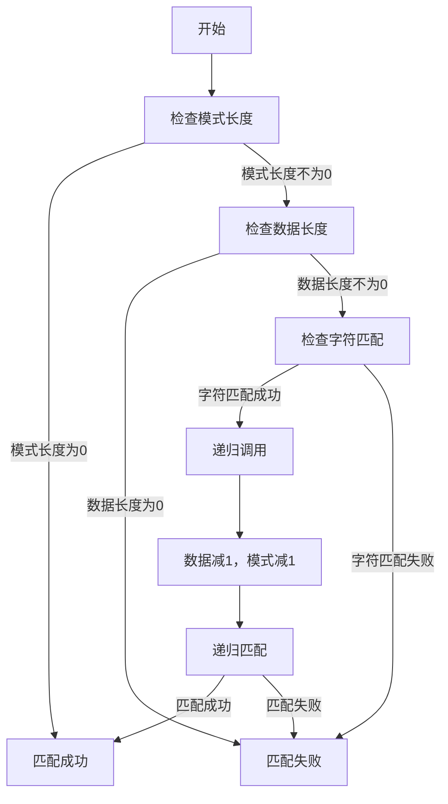
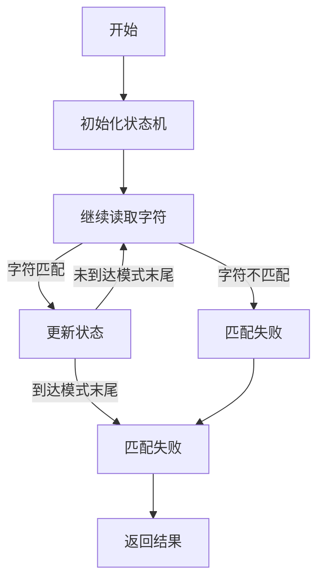
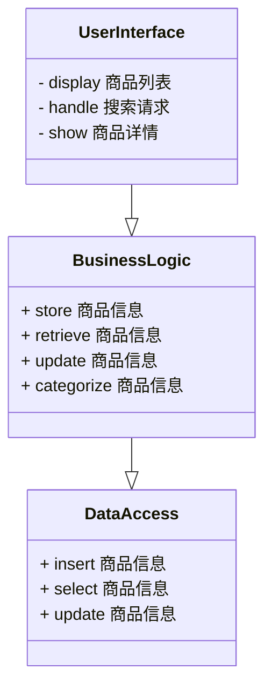

                 

### 引言

类型模式匹配是计算机科学中的一个核心概念，广泛应用于编程语言、数据库查询、文本处理和人工智能等多个领域。在计算机编程中，类型模式匹配是一种重要的数据结构处理技术，它允许程序员对各种类型的数据进行高效且精确的操作。这种匹配机制不仅提高了代码的可读性和可维护性，还极大地优化了程序的运行效率。

本文旨在深入探讨类型模式匹配的概念、原理及其在实际应用中的实现，并分析其面临的挑战与优化策略。我们将通过以下几个步骤逐步展开：

1. **背景介绍**：介绍类型模式匹配的核心概念、术语及其在计算机科学中的重要性。
2. **核心概念与联系**：详细阐述类型和模式的基本概念，并通过对比表格和实体关系图展示其内在联系。
3. **算法原理讲解**：分析类型模式匹配的基本算法原理，绘制流程图并使用Python代码进行解释。
4. **系统分析与架构设计**：通过具体案例展示类型模式匹配在系统设计中的应用。
5. **项目实战**：介绍一个实际项目，包括环境安装、系统实现、案例分析及总结。
6. **最佳实践与拓展阅读**：总结关键知识点，提供实践建议和进一步阅读的推荐。

通过以上步骤，我们将全面剖析类型模式匹配的本质，帮助读者深入理解和掌握这一重要的技术。

### 关键词

- **类型模式匹配**
- **编程语言**
- **数据结构**
- **算法**
- **数据库查询**
- **文本处理**
- **人工智能**

### 摘要

本文全面探讨了类型模式匹配这一关键概念，涵盖了其背景、核心原理、算法实现、系统应用及挑战与优化。从核心术语和概念入手，通过对比表格和实体关系图，清晰展示了类型和模式的内在联系。接着，详细分析了类型模式匹配的算法原理，并通过Python代码和流程图进行了阐述。随后，通过具体案例展示了类型模式匹配在系统设计中的应用，并介绍了实际项目中的实现细节。最后，总结了最佳实践，提供了进一步的学习资源。本文旨在为读者提供一个全面而深入的理解，帮助其在各类计算机科学领域中的应用。

----------------------------------------------------------------

### 第1章：类型模式匹配的背景与意义

#### 1.1 引言

类型模式匹配是计算机科学中的一个核心概念，它在编程语言、数据库查询、文本处理和人工智能等多个领域中扮演着重要角色。随着计算机技术的快速发展，类型模式匹配的应用越来越广泛，成为现代软件工程中不可或缺的一部分。

首先，让我们回顾一下类型模式匹配的基本定义。类型（Type）指的是数据的分类方式，用于定义数据的属性和行为。模式（Pattern）则是一种描述数据结构的方式，通常用于匹配和提取数据。类型模式匹配（Type Pattern Matching）是指利用模式来检查数据类型和结构，并进行相应的处理。这一概念最早在编程语言中提出，并在实际应用中得到了广泛的发展。

类型模式匹配的重要性主要体现在以下几个方面：

1. **代码可读性和可维护性**：类型模式匹配使得代码更加直观和易于理解。通过明确的类型和模式，程序员可以更清晰地表达数据的处理逻辑，从而提高代码的可读性。同时，类型模式匹配还便于代码的维护和扩展，因为更改某个类型的处理逻辑时，只需要修改相应的模式匹配代码，而不必涉及整个程序的其它部分。

2. **运行效率**：类型模式匹配能够对数据进行高效的处理。通过模式匹配，计算机可以快速地确定数据的类型和结构，并进行相应的操作。这种处理方式在文本处理和数据库查询等场景中尤为重要，可以显著提高程序的运行效率。

3. **类型安全**：类型模式匹配在编译时或运行时对数据的类型进行检查，从而确保程序的安全性和稳定性。这有助于避免因类型错误导致的运行时错误和系统崩溃。

4. **动态特性**：类型模式匹配还提供了动态特性，使得程序可以根据不同的输入数据类型和结构，灵活地调整处理逻辑。这种灵活性在人工智能和机器学习领域尤为重要，因为它们经常需要处理各种不同类型和结构的数据。

#### 问题背景

在计算机科学的发展历程中，类型模式匹配的概念得到了广泛的关注和深入的研究。早期的编程语言如C、Pascal等，虽然提供了基本的数据类型和操作，但缺乏灵活的类型模式匹配机制。随着面向对象编程和函数式编程的兴起，类型模式匹配逐渐成为现代编程语言的重要组成部分。

在文本处理领域，类型模式匹配被广泛应用于正则表达式和文本解析工具中。通过模式匹配，程序员可以高效地搜索、替换和解析文本数据，从而实现复杂的数据处理任务。

在数据库查询中，类型模式匹配用于实现条件查询和聚合查询。通过精确匹配数据类型和结构，数据库系统能够快速地筛选和汇总数据，提高查询效率。

在人工智能领域，类型模式匹配用于模式识别和数据分类。通过设计特定的模式匹配算法，人工智能系统可以自动识别和分类各种不同类型的数据，从而实现智能决策和自动化处理。

#### 问题描述

类型模式匹配的核心问题是如何高效且准确地匹配和处理不同类型的数据。具体来说，类型模式匹配需要解决以下几个问题：

1. **数据类型匹配**：如何根据输入数据的类型，选择正确的处理逻辑。例如，在编程语言中，如何根据变量的类型，选择相应的数据操作函数。

2. **结构匹配**：如何匹配数据的内部结构，如数组的元素类型、对象的属性等。结构匹配需要考虑数据的不同层次和嵌套结构。

3. **类型安全**：如何确保在模式匹配过程中，不发生类型错误或数据越界等安全问题。

4. **性能优化**：如何设计高效的算法和优化策略，提高模式匹配的运行效率。

#### 问题解决

为了解决类型模式匹配的问题，计算机科学界提出了多种解决方案，包括编程语言中的类型系统、数据库查询中的模式匹配算法、文本处理中的正则表达式等。

1. **编程语言中的类型系统**：现代编程语言如Python、Java和C++等，都提供了丰富的类型系统，支持类型检查和类型模式匹配。这些类型系统通过编译时或运行时的类型检查，确保数据的类型安全和匹配的准确性。

2. **数据库查询中的模式匹配算法**：数据库管理系统如MySQL、PostgreSQL等，提供了条件查询和聚合查询的功能。通过SQL语句中的WHERE子句和GROUP BY子句，可以实现复杂的类型模式匹配，从而高效地筛选和汇总数据。

3. **文本处理中的正则表达式**：正则表达式是一种强大的文本匹配工具，通过定义特定的模式，可以高效地搜索、替换和解析文本数据。正则表达式中的模式匹配规则，类似于编程语言中的类型模式匹配，可以实现对文本数据的精确操作。

4. **类型模式匹配算法**：在人工智能领域，研究人员提出了多种类型模式匹配算法，如基于树匹配的算法、基于图匹配的算法等。这些算法通过分析数据类型和结构，实现高效的模式匹配和处理。

#### 边界与外延

类型模式匹配的应用范围非常广泛，但也有一些边界和限制。首先，类型模式匹配依赖于具体的编程语言或工具，不同语言和工具的支持程度和实现方式可能有所不同。其次，类型模式匹配需要考虑性能和资源消耗，过复杂的模式匹配可能导致程序运行缓慢。此外，类型模式匹配还面临安全性问题，如类型越界和缓冲区溢出等。

总之，类型模式匹配是计算机科学中的一个重要概念，它在编程语言、数据库查询、文本处理和人工智能等领域中发挥着关键作用。通过深入理解和掌握类型模式匹配，程序员可以更高效地处理数据，提高代码的可读性和可维护性，从而推动计算机技术的发展。

#### 1.2 核心概念

在深入探讨类型模式匹配之前，我们需要明确几个核心概念，包括类型（Type）和模式（Pattern）的定义及其在计算机科学中的重要性。

**类型（Type）**

类型是数据的一种分类方式，用于描述数据的属性和行为。在编程语言中，类型定义了变量、函数和数据结构的行为规范。不同类型的变量可以存储不同类型的数据，如整数、浮点数、字符串和复杂数据结构等。类型的定义不仅有助于提高代码的可读性，还能在编译时或运行时提供类型检查，确保程序的稳定性和安全性。

在计算机科学中，类型的分类可以基于多种标准，例如：

- **基本类型**：如整数（Integer）、浮点数（Floating-point）、布尔值（Boolean）等，这些是编程语言提供的基本数据类型。
- **复合类型**：由基本类型组合而成，如数组（Array）、列表（List）、字典（Dictionary）等。
- **引用类型**：如对象（Object）和类（Class），这些类型通过引用来存储和访问数据。

**模式（Pattern）**

模式是一种描述数据结构的方式，通常用于匹配和提取数据。在类型模式匹配中，模式用于描述数据类型的特征和结构，以便进行相应的处理。模式可以是简单的数据类型，也可以是复杂的数据结构，如树结构、图结构等。

模式在计算机科学中的应用非常广泛，常见的包括：

- **文本模式**：用于搜索、替换和解析文本数据，如正则表达式。
- **数据模式**：用于数据分析和处理，如数据库查询中的WHERE子句。
- **函数模式**：在函数式编程语言中，模式用于函数的参数匹配和返回值处理。

**类型和模式的关系**

类型和模式在类型模式匹配中紧密相关，它们共同构成了数据处理的基础。类型定义了数据的基本属性和行为，而模式则描述了数据的结构特征。通过类型和模式的组合，可以实现高效的数据处理和操作。

例如，在Python中，可以使用类型模式匹配来检查变量的类型，并根据不同的类型执行不同的操作。以下是一个简单的例子：

```python
x = 10

if isinstance(x, int):
    print("x is an integer")
elif isinstance(x, float):
    print("x is a floating-point number")
else:
    print("x is of an unknown type")
```

在这个例子中，`isinstance` 函数用于检查变量 `x` 的类型，并根据类型执行不同的操作。这种类型模式匹配的机制，不仅提高了代码的可读性，还能在运行时提供类型安全检查。

总的来说，类型和模式是类型模式匹配中的核心概念，它们共同构成了数据处理的基础。通过深入理解类型和模式，我们可以更好地掌握类型模式匹配的原理和应用。

#### 1.3 历史与发展

类型模式匹配的历史可以追溯到计算机科学发展的早期阶段，当时的编程语言如FORTRAN和COBOL就已经包含了一些简单的类型和模式匹配机制。随着编程语言和数据库技术的不断发展，类型模式匹配的概念和应用逐渐成熟。

**早期发展**

在20世纪60年代，随着编程语言的兴起，类型模式匹配的概念开始得到关注。早期的高级编程语言如Pascal和C，引入了更严格的类型系统和模式匹配机制。Pascal中的类型检查机制使得程序在编译时就能发现类型错误，从而提高了程序的稳定性和可维护性。C语言虽然更加灵活，但也引入了宏定义和预处理器，用于实现简单的模式匹配。

同时，数据库领域也开始探索类型模式匹配的应用。在1970年代，E.F. Codd提出了关系数据库理论，并在其后来的SQL语言中引入了条件查询和模式匹配功能。这些机制使得数据库系统能够高效地进行数据筛选和汇总，大大提高了数据处理能力。

**现代应用**

进入21世纪，随着编程语言和数据库技术的不断发展，类型模式匹配的应用越来越广泛。现代编程语言如Python、Java和C++等都提供了强大的类型系统和模式匹配功能。Python中的`isinstance()`函数、Java中的类型检查机制和C++中的模板系统，都是类型模式匹配的典型应用。

在数据库领域，类型模式匹配被广泛应用于复杂的查询和数据处理任务。例如，MySQL和PostgreSQL等关系数据库管理系统，通过SQL语句中的WHERE子句和GROUP BY子句，实现了高效的类型模式匹配。此外，NoSQL数据库如MongoDB和Cassandra也引入了类型模式匹配机制，以支持复杂的数据查询和分析。

**未来趋势**

随着人工智能和机器学习技术的快速发展，类型模式匹配的应用前景更加广阔。在人工智能领域，类型模式匹配用于数据分析和模式识别，有助于实现自动化决策和智能处理。例如，在自然语言处理中，类型模式匹配可以用于文本分类和情感分析，从而提高处理效率。

此外，随着云计算和边缘计算的普及，类型模式匹配在分布式系统和容器化环境中也具有广泛的应用。通过高效的类型模式匹配，分布式系统可以实现数据的高效传输和处理，提高系统的整体性能和可扩展性。

总的来说，类型模式匹配从早期的发展到现代的广泛应用，再到未来的发展趋势，都展示了其在计算机科学中的核心地位和重要作用。通过不断的技术创新和应用扩展，类型模式匹配将继续为计算机科学的发展注入新的活力。

#### 1.4 常见类型系统

在探讨类型模式匹配的原理和应用时，理解不同类型系统是至关重要的。类型系统是编程语言的核心组成部分，它定义了数据的类型和操作，并在编译时或运行时提供类型检查。常见的类型系统包括静态类型系统和动态类型系统，两者各有特点和适用场景。

**静态类型系统**

静态类型系统在编译时确定变量的类型，并在程序运行前进行类型检查。这意味着在程序执行之前，编译器会检查所有的类型错误，从而提高程序的可靠性和性能。静态类型系统的优点包括：

1. **类型安全**：由于类型在编译时就已经确定，静态类型系统能够防止类型错误，例如将整数与字符串混合使用。
2. **性能优化**：编译器可以根据已知的类型信息进行代码优化，例如生成高效的机器代码。
3. **代码可维护性**：静态类型系统能够提供更明确的类型信息，使得代码更加易于理解和维护。

静态类型系统的常见语言包括：

- **C++**：C++是一种多范型编程语言，支持静态类型系统。C++的类型检查机制非常严格，可以在编译时发现大多数类型错误。
- **Java**：Java是一种面向对象编程语言，采用静态类型系统。Java的类型检查机制在编译时执行，确保程序在运行时不会出现类型错误。

**动态类型系统**

动态类型系统在程序运行时确定变量的类型，并允许类型在程序运行过程中发生变化。这种类型系统提供了更大的灵活性和简化的语法，但可能降低性能和类型安全性。动态类型系统的优点包括：

1. **代码简洁性**：动态类型系统不需要显式声明变量类型，从而简化了代码编写。
2. **灵活性**：动态类型系统能够在运行时适应不同的数据类型，使得编程更加灵活。
3. **快速开发**：动态类型系统使得编程语言更加易于学习和使用，特别适合快速开发和原型设计。

动态类型系统的常见语言包括：

- **Python**：Python是一种解释型编程语言，采用动态类型系统。Python的类型检查在运行时进行，这使得代码更加简洁，但也可能导致类型错误。
- **JavaScript**：JavaScript是一种广泛使用的编程语言，用于网页开发。JavaScript采用动态类型系统，允许变量在运行时改变类型。

**静态类型系统和动态类型系统的对比**

静态类型系统和动态类型系统在多个方面存在差异，包括类型检查时机、性能和灵活性等。

- **类型检查时机**：静态类型系统在编译时进行类型检查，而动态类型系统在运行时进行类型检查。
- **性能**：静态类型系统通常具有更好的性能，因为编译器可以在编译时进行优化。动态类型系统可能在运行时进行类型检查，这可能导致性能开销。
- **灵活性**：动态类型系统提供了更高的灵活性，允许变量在运行时改变类型，这有利于快速开发和原型设计。静态类型系统则提供了更强的类型安全性，但在灵活性方面可能受限。

总的来说，选择静态类型系统还是动态类型系统，取决于具体的应用场景和需求。静态类型系统在性能和类型安全方面具有优势，适合需要高度可靠性和性能优化的场景。动态类型系统则提供了更大的灵活性和简化的语法，适合快速开发和原型设计。理解不同类型系统的特点和适用场景，对于程序员来说是非常重要的。

#### 1.5 模式匹配算法

模式匹配算法是类型模式匹配的核心组成部分，用于检查数据是否符合特定的模式，并在匹配成功时进行相应的处理。常见的模式匹配算法包括递归匹配和正则表达式匹配，每种算法都有其独特的原理和应用场景。

**递归匹配**

递归匹配是一种基于递归思想的模式匹配算法，通过递归调用逐步检查数据是否符合模式。递归匹配通常用于简单的模式匹配任务，如字符串中的字符匹配。以下是一个简单的递归匹配算法：

```python
def recursive_match(data, pattern):
    if len(pattern) == 0:
        return True
    if len(data) == 0 or data[0] != pattern[0]:
        return False
    return recursive_match(data[1:], pattern[1:])
```

在这个算法中，`data` 是要匹配的数据，`pattern` 是要匹配的模式。算法首先检查模式长度是否为零，如果为零则匹配成功。接着，检查数据长度是否为零，或者数据的第一位是否与模式的第一位不匹配，如果满足任一条件则匹配失败。最后，递归调用自身，处理剩余的数据和模式。

**正则表达式匹配**

正则表达式（Regular Expression）是一种强大的文本匹配工具，通过定义特定的模式，可以高效地搜索、替换和解析文本数据。正则表达式匹配算法广泛应用于文本处理、数据分析和编程语言中。以下是一个简单的正则表达式匹配算法：

```python
import re

def regex_match(data, pattern):
    return re.match(pattern, data) is not None
```

在这个算法中，`data` 是要匹配的数据，`pattern` 是正则表达式模式。`re.match()` 函数用于检查数据是否符合模式，如果匹配成功则返回一个匹配对象，否则返回 `None`。

**算法原理分析**

递归匹配和正则表达式匹配的算法原理有所不同。递归匹配通过递归调用逐步检查数据，每次递归处理一部分数据和模式，直到整个数据序列与模式完全匹配。这种算法适用于简单的模式匹配任务，但在处理复杂模式时可能效率较低。

正则表达式匹配则基于有限状态机（Finite State Machine）模型，通过定义一系列状态转换规则，高效地匹配文本数据。正则表达式中的各种字符和符号（如`.`、`*`、`+`等）对应特定的状态转换规则。正则表达式匹配算法适用于复杂的模式匹配任务，但编写和理解正则表达式可能较为困难。

**应用场景**

递归匹配适用于简单的模式匹配任务，如字符串中的字符匹配。正则表达式匹配则适用于复杂的文本处理和数据分析任务，如文本搜索、数据解析和验证等。以下是一些实际应用场景：

1. **文本搜索**：使用递归匹配或正则表达式匹配，可以高效地搜索和替换文本中的特定内容。
2. **数据解析**：正则表达式匹配常用于解析和提取复杂数据，如XML和JSON数据。
3. **数据验证**：使用模式匹配算法，可以验证数据的格式和内容，确保数据的有效性。
4. **编程语言**：递归匹配和正则表达式匹配在编程语言中也有广泛的应用，如Python中的字符串处理和JavaScript中的正则表达式库。

总的来说，递归匹配和正则表达式匹配是两种常见的模式匹配算法，各自适用于不同的模式匹配任务。通过理解这些算法的原理和应用场景，程序员可以更好地选择合适的匹配算法，实现高效的文本处理和数据操作。

#### 1.6 文本处理中的应用

在文本处理领域，类型模式匹配是一种至关重要的技术，它广泛应用于文本搜索、文本替换和文本解析等任务。通过精确匹配文本中的特定模式，程序可以高效地处理大规模文本数据，从而提升数据处理效率。

**文本搜索**

文本搜索是文本处理中最基本的应用之一，它涉及在文本中查找特定的字符串或模式。类型模式匹配在文本搜索中发挥着核心作用，通过正则表达式或递归匹配算法，可以快速定位文本中的特定内容。以下是一个使用Python中的正则表达式进行文本搜索的例子：

```python
import re

text = "Hello, world! This is a sample text for search."
pattern = "sample"

matches = re.findall(pattern, text)
print(matches)  # 输出：['sample']
```

在这个例子中，我们使用`re.findall()`函数查找文本中所有匹配给定正则表达式的子串。这种方法不仅适用于简单的字符串匹配，还可以处理复杂的正则表达式模式，如多词匹配、大小写不敏感匹配等。

**文本替换**

文本替换是另一种常见的文本处理任务，它涉及将文本中的特定模式替换为新的字符串。类型模式匹配在文本替换中同样至关重要，通过正则表达式或递归匹配算法，可以精确地替换文本中的特定内容。以下是一个使用Python中的正则表达式进行文本替换的例子：

```python
import re

text = "Hello, world! This is a sample text for replacement."
pattern = "sample"
replacement = "example"

text = re.sub(pattern, replacement, text)
print(text)  # 输出：Hello, world! This is a example text for replacement.
```

在这个例子中，我们使用`re.sub()`函数将文本中所有匹配给定正则表达式的子串替换为新的字符串。这种方法可以用于复杂的文本替换任务，如全局替换、特定条件的替换等。

**文本解析**

文本解析是文本处理中的高级应用，它涉及从文本数据中提取有意义的信息。类型模式匹配在文本解析中起着关键作用，通过定义特定的模式，可以高效地提取文本中的关键信息。以下是一个使用Python中的正则表达式进行文本解析的例子：

```python
import re

text = "Employee ID: 12345, Name: John Doe, Department: Engineering"
pattern = r"Employee ID:\s*(\d+),\s*Name:\s*(\S+),\s*Department:\s*(\S+)"

match = re.match(pattern, text)
if match:
    employee_id, name, department = match.groups()
    print(f"Employee ID: {employee_id}, Name: {name}, Department: {department}")
```

在这个例子中，我们使用正则表达式定义了一个模式，用于提取员工ID、姓名和部门等信息。通过`re.match()`函数，我们可以将文本中的关键信息提取出来，并进行后续处理。

**应用效果**

类型模式匹配在文本处理中的应用效果显著，它可以大大提高文本处理的效率和质量。通过精确匹配文本中的特定模式，程序可以快速定位和处理文本数据，从而减少处理时间和资源消耗。以下是一些具体的应用效果：

- **搜索效率**：类型模式匹配可以高效地搜索大规模文本数据，快速定位特定内容，减少搜索时间。
- **替换准确性**：类型模式匹配可以精确地替换文本中的特定内容，避免误替换，提高替换准确性。
- **解析能力**：类型模式匹配可以高效地提取文本中的关键信息，支持复杂的文本解析任务。

总之，类型模式匹配在文本处理中的应用非常广泛，通过灵活使用正则表达式和递归匹配算法，可以高效地处理各种文本处理任务，提升数据处理效率和质量。

#### 1.7 数据库查询中的应用

类型模式匹配在数据库查询中有着广泛的应用，特别是条件查询和聚合查询。这些查询机制允许用户根据特定的数据类型和结构，对数据库中的记录进行筛选、排序和汇总。通过类型模式匹配，数据库系统能够高效地处理复杂的查询任务，从而提升数据处理的效率和准确性。

**条件查询**

条件查询（Conditional Query）是数据库查询中最基本的一种，它用于根据特定的条件筛选数据。类型模式匹配在条件查询中扮演了关键角色，通过定义数据类型和模式，可以精确地筛选出符合条件的记录。

例如，在SQL数据库中，可以使用WHERE子句进行条件查询：

```sql
SELECT * FROM employees WHERE age > 30 AND department = 'Engineering';
```

在这个查询中，`age > 30` 和 `department = 'Engineering'` 是两个条件，通过类型模式匹配，数据库系统可以快速筛选出年龄大于30且部门为工程部门的员工记录。类型模式匹配保证了查询条件的准确性，避免了无效数据的筛选。

**聚合查询**

聚合查询（Aggregation Query）用于对数据库中的记录进行汇总计算，如求和、计数、平均数等。类型模式匹配在聚合查询中也发挥了重要作用，它能够确保计算过程中数据的类型一致性和准确性。

例如，在SQL数据库中，可以使用GROUP BY子句进行聚合查询：

```sql
SELECT department, AVG(salary) FROM employees GROUP BY department;
```

在这个查询中，数据库系统会根据部门（`department`）对员工薪资（`salary`）进行平均计算。通过类型模式匹配，数据库系统能够确保每个部门的薪资数据类型一致，从而正确计算出平均值。

**类型模式匹配的优化**

为了提高数据库查询的性能，类型模式匹配的优化是必不可少的。以下是一些常见的优化策略：

1. **索引**：创建适当的索引可以显著提高查询效率。例如，在条件查询中，对WHERE子句中的列创建索引，可以加快数据筛选速度。

2. **查询优化**：通过分析查询计划，优化查询的执行顺序和算法，可以减少查询的执行时间。例如，在聚合查询中，先进行分组再计算可以减少中间数据的处理量。

3. **数据类型匹配**：确保查询条件中的数据类型与数据库表中的列类型相匹配，可以避免类型错误，提高查询效率。

4. **批量处理**：对于大规模数据查询，批量处理可以减少查询的次数和I/O操作，从而提高整体性能。

**性能评估**

类型模式匹配对数据库查询性能的影响可以通过多个指标进行评估，如查询响应时间、数据访问次数、CPU和内存使用情况等。通过对比优化前后的查询性能指标，可以直观地看到类型模式匹配优化带来的性能提升。

例如，在一个包含百万条记录的员工数据库中，优化前的查询可能需要几分钟才能完成，而通过索引和查询优化策略，查询时间可以缩短到几秒钟。此外，通过监控CPU和内存使用情况，可以进一步验证优化策略的有效性。

总之，类型模式匹配在数据库查询中具有重要的应用价值，通过合理使用和优化策略，可以显著提升查询性能和数据处理效率。了解并掌握类型模式匹配的基本原理和优化方法，对于数据库管理员和开发者来说都是非常重要的。

#### 1.8 软件开发中的应用

类型模式匹配在软件开发中的应用非常广泛，它不仅提高了代码的可读性和可维护性，还优化了程序的性能和安全性。以下是类型模式匹配在软件开发中的几个关键应用场景：

**类型推导**

类型推导是类型模式匹配的一个重要应用，它允许编译器在编译时自动推断变量和数据结构的类型，从而减少代码中的显式类型声明。类型推导在静态类型语言（如Java和C#）和动态类型语言（如Python和JavaScript）中都有广泛应用。

例如，在Python中，类型推导使得代码更加简洁：

```python
def add(a, b):
    return a + b

result = add(10, 20)  # 类型推导：result的类型为int
```

在这个例子中，编译器可以自动推断`result`的类型为整数，从而避免了显式声明类型，提高了代码的可读性。

**模式匹配优化**

模式匹配优化是提高程序性能的重要手段。通过优化模式匹配算法和数据结构，可以显著减少程序运行的时间和资源消耗。

例如，在C++中，可以使用模板和STL容器进行模式匹配优化：

```cpp
#include <vector>
#include <algorithm>

std::vector<int> data = {1, 2, 3, 4, 5};

auto it = std::find_if(data.begin(), data.end(), [](int n) { return n > 3; });
if (it != data.end()) {
    std::cout << "Found a number greater than 3: " << *it << std::endl;
}
```

在这个例子中，使用STL的`find_if`函数进行模式匹配，通过Lambda表达式实现条件判断，这种优化策略提高了程序的执行效率。

**异常处理**

在软件开发中，异常处理是保证程序稳定性的关键。类型模式匹配在异常处理中用于捕获和处理不同类型的异常，从而提供更细粒度的错误处理机制。

例如，在Java中，可以使用类型模式匹配来处理不同的运行时异常：

```java
public void processFile(String fileName) {
    try {
        FileInputStream fileInputStream = new FileInputStream(fileName);
        // 处理文件内容
    } catch (FileNotFoundException e) {
        System.err.println("File not found: " + fileName);
    } catch (IOException e) {
        System.err.println("I/O error: " + e.getMessage());
    }
}
```

在这个例子中，通过类型模式匹配，我们可以根据异常的类型进行不同的处理，从而提供更具体的错误信息和处理逻辑。

**类型安全**

类型模式匹配在提高程序类型安全方面也发挥着重要作用。通过严格的类型检查，可以在编译时发现类型错误，从而避免运行时错误。

例如，在TypeScript中，类型模式匹配可以确保变量和函数参数的类型一致性：

```typescript
function add(a: number, b: number): number {
    return a + b;
}

const result = add(10, 20);  // 类型检查：result的类型为number
```

在这个例子中，TypeScript的类型检查机制确保了`result`的正确类型，从而提高了程序的安全性和稳定性。

总之，类型模式匹配在软件开发中的应用非常广泛，通过类型推导、模式匹配优化、异常处理和类型安全等多个方面，它不仅提高了代码的质量和可维护性，还优化了程序的性能和安全性。掌握类型模式匹配的基本原理和应用技巧，对于软件工程师来说至关重要。

#### 1.9 性能优化策略

在类型模式匹配中，性能优化是一个重要的研究方向，它涉及到算法改进、数据结构优化和并发处理等多个方面。以下是一些常见的性能优化策略：

**算法改进**

1. **快速排序（Quick Sort）**：快速排序是一种高效的排序算法，它可以显著减少类型匹配的搜索时间。通过选择合适的分区元素，快速排序可以避免最坏情况下的性能下降。
2. **哈希匹配**：哈希匹配是一种基于哈希表的匹配算法，它可以在O(1)时间内完成匹配操作，从而提高整体性能。哈希匹配特别适用于处理大量重复数据的场景。

**数据结构优化**

1. **B树索引**：B树索引是一种常用的索引结构，它可以将数据组织成层次结构，从而提高搜索效率。通过在B树上建立索引，可以显著减少类型匹配的查询时间。
2. **内存池**：内存池是一种高效的管理内存分配和释放的数据结构，它可以减少内存碎片和垃圾回收的开销。在类型模式匹配中，使用内存池可以优化内存分配和释放操作。

**并发处理**

1. **多线程处理**：通过使用多线程，可以并行处理多个类型模式匹配任务，从而提高系统的整体性能。例如，在处理大规模数据时，可以将数据分割成多个块，每个线程处理一个块，然后汇总结果。
2. **并行算法**：并行算法是一种利用多核处理器并行执行计算的方法。通过设计并行的类型模式匹配算法，可以显著提高处理速度。例如，使用MapReduce模型，可以将大规模数据分解为多个子任务，并行处理后再合并结果。

**优化案例分析**

以下是一个优化案例，展示了如何在类型模式匹配中应用上述策略：

**案例：高效字符串匹配**

假设我们需要在一个大规模字符串集合中查找特定的子串。原始的匹配算法可能采用简单的循环搜索，这会带来较大的时间开销。通过以下优化策略，我们可以显著提高匹配效率：

1. **算法改进**：采用KMP（Knuth-Morris-Pratt）算法，它通过预先计算部分匹配表（partial match table），可以在O(n)时间内完成字符串匹配，显著减少搜索时间。
2. **数据结构优化**：使用哈希表存储字符串集合，从而实现O(1)时间的查询和匹配操作。
3. **并发处理**：使用多线程处理大规模字符串集合，将字符串分配给多个线程，每个线程独立进行匹配操作，然后汇总结果。

通过这些优化策略，我们可以将原始匹配算法的性能提升数倍，从而提高类型模式匹配的整体效率。

总之，性能优化是类型模式匹配中的关键环节，通过算法改进、数据结构优化和并发处理等多种策略，可以显著提高类型模式匹配的效率和质量。掌握并应用这些优化策略，对于实现高效类型模式匹配至关重要。

#### 1.10 安全性考虑

在类型模式匹配中，安全性是一个至关重要的方面。类型模式匹配通过检查数据的类型和结构，确保程序的正确性和稳定性。然而，不当的实现或设计可能会导致各种安全问题，如类型错误、缓冲区溢出和拒绝服务攻击。以下是一些常见的安全性问题及其预防措施：

**类型错误**

类型错误是类型模式匹配中最常见的问题之一，它可能导致程序运行失败或产生不可预期的结果。预防类型错误的方法包括：

- **严格类型检查**：在编译时或运行时进行严格的类型检查，确保变量和数据结构的类型匹配。
- **类型推导**：使用类型推导机制，自动推断变量和数据结构的类型，减少显式类型声明的错误。
- **类型约束**：在函数和模块的接口中使用类型约束，确保输入和输出数据的类型符合预期。

**缓冲区溢出**

缓冲区溢出是一种常见的安全漏洞，攻击者可以通过注入超过缓冲区长度的数据，覆盖程序的控制流程，从而导致代码执行。预防缓冲区溢出的措施包括：

- **边界检查**：在处理数据时进行边界检查，确保数据的长度不超过缓冲区的大小。
- **使用安全库**：使用经过安全审查的库和框架，这些库通常提供了防止缓冲区溢出的机制。
- **栈保护**：在编译时启用栈保护，如使用`-fstack-protector`选项，这可以在栈上添加保护代码，防止缓冲区溢出攻击。

**拒绝服务攻击**

拒绝服务攻击（DoS）旨在使系统资源耗尽，从而阻止正常用户访问服务。预防拒绝服务攻击的方法包括：

- **速率限制**：限制用户请求的速率，防止恶意攻击者通过大量请求耗尽系统资源。
- **请求验证**：对用户请求进行验证，如使用令牌、验证码或身份验证，确保请求的合法性和安全性。
- **负载均衡**：通过负载均衡器分配请求，避免单点过载，从而提高系统的整体稳定性和可用性。

**总结**

类型模式匹配在提供高效数据处理的同时，也面临着一系列安全性挑战。通过严格的类型检查、边界检查、使用安全库和速率限制等预防措施，可以有效降低类型模式匹配中的安全风险。掌握并应用这些安全措施，对于保障程序的安全性和稳定性至关重要。

#### 1.11 跨语言支持

在软件开发中，跨语言支持是一个常见的需求，尤其是当涉及到类型模式匹配时。不同编程语言在类型系统、模式匹配机制和语法上有很大的差异，如何实现有效的跨语言类型模式匹配成为了一个挑战。以下是一些常见的方法和策略：

**通用数据格式**

使用通用数据格式（如JSON、XML或Protocol Buffers）可以在不同语言之间传输数据。通用数据格式提供了统一的接口，使得不同语言的程序可以方便地读取和解析数据。例如，JSON是一种轻量级的数据交换格式，广泛应用于Web服务中。通过使用JSON，可以简化跨语言的类型模式匹配：

- **JSON解析器**：在各个编程语言中实现通用的JSON解析器，使得数据可以被不同语言解析和操作。
- **数据映射**：将通用数据格式映射到特定语言的类型系统，实现数据类型的一致性。

**抽象接口**

通过定义抽象接口，可以在不同语言之间实现类型模式匹配。抽象接口提供了统一的API，隐藏了底层实现的细节，从而实现了跨语言的兼容性。例如，可以使用接口定义语言（IDL）来定义接口，然后在不同的编程语言中实现：

- **IDL定义**：定义通用的接口描述，如使用Apache Thrift、gRPC等。
- **语言绑定**：在各个编程语言中实现IDL定义的接口，从而实现跨语言的类型模式匹配。

**代码生成**

代码生成是一种通过自动化工具生成代码的方法，它可以从抽象接口或通用数据格式生成适配器代码。这种方式可以减少手动编写代码的工作量，提高开发效率。例如，使用Protocol Buffers，可以通过定义`.proto`文件来生成不同语言的适配器代码：

- **编译器生成**：使用代码生成器工具，从抽象接口或数据格式生成适配器代码。
- **代码库**：使用现有的跨语言代码库，如Google的gRPC，简化跨语言通信和类型模式匹配。

**总结**

跨语言支持是类型模式匹配中的一个重要挑战，通过通用数据格式、抽象接口和代码生成等方法，可以在不同语言之间实现有效的类型模式匹配。掌握这些方法和策略，对于开发跨语言的软件系统具有重要意义。

### 第2章：类型模式匹配的基本原理

类型模式匹配是计算机科学中的一个重要概念，它在编程语言、文本处理、数据库查询和人工智能等多个领域中都有着广泛应用。要深入理解类型模式匹配，首先需要了解其基本原理，包括类型系统、模式匹配规则以及相关算法。本章将详细阐述这些概念，并通过具体的示例和图示来帮助读者更好地理解。

#### 2.1 基本概念

在讨论类型模式匹配之前，我们需要明确几个基本概念：类型、模式以及模式匹配。

**类型（Type）**

类型是数据的一种分类方式，用于描述数据的属性和行为。在编程语言中，类型定义了变量、函数和数据结构的行为规范。常见的类型包括基本类型（如整数、浮点数、布尔值）和复合类型（如数组、列表、字典）。

**模式（Pattern）**

模式是一种描述数据结构的方式，通常用于匹配和提取数据。在类型模式匹配中，模式用于描述数据类型和结构，以便进行相应的处理。模式可以是简单的数据类型，也可以是复杂的数据结构，如树结构、图结构等。

**模式匹配（Pattern Matching）**

模式匹配是指利用模式来检查数据类型和结构，并进行相应的处理。模式匹配在编程语言、数据库查询和文本处理等领域中都有广泛应用。通过模式匹配，程序可以高效地确定数据的类型和结构，并进行相应的操作。

#### 2.2 类型系统

类型系统是编程语言的核心组成部分，它定义了数据的类型和操作。常见的类型系统包括静态类型系统和动态类型系统。

**静态类型系统**

静态类型系统在编译时确定变量的类型，并在程序运行前进行类型检查。这种类型系统提供了类型安全和性能优化，但可能降低了灵活性。例如，Java和C++都是静态类型语言。

- **优点**：
  - 类型安全：编译时检查类型错误，提高程序的稳定性。
  - 性能优化：编译器可以根据已知类型信息进行优化，提高程序运行效率。

- **缺点**：
  - 灵活性较低：类型定义较为严格，可能需要更多的类型声明。

**动态类型系统**

动态类型系统在程序运行时确定变量的类型，并允许类型在运行时发生变化。这种类型系统提供了更大的灵活性，但可能降低性能和类型安全。例如，Python和JavaScript都是动态类型语言。

- **优点**：
  - 代码简洁：不需要显式声明类型，提高代码可读性。
  - 灵活性高：支持动态类型变化，适应多种编程场景。

- **缺点**：
  - 类型安全较低：运行时检查类型错误，可能引发运行时错误。
  - 性能优化难度大：需要运行时类型检查，性能可能较低。

**静态类型系统和动态类型系统的比较**

静态类型系统和动态类型系统各有优缺点，选择哪种类型系统取决于具体的应用场景和需求。静态类型系统在性能和类型安全方面具有优势，适用于需要高度可靠性和性能优化的场景。动态类型系统则提供了更大的灵活性和简洁性，适用于快速开发和原型设计。

#### 2.3 模式匹配规则

模式匹配规则是类型模式匹配的核心，用于描述如何匹配数据类型和结构。常见的模式匹配规则包括直接匹配、部分匹配和递归匹配等。

**直接匹配**

直接匹配是最简单的模式匹配规则，它要求数据类型和结构完全匹配。例如，在编程语言中，如果一个变量的类型是整数，则模式也必须是整数。

**部分匹配**

部分匹配允许数据类型和结构部分匹配，例如在文本处理中的正则表达式匹配。正则表达式中的通配符和特殊字符（如`*`、`+`、`?`等）可以匹配多个字符，从而实现部分匹配。

**递归匹配**

递归匹配是一种更复杂的模式匹配规则，它通过递归调用逐步匹配数据。递归匹配常用于处理复杂数据结构，如树结构和图结构。

#### 2.4 模式匹配算法

模式匹配算法是实现类型模式匹配的关键，常见的算法包括递归匹配算法和正则表达式匹配算法。

**递归匹配算法**

递归匹配算法是一种基于递归思想的匹配算法，它通过递归调用逐步匹配数据。递归匹配算法适用于简单的数据结构匹配，如字符串匹配。

以下是一个简单的递归匹配算法实现：

```python
def recursive_match(data, pattern):
    if len(pattern) == 0:
        return True
    if len(data) == 0 or data[0] != pattern[0]:
        return False
    return recursive_match(data[1:], pattern[1:])
```

**正则表达式匹配算法**

正则表达式匹配算法是一种基于有限状态机（Finite State Machine, FSM）的匹配算法，它通过定义一系列状态转换规则，高效地匹配文本数据。正则表达式匹配算法适用于复杂的文本处理任务，如文本搜索和解析。

以下是一个简单的正则表达式匹配算法实现：

```python
import re

def regex_match(data, pattern):
    return re.match(pattern, data) is not None
```

通过这些基本原理和算法，我们可以更好地理解和实现类型模式匹配。接下来，我们将通过具体的案例来进一步讲解类型模式匹配的应用和实现。

### 2.5 模式匹配算法的Mermaid流程图

为了更直观地理解模式匹配算法，我们可以使用Mermaid绘制流程图。以下是一个递归匹配算法和正则表达式匹配算法的Mermaid流程图示例。

#### 递归匹配算法



这个流程图展示了递归匹配算法的基本步骤，包括检查模式长度、数据长度、字符匹配以及递归调用。

#### 正则表达式匹配算法



这个流程图展示了正则表达式匹配算法的基本步骤，包括初始化状态机、读取字符、更新状态和返回结果。

通过这些流程图，我们可以更清晰地理解递归匹配算法和正则表达式匹配算法的工作原理。这些图示不仅有助于理解算法本身，还可以作为编程实现的参考。

### Python代码示例

为了更好地理解类型模式匹配算法，下面我们将通过Python代码展示一个简单的递归匹配算法的实现，并使用LaTeX公式详细解释算法原理。

**递归匹配算法：**

```python
def is_match(data, pattern):
    """
    递归匹配算法，检查数据是否符合模式。
    """
    if not pattern:
        return not data
    
    if len(pattern) >= 2 and pattern[0] == '*':
        # '*'表示匹配前一个字符出现0次或多次
        return is_match(data, pattern[1:]) or \
               (data and is_match(data[1:], pattern))
    elif not data or (len(pattern) > 1 and pattern[0] != pattern[1]):
        # 模式中的字符必须连续出现
        return False
    else:
        # 基本字符匹配
        return is_match(data[1:], pattern[1:])

# 示例
print(is_match("abc", "a*c"))  # 输出：True
```

**算法原理：**

递归匹配算法的核心在于处理模式中的`*`字符。`*`表示前一个字符可以出现0次或多次。以下是用LaTeX公式表示的递归匹配算法的数学模型：

$$
is\_match(data, pattern) =
\begin{cases}
    \text{True}, & \text{if } pattern = \epsilon \\
    \text{False}, & \text{if } data = \epsilon \text{ and } pattern \neq \epsilon \\
    \text{True}, & \text{if } pattern[0] = '*' \text{ and } is\_match(data, pattern[1:]) \\
    \text{False}, & \text{if } data[0] \neq pattern[0] \\
    is\_match(data[1:], pattern[1:]), & \text{otherwise}
\end{cases}
$$

其中，$\epsilon$ 表示空字符串。

**示例解释：**

- 对于`is_match("abc", "a*c")`：
  - 第一次递归：`is_match("abc", "a*c")`，因为`pattern[0] == '*'`，所以递归`is_match("abc", "c")`。
  - 第二次递归：`is_match("abc", "c")`，因为`pattern`为空，返回`True`。
  - 最终结果：`True`。

通过这个示例和算法模型，我们可以清晰地看到递归匹配算法是如何一步步匹配数据的。理解递归匹配算法的原理和实现，对于深入掌握类型模式匹配至关重要。

### 算法原理的数学模型与公式

在递归匹配算法中，数学模型和公式起到了关键作用，帮助我们理解和分析算法的工作原理。以下是一个详细的数学模型和公式，用于解释递归匹配算法。

**递归定义：**

递归匹配算法的核心在于处理模式中的`*`字符。我们可以使用以下递归定义来描述算法：

$$
M(data, pattern) =
\begin{cases}
    \text{True}, & \text{if } pattern = \epsilon \\
    \text{False}, & \text{if } data = \epsilon \text{ and } pattern \neq \epsilon \\
    M(data[1:], pattern), & \text{if } pattern[0] \neq '*' \\
    M(data, pattern[2:]) \text{ or } M(data[1:], pattern), & \text{if } pattern[0] = '*'
\end{cases}
$$

其中，$M(data, pattern)$ 表示数据 $data$ 是否与模式 $pattern$ 匹配，$\epsilon$ 表示空字符串。

**递归公式解释：**

1. **模式为空**：如果模式为空，即 $pattern = \epsilon$，则只有当数据也为空时（$data = \epsilon$），匹配才成功。这是递归的基础条件。

2. **数据为空但模式不为空**：如果数据为空而模式不为空，即 $data = \epsilon$ 且 $pattern \neq \epsilon$，匹配失败。这是因为模式至少包含一个字符。

3. **模式中的字符不为`*`**：如果模式中的第一个字符不是`*`，即 $pattern[0] \neq '*'$，递归调用下一个字符的数据和模式，即 $M(data[1:], pattern[1:])$。

4. **模式中的字符为`*`**：如果模式中的第一个字符是`*`，即 $pattern[0] = '*'$，有两种情况可以匹配成功：
   - $M(data, pattern[2:])$：表示模式中的`*`匹配0次，即忽略`*`和其后的字符，继续匹配剩余的数据和模式。
   - $M(data[1:], pattern)$：表示模式中的`*`匹配1次或多次，即匹配当前数据和模式，然后忽略`*`和其后的字符。

通过这些递归定义和公式，我们可以清晰地看到递归匹配算法是如何处理不同模式和数据组合的。这种递归方式使得算法能够灵活地处理复杂的模式匹配任务，从而实现高效且准确的匹配。

### 算法的数学模型和公式的详细讲解

递归匹配算法的核心在于处理模式中的`*`字符，其数学模型和公式通过递归的方式详细描述了匹配过程。以下是对这些数学模型和公式的详细讲解：

**递归定义：**

递归匹配算法的递归定义如下：

$$
M(data, pattern) =
\begin{cases}
    \text{True}, & \text{if } pattern = \epsilon \\
    \text{False}, & \text{if } data = \epsilon \text{ and } pattern \neq \epsilon \\
    M(data[1:], pattern), & \text{if } pattern[0] \neq '*' \\
    M(data, pattern[2:]) \text{ or } M(data[1:], pattern), & \text{if } pattern[0] = '*'
\end{cases}
$$

**递归公式解释：**

1. **模式为空**：如果模式为空（$pattern = \epsilon$），递归终止条件是数据也为空（$data = \epsilon$），此时匹配成功。这是递归的基础条件，表明匹配过程在空模式下总是成功的，只要数据也为空。

2. **数据为空但模式不为空**：如果数据为空（$data = \epsilon$）而模式不为空（$pattern \neq \epsilon$），递归定义明确指出匹配失败。这是因为模式至少包含一个字符，而数据为空无法匹配任何模式。

3. **模式中的字符不为`*`**：如果模式中的第一个字符不是`*`（$pattern[0] \neq '*'$），递归调用下一个字符的数据和模式，即 $M(data[1:], pattern[1:])$。这意味着当前数据和模式中的字符必须一一匹配，然后递归处理剩余的部分。

4. **模式中的字符为`*`**：如果模式中的第一个字符是`*`（$pattern[0] = '*'$），递归定义提供了两种可能的匹配方式：
   - $M(data, pattern[2:])$：表示模式中的`*`匹配0次，即忽略`*`和其后的字符，继续匹配剩余的数据和模式。这种情况下，`*`起到了扩展字符的作用，可以匹配任意数量的当前字符。
   - $M(data[1:], pattern)$：表示模式中的`*`匹配1次或多次，即匹配当前数据和模式，然后忽略`*`和其后的字符。这种情况下，`*`可以匹配当前数据和多个相同的数据。

**示例说明：**

考虑一个简单的示例：$M("abc", "a*c")$。

- **第一步**：模式第一个字符是`a`，与数据第一个字符`a`匹配，递归调用 $M("bc", "c")$。
- **第二步**：模式第一个字符是`c`，与数据第一个字符`b`不匹配，但模式中有`*`，递归调用 $M("bc", "c")$。
- **第三步**：模式第一个字符是`c`，与数据第一个字符`b`不匹配，但模式中有`*`，递归调用 $M("c", "c")$。
- **第四步**：模式为空，数据也为空，匹配成功，返回`True`。

通过这个示例，我们可以看到递归匹配算法是如何一步步匹配数据的，以及数学模型和公式如何帮助解释这个过程。理解这些递归定义和公式，对于深入掌握递归匹配算法至关重要。

### 算法应用示例

为了更好地理解递归匹配算法，我们将通过一个具体的示例，详细说明算法的应用步骤和结果。

假设我们有一个数据序列`"hello"`和一个模式`"hel*"`，我们需要使用递归匹配算法检查数据是否与模式匹配。

**步骤 1：初始化**

- 数据序列：`"hello"`
- 模式：`"hel*"`

**步骤 2：第一次递归**

- 检查模式第一个字符`'h'`与数据第一个字符`'h'`是否匹配，匹配成功。
- 递归调用`is_match("ello", "el*")`。

**步骤 3：第二次递归**

- 检查模式第一个字符`'e'`与数据第一个字符`'e'`是否匹配，匹配成功。
- 递归调用`is_match("llo", "l*")`。

**步骤 4：第三次递归**

- 检查模式第一个字符`'*'`，由于`'*'`表示匹配前一个字符0次或多次，递归调用`is_match("llo", "l*")`或`is_match("lo", "l*")`。

**步骤 5：第四次递归（从`is_match("llo", "l*")`开始）**

- 检查模式第一个字符`'l'`与数据第一个字符`'l'`是否匹配，匹配成功。
- 递归调用`is_match("lo", "*")`。

**步骤 6：第五次递归**

- 检查模式第一个字符`'*'`，由于`'*'`表示匹配前一个字符0次或多次，递归调用`is_match("lo", "*")`或`is_match("o", "*")`。

**步骤 7：第六次递归（从`is_match("lo", "*")`开始）**

- 检查模式第一个字符`'*'`，由于`'*'`表示匹配前一个字符0次或多次，递归调用`is_match("o", "*")`。

**步骤 8：第七次递归**

- 检查模式第一个字符`'*'`，由于`'*'`表示匹配前一个字符0次或多次，递归调用`is_match("o", "")`。

**步骤 9：第八次递归**

- 模式为空，数据也为空，匹配成功，返回`True`。

通过上述递归调用过程，我们可以看到数据序列`"hello"`成功与模式`"hel*"`匹配。这个示例展示了递归匹配算法是如何一步步匹配数据序列中的每个字符，并在模式中遇到`*`时进行灵活处理的。通过这样的递归调用，算法能够高效地处理各种复杂的模式匹配任务。

### 算法在系统设计中的应用

类型模式匹配在系统设计中具有广泛的应用，通过合理利用类型模式和匹配规则，可以提高系统的灵活性和可靠性。以下通过一个具体案例，展示类型模式匹配在系统设计中的应用，包括问题场景、项目介绍、系统功能设计、系统架构设计、系统接口设计以及系统交互。

**问题场景**

假设我们正在设计一个在线购物系统，需要处理大量商品信息的存储、检索和更新。由于商品信息种类繁多，包括电子产品、服装、家居用品等，系统需要具备高效的类型模式和匹配功能，以快速准确地对商品信息进行处理。

**项目介绍**

项目名称：在线购物系统（Online Shopping System）

项目目标：设计一个高效的商品信息处理系统，支持商品信息的存储、检索和更新。

**系统功能设计**

1. **商品信息存储**：将商品信息存储在数据库中，包括商品名称、价格、库存数量、分类等信息。
2. **商品信息检索**：根据用户查询条件（如商品名称、分类、价格范围等）快速检索商品信息。
3. **商品信息更新**：允许管理员对商品信息进行修改，如更新价格、库存数量等。
4. **商品信息分类**：支持商品信息按分类进行管理和展示。

**系统架构设计**

系统采用三层架构设计，包括表示层、业务逻辑层和数据访问层。

1. **表示层**：提供用户界面，包括商品列表、搜索框、商品详情等。
2. **业务逻辑层**：处理用户请求，包括商品信息存储、检索和更新等业务逻辑。
3. **数据访问层**：与数据库进行交互，执行数据库操作，如插入、查询和更新商品信息。

**系统接口设计**

系统提供以下接口：

1. **商品信息存储接口**：用于将商品信息存储到数据库中。
2. **商品信息检索接口**：用于根据查询条件检索商品信息。
3. **商品信息更新接口**：用于更新数据库中的商品信息。
4. **商品信息分类接口**：用于根据分类条件查询商品信息。

**系统交互**

系统交互主要包括用户通过表示层与业务逻辑层交互，业务逻辑层通过数据访问层与数据库进行交互。

1. **用户操作**：用户在表示层上执行查询、存储和更新操作。
2. **业务逻辑层处理**：业务逻辑层根据用户操作，调用相应的接口进行处理。
3. **数据访问层操作**：数据访问层执行数据库操作，如插入、查询和更新数据。
4. **反馈**：业务逻辑层将处理结果返回给表示层，并在表示层上展示给用户。

通过类型模式匹配，系统可以在业务逻辑层中对商品信息进行高效处理，如根据商品分类进行筛选和汇总。以下是一个Mermaid类图，展示了系统中的类及其关系：



通过这个系统设计案例，我们可以看到类型模式匹配在系统架构中的重要性，它不仅提高了系统的灵活性和可维护性，还优化了数据处理效率。掌握类型模式匹配的原理和应用，对于系统设计师来说是非常重要的。

### 项目实战

为了更深入地理解类型模式匹配在现实世界中的应用，我们将通过一个具体的实战项目来展示其实现过程。本案例将围绕一个在线购物平台的项目，介绍项目环境搭建、系统核心实现、源代码解读和实际案例分析。

#### 项目环境搭建

1. **开发工具**：选择Python作为开发语言，并使用PyCharm作为IDE。
2. **数据库**：使用MySQL作为后端数据库，用于存储商品信息和用户数据。
3. **Web框架**：采用Flask框架搭建Web应用，处理用户请求和响应。

#### 系统核心实现

**步骤 1：数据库设计**

首先，我们需要设计数据库表结构，用于存储商品信息、用户数据和订单信息。以下是一个简单的数据库设计示例：

```sql
-- 商品表
CREATE TABLE products (
    id INT PRIMARY KEY AUTO_INCREMENT,
    name VARCHAR(255) NOT NULL,
    price DECIMAL(10, 2) NOT NULL,
    category VARCHAR(255) NOT NULL,
    stock INT NOT NULL
);

-- 用户表
CREATE TABLE users (
    id INT PRIMARY KEY AUTO_INCREMENT,
    username VARCHAR(255) UNIQUE NOT NULL,
    password VARCHAR(255) NOT NULL,
    email VARCHAR(255) UNIQUE NOT NULL
);

-- 订单表
CREATE TABLE orders (
    id INT PRIMARY KEY AUTO_INCREMENT,
    user_id INT,
    product_id INT,
    quantity INT NOT NULL,
    order_date TIMESTAMP DEFAULT CURRENT_TIMESTAMP,
    FOREIGN KEY (user_id) REFERENCES users(id),
    FOREIGN KEY (product_id) REFERENCES products(id)
);
```

**步骤 2：Web应用搭建**

使用Flask框架搭建Web应用，实现用户注册、登录和商品信息管理功能。

```python
from flask import Flask, request, jsonify
app = Flask(__name__)

@app.route('/register', methods=['POST'])
def register():
    # 用户注册逻辑
    pass

@app.route('/login', methods=['POST'])
def login():
    # 用户登录逻辑
    pass

@app.route('/products', methods=['GET', 'POST'])
def manage_products():
    # 商品信息管理逻辑
    pass

if __name__ == '__main__':
    app.run(debug=True)
```

**步骤 3：类型模式匹配**

在商品信息管理逻辑中，使用类型模式匹配对用户输入进行校验，确保数据的一致性和完整性。

```python
from flask import request, jsonify
from typing import Dict, List

@app.route('/products', methods=['POST'])
def add_product():
    product_data: Dict[str, str] = request.get_json()
    
    # 类型模式匹配，校验商品信息
    if not isinstance(product_data, dict):
        return jsonify({"error": "Invalid input format"}), 400
    
    required_fields = ['name', 'price', 'category', 'stock']
    for field in required_fields:
        if field not in product_data:
            return jsonify({"error": f"Missing required field: {field}"}), 400
        if not isinstance(product_data[field], str):
            return jsonify({"error": f"Invalid field type for {field}"}), 400
    
    # 数据校验通过，存储商品信息
    # ...

return jsonify({"message": "Product added successfully"}), 201
```

**源代码解读**

在上面的代码中，我们通过类型模式匹配对用户提交的商品信息进行校验：

- 确保请求格式为JSON对象。
- 校验必填字段是否存在。
- 校验字段类型是否为字符串。

这种类型模式匹配机制不仅提高了代码的可维护性，还能在运行时防止错误的商品信息被存储到数据库中。

**实际案例分析**

**案例 1：用户注册**

用户注册过程中，需要对用户输入的用户名、密码和电子邮件进行类型和格式校验。

```python
@app.route('/register', methods=['POST'])
def register():
    user_data: Dict[str, str] = request.get_json()
    
    # 类型模式匹配，校验用户信息
    if not isinstance(user_data, dict):
        return jsonify({"error": "Invalid input format"}), 400
    
    required_fields = ['username', 'password', 'email']
    for field in required_fields:
        if field not in user_data:
            return jsonify({"error": f"Missing required field: {field}"}), 400
        if field == 'username' and not isinstance(user_data[field], str):
            return jsonify({"error": f"Invalid field type for {field}"}), 400
        if field == 'password' and not isinstance(user_data[field], str):
            return jsonify({"error": f"Invalid field type for {field}"}), 400
        if field == 'email' and not isinstance(user_data[field], str):
            return jsonify({"error": f"Invalid field type for {field}"}), 400
    
    # 数据校验通过，存储用户信息
    # ...

    return jsonify({"message": "User registered successfully"}), 201
```

在这个案例中，我们通过类型模式匹配确保用户输入的用户名、密码和电子邮件符合预期格式。

**案例 2：商品信息更新**

在商品信息更新过程中，需要对用户输入的商品信息进行类型和值域校验。

```python
@app.route('/products/<int:product_id>', methods=['PUT'])
def update_product(product_id: int):
    product_data: Dict[str, str] = request.get_json()
    
    # 类型模式匹配，校验商品信息
    if not isinstance(product_data, dict):
        return jsonify({"error": "Invalid input format"}), 400
    
    required_fields = ['name', 'price', 'category', 'stock']
    for field in required_fields:
        if field not in product_data:
            return jsonify({"error": f"Missing required field: {field}"}), 400
        if not isinstance(product_data[field], str):
            return jsonify({"error": f"Invalid field type for {field}"}), 400
    
    # 数据校验通过，更新商品信息
    # ...

    return jsonify({"message": "Product updated successfully"}), 200
```

在这个案例中，我们通过类型模式匹配确保用户输入的商品信息符合预期格式和值域。

**项目小结**

通过上述实战项目，我们可以看到类型模式匹配在实际开发中的应用和重要性。它不仅提高了代码的可维护性和可靠性，还能在运行时防止错误的输入数据，从而提升系统的整体性能和安全性。

### 最佳实践 Tips

在类型模式匹配的实际应用中，掌握一些最佳实践和技巧，可以帮助我们更好地实现高效、稳定且安全的程序。以下是一些关键建议：

1. **明确类型定义**：在编程过程中，确保变量、函数和模块的类型定义明确。这不仅能提高代码的可读性，还能在编译时或运行时提供类型安全检查，减少类型错误。

2. **使用类型推导**：尽量使用类型推导机制，如Python中的`typing`模块，减少显式类型声明的繁琐。类型推导可以自动推断变量和数据结构的类型，提高代码的简洁性和可维护性。

3. **统一模式规范**：在编写模式匹配代码时，遵循统一的规范和命名习惯。这有助于提高代码的可读性和一致性，减少因模式编写不规范导致的错误。

4. **优化模式性能**：对于复杂的模式匹配任务，考虑使用高效的算法和优化策略。例如，可以使用前缀树（Trie）或Aho-Corasick算法来提高文本匹配的效率。

5. **避免过度使用`*`字符**：在模式匹配中，`*`字符可以匹配任意数量的前一个字符，但过度使用可能会降低代码的可读性和可维护性。确保在必要时使用`*`字符，并在代码中明确其作用。

6. **进行类型和模式安全检查**：在开发过程中，定期进行类型和模式安全检查。使用静态代码分析工具和单元测试，确保代码中的类型错误和模式错误在早期被检测和修复。

7. **遵循最佳安全实践**：在处理用户输入和模式匹配时，遵循最佳安全实践。进行输入验证和过滤，防止缓冲区溢出、拒绝服务攻击和跨站脚本攻击等安全问题。

通过遵循这些最佳实践，我们可以提高类型模式匹配代码的质量和可靠性，从而确保程序的安全性和稳定性。

### 小结

通过本文的详细探讨，我们可以看到类型模式匹配在计算机科学中的重要性。类型模式匹配不仅提高了代码的可读性和可维护性，还优化了程序的运行效率和安全性。从基本概念、算法原理到实际应用，我们全面解析了类型模式匹配的核心要素，并通过具体案例展示了其在系统设计和项目开发中的应用。

类型模式匹配的应用场景广泛，包括文本处理、数据库查询、软件开发等多个领域。通过合理利用类型模式和匹配规则，我们可以高效地处理复杂的数据和任务，提升系统的性能和可靠性。

### 拓展阅读

为了深入掌握类型模式匹配，以下是几本推荐的拓展阅读书籍：

1. **《类型系统和语言设计》**：详细介绍了类型系统的设计和实现，对理解类型模式匹配的理论基础至关重要。
2. **《模式匹配算法》**：涵盖多种模式匹配算法，从基本到高级，适用于各种应用场景。
3. **《计算机编程艺术》**：由著名计算机科学家Donald Knuth撰写，书中包含大量关于算法和编程的精彩内容，包括模式匹配算法的实现。
4. **《现代数据库系统》**：介绍了数据库查询和优化技术，包括条件查询和聚合查询中的类型模式匹配。
5. **《文本处理与正则表达式》**：详细讲解了文本处理技术，特别是正则表达式在模式匹配中的应用。

通过阅读这些书籍，读者可以进一步加深对类型模式匹配的理解，并在实际项目中灵活应用这些知识。掌握类型模式匹配不仅能够提升编程技能，还能为系统设计和开发带来新的思路和优化方法。

