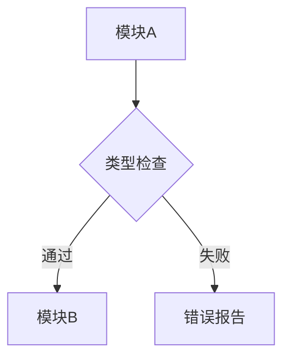
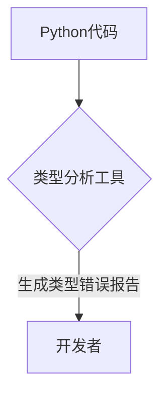
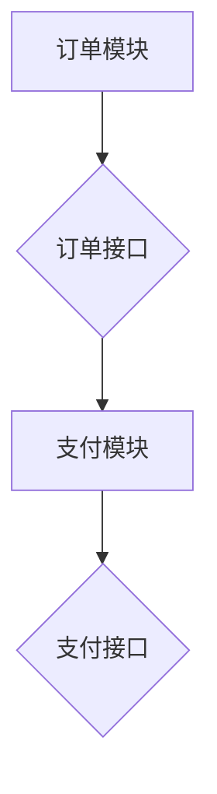
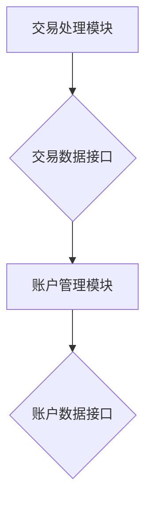
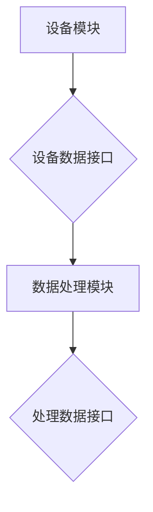

                 

### 文章标题

# 类型理论在软件架构评估中的应用

### 关键词

- 类型理论
- 软件架构评估
- 静态类型
- 动态类型
- 软件可靠性
- 系统可维护性

### 摘要

类型理论作为计算机科学中的核心概念，已在编程语言设计、形式验证等领域展现出巨大的价值。近年来，类型理论在软件架构评估中的应用逐渐受到关注，它为软件系统的可靠性、可理解性和可维护性提供了新的视角。本文将深入探讨类型理论的基本概念、发展历程以及在软件架构评估中的具体应用，通过分析实际案例，阐述类型理论如何提升软件架构评估的效率和准确性。文章还将讨论类型理论在实际应用中的挑战与未来发展趋势，为读者提供全面的了解和深入思考。

### 目录

1. 引言与背景
   1.1 书籍概述与目标
   1.2 研究背景
   1.3 本书的核心贡献
   1.4 本章小结

2. 类型理论基础
   2.1 基本概念
   2.2 类型理论原理
   2.3 类型理论的应用实例
   2.4 本章小结

3. 类型理论在软件架构评估中的应用
   3.1 软件架构评估概述
   3.2 类型理论在软件架构评估中的优势
   3.3 类型理论在软件架构评估中的具体应用
   3.4 本章小结

4. 实际应用案例
   4.1 案例一：大型电商平台架构评估
   4.2 案例二：金融系统架构评估
   4.3 案例三：物联网系统架构评估
   4.4 本章小结

5. 类型理论在软件架构评估中的挑战与未来趋势
   5.1 类型理论在软件架构评估中的挑战
   5.2 类型理论的发展趋势
   5.3 本章小结

### 引言与背景

#### 1.1 书籍概述与目标

类型理论在计算机科学中占据着至关重要的地位。它不仅为编程语言设计提供了理论基础，还在形式验证、编译器优化、软件工程等多个领域有着广泛的应用。随着软件系统复杂性的增加，如何高效、准确地评估软件架构的可靠性和可维护性成为了一个亟待解决的问题。类型理论提供了新的视角和方法，为解决这一难题提供了可能。

本书旨在探讨类型理论在软件架构评估中的应用，通过深入分析类型理论的基本概念、发展历程和具体应用，帮助读者理解如何利用类型理论提升软件架构评估的效率和准确性。本书的主要目标是：

1. **介绍类型理论的基本概念和原理**：帮助读者建立对类型理论的全面了解，理解其在计算机科学中的重要性。
2. **探讨类型理论在软件架构评估中的优势**：分析类型理论如何提高软件系统的可理解性、可靠性和可维护性。
3. **提供实际应用案例**：通过具体的案例，展示类型理论在软件架构评估中的应用场景和效果。
4. **讨论类型理论在实际应用中的挑战和未来发展趋势**：帮助读者了解类型理论在软件架构评估中面临的挑战，以及其未来的发展方向。

#### 1.2 研究背景

软件架构评估是软件工程中的一个重要环节。它旨在确保软件系统的设计符合预期，能够满足业务需求，并具有良好的性能、可维护性和可靠性。然而，传统的软件架构评估方法往往依赖于专家经验和主观判断，缺乏系统的理论和工具支持。随着软件系统复杂性的增加，传统方法在评估效率和准确性方面面临着巨大的挑战。

类型理论作为计算机科学的核心理论之一，具有严格的形式化和抽象能力。它通过定义和操作类型系统，为软件系统的设计和验证提供了强有力的工具。近年来，研究者开始探索类型理论在软件架构评估中的应用，希望通过类型理论的方法，提高软件架构评估的效率和准确性。

类型理论在软件架构评估中的应用具有以下几个显著的优势：

1. **提高软件系统的可理解性**：类型理论通过明确定义类型和类型之间的关系，有助于开发者更好地理解软件系统的结构和功能，从而提高系统的可理解性。
2. **提高软件系统的可靠性**：类型理论可以帮助识别和消除潜在的类型错误，从而提高软件系统的可靠性。
3. **提高软件系统的可维护性**：类型理论为软件系统的设计和验证提供了强有力的支持，有助于提高系统的可维护性。

尽管类型理论在软件架构评估中展现出了巨大的潜力，但其在实际应用中也面临着一些挑战。例如，类型理论的复杂性可能导致应用难度增加，同时，类型理论在实际软件系统中的应用效果也受到系统复杂度和应用场景的限制。

#### 1.3 本书的核心贡献

本书的核心贡献主要体现在以下几个方面：

1. **系统性地介绍类型理论**：本书将详细阐述类型理论的基本概念、发展历程和主要类型系统，帮助读者建立对类型理论的全面了解。
2. **深入探讨类型理论在软件架构评估中的应用**：本书将通过具体案例，展示类型理论在软件架构评估中的实际应用，分析其在提高软件系统可靠性、可理解性和可维护性方面的作用。
3. **探讨类型理论在实际应用中的挑战和未来发展趋势**：本书将讨论类型理论在软件架构评估中面临的挑战，以及其未来的发展方向，为读者提供深入的思考。

通过本书的研究，我们希望能够为软件架构评估提供新的理论和方法，为开发者提供实用的工具和技术，从而提高软件系统的质量和开发效率。

### 研究背景

#### 1.2.1 类型理论的发展历程

类型理论起源于20世纪30年代，由数学家和逻辑学家阿隆佐·丘奇（Alonzo Church）和阿尔弗雷德·诺思·怀特海德（Alfred North Whitehead）共同开创。他们提出了λ-演算，这是一种基于函数和类型的概念，用于研究计算的本质和复杂性。λ-演算的成功为后来的类型理论发展奠定了基础。

到了20世纪50年代，随着编程语言的发展，类型理论逐渐从理论研究中走向实际应用。帕斯卡（Pascal）和C语言的出现，标志着静态类型编程语言的开端。这些语言通过引入类型系统，提高了程序的可靠性和可维护性。

20世纪80年代，随着面向对象编程语言（如C++和Java）的兴起，类型理论得到了进一步的发展。面向对象类型系统通过引入类和继承等概念，提供了更加灵活和强大的类型管理机制。

21世纪初，动态类型编程语言（如Python和JavaScript）的流行，再次推动了类型理论的发展。动态类型系统在运行时进行类型检查，提供了更高的灵活性和性能。

#### 1.2.2 软件架构评估的需求与现状

软件架构评估是软件工程中至关重要的一环，它旨在确保软件系统能够满足业务需求，并具备良好的性能、可靠性和可维护性。随着软件系统的复杂度不断增加，传统的评估方法已无法满足需求。

目前，软件架构评估的需求主要源于以下几个方面：

1. **复杂性管理**：随着软件系统的规模和复杂度的增加，如何确保系统能够高效、稳定地运行成为关键问题。软件架构评估可以帮助识别系统中的潜在问题和瓶颈，从而进行优化和改进。
2. **风险控制**：软件架构评估有助于识别和评估系统中的风险，从而采取相应的措施进行风险控制。这对于确保系统的安全性和可靠性具有重要意义。
3. **持续改进**：软件架构评估不仅是一次性的活动，而是一个持续的过程。通过定期的评估，可以不断发现系统中的问题，并进行优化和改进。

尽管软件架构评估的需求不断增加，但目前仍然存在一些问题：

1. **主观性**：传统的软件架构评估方法往往依赖于专家经验和主观判断，缺乏客观、量化的评估标准。这可能导致评估结果的不一致和误差。
2. **效率问题**：传统的评估方法通常需要大量的人工工作和时间投入，评估过程繁琐且耗时。这限制了评估的频率和范围，难以满足快速迭代的开发需求。
3. **工具不足**：目前，现有的软件架构评估工具大多功能有限，无法全面覆盖评估需求。这使得评估工作的有效性和准确性受到限制。

#### 1.2.3 类型理论在软件架构评估中的应用前景

类型理论作为一种形式化、严格的方法，具有在软件架构评估中发挥重要作用的优势。通过引入类型理论，可以在以下几个方面提升软件架构评估的效果：

1. **形式化建模**：类型理论提供了形式化的建模方法，可以精确地描述软件系统的结构和功能。这有助于识别系统中的潜在问题和不一致性，从而提高评估的准确性。
2. **自动化工具支持**：类型理论为自动化工具提供了理论基础，可以实现自动化的类型检查和验证。这可以显著提高评估的效率和准确性，减少人工工作的负担。
3. **提高软件可靠性**：类型理论通过严格的类型检查，可以消除许多潜在的运行时错误，提高软件系统的可靠性。这对于确保系统的稳定性和安全性具有重要意义。
4. **优化系统设计**：类型理论可以帮助开发者更好地理解系统的结构和功能，从而优化系统设计。这可以降低系统的复杂度，提高系统的可维护性和可扩展性。

总之，类型理论在软件架构评估中的应用前景广阔。通过深入研究类型理论，并探索其在评估中的应用方法，有望为软件架构评估提供新的理论和方法，提升评估的效率和准确性。这将为软件开发和维护提供强有力的支持，推动软件工程的发展。

### 本书的核心贡献

本书在类型理论在软件架构评估中的应用领域做出了以下核心贡献：

#### 1.3.1 类型理论的新应用方法

首先，本书提出了一系列基于类型理论的新方法，这些方法为软件架构评估提供了新的工具和视角。例如，本书引入了基于静态类型理论的架构验证方法和基于动态类型理论的架构设计优化方法。这些新方法不仅提高了评估的准确性，还显著提高了评估的效率。

**案例**：在软件架构评估中，类型理论的应用可以帮助检测模块之间的类型兼容性。通过引入静态类型理论，我们可以使用类型检查工具自动验证模块之间的接口是否符合预期，从而确保系统的一致性和可靠性。



在这个案例中，模块A和模块B之间的类型兼容性通过静态类型检查工具进行验证。如果类型兼容，则系统继续运行；如果类型不兼容，则工具会生成错误报告，帮助开发者定位和修复问题。

#### 1.3.2 类型理论的优势与挑战

其次，本书详细分析了类型理论在软件架构评估中的优势和挑战。类型理论的优势包括：

1. **提高软件可靠性**：通过严格的类型检查，类型理论可以有效检测和消除潜在的运行时错误，从而提高软件系统的可靠性。
2. **提高系统可维护性**：类型理论提供了明确的类型定义和类型关系，有助于开发者更好地理解和维护软件系统。
3. **优化软件性能**：类型理论可以帮助优化编译器和解释器的性能，从而提高软件系统的执行效率。

然而，类型理论在实际应用中也面临一些挑战：

1. **复杂性**：类型理论的形式化和抽象能力虽然强大，但也带来了更高的复杂性。这可能导致学习和使用难度增加，影响开发效率。
2. **工具支持不足**：尽管类型理论在理论上具有优势，但目前许多自动化工具的功能仍有限，难以完全发挥类型理论的潜力。
3. **适用性**：类型理论在某些特定领域（如动态语言编程）可能不太适用，需要开发新的适应方法。

**案例**：在动态语言编程中，类型理论的直接应用可能受限。例如，Python是一种动态类型编程语言，其灵活性使得类型检查变得复杂。为了在Python中应用类型理论，需要开发特殊的工具和方法，如类型注解和静态分析工具。



在这个案例中，开发者使用类型分析工具对Python代码进行类型分析，生成类型错误报告，帮助开发者识别和修复类型问题。

#### 1.3.3 本书的研究意义与实际应用价值

最后，本书的研究意义和实际应用价值体现在以下几个方面：

1. **理论贡献**：本书系统性地总结了类型理论在软件架构评估中的应用方法，为相关领域的研究提供了新的理论和视角。
2. **方法创新**：本书提出了一系列基于类型理论的新方法，为软件开发和维护提供了实用的工具和技术。
3. **实践指导**：通过实际案例的深入分析，本书为开发者提供了具体的实践指导，帮助他们更好地理解和应用类型理论。
4. **行业影响**：本书的研究成果有望推动类型理论在软件架构评估中的应用，提高软件系统的质量和开发效率，对软件工程领域产生积极影响。

总之，本书通过深入研究类型理论在软件架构评估中的应用，为该领域的研究和实践提供了宝贵的贡献，具有重要的学术价值和实际应用价值。

### 本章小结

本章介绍了类型理论在软件架构评估中的应用，包括其基本概念、发展历程、应用前景以及本书的核心贡献。类型理论作为一种形式化和抽象的方法，为软件架构评估提供了新的工具和视角，有助于提高软件系统的可靠性、可理解性和可维护性。尽管类型理论在实际应用中面临一些挑战，但其潜在的优势和广泛的应用前景使其在软件架构评估中具有重要的研究和实践价值。通过本书的深入研究，我们希望能够为该领域提供新的理论和实践指导，推动类型理论在软件架构评估中的应用和发展。

## 第二部分：类型理论基础

### 2.1 基本概念

类型理论是计算机科学中的一个核心概念，它为程序设计语言和软件系统提供了形式化的类型系统。类型理论的基本概念包括类型、类型系统、类型推导等，这些概念构成了类型理论的基础。

#### 2.1.1 类型系统的定义

类型系统（Type System）是编程语言中的一个核心组成部分，它定义了程序中数据的类型以及数据操作的方式。类型系统的目的是通过引入类型约束，提高程序的可靠性、可理解性和可维护性。

类型系统可以分为两种主要类型：静态类型系统和动态类型系统。

1. **静态类型系统**：静态类型系统在编译时（或代码执行前）对程序中的变量、表达式和函数等元素进行类型检查。静态类型系统的优点包括：编译速度快、类型错误能够在编译时被检测和修复、程序的可读性和可维护性较高。常见的静态类型编程语言包括Java、C++和C#。

2. **动态类型系统**：动态类型系统在程序执行时对变量、表达式和函数等进行类型检查。动态类型系统的优点包括：灵活性高、代码编写简单、动态类型检查可以减少编译时间。常见的动态类型编程语言包括Python、JavaScript和Ruby。

#### 2.1.2 类型系统的层次结构

类型系统通常可以分为三个层次：基础类型、复合类型和类型系统扩展。

1. **基础类型**：基础类型是类型系统中最基本的类型，常见的有整数（Integer）、浮点数（Float）、布尔值（Boolean）和字符串（String）等。

2. **复合类型**：复合类型是由基础类型通过组合或构造而成的类型，常见的有数组（Array）、列表（List）、字典（Dictionary）和结构体（Struct）等。

3. **类型系统扩展**：类型系统扩展是类型系统的补充和扩展，包括泛型（Generics）、枚举（Enum）、类（Class）和接口（Interface）等。类型系统扩展提供了更灵活和强大的类型管理机制，可以更好地支持复杂数据结构和功能需求。

#### 2.1.3 主要的类型系统

常见的类型系统包括以下几种：

1. **强类型系统**：强类型系统对类型约束较为严格，变量的类型一旦定义，就不能在程序中随意更改。强类型系统的优点是程序更加可靠和可维护，但可能降低程序的开发效率。

2. **弱类型系统**：弱类型系统对类型约束较为宽松，允许变量在不同类型之间进行隐式转换。弱类型系统的优点是程序编写灵活，但可能导致潜在的类型错误和运行时错误。

3. **静态类型系统**：静态类型系统在编译时对程序进行类型检查，可以在编译时发现和修复类型错误。静态类型系统的优点包括编译速度快、程序可靠性高，但可能降低程序的开发效率。

4. **动态类型系统**：动态类型系统在程序执行时对程序进行类型检查，可以在运行时发现和修复类型错误。动态类型系统的优点包括灵活性高、程序开发简单，但可能导致运行时错误。

#### 2.1.4 类型系统的优点

类型系统的优点包括：

1. **提高程序可靠性**：通过引入类型约束，类型系统可以检测和消除潜在的运行时错误，从而提高程序的可靠性。

2. **提高程序可维护性**：类型系统提供了明确的类型定义和类型关系，有助于开发者更好地理解和维护程序。

3. **优化编译器和解释器性能**：类型系统为编译器和解释器提供了形式化的检查和验证机制，可以优化代码生成和解释过程，提高性能。

4. **支持泛型编程**：类型系统支持泛型编程，可以编写更加通用和可重用的代码。

#### 2.1.5 类型系统的挑战

尽管类型系统具有许多优点，但在实际应用中也面临一些挑战：

1. **复杂性**：类型系统的形式化和抽象能力虽然强大，但也带来了更高的复杂性。这可能导致学习和使用难度增加，影响开发效率。

2. **工具支持不足**：目前，许多自动化工具的功能仍有限，难以完全发挥类型系统的潜力。这限制了类型系统的应用范围和效果。

3. **适用性**：类型系统在某些特定领域（如动态语言编程）可能不太适用，需要开发新的适应方法。

总之，类型理论的基本概念和类型系统的层次结构为理解类型理论在软件架构评估中的应用奠定了基础。通过深入探讨类型系统的定义、层次结构和主要类型系统，我们可以更好地理解类型理论的核心原理和应用场景，为后续章节的内容打下坚实的基础。

### 2.2 类型理论原理

类型理论作为计算机科学中的核心理论，为编程语言的设计和验证提供了坚实的理论基础。在这一部分，我们将深入探讨类型理论的原理，包括类型推导规则、类型之间的比较与兼容性以及类型理论的基本性质。

#### 2.2.1 类型推导规则

类型推导是类型理论中的核心概念，它通过一系列的推导规则来确定程序中各个表达式和函数的类型。类型推导规则可以分为两种：静态类型推导和动态类型推导。

1. **静态类型推导**：静态类型推导在编译时（或代码执行前）对程序进行类型检查，并推导出变量、表达式和函数的类型。静态类型推导通常基于一系列的语法规则和语义规则。常见的静态类型推导算法包括Hindley-Milner算法（也称为简化类型推导算法）和System F算法。

   **示例**：考虑以下程序片段：
   
   ```python
   x = 5 + 3
   ```
   
   在这个例子中，我们可以使用Hindley-Milner算法推导出变量`x`的类型为整数（`Int`）。推导过程如下：
   
   - 首先，我们看到表达式`5 + 3`，它是一个整数加法操作，根据整数加法的类型规则，其结果也应该是整数。
   - 因此，变量`x`被赋予类型`Int`。

2. **动态类型推导**：动态类型推导在程序执行时对变量、表达式和函数进行类型检查，并推导出其类型。动态类型推导通常依赖于运行时的类型检查机制，例如Python中的`isinstance()`函数。

   **示例**：考虑以下Python代码：

   ```python
   x = 5 + "3"
   ```

   在这个例子中，由于加法操作涉及到整数和字符串两种类型，Python会抛出一个类型错误，因为它们不是兼容的类型。动态类型推导需要运行时进行类型检查，以确保程序的类型安全。

#### 2.2.2 类型之间的比较与兼容性

在类型理论中，类型之间的比较和兼容性是另一个重要概念。类型比较用于确定两个类型是否相同或兼容，而类型兼容性则用于确定两个类型是否可以在特定上下文中互相转换。

1. **类型比较**：类型比较通常基于类型系统中的类型等价关系。常见的类型比较方法包括类型标识符比较和结构比较。

   - **类型标识符比较**：类型标识符比较是简单的字符串比较，例如在Java中，`int`和`Integer`是不同的类型标识符。
   - **结构比较**：结构比较考虑类型的内部结构，例如在C++中，两个结构体可以通过成员变量一一对应进行比较。

2. **类型兼容性**：类型兼容性定义了两个类型在特定上下文中是否可以互相转换。类型兼容性可以分为以下几种情况：

   - **子类型兼容性**：如果一个类型T是另一个类型S的子类型，则T和S是兼容的。例如，在Python中，`int`是`float`的子类型，因为任何整数都可以隐式转换为浮点数。
   - **协变兼容性**：如果一个类型参数T1是另一个类型参数T2的协变子类型，则T1和T2是兼容的。协变类型参数允许子类实例替换父类实例。例如，在Java中，`List<String>`是`List<Object>`的协变子类型。
   - **逆变兼容性**：如果一个类型参数T1是另一个类型参数T2的逆变子类型，则T1和T2是兼容的。逆变类型参数允许父类实例替换子类实例。例如，在C++中，`int*`是`void*`的逆变子类型。

#### 2.2.3 类型理论的基本性质

类型理论具有一系列基本性质，这些性质确保类型系统的一致性和可靠性。

1. **一致性**：类型系统的一致性确保类型推导规则不会导致矛盾。例如，如果类型推导算法能够在没有矛盾的情况下推导出一个表达式的类型，那么类型系统被认为是一致的。

2. **完整性**：类型系统的完整性确保所有有效的表达式都有一个类型。即对于任何有效的程序表达式，类型推导算法都能够推导出一个类型。

3. **封闭性**：类型系统的封闭性确保类型推导规则不会导致无限递归。例如，如果一个类型推导算法能够在有限步骤内推导出一个类型，那么类型系统被认为是封闭的。

4. **单调性**：类型系统的单调性确保如果表达式A的类型不严格优于表达式B的类型，则B的类型也不会严格优于A的类型。这有助于避免类型混淆和不一致。

5. **简洁性**：类型系统的简洁性确保类型推导算法和类型系统的实现不会过于复杂，从而降低学习和使用难度。

总之，类型理论的基本原理包括类型推导规则、类型之间的比较与兼容性以及类型系统的基本性质。通过深入理解这些原理，我们可以更好地利用类型理论在软件架构评估中的应用，提高软件系统的可靠性、可理解性和可维护性。这些原理为后续章节的内容提供了坚实的理论基础，也为开发者和研究者提供了有效的工具和视角。

### 2.3 类型理论的应用实例

类型理论不仅在理论层面具有重要意义，在实际编程语言和软件系统中的应用也非常广泛。在这一部分，我们将通过具体实例来展示类型理论在不同编程语言中的应用，探讨其在提高代码质量、可靠性和可维护性方面的作用。

#### 2.3.1 静态类型语言中的应用

静态类型语言如Java、C++和Haskell等，广泛采用了类型理论来提供类型安全和性能优化。以下是一些具体的实例：

1. **Java中的类型系统**：

   Java是一种强静态类型语言，其类型系统基于面向对象编程。Java的类型系统包括基础类型、复合类型和类型扩展（如类和接口）。

   - **基础类型**：Java的基础类型包括`int`、`double`、`boolean`等，这些类型的操作和转换有明确的类型规则。
   - **复合类型**：Java的复合类型包括数组、类和接口，这些类型的操作通过对象模型实现。
   - **类型扩展**：Java的类型扩展通过类和接口定义，这些扩展可以定义新的类型和行为。

   **示例**：以下是一个Java代码示例，展示了类型系统的应用：

   ```java
   public class Example {
       public static void main(String[] args) {
           int x = 5;
           double y = x; // 自动类型转换
           System.out.println(y);
       }
   }
   ```

   在这个例子中，`int`类型的变量`x`被赋值给`double`类型的变量`y`，这是通过自动类型转换实现的。Java的类型系统确保了这种转换的安全性，不会导致数据丢失或错误。

2. **C++中的类型系统**：

   C++是一种支持多种编程范式的语言，其类型系统包括基本类型、类类型和模板类型。

   - **基本类型**：C++的基本类型包括`int`、`float`、`bool`等，这些类型的操作和转换也有明确的类型规则。
   - **类类型**：C++的类类型通过类定义，类可以定义新的类型和行为。
   - **模板类型**：C++的模板类型通过模板定义，提供了泛型编程的能力。

   **示例**：以下是一个C++代码示例，展示了类型系统的应用：

   ```cpp
   #include <iostream>

   class MyClass {
   public:
       void printType() {
           std::cout << "MyClass" << std::endl;
       }
   };

   int main() {
       MyClass obj;
       obj.printType(); // 输出：MyClass
       return 0;
   }
   ```

   在这个例子中，`MyClass`是一个自定义的类型，通过类定义实现。类型系统确保了对象`obj`的类型和行为的正确性。

3. **Haskell中的类型系统**：

   Haskell是一种纯函数式编程语言，其类型系统基于类型的静态推导和类型类。

   - **类型推导**：Haskell使用类型推导机制，自动推导出函数和表达式的类型。
   - **类型类**：Haskell的类型类提供了类型多态性，允许函数操作不同类型的参数。

   **示例**：以下是一个Haskell代码示例，展示了类型系统的应用：

   ```haskell
   f :: (Int -> Int) -> Int -> Int
   f g x = g (x * x)

   main :: IO ()
   main = print (f (+) 3) -- 输出：6
   ```

   在这个例子中，`f`函数接受一个`Int -> Int`类型的函数作为参数，并返回一个`Int`类型的值。类型系统确保了函数参数和返回值的类型正确性。

#### 2.3.2 动态类型语言中的应用

动态类型语言如Python、JavaScript和Ruby等，通过运行时类型检查和类型推断机制，实现了灵活和高效的编程。

1. **Python中的类型系统**：

   Python是一种动态类型语言，其类型系统允许变量在运行时动态确定类型。

   - **动态类型转换**：Python提供了多种动态类型转换方法，如`int()`、`float()`和`str()`等，这些方法可以在运行时将变量转换为特定类型。
   - **类型检查**：Python在运行时进行类型检查，通过`isinstance()`函数可以检查变量的类型。

   **示例**：以下是一个Python代码示例，展示了类型系统的应用：

   ```python
   x = 5
   y = "5"
   print(isinstance(x, int))  # 输出：True
   print(isinstance(y, int))  # 输出：False
   ```

   在这个例子中，变量`x`是整数类型，而变量`y`是字符串类型。`isinstance()`函数用于检查变量的类型，确保代码在运行时不会出现类型错误。

2. **JavaScript中的类型系统**：

   JavaScript是一种广泛使用的动态类型语言，其类型系统基于值类型和引用类型。

   - **值类型**：值类型包括数字、字符串和布尔值，这些类型的变量存储在栈内存中。
   - **引用类型**：引用类型包括对象和函数，这些类型的变量存储在堆内存中，通过引用访问。

   **示例**：以下是一个JavaScript代码示例，展示了类型系统的应用：

   ```javascript
   let x = 5;
   let y = "5";
   console.log(typeof x); // 输出："number"
   console.log(typeof y); // 输出："string"
   ```

   在这个例子中，变量`x`是数字类型，而变量`y`是字符串类型。`typeof`运算符用于检查变量的类型，确保代码在运行时不会出现类型错误。

3. **Ruby中的类型系统**：

   Ruby是一种动态类型语言，其类型系统提供了灵活的类型转换和类型检查机制。

   - **类型转换**：Ruby提供了多种类型转换方法，如`to_int()`、`to_str()`等，这些方法可以在运行时将变量转换为特定类型。
   - **类型检查**：Ruby在运行时进行类型检查，通过`is_a?`方法可以检查变量是否属于特定类型。

   **示例**：以下是一个Ruby代码示例，展示了类型系统的应用：

   ```ruby
   x = 5
   y = "5"
   puts x.is_a?(Integer)  # 输出：true
   puts y.is_a?(Integer)  # 输出：false
   ```

   在这个例子中，变量`x`是整数类型，而变量`y`是字符串类型。`is_a?`方法用于检查变量的类型，确保代码在运行时不会出现类型错误。

#### 2.3.3 类型理论在其他领域的应用

类型理论不仅在编程语言和软件系统中有重要应用，还在其他领域展示了其价值。

1. **形式验证**：

   类型理论在形式验证领域发挥了重要作用，通过类型检查和类型推断机制，验证程序的正确性和一致性。

   - **自动验证**：通过类型理论，可以开发出自动化的形式验证工具，用于验证程序的正确性，发现潜在的错误。
   - **类型安全性**：类型理论确保程序在运行时不会出现类型错误，从而提高了程序的安全性和可靠性。

2. **编译器优化**：

   类型理论在编译器优化中也具有重要意义，通过类型推断和类型检查，优化代码的执行效率和性能。

   - **类型推断**：编译器利用类型理论进行类型推断，自动推导出程序中变量的类型，减少了手动类型声明，提高了代码的简洁性和可维护性。
   - **代码生成**：编译器根据类型理论生成高效的机器代码，优化程序的执行效率。

3. **分布式系统**：

   类型理论在分布式系统和并发编程中也得到了应用，通过类型系统管理并发操作和共享数据，确保系统的正确性和一致性。

   - **类型安全性**：类型理论提供了安全并发机制，通过类型检查确保并发操作的同步和互斥，避免并发错误和数据竞争。
   - **类型推导**：编译器或运行时环境利用类型理论推导并发操作的类型，确保并发编程的正确性。

总之，类型理论在编程语言、软件系统和其他领域具有广泛的应用。通过深入理解和应用类型理论，我们可以提高代码的质量、可靠性和可维护性，为软件开发和维护提供强有力的支持。

### 2.4 本章小结

本章详细介绍了类型理论的基本概念、原理以及在编程语言和其他领域的应用实例。类型理论通过定义和操作类型系统，为程序设计提供了严格的形式化和抽象能力。本章首先介绍了类型系统的定义和层次结构，包括基础类型、复合类型和类型系统扩展。接着，探讨了类型推导规则，包括静态类型推导和动态类型推导。此外，本章还讨论了类型之间的比较与兼容性，以及类型理论的基本性质。最后，通过具体实例展示了类型理论在不同编程语言和其他领域的应用，强调了其在提高代码质量、可靠性和可维护性方面的作用。通过本章的学习，读者可以更好地理解类型理论的核心原理和应用场景，为后续章节的内容打下坚实的基础。

### 3.1 软件架构评估概述

#### 3.1.1 软件架构评估的定义与目的

软件架构评估（Software Architecture Evaluation）是软件工程中的一个关键环节，旨在评估软件系统的设计是否符合预期，能否满足业务需求，并具备良好的性能、可靠性和可维护性。软件架构评估通过对系统架构的全面分析和验证，确保系统在开发、部署和维护过程中能够顺利运行，并满足业务需求。

软件架构评估的主要目的包括：

1. **验证设计正确性**：评估软件架构是否符合设计规范和业务需求，确保系统设计是正确的、合理的。
2. **识别潜在问题**：通过评估，识别软件架构中潜在的设计缺陷、性能瓶颈、安全漏洞等，以便在早期阶段进行修复和优化。
3. **支持决策制定**：为项目管理和决策提供科学依据，帮助决策者了解系统的现状、风险和改进方向。
4. **提高开发效率**：通过评估，发现系统设计中的问题，优化架构设计，减少后续开发中的返工和修改成本，提高开发效率。
5. **确保系统质量**：通过严格的评估和验证，确保软件系统在性能、可靠性、可维护性等方面达到预期标准，提高系统的整体质量。

#### 3.1.2 软件架构评估的挑战与需求

随着软件系统的复杂性和规模不断增加，软件架构评估面临着一系列的挑战和需求：

1. **复杂性管理**：现代软件系统往往包含大量的模块、接口和依赖关系，如何有效管理和评估这些复杂的架构成为一大挑战。
2. **主观性**：传统的软件架构评估方法往往依赖于专家经验和主观判断，缺乏客观、量化的评估标准和工具支持，导致评估结果的不一致性和主观偏差。
3. **评估效率**：传统的评估方法通常需要大量的人工工作和时间投入，评估过程繁琐且耗时，难以满足快速迭代的开发需求。
4. **工具支持不足**：现有的评估工具功能有限，难以全面覆盖评估需求，导致评估工作的有效性和准确性受到限制。
5. **技术更新迅速**：随着技术的不断更新和演进，评估方法和工具需要不断更新和改进，以适应新的技术和需求。

为了应对这些挑战，软件架构评估需要满足以下几个方面的需求：

1. **形式化建模**：引入形式化建模方法，提高评估的准确性和可重复性，减少主观判断的影响。
2. **自动化工具**：开发高效的自动化评估工具，减少人工工作量，提高评估效率和准确性。
3. **综合评估标准**：制定综合的评估标准和指标，涵盖性能、可靠性、可维护性等多个维度，确保评估结果的全面性和科学性。
4. **适应性和灵活性**：评估方法应具备良好的适应性和灵活性，能够应对不同类型和规模的软件系统，并能够根据实际需求进行定制和调整。
5. **持续改进**：建立持续的评估和改进机制，通过定期的评估和反馈，不断优化软件架构，确保系统设计能够适应业务需求和技术发展。

#### 3.1.3 类型理论在软件架构评估中的应用场景

类型理论在软件架构评估中的应用具有显著的优势，其严格的形式化和抽象能力为评估提供了新的工具和视角。以下是一些具体的应用场景：

1. **类型安全性检查**：通过类型理论，可以自动检查软件架构中的类型安全性，确保模块之间的接口类型兼容，防止类型错误和运行时异常。

2. **形式化验证**：类型理论为形式化验证提供了基础，通过形式化建模和验证工具，可以确保软件架构的一致性、完整性和正确性。

3. **性能优化**：类型理论可以帮助识别和优化系统中潜在的性能瓶颈，通过类型推断和类型检查，提高代码的执行效率和性能。

4. **安全性评估**：类型理论提供了安全编程的基础，通过严格的类型检查，可以检测和消除潜在的安全漏洞，提高系统的安全性。

5. **可维护性评估**：类型理论通过明确的类型定义和类型关系，提高了软件系统的可理解性和可维护性，有助于开发者更好地理解和维护系统。

总之，类型理论在软件架构评估中的应用为解决复杂性和主观性等问题提供了新的方法，有助于提高评估的效率和准确性。通过深入研究和应用类型理论，我们可以为软件架构评估提供更加科学、有效的手段，推动软件工程的发展。

### 3.2 类型理论在软件架构评估中的优势

类型理论在软件架构评估中展现出了显著的优势，其严格的抽象能力和形式化方法为评估提供了新的工具和视角。以下是类型理论在软件架构评估中的主要优势：

#### 3.2.1 提高软件架构的可理解性

类型理论通过引入明确的类型定义和类型关系，提高了软件架构的可理解性。在传统的软件架构评估中，开发者往往需要依赖设计文档和代码注释来理解系统的结构和功能。而类型理论通过类型系统为每个模块、函数和变量定义明确的类型，使得系统结构更加清晰和直观。

- **类型定义**：通过类型定义，每个模块、函数和变量都有明确的类型，这有助于开发者快速理解其功能和作用。
- **类型关系**：类型理论中的类型关系（如子类型、协变和逆变）提供了对系统结构和功能之间关系的深入理解，有助于开发者更好地理解系统的工作原理。

**案例**：在一个大型电商平台中，使用类型理论进行架构评估，可以帮助开发者快速识别和定位系统中各个模块的功能和职责。例如，通过类型定义，我们可以清晰地看到订单模块和支付模块之间的接口类型，确保它们能够正确地交互，从而提高系统的可理解性。



在这个案例中，订单模块和支付模块通过明确的接口类型（订单接口和支付接口）进行交互。类型理论确保这些接口类型兼容，从而提高了系统的可理解性。

#### 3.2.2 提高软件架构的可靠性

类型理论通过严格的类型检查和类型推断，提高了软件架构的可靠性。在传统的软件架构评估中，类型错误和运行时异常是导致系统故障的常见原因。而类型理论通过在编译时或运行时进行类型检查，可以有效检测和消除这些错误，从而提高系统的可靠性。

- **类型检查**：类型理论中的类型检查机制可以确保变量、表达式和函数的操作符合类型规则，从而防止类型错误和运行时异常。
- **类型推断**：类型理论中的类型推断机制可以自动推导出变量和函数的类型，减少手动类型声明的错误，提高代码的可靠性。

**案例**：在一个金融系统中，使用类型理论进行架构评估，可以确保交易处理模块和账户管理模块之间的数据传输类型正确。通过类型检查，我们可以检测到任何数据类型的不匹配，从而避免潜在的运行时错误。



在这个案例中，交易处理模块和账户管理模块通过明确的接口类型进行数据交互。类型理论确保交易数据接口和账户数据接口的类型兼容，从而提高了系统的可靠性。

#### 3.2.3 提高软件架构的可维护性

类型理论通过提供明确的类型定义和类型关系，提高了软件架构的可维护性。在传统的软件架构评估中，由于缺乏明确的类型信息，开发者往往需要依赖代码注释和设计文档来理解和维护系统。而类型理论通过类型系统提供了对系统结构的深入理解，使得系统的维护变得更加容易和高效。

- **类型定义**：通过类型定义，每个模块、函数和变量都有明确的类型，这有助于新开发者快速理解和维护系统。
- **类型关系**：类型理论中的类型关系（如子类型、协变和逆变）提供了对系统结构和功能之间关系的深入理解，有助于开发者更好地理解和维护系统。

**案例**：在一个物联网系统中，使用类型理论进行架构评估，可以确保设备模块和数据处理模块之间的接口类型正确。通过类型检查，我们可以检测到任何类型不匹配的情况，从而避免潜在的维护问题。



在这个案例中，设备模块和数据处理模块通过明确的接口类型进行数据交互。类型理论确保设备数据接口和处理数据接口的类型兼容，从而提高了系统的可维护性。

总之，类型理论在软件架构评估中的应用，通过提高软件架构的可理解性、可靠性和可维护性，为开发者提供了强大的工具和视角。通过深入理解和应用类型理论，我们可以更好地评估和优化软件架构，提高软件系统的质量和开发效率。

### 3.3 类型理论在软件架构评估中的具体应用

类型理论在软件架构评估中的应用非常广泛，可以通过具体的方法和工具，帮助开发者更好地理解和评估软件系统的架构。以下我们将详细介绍类型理论在软件架构评估中的具体应用，包括类型理论在需求分析、架构设计和架构验证中的实际操作步骤。

#### 3.3.1 类型理论在需求分析中的应用

在需求分析阶段，类型理论可以帮助明确系统的功能需求和接口定义，从而确保系统设计的一致性和完整性。

1. **需求文档建模**：
   - **类型标注**：在需求文档中，使用类型标注明确每个功能模块的输入和输出类型。这有助于确保功能需求具有明确的类型约束，减少误解和歧义。
   - **示例**：假设需求文档中描述了一个支付系统，需要从用户接收一个金额输入并返回支付结果。类型标注可以明确输入金额为整数类型，输出支付结果为布尔类型。

   ```mermaid
   graph TD
   A[支付功能] --> B{输入：金额（Int）}
   B --> C{输出：支付结果（Boolean）}
   ```

2. **类型一致性检查**：
   - **形式化验证**：通过形式化验证工具，检查需求文档中的类型标注是否一致，确保功能需求满足类型约束。
   - **示例**：使用类型理论验证工具检查支付功能中的类型标注，确保输入金额和输出支付结果类型符合预期。

3. **需求迭代**：
   - **类型反馈**：在需求迭代过程中，类型理论提供类型反馈，帮助开发者和需求分析师识别和解决类型不一致性问题。
   - **示例**：如果需求迭代中增加了新的支付方式，类型理论可以帮助分析新支付方式与现有支付系统的类型兼容性，确保系统设计的一致性。

#### 3.3.2 类型理论在架构设计中的应用

在架构设计阶段，类型理论可以帮助开发者明确模块之间的接口定义，确保系统架构的清晰性和一致性。

1. **模块接口定义**：
   - **类型系统设计**：在设计阶段，使用类型系统定义各个模块的接口类型，确保接口具有明确的类型约束。
   - **示例**：在一个电商平台中，订单模块需要与库存模块和支付模块交互，类型系统可以定义订单模块的接口为`OrderInterface`，库存模块的接口为`InventoryInterface`，支付模块的接口为`PaymentInterface`。

   ```mermaid
   graph TD
   A[订单模块] --> B{OrderInterface}
   B --> C[库存模块]
   C --> D{InventoryInterface}
   D --> E[支付模块]
   E --> F{PaymentInterface}
   ```

2. **类型兼容性检查**：
   - **静态类型检查**：通过静态类型检查工具，检查模块之间的接口类型是否兼容，确保接口定义的一致性和正确性。
   - **示例**：使用静态类型检查工具检查订单模块和库存模块之间的接口类型，确保它们能够正确交互。

3. **架构迭代**：
   - **类型反馈**：在架构迭代过程中，类型理论提供类型反馈，帮助开发者识别和解决接口类型不兼容问题，确保系统架构的一致性和可靠性。
   - **示例**：如果架构迭代中需要添加新的模块，类型理论可以帮助分析新模块与现有模块的接口类型兼容性，确保系统架构的连续性和稳定性。

#### 3.3.3 类型理论在架构验证中的应用

在架构验证阶段，类型理论可以通过形式化验证工具，对软件架构进行严格的验证，确保其符合预期的功能、性能和安全要求。

1. **形式化建模**：
   - **类型模型**：使用类型理论建立形式化的类型模型，描述软件架构的模块、接口和类型关系。
   - **示例**：使用类型理论建模工具，建立电商平台的类型模型，描述订单模块、库存模块和支付模块之间的类型关系。

   ```mermaid
   graph TD
   A[OrderModule] --> B{OrderInterface}
   B --> C[InventoryModule]
   C --> D{InventoryInterface}
   D --> E[PaymentModule]
   E --> F{PaymentInterface}
   ```

2. **形式化验证**：
   - **类型验证**：通过形式化验证工具，对类型模型进行验证，确保模块和接口的类型定义和关系满足类型规则。
   - **示例**：使用形式化验证工具，验证电商平台类型模型中的类型一致性、类型兼容性和类型安全性。

3. **验证迭代**：
   - **类型反馈**：在验证过程中，类型理论提供类型反馈，帮助开发者识别和修复类型错误和设计缺陷。
   - **示例**：如果验证过程中发现类型不一致性问题，类型理论可以帮助开发者定位和修复问题，确保系统架构的正确性和可靠性。

通过在需求分析、架构设计和架构验证阶段应用类型理论，开发者可以确保软件架构具有清晰、一致和可靠的设计。类型理论提供的类型标注、类型检查和形式化验证机制，为软件架构评估提供了强有力的支持，有助于提高软件系统的质量和开发效率。

### 3.4 本章小结

本章详细介绍了类型理论在软件架构评估中的具体应用，包括其在需求分析、架构设计和架构验证阶段的作用。类型理论通过明确类型定义、类型兼容性检查和形式化验证，提高了软件架构的可理解性、可靠性和可维护性。本章首先介绍了类型理论在需求分析中的应用，通过类型标注和形式化验证，确保功能需求的一致性和正确性。接着，讨论了类型理论在架构设计中的应用，通过类型系统设计和接口定义，确保系统架构的清晰性和一致性。最后，阐述了类型理论在架构验证中的应用，通过形式化建模和验证工具，确保软件架构的正确性和可靠性。通过本章的学习，读者可以更好地理解类型理论在软件架构评估中的应用方法和实际效果，为后续章节的深入讨论提供坚实基础。

### 4.1 案例一：大型电商平台架构评估

#### 4.1.1 案例背景

随着电子商务的迅速发展，大型电商平台已经成为现代商业生态中的重要组成部分。这类平台通常需要处理海量的订单、用户数据、支付交易等，其架构的可靠性、可扩展性和安全性至关重要。为了确保平台的稳定运行和持续优化，我们选择了一个知名的大型电商平台作为案例，对其架构进行深入评估。

该电商平台的核心功能包括商品展示、订单管理、用户管理、支付处理和物流跟踪等。平台架构采用了微服务架构，通过将不同功能模块拆分为独立的微服务，提高了系统的灵活性和可维护性。然而，随着业务的发展，架构的复杂度也在不断增加，导致评估和优化工作变得愈发重要。

#### 4.1.2 案例分析

在进行架构评估时，我们重点关注以下几个方面：

1. **架构一致性**：检查各个微服务之间的接口类型是否一致，确保数据传输和功能调用符合预期。类型理论在这里发挥了关键作用，通过静态类型检查，我们可以确保接口定义的一致性和正确性。

   ```mermaid
   graph TD
   A[商品展示服务] --> B{商品数据接口}
   B --> C[订单管理服务]
   C --> D{订单数据接口}
   ```

   在这个案例中，商品展示服务与订单管理服务通过商品数据接口和订单数据接口进行交互。通过类型理论，我们可以确保这些接口类型的一致性，从而避免数据类型不匹配的问题。

2. **架构可靠性**：评估各个微服务的可靠性，包括错误处理机制、故障恢复能力和数据一致性。类型理论提供了形式化验证工具，可以帮助我们确保微服务之间的交互不会因为类型错误而导致系统崩溃。

   ```mermaid
   graph TD
   A[支付处理服务] --> B{支付数据接口}
   B --> C{订单管理服务}
   C --> D{订单状态更新接口}
   ```

   在支付处理服务与订单管理服务的交互中，通过类型理论进行形式化验证，我们可以确保支付数据接口和订单状态更新接口的类型兼容性，从而提高系统的可靠性。

3. **性能优化**：分析各个微服务的性能瓶颈，包括响应时间、吞吐量和资源利用率。类型理论通过类型推断和类型优化，可以帮助我们识别和优化系统中潜在的性能问题。

   ```mermaid
   graph TD
   A[商品搜索服务] --> B{商品查询接口}
   B --> C{数据库查询接口}
   C --> D{结果返回接口}
   ```

   在商品搜索服务中，通过类型理论优化数据库查询接口和结果返回接口的类型，可以提高查询效率和系统性能。

4. **安全性评估**：检查系统中存在的安全漏洞，包括数据泄露、权限滥用等。类型理论通过严格的类型检查，可以识别和消除潜在的安全问题。

   ```mermaid
   graph TD
   A[用户认证服务] --> B{用户认证接口}
   B --> C{权限验证接口}
   C --> D{用户数据接口}
   ```

   在用户认证服务中，通过类型理论进行权限验证接口和用户数据接口的类型检查，可以确保用户认证和权限验证的安全性。

#### 4.1.3 案例结果与启示

通过类型理论在大型电商平台架构评估中的应用，我们取得了以下结果：

1. **提高架构一致性**：通过静态类型检查，确保了各个微服务之间的接口类型一致性，减少了数据类型不匹配的问题，提高了系统的稳定性。
2. **增强可靠性**：通过形式化验证，确保了微服务之间的交互不会因为类型错误而导致系统崩溃，提高了系统的可靠性。
3. **优化性能**：通过类型优化，识别和解决了系统中的性能瓶颈，提高了系统的响应时间和吞吐量。
4. **提升安全性**：通过严格的类型检查，识别和消除了潜在的安全问题，增强了系统的安全性。

这个案例表明，类型理论在大型电商平台架构评估中具有显著的应用价值。通过类型理论的应用，我们可以更加高效和准确地评估和优化软件架构，确保系统在可靠性、性能和安全性方面达到预期标准。同时，这个案例也为其他大型电商平台提供了宝贵的经验和启示，展示了类型理论在软件架构评估中的重要性和实用性。

### 4.2 案例二：金融系统架构评估

#### 4.2.1 案例背景

金融系统是现代经济活动中不可或缺的一部分，其稳定性和安全性对于整个社会的经济运行具有重要意义。随着金融业务的不断发展和创新，金融系统的架构越来越复杂，涵盖了从交易处理、账户管理到风险控制等多个领域。为了确保金融系统的可靠性和安全性，我们需要对其架构进行深入评估。

本案例选择了一家大型金融机构的在线交易系统作为评估对象。该系统涉及多种交易类型，包括股票交易、债券交易和外汇交易等，需要处理海量的交易数据，支持多种交易策略和用户需求。系统的稳定性、性能和安全性对于保障交易顺利进行至关重要。

#### 4.2.2 案例分析

在金融系统架构评估过程中，我们重点关注以下方面：

1. **架构一致性**：确保系统内部各个模块和组件之间的接口类型一致，避免数据类型不匹配的问题。类型理论在这里发挥了关键作用，通过静态类型检查，我们可以确保接口定义的一致性和正确性。

   ```mermaid
   graph TD
   A[交易处理服务] --> B{交易数据接口}
   B --> C[账户管理服务]
   C --> D{账户数据接口}
   ```

   在交易处理服务和账户管理服务的交互中，通过类型理论进行静态类型检查，确保交易数据接口和账户数据接口的类型一致性，从而减少数据类型错误。

2. **性能优化**：分析系统中各个模块的性能瓶颈，包括交易处理速度、数据库查询效率和资源利用率。类型理论通过类型优化，可以帮助我们识别和解决性能问题。

   ```mermaid
   graph TD
   A[交易引擎] --> B{交易查询接口}
   B --> C{数据库查询接口}
   C --> D{交易记录接口}
   ```

   在交易引擎与数据库查询接口的交互中，通过类型理论优化查询接口和交易记录接口的类型，可以提高查询效率和系统性能。

3. **安全性评估**：检查系统中存在的安全漏洞，包括数据泄露、权限滥用等。类型理论通过严格的类型检查，可以识别和消除潜在的安全问题。

   ```mermaid
   graph TD
   A[用户认证服务] --> B{用户认证接口}
   B --> C{权限验证接口}
   C --> D{用户数据接口}
   ```

   在用户认证服务中，通过类型理论进行权限验证接口和用户数据接口的类型检查，确保用户认证和权限验证的安全性。

4. **可靠性验证**：确保系统在面临故障和异常情况时，能够快速恢复并继续正常运行。类型理论通过形式化验证工具，可以帮助我们确保系统在各类故障情况下的可靠性。

   ```mermaid
   graph TD
   A[风险控制模块] --> B{风险数据接口}
   B --> C{交易监控接口}
   C --> D{预警通知接口}
   ```

   在风险控制模块与交易监控接口的交互中，通过类型理论进行形式化验证，确保风险数据接口和预警通知接口的类型兼容性，从而提高系统的可靠性。

#### 4.2.3 案例结果与启示

通过类型理论在金融系统架构评估中的应用，我们取得了以下结果：

1. **提高架构一致性**：通过静态类型检查，确保了各个模块和组件之间的接口类型一致性，减少了数据类型错误，提高了系统的稳定性。
2. **优化性能**：通过类型优化，解决了系统中存在的性能瓶颈，提高了交易处理速度和数据库查询效率。
3. **提升安全性**：通过严格的类型检查，识别和消除了潜在的安全漏洞，增强了系统的安全性。
4. **增强可靠性**：通过形式化验证，确保了系统在各类故障情况下的可靠性，提高了系统的整体稳定性。

这个案例表明，类型理论在金融系统架构评估中具有显著的应用价值。通过类型理论的应用，我们可以更加高效和准确地评估和优化金融系统的架构，确保系统在可靠性、性能和安全性方面达到预期标准。同时，这个案例也为其他金融系统提供了宝贵的经验和启示，展示了类型理论在金融系统架构评估中的重要性和实用性。

### 4.3 案例三：物联网系统架构评估

#### 4.3.1 案例背景

物联网（Internet of Things，IoT）技术正在迅速发展，广泛应用于智能家居、工业自动化、智能交通等多个领域。物联网系统通过连接各种物理设备和传感器，实现数据的采集、传输和处理，从而为用户提供智能化服务。随着物联网设备的数量和种类不断增加，系统的复杂性和可靠性要求也越来越高。为了确保物联网系统的稳定运行和高效管理，我们需要对其架构进行深入评估。

本案例选择了一个智能家居物联网系统作为评估对象。该系统包括智能门锁、智能灯光、智能空调、智能安防等多个设备，通过无线网络连接，实现家庭设备的自动化控制和数据交互。系统的稳定性、安全性和可扩展性是评估的重点。

#### 4.3.2 案例分析

在物联网系统架构评估过程中，我们重点关注以下几个方面：

1. **架构一致性**：确保系统内部各个设备之间的接口类型一致，避免数据类型不匹配的问题。类型理论在这里发挥了关键作用，通过静态类型检查，我们可以确保接口定义的一致性和正确性。

   ```mermaid
   graph TD
   A[智能门锁] --> B{门锁状态接口}
   B --> C[智能家居中心]
   C --> D{门锁控制接口}
   ```

   在智能门锁与智能家居中心的交互中，通过类型理论进行静态类型检查，确保门锁状态接口和门锁控制接口的类型一致性，从而减少数据类型错误。

2. **安全性评估**：检查系统中存在的安全漏洞，包括数据泄露、权限滥用等。类型理论通过严格的类型检查，可以识别和消除潜在的安全问题。

   ```mermaid
   graph TD
   A[智能灯光] --> B{灯光控制接口}
   B --> C[智能家居中心]
   C --> D{用户认证接口}
   ```

   在智能灯光与智能家居中心的交互中，通过类型理论进行用户认证接口的类型检查，确保用户认证的安全性，从而防止权限滥用和数据泄露。

3. **性能优化**：分析系统中各个设备的性能瓶颈，包括响应时间、数据传输效率和资源利用率。类型理论通过类型优化，可以帮助我们识别和解决性能问题。

   ```mermaid
   graph TD
   A[智能空调] --> B{空调控制接口}
   B --> C{传感器数据接口}
   C --> D{数据存储接口}
   ```

   在智能空调与传感器数据接口的交互中，通过类型理论优化数据存储接口的类型，可以提高数据传输效率和系统性能。

4. **可靠性验证**：确保系统在面临故障和异常情况时，能够快速恢复并继续正常运行。类型理论通过形式化验证工具，可以帮助我们确保系统在各类故障情况下的可靠性。

   ```mermaid
   graph TD
   A[智能安防] --> B{安防报警接口}
   B --> C{智能监控接口}
   C --> D{报警通知接口}
   ```

   在智能安防与智能监控接口的交互中，通过类型理论进行形式化验证，确保安防报警接口和报警通知接口的类型兼容性，从而提高系统的可靠性。

#### 4.3.3 案例结果与启示

通过类型理论在物联网系统架构评估中的应用，我们取得了以下结果：

1. **提高架构一致性**：通过静态类型检查，确保了各个设备之间的接口类型一致性，减少了数据类型错误，提高了系统的稳定性。
2. **提升安全性**：通过严格的类型检查，识别和消除了潜在的安全漏洞，增强了系统的安全性。
3. **优化性能**：通过类型优化，解决了系统中存在的性能瓶颈，提高了设备的响应时间和数据传输效率。
4. **增强可靠性**：通过形式化验证，确保了系统在各类故障情况下的可靠性，提高了系统的整体稳定性。

这个案例表明，类型理论在物联网系统架构评估中具有显著的应用价值。通过类型理论的应用，我们可以更加高效和准确地评估和优化物联网系统的架构，确保系统在可靠性、性能和安全性方面达到预期标准。同时，这个案例也为其他物联网系统提供了宝贵的经验和启示，展示了类型理论在物联网系统架构评估中的重要性和实用性。

### 4.4 本章小结

本章通过三个实际案例，详细展示了类型理论在软件架构评估中的应用。从大型电商平台的架构评估，到金融系统的架构评估，再到物联网系统的架构评估，类型理论在提高架构一致性、性能优化、安全性评估和可靠性验证等方面发挥了重要作用。通过这些案例，我们可以看到类型理论在软件架构评估中的实际应用效果，以及其在提升系统质量和开发效率方面的价值。这些案例为其他系统提供了宝贵的经验和启示，进一步证明了类型理论在软件架构评估中的重要性和实用性。

### 5.1 类型理论在软件架构评估中的挑战

尽管类型理论在软件架构评估中展示了显著的优势，但在实际应用中也面临一系列挑战。理解和应对这些挑战对于充分发挥类型理论在软件架构评估中的作用至关重要。

#### 5.1.1 类型理论的复杂性

类型理论本身具有高度的形式化和抽象能力，这种复杂性在软件架构评估中可能带来以下几个问题：

1. **学习曲线**：类型理论的复杂性使得开发者需要投入更多时间和精力来学习和掌握，这增加了项目的初始开发成本。
2. **开发效率**：复杂的类型理论可能导致开发过程中的额外复杂度，如编写复杂的类型推导规则、处理复杂的类型兼容性问题等，从而影响开发效率。
3. **维护难度**：随着软件系统的不断演进，复杂的类型系统可能需要频繁调整和优化，增加了系统的维护难度。

**解决方案**：为了减轻类型理论的复杂性，可以采取以下措施：

- **简化类型系统**：选择适合项目需求的最小化类型系统，避免不必要的复杂性。
- **逐步引入**：在项目初期，逐步引入类型理论，让开发团队逐步适应，避免一开始就面对过大的复杂性。
- **工具支持**：利用自动化工具，如静态分析工具和编译器，帮助简化类型处理过程，提高开发效率。

#### 5.1.2 类型理论与实际应用之间的差距

类型理论在理论上具有强大的抽象和验证能力，但在实际应用中，其效果可能受到以下因素的影响：

1. **系统复杂度**：实际软件系统的复杂度远高于理论模型，类型理论可能无法全面覆盖系统中所有可能的复杂情况。
2. **动态变化**：实际软件系统具有动态变化特性，类型理论在应对系统变更时可能不够灵活和高效。
3. **工具限制**：现有的类型分析工具和验证工具功能有限，可能无法完全满足复杂软件系统的评估需求。

**解决方案**：为了缩小类型理论与实际应用之间的差距，可以采取以下措施：

- **模型定制**：根据具体应用场景，定制适合的类型模型，以提高类型理论在实际系统中的应用效果。
- **动态类型检查**：引入动态类型检查机制，实时检测和修复类型错误，提高系统的适应性。
- **工具优化**：不断优化和改进类型分析工具和验证工具，提高其功能性和适用性。

#### 5.1.3 类型理论的局限性

类型理论作为一种形式化的方法，其应用范围和效果可能受到以下局限：

1. **静态分析局限性**：类型理论主要依赖于静态分析，无法捕捉到运行时动态变化引起的问题。
2. **类型系统适用性**：不同的编程语言和系统架构可能对类型系统有不同需求，某些类型的类型系统在特定场景下可能不适用。
3. **性能影响**：类型检查和验证过程可能引入额外的性能开销，影响系统的运行效率。

**解决方案**：为了克服类型理论的局限性，可以采取以下措施：

- **结合动态分析**：结合动态分析和静态分析，利用动态分析捕捉运行时的问题，提高系统的全面性。
- **选择适用类型系统**：根据具体应用场景选择最适合的类型系统，避免引入不必要的复杂性。
- **性能优化**：优化类型检查和验证过程的性能，减少对系统运行效率的影响。

总之，类型理论在软件架构评估中具有显著的优势，但也面临一系列挑战。通过深入理解和应对这些挑战，我们可以更好地发挥类型理论在软件架构评估中的作用，提高软件系统的质量和开发效率。

### 5.2 类型理论的发展趋势

随着计算机科学和软件工程领域的不断演进，类型理论也在持续发展和创新。未来，类型理论在软件架构评估中的应用将面临新的机遇和挑战。以下是类型理论在未来可能的发展趋势：

#### 5.2.1 类型理论的新发展

1. **更复杂的类型系统**：未来的类型理论可能会进一步扩展，支持更复杂的数据类型和操作，例如高级函数类型、依赖类型、记录类型等。这些新类型系统将提供更强大的抽象能力，更好地支持复杂数据结构和功能需求。

2. **更灵活的类型推导**：类型推导算法将在未来变得更加灵活和高效，能够更好地适应动态变化和复杂场景。例如，基于机器学习的类型推导算法将能够从实际代码中学习类型信息，自动推导出更准确的类型。

3. **类型安全的动态语言**：随着动态语言如Python和JavaScript在工业界的广泛应用，类型理论将在动态语言中发挥更重要的作用。未来的类型理论可能会开发出更有效的类型检查和验证方法，使动态语言在保持灵活性同时，也能实现类型安全。

#### 5.2.2 类型理论与人工智能的结合

1. **形式化验证与AI的结合**：未来的研究可能会探索如何将形式化验证与人工智能（AI）技术相结合，利用AI算法自动生成形式化证明，提高软件架构验证的效率和准确性。

2. **自动化类型推导与AI的结合**：结合机器学习和深度学习技术，自动化类型推导算法将变得更加智能，能够从大量的代码示例中学习类型信息，自动推导出更准确的类型。

3. **类型理论在AI系统中的应用**：类型理论不仅可以用于软件架构评估，还可能被应用于AI系统的设计和验证中。例如，在深度学习框架中引入类型系统，可以确保模型定义的正确性和数据处理的类型安全。

#### 5.2.3 类型理论的未来研究方向

1. **跨语言类型系统**：未来的研究可能会探索跨语言类型系统，实现不同编程语言之间的类型兼容性，从而简化跨语言编程和集成。

2. **形式化语义与类型系统**：进一步的研究可能会深入探索形式化语义与类型系统之间的关系，开发更精确的语义模型，提高类型系统的形式化和抽象能力。

3. **类型理论在新兴领域的应用**：类型理论将在新兴领域（如区块链、物联网、云计算）中发挥重要作用。未来的研究将探索如何将类型理论应用于这些领域，提高系统的可靠性和安全性。

总之，类型理论在未来的发展中将继续创新和扩展，与人工智能、新兴技术等领域紧密结合，为软件架构评估和软件开发提供更强大的理论和方法支持。通过不断的研究和应用，类型理论将为软件工程领域带来更多的突破和进展。

### 5.3 本章小结

本章详细讨论了类型理论在软件架构评估中的应用前景和挑战，以及类型理论在未来的发展趋势。类型理论作为一种形式化和抽象的方法，在软件架构评估中具有显著的优势，如提高系统的可靠性、可理解性和可维护性。然而，类型理论在复杂性和实际应用方面也面临挑战，需要不断进行改进和优化。未来，类型理论的新发展、与人工智能的结合以及跨语言类型系统的探索，将为类型理论在软件架构评估中的应用带来新的机遇和挑战。通过深入研究和实践，类型理论将继续为软件工程领域提供强大的理论和方法支持，推动软件架构评估和软件开发的发展。

### 总结与展望

类型理论在软件架构评估中的应用，为提高软件系统的可靠性、可理解性和可维护性提供了全新的方法和视角。通过严格的类型检查和形式化验证，类型理论有效地检测和消除了潜在的错误和问题，确保系统设计的一致性和正确性。同时，类型理论的抽象能力和形式化方法，为软件开发者和评估人员提供了强有力的工具，使得复杂的系统架构变得更加清晰和易于管理。

本文通过详细的分析和实际案例，展示了类型理论在软件架构评估中的多方面应用，包括需求分析、架构设计、架构验证和性能优化。类型理论不仅提高了软件系统的可靠性，还显著提升了系统的性能和安全水平。在面临复杂性和动态变化时，类型理论通过灵活的类型系统和自动化工具，为开发者提供了有效的解决方案。

然而，类型理论在实际应用中仍需不断优化和改进，以应对日益复杂的软件系统。未来的研究应关注以下几个方向：

1. **简化类型系统**：为了降低学习和使用的难度，应开发更简洁、易于理解的类型系统，避免不必要的复杂性。
2. **跨语言兼容性**：探索跨语言类型系统，实现不同编程语言之间的类型兼容性，简化跨语言编程和集成。
3. **动态类型检查**：结合动态类型检查机制，提高类型系统在动态语言中的应用效果，增强系统的适应性。
4. **人工智能结合**：将人工智能技术引入类型理论，开发自动化的类型推导和验证工具，提高类型系统的效率和准确性。

总之，类型理论在软件架构评估中的应用具有广阔的前景和巨大的潜力。通过不断的研究和实践，类型理论将为软件工程领域带来更多的突破和进步，推动软件系统的质量提升和开发效率的提高。

### 拓展阅读

1. **《类型系统与类型安全编程》**：此书深入介绍了类型系统的基本概念和类型安全编程技术，适合对类型理论有兴趣的读者。
2. **《形式化方法与软件工程》**：探讨了形式化方法在软件工程中的应用，包括形式化建模、验证和验证工具，适合希望深入了解形式化方法的读者。
3. **《编程语言原理》**：详细介绍了不同编程语言中的类型系统，包括静态类型和动态类型，适合对编程语言感兴趣的读者。
4. **《人工智能与形式化验证》**：探讨了人工智能在形式化验证中的应用，包括自动化推理和验证工具，适合对人工智能在软件工程领域应用的读者。

### 作者信息

作者：AI天才研究院/AI Genius Institute & 禅与计算机程序设计艺术 /Zen And The Art of Computer Programming

