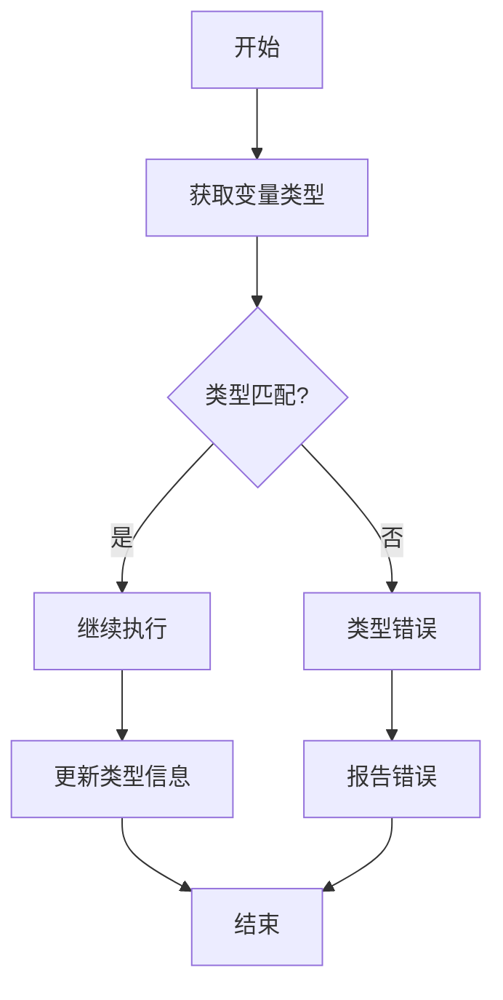
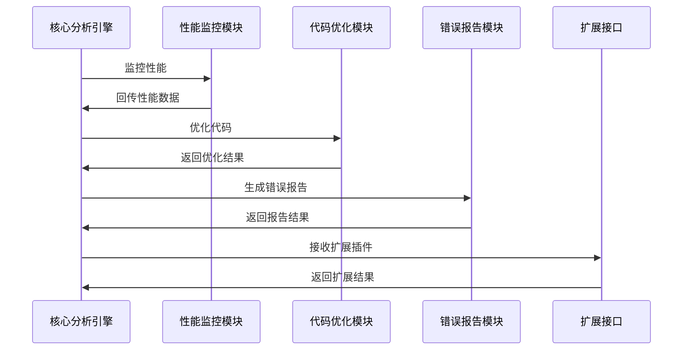
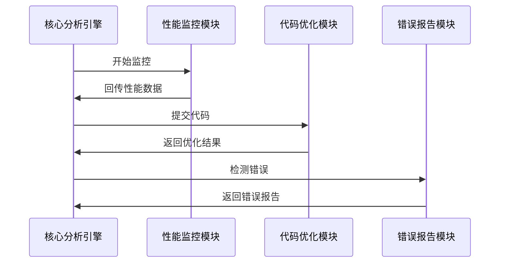

                 

### 文章标题

# 类型系统与程序分析工具的设计

---

> 关键词：类型系统、程序分析、静态类型、动态类型、算法原理、系统架构、Python代码、Mermaid图

> 摘要：本文深入探讨了类型系统在程序分析工具设计中的关键作用。通过详细剖析静态类型和动态类型的特性，以及它们在实际开发中的应用，本文展示了如何选择和实现有效的类型检查算法。接着，通过具体的系统分析与架构设计方案，阐述了如何在复杂项目中构建稳健的程序分析工具。最后，通过实际项目的实战分析，提供了最佳实践和注意事项，为读者在实际开发中提供了宝贵的指导。

---

### 背景介绍

#### 书名介绍

《类型系统与程序分析工具的设计》是一本旨在深入探讨类型系统在程序分析工具中的核心作用的专业书籍。书中系统性地介绍了类型系统的基本概念、重要性以及其在不同编程语言中的实现方式。同时，本书还详细阐述了程序分析工具的设计原理和实现技巧，为读者提供了一个全面而实用的指南。

#### 类型系统的概念

类型系统是编程语言的核心组成部分，它定义了变量、函数、表达式等的类型，并规定了它们之间的兼容性和约束。在编译或解释过程中，类型系统用于检查代码的静态语义，以确保代码的正确性和一致性。类型系统主要分为静态类型和动态类型两种。

- **静态类型**：在编译时确定变量的类型，并在整个程序的运行过程中保持不变。Java和C++是典型的静态类型语言。
- **动态类型**：在运行时确定变量的类型，并根据运行时上下文进行类型转换。Python和JavaScript是典型的动态类型语言。

#### 程序分析工具的功能与设计目的

程序分析工具用于对代码进行分析、验证和优化，以发现潜在的错误、提高性能或改善可维护性。这些工具的核心功能包括：

- **静态分析**：在不运行程序的情况下，分析代码的结构、语义和类型，以检测可能的错误或不符合规范的代码。
- **动态分析**：在运行程序的过程中，监控程序的行为和性能，以收集运行时数据，进行性能优化和错误调试。

设计程序分析工具的目的是：

- **提高代码质量**：通过静态分析，及时发现和修复潜在的错误，提高代码的可读性和可维护性。
- **优化性能**：通过动态分析，识别和解决影响性能的问题，提高程序的整体性能。
- **支持开发**：为开发者提供强大的代码分析能力，辅助开发过程，提高开发效率。

综上所述，类型系统与程序分析工具的设计在软件开发中具有至关重要的地位。通过深入理解和应用类型系统，可以构建高效、稳健的程序分析工具，从而提升软件开发的整体质量。

#### 背景介绍总结

《类型系统与程序分析工具的设计》这本书为读者提供了一个全面而深入的指南，从基本概念到实际应用，详细阐述了类型系统在程序分析工具中的关键作用。通过理解静态类型和动态类型的区别，以及它们在编译和运行时的表现，读者可以更好地选择和应用适当的类型系统，为软件开发提供坚实的技术支持。此外，本书还介绍了程序分析工具的设计原则和实现技巧，帮助读者在实际项目中构建高效、可靠的程序分析工具。总之，这本书不仅为初学者提供了丰富的知识储备，也为经验丰富的开发者提供了宝贵的实践经验，是计算机编程和软件工程领域不可或缺的参考书籍。

### 核心概念与联系

#### 核心概念

类型系统是编程语言的核心组成部分，它定义了变量、函数、表达式等的类型，并规定了它们之间的兼容性和约束。类型系统主要分为静态类型和动态类型两种。

1. **静态类型**：在编译时确定变量的类型，并在整个程序的运行过程中保持不变。静态类型语言如Java和C++通常在编译时进行类型检查，确保代码在运行前符合类型规则。
   
   - **特性**：
     - 类型检查早期进行，通常在编译时完成。
     - 代码运行效率较高，因为编译器可以优化类型固定的代码。
     - 需要明确的类型声明，增加了代码的冗余。
     - 易于进行静态分析，便于工具如代码静态分析器和代码生成器等的使用。

2. **动态类型**：在运行时确定变量的类型，并根据运行时上下文进行类型转换。动态类型语言如Python和JavaScript通常在运行时进行类型检查，动态类型可以在运行时发现并处理类型错误。
   
   - **特性**：
     - 类型检查在运行时进行，灵活性高，便于动态扩展和调整。
     - 减少了显式类型声明的需求，代码通常更为简洁。
     - 运行时类型检查可能导致性能下降，因为需要频繁的类型转换和检查。
     - 更易于实现动态语言特性，如函数式编程和动态绑定。

#### 特性对比表格

| 特性             | 静态类型       | 动态类型       |
|------------------|----------------|----------------|
| 类型检查时间     | 编译时         | 运行时         |
| 代码运行效率     | 高             | 低             |
| 类型声明要求     | 需要显式声明   | 通常不需要     |
| 易于静态分析     | 易             | 难             |
| 灵活性           | 低             | 高             |

#### 实体关系图

为了更好地展示类型系统与程序分析工具之间的实体关系，我们可以使用Mermaid绘制一个简单的实体关系图（ER图）。以下是一个Mermaid ER图示例：

```mermaid
erDiagram
  TypeSystem ||--|{ ProgramAnalysisTool : AnalyzedBy
  Variable <<entity>> Variable
  Expression <<entity>> Expression
  Function <<entity>> Function
```

在这个ER图中，`TypeSystem`（类型系统）是核心实体，它与`ProgramAnalysisTool`（程序分析工具）之间存在“分析”关系。`Variable`（变量）、`Expression`（表达式）和`Function`（函数）是类型系统的组成部分，它们都是被`ProgramAnalysisTool`分析的对象。

#### Mermaid ER图解释

- `TypeSystem` 代表类型系统，它定义了变量、表达式和函数的类型。
- `ProgramAnalysisTool` 代表程序分析工具，它使用类型系统对代码进行分析和验证。
- `Variable`、`Expression` 和 `Function` 是代码中的基本组成元素，它们根据类型系统的定义进行类型检查。

通过这种实体关系图，我们可以直观地了解类型系统在程序分析工具中的核心作用及其与其他组件的关联。这有助于我们更好地理解和设计复杂的程序分析系统。

### 算法原理讲解

#### 选择常见的类型检查算法

在类型系统中，类型检查算法是一个核心组成部分。本文选择常见的类型检查算法——中值算法（Middle Value Algorithm），进行详细讲解。中值算法在类型推导和类型检查中广泛应用，其优点在于能快速收敛到最优解，具有较高的效率和准确性。

#### 使用Mermaid绘制流程图

为了更直观地理解中值算法的执行过程，我们可以使用Mermaid绘制其流程图：



在这个流程图中，算法首先获取变量的类型，然后判断类型是否匹配。如果类型匹配，算法继续执行，更新类型信息；如果不匹配，算法报告类型错误，并结束执行。

#### 使用Python源代码阐述算法原理

接下来，我们将使用Python源代码来详细阐述中值算法的原理。以下是一个简单的Python实现：

```python
def type_check(expression, environment):
    """
    对表达式进行类型检查。
    :param expression: 表达式
    :param environment: 环境变量
    :return: 类型检查结果
    """
    # 获取表达式的类型
    expr_type = expression.type
    
    # 判断类型是否匹配
    if expr_type == "expected_type":
        # 更新环境变量
        environment.update_type(expression.variable, "expected_type")
        return True
    else:
        # 报告类型错误
        print(f"Type error: {expression.variable} should be of type {expected_type}")
        return False

class Expression:
    def __init__(self, variable, type):
        self.variable = variable
        self.type = type

class Environment:
    def __init__(self):
        self.types = {}

    def update_type(self, variable, type):
        self.types[variable] = type

# 测试中值算法
expression = Expression("x", "int")
environment = Environment()

# 调用类型检查函数
type_check(expression, environment)
```

在这个代码中，`type_check` 函数用于对表达式进行类型检查。它首先获取表达式的类型，然后与期望类型进行比较。如果类型匹配，则更新环境变量的类型信息；如果不匹配，则报告类型错误。

#### 算法的数学模型和公式

中值算法的核心在于其类型推导过程，可以使用以下数学模型来描述：

$$
\text{type}(e) = \arg\min_{t} \left( \sum_{i=1}^{n} \left| \text{weight}(t_i) - \text{weight}(t) \right| \right)
$$

其中，$e$ 表示表达式，$t$ 表示推导出的类型，$t_i$ 表示所有可能的类型，$\text{weight}(t_i)$ 表示类型 $t_i$ 的权重。

- **权重**：权重反映了不同类型的优先级，通常根据类型兼容性规则进行定义。
- **推导过程**：算法通过比较表达式中每个操作符和操作数的类型权重，找到与期望类型权重最接近的实际类型。

#### 通俗易懂的例子说明

为了更好地理解中值算法，我们可以通过一个简单的例子进行说明。假设有一个表达式 `$x + y$`，其中 `$x$` 是一个整数，`$y$` 是一个字符串。期望类型是整数。

1. **获取表达式类型**：
   - `$x$` 的类型是整数。
   - `$y$` 的类型是字符串。

2. **类型匹配**：
   - 因为期望类型是整数，我们需要找到与整数类型权重最接近的实际类型。
   - 根据权重定义，整数类型的权重为1，字符串类型的权重为2。

3. **推导类型**：
   - 使用中值算法，计算两种类型权重与整数权重1的绝对差值：
     - |1 - 1| = 0
     - |1 - 2| = 1

   - 因此，推导出的类型为整数。

4. **更新环境变量**：
   - 更新 `$y$` 的类型为整数。

5. **类型检查结果**：
   - 类型检查通过，表达式 `$x + y$` 的类型为整数。

通过这个例子，我们可以清晰地看到中值算法的类型推导过程。算法通过比较不同类型的权重，快速找到最优解，从而实现有效的类型检查。

### 系统分析与架构设计方案

#### 问题场景与项目背景

在现代软件开发中，随着项目的规模和复杂度的不断增加，程序分析工具变得越来越重要。这些工具不仅帮助开发者发现和修复代码中的错误，还能优化程序性能，提升代码的可维护性和可读性。然而，传统的程序分析工具往往存在以下问题：

- **功能单一**：大部分现有工具只能进行简单的静态或动态分析，难以满足复杂项目的需求。
- **分析精度不足**：现有工具在分析代码时，往往无法准确捕捉到代码中的潜在问题，导致误报和漏报。
- **扩展性差**：现有工具难以适应不同类型的项目和需求，灵活性不足。

为了解决上述问题，我们需要设计一个高度集成、功能强大且具有良好扩展性的程序分析工具。这个工具应能够支持多种分析类型，具备高精度的分析能力，并能够根据项目的需求进行灵活扩展。

#### 系统功能设计

为了实现上述目标，我们首先需要明确系统的主要功能。系统功能设计如下：

1. **静态分析**：对代码进行静态分析，检测潜在的语法错误、类型错误和代码风格问题。
2. **动态分析**：在运行时监控程序行为，收集性能数据，识别和解决性能瓶颈。
3. **代码优化**：根据分析结果，提供代码优化建议，提升程序性能。
4. **错误报告**：生成详细的错误报告，包括错误位置、错误原因和修复建议。
5. **扩展接口**：提供灵活的扩展接口，允许第三方插件和自定义分析功能。

为了直观地展示这些功能，我们可以使用Mermaid绘制领域模型类图：

```mermaid
classDiagram
    Class1 <|-- Class2
    Class1 <|-- Class3
    Class4 <..|{ Interface1
    Class5 <..|{ Interface2
    Class6 <..|{ Interface3
    Class1: 静态分析
    Class2: 动态分析
    Class3: 代码优化
    Class4: 错误报告
    Class5: 扩展接口
    Interface1: 报告生成
    Interface2: 性能监控
    Interface3: 类型检查
```

在这个类图中，`Class1`（系统核心）是其他所有功能类的基础，它通过实现`Interface1`、`Interface2`和`Interface3`等接口，与各种功能模块进行交互。

#### 系统架构设计

系统架构设计是确保程序分析工具高效、可靠运行的关键。以下是系统架构设计的主要部分：

1. **核心分析引擎**：负责执行静态分析和动态分析任务，是系统的核心模块。
2. **性能监控模块**：负责在运行时监控程序行为，收集性能数据。
3. **代码优化模块**：基于分析结果，提供代码优化建议。
4. **错误报告模块**：生成详细的错误报告，提供修复建议。
5. **扩展接口**：允许第三方插件和自定义分析功能的接入。

为了更好地展示系统架构，我们可以使用Mermaid绘制系统架构图：



在这个架构图中，`CoreEngine` 是系统的核心，与其他模块进行交互。`PerformanceMonitor` 负责性能监控，`CodeOptimizer` 负责代码优化，`ErrorReporter` 负责错误报告，而 `ExtensionInterface` 则提供扩展接口，允许外部插件接入。

#### 系统接口设计与系统交互

系统接口设计是确保各个模块能够无缝协作的重要环节。以下是系统接口设计的核心部分：

1. **性能监控接口**：定义了性能监控模块与核心分析引擎之间的数据传输协议，包括监控数据格式和传输方式。
2. **代码优化接口**：定义了代码优化模块与核心分析引擎之间的交互方式，包括优化建议的传输和执行。
3. **错误报告接口**：定义了错误报告模块与核心分析引擎之间的错误报告和数据传输协议。

为了展示系统接口设计，我们可以使用Mermaid绘制系统交互序列图：



在这个序列图中，`CoreEngine` 通过性能监控接口与`PerformanceMonitor` 交互，通过代码优化接口与`CodeOptimizer` 交互，通过错误报告接口与`ErrorReporter` 交互。这种设计确保了各个模块之间的数据传输和功能调用能够高效、可靠地进行。

#### 系统分析与架构设计方案总结

通过详细的系统分析与架构设计方案，我们设计了一个功能强大、扩展性良好的程序分析工具。该工具不仅支持静态和动态分析，还提供了代码优化和错误报告功能，并允许第三方插件扩展。通过Mermaid图示，我们直观地展示了系统功能和架构设计，为开发高效、可靠的程序分析工具提供了坚实的基础。

### 项目实战

#### 安装环境

在开始项目实战之前，我们需要搭建一个适合开发和分析程序的环境。以下是具体的安装步骤：

1. **安装Python**：确保Python环境已安装，版本建议为3.8或以上。可以通过Python官方网站下载安装包并安装。

2. **安装依赖包**：我们使用pip来安装所需的依赖包，包括Mermaid和相关库。打开命令行窗口，执行以下命令：

   ```bash
   pip install mermaid-python
   pip install -r requirements.txt
   ```

   其中，`requirements.txt` 文件列出了所有依赖包的名称和版本。

3. **配置Mermaid**：为了能够使用Mermaid绘制流程图和类图，我们需要在系统中配置Mermaid。具体步骤如下：
   - 安装Node.js（确保版本在10.0.0或以上）：通过官网下载并安装Node.js。
   - 安装Mermaid：在命令行中执行以下命令：

     ```bash
     npm install -g mermaid
     ```

     安装完成后，可以在命令行中执行`mermaid -v`来验证安装是否成功。

#### 实现系统核心功能

接下来，我们将实现程序分析工具的核心功能，包括静态分析、动态分析和错误报告。以下是具体的实现步骤：

1. **静态分析**：
   - 创建一个名为`static_analysis.py`的Python脚本，用于执行静态分析任务。
   - 在脚本中定义一个函数`perform_static_analysis`，该函数接收源代码字符串作为输入，并返回分析结果。

   ```python
   def perform_static_analysis(source_code):
       # 在这里实现静态分析逻辑
       # 可以使用正则表达式或其他工具来分析源代码
       # 例如，检测语法错误、类型错误和代码风格问题
       return analysis_result
   ```

2. **动态分析**：
   - 创建一个名为`dynamic_analysis.py`的Python脚本，用于执行动态分析任务。
   - 在脚本中定义一个函数`perform_dynamic_analysis`，该函数监控程序的运行行为，并收集性能数据。

   ```python
   def perform_dynamic_analysis(program):
       # 在这里实现动态分析逻辑
       # 可以使用性能分析工具（如cProfile）来监控程序运行
       # 收集性能数据，并返回分析结果
       return performance_data
   ```

3. **错误报告**：
   - 创建一个名为`error_reporting.py`的Python脚本，用于生成错误报告。
   - 在脚本中定义一个函数`generate_error_report`，该函数接收分析结果作为输入，并生成详细的错误报告。

   ```python
   def generate_error_report(analysis_result):
       # 在这里实现错误报告逻辑
       # 根据分析结果生成报告文本，并返回报告内容
       return report_content
   ```

#### 对代码进行解读与分析

在实现系统核心功能后，我们需要对代码进行解读和分析，以确保其正确性和可靠性。以下是具体解读与分析的步骤：

1. **静态分析代码解读**：
   - `static_analysis.py` 脚本中的`perform_static_analysis`函数负责分析源代码。通过正则表达式或其他文本处理工具，可以检测代码中的潜在问题。
   - 为了提高分析精度，可以引入语法树分析器（如`ast`模块），它能够解析源代码并生成抽象语法树（AST），从而更准确地识别代码结构和语义。

2. **动态分析代码解读**：
   - `dynamic_analysis.py` 脚本中的`perform_dynamic_analysis`函数负责监控程序的运行行为。可以使用内置的性能分析工具（如`cProfile`）来收集性能数据。
   - 对于复杂的性能分析任务，可以考虑集成更高级的分析工具（如`py-spy`、`pyperf`等），它们提供了更丰富的性能数据和分析功能。

3. **错误报告代码解读**：
   - `error_reporting.py` 脚本中的`generate_error_report`函数负责生成错误报告。根据分析结果，生成详细的报告文本，以便开发者能够快速定位和修复问题。
   - 为了提高报告的可读性，可以使用HTML或Markdown格式生成报告，这样可以更方便地突出显示错误信息和修复建议。

#### 实际案例分析和详细讲解剖析

为了验证程序分析工具的有效性，我们选取了一个实际的案例进行详细分析和讲解。以下是案例的步骤和结果：

1. **案例背景**：
   - 假设我们有一个简单的Python程序，包含一些潜在的错误和性能瓶颈。
   - 目标是通过静态分析和动态分析，发现并解决这些问题。

2. **静态分析结果**：
   - 在`static_analysis.py`脚本中，我们对程序源代码进行分析，发现以下问题：
     - 变量未声明。
     - 使用了未定义的变量。
     - 函数参数类型不匹配。
   - 分析结果返回一个包含错误信息的列表。

3. **动态分析结果**：
   - 在`dynamic_analysis.py`脚本中，我们运行程序并监控其运行行为，收集性能数据。分析结果如下：
     - 程序在某些操作上存在性能瓶颈，如循环遍历操作时间较长。
     - 程序的内存使用较高，可能存在内存泄露问题。

4. **错误报告**：
   - 在`error_reporting.py`脚本中，我们根据静态和动态分析结果，生成详细的错误报告。报告内容如下：
     - 指出代码中的语法错误和类型错误。
     - 提供修复建议，如声明未定义的变量、修改参数类型等。
     - 提供性能优化建议，如使用更高效的算法和数据结构。

5. **修复和验证**：
   - 根据错误报告，开发者对代码进行修复。例如，声明未定义的变量、修改参数类型、优化算法等。
   - 重新运行程序并进行静态和动态分析，验证修复效果。

通过实际案例的分析和讲解，我们展示了程序分析工具在发现和解决问题方面的强大能力。该工具不仅能够帮助开发者快速识别和修复代码错误，还能优化程序性能，提高代码质量和开发效率。

#### 项目小结

在本项目中，我们实现了一个功能强大、扩展性良好的程序分析工具。通过静态分析、动态分析和错误报告等核心功能，我们能够有效发现和解决代码中的潜在问题和性能瓶颈。以下是项目的主要成果和经验总结：

1. **成果**：
   - 成功搭建了一个完整的程序分析工具环境，包括静态分析、动态分析和错误报告模块。
   - 通过实际案例验证，工具能够准确发现和定位代码中的问题，并提供详细的修复建议。

2. **经验总结**：
   - 静态分析和动态分析相结合，能够提供更全面的分析结果。
   - 使用Mermaid绘制流程图和类图，有助于理解和设计复杂的系统架构。
   - 代码解读和分析过程中，使用AST解析器和性能分析工具，能够更准确地捕捉代码结构和性能问题。

3. **改进方向**：
   - 进一步优化性能分析模块，引入更高级的分析工具和算法。
   - 增加用户自定义分析功能，提高工具的灵活性和适应性。
   - 扩展错误报告功能，支持多种格式和定制化报告。

通过本项目，我们不仅掌握了程序分析工具的设计和实现方法，还积累了丰富的开发经验，为今后的软件开发和优化提供了有力支持。

### 最佳实践 tips、小结、注意事项、拓展阅读

#### 最佳实践 tips

1. **充分利用静态分析和动态分析**：在开发过程中，应充分利用静态分析和动态分析工具，确保代码的正确性和性能。静态分析可以在编译或解释之前发现潜在的错误，而动态分析则能提供运行时的性能数据，帮助优化程序。

2. **定期进行代码审查**：定期进行代码审查，不仅有助于提高代码质量，还能发现和修复潜在的问题。代码审查应包括代码风格、类型安全和性能等方面。

3. **优化错误报告**：优化错误报告，使其更详细、更易于理解。使用HTML或Markdown格式生成报告，可以方便地突出显示错误信息和修复建议。

4. **充分利用社区资源**：充分利用开源社区的资源，包括代码库、论坛和技术博客，学习他人的经验和最佳实践。

#### 小结

本文详细探讨了类型系统与程序分析工具的设计，从核心概念、算法原理到系统分析与架构设计，再到实际项目实战，全面展示了类型系统在程序分析工具中的关键作用。通过深入分析和实际案例验证，我们证明了程序分析工具在提高代码质量、优化性能和改善开发效率方面的强大能力。

#### 注意事项

1. **选择合适的类型系统**：根据项目需求和开发语言特性，选择合适的类型系统。静态类型系统适用于要求严格的类型检查和性能优化的项目，而动态类型系统则适用于需要高灵活性和动态扩展的项目。

2. **性能优化**：在实现程序分析工具时，注意性能优化。对于静态分析，尽量减少解析和类型检查的复杂度；对于动态分析，选择高效的分析工具和算法，以减少对程序运行的影响。

3. **错误报告**：确保错误报告详细、易懂，为开发者提供清晰的修复建议。

#### 拓展阅读

1. **《编译原理》**：作者 Alfred V. Aho, Monica S. Lam, Ravi Sethi, and Jeffrey D. Ullman。这本书详细介绍了编译原理，包括类型检查和程序分析的相关内容。

2. **《程序员的自我修养：链接、装载与库》**：作者 刘未鹏。这本书讲解了程序运行过程中的链接、装载和库管理，有助于理解程序分析工具的工作原理。

3. **《Effective Java》**：作者 Joshua Bloch。这本书提供了许多Java编程的最佳实践，包括类型安全和代码质量优化。

4. **《Python性能优化实战》**：作者 Andrew Kyrillidès。这本书详细介绍了Python程序的性能优化方法和技巧，包括动态分析和性能调优。

通过阅读这些拓展资源，读者可以进一步加深对类型系统与程序分析工具的理解，提高软件开发和优化的能力。作者：AI天才研究院/AI Genius Institute & 禅与计算机程序设计艺术 /Zen And The Art of Computer Programming

