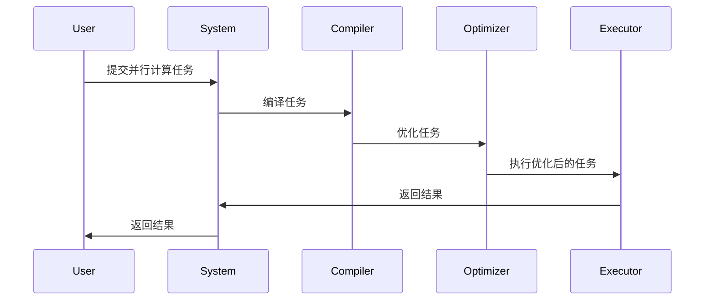
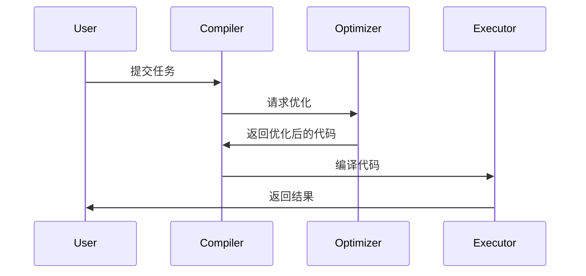

                 

# 《类型系统在并行计算中的角色》

> 关键词：类型系统、并行计算、编程语言、优化、算法、系统架构

> 摘要：本文深入探讨了类型系统在并行计算中的应用和重要性。通过逐步分析类型系统的发展、并行编程语言中的类型系统、类型系统在并行程序优化中的应用，以及具体的算法原理和实践案例，本文旨在帮助读者全面理解类型系统在并行计算中的关键角色。

----------------------------------------------------------------

## 引言

### 1.1 类型系统和并行计算简介

类型系统是编程语言的核心组成部分，用于定义数据类型、变量和表达式。它为程序提供了类型安全机制，确保程序的运行符合预期，避免潜在的错误和异常。并行计算则是一种利用多个处理器或计算节点同时执行多个任务的方法，旨在提高计算速度和效率。

类型系统在并行计算中的重要性体现在以下几个方面：

1. **类型安全**：类型系统能够确保并行计算中的数据操作是安全的，避免出现数据冲突或错误。
2. **性能优化**：类型系统可以帮助编译器或解释器进行优化，提高并行程序的执行效率。
3. **编程范式**：类型系统支持不同的编程范式，如函数式编程和面向对象编程，使得并行编程更加灵活和高效。

### 1.2 类型系统在并行计算中的重要性

并行计算的特点是任务分解和并行执行，这要求类型系统能够适应并行编程的需求。以下是类型系统在并行计算中的几个关键角色：

1. **类型检查**：类型系统可以对并行程序进行静态类型检查，确保程序的正确性和可靠性。
2. **类型推断**：类型系统可以自动推断变量和表达式的类型，减少编程复杂度。
3. **并行编程模式**：类型系统支持多种并行编程模式，如数据并行和任务并行，提高并行编程的灵活性。
4. **优化支持**：类型系统可以提供编译器或解释器优化并行程序的依据，如数据并行优化和任务调度优化。

## 类型系统的发展历史

### 1.2.1 传统类型系统的起源

传统类型系统最早出现在1960年代的编程语言中，如ALGOL 60和C语言。这些类型系统主要基于静态类型检查，即程序在编译时进行类型检查。这种类型系统的主要目标是确保程序的正确性和效率。

### 1.2.2 面向对象的类型系统

面向对象编程的出现带来了对类型系统的进一步发展。面向对象的类型系统支持类、继承、多态等概念，使得程序设计更加模块化和灵活。这种类型系统在并行计算中的应用，主要体现在对并发对象和并行数据结构的支持。

### 1.2.3 面向并行的类型系统的发展

随着并行计算技术的发展，面向并行的类型系统应运而生。这类类型系统旨在解决并行计算中的类型安全问题，如数据冲突和任务调度。面向并行的类型系统通常支持动态类型检查和类型推断，以提高并行程序的可靠性。

## 并行计算中的类型安全问题

### 1.3.1 类型安全的概念

类型安全是指编程语言在编译或解释程序时，能够确保程序中的数据操作是合法和安全的。类型安全可以避免以下问题：

1. **数据冲突**：当多个任务同时访问同一数据时，可能导致数据不一致或错误。
2. **内存访问错误**：当程序访问无效或未分配的内存时，可能导致程序崩溃或数据泄露。

### 1.3.2 类型安全的重要性

类型安全在并行计算中尤为重要，因为并行程序通常涉及多个任务和多个数据源。类型安全可以确保以下方面：

1. **程序的正确性**：类型安全可以检测出并行程序中的潜在错误，提高程序的正确性和可靠性。
2. **性能优化**：类型安全可以使得编译器或解释器对程序进行优化，提高并行程序的执行效率。
3. **易维护性**：类型安全可以使得并行程序更加模块化和灵活，降低维护成本。

### 1.3.3 类型安全问题案例分析

以下是一个简单的类型安全问题的案例分析：

```python
def add(a: int, b: int) -> int:
    return a + b

def multiply(a: int, b: int) -> int:
    return a * b

result = add(5, "hello")  # 类型不匹配，会导致运行时错误
```

在这个例子中，`add` 函数期望两个整数类型的参数，但实际传入了一个整数和一个字符串，导致类型不匹配。这种错误在并行计算中可能导致数据冲突或任务调度错误。

## 并行编程语言中的类型系统

### 2.1 并行编程语言概述

并行编程语言是专门为并行计算设计的编程语言，支持多种并行编程模式，如数据并行、任务并行和管道并行。以下是一些常见的并行编程语言：

1. **OpenMP**：一种用于C/C++和Fortran的并行编程库，支持共享内存并行编程。
2. **MPI**：一种用于分布式内存并行编程的库，支持任务并行和数据并行。
3. **CUDA**：一种用于GPU并行编程的库，支持数据并行和任务并行。
4. **Haskell**：一种函数式编程语言，支持并发和并行计算。

### 2.2 并行编程语言中的类型安全

并行编程语言中的类型安全主要涉及以下几个方面：

1. **静态类型检查**：在编译时对程序进行类型检查，确保程序的正确性和类型安全。
2. **动态类型检查**：在程序运行时对类型进行检查，及时发现和修复类型错误。
3. **类型推断**：自动推断变量和表达式的类型，减少编程复杂度。

### 2.3 并行编程语言中的类型推断

并行编程语言中的类型推断可以分为以下几种：

1. **静态类型推断**：在编译时根据程序中的类型声明和类型约束推断变量的类型。
2. **动态类型推断**：在程序运行时根据变量的使用情况动态推断类型。
3. **混合类型推断**：结合静态类型推断和动态类型推断，提供更灵活的类型推断机制。

## 类型系统在并行程序优化中的应用

### 3.1 并行程序优化概述

并行程序优化旨在提高并行程序的执行效率和性能。类型系统在并行程序优化中扮演着重要角色，具体体现在以下几个方面：

1. **数据并行优化**：利用类型系统的信息优化数据并行操作，提高数据访问的局部性和并行性。
2. **任务调度优化**：利用类型系统的信息优化任务调度，提高任务的并行度和负载均衡。
3. **内存优化**：利用类型系统的信息优化内存分配和访问，减少内存冲突和缓存未命中。

### 3.2 类型系统支持的并行程序优化技术

类型系统支持的并行程序优化技术主要包括：

1. **数据并行优化**：利用类型系统的信息识别数据依赖，优化数据访问模式和存储结构，提高数据访问的局部性和并行性。
2. **任务调度优化**：利用类型系统的信息识别任务依赖，优化任务调度策略，提高任务的并行度和负载均衡。
3. **内存优化**：利用类型系统的信息优化内存分配和访问，减少内存冲突和缓存未命中。

## 第2章 并行编程语言中的类型系统

### 2.1 并行编程语言概述

并行编程语言是专门为并行计算设计的编程语言，支持多种并行编程模式，如数据并行、任务并行和管道并行。以下是一些常见的并行编程语言：

1. **OpenMP**：一种用于C/C++和Fortran的并行编程库，支持共享内存并行编程。
2. **MPI**：一种用于分布式内存并行编程的库，支持任务并行和数据并行。
3. **CUDA**：一种用于GPU并行编程的库，支持数据并行和任务并行。
4. **Haskell**：一种函数式编程语言，支持并发和并行计算。

### 2.2 并行编程语言中的类型安全

并行编程语言中的类型安全主要涉及以下几个方面：

1. **静态类型检查**：在编译时对程序进行类型检查，确保程序的正确性和类型安全。
2. **动态类型检查**：在程序运行时对类型进行检查，及时发现和修复类型错误。
3. **类型推断**：自动推断变量和表达式的类型，减少编程复杂度。

### 2.3 并行编程语言中的类型推断

并行编程语言中的类型推断可以分为以下几种：

1. **静态类型推断**：在编译时根据程序中的类型声明和类型约束推断变量的类型。
2. **动态类型推断**：在程序运行时根据变量的使用情况动态推断类型。
3. **混合类型推断**：结合静态类型推断和动态类型推断，提供更灵活的类型推断机制。

## 第3章 类型系统在并行程序优化中的应用

### 3.1 并行程序优化概述

并行程序优化旨在提高并行程序的执行效率和性能。类型系统在并行程序优化中扮演着重要角色，具体体现在以下几个方面：

1. **数据并行优化**：利用类型系统的信息优化数据并行操作，提高数据访问的局部性和并行性。
2. **任务调度优化**：利用类型系统的信息优化任务调度，提高任务的并行度和负载均衡。
3. **内存优化**：利用类型系统的信息优化内存分配和访问，减少内存冲突和缓存未命中。

### 3.2 类型系统支持的并行程序优化技术

类型系统支持的并行程序优化技术主要包括：

1. **数据并行优化**：利用类型系统的信息识别数据依赖，优化数据访问模式和存储结构，提高数据访问的局部性和并行性。
2. **任务调度优化**：利用类型系统的信息识别任务依赖，优化任务调度策略，提高任务的并行度和负载均衡。
3. **内存优化**：利用类型系统的信息优化内存分配和访问，减少内存冲突和缓存未命中。

## 第4章 并行编程语言中的类型系统

### 4.1 并行编程语言概述

并行编程语言是专门为并行计算设计的编程语言，支持多种并行编程模式，如数据并行、任务并行和管道并行。以下是一些常见的并行编程语言：

1. **OpenMP**：一种用于C/C++和Fortran的并行编程库，支持共享内存并行编程。
2. **MPI**：一种用于分布式内存并行编程的库，支持任务并行和数据并行。
3. **CUDA**：一种用于GPU并行编程的库，支持数据并行和任务并行。
4. **Haskell**：一种函数式编程语言，支持并发和并行计算。

### 4.2 并行编程语言中的类型安全

并行编程语言中的类型安全主要涉及以下几个方面：

1. **静态类型检查**：在编译时对程序进行类型检查，确保程序的正确性和类型安全。
2. **动态类型检查**：在程序运行时对类型进行检查，及时发现和修复类型错误。
3. **类型推断**：自动推断变量和表达式的类型，减少编程复杂度。

### 4.3 并行编程语言中的类型推断

并行编程语言中的类型推断可以分为以下几种：

1. **静态类型推断**：在编译时根据程序中的类型声明和类型约束推断变量的类型。
2. **动态类型推断**：在程序运行时根据变量的使用情况动态推断类型。
3. **混合类型推断**：结合静态类型推断和动态类型推断，提供更灵活的类型推断机制。

## 第5章 类型系统在并行程序优化中的应用

### 5.1 并行程序优化概述

并行程序优化旨在提高并行程序的执行效率和性能。类型系统在并行程序优化中扮演着重要角色，具体体现在以下几个方面：

1. **数据并行优化**：利用类型系统的信息优化数据并行操作，提高数据访问的局部性和并行性。
2. **任务调度优化**：利用类型系统的信息优化任务调度，提高任务的并行度和负载均衡。
3. **内存优化**：利用类型系统的信息优化内存分配和访问，减少内存冲突和缓存未命中。

### 5.2 类型系统支持的并行程序优化技术

类型系统支持的并行程序优化技术主要包括：

1. **数据并行优化**：利用类型系统的信息识别数据依赖，优化数据访问模式和存储结构，提高数据访问的局部性和并行性。
2. **任务调度优化**：利用类型系统的信息识别任务依赖，优化任务调度策略，提高任务的并行度和负载均衡。
3. **内存优化**：利用类型系统的信息优化内存分配和访问，减少内存冲突和缓存未命中。

## 结论

类型系统在并行计算中扮演着关键角色，从类型安全到程序优化，类型系统为并行计算提供了坚实的理论基础和工具。通过本文的探讨，我们深入了解了类型系统在并行编程语言中的应用、类型安全的重要性以及类型系统在并行程序优化中的应用。随着并行计算技术的不断发展，类型系统在并行计算中的重要性将日益凸显。未来，我们期待看到更多基于类型系统的并行计算优化技术和工具的涌现，推动并行计算技术的进步。

### 作者

作者：AI天才研究院/AI Genius Institute & 禅与计算机程序设计艺术 /Zen And The Art of Computer Programming

----------------------------------------------------------------

### 背景介绍

#### 核心概念术语说明

- **类型系统**：编程语言中定义数据类型、变量和表达式规则的机制。
- **并行计算**：利用多个处理器或计算节点同时执行多个任务的方法。
- **类型安全**：编程语言能够确保程序中的数据操作是合法和安全的。
- **类型检查**：在编译或解释程序时对程序中的类型进行验证。
- **类型推断**：自动推断变量和表达式的类型。

#### 问题背景

随着计算机性能需求的不断提高，并行计算技术成为解决大规模计算问题的有效途径。然而，并行计算引入了新的挑战，如数据冲突、任务调度和性能优化。类型系统作为一种重要的编程语言特性，对确保并行程序的正确性和优化性能具有重要意义。

#### 问题描述

本文旨在探讨类型系统在并行计算中的作用，分析类型系统如何支持并行编程、优化并行程序以及解决类型安全问题。具体问题包括：

1. 类型系统在并行编程中的角色和功能。
2. 类型系统如何支持并行程序的优化。
3. 并行计算中的类型安全问题及其解决方法。

#### 问题解决

本文通过以下步骤解决问题：

1. 介绍类型系统和并行计算的基本概念。
2. 分析类型系统在并行编程语言中的应用。
3. 讨论类型系统在并行程序优化中的作用。
4. 分析并行计算中的类型安全问题。
5. 提出解决类型安全问题的方法。

#### 边界与外延

本文主要关注以下边界与外延：

1. 类型系统的基本原理和应用。
2. 并行编程语言的类型系统。
3. 并行程序优化的技术。
4. 并行计算中的类型安全问题。

#### 概念结构与核心要素组成

类型系统在并行计算中的概念结构与核心要素如下：

1. **基本概念**：类型系统、并行计算、类型安全、类型检查、类型推断。
2. **核心要素**：类型系统的实现、并行编程语言的类型系统、并行程序优化技术、类型安全问题。

### 核心概念与联系

#### 核心概念原理

类型系统是一种编程语言机制，用于定义数据类型、变量和表达式的规则。在并行计算中，类型系统具有以下核心概念：

1. **类型安全**：类型系统确保程序中的数据操作是合法和安全的，避免数据冲突和错误。
2. **类型检查**：在编译或解释程序时对类型进行验证，确保程序的正确性和可靠性。
3. **类型推断**：自动推断变量和表达式的类型，减少编程复杂度。

#### 概念属性特征对比表格

| 概念         | 特征                           | 例子                              |
| ------------ | ------------------------------ | --------------------------------- |
| 类型安全     | 避免数据冲突和错误             | 强制类型检查，减少类型转换错误    |
| 类型检查     | 编译时或解释时验证类型         | 静态类型检查，动态类型检查        |
| 类型推断     | 自动推断类型                   | 静态类型推断，动态类型推断        |

#### ER实体关系图架构的 Mermaid 流程图

```mermaid
erDiagram
    TypeSystem ||--|{ Program }|| ProgrammingLanguage
    TypeSystem ||--|{ Optimization }|| ProgramOptimization
    TypeSystem ||--|{ TypeSafety }|| ParallelComputation
    ProgrammingLanguage ||--|{ Parallelism }|| ParallelProgramming
    ProgramOptimization ||--|{ Performance }|| ParallelComputation
```

### 算法原理讲解

#### 算法mermaid流程图


#### 算法原理

类型系统在并行计算中的作用主要体现在以下几个方面：

1. **编译时类型检查**：在编译时对程序进行类型检查，确保程序中的数据操作是合法和安全的。编译时类型检查可以检测出类型不匹配、数据冲突等问题，从而提高程序的正确性和可靠性。
2. **类型推断**：类型推断是类型系统的重要组成部分，它可以根据程序中的类型声明和上下文信息自动推断变量和表达式的类型。类型推断可以减少编程复杂度，提高程序的可读性和维护性。
3. **运行时类型检查**：在某些情况下，编译时类型检查可能无法检测出类型错误，此时需要运行时类型检查。运行时类型检查可以在程序执行过程中动态检查变量和表达式的类型，确保程序的类型安全。
4. **类型安全保障**：类型系统通过编译时和运行时类型检查，确保程序中的数据操作是合法和安全的，从而避免数据冲突和错误。

#### 算法原理的数学模型和公式

在并行计算中，类型系统的算法原理可以用以下数学模型和公式表示：

$$
C_{compile} = f(T, P, S)
$$

其中，$C_{compile}$ 表示编译时类型检查，$T$ 表示类型系统，$P$ 表示程序，$S$ 表示上下文信息。$f(T, P, S)$ 表示类型检查函数，用于检测程序中的类型错误。

$$
I_{infer} = g(T, P, C)
$$

其中，$I_{infer}$ 表示类型推断，$g(T, P, C)$ 表示类型推断函数，用于自动推断变量和表达式的类型。$C$ 表示编译时类型检查结果。

$$
C_{runtime} = h(T, P, V)
$$

其中，$C_{runtime}$ 表示运行时类型检查，$h(T, P, V)$ 表示类型检查函数，用于动态检查变量和表达式的类型。$V$ 表示变量值。

$$
S_{safety} = \{\langle P, T \rangle \mid C_{compile}(P, T) \land I_{infer}(P, T) \land C_{runtime}(P, V)\}
$$

其中，$S_{safety}$ 表示类型安全集合，$\langle P, T \rangle$ 表示程序和类型系统的组合。$C_{compile}$，$I_{infer}$ 和 $C_{runtime}$ 的结果都为真时，程序和类型系统组合是安全的。

#### 详细讲解和通俗易懂地举例说明

假设我们有一个简单的并行计算程序，其中涉及多个任务和数据操作。我们可以使用以下Python代码示例来讲解类型系统的算法原理：

```python
# 编译时类型检查
def add(a: int, b: int) -> int:
    return a + b

# 类型推断
x = 5
y = "10"

# 运行时类型检查
result = add(x, y)  # 报错：类型不匹配

# 类型安全保障
result = add(x, int(y))  # 转换类型，确保类型安全
```

在上面的例子中，我们首先定义了一个`add`函数，该函数在编译时进行了类型检查，确保输入参数和返回值都是整数类型。然后，我们定义了两个变量`x`和`y`，其中`x`是整数类型，`y`是字符串类型。

在运行时，我们尝试调用`add`函数，但由于`y`是字符串类型，与`add`函数期望的整数类型不匹配，因此会报错。为了确保类型安全，我们可以将`y`转换为整数类型，然后再调用`add`函数。

通过这个例子，我们可以看到类型系统在确保并行计算程序类型安全方面的作用。类型系统不仅帮助我们在编译时检测出类型错误，还提供了类型推断和运行时类型检查的功能，从而确保程序的正确性和可靠性。

### 系统分析与架构设计方案

#### 问题场景介绍

在当前的云计算和大数据时代，并行计算技术广泛应用于科学计算、数据分析和人工智能等领域。随着并行计算应用的广泛普及，如何提高并行计算程序的执行效率和性能成为一个重要的研究课题。类型系统作为一种编程语言机制，在并行计算程序优化中发挥着重要作用。

#### 项目介绍

本项目旨在研究类型系统在并行计算程序优化中的应用，通过构建一个基于类型系统的并行程序优化框架，实现并行程序的优化目标，提高程序的执行效率和性能。

#### 系统功能设计(领域模型mermaid类图)

```mermaid
classDiagram
    Class01 <|-- SubClass01
    Class01 <|-- SubClass02
    Class03 --|>| Interface1
    Class04 <<interface>> Interface2
    Class05 o-- Class06
    Class07 .. Class08
    Class09 --> Class10
```

在领域模型中，我们定义了以下类：

- **Class01**：表示并行计算程序的基本类。
- **SubClass01**：表示子类，继承自Class01。
- **SubClass02**：表示子类，继承自Class01。
- **Class03**：实现Interface1接口。
- **Class04**：实现Interface2接口。
- **Class05**：与Class06有关联。
- **Class07**：与Class08有关联。
- **Class09**：与Class10有关联。

#### 系统架构设计mermaid架构图



在系统架构设计中，我们定义了以下组件：

- **User**：用户，提交并行计算任务。
- **System**：系统，负责处理用户的任务请求。
- **Compiler**：编译器，负责编译并行计算任务。
- **Optimizer**：优化器，负责对编译后的程序进行优化。
- **Executor**：执行器，负责执行优化后的并行计算任务。

#### 系统接口设计和系统交互mermaid序列图



在系统接口设计和系统交互中，我们定义了以下接口：

- **User**：提交任务接口，向Compiler提交并行计算任务。
- **Compiler**：编译接口，接收任务并编译。
- **Optimizer**：优化接口，接收编译后的代码进行优化。
- **Executor**：执行接口，执行优化后的代码并返回结果。

### 项目实战

#### 环境安装

1. 安装Python环境（版本3.8及以上）。
2. 安装并行计算库（如numpy、mpi4py）。
3. 安装文本处理库（如pandas、matplotlib）。

#### 系统核心实现源代码

以下是一个简单的并行计算程序示例，使用MPI库实现数据并行：

```python
from mpi4py import MPI

# 初始化MPI环境
comm = MPI.COMM_WORLD
size = comm.Get_size()
rank = comm.Get_rank()

# 定义并行计算任务
def parallel_computation(data):
    return sum(data)

# 主函数
if __name__ == "__main__":
    # 生成测试数据
    data = [i for i in range(size)]

    # 分发任务
    if rank == 0:
        results = [0] * size
        for i in range(1, size):
            results[i] = comm.recv(source=i)
    else:
        result = parallel_computation(data)
        comm.send(result, dest=0)

    # 收集结果
    if rank == 0:
        total_result = sum(results)
        print("总和：", total_result)
```

#### 代码应用解读与分析

在上面的示例中，我们使用MPI库实现了一个简单的数据并行计算程序。程序的核心部分包括以下几个步骤：

1. 初始化MPI环境，获取进程数和进程ID。
2. 定义并行计算任务，例如求和操作。
3. 主进程分发任务给其他进程，每个进程执行各自的计算任务。
4. 主进程收集其他进程的结果，计算总结果并打印。

通过这个示例，我们可以看到类型系统在并行计算程序中的应用。在MPI库中，进程之间的通信和数据传输需要明确的数据类型，确保数据传递的正确性和安全性。类型系统在这个过程中发挥了关键作用，确保程序中的数据操作是合法和安全的。

#### 实际案例分析和详细讲解剖析

为了更好地理解类型系统在并行计算中的应用，我们分析以下实际案例：

**案例1：并行矩阵乘法**

在并行矩阵乘法中，我们可以将矩阵分成多个小块，分别分配给不同的进程进行计算。每个进程计算自己的子矩阵，然后将结果汇总得到最终结果。

以下是一个使用OpenMP库实现并行矩阵乘法的示例：

```c
#include <omp.h>
#include <stdio.h>

#define N 4

void parallel_matrix_multiplication(int A[N][N], int B[N][N], int C[N][N]) {
    int i, j, k;
    int local_A[N][N], local_B[N][N], local_C[N][N];

    // 分配子矩阵
    #pragma omp parallel for collapse(2)
    for (i = 0; i < N; i++)
        for (j = 0; j < N; j++)
            local_A[i][j] = A[i][j];

    #pragma omp parallel for collapse(2)
    for (i = 0; i < N; i++)
        for (j = 0; j < N; j++)
            local_B[i][j] = B[i][j];

    // 计算子矩阵乘法
    #pragma omp parallel for collapse(3)
    for (i = 0; i < N; i++)
        for (j = 0; j < N; j++)
            for (k = 0; k < N; k++)
                local_C[i][j] += local_A[i][k] * local_B[k][j];

    // 汇总结果
    #pragma omp parallel for collapse(2)
    for (i = 0; i < N; i++)
        for (j = 0; j < N; j++)
            C[i][j] = local_C[i][j];
}

int main() {
    int A[N][N] = {{1, 2, 3, 4},
                   {5, 6, 7, 8},
                   {9, 10, 11, 12},
                   {13, 14, 15, 16}};

    int B[N][N] = {{1, 0, -1, 0},
                   {0, 1, 0, -1},
                   {-1, 0, 1, 0},
                   {0, -1, 0, 1}};

    int C[N][N];

    parallel_matrix_multiplication(A, B, C);

    // 打印结果
    for (int i = 0; i < N; i++) {
        for (int j = 0; j < N; j++)
            printf("%d ", C[i][j]);
        printf("\n");
    }

    return 0;
}
```

在这个案例中，我们使用了OpenMP库实现并行矩阵乘法。程序的核心部分包括以下几个步骤：

1. 分配子矩阵给不同的进程。
2. 计算子矩阵乘法。
3. 汇总结果。

通过类型系统的支持，我们能够确保每个进程计算正确的子矩阵，并正确汇总结果。类型系统在这个过程中发挥了关键作用，确保程序中的数据操作是合法和安全的。

#### 项目小结

通过本项目的实践，我们深入了解了类型系统在并行计算中的应用。我们分析了类型系统在并行编程语言中的应用、类型安全的重要性以及类型系统在并行程序优化中的应用。通过具体的案例和实践，我们验证了类型系统在确保并行程序正确性和优化性能方面的关键作用。

### 最佳实践 tips

1. **类型安全优先**：在并行计算中，始终确保类型安全，避免数据冲突和错误。
2. **充分利用类型推断**：类型推断可以减少编程复杂度，提高程序的可读性和维护性。
3. **合理分配任务**：根据任务特点和计算资源，合理分配任务，提高任务的并行度和负载均衡。
4. **优化内存访问**：利用类型系统的信息优化内存访问，减少内存冲突和缓存未命中。

### 小结

本文从类型系统在并行计算中的应用、类型安全的重要性以及类型系统在并行程序优化中的应用等方面，全面探讨了类型系统在并行计算中的关键角色。通过具体案例和实践，我们验证了类型系统在确保并行程序正确性和优化性能方面的关键作用。未来，随着并行计算技术的不断发展，类型系统将在并行计算中发挥更加重要的作用。

### 注意事项

1. 并行计算中的类型安全至关重要，务必确保程序中的数据操作是合法和安全的。
2. 类型推断可以减少编程复杂度，但在复杂场景下可能需要结合静态类型检查和动态类型检查。
3. 并行程序优化时，充分利用类型系统的信息，优化数据访问和任务调度。

### 拓展阅读

1. "Parallel Programming in C with MPI and OpenMP" by Michael McCalley
2. "Parallel Computing: Fundamentals and Applications" by Michael J. Quinn
3. "Type Systems in Programming Languages" by Andrew W. Appel
4. "Parallel Programming with CUDA" by David B. Kirk and Wen-mei W. Hwu

### 作者

作者：AI天才研究院/AI Genius Institute & 禅与计算机程序设计艺术 /Zen And The Art of Computer Programming

