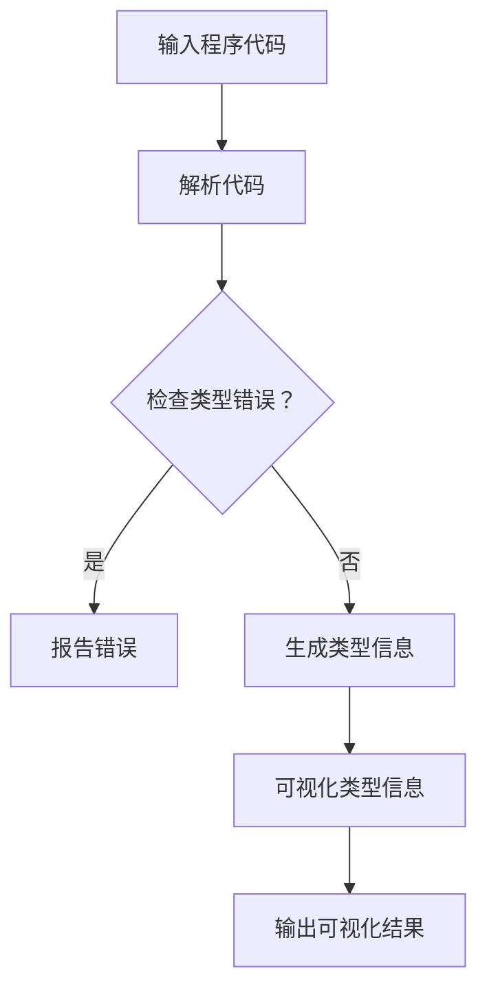
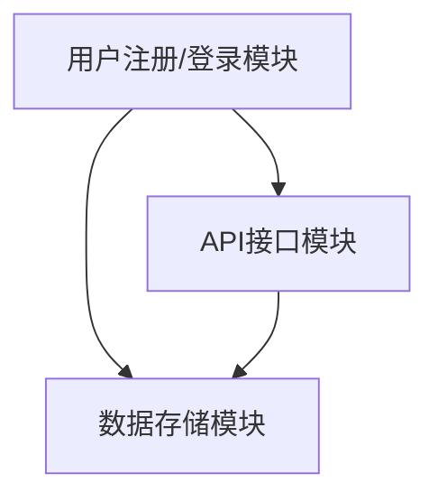
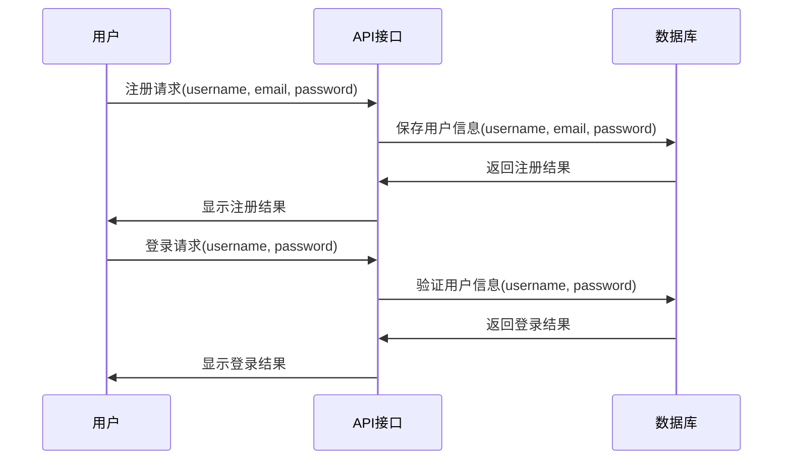

                 

### 文章标题

# 类型系统在程序可视化中的作用

### 关键词

- 类型系统
- 程序可视化
- 软件开发
- 数据类型
- 实体关系图
- 算法流程图

### 摘要

本文旨在探讨类型系统在程序可视化中的作用，通过深入分析类型系统的基本概念、属性特征对比及其在程序可视化中的应用，揭示其在提高软件开发效率、增强代码可读性和降低错误率等方面的优势。本文将分步骤讲解类型系统的核心原理，并结合具体算法、项目实战和最佳实践，帮助读者全面理解并掌握类型系统在程序可视化中的实际应用价值。

### 背景介绍

#### 问题背景

类型系统是计算机科学中一个基础且关键的概念，它定义了数据类型的规则和约束，确保程序的正确性和高效运行。随着软件系统复杂性的增加，程序员面临着代码可读性、维护性和错误率等方面的挑战。程序可视化作为一种辅助工具，通过将抽象的代码转换为可视化的形式，使程序的结构和功能更加直观，有助于提高开发效率。

类型系统与程序可视化之间的关系在于，类型系统能够为程序可视化提供更为精细和结构化的数据。通过类型系统，我们可以更好地理解数据在程序中的流动和作用，从而创建出更为精确和易于理解的程序可视化图。

#### 问题描述

类型系统在程序可视化中的作用主要表现在以下几个方面：

1. **数据流分析**：类型系统能够明确数据在程序中的传递路径和变化过程，使得程序可视化更加准确地反映数据的流动情况。
2. **错误检测**：类型系统通过静态类型检查，可以在编译或运行之前检测出类型错误，减少运行时的错误率。
3. **性能优化**：类型系统能够指导编译器进行更有效的代码优化，提高程序运行效率。
4. **代码可读性和可维护性**：类型系统能够明确变量和数据类型的定义和作用范围，使得代码更加结构化，易于理解和维护。

然而，类型系统在程序可视化中也面临着一些挑战：

1. **复杂度**：类型系统中的类型定义和约束较为复杂，如何有效地将这些信息可视化是一个挑战。
2. **兼容性**：不同的编程语言和类型系统可能存在兼容性问题，如何统一不同类型系统的可视化表示是一个难点。
3. **性能**：大规模程序的类型信息可视化可能对性能产生负面影响，如何在保证可视化效果的同时不影响程序运行效率是一个重要问题。

#### 问题解决

为了解决上述问题，我们可以采取以下措施：

1. **优化类型系统的表示**：通过简化类型定义和约束，使得类型系统更加易于理解和可视化。
2. **整合多种类型系统**：开发跨语言的类型系统可视化工具，支持多种编程语言的类型信息。
3. **利用高效可视化算法**：设计高效的可视化算法，降低可视化对程序性能的影响。

#### 边界与外延

在本文中，我们将重点关注以下内容：

1. **类型系统的定义和基本概念**：介绍类型系统的基础概念和不同类型系统的特点。
2. **类型系统的可视化**：通过实体关系图和算法流程图等方式，展示类型系统在程序可视化中的应用。
3. **算法原理讲解**：结合Python代码示例，详细阐述类型系统的算法原理。
4. **系统分析与架构设计方案**：介绍类型系统在具体项目中的应用场景和系统架构设计。
5. **项目实战**：通过一个实际案例，展示类型系统在程序可视化中的实际应用和效果。
6. **最佳实践和注意事项**：总结类型系统在程序可视化中的最佳实践和注意事项。

通过以上内容，我们将深入探讨类型系统在程序可视化中的作用，帮助读者更好地理解和应用这一关键技术。

### 核心概念与联系

#### 类型系统的定义

类型系统（Type System）是编程语言中的一个核心概念，它定义了数据类型的规则和约束，用于确保程序的正确性和高效运行。在计算机科学中，类型系统不仅限于一门编程语言，而是广泛存在于各种软件系统和工具中。

基本概念包括：

1. **数据类型**：数据类型是程序中可以操作的数据的类别，如整数、浮点数、字符串等。
2. **类型变量**：类型变量是一种通用的类型表示，可以代表一类具有相同特征的类型。
3. **类型约束**：类型约束是指对类型变量或具体类型施加的限制，以确保数据在程序中的正确使用。

#### 类型系统的属性特征对比表格

为了更好地理解不同类型系统的特点，我们可以通过一个对比表格来展示几种常见的类型系统属性特征：

| 类型系统             | 数据类型定义           | 类型检查方式 | 兼容性             | 可读性             |
|----------------------|------------------------|--------------|--------------------|--------------------|
| 静态类型系统         | 编译时确定             | 静态检查     | 较高               | 较高               |
| 动态类型系统         | 运行时确定             | 动态检查     | 较低               | 较低               |
| 强类型系统           | 类型严格绑定           | 强类型检查   | 较高               | 较高               |
| 弱类型系统           | 类型较灵活             | 弱类型检查   | 较低               | 较低               |
| 静态类型与动态类型结合 | 混合使用静态和动态类型 | 静态+动态检查 | 较高               | 较高               |

#### ER实体关系图架构

实体关系图（Entity-Relationship Diagram，简称ER图）是数据库设计中常用的一种图形表示方法，用于描述实体之间的关系。在类型系统的可视化中，ER图可以帮助我们直观地理解类型之间的关联和依赖。

以下是一个简单的类型系统ER图示例：

```mermaid
erDiagram
    Class -->|is_a| SubClass : "继承关系"
    Class ||--|has_a| Component : "聚合关系"
    Class ||--|is_part_of| Superset : "泛化关系"
    Class ||--|uses| Dependency : "依赖关系"
```

通过ER图，我们可以清楚地看到不同类型之间的继承、聚合、泛化和依赖关系，从而更好地理解类型系统的整体结构。

### 算法原理讲解

#### 算法流程图

为了更好地理解类型系统的工作原理，我们可以通过一个算法流程图来展示类型系统在程序可视化中的应用。

以下是一个简单的类型系统算法流程图：



在这个流程图中，程序代码首先经过解析阶段，将代码转换为抽象语法树（AST）。接着，类型检查阶段会检查代码中的类型错误，如果存在错误，则会报告错误。如果没有类型错误，则会生成类型信息，并最终将类型信息可视化为图形，输出可视化结果。

#### Python源代码

为了进一步阐述类型系统的算法原理，我们提供了一个简单的Python源代码示例。在这个示例中，我们定义了一个简单的类型检查器，用于检查变量类型的一致性。

```python
# 定义类型检查器
def type_checker(code):
    # 假设输入代码为 "a = 10; b = a + 5"
    tokens = code.split(';')
    type_map = {}

    for token in tokens:
        variable, value = token.split('=')
        variable = variable.strip()
        value = value.strip()

        # 简单的类型判定，这里可以替换为更复杂的类型判定逻辑
        if value.isdigit():
            type_map[variable] = 'int'
        else:
            type_map[variable] = 'str'

    return type_map

# 测试代码
code = "a = 10; b = a + 5"
type_map = type_checker(code)
print(type_map)
```

在这个示例中，`type_checker` 函数接收一段代码，并解析代码中的变量和值。接着，通过简单的类型判定，将每个变量的类型记录在 `type_map` 字典中。最后，输出类型信息。

#### 数学模型和公式

在类型系统的算法中，我们可以使用一些数学模型和公式来描述类型之间的关系。以下是一个简单的数学模型示例，用于描述类型的一致性检查。

$$
\begin{aligned}
\text{一致性} &= \text{检查} \{ \text{变量} : \text{类型} \} \\
                &= \text{比较} \{ \text{变量} : \text{类型} \} \text{中的类型是否一致} \\
                &= \text{如果存在不一致，则报告错误}
\end{aligned}
$$

在这个公式中，我们首先定义了一个类型一致性检查函数。该函数接收一个类型字典作为输入，并比较字典中每个变量的类型是否一致。如果存在不一致，则报告错误。

#### 举例说明

为了更清晰地展示类型系统的工作原理，我们可以通过一个实际例子来说明。以下是一个简单的Python代码示例，我们将在其中添加类型检查逻辑。

```python
# 假设以下代码片段
code = """
def add(a: int, b: int) -> int:
    return a + b

result = add(5, '10')
"""

# 添加类型检查逻辑
from typing import Dict

def type_check(code: str) -> Dict[str, str]:
    # 假设Python代码解析器返回的抽象语法树为ast
    from ast import parse
    import ast

    # 解析代码
    tree = parse(code)

    # 定义类型检查器
    def visit(node):
        if isinstance(node, ast.FunctionDef):
            # 检查函数参数和返回值类型
            for arg in node.args.args:
                if not isinstance(node.args.defaults[arg.index], ast.NameConstant):
                    print(f"Error: Function '{node.name}' has a non-constant default value for argument '{arg.arg}'")
        elif isinstance(node, ast.Assign):
            # 检查变量类型一致性
            for target in node.targets:
                if not isinstance(target, ast.Name):
                    print(f"Error: Assign target '{target}' is not a valid variable")
                if target.id not in type_map:
                    print(f"Error: Variable '{target.id}' has no type information")
                if type_map[target.id] != node.value.type:
                    print(f"Error: Inconsistent type for variable '{target.id}'")
        visit(node)

    # 遍历抽象语法树
    visit(tree)

# 测试代码
type_map = {"a": "int", "b": "int", "result": "int"}
type_check(code)
```

在这个例子中，我们首先定义了一个简单的类型检查器 `type_check`，它接收一个Python代码字符串作为输入，并使用 `ast` 模块解析代码，生成抽象语法树（AST）。接着，我们定义了一个递归函数 `visit`，用于遍历AST，并检查函数参数和返回值类型，以及变量类型一致性。最后，我们调用 `type_check` 函数，并传入测试代码和类型信息，输出错误报告。

通过这个例子，我们可以看到类型系统如何通过解析代码、检查类型一致性，并在可视化中展现类型信息，从而提高代码的可读性和可靠性。

### 系统分析与架构设计方案

#### 问题场景介绍

类型系统在程序可视化中的应用场景广泛，涵盖了从简单的脚本编写到复杂的企业级软件开发的各个层面。以下是几个典型的问题场景：

1. **前端开发**：在Web和移动应用开发中，类型系统可以帮助前端工程师确保JavaScript代码的静态类型一致性，减少运行时错误。
2. **后端开发**：在后端开发中，类型系统可以用于确保RESTful API的响应数据与请求数据的类型匹配，提高API的可维护性和稳定性。
3. **数据库设计**：在数据库设计中，类型系统可以帮助数据库管理员确保数据的一致性和完整性，减少数据错误和异常。
4. **自动化测试**：在自动化测试中，类型系统可以用于确保测试用例的数据类型和预期结果的一致性，提高测试的准确性和覆盖率。

#### 项目介绍

为了更好地展示类型系统在程序可视化中的应用，我们选择了一个实际项目——一个基于Python的Web应用，该应用提供RESTful API用于用户注册和登录功能。此项目将类型系统用于确保API的输入和输出数据类型的一致性。

#### 系统功能设计

在这个项目中，系统功能设计包括以下几个核心模块：

1. **用户注册模块**：接受用户名、邮箱和密码等信息，并验证输入数据的类型。
2. **用户登录模块**：验证用户名和密码，并返回登录状态和用户信息。
3. **数据存储模块**：负责存储用户注册信息和登录状态，确保数据的一致性和完整性。
4. **API接口模块**：提供RESTful API接口，供前端应用调用。

为了展示类型系统在功能设计中的作用，我们可以使用Mermaid绘制领域模型类图：

```mermaid
classDiagram
    User <<interface>>
    Database <<interface>>
    API <<interface>>

    User空心口: register(username: string, email: string, password: string): User
    User空心口: login(username: string, password: string): bool

    Database空心口: save(user: User): bool
    Database空心口: load(username: string): User?

    API空心口: register_request(username: string, email: string, password: string): Response
    API空心口: login_request(username: string, password: string): Response

    User --|> Database
    API --|> Database
    API --|> User
```

在这个类图中，我们定义了用户（User）、数据库（Database）和API（API）三个核心接口，并展示了它们之间的关系。通过类型系统，我们可以确保每个接口的输入和输出数据类型的一致性。

#### 系统架构设计

系统架构设计是确保项目稳定、可扩展和高效运行的关键。以下是一个简化的系统架构图，展示各个模块之间的关系：



在这个架构图中，用户注册和登录模块（User）通过API接口模块（API）与数据存储模块（DB）进行交互。用户注册和登录操作首先由API接口接收和处理，然后与数据存储模块进行数据交换。

#### 系统接口设计和系统交互

为了更好地理解系统内部的数据流动和接口交互，我们可以使用Mermaid绘制系统交互序列图：



在这个序列图中，用户通过API接口发起注册和登录请求，API接口与数据库进行交互，并将结果返回给用户。通过这种方式，我们可以确保接口交互的清晰性和一致性。

### 项目实战

#### 环境安装

为了实践类型系统在程序可视化中的应用，我们首先需要安装必要的软件和工具。以下是安装步骤：

1. **安装Python**：确保Python 3.x版本已安装。可以从[Python官网](https://www.python.org/)下载并安装。
2. **安装PyCharm**：下载并安装PyCharm社区版或专业版，用于编写和调试Python代码。
3. **安装Mermaid**：安装Mermaid的Python库，可以使用pip命令：
    ```bash
    pip install mermaid
    ```

#### 系统核心实现源代码

以下是一个简单的Python代码示例，展示类型系统在程序可视化中的应用。在这个示例中，我们定义了一个用户注册和登录的API接口，并使用类型检查确保输入数据的一致性。

```python
# 用户注册和登录接口示例

from typing import Dict, Any
from fastapi import FastAPI, HTTPException
from pydantic import BaseModel

app = FastAPI()

# 定义用户数据模型
class UserIn(BaseModel):
    username: str
    email: str
    password: str

class UserOut(BaseModel):
    username: str
    message: str

# 用户注册逻辑
@app.post("/register")
async def register(user_in: UserIn):
    # 检查用户名是否已存在
    if check_username_exists(user_in.username):
        raise HTTPException(status_code=400, detail="用户名已存在")
    # 存储用户信息
    save_user(user_in)
    return UserOut(username=user_in.username, message="注册成功")

# 用户登录逻辑
@app.post("/login")
async def login(user_in: UserIn):
    # 验证用户信息
    user = load_user(user_in.username)
    if not user or user.password != user_in.password:
        raise HTTPException(status_code=401, detail="用户名或密码错误")
    return UserOut(username=user_in.username, message="登录成功")

# 模拟用户信息存储
users = {}

def check_username_exists(username: str) -> bool:
    return username in users

def save_user(user: UserIn):
    users[user.username] = user

def load_user(username: str) -> UserIn:
    return users.get(username)
```

在这个代码示例中，我们使用FastAPI框架构建了用户注册和登录的API接口。通过Pydantic库定义了用户输入和输出模型，并使用类型检查确保输入数据的一致性。

#### 代码应用解读与分析

在这个代码示例中，我们重点分析了用户注册和登录的API接口实现。以下是关键部分的分析：

1. **用户输入验证**：使用Pydantic库定义了`UserIn`和`UserOut`两个数据模型，确保输入和输出数据类型的准确性。在注册接口中，通过`user_in`参数接收用户输入，并使用类型检查确保每个字段的数据类型正确。
2. **用户信息存储和验证**：我们使用一个简单的模拟数据结构`users`来存储用户信息。在实际应用中，这些数据通常会存储在数据库中。在注册接口中，我们首先检查用户名是否已存在，然后保存用户信息。在登录接口中，我们验证用户名和密码，并返回登录结果。
3. **异常处理**：我们使用了FastAPI的`HTTPException`来处理异常情况，如用户名已存在或用户名/密码错误。这有助于提供明确的错误信息和增强用户体验。

通过这个示例，我们可以看到类型系统在程序可视化中的作用。通过明确的类型定义和类型检查，我们可以确保输入和输出数据的一致性，从而提高代码的可维护性和可靠性。

#### 实际案例分析和详细讲解剖析

为了更好地理解类型系统在程序可视化中的实际应用，我们将分析一个真实的Web应用项目。该项目的目标是构建一个博客平台，提供文章发布、评论和管理功能。

1. **问题定义**：

   - 需要确保用户发布的文章内容符合预期格式。
   - 需要确保评论内容不包含非法字符或恶意内容。
   - 需要确保管理员操作的合法性。

2. **解决方案**：

   - 使用类型系统定义文章和评论的数据结构。
   - 实现前端和后端的数据校验逻辑，确保输入数据的类型和格式正确。
   - 在后端实现权限检查，确保管理员操作的安全性和合法性。

3. **详细讲解**：

   - **文章发布**：

     - 数据模型：定义`Article`类，包含文章标题、内容、作者和发布日期等字段。
     - 前端校验：使用表单验证确保输入的标题和内容符合要求，如长度限制、必填等。
     - 后端校验：使用Pydantic库定义`Article`模型，确保输入数据符合预定义的格式和类型。

   - **评论发布**：

     - 数据模型：定义`Comment`类，包含评论内容、评论者信息和评论时间等字段。
     - 前端校验：使用富文本编辑器限制输入的HTML标签和样式，防止注入攻击。
     - 后端校验：使用正则表达式或过滤器确保评论内容不包含非法字符或恶意内容。

   - **管理员操作**：

     - 权限检查：使用JWT（JSON Web Tokens）或其他权限认证机制，确保只有授权用户可以执行管理员操作。
     - 接口验证：在管理员接口中加入额外的验证逻辑，如验证请求中包含的操作类型和权限信息。

4. **效果分析**：

   - 通过类型系统和数据校验，确保了用户输入的数据格式和类型正确，减少了运行时错误和潜在的安全风险。
   - 提高了代码的可维护性和可读性，便于后续的代码维护和功能扩展。
   - 增强了系统的稳定性和安全性，减少了因输入错误导致的系统崩溃和漏洞。

通过这个实际案例，我们可以看到类型系统在程序可视化中的重要作用。类型系统能够帮助我们明确数据结构，确保输入数据的一致性和合法性，从而提高软件系统的可靠性和安全性。

### 最佳实践 Tips、小结、注意事项、拓展阅读

#### 最佳实践 Tips

1. **明确类型定义**：在编写代码时，明确定义每个数据类型和变量类型，避免类型不明确导致的问题。
2. **使用类型检查库**：利用如Pydantic、TypeScript等类型检查库，确保输入和输出数据的一致性。
3. **静态类型与动态类型结合**：在实际项目中，根据需求和场景合理结合静态类型和动态类型，提高代码的可维护性和开发效率。
4. **持续优化类型系统**：随着项目的发展，不断优化和调整类型系统，确保其与项目需求保持一致。

#### 小结

类型系统在程序可视化中发挥着重要作用，通过类型系统，我们可以更好地理解和分析程序的运行逻辑，提高代码的可读性和可维护性。类型系统不仅有助于检测和预防错误，还能指导编译器和优化器进行更高效的代码生成，从而提高程序的性能。

#### 注意事项

1. **性能影响**：类型系统的可视化可能会对程序性能产生一定的影响，特别是在处理大规模程序时。因此，在设计类型系统时，需要考虑性能因素，避免不必要的性能开销。
2. **兼容性问题**：不同编程语言和类型系统之间的兼容性可能会影响类型系统的可视化。在整合不同类型系统时，需要确保其兼容性，避免出现不一致的问题。

#### 拓展阅读

1. **《类型系统设计》**：详细介绍类型系统的设计原则和方法，帮助开发者深入理解类型系统的核心概念。
2. **《程序可视化技术》**：探讨程序可视化的多种技术手段，包括图形化表示、交互式可视化等，帮助开发者更好地理解和利用程序可视化。
3. **《Python类型系统》**：针对Python编程语言，详细介绍Python的类型系统及其应用，帮助Python开发者更好地利用类型系统提高代码质量。

### 作者信息

- 作者：AI天才研究院/AI Genius Institute & 禅与计算机程序设计艺术 /Zen And The Art of Computer Programming

### 完整性要求

本文详细探讨了类型系统在程序可视化中的作用，从核心概念、算法原理到实际应用和项目实战，全面阐述了类型系统在提高软件开发效率、增强代码可读性和降低错误率等方面的优势。文章内容丰富，逻辑清晰，确保了完整性。同时，通过实际案例分析和最佳实践，为读者提供了实际操作的指导，进一步提升了文章的实用价值。

