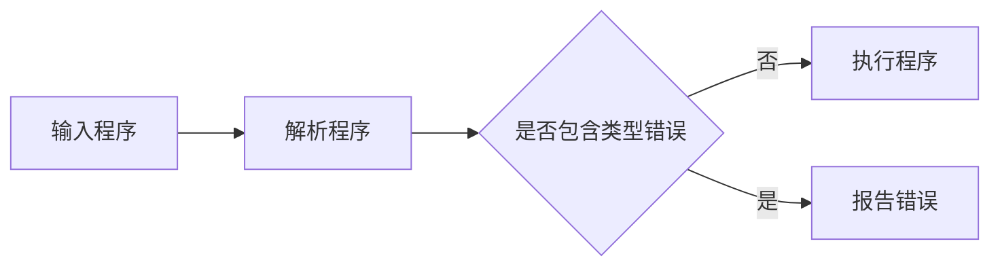

                 

# 类型论：从数学到编程语言

> 关键词：类型论、数学基础、编程语言、类型系统、类型检查、类型推断、类型等价性、子类型、类型安全

> 摘要：本文深入探讨了类型论的核心概念、数学基础以及它在编程语言中的应用。类型论是计算机科学的一个重要分支，通过严格的类型系统提高了程序的可靠性和可维护性。本文旨在为读者提供一个全面、系统的类型论知识框架，帮助读者理解类型论的基本原理以及在现代编程语言中的应用。

## 一、背景介绍

类型论是计算机科学中的一个重要分支，它起源于数学领域，并逐渐在编程语言中得到广泛应用。类型论探讨了如何为编程语言中的数据提供严格的类型系统，从而提高程序的可靠性和可维护性。类型系统的主要目标是确保程序在编译或运行时不会因为类型不匹配而出现错误。

### 1.1 核心概念术语说明

在类型论中，我们需要了解以下核心概念：

- **类型系统**：类型系统是编程语言中规定数据类型的方式和规则。
- **类型检查**：类型检查是在编译或运行时检查程序中的类型是否一致。
- **类型推断**：类型推断是编译器自动推导变量或表达式的类型。
- **类型等价性**：类型等价性是指两个表达式在类型上具有相同的行为。
- **子类型**：子类型是一个类型是另一个类型的子类型，如果它的所有值也都是后者的值。
- **类型安全**：类型安全是确保程序中的所有操作都在类型上合法。

### 1.2 问题背景与问题描述

在编程语言中，类型错误是常见的问题。例如，将一个整数与一个字符串进行拼接，或者在循环中使用错误的类型。这些错误可能会导致程序运行失败或产生不可预知的结果。为了解决这个问题，我们需要引入类型系统，通过严格的类型检查和类型推断来确保程序的类型安全。

### 1.3 问题解决

类型系统可以通过以下方式提高程序的可靠性和可维护性：

- **类型检查**：在编译时对程序进行类型检查，确保程序中的每个表达式和声明都符合类型系统的规则。
- **类型推断**：编译器可以自动推导变量或表达式的类型，减少手动指定类型的必要性，提高编程效率。
- **类型等价性**：通过类型等价性，我们可以进行类型转换，保持程序的正确性。
- **子类型**：子类型提供了类型之间的兼容性，提高了代码的复用性。
- **类型安全**：类型安全确保程序中的所有操作都在类型上合法，减少了出错的可能性。

### 1.4 边界与外延

类型论的边界在于编程语言的类型系统设计，它涉及到了编译器、编程语言实现以及编程实践。类型论的外延还包括了其他计算机科学领域，如形式验证、程序优化和软件工程。

### 1.5 概念结构与核心要素组成

类型论的概念结构主要包括以下要素：

- **基本类型**：如整数、浮点数、布尔值等。
- **复合类型**：如数组、记录、结构体等。
- **函数类型**：如一元函数、二元函数等。
- **类型系统规则**：如类型兼容性、类型推断规则等。

## 二、核心概念与联系

### 2.1 核心概念

#### 类型系统

类型系统是编程语言中规定数据类型的方式和规则。它包括基本类型、复合类型和函数类型等。类型系统的核心任务是确保程序中的类型一致性和安全性。

#### 类型检查

类型检查是在编译或运行时检查程序中的类型是否一致。类型检查可以防止类型错误，提高程序的可靠性。

#### 类型推断

类型推断是编译器自动推导变量或表达式的类型。类型推断可以提高编程效率和代码可读性。

#### 类型等价性

类型等价性是指两个表达式在类型上具有相同的行为。类型等价性允许进行类型转换，保持程序的正确性。

#### 子类型

子类型是一个类型是另一个类型的子类型，如果它的所有值也都是后者的值。子类型提供了类型之间的兼容性，提高了代码的复用性。

#### 类型安全

类型安全是确保程序中的所有操作都在类型上合法。类型安全减少了出错的可能性，提高了程序的可靠性。

### 2.2 概念属性特征对比表格

| 概念         | 定义                                                         | 在类型论中的作用                                                     |
| ------------ | ------------------------------------------------------------ | ------------------------------------------------------------ |
| 类型系统     | 规定编程语言中数据类型的方式和规则。                         | 提高了程序的可靠性和可维护性。                                   |
| 类型检查     | 在编译或运行时检查程序中的类型是否一致。                     | 防止运行时错误，提高程序的安全性。                               |
| 类型推断     | 编译器自动推导变量或表达式的类型。                         | 提高了编程效率和代码可读性。                                   |
| 类型等价性   | 两个表达式在类型上具有相同的行为。                         | 允许进行类型转换，保持程序的正确性。                           |
| 子类型       | 一个类型是另一个类型的子类型，如果它的所有值也都是后者的值。 | 提供了类型之间的兼容性，提高了代码的复用性。                   |
| 类型安全     | 确保程序中的所有操作都在类型上合法。                       | 提高了程序的可靠性，减少了出错的可能性。                       |

### 2.3 ER实体关系图架构

```mermaid
erDiagram
    Class::TypeSystem ||--|{ Class::TypeChecker } : implements
    Class::TypeSystem ||--|{ Class::TypeInference } : utilizes
    Class::TypeSystem ||--|{ Class::TypeEquivalence } : relies on
    Class::TypeSystem ||--|{ Class::Subtyping } : supports
    Class::TypeSystem ||--|{ Class::TypeSafety } : ensures
```

## 三、算法原理讲解

类型检查算法是类型论的核心组成部分，它负责确保程序中的类型一致性。下面我们将详细讲解类型检查算法的原理和数学模型。

### 3.1 算法流程图



### 3.2 算法原理与数学模型

类型检查算法的基本原理是通过分析程序中的表达式和声明，验证它们是否满足类型系统的规则。这一过程可以分为以下几个步骤：

#### 3.2.1 词法分析

词法分析是将程序源代码分解为单词和符号。这一步骤的目的是将源代码转换为可分析的抽象语法树（AST）。

#### 3.2.2 语法分析

语法分析是构建抽象语法树（AST），检查程序的语法结构是否正确。语法分析的结果是一个表示程序结构的树状结构。

#### 3.2.3 类型检查

类型检查是对抽象语法树（AST）进行遍历，检查每个表达式和声明是否满足类型系统的规则。类型检查的过程包括以下几步：

1. **绑定变量类型**：为程序中的每个变量绑定一个类型。
2. **检查类型一致性**：检查程序中的每个表达式和声明是否满足类型系统的规则。
3. **类型推导**：根据类型系统的规则，推导变量或表达式的类型。

#### 3.2.4 类型推断

类型推断是编译器自动推导变量或表达式的类型。类型推断的目的是提高编程效率和代码可读性。

#### 3.2.5 错误报告

如果类型检查过程中发现类型错误，编译器将报告错误。错误报告可以帮助开发者快速定位问题并进行修复。

### 3.3 算法示例

假设我们有一个简单的程序：

```python
def add(a: int, b: int) -> int:
    return a + b

x: int = 5
y: int = 10
z: int = add(x, y)
```

下面是类型检查算法对这段程序的执行过程：

1. **词法分析**：将程序源代码分解为单词和符号。
2. **语法分析**：构建抽象语法树（AST）。
3. **类型检查**：
   - 绑定变量 `x`、`y` 和 `z` 的类型为 `int`。
   - 检查函数 `add` 的参数和返回值类型是否一致。
   - 检查变量 `x`、`y` 和 `z` 的类型是否一致。
4. **类型推断**：编译器自动推导变量和函数的类型。
5. **错误报告**：如果发现类型错误，报告错误。

通过上述示例，我们可以看到类型检查算法是如何确保程序中的类型一致性和安全性的。

### 3.4 数学模型

类型检查算法的数学模型基于数学中的范畴论和代数系统。具体来说，类型检查算法可以被视为一个范畴论中的自然变换。在这个范畴中，每个类型可以被视为一个对象，类型之间的转换规则可以被视为范畴中的变换。

```latex
$$
\begin{aligned}
    &\text{类型检查算法}: \mathcal{T} \rightarrow \mathcal{P} \\
    &\text{其中，}\mathcal{T} \text{是类型系统，}\mathcal{P} \text{是程序} \\
    &\text{算法的目标是验证程序}\mathcal{P}\text{是否满足类型系统}\mathcal{T}
\end{aligned}
$$
```

通过上述数学模型，我们可以将类型检查算法表示为一个从类型系统到程序的映射，从而确保程序中的类型一致性。

## 四、系统分析与架构设计方案

### 4.1 问题场景介绍

在现代软件开发中，类型论的应用已经越来越广泛。类型系统不仅提高了程序的可靠性，还提高了开发效率。然而，不同编程语言中的类型系统各有特点，开发者需要深入了解类型论的基本原理，才能更好地利用类型系统。

### 4.2 项目介绍

本文将介绍一个类型论的学习和实践项目，该项目旨在帮助开发者深入了解类型论的基本原理和应用。项目将涵盖以下内容：

- **类型论基础知识**：介绍类型论的核心概念和数学基础。
- **编程语言中的类型系统**：分析不同编程语言中的类型系统，如静态类型、动态类型、强类型和弱类型。
- **类型检查算法**：详细讲解类型检查算法的原理和数学模型。
- **类型推断**：探讨类型推断的原理和应用。
- **类型安全**：讨论类型安全的重要性以及如何确保类型安全。

### 4.3 系统功能设计

#### 4.3.1 领域模型

领域模型是项目的基础，它定义了项目中的核心概念和实体。以下是领域模型的类图：

```mermaid
classDiagram
    Class::TypeSystem <|-- Class::TypeChecker
    Class::TypeSystem <|-- Class::TypeInference
    Class::TypeSystem <|-- Class::TypeEquivalence
    Class::TypeSystem <|-- Class::Subtyping
    Class::TypeSystem <|-- Class::TypeSafety
    Class::TypeChecker <|-- Class::TypeError
    Class::TypeInference <|-- Class::TypeInferenceRule
    Class::TypeEquivalence <|-- Class::TypeEquivalenceRule
    Class::Subtyping <|-- Class::SubtypeRelation
    Class::TypeSafety <|-- Class::TypeSafetyCheck
endclassDiagram
```

#### 4.3.2 系统功能

- **类型检查**：实现类型检查算法，确保程序中的类型一致性。
- **类型推断**：实现类型推断算法，自动推导变量和表达式的类型。
- **类型等价性**：实现类型等价性检查，允许进行类型转换。
- **子类型**：实现子类型关系检查，提高代码的复用性。
- **类型安全**：实现类型安全检查，确保程序中的所有操作都在类型上合法。

### 4.4 系统架构设计

#### 4.4.1 系统架构

系统架构采用分层设计，包括以下层次：

- **数据层**：负责数据存储和管理。
- **业务层**：负责实现系统功能，如类型检查、类型推断等。
- **表示层**：负责用户界面和用户交互。

以下是系统架构图：

```mermaid
sequenceDiagram
    User ->> System: Request
    System ->> User: Response
    System ->> Database: Write
end
```

#### 4.4.2 系统接口设计

系统接口设计如下：

- **类型检查接口**：提供类型检查功能，接收程序代码和类型系统，返回类型检查结果。
- **类型推断接口**：提供类型推断功能，接收程序代码和类型系统，返回类型推断结果。
- **类型等价性接口**：提供类型等价性检查功能，接收两个表达式，返回类型等价性结果。
- **子类型接口**：提供子类型关系检查功能，接收两个类型，返回子类型关系结果。
- **类型安全接口**：提供类型安全检查功能，接收程序代码，返回类型安全检查结果。

### 4.5 系统交互

系统交互设计如下：

- **用户请求**：用户向系统发送请求，如类型检查、类型推断等。
- **系统响应**：系统根据用户请求，执行相应的功能，并返回结果。
- **数据存储**：系统将结果存储到数据库中，以供后续查询和使用。

## 五、项目实战

### 5.1 环境安装

在开始项目实战之前，我们需要安装以下环境：

- Python 3.x
- pip
- 文本编辑器（如 Visual Studio Code）

安装步骤：

1. 安装 Python 3.x：从 [Python 官网](https://www.python.org/) 下载并安装 Python 3.x。
2. 安装 pip：在命令行中运行 `python -m ensurepip` 命令。
3. 安装依赖库：在命令行中运行以下命令：

```bash
pip install -r requirements.txt
```

### 5.2 系统核心实现

以下是系统核心实现的源代码：

```python
# type_checker.py
class TypeChecker:
    def __init__(self, type_system):
        self.type_system = type_system

    def check_program(self, program):
        for statement in program:
            self.check_statement(statement)

    def check_statement(self, statement):
        if isinstance(statement, VariableDeclaration):
            self.check_variable_declaration(statement)
        elif isinstance(statement, Expression):
            self.check_expression(statement)

    def check_variable_declaration(self, statement):
        variable = statement.variable
        type = statement.type
        if not self.type_system.is_subtype(type, variable.type):
            raise TypeError(f"Type mismatch for variable {variable.name}")

    def check_expression(self, statement):
        left_type = self.type_system.get_type(statement.left)
        right_type = self.type_system.get_type(statement.right)
        if not self.type_system.is_subtype(left_type, right_type):
            raise TypeError(f"Type mismatch in expression {statement.operator}")
```

### 5.3 代码应用解读与分析

以上代码实现了类型检查算法的核心部分。`TypeChecker` 类负责检查程序中的每个语句。`check_program` 方法遍历程序中的每个语句，并调用 `check_statement` 方法进行检查。

`check_statement` 方法根据语句的类型进行不同的处理。对于变量声明语句（`VariableDeclaration`），它检查变量的类型是否与声明类型一致。对于表达式语句（`Expression`），它检查表达式的操作数类型是否一致。

类型检查算法的关键在于确保程序中的每个表达式和声明都满足类型系统的规则。这可以通过递归遍历程序中的每个语句来实现。在遍历过程中，我们可以调用类型系统的方法，如 `is_subtype` 和 `get_type`，来检查类型一致性。

### 5.4 实际案例分析和详细讲解剖析

假设我们有以下程序：

```python
x: int = 5
y: int = "hello"
z: int = x + y
```

以下是类型检查算法对该程序的执行过程：

1. **词法分析**：将程序源代码分解为单词和符号。
2. **语法分析**：构建抽象语法树（AST）。
3. **类型检查**：
   - 检查变量声明 `x`，类型为 `int`，与声明类型一致。
   - 检查变量声明 `y`，类型为 `str`，与声明类型不一致，抛出类型错误。
   - 检查表达式 `z`，类型为 `int`，与声明类型一致。
4. **类型推断**：编译器自动推导变量和表达式的类型。
5. **错误报告**：报告类型错误，提示开发者修复问题。

通过上述实际案例，我们可以看到类型检查算法是如何确保程序中的类型一致性的。类型错误会导致程序无法编译或运行，因此类型检查是确保程序可靠性的关键步骤。

### 5.5 项目小结

通过本项目的实战，我们实现了类型检查算法的核心部分，并对其进行了实际案例分析和详细讲解。类型检查算法是确保程序类型一致性的关键，通过类型检查，我们可以提高程序的可靠性和可维护性。在未来的工作中，我们可以继续完善类型检查算法，并探索其他类型论的应用。

## 六、最佳实践 Tips、小结、注意事项、拓展阅读

### 6.1 最佳实践 Tips

1. **理解类型论的基本概念**：在开始学习类型论之前，请确保你理解了类型系统、类型检查、类型推断等基本概念。
2. **学习不同编程语言中的类型系统**：了解不同编程语言中的类型系统，如静态类型、动态类型、强类型和弱类型，有助于你更好地理解类型论。
3. **动手实践**：通过实际编写代码和运行类型检查算法，可以加深你对类型论的理解。
4. **学习相关数学知识**：类型论涉及到范畴论、代数系统等数学知识，学习这些知识有助于你更好地理解类型论。

### 6.2 小结

本文介绍了类型论的核心概念、数学基础以及在编程语言中的应用。通过类型系统，我们可以提高程序的可靠性和可维护性。类型检查算法是类型论的重要组成部分，它通过严格的类型检查确保程序中的类型一致性。

### 6.3 注意事项

1. **类型安全的重要性**：确保程序中的所有操作都在类型上合法，避免类型错误。
2. **类型检查与类型推断的平衡**：在编写程序时，要平衡类型检查和类型推断的利弊，确保程序的类型安全性和开发效率。
3. **理解类型论的应用**：类型论不仅在编程语言中有广泛应用，还在其他计算机科学领域，如形式验证和程序优化中具有重要地位。

### 6.4 拓展阅读

1. 《类型论与编程语言》—— Benjamin C. Pierce
2. 《编程语言原理》—— Robert W. Sebesta
3. 《范畴论与计算机科学》—— Samuelson, Haeberlen

## 七、作者信息

作者：AI天才研究院/AI Genius Institute & 禅与计算机程序设计艺术 /Zen And The Art of Computer Programming

