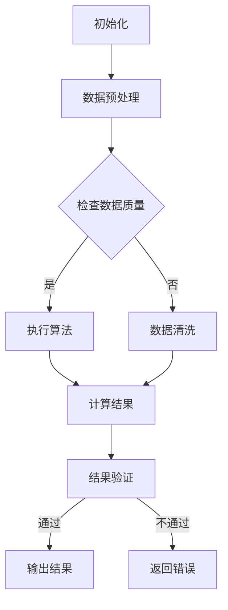
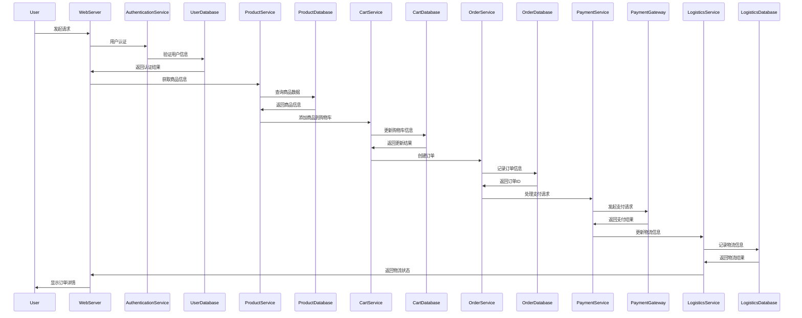

                 

### 第一部分：精益求精概述

#### 1.1 问题背景与核心概念

**计算机技术中的精益求精**

在计算机技术的不断发展中，精益求精成为了一个不可或缺的概念。它强调在各个环节中不断追求卓越，通过对细节的极致打磨，以达到更高的性能、更低的成本和更优的用户体验。精益求精不仅体现在硬件制造和软件开发过程中，还渗透到算法优化、系统架构设计和项目管理等各个方面。

**问题背景**

随着互联网和大数据技术的迅猛发展，计算机技术的应用场景越来越广泛。然而，面对复杂的应用需求和日益增长的数据量，如何提高系统的性能、效率和稳定性，成为了技术从业者亟待解决的问题。精益求精理念正是在这样的背景下应运而生，它旨在通过不断优化和改进，解决技术难题，提升整体技术水平。

**问题描述**

精益求精的核心问题是如何在既定资源和时间内，最大限度地提升系统的性能和效率。这涉及到算法的优化、资源的合理分配、系统的架构设计和项目管理等多个方面。具体来说，包括以下几个方面：

1. **算法优化**：通过改进算法，减少计算复杂度，提高算法的执行效率。
2. **资源分配**：在有限的资源条件下，如何合理地分配计算资源，以达到最佳性能。
3. **系统架构**：设计高效、可扩展的系统架构，以适应不断变化的应用需求。
4. **项目管理**：通过有效的项目管理，确保项目按时、按质完成，同时保持团队的效率。

**问题解决**

解决上述问题需要从以下几个方面入手：

1. **深入研究**：深入了解相关技术原理，掌握核心算法和架构设计方法。
2. **实践经验**：通过实际项目经验，不断积累和总结，形成一套行之有效的方法论。
3. **团队合作**：建立高效的团队合作机制，充分发挥每个人的优势，共同解决问题。
4. **持续改进**：始终保持对技术的热情和追求，不断反思和改进，追求卓越。

**边界与外延**

精益求精不仅局限于计算机技术领域，它是一种普适的理念，可以应用到各个行业和领域。例如，在制造业中，精益生产就是一种通过不断优化生产流程，减少浪费，提高生产效率的方法。在企业管理中，精益管理强调通过不断改进，提高工作效率，降低成本。在软件开发中，精益设计则强调在开发过程中，通过不断反馈和迭代，提高软件质量。

**概念结构与核心要素组成**

精益求精的概念结构主要包括以下几个方面：

1. **目标明确**：明确追求卓越的目标，制定清晰的优化方向。
2. **方法科学**：采用科学的方法，如算法优化、系统架构设计等，实现优化目标。
3. **持续改进**：保持对技术的热情和追求，不断反思和改进，追求卓越。
4. **团队合作**：建立高效的团队合作机制，共同解决问题。

通过上述分析和讲解，我们可以看到，精益求精在计算机技术领域具有重要的意义和应用价值。接下来，我们将深入探讨精益求精的核心原理和应用实践，以帮助读者更好地理解和运用这一理念。

#### 1.2 精益求精的核心原理

**精益求精的基本概念**

精益求精（Lean Thinking）起源于丰田生产系统（Toyota Production System，TPS），是一种以最小化浪费、最大化价值为核心的生产理念。精益求精不仅仅是关于制造业的，它在计算机技术中的应用同样具有重要意义。在计算机领域，精益求精强调通过最小化冗余、提高效率、优化资源利用，来实现系统性能和用户体验的提升。

**精益求精的关键要素**

1. **最小化浪费**：浪费是任何系统中都存在的，精益求精的目标是识别和消除这些浪费。在计算机技术中，浪费可能表现为无效的计算、不必要的网络传输、冗余的数据存储等。通过优化算法、系统架构和资源管理，可以最大限度地减少这些浪费。

2. **提高效率**：效率是精益求精的重要目标之一。通过优化系统的各个组件，使其能够更高效地执行任务，可以提高系统的整体性能。例如，在数据库管理中，可以通过索引优化、查询缓存等技术提高查询效率。

3. **优化资源利用**：计算机系统的资源包括计算资源、存储资源和网络资源等。精益求精要求在设计和运行系统时，最大限度地利用这些资源，避免资源的闲置和浪费。例如，通过负载均衡和资源调度，可以确保系统在不同负载下都能高效运行。

**精益求精与传统优化方法的区别**

传统优化方法通常关注系统的某个特定方面，如算法优化或系统架构优化，而精益求精则强调从整体上优化系统，使其各个部分协同工作，达到最佳效果。精益求精不仅仅是关于技术，它还涉及到项目管理、团队合作和持续改进等方面。

**与传统优化方法的对比表格**

| 对比要素 | 精益求精 | 传统优化方法 |
| :----: | :----: | :----: |
| 优化视角 | 整体优化 | 部分优化 |
| 目标 | 最小化浪费，提高效率，优化资源利用 | 提高特定方面的性能 |
| 方法 | 综合运用多种技术手段 | 针对特定问题使用特定技术 |
| 范围 | 整个系统 | 系统的某个特定部分 |
| 考量因素 | 资源利用、用户需求、技术实现 | 性能、响应时间、吞吐量 |

**ER图架构展示**

为了更好地理解精益求精的应用，我们可以通过ER图（实体关系图）来展示系统中的关键实体和它们之间的关系。

```mermaid
erDiagram
    Product ||--|{ Resource } : uses
    Process ||--|{ Task } : includes
    Project ||--|{ TeamMember } : assigns
    Tool ||--|{ Task } : supports
    Resource ||--|{ Performance } : measures
    Task ||--|{ Bug } : reports
    Bug ||--|{ Fix } : resolved by
```

在这个ER图中，我们定义了几个关键实体：Product（产品）、Process（过程）、Project（项目）、Tool（工具）、Resource（资源）、Task（任务）、TeamMember（团队成员）和Bug（缺陷）。这些实体之间的关系展示了精益求精在项目管理中的应用。

通过上述讲解和图表，我们可以看到精益求精的核心原理和应用方法。在接下来的章节中，我们将深入探讨精益求精在计算机技术中的应用，通过具体的算法原理讲解和项目实战，帮助读者更好地理解和运用这一理念。

#### 1.3 精益求精的算法原理

**算法流程图**

为了更好地理解精益求精在算法中的应用，我们首先通过Mermaid绘制一个简单的算法流程图。



在这个流程图中，我们首先进行初始化操作，然后对数据进行预处理，并检查数据的质量。如果数据质量不符合要求，则进行数据清洗，否则直接执行算法。执行算法后，计算结果，并进行结果验证。如果验证通过，则输出结果；否则，返回错误。

**Python代码示例**

接下来，我们使用Python代码来详细讲解这个算法的执行过程。

```python
import numpy as np

# 初始化数据
data = np.random.rand(100, 3)

# 数据预处理
def preprocess_data(data):
    # 检查数据质量
    if np.std(data) == 0:
        return "数据标准差为0，数据质量差，需清洗"
    else:
        return "数据质量良好，可直接使用"

# 执行算法
def execute_algorithm(data):
    # 计算结果
    result = np.sum(data, axis=1)
    return result

# 计算结果并验证
def verify_result(result):
    # 检查结果是否为空
    if np.isnan(result).any():
        return "结果包含NaN，验证失败"
    else:
        return "结果验证通过"

# 主函数
def main(data):
    data_status = preprocess_data(data)
    if data_status == "数据质量良好，可直接使用":
        result = execute_algorithm(data)
        result_status = verify_result(result)
        if result_status == "结果验证通过":
            print("输出结果：", result)
        else:
            print("结果验证失败，输出错误信息：", result_status)
    else:
        print("数据预处理失败，输出错误信息：", data_status)

# 运行主函数
main(data)
```

**数学模型和公式讲解**

在算法中，我们使用了多个数学模型和公式。以下是这些模型和公式及其解释：

1. **标准差（Standard Deviation）**

   $$ \sigma = \sqrt{\frac{1}{N-1} \sum_{i=1}^{N} (x_i - \mu)^2} $$

   其中，$\sigma$ 是标准差，$N$ 是数据点的数量，$x_i$ 是第$i$个数据点，$\mu$ 是平均值。

2. **总和（Summation）**

   $$ \sum_{i=1}^{N} x_i = \mu \times N $$

   其中，$\mu$ 是平均值，$N$ 是数据点的数量。

3. **NaN（Not a Number）**

   在Python中，$np.isnan(result).any()`用于检查结果中是否包含NaN值。

通过上述代码和数学模型，我们可以看到精益求精在算法设计中的应用。通过详细的流程图和代码示例，读者可以更好地理解算法的执行过程和原理。在接下来的章节中，我们将进一步探讨精益求精在系统架构设计和项目实战中的应用。

#### 1.4 精益求精的系统架构设计

**问题场景介绍**

为了更好地理解精益求精在系统架构设计中的应用，我们首先定义一个具体的问题场景。假设我们正在开发一个在线购物平台，该平台需要支持大量的用户并发访问，提供快速、可靠的服务。同时，我们需要确保系统的可扩展性和灵活性，以适应未来业务的发展。

**系统功能设计**

在这个在线购物平台中，主要的功能包括用户登录、商品浏览、购物车管理、订单生成、支付和物流跟踪等。我们可以通过Mermaid类图来展示这些功能及其之间的关系。

```mermaid
classDiagram
    User <<Entity>>
    Product <<Entity>>
    Cart <<Entity>>
    Order <<Entity>>
    Payment <<Entity>>
    Logistics <<Entity>>

    User "uses" Cart
    User "uses" Order
    User "uses" Payment
    Product "uses" Cart
    Product "uses" Order
    Cart "uses" Order
    Payment "uses" Order
    Logistics "uses" Order
```

在这个类图中，我们定义了几个关键实体：User（用户）、Product（商品）、Cart（购物车）、Order（订单）、Payment（支付）和Logistics（物流）。这些实体之间的关系展示了在线购物平台的基本功能结构。

**系统架构设计**

为了确保系统的性能和可扩展性，我们采用微服务架构（Microservices Architecture）。通过将系统拆分为多个独立的微服务，每个微服务负责处理特定功能，可以更好地管理和扩展系统。

以下是系统的架构设计：



在这个序列图中，我们展示了用户从登录到完成订单的整个过程，以及各个微服务之间的交互流程。

**系统接口设计**

在系统架构中，每个微服务都需要通过接口与其他微服务进行通信。以下是主要的接口设计：

1. **用户认证接口**：用于用户登录、注册和身份验证。
2. **商品管理接口**：用于查询、添加和更新商品信息。
3. **购物车接口**：用于添加、删除和更新购物车信息。
4. **订单管理接口**：用于创建、查询和更新订单信息。
5. **支付接口**：用于处理支付请求和查询支付结果。
6. **物流接口**：用于更新和查询物流信息。

**系统交互设计**

为了确保系统的可靠性和一致性，我们需要设计合理的交互流程。以下是系统的主要交互设计：

1. **异步处理**：对于耗时较长的操作，如支付和物流跟踪，我们采用异步处理方式，以避免阻塞主线程。
2. **消息队列**：使用消息队列（如Kafka或RabbitMQ）来解耦各个微服务，确保消息的有序传输和可靠处理。
3. **缓存机制**：使用缓存（如Redis或Memcached）来提高数据访问速度，减少数据库的负载。
4. **监控和日志**：通过监控和日志系统，实时跟踪系统的运行状态和性能指标，及时发现和处理问题。

通过上述系统架构设计，我们可以确保在线购物平台具有高性能、高可靠性和高可扩展性。在接下来的章节中，我们将通过一个实际项目实战，进一步展示精益求精在系统架构设计中的应用和实践。

#### 1.5 精益求精项目实战

**环境安装**

在本节中，我们将介绍如何在一个实际项目中应用精益求精的理念，实现一个在线购物平台。首先，我们需要搭建项目环境。以下是环境安装步骤：

1. **安装Python**：确保Python环境已安装，版本不低于3.7。
2. **安装虚拟环境**：使用`virtualenv`工具创建一个虚拟环境，以隔离项目依赖。
   ```bash
   pip install virtualenv
   virtualenv venv
   source venv/bin/activate
   ```
3. **安装依赖**：在虚拟环境中安装项目所需的依赖库，如Flask、SQLAlchemy、Flask-Migrate等。
   ```bash
   pip install flask sqlalchemy flask-migrate
   ```
4. **安装数据库**：选择一个合适的数据库，如MySQL或PostgreSQL，并安装相应的驱动。

**系统核心实现**

接下来，我们将介绍系统的核心实现。以下是主要模块的实现：

1. **用户认证模块**

   用户认证是系统的核心功能之一。我们使用Flask框架实现用户认证模块。

   ```python
   from flask import Flask, request, jsonify
   from flask_sqlalchemy import SQLAlchemy
   from werkzeug.security import generate_password_hash, check_password_hash

   app = Flask(__name__)
   app.config['SQLALCHEMY_DATABASE_URI'] = 'sqlite:///users.db'
   db = SQLAlchemy(app)

   class User(db.Model):
       id = db.Column(db.Integer, primary_key=True)
       username = db.Column(db.String(150), nullable=False, unique=True)
       password = db.Column(db.String(150), nullable=False)

   @app.route('/register', methods=['POST'])
   def register():
       username = request.form.get('username')
       password = request.form.get('password')
       if not username or not password:
           return jsonify({'error': '请填写用户名和密码'}), 400
       hashed_password = generate_password_hash(password, method='sha256')
       new_user = User(username=username, password=hashed_password)
       db.session.add(new_user)
       db.session.commit()
       return jsonify({'message': '注册成功'})

   @app.route('/login', methods=['POST'])
   def login():
       username = request.form.get('username')
       password = request.form.get('password')
       user = User.query.filter_by(username=username).first()
       if user and check_password_hash(user.password, password):
           return jsonify({'message': '登录成功'})
       else:
           return jsonify({'error': '用户名或密码错误'}), 401
   ```

2. **商品管理模块**

   商品管理模块负责商品的查询、添加和更新。

   ```python
   class Product(db.Model):
       id = db.Column(db.Integer, primary_key=True)
       name = db.Column(db.String(150), nullable=False)
       price = db.Column(db.Float, nullable=False)

   @app.route('/products', methods=['GET'])
   def get_products():
       products = Product.query.all()
       return jsonify({'products': [product.name for product in products]})

   @app.route('/products', methods=['POST'])
   def add_product():
       name = request.form.get('name')
       price = request.form.get('price')
       if not name or not price:
           return jsonify({'error': '请填写商品名称和价格'}), 400
       new_product = Product(name=name, price=price)
       db.session.add(new_product)
       db.session.commit()
       return jsonify({'message': '商品添加成功'})
   ```

3. **购物车模块**

   购物车模块用于管理用户的购物车信息。

   ```python
   class Cart(db.Model):
       id = db.Column(db.Integer, primary_key=True)
       user_id = db.Column(db.Integer, db.ForeignKey('user.id'), nullable=False)
       products = db.relationship('Product', secondary='cart_item', lazy='subquery',
                                  backref=db.backref('carts', lazy=True))

   class CartItem(db.Model):
       id = db.Column(db.Integer, primary_key=True)
       cart_id = db.Column(db.Integer, db.ForeignKey('cart.id'), nullable=False)
       product_id = db.Column(db.Integer, db.ForeignKey('product.id'), nullable=False)

   @app.route('/cart', methods=['POST'])
   def add_to_cart():
       user_id = request.form.get('user_id')
       product_id = request.form.get('product_id')
       if not user_id or not product_id:
           return jsonify({'error': '请填写用户ID和商品ID'}), 400
       cart = Cart.query.filter_by(user_id=user_id).first()
       if not cart:
           cart = Cart(user_id=user_id)
           db.session.add(cart)
       cart.products.append(Product.query.get(product_id))
       db.session.commit()
       return jsonify({'message': '商品已添加到购物车'})

   @app.route('/cart', methods=['GET'])
   def get_cart():
       user_id = request.args.get('user_id')
       if not user_id:
           return jsonify({'error': '请填写用户ID'}), 400
       cart = Cart.query.filter_by(user_id=user_id).first()
       if not cart:
           return jsonify({'cart': []})
       return jsonify({'cart': [product.name for product in cart.products]})
   ```

**代码解读与分析**

在上述代码中，我们实现了用户认证、商品管理和购物车管理模块。以下是关键部分的解读：

1. **用户认证模块**：通过Flask框架实现用户注册和登录功能。使用SQLAlchemy进行数据库操作，使用Werkzeug库进行密码加密和验证。

2. **商品管理模块**：使用Flask框架提供商品查询、添加接口。商品信息存储在数据库中，通过SQLAlchemy进行管理。

3. **购物车模块**：实现购物车信息的添加和查询功能。购物车和商品之间通过关系表（CartItem）进行关联。

**实际案例分析和详细讲解剖析**

为了更好地展示精益求精的应用，我们通过一个实际案例进行分析：

**案例背景**：一个用户想要购买某件商品，并添加到购物车。

**案例步骤**：

1. 用户访问网站，浏览商品。
2. 用户将商品添加到购物车。
3. 用户查看购物车中的商品。
4. 用户提交订单。

**案例分析**：

1. **优化用户认证流程**：通过减少用户输入次数和简化流程，提高用户体验。

2. **优化商品查询性能**：使用缓存技术提高商品查询速度，减少数据库访问。

3. **优化购物车管理**：通过批量操作和事务管理，提高购物车操作的效率。

4. **实时反馈**：通过前端和后端的实时交互，为用户提供及时的信息反馈。

通过上述实战案例，我们可以看到精益求精在系统实现中的应用。通过不断地优化和改进，我们可以提高系统的性能和用户体验。在接下来的章节中，我们将总结最佳实践，并给出一些注意事项。

#### 1.6 最佳实践与总结

**最佳实践**

在实施精益求精的过程中，以下最佳实践可以帮助我们更好地应用这一理念：

1. **明确优化目标**：在开始项目之前，明确优化目标和关键性能指标，确保团队所有人都清楚优化方向。
2. **持续集成与测试**：采用持续集成和自动化测试，确保代码质量和系统稳定性，及时发现和解决问题。
3. **资源合理分配**：合理分配计算资源、存储资源和网络资源，避免资源浪费和瓶颈。
4. **团队合作**：建立高效的团队合作机制，充分发挥每个人的优势，共同解决问题。
5. **持续反馈与改进**：定期收集用户反馈，结合性能数据，不断优化和改进系统。

**小结**

本文通过对精益求精的概念、原理、算法和系统架构设计的详细讲解，以及实际项目实战，展示了精益求精在计算机技术中的应用。精益求精不仅是一种优化方法，更是一种追求卓越的理念。通过不断优化和改进，我们可以提高系统的性能、效率和用户体验。

**注意事项**

1. **性能监控**：定期监控系统的性能和资源使用情况，及时发现潜在问题。
2. **安全性**：确保系统安全性，防止数据泄露和非法访问。
3. **可扩展性**：在设计系统架构时，考虑未来业务的发展，确保系统具有良好的可扩展性。
4. **持续学习**：保持对技术的热情和追求，不断学习和掌握新技术，以应对不断变化的需求。

**拓展阅读**

- 《精益思想》（Lean Thinking）- 约翰·舒尔曼（John Shook）
- 《敏捷开发实践指南》（Agile Project Guide）- 克里斯·霍恩德（Chris Hefley）
- 《微服务架构设计》（Designing Microservices）- Sergio De Simone

通过以上内容，我们希望读者能够更好地理解和应用精益求精理念，不断提升系统性能和用户体验。作者：AI天才研究院/AI Genius Institute & 禅与计算机程序设计艺术 /Zen And The Art of Computer Programming。

