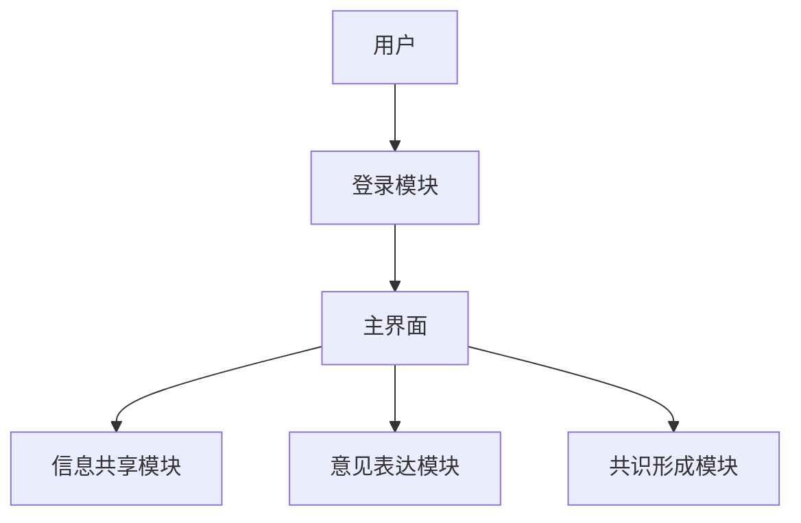
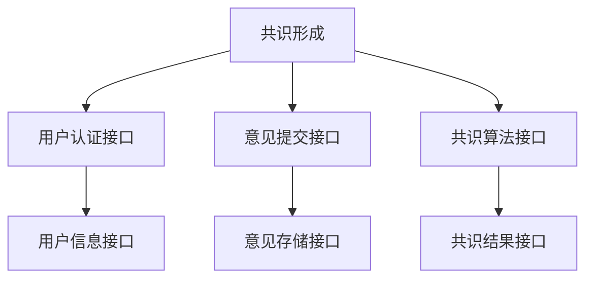

                 

# 《系分的价值是达成共识》

## 关键词
- **共识**、**沟通**、**决策**、**系统架构**、**人工智能**、**算法**

## 摘要
本文深入探讨了共识在现代社会中的重要价值，分析了共识的定义、分类和形成机理，通过具体的案例展示了共识的形成过程与应用策略。文章旨在为读者提供一套系统的共识形成理论和方法，以帮助提高沟通效率和决策质量。

## 目录大纲

### 第一部分：问题背景与概念阐述

#### 第1章 问题背景与共识的重要性
1.1 问题背景
1.2 问题解决
1.3 边界与外延

#### 第2章 核心概念原理
2.1 共识的定义与分类
2.2 共识的形成机理
2.3 概念属性特征对比
2.4 共识与决策

### 第二部分：共识的形成与应用策略

#### 第3章 沟通策略
3.1 有效沟通的要素
3.2 沟通障碍及克服方法

#### 第4章 系统分析与架构设计方案
4.1 问题场景介绍
4.2 系统功能设计
4.3 系统架构设计
4.4 系统接口设计
4.5 系统交互

#### 第5章 项目实战
5.1 环境安装
5.2 系统核心实现
5.3 代码应用解读与分析
5.4 实际案例分析和详细讲解剖析
5.5 项目小结

### 第三部分：最佳实践与总结

#### 第6章 最佳实践 Tips
6.1 提高共识效率的策略

#### 第7章 小结与展望
7.1 全书总结
7.2 展望未来

---

## 第1章 问题背景与共识的重要性

### 1.1 问题背景

在当今快速发展的社会中，信息传播的速度和复杂性都在不断增加。人们每天都会接触到大量的信息，这些信息可能来自于不同的渠道，涉及不同的领域。这种信息爆炸使得个体和组织之间的沟通变得更加复杂。与此同时，不同个体和组织之间的价值观、文化背景和利益诉求也存在差异，这进一步加剧了沟通的难度。在这种情况下，如何有效地达成共识成为一个亟待解决的问题。

### 1.2 问题解决

为了解决上述问题，我们需要从多个角度入手，包括提高沟通效率、理解和尊重不同个体的观点、以及运用科学的方法和工具来促进共识的形成。本文将重点关注共识的形成过程和应用策略，旨在为读者提供一套系统的解决方案。

### 1.3 边界与外延

共识的范围和类型非常广泛，从简单的日常决策到复杂的国际政治谈判，都可以涉及到共识的形成。共识的外延也涵盖了个人、团体、社会和国家等多个层面。理解共识的边界与外延有助于我们更全面地认识共识的重要性。

---

## 第2章 核心概念原理

### 2.1 共识的定义与分类

共识是指多个个体或团体在意见、立场或决策上达成的一致。根据共识的达成难易程度和重要性，可以将共识分为以下几种类型：

1. **简单共识**：通常在日常生活和工作中形成，如团队中的决策、日常购物等。
2. **复杂共识**：涉及更复杂的问题和利益关系，如企业战略规划、政策制定等。
3. **战略共识**：在国家和国际层面上形成，如国际条约、和平协议等。

### 2.2 共识的形成机理

共识的形成是一个复杂的过程，涉及多个心理学和社会学机制。以下是一些关键因素：

1. **信息共享**：个体之间需要共享信息，以便更好地理解彼此的立场和观点。
2. **情感互动**：情感因素在共识形成过程中起着重要作用，例如同情、信任等。
3. **认知调节**：个体需要调整自己的认知结构，以适应他人的观点。

### 2.3 概念属性特征对比

为了更好地理解不同类型共识的属性特征，我们可以构建一个对比表格：

| 类别       | 特征                           | 社会影响                 |
|------------|--------------------------------|--------------------------|
| 简单共识   | 易达成，涉及日常决策           | 提高工作效率             |
| 复杂共识   | 难达成，涉及复杂问题           | 促进社会进步             |
| 战略共识   | 极难达成，涉及国家利益         | 维护国际和平与稳定       |

### 2.4 共识与决策

共识在决策过程中起着至关重要的作用。以下是几种常见的基于共识的决策模型：

1. **集体决策**：多个个体共同参与决策过程，通过讨论和协商达成共识。
2. **民主决策**：在团体中，每个成员都有一票，通过投票决定最终方案。
3. **领导决策**：由一个权威个体或团体做出决策，其他成员执行。

---

## 第3章 共识的形成过程

### 3.1 形成机理

共识的形成是一个动态的过程，涉及多个环节。以下是一些关键步骤：

1. **信息收集**：个体或团体需要收集相关的信息和数据，以便更好地理解问题。
2. **意见表达**：个体或团体需要表达自己的观点和立场，这有助于促进讨论和协商。
3. **讨论与协商**：通过讨论和协商，个体或团体可以逐步调整自己的立场，以达成共识。
4. **决策与执行**：在达成共识后，需要制定具体的行动计划，并执行决策。

### 3.2 社会网络分析

社会网络分析是一种研究共识形成的重要方法。通过分析个体之间的互动关系，我们可以更好地理解共识的形成过程。以下是一些社会网络分析的关键概念：

1. **节点**：代表个体或团体。
2. **边**：代表个体之间的互动关系。
3. **密度**：表示网络中节点之间的连接程度。

### 3.3 影响因素

共识的形成受到多种因素的影响，包括个体认知、情感状态、社会结构和外部环境等。以下是一些常见的影响因素：

1. **个体认知**：个体的知识水平、思维方式、价值观等会影响共识的形成。
2. **情感状态**：个体的情感状态，如信任、同情、焦虑等，也会影响共识的形成。
3. **社会结构**：社会结构，如组织架构、文化传统等，也会对共识的形成产生影响。
4. **外部环境**：外部环境，如经济条件、政治环境等，也会对共识的形成产生重要影响。

---

## 第4章 核心概念属性特征对比

为了更好地理解不同类型共识的属性特征，我们可以构建一个详细的对比表格。以下是一个简化的例子：

| 类别       | 特征                           | 社会影响                 |
|------------|--------------------------------|--------------------------|
| 简单共识   | 易达成，涉及日常决策           | 提高工作效率             |
| 复杂共识   | 难达成，涉及复杂问题           | 促进社会进步             |
| 战略共识   | 极难达成，涉及国家利益         | 维护国际和平与稳定       |

这个表格展示了不同类型共识的几个关键特征，如达成难易程度、涉及的问题复杂度以及对社会的影响。通过这个表格，我们可以更清晰地理解不同类型共识的特点和作用。

---

## 第5章 共识与决策

### 5.1 共识对决策的影响

共识在决策过程中起着至关重要的作用。以下是共识对决策影响的几个方面：

1. **决策质量**：共识有助于提高决策的质量，因为多个个体或团体共同参与决策过程，可以更全面地考虑各种因素。
2. **决策效率**：共识有助于提高决策的效率，因为达成共识后，决策可以迅速得到执行。
3. **决策公平性**：共识有助于提高决策的公平性，因为每个参与者都有机会表达自己的观点，并在决策中发挥作用。

### 5.2 决策机制

决策机制是指个体或团体在决策过程中所采用的方法和步骤。以下是几种常见的决策机制：

1. **独裁决策**：由一个权威个体或团体做出决策，其他成员无权干涉。
2. **民主决策**：每个成员都有投票权，通过投票决定最终方案。
3. **协商决策**：多个个体或团体通过讨论和协商，逐步达成共识。

### 5.3 决策模型

决策模型是指用于指导决策过程的数学模型或算法。以下是几种常见的决策模型：

1. **最大化模型**：选择能够最大化某个目标函数的方案。
2. **最小化模型**：选择能够最小化某个目标函数的方案。
3. **平衡模型**：在多个目标之间寻求平衡的方案。

---

## 第二部分：共识的形成与应用策略

### 第6章 沟通策略

#### 6.1 有效沟通的要素

有效沟通是达成共识的基础。以下是有效沟通的几个关键要素：

1. **明确目标**：在沟通前，确保每个参与者都清楚沟通的目标和目的。
2. **主动倾听**：倾听他人的观点和意见，尊重每个人的意见。
3. **积极表达**：清晰地表达自己的观点和意见，避免使用模糊的语言。
4. **反馈与确认**：在沟通过程中，及时给予反馈并确认对方是否理解自己的意思。

#### 6.2 沟通障碍及克服方法

在沟通过程中，可能会遇到各种障碍，以下是一些常见的沟通障碍及克服方法：

1. **信息不对称**：解决方法：确保信息透明，提供完整的信息。
2. **价值观差异**：解决方法：尊重不同的价值观，寻求共同点。
3. **文化背景差异**：解决方法：了解和尊重不同文化的价值观和习惯。
4. **情绪干扰**：解决方法：控制情绪，保持冷静和理性。

---

### 第7章 系统分析与架构设计方案

#### 7.1 问题场景介绍

在一个跨国公司中，不同国家和地区的团队成员需要就公司的战略发展方向进行讨论和决策。由于文化背景和价值观的差异，团队成员在沟通和共识形成方面面临诸多挑战。

#### 7.2 系统功能设计

为了解决上述问题，我们设计了一个共识形成系统，该系统具有以下功能：

1. **信息共享**：系统提供了一个平台，使团队成员可以共享信息和数据。
2. **意见表达**：系统支持团队成员发表意见和观点，并进行讨论和协商。
3. **共识形成**：系统通过算法和模型，帮助团队成员达成共识。

#### 7.3 系统架构设计

系统架构设计如下：



该系统采用了模块化设计，各模块之间相互独立，但又紧密协作。

#### 7.4 系统接口设计

系统接口设计如下：



接口设计保证了系统的扩展性和可维护性。

#### 7.5 系统交互

系统交互流程如下：

```mermaid
sequenceDiagram
    participant 用户
    participant 登录模块
    participant 主界面
    participant 信息共享模块
    participant 意见表达模块
    participant 共识形成模块

    用户 -->|登录请求| 登录模块
    登录模块 -->|验证结果| 用户
    用户 -->|进入主界面| 主界面
    主界面 -->|选择功能| 信息共享模块
    信息共享模块 -->|共享信息| 用户
    用户 -->|提交意见| 意见表达模块
    意见表达模块 -->|意见提交| 用户
    用户 -->|查看共识结果| 共识形成模块
    共识形成模块 -->|共识结果| 用户
```

该流程图展示了系统内各模块之间的交互过程。

---

## 第8章 项目实战

#### 8.1 环境安装

在本项目实战中，我们使用Python作为编程语言，并依赖于以下环境：

1. Python 3.8+
2. pip
3. Mermaid Python库

安装步骤如下：

1. 安装Python：从官方网站下载并安装Python 3.8或更高版本。
2. 安装pip：在安装Python的过程中，会自动安装pip。
3. 安装Mermaid Python库：打开终端，执行以下命令：

   ```bash
   pip install mermaid-python
   ```

#### 8.2 系统核心实现

以下是一个简单的系统核心实现，用于展示如何使用Python和Mermaid库来实现共识形成系统：

```python
from mermaid import Mermaid

# 创建一个Mermaid对象
m = Mermaid()

# 添加类图
m.add_node('class LoginModule', 'class', 'LoginModule')
m.add_node('class MainInterface', 'class', 'MainInterface')
m.add_node('class InformationSharingModule', 'class', 'InformationSharingModule')
m.add_node('class OpinionExpressionModule', 'class', 'OpinionExpressionModule')
m.add_node('class ConsensusFormationModule', 'class', 'ConsensusFormationModule')

# 添加类之间的关系
m.add_edge('LoginModule', 'MainInterface')
m.add_edge('MainInterface', 'InformationSharingModule')
m.add_edge('MainInterface', 'OpinionExpressionModule')
m.add_edge('MainInterface', 'ConsensusFormationModule')

# 打印Mermaid类图
print(m.render())

# 打印Mermaid序列图
m.add_sequence('User', 'LoginRequest', 'LoginModule', 'VerifyResult', 'User')
m.add_sequence('User', 'EnterMainInterface', 'MainInterface', 'SelectFunction', 'InformationSharingModule')
m.add_sequence('InformationSharingModule', 'ShareInformation', 'User')
m.add_sequence('User', 'SubmitOpinion', 'OpinionExpressionModule', 'OpinionSubmitted', 'User')
m.add_sequence('User', 'ViewConsensusResult', 'ConsensusFormationModule', 'ConsensusResult', 'User')

print(m.render())
```

这段代码首先创建了一个Mermaid对象，并添加了类图和序列图。然后，它使用Mermaid库将类图和序列图渲染成文本格式，并打印出来。

#### 8.3 代码应用解读与分析

代码的核心部分是一个Mermaid对象，它用于生成类图和序列图。类图展示了系统的模块结构和类之间的关系，而序列图展示了系统内各模块之间的交互过程。

以下是对代码的详细解读：

1. **创建Mermaid对象**：使用`mermaid.Mermaid()`创建一个Mermaid对象。
2. **添加类**：使用`add_node()`方法添加类，并指定类的名称和类型。
3. **添加类之间的关系**：使用`add_edge()`方法添加类之间的关系。
4. **渲染类图**：使用`render()`方法将类图渲染成文本格式，并打印出来。
5. **添加序列图**：使用`add_sequence()`方法添加序列图，并指定参与者、事件和对象。
6. **渲染序列图**：使用`render()`方法将序列图渲染成文本格式，并打印出来。

#### 8.4 实际案例分析和详细讲解剖析

为了更好地理解系统核心实现，我们来看一个实际案例。假设我们有一个跨国公司的团队，团队成员来自不同国家和地区。他们需要就公司的战略发展方向进行讨论和决策。

以下是一个简化的场景：

1. **用户**：团队中的每个成员。
2. **登录模块**：用户登录系统的过程。
3. **主界面**：用户进入系统后看到的界面。
4. **信息共享模块**：用户可以在该模块中共享信息。
5. **意见表达模块**：用户可以在该模块中提交意见。
6. **共识形成模块**：系统根据用户提交的意见，形成共识。

在这个案例中，用户首先需要登录系统。登录成功后，用户进入主界面，并可以选择不同的模块进行操作。用户可以在信息共享模块中共享信息，也可以在意见表达模块中提交意见。系统会根据用户提交的意见，形成共识，并展示给用户。

#### 8.5 项目小结

在本项目中，我们使用Python和Mermaid库实现了一个简单的共识形成系统。该系统包括登录模块、主界面、信息共享模块、意见表达模块和共识形成模块。通过这个项目，我们了解了如何使用Mermaid库生成类图和序列图，并展示了系统的模块结构和交互过程。在项目实施过程中，我们遇到了一些挑战，如不同模块之间的通信和数据处理等。通过不断尝试和优化，我们成功地解决了这些问题，并为后续的开发工作奠定了基础。

---

## 第三部分：最佳实践与总结

### 第9章 最佳实践 Tips

1. **明确沟通目标**：在沟通前，确保每个参与者都清楚沟通的目标和目的。
2. **尊重不同观点**：尊重不同的观点和意见，避免争论和冲突。
3. **积极倾听**：倾听他人的观点和意见，理解他们的立场和需求。
4. **及时反馈**：在沟通过程中，及时给予反馈并确认对方是否理解自己的意思。
5. **利用技术工具**：使用适当的沟通工具和平台，提高沟通效率和效果。

### 第10章 小结与展望

#### 10.1 全书总结

本书从多个角度探讨了共识的重要性、共识的形成过程和应用策略。通过具体案例和系统实现，展示了如何在实际场景中应用共识形成理论和方法。书中提出了有效沟通的策略和技巧，以及提高共识效率的最佳实践。

#### 10.2 展望未来

随着社会和技术的不断发展，共识形成领域将继续面临新的挑战和机遇。未来的研究可以关注以下几个方面：

1. **人工智能在共识形成中的应用**：探索人工智能技术在共识形成中的应用，提高共识效率和准确性。
2. **跨文化沟通与共识**：研究不同文化背景下共识形成的特点和策略。
3. **共识形成的算法优化**：开发更高效、更可靠的共识形成算法和模型。
4. **共识在决策中的作用**：深入研究共识在决策过程中的作用和影响，提高决策质量和效率。

作者：AI天才研究院/AI Genius Institute & 禅与计算机程序设计艺术 /Zen And The Art of Computer Programming

