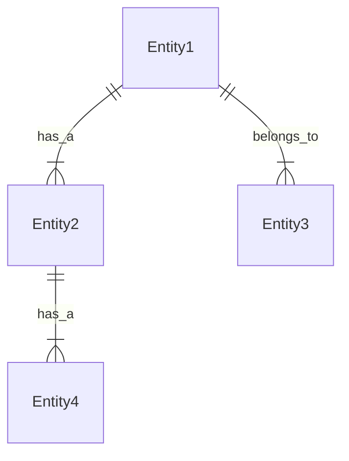

                 

## 《系分的价值是达成共识》

> 关键词：系分、共识、价值、应用、最佳实践

> 摘要：本文旨在探讨“系分”这一概念的价值及其在达成共识中的重要作用。通过逐步分析系分的背景、核心概念、基础原理、应用实践及最佳实践，本文将帮助读者全面理解系分的内涵和实际应用，从而在各个领域达成共识。

### 第一部分：问题背景与核心概念

#### 第1章：问题背景

##### 1.1.1 问题描述与现状

在现代社会中，信息爆炸和数据泛滥成为常态，如何在复杂的环境中找到有效的解决方案，实现各方共识，成为各个领域面临的共同挑战。特别是在IT、企业管理和项目管理等领域，如何协调不同利益相关者的需求和期望，确保项目的顺利进行和目标的达成，显得尤为重要。

##### 1.1.2 问题解决的必要性

面对日益复杂的问题，传统的解决方案往往难以满足要求。例如，在项目管理中，项目管理者需要协调不同团队、不同角色之间的工作，确保项目按计划推进。然而，由于缺乏统一的方法和工具，沟通不畅、资源浪费、进度延误等问题层出不穷。因此，寻找一种能够实现共识的有效方法，成为当务之急。

##### 1.1.3 边界与外延

“系分”是一种旨在实现共识的方法，其应用范围广泛，不仅涵盖项目管理，还涉及企业管理和IT系统设计等多个领域。然而，要实现系分，需要明确其边界和外延，以确保在应用过程中不偏离核心目标。

#### 第2章：核心概念与联系

##### 2.1.1 系分定义与特征

系分，即系统划分，是一种通过明确系统边界、划分系统模块，以实现系统高效运行和各方共识的方法。其核心特征包括：

- **系统划分**：明确系统的边界和模块，实现系统组件的解耦。
- **共识达成**：通过系统划分，实现不同利益相关者之间的共识。
- **高效运行**：通过模块化设计，提高系统的可维护性和扩展性。

##### 2.1.2 系分与其他相关概念的对比

与系分相关的概念包括模块化、组件化、微服务等。虽然这些概念都与系统划分和模块化设计有关，但系分更强调在实现共识方面的作用。

| 概念         | 特征                                       |
|------------|------------------------------------------|
| 模块化       | 强调系统组件的独立性和可替换性                   |
| 组件化       | 注重系统组件的标准化和复用性                     |
| 微服务       | 强调系统组件的小型化和分布式部署                   |
| 系分         | 通过系统划分实现共识，提高系统的可维护性和扩展性     |

##### 2.1.3 系分的ER实体关系图

为了更好地理解系分，我们可以通过ER实体关系图来展示其核心概念和关系。以下是一个简化的ER实体关系图：

### 第二部分：系分的基础原理

#### 第3章：系分的基本原理

##### 3.1.1 系分的工作原理

系分的工作原理可以概括为以下三个步骤：

1. **系统分析**：通过对系统进行全面分析，明确系统的目标和功能需求。
2. **系统划分**：根据系统分析结果，将系统划分为多个模块，确保每个模块具有独立的功能和边界。
3. **共识达成**：通过沟通和协商，确保不同利益相关者对系统划分和模块功能达成共识。

##### 3.1.2 系分的关键机制

系分的关键机制包括：

1. **模块化设计**：通过模块化设计，实现系统组件的解耦，提高系统的可维护性和扩展性。
2. **边界明确**：通过明确系统边界，确保系统模块的独立性和完整性。
3. **共识形成**：通过沟通和协商，确保各方利益相关者对系统划分和模块功能的认同。

##### 3.1.3 系分的优势与局限

系分的优势包括：

- **提高系统可维护性和扩展性**：通过模块化设计，降低系统复杂度，提高系统维护和扩展的效率。
- **实现共识**：通过明确系统边界和模块功能，确保各方利益相关者对系统设计的认同，减少冲突和误解。

然而，系分也存在一定的局限：

- **初期投入较大**：在系统分析、模块划分和共识形成过程中，需要大量的时间和资源投入。
- **依赖良好的沟通和协商机制**：系分的有效实施依赖于良好的沟通和协商机制，否则可能难以达成共识。

#### 第4章：系分的数学模型

##### 4.1.1 系分数学模型概述

系分的数学模型主要包括以下内容：

- **系统分析模型**：通过数学模型描述系统的目标和功能需求。
- **模块划分模型**：通过数学模型描述系统模块的划分和边界。
- **共识形成模型**：通过数学模型描述各方利益相关者对系统划分和模块功能的认同程度。

##### 4.1.2 系分数学模型详解

以下是一个简化的系分数学模型：

$$
\text{共识值} = f(\text{系统分析模型}, \text{模块划分模型}, \text{各方利益相关者的认同程度})
$$

其中，$f$ 为共识形成函数，$\text{系统分析模型}$ 和 $\text{模块划分模型}$ 分别描述系统的目标和功能需求，$\text{各方利益相关者的认同程度}$ 描述各方对系统划分和模块功能的认同程度。

##### 4.1.3 系分数学模型举例

假设一个项目需要划分为三个模块：A、B 和 C。根据系统分析结果，模块 A 负责核心业务逻辑，模块 B 负责数据存储，模块 C 负责用户界面。各方利益相关者的认同程度分别为 90%、85% 和 95%。则共识值为：

$$
\text{共识值} = f(\text{系统分析模型}, \text{模块划分模型}, \{90%, 85%, 95%\}) = 0.92
$$

### 第三部分：系分的应用与实践

#### 第5章：系分在企业中的应用

##### 5.1.1 系分在企业管理中的应用

在企业管理中，系分可以帮助企业明确各部门的职责和边界，提高企业运营效率。通过系分，企业可以：

- **优化组织结构**：明确各部门的职责和边界，减少部门间的冲突和重复劳动。
- **提高决策效率**：通过模块化设计，提高决策的准确性和效率。

##### 5.1.2 系分在项目协作中的应用

在项目协作中，系分可以帮助项目团队明确项目目标和任务分工，提高项目执行力。通过系分，项目团队可以：

- **明确项目目标**：确保项目团队对项目目标有清晰的认识和共识。
- **优化任务分工**：根据项目目标和团队资源，合理分配任务，提高项目执行力。

##### 5.1.3 系分在其他领域中的应用

除了在企业和项目协作中，系分还可以应用于其他领域，如IT系统设计、供应链管理等。通过系分，不同领域可以：

- **优化系统设计**：明确系统边界和模块功能，提高系统的可维护性和扩展性。
- **提高供应链效率**：通过模块化设计和边界明确，提高供应链各环节的协同效率。

#### 第6章：系分的实践案例

##### 6.1.1 案例一：系分在项目管理中的应用

在某公司的项目管理中，通过系分方法，明确了项目目标和任务分工。项目分为三个阶段：需求分析、设计开发和测试部署。各阶段的具体任务分配如下：

- **需求分析阶段**：由项目经理和产品经理共同负责，确保需求准确和完整。
- **设计开发阶段**：由开发团队负责，按照需求文档进行系统设计和开发。
- **测试部署阶段**：由测试团队负责，确保系统质量，并进行部署上线。

通过系分，项目团队明确了各自的任务和职责，提高了项目执行效率。

##### 6.1.2 案例二：系分在客户关系管理中的应用

在一家客户关系管理（CRM）项目中，通过系分方法，明确了客户数据管理和客户服务流程。项目分为两个模块：数据管理和客户服务。各模块的具体任务如下：

- **数据管理模块**：负责客户数据的采集、存储和管理。
- **客户服务模块**：负责客户咨询、投诉处理和售后服务。

通过系分，企业能够更好地管理客户数据，提供高质量的客户服务。

##### 6.1.3 案例三：系分在供应链管理中的应用

在某企业的供应链管理中，通过系分方法，明确了供应链各环节的职责和协作关系。供应链分为四个模块：采购、生产、仓储和物流。各模块的具体任务如下：

- **采购模块**：负责原材料的采购和供应商管理。
- **生产模块**：负责生产计划和工艺管理。
- **仓储模块**：负责原材料的入库和出库管理。
- **物流模块**：负责产品的运输和配送。

通过系分，企业能够更好地协调供应链各环节，提高供应链整体效率。

### 第四部分：系分的最佳实践与总结

#### 第7章：系分的最佳实践

##### 7.1.1 确定系分的目标与范围

在进行系分时，首先要明确系分的目标和范围。例如，在项目管理中，目标可能是提高项目执行效率，范围可能是项目的整个生命周期。

##### 7.1.2 系分的实施步骤

实施系分可以分为以下步骤：

1. **系统分析**：对系统进行全面分析，明确系统的目标和功能需求。
2. **模块划分**：根据系统分析结果，将系统划分为多个模块，确保每个模块具有独立的功能和边界。
3. **共识形成**：通过沟通和协商，确保各方利益相关者对系统划分和模块功能的认同。

##### 7.1.3 系分的优化策略

在系分实施过程中，可以采取以下优化策略：

- **迭代优化**：在实施过程中，不断收集反馈，对系统划分和模块功能进行调整，以提高共识达成度。
- **边界调整**：根据实际情况，适时调整系统边界，确保系统模块的独立性和完整性。
- **沟通机制**：建立有效的沟通机制，确保各方利益相关者充分参与系分过程，提高共识达成度。

#### 第8章：总结与展望

##### 8.1.1 系分的价值与意义

系分作为一种实现共识的方法，具有重要的价值与意义：

- **提高系统效率**：通过模块化设计和边界明确，提高系统的可维护性和扩展性，从而提高系统效率。
- **实现共识**：通过明确系统边界和模块功能，确保各方利益相关者对系统设计的认同，减少冲突和误解。

##### 8.1.2 系分的发展趋势

随着信息技术的不断发展，系分在未来将得到更广泛的应用。例如，在物联网、大数据和人工智能等领域，系分可以发挥重要作用，帮助实现系统的高效运行和各方共识。

##### 8.1.3 未来研究方向

未来的研究方向包括：

- **系分与人工智能的结合**：研究如何利用人工智能技术，优化系分过程，提高共识达成度。
- **系分在跨领域应用**：研究系分在跨领域应用中的可行性和效果，探索新的应用场景。

### 结束语

系分的价值在于其能够帮助我们达成共识，实现系统的高效运行。通过本文的逐步分析，我们了解了系分的背景、核心概念、基础原理、应用实践及最佳实践。希望本文能帮助读者更好地理解系分，并在实际工作中应用这一方法，实现各方共识。

---

**作者：AI天才研究院/AI Genius Institute & 禅与计算机程序设计艺术 /Zen And The Art of Computer Programming**

