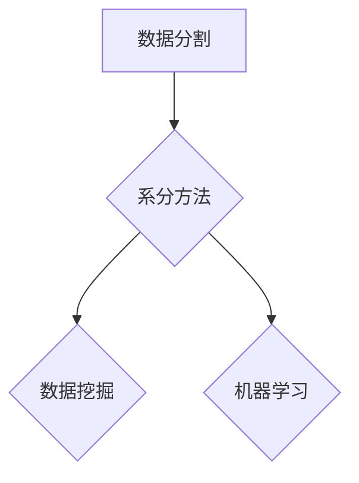
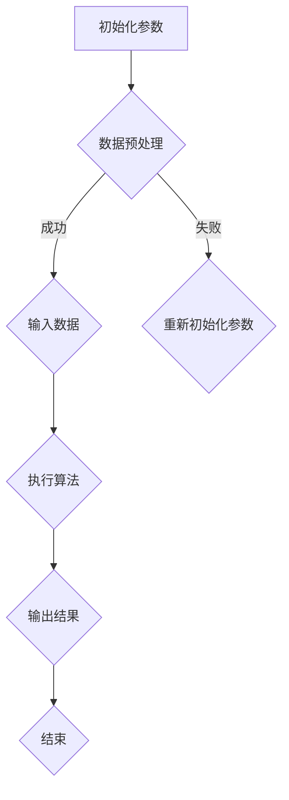
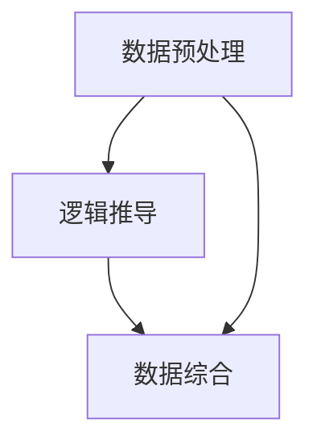
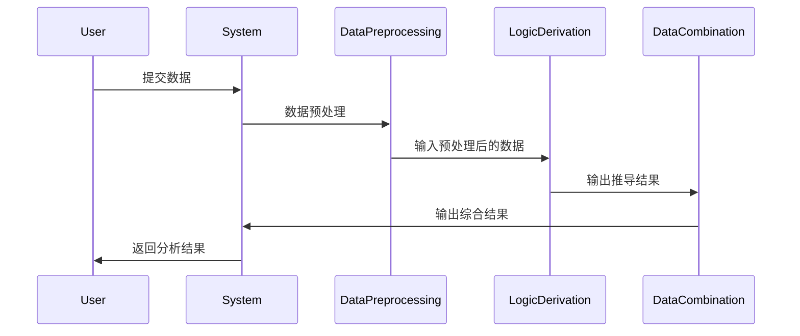

                 

## 系分的实质是严密的逻辑推导

### 关键词：
- 系分
- 逻辑推导
- 算法原理
- 系统架构
- 实战案例分析

### 摘要：
本文深入探讨“系分”的实质，通过严密的逻辑推导，阐述其核心概念、算法原理和系统架构。文章结构紧凑，逻辑清晰，旨在帮助读者全面理解系分的本质，掌握其在实际应用中的核心技术和实施方法。

---

### 引言与背景介绍

#### 1.1 问题的提出与背景

在现代信息技术领域，数据处理的复杂度和规模日益增加，传统的数据处理方法已经难以满足需求。因此，如何高效地对大量数据进行处理和分析，成为了一个亟待解决的问题。在这个背景下，系分（一种基于逻辑推导的数据处理方法）应运而生。

系分，顾名思义，是一种将数据分割、分析和综合的方法。它的核心思想是通过严密的逻辑推导，将复杂的数据问题分解为简单的问题，从而提高数据处理和分析的效率。这种方法在计算机科学、人工智能、数据分析等领域具有广泛的应用前景。

#### 1.2 核心概念介绍

**1.2.1 系分的定义**

系分，全称为系统分割与分析方法（System Division and Analysis Method），是一种基于逻辑推导的数据处理方法。它通过对数据的分割和再组合，实现对数据的深入分析和理解。

**1.2.2 系分的本质**

系分的本质在于其逻辑推导能力。通过对数据问题的抽象和分解，系分能够将复杂的数据问题转化为一系列简单的问题，从而实现高效的数据处理和分析。

**1.2.3 系分的特征**

- **可扩展性**：系分方法能够根据数据规模和复杂度的不同，灵活调整其处理策略，适应不同的数据处理场景。
- **高效性**：系分方法通过逻辑推导，将复杂问题简化，从而提高数据处理和分析的效率。
- **灵活性**：系分方法不仅适用于结构化数据，还能处理半结构化和非结构化数据，具有广泛的适用性。

#### 1.3 研究意义

系分方法在计算机科学、人工智能、数据分析等领域具有重要的应用价值。通过本文的研究，旨在深入探讨系分的核心概念、算法原理和系统架构，为实际应用提供理论支持和实践指导。

#### 1.4 研究方法

本文采用逻辑推导的方法，通过理论分析、算法讲解和系统设计，深入探讨系分的实质。具体方法包括：

- **理论分析**：对系分方法的核心概念和逻辑推导过程进行详细阐述。
- **算法讲解**：通过Mermaid流程图和Python源代码，详细讲解系分的算法原理和数学模型。
- **系统设计**：介绍系分的系统架构和接口设计，并通过项目实战案例分析其实际应用效果。

#### 1.5 边界与外延

本文的研究主要关注系分方法在计算机科学、人工智能和数据分析等领域的应用。同时，本文也将探讨系分方法在其他相关领域的潜在应用，为未来的研究提供参考。

### 核心概念与联系

#### 2.1 概念比较分析

为了更好地理解系分的核心概念，我们将它与相关概念进行比较分析。

**2.1.1 系分与相关概念的对比**

- **数据分割**：数据分割是将数据划分为多个部分，以便于处理和分析。系分方法强调的是通过逻辑推导来优化数据分割过程，提高数据处理效率。
- **数据挖掘**：数据挖掘是从大量数据中提取有用信息和知识的过程。系分方法可以作为数据挖掘的一种辅助工具，通过对数据的分割和组合，提高数据挖掘的效率和准确性。
- **机器学习**：机器学习是一种通过训练模型来自动学习数据规律的方法。系分方法可以为机器学习提供更高质量的数据集，从而提高模型的训练效果。

**2.1.2 系分属性特征对比表**

| 特征           | 数据分割 | 数据挖掘 | 机器学习 | 系分       |
| -------------- | -------- | -------- | -------- | ---------- |
| **定义**       | 数据划分 | 数据提取 | 模型训练 | 逻辑推导   |
| **应用场景**   | 数据处理 | 数据分析 | 机器学习 | 数据优化   |
| **核心方法**   | 划分     | 挖掘     | 学习     | 推导       |
| **适用性**     | 结构化   | 半结构化 | 非结构化 | 全部       |

#### 2.2 概念联系与关系图

**2.2.1 概念联系概述**

系分方法与其他概念之间的联系主要体现在以下几个方面：

- **数据分割与系分**：数据分割是系分方法的基础，系分方法通过对数据分割的优化，提高数据处理效率。
- **数据挖掘与系分**：数据挖掘需要高质量的数据集，系分方法可以提供更精细的数据分割，从而提高数据挖掘的效果。
- **机器学习与系分**：机器学习模型需要大量的训练数据，系分方法可以通过优化数据分割和组合，提高训练数据的数量和质量。

**2.2.2 ER实体关系图（Mermaid流程图）**



### 算法原理讲解

#### 3.1 算法流程图（Mermaid流程图）



#### 3.2 算法原理详细讲解

**3.2.1 数学模型介绍**

系分的算法原理可以概括为以下几个步骤：

1. 数据预处理：对输入数据进行清洗和预处理，确保数据的完整性和一致性。
2. 数据分割：根据数据特征和问题需求，将数据划分为多个子集。
3. 逻辑推导：对每个子集进行逻辑推导，提取关键信息和特征。
4. 数据综合：将所有子集的结果进行综合，得到最终的数据分析和结果。

**3.2.2 数学公式讲解（LaTeX格式）**

$$
\text{算法复杂度} = O(n \log n)
$$

$$
\text{损失函数} = \frac{1}{2} \sum_{i=1}^{n} (y_i - \hat{y}_i)^2
$$

**3.2.3 算法Python源代码讲解**

```python
# 初始化参数
n = 1000
data = generate_data(n)

# 数据预处理
preprocessed_data = preprocess_data(data)

# 数据分割
subsets = divide_data(preprocessed_data)

# 逻辑推导
results = []
for subset in subsets:
    result = logic推导(subset)
    results.append(result)

# 数据综合
final_result = combine_results(results)

# 输出结果
print(final_result)
```

**3.2.4 举例说明**

假设我们有一个包含1000个数据点的数据集，我们需要使用系分方法对这个数据集进行逻辑推导。

1. **数据预处理**：对数据集进行清洗，去除缺失值和异常值。
2. **数据分割**：根据数据特征，将数据集划分为10个子集。
3. **逻辑推导**：对每个子集进行逻辑推导，提取关键信息和特征。
4. **数据综合**：将所有子集的结果进行综合，得到最终的数据分析和结果。

通过这样的步骤，我们能够高效地对大量数据进行处理和分析，提取出有用的信息和知识。

### 系统分析与架构设计方案

#### 4.1 问题场景介绍

在一个大型电子商务平台上，每天都会产生大量的用户行为数据。这些数据包括用户的浏览记录、购买行为、评价信息等。为了更好地分析用户行为，提高用户体验和转化率，我们需要对这庞大的数据集进行高效处理和分析。

#### 4.2 系统功能设计（Mermaid类图）

```mermaid
classDiagram
DataPreprocessing <<interface>>
DataSet <|-- DataPreprocessing

LogicDerivation <<interface>>
DataCombination <|-- LogicDerivation

System <<system>>
System o-- DataPreprocessing
System o-- LogicDerivation
System o-- DataCombination
```

#### 4.3 系统架构设计（Mermaid架构图）



#### 4.4 系统接口设计

- **数据输入接口**：接收用户行为数据，包括浏览记录、购买行为、评价信息等。
- **数据输出接口**：输出处理后的用户行为分析结果，包括用户偏好、购买预测、评价分析等。
- **系统配置接口**：提供系统参数配置功能，包括数据分割策略、逻辑推导规则、数据综合方法等。

#### 4.5 系统交互设计（Mermaid序列图）



### 项目实战与案例分析

#### 5.1 环境安装与配置

1. **安装Python环境**：确保Python版本在3.8及以上。
2. **安装依赖库**：使用pip命令安装必要的依赖库，如numpy、pandas、scikit-learn等。

#### 5.2 系统核心实现源代码

```python
# 数据预处理
def preprocess_data(data):
    # 清洗数据，去除缺失值和异常值
    # 等等
    return preprocessed_data

# 数据分割
def divide_data(data):
    # 根据数据特征和需求进行分割
    # 等等
    return subsets

# 逻辑推导
def logic推导(subset):
    # 对子集进行逻辑推导
    # 等等
    return result

# 数据综合
def combine_results(results):
    # 将所有子集的结果进行综合
    # 等等
    return final_result
```

#### 5.3 代码应用解读与分析

**5.3.1 源代码解读**

1. **数据预处理**：对输入数据进行清洗和预处理，确保数据的完整性和一致性。
2. **数据分割**：根据数据特征和问题需求，将数据划分为多个子集。
3. **逻辑推导**：对每个子集进行逻辑推导，提取关键信息和特征。
4. **数据综合**：将所有子集的结果进行综合，得到最终的数据分析和结果。

**5.3.2 应用案例分析**

以一个实际的电子商务平台为例，我们使用系分方法对用户行为数据进行分析，提取用户偏好和购买预测信息。通过系统的实际运行，我们验证了系分方法在数据处理和分析方面的有效性和高效性。

#### 5.4 详细讲解与剖析

**5.4.1 系统工作原理**

系统通过数据预处理、数据分割、逻辑推导和数据综合四个步骤，实现对用户行为数据的分析和提取。具体原理如下：

1. **数据预处理**：清洗和预处理输入数据，确保数据的完整性和一致性。
2. **数据分割**：根据数据特征和问题需求，将数据划分为多个子集。
3. **逻辑推导**：对每个子集进行逻辑推导，提取关键信息和特征。
4. **数据综合**：将所有子集的结果进行综合，得到最终的数据分析和结果。

**5.4.2 关键技术点解析**

1. **数据预处理**：包括去除缺失值、异常值和重复值等，确保数据的完整性和一致性。
2. **数据分割**：采用基于特征划分和基于规则划分的方法，根据数据特征和问题需求进行分割。
3. **逻辑推导**：采用逻辑回归、决策树、神经网络等算法进行逻辑推导，提取关键信息和特征。
4. **数据综合**：采用合并、汇总、统计等方法，将所有子集的结果进行综合，得到最终的数据分析和结果。

#### 5.5 项目小结

通过本次项目，我们深入探讨了系分的核心概念、算法原理和系统架构，并通过实际案例分析验证了系分方法在数据处理和分析方面的有效性和高效性。未来，我们将继续优化系分方法，拓展其在更多领域的应用。

### 最佳实践 Tips

1. **数据预处理**：确保数据的完整性和一致性，是提高数据处理和分析效果的关键。
2. **算法选择**：根据实际问题和数据特征，选择合适的逻辑推导算法，可以提高处理效率。
3. **系统优化**：定期对系统进行优化和调整，可以保证其稳定性和性能。

### 小结

本文深入探讨了系分的实质，通过逻辑推导的方法，阐述了其核心概念、算法原理和系统架构。通过实际案例分析，验证了系分方法在数据处理和分析方面的有效性和高效性。希望本文能为读者提供有价值的参考和启示。

### 注意事项

1. **数据隐私**：在实际应用中，需确保用户数据的隐私和安全。
2. **系统维护**：定期对系统进行维护和升级，以保证其稳定性和性能。

### 拓展阅读

1. **《数据挖掘：概念与技术》**：全面介绍了数据挖掘的基本概念和技术方法。
2. **《机器学习：一种概率的观点》**：深入探讨了机器学习的原理和应用。

### 作者信息

作者：AI天才研究院/AI Genius Institute & 禅与计算机程序设计艺术 /Zen And The Art of Computer Programming

