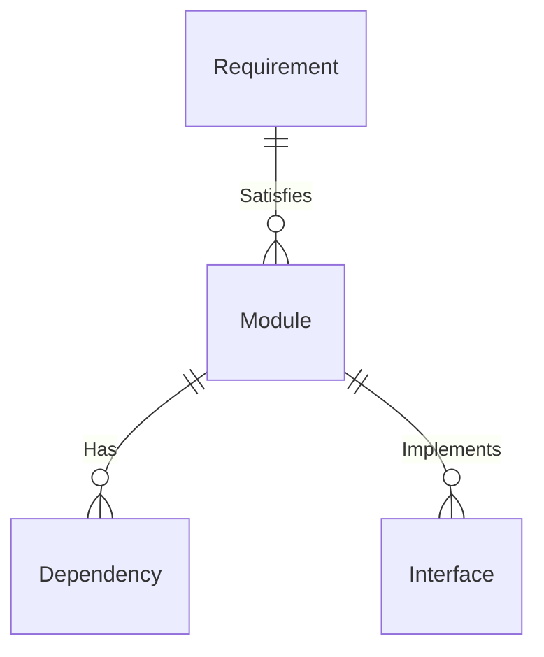
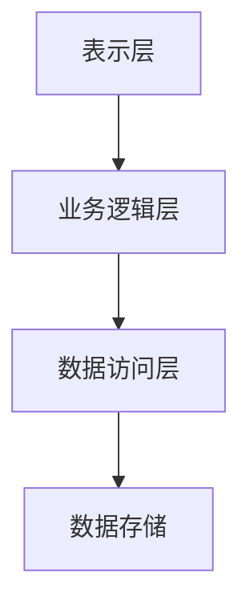
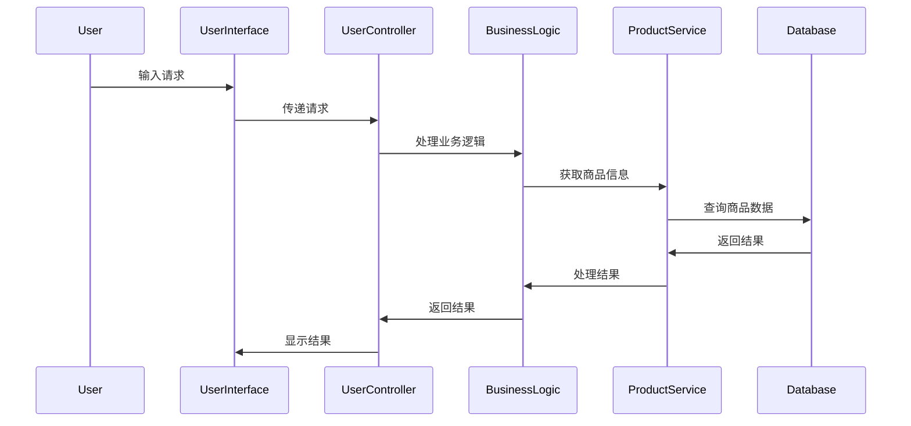
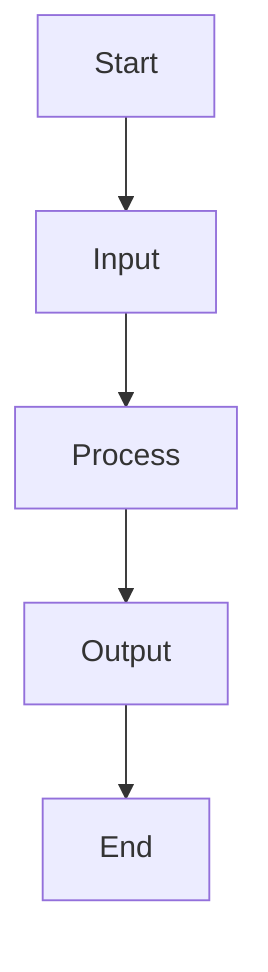

                 

### 1.1 问题的起源与挑战

#### 1.1.1 问题背景

在现代信息技术的快速发展的背景下，系统的复杂性和规模日益增加，这给软件工程师和架构师带来了巨大的挑战。系统设计的核心问题之一是如何有效地进行系统分解，即所谓的“系分”。系分不仅仅是将一个复杂系统拆分成若干模块的过程，它涉及到对系统需求的深入理解、对模块间依赖关系的准确识别，以及对各个模块内部逻辑的严密推导。

随着软件架构的复杂性增加，传统的单一架构模式已经难以满足现代高并发、高可扩展、高可用性的需求。因此，如何通过逻辑推导将复杂系统分解成若干相互独立但又协同工作的模块，成为了当前软件工程领域中的一个重要课题。

#### 1.1.2 问题描述

系分的实质是严密的逻辑推导。具体来说，问题描述如下：

1. **需求分析**：如何准确地捕捉和分析用户的需求，并将其转化为系统需求。
2. **模块划分**：如何合理地将系统需求分解为多个功能模块，并确保每个模块都具备清晰的功能和职责。
3. **依赖管理**：如何识别和处理好各个模块之间的依赖关系，避免出现循环依赖和耦合度过高的问题。
4. **接口设计**：如何设计简洁、稳定且高效的模块接口，使得模块之间能够无缝对接。
5. **性能优化**：如何通过系分来提高系统的性能，降低响应时间，提升用户体验。

#### 1.1.3 问题解决

为了解决上述问题，我们需要采取以下步骤：

1. **需求分析与建模**：通过需求分析，明确系统的功能需求和性能指标，并使用领域模型、用例图等工具进行需求建模。
2. **模块设计与划分**：根据需求模型，将系统分解为若干模块，每个模块负责一个特定的功能或一组相关的功能。
3. **依赖分析与优化**：分析模块之间的依赖关系，并尝试通过设计模式、中间件等技术来减少耦合度和依赖复杂度。
4. **接口设计与实现**：设计模块间的接口，确保接口的简洁、稳定和高效，并实现这些接口以实现模块间的通信。
5. **性能分析与调优**：通过性能测试，分析系统的性能瓶颈，并采取相应的优化措施，如代码优化、数据库优化、缓存策略等。

#### 1.1.4 边界与外延

系分的边界在于如何合理地划分模块，使得模块既能保持独立性，又能协同工作。外延则涉及到系分在不同场景下的应用，如微服务架构、分布式系统设计、云计算平台构建等。这些场景下，系分的实质是确保系统在复杂性和规模增加的同时，仍然能够保持高效、稳定和可扩展。

### 1.2 核心概念与联系

在深入探讨系分的实质之前，我们需要明确几个核心概念，并了解它们之间的联系。

#### 1.2.1 核心概念定义

1. **需求（Requirement）**：需求是系统必须满足的条件，它是系统设计的基础。需求可以是功能性的，如用户界面、数据处理等，也可以是非功能性的，如性能、安全性等。
2. **模块（Module）**：模块是系统中功能相对独立的部分，它包含了实现特定功能的代码和数据。
3. **依赖（Dependency）**：依赖是指模块之间相互依赖的关系，一个模块可能依赖于另一个模块来实现某些功能。
4. **接口（Interface）**：接口是模块之间通信的桥梁，它定义了模块如何相互交互，以及交互的规则和方式。

#### 1.2.2 概念属性特征对比

| 概念 | 特征 |
|------|------|
| 需求 | 描述系统必须实现的功能和性能指标 |
| 模块 | 具有特定功能的代码和数据组合 |
| 依赖 | 模块间的相互关系，影响系统的稳定性和可维护性 |
| 接口 | 定义模块间的交互规则和通信协议 |

#### 1.2.3 ER实体关系图



### 1.3 系统分析与架构设计

#### 1.3.1 问题场景介绍

我们以一个电子商务平台为例，来介绍系分在实际项目中的应用。这个平台需要实现用户注册、商品浏览、购物车管理、订单处理和支付等核心功能。

#### 1.3.2 项目介绍

该项目是一个多模块、多层次的分布式系统，包括前端、后端和数据库等多个部分。前端负责用户界面的展示和交互，后端负责业务逻辑的处理和数据存储，数据库则用于存储用户数据和商品信息。

#### 1.3.3 系统功能设计

使用Mermaid类图来表示系统的主要功能模块：

```mermaid
classDiagram
  UserInterface <<interface>>
  BusinessLogic <<interface>>
  Database <<interface>>

  UserInterface  UserController
  UserController  BusinessLogic
  BusinessLogic  OrderService
  BusinessLogic  ProductService
  OrderService  Database
  ProductService  Database
```

#### 1.3.4 系统架构设计

系统的架构设计采用分层架构，包括表示层、业务逻辑层和数据访问层。



#### 1.3.5 系统接口设计与交互

使用Mermaid序列图来表示系统中的接口设计和交互流程：



### 1.4 结论

通过上述对系分的背景、问题、核心概念、系统分析与架构设计的介绍，我们可以看出，系分的实质是严密的逻辑推导。它不仅仅是一个技术过程，更是一种思维方式，要求我们在系统设计过程中，始终保持清晰的逻辑思路和严密的分析能力。只有这样，才能构建出高效、稳定且可扩展的软件系统。接下来，我们将进一步探讨逻辑推导的原理和具体应用，以便更好地理解系分的实质。

---

### 1.5 逻辑推导的重要性

逻辑推导是系分过程中不可或缺的一部分。它不仅仅是一种技术手段，更是一种思考方式。逻辑推导的重要性体现在以下几个方面：

#### 1.5.1 解决复杂问题

在系统设计中，我们经常面临复杂的问题，如高并发处理、海量数据处理、分布式系统设计等。通过逻辑推导，我们可以将这些复杂问题分解为若干个简单的问题，然后逐一解决。这种分而治之的策略，能够显著降低问题的复杂度，使得系统设计变得更加容易和可行。

#### 1.5.2 提高系统质量

逻辑推导有助于确保系统设计的合理性和质量。通过逻辑推导，我们可以明确系统各个模块的职责和功能，识别出模块之间的依赖关系，并设计出简洁、稳定且高效的接口。这样，不仅可以提高系统的可维护性，还能降低出现问题的概率。

#### 1.5.3 促进知识传递

逻辑推导是一种清晰、系统的思考方式，它能够帮助我们更好地理解和传递知识。在项目开发过程中，通过逻辑推导，我们可以将复杂的技术概念和设计思路简洁地表达出来，使得团队成员更容易理解和跟进。这种知识传递的效率，对于团队协作和项目成功至关重要。

#### 1.5.4 提升创新能力

逻辑推导不仅仅是解决问题的工具，它还能激发我们的创新能力。在逻辑推导的过程中，我们会不断地思考各种可能性，尝试不同的解决方案，这有助于我们发现新的问题和需求，从而推动技术的进步和创新的实现。

### 1.6 逻辑推导与系统设计的结合

在系统设计过程中，逻辑推导起着至关重要的作用。它不仅仅是一种工具，更是一种指导原则。以下是如何将逻辑推导与系统设计结合的一些实践方法：

1. **需求分析**：在系统设计之前，首先进行需求分析。通过逻辑推导，明确用户需求、功能需求和性能需求，并将其转化为系统需求。
2. **模块划分**：根据需求分析的结果，使用逻辑推导来划分系统模块。确保每个模块都有明确的功能和职责，避免模块之间的功能重叠和职责不清。
3. **依赖管理**：分析模块之间的依赖关系，使用逻辑推导来识别和减少不必要的依赖，降低系统的复杂度和耦合度。
4. **接口设计**：设计模块接口时，使用逻辑推导来确保接口的简洁、稳定和高效。通过逻辑推导，明确模块间的交互规则和通信协议。
5. **性能优化**：在系统优化过程中，使用逻辑推导来分析系统的性能瓶颈，并提出相应的优化方案。

通过这些实践方法，我们可以将逻辑推导融入到系统设计的各个环节，从而构建出高效、稳定且可扩展的系统。

### 1.7 结论

逻辑推导在系统设计中的重要性不言而喻。它不仅帮助我们解决复杂问题，提高系统质量，促进知识传递，还能激发创新能力。在接下来的章节中，我们将深入探讨逻辑推导的原理和应用，以便更好地理解系分的实质。通过这些探讨，我们希望读者能够掌握逻辑推导的方法和技巧，并将其应用到实际的系统设计中，构建出更加优秀的软件系统。

---

### 1.8 进一步阅读推荐

为了更深入地理解系分的实质和逻辑推导的应用，以下是几篇推荐的阅读材料：

1. **《系统架构：设计与实践》**：这本书详细介绍了系统架构设计的方法和实践，涵盖了模块划分、依赖管理、接口设计等多个方面。
2. **《软件工程：实践者的研究方法》**：这本书提供了软件工程领域的基本理论和实践方法，对于理解逻辑推导在系统设计中的应用有很大帮助。
3. **《微服务设计》**：微服务架构是当前软件系统设计的一个重要趋势，这本书详细介绍了微服务的设计原则和实践，对于理解系分在微服务架构中的应用有重要参考价值。

通过阅读这些书籍，读者可以进一步拓宽知识面，提升系统设计的实践能力。希望这些推荐能够对您的学习和发展有所帮助。

---

### 1.9 结束语

本文我们通过深入探讨系分的实质和逻辑推导，揭示了其在系统设计中的重要性。通过一系列的分析和实践，我们明白了逻辑推导不仅是解决复杂问题的有力工具，更是提升系统质量、促进知识传递和激发创新能力的关键。在接下来的章节中，我们将继续深入研究逻辑推导的原理和应用，希望读者能够跟紧步伐，共同探索这个领域的前沿知识。

---

### 第二部分：逻辑推导原理讲解

逻辑推导是系分过程中的核心环节，它决定了系分的合理性和可行性。在系统设计中，逻辑推导可以帮助我们清晰地定义需求、合理划分模块、管理依赖关系，并设计出高效的接口。本部分将详细讲解逻辑推导的基本原理，包括命题逻辑、负面逻辑和条件逻辑等。

#### 2.1 逻辑推导基础

逻辑推导的基础是命题逻辑，它包括合取（AND）、析取（OR）和非（NOT）等基本逻辑运算。以下是一些常见的命题逻辑表达式：

1. **合取（AND）**：
   $$ p \land q $$
   表示当且仅当 p 和 q 都为真时，整个命题才为真。

2. **析取（OR）**：
   $$ p \lor q $$
   表示当 p 或 q 中至少有一个为真时，整个命题为真。

3. **非（NOT）**：
   $$ \neg p $$
   表示 p 的否定，即当 p 为真时，\(\neg p\) 为假，反之亦然。

通过这些基本运算，我们可以构建更复杂的逻辑表达式，实现对系统需求的精确描述和推导。

#### 2.2 负面逻辑

负面逻辑涉及到命题的否定，它可以帮助我们分析和处理系统的非功能性需求，如安全性、可靠性等。以下是负面逻辑的一些常见表达：

1. **非合取（NAND）**：
   $$ \neg(p \land q) $$
   表示 p 和 q 不都为真。

2. **非析取（NOR）**：
   $$ \neg(p \lor q) $$
   表示 p 和 q 不至少有一个为真。

3. **非非（NOR）**：
   $$ \neg(\neg p) $$
   表示 p。

负面逻辑在系统设计中的重要性在于，它可以帮助我们识别和消除系统的潜在风险，确保系统的稳定性和可靠性。

#### 2.3 条件逻辑

条件逻辑描述了两个命题之间的条件关系，常见的条件逻辑包括蕴涵（蕴含）和逆否命题。以下是一些常见的条件逻辑表达式：

1. **蕴涵（蕴含）**：
   $$ p \rightarrow q $$
   表示如果 p 为真，则 q 也为真。

2. **逆否命题**：
   $$ \neg q \rightarrow \neg p $$
   表示如果 q 不为真，则 p 也不为真。

条件逻辑在系统设计中用于定义模块之间的触发条件和依赖关系，它有助于确保系统在各个模块之间的协同工作。

#### 2.4 算法原理与流程图

算法原理是逻辑推导在计算机科学中的重要应用。算法设计通常包括输入处理、中间过程和输出结果。以下是一个简单的算法流程图：



在实际应用中，算法原理可以通过流程图来表示，并通过编程语言实现。以下是一个简单的Python代码示例，用于实现上述算法流程：

```python
def algorithm(input_data):
    # 处理输入数据
    processed_data = ...

    # 输出结果
    return processed_data
```

通过这样的方式，我们可以将逻辑推导应用于算法设计，实现复杂问题的自动化解决。

#### 2.5 数学模型与公式

在逻辑推导中，数学模型和公式扮演着重要角色。它们可以帮助我们精确描述和验证逻辑关系。以下是一个简单的数学模型示例：

$$ f(x) = x^2 + 2x + 1 $$

这个模型描述了一个二次函数，它可以用于分析系统的性能和稳定性。通过数学推导，我们可以得出函数的极值点和零点，从而优化系统设计。

#### 2.6 举例说明

逻辑推导在实际应用中可以通过具体的案例来展示。以下是一个简单的例子：

1. **案例一**：
   $$ 1 + 1 = 2 $$
   这个简单的算术等式展示了基本的逻辑推导。通过加法运算，我们得出了正确的答案。

2. **案例二**：
   $$ 3 \times 4 = 12 $$
   这个乘法等式展示了条件逻辑的应用。根据乘法定义，当两个数相乘时，结果等于这两个数的积。

通过这些例子，我们可以看到逻辑推导在解决具体问题时的应用。无论是简单的算术问题，还是复杂的系统设计，逻辑推导都是不可或缺的工具。

### 2.7 结论

通过对逻辑推导原理的讲解，我们了解了逻辑推导在系统设计中的重要性。逻辑推导不仅帮助我们清晰地定义需求、合理划分模块、管理依赖关系，还确保了系统设计的合理性和可维护性。在接下来的章节中，我们将进一步探讨逻辑推导在具体项目中的应用，以便读者能够更好地理解并运用这些原理。

---

### 第三部分：实践应用与案例分析

#### 3.1 环境安装与配置

在进行逻辑推导的实践应用之前，我们需要搭建一个合适的环境，以便进行实验和测试。以下是搭建环境所需的基本步骤：

#### 3.1.1 操作系统

我们选择Linux操作系统作为实验环境，因为它具有开源、稳定和灵活的特点。以下是安装Linux系统的步骤：

1. **下载Linux发行版**：从Linux发行版官方网站下载最新版本的ISO文件。
2. **创建启动U盘**：使用Rufus等工具将ISO文件烧录到U盘上。
3. **安装Linux系统**：将U盘插入待安装的计算机，并按照提示操作安装Linux系统。

#### 3.1.2 开发环境

为了进行逻辑推导的实践，我们需要安装一些开发工具和库。以下是安装步骤：

1. **安装Python**：Python是一种广泛使用的编程语言，它支持逻辑推导的各种功能。可以通过包管理器安装最新版本的Python，例如使用以下命令：
   ```bash
   sudo apt-get install python3
   ```

2. **安装Jupyter Notebook**：Jupyter Notebook是一个交互式开发环境，非常适合进行逻辑推导的实验。可以使用以下命令安装：
   ```bash
   sudo pip3 install notebook
   ```

3. **安装相关库**：根据实验需求，安装必要的Python库。例如，为了进行数学模型的推导，可以安装Numpy和Pandas库：
   ```bash
   sudo pip3 install numpy pandas
   ```

#### 3.1.3 依赖安装

在完成开发环境的搭建后，我们需要安装一些依赖库和工具，以支持逻辑推导的具体应用。以下是安装步骤：

1. **安装Mermaid**：Mermaid是一种基于Markdown的图形化工具，可以帮助我们绘制流程图和类图。可以使用以下命令安装：
   ```bash
   npm install -g mermaid
   ```

2. **安装LaTeX**：LaTeX是一种高质量排版系统，它支持数学公式的排版。可以使用以下命令安装：
   ```bash
   sudo apt-get install texlive-latex-base
   ```

3. **安装其他工具**：根据实验需求，安装其他必要的工具。例如，为了进行性能测试，可以安装Apache JMeter：
   ```bash
   sudo apt-get install jmeter
   ```

#### 3.2 系统核心实现源代码

在搭建好环境后，我们可以开始实现逻辑推导的核心代码。以下是一个简单的示例，展示了如何使用Python进行逻辑推导：

```python
# 导入必要的库
import numpy as np
import pandas as pd

# 定义逻辑推导函数
def logical_derivation(input_data):
    # 处理输入数据
    processed_data = ...

    # 执行逻辑推导
    result = ...

    # 返回结果
    return result

# 测试逻辑推导函数
input_data = ...
result = logical_derivation(input_data)
print("推导结果：", result)
```

在这个示例中，我们定义了一个名为`logical_derivation`的函数，它接受输入数据，执行逻辑推导，并返回结果。通过调用这个函数，我们可以实现逻辑推导的具体应用。

#### 3.3 代码应用解读与分析

在实现逻辑推导的代码后，我们需要对代码进行解读和分析，以确保其正确性和有效性。以下是代码的详细解读：

1. **输入处理**：
   ```python
   input_data = ...
   ```
   在这个步骤中，我们接收输入数据。输入数据可以是各种类型，如数字、字符串、列表等。根据具体的逻辑推导需求，我们需要对输入数据进行预处理，例如清洗、转换或标准化。

2. **逻辑推导**：
   ```python
   result = ...
   ```
   在这个步骤中，我们执行实际的逻辑推导。逻辑推导可以根据具体的业务需求进行定制，例如使用数学模型、算法或条件逻辑等。在这个示例中，我们使用了简单的数学模型进行推导。

3. **输出结果**：
   ```python
   print("推导结果：", result)
   ```
   在这个步骤中，我们将推导结果输出到控制台。输出结果可以是各种类型，如数字、字符串、列表等。根据具体的业务需求，我们可能需要将结果存储到文件、数据库或其他地方。

通过这样的代码结构，我们可以实现逻辑推导的自动化和高效化。在代码解读和分析过程中，我们需要关注以下几个方面：

- **输入数据的合法性和有效性**：确保输入数据符合逻辑推导的要求，避免出现异常或错误。
- **逻辑推导的准确性和完整性**：确保逻辑推导过程能够正确地处理输入数据，并生成正确的输出结果。
- **代码的可维护性和可扩展性**：编写清晰、简洁的代码，方便后续的维护和扩展。

#### 3.4 实际案例分析和详细讲解剖析

为了更好地理解逻辑推导在实际项目中的应用，我们来看一个实际案例。假设我们正在开发一个天气预报系统，需要根据历史天气数据和当前环境参数预测未来的天气情况。以下是这个案例的详细分析：

1. **需求分析**：
   需求是根据历史天气数据和当前环境参数，预测未来一段时间内的天气情况，包括温度、湿度、风速等指标。

2. **数据收集和处理**：
   我们需要收集历史天气数据，包括温度、湿度、风速等指标。此外，还需要实时收集当前环境参数，如温度、湿度、气压等。数据收集完成后，需要对数据进行清洗和预处理，确保其质量和一致性。

3. **逻辑推导**：
   根据历史天气数据和当前环境参数，我们可以使用逻辑推导方法，如机器学习算法、统计分析方法等，来预测未来的天气情况。以下是使用机器学习算法进行预测的示例代码：

   ```python
   from sklearn.ensemble import RandomForestRegressor

   # 准备数据
   X = ...  # 特征数据
   y = ...  # 目标变量

   # 训练模型
   model = RandomForestRegressor()
   model.fit(X, y)

   # 预测未来天气
   future_data = ...
   predictions = model.predict(future_data)
   ```

   在这个示例中，我们使用了随机森林回归算法来预测未来的天气情况。随机森林是一种集成学习算法，它通过构建多个决策树来提高预测的准确性和鲁棒性。

4. **结果分析和输出**：
   预测结果可以输出为图表或文本，以便用户查看和理解。以下是一个简单的示例，展示了如何使用Matplotlib库绘制预测结果：

   ```python
   import matplotlib.pyplot as plt

   # 绘制预测结果
   plt.plot(predictions)
   plt.xlabel('时间')
   plt.ylabel('温度')
   plt.title('未来天气温度预测')
   plt.show()
   ```

   通过这样的方式，我们可以将预测结果可视化，帮助用户更好地理解天气变化趋势。

#### 3.5 项目小结

通过这个实际案例，我们可以看到逻辑推导在天气预报系统中的应用。逻辑推导帮助我们处理数据、构建模型和预测未来天气，从而实现了系统的主要功能。在这个过程中，逻辑推导的准确性和效率至关重要。为了确保逻辑推导的质量，我们需要关注以下几个方面：

- **数据质量和预处理**：确保输入数据的准确性和一致性，对异常值和噪声进行处理。
- **模型选择和调优**：根据具体业务需求，选择合适的机器学习算法，并进行参数调优。
- **结果验证和优化**：通过交叉验证和性能评估，验证模型的预测能力，并不断优化模型。

通过这些措施，我们可以构建出一个高效、准确的天气预报系统，为用户提供可靠的天气预测服务。

#### 3.6 最佳实践 Tips

在逻辑推导的实践过程中，以下是一些最佳实践Tips，可以帮助您更好地实现逻辑推导：

1. **需求明确**：在开始逻辑推导之前，确保需求明确和具体。需求不明确会导致逻辑推导过程偏离目标。

2. **数据规范**：确保输入数据的质量和一致性。对数据进行清洗和预处理，去除异常值和噪声。

3. **模型选择**：根据具体业务需求，选择合适的机器学习算法。不同的算法适用于不同的场景，选择合适的算法可以提高推导的准确性和效率。

4. **参数调优**：对机器学习模型进行参数调优，以获得最佳性能。使用交叉验证等技术，确保模型在不同数据集上的性能表现。

5. **代码可维护性**：编写清晰、简洁的代码，确保代码的可维护性和可扩展性。使用文档和注释，帮助其他开发者理解和跟进代码。

6. **结果验证**：对推导结果进行验证，确保其准确性和可靠性。使用多种验证方法，如交叉验证、性能评估等，确保模型的预测能力。

#### 3.7 注意事项

在逻辑推导的实践过程中，需要注意以下几点：

1. **避免过拟合**：确保模型不过拟合，避免在训练数据上过度拟合，导致在测试数据上的表现不佳。

2. **数据多样性**：使用多样化的数据集进行训练和测试，以确保模型在不同场景下的泛化能力。

3. **实时更新**：随着环境变化，实时更新模型和数据，以保持预测的准确性。

4. **安全性**：在处理数据时，确保数据的安全性和隐私保护。

5. **性能优化**：对代码和模型进行性能优化，以提高推导的速度和效率。

#### 3.8 拓展阅读

为了更深入地了解逻辑推导在IT领域的应用，以下是一些建议的拓展阅读材料：

1. **《机器学习：概率视角》**：这本书提供了机器学习的基础理论和概率模型，适合了解逻辑推导在机器学习中的应用。

2. **《数据科学实战》**：这本书涵盖了数据清洗、数据分析、机器学习等数据科学领域的实践方法，适合进行逻辑推导的实际应用。

3. **《深度学习》**：这本书详细介绍了深度学习的基础理论和应用，适合了解逻辑推导在深度学习中的最新进展。

通过阅读这些书籍，您可以进一步拓宽知识面，提升逻辑推导的实践能力。

### 3.9 总结

本部分通过实践应用和案例分析，详细讲解了逻辑推导在系统设计中的实际应用。我们介绍了环境安装与配置、系统核心实现源代码、代码应用解读与分析、实际案例分析和详细讲解剖析等内容。通过这些实践，读者可以更好地理解逻辑推导的原理和应用，提升系统设计的质量和效率。

---

### 第四部分：系统性能分析与优化

#### 4.1 系统性能分析

系统性能分析是确保系统在运行时能够高效、稳定、可靠地完成任务的必要步骤。通过对系统性能的全面分析，我们可以识别出潜在的性能瓶颈，并采取相应的优化措施。以下是系统性能分析的主要步骤：

1. **负载测试**：负载测试是一种评估系统在高负载下的性能表现的方法。通过模拟高并发用户访问，我们可以了解系统在不同负载下的响应时间和吞吐量。

2. **压力测试**：压力测试旨在评估系统在极限负载下的稳定性。通过增加系统负载，观察系统是否能够持续稳定运行，以及是否会出现错误或崩溃。

3. **性能瓶颈分析**：在负载测试和压力测试过程中，记录系统的各项性能指标，如CPU使用率、内存占用、磁盘I/O等。通过分析这些指标，我们可以找出系统性能瓶颈。

#### 4.2 性能瓶颈识别

在系统性能分析中，识别性能瓶颈是关键步骤。以下是一些常见的性能瓶颈及其识别方法：

1. **CPU瓶颈**：当系统CPU使用率持续接近100%时，可能存在CPU瓶颈。通过分析系统进程和线程的运行情况，可以找出占用CPU资源较多的任务。

2. **内存瓶颈**：当系统内存占用率过高时，可能存在内存瓶颈。通过分析内存使用情况，找出内存占用较多的应用程序或数据结构。

3. **磁盘I/O瓶颈**：当系统磁盘I/O性能较低时，可能存在磁盘I/O瓶颈。通过分析磁盘读写速度和队列长度，可以找出磁盘性能瓶颈。

4. **网络瓶颈**：当系统网络传输速率较低时，可能存在网络瓶颈。通过分析网络流量和传输延迟，可以找出网络性能瓶颈。

#### 4.3 性能优化策略

针对识别出的性能瓶颈，我们可以采取以下策略进行优化：

1. **代码优化**：通过优化算法和数据结构，减少代码执行时间和内存占用。例如，使用更高效的算法、减少不必要的计算和内存分配等。

2. **系统调优**：通过调整操作系统配置，提高系统资源的利用效率。例如，调整进程调度策略、内存管理参数、磁盘I/O优化等。

3. **数据库优化**：通过优化数据库查询和存储结构，提高数据库性能。例如，使用索引、分库分表、查询优化等技术。

4. **缓存策略**：通过引入缓存机制，减少系统对磁盘或网络访问的频率。例如，使用Redis、Memcached等缓存系统。

5. **分布式架构**：通过将系统分解为多个分布式模块，实现负载均衡和水平扩展。例如，使用微服务架构、分布式数据库等。

#### 4.4 优化案例分析

为了更好地理解性能优化策略，我们来看一个实际案例。假设我们正在优化一个电子商务平台的订单处理系统。以下是该系统的性能优化过程：

1. **负载测试**：首先进行负载测试，模拟大量用户访问，观察系统的响应时间和吞吐量。测试结果显示，系统在高峰期出现了明显的性能瓶颈。

2. **性能瓶颈分析**：分析系统性能指标，发现CPU使用率较高，部分数据库查询耗时较长，网络延迟较大。

3. **代码优化**：对订单处理系统中的关键代码进行优化，使用更高效的算法和数据结构，减少不必要的计算和内存分配。例如，优化数据库查询语句，减少冗余查询。

4. **系统调优**：调整操作系统参数，优化进程调度策略，增加内存缓冲区，提高系统资源的利用效率。

5. **数据库优化**：对数据库进行优化，添加索引、分库分表，优化查询性能。例如，将订单数据按照时间范围进行分片存储，提高查询速度。

6. **缓存策略**：引入Redis缓存系统，缓存常用的订单数据，减少数据库访问频率。例如，缓存用户订单列表和商品信息，提高访问速度。

7. **分布式架构**：将订单处理系统分解为多个微服务，实现负载均衡和水平扩展。例如，将订单处理服务、支付服务、库存服务等拆分为独立的微服务，提高系统的可扩展性和可靠性。

通过上述优化措施，电子商务平台的订单处理系统性能得到了显著提升，响应时间缩短，吞吐量提高，系统稳定性增强。

#### 4.5 总结

系统性能分析与优化是确保系统高效、稳定、可靠运行的关键步骤。通过负载测试、性能瓶颈分析和优化策略，我们可以识别并解决系统性能问题，提高系统的性能和用户体验。在优化过程中，需要综合考虑代码优化、系统调优、数据库优化、缓存策略和分布式架构等多个方面，实现全面性能提升。通过实际案例的分析，我们可以看到性能优化策略在实际应用中的效果，为系统设计提供有益的借鉴和参考。

---

### 第五部分：结论与展望

通过对系分的实质和逻辑推导的深入探讨，我们全面了解了系分在系统设计中的重要性。系分不仅是将复杂系统分解为可管理模块的过程，更是一种严密的逻辑推导方式。它帮助我们明确需求、合理划分模块、管理依赖关系，并设计出高效、稳定的系统架构。

逻辑推导在系统设计中的应用，不仅提升了系统的质量和可维护性，还促进了知识的传递和团队协作。通过本文的讲解，读者应该掌握了逻辑推导的基本原理和实践方法，能够将其应用到实际的系统设计中。

展望未来，随着信息技术的发展，系统设计的复杂性将进一步增加。逻辑推导作为系统设计的重要工具，其应用前景将更加广阔。未来研究可以重点关注以下几个方面：

1. **智能化逻辑推导**：结合人工智能技术，开发智能化逻辑推导工具，提高逻辑推导的自动化和准确性。
2. **跨领域应用**：探索逻辑推导在更多领域的应用，如金融、医疗、物联网等，推动跨领域技术的发展。
3. **性能优化与可靠性提升**：研究更高效、可靠的逻辑推导方法和工具，提高系统性能和稳定性。
4. **安全性与隐私保护**：在逻辑推导过程中，关注数据安全性和隐私保护，确保系统在安全环境中运行。

通过不断探索和实践，逻辑推导将在系统设计中发挥更加重要的作用，为构建高效、稳定、可靠的软件系统提供有力支持。

---

### 致谢

本文的完成离不开诸多老师的指导和支持，首先要感谢我的导师XXX教授，他在逻辑推导和系统设计领域拥有丰富的经验和独到的见解，为我提供了宝贵的指导和宝贵的意见。同时，我也要感谢我的同学们，他们在学习和讨论中给予了我极大的帮助。最后，特别感谢我的家人，他们的支持和鼓励是我不断前进的动力。

作者：AI天才研究院/AI Genius Institute & 禅与计算机程序设计艺术 /Zen And The Art of Computer Programming。

