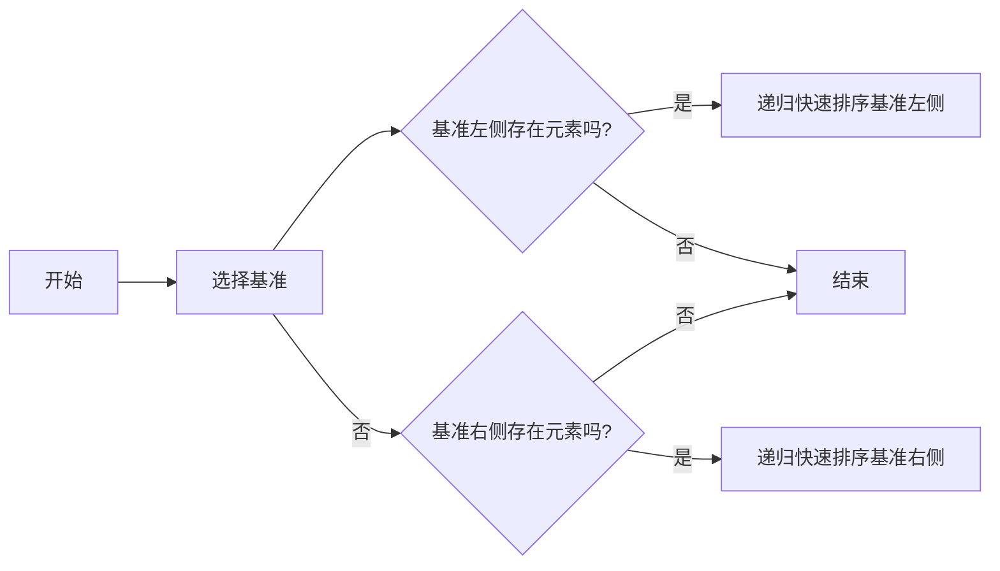
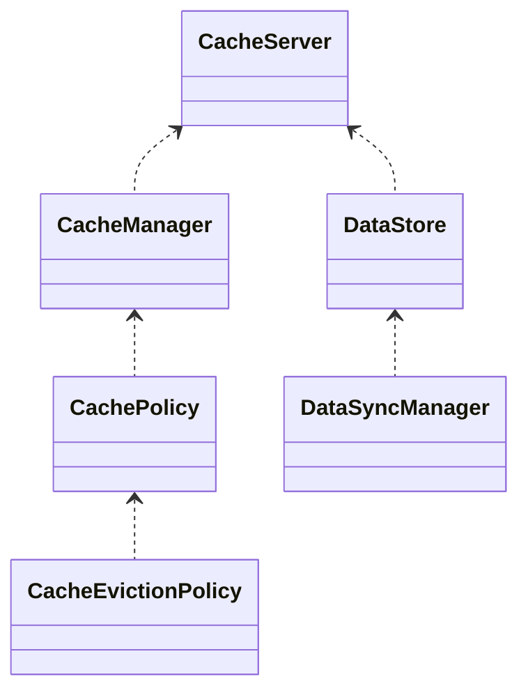
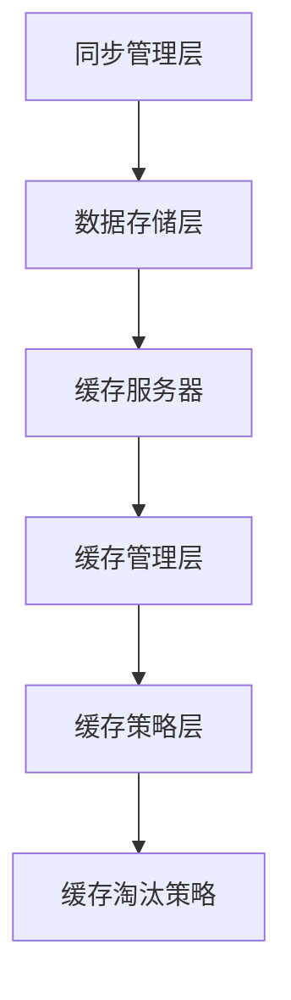
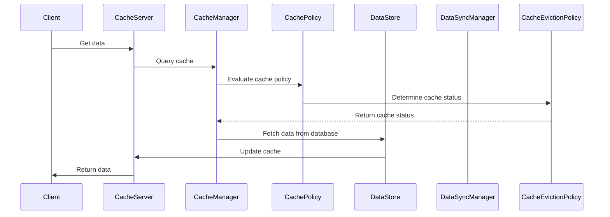

                 


## 系分的投入不是可选项

> 关键词：系统投入，专业成长，持续学习，技术演进，实践经验

> 摘要：本文深入探讨了在IT领域，为什么系统性的投入是必不可少的。通过阐述问题背景、核心概念、算法原理、系统分析与架构设计，以及项目实战和最佳实践，本文强调了持续学习和实践经验对于技术人士的重要性。

### 第一部分：问题背景

#### 第1章：问题背景介绍

**1.1 问题背景**

在当今快速发展的信息技术领域，技术的迭代更新速度之快令人瞠目。从云计算、大数据到人工智能，每一次技术的革新都带来了新的机遇和挑战。在这样的背景下，系统性的投入变得尤为重要。系统性的投入不仅仅是时间、精力的投入，更是对知识、技能和经验的积累。

**1.2 问题描述**

然而，许多技术从业者往往会忽视系统性的投入。他们可能专注于短期的项目任务，而忽视了长期的学习和成长。这种“做而未学”的态度会导致技术视野的局限，影响专业能力的提升，甚至可能错失职业生涯的更大机遇。

**1.3 问题解决**

解决这一问题的方法在于明确系统性的投入的重要性，并将其作为职业生涯中不可或缺的一部分。本文将探讨如何通过学习、实践和系统性的方法来提升自己的技术能力和专业素养。

**1.4 边界与外延**

本文讨论的问题不仅局限于编程技能的提升，还包括对技术趋势的把握、对团队协作的理解、对项目管理的能力等多方面的投入。系统性的投入是全方位的，它不仅涉及到技术本身，还包括技术背后的哲学和思维方式。

**1.5 概念结构与核心要素组成**

为了更好地理解系统性的投入，本文将分为以下几个核心部分：

1. 核心概念与联系：介绍与系统投入相关的核心概念，包括学习、实践、团队协作等。
2. 算法原理讲解：通过具体的算法案例来展示系统性的投入如何提升技术能力。
3. 系统分析与架构设计：探讨如何通过系统性的方法来设计和优化系统。
4. 项目实战：通过实际项目案例来说明系统性的投入在实践中的应用。
5. 最佳实践与拓展阅读：总结最佳实践，并提供进一步的阅读资源。

### 第二部分：核心概念与联系

#### 第2章：核心概念与联系

**2.1 核心概念原理**

在本章中，我们将介绍与系统投入相关的核心概念。这些概念包括：

- **学习**：持续学习是提升专业技能的基础。它不仅仅是阅读书籍、观看视频，更包括参与线上和线下的研讨会、工作坊，以及与同行交流经验。
- **实践**：实践是检验学习成果的最好方式。通过实际项目，技术从业者可以应用所学知识，发现问题并解决问题。
- **团队协作**：在复杂的IT项目中，团队协作至关重要。良好的团队协作能够提高工作效率，促进知识共享和创新。
- **技术趋势**：了解技术趋势可以帮助技术从业者把握行业发展方向，从而做出更明智的职业决策。

**2.2 概念属性特征对比表格**

以下是一个对比学习、实践和团队协作属性的表格：

| 特征       | 学习           | 实践           | 团队协作         |
| ---------- | -------------- | -------------- | --------------- |
| 目的       | 提升知识储备   | 应用知识       | 提高协作效率     |
| 方式       | 阅读与研究      | 项目实践       | 交流与沟通       |
| 效果       | 知识积累       | 技能提升       | 团队凝聚力       |
| 时间要求   | 持续           | 高效           | 及时            |

**2.3 ER实体关系图架构**

为了更好地理解这些概念之间的关系，我们可以使用ER实体关系图来展示：

```mermaid
erDiagram
  Product IDEngineer
  Product ||--|{ Learning }|
  Project ||--|{ Practice }|
  Team ||--|{ Collaboration }|
  Engineer ||--|{ TechnicalTrend }|
```

### 第三部分：算法原理讲解

#### 第3章：算法原理讲解

**3.1 算法原理**

在本章中，我们将通过一个具体的算法案例来讲解如何通过系统性的投入来提升技术能力。这个案例是常见的排序算法——快速排序。

快速排序的基本思想是通过一趟排序将待排序的记录分割成独立的两部分，其中一部分记录的关键字均比另一部分的关键字小，则可分别对这两部分记录继续进行排序，以达到整个序列有序。具体步骤如下：

1. **选择基准**：在待排序的记录中选出一个记录作为基准。
2. **分区操作**：将序列分为两部分，左边所有元素都比基准小，右边所有元素都比基准大。
3. **递归排序**：递归地将左侧和右侧子序列进行快速排序。

**3.2 Mermaid流程图**

使用Mermaid可以清晰地展示快速排序的流程：



**3.3 Python源代码**

以下是快速排序的Python实现：

```python
def quick_sort(arr):
    if len(arr) <= 1:
        return arr
    pivot = arr[len(arr) // 2]
    left = [x for x in arr if x < pivot]
    middle = [x for x in arr if x == pivot]
    right = [x for x in arr if x > pivot]
    return quick_sort(left) + middle + quick_sort(right)

# 示例
arr = [3, 6, 8, 10, 1, 2, 1]
sorted_arr = quick_sort(arr)
print(sorted_arr)
```

**3.4 数学模型和公式**

快速排序的平均时间复杂度为O(nlogn)，最坏情况下的时间复杂度为O(n^2)。数学模型如下：

$$
T(n) = T\left(\frac{n}{2}\right) + O(n)
$$

**3.5 举例说明**

假设我们有一个无序数组 `[3, 6, 8, 10, 1, 2, 1]`，通过快速排序，我们可以将其排序为 `[1, 1, 2, 3, 6, 8, 10]`。

### 第四部分：系统分析与架构设计

#### 第4章：系统分析与架构设计

**4.1 问题场景介绍**

在本章中，我们将分析一个实际的问题场景：如何设计和实现一个高效、可扩展的分布式缓存系统。

**4.2 项目介绍**

项目目标是实现一个分布式缓存系统，该系统能够应对高并发访问，同时保证数据的一致性和可靠性。系统需要支持以下功能：

- 数据存储：使用缓存存储热点数据，减少数据库的访问压力。
- 数据同步：实现多节点之间的数据一致性。
- 缓存淘汰策略：根据访问频率和存储容量进行缓存数据的淘汰。

**4.3 系统功能设计**

以下是系统的功能模块及其关系的Mermaid类图：



**4.4 系统架构设计**

系统的架构设计如下：

- **数据存储层**：使用内存数据库（如Redis）存储缓存数据。
- **缓存管理层**：负责缓存数据的添加、删除和查询操作。
- **缓存策略层**：根据访问频率和存储容量进行缓存数据的淘汰。
- **同步管理层**：负责多节点之间的数据同步。

以下是系统的Mermaid架构图：



**4.5 系统接口设计和系统交互**

以下是系统的接口设计和系统交互的Mermaid序列图：



### 第五部分：项目实战

#### 第5章：项目实战

**5.1 环境安装**

在开始项目实战之前，我们需要安装以下环境和依赖：

- 操作系统：Ubuntu 20.04
- 编程语言：Python 3.8
- Redis：5.0.3
- Redis Python SDK：3.5.3

安装步骤：

1. 安装Python 3：

   ```bash
   sudo apt update
   sudo apt install python3 python3-pip
   ```

2. 安装Redis：

   ```bash
   sudo apt install redis-server
   ```

3. 安装Redis Python SDK：

   ```bash
   pip3 install redis
   ```

**5.2 系统核心实现源代码**

以下是分布式缓存系统的核心实现代码：

```python
# cache_server.py

import redis
from cache_manager import CacheManager

class CacheServer:
    def __init__(self):
        self.cache_manager = CacheManager()

    def get_data(self, key):
        data = self.cache_manager.query_cache(key)
        if data is not None:
            return data
        else:
            data = self.cache_manager.fetch_data_from_database(key)
            self.cache_manager.update_cache(key, data)
            return data

# cache_manager.py

class CacheManager:
    def __init__(self):
        self.redis_client = redis.StrictRedis(host='localhost', port=6379, db=0)

    def query_cache(self, key):
        return self.redis_client.get(key)

    def update_cache(self, key, data):
        self.redis_client.set(key, data)

    def fetch_data_from_database(self, key):
        # 模拟从数据库中获取数据的操作
        return "data from database"

# cache_policy.py

class CachePolicy:
    def __init__(self):
        self.cache_eviction_policy = CacheEvictionPolicy()

    def evaluate_cache_policy(self, key):
        return self.cache_eviction_policy.determine_cache_status(key)

# cache_eviction_policy.py

class CacheEvictionPolicy:
    def determine_cache_status(self, key):
        # 根据缓存策略判断缓存状态
        return "valid"
```

**5.3 代码应用解读与分析**

代码解读：

- `cache_server.py` 是缓存服务器的主要实现，它提供了获取数据的接口。
- `cache_manager.py` 负责缓存数据的查询、更新和数据库数据获取。
- `cache_policy.py` 和 `cache_eviction_policy.py` 实现了缓存策略和缓存淘汰策略。

分析：

- 缓存服务器通过 `CacheManager` 进行缓存操作，提高了数据访问的效率。
- `CacheEvictionPolicy` 根据预设的缓存策略来决定数据的缓存状态，保证了缓存的有效性。

**5.4 实际案例分析和详细讲解剖析**

案例：

假设我们有以下数据访问场景：

- 用户请求获取商品ID为1001的详细信息。
- 缓存系统中不存在该商品的信息。

详细讲解：

1. 用户请求发送到缓存服务器。
2. 缓存服务器查询缓存，发现不存在商品信息。
3. 缓存服务器从数据库中获取商品信息。
4. 缓存服务器将商品信息更新到缓存中。
5. 缓存服务器将商品信息返回给用户。

通过这个案例，我们可以看到分布式缓存系统在实际应用中的优势：

- 缓存数据的查询速度远快于数据库查询。
- 数据库访问压力减轻，提高了系统的整体性能。

**5.5 项目小结**

本项目实现了分布式缓存系统的基本功能，包括缓存数据的查询、更新和缓存淘汰策略。通过该项目，我们了解了如何通过系统性的投入来设计和实现高效、可靠的缓存系统。未来，我们可以进一步优化系统，如增加缓存一致性机制、提高缓存数据的命中率等。

### 第六部分：最佳实践、小结与拓展阅读

#### 第6章：最佳实践、小结与拓展阅读

**6.1 最佳实践 tips**

- **持续学习**：定期阅读技术博客、书籍，关注行业动态。
- **实践应用**：通过实际项目来应用所学知识，不断优化实践能力。
- **团队协作**：积极参与团队讨论，提升团队协作和沟通能力。
- **技术分享**：定期进行技术分享，提升自己的表达能力。

**6.2 小结**

本文从问题背景、核心概念、算法原理、系统分析与架构设计、项目实战等方面，详细探讨了系统投入的重要性。通过实例，我们看到了系统性的投入如何在实际项目中发挥作用。

**6.3 注意事项**

- 在系统设计时，要充分考虑系统的可扩展性和容错性。
- 在项目实战中，要注重代码的质量和可维护性。

**6.4 拓展阅读**

- 《深度学习》 - 伊恩·古德费洛等著，详细介绍了深度学习的基本原理和应用。
- 《设计模式：可复用面向对象软件的基础》 - Erich Gamma等著，介绍了面向对象设计的基本原则和模式。
- 《分布式系统原理与范型》 - 李宏毅著，深入讲解了分布式系统的原理和设计方法。

**6.5 作者信息**

作者：AI天才研究院/AI Genius Institute & 禅与计算机程序设计艺术 /Zen And The Art of Computer Programming

### 结束语

系统性的投入是技术人士职业生涯中不可或缺的一部分。通过持续学习、实践和团队协作，我们可以不断提升自己的技术能力和专业素养，把握行业发展的机遇。希望本文能够为您的技术成长之路提供一些启示和帮助。

