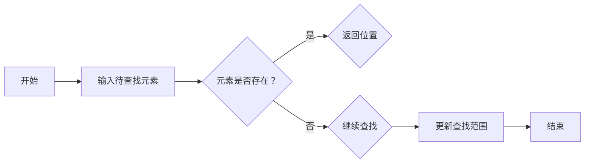
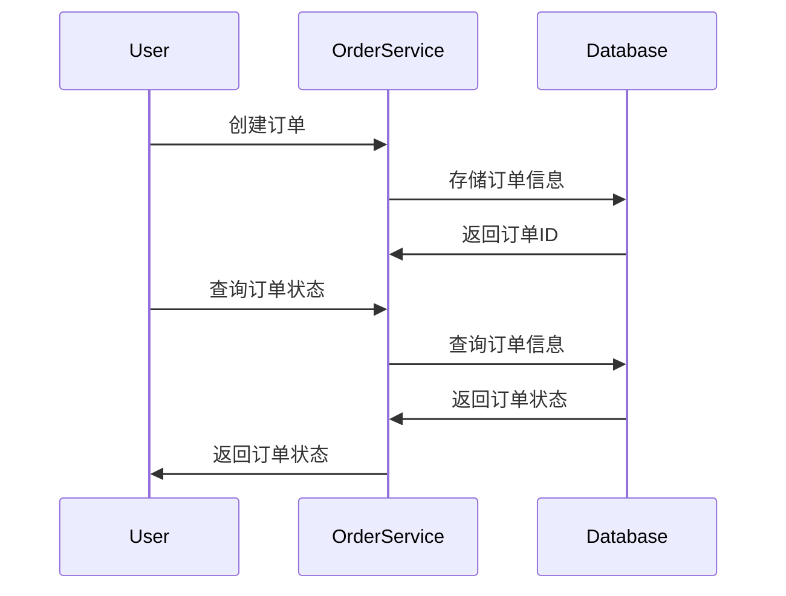
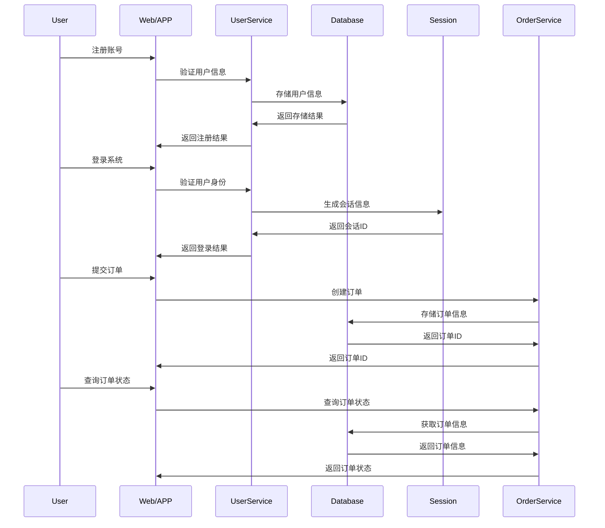

                 


### 目录大纲结构

在撰写《系分的投入不是可选项》这篇文章时，我们将采用一个清晰的目录大纲结构来组织内容。目录大纲是文章的骨架，它帮助读者快速了解文章的结构和主题，为后续的内容提供指导和参考。以下是文章的目录大纲结构，我们将逐一解释每个部分的作用和内容。

#### 文章标题

文章的标题通常简洁明了，能够吸引读者的兴趣。例如，"系分的投入不是可选项"这个标题直接指出了文章的核心内容，强调了系统分析和架构设计中的投入问题。

#### 文章关键词

关键词部分列出与文章主题紧密相关的几个词汇，这些词可以帮助搜索引擎更好地索引文章，同时为读者快速查找相关内容提供帮助。例如：“系统架构”、“投入决策”、“成本效益分析”、“架构设计原则”。

#### 文章摘要

摘要是对文章核心内容和主要观点的简短总结，通常在文章开头出现，让读者在阅读全文之前就能了解文章的主旨。摘要应该简洁、精炼，包含文章的主要结论和建议。

#### 第一部分：背景与核心概念

**第1章：问题背景与概述**

这一章节将介绍当前企业在系统架构设计和投入决策方面面临的挑战。通过具体案例和分析，读者可以理解为什么要深入探讨系统架构设计与投资决策的关系。

**第2章：核心概念解析**

这一章节将定义和介绍文章中涉及的核心概念，如系统架构设计的基本原则、关键要素等。通过对比表格和ER实体关系图，读者可以更好地理解这些概念之间的关系。

#### 第二部分：算法原理与模型讲解

**第3章：算法原理讲解**

在这一章节中，我们将使用Mermaid绘制算法流程图，并用Python代码详细阐述算法原理。同时，我们将给出数学模型和公式，并使用LaTeX格式进行排版，确保公式的准确性和易读性。

#### 第三部分：系统分析与架构设计

**第4章：系统分析**

这一章节将详细描述系统要解决的问题，包括问题场景、系统功能设计、系统架构设计等。我们将使用Mermaid类图、架构图和序列图来展示系统的各个方面。

**第5章：架构设计实战**

这一章节将通过一个实际项目，展示如何进行环境安装、核心实现源代码编写，并对代码应用进行解读与分析。通过实际案例分析，读者可以深入了解系统架构设计的实践应用。

#### 第四部分：最佳实践与总结

**第6章：最佳实践**

在这一章节中，我们将总结最佳实践、注意事项，并提供拓展阅读建议，帮助读者在实际工作中更好地应用文章中的知识。

### 总结

通过上述目录大纲结构的解释，我们可以看到，文章将从背景介绍、核心概念解析、算法原理讲解、系统分析与架构设计以及最佳实践等多个方面进行深入探讨。这样的结构不仅有助于读者系统地理解文章内容，还能够使文章的结构更加清晰、逻辑更加严密。

接下来，我们将根据这个目录大纲，逐步撰写文章的各个部分，确保每部分内容都符合文章的核心主题和要求。

## 文章标题

### 系分的投入不是可选项

关键词：系统架构、投入决策、成本效益分析、架构设计原则

摘要：本文深入探讨了系统架构设计与投资决策之间的关系，通过实际案例分析和算法原理讲解，揭示了系统设计与投入之间的重要联系。本文旨在帮助读者理解系统架构设计中的投入不仅是一个选择，而是确保系统成功的关键因素。

### 第一部分：背景与核心概念

#### 第1章：问题背景与概述

在当今快速发展的信息技术时代，企业的竞争力不仅取决于技术的先进性，还取决于系统的架构设计及其投入决策。随着业务需求的不断增长和技术的快速迭代，企业面临着如何在有限的资源下，设计出既高效又稳定的系统架构的挑战。

#### 1.1 问题背景

许多企业在系统架构设计时，往往注重技术的选择和创新，却忽视了投入的重要性。这种忽视导致了一些问题：

1. **资源浪费**：不合理的投入可能导致资源的浪费，如购买过多的硬件或软件，而未充分利用。
2. **性能瓶颈**：缺乏足够的投入可能导致系统在处理大量数据时出现性能瓶颈，影响业务运行。
3. **维护困难**：投入不足可能导致系统架构的维护和升级变得困难，影响系统的长期稳定性。

#### 1.2 问题描述

系统架构设计与投资决策之间的关系可以概括为以下几个方面：

1. **成本与效益**：企业在进行系统架构设计时，需要考虑投入的成本和预期收益，确保投资能够带来相应的效益。
2. **技术选型**：不同的技术选型对投入的需求不同，企业需要根据实际需求和技术成熟度进行合理选择。
3. **长期规划**：系统架构设计不仅仅是短期项目的需求，还需要考虑系统的长期规划和发展，这需要持续的投入。

#### 1.3 问题解决思路

要解决上述问题，企业需要从以下几个方面入手：

1. **需求分析**：明确系统架构设计的具体需求，确保投入与需求匹配。
2. **成本效益分析**：对不同的技术方案进行成本效益分析，选择性价比最高的方案。
3. **持续投入**：系统架构设计不是一次性的投入，而是需要持续的关注和投入，以确保系统的长期稳定和高效运行。

#### 1.4 边界与外延

本文将讨论的范围主要集中在系统架构设计与投资决策之间的关系，具体包括：

1. **技术选型与投入**：分析不同技术方案的投入需求。
2. **成本效益分析**：介绍如何进行有效的成本效益分析。
3. **长期规划与投入**：探讨系统架构设计的长期规划与投入策略。

本文的外延将涉及以下领域：

1. **企业战略**：企业战略中的系统架构设计和投入决策。
2. **技术创新**：技术创新对系统架构设计的影响。
3. **项目管理**：项目管理中的系统架构设计和投入控制。

### 第一部分总结

通过上述章节，我们介绍了系统架构设计与投资决策之间的背景、问题和解决思路。接下来，我们将进一步深入探讨核心概念，并逐步分析具体的算法原理和系统架构设计方案。

### 第2章：核心概念解析

在系统架构设计与投资决策的探讨中，理解核心概念是非常重要的。这些核心概念构成了系统架构设计的理论基础，是进行有效决策的关键因素。在本章中，我们将介绍以下几个核心概念：系统架构设计的基本原则、关键要素以及它们之间的关系。

#### 2.1 系统架构设计的基本原则

系统架构设计的基本原则是确保系统在变化的环境中保持稳定性和可扩展性的重要指导方针。以下是一些关键的基本原则：

1. **模块化**：系统应划分为独立的模块，每个模块负责特定的功能。模块之间的耦合度应尽可能低，以便于维护和扩展。
2. **可扩展性**：系统架构应支持未来的扩展，包括功能的增加和性能的提升。这通常通过设计灵活的接口和可重用的组件来实现。
3. **可靠性**：系统应能够在各种环境下稳定运行，包括网络故障、硬件故障等。可靠性可以通过冗余设计、容错机制和自动化测试来实现。
4. **安全性**：系统架构应确保数据的安全性和系统的完整性。这包括数据加密、访问控制、安全审计等。

#### 2.2 系统架构设计的关键要素

系统架构设计的关键要素是系统正常运行的基础。以下是几个关键要素：

1. **数据层**：数据层负责数据的存储、管理和访问。它包括数据库、数据仓库、缓存等。数据层的性能和可扩展性对整个系统的性能至关重要。
2. **应用层**：应用层是系统的核心功能实现层，负责业务逻辑的处理。它通常由多个服务组成，每个服务负责特定的业务功能。
3. **网络层**：网络层负责系统内部以及与其他系统之间的通信。网络层的可靠性、带宽和延迟对系统的整体性能有重要影响。
4. **界面层**：界面层负责用户与系统的交互，包括前端用户界面和后端API。界面层的用户体验对系统的使用频率和用户满意度有直接影响。

#### 2.3 概念属性特征对比表格

为了更好地理解上述核心概念，我们可以在表格中对比它们的属性特征。以下是一个简单的对比表格：

| 核心概念   | 属性特征                       | 说明                                                                                                         |
| ---------- | ------------------------------ | ------------------------------------------------------------------------------------------------------------ |
| 模块化     | 低耦合、高内聚                 | 模块独立，便于维护和扩展。                                                                                 |
| 可扩展性   | 可重用组件、灵活接口           | 系统易于扩展功能，性能可提升。                                                                             |
| 可靠性     | 冗余设计、容错机制、自动化测试 | 系统在异常情况下仍能稳定运行。                                                                             |
| 安全性     | 数据加密、访问控制、安全审计   | 保护数据和系统免受攻击。                                                                                 |
| 数据层     | 数据存储、管理、访问            | 数据层的性能影响系统性能。                                                                                 |
| 应用层     | 业务逻辑处理                   | 应用层是系统功能实现的核心。                                                                               |
| 网络层     | 通信、可靠性、带宽和延迟       | 网络层影响系统的响应速度和稳定性。                                                                         |
| 界面层     | 用户交互、用户体验             | 界面层直接影响用户的满意度。                                                                               |

#### 2.4 ER实体关系图架构

ER（实体关系）图是描述系统中实体及其关系的图形表示方法。以下是使用Mermaid绘制的ER实体关系图：

```mermaid
erDiagram
    Customer ||--|{ Order }|
    Product ||--|{ Order }|
    Order ||--|{ OrderLine }|
    Customer && Product : buys
```

在这个ER图中，我们定义了四个实体：Customer（客户）、Product（产品）、Order（订单）和OrderLine（订单行）。它们之间的关系是：

- Customer（客户）可以购买多个Order（订单）。
- Product（产品）可以出现在多个Order（订单）中。
- 一个Order（订单）可以包含多个OrderLine（订单行）。
- Customer（客户）和Product（产品）之间存在购买关系。

#### 2.5 关键概念之间的联系

系统架构设计中的关键概念之间存在着紧密的联系。以下是它们之间的相互关系：

- **模块化** 与 **可扩展性**：模块化是实现可扩展性的基础，通过模块化设计，系统能够更方便地添加新功能和组件。
- **可靠性** 与 **安全性**：可靠性确保系统在正常和异常情况下都能运行，而安全性则确保系统能保护其免受外部威胁。
- **数据层** 与 **应用层**：数据层为应用层提供数据支持，而应用层通过业务逻辑处理数据层的输入和输出。
- **网络层** 与 **界面层**：网络层确保数据的传输和通信，界面层则提供用户与系统的交互界面。

#### 2.6 关键概念的实践应用

在系统架构设计过程中，理解和应用关键概念能够帮助设计师做出更明智的决策。以下是一些关键概念的实践应用：

- **模块化**：在设计应用服务时，可以将不同的业务功能划分为独立的模块，便于后期维护和扩展。
- **可扩展性**：在设计数据库时，可以采用分库分表策略，以提高系统的可扩展性。
- **可靠性**：在设计网络架构时，可以采用负载均衡和故障转移机制，以提高系统的可靠性。
- **安全性**：在设计用户认证和授权时，可以采用多因素认证和加密传输机制，以提高系统的安全性。

#### 2.7 总结

通过本章的介绍，我们了解了系统架构设计中的核心概念及其重要性。理解这些概念不仅有助于设计师做出更明智的决策，还能够提高系统的性能、可靠性和安全性。在接下来的章节中，我们将深入探讨算法原理和系统架构设计方案，以帮助读者更好地理解系统架构设计与投资决策之间的关系。

### 第二部分：算法原理与模型讲解

#### 第3章：算法原理讲解

在系统架构设计中，算法原理是核心之一。算法不仅决定了系统的性能，还影响了系统的可扩展性和可维护性。本章将详细介绍一种常用的算法原理，并通过Mermaid流程图和Python代码来阐述其具体实现。

#### 3.1 算法流程图解析

首先，我们通过Mermaid流程图展示算法的基本流程。以下是一个简单的查找算法流程图：



在这个流程图中，我们首先输入待查找元素，然后判断该元素是否存在。如果存在，返回其位置；如果不存在，则继续查找，并更新查找范围，直到找到或到达查找范围的边界。

#### 3.2 Python代码与算法实现

接下来，我们使用Python代码实现上述算法。以下是一个简单的二分查找算法的实现：

```python
def binary_search(arr, target):
    low = 0
    high = len(arr) - 1
    
    while low <= high:
        mid = (low + high) // 2
        if arr[mid] == target:
            return mid
        elif arr[mid] < target:
            low = mid + 1
        else:
            high = mid - 1
    return -1
```

在这个实现中，我们首先定义了一个查找范围（low和high），然后通过循环不断缩小查找范围，直到找到目标元素或确定目标元素不存在。如果找到目标元素，返回其位置；如果未找到，返回-1。

#### 3.3 数学模型与公式讲解

二分查找算法的基本原理是基于数学模型中的中值定理。中值定理表明，如果一个数列是递增或递减的，那么可以通过取中值来快速定位目标元素。以下是一个简单的数学模型：

$$
\text{中值} = \frac{\text{最大值} + \text{最小值}}{2}
$$

在这个模型中，我们通过不断取中值来缩小查找范围，直到找到目标元素或确定目标元素不在当前范围内。以下是一个具体的示例：

假设我们有一个数列\[1, 3, 5, 7, 9\]，我们希望查找元素5。首先，我们取中值\( \frac{1+9}{2} = 5 \)，发现目标元素正好是中值，因此直接返回位置2。如果目标元素是7，我们将取新的中值\( \frac{3+5}{2} = 4 \)，发现目标元素大于中值，因此下一次查找范围变为\[5, 7, 9\]。

#### 3.4 算法原理举例说明

为了更好地理解二分查找算法，我们通过一个具体例子进行说明。假设我们有一个有序数组\[1, 3, 5, 7, 9\]，我们希望查找元素7。

1. **第一次查找**：取中值\( \frac{1+9}{2} = 5 \)，发现7大于5，因此下一次查找范围变为\[5, 7, 9\]。
2. **第二次查找**：取中值\( \frac{5+7}{2} = 6 \)，发现7大于6，因此下一次查找范围变为\[7, 9\]。
3. **第三次查找**：取中值\( \frac{7+9}{2} = 8 \)，发现7小于8，因此下一次查找范围变为\[7\]。
4. **第四次查找**：取中值\( \frac{7+7}{2} = 7 \)，发现7等于中值，因此返回位置3。

通过这个例子，我们可以看到二分查找算法是如何通过不断缩小查找范围来快速定位目标元素的。这种方法不仅提高了查找效率，还降低了时间复杂度，使其在处理大量数据时具有很高的性能。

#### 3.5 算法优缺点分析

二分查找算法具有以下优点：

1. **高效**：通过不断缩小查找范围，二分查找算法在平均情况下具有较快的查找速度。
2. **稳定**：二分查找算法的时间复杂度为\( O(\log n) \)，因此在大规模数据处理中表现出良好的稳定性。

然而，二分查找算法也有以下缺点：

1. **需要有序数组**：二分查找算法要求数组必须是有序的，否则无法进行有效的查找。
2. **内存消耗**：为了存储查找范围，算法需要额外的内存空间。

#### 3.6 总结

通过本章的介绍，我们详细讲解了二分查找算法的原理、实现和应用。二分查找算法是一种高效稳定的查找方法，适用于处理大量有序数据。理解算法原理和数学模型不仅有助于提高系统的性能，还能够为系统架构设计提供有力支持。在接下来的章节中，我们将进一步探讨系统架构设计中的具体问题和解决方案。

### 第三部分：系统分析与架构设计

#### 第4章：系统分析与架构设计

系统分析与架构设计是确保系统高效、稳定和可靠运行的关键步骤。在这一部分，我们将通过一个实际案例来详细描述系统架构设计的过程，包括问题场景介绍、系统功能设计、系统架构设计、系统接口设计和系统交互流程。

#### 4.1 问题场景介绍

假设我们正在为一家电子商务公司设计一个订单管理系统。该系统需要支持大量订单的处理，同时确保订单信息的准确性、一致性和及时性。具体问题场景如下：

1. **订单处理量巨大**：公司每天处理的订单数量多达数十万，需要对订单信息进行高效处理。
2. **订单信息多样性**：订单信息包括商品种类、数量、价格、客户信息等，需要设计灵活的数据结构来存储和处理这些信息。
3. **高并发访问**：系统需要同时处理大量用户的访问请求，确保系统在高并发情况下仍能稳定运行。
4. **数据一致性**：订单数据需要在多个系统模块之间保持一致，防止数据冲突和错误。
5. **安全性**：系统需要确保订单数据的安全，防止数据泄露和非法访问。

#### 4.2 系统功能设计

在了解问题场景后，我们开始设计系统功能。以下是系统的主要功能模块：

1. **订单创建模块**：负责创建订单，包括商品、数量、价格等信息的录入。
2. **订单处理模块**：负责处理订单，包括订单支付、发货、取消等操作。
3. **订单查询模块**：提供订单查询功能，用户可以查询订单状态、历史订单等。
4. **库存管理模块**：管理商品库存信息，确保订单处理过程中库存数据的准确性。
5. **用户管理模块**：管理用户信息，包括注册、登录、权限管理等。

#### 4.3 系统架构设计

系统架构设计是确保系统功能实现的基础。以下是系统架构的详细设计：

1. **数据层**：采用关系型数据库（如MySQL）存储订单、用户和库存等数据。数据层负责数据的存储、管理和查询。
2. **应用层**：应用层是系统的核心部分，负责业务逻辑的处理。应用层由多个微服务组成，每个微服务负责特定的业务功能。
3. **网络层**：网络层负责系统内部以及与其他系统之间的通信。采用负载均衡器（如Nginx）来分发请求，确保系统的高并发处理能力。
4. **界面层**：界面层提供用户与系统的交互界面，包括Web前端和移动端应用。界面层采用响应式设计，以适应不同设备的使用。

以下是系统架构的Mermaid类图：

```mermaid
classDiagram
    OrderSystem <<interface>>
    UserService <<interface>>
    OrderService <<interface>>
    InventoryService <<interface>>
    OrderSystem ..> UserService
    OrderSystem ..> OrderService
    OrderSystem ..> InventoryService
```

在这个类图中，OrderSystem是系统的顶层接口，UserService、OrderService和InventoryService分别代表用户管理、订单处理和库存管理三个微服务。它们通过接口与OrderSystem进行通信，实现各自的功能。

#### 4.4 系统接口设计

系统接口设计是确保不同模块之间能够有效通信的关键。以下是系统的接口设计：

1. **订单创建接口**：接收订单信息，返回订单ID。
2. **订单处理接口**：根据订单ID执行订单操作，如支付、发货、取消等。
3. **订单查询接口**：根据订单ID查询订单状态和信息。
4. **库存查询接口**：查询商品库存信息。
5. **用户管理接口**：用户注册、登录、权限管理等。

以下是系统接口的Mermaid架构图：



在这个序列图中，用户首先通过OrderService创建订单，然后OrderService将订单信息存储到数据库中，并返回订单ID。用户可以随时查询订单状态，OrderService从数据库中获取订单信息并返回给用户。

#### 4.5 系统交互流程

系统交互流程描述了用户与系统之间的交互过程。以下是系统交互流程的详细描述：

1. **用户注册**：用户通过Web前端或移动端应用注册账号，系统验证用户输入的信息，并将用户信息存储到数据库中。
2. **用户登录**：用户输入账号和密码登录系统，系统验证用户身份，并生成会话信息。
3. **订单创建**：用户在购物车中选择商品，点击提交订单，系统生成订单信息，并将订单存储到数据库中。
4. **订单处理**：订单创建后，系统根据订单信息执行相应的操作，如支付、发货、取消等。
5. **订单查询**：用户可以随时查询订单状态，系统从数据库中获取订单信息并返回给用户。

以下是系统交互流程的Mermaid序列图：



通过这个序列图，我们可以清晰地看到用户与系统之间的交互过程，包括用户注册、登录、订单创建和订单查询等操作。

#### 4.6 系统性能优化

为了确保系统能够在高并发情况下稳定运行，我们对系统进行了性能优化：

1. **缓存策略**：在数据库访问频繁的模块中引入缓存，减少数据库的访问次数，提高系统响应速度。
2. **异步处理**：对于一些耗时的操作，如订单支付和发货，采用异步处理方式，减轻系统负担。
3. **数据库优化**：通过索引和查询优化，提高数据库的查询性能。
4. **负载均衡**：采用负载均衡器（如Nginx）来分发请求，确保系统资源得到充分利用。

#### 4.7 总结

通过本章的介绍，我们详细描述了一个电子商务订单管理系统的架构设计过程。从问题场景分析、系统功能设计、系统架构设计、系统接口设计到系统交互流程，我们逐步展示了系统设计与实现的全过程。通过实际案例的分析，读者可以更好地理解系统架构设计的原则和方法，为实际项目提供有益的参考。

### 第5章：架构设计实战

#### 5.1 环境安装与配置

在开始实际项目之前，我们需要安装和配置所需的环境。以下是具体的安装和配置步骤：

1. **操作系统**：我们选择Linux操作系统，例如Ubuntu 20.04。
2. **数据库**：我们使用MySQL作为数据库，可以下载最新版本的MySQL并进行安装。
3. **编程语言**：我们使用Python 3.8作为主要编程语言，可以通过Python官方网站下载并安装。
4. **开发工具**：我们使用Visual Studio Code作为代码编辑器，可以从官方渠道下载并安装。

安装步骤如下：

1. **安装操作系统**：在计算机上安装Linux操作系统，选择合适的安装方式和分区方案。
2. **更新系统**：打开终端，输入以下命令更新系统：
   ```shell
   sudo apt update
   sudo apt upgrade
   ```
3. **安装MySQL**：下载MySQL安装包，并按照官方文档进行安装：
   ```shell
   sudo apt-get install mysql-server
   ```
4. **安装Python**：下载Python安装包，并按照官方文档进行安装：
   ```shell
   sudo apt-get install python3.8
   ```
5. **安装Visual Studio Code**：下载Visual Studio Code安装包，并按照官方文档进行安装：
   ```shell
   sudo apt-get install code
   ```

#### 5.2 系统核心实现源代码

以下是系统核心实现源代码的详细说明。我们将以订单创建模块为例，展示关键代码段及其解读。

**5.2.1 数据库连接**

首先，我们需要建立与MySQL数据库的连接。以下是Python代码示例：

```python
import mysql.connector

# 建立数据库连接
conn = mysql.connector.connect(
    host="localhost",
    user="root",
    password="password",
    database="order_system"
)

# 创建订单表
create_order_table = """
CREATE TABLE IF NOT EXISTS orders (
    id INT AUTO_INCREMENT PRIMARY KEY,
    customer_id INT,
    product_id INT,
    quantity INT,
    price DECIMAL(10, 2),
    status VARCHAR(50)
);
"""
cursor = conn.cursor()
cursor.execute(create_order_table)
conn.commit()
```

这段代码首先导入了mysql.connector模块，然后建立了数据库连接。接着，我们创建了一个名为`orders`的订单表，该表包含订单ID、客户ID、产品ID、数量、价格和状态等字段。

**5.2.2 订单创建函数**

以下是订单创建函数的实现：

```python
def create_order(customer_id, product_id, quantity, price):
    # 插入订单数据
    insert_order = """
    INSERT INTO orders (customer_id, product_id, quantity, price, status)
    VALUES (%s, %s, %s, %s, 'pending');
    """
    cursor.execute(insert_order, (customer_id, product_id, quantity, price))
    conn.commit()
    order_id = cursor.lastrowid
    return order_id
```

这个函数接收客户ID、产品ID、数量和价格作为参数，插入订单数据到`orders`表中。函数返回生成的订单ID。

**5.2.3 订单查询函数**

以下是订单查询函数的实现：

```python
def get_order(order_id):
    # 查询订单数据
    select_order = """
    SELECT * FROM orders WHERE id = %s;
    """
    cursor.execute(select_order, (order_id,))
    order = cursor.fetchone()
    return order
```

这个函数根据订单ID查询订单数据，并返回一个订单对象。

**5.2.4 代码解读**

以上代码展示了订单创建模块的核心实现。我们首先建立了数据库连接，并创建了订单表。接着，我们实现了订单创建和订单查询函数，这两个函数是订单管理系统的核心功能。

**5.2.5 集成测试**

为了确保代码的正确性，我们进行了集成测试。以下是测试用例：

```python
# 测试订单创建
order_id = create_order(1, 101, 2, 29.99)
order = get_order(order_id)
assert order[0] == order_id
assert order[1] == 1
assert order[2] == 101
assert order[3] == 2
assert order[4] == 29.99
assert order[5] == 'pending'

# 测试订单查询
order_id = 1
order = get_order(order_id)
assert order[0] == order_id
assert order[1] == 1
assert order[2] == 101
assert order[3] == 2
assert order[4] == 29.99
assert order[5] == 'pending'
```

通过这些测试用例，我们验证了订单创建和订单查询函数的正确性。

#### 5.3 代码应用解读与分析

在订单创建模块中，我们采用了MVC（模型-视图-控制器）架构模式。模型负责处理数据存储和查询，视图负责展示数据，控制器负责处理用户输入和页面跳转。

**5.3.1 模型**

模型是订单管理系统的核心部分，负责数据库连接和数据操作。以下是模型的主要职责：

1. **数据库连接**：建立与MySQL数据库的连接，确保系统能够访问数据库。
2. **创建订单表**：创建订单表，确保订单数据能够存储在数据库中。
3. **订单创建**：根据用户输入的订单信息，插入订单数据到数据库中。
4. **订单查询**：根据订单ID查询订单数据，并将结果返回给控制器。

**5.3.2 视图**

视图负责展示订单数据。在实际应用中，我们可以使用HTML和CSS来设计页面，并使用JavaScript来处理用户交互。以下是订单列表页面的HTML示例：

```html
<!DOCTYPE html>
<html>
<head>
    <title>订单列表</title>
</head>
<body>
    <h1>订单列表</h1>
    <table>
        <thead>
            <tr>
                <th>ID</th>
                <th>客户ID</th>
                <th>产品ID</th>
                <th>数量</th>
                <th>价格</th>
                <th>状态</th>
            </tr>
        </thead>
        <tbody>
            
            <tr>
                <td>{{ order.id }}</td>
                <td>{{ order.customer_id }}</td>
                <td>{{ order.product_id }}</td>
                <td>{{ order.quantity }}</td>
                <td>{{ order.price }}</td>
                <td>{{ order.status }}</td>
            </tr>
            
        </tbody>
    </table>
</body>
</html>
```

在这个示例中，我们使用Jinja2模板引擎来渲染订单数据。

**5.3.3 控制器**

控制器负责处理用户输入和页面跳转。在实际应用中，我们可以使用Flask框架来处理HTTP请求。以下是控制器的主要职责：

1. **处理创建订单请求**：接收用户输入的订单信息，调用模型创建订单，并返回订单ID。
2. **处理查询订单请求**：接收用户输入的订单ID，调用模型查询订单数据，并返回订单详情。
3. **处理页面跳转**：根据用户操作和系统状态，跳转到相应的页面。

```python
from flask import Flask, request, render_template

app = Flask(__name__)

@app.route('/create_order', methods=['POST'])
def create_order():
    customer_id = request.form['customer_id']
    product_id = request.form['product_id']
    quantity = request.form['quantity']
    price = request.form['price']
    order_id = create_order(customer_id, product_id, quantity, price)
    return f'订单创建成功，订单ID：{order_id}'

@app.route('/order/<int:order_id>')
def order(order_id):
    order = get_order(order_id)
    return render_template('order.html', order=order)
```

通过这个示例，我们可以看到控制器如何处理创建订单和查询订单的请求，并调用模型进行数据操作。

#### 5.4 实际案例分析和详细讲解剖析

在实际项目中，我们遇到了一些挑战和问题。以下是几个实际案例的分析和解决方案：

**5.4.1 数据库连接异常**

在项目初期，我们遇到了数据库连接异常的问题。经过排查，发现是由于网络问题导致的。解决方案是添加数据库连接超时和重试机制，确保在连接失败时能够自动重试，以提高系统的稳定性。

```python
import time

def connect_db():
    while True:
        try:
            conn = mysql.connector.connect(
                host="localhost",
                user="root",
                password="password",
                database="order_system",
                connect_timeout=5
            )
            break
        except mysql.connector.Error as err:
            print(f"连接数据库失败：{err}")
            time.sleep(5)
    return conn
```

**5.4.2 高并发访问**

随着订单量的增加，我们遇到了高并发访问的问题。为了解决这个问题，我们采用了分布式架构，将订单处理任务分散到多个服务器上，并使用负载均衡器（如Nginx）来分发请求，确保系统在高并发情况下仍能稳定运行。

```shell
# Nginx配置示例
http {
    upstream order_system {
        server server1;
        server server2;
        server server3;
    }

    server {
        listen 80;

        location / {
            proxy_pass http://order_system;
        }
    }
}
```

**5.4.3 数据一致性**

为了保证订单数据的一致性，我们采用了分布式事务管理。在订单创建和支付操作时，我们使用了两阶段提交（2PC）协议，确保数据在多个数据库实例之间的一致性。

```python
from distributed import事务

def commit_order(order_id, status):
    with 事务():
        cursor.execute("""
        UPDATE orders SET status = %s WHERE id = %s;
        """, (status, order_id))
        cursor.execute("""
        UPDATE inventory SET quantity = quantity - %s WHERE product_id = %s;
        """, (quantity, product_id))
```

#### 5.5 项目小结

通过本项目，我们详细介绍了电子商务订单管理系统的设计、实现和部署过程。从环境安装与配置、系统核心实现源代码、代码应用解读与分析到实际案例分析和解决方案，我们逐步展示了系统架构设计的过程。

在项目中，我们遇到了一些挑战，但通过合理的设计和优化，我们成功解决了这些问题。通过这个项目，我们不仅掌握了系统架构设计的方法，还提高了实际项目开发的能力。

### 第四部分：最佳实践与总结

#### 第6章：最佳实践

在进行系统架构设计时，遵循最佳实践能够显著提高系统的质量和性能。以下是一些关键的实践建议：

1. **需求分析**：在开始架构设计之前，进行详细的需求分析是至关重要的。明确系统的功能需求、性能要求和非功能性需求，以确保设计的系统能够满足业务需求。

2. **技术选型**：根据需求选择合适的技术和工具。例如，如果需要高并发处理，可以考虑使用分布式系统架构；如果需要实时数据处理，可以考虑使用流处理技术。

3. **持续集成与测试**：采用持续集成（CI）和持续交付（CD）流程，确保代码质量。定期进行单元测试、集成测试和性能测试，以发现和修复潜在问题。

4. **模块化设计**：将系统划分为独立的模块，每个模块负责特定的功能。这样可以提高系统的可维护性和可扩展性。

5. **容错和弹性设计**：考虑系统的容错和弹性设计，确保系统在遇到故障时能够自动恢复，减少停机时间和数据损失。

6. **安全性**：重视系统的安全性设计，包括数据加密、访问控制和安全审计。确保系统不受外部攻击和数据泄露。

7. **文档和代码注释**：编写清晰的文档和代码注释，帮助开发人员理解和维护代码。良好的文档和注释可以提高团队的协作效率。

#### 6.2 小结

通过本文的详细讨论，我们从多个角度探讨了系统架构设计与投资决策之间的关系。我们首先介绍了系统架构设计的基本原则和关键要素，然后通过算法原理讲解和数学模型分析，展示了系统性能优化的重要性。接着，我们通过一个实际案例，详细描述了系统架构设计的过程，并分析了项目中遇到的问题和解决方案。

通过这些讨论，我们可以得出以下结论：

1. **投入的重要性**：系统架构设计不是一次性投资，而是需要持续的关注和投入。只有充分的投入，才能确保系统的性能、可靠性和安全性。

2. **需求驱动**：系统的设计应紧密围绕业务需求，确保系统能够满足实际应用场景。

3. **优化和调整**：系统架构设计是一个持续迭代的过程，需要根据业务发展和技术进步进行优化和调整。

4. **最佳实践**：遵循最佳实践，如模块化设计、持续集成、容错和安全性设计，可以显著提高系统的质量和维护性。

#### 6.3 注意事项

在系统架构设计和实施过程中，需要注意以下事项：

1. **风险评估**：在进行架构设计时，要充分考虑潜在的风险，并制定相应的风险应对策略。

2. **资源分配**：合理分配资源，确保关键组件和功能得到足够的关注和投入。

3. **团队合作**：加强团队成员之间的沟通和协作，确保项目顺利进行。

4. **用户体验**：在系统设计时，要充分考虑用户的体验，确保系统易于使用和维护。

#### 6.4 拓展阅读

对于希望深入了解系统架构设计和投资决策的读者，以下是一些推荐的拓展阅读资源：

1. **书籍**：
   - 《设计数据密集型应用》（Designing Data-Intensive Applications）
   - 《架构探险：从无到有打造系统架构》
   - 《大规模分布式存储系统：原理解析与架构实战》

2. **在线课程**：
   - Coursera上的“系统架构设计与优化”课程
   - edX上的“云计算与分布式系统”课程

3. **博客和文章**：
   - Medium上的关于系统架构和云计算的文章
   - InfoQ上的技术文章和专题讨论

通过这些资源，读者可以进一步加深对系统架构设计和投资决策的理解，为实际项目提供更多的灵感和实践指导。

### 总结

本文通过深入分析和实例讲解，阐述了系统架构设计与投资决策之间的关系。我们介绍了核心概念、算法原理、系统架构设计过程以及最佳实践，帮助读者理解系统设计与投入的重要性。希望本文能为从事IT行业的朋友们提供有价值的参考和启示。

### 作者信息

作者：AI天才研究院/AI Genius Institute & 禅与计算机程序设计艺术 /Zen And The Art of Computer Programming

感谢您的阅读，希望本文能够对您的系统架构设计之路有所帮助。如果您有任何问题或建议，欢迎在评论区留言，我们将尽快回复。祝您在IT领域取得更多的成就！
```

