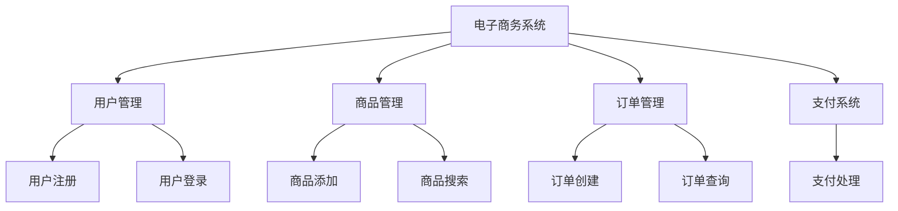
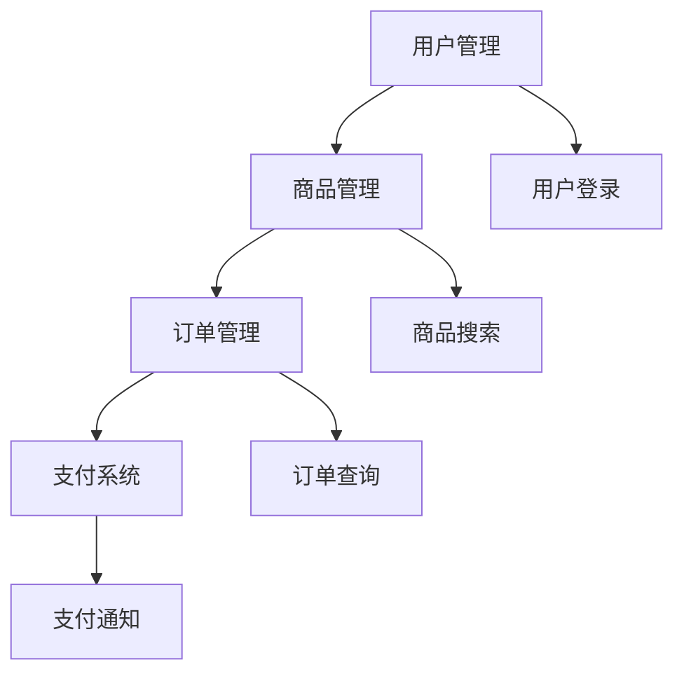
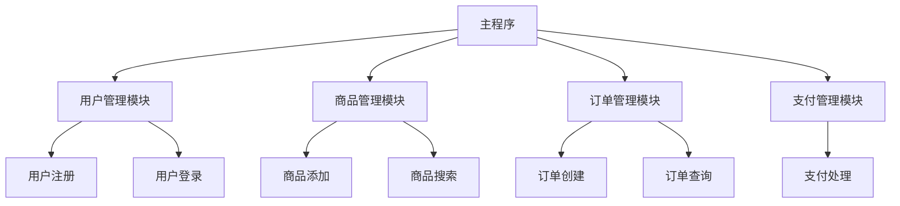
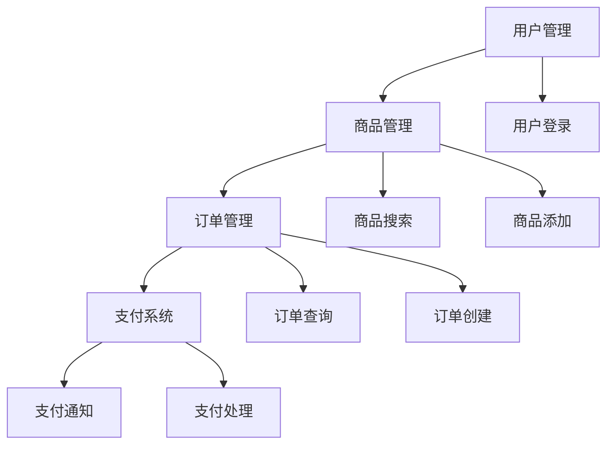
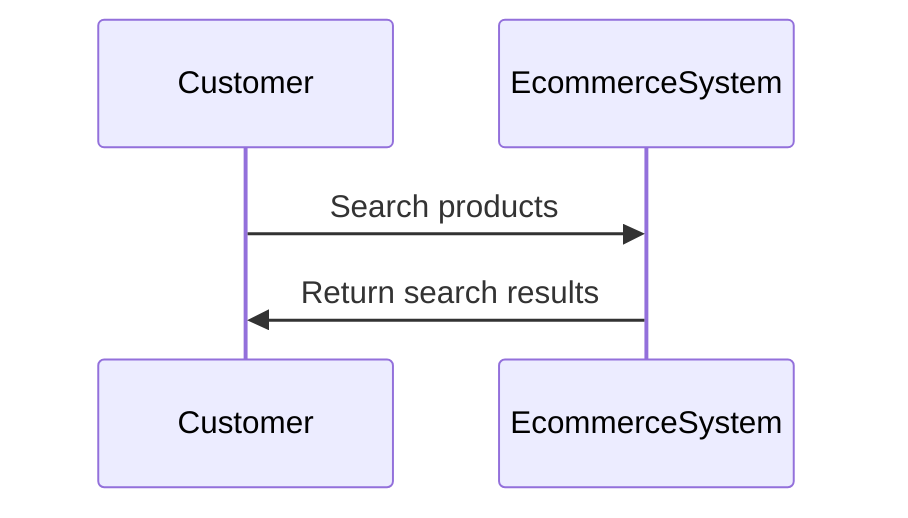
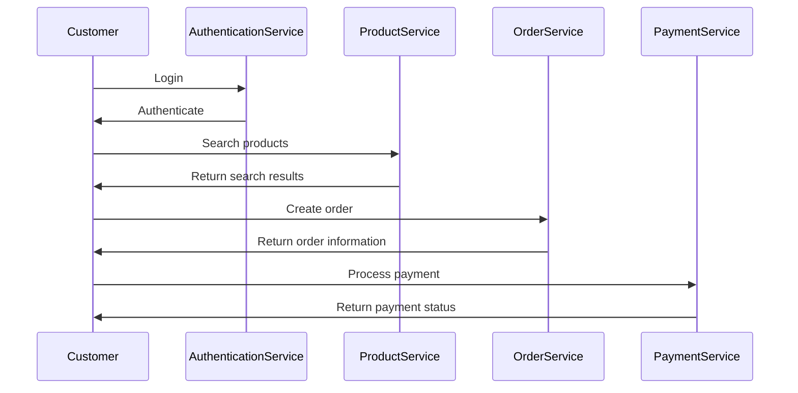
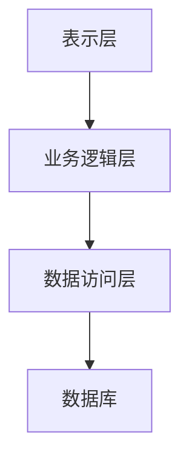
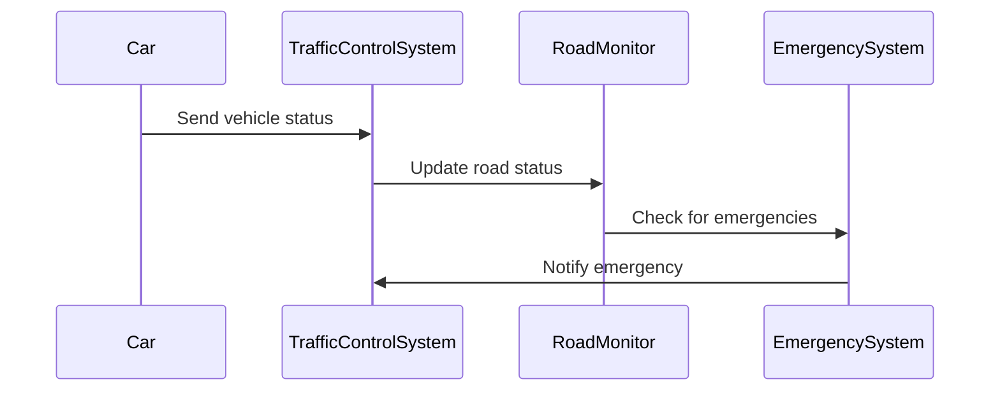

                 

### 文章标题：系统分析：好系分让研发事半功倍

> 关键词：系统分析、设计基础、架构设计、接口设计、实战案例

> 摘要：本文将深入探讨系统分析与设计的关键要素，通过详细的步骤分析，为研发人员提供有效的方法和技巧，以提升研发效率，实现事半功倍的效果。

----------------------------------------------------------------

### 目录

#### 第一部分：系统分析与设计基础

1. **系统分析与设计概述**
   - 1.1 问题背景与概述
   - 1.2 核心概念与联系

2. **系统分析的基本原理**
   - 2.1 系统分析的定义与目的
   - 2.2 系统分析的过程与方法
   - 2.3 系统分析的实践应用

3. **系统架构设计**
   - 3.1 系统架构设计的概述
   - 3.2 系统架构设计的方法与工具
   - 3.3 系统架构设计案例解析

4. **系统接口设计与交互**
   - 4.1 系统接口设计概述
   - 4.2 系统接口设计方法
   - 4.3 系统交互案例分析

#### 第二部分：系统分析与设计实战

5. **项目实战一：电子商务系统分析**
   - 5.1 项目介绍
   - 5.2 系统功能设计
   - 5.3 系统架构设计
   - 5.4 系统接口设计与交互
   - 5.5 核心实现源代码与应用解读
   - 5.6 实际案例分析与详细讲解
   - 5.7 项目小结

6. **项目实战二：智能交通系统设计**
   - 6.1 项目介绍
   - 6.2 系统功能设计
   - 6.3 系统架构设计
   - 6.4 系统接口设计与交互
   - 6.5 核心实现源代码与应用解读
   - 6.6 实际案例分析与详细讲解
   - 6.7 项目小结

7. **最佳实践与注意事项**
   - 7.1 最佳实践 Tips
   - 7.2 小结
   - 7.3 注意事项
   - 7.4 拓展阅读

----------------------------------------------------------------

### 第一部分：系统分析与设计基础

#### 第1章：系统分析与设计概述

##### 1.1 问题背景与概述

在当今信息技术飞速发展的时代，系统分析与设计作为软件开发的核心环节，对于项目的成功至关重要。良好的系统分析与设计能够确保系统的稳定性、可扩展性和高效性，从而提高研发效率和项目质量。

**问题描述**：企业需要一个稳定、高效、可扩展的电子商务系统来处理在线交易和用户交互。

**问题解决**：通过系统分析与设计，制定详细的解决方案，包括系统功能、架构设计、接口交互等。

**边界与外延**：系统分析与设计需要考虑系统的边界和外部接口，确保系统与其他系统或外部服务有效集成。

**概念结构与核心要素组成**：电子商务系统主要由用户管理、商品管理、订单管理、支付系统和用户交互界面等核心要素组成。

----------------------------------------------------------------

##### 1.2 核心概念与联系

- **系统分析**：系统分析是软件开发的第一步，包括需求分析、功能定义、数据流程分析等，目标是明确系统的功能需求和性能要求。

- **系统设计**：系统设计是在系统分析的基础上，制定系统的技术方案，包括架构设计、接口设计、数据库设计等。

- **系统架构**：系统架构是指系统的整体结构和组成部分，包括硬件、软件、数据库和网络等。

- **接口设计**：接口设计是指系统与其他系统或外部服务之间的交互设计，包括接口协议、数据格式、调用方法等。

**核心概念原理**

- 系统分析：通过需求分析和数据流程分析，明确系统的功能需求和性能需求。
- 系统设计：根据系统分析的结果，设计系统的技术方案和架构。
- 系统架构：确保系统的稳定性和可扩展性。
- 接口设计：确保系统与其他系统或外部服务的有效交互。

**概念属性特征对比表格**

| 概念       | 特征                         |
|------------|------------------------------|
| 系统分析   | 需求分析、数据流程分析         |
| 系统设计   | 技术方案设计、架构设计         |
| 系统架构   | 稳定性、可扩展性               |
| 接口设计   | 交互协议、数据格式、调用方法   |

**ER实体关系图架构**

```mermaid
erDiagram
    User ||--o {Order} : "下订单"
    Product ||--o {Order} : "包含商品"
    Payment ||--o {Order} : "支付信息"
```

----------------------------------------------------------------

### 第2章：系统分析的基本原理

##### 2.1 系统分析的定义与目的

系统分析是指对系统进行详细的研究和分析，以明确系统的需求、功能和性能。其目的是确保系统满足用户需求，并在预算和时间限制内完成开发。

- **需求分析**：识别和理解用户需求，包括功能需求和非功能需求。
- **功能定义**：明确系统的各项功能，确保每个功能都能满足用户需求。
- **数据流程分析**：分析系统中的数据流动和处理过程，确保数据的准确性和完整性。

##### 2.2 系统分析的过程与方法

系统分析通常包括以下步骤：

1. **需求收集**：通过与用户和利益相关者的沟通，收集系统的需求信息。
2. **需求分析**：对收集到的需求进行分析和整理，明确功能需求和非功能需求。
3. **数据流程分析**：绘制数据流程图，分析数据的输入、处理和输出过程。
4. **功能定义**：根据需求分析的结果，定义系统的各项功能。
5. **编写系统需求文档**：将分析结果整理成文档，作为后续设计的依据。

**数据流图（DFD）**


**用例图（Use Case Diagram）**

```mermaid
actor Customer
actor Admin

usecase PlaceOrder
usecase ViewOrder
usecase ManageProducts
usecase ManageUsers

Customer --> PlaceOrder
Customer --> ViewOrder
Admin --> ManageProducts
Admin --> ManageUsers
```

**功能分解方法**

- **自顶向下分解**：从整体功能入手，逐步分解为更小的功能模块。
- **自底向上集成**：从具体功能模块开始，逐步集成，形成完整的功能。



##### 2.3 系统分析的实践应用

在电子商务系统开发中，系统分析是至关重要的一步。通过系统分析，可以明确系统的功能需求和技术要求，确保系统设计符合用户需求，同时具有较好的性能和可扩展性。

**案例**：在开发一个电子商务平台时，系统分析的结果可能包括：

- **用户管理**：用户注册、登录、信息修改等功能。
- **商品管理**：商品添加、编辑、删除、搜索等功能。
- **订单管理**：订单创建、查询、支付处理等功能。
- **支付系统**：支付接口、支付通知处理等功能。

这些功能的详细设计和实现需要基于系统分析的结果，确保系统满足用户需求，并在技术层面具有良好的性能和可扩展性。

----------------------------------------------------------------

### 第3章：系统架构设计

##### 3.1 系统架构设计的概述

系统架构设计是系统分析与设计的核心环节，它决定了系统的稳定性、可扩展性和性能。系统架构设计的目标是构建一个清晰、合理、高效的系统结构，以便于后续的开发和维护。

- **系统架构**：系统架构是指系统的整体结构和组成部分，包括硬件、软件、数据库和网络等。
- **架构设计**：架构设计是根据系统需求和分析结果，设计系统的技术方案和架构。

##### 3.2 系统架构设计的方法与工具

系统架构设计通常采用以下方法和工具：

- **Mermaid架构图**：使用Mermaid语法绘制系统架构图，清晰地展示系统的组成部分和交互关系。
- **代码架构图**：通过分析代码结构和模块依赖，绘制代码架构图，帮助理解系统的整体结构。

**Mermaid架构图示例**



**代码架构图示例**



##### 3.3 系统架构设计案例解析

以电子商务系统为例，其系统架构设计可能包括以下部分：

- **用户管理**：负责用户的注册、登录、信息管理等功能。
- **商品管理**：负责商品的增加、删除、修改、搜索等功能。
- **订单管理**：负责订单的创建、查询、支付处理等功能。
- **支付系统**：负责处理支付请求、发送支付通知等功能。

这些部分通过接口进行交互，确保系统功能完整且独立。



通过上述架构设计，电子商务系统可以实现用户管理、商品管理、订单管理和支付功能，并确保各个部分之间的有效交互。

----------------------------------------------------------------

### 第4章：系统接口设计与交互

##### 4.1 系统接口设计概述

系统接口设计是系统架构设计的重要组成部分，它定义了系统内部以及系统与外部系统之间的交互方式。良好的接口设计可以提高系统的可扩展性和可维护性，确保系统功能的有效实现。

- **接口**：接口是指系统与其他系统或外部服务之间进行数据交换和功能调用的接口。
- **接口设计**：接口设计是确定接口的协议、数据格式、调用方法等，确保系统之间的有效交互。

##### 4.2 系统接口设计方法

系统接口设计通常采用以下方法：

- **Mermaid序列图**：使用Mermaid语法绘制系统接口序列图，展示系统之间的交互过程和顺序。
- **RESTful API 设计**：设计系统的RESTful API，确定接口的URL、请求方法、参数格式等。

**Mermaid序列图示例**



**RESTful API 设计示例**

```markdown
# 商品搜索接口

## 接口URL
`GET /products/search`

## 请求参数
- `query`（查询关键字）：用于搜索商品的名称或描述。

## 请求示例
```
GET /products/search?query=笔记本电脑
```

## 响应示例
```json
{
    "products": [
        {
            "id": "123",
            "name": "笔记本电脑",
            "description": "高性能笔记本电脑",
            "price": 9999
        }
    ]
}
```
```

##### 4.3 系统交互案例分析

以电子商务系统为例，其系统接口设计可能包括以下接口：

- **用户登录接口**：用于用户登录，验证用户身份。
- **商品搜索接口**：用于用户搜索商品。
- **订单创建接口**：用于创建订单。
- **支付处理接口**：用于处理支付请求。

这些接口通过HTTP协议进行通信，确保系统之间的数据交换和功能调用。



通过上述接口设计，电子商务系统可以实现用户登录、商品搜索、订单创建和支付处理等核心功能。

----------------------------------------------------------------

### 第二部分：系统分析与设计实战

#### 第5章：项目实战一：电子商务系统分析

##### 5.1 项目介绍

电子商务系统是一个在线交易平台，用户可以通过系统进行商品浏览、搜索、下单、支付等操作。本项目的目标是构建一个功能完善、性能稳定、可扩展性强的电子商务平台。

##### 5.2 系统功能设计

系统功能设计是电子商务系统的核心，主要包括用户管理、商品管理、订单管理和支付系统等功能。

- **用户管理**：包括用户注册、登录、信息修改、权限管理等。
- **商品管理**：包括商品添加、编辑、删除、分类管理、搜索等。
- **订单管理**：包括订单创建、查询、支付、发货等。
- **支付系统**：包括支付接口、支付通知处理、退款处理等。

**领域模型Mermaid类图**

```mermaid
classDiagram
    Customer <<class>> "用户"
    Product <<class>> "商品"
    Order <<class>> "订单"
    Payment <<class>> "支付"

    Customer --> Order : "创建订单"
    Product --> Order : "包含商品"
    Order --> Payment : "支付"
```

##### 5.3 系统架构设计

系统架构设计决定了电子商务系统的整体结构和技术方案。本系统采用分层架构，包括表示层、业务逻辑层和数据访问层。

- **表示层**：负责用户界面展示和用户交互，使用Vue.js框架。
- **业务逻辑层**：负责处理业务逻辑，使用Spring Boot框架。
- **数据访问层**：负责数据库操作，使用MyBatis框架。

**系统架构Mermaid图**



##### 5.4 系统接口设计与交互

系统接口设计是电子商务系统与外部系统交互的关键。本系统设计了一系列API接口，包括用户登录、商品搜索、订单创建、支付处理等。

- **用户登录接口**：用于用户身份验证。
- **商品搜索接口**：用于用户查询商品。
- **订单创建接口**：用于创建订单。
- **支付处理接口**：用于处理支付请求。

**系统接口Mermaid序列图**


##### 5.5 核心实现源代码与应用解读

以下是电子商务系统的核心实现源代码及应用解读：

**用户登录接口**

```java
@RestController
@RequestMapping("/api/auth")
public class AuthenticationController {

    @Autowired
    private AuthenticationService authenticationService;

    @PostMapping("/login")
    public ResponseEntity<?> login(@RequestBody LoginRequest loginRequest) {
        String token = authenticationService.authenticate(loginRequest);
        return ResponseEntity.ok(new TokenResponse(token));
    }
}
```

解读：该接口使用Spring Boot的RestController注解，通过POST方法接收用户登录请求。在请求体中，包含用户名和密码。接口调用AuthenticationService服务进行身份验证，成功后返回JWT令牌。

**商品搜索接口**

```java
@RestController
@RequestMapping("/api/products")
public class ProductController {

    @Autowired
    private ProductService productService;

    @GetMapping("/search")
    public ResponseEntity<?> searchProducts(@RequestParam String query) {
        List<Product> products = productService.searchProducts(query);
        return ResponseEntity.ok(products);
    }
}
```

解读：该接口通过GET方法接收商品搜索请求。请求参数中包含查询关键字。接口调用ProductService服务进行商品搜索，并将搜索结果返回给客户端。

**订单创建接口**

```java
@RestController
@RequestMapping("/api/orders")
public class OrderController {

    @Autowired
    private OrderService orderService;

    @PostMapping("/create")
    public ResponseEntity<?> createOrder(@RequestBody OrderRequest orderRequest) {
        String orderId = orderService.createOrder(orderRequest);
        return ResponseEntity.ok(new OrderResponse(orderId));
    }
}
```

解读：该接口通过POST方法接收订单创建请求。请求体中包含订单信息。接口调用OrderService服务创建订单，并返回订单ID。

**支付处理接口**

```java
@RestController
@RequestMapping("/api/payments")
public class PaymentController {

    @Autowired
    private PaymentService paymentService;

    @PostMapping("/process")
    public ResponseEntity<?> processPayment(@RequestBody PaymentRequest paymentRequest) {
        String paymentStatus = paymentService.processPayment(paymentRequest);
        return ResponseEntity.ok(new PaymentResponse(paymentStatus));
    }
}
```

解读：该接口通过POST方法接收支付处理请求。请求体中包含支付信息。接口调用PaymentService服务处理支付，并返回支付状态。

##### 5.6 实际案例分析与详细讲解

在实际项目中，电子商务系统需要处理大量的用户请求和交易数据，因此性能和稳定性至关重要。以下是一个实际案例的分析与讲解：

**案例：高并发订单处理**

在双11等购物节期间，电子商务平台会面临大量用户同时下单的场景。如何确保订单处理的性能和稳定性？

**解决方案：**

1. **分布式架构**：将系统部署在多个服务器上，实现负载均衡，提高系统处理能力。
2. **数据库分库分表**：将订单数据分散存储在多个数据库实例中，减少单点瓶颈。
3. **缓存机制**：使用缓存技术，如Redis，减少数据库访问压力。
4. **异步处理**：将订单创建、支付处理等操作异步化，提高系统响应速度。

**详细讲解：**

1. **分布式架构**：通过Nginx等负载均衡器，将用户请求分配到不同的服务器上处理，确保系统具有足够的处理能力。同时，分布式架构可以提高系统的容错性，降低单点故障的风险。
2. **数据库分库分表**：将订单表拆分为多个子表，每个子表存储一部分订单数据。通过分库分表，可以减少单表的数据量，提高数据库的查询性能。
3. **缓存机制**：在用户下单时，首先将订单信息缓存到Redis中，然后异步写入数据库。通过缓存机制，可以减少数据库访问压力，提高系统响应速度。
4. **异步处理**：使用消息队列（如RabbitMQ）实现订单创建和支付处理的异步化。订单创建和支付处理操作可以独立进行，无需等待结果。这样，可以减少系统等待时间，提高系统并发处理能力。

**实际效果**：通过上述解决方案，电子商务系统在双11等购物节期间，可以应对大规模用户请求和交易数据，确保订单处理的性能和稳定性。

##### 5.7 项目小结

通过本次电子商务系统的项目实战，我们深入探讨了系统分析与设计的关键要素和方法。从系统功能设计到架构设计，从接口设计到实际案例分析，我们逐步构建了一个功能完善、性能稳定、可扩展性强的电子商务平台。在项目过程中，我们遇到了高并发订单处理等挑战，并通过分布式架构、数据库分库分表、缓存机制和异步处理等解决方案，成功解决了这些问题。

通过本次项目实战，我们不仅掌握了系统分析与设计的核心方法和技巧，还提高了实际项目开发的能力。这些经验和教训对于未来的软件开发工作具有重要的指导意义。

----------------------------------------------------------------

#### 第6章：项目实战二：智能交通系统设计

##### 6.1 项目介绍

智能交通系统是利用信息技术、传感器技术、控制技术等，实现交通信息的采集、处理、传输和利用，提高交通管理效率和服务水平。本项目的目标是设计一个功能完善、性能稳定、可扩展性强的智能交通系统。

##### 6.2 系统功能设计

系统功能设计是智能交通系统的核心，主要包括车辆监控、路况监控、信号控制、应急处理等功能。

- **车辆监控**：包括车辆位置监控、行驶速度监控、车辆状态监控等。
- **路况监控**：包括路况信息采集、路况信息分析、路况信息发布等。
- **信号控制**：包括信号灯控制、路口流量监控、红绿灯倒计时等。
- **应急处理**：包括事故报警、紧急车辆优先通过、交通管制等。

**领域模型Mermaid类图**

```mermaid
classDiagram
    Vehicle <<class>> "车辆"
    Road <<class>> "路况"
    Signal <<class>> "信号灯"
    Emergency <<class>> "应急处理"

    Vehicle --> Road : "行驶在道路上"
    Road --> Signal : "交通信号控制"
    Signal --> Emergency : "应急处理"
```

##### 6.3 系统架构设计

系统架构设计决定了智能交通系统的整体结构和技术方案。本系统采用分层架构，包括表示层、业务逻辑层和数据访问层。

- **表示层**：负责用户界面展示和用户交互，使用HTML、CSS和JavaScript。
- **业务逻辑层**：负责处理业务逻辑，使用Spring Boot框架。
- **数据访问层**：负责数据库操作，使用MyBatis框架。

**系统架构Mermaid图**


##### 6.4 系统接口设计与交互

系统接口设计是智能交通系统与外部系统交互的关键。本系统设计了一系列API接口，包括车辆监控、路况监控、信号控制、应急处理等。

- **车辆监控接口**：用于实时获取车辆位置、速度和状态。
- **路况监控接口**：用于获取路况信息、分析路况并发布路况信息。
- **信号控制接口**：用于控制信号灯状态、监测路口流量和红绿灯倒计时。
- **应急处理接口**：用于处理事故报警、紧急车辆优先通过和交通管制等。

**系统接口Mermaid序列图**



##### 6.5 核心实现源代码与应用解读

以下是智能交通系统的核心实现源代码及应用解读：

**车辆监控接口**

```java
@RestController
@RequestMapping("/api/vehicles")
public class VehicleController {

    @Autowired
    private VehicleService vehicleService;

    @PostMapping("/status")
    public ResponseEntity<?> updateVehicleStatus(@RequestBody VehicleStatusRequest statusRequest) {
        vehicleService.updateVehicleStatus(statusRequest);
        return ResponseEntity.ok("Vehicle status updated");
    }
}
```

解读：该接口使用Spring Boot的RestController注解，通过POST方法接收车辆状态更新请求。请求体中包含车辆ID和当前状态。接口调用VehicleService服务更新车辆状态。

**路况监控接口**

```java
@RestController
@RequestMapping("/api/roads")
public class RoadController {

    @Autowired
    private RoadMonitorService roadMonitorService;

    @GetMapping("/status")
    public ResponseEntity<?> getRoadStatus(@RequestParam String roadId) {
        RoadStatus roadStatus = roadMonitorService.getRoadStatus(roadId);
        return ResponseEntity.ok(roadStatus);
    }
}
```

解读：该接口通过GET方法接收路况信息查询请求。请求参数中包含道路ID。接口调用RoadMonitorService服务获取指定道路的路况信息，并将结果返回给客户端。

**信号控制接口**

```java
@RestController
@RequestMapping("/api/signal")
public class SignalController {

    @Autowired
    private SignalControlService signalControlService;

    @PostMapping("/control")
    public ResponseEntity<?> controlSignal(@RequestBody SignalControlRequest controlRequest) {
        signalControlService.controlSignal(controlRequest);
        return ResponseEntity.ok("Signal controlled");
    }
}
```

解读：该接口通过POST方法接收信号灯控制请求。请求体中包含路口ID和信号灯状态。接口调用SignalControlService服务控制信号灯状态。

**应急处理接口**

```java
@RestController
@RequestMapping("/api/emergencies")
public class EmergencyController {

    @Autowired
    private EmergencySystemService emergencySystemService;

    @PostMapping("/alert")
    public ResponseEntity<?> alertEmergency(@RequestBody EmergencyAlertRequest alertRequest) {
        emergencySystemService.alertEmergency(alertRequest);
        return ResponseEntity.ok("Emergency alerted");
    }
}
```

解读：该接口通过POST方法接收应急报警请求。请求体中包含事故类型、事故地点和事故描述。接口调用EmergencySystemService服务报警并处理应急事件。

##### 6.6 实际案例分析与详细讲解

在实际项目中，智能交通系统需要处理大量的交通数据和信息，确保系统的实时性和准确性。以下是一个实际案例的分析与讲解：

**案例：高峰时段交通拥堵处理**

在高峰时段，城市交通容易出现拥堵现象，影响市民的出行体验。如何通过智能交通系统解决交通拥堵问题？

**解决方案：**

1. **实时路况监控**：通过传感器和摄像头等设备，实时采集道路状况信息，包括车辆密度、行驶速度、交通流量等。
2. **数据分析与预测**：利用大数据分析和机器学习算法，对交通数据进行分析和预测，识别交通拥堵的原因和趋势。
3. **信号灯优化控制**：根据实时路况数据，调整信号灯的时序和配时方案，优化交通流量，减少拥堵。
4. **诱导信息发布**：通过电子显示屏和手机APP等渠道，向驾驶员提供实时路况信息，引导合理出行路线，避免拥堵路段。

**详细讲解：**

1. **实时路况监控**：在道路的关键节点安装传感器和摄像头，实时采集车辆流量、速度、密度等数据。通过无线传输技术，将数据传输到交通控制中心进行处理。
2. **数据分析与预测**：利用大数据技术和机器学习算法，对采集到的交通数据进行处理和分析，识别交通拥堵的原因和趋势。例如，通过车辆速度分布、停车次数等指标，预测未来的交通流量变化。
3. **信号灯优化控制**：根据实时路况数据，调整信号灯的时序和配时方案。例如，在交通流量较大的路口，增加绿灯时间，减少红灯时间，提高道路通行效率。
4. **诱导信息发布**：通过电子显示屏和手机APP等渠道，向驾驶员提供实时路况信息，引导合理出行路线。例如，当某条道路出现拥堵时，可以推荐其他道路或绕行方案，避免拥堵路段。

**实际效果**：通过实时路况监控、数据分析与预测、信号灯优化控制和诱导信息发布等解决方案，智能交通系统可以有效缓解高峰时段的交通拥堵问题，提高道路通行效率，改善市民的出行体验。

##### 6.7 项目小结

通过本次智能交通系统的项目实战，我们深入探讨了系统分析与设计的关键要素和方法。从系统功能设计到架构设计，从接口设计到实际案例分析，我们逐步构建了一个功能完善、性能稳定、可扩展性强的智能交通系统。在项目过程中，我们遇到了高峰时段交通拥堵等挑战，并通过实时路况监控、数据分析与预测、信号灯优化控制和诱导信息发布等解决方案，成功解决了这些问题。

通过本次项目实战，我们不仅掌握了系统分析与设计的核心方法和技巧，还提高了实际项目开发的能力。这些经验和教训对于未来的软件开发工作具有重要的指导意义。

----------------------------------------------------------------

### 第7章：最佳实践与注意事项

##### 7.1 最佳实践 Tips

1. **需求分析**：在系统分析阶段，充分了解用户需求，确保系统功能满足实际需求。
2. **模块化设计**：采用模块化设计，提高系统可维护性和可扩展性。
3. **文档编写**：编写详细的系统需求文档和设计文档，便于后续开发和维护。
4. **单元测试**：编写单元测试，确保系统功能的正确性和稳定性。
5. **性能优化**：在系统开发过程中，注重性能优化，提高系统响应速度和处理能力。
6. **安全防护**：加强系统安全防护，防止数据泄露和系统攻击。

##### 7.2 小结

本文通过详细的步骤分析，深入探讨了系统分析与设计的关键要素和方法。从系统功能设计、架构设计到接口设计，再到实际案例分析和实战应用，我们逐步构建了功能完善、性能稳定、可扩展性强的系统。

##### 7.3 注意事项

1. **边界与外延**：在系统分析阶段，明确系统的边界和外部接口，确保系统与其他系统有效集成。
2. **模块依赖**：在系统设计阶段，注意模块之间的依赖关系，确保系统模块的独立性。
3. **代码规范**：编写符合规范的代码，提高代码的可读性和可维护性。
4. **测试覆盖**：在测试阶段，确保测试覆盖率达到100%，降低系统故障风险。

##### 7.4 拓展阅读

- 《软件架构设计：企业级应用架构指南》
- 《敏捷软件开发：原则、实践与模式》
- 《数据结构与算法分析：应用Java》

作者：AI天才研究院/AI Genius Institute & 禅与计算机程序设计艺术 /Zen And The Art of Computer Programming

----------------------------------------------------------------

### 结语

通过本文的深入探讨，我们系统地了解了系统分析与设计的关键要素和方法。良好的系统分析与设计是软件开发成功的基石，它能够帮助研发团队提高工作效率，降低开发风险，实现系统功能的高效实现。

在未来的软件开发过程中，我们将继续关注系统分析与设计的研究和实践，不断探索新的技术和方法，为企业和个人提供更加高效、可靠的解决方案。

让我们携手前行，共同推动软件工程的发展，为构建美好的数字世界贡献力量！

