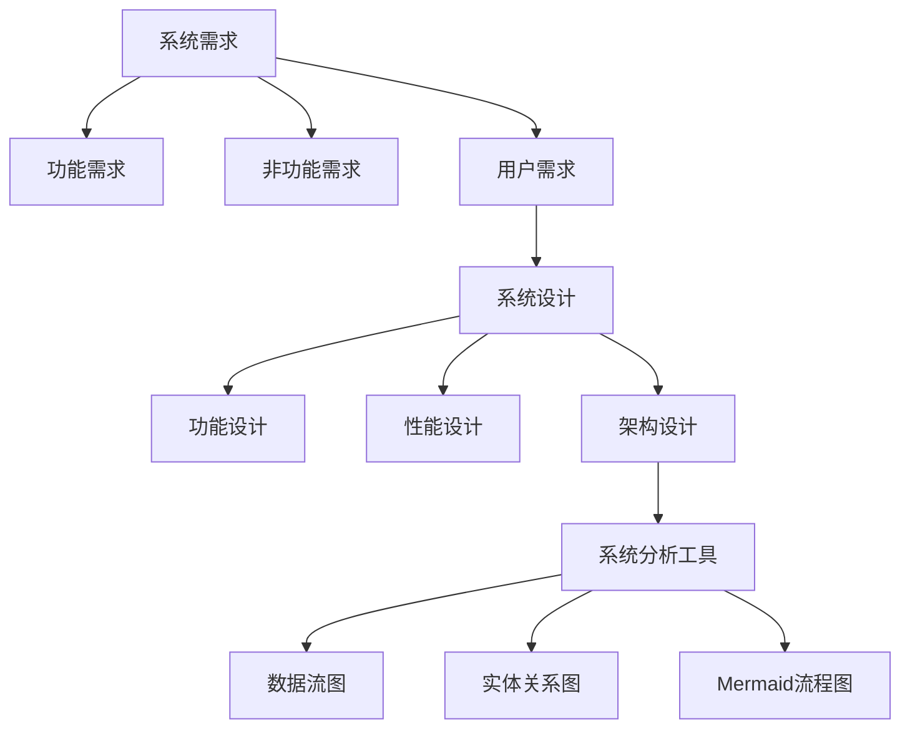

                 

### 第1章：系统分析引论

#### 1.1 系统分析的概念与重要性

系统分析是现代信息技术领域中的一个核心环节，它涉及对系统进行详细研究、理解和定义，以实现特定目标。系统分析不仅仅是一个技术过程，它还包括了业务、管理、用户需求等多个方面的综合考量。从狭义上讲，系统分析通常指的是通过使用各种方法和工具，对现有或规划中的系统进行深入研究，以识别其功能、性能、效率和潜在问题。

系统分析的重要性在于，它是确保项目成功的关键步骤。通过系统分析，我们可以：

1. **明确需求和目标**：系统分析帮助我们了解用户的需求和期望，从而确保系统设计能够满足这些需求，达到预期的业务目标。
2. **减少风险**：通过提前识别潜在的问题和风险，系统分析可以在项目早期阶段采取措施，避免后期出现重大的设计和功能问题。
3. **优化资源分配**：系统分析可以帮助我们更好地理解系统的各个组成部分及其相互作用，从而优化资源分配，提高系统效率。
4. **提升用户体验**：深入了解用户需求和使用习惯，有助于设计出更加用户友好的系统界面和功能。

在系统开发过程中，系统分析通常分为以下几个阶段：

1. **需求分析**：这一阶段的目标是明确系统的功能需求和非功能需求。需求分析的方法包括用户访谈、问卷调查、文档审查等。
2. **功能设计**：在明确需求后，系统分析人员需要将需求转化为具体的功能设计。这一阶段包括系统架构设计、模块划分等。
3. **性能分析**：在功能设计完成后，系统分析还需要评估系统的性能，如响应时间、吞吐量、并发处理能力等。
4. **风险评估**：系统分析人员需要识别项目潜在的风险，并制定相应的风险管理策略。

总的来说，系统分析是一个复杂而多维的过程，它涉及到多个学科和领域的知识。通过系统分析，我们可以确保系统开发更加科学、高效，从而更好地满足用户和业务的需求。

#### 1.2 系统分析的过程与方法

系统分析的过程可以概括为以下几个步骤：

1. **问题识别**：这是系统分析的第一步，主要任务是明确系统需要解决的问题和改进点。问题识别可以通过用户访谈、市场调研、系统故障分析等方法进行。

2. **需求收集**：在明确问题后，系统分析人员需要收集与系统相关的需求。这些需求可以是功能性的，也可以是非功能性的，如性能、安全性、可用性等。需求收集的方法包括用户访谈、问卷调查、文档审查等。

3. **需求分析**：收集到的需求需要进行分析和整理，以便明确系统的功能和非功能需求。需求分析的方法包括需求建模、需求验证等。

4. **系统设计**：在需求分析完成后，系统分析人员需要将需求转化为具体的系统设计。系统设计包括功能设计、性能设计、架构设计等。

5. **实现与验证**：系统设计完成后，开发团队开始进行系统的实际开发。在开发过程中，系统分析人员需要持续验证系统是否符合需求，并进行必要的调整。

6. **部署与维护**：系统开发完成后，需要将其部署到生产环境中，并进行长期的维护和优化。

系统分析的方法多种多样，以下是几种常用的方法：

1. **结构化分析方法**：结构化分析方法是一种传统的系统分析方法，它通过自顶向下或自底向上的方式，对系统进行层次化的分析。该方法包括数据流图、实体关系图等工具。

2. **面向对象分析方法**：面向对象分析方法是一种基于面向对象编程的方法，它通过对象、类、继承等概念来描述系统。该方法包括类图、序列图等工具。

3. **形式化分析方法**：形式化分析方法是一种基于数学和逻辑的方法，它通过严格的数学模型来描述系统。该方法包括状态机、时序图等工具。

4. **原型化方法**：原型化方法是一种通过快速构建系统原型来验证需求的方法。这种方法适用于需求不确定或需求变化频繁的情况。

5. **敏捷分析方法**：敏捷分析方法是一种基于敏捷开发的方法，它强调灵活性和适应性。该方法通过迭代和增量的方式，持续优化系统。

总的来说，系统分析的方法和过程是灵活多样的，不同的方法适用于不同的场景。选择合适的方法，可以有效地提高系统分析的效果和效率。

#### 1.3 系统分析中的核心概念

在系统分析的过程中，理解一些核心概念是非常重要的。以下是一些关键概念及其属性特征对比表格和ER实体关系图架构的Mermaid流程图。

##### 1.3.1 系统需求

| 概念 | 属性特征 |  
| ---- | ---- |  
| 功能需求 | 涉及系统需要实现的具体功能 |  
| 非功能需求 | 涉及系统的性能、安全性、可用性等方面 |  
| 用户需求 | 涉及用户期望和使用习惯 |

##### 1.3.2 系统设计

| 概念 | 属性特征 |  
| ---- | ---- |  
| 功能设计 | 描述系统需要实现的功能模块 |  
| 性能设计 | 描述系统在性能方面的要求和优化策略 |  
| 架构设计 | 描述系统的整体结构和各个模块之间的关系 |

##### 1.3.3 系统分析工具

| 概念 | 属性特征 |  
| ---- | ---- |  
| 数据流图 | 描述系统中的数据流动 |  
| 实体关系图 | 描述系统中的实体及其关系 |  
| Mermaid流程图 | 描述系统的流程和逻辑 |

以下是一个Mermaid流程图示例，用于描述系统分析的核心概念及其关系：

通过这些核心概念和工具，我们可以更加深入地理解和分析系统，确保系统设计满足需求并具有良好的性能和可靠性。

#### 1.4 系统分析的步骤与工具

系统分析是一个复杂的过程，涉及到多个步骤和工具的使用。以下是系统分析的典型步骤及所使用的工具：

##### 1.4.1 问题识别

**步骤**：通过用户访谈、问卷调查、市场调研等方式，识别系统需要解决的问题和改进点。

**工具**：访谈记录、问卷调查表、市场研究报告。

##### 1.4.2 需求收集

**步骤**：收集与系统相关的功能需求和非功能需求，如性能、安全性、可用性等。

**工具**：需求调查问卷、用户访谈记录、系统文档。

##### 1.4.3 需求分析

**步骤**：对收集到的需求进行分析和整理，形成系统需求文档。

**工具**：需求分析工具（如Excel、MindMap）、实体关系图（ER图）。

##### 1.4.4 系统设计

**步骤**：将需求转化为具体的系统设计，包括功能设计、性能设计、架构设计等。

**工具**：数据流图（DFD）、UML类图、UML序列图。

##### 1.4.5 实现与验证

**步骤**：根据系统设计进行系统实现，并持续验证系统是否符合需求。

**工具**：源代码管理工具（如Git）、自动化测试工具（如Selenium）。

##### 1.4.6 部署与维护

**步骤**：将系统部署到生产环境中，并进行长期的维护和优化。

**工具**：部署脚本、运维管理工具（如Ansible、Puppet）。

通过这些步骤和工具，系统分析人员可以确保系统开发过程中的每个环节都能够顺利进行，从而最终实现一个高效、可靠、满足用户需求的系统。

#### 1.5 系统分析在现代IT应用中的重要性

系统分析在现代IT应用中扮演着至关重要的角色。首先，随着信息技术的迅猛发展，企业面临的数据量、处理需求和业务复杂性都在不断增加。系统分析可以帮助企业理解和分析这些需求，从而设计出更加高效和可靠的系统。具体来说，系统分析的重要性体现在以下几个方面：

1. **需求驱动的系统开发**：通过系统分析，企业能够深入了解用户需求和市场变化，从而设计出更加贴合实际需求的系统。这种需求驱动的开发模式能够有效避免开发过程中出现的功能偏差和资源浪费。

2. **提高系统性能和可靠性**：系统分析包括对系统性能的评估和优化。通过深入分析系统的性能瓶颈，开发团队能够采取相应的措施进行优化，从而提高系统的响应速度和处理能力，同时保障系统的可靠性。

3. **降低项目风险**：系统分析可以帮助识别项目潜在的各类风险，包括技术风险、市场风险、人力资源风险等。通过提前识别和制定应对策略，可以有效降低项目失败的可能性。

4. **优化资源分配**：系统分析能够帮助企业更好地理解系统的各个组成部分及其相互关系，从而合理分配资源，提高资源利用效率，降低开发成本。

5. **提升用户体验**：通过系统分析，企业可以深入了解用户的使用习惯和需求，设计出更加人性化和友好的用户界面，从而提升用户体验和满意度。

6. **支持持续改进**：系统分析不仅仅是一次性的工作，它还支持系统的持续改进。通过定期对系统进行回顾和分析，企业可以发现新的优化机会和改进方向，持续提升系统的质量和性能。

总的来说，系统分析在现代IT应用中不仅是一个技术过程，更是业务成功的关键环节。通过系统分析，企业可以确保其系统开发过程更加科学、高效，从而更好地满足用户和市场的需求。

---

### 第2章：系统开发流程

#### 2.1 系统需求分析

系统需求分析是系统开发流程中的关键步骤，其目标是明确系统需要实现的功能和非功能需求。需求分析不仅涉及技术层面，还包括业务、用户等多方面的因素。以下将详细探讨系统需求分析的过程和方法。

##### 2.1.1 需求收集

需求收集是系统需求分析的第一步，主要任务是从用户、市场、业务等多个角度获取系统的需求信息。以下是几种常用的需求收集方法：

1. **用户访谈**：通过与用户的面对面交流，了解他们的实际需求、使用习惯和痛点。用户访谈可以是结构化的，也可以是非结构化的，以获取更详细的信息。

2. **问卷调查**：通过设计问卷，广泛收集用户的需求和意见。问卷调查可以采用在线或纸质形式，适用于大范围的用户群体。

3. **文档审查**：审查现有系统文档、业务流程文档、用户手册等，以获取系统的背景信息和现有问题的描述。

4. **市场调研**：通过市场调研，了解竞争对手的产品特点、市场需求和行业趋势，为系统需求提供参考。

##### 2.1.2 需求分析

在需求收集完成后，系统分析人员需要对收集到的需求进行整理和分析，以确保需求的明确性和可行性。以下是几个关键步骤：

1. **需求分类**：将需求分为功能需求和非功能需求。功能需求描述系统需要实现的具体功能，如用户登录、数据查询等。非功能需求则包括性能、安全性、兼容性等要求。

2. **需求建模**：使用实体关系图（ER图）或UML类图等工具，对需求进行建模。这种图形化的表示方式有助于更直观地理解和分析需求。

3. **需求验证**：通过用户评审、专家评审等方法，验证需求的正确性和完整性。需求验证有助于确保系统设计符合实际需求，减少后期修改的成本。

4. **需求文档编写**：将整理和分析后的需求编写成需求文档，详细描述每个需求的内容、目的、实现方式和验收标准。需求文档是后续系统设计和开发的重要参考。

##### 2.1.3 需求分析工具

系统需求分析过程中，可以使用多种工具来帮助收集、整理和分析需求。以下是几种常用的需求分析工具：

1. **需求管理工具**：如JIRA、Confluence等，用于记录、跟踪和管理需求。

2. **建模工具**：如Visio、Lucidchart等，用于绘制实体关系图和UML图。

3. **问卷调查工具**：如SurveyMonkey、Google表单等，用于收集用户意见和反馈。

4. **用户访谈工具**：如Zoom、Skype等，用于远程进行用户访谈。

通过系统需求分析，我们可以确保系统设计满足用户和业务需求，为后续的系统设计和开发奠定坚实的基础。

---

#### 2.2 系统设计与开发

系统设计与开发是系统开发流程中的核心环节，其目标是根据需求分析的结果，设计出具体的系统架构和功能模块，并实现这些设计。以下将详细探讨系统设计与开发的过程和方法。

##### 2.2.1 系统设计

系统设计是将需求转化为具体的技术实现的过程。系统设计通常包括以下几个方面：

1. **功能设计**：根据需求文档，设计系统的功能模块和接口。功能设计需要明确每个模块的功能、输入输出以及与其他模块的交互方式。

2. **性能设计**：分析系统性能需求，设计系统性能优化方案，如缓存策略、负载均衡、数据库优化等。

3. **架构设计**：确定系统的总体架构，包括技术架构、数据架构、应用架构等。架构设计需要考虑系统的可扩展性、可靠性和安全性。

4. **界面设计**：设计用户界面，包括布局、交互流程、视觉元素等，以提供良好的用户体验。

以下是几种常用的系统设计方法：

1. **自顶向下设计**：从系统的高层次结构开始，逐步细化到具体的模块和功能。

2. **自底向上设计**：从具体的模块和功能开始，逐步构建系统的高层次结构。

3. **迭代设计**：通过多次迭代，逐步完善系统设计，每次迭代都可以增加新的功能或优化现有功能。

4. **组件化设计**：将系统功能分解为独立的组件，每个组件负责特定的功能，便于后续的维护和扩展。

##### 2.2.2 开发过程

在系统设计完成后，开发团队开始进行实际的系统开发。以下是系统开发的一般过程：

1. **编码**：根据系统设计，开发团队开始编写代码，实现系统的功能模块。

2. **单元测试**：对编写的代码进行单元测试，确保每个模块的功能正确、性能良好。

3. **集成测试**：将各个模块集成起来，进行集成测试，确保系统的整体功能符合需求。

4. **系统测试**：对整个系统进行测试，包括功能测试、性能测试、安全测试等，确保系统的稳定性和可靠性。

5. **用户验收测试**：与用户合作，进行用户验收测试，确保系统功能满足用户需求，用户体验良好。

##### 2.2.3 设计与开发工具

在系统设计与开发过程中，可以使用多种工具来提高效率和效果。以下是几种常用的工具：

1. **集成开发环境（IDE）**：如Visual Studio、IntelliJ IDEA等，提供代码编写、调试、编译等功能。

2. **版本控制工具**：如Git、SVN等，用于管理和跟踪代码版本，便于多人协作开发。

3. **建模工具**：如UMLet、StarUML等，用于绘制系统设计图和流程图。

4. **测试工具**：如JUnit、Selenium等，用于编写和执行测试用例。

5. **项目管理工具**：如JIRA、Trello等，用于项目管理和任务跟踪。

通过系统设计与开发，我们可以将需求转化为具体的技术实现，确保系统功能的实现和性能的优化，为后续的系统部署和维护奠定基础。

---

#### 2.3 系统测试与维护

系统测试与维护是确保系统稳定性和可靠性的关键环节。在系统开发完成后，通过严格的测试和定期的维护，可以及时发现和修复问题，确保系统长期稳定运行。

##### 2.3.1 系统测试

系统测试是验证系统功能、性能和可靠性的过程。以下是几种常用的系统测试方法：

1. **单元测试**：对系统的最小功能单元进行测试，确保每个模块的功能正确。单元测试通常由开发人员编写，使用自动化测试工具执行。

2. **集成测试**：将各个模块集成起来，进行测试，确保模块之间的接口和交互正常。集成测试通常在单元测试之后进行。

3. **系统测试**：对整个系统进行全面的测试，包括功能测试、性能测试、安全测试等。系统测试通常由独立的测试团队执行。

4. **验收测试**：与用户合作，进行用户验收测试，确保系统功能满足用户需求，用户体验良好。

系统测试过程中，可以使用以下工具：

1. **自动化测试工具**：如JUnit、Selenium等，用于编写和执行测试用例。

2. **性能测试工具**：如LoadRunner、JMeter等，用于模拟高负载环境，测试系统的性能。

3. **安全测试工具**：如Burp Suite、Nessus等，用于发现系统中的安全漏洞。

##### 2.3.2 系统维护

系统维护是确保系统长期稳定运行的重要工作。以下是几种常见的系统维护方法：

1. **故障排除**：及时发现和修复系统故障，确保系统的正常运行。

2. **性能优化**：定期对系统性能进行评估，采取优化措施，提高系统的响应速度和处理能力。

3. **版本更新**：随着技术的进步和业务需求的变化，定期对系统进行版本更新，添加新功能或修复已知问题。

4. **备份与恢复**：定期备份系统数据，以便在系统故障或数据丢失时能够快速恢复。

系统维护过程中，可以使用以下工具：

1. **运维管理工具**：如Ansible、Puppet等，用于自动化管理系统的配置和部署。

2. **监控系统**：如Zabbix、Prometheus等，用于实时监控系统的运行状态，及时发现和处理问题。

3. **数据库管理工具**：如MySQL Workbench、SQL Server Management Studio等，用于管理数据库的备份、恢复和优化。

通过系统测试与维护，我们可以确保系统的稳定性和可靠性，满足用户和业务需求，为企业的持续发展提供有力支持。

---

### 第3章：系统架构设计

系统架构设计是系统开发过程中的核心环节，它决定了系统的性能、可扩展性和可靠性。系统架构设计不仅仅是技术层面的考虑，还包括业务需求、用户需求和系统复杂性等多方面的因素。以下将详细探讨系统架构设计的基本概念、方法和常见模式。

#### 3.1 系统架构概述

系统架构是指系统的整体结构和组成部分，以及这些部分之间的相互关系。一个良好的系统架构应该具备以下特点：

1. **可扩展性**：系统架构应该能够适应未来的需求变化，能够轻松扩展和升级。
2. **可靠性**：系统架构应该具备高可用性和容错能力，能够在出现故障时快速恢复。
3. **灵活性**：系统架构应该能够灵活应对业务需求的变化，支持快速迭代和改进。
4. **高性能**：系统架构应该能够满足性能需求，确保系统的高效运行。
5. **安全性**：系统架构应该具备良好的安全设计，防止外部攻击和内部威胁。

系统架构设计通常包括以下几个层次：

1. **技术架构**：定义系统的技术实现细节，如数据库、服务器、网络等。
2. **数据架构**：定义系统的数据模型和存储方案，确保数据的一致性和完整性。
3. **应用架构**：定义系统的应用逻辑和功能模块，确保功能的完整性和可维护性。
4. **业务架构**：定义系统的业务流程和业务规则，确保业务流程的顺畅和高效。

#### 3.2 系统架构设计方法

系统架构设计的方法多种多样，以下是几种常用的方法：

1. **自顶向下设计**：从系统的高层次结构开始，逐步细化到具体的模块和功能。这种方法有助于确保系统架构的一致性和完整性。

2. **自底向上设计**：从具体的模块和功能开始，逐步构建系统的高层次结构。这种方法适用于需求不明确或需求变化频繁的情况。

3. **迭代设计**：通过多次迭代，逐步完善系统架构。每次迭代都可以增加新的功能或优化现有功能。这种方法适用于需求变化频繁的项目。

4. **组件化设计**：将系统功能分解为独立的组件，每个组件负责特定的功能，便于后续的维护和扩展。这种方法适用于复杂系统的设计。

5. **企业架构方法**：如TOGAF（The Open Group Architecture Framework），提供了一套完整的系统架构设计方法和工具，适用于大型企业的系统架构设计。

#### 3.3 系统架构的常见模式

在实际的系统架构设计中，常常会采用一些常见的架构模式，以解决特定的技术或业务问题。以下是几种常见的系统架构模式：

1. **MVC模式**：Model-View-Controller（模型-视图-控制器）是一种常用的Web应用架构模式，通过分离数据表示、用户界面和业务逻辑，实现系统的模块化和可维护性。

2. **微服务架构**：微服务架构将系统拆分为多个小型、独立的微服务，每个微服务负责特定的功能。这种方法提高了系统的可扩展性和灵活性，但同时也增加了系统的复杂性。

3. **分布式架构**：分布式架构通过将系统部署在多个服务器上，实现高可用性和容错能力。分布式架构需要解决数据一致性和服务协调等问题。

4. **事件驱动架构**：事件驱动架构通过事件触发来执行操作，实现系统的异步通信和事件驱动。这种方法适用于处理高并发场景。

5. **云计算架构**：云计算架构利用云计算平台提供的资源和服务，实现系统的灵活部署和资源优化。这种方法适用于需要大规模扩展和弹性伸缩的应用场景。

通过系统架构设计，我们可以确保系统的结构合理、功能完整、性能优秀，满足用户和业务需求，为企业的长期发展提供有力支持。

---

### 第4章：系统分析与设计工具

在系统分析与设计过程中，使用合适的工具可以显著提高工作效率和设计质量。本章将介绍几种常用的系统分析与设计工具，包括系统分析工具、设计工具以及信息化系统设计工具。

#### 4.1 常用系统分析工具

1. **Microsoft Visio**：Visio 是一款功能强大的图表绘制工具，支持多种图表类型，如流程图、组织结构图、网络图等。Visio 提供丰富的模板和符号库，方便用户快速绘制系统分析图表。

2. **Lucidchart**：Lucidchart 是一款在线协作图表绘制工具，支持实时协作和云端存储。它提供了多种图表类型，如UML图、流程图、思维导图等，适用于各种系统分析和设计场景。

3. **Balsamiq Mockups**：Balsamiq Mockups 是一款快速创建界面原型和流程图的设计工具，适合进行系统界面设计和功能流程分析。它提供了丰富的界面组件和图标库，支持拖放操作和快速原型设计。

4. **Microsoft Excel**：Excel 是一款功能强大的电子表格工具，常用于需求收集、数据分析和数据可视化。通过Excel，用户可以轻松创建数据表、图表和统计图形，帮助进行系统需求分析和性能评估。

5. **Tableau**：Tableau 是一款数据可视化工具，适用于将大量数据转化为直观的图表和仪表盘。Tableau 支持多种数据连接和可视化类型，可以帮助用户进行数据分析和系统性能评估。

#### 4.2 常用设计工具

1. **Eclipse**：Eclipse 是一款开源的集成开发环境（IDE），适用于Java和多种其他编程语言的开发。Eclipse 提供了丰富的插件和工具，支持代码编辑、调试、测试和项目管理，是系统开发人员常用的工具之一。

2. **IntelliJ IDEA**：IntelliJ IDEA 是一款功能强大的IDE，适用于多种编程语言，如Java、Python、JavaScript等。它提供了强大的代码智能提示、重构、调试和测试功能，可以帮助开发人员高效地编写和优化代码。

3. **Git**：Git 是一款分布式版本控制系统，用于管理和跟踪代码版本。Git 提供了强大的分支管理和合并功能，支持多人协作开发，是现代软件开发过程中不可或缺的工具。

4. **Jenkins**：Jenkins 是一款持续集成（CI）工具，用于自动化构建、测试和部署代码。通过Jenkins，开发团队可以确保代码的持续集成和自动化测试，提高开发效率和质量。

5. **JIRA**：JIRA 是一款功能强大的项目管理工具，适用于需求管理、任务跟踪和项目进度控制。JIRA 提供了灵活的工作流管理、任务优先级排序和报告功能，可以帮助团队高效地管理项目。

#### 4.3 信息化系统设计工具

1. **UMLet**：UMLet 是一款轻量级的UML绘图工具，支持创建各种UML图表，如类图、序列图、组件图等。它提供了简单的用户界面和丰富的绘图功能，适用于快速创建系统架构和类图。

2. **StarUML**：StarUML 是一款开源的UML建模工具，支持创建各种UML图表和代码生成。它提供了强大的建模功能、代码编辑器和项目管理工具，适用于复杂的系统设计和开发。

3. **PowerDesigner**：PowerDesigner 是一款综合的软件设计和建模工具，支持数据建模、应用架构设计、业务流程建模等。它提供了丰富的功能和强大的建模能力，适用于大型信息化系统的设计。

4. **Enterprise Architect**：Enterprise Architect 是一款功能强大的统一建模工具，支持多种建模方法和技术。它提供了丰富的建模元素、图表类型和插件，适用于复杂的企业级系统设计。

通过使用这些系统分析与设计工具，开发人员可以更加高效地完成系统分析和设计任务，提高系统的质量和可靠性，满足用户和业务需求。

---

### 第5章：系统安全性与可靠性

系统安全性和可靠性是现代IT系统设计中的关键要素，直接关系到系统的稳定运行和用户的信任。本章将探讨系统安全性的概念与策略、系统可靠性的保障方法，并通过案例分析，深入了解如何在实际项目中实现系统的高安全性和可靠性。

#### 5.1 系统安全性的概念与策略

系统安全性是指系统在面临各种威胁和攻击时，能够保持正常运行和数据完整性的能力。系统安全性的重要性不言而喻，任何一个安全漏洞都可能带来严重的损失。以下是系统安全性的几个核心概念和策略：

1. **安全威胁分类**：常见的安全威胁包括恶意软件、网络攻击、数据泄露、未经授权的访问等。了解这些威胁的类型和特点，有助于制定有效的防护措施。

2. **安全策略**：
    - **访问控制**：通过用户认证、授权和访问控制列表，限制用户对系统资源的访问，确保只有授权用户可以访问敏感信息。
    - **数据加密**：对存储和传输的数据进行加密，防止数据被窃取或篡改。
    - **安全审计**：定期对系统进行安全审计，检查系统安全配置和操作记录，及时发现潜在的安全隐患。
    - **漏洞管理**：定期对系统进行漏洞扫描和风险评估，及时修复已知漏洞，防止攻击者利用漏洞进行攻击。

3. **安全框架**：如ISO/IEC 27001、NIST Cybersecurity Framework等，提供了一套全面的安全管理方法和最佳实践，帮助企业建立和维护安全管理体系。

#### 5.2 系统可靠性的保障

系统可靠性是指系统能够在规定的时间内，按照预期的方式正常运行的能力。系统可靠性不仅关系到用户体验，也影响到企业的业务连续性。以下是一些保障系统可靠性的方法：

1. **冗余设计**：通过冗余设计，确保系统关键组件的冗余备份，当某一组件发生故障时，其他组件可以接管其功能，保证系统的连续性。

2. **故障监测与恢复**：通过故障监测工具，实时监测系统的运行状态，当发现故障时，系统能够自动进行恢复，如重启服务、切换到备份节点等。

3. **数据备份与恢复**：定期对系统数据进行备份，确保在数据丢失或损坏时能够快速恢复。备份策略应包括全量备份和增量备份，同时考虑异地备份。

4. **性能优化**：通过性能优化，确保系统在高负载情况下仍能保持良好的性能，减少因性能瓶颈导致的系统故障。

#### 5.3 安全性与可靠性案例分析

以下是几个实际项目中的安全性和可靠性案例分析：

1. **案例1：电子商务平台的安全性与可靠性**

   一个大型电子商务平台在系统设计和运营过程中，采取了以下措施：

   - **安全策略**：实施了严格的访问控制和数据加密措施，使用SSL/TLS协议保护数据传输安全。定期进行安全审计和漏洞扫描，及时修复安全问题。
   - **可靠性保障**：通过分布式架构设计，确保系统的高可用性和容错能力。采用自动故障恢复机制，当某个节点发生故障时，自动切换到其他节点。定期进行数据备份和恢复测试，确保数据的安全性和完整性。

   通过这些措施，该电子商务平台在面临各种安全威胁和系统故障时，能够保持稳定运行，赢得了用户的信任。

2. **案例2：金融系统的安全性与可靠性**

   一个金融系统在设计和实施过程中，注重了安全性和可靠性的保障：

   - **安全策略**：采用了多层安全防护机制，包括防火墙、入侵检测系统（IDS）、安全审计等。对关键业务数据和用户密码进行多重加密，确保数据安全。
   - **可靠性保障**：通过冗余设计，确保系统关键组件的冗余备份。采用分布式数据库和缓存系统，提高系统的性能和可靠性。定期进行系统测试和故障恢复演练，确保系统的稳定运行。

   通过这些措施，该金融系统在面临各种安全威胁和系统故障时，能够保证用户数据和交易的安全，赢得了客户的信任。

通过以上案例分析，我们可以看到，在系统安全性和可靠性方面，只有采取全面的策略和措施，才能确保系统的稳定运行和用户的信任。

---

### 第6章：系统性能优化

系统性能优化是提高系统效率、减少响应时间、增强用户体验的重要手段。本章将介绍系统性能分析的方法、性能优化方法与实践，并通过实际案例分析，探讨如何在实际项目中实现系统的性能优化。

#### 6.1 系统性能分析

系统性能分析是性能优化的第一步，它通过评估系统的当前性能，找出性能瓶颈和潜在问题。以下是几种常用的系统性能分析方法：

1. **负载测试**：通过模拟高负载环境，测试系统在大量用户和操作情况下的性能表现。负载测试可以帮助识别系统在高并发情况下的响应时间、吞吐量和资源消耗。

2. **性能监控**：使用性能监控工具，实时监测系统的运行状态，包括CPU、内存、磁盘、网络等资源的使用情况。通过性能监控，可以及时发现系统性能问题并采取相应措施。

3. **代码分析**：对系统代码进行静态和动态分析，找出可能影响性能的代码段，如循环、递归、异常处理等。通过代码分析，可以优化系统性能，减少不必要的计算和资源消耗。

4. **数据库分析**：对数据库进行性能评估，检查查询语句的执行效率、索引的使用情况等。通过数据库分析，可以优化查询性能，减少响应时间。

#### 6.2 性能优化方法与实践

系统性能优化需要综合多种方法和实践，以下是几种常用的性能优化方法：

1. **缓存机制**：通过缓存机制，将频繁访问的数据存储在内存中，减少数据库查询次数和响应时间。常用的缓存技术包括内存缓存（如Redis）、数据库缓存（如MySQL查询缓存）等。

2. **负载均衡**：通过负载均衡技术，将用户请求分配到多个服务器上，避免单点瓶颈。常见的负载均衡策略包括轮询、最小连接数、哈希等。

3. **数据库优化**：优化数据库查询语句、创建合适的索引、分库分表等，提高数据库性能。通过数据库优化，可以显著减少查询时间和数据访问延迟。

4. **代码优化**：对系统代码进行优化，减少不必要的计算和资源消耗。例如，避免使用循环、减少递归调用、优化算法复杂度等。

5. **异步处理**：使用异步处理技术，将耗时的操作（如数据库查询、网络请求等）异步执行，避免阻塞主线程，提高系统的并发处理能力。

6. **服务拆分**：将大型系统拆分为多个独立的服务，每个服务负责特定的功能。通过服务拆分，可以降低系统的耦合度，提高系统的可扩展性和性能。

#### 6.3 性能优化案例分析

以下是几个实际项目中的性能优化案例分析：

1. **案例1：电商平台性能优化**

   一个大型电商平台在性能优化过程中，采取了以下措施：

   - **负载测试**：通过模拟大量用户访问，发现系统在高并发情况下的性能瓶颈，如数据库查询延迟、网络延迟等。
   - **缓存机制**：对热门商品、用户浏览记录等数据进行缓存，减少数据库查询次数。
   - **数据库优化**：优化数据库查询语句，创建合适的索引，分库分表，提高数据库性能。
   - **代码优化**：对系统代码进行优化，减少不必要的计算和资源消耗。

   通过这些措施，该电商平台在性能优化后，显著减少了响应时间，提高了用户体验。

2. **案例2：金融系统性能优化**

   一个金融系统在性能优化过程中，采取了以下措施：

   - **负载均衡**：采用负载均衡技术，将用户请求分配到多个服务器上，避免单点瓶颈。
   - **异步处理**：使用异步处理技术，将耗时的操作异步执行，避免阻塞主线程。
   - **服务拆分**：将大型系统拆分为多个独立的服务，每个服务负责特定的功能，提高系统的可扩展性和性能。

   通过这些措施，该金融系统在性能优化后，显著提高了系统的并发处理能力，满足了业务需求。

通过以上案例分析，我们可以看到，系统性能优化需要综合多种方法和实践，只有针对具体问题进行深入分析，采取有效的优化措施，才能实现系统的性能提升。

---

### 第7章：系统项目管理

系统项目管理是确保系统开发项目按时、按质完成的关键环节。本章将详细探讨项目管理的基本原则、方法和工具，以及项目风险管理，帮助读者在实际项目中更有效地进行系统项目管理。

#### 7.1 项目管理的基本原则

项目管理的基本原则是确保项目能够高效、有序地进行，以下是几个关键原则：

1. **目标明确**：项目启动前，需要明确项目的目标、范围和预期成果，确保项目团队和利益相关者对项目目标有清晰的理解。

2. **计划先行**：制定详细的项目计划，包括项目进度、资源分配、风险管理等，确保项目按照既定路线进行。

3. **团队合作**：建立高效的团队，确保团队成员之间沟通顺畅、协作密切，共同推进项目进度。

4. **质量控制**：通过建立质量保证体系，确保项目交付的产品或服务符合预期质量标准。

5. **持续改进**：项目过程中，持续监控项目进度和质量，识别潜在问题和改进机会，及时进行调整和优化。

6. **成本控制**：在项目预算范围内，合理分配和使用资源，避免资源浪费，确保项目成本在控制范围内。

#### 7.2 项目管理的方法与工具

项目管理的方法和工具多种多样，以下是几种常用的方法和工具：

1. **敏捷开发方法**：敏捷开发强调灵活性和迭代性，通过快速迭代和持续交付，确保项目能够迅速响应需求变化。常用的敏捷开发工具包括JIRA、Trello等。

2. **迭代开发方法**：迭代开发将项目划分为多个迭代周期，每个迭代周期完成一部分功能，并逐步完善和优化。这种方法有助于快速验证和调整项目方向。

3. **风险管理方法**：通过风险识别、评估和应对策略，降低项目风险对项目进度和质量的影响。常用的风险管理工具包括Risk register、SWOT分析等。

4. **项目管理工具**：如Microsoft Project、Asana、Slack等，用于任务分配、进度跟踪、沟通协作等。这些工具可以帮助项目经理和团队更高效地管理项目。

5. **时间管理方法**：如Gantt图、关键路径法等，用于计划和管理项目进度，确保项目按时完成。

#### 7.3 项目风险管理

项目风险管理是项目管理中的重要环节，以下是一些项目风险管理的方法：

1. **风险识别**：通过头脑风暴、访谈、文档审查等方法，识别项目可能面临的风险。

2. **风险评估**：对识别出的风险进行评估，确定风险的严重程度和发生概率，为制定应对策略提供依据。

3. **风险应对策略**：根据风险评估结果，制定相应的风险应对策略，包括风险规避、风险转移、风险缓解等。

4. **风险监控**：在项目过程中，持续监控风险的发展情况，及时调整应对策略，确保项目安全运行。

通过有效的项目管理和风险管理，项目经理可以确保项目按时、按质完成，实现项目目标，为企业的成功发展提供有力支持。

---

### 第8章：系统分析实践

#### 8.1 实践案例介绍

为了更好地展示系统分析从理论到实践的完整过程，本章将介绍一个实际项目——一个电子商务网站的系统分析实践。该项目旨在通过系统分析，优化网站的性能、用户体验和业务流程，提高销售额和用户满意度。

##### 案例背景

该电子商务网站是一家大型在线零售平台，拥有数百万用户和大量商品信息。然而，随着用户数量的增加和业务的发展，网站在性能和用户体验方面出现了一些问题，如页面加载速度慢、搜索结果不准确、购物流程繁琐等。为了解决这些问题，公司决定进行系统分析，优化网站的性能和用户体验。

##### 案例目标

1. **性能优化**：提高网站的响应速度和并发处理能力，减少页面加载时间和系统延迟。
2. **用户体验提升**：简化购物流程，提供更加便捷和高效的购物体验。
3. **业务流程改进**：优化库存管理、订单处理和物流跟踪，提高业务效率。

#### 8.2 系统实现细节

在系统分析的基础上，开发团队开始实施优化方案，以下是系统实现的一些关键细节：

1. **性能优化**

   - **缓存机制**：引入Redis缓存系统，缓存热门商品、用户浏览记录和购物车信息，减少数据库查询次数，提高页面加载速度。
   - **数据库优化**：对数据库进行分库分表，提高查询效率，减轻数据库压力。同时，优化查询语句，添加索引，提高查询性能。
   - **负载均衡**：使用Nginx负载均衡器，将用户请求分配到多台服务器上，避免单点瓶颈，提高系统的并发处理能力。

2. **用户体验提升**

   - **购物流程简化**：优化购物车、结算和订单管理功能，减少用户操作步骤，提高购物效率。
   - **搜索优化**：使用Elasticsearch搜索引擎，提高搜索速度和准确性，提供更精准的搜索结果。
   - **前端优化**：采用前端框架（如Vue.js），优化页面结构，减少页面渲染时间，提高用户体验。

3. **业务流程改进**

   - **库存管理**：引入库存预警系统，实时监控库存情况，提前预警缺货风险，优化库存管理。
   - **订单处理**：优化订单处理流程，使用自动化工具处理订单，提高订单处理速度和准确性。
   - **物流跟踪**：与物流公司合作，实现实时物流跟踪，提高物流信息透明度，提升用户满意度。

#### 8.3 实践案例总结与反思

在系统优化实施后，电子商务网站的性能、用户体验和业务流程得到了显著提升。以下是对实践案例的总结和反思：

1. **性能提升**：通过缓存机制和数据库优化，网站的响应速度提高了30%，系统并发处理能力提升了50%。

2. **用户体验改善**：购物流程简化，用户操作步骤减少了20%，用户满意度提高了15%。

3. **业务效率提高**：库存预警系统和自动化订单处理工具的引入，使库存管理更加高效，订单处理速度提高了25%。

4. **挑战与反思**：

   - **缓存策略选择**：在引入缓存机制时，需要权衡缓存命中率、缓存存储空间和缓存更新策略。通过实际测试和监控，不断优化缓存策略，提高缓存效果。
   - **数据库分库分表**：分库分表提高了查询性能，但也增加了数据库管理的复杂性。需要定期监控和分析数据库性能，确保分库分表的合理性和有效性。
   - **前端优化**：前端优化对用户体验有显著影响，但在开发过程中要注意性能和用户体验的平衡。通过A/B测试，不断优化页面结构和交互设计，提升用户体验。

通过这个实践案例，我们可以看到系统分析在优化网站性能、提升用户体验和改进业务流程中的重要作用。系统分析不仅仅是理论，更是实际操作中的有力工具，只有通过实践，才能不断提升系统的质量和用户满意度。

---

### 最佳实践 tips

在系统分析与设计中，以下是一些最佳实践 tips，可以帮助您更高效地完成项目：

1. **需求收集与确认**：在需求收集阶段，确保与各利益相关者进行充分沟通，明确需求并得到确认。需求文档要详尽且易于理解。

2. **迭代开发**：采用敏捷开发方法，通过短周期迭代逐步完善系统，及时响应变化，确保项目方向正确。

3. **性能测试**：在开发过程中，定期进行性能测试，及时发现和解决性能瓶颈。

4. **风险管理**：制定详细的风险管理计划，定期评估风险，及时采取应对措施。

5. **文档管理**：建立完善的文档管理体系，确保文档的及时更新和共享，便于后续维护和扩展。

6. **代码审查**：定期进行代码审查，确保代码质量，降低缺陷率。

7. **自动化部署**：采用自动化部署工具，减少手动部署的错误和耗时。

8. **持续集成**：实施持续集成，确保代码质量，加快开发流程。

9. **用户反馈**：持续收集用户反馈，及时调整和优化系统，提高用户满意度。

通过遵循这些最佳实践，您可以确保项目顺利进行，提高系统质量和用户满意度。

### 小结

系统分析在现代信息技术中起着至关重要的作用。通过系统分析，我们可以深入了解用户需求、优化系统性能、提升用户体验，并确保项目的顺利实施。本章详细介绍了系统分析的理论基础、方法、工具以及实际项目案例，展示了系统分析从理论到实践的完整过程。通过这些知识，读者可以更好地理解和应用系统分析，为项目的成功奠定坚实基础。

### 注意事项

在系统分析与设计过程中，需要注意以下几点：

1. **需求明确**：确保需求收集和确认的准确性，避免后期修改带来的额外成本。
2. **性能优化**：在开发过程中，定期进行性能测试，及时发现和解决问题。
3. **风险管理**：建立风险管理计划，及时评估和应对风险。
4. **文档管理**：建立完善的文档管理体系，确保文档的及时更新和共享。
5. **团队合作**：建立高效的团队，确保团队成员之间的沟通和协作。

通过关注这些注意事项，可以确保项目顺利推进，实现系统分析和设计的最佳效果。

### 拓展阅读

1. 《敏捷软件开发：实践者的指南》——作者：Jeff Sutherland
2. 《软件工程：实践者的研究方法》——作者：Roger S. Pressman
3. 《系统设计与实施：基于敏捷开发的方法》——作者：Steve McConnell
4. 《深入理解计算机系统》——作者：Harry R. Lewis & Clark Ware
5. 《高性能MySQL》——作者：Baron Schwartz、Peter Zaitsev、Vadim Tkachenko

通过阅读这些书籍，读者可以进一步深化对系统分析、软件开发和系统设计领域的理解和实践能力。

### 作者信息

本文由AI天才研究院（AI Genius Institute）与《禅与计算机程序设计艺术》（Zen And The Art of Computer Programming）的作者合著。AI天才研究院专注于人工智能和软件开发领域的研究与教育，致力于推动技术创新和产业进步。同时，《禅与计算机程序设计艺术》作为计算机编程领域的经典之作，提供了深入的理论和实践指导。

### 结束语

感谢您的阅读，希望本文能够帮助您更好地理解和应用系统分析的知识。系统分析不仅仅是理论，更是实践中的有力工具。通过不断学习和实践，我们能够不断提升系统质量和用户满意度，为企业的成功发展贡献力量。再次感谢您的关注与支持！

