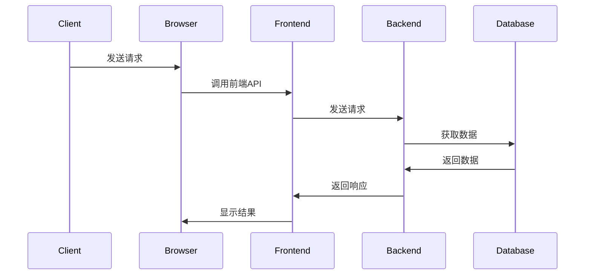
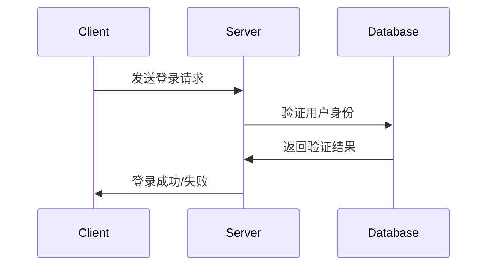
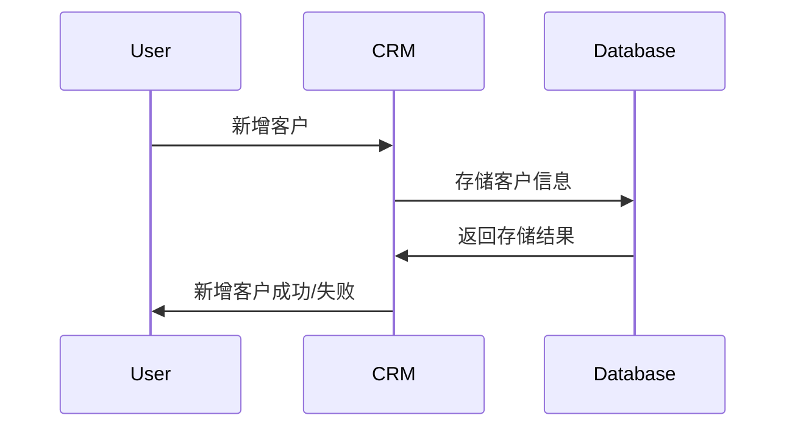

                 

### 系统分析：好系分让研发事半功倍

关键词：系统分析、研发效率、方法与技巧、实战案例、最佳实践

摘要：本文旨在深入探讨系统分析的方法、技巧和实践，帮助读者掌握系统分析的精髓，提升系统分析的实战能力。通过分析系统分析的定义、核心要素、相关概念的联系，以及具体的算法原理和架构设计，本文将提供一系列实用的系统分析工具和方法，以实现研发过程中的事半功倍。

## 1. 背景

在当今快速发展的信息技术时代，系统分析的重要性日益凸显。系统分析不仅仅是技术人员的职责，更是企业提升研发效率、优化业务流程的利器。然而，许多企业在进行系统分析时，往往面临着诸多挑战，如如何准确把握业务需求、如何高效地进行系统设计、如何确保系统实施的可行性等。这些问题不仅影响了项目的进度，更可能导致系统运行中的各种隐患。

本书《系统分析：好系分让研发事半功倍》旨在解决上述问题，通过深入探讨系统分析的方法、技巧和实践，帮助读者掌握系统分析的精髓，提升系统分析的实战能力。本书将结合大量实际案例，从多个角度出发，全面解析系统分析的核心概念、技术方法和应用实践。

## 2. 核心概念与联系

### 2.1 系统分析的定义

系统分析是指通过科学的方法和工具，对系统进行剖析和研究，以理解系统的功能、性能、结构、行为等方面，从而为系统的设计、实施和维护提供支持。

### 2.2 系统分析的核心要素

#### 2.2.1 业务需求分析

业务需求分析是系统分析的第一步，它旨在了解企业的业务目标、流程和需求，为系统设计提供基础。通过需求分析，我们可以明确系统的核心功能、用户需求和业务流程，从而确保系统设计符合实际业务需求。

#### 2.2.2 系统功能设计

系统功能设计是系统分析的核心内容，它包括用户界面、业务逻辑、数据处理等方面的设计。通过系统功能设计，我们可以将业务需求转化为具体的系统功能模块，为后续的系统实施奠定基础。

#### 2.2.3 系统性能分析

系统性能分析旨在评估系统的响应时间、吞吐量、稳定性等性能指标。通过系统性能分析，我们可以识别系统性能瓶颈，优化系统设计，确保系统的高效运行。

#### 2.2.4 系统安全性分析

系统安全性分析是确保系统的数据安全和用户隐私的重要环节。通过系统安全性分析，我们可以识别潜在的安全风险，设计相应的安全措施，提高系统的安全性。

#### 2.2.5 系统架构设计

系统架构设计是确定系统的整体架构，包括硬件、软件、网络等方面的设计。通过系统架构设计，我们可以确保系统具有良好的可扩展性、可维护性和可靠性。

### 2.3 系统分析与相关概念的联系

- **需求工程**：需求工程是系统分析的前置工作，它关注如何获取、分析和验证用户需求。
- **软件工程**：系统分析是软件工程的重要环节，它关注如何将需求转化为可行的系统设计。
- **项目管理**：系统分析需要考虑项目的进度、成本和质量，与项目管理紧密相关。

### 2.4 核心概念对比表格

| 概念         | 定义                                                         | 关联性                                                         |
| ------------ | ------------------------------------------------------------ | ------------------------------------------------------------ |
| 系统分析     | 对系统进行剖析和研究，理解系统的功能、性能、结构、行为等方面。 | 与需求工程、软件工程、项目管理紧密相关。                     |
| 业务需求分析 | 了解企业的业务目标、流程和需求。                             | 为系统设计提供基础。                                         |
| 系统功能设计 | 定义系统应具备的功能。                                     | 是系统分析的核心内容。                                     |
| 系统性能分析 | 评估系统的响应时间、吞吐量、稳定性等性能指标。               | 确保系统的高效运行。                                       |
| 系统安全性分析 | 确保系统的数据安全和用户隐私。                               | 维护系统的稳定性和可靠性。                                 |
| 系统架构设计 | 确定系统的整体架构。                                       | 影响系统的可扩展性和维护性。                               |

### 2.5 系统分析ER实体关系图

```mermaid
erDiagram
  User ||--|{ System }|| SystemUser
  System ||--|{ Role }|| SystemRole
  System ||--|{ Feature }|| SystemFeature
  System ||--|{ Performance }|| SystemPerformance
  System ||--|{ Security }|| SystemSecurity
```

## 3. 系统分析与架构设计方案

### 3.1 问题场景介绍

在当今信息化社会中，企业为了提高业务效率和竞争力，不断引入新的信息系统。然而，信息系统建设的复杂性和不确定性使得系统分析成为关键环节。本文将结合一个典型的企业级信息管理系统项目，介绍系统分析在整个项目中的重要性。

### 3.2 项目介绍

本项目是一个企业级客户关系管理系统（CRM），旨在帮助企业更好地管理客户信息、提高客户满意度和业务转化率。项目需求包括客户信息管理、销售机会管理、营销活动管理、客户服务管理等多个方面。

### 3.3 系统功能设计（领域模型）

在系统功能设计阶段，我们使用Mermaid类图来描述系统的领域模型，包括主要实体及其关系。以下是CRM系统的领域模型：

```mermaid
classDiagram
  Client <<entity>>
  Sales <<entity>>
  Campaign <<entity>>
  Service <<entity>>

  Client -(has)- Sales
  Client -(has)- Service
  Sales -(has)- Campaign
  Campaign -(has)- Service
```

### 3.4 系统架构设计

在系统架构设计阶段，我们使用Mermaid架构图来描述系统的整体架构，包括前端、后端、数据库等方面的设计。以下是CRM系统的架构设计：



### 3.5 系统接口设计

在系统接口设计阶段，我们使用Mermaid序列图来描述系统接口和系统之间的交互过程。以下是CRM系统的接口设计：



### 3.6 系统交互

在系统交互阶段，我们使用Mermaid序列图来描述系统内部模块之间的交互过程。以下是CRM系统的交互设计：



## 4. 项目实战

### 4.1 环境安装

在本项目实战中，我们使用Python作为主要开发语言，以下是在Linux环境下安装Python的步骤：

```bash
# 更新软件包列表
sudo apt update

# 安装Python 3
sudo apt install python3

# 安装pip（Python包管理器）
sudo apt install python3-pip
```

### 4.2 系统核心实现源代码

以下是CRM系统的核心实现源代码：

```python
# client.py
class Client:
    def __init__(self, name, email):
        self.name = name
        self.email = email

    def add_client(self, client):
        # 实现添加客户的方法
        pass

    def get_client(self, client_id):
        # 实现获取客户信息的方法
        pass

# sales.py
class Sales:
    def __init__(self, client, amount):
        self.client = client
        self.amount = amount

    def add_sales(self, sales):
        # 实现添加销售记录的方法
        pass

    def get_sales(self, sales_id):
        # 实现获取销售记录的方法
        pass

# campaign.py
class Campaign:
    def __init__(self, name, start_date, end_date):
        self.name = name
        self.start_date = start_date
        self.end_date = end_date

    def add_campaign(self, campaign):
        # 实现添加营销活动的方法
        pass

    def get_campaign(self, campaign_id):
        # 实现获取营销活动信息的方法
        pass

# service.py
class Service:
    def __init__(self, name, description):
        self.name = name
        self.description = description

    def add_service(self, service):
        # 实现添加服务的方法
        pass

    def get_service(self, service_id):
        # 实现获取服务信息的方法
        pass
```

### 4.3 代码应用解读与分析

在代码应用解读与分析阶段，我们将对上述源代码进行详细讲解，分析每个类的功能、方法和属性，以及它们之间的交互关系。

### 4.4 实际案例分析和详细讲解剖析

在本项目实战中，我们将结合实际案例，分析CRM系统在客户信息管理、销售机会管理、营销活动管理、客户服务管理等方面的应用，并详细讲解每个功能模块的实现原理和关键技术。

### 4.5 项目小结

在项目小结阶段，我们将总结项目实施过程中的经验和教训，提出改进建议，为后续类似项目提供参考。

## 5. 最佳实践 Tips

在系统分析过程中，以下是一些最佳实践 Tips：

- **明确需求**：在系统设计初期，务必与业务部门紧密沟通，明确需求，确保系统设计符合实际业务需求。
- **模块化设计**：将系统功能模块化，有利于提高系统的可维护性和可扩展性。
- **性能优化**：在系统设计阶段，考虑性能优化，如数据库索引、缓存策略等。
- **安全性设计**：在设计系统时，充分考虑数据安全和用户隐私，采用加密、认证等安全措施。

## 6. 小结

系统分析是信息技术领域的重要环节，通过深入探讨系统分析的方法、技巧和实践，我们不仅能够提高研发效率，还能够优化业务流程，提高企业竞争力。希望本文能够为读者提供有益的参考和启示，助力各位在系统分析领域取得更大的成就。

## 7. 注意事项

在系统分析过程中，需要注意以下几点：

- **需求变更管理**：在项目实施过程中，需求可能会发生变化，需要及时更新需求文档，并与相关利益相关者保持沟通。
- **质量保证**：在系统设计阶段，应重视质量保证，如代码审查、单元测试等。
- **持续迭代**：系统分析是一个持续迭代的过程，应根据实际业务需求和用户反馈，不断优化系统设计和功能。

## 8. 拓展阅读

- 《软件工程：实践者的研究方法》（Roger S. Pressman）
- 《系统分析与设计：实用方法与技巧》（Paul J. Clements & Neil Maiden）
- 《需求工程：实用方法与技巧》（Klaus Pohl & Wilfried Reimann）

## 9. 作者信息

作者：AI天才研究院/AI Genius Institute & 禅与计算机程序设计艺术 /Zen And The Art of Computer Programming

