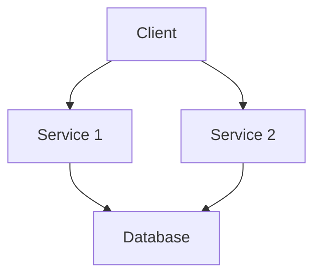
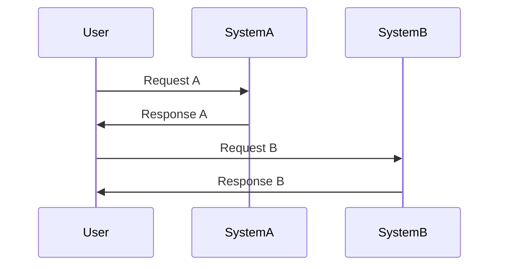
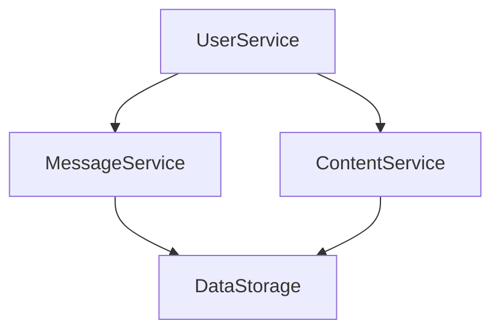

                 

### 系统分析：好系分让研发事半功倍

> 关键词：系统分析、研发效率、架构设计、需求分析、实战案例

> 摘要：本文深入探讨系统分析在研发过程中的重要性，通过详细的步骤和方法，引导读者理解和应用系统分析，提升研发效率和系统质量。

## 引言

在快速变化和高度竞争的IT行业，研发效率和质量成为企业成功的关键。系统分析作为软件开发过程中的核心环节，对于确保项目成功和提升研发效率具有重要作用。然而，系统分析并非易事，它需要深入理解业务需求、技术架构，并具备严密的逻辑思维。本文将围绕系统分析的核心概念、方法和技术，通过一步步的解析，帮助读者掌握系统分析的精髓，让研发事半功倍。

## 第一部分：系统分析基础

### 第1章 系统分析概述

系统分析是软件开发过程中的第一步，它旨在理解系统的需求、功能和技术架构。系统分析不仅仅关注技术实现，更强调对业务流程、用户需求和系统性能的全面分析。

#### 1.1 系统分析与研发

在研发过程中，系统分析扮演着至关重要的角色。它为后续的设计和开发提供明确的指导，确保项目能够按照预期进行。

#### 1.1.1 系统分析的角色

系统分析的主要角色包括：

- **需求理解**：分析用户需求，确保需求清晰、明确。
- **技术选型**：根据需求选择合适的技术方案。
- **架构设计**：设计系统的整体架构，确保系统的稳定性和可扩展性。

#### 1.1.2 系统分析的关键目标

系统分析的关键目标包括：

- **明确需求**：确保所有需求被准确理解和记录。
- **风险评估**：识别潜在的风险，制定相应的应对策略。
- **方案优化**：通过分析和评估，优化系统设计方案。

#### 1.1.3 系统分析的流程与方法

系统分析的流程通常包括以下步骤：

1. **需求收集**：通过访谈、问卷等方式收集用户需求。
2. **需求分析**：对收集到的需求进行分析和分类。
3. **需求文档**：编写详细的用户需求文档。
4. **技术评估**：评估技术方案的可行性。
5. **架构设计**：设计系统的整体架构。
6. **方案评审**：对设计方案进行评审和优化。

### 第2章 系统分析与核心概念

系统分析涉及多个核心概念，包括系统定义、系统类型、系统生命周期等。

#### 2.1 系统定义与边界

系统是指由多个组件组成的具有特定功能的整体。系统的边界定义了系统的范围和功能。

#### 2.1.1 系统定义

系统定义包括以下几个方面：

- **组件**：系统的组成部分。
- **功能**：系统能够实现的具体任务。
- **性能**：系统在特定条件下的工作能力。

#### 2.1.2 系统类型与特点

系统类型可以根据其功能、规模、复杂性等进行分类。常见的系统类型包括：

- **业务系统**：用于支持企业业务运营的系统。
- **管理系统**：用于管理和监控企业资源的系统。
- **应用系统**：用于特定业务场景的应用程序。

不同类型的系统具有不同的特点和需求。

#### 2.1.3 系统生命周期

系统生命周期包括以下几个阶段：

- **规划**：确定系统目标和需求。
- **设计**：设计系统的架构和功能。
- **开发**：实现系统功能。
- **测试**：验证系统的功能和性能。
- **部署**：将系统部署到生产环境。
- **维护**：对系统进行监控和维护。

### 第3章 系统需求分析

系统需求分析是系统分析的核心环节，它涉及对用户需求的理解、分析和记录。

#### 3.1 需求分析概述

需求分析是确保系统能够满足用户需求的重要步骤。它包括以下几个方面：

- **需求获取**：通过访谈、问卷调查等方式获取用户需求。
- **需求分类**：对需求进行分类和优先级排序。
- **需求文档**：编写详细的用户需求文档。

#### 3.2 需求获取方法

需求获取的方法包括：

- **用户访谈**：通过与用户面对面交流，了解用户需求和期望。
- **问卷调查**：通过设计问卷，收集用户需求和意见。
- **观察法**：通过观察用户的工作流程，了解用户的需求和行为。

#### 3.2.1 用户访谈

用户访谈是获取用户需求的重要方法。在进行用户访谈时，需要注意以下几点：

- **明确访谈目的**：确保访谈围绕关键问题进行。
- **准备访谈提纲**：提前准备访谈提纲，确保访谈内容系统、全面。
- **倾听用户意见**：认真倾听用户意见，理解用户的真实需求。

#### 3.2.2 观察法

观察法是通过直接观察用户的工作流程和行为，获取用户需求的方法。在进行观察时，需要注意以下几点：

- **选择合适的观察位置**：选择合适的位置，以便清晰地观察到用户的行为。
- **记录观察结果**：及时记录观察结果，以便后续分析和整理。

#### 3.2.3 实际案例分享

在需求获取过程中，实际案例的分享可以帮助团队成员更好地理解用户需求。以下是一个实际案例：

**案例**：一家电商公司希望开发一款客户关系管理系统，用于管理客户信息和提高客户满意度。

**需求分析**：

- **需求1**：记录客户的基本信息，包括姓名、联系方式、购买历史等。
- **需求2**：提供客户服务功能，包括在线客服、投诉处理等。
- **需求3**：提供客户分群管理功能，根据客户购买行为进行分类。

通过实际案例的分析，团队成员可以更清晰地理解用户需求，并制定相应的解决方案。

### 第4章 系统设计方法

系统设计是系统分析的重要延伸，它涉及系统的功能设计、架构设计、接口设计和交互设计。

#### 4.1 系统设计概述

系统设计是确保系统能够满足需求、稳定运行和易于维护的重要环节。系统设计包括以下几个方面：

- **功能设计**：设计系统的功能模块和功能流程。
- **架构设计**：设计系统的整体架构和模块关系。
- **接口设计**：设计系统的接口和接口规范。
- **交互设计**：设计用户与系统的交互流程和界面。

#### 4.2 领域模型设计

领域模型设计是系统设计的重要部分，它用于描述系统的核心业务概念和实体关系。

#### 4.2.1 领域模型的概念与作用

领域模型是系统设计中的核心概念，它用于描述系统的业务领域和核心功能。

- **概念**：领域模型是指用于描述系统业务领域的概念和实体。
- **作用**：领域模型可以帮助设计师更好地理解系统的业务需求，设计出更符合实际的系统架构。

#### 4.2.2 领域模型的构建方法

领域模型的构建方法通常包括以下步骤：

1. **识别业务领域**：确定系统所涉及的业务领域。
2. **定义核心概念**：确定领域中的核心概念和实体。
3. **构建实体关系图**：使用Mermaid流程图（ER实体关系图）描述实体之间的关系。
4. **定义属性和操作**：为每个实体定义属性和操作。

以下是一个领域模型的示例：

```mermaid
erDiagram
  Customer ||--|{ Order } : 1订单属于1个客户
  Product ||--|{ Order } : 1订单包含1个产品
```

#### 4.2.3 Mermaid类图绘制与解读

Mermaid类图是一种用于描述领域模型和类之间关系的图形化工具。以下是一个简单的Mermaid类图示例：

```mermaid
classDiagram
  Class01 <|-- Class02
  Class03 --| Class04 : aggregation
  Class05 o-- Class06 : composition
```

在这个示例中，`Class01` 继承自 `Class02`，`Class03` 与 `Class04` 之间存在聚合关系，`Class05` 与 `Class06` 之间存在组合关系。

### 第5章 系统架构设计

系统架构设计是确保系统稳定、可靠和可扩展的关键环节。系统架构设计包括以下几个方面：

- **系统架构概述**：介绍系统架构的基本概念和设计原则。
- **系统架构类型**：介绍不同的系统架构类型及其适用场景。
- **架构设计方法**：介绍系统架构设计的流程和方法。

#### 5.1 系统架构设计概述

系统架构设计是指设计系统的整体结构和模块之间的关系。系统架构设计的主要目标包括：

- **确保系统稳定性**：通过合理的架构设计，确保系统在故障情况下能够稳定运行。
- **提高系统可靠性**：通过冗余设计和故障转移，提高系统的可靠性。
- **提升系统可扩展性**：通过模块化和松耦合设计，确保系统能够方便地扩展和升级。

#### 5.1.1 系统架构的定义与作用

系统架构是指系统的整体结构和组成部分之间的关系。系统架构在软件开发过程中起着至关重要的作用，它决定了系统的性能、稳定性和可扩展性。

- **定义**：系统架构是指系统的整体结构和组成部分之间的关系。
- **作用**：系统架构定义了系统的功能模块、数据流、通信机制等，为后续设计和开发提供了明确的指导。

#### 5.1.2 系统架构的设计原则

系统架构设计需要遵循以下原则：

- **模块化**：将系统划分为多个模块，每个模块负责特定的功能。
- **松耦合**：模块之间保持松耦合，降低模块之间的依赖。
- **高内聚**：模块内部保持高内聚，确保模块的功能清晰。
- **可扩展性**：设计时要考虑到系统的可扩展性，确保系统能够方便地添加新功能或升级。

#### 5.1.3 系统架构的类型与选择

系统架构的类型可以根据其特点和应用场景进行选择。常见的系统架构类型包括：

- **客户端-服务器架构**：客户端负责与用户交互，服务器负责数据处理和存储。
- **分布式架构**：系统分布在多个节点上，通过网络进行通信。
- **微服务架构**：将系统划分为多个独立的微服务，每个微服务负责特定的功能。

选择系统架构时需要考虑以下因素：

- **性能需求**：根据系统的性能需求选择合适的架构类型。
- **可靠性要求**：根据系统的可靠性要求选择合适的架构类型。
- **可扩展性需求**：根据系统的可扩展性需求选择合适的架构类型。

#### 5.2 系统架构设计方法

系统架构设计的方法包括以下几个步骤：

1. **需求分析**：分析系统的功能需求、性能需求等。
2. **架构设计**：根据需求分析结果设计系统的整体架构。
3. **模块划分**：将系统划分为多个模块，每个模块负责特定的功能。
4. **接口设计**：设计模块之间的接口，确保模块之间松耦合。
5. **架构评估**：对设计方案进行评估，确保其满足性能、可靠性、可扩展性等要求。

#### 5.2.1 架构设计流程

架构设计流程通常包括以下步骤：

1. **需求分析**：明确系统的功能需求、性能需求等。
2. **系统架构设计**：设计系统的整体架构，包括模块划分、接口设计等。
3. **模块详细设计**：对每个模块进行详细设计，包括功能设计、接口设计等。
4. **架构评估**：对设计方案进行评估，确保其满足性能、可靠性、可扩展性等要求。
5. **架构迭代**：根据评估结果对架构设计进行优化和迭代。

#### 5.2.2 架构设计工具与技术

架构设计常用的工具和技术包括：

- **UML类图**：用于描述系统的类、接口和关系。
- **Mermaid流程图**：用于描述系统的数据流、控制流和业务流程。
- **架构评估工具**：如SonarQube、NDepend等，用于评估系统架构的质量和可靠性。

#### 5.2.3 Mermaid架构图绘制与解读

Mermaid是一种基于Markdown的图形化工具，可以方便地绘制系统架构图。以下是一个简单的Mermaid架构图示例：



在这个示例中，客户端（Client）与两个服务（Service 1和Service 2）进行通信，服务与数据库（Database）进行数据存储和查询。

### 第6章 系统接口设计与交互

系统接口设计是确保系统之间通信和协作的关键环节。系统接口设计包括以下几个方面：

- **系统接口设计概述**：介绍系统接口设计的基本概念和重要性。
- **接口设计原则**：介绍系统接口设计需要遵循的原则。
- **接口设计方法**：介绍系统接口设计的流程和方法。
- **系统交互设计**：介绍系统交互设计的基本概念和流程。

#### 6.1 系统接口设计概述

系统接口设计是指设计系统之间通信和协作的接口。系统接口设计的目标是确保系统之间的通信高效、稳定和可靠。

- **接口定义**：接口是指系统之间通信的规范和协议。
- **接口设计的重要性**：良好的接口设计可以提高系统的可维护性、可扩展性和可复用性。

#### 6.1.1 接口设计的重要性

接口设计在系统开发中具有重要意义，主要体现在以下几个方面：

- **提高可维护性**：良好的接口设计可以降低系统之间的耦合，提高系统的可维护性。
- **提高可扩展性**：良好的接口设计可以方便地添加新功能或修改现有功能，提高系统的可扩展性。
- **提高可复用性**：良好的接口设计可以提高代码的可复用性，降低重复开发的工作量。

#### 6.1.2 接口设计的要素

接口设计需要考虑以下要素：

- **功能定义**：明确接口提供哪些功能。
- **参数定义**：定义接口的输入参数和输出参数。
- **返回值定义**：定义接口的返回值类型和含义。
- **异常处理**：定义接口的异常处理机制。

#### 6.1.3 接口设计的规范与标准

接口设计需要遵循一定的规范和标准，以确保接口的一致性和可维护性。常见的接口设计规范和标准包括：

- **RESTful API规范**：用于设计Web服务的接口规范。
- **SOAP规范**：用于设计Web服务的接口规范。
- **GraphQL规范**：用于设计数据查询接口的规范。

#### 6.2 系统交互设计

系统交互设计是指设计系统之间的交互流程和协作机制。系统交互设计的目标是确保系统之间的协作高效、稳定和可靠。

- **交互定义**：交互是指系统之间的信息交换和协作。
- **交互设计的重要性**：良好的交互设计可以提高系统的性能和用户体验。

#### 6.2.1 交互设计的原则

交互设计需要遵循以下原则：

- **一致性**：保持接口和交互的一致性，降低使用难度。
- **简洁性**：简化交互流程，减少用户操作步骤。
- **响应性**：确保系统及时响应用户操作，提高用户体验。
- **灵活性**：设计灵活的交互机制，适应不同的业务场景。

#### 6.2.2 交互设计的流程

交互设计的流程通常包括以下步骤：

1. **需求分析**：分析系统之间的交互需求，明确交互的目的和功能。
2. **交互流程设计**：设计系统之间的交互流程，明确交互的顺序和方式。
3. **交互界面设计**：设计交互界面，确保用户可以方便地操作和查看。
4. **交互测试**：对交互流程进行测试，确保其符合预期。

#### 6.2.3 Mermaid序列图绘制与解读

Mermaid序列图是一种用于描述系统交互流程的图形化工具。以下是一个简单的Mermaid序列图示例：



在这个示例中，用户首先向系统A发送请求A，系统A返回响应A；然后用户向系统B发送请求B，系统B返回响应B。这个示例展示了用户与两个系统之间的基本交互流程。

### 第7章 系统分析实战

通过前几章的学习，我们已经了解了系统分析的基本概念和方法。在本章中，我们将通过一个实际案例，详细展示系统分析的过程和方法。

#### 7.1 实战背景介绍

本次实战案例是一个电商平台的客户关系管理系统。该系统的目标是提高客户满意度，通过管理客户信息和提供优质服务，实现客户留存和转化率的提升。

#### 7.1.1 项目背景

随着电商行业的快速发展，客户关系管理成为电商平台的重要战略方向。为了提升客户体验和满意度，电商平台需要建立一套完善的客户关系管理系统。

#### 7.1.2 项目目标

本项目的主要目标包括：

- **客户信息管理**：记录和管理客户的基本信息、购买历史和偏好。
- **客户服务**：提供在线客服、投诉处理等功能，提高客户满意度。
- **客户分群管理**：根据客户购买行为和偏好，进行客户分群，实现精准营销。

#### 7.1.3 项目挑战

本项目面临的挑战主要包括：

- **数据量巨大**：电商平台积累了大量的客户数据，如何高效地管理和处理这些数据是一个挑战。
- **系统稳定性**：客户关系管理系统需要保证稳定运行，避免出现数据丢失或系统崩溃等问题。
- **扩展性**：随着业务的不断发展，系统需要具备良好的扩展性，以便轻松应对新增功能或业务需求。

#### 7.2 系统核心实现

在系统分析的基础上，接下来我们将详细讨论系统的核心实现。

#### 7.2.1 环境安装

为了实现本系统，我们首先需要安装一些必要的软件和环境。以下是安装步骤：

1. **数据库安装**：选择合适的数据库（如MySQL、PostgreSQL等），并进行安装和配置。
2. **开发环境安装**：安装Java开发环境（如Java SDK、IDE等），并配置相应的开发工具。
3. **中间件安装**：安装中间件（如Apache Kafka、Redis等），用于处理数据流和缓存。

#### 7.2.2 系统核心实现

系统的核心实现主要包括以下几个模块：

1. **用户管理模块**：用于管理用户的基本信息，包括用户注册、登录、信息修改等功能。
2. **订单管理模块**：用于处理订单的创建、查询、修改和删除等操作。
3. **客户服务模块**：提供在线客服、投诉处理等功能，实现客户服务的自动化和高效化。
4. **客户分群模块**：根据客户购买行为和偏好，进行客户分群，实现精准营销。

以下是用户管理模块的核心实现代码：

```python
class UserManager:
    def __init__(self, database):
        self.database = database

    def register_user(self, user):
        self.database.insert_user(user)

    def login_user(self, user):
        return self.database.login_user(user)

    def update_user_info(self, user):
        self.database.update_user_info(user)
```

#### 7.2.3 代码应用解读

以上代码展示了用户管理模块的核心实现。首先，我们定义了一个`UserManager`类，该类负责管理用户的基本信息。类中的方法包括`register_user`、`login_user`和`update_user_info`，分别用于用户注册、登录和信息修改。

- **register_user**：该方法用于用户注册。它接收一个`user`对象，将用户信息插入数据库。
- **login_user**：该方法用于用户登录。它接收一个`user`对象，从数据库查询用户信息，并返回登录结果。
- **update_user_info**：该方法用于用户信息修改。它接收一个`user`对象，更新用户信息。

#### 7.3 案例分析与讲解

在系统核心实现的基础上，接下来我们将对实际案例进行分析和讲解。

#### 7.3.1 实际案例分析

在实际运营中，客户关系管理系统面临以下挑战：

- **数据量增长**：随着用户数量的增加，客户数据的存储和处理成为一个挑战。
- **系统性能**：客户关系管理系统需要高效处理大量的用户请求，保证系统性能。
- **数据安全**：客户信息涉及到用户的隐私，如何确保数据安全成为重要问题。

#### 7.3.2 案例细节剖析

针对以上挑战，我们采取了以下解决方案：

1. **数据分片**：为了应对数据量增长，我们采用了数据分片技术，将客户数据分散存储在不同的数据库中。这样可以提高数据存储和查询的效率。
2. **缓存技术**：为了提高系统性能，我们采用了缓存技术，将频繁访问的数据存储在内存中。这样可以减少数据库的访问次数，提高系统的响应速度。
3. **数据加密**：为了保障数据安全，我们对客户数据进行加密存储，确保数据在传输和存储过程中不会被窃取或篡改。

#### 7.3.3 案例总结与反思

通过实际案例的分析和实施，我们取得了以下成果：

- **系统性能提升**：通过数据分片和缓存技术，客户关系管理系统的性能得到了显著提升，用户请求的处理速度更快。
- **数据安全性提高**：通过数据加密技术，客户信息的安全性得到了保障，降低了数据泄露的风险。
- **业务效率提升**：通过优化系统设计和实施，客户关系管理系统的业务效率得到了提升，实现了客户满意度和服务质量的提升。

然而，在实施过程中我们也遇到了一些问题，如数据一致性保障、系统扩展性等。针对这些问题，我们进行了深入的分析和优化，为后续的系统改进提供了方向。

### 第8章 最佳实践与总结

#### 8.1 最佳实践

在系统分析过程中，遵循以下最佳实践可以帮助提高研发效率和质量：

- **需求明确**：在需求分析阶段，确保需求清晰、明确，避免需求变更。
- **迭代开发**：采用敏捷开发方法，逐步实现功能，及时反馈和调整。
- **代码规范**：遵循代码规范，提高代码的可读性和可维护性。
- **持续集成**：采用持续集成工具，确保代码质量和系统稳定性。

#### 8.2 小结

系统分析在软件开发过程中具有重要意义，它为后续的设计和开发提供了明确的指导。通过本章的介绍，我们了解了系统分析的核心概念、方法和技术，掌握了系统分析的基本步骤和要点。

#### 8.2.1 系统分析的重点与难点

系统分析的重点包括需求分析、架构设计和接口设计。难点在于如何准确理解用户需求，设计出稳定、可靠、可扩展的系统。

#### 8.2.2 研发中的系统分析价值

系统分析可以提高研发效率和质量，确保项目按期交付和满足用户需求。它是软件开发过程中的关键环节，决定了项目的成功与否。

#### 8.2.3 未来趋势展望

随着技术的不断发展，系统分析也将不断演进。未来，系统分析将更加智能化、自动化，借助人工智能和大数据分析技术，实现更高效的需求分析和架构设计。

### 8.3 注意事项

在系统分析过程中，需要注意以下几点：

- **需求变更管理**：及时识别和应对需求变更，避免项目延期和成本超支。
- **团队协作**：确保团队成员之间的沟通和协作，提高项目进度和质量。
- **风险控制**：识别潜在的风险，制定相应的应对策略，确保项目顺利实施。

### 8.4 拓展阅读

为了更深入地了解系统分析，读者可以参考以下拓展阅读资源：

- **书籍**：《软件工程：实践者的研究方法》（Roger S. Pressman）、《系统分析与设计：方法与实践》（Thomas J. Riall）。
- **在线资源**：GitHub、Stack Overflow、Medium等。
- **论坛**：CSDN、知乎等。

### 参考文献

- Pressman, R. S. (2017). 《软件工程：实践者的研究方法》. 电子工业出版社。
- Riall, T. J. (2016). 《系统分析与设计：方法与实践》. 清华大学出版社。

## 结束语

系统分析是软件开发过程中的核心环节，它决定了项目的成功与否。通过本文的介绍，我们了解了系统分析的基本概念、方法和技术，掌握了系统分析的基本步骤和要点。希望本文能够对您的研发工作提供有价值的参考和指导。在未来的实践中，不断学习和探索，提高系统分析能力，让研发事半功倍。

> 作者：AI天才研究院/AI Genius Institute & 禅与计算机程序设计艺术 /Zen And The Art of Computer Programming

### 系统分析：好系分让研发事半功倍

系统分析是软件开发过程中的核心环节，它不仅是理解用户需求的关键步骤，也是确保系统设计合理、架构稳定、接口规范的重要保障。本文将围绕系统分析的核心概念、方法和技术，通过详细的步骤和方法，帮助读者深入理解和应用系统分析，从而提升研发效率和系统质量。

#### 关键词
- 系统分析
- 研发效率
- 架构设计
- 需求分析
- 实战案例

#### 摘要
本文首先介绍了系统分析在软件开发过程中的重要性，随后详细阐述了系统分析的核心概念和步骤。通过实际案例的分析，本文展示了系统分析的实践方法。最后，本文总结了系统分析的最佳实践和注意事项，并提供了拓展阅读资源。

### 引言

在快速发展的IT行业，研发效率和质量是企业在竞争中立于不败之地的关键。系统分析作为软件开发过程中的核心环节，起着至关重要的作用。它不仅仅是理解用户需求的一种方法，更是确保系统设计合理、架构稳定、接口规范的重要保障。

系统分析的目标是通过分析用户需求、技术可行性、系统性能等因素，设计出满足业务需求且高效稳定的系统。因此，系统分析不仅仅是技术工作，更是一项涵盖业务理解、需求分析、技术评估的综合能力。

本文将按以下结构进行：

1. 系统分析概述
2. 系统分析与核心概念
3. 系统需求分析
4. 系统设计方法
5. 系统接口设计与交互
6. 系统分析实战
7. 最佳实践与总结

#### 第一部分：系统分析基础

### 第1章 系统分析概述

系统分析是软件开发过程中的第一步，它涉及对用户需求的收集、分析和理解。系统分析不仅仅关注技术实现，更强调对业务流程、用户需求和系统性能的全面分析。

#### 1.1 系统分析与研发

在软件开发过程中，系统分析扮演着至关重要的角色。它为后续的设计和开发提供明确的指导，确保项目能够按照预期进行。具体来说，系统分析在研发过程中有以下几个关键作用：

1. **需求理解**：系统分析的第一步是理解用户需求，确保需求清晰、明确，并记录在案。
2. **技术评估**：根据用户需求，系统分析需要评估技术实现的可行性，选择合适的开发技术和工具。
3. **风险评估**：系统分析还需要识别和评估项目中的潜在风险，制定相应的应对策略。

#### 1.1.1 系统分析的角色

在研发过程中，系统分析的角色主要包括以下几个方面：

- **需求分析**：通过访谈、问卷调查、用户行为分析等方式，收集和理解用户需求。
- **技术评估**：评估不同技术方案的可行性，选择最适合项目需求的技术路线。
- **架构设计**：根据需求和技术评估结果，设计系统的整体架构，确保系统的稳定性和可扩展性。
- **方案评审**：对设计方案进行评审和优化，确保方案符合项目需求和标准。

#### 1.1.2 系统分析的关键目标

系统分析的关键目标包括以下几个方面：

- **明确需求**：确保所有需求被准确理解和记录，避免后续开发中的需求变更。
- **风险评估**：识别潜在的风险，制定相应的应对策略，降低项目风险。
- **方案优化**：通过分析和评估，优化系统设计方案，提高系统的性能和可维护性。
- **沟通协作**：确保项目团队成员对项目目标和需求有清晰的理解，提高团队协作效率。

#### 1.1.3 系统分析的流程与方法

系统分析的流程通常包括以下几个步骤：

1. **需求收集**：通过访谈、问卷调查、用户行为分析等方式，收集用户需求。
2. **需求分析**：对收集到的需求进行分析和分类，确定需求的重要性和优先级。
3. **需求文档**：编写详细的用户需求文档，明确系统的功能、性能和约束条件。
4. **技术评估**：评估不同技术方案的可行性，选择最适合的技术路线。
5. **架构设计**：根据需求文档和技术评估结果，设计系统的整体架构。
6. **方案评审**：对设计方案进行评审和优化，确保方案符合项目需求和标准。
7. **迭代与优化**：在项目开发过程中，持续进行需求分析和技术评估，根据实际情况调整设计方案。

#### 第2章 系统分析与核心概念

系统分析涉及多个核心概念，包括系统定义、系统类型、系统生命周期等。理解这些核心概念是进行有效系统分析的基础。

##### 2.1 系统定义与边界

系统是指由多个组件组成的具有特定功能的整体。系统定义包括以下几个方面：

- **组件**：系统的组成部分，如模块、子系统等。
- **功能**：系统能够实现的具体任务或操作。
- **性能**：系统在特定条件下的工作能力，如响应时间、吞吐量等。
- **边界**：系统的外部接口，定义了系统与外部环境之间的交互。

##### 2.1.1 系统定义

系统定义的目的是明确系统的范围和功能。具体来说，系统定义需要回答以下问题：

- **系统包含哪些组件？**
- **系统需要实现哪些功能？**
- **系统在哪些条件下工作？**
- **系统与外部环境如何交互？**

##### 2.1.2 系统类型与特点

系统类型可以根据其功能、规模、复杂性等进行分类。常见的系统类型包括：

- **业务系统**：用于支持企业业务运营的系统，如ERP、CRM等。
- **管理系统**：用于管理和监控企业资源的系统，如财务系统、库存管理系统等。
- **应用系统**：用于特定业务场景的应用程序，如电商平台、在线教育平台等。

不同类型的系统具有不同的特点和需求，系统分析需要根据系统的类型选择合适的方法和工具。

##### 2.1.3 系统生命周期

系统生命周期是指系统从规划、设计、开发、测试、部署到维护的整个过程。系统生命周期包括以下几个阶段：

1. **规划阶段**：确定系统目标和需求，进行可行性分析。
2. **设计阶段**：设计系统的整体架构和技术方案。
3. **开发阶段**：实现系统功能，进行单元测试和集成测试。
4. **测试阶段**：对系统进行系统测试和验收测试，确保系统符合需求和标准。
5. **部署阶段**：将系统部署到生产环境，进行用户培训和上线准备。
6. **维护阶段**：对系统进行监控和维护，确保系统的稳定运行。

##### 第3章 系统需求分析

系统需求分析是系统分析的核心环节，它涉及对用户需求的理解、分析和记录。系统需求分析的结果直接影响系统的设计、开发和测试。

##### 3.1 需求分析概述

需求分析是确保系统能够满足用户需求的重要步骤。它包括以下几个方面：

- **需求收集**：通过访谈、问卷调查、用户行为分析等方式，收集用户需求。
- **需求分析**：对收集到的需求进行分析和分类，确定需求的重要性和优先级。
- **需求文档**：编写详细的用户需求文档，明确系统的功能、性能和约束条件。

##### 3.2 需求获取方法

需求获取的方法包括：

- **用户访谈**：通过与用户面对面交流，了解用户需求和期望。
- **问卷调查**：通过设计问卷，收集用户需求和意见。
- **观察法**：通过观察用户的工作流程，了解用户的需求和行为。
- **用户调研**：通过用户调研，获取用户对现有系统的使用情况和改进建议。

##### 3.2.1 用户访谈

用户访谈是获取用户需求的重要方法。在进行用户访谈时，需要注意以下几点：

- **明确访谈目的**：确保访谈围绕关键问题进行。
- **准备访谈提纲**：提前准备访谈提纲，确保访谈内容系统、全面。
- **倾听用户意见**：认真倾听用户意见，理解用户的真实需求。

##### 3.2.2 观察法

观察法是通过直接观察用户的工作流程和行为，获取用户需求的方法。在进行观察时，需要注意以下几点：

- **选择合适的观察位置**：选择合适的位置，以便清晰地观察到用户的行为。
- **记录观察结果**：及时记录观察结果，以便后续分析和整理。

##### 3.2.3 实际案例分享

在需求获取过程中，实际案例的分享可以帮助团队成员更好地理解用户需求。以下是一个实际案例：

**案例**：一家电商公司希望开发一款客户关系管理系统，用于管理客户信息和提高客户满意度。

**需求分析**：

- **需求1**：记录客户的基本信息，包括姓名、联系方式、购买历史等。
- **需求2**：提供客户服务功能，包括在线客服、投诉处理等。
- **需求3**：提供客户分群管理功能，根据客户购买行为进行分类。

通过实际案例的分析，团队成员可以更清晰地理解用户需求，并制定相应的解决方案。

##### 第4章 系统设计方法

系统设计是系统分析的重要延伸，它涉及系统的功能设计、架构设计、接口设计和交互设计。系统设计的目的是确保系统满足需求、稳定运行和易于维护。

##### 4.1 系统设计概述

系统设计是软件开发过程中的重要环节，它涉及系统的整体架构和功能模块的设计。系统设计需要遵循以下原则：

- **模块化**：将系统划分为多个模块，每个模块负责特定的功能。
- **松耦合**：模块之间保持松耦合，降低模块之间的依赖。
- **高内聚**：模块内部保持高内聚，确保模块的功能清晰。
- **可扩展性**：设计时要考虑到系统的可扩展性，确保系统能够方便地添加新功能或升级。

##### 4.2 领域模型设计

领域模型设计是系统设计的重要部分，它用于描述系统的核心业务概念和实体关系。领域模型可以帮助设计师更好地理解系统的业务需求，设计出更符合实际的系统架构。

##### 4.2.1 领域模型的概念与作用

领域模型是指用于描述系统业务领域的概念和实体。领域模型的作用包括：

- **业务理解**：帮助设计师和开发人员更好地理解系统的业务需求和功能。
- **系统设计**：作为系统设计的基础，指导系统的功能模块划分和架构设计。
- **需求分析**：辅助需求分析，确保需求文档的完整性和准确性。

##### 4.2.2 领域模型的构建方法

构建领域模型通常包括以下步骤：

1. **识别业务领域**：确定系统所涉及的业务领域。
2. **定义核心概念**：确定领域中的核心概念和实体。
3. **构建实体关系图**：使用Mermaid流程图（ER实体关系图）描述实体之间的关系。
4. **定义属性和操作**：为每个实体定义属性和操作。

以下是一个领域模型的示例：

```mermaid
erDiagram
  Customer ||--|{ Order } : 1订单属于1个客户
  Product ||--|{ Order } : 1订单包含1个产品
```

在这个示例中，`Customer`（客户）和`Order`（订单）是两个核心实体，`Product`（产品）是辅助实体。通过这个领域模型，可以清晰地描述客户、订单和产品之间的关系。

##### 4.2.3 Mermaid类图绘制与解读

Mermaid类图是一种用于描述领域模型和类之间关系的图形化工具。以下是一个简单的Mermaid类图示例：

```mermaid
classDiagram
  Class01 <|-- Class02
  Class03 --| Class04 : aggregation
  Class05 o-- Class06 : composition
```

在这个示例中，`Class01` 继承自 `Class02`，`Class03` 与 `Class04` 之间存在聚合关系，`Class05` 与 `Class06` 之间存在组合关系。

##### 第5章 系统架构设计

系统架构设计是确保系统稳定、可靠和可扩展的关键环节。系统架构设计包括系统的整体架构设计、模块划分、接口设计和交互设计。

##### 5.1 系统架构设计概述

系统架构设计是指设计系统的整体结构和模块之间的关系。系统架构设计的主要目标包括：

- **确保系统稳定性**：通过合理的架构设计，确保系统在故障情况下能够稳定运行。
- **提高系统可靠性**：通过冗余设计和故障转移，提高系统的可靠性。
- **提升系统可扩展性**：通过模块化和松耦合设计，确保系统能够方便地扩展和升级。

##### 5.1.1 系统架构的定义与作用

系统架构是指系统的整体结构和组成部分之间的关系。系统架构在软件开发过程中起着至关重要的作用，它决定了系统的性能、稳定性和可扩展性。

- **定义**：系统架构是指系统的整体结构和组成部分之间的关系。
- **作用**：系统架构定义了系统的功能模块、数据流、通信机制等，为后续设计和开发提供了明确的指导。

##### 5.1.2 系统架构的设计原则

系统架构设计需要遵循以下原则：

- **模块化**：将系统划分为多个模块，每个模块负责特定的功能。
- **松耦合**：模块之间保持松耦合，降低模块之间的依赖。
- **高内聚**：模块内部保持高内聚，确保模块的功能清晰。
- **可扩展性**：设计时要考虑到系统的可扩展性，确保系统能够方便地添加新功能或升级。

##### 5.1.3 系统架构的类型与选择

系统架构的类型可以根据其特点和应用场景进行选择。常见的系统架构类型包括：

- **客户端-服务器架构**：客户端负责与用户交互，服务器负责数据处理和存储。
- **分布式架构**：系统分布在多个节点上，通过网络进行通信。
- **微服务架构**：将系统划分为多个独立的微服务，每个微服务负责特定的功能。

选择系统架构时需要考虑以下因素：

- **性能需求**：根据系统的性能需求选择合适的架构类型。
- **可靠性要求**：根据系统的可靠性要求选择合适的架构类型。
- **可扩展性需求**：根据系统的可扩展性需求选择合适的架构类型。

##### 5.2 系统架构设计方法

系统架构设计的方法包括以下几个步骤：

1. **需求分析**：分析系统的功能需求、性能需求等。
2. **系统架构设计**：设计系统的整体架构，包括模块划分、接口设计等。
3. **模块详细设计**：对每个模块进行详细设计，包括功能设计、接口设计等。
4. **架构评估**：对设计方案进行评估，确保其满足性能、可靠性、可扩展性等要求。
5. **架构迭代**：根据评估结果对架构设计进行优化和迭代。

##### 5.2.1 架构设计流程

架构设计流程通常包括以下步骤：

1. **需求分析**：明确系统的功能需求、性能需求等。
2. **系统架构设计**：设计系统的整体架构，包括模块划分、接口设计等。
3. **模块详细设计**：对每个模块进行详细设计，包括功能设计、接口设计等。
4. **架构评估**：对设计方案进行评估，确保其满足性能、可靠性、可扩展性等要求。
5. **架构迭代**：根据评估结果对架构设计进行优化和迭代。

##### 5.2.2 架构设计工具与技术

架构设计常用的工具和技术包括：

- **UML类图**：用于描述系统的类、接口和关系。
- **Mermaid流程图**：用于描述系统的数据流、控制流和业务流程。
- **架构评估工具**：如SonarQube、NDepend等，用于评估系统架构的质量和可靠性。

##### 5.2.3 Mermaid架构图绘制与解读

Mermaid是一种基于Markdown的图形化工具，可以方便地绘制系统架构图。以下是一个简单的Mermaid架构图示例：


在这个示例中，客户端（Client）与两个服务（Service 1和Service 2）进行通信，服务与数据库（Database）进行数据存储和查询。

##### 第6章 系统接口设计与交互

系统接口设计是确保系统之间通信和协作的关键环节。系统接口设计包括系统的接口定义、规范设计、接口实现和接口测试。

##### 6.1 系统接口设计概述

系统接口设计是指设计系统之间通信和协作的接口。系统接口设计的目标是确保系统之间的通信高效、稳定和可靠。

- **接口定义**：接口是指系统之间通信的规范和协议。
- **接口设计的重要性**：良好的接口设计可以提高系统的可维护性、可扩展性和可复用性。

##### 6.1.1 接口设计的重要性

接口设计在系统开发中具有重要意义，主要体现在以下几个方面：

- **提高可维护性**：良好的接口设计可以降低系统之间的耦合，提高系统的可维护性。
- **提高可扩展性**：良好的接口设计可以方便地添加新功能或修改现有功能，提高系统的可扩展性。
- **提高可复用性**：良好的接口设计可以提高代码的可复用性，降低重复开发的工作量。

##### 6.1.2 接口设计的要素

接口设计需要考虑以下要素：

- **功能定义**：明确接口提供哪些功能。
- **参数定义**：定义接口的输入参数和输出参数。
- **返回值定义**：定义接口的返回值类型和含义。
- **异常处理**：定义接口的异常处理机制。

##### 6.1.3 接口设计的规范与标准

接口设计需要遵循一定的规范和标准，以确保接口的一致性和可维护性。常见的接口设计规范和标准包括：

- **RESTful API规范**：用于设计Web服务的接口规范。
- **SOAP规范**：用于设计Web服务的接口规范。
- **GraphQL规范**：用于设计数据查询接口的规范。

##### 6.2 系统交互设计

系统交互设计是指设计系统之间的交互流程和协作机制。系统交互设计的目标是确保系统之间的协作高效、稳定和可靠。

- **交互定义**：交互是指系统之间的信息交换和协作。
- **交互设计的重要性**：良好的交互设计可以提高系统的性能和用户体验。

##### 6.2.1 交互设计的原则

交互设计需要遵循以下原则：

- **一致性**：保持接口和交互的一致性，降低使用难度。
- **简洁性**：简化交互流程，减少用户操作步骤。
- **响应性**：确保系统及时响应用户操作，提高用户体验。
- **灵活性**：设计灵活的交互机制，适应不同的业务场景。

##### 6.2.2 交互设计的流程

交互设计的流程通常包括以下步骤：

1. **需求分析**：分析系统之间的交互需求，明确交互的目的和功能。
2. **交互流程设计**：设计系统之间的交互流程，明确交互的顺序和方式。
3. **交互界面设计**：设计交互界面，确保用户可以方便地操作和查看。
4. **交互测试**：对交互流程进行测试，确保其符合预期。

##### 6.2.3 Mermaid序列图绘制与解读

Mermaid序列图是一种用于描述系统交互流程的图形化工具。以下是一个简单的Mermaid序列图示例：


在这个示例中，用户首先向系统A发送请求A，系统A返回响应A；然后用户向系统B发送请求B，系统B返回响应B。这个示例展示了用户与两个系统之间的基本交互流程。

##### 第7章 系统分析实战

通过前几章的学习，我们已经了解了系统分析的基本概念和方法。在本章中，我们将通过一个实际案例，详细展示系统分析的过程和方法。

##### 7.1 实战背景介绍

本次实战案例是一个电商平台的后台管理系统。该系统的目标是提升电商平台的管理效率和用户体验，支持电商平台的日常运营和决策。

##### 7.1.1 项目背景

随着电商平台的快速发展，后台管理系统成为电商平台日常运营的重要支撑。后台管理系统需要处理大量的订单、用户数据和业务数据，支持订单管理、用户管理、库存管理等功能。

##### 7.1.2 项目目标

本项目的主要目标包括：

- **订单管理**：实现订单的创建、查询、修改和删除等功能。
- **用户管理**：实现用户的注册、登录、信息修改和权限管理等功能。
- **库存管理**：实现商品库存的查询、修改和预警等功能。
- **报表分析**：提供订单、用户和库存等数据的统计分析功能。

##### 7.1.3 项目挑战

本项目面临的挑战主要包括：

- **数据量巨大**：电商平台积累了大量的订单和用户数据，如何高效地管理和处理这些数据是一个挑战。
- **系统稳定性**：后台管理系统需要保证稳定运行，避免出现数据丢失或系统崩溃等问题。
- **扩展性**：随着业务的不断发展，系统需要具备良好的扩展性，以便轻松应对新增功能或业务需求。

##### 7.2 系统核心实现

在系统分析的基础上，接下来我们将详细讨论系统的核心实现。

##### 7.2.1 环境安装

为了实现本系统，我们首先需要安装一些必要的软件和环境。以下是安装步骤：

1. **数据库安装**：选择合适的数据库（如MySQL、PostgreSQL等），并进行安装和配置。
2. **开发环境安装**：安装Java开发环境（如Java SDK、IDE等），并配置相应的开发工具。
3. **中间件安装**：安装中间件（如Apache Kafka、Redis等），用于处理数据流和缓存。

##### 7.2.2 系统核心实现

系统的核心实现主要包括以下几个模块：

1. **订单管理模块**：用于处理订单的创建、查询、修改和删除等操作。
2. **用户管理模块**：用于管理用户的基本信息、权限和角色。
3. **库存管理模块**：用于管理商品库存、预警和报表分析。
4. **报表分析模块**：用于生成和展示订单、用户和库存等数据的统计分析报告。

以下是订单管理模块的核心实现代码：

```python
class OrderManager:
    def __init__(self, database):
        self.database = database

    def create_order(self, order_data):
        self.database.insert_order(order_data)

    def query_order(self, order_id):
        return self.database.query_order(order_id)

    def update_order(self, order_id, order_data):
        self.database.update_order(order_id, order_data)

    def delete_order(self, order_id):
        self.database.delete_order(order_id)
```

在这个示例中，`OrderManager` 类负责处理订单的创建、查询、修改和删除等操作。通过调用数据库的操作，实现对订单数据的增删改查。

##### 7.2.3 代码应用解读

以上代码展示了订单管理模块的核心实现。首先，我们定义了一个`OrderManager`类，该类负责管理订单信息。类中的方法包括`create_order`、`query_order`、`update_order`和`delete_order`，分别用于创建订单、查询订单、更新订单和删除订单。

- **create_order**：该方法用于创建订单。它接收一个`order_data`对象，将订单数据插入数据库。
- **query_order**：该方法用于查询订单。它接收一个`order_id`参数，从数据库查询订单数据并返回。
- **update_order**：该方法用于更新订单。它接收一个`order_id`参数和一个`order_data`对象，更新数据库中的订单数据。
- **delete_order**：该方法用于删除订单。它接收一个`order_id`参数，从数据库删除对应的订单数据。

##### 7.3 案例分析与讲解

在系统核心实现的基础上，接下来我们将对实际案例进行分析和讲解。

##### 7.3.1 实际案例分析

在实际运营中，电商平台后台管理系统面临以下挑战：

- **数据量增长**：随着电商平台业务的不断发展，订单和用户数据的数量持续增长，如何高效地处理和存储这些数据是一个挑战。
- **系统性能**：后台管理系统需要处理大量的并发请求，如何保证系统的高性能和稳定性是一个挑战。
- **安全性**：订单和用户数据的安全性问题需要得到有效保障。

##### 7.3.2 案例细节剖析

针对以上挑战，我们采取了以下解决方案：

1. **数据分片**：为了应对数据量增长，我们采用了数据分片技术，将订单和用户数据分散存储在不同的数据库中。这样可以提高数据存储和查询的效率。
2. **缓存技术**：为了提高系统性能，我们采用了缓存技术，将频繁访问的数据存储在内存中。这样可以减少数据库的访问次数，提高系统的响应速度。
3. **安全加密**：为了保障数据安全，我们对订单和用户数据进行加密存储，确保数据在传输和存储过程中不会被窃取或篡改。

##### 7.3.3 案例总结与反思

通过实际案例的分析和实施，我们取得了以下成果：

- **系统性能提升**：通过数据分片和缓存技术，后台管理系统的性能得到了显著提升，用户请求的处理速度更快。
- **数据安全性提高**：通过数据加密技术，订单和用户数据的安全性得到了保障，降低了数据泄露的风险。
- **业务效率提升**：通过优化系统设计和实施，后台管理系统的业务效率得到了提升，实现了日常运营的自动化和高效化。

然而，在实施过程中我们也遇到了一些问题，如数据一致性和系统扩展性等。针对这些问题，我们进行了深入的分析和优化，为后续的系统改进提供了方向。

##### 第8章 最佳实践与总结

##### 8.1 最佳实践

在系统分析过程中，遵循以下最佳实践可以帮助提高研发效率和质量：

- **需求明确**：在需求分析阶段，确保需求清晰、明确，避免需求变更。
- **迭代开发**：采用敏捷开发方法，逐步实现功能，及时反馈和调整。
- **代码规范**：遵循代码规范，提高代码的可读性和可维护性。
- **持续集成**：采用持续集成工具，确保代码质量和系统稳定性。

##### 8.2 小结

系统分析是软件开发过程中的关键环节，它决定了系统的设计、开发和测试。通过本文的介绍，我们了解了系统分析的核心概念、方法和技术，掌握了系统分析的基本步骤和要点。

##### 8.2.1 系统分析的重点与难点

系统分析的重点包括需求分析、架构设计和接口设计。难点在于如何准确理解用户需求，设计出稳定、可靠、可扩展的系统。

##### 8.2.2 研发中的系统分析价值

系统分析可以提高研发效率和质量，确保项目按期交付和满足用户需求。它是软件开发过程中的关键环节，决定了项目的成功与否。

##### 8.2.3 未来趋势展望

随着技术的不断发展，系统分析也将不断演进。未来，系统分析将更加智能化、自动化，借助人工智能和大数据分析技术，实现更高效的需求分析和架构设计。

##### 8.3 注意事项

在系统分析过程中，需要注意以下几点：

- **需求变更管理**：及时识别和应对需求变更，避免项目延期和成本超支。
- **团队协作**：确保团队成员之间的沟通和协作，提高项目进度和质量。
- **风险控制**：识别潜在的风险，制定相应的应对策略，确保项目顺利实施。

##### 8.4 拓展阅读

为了更深入地了解系统分析，读者可以参考以下拓展阅读资源：

- **书籍**：《软件工程：实践者的研究方法》（Roger S. Pressman）、《系统分析与设计：方法与实践》（Thomas J. Riall）。
- **在线资源**：GitHub、Stack Overflow、Medium等。
- **论坛**：CSDN、知乎等。

##### 参考文献

- Pressman, R. S. (2017). 《软件工程：实践者的研究方法》. 电子工业出版社。
- Riall, T. J. (2016). 《系统分析与设计：方法与实践》. 清华大学出版社。

##### 结束语

系统分析是软件开发过程中的核心环节，它不仅决定了系统的设计、开发和测试，更是确保项目成功的关键。通过本文的介绍，我们了解了系统分析的核心概念、方法和技术，掌握了系统分析的基本步骤和要点。希望本文能够对您的研发工作提供有价值的参考和指导。在未来的实践中，不断学习和探索，提高系统分析能力，让研发事半功倍。

> 作者：AI天才研究院/AI Genius Institute & 禅与计算机程序设计艺术 /Zen And The Art of Computer Programming

## 附录：系统分析与架构设计示例

为了更好地理解系统分析与架构设计，以下是两个具体示例，分别展示系统架构设计中的领域模型和Mermaid类图、架构图的绘制与解读。

### 示例1：在线购物平台的领域模型

#### 领域模型描述

在线购物平台的领域模型主要包括以下实体：

1. **用户（User）**：用户的个人信息和登录信息。
2. **商品（Product）**：商品的详细信息，如名称、价格、库存等。
3. **订单（Order）**：订单的详细信息，包括订单号、用户ID、商品列表等。
4. **评论（Review）**：用户对商品的评论信息。

#### Mermaid ER实体关系图

```mermaid
erDiagram
  User ||--|{ Order } : 用户可以创建多个订单
  Product ||--|{ Order } : 商品可以在多个订单中存在
  Order ||--|{ Review } : 订单可以包含多个评论
```

#### 解读

在这个ER实体关系图中：

- **User** 实体与 **Order** 实体之间存在一对多关系，表示一个用户可以创建多个订单。
- **Product** 实体与 **Order** 实体之间存在一对多关系，表示一个商品可以在多个订单中出现。
- **Order** 实体与 **Review** 实体之间存在一对多关系，表示一个订单可以包含多个评论。

### 示例2：社交网络平台的架构设计

#### 架构设计描述

社交网络平台的架构设计包括以下几个主要模块：

1. **用户服务（UserService）**：处理用户注册、登录、个人信息管理等。
2. **消息服务（MessageService）**：处理用户之间的消息发送、接收和通知。
3. **内容服务（ContentService）**：处理用户发布的内容，如帖子、图片、视频等。
4. **数据存储（DataStorage）**：存储用户数据、消息数据、内容数据等。

#### Mermaid架构图



#### 解读

在这个架构图中：

- **UserService** 与 **MessageService** 和 **ContentService** 之间存在依赖关系，表示用户服务需要与其他服务进行通信。
- **MessageService** 和 **ContentService** 都与 **DataStorage** 之间存在依赖关系，表示这两个服务需要与数据存储进行数据交互。

通过这两个示例，读者可以更直观地理解系统分析与架构设计的过程和方法。Mermaid类图和架构图的绘制为系统分析提供了直观的图形化工具，有助于梳理和理解系统的结构关系。

### 结论

系统分析与架构设计是软件开发过程中的关键环节，通过详细的需求分析和合理的架构设计，可以确保系统的高效性、稳定性和可扩展性。本文通过具体示例展示了领域模型和Mermaid架构图的绘制方法，帮助读者更好地理解和应用系统分析与架构设计。在未来的软件开发实践中，不断深化系统分析与架构设计能力，将有助于提升研发效率和系统质量。

