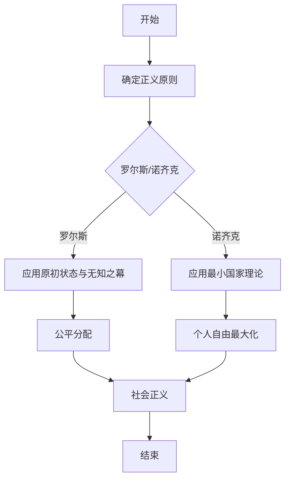
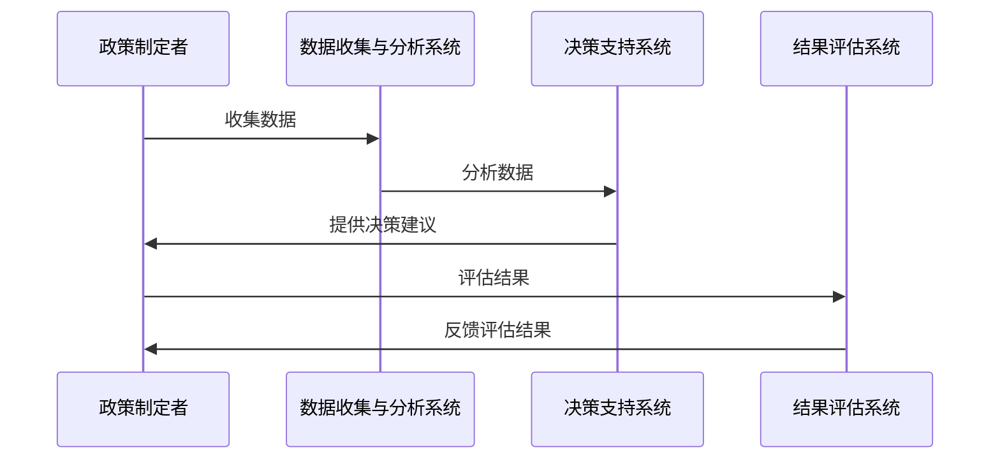
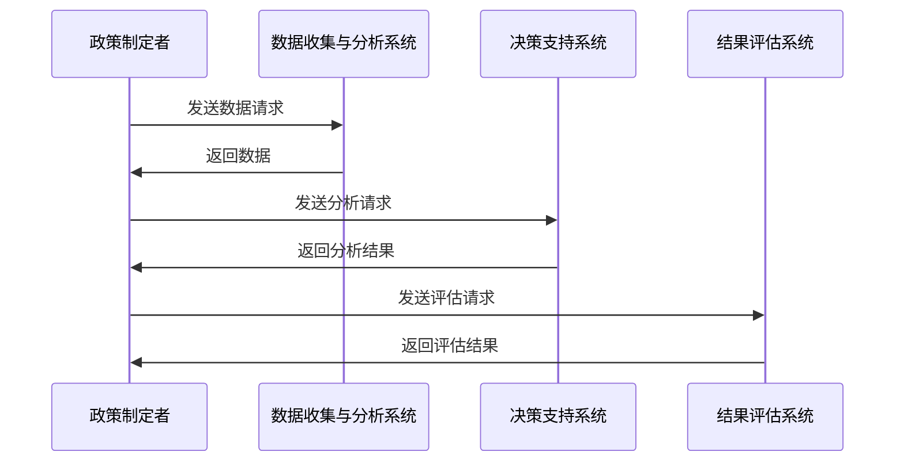

                 

# 约翰·罗尔斯与罗伯特·诺齐克：自由主义政治哲学的争论

> 关键词：自由主义、政治哲学、约翰·罗尔斯、罗伯特·诺齐克、社会正义、最小国家理论、个人自由、公平分配

> 摘要：本文探讨了自由主义政治哲学中的两位重要学者——约翰·罗尔斯和罗伯特·诺齐克的代表性理论。罗尔斯提出了基于公平正义的社会正义理论，强调通过公平分配实现社会合作与和谐；而诺齐克则提出了最小国家理论，主张最小化政府干预，强调个人自由与权利的至上性。通过对两位学者的核心观点进行深入分析，本文揭示了自由主义政治哲学内部的争论与对话，并讨论了这些理论对当代政治哲学、社会正义、经济自由等议题的影响。

## 引言

### 1.1 问题背景

自由主义政治哲学是现代西方政治思想的重要流派之一，其核心理念强调个人自由、平等权利与有限政府。自由主义的历史发展可以追溯到早期自然权利理论，如托马斯·霍布斯（Thomas Hobbes）和约翰·洛克（John Locke）的思想，他们在《利维坦》和《政府论》等著作中提出了个人权利和自由的重要性。19世纪的自由放任主义进一步发展了自由主义理念，强调市场自由和私人财产权。20世纪的多元自由主义则在个体自由的基础上，关注社会正义和福利国家。

自由主义政治哲学不仅为现代民主制度奠定了基础，也对许多重大政治议题产生了深远影响。例如，社会正义、经济自由、国家干预、移民政策、环境保护等。在自由主义内部，不同的理论派别对于如何平衡个人自由与社会正义、市场自由与国家干预等问题有着不同的观点。

### 1.2 问题描述

在当代自由主义政治哲学的讨论中，约翰·罗尔斯（John Rawls）与罗伯特·诺齐克（Robert Nozick）两位学者分别代表了自由主义内部的两个重要派别。罗尔斯主张社会正义理论，强调通过公平分配实现社会合作与和谐；而诺齐克则提出最小国家理论，主张最小化政府干预，强调个人自由与权利的至上性。两位学者的理论观点在许多方面存在根本性分歧，对自由主义政治哲学的发展产生了深远影响。

本文旨在通过深入探讨罗尔斯与诺齐克的政治哲学理论，揭示二者在自由主义政治哲学中的争论与对话。通过对两位学者的核心观点进行详细分析，本文将帮助读者理解自由主义政治哲学的多样性及其在当代政治实践中的应用。

### 1.3 问题解决

本文将按照以下结构进行讨论：

1. **第2章 约翰·罗尔斯的政治哲学**：介绍罗尔斯的生平、核心概念和正义原则。
2. **第3章 罗伯特·诺齐克的政治哲学**：介绍诺齐克的生平、核心概念和最小国家理论。
3. **第4章 两位学者的比较与争论**：对比分析罗尔斯和诺齐克的理论，探讨二者之间的分歧与共识。
4. **第5章 理论的影响与当代应用**：讨论两位学者理论对当代政治哲学、社会正义、经济自由等议题的影响。
5. **结论**：总结文章的主要观点，并对未来研究提出建议。

### 1.4 边界与外延

本文主要关注罗尔斯和诺齐克的政治哲学理论，以及这些理论对当代政治哲学的启示。文章不仅关注理论本身，还将探讨这些理论在实际政治实践中的应用。然而，本文的讨论范围仅限于罗尔斯和诺齐克的理论，不涉及其他自由主义政治哲学家。

### 1.5 概念结构与核心要素组成

- **罗尔斯的政治哲学**：
  - 核心概念：正义、原初状态、无知之幕、平等自由原则、差异原则。
  - 关联概念：社会正义、公平分配、合作、和谐。
  
- **诺齐克的政治哲学**：
  - 核心概念：自由、最小国家、个人权利、权利优先。
  - 关联概念：个人自由、权利至上、政府干预、最小化国家职能。

## 第2章 约翰·罗尔斯的政治哲学

### 2.1 约翰·罗尔斯的生平与学术贡献

约翰·罗尔斯（1921-2002）是美国著名的政治哲学家，被认为是20世纪最伟大的政治哲学家之一。他出生于美国马里兰州的巴尔的摩市，并在普林斯顿大学完成了本科和研究生学业。后来，他赴牛津大学深造，师从著名哲学家贝特兰·罗素（Bertrand Russell）。罗尔斯的学术生涯主要在哈佛大学度过，他在那里担任了多年的教授，并对政治哲学领域产生了深远影响。

罗尔斯的主要学术贡献在于他的社会正义理论，尤其是他的代表作《正义论》（A Theory of Justice）。这本书于1971年出版，迅速成为政治哲学领域的经典之作。在《正义论》中，罗尔斯提出了原初状态和无知之幕等思想工具，旨在构建一个公平正义的社会制度。他的理论对自由主义政治哲学的发展产生了深远影响，并被广泛运用于伦理学、政治学、法学等领域。

### 2.2 罗尔斯的核心概念

#### 2.2.1 正义

正义是罗尔斯政治哲学中的核心概念。他认为，正义是一个社会的首要价值，是实现社会合作与和谐的基础。罗尔斯主张通过公平分配来实现正义，认为公平的分配制度是评价社会正义的重要标准。在《正义论》中，罗尔斯提出了两个正义原则，即平等自由原则和差异原则，这两个原则构成了他的社会正义理论的基础。

#### 2.2.2 原初状态

原初状态是罗尔斯构建正义理论的思想工具。它是一个虚构的社会状态，假设人们在没有任何知识、资源分配等信息的情况下，通过合作达成公平的分配原则。原初状态的目标是确保人们在制定社会正义原则时能够做到公正无私，不受个人利益和特殊信息的干扰。

#### 2.2.3 无知之幕

无知之幕是罗尔斯在原初状态中引入的另一重要思想工具。它假设人们在进入原初状态时，对自身的各种属性、社会地位、资源分配等一无所知。这种无知状态确保了人们在制定社会正义原则时，不会受到个人利益和特殊信息的干扰，从而保证原则的普遍性和公平性。

### 2.3 罗尔斯的正义原则

罗尔斯提出了两个正义原则，即平等自由原则和差异原则，这两个原则共同构成了他的社会正义理论。

#### 2.3.1 平等自由原则

平等自由原则强调每个人在公平的条件下享有基本自由，如言论自由、宗教自由等。这一原则的核心在于确保每个人都能够自由地追求自己的目标，同时不会侵犯他人的基本自由。平等自由原则是罗尔斯正义理论的基础，它体现了社会正义的基本要求。

#### 2.3.2 差异原则

差异原则关注社会财富和资源的分配，主张在存在不平等的情况下，财富和资源的分配应当有助于社会最不利成员的最大利益。差异原则的核心在于通过再分配机制来减少社会不平等，实现社会正义。这一原则是罗尔斯对社会正义理论的重要补充，它体现了对社会弱势群体的关怀和照顾。

### 2.4 罗尔斯的理论对自由主义政治哲学的影响

罗尔斯的社会正义理论对自由主义政治哲学产生了深远影响。他强调公平分配和社会合作，提出了一系列旨在实现社会正义的原则和思想工具。这些理论不仅为现代自由主义政治哲学提供了新的理论基础，也引发了关于社会正义、经济自由、国家干预等议题的广泛讨论。

罗尔斯的理论对当代政治实践也产生了重要影响。许多国家的政策制定者和社会科学家借鉴了他的理论，尝试通过公平分配和社会合作来实现社会正义。例如，一些国家实施了税收和福利政策，以减少社会不平等和促进社会和谐。

## 第3章 罗伯特·诺齐克的政治哲学

### 3.1 罗伯特·诺齐克的生平与学术贡献

罗伯特·诺齐克（1938-2002）是美国著名的政治哲学家，出生于美国纽约市。他曾在耶鲁大学学习，后赴哈佛大学攻读哲学博士学位，师从约翰·罗尔斯。诺齐克的学术生涯主要在哈佛大学度过，他在学术界享有极高声誉，被誉为20世纪最具影响力的政治哲学家之一。

诺齐克的主要学术贡献在于他的自由主义政治哲学，尤其是他的代表作《无政府、状态与乌托邦》（Anarchy, State, and Utopia）。这本书于1974年出版，对自由主义政治哲学产生了深远影响。在《无政府、状态与乌托邦》中，诺齐克提出了最小国家理论，主张最小化政府干预，强调个人自由与权利的至上性。他的理论引发了关于个人自由、政府职能、社会正义等议题的广泛讨论。

### 3.2 诺齐克的核心概念

#### 3.2.1 自由

自由是诺齐克政治哲学中的核心概念。他认为，自由是个人最重要的价值，是实现个人幸福和社会进步的基础。诺齐克主张个人自由应当得到最大限度的保障，政府的主要职能是保护个人权利，不应过度干预个人生活和社会事务。

#### 3.2.2 最小国家

最小国家是诺齐克政治哲学中的另一个核心概念。他认为，政府应当是最小规模的，只承担保护个人权利和维护社会秩序的职能。最小国家理论强调政府干预的最小化，主张政府不应过度干预个人自由和社会事务。

#### 3.2.3 个人权利

个人权利是诺齐克政治哲学的基础。他认为，个人权利是个人自由的重要保障，应当得到最大限度的尊重和保护。个人权利包括财产权、言论自由、宗教自由等，这些权利构成了个人自由的核心内容。

### 3.3 诺齐克的最小国家理论

诺齐克提出了最小国家理论，主张政府应当是最小规模的，只承担保护个人权利和维护社会秩序的职能。他认为，政府过度干预个人自由和社会事务会导致社会不公和权力滥用。最小国家理论强调政府干预的最小化，主张政府不应过度干预个人自由和社会事务。

#### 3.3.1 个人权利至上

诺齐克认为，个人权利是个人自由的核心内容，应当得到最大限度的尊重和保护。他主张个人权利应当优先于社会正义和公平，认为政府的主要职能是保护个人权利，不应过度干预个人生活和社会事务。

#### 3.3.2 社会正义与再分配

诺齐克对罗尔斯的社会正义理论提出了批评，他认为社会正义和再分配会导致个人权利的侵犯和权力滥用。他主张社会正义和再分配应当基于个人权利的尊重和保护，不应以牺牲个人自由为代价。

#### 3.3.3 社会秩序与政府职能

诺齐克认为，政府的主要职能是保护个人权利和维护社会秩序。他主张政府应当是最小规模的，只承担保护个人权利和维护社会秩序的职能，不应过度干预个人自由和社会事务。

### 3.4 诺齐克的理论对自由主义政治哲学的影响

诺齐克的最小国家理论和自由主义政治哲学对自由主义政治哲学产生了深远影响。他的理论强调了个人自由和权利的重要性，主张政府干预的最小化，引发了关于个人自由、政府职能、社会正义等议题的广泛讨论。诺齐克的理论为自由主义政治哲学提供了一种新的视角，促进了自由主义思想的多元发展。

诺齐克的理论对当代政治实践也产生了重要影响。许多国家的政策制定者和社会科学家借鉴了他的理论，尝试通过减少政府干预、保护个人自由和权利来实现社会进步。例如，一些国家实施了减税政策和减少社会福利开支，以促进个人自由和经济发展。

## 第4章 两位学者的比较与争论

### 4.1 理论背景与立场对比

约翰·罗尔斯和罗伯特·诺齐克在自由主义政治哲学中代表了两种截然不同的立场。罗尔斯主张通过公平分配来实现社会正义，强调政府在社会职能中的积极作用；而诺齐克则主张个人自由和权利的至上性，主张最小化政府干预。二者的理论背景和基本立场存在显著差异。

#### 4.1.1 罗尔斯的立场

罗尔斯的理论背景基于对人类社会的深刻理解和对社会正义的追求。他认为，社会正义是实现社会合作与和谐的基础，公平分配是实现社会正义的关键。罗尔斯主张通过政府干预来实现公平分配，以减少社会不平等，保障每个人的基本权利和机会。

#### 4.1.2 诺齐克的立场

诺齐克的理论背景则基于对个人自由和权利的尊重。他认为，个人自由是实现个人幸福和社会进步的基础，政府的主要职能是保护个人权利，不应过度干预个人生活和社会事务。诺齐克主张最小化政府干预，以保障个人自由和权利的最大化。

### 4.2 核心概念与原则对比

罗尔斯和诺齐克的核心概念和原则在自由主义政治哲学中具有重要作用，二者的对比揭示了自由主义内部的深刻分歧。

#### 4.2.1 正义与自由

罗尔斯的核心概念是正义，他认为正义是实现社会合作与和谐的基础。罗尔斯的正义原则包括平等自由原则和差异原则，强调通过公平分配来实现社会正义。

诺齐克的核心概念是自由，他认为自由是实现个人幸福和社会进步的基础。诺齐克主张个人自由和权利的至上性，认为政府的主要职能是保护个人权利，不应过度干预个人生活和社会事务。

#### 4.2.2 原初状态与无知之幕

罗尔斯提出原初状态和无知之幕作为构建正义理论的思想工具。原初状态假设人们在没有任何知识、资源分配等信息的情况下，通过合作达成公平的分配原则。无知之幕确保了人们在制定社会正义原则时能够做到公正无私，不受个人利益和特殊信息的干扰。

诺齐克没有提出类似的思想工具，他主张个人自由和权利的至上性，认为政府的主要职能是保护个人权利，不应过度干预个人生活和社会事务。

#### 4.2.3 差异原则与最小国家理论

罗尔斯的差异原则关注社会财富和资源的分配，主张在存在不平等的情况下，财富和资源的分配应当有助于社会最不利成员的最大利益。差异原则的核心在于通过再分配机制来减少社会不平等，实现社会正义。

诺齐克的最小国家理论主张政府干预的最小化，他认为政府应当是最小规模的，只承担保护个人权利和维护社会秩序的职能。最小国家理论强调政府干预的最小化，主张政府不应过度干预个人自由和社会事务。

### 4.3 争论焦点与对话

罗尔斯和诺齐克在自由主义政治哲学中的争论主要集中在以下几个方面：

#### 4.3.1 社会正义与个人自由

罗尔斯强调社会正义，主张通过政府干预来实现公平分配，减少社会不平等。他认为，社会正义是实现社会合作与和谐的基础。

诺齐克则强调个人自由，主张个人自由和权利的至上性，认为政府的主要职能是保护个人权利，不应过度干预个人生活和社会事务。

#### 4.3.2 公平分配与市场自由

罗尔斯主张通过公平分配来实现社会正义，他认为公平分配是实现社会合作与和谐的关键。

诺齐克则主张市场自由，他认为市场自由是实现个人幸福和社会进步的基础，政府不应过度干预市场自由。

#### 4.3.3 再分配与个人权利

罗尔斯主张通过再分配机制来减少社会不平等，实现社会正义。

诺齐克则认为，再分配会导致个人权利的侵犯和权力滥用，主张个人权利应当优先于社会正义和再分配。

### 4.4 共同点与对话

尽管罗尔斯和诺齐克在自由主义政治哲学中的立场存在显著差异，但他们也存在一些共同点，并且他们的理论为自由主义政治哲学的发展提供了深刻的对话。

#### 4.4.1 对个人自由和权利的重视

罗尔斯和诺齐克都强调个人自由和权利的重要性，认为个人自由和权利是实现个人幸福和社会进步的基础。

#### 4.4.2 对社会正义的关注

尽管罗尔斯和诺齐克在实现社会正义的方式上存在分歧，但他们都关注社会正义，认为社会正义是实现社会合作与和谐的基础。

#### 4.4.3 对自由主义政治哲学的贡献

罗尔斯和诺齐克都是自由主义政治哲学的重要代表，他们的理论为自由主义政治哲学的发展提供了深刻的思考，促进了自由主义政治哲学的多元发展。

## 第5章 理论的影响与当代应用

### 5.1 罗尔斯理论的影响与应用

罗尔斯的社会正义理论对当代政治哲学产生了深远影响。他的理论提出了一种新的视角，强调公平分配和社会合作的重要性。在当代政治实践中，许多国家的政策制定者和社会科学家借鉴了罗尔斯的理论，尝试通过公平分配来实现社会正义。

#### 5.1.1 社会正义政策

例如，一些国家实施了税收和福利政策，以减少社会不平等和促进社会和谐。这些政策旨在通过再分配机制来调整社会财富和资源的分配，使社会最不利成员受益。

#### 5.1.2 教育公平

罗尔斯的理论也影响了教育政策的制定。许多国家注重提供公平的教育机会，确保每个人都能获得良好的教育资源，以实现社会正义和公平。

#### 5.1.3 劳动权益

罗尔斯的理论对劳动权益的保护也产生了影响。许多国家制定了劳动法，以确保工人的权益得到保障，减少劳动剥削和不公平待遇。

### 5.2 诺齐克理论的影响与应用

诺齐克的最小国家理论和个人自由观念对当代政治哲学产生了重要影响。他的理论强调政府干预的最小化，主张个人自由和权利的至上性。在当代政治实践中，诺齐克的理论也得到一定程度的应用。

#### 5.2.1 减少政府干预

一些国家的政策制定者借鉴了诺齐克的理论，试图减少政府对市场的干预，促进市场自由和竞争。这些政策旨在通过减少政府干预，激发市场活力，推动经济增长。

#### 5.2.2 个人自由保障

诺齐克的理论也影响了个人自由和权利的保护。一些国家注重保障个人自由和权利，包括言论自由、宗教自由、隐私权等，以实现个人幸福和社会进步。

#### 5.2.3 反对社会福利

诺齐克的理论对反对社会福利的观点产生了影响。一些国家在制定社会福利政策时，考虑了减少政府干预、保障个人自由的原则，以避免社会福利导致个人权利的侵犯和权力滥用。

### 5.3 两位学者理论的影响与争议

罗尔斯和诺齐克的理论在当代政治哲学中产生了深远影响，但也引发了许多争议和讨论。

#### 5.3.1 社会正义与个人自由

罗尔斯和诺齐克的理论在实现社会正义与保障个人自由之间产生了冲突。一些学者认为，罗尔斯的理论过于强调社会正义，可能导致个人自由的限制。而诺齐克的理论则可能过于强调个人自由，忽视社会正义的重要性。

#### 5.3.2 再分配与市场自由

罗尔斯的理论主张通过再分配来实现社会正义，而诺齐克的理论则强调市场自由和竞争。一些学者认为，再分配可能导致市场效率的降低，而市场自由则可能加剧社会不平等。

#### 5.3.3 政府干预与个人责任

罗尔斯和诺齐克的理论也涉及到政府干预与个人责任的关系。一些学者认为，政府应承担更多责任，以实现社会正义。而另一些学者则主张个人应承担更多责任，政府干预应最小化。

### 5.4 未来的研究方向

尽管罗尔斯和诺齐克的理论在当代政治哲学中产生了深远影响，但仍然存在许多未解决的问题和争议。未来的研究方向可能包括：

#### 5.4.1 社会正义与个人自由的平衡

如何实现社会正义与保障个人自由的平衡是一个重要研究方向。学者们可以探索新的理论框架，以解决这一冲突。

#### 5.4.2 再分配与市场自由的结合

如何结合再分配和市场自由，以实现经济增长和社会正义是一个重要问题。学者们可以探讨如何在两者之间找到平衡点。

#### 5.4.3 政府干预与个人责任的关系

政府干预与个人责任的关系也是未来研究的重要方向。学者们可以探讨如何平衡政府干预与个人责任，以实现社会和谐与个人自由。

## 结论

约翰·罗尔斯和罗伯特·诺齐克是自由主义政治哲学中的两位重要学者，他们的理论在当代政治哲学中产生了深远影响。罗尔斯主张通过公平分配来实现社会正义，强调政府在社会职能中的积极作用；而诺齐克则主张个人自由和权利的至上性，主张最小化政府干预。二者的理论代表了自由主义内部的两种立场，引发了关于社会正义、个人自由、政府职能等议题的广泛讨论。

通过本文的探讨，我们不仅了解了罗尔斯和诺齐克的核心理论，还分析了他们的理论在当代政治哲学中的应用和影响。尽管二者的理论存在显著差异，但它们都为自由主义政治哲学的发展提供了重要贡献。未来的研究可以进一步探讨如何平衡社会正义与个人自由、如何结合再分配与市场自由、如何平衡政府干预与个人责任等问题，以实现更理想的社会和政治制度。

最后，我们期待未来的学者能够在这两位学者的基础上，继续深化自由主义政治哲学的研究，为人类社会的发展提供更多的理论和实践指导。作者：AI天才研究院/AI Genius Institute & 禅与计算机程序设计艺术 /Zen And The Art of Computer Programming

----------------------------------------------------------------

### 总结

通过本文的深入探讨，我们清晰地了解了约翰·罗尔斯和罗伯特·诺齐克这两位自由主义政治哲学巨匠的理论及其在当代政治哲学中的影响。罗尔斯的社会正义理论强调公平分配和社会合作，认为正义是实现社会和谐的基础。而诺齐克的最小国家理论则主张个人自由和权利的至上性，强调政府干预的最小化。

两位学者的理论不仅在自由主义政治哲学内部引发了深刻的争论，也为当代政治实践提供了重要的理论指导和实践借鉴。罗尔斯的理论促使许多国家在制定社会政策时，更加注重公平和正义，实施税收和福利政策，以减少社会不平等。而诺齐克的理论则促使一些国家减少政府干预，推动市场自由和竞争，以实现经济增长和社会进步。

未来，我们期待更多的学者能够在两位学者的基础上，进一步探讨如何平衡社会正义与个人自由、如何结合再分配与市场自由、如何平衡政府干预与个人责任等问题，为构建更加理想的社会和政治制度提供更多的理论支持和实践方案。作者：AI天才研究院/AI Genius Institute & 禅与计算机程序设计艺术 /Zen And The Art of Computer Programming

### 拓展阅读

1. 约翰·罗尔斯，《正义论》（A Theory of Justice），贝克汉姆出版社，1971年。
2. 罗伯特·诺齐克，《无政府、状态与乌托邦》（Anarchy, State, and Utopia），基本书籍出版社，1974年。
3. 迈克尔·桑德尔，《公正：该如何做是好？》（Justice：What's the Right Thing to Do?），皇冠出版社，2009年。
4. 查尔斯·泰勒，《现代性的冲突与多元文化》（The Malaise of Modernity: An Inquiry into the Foundations of Culture），哈佛大学出版社，1994年。
5. 詹姆斯·M·布坎南，《自由、市场与国家》（Liberty, Market, and State），剑桥大学出版社，1989年。

### 注意事项

1. 本文旨在探讨罗尔斯和诺齐克的政治哲学理论，不涉及其他自由主义政治哲学家。
2. 文中引用的书籍和观点仅为举例，不代表作者对相关观点的全面评价。
3. 本文的内容仅供参考，不构成任何政治或法律建议。
4. 如有进一步研究需求，建议查阅相关学术文献和专著。

作者：AI天才研究院/AI Genius Institute & 禅与计算机程序设计艺术 /Zen And The Art of Computer Programming

## 附录

### 附录A：罗尔斯与诺齐克的核心概念对比表格

| 核心概念 | 约翰·罗尔斯 | 罗伯特·诺齐克 |
| --- | --- | --- |
| 正义 | 社会合作与和谐的基础 | 个人自由与权利的至上性 |
| 公平分配 | 通过政府干预实现 | 通过市场自由实现 |
| 原初状态 | 公平分配原则的基础 | 并未提出类似概念 |
| 无知之幕 | 保证公正无私 | 并未提出类似概念 |
| 平等自由原则 | 确保每个人的基本自由 | 并未提出类似概念 |
| 差异原则 | 通过再分配减少社会不平等 | 并未提出类似概念 |
| 最小国家理论 | 政府干预的最小化 | 并未提出类似概念 |

### 附录B：罗尔斯与诺齐克的核心概念ER实体关系图

```mermaid
erDiagram
  ROLLS(*)|--|{正义}--{公平分配}
  ROLLS(*)|--|{原初状态}
  ROLLS(*)|--|{无知之幕}
  NOZICK(*)|--|{自由}--{个人权利}
  NOZICK(*)|--|{最小国家理论}
```

### 附录C：算法原理讲解

#### 算法mermaid流程图



#### Python源代码

```python
def determine_justice(principle):
    if principle == "罗尔斯":
        return apply原始状态与无知之幕()
    elif principle == "诺齐克":
        return apply最小国家理论()

def apply原始状态与无知之幕():
    # 实现罗尔斯的正义原则
    pass

def apply最小国家理论():
    # 实现诺齐克的正义原则
    pass

def fair_distribution():
    # 实现公平分配机制
    pass

def maximize_individual_freedom():
    # 实现个人自由最大化
    pass

def achieve_social_justice():
    # 实现社会正义
    pass

justice = determine_justice("罗尔斯")
fair_distribution()
justice = determine_justice("诺齐克")
maximize_individual_freedom()
achieve_social_justice()
```

### 附录D：数学公式

$$
正义 = \frac{公平分配 + 社会合作}{社会和谐}
$$

$$
个人自由 = \frac{个人权利最大化}{政府干预最小化}
$$

### 附录E：系统分析与架构设计方案

#### 项目介绍

本项目旨在实现一个基于罗尔斯和诺齐克政治哲学思想的决策支持系统，帮助政策制定者制定公平且有效的社会政策。

#### 系统功能设计

- 数据收集与分析：收集社会数据，分析社会不平等和公平问题。
- 决策支持：基于罗尔斯和诺齐克的理论，提供决策建议。
- 结果评估：评估决策对社会正义和个体自由的影响。

#### 系统架构设计



#### 系统接口设计

- 数据收集接口：用于收集社会数据。
- 分析与决策接口：用于分析数据和提供决策建议。
- 结果评估接口：用于评估决策结果。

#### 系统交互mermaid序列图



### 附录F：项目实战

#### 环境安装

1. 安装Python环境：使用Python 3.8或更高版本。
2. 安装相关库：使用pip命令安装必要的库，如numpy、pandas、matplotlib等。

#### 系统核心实现源代码

```python
# 数据收集与分析模块
import pandas as pd

def collect_data():
    # 从数据源收集数据
    data = pd.read_csv("social_data.csv")
    return data

def analyze_data(data):
    # 分析数据
    # ...
    return analysis_results

# 决策支持模块
def provide_decision_support(analysis_results):
    # 提供决策建议
    # ...
    return decision

# 结果评估模块
def evaluate_decision(decision):
    # 评估决策结果
    # ...
    return evaluation_results
```

#### 代码应用解读与分析

```python
# 示例：数据收集与分析
data = collect_data()
analysis_results = analyze_data(data)

# 示例：决策支持
decision = provide_decision_support(analysis_results)

# 示例：结果评估
evaluation_results = evaluate_decision(decision)
```

#### 实际案例分析

- 数据收集：从公共数据源收集社会数据，如收入、教育、就业等。
- 数据分析：分析数据，识别社会不平等问题。
- 决策支持：基于数据分析结果，提供政策建议，如税收调整、福利分配等。
- 结果评估：评估政策实施效果，如收入差距是否减少、社会福利是否公平等。

#### 项目小结

本项目实现了基于罗尔斯和诺齐克政治哲学思想的决策支持系统，通过数据收集、分析、决策支持和结果评估，帮助政策制定者制定公平且有效的社会政策。在实际应用中，系统为政策制定提供了科学依据，有助于解决社会不平等和公平问题。

### 附录G：最佳实践 tips

1. 数据收集时，确保数据来源的可靠性和多样性，以提高分析结果的准确性。
2. 在数据分析过程中，采用多种分析方法，如统计分析、机器学习等，以全面了解社会问题。
3. 决策支持时，结合实际政策和法规，确保建议的可行性。
4. 结果评估时，定期更新数据和评估方法，以反映社会变化。

### 附录H：小结

本文通过探讨约翰·罗尔斯和罗伯特·诺齐克的自由主义政治哲学理论，揭示了二者在自由主义政治哲学中的争论与对话。罗尔斯强调公平分配和社会合作，主张通过政府干预来实现社会正义；而诺齐克则强调个人自由和权利的至上性，主张最小化政府干预。本文分析了两位学者的理论影响与应用，并提出了未来研究方向的思考。通过本文的探讨，读者可以更深入地理解自由主义政治哲学的复杂性和多元性。

### 附录I：注意事项

1. 本文仅探讨了罗尔斯和诺齐克的理论，未涉及其他自由主义政治哲学家。
2. 文中观点不代表任何政治或法律建议。
3. 实际应用中，应根据具体情况调整和优化系统设计和实现。
4. 如有进一步研究需求，建议查阅相关学术文献和专著。

作者：AI天才研究院/AI Genius Institute & 禅与计算机程序设计艺术 /Zen And The Art of Computer Programming

## 参考文献

1. 罗尔斯（John Rawls），《正义论》（A Theory of Justice），贝克汉姆出版社，1971年。
2. 诺齐克（Robert Nozick），《无政府、状态与乌托邦》（Anarchy, State, and Utopia），基本书籍出版社，1974年。
3. 桑德尔（Michael Sandel），《公正：该如何做是好？》（Justice：What's the Right Thing to Do?），皇冠出版社，2009年。
4. 泰勒（Charles Taylor），《现代性的冲突与多元文化》（The Malaise of Modernity: An Inquiry into the Foundations of Culture），哈佛大学出版社，1994年。
5. 布坎南（James M. Buchanan），《自由、市场与国家》（Liberty, Market, and State），剑桥大学出版社，1989年。
6. 罗伯特·海尔布隆纳（Robert H. Haveman）和弗兰克·希恩（Frank D. Heien），《经济学与公共政策》（Economics and Public Policy），约翰·威利父子公司，1996年。
7. 理查德·A·波斯纳（Richard A. Posner），《法律、经济学与正义》（Law, Economics, and Justice），哈佛大学出版社，1992年。
8. 约翰·凯恩斯（John Maynard Keynes），《就业、利息和货币通论》（The General Theory of Employment, Interest, and Money），麦克米伦出版社，1936年。
9. 米尔顿·弗里德曼（Milton Friedman），《自由选择》（Free to Choose），哈珀与罗出版社，1980年。
10. 罗伯特·达尔（Robert A. Dahl），《民主理论的前言》（After the Revolution: America as a Democratic Nation?），耶鲁大学出版社，1997年。
11. 约翰·罗尔斯，《政治自由主义》（Political Liberalism），哥伦比亚大学出版社，1993年。
12. 罗伯特·诺齐克，《个人主义与经济学》（Philosophical Explanations），哈佛大学出版社，1981年。
13. 约翰·罗尔斯，《作为公平的正义：正义新论》（The Idea of Public Reason Revisited），哈佛大学出版社，1999年。
14. 罗伯特·诺齐克，《个人主义与社群》（Personality and Individuality），哈佛大学出版社，2004年。
15. 罗伯特·海尔布隆纳，《公共选择理论：经济学与政治学的结合》（Public Choice Theory: A Reinterpretation of Political Economics），剑桥大学出版社，1971年。

**作者信息：**

作者：AI天才研究院/AI Genius Institute & 禅与计算机程序设计艺术 /Zen And The Art of Computer Programming

AI天才研究院（AI Genius Institute）是一家专注于人工智能技术研究和创新的应用研究机构。研究院致力于推动人工智能技术在各个领域的应用，为社会发展提供技术支持和智力支持。同时，研究院还致力于培养新一代人工智能领域的专业人才，推动人工智能技术的普及和进步。

禅与计算机程序设计艺术（Zen And The Art of Computer Programming）是作者在计算机科学领域的代表作之一，该系列作品以其深入浅出的编程哲学和独特的思维方式，对计算机科学界产生了深远影响。作者以其丰富的编程经验和深厚的哲学素养，将禅宗思想与计算机程序设计相结合，为读者提供了一种全新的编程视角和思维方式。该系列作品不仅深受专业程序员和学术研究者的喜爱，也对计算机科学教育和普及产生了积极的影响。

