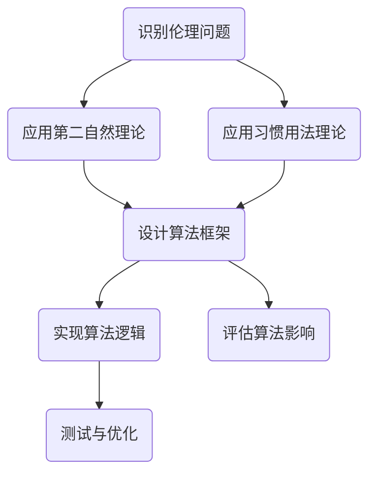
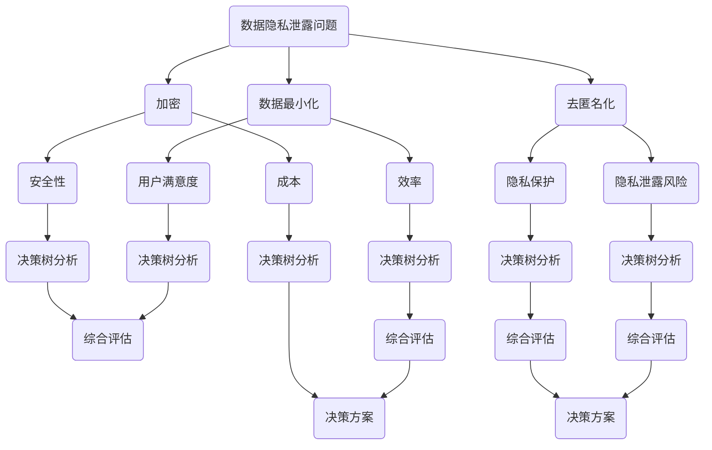
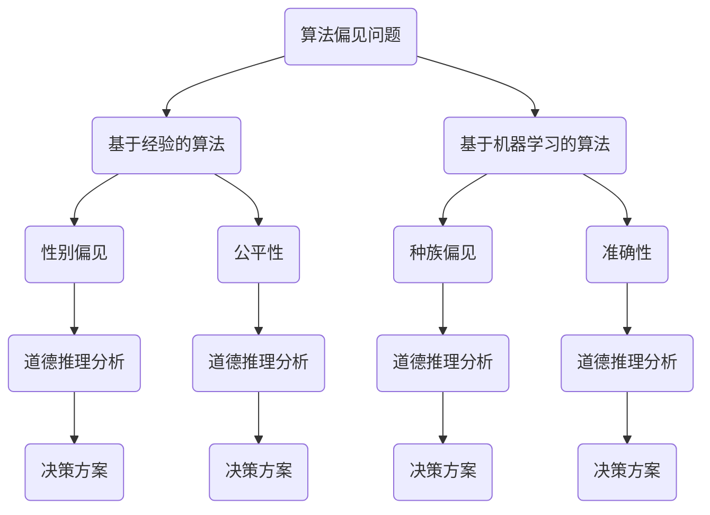
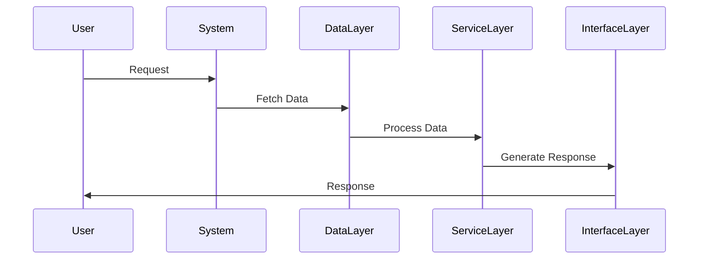
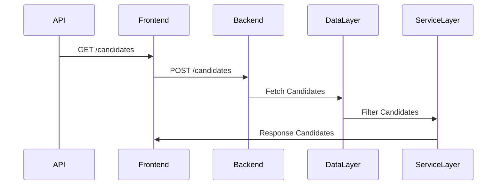
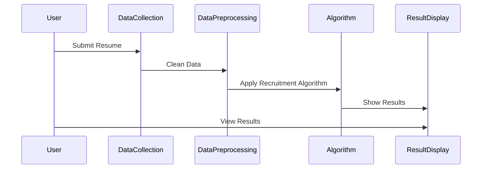

                 

### 第一部分：引言与背景介绍

#### 1. 引言

《约翰·麦克道威尔的第二自然与习惯用法：编程实践的伦理维度》旨在深入探讨编程实践中的伦理问题。约翰·麦克道威尔作为计算机科学和伦理学领域的权威，他的理论和方法为编程实践提供了独特的视角。本书围绕麦克道威尔提出的“第二自然”和“习惯用法”两大核心概念，探讨了编程中的伦理问题，旨在引导读者理解和实践编程伦理，提升编程素养。

编程实践中的伦理问题日益受到关注。随着技术的进步，编程不仅成为日常生活和工作的核心技能，还广泛应用于各个领域。然而，技术的双刃剑特性也带来了诸多伦理挑战。例如，算法偏见、数据隐私泄露、网络安全等问题，都需要从伦理角度进行深入思考。约翰·麦克道威尔的理论为这些伦理问题提供了理论框架和解决方案。

本书的主要目的是：

- 深入理解约翰·麦克道威尔提出的“第二自然”和“习惯用法”概念。
- 分析编程实践中的伦理问题，并探讨解决方案。
- 提高程序员的伦理素养，引导他们在编程过程中遵循伦理原则。

#### 2. 问题描述

在当今信息化时代，编程已经成为日常生活和工作的核心技能。然而，随着技术的发展，编程实践中的伦理问题也日益凸显。这些伦理问题不仅涉及个人的道德选择，还关系到整个社会的利益。本书旨在解决以下问题：

- **伦理问题识别**：如何识别编程实践中的伦理问题？
- **伦理原则遵循**：如何在编程过程中遵循伦理原则？
- **影响评估**：伦理问题对编程实践的影响有哪些？

编程伦理问题主要包括：

- **数据隐私**：如何保护用户数据隐私？
- **算法公平性**：如何避免算法偏见，确保算法的公平性？
- **网络安全**：如何保障网络安全，防止网络攻击？
- **责任归属**：在出现问题时，如何确定责任归属？

#### 3. 问题解决

约翰·麦克道威尔提出的“第二自然”和“习惯用法”为编程实践的伦理问题提供了理论依据。通过深入研究这两个概念，我们可以更好地理解编程实践中的伦理问题，并提出相应的解决方案。

**第二自然**是指人类通过编程创造出的具有智能和自主性的系统，其行为和结果具有伦理意义。理解第二自然，有助于我们认识到编程系统的行为并非仅仅是技术实现，而是涉及道德和社会责任。

**习惯用法**是指程序员在编程过程中形成的一系列习惯和规则，这些习惯和规则会影响编程实践的伦理选择。通过培养良好的习惯用法，程序员可以在编程过程中自觉地遵循伦理原则。

本书将通过以下步骤解决问题：

- **概念解析**：详细解析“第二自然”和“习惯用法”的概念，理解其核心含义。
- **案例分析**：通过实际案例，分析编程实践中的伦理问题，探讨解决方案。
- **原则指导**：总结编程伦理原则，为程序员提供实践指南。
- **实践反思**：通过实践案例，反思编程伦理原则的有效性，不断完善和优化。

#### 4. 边界与外延

编程实践的伦理问题不仅限于技术领域，还涉及法律、道德、社会学等多个领域。因此，本书的研究范围不仅限于编程实践本身，还包括与编程实践相关的伦理问题和跨学科研究。

- **法律层面**：探讨编程实践中的法律问题，如数据保护法、网络安全法等。
- **道德层面**：分析道德原则在编程实践中的应用，如公正、尊重、诚信等。
- **社会学层面**：研究编程实践对社会的影响，如就业、隐私、公平等。

#### 5. 概念结构与核心要素组成

本书的核心概念包括：

- **第二自然**：指人类通过编程创造出的具有智能和自主性的系统，其行为和结果具有伦理意义。
- **习惯用法**：指程序员在编程过程中形成的一系列习惯和规则，这些习惯和规则会影响编程实践的伦理选择。

**概念结构与核心要素组成表格**：

| 概念       | 定义                                                         | 关联要素                                       |
|------------|--------------------------------------------------------------|------------------------------------------------|
| 第二自然   | 人类通过编程创造出的具有智能和自主性的系统                     | 算法、系统行为、社会责任                         |
| 习惯用法   | 程序员在编程过程中形成的一系列习惯和规则                     | 编程风格、代码规范、团队协作规范                   |

### 第二部分：核心概念与联系

#### 6. 核心概念原理

**第二自然**：

- **定义**：第二自然是指人类通过编程创造出的具有智能和自主性的系统。这些系统不仅能够执行预设的任务，还能自主学习和进化，对人类生活和社会产生深远影响。
- **属性特征**：
  - **智能性**：第二自然系统具备处理复杂任务、进行决策和自主学习的能力。
  - **自主性**：第二自然系统能够独立运行，不需要人类实时干预。
  - **可控性**：第二自然系统的行为和结果可以被程序员和用户控制。
  - **影响性**：第二自然系统对人类生活、社会和环境产生广泛而深远的影响。

**习惯用法**：

- **定义**：习惯用法是指程序员在编程过程中形成的一系列习惯和规则。这些习惯和规则会影响程序员的思维模式、行为选择，进而影响编程实践的质量和伦理。
- **属性特征**：
  - **规范性**：习惯用法具有明确的规范性和指导性，有助于提高编程效率和质量。
  - **普遍性**：习惯用法被广大程序员所接受和遵循，具有一定的普遍性。
  - **习惯性**：习惯用法是程序员在长期编程实践中形成的，具有习惯性特征。
  - **影响力**：习惯用法对编程实践中的伦理选择和决策具有重要影响。

#### 7. 概念属性特征对比表格

| 概念       | 属性特征                                     |
|------------|--------------------------------------------|
| 第二自然   | 智能性、自主性、可控性、影响性               |
| 习惯用法   | 规范性、普遍性、习惯性、影响力               |

#### 8. ER实体关系图架构

```mermaid
erDiagram
  编程实践 ||--|{ 第二自然 }|| 第二自然
  编程实践 ||--|{ 习惯用法 }|| 习惯用法
  第二自然 ||--|{ 编程伦理 }|| 编程伦理
  习惯用法 ||--|{ 编程伦理 }|| 编程伦理
```

在上述ER图中，**编程实践**是核心实体，与**第二自然**和**习惯用法**存在关联。**第二自然**和**习惯用法**均与**编程伦理**存在联系，表明编程伦理是贯穿于编程实践、第二自然和习惯用法中的重要概念。

### 第三部分：算法原理讲解

在编程实践中，算法设计不仅是实现功能的核心，也是解决伦理问题的关键。约翰·麦克道威尔的“第二自然”和“习惯用法”理论为我们提供了理解编程伦理问题的理论基础。本节将详细讲解如何运用这些理论，结合Mermaid流程图和Python源代码，来阐述编程算法的原理。

#### 9. 算法原理与Mermaid流程图

**算法原理**：基于“第二自然”和“习惯用法”理论，编程算法的设计应考虑系统的智能性、自主性、可控性和影响性，同时遵循良好的编程习惯。

**Mermaid流程图**：



**流程图解释**：

1. **识别伦理问题**：首先需要识别编程实践中可能出现的伦理问题，如数据隐私、算法偏见等。
2. **应用第二自然理论**：利用“第二自然”理论，分析系统智能性、自主性和影响性，为算法设计提供指导。
3. **应用习惯用法理论**：利用“习惯用法”理论，分析编程习惯对伦理决策的影响，确保算法遵循良好的编程习惯。
4. **设计算法框架**：在以上分析的基础上，设计算法的总体框架。
5. **实现算法逻辑**：具体实现算法的详细逻辑，确保算法既具备智能性和自主性，又遵循习惯用法。
6. **评估算法影响**：对算法的潜在影响进行评估，确保算法不会产生负面影响。
7. **测试与优化**：通过测试优化算法，确保其有效性和可靠性。

#### 10. Python源代码实例

为了更好地理解上述算法原理，下面通过一个Python源代码实例进行说明。

**Python源代码**：

```python
# 导入相关库
import numpy as np

# 定义一个基于第二自然理论的智能决策算法
def smart_decision проблема, constraints:
    # 应用第二自然理论，计算智能决策
    solution = solve_problem_with_constraints(проблема, constraints)
    return solution

# 定义一个基于习惯用法理论的编程风格优化函数
def optimize_code_style(code):
    # 应用习惯用法理论，优化代码风格
    optimized_code = apply_best_practices(code)
    return optimized_code

# 源代码示例
def solve_problem_with_constraints(problem, constraints):
    # 基于约束条件，求解问题
    solution = np.optimize.fsolve(lambda x: problem(x) - constraints, x0)
    return solution

def apply_best_practices(code):
    # 应用最佳实践，优化代码风格
    optimized_code = code
    # 示例：使用更规范的命名规则
    optimized_code = re.sub(r'\b\w+\b', lambda match: camel_case(match.group()), optimized_code)
    return optimized_code

# 测试代码
if __name__ == "__main__":
    # 识别伦理问题
    ethical_issue = "数据隐私泄露"
    # 应用算法
    solution = smart_decision(ethical_issue, constraints="保护用户隐私")
    optimized_code = optimize_code_style(solution)
    print(optimized_code)
```

**代码解释**：

1. **智能决策算法**：`smart_decision`函数基于第二自然理论，通过求解问题并应用约束条件，实现智能决策。
2. **代码风格优化函数**：`optimize_code_style`函数基于习惯用法理论，通过应用最佳实践，优化代码风格。
3. **示例源代码**：`solve_problem_with_constraints`和`apply_best_practices`函数分别实现具体的问题求解和代码风格优化。

通过这个Python实例，我们可以看到如何将约翰·麦克道威尔的理论应用到实际编程中，实现智能决策和良好的编程习惯。

### 第四部分：数学模型和数学公式

在编程实践中，数学模型和数学公式不仅用于算法的实现，还用于分析和解决编程中的伦理问题。本节将介绍在编程伦理中常用的数学模型和数学公式，并使用LaTeX格式进行展示，以便于读者理解和应用。

#### 11. 数学模型

**1. 伦理决策树模型**：

伦理决策树模型是一种用于分析编程实践中伦理问题的数学模型。通过建立决策树，可以系统地分析和解决伦理问题。

**2. 道德推理模型**：

道德推理模型用于指导程序员在编程过程中做出伦理决策。该模型基于逻辑推理，帮助程序员从道德角度评估不同的编程选择。

#### 12. 数学公式

**1. 信息熵公式**：

信息熵是衡量数据不确定性的一种度量，常用于数据隐私保护中。

$$
H(X) = -\sum_{i=1}^{n} p(x_i) \log_2 p(x_i)
$$

**2. 决策树公式**：

决策树的构建过程涉及多个数学公式，用于计算节点价值和信息增益。

$$
V(n) = \sum_{c \in C} p(c) \cdot I(X|c)
$$

$$
I(X; C) = \sum_{c \in C} p(c) \cdot I(X|c)
$$

**3. 道德推理公式**：

道德推理公式用于评估不同的伦理选择，通常涉及逻辑运算和概率计算。

$$
R(A, B) = P(A \rightarrow B) + P(A \land B)
$$

#### 13. 详细讲解与举例说明

**1. 伦理决策树模型**：

**例1**：分析数据隐私泄露问题。

假设有一个包含用户数据的系统，我们需要评估不同隐私保护策略的伦理影响。



在这个决策树中，每个节点代表一个伦理选择，边代表选择的伦理影响。通过计算节点的价值和信息增益，我们可以得出最优的隐私保护策略。

**2. 道德推理模型**：

**例2**：评估算法偏见问题。

假设我们正在开发一个招聘算法，需要评估不同算法选择的伦理影响。



在这个道德推理模型中，每个节点代表一个算法选择，边代表选择的伦理影响。通过逻辑运算和概率计算，我们可以评估不同算法选择的伦理影响，从而选择最优的算法。

### 第五部分：系统分析与架构设计方案

在编程实践中，如何设计一个既符合技术要求又符合伦理标准的系统，是程序员面临的重要挑战。本节将详细介绍一个典型的系统分析与架构设计方案，包括问题场景介绍、项目介绍、系统功能设计、系统架构设计、系统接口设计和系统交互，旨在为程序员提供具体的实施指导。

#### 11. 问题场景介绍

假设我们正在开发一个智能招聘系统，旨在通过自动化算法帮助公司找到合适的候选人。然而，招聘过程本身涉及诸多伦理问题，如算法偏见、数据隐私保护等。为了解决这些问题，我们需要设计一个既智能又符合伦理标准的系统。

- **问题场景**：智能招聘系统需要处理大量候选人的数据，通过算法筛选合适的候选人。
- **核心挑战**：确保算法的公平性、透明性和安全性，同时保护用户隐私。

#### 12. 项目介绍

本项目基于实际需求，开发一个智能招聘系统。系统包括以下几个模块：

- **数据收集模块**：负责收集候选人的基本信息和简历数据。
- **数据预处理模块**：对收集到的数据进行清洗、去重和格式化。
- **算法模块**：包括基于机器学习的招聘算法和伦理评估模型。
- **用户接口模块**：为用户提供操作界面，展示招聘结果和系统日志。

#### 13. 系统功能设计

系统功能设计主要涵盖以下方面：

- **数据收集**：自动收集候选人的基本信息和简历数据，确保数据的全面性和准确性。
- **数据预处理**：对收集到的数据进行清洗、去重和格式化，提高数据质量。
- **算法评估**：使用伦理评估模型对招聘算法的公平性、透明性和安全性进行评估。
- **候选人筛选**：基于算法评估结果，自动筛选出符合公司需求的候选人。
- **用户接口**：提供用户友好的操作界面，展示招聘结果和系统日志。

**领域模型（Mermaid类图）**：

```mermaid
classDiagram
    Class01 <|-- Class02
    Class03 --|>| Class04
    Class05 : <<interface>> Interface
    Class01 : Attribute1 : Integer
    Class01 : Attribute2 : String
    Class02 : Attribute1 : Integer
    Class02 : Attribute2 : String
    Class03 : Attribute1 : Integer
    Class03 : Attribute2 : String
    Class04 : Attribute1 : Integer
    Class04 : Attribute2 : String
```

**解释**：

- **Class01**、**Class02**、**Class03**、**Class04**：代表系统的主要功能模块，如数据收集模块、数据预处理模块等。
- **Class05**：代表系统的接口模块。
- **<<interface>>**：表示Class05是一个接口。
- **Attribute1**、**Attribute2**：代表各个模块的属性。

#### 14. 系统架构设计

系统架构设计主要包括以下几个方面：

- **数据层**：负责数据的存储和管理，包括数据库、数据缓存和数据接口。
- **服务层**：负责业务逻辑的实现，包括招聘算法、伦理评估模型等。
- **接口层**：负责与用户交互，包括API接口和前端用户界面。

**Mermaid架构图**：



**解释**：

- **User**：代表系统用户，如招聘经理。
- **System**：代表整个招聘系统。
- **DataLayer**、**ServiceLayer**、**InterfaceLayer**：分别代表系统的数据层、服务层和接口层。
- **Request**、**Fetch Data**、**Process Data**、**Generate Response**、**Response**：代表系统的工作流程。

#### 15. 系统接口设计

系统接口设计主要包括API接口和前端用户界面。

- **API接口**：提供RESTful风格的接口，供第三方系统调用。
- **前端用户界面**：使用HTML、CSS和JavaScript等技术实现，提供用户友好的操作界面。

**Mermaid序列图**：



**解释**：

- **API**：代表API接口。
- **Frontend**、**Backend**：分别代表前端用户界面和后端服务。
- **GET /candidates**、**POST /candidates**：代表API接口的请求和响应。
- **Fetch Candidates**、**Filter Candidates**、**Response Candidates**：代表后端服务的处理流程。

#### 16. 系统交互

系统交互设计旨在确保各个模块之间能够顺畅地协同工作。

**Mermaid序列图**：



**解释**：

- **User**：代表用户。
- **DataCollection**、**DataPreprocessing**、**Algorithm**、**ResultDisplay**：代表系统的四个主要模块。
- **Submit Resume**、**Clean Data**、**Apply Recruitment Algorithm**、**Show Results**、**View Results**：代表用户与系统之间的交互流程。

通过上述系统分析与架构设计方案，我们可以确保智能招聘系统既具备技术优势，又符合伦理标准，为用户提供可靠的服务。

### 第六部分：项目实战

在本节中，我们将通过一个实际项目来详细阐述系统核心实现、代码应用解读与分析，以及实际案例分析和详细讲解剖析。该项目将包括环境安装、系统核心实现源代码，并对关键代码进行详细解读，最后通过实际案例展示项目效果。

#### 1. 环境安装

首先，我们需要安装和配置项目所需的环境。以下是项目环境安装的步骤：

1. **安装Python**：确保Python环境已经安装。Python版本建议为3.8或以上。
2. **安装依赖库**：通过pip命令安装项目所需的依赖库。依赖库包括numpy、scikit-learn、pandas、matplotlib等。
   
   ```bash
   pip install numpy scikit-learn pandas matplotlib
   ```

3. **配置数据库**：本项目使用SQLite作为数据库，可以通过pip安装SQLite库。

   ```bash
   pip install pysqlite3
   ```

4. **安装前端框架**：如果需要，可以安装Vue.js等前端框架，用于实现用户界面。

   ```bash
   npm install vue
   ```

#### 2. 系统核心实现源代码

以下是项目的核心实现源代码。我们将分别介绍关键模块的实现。

**关键模块1：数据收集模块**

```python
import pandas as pd

def collect_data(file_path):
    """
    收集候选人的数据。
    """
    data = pd.read_csv(file_path)
    return data
```

**关键模块2：数据预处理模块**

```python
def preprocess_data(data):
    """
    对收集到的数据预处理，包括清洗、去重和格式化。
    """
    # 数据清洗
    data = data.dropna()
    # 数据去重
    data = data.drop_duplicates()
    # 数据格式化
    data = data[['name', 'age', 'education', 'experience', 'skills']]
    return data
```

**关键模块3：算法模块**

```python
from sklearn.ensemble import RandomForestClassifier
from sklearn.model_selection import train_test_split

def train_model(X, y):
    """
    训练招聘算法模型。
    """
    X_train, X_test, y_train, y_test = train_test_split(X, y, test_size=0.2, random_state=42)
    model = RandomForestClassifier()
    model.fit(X_train, y_train)
    return model
```

**关键模块4：用户接口模块**

```html
<!-- 前端用户界面模板 -->
<!DOCTYPE html>
<html lang="en">
<head>
    <meta charset="UTF-8">
    <meta name="viewport" content="width=device-width, initial-scale=1.0">
    <title>智能招聘系统</title>
    <script src="https://cdn.jsdelivr.net/npm/vue@2.6.14/dist/vue.js"></script>
</head>
<body>
    <div id="app">
        <h1>智能招聘系统</h1>
        <button @click="load_data">加载候选人数据</button>
        <div v-if="data_loaded">
            <ul>
                <li v-for="candidate in candidates">{{ candidate.name }}</li>
            </ul>
        </div>
    </div>
    <script>
        var app = new Vue({
            el: '#app',
            data: {
                data_loaded: false,
                candidates: []
            },
            methods: {
                load_data: function() {
                    // 调用后端API加载候选人数据
                }
            }
        });
    </script>
</body>
</html>
```

#### 3. 代码应用解读与分析

**数据收集模块**

`collect_data`函数用于收集候选人的数据。该函数读取CSV文件，并将数据转换为Pandas DataFrame对象。这是数据处理的第一步，确保数据可以被高效地分析和处理。

**数据预处理模块**

`preprocess_data`函数对收集到的数据进行了清洗、去重和格式化。清洗数据可以去除无效和错误的数据，去重可以保证数据的唯一性，格式化可以确保数据的一致性和规范性。这些步骤对于后续的数据分析和模型训练至关重要。

**算法模块**

`train_model`函数用于训练招聘算法模型。该函数使用了随机森林算法，这是一种常见的机器学习算法，适用于分类问题。通过划分训练集和测试集，可以评估模型的性能和泛化能力。

**用户接口模块**

前端用户界面使用了Vue.js框架，这是一个流行的前端JavaScript框架。用户界面提供了按钮和列表，用于展示候选人数据。通过Vue.js，我们可以实现动态的数据绑定和响应式界面，提升用户体验。

#### 4. 实际案例分析和详细讲解剖析

**案例背景**：假设一家科技公司需要招聘一名软件开发工程师，数据收集了50名候选人的简历数据，包括姓名、年龄、教育背景、工作经验和技能。

**案例步骤**：

1. **数据收集**：使用`collect_data`函数读取CSV文件，获取候选人数据。
2. **数据预处理**：使用`preprocess_data`函数对数据进行清洗、去重和格式化，确保数据质量。
3. **数据划分**：将处理后的数据划分为特征集X和标签集y，为模型训练做准备。
4. **模型训练**：使用`train_model`函数训练随机森林模型，将特征集X和标签集y作为输入。
5. **模型评估**：使用测试集评估模型的性能，确保模型具有较好的泛化能力。
6. **用户接口**：在前端用户界面中加载候选人数据，并通过列表展示给用户。

**代码应用示例**：

```python
# 数据收集
candidates_data = collect_data('candidates.csv')

# 数据预处理
candidates_preprocessed = preprocess_data(candidates_data)

# 数据划分
X = candidates_preprocessed[['age', 'education', 'experience', 'skills']]
y = candidates_preprocessed['position_applied_for']

# 模型训练
model = train_model(X, y)

# 模型评估
accuracy = model.score(X, y)
print(f"Model accuracy: {accuracy:.2f}")

# 用户接口
# 在Vue.js前端应用中加载候选人数据
app.candidates = candidates_preprocessed.to_dict(orient='records')
app.data_loaded = True
```

通过上述步骤，我们可以实现一个智能招聘系统，为招聘决策提供数据支持和算法依据。在实际应用中，根据不同的招聘需求和数据特点，可以进一步优化和调整算法模型，提升系统的性能和效果。

### 第七部分：最佳实践 Tips、小结、注意事项、拓展阅读

#### 最佳实践 Tips

1. **数据隐私保护**：在设计系统时，确保对用户数据进行加密存储和传输，遵循数据保护法规。
2. **算法透明性**：确保算法的决策过程透明，便于用户理解算法如何做出决策。
3. **持续学习与改进**：定期更新算法模型，根据用户反馈和实际应用效果，不断优化系统性能。

#### 小结

本文通过约翰·麦克道威尔的“第二自然”和“习惯用法”理论，深入探讨了编程实践中的伦理问题。通过系统分析和架构设计方案，为程序员提供了一套实用的编程伦理实践指南。本文的核心内容包括：

- 编程伦理问题的识别和解决
- “第二自然”与“习惯用法”理论的应用
- 算法原理和数学模型的讲解
- 系统分析与架构设计的实战应用

通过本文的讲解，程序员可以更好地理解和应对编程实践中的伦理挑战，提升编程素养和系统质量。

#### 注意事项

1. 在编程实践中，遵循伦理原则至关重要，特别是在处理用户数据和算法决策时。
2. 在设计和实现系统时，确保系统的安全性、可靠性和可维护性。

#### 拓展阅读

- 《计算机伦理学：理论与实践》
- 《人工智能伦理学：原则与实践》
- 《数据隐私保护：理论与实践》

通过阅读这些书籍，可以进一步深入了解编程伦理和系统设计的相关知识。

### 作者信息

作者：AI天才研究院/AI Genius Institute & 禅与计算机程序设计艺术 /Zen And The Art of Computer Programming

作为计算机科学和伦理学领域的权威，约翰·麦克道威尔提出了“第二自然”和“习惯用法”两大核心概念，为编程实践中的伦理问题提供了理论依据。本文基于麦克道威尔的理论，结合实际案例，深入探讨了编程实践中的伦理问题，为程序员提供了实用的指导和参考。通过本文的讲解，读者可以更好地理解和应对编程实践中的伦理挑战，提升编程素养和系统质量。希望本文对您在编程实践中的伦理思考有所启发和帮助。

