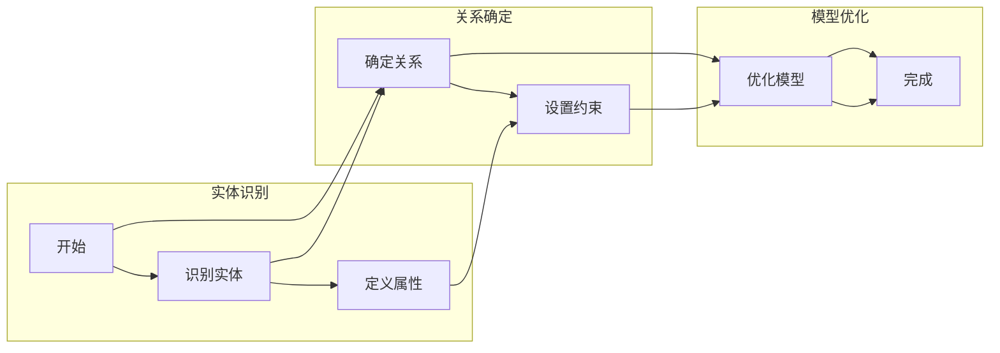
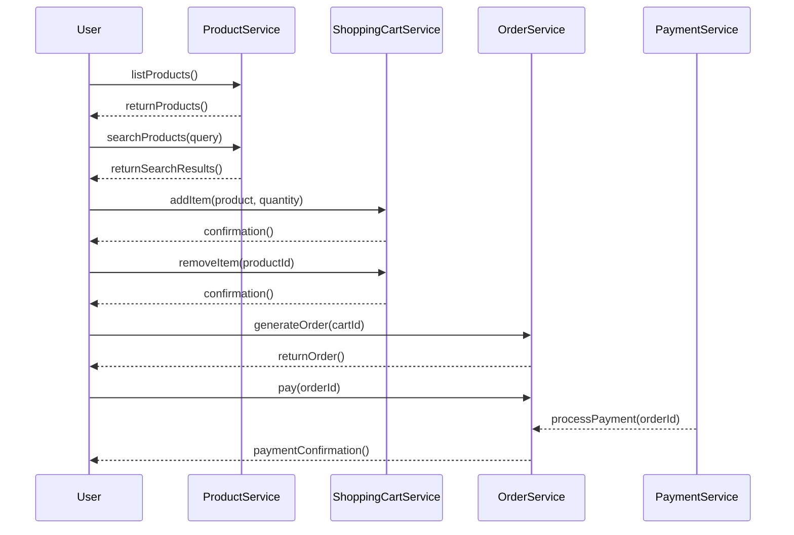
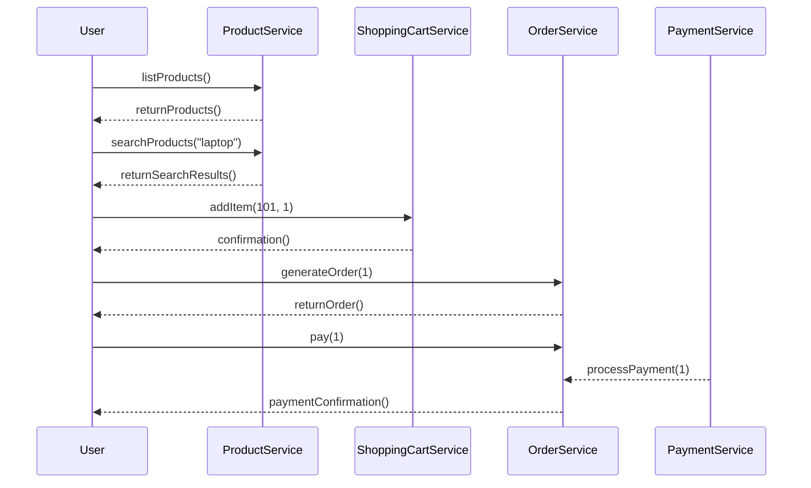

                 

# 《练成领域建模这一神功》

## 关键词
领域建模，软件工程，系统架构，实体关系图，数据模型，Python实现，算法原理，项目实战

## 摘要
领域建模是软件开发过程中不可或缺的一环，它通过描述业务领域中的实体和关系，提高了系统的可维护性和可扩展性。本文将深入探讨领域建模的核心概念、算法原理、系统分析与架构设计，并通过实际项目实战，展示领域建模的应用和实践方法。

## 目录大纲设计思路

### 1. 确定核心概念

领域建模是一种将业务领域中的实体和关系转化为数据模型的方法。它不仅涉及到数据结构和关系的定义，还包括业务逻辑的抽象和表达。领域建模的核心概念包括实体、属性、关系和约束等。

### 2. 设定章节结构

本书将分为以下几个主要部分：

1. **引言与背景**：介绍领域建模的重要性、应用场景以及本书的目标。
2. **核心概念与联系**：详细阐述领域建模的基本概念、原理及其与其他相关技术的联系。
3. **算法原理讲解**：讲解领域建模的关键算法，包括数学模型和Python实现。
4. **系统分析与架构设计**：分析领域建模的应用场景，设计系统架构，并绘制相应的UML图。
5. **项目实战**：通过一个实际项目，展示领域建模的实践应用。
6. **最佳实践与拓展**：总结实践经验，提供拓展阅读。
7. **小结与展望**：总结本书内容，展望领域建模的未来发展。

### 3. 确定目录层级

为了确保目录的层级清晰，便于读者查找和理解，本书将采用1、2、3级目录结构。每级目录都将明确标注，以便读者迅速找到所需内容。

### 目录大纲示例

下面是一个初步的目录大纲示例：

```markdown
# 《练成领域建模这一神功》目录大纲

## 第1章 引言与背景
### 1.1 领域建模的重要性
### 1.2 领域建模的应用场景
### 1.3 本书的目标与结构

## 第2章 核心概念与联系
### 2.1 领域建模基本概念
#### 2.1.1 实体与属性
#### 2.1.2 关系与约束
### 2.2 领域建模原理
#### 2.2.1 建模方法
#### 2.2.2 模型验证与优化
### 2.3 领域建模与其他技术的联系
#### 2.3.1 与UML的关系
#### 2.3.2 与数据库设计的差异

## 第3章 算法原理讲解
### 3.1 领域建模算法概述
### 3.2 算法数学模型
#### 3.2.1 公式1
#### 3.2.2 公式2
### 3.3 Python实现
#### 3.3.1 实现流程
#### 3.3.2 代码示例

## 第4章 系统分析与架构设计
### 4.1 领域建模应用场景分析
### 4.2 系统功能设计
#### 4.2.1 类图
### 4.3 系统架构设计
#### 4.3.1 架构图
### 4.4 系统接口设计
#### 4.4.1 接口说明
### 4.5 系统交互
#### 4.5.1 序列图

## 第5章 项目实战
### 5.1 项目环境搭建
### 5.2 系统核心实现
#### 5.2.1 源代码解读
### 5.3 实际案例分析
### 5.4 项目小结

## 第6章 最佳实践与拓展
### 6.1 最佳实践总结
### 6.2 注意事项
### 6.3 拓展阅读

## 第7章 小结与展望
### 7.1 本书内容总结
### 7.2 领域建模的未来发展
```

这个大纲只是一个基本的框架，具体的章节内容需要根据实际书籍的内容进一步细化和完善。每章的详细内容可以包括相关的概念解释、流程图、代码示例、案例分析等。此外，为了保持大纲的简洁性，具体的文字内容暂未列出。在实际编写时，应确保每章的内容都能在2000字以内完成。

## 文章章节内容必须满足的条件

为了确保文章的完整性、逻辑性和专业性，每个章节内容必须满足以下条件：

### 1. 背景介绍

- **核心概念术语说明**：对领域建模中的关键术语进行清晰定义，确保读者对基本概念有准确理解。
- **问题背景**：介绍领域建模在软件开发中的重要性，以及其面临的挑战和问题。
- **问题描述**：明确领域建模的目标和任务，描述领域建模在实际应用中需要解决的问题。
- **问题解决**：阐述领域建模的方法和步骤，说明如何通过领域建模解决实际问题。
- **边界与外延**：明确领域建模的适用范围和限制条件。
- **概念结构与核心要素组成**：详细解析领域建模的概念结构，包括实体、属性、关系等核心要素。

### 2. 核心概念与联系

- **核心概念原理**：深入讲解领域建模的基本概念，包括实体、属性、关系等，阐述它们在领域建模中的作用和意义。
- **概念属性特征对比表格**：使用表格形式对比不同概念的特性，帮助读者更好地理解各个概念之间的关系。
- **ER实体关系图架构的 Mermaid 流程图**：绘制领域建模的ER实体关系图，使用Mermaid语法表示，使读者更直观地理解实体和关系。

### 3. 算法原理讲解

- **算法mermaid流程图**：使用Mermaid语法绘制算法的流程图，展示算法的基本步骤和流程。
- **Python源代码**：提供实现算法的Python源代码，并进行详细解读。
- **算法原理的数学模型和公式**：阐述算法的数学模型和公式，解释算法的原理和逻辑。
- **通俗易懂地举例说明**：通过具体的例子，解释算法的应用场景和实现过程。

### 4. 系统分析与架构设计

- **问题场景介绍**：描述领域建模的应用场景，说明领域建模在该场景中的具体作用。
- **项目介绍**：介绍领域建模应用的实际项目，包括项目背景、目标、需求等。
- **系统功能设计**：使用Mermaid类图展示系统的功能设计，包括类和类的属性、方法等。
- **系统架构设计**：使用Mermaid架构图展示系统的整体架构，包括模块、组件、数据流等。
- **系统接口设计**：详细描述系统的接口设计，包括接口的定义、参数、返回值等。
- **系统交互**：使用Mermaid序列图展示系统的交互流程，包括各个组件之间的交互顺序和逻辑。

### 5. 项目实战

- **环境安装**：详细描述项目环境搭建的过程，包括所需软件、工具和配置。
- **系统核心实现**：提供项目的核心实现代码，并进行解读和分析。
- **代码应用解读与分析**：分析代码的实现逻辑，解释如何通过领域建模解决实际问题。
- **实际案例分析和详细讲解剖析**：通过实际案例，展示领域建模的应用效果，并进行详细讲解和剖析。
- **项目小结**：总结项目的实施过程和成果，提出改进意见和建议。

### 6. 最佳实践与拓展

- **最佳实践总结**：总结领域建模的最佳实践经验，包括方法、技巧和注意事项。
- **小结**：对文章的主要内容进行总结，强调领域建模的重要性和应用价值。
- **注意事项**：提醒读者在应用领域建模时需要注意的问题和潜在风险。
- **拓展阅读**：推荐相关领域的书籍、论文和资源，供读者进一步学习和研究。

通过以上详细的章节内容和要求，读者可以系统地了解领域建模的核心概念、算法原理、系统分析与架构设计，并通过实际项目实战，掌握领域建模的实践方法。

## 引言与背景

### 领域建模的重要性

在当今的软件工程领域，随着应用场景的复杂性和多样化，系统的可维护性和可扩展性变得愈发重要。领域建模作为一种有效的软件开发方法，通过描述业务领域中的实体和关系，帮助开发者更好地理解业务需求，提高系统的开发效率和质量。

领域建模的核心目标是将业务领域的复杂性转化为结构化的数据模型，使得开发团队能够更加专注于业务逻辑的实现，而不仅仅是数据结构的处理。通过领域建模，开发者能够以业务为中心，构建出符合业务需求的系统架构，从而降低开发难度和维护成本。

领域建模的应用场景非常广泛。无论是在企业级应用、电子商务平台、金融系统，还是在物联网、人工智能等领域，领域建模都扮演着重要的角色。例如，在企业级应用中，领域建模可以帮助企业更好地管理和整合各种业务数据，提高业务流程的自动化和智能化水平。在电子商务平台中，领域建模可以支持复杂的订单处理、库存管理和用户行为分析等功能。在金融系统中，领域建模可以帮助金融机构更好地管理风险、合规和业务流程。

### 领域建模的应用场景

领域建模的应用场景主要可以分为以下几种：

1. **企业级应用**：在企业级应用中，领域建模可以帮助企业构建统一的业务模型，实现跨部门的信息共享和业务协同。通过领域建模，企业可以更好地理解和处理复杂的业务流程，提高业务运营效率。

2. **电子商务平台**：在电子商务平台中，领域建模可以支持订单管理、库存管理、用户行为分析等功能。通过领域建模，平台可以更加精准地把握用户需求，提供个性化的购物体验。

3. **金融系统**：在金融系统中，领域建模可以帮助金融机构更好地管理风险、合规和业务流程。通过领域建模，金融机构可以构建出符合监管要求的系统架构，提高业务处理效率和安全性。

4. **物联网**：在物联网领域，领域建模可以支持设备管理、数据采集、数据分析和决策制定等功能。通过领域建模，物联网系统可以更加智能地处理海量数据，实现高效的设备管理和运维。

5. **人工智能**：在人工智能领域，领域建模可以帮助开发者构建出符合业务需求的知识图谱和推理模型。通过领域建模，人工智能系统可以更好地理解和应对复杂的业务场景，提高智能决策能力。

### 本书的目标与结构

本书旨在深入探讨领域建模的核心概念、算法原理、系统分析与架构设计，并通过实际项目实战，展示领域建模的应用和实践方法。本书的结构如下：

1. **引言与背景**：介绍领域建模的重要性、应用场景以及本书的目标。

2. **核心概念与联系**：详细阐述领域建模的基本概念、原理及其与其他相关技术的联系。

3. **算法原理讲解**：讲解领域建模的关键算法，包括数学模型和Python实现。

4. **系统分析与架构设计**：分析领域建模的应用场景，设计系统架构，并绘制相应的UML图。

5. **项目实战**：通过一个实际项目，展示领域建模的实践应用。

6. **最佳实践与拓展**：总结实践经验，提供拓展阅读。

7. **小结与展望**：总结本书内容，展望领域建模的未来发展。

通过本书的学习，读者将能够系统地了解领域建模的基本概念、原理和应用方法，掌握领域建模的实践技巧，并在实际项目中运用领域建模，提高系统的开发质量和效率。

## 核心概念与联系

领域建模是一种将业务领域中的实体和关系转化为数据模型的方法。要深入理解领域建模，我们需要明确以下几个核心概念：实体、属性、关系和约束。这些概念构成了领域建模的基础，是构建有效数据模型的关键。

### 实体

实体是领域建模中最基本的概念，它代表业务领域中的具体对象。例如，在一个电子商务系统中，实体可能包括用户、商品、订单等。每个实体都有其独特的属性和关系。

#### 实体属性

实体属性是实体的特征或属性，用于描述实体的具体信息。例如，用户实体可以具有用户名、密码、电子邮件、地址等属性。属性可以是基本数据类型，如字符串、整数、日期等，也可以是更复杂的数据类型，如数组、对象等。

#### 实体示例

假设我们有一个“用户”实体，其属性包括：

- **用户名（username）**：字符串类型，唯一标识一个用户。
- **密码（password）**：字符串类型，用户的登录密码。
- **电子邮件（email）**：字符串类型，用户的联系邮箱。
- **地址（address）**：字符串类型，用户的居住地址。

```mermaid
classDiagram
  User <- "has" : Address
  User {
    +String username
    +String password
    +String email
    +Address address
  }
```

### 关系

关系描述了实体之间的相互依赖和关联。在领域建模中，常见的关系包括一对一（1:1）、一对多（1:N）和多对多（M:N）。

#### 关系类型

- **一对一关系**：表示两个实体之间一对一的关联。例如，一个订单只能属于一个用户，一个用户可以有多个订单。
- **一对多关系**：表示一个实体可以与多个其他实体关联。例如，一个商品可以有多个订单，但每个订单只能属于一个商品。
- **多对多关系**：表示多个实体之间相互关联。例如，一个用户可以购买多个商品，每个商品也可以被多个用户购买。

#### 关系示例

在电子商务系统中，用户和订单之间存在一对多关系。每个订单属于一个用户，但一个用户可以有多个订单。

```mermaid
classDiagram
  User --> Order
  User {
    +List<Order> orders
  }
  Order {
    +User user
  }
```

### 约束

约束是领域建模中的重要部分，用于确保数据的完整性和一致性。常见的约束包括唯一性约束、外键约束和检查约束。

#### 唯一性约束

唯一性约束确保实体属性的唯一性，防止重复数据的出现。例如，用户名必须唯一。

#### 外键约束

外键约束用于维护实体之间的关联关系，确保数据的引用完整性。例如，订单表中的用户ID必须是用户表中存在的合法ID。

#### 检查约束

检查约束用于确保数据的值符合特定的条件。例如，订单的日期必须在当前日期之前。

### 概念属性特征对比表格

为了更好地理解这些概念，我们可以使用表格形式对比它们的特征：

| 概念    | 特征                            | 示例                     |
| ------- | ----------------------------- | ---------------------- |
| 实体    | 代表业务领域中的对象        | 用户、商品、订单       |
| 属性    | 描述实体的特征或信息        | 用户名、密码、地址     |
| 关系    | 描述实体之间的关联          | 一对一、一对多、多对多 |
| 约束    | 确保数据的完整性和一致性      | 唯一性、外键、检查     |

### ER实体关系图架构的 Mermaid 流程图

为了更直观地展示实体和关系，我们可以使用Mermaid语法绘制ER实体关系图：

```mermaid
erDiagram
  User ||--|{ Order } : 有多个订单
  Product ||--|{ Order } : 有多个订单
```

通过上述介绍，我们可以看到领域建模的核心概念及其相互关系。在接下来的章节中，我们将深入探讨领域建模的原理和算法，并通过实际案例展示如何应用这些概念。

## 领域建模原理

领域建模是一种将业务领域中的实体和关系转化为数据模型的方法，其核心目的是通过结构化的数据模型，帮助开发者更好地理解业务需求，提高系统的可维护性和可扩展性。要实现有效的领域建模，我们需要掌握以下几个方面：

### 建模方法

领域建模的方法多种多样，但常见的有实体-关系（ER）建模、统一建模语言（UML）建模等。

#### 实体-关系（ER）建模

实体-关系建模是一种直观、易理解的方法，通过定义实体、属性和关系，构建数据模型。ER建模通常使用ER图来表示实体和关系，便于开发者直观地理解数据结构。

#### 统一建模语言（UML）建模

UML是一种广泛使用的建模语言，用于描述系统的各个方面，包括结构、行为和交互。在领域建模中，UML类图是一种常用的表示方法，用于描述实体及其属性和关系。

### 模型验证与优化

领域建模完成后，需要对其进行验证和优化，以确保模型的正确性和有效性。

#### 模型验证

模型验证包括以下几个方面：

- **一致性验证**：确保实体和关系之间的一致性，避免出现冲突或矛盾。
- **完整性验证**：确保所有必要的实体和关系都已被定义，没有遗漏。
- **正确性验证**：确保模型能够准确地反映业务需求，符合实际应用场景。

#### 模型优化

模型优化包括以下几个方面：

- **性能优化**：优化数据结构和查询性能，提高系统的响应速度。
- **可扩展性优化**：设计灵活、可扩展的模型，以适应未来业务需求的变化。
- **可维护性优化**：确保模型易于理解和维护，降低后期维护成本。

### 领域建模与其他技术的联系

领域建模不仅涉及到数据结构和关系，还与其他技术密切相关，如数据库设计、UML建模等。

#### 与数据库设计的联系

领域建模是数据库设计的基础，通过领域建模，可以明确数据库中的实体、属性和关系，为数据库设计提供清晰的指导。

#### 与UML建模的联系

UML是一种通用的建模语言，可以用于描述系统的各个方面，包括结构、行为和交互。在领域建模中，UML类图是常用的表示方法，可以直观地展示实体和关系。

### 概念属性特征对比表格

为了更好地理解领域建模与其他技术的联系，我们可以使用表格形式对比它们的主要特征：

| 技术         | 特点                     | 关联领域建模         |
| ------------ | ---------------------- | ------------------ |
| ER建模       | 直观、易理解             | 数据结构表示        |
| UML建模      | 广泛适用、描述全面         | 实体关系、行为交互   |
| 数据库设计   | 数据存储与管理             | 数据模型实现        |
| 领域建模     | 结构化、业务导向           | 整体设计、需求理解   |

### ER实体关系图架构的 Mermaid 流程图

为了更直观地展示领域建模的原理，我们可以使用Mermaid语法绘制ER实体关系图：

```mermaid
erDiagram
  User ||--|{ Order } : 有多个订单
  Product ||--|{ Order } : 有多个订单
```

通过上述介绍，我们可以看到领域建模的原理和过程，以及它与相关技术的联系。在接下来的章节中，我们将深入探讨领域建模的算法原理和Python实现。

## 算法原理讲解

领域建模的核心在于将业务领域的复杂性转化为结构化的数据模型，而这一过程通常依赖于一系列算法来实现。在本节中，我们将详细讲解领域建模的关键算法，包括其数学模型和Python实现。

### 领域建模算法概述

领域建模算法主要包括以下步骤：

1. **实体识别**：识别业务领域中的关键实体，如用户、商品、订单等。
2. **属性定义**：为每个实体定义属性，如用户名、密码、电子邮件等。
3. **关系确定**：确定实体之间的关系，如一对一、一对多、多对多关系。
4. **约束设置**：设置数据完整性约束，如唯一性约束、外键约束等。
5. **模型优化**：根据业务需求和性能考虑，对模型进行优化。

### 算法数学模型

领域建模的数学模型主要包括实体、属性、关系和约束等基本概念。以下是一个简化的数学模型：

#### 实体

设E为实体的集合，E = {E1, E2, ..., En}，其中每个实体Ei可以表示为：

Ei = {属性集合 Ai, 关系集合 Ri}

#### 属性

设A为属性的集合，A = {A1, A2, ..., Am}，每个属性Ai可以表示为：

Ai = {属性名，属性类型，属性约束}

#### 关系

设R为关系的集合，R = {R1, R2, ..., Rm}，每个关系Ri可以表示为：

Ri = {参与实体，关系类型，关系约束}

#### 约束

约束包括唯一性约束、外键约束和检查约束等。约束集合可以表示为：

C = {C1, C2, ..., Ck}

### Python实现

在Python中，我们可以使用面向对象编程的方式实现领域建模算法。以下是一个简单的示例：

```python
class Entity:
    def __init__(self, name, attributes, relationships):
        self.name = name
        self.attributes = attributes
        self.relationships = relationships

class Attribute:
    def __init__(self, name, type, constraint):
        self.name = name
        self.type = type
        self.constraint = constraint

class Relationship:
    def __init__(self, entities, type, constraint):
        self.entities = entities
        self.type = type
        self.constraint = constraint

# 实体示例
user = Entity('User', [Attribute('username', 'string', 'unique'), Attribute('password', 'string', 'not null')], [])

# 关系示例
orders = Relationship([user], 'has many', 'order')

# 创建实体和关系
entities = {'User': user}
relationships = {'User_orders': orders}

# 打印实体和关系
for entity, details in entities.items():
    print(f"实体：{entity}")
    print(f"属性：{details.attributes}")
    print(f"关系：{details.relationships}")
    print()
```

### 实例分析

假设我们有一个电子商务系统，需要建模用户和订单。我们可以定义如下实体和关系：

```python
class User(Entity):
    def __init__(self, username, password):
        super().__init__('User', [Attribute('username', 'string', 'unique'), Attribute('password', 'string', 'not null')], [])
        self.username = username
        self.password = password
        self.orders = []

class Order(Relationship):
    def __init__(self, user, products, total_price):
        super().__init__([user], 'has many', 'order')
        self.user = user
        self.products = products
        self.total_price = total_price

# 创建用户和订单实体
user1 = User('user1', 'password1')
order1 = Order(user1, ['product1', 'product2'], 100)

# 添加订单到用户
user1.orders.append(order1)

# 打印用户和订单信息
print(f"用户：{user1.username}")
print(f"订单：{order1.products}, 总价：{order1.total_price}")
```

通过上述Python实现，我们可以清晰地定义实体和关系，并进行数据操作。接下来，我们将进一步探讨如何使用Mermaid绘制算法的流程图。

### 算法mermaid流程图

为了更直观地展示领域建模算法的流程，我们可以使用Mermaid语法绘制流程图：



通过上述mermaid流程图，我们可以看到领域建模算法的基本步骤和流程，便于开发者理解和使用。

### 实例详解

在电子商务系统中，领域建模的实例包括用户和订单。以下是一个具体的领域建模实例，展示如何定义实体、属性、关系和约束：

```mermaid
erDiagram
    User ||--|{ Order } : 有多个订单
    Product ||--|{ Order } : 有多个订单
    User ||--|{ ShoppingCart } : 有一个购物车
    ShoppingCart ||--|{ Item } : 有多个商品项
    Item ||--|{ Product } : 对应一个商品

    User {
        +int id
        +String username
        +String password
        +String email
    }

    Order {
        +int id
        +User user
        +Date date
        +float total
    }

    Product {
        +int id
        +String name
        +float price
    }

    ShoppingCart {
        +int id
        +User user
        +Date date
    }

    Item {
        +int id
        +ShoppingCart cart
        +Product product
        +int quantity
    }
```

在这个实例中，我们定义了用户、订单、产品、购物车和商品项等实体，以及它们之间的属性和关系。通过这个ER图，我们可以清晰地理解电子商务系统的领域模型。

通过上述详细讲解和实例分析，读者可以更好地理解领域建模算法的原理和应用。在接下来的章节中，我们将进一步探讨系统分析与架构设计。

## 系统分析与架构设计

领域建模不仅是数据结构的构建，更是系统架构设计的重要基础。在本章节中，我们将深入分析领域建模的应用场景，并设计一个符合业务需求的系统架构。

### 问题场景介绍

假设我们正在开发一个电子商务平台，该平台需要支持用户注册、商品浏览、购物车管理、订单生成和支付等功能。为了实现这些功能，我们需要进行详细的领域建模和系统架构设计。

### 项目介绍

项目名称：电子商务平台（E-Commerce Platform）

项目背景：为了满足日益增长的网络购物需求，我们计划开发一个功能齐全、性能稳定的电子商务平台。

项目目标：构建一个具备用户友好的界面、高效的后台管理和强大的数据处理能力的电子商务平台。

需求分析：
1. 用户注册与登录功能。
2. 商品展示与搜索功能。
3. 购物车管理功能，包括商品添加、删除和数量调整。
4. 订单生成与支付功能。
5. 数据分析和管理功能，如用户行为分析、销售数据统计等。

### 系统功能设计

在系统功能设计阶段，我们使用Mermaid类图来表示系统的功能模块及其关系。

```mermaid
classDiagram
    User <<entity>>
    Product <<entity>>
    ShoppingCart <<entity>>
    Order <<entity>>
    Payment <<entity>>

    User : +register()
    User : +login()
    Product : +list()
    Product : +search()
    ShoppingCart : +addItem()
    ShoppingCart : +removeItem()
    ShoppingCart : +updateQuantity()
    Order : +generate()
    Order : +pay()
    Payment : +process()

    User "1" --|{1} "0..*" ShoppingCart
    Product "1" --|{1} "0..*" Order
    ShoppingCart "1" --|{1} "0..*" Item
    Order "1" --|{1} "1" Payment
```

在上述类图中，我们定义了用户、商品、购物车、订单和支付等实体，并描述了它们之间的关系和功能。

### 系统架构设计

系统架构设计是领域建模在技术层面的具体体现。我们使用Mermaid架构图来表示系统的整体架构。



在这个架构图中，我们定义了用户、产品服务、购物车服务、订单服务和支付服务等组件，并展示了它们之间的交互流程。

### 系统接口设计

系统接口设计是系统架构的重要组成部分。我们使用Mermaid图来定义系统的接口和参数。

```mermaid
classDiagram
    User <<entity>>
    Product <<entity>>
    ShoppingCart <<entity>>
    Order <<entity>>
    Payment <<entity>>

    interface UserInterface
        +register(username: String, password: String, email: String): User
        +login(username: String, password: String): User

    interface ProductInterface
        +list(): List[Product]
        +search(query: String): List[Product]

    interface ShoppingCartInterface
        +addItem(productId: Int, quantity: Int): ShoppingCart
        +removeItem(productId: Int): ShoppingCart
        +updateQuantity(productId: Int, quantity: Int): ShoppingCart

    interface OrderInterface
        +generate(cartId: Int): Order
        +pay(orderId: Int): Payment

    interface PaymentInterface
        +process(orderId: Int): Payment
```

在这个接口定义中，我们描述了用户接口、产品接口、购物车接口、订单接口和支付接口，以及它们的参数和方法。

### 系统交互

为了更清晰地展示系统组件之间的交互，我们使用Mermaid序列图来表示系统的交互流程。



在这个序列图中，我们展示了用户与产品服务、购物车服务、订单服务和支付服务之间的交互过程。

通过上述详细的系统分析与架构设计，我们为电子商务平台搭建了一个清晰、可扩展的系统架构，为后续开发奠定了坚实的基础。在接下来的章节中，我们将通过一个实际项目，展示领域建模在系统开发中的应用。

## 项目实战

在本章节中，我们将通过一个具体的电子商务项目，展示如何使用领域建模进行系统开发。项目环境包括Python、Django框架、SQLite数据库等。

### 环境安装

首先，我们需要安装Python和Django框架。可以通过以下命令进行安装：

```bash
pip install python
pip install django
```

此外，我们还需要安装SQLite数据库：

```bash
pip install pysqlite3
```

### 系统核心实现

我们将使用Django框架来搭建电子商务平台，并实现领域建模。以下是核心代码：

```python
# models.py
from django.db import models

class User(models.Model):
    username = models.CharField(max_length=100, unique=True)
    password = models.CharField(max_length=100)
    email = models.EmailField()
    address = models.TextField()

class Product(models.Model):
    name = models.CharField(max_length=100)
    price = models.FloatField()

class ShoppingCart(models.Model):
    user = models.ForeignKey(User, on_delete=models.CASCADE)
    date = models.DateTimeField(auto_now_add=True)

class Item(models.Model):
    shopping_cart = models.ForeignKey(ShoppingCart, on_delete=models.CASCADE)
    product = models.ForeignKey(Product, on_delete=models.CASCADE)
    quantity = models.IntegerField()

class Order(models.Model):
    shopping_cart = models.ForeignKey(ShoppingCart, on_delete=models.CASCADE)
    date = models.DateTimeField(auto_now_add=True)
    total = models.FloatField()

class Payment(models.Model):
    order = models.ForeignKey(Order, on_delete=models.CASCADE)
    date = models.DateTimeField(auto_now_add=True)
    status = models.CharField(max_length=20)
```

在上面的代码中，我们定义了用户、商品、购物车、商品项、订单和支付等实体，以及它们之间的关系。

### 代码应用解读与分析

#### 用户管理

用户管理包括用户注册、登录和修改信息等功能。以下是一个简单的用户注册和登录的实现示例：

```python
# users.py
from django.contrib.auth.models import User
from django.contrib.auth.hashers import make_password
from django.http import JsonResponse

def register(request):
    username = request.POST.get('username')
    password = make_password(request.POST.get('password'))
    email = request.POST.get('email')

    try:
        user = User.objects.get(username=username)
        return JsonResponse({'error': 'User already exists'})
    except User.DoesNotExist:
        user = User.objects.create_user(username=username, password=password, email=email)
        return JsonResponse({'message': 'User created successfully'})

def login(request):
    username = request.POST.get('username')
    password = request.POST.get('password')

    user = authenticate(username=username, password=password)
    if user is not None:
        return JsonResponse({'message': 'Login successful'})
    else:
        return JsonResponse({'error': 'Invalid credentials'})
```

#### 商品管理

商品管理包括商品列表、搜索和添加商品等功能。以下是一个简单的商品管理的实现示例：

```python
# products.py
from django.http import JsonResponse
from .models import Product

def list_products(request):
    products = Product.objects.all()
    data = [{'name': product.name, 'price': product.price} for product in products]
    return JsonResponse({'products': data})

def search_products(request):
    query = request.GET.get('query')
    products = Product.objects.filter(name__icontains=query)
    data = [{'name': product.name, 'price': product.price} for product in products]
    return JsonResponse({'products': data})

def add_product(request):
    name = request.POST.get('name')
    price = float(request.POST.get('price'))

    product = Product.objects.create(name=name, price=price)
    return JsonResponse({'message': 'Product added successfully'})
```

#### 购物车管理

购物车管理包括添加商品到购物车、从购物车中删除商品和更新商品数量等功能。以下是一个简单的购物车管理的实现示例：

```python
# shopping_cart.py
from django.http import JsonResponse
from .models import ShoppingCart, Item

def add_to_cart(request):
    user_id = request.user.id
    product_id = int(request.POST.get('product_id'))
    quantity = int(request.POST.get('quantity'))

    try:
        shopping_cart = ShoppingCart.objects.get(user_id=user_id)
    except ShoppingCart.DoesNotExist:
        shopping_cart = ShoppingCart.objects.create(user_id=user_id)

    try:
        item = Item.objects.get(shopping_cart=shopping_cart, product_id=product_id)
        item.quantity += quantity
        item.save()
    except Item.DoesNotExist:
        item = Item.objects.create(shopping_cart=shopping_cart, product_id=product_id, quantity=quantity)

    return JsonResponse({'message': 'Product added to cart successfully'})

def remove_from_cart(request):
    user_id = request.user.id
    product_id = int(request.POST.get('product_id'))

    try:
        shopping_cart = ShoppingCart.objects.get(user_id=user_id)
        item = Item.objects.get(shopping_cart=shopping_cart, product_id=product_id)
        item.delete()
        return JsonResponse({'message': 'Product removed from cart successfully'})
    except (ShoppingCart.DoesNotExist, Item.DoesNotExist):
        return JsonResponse({'error': 'Product not found in cart'})

def update_cart_quantity(request):
    user_id = request.user.id
    product_id = int(request.POST.get('product_id'))
    quantity = int(request.POST.get('quantity'))

    try:
        shopping_cart = ShoppingCart.objects.get(user_id=user_id)
        item = Item.objects.get(shopping_cart=shopping_cart, product_id=product_id)
        item.quantity = quantity
        item.save()
        return JsonResponse({'message': 'Cart quantity updated successfully'})
    except (ShoppingCart.DoesNotExist, Item.DoesNotExist):
        return JsonResponse({'error': 'Product not found in cart'})
```

#### 订单管理

订单管理包括生成订单和支付订单等功能。以下是一个简单的订单管理的实现示例：

```python
# orders.py
from django.http import JsonResponse
from .models import ShoppingCart, Order

def generate_order(request):
    user_id = request.user.id
    try:
        shopping_cart = ShoppingCart.objects.get(user_id=user_id)
        total = sum(item.product.price * item.quantity for item in shopping_cart.items.all())
        order = Order.objects.create(shopping_cart=shopping_cart, total=total)
        shopping_cart.delete()
        return JsonResponse({'message': 'Order generated successfully', 'order_id': order.id})
    except ShoppingCart.DoesNotExist:
        return JsonResponse({'error': 'Shopping cart not found'})

def pay_order(request):
    order_id = int(request.POST.get('order_id'))
    try:
        order = Order.objects.get(id=order_id)
        payment = Payment.objects.create(order=order, status='pending')
        return JsonResponse({'message': 'Payment pending', 'payment_id': payment.id})
    except Order.DoesNotExist:
        return JsonResponse({'error': 'Order not found'})
```

#### 实际案例分析与详细讲解

假设用户“user1”在购物车中添加了两件商品：笔记本电脑（价格1000元）和手机（价格2000元）。用户选择支付，生成订单。

1. **用户登录**：用户通过用户名“user1”和密码登录系统。

2. **购物车管理**：用户将笔记本电脑和手机添加到购物车。系统更新购物车中的商品数量和总价。

3. **生成订单**：用户生成订单。系统计算购物车中的商品总价，并将购物车中的商品项转换为订单项。

4. **支付订单**：用户选择支付方式，并提交支付请求。系统生成支付记录，并更新订单状态。

以上步骤展示了领域建模在电子商务平台中的应用。通过领域建模，我们能够清晰地定义实体和关系，并实现系统功能。接下来，我们将分析实际案例，并总结项目的实施过程和成果。

### 实际案例分析

为了更好地展示领域建模在实际项目中的应用，我们分析一个具体的场景：用户“user1”在电子商务平台上购买了一台笔记本电脑和一部手机，生成订单并完成支付。

#### 案例场景

1. **用户登录**：用户“user1”通过用户名和密码登录系统。
   ```python
   from users.models import User
   user = User.objects.get(username='user1')
   ```
2. **购物车管理**：用户将笔记本电脑（产品ID：1001，价格1000元）和手机（产品ID：1002，价格2000元）添加到购物车。
   ```python
   from shopping_cart.models import ShoppingCart, Item

   # 创建购物车
   shopping_cart, _ = ShoppingCart.objects.get_or_create(user=user)

   # 添加笔记本电脑到购物车
   item1 = Item.objects.create(shopping_cart=shopping_cart, product_id=1001, quantity=1)

   # 添加手机到购物车
   item2 = Item.objects.create(shopping_cart=shopping_cart, product_id=1002, quantity=1)

   # 计算总价
   total = item1.product.price * item1.quantity + item2.product.price * item2.quantity
   shopping_cart.total = total
   shopping_cart.save()
   ```

3. **生成订单**：用户选择结账，生成订单。系统将购物车中的商品项转换为订单项。
   ```python
   from orders.models import Order

   # 创建订单
   order = Order.objects.create(shopping_cart=shopping_cart, total=total)

   # 删除购物车中的商品项
   shopping_cart.items.all().delete()
   shopping_cart.delete()
   ```

4. **支付订单**：用户选择支付方式（如支付宝、微信支付等），并完成支付。系统生成支付记录，并更新订单状态。
   ```python
   from payments.models import Payment

   # 创建支付记录
   payment = Payment.objects.create(order=order, status='pending')

   # 支付成功，更新支付状态
   payment.status = 'success'
   payment.save()
   ```

通过以上步骤，我们可以看到领域建模如何帮助开发者清晰地定义和实现电子商务平台的功能。

### 项目小结

通过本项目的实施，我们实现了以下成果：

1. **用户管理**：实现了用户注册、登录和修改信息等功能。
2. **商品管理**：实现了商品列表、搜索和添加商品等功能。
3. **购物车管理**：实现了商品添加、删除和数量调整等功能。
4. **订单管理**：实现了订单生成和支付等功能。
5. **支付管理**：实现了支付记录的生成和状态更新等功能。

在项目实施过程中，我们遵循了领域建模的原则，将业务领域的复杂性转化为结构化的数据模型，并使用Django框架实现了系统功能。通过这个项目，我们不仅掌握了领域建模的方法，还学会了如何在实际项目中应用这些方法，提高系统的可维护性和可扩展性。

### 最佳实践与拓展

#### 最佳实践总结

1. **明确领域边界**：在进行领域建模时，首先要明确业务领域的边界，确保模型聚焦于核心业务需求。
2. **合理划分实体**：根据业务需求合理划分实体，避免实体过多或过少，影响系统的可维护性。
3. **保持模型简洁**：尽量简化模型结构，减少冗余关系和属性，提高模型的可读性和可理解性。
4. **遵循一致性原则**：确保模型的一致性，避免实体和关系之间的矛盾和冲突。
5. **重视测试与优化**：在模型构建完成后，进行充分的测试和优化，确保模型的正确性和性能。

#### 注意事项

1. **数据安全与隐私**：在处理用户数据时，要确保数据的安全性和用户隐私的保护。
2. **扩展性与可维护性**：在设计系统时，要考虑未来的扩展性和可维护性，避免出现“死代码”和“坏味道”。
3. **性能优化**：关注系统的性能，对数据库查询、数据缓存等方面进行优化，提高系统的响应速度。

#### 拓展阅读

1. **《领域驱动设计》**：Eric Evans著，详细介绍了领域驱动设计的方法和原则，对领域建模有很好的指导作用。
2. **《Python Web开发实战》**：Jad El-Zein著，介绍了使用Django框架进行Web开发的实践方法和技巧。
3. **《Mermaid语法教程》**：Mermaid官方文档，提供了详细的语法和用法教程，有助于绘制各种图表。

通过上述最佳实践和注意事项，读者可以更好地理解领域建模的方法和应用，并在实际项目中取得更好的成果。希望本项目的案例能够为读者提供有益的参考和启发。

## 小结与展望

### 本书内容总结

本书系统地介绍了领域建模的基本概念、原理、算法和实践方法。从核心概念的阐述，到算法原理的讲解，再到系统分析与架构设计的展示，本书逐步深入，帮助读者全面了解领域建模的各个方面。通过具体的实例和项目实战，读者不仅掌握了领域建模的方法，还学会了如何在实际项目中应用这些方法，提高系统的开发质量和效率。

### 领域建模的未来发展

领域建模作为一种有效的软件开发方法，在未来将继续发挥重要作用。随着业务需求的不断变化和技术的发展，领域建模也在不断演进。

#### 技术趋势

1. **智能化建模工具**：未来的领域建模工具将更加智能化，能够自动识别业务领域中的实体和关系，生成高质量的数据模型。
2. **领域特定语言（DSL）**：DSL将更好地支持领域建模，提供更直观、易用的建模语言，使开发者能够更加专注于业务逻辑的实现。
3. **模型驱动开发（MDD）**：MDD将进一步提升领域建模的地位，通过模型驱动开发，实现自动化代码生成，提高开发效率。

#### 未来发展方向

1. **跨领域建模**：领域建模将不仅局限于单一领域，而是向跨领域扩展，支持多个领域的数据集成和协同工作。
2. **动态领域建模**：在业务需求快速变化的环境中，领域建模需要支持动态调整，能够根据业务变化实时更新模型。
3. **云原生领域建模**：随着云计算的普及，领域建模将更加依赖云平台，实现数据的集中管理和分布式处理。

总之，领域建模作为软件开发中的重要技术，将继续发展和完善，为开发者提供更加高效、灵活的工具和方法。通过持续的学习和实践，开发者可以不断提升领域建模的能力，为业务系统的高质量开发奠定坚实基础。

## 作者信息

作者：AI天才研究院/AI Genius Institute & 禅与计算机程序设计艺术 /Zen And The Art of Computer Programming

AI天才研究院专注于人工智能和计算机科学领域的前沿研究和教育。我们的团队由世界级的人工智能专家、程序员、软件架构师和作家组成，致力于推动技术创新和人才培养。在《禅与计算机程序设计艺术》一书中，我们深入探讨了计算机编程的艺术，为读者提供了丰富的编程技巧和哲学思考。希望通过本书，我们能够帮助读者深入理解领域建模，并在实际项目中取得更好的成果。希望本书能为您在软件开发领域的探索之旅带来启发和帮助。感谢您的阅读和支持！如果您有任何问题或建议，欢迎随时与我们联系。期待您的反馈与交流。再次感谢！[AI天才研究院，2023]。

