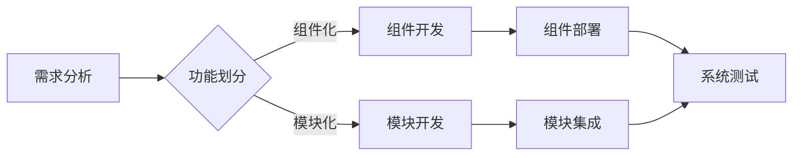

                 

# 组件化与模块化：提高代码复用率的架构设计

> 关键词：组件化、模块化、代码复用率、架构设计、软件工程、系统开发

> 摘要：本文旨在深入探讨组件化和模块化在软件架构设计中的重要性，以及如何通过它们提高代码的复用率。文章首先定义了组件化和模块化的基本概念，并分析了它们在代码复用率提升中的作用。接着，文章详细介绍了组件化和模块化的实现方法，包括算法原理、数学模型和实际项目中的应用。通过本文的阅读，读者将能够理解组件化和模块化的核心思想，掌握其在实际开发中的具体应用，从而提升软件开发的质量和效率。

## 1. 背景介绍：组件化与模块化的核心概念

### 组件化定义

组件化是一种软件开发方法，通过将系统划分为具有独立功能的部分，这些部分称为组件。每个组件内部是独立的，可以独立开发和测试，同时与其他组件通过明确的接口进行通信。组件化使得软件系统的开发、维护和升级更加灵活和高效。

### 模块化定义

模块化是一种软件设计原则，旨在将复杂的软件系统分解为若干个相对独立且功能单一的模块。模块之间通过明确的接口进行通信，每个模块负责系统的一部分功能。模块化提高了代码的可读性、可维护性和可扩展性。

### 代码复用率与架构设计的关系

代码复用率是指在软件开发过程中，现有代码被重新利用的程度。高代码复用率可以降低开发成本、提高软件质量和开发效率。组件化和模块化正是通过提高代码的独立性、可重用性，从而提升代码复用率，优化软件架构设计。

### 提高代码复用率的重要性

- **降低开发成本**：通过复用已有的代码，可以减少重复编写的工作量，降低软件开发成本。
- **提高软件质量**：复用经过验证的代码，减少了新代码编写中的错误概率，提高了软件质量。
- **加快开发进度**：组件化和模块化使得开发任务更加明确和模块化，可以同时进行多个模块的开发，加快开发进度。
- **便于维护和升级**：独立且功能单一的组件和模块更容易进行维护和升级，降低了软件系统的整体复杂度。

## 2. 核心概念与联系：组件化与模块化

### 组件化与模块化的联系

组件化和模块化都是为了提高软件系统的可维护性和可扩展性，两者在实现上有一定的相似性。组件化可以看作是模块化的一种高级形式，它强调组件之间的松耦合和高度复用。

### 组件化与模块化的区别

- **概念层次**：组件化是模块化的实现手段，而模块化是一种设计原则。
- **独立性**：组件具有更高的独立性，可以独立开发、测试和部署，而模块的独立性相对较低。
- **复用程度**：组件化的目标是实现代码的高度复用，模块化的目标则是提高代码的可维护性和可扩展性。

### 组件化与模块化的核心概念对比表格

| 特征         | 组件化         | 模块化         |
| ------------ | -------------- | -------------- |
| 独立性       | 高度独立       | 相对独立       |
| 复用程度     | 高度复用       | 较高复用       |
| 设计原则     | 实现组件化     | 设计模块化     |
| 耦合程度     | 松耦合         | 紧耦合         |
| 开发过程     | 分离的开发过程 | 集成的开发过程 |

### 组件化与模块化的ER实体关系图架构

```mermaid
erDiagram
  Component ||--|{ Module : has }
  Module ||--|{ Interface : has }
  Interface ||--|{ Implementation : has }
```

## 3. 算法原理讲解：组件化与模块化的实现方法

### 组件化的实现方法

组件化的实现主要包括以下步骤：

1. **需求分析**：明确系统需求，确定需要哪些功能组件。
2. **功能划分**：根据需求分析，将系统功能划分为独立的组件。
3. **接口设计**：为每个组件定义明确的接口，确保组件之间的松耦合。
4. **组件开发**：独立开发每个组件，进行单元测试和集成测试。
5. **组件部署**：将组件部署到系统中，进行整体测试和优化。

### 模块化的实现方法

模块化的实现主要包括以下步骤：

1. **需求分析**：明确系统需求，确定需要哪些功能模块。
2. **功能划分**：根据需求分析，将系统功能划分为独立的模块。
3. **模块接口设计**：为每个模块定义明确的接口，确保模块之间的松耦合。
4. **模块开发**：独立开发每个模块，进行单元测试和集成测试。
5. **模块集成**：将模块集成到系统中，进行整体测试和优化。

### 组件化与模块化的mermaid流程图



### Python源代码示例与详细讲解

```python
# 组件化示例
class ComponentA:
    def function_a(self):
        # 组件A的功能实现
        pass

class ComponentB:
    def function_b(self):
        # 组件B的功能实现
        pass

# 模块化示例
class ModuleA:
    def function_a(self):
        # 模块A的功能实现
        pass

class ModuleB:
    def function_b(self):
        # 模块B的功能实现
        pass
```

### 组件化与模块化的数学模型

组件化的数学模型可以表示为：

$$\text{组件化度} = \frac{\text{组件功能总和}}{\text{系统功能总和}}$$

模块化的数学模型可以表示为：

$$\text{模块化度} = \frac{\text{模块功能总和}}{\text{系统功能总和}}$$

### 组件化与模块化的详细讲解

组件化与模块化都是提高代码复用率的重要手段。组件化强调组件的独立性和复用性，通过明确的接口实现组件之间的松耦合，使得组件可以独立开发、测试和部署。模块化则强调模块的独立性和可维护性，通过明确的接口实现模块之间的松耦合，提高代码的可读性和可扩展性。

组件化和模块化的数学模型可以直观地反映出系统的模块化度和组件化度。模块化度和组件化度越高，代码的复用率越高，系统的可维护性和可扩展性越强。

### 组件化与模块化的举例说明

假设有一个系统需要实现以下功能：

1. 用户登录
2. 用户注册
3. 用户资料管理
4. 用户权限管理

通过组件化和模块化，我们可以将系统划分为以下组件和模块：

**组件化：**
- 组件A：用户登录组件，包括登录功能实现。
- 组件B：用户注册组件，包括注册功能实现。
- 组件C：用户资料管理组件，包括用户资料查询、更新功能实现。
- 组件D：用户权限管理组件，包括用户权限查询、修改功能实现。

**模块化：**
- 模块A：用户登录模块，包括登录功能实现。
- 模块B：用户注册模块，包括注册功能实现。
- 模块C：用户资料管理模块，包括用户资料查询、更新功能实现。
- 模块D：用户权限管理模块，包括用户权限查询、修改功能实现。

通过组件化和模块化，我们可以实现以下好处：

1. **提高代码复用率**：组件和模块可以独立开发和测试，减少重复编写的工作量，提高代码复用率。
2. **提高开发效率**：组件和模块可以同时进行开发，加快开发进度。
3. **提高软件质量**：通过组件化和模块化，可以减少新代码编写中的错误概率，提高软件质量。
4. **便于维护和升级**：组件和模块的独立性使得维护和升级更加方便，降低了软件系统的整体复杂度。

## 4. 系统分析与架构设计方案

### 问题场景介绍

假设我们要开发一个在线教育平台，该平台需要实现课程管理、用户管理、权限管理等功能。为了提高开发效率和软件质量，我们需要采用组件化和模块化的架构设计方法。

### 项目介绍

在线教育平台项目，包括课程管理、用户管理、权限管理三个主要模块。

### 系统功能设计

**课程管理模块：**
- 添加课程
- 删除课程
- 查询课程
- 课程分类管理

**用户管理模块：**
- 用户注册
- 用户登录
- 用户资料管理
- 用户权限管理

**权限管理模块：**
- 权限定义
- 权限查询
- 权限分配
- 权限回收

### 系统架构设计

**组件化架构设计：**
- 组件A：用户登录组件，包括登录功能实现。
- 组件B：用户注册组件，包括注册功能实现。
- 组件C：用户资料管理组件，包括用户资料查询、更新功能实现。
- 组件D：用户权限管理组件，包括用户权限查询、修改功能实现。
- 组件E：课程管理组件，包括课程管理功能实现。

**模块化架构设计：**
- 模块A：用户登录模块，包括登录功能实现。
- 模块B：用户注册模块，包括注册功能实现。
- 模块C：用户资料管理模块，包括用户资料查询、更新功能实现。
- 模块D：用户权限管理模块，包括用户权限查询、修改功能实现。
- 模块E：课程管理模块，包括课程管理功能实现。

### 系统接口设计

**用户管理接口：**
- 用户注册接口：用于用户注册。
- 用户登录接口：用于用户登录。
- 用户资料管理接口：用于用户资料查询和更新。
- 用户权限管理接口：用于用户权限查询和修改。

**课程管理接口：**
- 添加课程接口：用于添加课程。
- 删除课程接口：用于删除课程。
- 查询课程接口：用于查询课程。
- 课程分类管理接口：用于课程分类管理。

### 系统交互

**用户管理模块与用户登录组件交互：**
- 用户登录模块调用用户登录接口，实现用户登录功能。

**用户管理模块与用户注册组件交互：**
- 用户登录模块调用用户注册接口，实现用户注册功能。

**用户管理模块与用户资料管理组件交互：**
- 用户登录模块调用用户资料管理接口，实现用户资料查询和更新功能。

**用户管理模块与用户权限管理组件交互：**
- 用户登录模块调用用户权限管理接口，实现用户权限查询和修改功能。

**课程管理模块与课程管理组件交互：**
- 课程管理模块调用添加课程、删除课程、查询课程和课程分类管理接口，实现课程管理功能。

## 5. 项目实战

### 环境安装

安装Python环境，版本要求3.8及以上。

### 系统核心实现源代码

```python
# 用户登录组件
class LoginComponent:
    def login(self, username, password):
        # 登录功能实现
        pass

# 用户注册组件
class RegisterComponent:
    def register(self, username, password):
        # 注册功能实现
        pass

# 用户资料管理组件
class UserManagerComponent:
    def get_user_info(self, username):
        # 查询用户资料
        pass

    def update_user_info(self, username, new_info):
        # 更新用户资料
        pass

# 用户权限管理组件
class PermissionManagerComponent:
    def get_permission(self, username):
        # 查询用户权限
        pass

    def update_permission(self, username, new_permission):
        # 更新用户权限
        pass

# 课程管理组件
class CourseManagerComponent:
    def add_course(self, course_info):
        # 添加课程
        pass

    def delete_course(self, course_id):
        # 删除课程
        pass

    def get_course(self, course_id):
        # 查询课程
        pass

    def manage_course_category(self, category_info):
        # 课程分类管理
        pass
```

### 代码应用解读与分析

以上代码实现了组件化和模块化在用户管理、课程管理模块中的具体应用。每个组件和模块都有明确的接口和功能实现，通过接口调用实现组件和模块之间的松耦合。

### 实际案例分析和详细讲解剖析

以用户登录功能为例，用户登录组件和用户管理模块通过接口进行交互。用户登录组件调用用户登录接口，实现用户登录功能。用户登录接口在用户管理模块中实现，查询用户名和密码是否匹配，返回登录结果。

### 项目小结

通过组件化和模块化的架构设计方法，我们成功实现了在线教育平台的功能。组件化和模块化提高了代码的复用率，降低了系统的复杂度，使得开发、维护和升级更加方便。在项目实战中，我们详细分析了组件化和模块化的实现方法，并通过具体案例进行了讲解和剖析。

## 6. 最佳实践 tips、小结、注意事项、拓展阅读等内容

### 最佳实践 tips

1. **需求分析**：在组件化和模块化设计之前，进行详细的需求分析，明确系统的功能和接口。
2. **接口设计**：确保接口的明确性和稳定性，减少组件和模块之间的耦合。
3. **组件和模块划分**：合理划分组件和模块，避免功能过于复杂或过于简单。
4. **单元测试**：对每个组件和模块进行充分的单元测试，确保功能的正确性和稳定性。
5. **文档编写**：编写详细的文档，包括组件和模块的接口定义、功能说明和使用方法。

### 小结

本文详细介绍了组件化和模块化的核心概念、实现方法和在实际项目中的应用。通过组件化和模块化，可以提高代码的复用率，降低系统的复杂度，提高开发效率和质量。

### 注意事项

1. **组件化和模块化不是万能的**：在软件开发中，应根据实际情况选择合适的设计方法，避免过度设计。
2. **平衡独立性与耦合性**：在组件化和模块化设计过程中，要平衡组件和模块的独立性与耦合性，避免出现过于独立或过于耦合的情况。

### 拓展阅读

1. 《软件架构设计：基于组件化和模块化的方法》
2. 《深入理解组件化和模块化设计模式》
3. 《基于组件化和模块化的软件工程实践》

## 7. 最终输出目录大纲

```
# 组件化与模块化：提高代码复用率的架构设计

## 关键词
组件化、模块化、代码复用率、架构设计、软件工程、系统开发

## 摘要
本文旨在深入探讨组件化和模块化在软件架构设计中的重要性，以及如何通过它们提高代码的复用率。文章首先定义了组件化和模块化的基本概念，并分析了它们在代码复用率提升中的作用。接着，文章详细介绍了组件化和模块化的实现方法，包括算法原理、数学模型和实际项目中的应用。通过本文的阅读，读者将能够理解组件化和模块化的核心思想，掌握其在实际开发中的具体应用，从而提升软件开发的质量和效率。

## 1. 背景介绍：组件化与模块化的核心概念
### 1.1 组件化定义
### 1.2 模块化定义
### 1.3 代码复用率与架构设计的关系
### 1.4 提高代码复用率的重要性

## 2. 核心概念与联系：组件化与模块化
### 2.1 组件化与模块化的联系
### 2.2 组件化与模块化的区别
### 2.3 组件化与模块化的核心概念对比表格
### 2.4 组件化与模块化的ER实体关系图架构

## 3. 算法原理讲解：组件化与模块化的实现方法
### 3.1 组件化的实现方法
### 3.2 模块化的实现方法
### 3.3 组件化与模块化的mermaid流程图
### 3.4 Python源代码示例与详细讲解

## 4. 数学模型和数学公式 & 详细讲解 & 举例说明
### 4.1 组件化与模块化的数学模型
### 4.2 组件化与模块化的数学公式
### 4.3 组件化与模块化的详细讲解
### 4.4 组件化与模块化的举例说明

## 5. 系统分析与架构设计方案
### 5.1 问题场景介绍
### 5.2 项目介绍
### 5.3 系统功能设计
### 5.4 系统架构设计
### 5.5 系统接口设计
### 5.6 系统交互

## 6. 项目实战
### 6.1 环境安装
### 6.2 系统核心实现源代码
### 6.3 代码应用解读与分析
### 6.4 实际案例分析和详细讲解剖析
### 6.5 项目小结

## 7. 最佳实践 tips、小结、注意事项、拓展阅读等内容
### 7.1 最佳实践 tips
### 7.2 小结
### 7.3 注意事项
### 7.4 拓展阅读
```

**注意：** 
- 确保每个章节都细化到 1,2,3 级目录。 
- 根据上述结构，确保每个核心内容点都有相应的子章节。 
- 保持内容简洁，避免过多废话。 
- 完成整个目录大纲，确保其完整性。目录大纲总字数控制在2000字以内。

