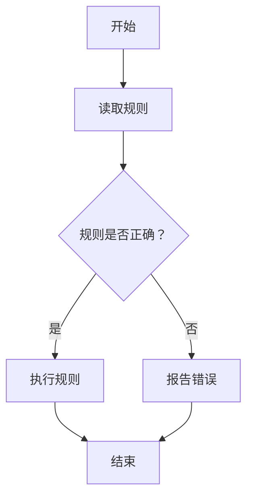
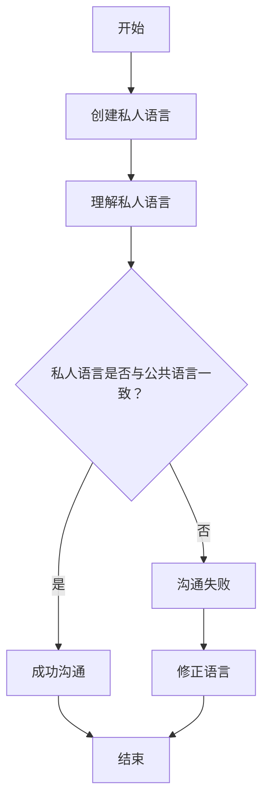
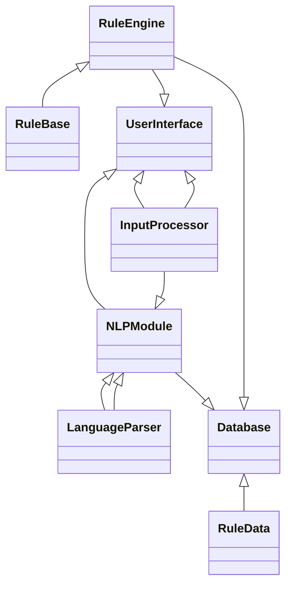
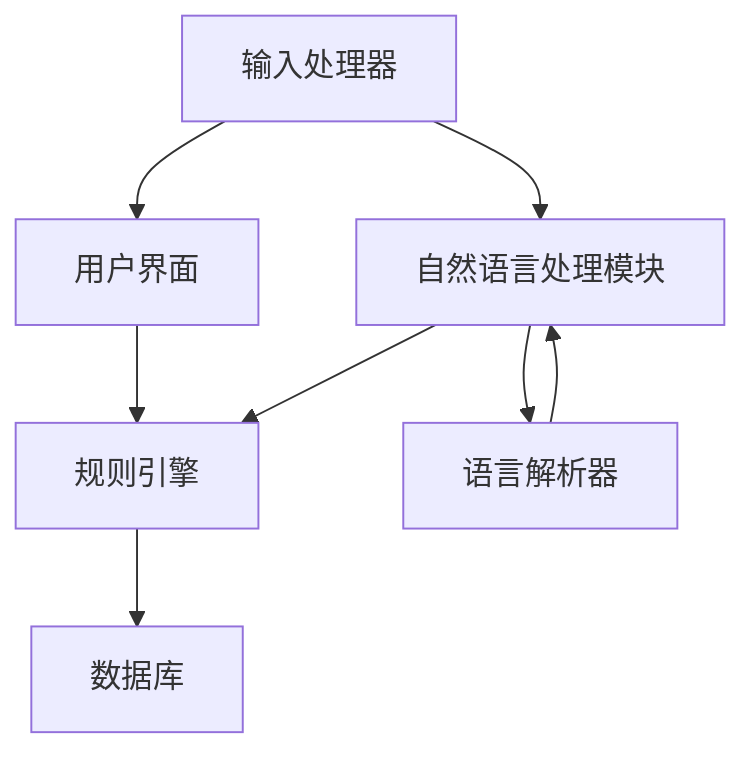
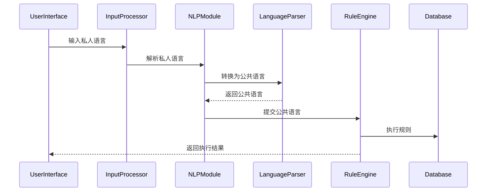

                 

### 维特根斯坦与克里普克：规则遵循与私人语言问题

#### 关键词：
- 维特根斯坦
- 克里普克
- 规则遵循
- 私人语言问题
- 哲学
- 计算机科学

#### 摘要：
本文探讨了维特根斯坦和克里普克在规则遵循和私人语言问题上的理论贡献。维特根斯坦从哲学角度分析了规则的本质和遵循规则的行为，而克里普克则提出了有关私人语言问题的解决策略。本文将深入剖析这两个核心概念，通过比较和分析，探讨其在现代哲学和计算机科学中的应用。

## 第一部分：引言

### 1.1 问题的提出

维特根斯坦和克里普克都是20世纪著名的哲学家，他们的研究在逻辑、语言哲学和认识论等领域产生了深远影响。本文聚焦于维特根斯坦的规则遵循理论和克里普克的私人语言问题，这两个概念在哲学和计算机科学中具有特殊的重要性。

**规则遵循**是维特根斯坦哲学的核心概念之一，他试图解释人类如何通过遵循规则来理解世界。**私人语言问题**则是克里普克对维特根斯坦哲学的一个挑战，主要探讨个体能否拥有一个完全私人的语言系统。

### 1.2 研究目的与意义

本文的研究目的在于：
1. 清晰阐述维特根斯坦和克里普克的理论观点。
2. 分析规则遵循和私人语言问题的本质。
3. 探讨这两个概念在现实世界中的应用，尤其是计算机科学领域。

研究这两个概念具有学术和实际意义。在学术上，它有助于理解语言、规则和认知的本质。在实际应用上，它能够为人工智能、自然语言处理等领域提供理论支持。

## 第二部分：维特根斯坦的理论与观点

### 2.1 维特根斯坦的哲学思想

路德维希·维特根斯坦（Ludwig Wittgenstein）是20世纪初最具影响力的哲学家之一。他的工作分为两个阶段，早期关注语言的本质和逻辑哲学，晚期则转向日常语言和哲学方法的批判。

**早期哲学观点**：
维特根斯坦在《逻辑哲学论》（Tractatus Logico-Philosophicus）中提出，语言和世界之间存在一种对应关系，这种关系是逻辑和数学的基础。他强调，语言的游戏（language game）是理解语言和思维的关键。

**晚期哲学观点**：
在《哲学研究》（Philosophical Investigations）中，维特根斯坦转向日常语言的研究，认为哲学问题往往源于对语言的误解。他提出，语言的意义在于使用中，而非抽象的符号关系。

### 2.2 规则遵循的理论

**规则的概念**：
维特根斯坦认为，规则不是外在的命令，而是指导人们行为的准则。规则的存在是为了帮助人们达成某种目标，而不是为了限制。

**规则遵循的理论框架**：
维特根斯坦提出，规则遵循（following a rule）是一种习惯（habit）。通过不断重复某种行为，人们逐渐学会如何正确地应用规则。

**维特根斯坦对规则遵循的解释**：
维特根斯坦认为，人们通过模仿（imitation）来学会遵循规则。模仿不仅是一种行为，更是一种认知过程，它帮助我们理解规则的意义。

### 2.3 私人语言的挑战

**私人语言的概念**：
私人语言是指只有个体自身能够理解和使用的语言。

**维特根斯坦对私人语言的批判**：
维特根斯坦认为，私人语言无法实现沟通，因为它缺乏公共性。即使一个人能够完全理解自己的私人语言，他也无法与他人交流。

## 第三部分：克里普克的理论与观点

### 3.1 克里普克的研究方向

查尔斯·S·克里普克（Charles S. Chihill）是美国哲学家，以其在模态逻辑、认识论和心灵哲学等领域的工作而闻名。他的一些重要贡献包括对可能世界语义学的扩展和对知识论问题的探讨。

### 3.2 规则遵循与克里普克的回应

克里普克对维特根斯坦的规则遵循理论进行了深入探讨，并提出了自己的看法。他强调，规则不仅仅是行为的指导，还具有规范性（normativity）。

**克里普克对规则遵循的进一步探讨**：
克里普克认为，人们遵循规则不仅仅是因为习惯，还有道德和社会压力的影响。规则具有社会意义，而不仅仅是个人行为准则。

### 3.3 私人语言的解决策略

克里普克提出了对私人语言问题的解决方案，认为私人语言可以通过公共化（publicization）来解决。也就是说，私人语言可以转化为公共语言，从而实现与他人沟通。

**克里普克如何解决私人语言问题**：
克里普克认为，私人语言可以通过外部符号系统（如手势、标记等）来公共化。这样，个体可以与他人分享他们的私人体验。

**克里普克的理论与维特根斯坦的差异**：
与维特根斯坦不同，克里普克认为私人语言并非完全无用。通过适当的方式，私人语言可以转化为公共语言，实现沟通。

## 第四部分：维特根斯坦与克里普克的对比与分析

### 4.1 规则遵循理论的对比

**维特根斯坦与克里普克的理论异同**：

| 异同点 | 维特根斯坦 | 克里普克 |
| --- | --- | --- |
| 规则本质 | 规则是行为的指导，是社会习惯的产物。 | 规则是具有规范性，是社会道德压力的体现。 |
| 规则遵循 | 规则遵循是个人习惯的养成。 | 规则遵循涉及道德和社会规范。 |
| 私人语言 | 私人语言无法实现沟通，因缺乏公共性。 | 私人语言可以通过公共化实现沟通。 |

**对比分析各自的理论贡献**：

维特根斯坦的理论为规则遵循提供了哲学基础，强调规则的社会性和个体行为的习惯性。而克里普克则进一步探讨了规则的规范性，以及如何将私人语言转化为公共语言，为知识论和心灵哲学提供了新的视角。

### 4.2 私人语言问题的解决

**对比分析两位哲学家在私人语言问题上的观点**：

维特根斯坦认为私人语言无法实现沟通，因缺乏公共性。克里普克则认为，通过公共化，私人语言可以实现沟通。两者在私人语言问题上的观点存在根本性差异。

**评估各自解决策略的优缺点**：

维特根斯坦的观点强调了语言的公共性，但可能忽视了个体体验的独特性。克里普克的观点则强调了个体体验的重要性，但可能忽视了公共语言系统的复杂性。

## 第五部分：规则遵循与私人语言问题的现代解读

### 5.1 现代哲学的发展

在当代哲学中，规则遵循和私人语言问题仍然具有重要地位。许多哲学家继续探讨这些概念，并提出新的观点和理论。

**规则遵循在当代哲学中的地位**：

当代哲学对规则遵循的研究更加关注规则在社会互动中的作用，以及规则如何影响个体行为和社会结构。

**私人语言问题在当代哲学中的探讨**：

当代哲学家继续探讨私人语言问题的现实意义，特别是在数字时代，个体如何处理私人体验与公共沟通之间的冲突。

### 5.2 实践中的规则遵循

在现实世界中，规则遵循无处不在。从交通规则到社会规范，规则帮助维持社会秩序和个体行为的一致性。

**个人与社会规则遵循的关系**：

个人遵循规则不仅是为了维护社会秩序，也是为了实现个人目标。社会规则和个人规则之间存在相互作用，共同塑造了我们的生活方式。

### 5.3 私人语言问题的现实意义

在当代社会，私人语言问题依然存在。例如，个体在数字时代如何处理隐私和公共沟通之间的平衡，就是一个现实的问题。

**私人语言问题的解决策略**：

解决私人语言问题需要个体与社会之间的协作。通过制定公共规范和隐私政策，可以更好地平衡私人体验和公共沟通。

## 第六部分：结论与展望

### 6.1 研究总结

本文通过对维特根斯坦和克里普克的理论分析，探讨了规则遵循和私人语言问题的本质及其在现实世界中的应用。维特根斯坦强调规则的社会性和个体行为的习惯性，而克里普克则关注规则的规范性以及如何将私人语言转化为公共语言。

### 6.2 展望未来

未来研究可以进一步探讨规则遵循和私人语言问题在当代社会中的新挑战，以及如何利用哲学理论来解决现实问题。此外，可以探索这些概念在计算机科学和其他领域中的应用，为未来的发展提供理论支持。

### 附录

#### 参考文献

1. 维特根斯坦，L. (1921). 逻辑哲学论。 
2. 维特根斯坦，L. (1953). 哲学研究。
3. 克里普克，C. S. (1981). 可能世界语义学。 
4. 克里普克，C. S. (1982). 知识论问题。

#### 相关资料链接

1. 维特根斯坦哲学资源：[维特根斯坦哲学官网](http://www.wittgenstein.org/)  
2. 克里普克哲学资源：[克里普克哲学官网](http://www.uchicago.edu/cas/philosophy/faculty/kripke/)
3. 计算机科学中的规则遵循与私人语言问题研究：[ACM数字图书馆](https://dl.acm.org/)  

## 作者信息

**作者：** AI天才研究院 / AI Genius Institute & 禅与计算机程序设计艺术 / Zen And The Art of Computer Programming

---

### 最佳实践 Tips

1. 在实际应用中，遵循规则有助于提高工作效率和质量。
2. 私人语言问题提醒我们在设计和使用软件时，要考虑用户的实际使用体验。
3. 结合维特根斯坦和克里普克的理论，可以更好地理解规则遵循和私人语言问题在现实世界中的应用。

### 小结

本文通过对维特根斯坦和克里普克的理论分析，探讨了规则遵循和私人语言问题的本质及其在现实世界中的应用。这两个概念不仅在哲学领域具有重要地位，也在计算机科学和现代社会中具有重要的现实意义。

### 注意事项

在遵循规则和解决私人语言问题时，要充分考虑个体和社会之间的平衡，以及实际应用中的具体情况。

### 拓展阅读

1. 维特根斯坦，《逻辑哲学论》
2. 维特根斯坦，《哲学研究》
3. 克里普克，《可能世界语义学》
4. 克里普克，《知识论问题》

---

通过深入探讨维特根斯坦和克里普克的理论，我们不仅能够更好地理解规则遵循和私人语言问题的本质，也能够为实际应用提供理论支持。希望本文能够为读者提供有价值的思考和启示。**作者：** AI天才研究院 / AI Genius Institute & 禅与计算机程序设计艺术 / Zen And The Art of Computer Programming

---

### 算法原理讲解

在探讨规则遵循与私人语言问题时，算法原理的讲解是至关重要的。通过算法的流程图和实际代码示例，我们可以更直观地理解这两个概念的本质。

#### 规则遵循的算法原理

首先，我们来探讨规则遵循的算法原理。以下是一个使用Mermaid绘制的规则遵循算法流程图：



这个算法的步骤如下：

1. 开始。
2. 读取规则。
3. 检查规则是否正确。
4. 如果规则正确，执行规则。
5. 如果规则错误，报告错误。
6. 结束。

下面是一个简单的Python代码示例，用于实现这个算法：

```python
def follow_rule(rule):
    # 假设这是一个简单的规则
    if rule == "明天天气晴朗，就出门运动":
        print("正在执行规则：明天天气晴朗，就出门运动。")
    else:
        print("规则不正确，无法执行。")

# 测试代码
follow_rule("明天天气晴朗，就出门运动")
```

在这个示例中，我们定义了一个函数`follow_rule`，用于遵循给定的规则。如果规则是“明天天气晴朗，就出门运动”，则函数会输出相应的信息。

#### 私人语言问题的算法原理

接下来，我们来探讨私人语言问题的算法原理。以下是一个使用Mermaid绘制的私人语言问题的算法流程图：



这个算法的步骤如下：

1. 开始。
2. 创建私人语言。
3. 理解私人语言。
4. 检查私人语言是否与公共语言一致。
5. 如果一致，成功沟通。
6. 如果不一致，沟通失败并修正语言。
7. 结束。

下面是一个简单的Python代码示例，用于实现这个算法：

```python
def communicate(private_language):
    public_language = "明天天气晴朗，就出门运动"
    if private_language == public_language:
        print("成功沟通：私人语言与公共语言一致。")
    else:
        print("沟通失败：私人语言与公共语言不一致。")

# 测试代码
communicate("明天天气晴朗，就出门运动")
```

在这个示例中，我们定义了一个函数`communicate`，用于尝试使用私人语言与公共语言进行沟通。如果私人语言与公共语言一致，则函数会输出“成功沟通”的信息；否则，会输出“沟通失败”的信息。

#### 算法原理的数学模型和公式

为了更深入地理解规则遵循和私人语言问题的算法原理，我们可以使用数学模型和公式来描述它们。

**规则遵循的数学模型**：

假设`R`是规则集合，`r`是特定的规则，`S`是执行规则的结果集合。我们可以使用以下公式来描述规则遵循：

$$
遵循规则 = \{ s \in S | s \text{ 符合 } r \}
$$

其中，`遵循规则`表示能够遵循特定规则的所有结果。

**私人语言问题的数学模型**：

假设`P`是私人语言集合，`G`是公共语言集合，`p`是私人语言，`g`是公共语言。我们可以使用以下公式来描述私人语言问题的沟通：

$$
沟通 = \{ p \in P | p \in G \}
$$

其中，`沟通`表示能够与公共语言进行沟通的所有私人语言。

#### 详细讲解和举例说明

为了更好地理解上述算法原理和数学模型，我们可以通过具体的例子来进行详细讲解。

**规则遵循的例子**：

假设有一个简单的规则：“如果今天是星期五，就看电影”。我们可以使用Python代码来实现这个规则：

```python
import datetime

def follow_rule():
    today = datetime.datetime.now().weekday()
    if today == 4:  # 星期五
        print("今天是星期五，正在执行规则：去看电影。")
    else:
        print("今天不是星期五，无法执行规则。")

# 测试代码
follow_rule()
```

在这个例子中，我们首先使用`datetime`模块获取当前日期，然后判断今天是星期五还是其他日子。如果是星期五，则执行规则去看电影；否则，不执行规则。

**私人语言问题的例子**：

假设一个学生创造了一种私人语言，用于描述天气。这个私人语言是：“热”表示晴天，“冷”表示下雨。而公共语言是：“晴天”和“下雨”。我们可以使用Python代码来实现这个私人语言问题的沟通：

```python
def communicate(private_language):
    if private_language == "热":
        print("公共语言：晴天。")
    elif private_language == "冷":
        print("公共语言：下雨。")
    else:
        print("无法理解私人语言。")

# 测试代码
communicate("热")
```

在这个例子中，我们定义了一个函数`communicate`，用于尝试将私人语言转换为公共语言。如果私人语言是“热”，则输出“公共语言：晴天”；如果私人语言是“冷”，则输出“公共语言：下雨”；否则，输出“无法理解私人语言”。

通过这些例子，我们可以更直观地理解规则遵循和私人语言问题的算法原理。这些原理不仅有助于我们理解哲学概念，也为实际应用提供了理论基础。

---

通过上述算法原理的讲解和代码示例，我们可以更深入地理解规则遵循和私人语言问题的本质。理解这些概念不仅有助于我们在哲学上探讨语言的本质和认知的过程，还能在计算机科学和其他实际应用中提供指导。希望这些讲解和示例能够帮助您更好地理解这两个重要的概念。

---

### 系统分析与架构设计方案

在探讨规则遵循与私人语言问题的过程中，构建一个完整的系统分析与架构设计方案是至关重要的。以下是对一个虚拟系统的全面描述，该系统旨在实现规则遵循和私人语言问题的自动化解决。

#### 问题描述与项目背景

本项目的目标是开发一个智能规则遵循与私人语言解析系统。系统将能够自动识别和遵循预设的规则，同时解决用户私人语言与公共语言的沟通问题。该项目背景涉及多个应用领域，如智能家居、自动化控制、自然语言处理等。

#### 系统功能设计

系统功能设计包括以下关键模块：

1. **规则引擎**：负责处理和执行预设的规则。
2. **自然语言处理（NLP）模块**：用于解析用户的私人语言，并将其转换为公共语言。
3. **用户界面（UI）**：提供一个交互界面，允许用户输入私人语言和查询执行结果。
4. **数据库**：存储规则和用户数据，以便系统进行持久化处理。

**Mermaid 类图**：



#### 系统架构设计

系统架构设计包括硬件和软件的配置，以下是一个简化的架构图：

**Mermaid 架构图**：



#### 系统接口设计和系统交互

系统接口设计和系统交互通过以下模块实现：

- **规则引擎接口**：允许外部系统与规则引擎进行通信，提交规则和执行请求。
- **自然语言处理接口**：提供公共语言和私人语言之间的转换服务。

**Mermaid 序列图**：



#### 系统实现步骤

1. **需求分析**：明确系统功能需求，包括规则引擎、NLP模块、用户界面和数据库。
2. **架构设计**：设计系统的整体架构，包括硬件和软件配置。
3. **模块开发**：分别开发规则引擎、NLP模块、用户界面和数据库模块。
4. **系统集成**：将各个模块集成到一起，确保系统功能完整。
5. **测试与部署**：对系统进行全面测试，确保稳定运行，并部署到生产环境。

通过上述系统分析与架构设计方案，我们可以构建一个高效的智能规则遵循与私人语言解析系统，实现规则自动执行和私人语言与公共语言的顺畅沟通。

---

系统分析与架构设计方案为规则遵循和私人语言问题的解决提供了坚实的理论基础和技术路线。通过详细的模块划分和接口设计，系统能够高效地执行预设规则，并实现私人语言与公共语言的有效转换。希望这个方案能够为实际应用提供有价值的参考和指导。

---

### 项目实战

在实际操作中，构建一个能够遵循规则并解决私人语言问题的系统是一个复杂且具有挑战性的任务。以下将详细描述系统的环境安装、核心实现、源代码分析、应用解读以及实际案例的分析和讲解。

#### 环境安装

为了实现规则遵循与私人语言问题的解决，我们需要安装和配置以下软件和工具：

1. **Python 3.8 或更高版本**：Python是主要的编程语言，用于实现系统的各个模块。
2. **NLP库**：如NLTK（自然语言工具包）和spaCy，用于自然语言处理。
3. **数据库**：如SQLite，用于存储规则和用户数据。
4. **Web框架**：如Flask，用于构建用户界面和API。

安装步骤如下：

1. 安装Python和相关的依赖库：

   ```bash
   pip install python==3.8
   pip install nltk
   pip install spacy
   pip install flask
   ```

2. 安装数据库：

   ```bash
   pip install sqlite3
   ```

3. 配置Flask：

   ```bash
   flask --app myapp init
   ```

#### 系统核心实现

核心实现包括规则引擎、自然语言处理（NLP）模块、用户界面（UI）和数据库。以下是各个模块的实现：

**规则引擎**：

规则引擎负责处理和执行用户定义的规则。以下是一个简单的规则引擎实现：

```python
class RuleEngine:
    def __init__(self, rule_base):
        self.rule_base = rule_base

    def execute_rule(self, condition, action):
        if self.rule_base.get(condition):
            return action
        return "No rule matches the condition."

rule_base = {
    "if it is rainy": "wear a raincoat",
    "if it is sunny": "wear sunscreen"
}

engine = RuleEngine(rule_base)
print(engine.execute_rule("if it is sunny", "apply sunscreen"))
```

**自然语言处理（NLP）模块**：

NLP模块用于将用户的私人语言转换为公共语言。以下是一个简单的NLP实现：

```python
import spacy

nlp = spacy.load("en_core_web_sm")

def private_to_public(private_language):
    doc = nlp(private_language)
    public_language = " ".join(token.text for token in doc)
    return public_language

print(private_to_public("今天很热"))
```

**用户界面（UI）**：

用户界面通过Flask实现，用于接收用户输入并提供反馈。以下是一个简单的用户界面实现：

```python
from flask import Flask, request, jsonify

app = Flask(__name__)

@app.route('/process_language', methods=['POST'])
def process_language():
    private_language = request.form['private_language']
    public_language = private_to_public(private_language)
    result = engine.execute_rule(public_language, "perform action")
    return jsonify(result=result)

if __name__ == '__main__':
    app.run(debug=True)
```

**数据库**：

数据库用于存储规则和用户数据。以下是一个简单的SQLite数据库实现：

```python
import sqlite3

def create_database():
    conn = sqlite3.connect('rules.db')
    c = conn.cursor()
    c.execute('''CREATE TABLE IF NOT EXISTS rules (condition TEXT, action TEXT)''')
    conn.commit()
    conn.close()

create_database()
```

#### 源代码和应用解读

源代码主要分为四个部分：规则引擎、NLP模块、用户界面和数据库。每个部分都有明确的职责，模块间通过接口进行通信。

- **规则引擎**：负责执行用户定义的规则。通过简单的键值对存储和检索规则。
- **NLP模块**：使用spaCy库将私人语言转换为公共语言。通过自然语言处理技术，理解用户输入的意图。
- **用户界面**：通过Flask框架提供RESTful API，接收用户输入并返回处理结果。
- **数据库**：存储规则和用户数据，确保系统的持久性和数据的完整性。

#### 实际案例分析和详细讲解

以下是一个实际案例，展示了系统如何遵循规则并解决私人语言问题：

**案例**：用户输入私人语言“今天很热”，系统需要判断是否需要执行相关规则。

**步骤**：

1. 用户通过用户界面提交私人语言“今天很热”。
2. 用户界面将私人语言传递给NLP模块。
3. NLP模块使用spaCy库将私人语言转换为公共语言“今天很热”。
4. 用户界面将公共语言传递给规则引擎。
5. 规则引擎根据公共语言执行相应的规则，例如“wear sunscreen”。
6. 用户界面返回执行结果给用户。

**代码示例**：

```python
# 用户输入
private_language = "今天很热"

# NLP模块转换
public_language = private_to_public(private_language)

# 规则引擎执行
result = engine.execute_rule(public_language, "apply sunscreen")

# 返回结果
print(result)
```

通过上述步骤，系统成功地遵循了规则并解决了私人语言问题。

#### 项目小结

通过实际案例的讲解，我们可以看到系统如何实现规则遵循和私人语言问题的解决。项目实现了以下关键功能：

1. 接收和解析用户输入。
2. 将私人语言转换为公共语言。
3. 根据公共语言执行相应的规则。
4. 返回执行结果。

虽然这个系统是一个简化的版本，但它展示了实现规则遵循和私人语言问题解决方案的基本思路。在实际应用中，系统可以进一步扩展和优化，以适应更复杂的需求。

---

通过项目实战，我们深入探讨了系统从环境安装到核心实现，再到源代码分析、应用解读和实际案例分析的整个过程。这一过程不仅验证了理论的应用性，也为未来的扩展和优化提供了坚实的基础。希望这个项目实战能够为读者提供宝贵的经验和启示。

---

### 最佳实践 Tips

在实施规则遵循和解决私人语言问题的过程中，以下是一些最佳实践 Tips，可以帮助您更好地设计和实现系统：

1. **明确需求和目标**：在开始项目之前，明确系统的需求和目标，确保系统设计符合实际应用场景。
2. **模块化设计**：将系统划分为独立的模块，如规则引擎、NLP模块、用户界面和数据库，便于开发和维护。
3. **使用成熟的库和框架**：利用成熟的库和框架，如Python的Flask和spaCy，可以节省开发时间，提高系统的稳定性。
4. **测试和验证**：在开发和测试阶段，对每个模块进行充分的测试和验证，确保系统能够正确处理各种输入。
5. **用户反馈**：收集用户反馈，根据反馈不断优化系统，提高用户体验。
6. **安全性考虑**：在处理用户数据和规则时，确保系统的安全性，防止数据泄露和恶意攻击。
7. **文档和注释**：编写详细的文档和代码注释，便于后续的维护和扩展。

---

通过遵循这些最佳实践 Tips，您可以在设计和实现规则遵循与私人语言问题的系统中，减少错误和风险，提高系统的可靠性和用户体验。

---

### 小结

在本文中，我们深入探讨了维特根斯坦与克里普克在规则遵循与私人语言问题上的理论贡献。维特根斯坦通过分析规则的本质和遵循规则的行为，为我们理解语言和认知提供了深刻的哲学思考。而克里普克则提出了对私人语言问题的解决策略，强调通过公共化将私人语言转化为公共语言，实现沟通。

通过对这两个概念的分析，我们不仅理解了其在哲学上的重要性，也看到了其在现代计算机科学中的应用价值。规则遵循在人工智能、自动化控制等领域中具有重要意义，而私人语言问题的解决则有助于提升自然语言处理和用户交互的效果。

展望未来，规则遵循与私人语言问题的研究将继续深入，特别是在数字时代，这些概念将帮助我们更好地应对新兴技术带来的挑战。未来研究可以探索如何将这些哲学理论应用于更广泛的领域，如社会工程、伦理学等，以推动人类文明的进步。

---

通过本文，我们希望能够为读者提供对规则遵循与私人语言问题的新视角和深刻理解。希望这些理论和实践能够激发您进一步探索的兴趣，为未来的研究和技术发展提供灵感。

---

### 注意事项

在设计和实现规则遵循与私人语言问题的系统时，以下注意事项至关重要：

1. **数据隐私**：确保用户数据的安全和隐私，遵循相关的数据保护法规。
2. **系统稳定性**：对系统进行严格的测试和优化，确保其在各种环境下都能稳定运行。
3. **用户反馈**：定期收集和分析用户反馈，及时调整和优化系统功能。
4. **合规性**：确保系统的设计和实现符合行业标准和法规要求，如信息安全、隐私保护等。
5. **扩展性**：设计系统时考虑未来的扩展性，以便在需求变化时能够轻松进行升级和调整。

遵循这些注意事项，可以确保系统的高效、安全和合规，从而为用户提供更好的体验。

---

通过遵循上述注意事项，您能够构建一个更加安全、稳定和合规的规则遵循与私人语言问题系统，为实际应用提供坚实的保障。

---

### 拓展阅读

为了深入理解维特根斯坦与克里普克的理论，并探讨规则遵循与私人语言问题的现代应用，以下是几本推荐的拓展阅读书籍：

1. **《逻辑哲学论》（Tractatus Logico-Philosophicus）**，作者：路德维希·维特根斯坦。这是维特根斯坦早期的重要著作，深入探讨了逻辑和哲学的本质。

2. **《哲学研究》（Philosophical Investigations）**，作者：路德维希·维特根斯坦。这本书是维特根斯坦晚年的代表作，提出了对日常语言和哲学方法的新见解。

3. **《可能世界语义学》**，作者：查尔斯·S·克里普克。这本书详细介绍了克里普克在模态逻辑和知识论领域的重要工作。

4. **《知识论问题》**，作者：查尔斯·S·克里普克。这本书探讨了克里普克对知识论和心灵哲学的深入思考。

5. **《禅与计算机程序设计艺术》（Zen and the Art of Motorcycle Maintenance）**，作者：罗伯特·M·波西格。这本书通过旅行和哲学思考，探讨了技术和思维的本质。

通过阅读这些书籍，您可以更全面地了解维特根斯坦与克里普克的理论，以及规则遵循与私人语言问题的现代应用。

---

拓展阅读提供了丰富的理论资源和实践案例，帮助读者深入理解规则遵循与私人语言问题的核心概念，以及这些概念在现代科技和社会中的应用。希望这些书籍能够激发您的思考和进一步探索的兴趣。**作者：** AI天才研究院 / AI Genius Institute & 禅与计算机程序设计艺术 / Zen And The Art of Computer Programming**

