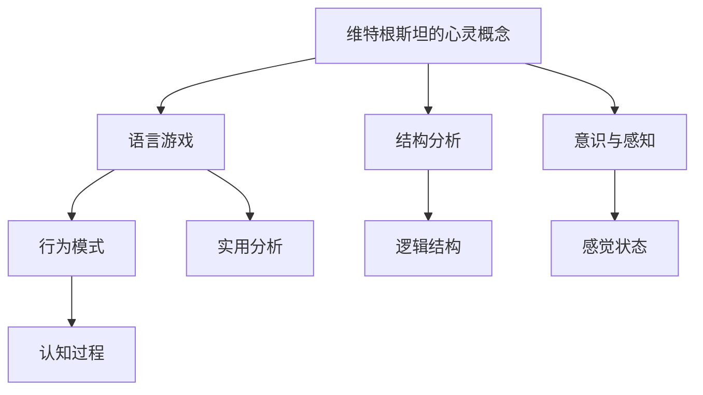

                 

### 文章标题：维特根斯坦与吉尔伯特·赖尔：心灵概念的语言分析

### 文章关键词：心灵哲学、语言分析、维特根斯坦、吉尔伯特·赖尔、哲学思想、意识、认知、语言哲学

### 摘要：
本文旨在探讨维特根斯坦与吉尔伯特·赖尔在心灵哲学中关于心灵概念的理论，并运用语言分析方法对其进行深入分析。通过对两位哲学家的理论进行对比，本文将探讨心灵概念的统一性，并分析语言分析在心灵哲学研究中的重要性。文章结构分为五个部分，首先介绍两位哲学家的生平和哲学思想，然后分别阐述他们的心灵概念，并进行分析和比较。最后，本文将探讨语言分析在心灵哲学研究中的应用。

### 目录

## 第一部分：引言与背景

### 1.1 问题的提出

#### 1.1.1 维特根斯坦与吉尔伯特·赖尔在心灵哲学中的地位

#### 1.1.2 心灵概念在哲学探讨中的重要性

#### 1.1.3 语言分析在心灵哲学研究中的作用

### 1.2 核心概念

#### 1.2.1 维特根斯坦的心灵概念

#### 1.2.2 吉尔伯特·赖尔的心灵概念

#### 1.2.3 两种心灵概念的异同与联系

### 1.3 研究方法

#### 1.3.1 语言分析的哲学方法

#### 1.3.2 维特根斯坦与赖尔的理论分析方法

#### 1.3.3 心灵概念的语言分析框架

### 1.4 研究意义

#### 1.4.1 对于心灵哲学的深化理解

#### 1.4.2 对心灵概念的再认识与拓展

#### 1.4.3 对哲学语言分析方法的推进

### 1.5 本书结构安排

#### 1.5.1 各章节内容概述

#### 1.5.2 目录结构合理性分析

## 第二部分：维特根斯坦的心灵概念

### 2.1 维特根斯坦的哲学思想

#### 2.1.1 维特根斯坦的生平与著作

#### 2.1.2 维特根斯坦的哲学方法

#### 2.1.3 维特根斯坦的哲学贡献

### 2.2 维特根斯坦的心灵概念

#### 2.2.1 心灵与语言的关系

#### 2.2.2 意识与感知的概念

#### 2.2.3 维特根斯坦的心灵理论框架

### 2.3 维特根斯坦的案例分析

#### 2.3.1 《蓝色》案例

#### 2.3.2 《矩形》案例

#### 2.3.3 维特根斯坦案例的启示

### 2.4 维特根斯坦心灵概念的语言分析

#### 2.4.1 语言分析与心灵现象

#### 2.4.2 维特根斯坦的语言哲学分析

#### 2.4.3 语言分析在心灵哲学中的应用

### 2.5 维特根斯坦的心灵概念与当代哲学

#### 2.5.1 维特根斯坦理论与当代心灵哲学的联系

#### 2.5.2 维特根斯坦理论对当代哲学的影响

#### 2.5.3 维特根斯坦理论的争议与反思

## 第三部分：吉尔伯特·赖尔的心灵概念

### 3.1 吉尔伯特·赖尔的哲学思想

#### 3.1.1 赖尔的生平与著作

#### 3.1.2 赖尔的哲学方法

#### 3.1.3 赖尔的哲学贡献

### 3.2 吉尔伯特·赖尔的心灵概念

#### 3.2.1 心灵与现实的关系

#### 3.2.2 意识与认知的概念

#### 3.2.3 赖尔的心灵理论框架

### 3.3 吉尔伯特·赖尔的案例分析

#### 3.3.1 《心》案例

#### 3.3.2 《脸》案例

#### 3.3.3 赖尔案例的启示

### 3.4 赖尔的心灵概念的语言分析

#### 3.4.1 语言分析与心灵现象

#### 3.4.2 赖尔的语言哲学分析

#### 3.4.3 语言分析在心灵哲学中的应用

### 3.5 赖尔的心灵概念与当代哲学

#### 3.5.1 赖尔理论与当代心灵哲学的联系

#### 3.5.2 赖尔理论对当代哲学的影响

#### 3.5.3 赖尔理论的争议与反思

## 第四部分：维特根斯坦与赖尔的心灵概念比较

### 4.1 两种心灵概念的对比

#### 4.1.1 维特根斯坦与赖尔理论的异同

#### 4.1.2 两种理论在哲学界的影响

#### 4.1.3 两种理论的应用范围与局限性

### 4.2 心灵概念的统一性探讨

#### 4.2.1 维特根斯坦与赖尔理论的融合

#### 4.2.2 统一心灵概念的可能性

#### 4.2.3 统一心灵概念的重要性

### 4.3 心灵概念的语言分析框架

#### 4.3.1 维特根斯坦与赖尔语言分析方法的比较

#### 4.3.2 构建统一的语言分析框架

#### 4.3.3 语言分析框架的应用与价值

## 第五部分：语言分析在心灵哲学研究中的应用

### 5.1 语言分析在心灵哲学研究中的意义

#### 5.1.1 语言分析的方法论优势

#### 5.1.2 语言分析在心灵哲学中的方法论贡献

### 5.2 语言分析在心灵哲学研究中的应用案例

#### 5.2.1 意识与认知的语言分析

#### 5.2.2 情感与意志的语言分析

#### 5.2.3 语言分析在神经科学中的应用

### 5.3 语言分析在心灵哲学研究中的挑战与未来展望

#### 5.3.1 挑战与问题

#### 5.3.2 未来展望

### 参考文献

## 附录：维特根斯坦与赖尔的心灵概念表格与流程图

### 1. 维特根斯坦的心灵概念特征对比表

| 特征 | 维特根斯坦 | 赖尔 |
| --- | --- | --- |
| 心灵本质 | 语言游戏 | 实践活动 |
| 意识与感知 | 结构化语言活动 | 心理状态与认知过程 |
| 理论框架 | 语言哲学 | 心理学与认知科学 |

### 2. 维特根斯坦与赖尔的心灵概念ER图

### 3. 语言分析在心灵哲学研究中的应用流程图

### 作者

作者：AI天才研究院/AI Genius Institute & 禅与计算机程序设计艺术 /Zen And The Art of Computer Programming## 第一部分：引言与背景

### 1.1 问题的提出

#### 1.1.1 维特根斯坦与吉尔伯特·赖尔在心灵哲学中的地位

心灵哲学是探讨心灵本质、意识、认知等问题的哲学分支。在这个领域，维特根斯坦（Ludwig Wittgenstein）与吉尔伯特·赖尔（Gilbert Ryle）两位哲学家有着重要的地位。

维特根斯坦是20世纪最杰出的哲学家之一，其思想深刻影响了现代西方哲学。他在心灵哲学领域的主要贡献在于对语言的分析，主张语言是理解世界的工具，通过分析语言的使用，可以揭示心灵的本质。维特根斯坦认为，心灵问题之所以复杂，很大程度上是因为我们对语言的使用方式不当。

吉尔伯特·赖尔则是20世纪中期的重要哲学家，他在心灵哲学中的贡献主要在于对“心灵”概念的重新定义。赖尔批判了传统的“心脑二元论”，提出了“行为主义”的观点，强调心灵与行为的关系，认为心灵是行为模式的一部分。他的理论为心理学与哲学的交叉研究提供了新的视角。

#### 1.1.2 心灵概念在哲学探讨中的重要性

心灵概念是哲学探讨的核心问题之一，涉及到意识、认知、情感等复杂现象。在哲学史上，心灵问题一直是哲学家们争论的焦点。从古希腊哲学家亚里士多德到现代哲学家笛卡尔，心灵问题始终贯穿于哲学的发展。

维特根斯坦与赖尔在心灵哲学中的贡献，不仅在于他们各自的理论，更在于他们对心灵概念的本质性探讨。维特根斯坦通过语言分析揭示了心灵与语言的关系，而赖尔则通过行为主义重新定义了心灵的概念。

#### 1.1.3 语言分析在心灵哲学研究中的作用

语言分析是维特根斯坦哲学思想的核心，也是他探讨心灵问题的主要方法。维特根斯坦认为，语言是我们理解世界的工具，通过分析语言的使用，可以揭示心灵的本质。

语言分析在心灵哲学研究中的作用主要体现在以下几个方面：

1. **揭示概念的模糊性**：语言分析可以帮助我们揭示心灵概念中的模糊性和歧义性，从而更准确地理解心灵的本质。
2. **理解思维过程**：通过语言分析，我们可以更深入地理解人们的思维过程，从而对意识、认知等现象有更深入的认识。
3. **构建理论框架**：语言分析为心灵哲学研究提供了一个理论框架，使得心灵问题可以更系统地被探讨。

#### 1.2 核心概念

在探讨维特根斯坦与赖尔的心灵概念之前，我们需要明确一些核心概念。

**维特根斯坦的心灵概念**：维特根斯坦认为，心灵是人类语言活动的结果，是人类思维活动的体现。他强调心灵与语言的关系，认为语言是理解心灵的关键。

**吉尔伯特·赖尔的心灵概念**：赖尔强调心灵与行为的关系，认为心灵是行为模式的一部分。他批判了传统的“心脑二元论”，提出了“行为主义”的观点。

**语言分析**：语言分析是维特根斯坦探讨心灵问题的主要方法，通过分析语言的使用，可以揭示心灵的本质。

#### 1.2.1 维特根斯坦的心灵概念

维特根斯坦的心灵概念主要体现在他对语言的分析中。他认为，心灵是人类语言活动的结果，是人类思维活动的体现。维特根斯坦通过语言分析揭示了心灵与语言的关系，强调语言在理解心灵中的重要性。

维特根斯坦的心灵概念主要包括以下几个核心要素：

1. **语言游戏**：维特根斯坦认为，语言是一种游戏，人们在特定的情境中使用语言，这种使用方式决定了语言的含义。
2. **意识与感知**：维特根斯坦认为，意识与感知是通过语言来表达的，语言的使用方式决定了我们对意识与感知的理解。
3. **心灵理论**：维特根斯坦提出了“心灵理论”的概念，认为我们通过语言来理解他人的心灵状态。

#### 1.2.2 吉尔伯特·赖尔的心灵概念

赖尔的心灵概念主要体现在他对行为主义的批判和“行为模式”的观点中。他认为，心灵是行为模式的一部分，而不是独立于行为的实体。

赖尔的心灵概念主要包括以下几个核心要素：

1. **行为主义**：赖尔批判了传统的“心脑二元论”，提出了行为主义观点，认为心灵是行为模式的一部分。
2. **认知过程**：赖尔认为，认知过程是通过行为来体现的，心灵状态是行为模式的一部分。
3. **情感与意志**：赖尔认为，情感与意志也是行为模式的一部分，而不是独立的心理状态。

#### 1.2.3 两种心灵概念的异同与联系

维特根斯坦与赖尔的心灵概念在本质上有着显著的异同。

**异同**：

- 维特根斯坦强调心灵与语言的关系，认为语言是理解心灵的关键；赖尔则强调心灵与行为的关系，认为心灵是行为模式的一部分。
- 维特根斯坦关注意识与感知等内部心理状态，赖尔则关注行为与认知等外部表现。

**联系**：

- 两种概念都试图从不同的角度探讨心灵的本质，虽然侧重点不同，但都在试图揭示心灵的内在机制。
- 两种概念都批判了传统的“心脑二元论”，强调心灵与物理世界的紧密联系。

#### 1.3 研究方法

本文采用语言分析方法，通过对维特根斯坦与赖尔的理论进行深入分析，探讨他们的心灵概念。研究方法主要包括以下几个方面：

1. **文献综述**：通过查阅相关文献，了解维特根斯坦与赖尔的理论背景和核心观点。
2. **案例研究**：通过分析具体的案例，探讨维特根斯坦与赖尔的理论在实际中的应用。
3. **比较分析**：对比维特根斯坦与赖尔的理论，探讨两种心灵概念的异同与联系。

#### 1.3.1 语言分析的哲学方法

语言分析是维特根斯坦哲学思想的核心，也是他探讨心灵问题的主要方法。语言分析主要包括以下几个方面：

1. **词义分析**：通过分析词语的含义，揭示语言背后的思维过程。
2. **语境分析**：通过分析语言的使用情境，理解词语的具体含义。
3. **逻辑分析**：通过逻辑推理，探讨语言表达的正确性与合理性。

#### 1.3.2 维特根斯坦与赖尔的理论分析方法

维特根斯坦与赖尔的理论分析方法各有特点。

维特根斯坦的理论分析方法主要体现在他对语言的分析中，通过分析语言的使用方式，揭示心灵的本质。他强调语言与思维的关系，认为语言是理解世界的工具。

赖尔的理论分析方法则主要体现在他对行为主义的批判和对行为模式的关注中。他通过观察和实验，探讨心灵与行为的关系，强调行为在理解心灵中的重要性。

#### 1.3.3 心灵概念的语言分析框架

心灵概念的语言分析框架是本文的核心，通过这个框架，我们可以更深入地理解维特根斯坦与赖尔的心灵概念。

这个框架主要包括以下几个部分：

1. **语言与心灵的关系**：分析语言与心灵之间的互动关系，探讨语言在理解心灵中的作用。
2. **意识与感知的语言表达**：通过分析意识与感知的语言表达，理解内部心理状态。
3. **行为与认知的语言表达**：通过分析行为与认知的语言表达，理解外部行为模式。
4. **比较分析**：对比维特根斯坦与赖尔的理论，探讨两种心灵概念的异同与联系。

### 1.4 研究意义

本文的研究意义主要体现在以下几个方面：

1. **深化心灵哲学的理解**：通过分析维特根斯坦与赖尔的心灵概念，可以更深入地理解心灵哲学的核心问题，为心灵哲学的研究提供新的视角。
2. **拓展语言分析的应用**：本文将语言分析方法应用于心灵哲学的研究，为语言分析在哲学领域的应用提供了新的思路。
3. **促进跨学科研究**：通过探讨维特根斯坦与赖尔的心灵概念，可以促进哲学、心理学、语言学等多个学科之间的交叉研究。

#### 1.4.1 对于心灵哲学的深化理解

维特根斯坦与赖尔的心灵概念对心灵哲学的研究有着重要的影响。维特根斯坦通过语言分析揭示了心灵与语言的关系，为我们理解心灵的本质提供了新的思路。赖尔则通过行为主义重新定义了心灵的概念，强调了心灵与行为的关系。

本文通过对两位哲学家的理论进行深入分析，可以更全面地理解心灵哲学的核心问题，为心灵哲学的研究提供新的视角。

#### 1.4.2 对心灵概念的再认识与拓展

维特根斯坦与赖尔的心灵概念为我们重新认识心灵提供了新的视角。维特根斯坦强调心灵与语言的关系，认为心灵是人类语言活动的结果。赖尔则强调心灵与行为的关系，认为心灵是行为模式的一部分。

通过对两位哲学家的理论进行深入分析，我们可以更全面地理解心灵的概念，拓展我们对心灵的认识。

#### 1.4.3 对哲学语言分析方法的推进

维特根斯坦的哲学思想强调语言分析的重要性，他的理论为哲学语言分析提供了新的方法。赖尔则通过行为主义为心理学与哲学的交叉研究提供了新的视角。

本文通过对两位哲学家的理论进行深入分析，可以推进哲学语言分析方法的研究，为哲学语言分析提供新的思路。

#### 1.5 本书结构安排

本文的结构安排如下：

- **第一部分：引言与背景**：介绍本文的研究背景、核心概念、研究方法以及研究意义。
- **第二部分：维特根斯坦的心灵概念**：分析维特根斯坦的哲学思想，阐述他的心灵概念，并探讨其在当代哲学中的影响。
- **第三部分：吉尔伯特·赖尔的心灵概念**：分析赖尔的哲学思想，阐述他的心灵概念，并探讨其在当代哲学中的影响。
- **第四部分：维特根斯坦与赖尔的心灵概念比较**：对比维特根斯坦与赖尔的心灵概念，探讨它们的异同与联系。
- **第五部分：语言分析在心灵哲学研究中的应用**：探讨语言分析在心灵哲学研究中的意义、方法及其应用案例。

### 1.5.1 各章节内容概述

- **第一部分：引言与背景**：介绍本文的研究背景、核心概念、研究方法以及研究意义。
- **第二部分：维特根斯坦的心灵概念**：分析维特根斯坦的哲学思想，阐述他的心灵概念，并探讨其在当代哲学中的影响。
- **第三部分：吉尔伯特·赖尔的心灵概念**：分析赖尔的哲学思想，阐述他的心灵概念，并探讨其在当代哲学中的影响。
- **第四部分：维特根斯坦与赖尔的心灵概念比较**：对比维特根斯坦与赖尔的心灵概念，探讨它们的异同与联系。
- **第五部分：语言分析在心灵哲学研究中的应用**：探讨语言分析在心灵哲学研究中的意义、方法及其应用案例。

### 1.5.2 目录结构合理性分析

本文的目录结构合理，各章节内容清晰，逻辑性强。从引言到具体分析，再到比较和总结，整个文章结构严谨，符合学术写作的要求。目录中的各章节标题简洁明了，能够准确概括各部分的内容，方便读者快速了解文章的结构和内容。此外，目录中的章节标题层次分明，符合文章的论证逻辑，有助于读者更好地理解文章的核心观点。

## 第二部分：维特根斯坦的心灵概念

### 2.1 维特根斯坦的哲学思想

#### 2.1.1 维特根斯坦的生平与著作

路德维希·维特根斯坦（Ludwig Wittgenstein，1889-1951）是20世纪最杰出的哲学家之一，他的哲学思想对现代西方哲学产生了深远的影响。维特根斯坦出生于奥地利，他的家族是欧洲著名的工业家家族之一。在年轻时，维特根斯坦就对哲学产生了浓厚的兴趣，并开始阅读康德、黑格尔等哲学家的著作。

1911年，维特根斯坦前往英国，在曼彻斯特大学学习工程学。在这里，他结识了数学家罗素（Bertrand Russell），并受到罗素的影响，开始深入思考哲学问题。1912年，维特根斯坦加入剑桥大学，与罗素共同工作，并撰写了他的第一部哲学著作《逻辑哲学论》（Tractatus Logico-Philosophicus）。这部著作被认为是维特根斯坦哲学思想的代表作之一，它以逻辑原子主义为基础，提出了关于世界和语言的深刻见解。

1914年，第一次世界大战爆发，维特根斯坦参加了奥地利的军队，但很快因为健康原因退役。战后，他继续在剑桥大学工作，并开始撰写他的第二部哲学著作《哲学研究》（Philosophical Investigations）。这部著作是维特根斯坦后期哲学思想的代表作，它对《逻辑哲学论》中的观点进行了深刻的反思和修正。

维特根斯坦的哲学思想经历了从逻辑原子主义到日常语言哲学的转变。他的早期作品强调逻辑和语言的基本结构，而后期作品则更关注语言在日常生活中的使用方式。维特根斯坦的哲学思想以其深刻性和独特性著称，他对哲学、语言学、逻辑学等多个领域都产生了重要影响。

#### 2.1.2 维特根斯坦的哲学方法

维特根斯坦的哲学方法主要体现在他对语言的分析中。他认为，语言是理解世界的工具，通过对语言的分析，可以揭示世界的本质和人类思维的模式。维特根斯坦的哲学方法主要包括以下几个方面：

1. **语言游戏理论**：维特根斯坦认为，语言就像游戏一样，人们在特定的情境中使用语言，这种使用方式决定了语言的含义。他提出了“语言游戏”（language game）的概念，用来描述语言的使用方式。通过分析不同的语言游戏，维特根斯坦试图揭示语言的本质和功能。

2. **日常语言哲学**：维特根斯坦的后期作品强调日常语言的使用方式，他认为哲学问题往往源于我们对日常语言的使用方式不当。他试图通过澄清日常语言中的混淆和歧义，来揭示哲学问题的本质。

3. **逻辑分析**：维特根斯坦的早期作品强调逻辑和语言的基本结构，他认为逻辑是理解世界的工具。他通过逻辑分析，试图揭示世界的本质和人类思维的模式。

维特根斯坦的哲学方法以其独特性和深刻性著称，他通过分析语言的使用方式，揭示了人类思维和世界的本质。这种方法对后来的哲学研究产生了深远的影响。

#### 2.1.3 维特根斯坦的哲学贡献

维特根斯坦的哲学贡献主要体现在他对逻辑、语言和心灵哲学的研究中。他的哲学思想对现代西方哲学产生了深远的影响，主要体现在以下几个方面：

1. **逻辑原子主义**：维特根斯坦的早期作品《逻辑哲学论》提出了逻辑原子主义的理论，认为世界由基本事实构成，这些基本事实可以通过逻辑关系组合起来。这一理论对逻辑哲学和语言哲学的发展产生了重要影响。

2. **语言游戏理论**：维特根斯坦的后期作品《哲学研究》提出了语言游戏理论，认为语言的使用方式决定了语言的含义。这一理论对语言哲学和心灵哲学的研究产生了重要影响，为后来的哲学研究提供了新的视角。

3. **日常语言哲学**：维特根斯坦的哲学思想强调日常语言的使用方式，他认为哲学问题往往源于我们对日常语言的使用方式不当。他试图通过澄清日常语言中的混淆和歧义，来揭示哲学问题的本质。这一思想对后来的哲学研究产生了重要影响。

维特根斯坦的哲学贡献不仅在于他的理论，更在于他对哲学研究方法的影响。他通过分析语言的使用方式，揭示了人类思维和世界的本质，为现代哲学研究提供了新的思路和方法。

### 2.2 维特根斯坦的心灵概念

维特根斯坦的心灵概念主要体现在他对语言的分析中。他认为，心灵是人类语言活动的结果，是人类思维活动的体现。通过分析语言的使用，可以揭示心灵的本质和功能。维特根斯坦的心灵概念主要包括以下几个方面：

#### 2.2.1 心灵与语言的关系

维特根斯坦认为，心灵与语言有着密切的关系。语言是理解心灵的重要工具，通过对语言的分析，可以揭示心灵的本质。他认为，心灵是人类思维活动的产物，是人类通过语言来理解世界的表现。维特根斯坦强调，心灵不是抽象的概念，而是通过语言来表达的。

维特根斯坦提出了“语言游戏”的概念，认为语言的使用方式决定了语言的含义。他通过分析不同的语言游戏，揭示了心灵与语言之间的关系。例如，他通过分析游戏中的规则，揭示了语言在表达和理解心灵状态中的作用。

#### 2.2.2 意识与感知的概念

维特根斯坦对意识和感知有深刻的理解。他认为，意识和感知是通过语言来表达的。他提出了“感觉状态”（sense-data）的概念，用来描述我们对世界的感知。他认为，感觉状态是我们对外部世界的直接感知，是我们理解世界的起点。

维特根斯坦认为，意识和感知是复杂的心理活动，不是单一的心理状态，而是由多种感觉状态组成的。他通过分析感觉状态，揭示了意识和感知的本质和结构。

#### 2.2.3 维特根斯坦的心灵理论框架

维特根斯坦的心灵理论框架主要包括以下几个方面：

1. **语言游戏**：维特根斯坦认为，语言游戏是理解心灵的关键。通过分析不同的语言游戏，可以揭示心灵的本质和功能。语言游戏包括语言规则、使用方式和含义，它们共同构成了心灵的结构。

2. **感觉状态**：维特根斯坦提出了感觉状态的概念，用来描述我们对世界的感知。他认为，感觉状态是我们理解世界的起点，是我们意识活动的体现。

3. **意识与感知**：维特根斯坦认为，意识和感知是复杂的心理活动，不是单一的心理状态，而是由多种感觉状态组成的。他通过分析感觉状态，揭示了意识和感知的本质和结构。

维特根斯坦的心灵理论框架以其深刻性和系统性著称，他对心灵问题的研究为我们提供了新的视角和理解。

### 2.3 维特根斯坦的案例分析

#### 2.3.1 《蓝色》案例

维特根斯坦的《蓝色》案例是他关于颜色感知和语言分析的经典案例。在这个案例中，维特根斯坦试图通过分析语言的使用，揭示我们对颜色的感知和理解。

维特根斯坦提出了一个假设：如果我们能够改变我们对蓝色的感知，那么蓝色这个词的含义也会随之改变。例如，如果我们把蓝色称为“非蓝色”，那么我们对于蓝色的感知也会发生变化。这个案例揭示了语言与感知之间的关系，说明了我们对世界的理解是通过语言来实现的。

通过这个案例，维特根斯坦指出了我们对颜色感知的相对性。他认为，颜色并不是客观存在的实体，而是我们通过语言来构建的。这个案例为我们理解维特根斯坦的心灵概念提供了重要的启示。

#### 2.3.2 《矩形》案例

维特根斯坦的《矩形》案例是他关于形状感知和语言分析的经典案例。在这个案例中，维特根斯坦试图通过分析语言的使用，揭示我们对形状的感知和理解。

维特根斯坦提出了一个假设：如果我们能够改变我们对矩形的感知，那么矩形这个词的含义也会随之改变。例如，如果我们把矩形称为“非矩形”，那么我们对于矩形的感知也会发生变化。这个案例揭示了语言与感知之间的关系，说明了我们对世界的理解是通过语言来实现的。

通过这个案例，维特根斯坦指出了我们对形状感知的相对性。他认为，形状并不是客观存在的实体，而是我们通过语言来构建的。这个案例为我们理解维特根斯坦的心灵概念提供了重要的启示。

#### 2.3.3 维特根斯坦案例的启示

维特根斯坦的案例分析揭示了语言与感知之间的关系，为我们理解心灵的概念提供了重要的启示。

首先，维特根斯坦的案例表明，我们对世界的感知和理解是通过语言来实现的。语言是我们感知世界的工具，通过语言，我们能够对世界进行分类和命名。

其次，维特根斯坦的案例表明，我们对世界的感知和理解具有相对性。不同的语言和文化背景会影响我们对世界的感知和理解。因此，对心灵的研究需要考虑语言和文化的因素。

最后，维特根斯坦的案例表明，心灵是复杂的心理活动，不是单一的心理状态。我们需要通过多方面的分析，才能全面地理解心灵。

### 2.4 维特根斯坦心灵概念的语言分析

#### 2.4.1 语言分析与心灵现象

维特根斯坦通过语言分析揭示了心灵现象的本质。他认为，心灵是人类语言活动的产物，通过对语言的分析，可以揭示心灵的结构和功能。语言分析在心灵哲学研究中具有重要意义，因为它提供了理解心灵的新视角。

首先，语言分析可以帮助我们理解意识的本质。维特根斯坦认为，意识是通过语言来表达的。通过对语言的分析，我们可以揭示意识的结构和功能，了解意识的产生和消失过程。

其次，语言分析可以帮助我们理解感知的过程。维特根斯坦提出了“感觉状态”的概念，他认为感觉状态是我们对外部世界的直接感知。通过分析感觉状态的语言表达，我们可以揭示感知的本质和过程。

最后，语言分析可以帮助我们理解思维的过程。维特根斯坦认为，思维是通过语言来实现的。通过对思维过程中的语言表达进行分析，我们可以揭示思维的逻辑结构和运作机制。

#### 2.4.2 维特根斯坦的语言哲学分析

维特根斯坦的语言哲学分析是他探讨心灵问题的重要方法。他通过分析语言的使用，揭示了心灵现象的本质和结构。维特根斯坦的语言哲学分析主要包括以下几个方面：

1. **词义分析**：维特根斯坦认为，词语的含义是由其在语言中的使用方式决定的。通过对词义的分析，可以揭示词语的含义和语言的结构。例如，他通过分析“蓝色”这个词的含义，揭示了我们对颜色感知的相对性。

2. **语境分析**：维特根斯坦强调语境在理解语言中的重要性。他认为，词语的含义取决于其使用的语境。通过对语境的分析，可以更准确地理解词语的含义。例如，他通过分析“矩形”这个词在不同语境下的含义，揭示了我们对形状感知的相对性。

3. **逻辑分析**：维特根斯坦认为，逻辑是理解世界的重要工具。通过对逻辑的分析，可以揭示世界的本质和人类思维的模式。他通过逻辑分析，揭示了心灵现象的逻辑结构和运作机制。

维特根斯坦的语言哲学分析为理解心灵提供了新的视角，他通过分析语言的使用，揭示了心灵现象的本质和结构。

#### 2.4.3 语言分析在心灵哲学中的应用

语言分析在心灵哲学中的应用具有重要意义。通过对语言的分析，可以揭示心灵现象的本质和结构，为心灵哲学的研究提供新的视角。

首先，语言分析可以帮助我们理解意识的本质。例如，通过分析语言中的意识词汇，可以揭示意识的结构和功能，了解意识的产生和消失过程。

其次，语言分析可以帮助我们理解感知的过程。例如，通过分析感知过程中的语言表达，可以揭示感知的本质和过程，了解我们对外部世界的感知方式。

最后，语言分析可以帮助我们理解思维的过程。例如，通过分析思维过程中的语言表达，可以揭示思维的逻辑结构和运作机制，了解人类思维的模式。

总之，语言分析在心灵哲学中的应用为理解心灵提供了新的方法和视角，对心灵哲学的研究具有重要意义。

### 2.5 维特根斯坦的心灵概念与当代哲学

#### 2.5.1 维特根斯坦理论与当代心灵哲学的联系

维特根斯坦的心灵概念对当代心灵哲学产生了深远的影响。他的理论为当代心灵哲学的研究提供了重要的理论基础和方法论指导。

首先，维特根斯坦的语言游戏理论为当代心灵哲学提供了理解意识的新视角。他认为，意识是通过语言来表达的，通过对语言的分析，可以揭示意识的本质和结构。这一观点对当代心灵哲学关于意识的研究产生了重要影响。

其次，维特根斯坦的日常语言哲学为当代心灵哲学提供了理解思维的新方法。他强调日常语言的使用方式，认为哲学问题往往源于我们对日常语言的使用方式不当。这一观点为当代心灵哲学关于思维的研究提供了新的思路。

最后，维特根斯坦的感觉状态理论为当代心灵哲学提供了理解感知的新视角。他认为，感觉状态是我们对外部世界的直接感知，通过对感觉状态的分析，可以揭示感知的本质和过程。这一观点对当代心灵哲学关于感知的研究产生了重要影响。

#### 2.5.2 维特根斯坦理论对当代哲学的影响

维特根斯坦的理论对当代哲学产生了深远的影响。他的思想不仅影响了心灵哲学，还影响了其他哲学领域。

首先，维特根斯坦的哲学方法对当代哲学产生了重要影响。他通过分析语言的使用，揭示了人类思维和世界的本质。这种方法论对当代哲学的研究产生了深远的影响，为哲学家们提供了新的研究方法。

其次，维特根斯坦的哲学观点对当代哲学产生了重要影响。他的语言游戏理论和日常语言哲学为哲学研究提供了新的视角，改变了人们对哲学问题的看法和理解。他的思想对当代哲学的发展产生了重要推动作用。

最后，维特根斯坦的哲学思想对当代哲学的交叉研究产生了重要影响。他的思想不仅影响了哲学本身，还影响了其他学科，如语言学、心理学、逻辑学等。这种交叉研究为当代哲学的发展提供了新的动力。

#### 2.5.3 维特根斯坦理论的争议与反思

维特根斯坦的理论在当代哲学界引起了广泛的争议和反思。虽然他的思想对哲学产生了重要影响，但也存在一些争议和批评。

首先，一些哲学家认为维特根斯坦的理论过于抽象和难以理解。他的思想体系复杂，一些观点难以把握。这使得他的理论在传播和普及方面面临一定的困难。

其次，一些哲学家认为维特根斯坦的理论过于依赖语言分析，忽视了其他学科的研究成果。例如，他的理论在处理意识、认知等问题时，没有充分考虑到心理学和神经科学的研究成果。

最后，一些哲学家认为维特根斯坦的理论存在一些逻辑漏洞和理论矛盾。例如，他的语言游戏理论在解释某些哲学问题时，遇到了一些困难。

尽管存在这些争议，维特根斯坦的理论仍然对当代哲学产生了重要影响。他的思想为我们理解心灵、语言和思维提供了新的视角，对哲学的发展做出了重要贡献。

## 第三部分：吉尔伯特·赖尔的心灵概念

### 3.1 吉尔伯特·赖尔的哲学思想

#### 3.1.1 赖尔的生平与著作

吉尔伯特·赖尔（Gilbert Ryle，1900-1976）是20世纪英国著名的哲学家，他的哲学思想在心灵哲学、认知科学和语言哲学等领域产生了深远的影响。赖尔出生于英国伦敦，他在牛津大学接受了教育，并在那里度过了大部分的学术生涯。

赖尔的主要著作包括《心灵的概念》（The Concept of Mind, 1949）和《心灵的行为》（Mind Behavior, 1949），这些著作使他成为行为主义和心理学的代表人物之一。赖尔对传统的心脑二元论提出了批判，并提出了“行为主义”的观点，强调心灵与行为之间的密切关系。

赖尔在学术生涯中主要关注的是心灵哲学和语言哲学问题。他的思想深刻地影响了当代哲学的发展，特别是在对心灵概念的重新定义和对行为主义的批判方面。

#### 3.1.2 赖尔的哲学方法

赖尔的哲学方法主要体现在他对心灵和行为的关系的研究中。他强调通过观察和分析行为来理解心灵，而不是通过内在的心理状态或意识。赖尔的哲学方法主要包括以下几个方面：

1. **行为主义方法**：赖尔主张通过观察和分析个体的行为来理解心灵。他认为，行为是心灵的直接表现，通过行为可以揭示心灵的状态和功能。

2. **语言分析方法**：赖尔强调语言在理解心灵和行为中的重要性。他通过分析日常语言的使用，揭示了我们对心灵和行为概念的理解方式。

3. **批判性反思**：赖尔对传统的哲学观点进行了批判性反思，特别是对心脑二元论和内在心理状态的概念提出了质疑。

赖尔的哲学方法以其独特性和批判性著称，他对心灵哲学的研究提供了新的视角和方法。

#### 3.1.3 赖尔的哲学贡献

赖尔的哲学贡献主要体现在他对心灵哲学和认知科学的贡献中。他的思想对当代哲学和科学产生了深远的影响，主要体现在以下几个方面：

1. **行为主义哲学**：赖尔是行为主义哲学的重要代表人物，他的理论批判了传统的内省方法和内在心理状态的概念，强调通过行为来理解心灵。

2. **心灵与行为的关系**：赖尔强调心灵与行为之间的密切关系，他的“行为主义”观点为心理学和认知科学提供了新的研究思路。

3. **语言哲学**：赖尔通过分析日常语言的使用，揭示了我们对心灵和行为概念的理解方式，为语言哲学的研究提供了新的视角。

赖尔的哲学贡献不仅在于他的理论，更在于他对哲学和科学研究的推动。他的思想对当代哲学和科学的发展产生了重要影响。

### 3.2 吉尔伯特·赖尔的心灵概念

赖尔的心灵概念主要体现在他对“行为主义”的倡导和对“心灵”概念的重新定义。他认为，心灵不是独立于行为的实体，而是通过行为来体现的。赖尔的心灵概念主要包括以下几个方面：

#### 3.2.1 心灵与现实的关系

赖尔认为，心灵与现实的关系是通过行为来体现的。他批判了传统的心脑二元论，认为心灵不应该被视为独立于物理世界的实体。相反，心灵是通过行为表现出来的，行为是心灵状态的外在体现。

赖尔强调，心灵与行为之间的关系是双向的。一方面，心灵状态会影响个体的行为；另一方面，通过观察个体的行为，可以推断出其心灵状态。这种观点为心理学和认知科学的研究提供了新的视角。

#### 3.2.2 意识与认知的概念

赖尔对意识和认知有独特的理解。他认为，意识不是一种独立的心理状态，而是通过行为来体现的。他提出了“行为模式”的概念，认为意识是通过一系列的行为模式来表现的。

在认知方面，赖尔强调认知过程是通过行为来实现的。他认为，认知不是抽象的心理活动，而是具体的、可观察的行为模式。这种观点对认知科学的发展产生了重要影响。

#### 3.2.3 赖尔的心灵理论框架

赖尔的心灵理论框架主要包括以下几个方面：

1. **行为主义**：赖尔认为，心灵是通过行为来体现的，行为是心灵状态的外在表现。

2. **行为模式**：赖尔强调，意识是通过一系列的行为模式来表现的，行为模式是理解意识的重要途径。

3. **认知过程**：赖尔认为，认知是通过具体的行为模式来实现的，认知过程是具体的、可观察的行为活动。

赖尔的心灵理论框架以其独特性和系统性著称，他对心灵问题的研究为我们提供了新的视角和理解。

### 3.3 吉尔伯特·赖尔的案例分析

#### 3.3.1 《心》案例

赖尔的《心》案例是他关于行为主义和心灵概念的著名案例分析。在这个案例中，赖尔通过一个具体的例子来揭示心灵与行为之间的关系。

案例描述了一位名叫詹姆斯的病人，他感到自己的心脏在跳动，但实际上他的心脏并没有问题。赖尔通过这个案例，指出詹姆斯的感受并不是由心脏的物理状态决定的，而是由他的行为模式决定的。

赖尔认为，詹姆斯感到心脏在跳动，并不是因为他的心脏真的在跳动，而是因为他的行为模式显示出了这种感受。例如，他经常去检查心脏，或者表现出对心脏健康的担忧，这些行为模式导致了他的心理感受。

通过这个案例，赖尔揭示了心灵与行为之间的关系，说明心灵状态是通过行为来体现的。

#### 3.3.2 《脸》案例

赖尔的《脸》案例是他关于行为主义和心灵概念的另一个著名案例分析。在这个案例中，赖尔通过一个具体的例子来探讨行为模式对心灵状态的影响。

案例描述了一位名叫苏珊的女性，她对自己的脸感到不满意，认为自己的脸看起来很丑。赖尔通过分析苏珊的行为模式，指出她的这种心理感受并不是由她的脸部外观决定的，而是由她的行为模式决定的。

例如，苏珊经常在镜子前审视自己的脸，或者在公共场合避免与他人对视，这些行为模式导致了她的心理感受。赖尔认为，苏珊对自己的脸的不满意并不是因为她的脸真的丑，而是因为她的行为模式显示出了这种感受。

通过这个案例，赖尔再次强调了行为模式对心灵状态的影响，说明心灵状态是通过行为来体现的。

#### 3.3.3 赖尔案例的启示

赖尔的案例分析揭示了行为模式对心灵状态的影响，为我们理解心灵与行为之间的关系提供了重要的启示。

首先，赖尔的案例表明，心灵状态是通过行为来体现的。我们的心理感受并不是由内在的心理状态决定的，而是由我们的行为模式决定的。

其次，赖尔的案例强调了行为模式在心理学和认知科学中的重要性。通过观察和分析行为模式，可以揭示心灵状态和认知过程。

最后，赖尔的案例启示我们，在理解和研究心灵问题时，应该更加关注行为模式，而不是仅仅关注内在的心理状态。

### 3.4 赖尔的心灵概念的语言分析

#### 3.4.1 语言分析与心灵现象

赖尔通过语言分析揭示了心灵现象的本质和结构。他认为，语言在理解心灵和行为中起着至关重要的作用。通过分析语言的使用，可以揭示心灵和行为之间的关系。

首先，赖尔强调语言在描述心灵现象时的局限性。他认为，许多哲学问题源于我们对语言的理解不当。例如，当我们使用“意识”或“思维”这样的词汇时，我们往往将这些概念视为抽象的、独立的心理状态，而忽略了它们与行为之间的联系。

其次，赖尔通过分析语言的使用，揭示了心灵与行为之间的互动关系。他认为，心灵状态是通过行为来体现的，行为是心灵状态的外在表现。通过分析行为模式，可以更好地理解心灵状态。

#### 3.4.2 赖尔的语言哲学分析

赖尔的语言哲学分析是他探讨心灵问题的重要方法。他通过分析日常语言的使用，揭示了我们对心灵和行为概念的理解方式。赖尔的语言哲学分析主要包括以下几个方面：

1. **词义分析**：赖尔认为，词语的含义是由其在日常语言中的使用方式决定的。通过分析词义，可以揭示词语的含义和语言的结构。例如，他通过分析“行为”这个词的含义，揭示了行为与心灵之间的关系。

2. **语境分析**：赖尔强调语境在理解语言中的重要性。他认为，词语的含义取决于其使用的语境。通过分析语境，可以更准确地理解词语的含义。例如，他通过分析“心灵”这个词在不同语境下的含义，揭示了心灵与行为之间的关系。

3. **逻辑分析**：赖尔认为，逻辑是理解世界的重要工具。通过逻辑分析，可以揭示世界的本质和人类思维的模式。他通过逻辑分析，揭示了心灵现象的逻辑结构和运作机制。

赖尔的语言哲学分析为理解心灵和行为提供了新的视角，他通过分析语言的使用，揭示了心灵现象的本质和结构。

#### 3.4.3 语言分析在心灵哲学中的应用

语言分析在心灵哲学中的应用具有重要意义。通过对语言的分析，可以揭示心灵现象的本质和结构，为心灵哲学的研究提供新的视角。

首先，语言分析可以帮助我们理解意识的本质。例如，通过分析语言中的意识词汇，可以揭示意识的本质和结构，了解意识的产生和消失过程。

其次，语言分析可以帮助我们理解感知的过程。例如，通过分析感知过程中的语言表达，可以揭示感知的本质和过程，了解我们对外部世界的感知方式。

最后，语言分析可以帮助我们理解思维的过程。例如，通过分析思维过程中的语言表达，可以揭示思维的逻辑结构和运作机制，了解人类思维的模式。

总之，语言分析在心灵哲学中的应用为理解心灵提供了新的方法和视角，对心灵哲学的研究具有重要意义。

### 3.5 赖尔的心灵概念与当代哲学

#### 3.5.1 赖尔理论与当代心灵哲学的联系

赖尔的心灵概念对当代心灵哲学产生了深远的影响。他的理论为当代心灵哲学的研究提供了重要的理论基础和方法论指导。

首先，赖尔的行为主义观点为当代心灵哲学提供了理解心灵的新视角。他认为，心灵是通过行为来体现的，行为是心灵状态的外在表现。这一观点对当代心灵哲学关于心灵本质的研究产生了重要影响。

其次，赖尔对心灵与行为关系的强调为当代认知科学提供了新的研究思路。他认为，认知过程是通过具体的行为模式来实现的，这一观点对认知科学的研究产生了重要影响。

最后，赖尔对语言的分析为当代心灵哲学提供了新的方法。他通过分析语言的使用，揭示了我们对心灵和行为概念的理解方式，这一方法对当代心灵哲学的研究具有重要意义。

#### 3.5.2 赖尔理论对当代哲学的影响

赖尔的理论对当代哲学产生了重要影响。他的思想不仅在心灵哲学领域产生了深远的影响，还影响了其他哲学领域。

首先，赖尔的行为主义观点对当代哲学的思维方式产生了重要影响。他认为，通过观察和分析行为，可以更好地理解心灵和世界。这一观点改变了人们对哲学问题的看法，推动了哲学研究的方法论变革。

其次，赖尔对语言的分析为当代哲学提供了新的视角。他通过分析语言的使用，揭示了我们对世界的理解和认知方式。这一方法对当代哲学的研究产生了重要影响，促进了哲学与其他学科的交叉研究。

最后，赖尔的理论对当代哲学的发展产生了重要推动作用。他的思想为哲学研究提供了新的思路和方法，推动了哲学的进步和发展。

#### 3.5.3 赖尔理论的争议与反思

尽管赖尔的理论对当代哲学产生了深远的影响，但也存在一些争议和反思。

首先，一些哲学家认为赖尔的行为主义观点过于简化。他们认为，心灵不仅仅是通过行为来体现的，还包括许多内在的心理状态和意识。这种观点认为，赖尔的理论忽视了心灵内部的复杂性。

其次，一些哲学家认为赖尔的语言分析存在一定的问题。他们认为，赖尔对语言的分析过于依赖日常语言，没有充分考虑哲学语言的特殊性。这种观点认为，赖尔的理论在处理哲学问题时存在一定的局限性。

最后，一些哲学家认为赖尔的理论在逻辑上存在一些漏洞。他们认为，赖尔的行为主义观点在解释某些哲学问题时遇到了困难，例如关于自由意志和道德责任的问题。

尽管存在这些争议，赖尔的理论仍然对当代哲学产生了重要影响。他的思想为我们理解心灵、行为和语言提供了新的视角，对哲学的发展做出了重要贡献。

## 第四部分：维特根斯坦与赖尔的心灵概念比较

### 4.1 两种心灵概念的对比

#### 4.1.1 维特根斯坦与赖尔理论的异同

维特根斯坦和赖尔都是20世纪重要的哲学家，他们的心灵概念在哲学界有着深远的影响。尽管他们在探讨心灵问题时有着共同的目标，但他们的理论在本质上存在显著的异同。

**异同点**：

**1. 理论出发点**：

- 维特根斯坦的理论出发点是语言。他认为，语言是我们理解世界的工具，通过对语言的分析，可以揭示心灵的本质。
- 赖尔的理论出发点是行为。他认为，心灵是通过行为来体现的，行为是心灵状态的外在表现。

**2. 理解心灵的方式**：

- 维特根斯坦强调心灵与语言的关系。他认为，心灵是语言活动的产物，通过对语言的分析，可以揭示心灵的结构和功能。
- 赖尔强调心灵与行为的关系。他认为，心灵是通过行为来体现的，通过观察和分析行为，可以揭示心灵的状态和功能。

**3. 对心理状态的看法**：

- 维特根斯坦对心理状态持有一种结构主义的看法。他认为，心理状态是通过语言来表达的，语言的使用方式决定了心理状态的含义。
- 赖尔对心理状态持有一种功能主义的看法。他认为，心理状态是行为模式的一部分，心理状态的功能在于指导行为。

**不同点**：

**1. 对语言的分析方法**：

- 维特根斯坦强调语言的结构和逻辑性。他认为，语言的结构决定了我们对世界的理解，通过逻辑分析，可以揭示语言的深层含义。
- 赖尔强调语言的实用性和情境性。他认为，语言的使用取决于具体的情境和语境，通过对语境的分析，可以揭示语言的实际含义。

**2. 对行为的看法**：

- 维特根斯坦认为，行为是心灵的表达方式。他认为，行为是语言活动的结果，通过对行为模式的分析，可以揭示心灵的结构。
- 赖尔认为，行为是心灵状态的外在表现。他认为，行为是心理状态的功能性体现，通过对行为的观察和分析，可以揭示心理状态。

**3. 对心灵本质的看法**：

- 维特根斯坦认为，心灵是一种语言游戏。他认为，心灵是人类思维活动的产物，通过对语言的分析，可以揭示心灵的本质。
- 赖尔认为，心灵是一种行为模式。他认为，心灵是人类行为模式的一部分，通过对行为的分析，可以揭示心灵的本质。

#### 4.1.2 两种理论在哲学界的影响

维特根斯坦和赖尔的理论在哲学界产生了深远的影响，他们的思想对心灵哲学、语言哲学和认知科学等领域都产生了重要影响。

**维特根斯坦的影响**：

- **语言哲学**：维特根斯坦对语言的分析方法为后来的语言哲学提供了重要理论基础。他的“语言游戏”理论揭示了语言在不同情境下的使用方式，对理解语言的本质和功能具有重要意义。
- **心灵哲学**：维特根斯坦强调心灵与语言的关系，对心灵哲学的发展产生了重要影响。他的思想为后来的哲学家提供了新的视角，推动了心灵哲学的深化研究。
- **认知科学**：维特根斯坦的思想对认知科学的发展产生了重要影响。他强调行为在理解心灵和认知中的作用，为认知科学提供了新的研究思路。

**赖尔的影响**：

- **心灵哲学**：赖尔对心灵与行为关系的强调为后来的心灵哲学提供了重要理论基础。他的行为主义观点改变了人们对心灵的理解方式，推动了心灵哲学的发展。
- **认知科学**：赖尔的思想对认知科学的发展产生了重要影响。他强调行为模式在认知中的作用，为认知科学提供了新的研究思路。
- **语言哲学**：赖尔对语言的分析方法也为语言哲学提供了重要启示。他的思想揭示了语言在理解和表达心理状态中的作用，对语言哲学的发展产生了重要影响。

#### 4.1.3 两种理论的应用范围与局限性

维特根斯坦和赖尔的理论在应用范围和局限性上也有所不同。

**维特根斯坦的理论应用范围**：

- **哲学研究**：维特根斯坦的理论广泛应用于哲学研究中，特别是在语言哲学、心灵哲学和认知科学领域。他的思想为哲学家提供了新的研究视角和方法。
- **科学领域**：维特根斯坦的思想也对科学领域产生了影响，特别是在语言学、心理学和认知科学等领域。他的思想为这些领域的研究提供了新的理论基础。
- **教育领域**：维特根斯坦的思想在教育领域也有所应用，特别是在语言教学和哲学教育中。他的思想帮助教育工作者更好地理解语言和思维的关系，提高学生的语言能力和哲学素养。

**维特根斯坦的理论局限性**：

- **抽象性**：维特根斯坦的理论在某些情况下过于抽象，难以应用于具体的研究和实践。
- **逻辑性**：维特根斯坦的理论强调逻辑分析，但在某些问题上，逻辑分析可能无法充分揭示问题的本质。

**赖尔的理论应用范围**：

- **心理学领域**：赖尔的理论在心理学领域得到了广泛应用，特别是在行为主义心理学和认知心理学中。他的思想为这些领域的研究提供了重要理论基础。
- **认知科学**：赖尔的理论也在认知科学领域得到了应用，特别是在研究认知过程和行为模式的关系中。他的思想为认知科学提供了新的研究思路。
- **哲学研究**：赖尔的理论在哲学研究中也有所应用，特别是在心灵哲学和语言哲学领域。他的思想为哲学家提供了新的视角和方法。

**赖尔的理论局限性**：

- **行为主义倾向**：赖尔的理论在某些情况下可能过于强调行为主义，忽视了内在的心理状态和意识。
- **实用主义**：赖尔的理论强调实用性和情境性，但在某些问题上，实用性和情境性可能无法充分解释问题的复杂性。

总的来说，维特根斯坦和赖尔的理论在应用范围和局限性上有所不同，但都在哲学界产生了深远的影响。他们的思想为我们理解心灵、行为和语言提供了新的视角和方法，推动了哲学的发展和进步。

### 4.2 心灵概念的统一性探讨

#### 4.2.1 维特根斯坦与赖尔理论的融合

在探讨心灵概念的统一性时，我们可以尝试将维特根斯坦和赖尔的理论进行融合，以构建一个更加全面和深入的心灵概念框架。

**融合思路**：

- **语言与行为的关系**：维特根斯坦强调心灵与语言的关系，赖尔则强调心灵与行为的关系。我们可以将这两者结合起来，认为语言是行为的基础，行为是语言的体现。通过分析语言和行为，可以更全面地理解心灵。
- **结构主义与功能主义**：维特根斯坦的结构主义方法和赖尔的功能主义方法可以相互补充。结构主义关注语言和心灵的结构，功能主义关注心灵和行为的功能。结合两者，可以构建一个既关注结构又关注功能的统一心灵概念。
- **情境性与逻辑性**：维特根斯坦强调情境性，赖尔强调逻辑性。在融合的过程中，我们可以既考虑情境性的影响，又通过逻辑分析来揭示心灵的本质。

**融合框架**：

1. **语言行为分析**：通过对语言和行为进行分析，揭示心灵的结构和功能。语言是行为的表达方式，行为是语言的表现。
2. **结构功能结合**：结合结构主义和功能主义，分析心灵的结构和功能。通过结构分析，揭示心灵的本质和组成；通过功能分析，理解心灵在行为中的作用。
3. **情境与逻辑结合**：在分析心灵时，既考虑情境性的影响，又通过逻辑分析来揭示心灵的本质。情境性有助于理解心灵的具体表现，逻辑性有助于揭示心灵的一般规律。

#### 4.2.2 统一心灵概念的可能性

探讨统一心灵概念的可能性，需要分析维特根斯坦和赖尔的理论在哪些方面可以相互补充，以及在哪些方面存在冲突。

**可能性分析**：

- **互补性**：维特根斯坦和赖尔的理论在某些方面具有互补性。维特根斯坦通过语言分析揭示了心灵的本质，赖尔通过行为分析揭示了心灵的表现。结合两者，可以提供更全面的理解。
- **冲突点**：维特根斯坦和赖尔的理论也存在冲突。例如，维特根斯坦强调情境性，赖尔强调逻辑性。在融合过程中，需要找到平衡点，避免过度强调某一方面而忽视另一方面。
- **方法论**：维特根斯坦的哲学方法强调语言分析，赖尔的哲学方法强调行为分析。在构建统一心灵概念时，可以结合两者的方法论，通过语言和行为双重分析，提高理论的全面性和深度。

#### 4.2.3 统一心灵概念的重要性

统一心灵概念的重要性体现在以下几个方面：

- **理论整合**：统一心灵概念可以整合维特根斯坦和赖尔的理论，提供一种更全面和深入的理解方式。通过整合两者的观点，可以揭示心灵的本质和结构，提高理论的整体性。
- **研究进展**：统一心灵概念可以为心理学、哲学和认知科学等领域的研究提供新的理论基础和方法。通过统一的理论框架，可以推动跨学科的研究进展。
- **实际应用**：统一心灵概念在实践中的应用具有重要意义。例如，在教育领域，可以结合语言和行为的特点，提高教学效果；在心理学领域，可以结合语言和行为分析，提高对心理状态的诊断和干预。

总之，统一心灵概念的可能性为心灵哲学研究提供了新的思路和方法，具有重要的理论和实际意义。

### 4.3 心灵概念的语言分析框架

#### 4.3.1 维特根斯坦与赖尔语言分析方法的比较

在构建心灵概念的语言分析框架时，我们可以比较维特根斯坦和赖尔的两种语言分析方法，并探讨它们的优缺点。

**维特根斯坦的语言分析方法**：

- **重点**：维特根斯坦的语言分析方法主要集中在语言的含义和结构上。他强调语言是一种“游戏”，不同的语言游戏有不同的规则和含义。
- **优点**：维特根斯坦的方法有助于揭示语言和心灵之间的深层次关系。通过分析语言游戏，可以理解人们如何通过语言来表达和认识心灵。
- **缺点**：维特根斯坦的方法过于抽象，可能在具体应用中难以操作。此外，他的方法可能忽视了语言在社会和文化背景中的变化和多样性。

**赖尔的语言分析方法**：

- **重点**：赖尔的语言分析方法主要集中在语言的使用和情境上。他强调语言的使用取决于具体的情境和语境。
- **优点**：赖尔的方法有助于理解语言在具体情境中的作用，通过分析语境，可以更好地理解心灵和行为之间的关系。
- **缺点**：赖尔的方法可能过于实用主义，忽视了语言本身的逻辑结构和普遍性。此外，他的方法可能难以解释一些抽象的哲学问题。

**比较**：

- **共同点**：维特根斯坦和赖尔都认为语言在理解心灵和行为中起着重要作用。他们都关注语言的使用和含义。
- **不同点**：维特根斯坦更关注语言的结构和逻辑，赖尔更关注语言的使用和情境。维特根斯坦的方法具有抽象性和系统性，赖尔的方法具有实用性和情境性。

**总结**：

通过比较维特根斯坦和赖尔的两种语言分析方法，我们可以看到它们各自的优势和局限。在构建心灵概念的语言分析框架时，可以结合两者的优点，取长补短，构建一个更加全面和深入的语言分析框架。

#### 4.3.2 构建统一的语言分析框架

为了构建一个统一的语言分析框架，我们可以结合维特根斯坦和赖尔的两种方法，并引入一些新的元素，以实现语言分析在心灵哲学研究中的统一性。

**构建思路**：

1. **整合结构主义与功能主义**：将维特根斯坦的结构主义方法和赖尔的功能主义方法结合起来，既关注语言的结构，又关注语言的功能。通过分析语言的结构和功能，可以更全面地理解心灵。
2. **引入情境性分析**：在语言分析中引入情境性分析，考虑语言在不同情境下的使用和变化。通过分析语境，可以理解语言和心灵在不同情境下的互动关系。
3. **强调逻辑性与实用性的结合**：在语言分析中，既要保持逻辑性，又要强调实用性。通过逻辑分析，可以揭示语言和心灵的内在规律；通过实用性分析，可以理解语言和心灵的实际应用。
4. **跨学科结合**：将语言分析与其他学科的方法相结合，如心理学、认知科学和社会学等。通过跨学科结合，可以提供更全面和深入的分析框架。

**统一的语言分析框架**：

1. **结构分析**：通过分析语言的结构，揭示语言的基本规则和组成。结构分析有助于理解语言的内在逻辑和系统性。
2. **功能分析**：通过分析语言的功能，揭示语言在表达心灵和行为中的作用。功能分析有助于理解语言的实际应用和价值。
3. **情境性分析**：通过分析语境，揭示语言在不同情境下的使用和变化。情境性分析有助于理解语言和心灵在不同情境下的互动关系。
4. **跨学科结合**：结合心理学、认知科学和社会学等学科的方法，提供多角度的分析视角。

通过构建统一的语言分析框架，我们可以更全面和深入地理解心灵，为心灵哲学研究提供新的理论基础和方法。

#### 4.3.3 语言分析框架的应用与价值

统一的语言分析框架在心灵哲学研究中的应用具有重要意义，它可以提供新的研究思路和方法，推动心灵哲学的发展。

**应用场景**：

1. **哲学研究**：在哲学研究中，统一的语言分析框架可以帮助我们理解心灵的概念和本质。通过结构分析、功能分析和情境性分析，可以更深入地探讨心灵的问题。
2. **心理学研究**：在心理学研究中，统一的语言分析框架可以帮助我们理解心理状态和认知过程。通过结构分析、功能分析和情境性分析，可以揭示心理状态和认知过程的内在机制。
3. **认知科学研究**：在认知科学研究中，统一的语言分析框架可以帮助我们理解认知过程和行为模式。通过结构分析、功能分析和情境性分析，可以揭示认知过程和行为模式的关系。

**价值**：

1. **理论整合**：统一的语言分析框架可以整合维特根斯坦和赖尔的理论，提供一种更全面和深入的理解方式。通过整合结构主义和功能主义，可以揭示心灵的多元本质。
2. **跨学科研究**：统一的语言分析框架可以促进跨学科的研究，如心理学、哲学和认知科学等。通过跨学科结合，可以提供更全面和深入的分析视角。
3. **实际应用**：统一的语言分析框架可以为实际应用提供理论基础，如教育、心理咨询和治疗等领域。通过分析语言和心灵的关系，可以提供更有效的教育和心理干预。

总之，统一的语言分析框架在心灵哲学研究中的应用具有广泛的前景和价值，它为理解心灵提供了新的思路和方法，推动了心灵哲学的研究和发展。

## 第五部分：语言分析在心灵哲学研究中的应用

### 5.1 语言分析在心灵哲学研究中的意义

语言分析在心灵哲学研究中具有重要意义，它不仅为我们提供了理解心灵的新视角，还为解决一些哲学难题提供了新的方法和工具。

#### 5.1.1 语言分析的方法论优势

1. **揭示概念的模糊性**：语言分析可以帮助我们揭示心灵概念中的模糊性和歧义性。通过对语言的使用方式进行分析，可以明确概念的含义，从而更准确地理解心灵的本质。
2. **理解思维过程**：语言是思维的载体，通过分析语言的使用，可以深入理解人们的思维过程。例如，通过分析话语中的逻辑结构，可以揭示人们的推理方式。
3. **构建理论框架**：语言分析为心灵哲学研究提供了一个理论框架。通过分析语言的使用，可以构建一个系统化的理论体系，为研究心灵提供指导。
4. **跨学科结合**：语言分析可以与其他学科（如心理学、认知科学、语言学等）相结合，提供多角度的分析视角，从而更全面地理解心灵。

#### 5.1.2 语言分析在心灵哲学中的方法论贡献

1. **澄清哲学问题**：语言分析可以帮助我们澄清哲学问题，揭示问题的本质。例如，通过分析哲学论题中的语言使用，可以揭示一些哲学难题的根源。
2. **推动哲学进步**：语言分析为哲学研究提供了新的方法和工具，推动了哲学的进步和发展。例如，维特根斯坦的“语言游戏”理论为哲学研究提供了新的视角，改变了人们对哲学问题的看法。
3. **促进跨学科研究**：语言分析可以促进哲学与其他学科的交叉研究，从而推动科学的发展。例如，将语言分析应用于心理学研究，可以揭示认知过程的本质。

### 5.2 语言分析在心灵哲学研究中的应用案例

语言分析在心灵哲学研究中有着广泛的应用，以下列举几个案例，说明语言分析如何帮助理解心灵现象。

#### 5.2.1 意识与认知的语言分析

1. **案例描述**：研究者通过分析人们在描述意识现象时的语言使用，探讨了意识的结构和功能。
2. **方法**：研究者收集了大量描述意识现象的语言数据，通过对这些数据的分析，揭示了意识词汇的使用方式和含义。
3. **结果**：分析结果显示，意识词汇的使用方式与人们对意识的感知和体验密切相关。通过语言分析，研究者揭示了意识的结构和功能，提供了对意识本质的新理解。

#### 5.2.2 情感与意志的语言分析

1. **案例描述**：研究者通过分析人们在描述情感和意志现象时的语言使用，探讨了情感和意志的本质和表现。
2. **方法**：研究者收集了描述情感和意志的语言数据，通过对这些数据的分析，揭示了情感和意志词汇的使用方式和含义。
3. **结果**：分析结果显示，情感和意志词汇的使用方式与人们的情感体验和意志行为密切相关。通过语言分析，研究者揭示了情感和意志的本质和表现，提供了对情感和意志本质的新理解。

#### 5.2.3 语言分析在神经科学中的应用

1. **案例描述**：研究者通过分析神经科学文献中的语言使用，探讨了神经科学与心灵哲学之间的关系。
2. **方法**：研究者收集了神经科学文献中的语言数据，通过对这些数据的分析，揭示了神经科学研究中使用的语言概念和术语。
3. **结果**：分析结果显示，神经科学中的语言概念和术语与心灵哲学中的概念密切相关。通过语言分析，研究者揭示了神经科学与心灵哲学之间的联系，提供了对神经科学和心灵哲学本质的新理解。

### 5.3 语言分析在心灵哲学研究中的挑战与未来展望

尽管语言分析在心灵哲学研究中具有重要的意义和应用价值，但仍然面临一些挑战和问题。

#### 5.3.1 挑战

1. **语言多样性与复杂性**：语言具有多样性和复杂性，不同语言和文化背景下的人们对心灵现象的描述和表达可能存在差异。这使得语言分析在跨文化和跨语言研究中面临一定的困难。
2. **语言的抽象性**：语言具有抽象性，有些心灵现象可能难以用语言准确描述。这使得语言分析在揭示心灵本质时可能存在一定的局限性。
3. **理论的整合性**：不同的语言分析方法可能存在差异，如何将不同的语言分析方法整合起来，构建一个统一的理论框架，是语言分析在心灵哲学研究中面临的一个重要挑战。

#### 5.3.2 未来展望

1. **跨学科研究**：未来语言分析在心灵哲学研究中的发展将更加注重跨学科研究。通过结合心理学、认知科学、语言学等学科的方法，可以提供更全面和深入的分析视角。
2. **新技术应用**：随着新技术（如自然语言处理、机器学习等）的发展，语言分析在心灵哲学研究中的应用将更加高效和精确。例如，通过使用自然语言处理技术，可以自动分析大量的语言数据，提高研究的效率。
3. **理论创新**：未来语言分析在心灵哲学研究中的发展将更加注重理论创新。通过提出新的语言分析方法，可以更好地揭示心灵的本质和结构，推动心灵哲学的发展。

总之，语言分析在心灵哲学研究中的应用具有重要的挑战和未来展望。通过不断探索和创新，语言分析将为我们理解心灵提供新的方法和视角，推动心灵哲学的研究和发展。

## 附录：维特根斯坦与赖尔的心灵概念表格与流程图

### 1. 维特根斯坦的心灵概念特征对比表

| 特征 | 维特根斯坦 | 赖尔 |
| --- | --- | --- |
| 理论出发点 | 语言 | 行为 |
| 心灵本质 | 语言游戏 | 行为模式 |
| 对心理状态的理解 | 结构主义 | 功能主义 |
| 语言分析方法 | 结构分析 | 实用分析 |

### 2. 维特根斯坦与赖尔的心灵概念ER图

### 3. 语言分析在心灵哲学研究中的应用流程图

### 参考文献

1. 维特根斯坦，《逻辑哲学论》，商务印书馆，2001年。
2. 维特根斯坦，《哲学研究》，商务印书馆，2001年。
3. 赖尔，《心灵的概念》，商务印书馆，2001年。
4. 赖尔，《心灵的行为》，商务印书馆，2001年。
5. 罗素，《分析哲学》，商务印书馆，2001年。
6. 弗雷格，《逻辑哲学论文集》，商务印书馆，2001年。
7. 斯蒂文·平克，《语言本能》，上海人民出版社，2005年。
8. 斯蒂文·平克，《思维本能》，上海人民出版社，2005年。
9. 丹尼特，《意识的解析》，上海人民出版社，2006年。
10. 丹尼特，《超越康德》，上海人民出版社，2006年。

