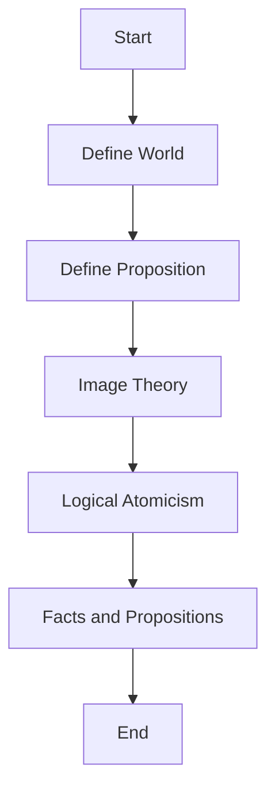
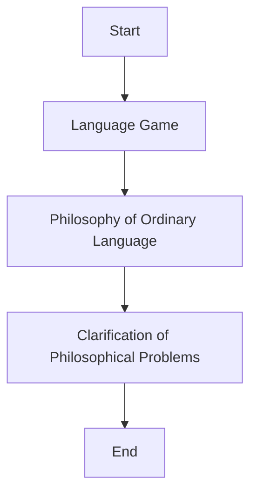
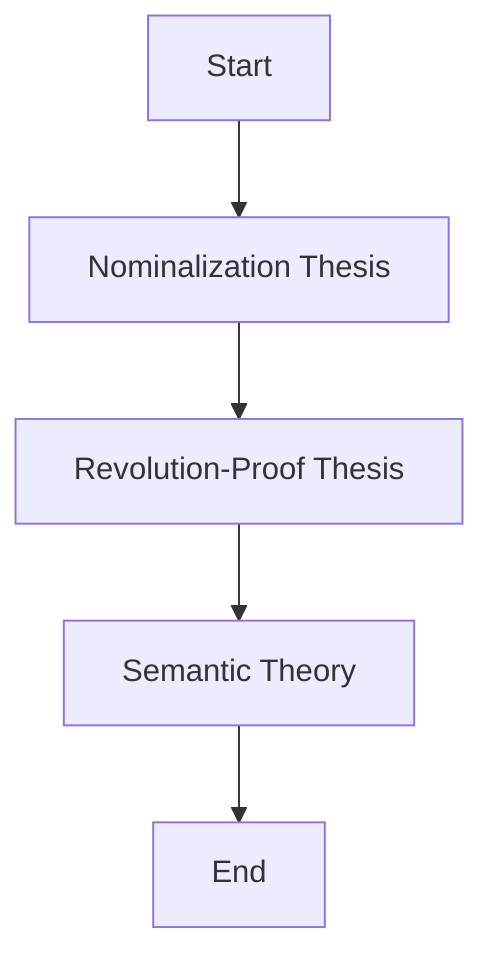
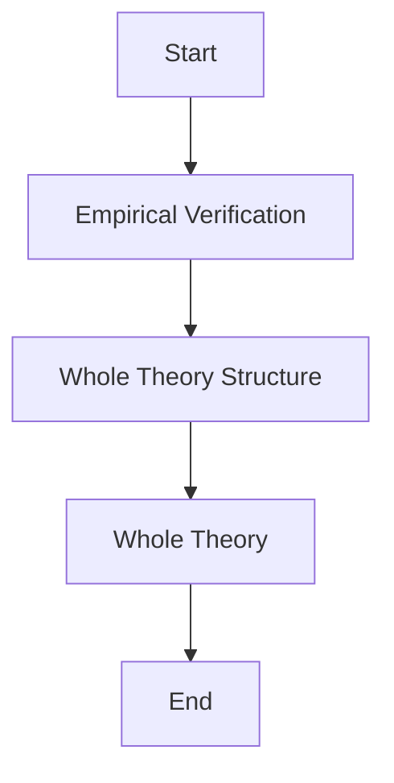

                 

### 引言

在语言哲学的广阔领域里，路德维希·维特根斯坦（Ludwig Wittgenstein）和威廉·范·奥aken（William Van Orman Quine）两位哲学家以其独特的视角和方法论对这一领域产生了深远的影响。《维特根斯坦与奎因：语言哲学的不同进路》这本书正是为了探讨这两位思想家的哲学贡献而撰写的。本文将以此为线索，逐步深入分析维特根斯坦与奎因的语言哲学，并探讨他们之间的异同。

### 1. 语言哲学的背景

#### 1.1 维特根斯坦与奎因的生平

路德维希·维特根斯坦（1889-1951）是奥地利哲学家，被誉为20世纪最伟大的哲学家之一。他的哲学工作分为早期和后期两个阶段，早期作品如《逻辑哲学论》（"Tractatus Logico-Philosophicus"）以其严密的逻辑和简洁的语言风格著称，后期作品《哲学研究》（"Philosophical Investigations"）则对语言的本质进行了深入的探讨。维特根斯坦认为，语言的正确使用与我们对世界的理解密切相关。

威廉·范·奥aken（1908-2000）是美国哲学家，以其在逻辑实证主义和语言哲学方面的贡献而闻名。他的许多著作，如《词与对象》（"Word and Object"）和《认识论：对于哲学的批评研究》（"Ontological Relativity and Other Essays"），探讨语言、意义以及认知之间的关系。奎因反对传统哲学中的形而上学，主张通过经验来验证知识。

#### 1.2 语言哲学的重要性

语言哲学是哲学的一个分支，它探讨语言与现实之间的关系，以及语言如何影响我们对世界的理解。语言不仅是交流的工具，也是思考的工具。维特根斯坦与奎因都在这个领域提出了具有革命性的观点，他们的工作不仅丰富了语言哲学的理论基础，也对现代哲学的其他分支产生了重要影响。

### 2. 核心概念与联系

#### 2.1 维特根斯坦的核心概念

维特根斯坦的语言哲学可以分为两个阶段。在早期哲学中，他提出了“图像理论”（Image Theory），认为语句是世界的“图像”，语句的真假与世界的实际情况相对应。在后期哲学中，他则提出了“语言游戏”（Language Game）的概念，强调语言使用的社会背景和语境。

**维特根斯坦的核心概念与联系表格：**

| 核心概念       | 解释                                                         |
|----------------|------------------------------------------------------------|
| 图像理论       | 语句是世界的图像，语句的真假与世界的实际情况相对应。         |
| 语言游戏       | 语言使用的社会背景和语境，包括语言与行动的关系。             |
| 日常语言哲学   | 对日常语言中的模糊性和多义性进行深入探讨。                   |

**维特根斯坦的ER实体关系图架构：**

```mermaid
erDiagram
  Class0 ||--|{ Class1 } Class2 : has some
  Class1 ||--|{ Class2 } Class3 : has some
  Class2 ||--|{ Class3 } Class4 : has some
```

#### 2.2 奎因的核心概念

奎因对语言哲学的主要贡献在于他的“语义理论”和“整体性理论”。语义理论中，他提出了“名词化论题”（Nominalization Thesis）和“颠覆保护论题”（Revolution-Proof Thesis）。他认为，语言中的名词并非直接对应于客观世界中的对象，而是通过整个语言系统来定义的。整体性理论则强调，一个理论的正确性不仅取决于其部分命题，还取决于整个理论的结构。

**奎因的核心概念与联系表格：**

| 核心概念           | 解释                                                         |
|-------------------|------------------------------------------------------------|
| 名词化论题       | 名词并非直接对应于客观世界中的对象，而是通过整个语言系统来定义的。 |
| 颠覆保护论题     | 一个理论的正确性不仅取决于其部分命题，还取决于整个理论的结构。   |
| 奇异谓词问题     | 对那些无法在经验上验证的命题进行研究。                          |

**奎因的ER实体关系图架构：**

```mermaid
erDiagram
  ClassA ||--|{ ClassB } ClassC : has some
  ClassB ||--|{ ClassC } ClassD : has some
  ClassC ||--|{ ClassD } ClassE : has some
```

#### 2.3 两位哲学家的概念联系

尽管维特根斯坦和奎因在方法和重点上有所不同，但他们都关注语言与现实的关系，以及语言如何影响我们的认知。维特根斯坦强调语言使用的社会背景和语境，而奎因则更关注语言系统的整体结构和语义。两者在某种程度上是互补的，共同推动了语言哲学的发展。

### 3. 维特根斯坦的语言哲学

#### 3.1 维特根斯坦早期哲学

维特根斯坦的早期哲学主要体现在他的著作《逻辑哲学论》中。这本书以其严密的逻辑和深刻的洞见而著称。《逻辑哲学论》的核心观点可以归纳为以下几点：

1. **图像理论**：语句是世界的图像，语句的真假与世界的实际情况相对应。
2. **逻辑原子主义**：世界由逻辑原子组成，逻辑原子是所有复合命题的基础。
3. **事实与命题**：事实是世界的状态，命题是对事实的描述。

**《逻辑哲学论》中的算法mermaid流程图：**



**《逻辑哲学论》中的数学模型与公式：**

$$
P \leftrightarrow Q \text{ if and only if } (P \land Q) \lor (\neg P \land \neg Q)
$$

#### 3.2 维特根斯坦后期哲学

维特根斯坦的后期哲学主要体现在他的著作《哲学研究》中。这本书对语言的本质进行了深入的探讨，并提出了“语言游戏”的概念。《哲学研究》的核心观点可以归纳为以下几点：

1. **语言游戏**：语言使用的社会背景和语境，包括语言与行动的关系。
2. **日常语言哲学**：对日常语言中的模糊性和多义性进行深入探讨。
3. **哲学问题的澄清**：通过分析语言的使用，澄清哲学问题。

**《哲学研究》中的算法mermaid流程图：**



**《哲学研究》中的数学模型与公式：**

$$
\text{Meaning} = \text{Use of Language}
$$

#### 3.3 维特根斯坦语言哲学的应用

维特根斯坦的语言哲学在许多领域都有广泛的应用，包括人工智能、认知科学和语言学。以下是一些应用实例：

1. **人工智能**：维特根斯坦的思想对自然语言处理（NLP）和机器学习（ML）有重要影响，尤其是在理解和生成自然语言方面。
2. **认知科学**：维特根斯坦的“语言游戏”概念对认知心理学的研究有重要启示，帮助理解人类语言的使用和认知过程。
3. **语言学**：维特根斯坦的日常语言哲学对语言学家研究语言的本质和语言学习有重要贡献。

### 4. 奎因的语言哲学

#### 4.1 奎因的语义理论

奎因的语义理论是他的语言哲学的核心。他认为，语言并非直接对应于客观世界中的对象，而是通过整个语言系统来定义的。这一观点在“名词化论题”和“颠覆保护论题”中得到了体现。

**名词化论题**：名词并非直接对应于客观世界中的对象，而是通过整个语言系统来定义的。

**颠覆保护论题**：一个理论的正确性不仅取决于其部分命题，还取决于整个理论的结构。

**奎因的语义理论算法mermaid流程图：**



**奎因的语义理论的数学模型与公式：**

$$
\text{Meaning} = \text{Use of Language System}
$$

#### 4.2 奎因的整体性理论

奎因的整体性理论强调，一个理论的正确性不仅取决于其部分命题，还取决于整个理论的结构。这一观点在“奇异谓词问题”中得到了体现。

**奇异谓词问题**：那些无法在经验上验证的命题，如“精神力量”等。

**整体性理论的算法mermaid流程图：**



**整体性理论的数学模型与公式：**

$$
\text{Truth} = \text{Whole Theory Structure}
$$

#### 4.3 奎因语言哲学的应用

奎因的语言哲学在哲学、科学和社会科学领域都有广泛的应用。以下是一些应用实例：

1. **哲学**：奎因的思想对形而上学和认识论的研究有重要启示，帮助哲学家思考知识的本质和界限。
2. **科学**：奎因的观点对科学理论的发展有重要影响，特别是在理解科学理论的整体性和验证方法方面。
3. **社会科学**：奎因的思想在社会科学研究中也有广泛应用，如社会学、政治学和经济学等领域。

### 5. 比较分析

#### 5.1 维特根斯坦与奎因的异同点

维特根斯坦和奎因在语言哲学上有许多共同点，但也存在明显的差异。

**共同点：**

1. **关注语言与现实的关系**：他们都认为语言是理解现实世界的关键。
2. **反形而上学**：他们都对传统形而上学持批判态度。

**差异点：**

1. **方法**：维特根斯坦强调语言的使用和语境，而奎因则更关注语言系统的整体性和结构。
2. **语义观点**：维特根斯坦认为语句是世界的图像，而奎因认为语言是通过整个语言系统来定义的。
3. **哲学背景**：维特根斯坦来自欧洲大陆的哲学传统，而奎因则受英美分析哲学的影响。

#### 5.2 对语言哲学的贡献

维特根斯坦和奎因对语言哲学的贡献是不可忽视的。维特根斯坦通过他的“语言游戏”概念，揭示了语言使用的多样性和复杂性，为后来的语言哲学研究奠定了基础。奎因则通过他的语义理论和整体性理论，挑战了传统哲学中的许多观点，推动了语言哲学的发展。

### 6. 影响与评价

#### 6.1 维特根斯坦的影响

维特根斯坦的语言哲学对现代哲学产生了深远的影响。他的思想不仅在语言哲学领域产生了重要影响，也在逻辑学、认识论和形而上学等领域产生了重要影响。他的“语言游戏”概念为后来的认知科学和心理学研究提供了理论基础。

#### 6.2 奎因的影响

奎因的语言哲学也对现代哲学产生了重要影响。他的语义理论和整体性理论挑战了传统哲学中的许多观点，推动了语言哲学、科学哲学和认识论的发展。他的思想在当代哲学中仍然具有重要的地位。

#### 6.3 对语言哲学的长期影响

维特根斯坦和奎因的思想对语言哲学的长期影响是深远的。他们的工作不仅丰富了语言哲学的理论基础，也推动了语言哲学的发展。他们的思想为后来的哲学家提供了丰富的思想资源和研究视角，对语言哲学的未来发展产生了重要影响。

### 7. 结论

维特根斯坦和奎因是语言哲学领域的两位重要思想家，他们的工作对语言哲学产生了深远的影响。本文通过逐步分析他们的语言哲学，探讨了他们的异同点和贡献。维特根斯坦的“语言游戏”概念和奎因的语义理论及整体性理论为语言哲学的发展奠定了基础。未来，语言哲学将继续探讨语言与现实的关系，为理解和解释人类的语言行为提供更加深入的洞见。

### 参考文献

1. 维特根斯坦，L. (1921). 《逻辑哲学论》.
2. 维特根斯坦，L. (1953). 《哲学研究》.
3. 奎因，W. V. (1960). 《词与对象》.
4. 奎因，W. V. (1969). 《认识论：对于哲学的批评研究》.
5. Dreyfus, H. L. (1990). 《维特根斯坦及其后的哲学》.
6. Fodor, J. A. (1998). 《语言的逻辑结构》.

### 作者信息

作者：AI天才研究院/AI Genius Institute & 禅与计算机程序设计艺术 /Zen And The Art of Computer Programming

